# 🗺️ Development Roadmap

Baseerah is being developed with a **walking-skeleton-first approach** - prove the engineering
harness end-to-end with a hello-world quad before any real capability lands:

```mermaid
%%{init: {'theme':'base', 'themeVariables': { 'primaryColor':'#0173B2', 'primaryTextColor':'#000', 'primaryBorderColor':'#000', 'lineColor':'#029E73', 'secondaryColor':'#DE8F05', 'tertiaryColor':'#CC78BC', 'clusterBkg':'#f5f5f5', 'clusterBorder':'#000', 'edgeLabelBackground':'#fff'}}}%%
graph TB
    Start([Start]) --> Phase1

    Phase1["<b>Phase 1</b><br/>Hello-World Quad<br/><i>baseerah-be/fe</i><br/><i>(Current Phase)</i>"]
    Phase1 --> P1Output["✅ Repository Infrastructure<br/>✅ AI Agents & Governance<br/>✅ baseerah-be health/hello API<br/>✅ baseerah-fe landing page"]
    P1Output --> Decision1{Harness<br/>Proven?}
    Decision1 -- Yes --> Phase2

    Phase2["<b>Phase 2</b><br/>Assistant Core<br/><i>Chat + Memory</i>"]
    Phase2 --> P2Output["🔲 LLM integration<br/>🔲 Conversation memory<br/>🔲 Assistant UI"]
    P2Output --> Decision2{Assistant<br/>Useful?}
    Decision2 -- Yes --> Phase3

    Phase3["<b>Phase 3</b><br/>Content Building<br/><i>Notes + Drafts</i>"]
    Phase3 --> P3Output["🔲 Note capture<br/>🔲 Draft generation<br/>🔲 Persistence layer"]
    P3Output --> Decision3{Content<br/>Flow Works?}
    Decision3 -- Yes --> Phase4

    Phase4["<b>Phase 4</b><br/>Posting & Scheduling<br/><i>Publish Helper</i>"]
    Phase4 --> P4Output["🔲 Scheduling<br/>🔲 Multi-platform posting<br/>🔲 Personal workflow engine"]

    P4Output --> End([Operating Layer Complete])

    style Phase1 fill:#0173B2,stroke:#000,stroke-width:2px,color:#fff
    style Phase2 fill:#029E73,stroke:#000,stroke-width:2px,color:#fff
    style Phase3 fill:#DE8F05,stroke:#000,stroke-width:2px,color:#000
    style Phase4 fill:#CC78BC,stroke:#000,stroke-width:2px,color:#000
    style Start fill:#f5f5f5,stroke:#000,stroke-width:2px
    style End fill:#f5f5f5,stroke:#000,stroke-width:2px

    classDef outputStyle fill:#ECE133,stroke:#000,stroke-width:1px,color:#000
    class P1Output,P2Output,P3Output,P4Output outputStyle
```

## 🚀 Phase 1: Hello-World Quad — Current Phase

**Current Phase** - Prove the engineering harness (specs, backend, frontend, CI, agents) end-to-end
with the smallest possible surface, deliberately deferring every product feature.

**Repository Infrastructure:**

- 🛠️ **Development Tooling & Processes** - Volta, formatting, git hooks, CI/CD pipelines
- 📚 **Documentation Framework** - Diátaxis structure, markdown standards
- 🤖 **AI Agents & Automation** - Specialized agents for content creation, validation, and fixing
- 📋 **Governance Structure** - Conventions, principles, development practices, inherited from the
  [Open Sharia Enterprise ecosystem](./repo-governance/vision/open-sharia-enterprise.md)
- 📝 **Planning Systems** - Project planning workflows, delivery tracking

**Product Deliverables:**

- 🔧 `baseerah-be` - Stateless F#/Giraffe REST API backend (port 19320): `GET /api/v1/health`,
  `GET /api/v1/hello`, a 404 handler
- ⚛️ `baseerah-fe` - Next.js 16 landing page (port 19310) rendering the greeting
- 🧪 `baseerah-be-e2e`, `baseerah-fe-e2e` - Playwright E2E suites against the local Docker stack
- 🦏 **rhino-cli** ([`apps/rhino-cli/`](./apps/rhino-cli/)) - fork of the OSE ecosystem's Rust CLI for
  repository management

**Explicitly Out of Scope This Phase:**

- No capture, notes, LLM calls, prompt plumbing, AI SDK dependency, scheduling, or posting — the apps
  are hello world and are expected to be rewritten
- No persistence — no database, no in-memory store; the greeting is a constant
- No write endpoints — all routes are `GET`
- No authentication or multi-user concept
- No deploy provisioning — CI caller workflows ship wired but dormant; the first real deploy belongs
  to its own plan

**Strategic Value:**

- Deployment pipeline validation with a low-risk stateless service
- Prove the CI/CD, spec, and agent-fleet harness before any real capability is built on top of it

## 🤖 Phase 2: Assistant Core (Planned)

**Scope:** TBD based on Phase 1 learnings

Builds a real AI assistant on the Phase 1 harness: LLM integration, conversation memory, and an
assistant-facing UI. This is the first phase where `baseerah-be` gains actual behavior beyond a
constant greeting.

## 📝 Phase 3: Content Building (Planned)

**Scope:** TBD based on Phase 2 learnings

Adds the content-builder half of the operating layer: note capture, draft generation, and the
persistence layer Phase 1 deliberately deferred.

## 📤 Phase 4: Posting & Scheduling (Planned)

**Scope:** TBD based on Phase 3 learnings

Closes the loop with the posting helper and personal workflow engine: scheduling, multi-platform
posting, and the workflow automation that ties assistant, content, and posting together.

## 💭 Why This Approach?

- 🧪 **Prove the Harness First** - A stateless hello-world quad de-risks the CI/CD, spec, and
  agent-fleet plumbing before any real feature is built on top of it
- 🔄 **Learn and Iterate** - Each phase's learnings inform the next; scope for Phases 2-4 stays `TBD`
  until the prior phase is done
- 🏗️ **Foundation First** - Phase 1 establishes repository governance and the engineering harness
  before building product capability
- ⚖️ **Proven Foundation** - Each phase proves the architecture works before adding complexity
- 🌳 **Ecosystem Inheritance** - Baseerah inherits its governance, development practices, and AI agent
  patterns from the [Open Sharia Enterprise ecosystem](./repo-governance/vision/open-sharia-enterprise.md)
  rather than reinventing them
