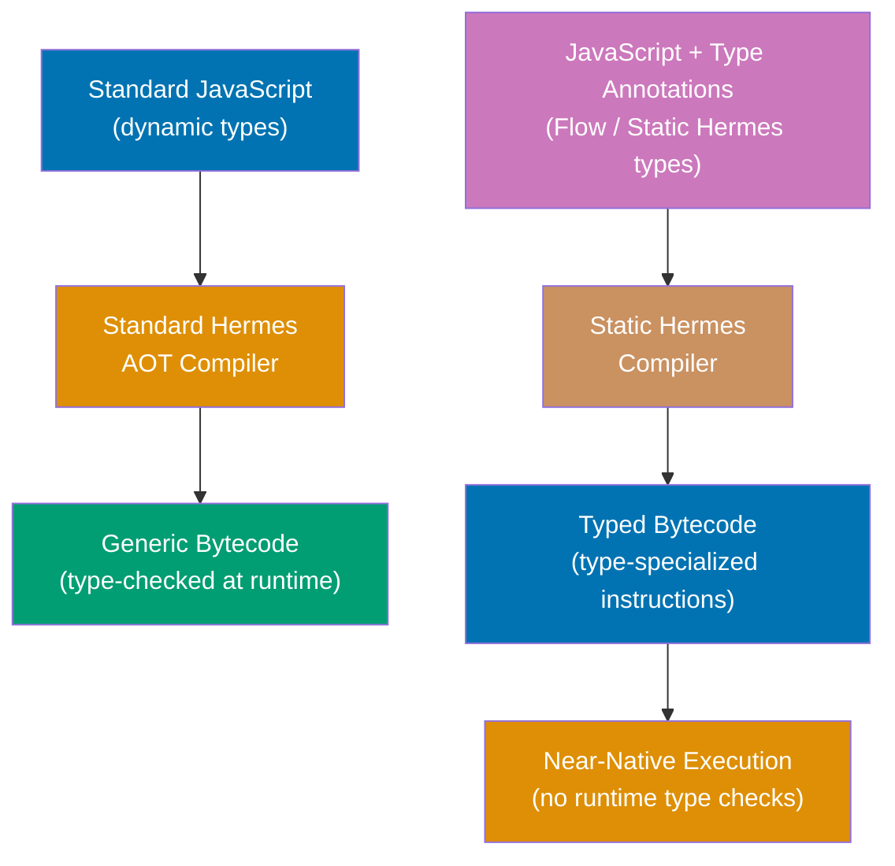
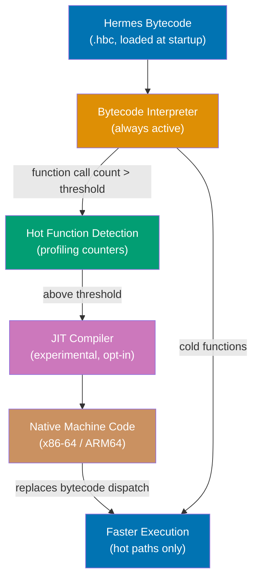
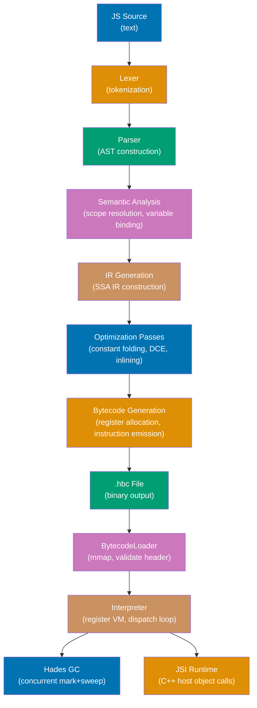
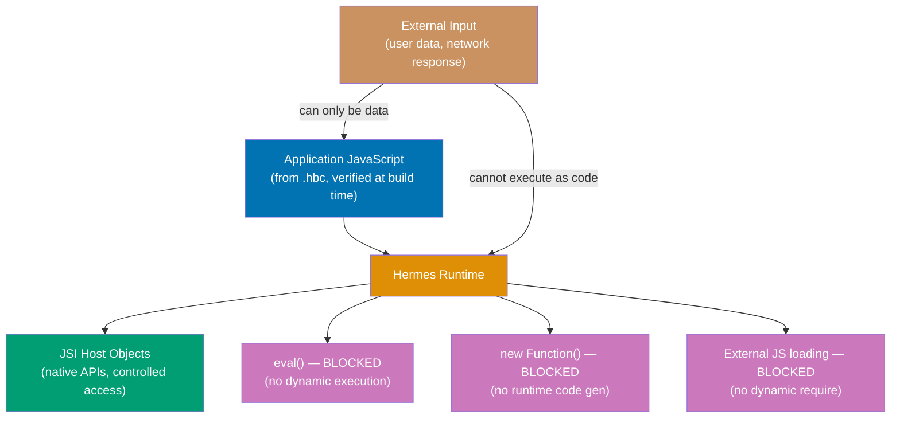

These 11 sections cover Hermes at the engine level — internals, build customization, security
boundaries, embedding Hermes outside React Native, and the trajectory of the project through
2026 and beyond. The intermediate sections explained how Hermes's components work; these
sections explain the architecture behind those components and how to manipulate them directly.

## Section 1: Static Hermes

Static Hermes is an ongoing research and development effort within Meta to extend Hermes
with optional static typing for JavaScript. It is not a separate engine — it is a new
compilation mode for Hermes in which the compiler can use type annotations to generate
significantly more efficient bytecode. As of mid-2026, Static Hermes is experimental,
available in the Hermes repository but not yet shipped as a stable React Native feature.



Standard JavaScript is dynamically typed: every operation must check the types of its
operands at runtime. When you write `a + b`, the engine must check whether `a` and `b` are
numbers, strings, or objects before choosing the correct `+` semantics. These runtime checks
are the primary source of overhead in JavaScript execution compared to statically typed
languages like C++ or Rust. JIT compilers (like V8's Turbofan) speculatively eliminate
these checks by observing types at runtime and recompiling hot paths with type-specialized
code. This is the JIT's core value proposition.

Static Hermes takes a different approach: instead of observing types at runtime and
recompiling, it requires the programmer to annotate types in the source code and uses those
annotations to emit type-specialized bytecode at compile time. An integer addition in Static
Hermes emits a direct integer add instruction rather than a generic "add two JavaScript
values" instruction that checks types first. The result is bytecode that executes faster
without a JIT, and without the warm-up time that JIT compilation requires.

The type system Static Hermes uses is a subset of Flow — the type checker Meta uses
internally. TypeScript types are not directly supported, though the project is exploring
compatibility. Static Hermes requires that types be provably correct — not just annotated
but verified. This prevents the "annotation lies" problem where TypeScript annotations are
incorrect at runtime (TypeScript's type system is unsound by design; Static Hermes's is
not).

```javascript
// Standard JavaScript (dynamic, works in current Hermes)
function add(a, b) {
  return a + b;                               // => Runtime: check types, choose + semantics
                                              // => Could be: number+number, string+string, etc.
}

// Static Hermes typed JavaScript (experimental — not in stable RN as of mid-2026)
// 'use static hermes';                       // => Opt-in pragma (syntax subject to change)

function addTyped(a: number, b: number): number {
  return a + b;                               // => Compile time: both are numbers
                                              // => Emits: integer add instruction directly
                                              // => No runtime type check needed
                                              // => Semantics: always numeric addition
}

// Performance implication (illustrative, actual speedup varies by workload)
// addTyped called 1,000,000 times:
// Standard Hermes:  ~45ms  (runtime type dispatch on each call)
// Static Hermes:    ~12ms  (direct integer add, no type check)
// JIT (V8):         ~10ms  (after warmup: similar to Static Hermes)
// => Static Hermes achieves JIT-like throughput without JIT warmup cost
```

The status of Static Hermes as of mid-2026: it compiles real programs, passes the majority
of JavaScript conformance tests for the typed subset, and shows significant throughput
improvements for computationally intensive code. Meta uses it internally for some React
Native infrastructure code. It is not yet available in a React Native release for general
use. Follow the Hermes GitHub repository and React Native blog for release announcements.

**Key Takeaway**: Static Hermes adds optional type annotations to JavaScript that let the
AOT compiler emit type-specialized bytecode with no runtime type checks, achieving JIT-like
throughput without JIT warmup — at the cost of requiring provably correct type annotations.

**Why It Matters**: Static Hermes addresses the one area where Hermes's current AOT approach
cannot compete with JIT engines: sustained compute-intensive throughput. For React Native
apps with complex data processing, physics simulations, or cryptographic operations in
JavaScript, Static Hermes has the potential to eliminate the performance gap with V8/JSC on
those specific workloads.

---

## Section 2: Experimental JIT in Hermes V1

Hermes V1 (React Native 0.84+) includes an experimental JIT compiler. This is a significant
departure from Hermes's founding philosophy — Hermes was originally designed without a JIT,
deliberately choosing predictable AOT startup performance over peak throughput. The
experimental JIT is an opt-in addition that targets hot functions after the app has started,
attempting to combine the cold-start advantage of AOT with the throughput advantage of JIT
for sustained computation.



The experimental JIT in Hermes V1 is a baseline JIT — it generates native machine code for
hot functions without the advanced speculative optimizations of mature JIT compilers like
V8's Turbofan or JSC's DFG. A baseline JIT compiles each bytecode instruction to a fixed
native code sequence, eliminating the interpreter dispatch overhead without applying
type-specialization or inlining. This is faster than interpretation for hot functions but
slower than a fully optimized JIT.

The JIT targets functions that exceed a call count threshold — the interpreter tracks how
many times each function is called, and when the count exceeds the threshold, the JIT
compiles that function. The threshold is configurable but defaults to a value that prevents
JIT compilation of initialization code (which runs once) and focuses on event handlers and
render functions (which run repeatedly).

```javascript
// Enabling the experimental JIT (React Native 0.84+)
// This is a native build flag, not a JavaScript API

// Android: android/app/src/main/jni/MainApplicationTurboModuleManagerDelegate.cpp
// Or via Gradle property:
// android/gradle.properties:
// hermesFlags=-Xjit                          // => Enables JIT in Hermes runtime
// => -Xjit: enable JIT (default off in release)
// => Subject to change — check RN 0.84 release notes

// iOS: Not yet exposed via build configuration in RN 0.84
// => JIT availability on iOS is subject to code signing and JIT entitlements
// => Apple restricts JIT to apps with the com.apple.security.cs.allow-jit entitlement
// => Standard App Store apps may not qualify — check Apple's JIT policy

// Checking if JIT is active (not yet a stable API — subject to change)
if (global.HermesInternal) {
  const props = global.HermesInternal.getRuntimeProperties?.();
  console.log("JIT active:", props?.["JIT"] === "enabled");
  // => Output: "JIT active: false"   (JIT disabled, default release build)
  // => Output: "JIT active: true"    (JIT enabled via -Xjit flag)
}

// When JIT helps (workloads with hot loops or frequently called pure functions)
function fibonacci(n) {
  // => Called thousands of times in animation loop
  if (n <= 1) return n;
  return fibonacci(n - 1) + fibonacci(n - 2); // => JIT: eliminates interpreter dispatch per call
} // => Without JIT: ~45ms for fib(35)
// => With JIT:    ~28ms for fib(35) (baseline JIT gain)
// => V8 Turbofan:  ~8ms (fully optimized JIT)

// When JIT does NOT help (one-time initialization code)
function initializeApp() {
  // => Called once at startup
  setupGlobalState(); // => JIT never compiles this — call count stays at 1
  registerComponents(); // => AOT bytecode executes it directly
  return true; // => JIT overhead: 0 (threshold not reached)
}
```

The JIT's impact on iOS is constrained by Apple's platform policy. iOS restricts JIT
compilation — generating executable code at runtime — to apps with the
`com.apple.security.cs.allow-jit` entitlement, which is not available to standard App Store
apps. This means the experimental JIT in Hermes V1 may only be usable on Android (and in
iOS development/TestFlight builds) for most React Native applications. This constraint does
not affect Hermes's standard AOT compilation, which compiles code at build time, not at
runtime.

**Key Takeaway**: The experimental JIT in Hermes V1 is a baseline JIT that eliminates
interpreter dispatch overhead for hot functions called above a threshold — it improves
throughput for sustained computation but is limited by iOS's JIT entitlement restrictions
and does not apply to one-time initialization code.

**Why It Matters**: The experimental JIT provides a path toward closing the throughput gap
between Hermes and mature JIT engines for apps with computationally intensive UI — complex
animations, physics-based interactions, real-time data visualization. Even a baseline JIT
improvement of 20–40% on hot render functions can make the difference between a smooth
animation and a janky one on mid-range hardware.

---

## Section 3: Hermes Engine Internals

Hermes is a C++ codebase of approximately 36.5% C++ with additional C, JavaScript (for
tests), and Python (for build scripts). Understanding the major internal components —
compiler pipeline, bytecode interpreter, and C++ API surface — provides the foundation for
building custom Hermes, debugging engine-level issues, and evaluating whether Hermes's
design decisions fit a non-standard use case.



The compiler pipeline (the `hermesc` binary) consists of a hand-written recursive descent
parser that produces an AST, a semantic analysis phase that resolves variable scope and
binding, an IR generation phase that produces SSA IR, several optimization passes on the
SSA IR, and a bytecode generation phase that performs register allocation and emits the
compact instruction set. The pipeline is single-pass in the sense that each module is fully
compiled before the next begins — there is no whole-program analysis across module
boundaries except for the string table, which is global.

The bytecode interpreter is a register-based virtual machine. Registers are allocated per
function call frame, not globally. The interpreter uses a computed-goto dispatch loop (on
GCC/Clang) or a switch-based dispatch loop (on MSVC) — the computed-goto version is
faster because it avoids the branch predictor overhead of a single central switch. Each
instruction is a fixed-width byte or multi-byte encoding with opcode, destination register,
and source registers explicitly specified.

```cpp
// Simplified view of Hermes interpreter structure (pseudocode from source)
// hermes/lib/VM/Interpreter.cpp

// Main execution loop (simplified)
ExecutionStatus Interpreter::interpretFunction(
    Runtime *runtime,
    Handle<Environment> environment,
    Handle<CodeBlock> codeBlock) {

  // Instruction pointer into .hbc bytecode segment
  const uint8_t *ip = codeBlock->begin();    // => Points into memory-mapped .hbc file

  // Register file for this call frame (allocated on C++ stack or heap)
  PinnedHermesValue *frameRegs = runtime->getCurrentFrame().ptr();
                                              // => Registers: JS values (tagged union)
                                              // => HermesValue: 8-byte tagged value (NaN-boxing)

  for (;;) {
    OpCode opcode = (OpCode)*ip;             // => Read next instruction opcode
    switch (opcode) {                         // => Dispatch to handler (or computed goto)

      case OpCode::Add: {
        // Decode operands from instruction stream
        uint8_t dst = ip[1];                  // => Destination register index
        uint8_t src1 = ip[2];                 // => First source register index
        uint8_t src2 = ip[3];                 // => Second source register index
        ip += 4;                              // => Advance instruction pointer

        HermesValue left = frameRegs[src1];   // => Load left operand
        HermesValue right = frameRegs[src2];  // => Load right operand

        // Type dispatch (this is where dynamic typing costs cycles)
        if (left.isNumber() && right.isNumber()) {
          frameRegs[dst] = HermesValue::encodeNumberValue(
            left.getNumber() + right.getNumber()
                                              // => Fast path: both numbers, direct add
          );
        } else {
          // Slow path: string concatenation, object coercion, etc.
          auto result = addOp(runtime, left, right);
                                              // => Calls full JS + semantics
        }
        break;
      }
      // ... 200+ other opcodes ...
    }
  }
}

// HermesValue: 8-byte NaN-boxed value (encodes type + payload in IEEE 754 NaN)
// Tags: double (number), integer (small int), bool, null, undefined, object, string
// => NaN-boxing: all NaN patterns except one canonical NaN encode non-double values
// => Allows storing any JS value in 8 bytes without a separate type field
```

The JSI runtime layer (`hermes/lib/VM/Runtime.cpp`) implements the `jsi::Runtime` C++
interface. When React Native installs JSI bindings (for TurboModules, Fabric), it calls
methods on the `jsi::Runtime` object to register host objects and functions. The Hermes
runtime holds these host objects in its heap — they are garbage-collected alongside regular
JavaScript objects, which means host objects are automatically cleaned up when JavaScript
code drops its reference.

**Key Takeaway**: Hermes's interpreter uses NaN-boxed 8-byte values for type+data encoding,
a computed-goto dispatch loop for minimal instruction overhead, and register-based call
frames — all C++ implementation details that inform what kinds of custom Hermes builds and
embedding scenarios are practical.

**Why It Matters**: Engine-level knowledge enables debugging native crashes that originate
inside Hermes — "invalid opcode", "register file overflow", "heap assertion failed" errors
are meaningless without understanding the interpreter's structure. Native module authors who
implement `jsi::HostObject` in C++ interact directly with the interpreter's value encoding
and need to understand `HermesValue` semantics.

---

## Section 4: Building Hermes from Source

Most React Native projects use precompiled Hermes binaries distributed via npm and
CocoaPods. Building Hermes from source is necessary when you need a custom build: adding
debug logging to the interpreter, applying an experimental patch before it is released,
targeting a platform that Meta does not ship precompiled binaries for, or embedding Hermes
in a non-React-Native application with custom configuration.

```bash
# Prerequisites for building Hermes from source
# macOS / Linux build environment
xcode-select --install          # macOS: Install Xcode command line tools
# => Provides: clang, clang++, make, git

brew install cmake ninja         # Build system tools
# => CMake: cross-platform build configuration
# => Ninja: fast build execution backend (preferred over Make for Hermes)

# Clone the Hermes repository
git clone https://github.com/facebook/hermes.git
# => The repository includes: compiler (hermesc), runtime (libhermes), tools

cd hermes

# Configure the build (release configuration for production use)
cmake -S . -B build_release \
  -G Ninja \
  -DCMAKE_BUILD_TYPE=Release \          # => Release: optimized, no debug symbols
  -DHERMES_ENABLE_DEBUGGER=OFF \        # => Disable debugger for smaller binary
  -DHERMES_ENABLE_INTL=ON \             # => Enable Intl API (internationalization)
  -DHERMES_BUILD_SHARED_LIBRARY=ON      # => Build libhermes.so (dynamic link)
                                        # => OFF builds libhermes.a (static link)

# Build the compiler and runtime
ninja -C build_release hermesc hermes   # => hermesc: AOT compiler binary
                                        # => hermes: interactive JS REPL
                                        # => libhermes: runtime library

# Targets available:
# hermesc          — AOT compiler (for compiling .js → .hbc)
# hermes           — Interactive Hermes REPL (for testing JS compatibility)
# hermes-repl      — Alias for hermes
# check-hermes     — Run Hermes test suite
# HermesUnitTests  — Run C++ unit tests

# Build for Android (cross-compilation)
cmake -S . -B build_android \
  -G Ninja \
  -DCMAKE_BUILD_TYPE=Release \
  -DCMAKE_TOOLCHAIN_FILE=$ANDROID_NDK/build/cmake/android.toolchain.cmake \
  -DANDROID_ABI=arm64-v8a \             # => Target: 64-bit ARM (most modern Android)
  -DANDROID_PLATFORM=android-21         # => Minimum API level: Android 5.0
```

Custom Hermes builds for React Native projects require additional steps beyond building the
binary. The React Native build system expects Hermes binaries in specific locations with
specific filenames. For Android, the custom `libhermes.so` must be placed in the NDK build
directory structure that Gradle looks for native libraries. For iOS, the custom Hermes
binary must be packaged as an XCFramework and referenced from the Podfile.

The most common valid reason for a custom build is adding `DHERMES_ENABLE_DEBUGGER=ON` for
a production-adjacent staging environment where you need debugger access but cannot use
development builds. Another reason is building with `DHERMES_ENABLE_INTL=OFF` to reduce
binary size for environments where internationalization APIs are unused. Before committing to
a custom build workflow, evaluate whether the specific need can be met with runtime
configuration instead.

**Key Takeaway**: Building Hermes from source requires CMake and Ninja, targets specific
platforms via toolchain files, and produces `hermesc` (compiler) and `libhermes`
(runtime) — a custom build workflow is justified only when precompiled binaries cannot meet
a specific configuration requirement.

**Why It Matters**: Custom Hermes builds are an escape hatch for platform-specific
requirements that Meta's standard distribution does not address. Teams embedding Hermes in
non-React-Native contexts (custom mobile frameworks, IoT devices, edge computing runtimes)
routinely build from source with custom configuration.

---

## Section 5: GC Tuning for Specific Workloads

Hades GC is designed for typical React Native workload profiles: frequent small allocations,
infrequent large allocations, low latency requirements for animation smoothness. For workloads
that differ significantly — batch data processing, large in-memory caches, or high allocation
rate data transformations — Hades provides configuration parameters that let you tune GC
behavior for the specific memory profile.

GC tuning requires profiling data. Never tune GC parameters without first measuring GC
behavior with `HermesInternal.getInstrumentedStats()` and the Hermes profiler. Incorrect
tuning can worsen performance by triggering more frequent collections, causing out-of-memory
errors from a heap that grows too slowly, or wasting memory from a heap that never shrinks.

```javascript
// Hermes GC configuration (set via JSI or engine initialization, not JS API)
// GC parameters are set at engine construction time, before JS execution begins
// In React Native, these are configured via native build flags

// Android: HERMES_GC_INIT_HEAP_SIZE (via JNI or build system)
// The following shows the parameter values and their effects conceptually:

// Key Hades GC parameters (passed to HermesRuntime::create() in C++):
// vm::RuntimeConfig::Builder()
//   .withGCConfig(
//     vm::GCConfig::Builder()
//       .withInitHeapSize(8 << 20)      // => Initial heap: 8 MB
//                                        // => Lower: less memory at startup
//                                        // => Higher: fewer early GC cycles
//       .withMaxHeapSize(512 << 20)     // => Maximum heap: 512 MB
//                                        // => Default: system memory dependent
//                                        // => Too low: OOM on large workloads
//       .withOccupancyTarget(0.5)       // => GC when heap is 50% full
//                                        // => Lower: more frequent GC, less memory used
//                                        // => Higher: less frequent GC, more memory used
//       .withShouldReleaseUnused(
//         vm::ReleaseUnused::ReleaseOnIdle)  // => Release unused pages to OS when idle
//                                             // => Reduces memory footprint between active periods
//   )

// Monitoring GC impact from JavaScript (development builds)
const monitorGC = () => {
  if (!global.HermesInternal) return;

  const sample = () => global.HermesInternal.getInstrumentedStats?.();

  const before = sample();
  const t0 = performance.now();

  // ... workload to measure ...

  const after = sample();
  const elapsed = performance.now() - t0;

  const gcCollections = after.numCollections - before.numCollections;
  // => How many GC cycles ran during workload
  const gcCPUTime = after.gcCPUTime - before.gcCPUTime;
  // => Total CPU time spent in GC (ms)
  const gcFraction = gcCPUTime / elapsed; // => Fraction of elapsed time in GC

  console.log(`GC overhead: ${(gcFraction * 100).toFixed(1)}%`);
  // => Output: "GC overhead: 3.2%"   — acceptable for most workloads
  // => Output: "GC overhead: 18.7%"  — high: consider reducing allocation rate or
  //                                  — increasing occupancy target if memory allows

  if (gcFraction > 0.1) {
    // High GC overhead — diagnose allocation pattern
    // Options:
    // 1. Reduce allocation: reuse objects instead of creating new ones
    // 2. Increase heap: raise maxHeapSize to reduce GC frequency
    // 3. Lower occupancyTarget: trade memory for fewer large GC cycles
  }
};
```

The most effective GC optimization for React Native apps is reducing allocation rate rather
than tuning GC parameters. If your component creates new arrays or objects in every render
(via `.map()`, spread operators, or object literals in JSX props), those allocations feed
directly into GC pressure. Memoization with `useMemo`, `useCallback`, and `React.memo`
reduces allocation rate by reusing previously computed values. Immutable data structure
libraries (Immer, Immutable.js) can also reduce allocations when updates are frequent.

**Key Takeaway**: Hades GC parameters can be tuned via native build configuration, but the
most effective GC optimization is reducing allocation rate in application code through
memoization and object reuse — measure with `getInstrumentedStats()` before tuning anything.

**Why It Matters**: In React Native apps with complex list rendering or frequent state
updates, GC overhead can consume 10–20% of CPU time. Reducing that overhead through either
application-level allocation reduction or GC tuning directly translates to smoother
animations and faster data processing — areas where low-end Android devices experience the
most noticeable jank.

---

## Section 6: Memory Heap Profiling

Hermes heap profiling produces snapshots of the JavaScript heap — a structured record of
every live JavaScript object, its size, its type, and its reference relationships. Heap
snapshots are the primary tool for diagnosing memory leaks: objects that remain reachable
after they should have been collected. Hermes's heap snapshot format is compatible with the
V8 heap snapshot format, which means Chrome DevTools' Memory panel can analyze Hermes
snapshots directly.

```javascript
// Capturing and analyzing Hermes heap snapshots
// Step 1: Capture snapshots around a suspected memory leak

// Helper function for capturing snapshots (development builds only)
const captureHeapSnapshot = (filename) => {
  if (!__DEV__ || !global.HermesInternal) {
    console.warn("Heap snapshots only available in DEV mode with Hermes");
    return;
  }

  // createSnapshotToFile writes a V8-compatible .heapsnapshot file
  global.HermesInternal.createSnapshotToFile?.(filename);
  // => Blocks the JS thread momentarily while snapshot is serialized
  // => Snapshot captures: all live objects, their sizes, references between them
  // => Format: JSON with nodes[], edges[], strings[] arrays (V8 heapsnapshot format)

  console.log(`Heap snapshot written to: ${filename}`);
};

// Usage pattern for leak detection:
// 1. Navigate to a screen, take snapshot "before.heapsnapshot"
// 2. Perform the action suspected of leaking (open/close modal, load data, etc.)
// 3. Navigate away and trigger GC by allocating and discarding large arrays
// 4. Take snapshot "after.heapsnapshot"
// 5. Compare in Chrome DevTools Memory panel

// Step 2: Pull snapshot from Android device
// adb pull /sdcard/before.heapsnapshot ./before.heapsnapshot
// => File is now on your development machine

// Step 3: Analyze in Chrome DevTools
// chrome://inspect → Memory → Load Heap Snapshot → open before.heapsnapshot
// => Summary view: shows object types and their total retained size
// => Comparison view: load both snapshots to see what was allocated between them
// => Containment view: tree of objects from GC roots (window, global)
// => Retainers view: for selected object, shows what keeps it alive

// Common React Native memory leak patterns
const useLeakFreeEffect = (data) => {
  useEffect(() => {
    const subscription = EventEmitter.addListener("dataUpdate", handler);
    // => EventEmitter subscription holds reference to 'handler' closure
    // => 'handler' closure may hold reference to component state/props

    return () => {
      subscription.remove(); // => REQUIRED: remove listener on unmount
      // => Without this: EventEmitter → handler → component
      // => Component cannot be GC'd even after unmount
    };
  }, [data]);
};

// Identifying retained closures in heap snapshots:
// In Chrome DevTools Memory → Comparison view after navigating away from a screen:
// Look for: @Closure objects whose "retainers" path includes EventEmitter or timer
// => These closures are preventing GC of the unmounted component
// => Fix: return cleanup functions from useEffect that remove all listeners/timers
```

The heap snapshot JSON format contains three arrays: `nodes` (objects in the heap with
type, name, id, size, edge count), `edges` (reference relationships between nodes with
type, name, to-node index), and `strings` (all string values referenced by nodes and edges).
The Chrome DevTools Memory panel reconstructs the object graph from these arrays and
presents it in the containment and retainer views.

Allocation profiling is complementary to snapshot comparison. Where snapshot comparison
shows what is alive (and what remains alive when it should not), allocation profiling shows
what is being allocated over time — useful for identifying high allocation-rate code paths
that cause frequent GC cycles even without leaks. Hermes's sampling profiler includes
allocation site information when allocation profiling mode is enabled.

**Key Takeaway**: Hermes heap snapshots use V8-compatible format, enabling Chrome DevTools
Memory panel analysis; capture before/after snapshots around suspected leaks and use the
comparison view to identify objects that remain alive after they should be collected.

**Why It Matters**: Memory leaks in React Native apps cause progressive memory growth over
long sessions — the app works fine for the first few minutes but becomes sluggish or crashes
after 30 minutes of use. Heap snapshot analysis is the only reliable way to find the
specific object or closure causing the leak, reducing diagnosis time from days of guessing
to minutes of systematic analysis.

---

## Section 7: Security Model

Hermes's security model is defined primarily by what it forbids: dynamic code generation,
execution of externally sourced code, and unrestricted native API access. These prohibitions
are not arbitrary limitations — they are architectural decisions that make Hermes
significantly more resistant to JavaScript-level security vulnerabilities than general-
purpose engines.



The prohibition on `eval()` and `new Function()` is the most significant security property
of Hermes. In a standard JavaScript engine, `eval(userInput)` executes arbitrary JavaScript
code with the same privileges as the application. If user input or network data reaches an
`eval()` call, the attacker can execute arbitrary JavaScript in the application's context —
reading secrets, making native API calls, or exfiltrating data. Hermes makes this attack
category impossible by removing `eval()` and `new Function()` entirely. There is no
injection of untrusted code into the Hermes runtime.

The AOT compilation model provides a secondary security benefit: all executable JavaScript
code must be present in the app binary at build time. Code that was not in the binary when
the app was signed cannot execute. This is analogous to iOS's code signing requirements for
native code — Hermes extends the "only run signed code" invariant to the JavaScript layer.

```javascript
// Security analysis: validating Hermes's eval prohibition
// This code runs without error in JSC, throws in Hermes

// ❌ BLOCKED in Hermes (runtime error)
try {
  eval("console.log('injected code')"); // => ReferenceError: Property 'eval' doesn't exist
  // => Error thrown immediately — no execution
} catch (error) {
  console.log("eval blocked:", error.message);
  // => "eval blocked: Property 'eval' doesn't exist"
}

// ❌ BLOCKED: Dynamic module loading from network (not a Hermes-specific feature)
// React Native's module system only loads bundled modules — this is a bundler constraint
// Additional protection: Hermes cannot execute unbundled JS strings

// ✅ SAFE: All dynamic behavior must be data-driven, not code-driven
const sanitizeUserInput = (input) => {
  // Process user input as data only
  return input
    .replace(/[<>]/g, "") // => Strip HTML (data transformation)
    .substring(0, 1000); // => Truncate (data validation)
  // => No eval, no code generation — user input cannot become executable code
};

// ✅ SAFE: Dynamic behavior via lookup tables (the Hermes-compatible pattern)
const commandHandlers = {
  // => Static dispatch table (in bundle, AOT compiled)
  READ: handleRead, // => All handlers present at build time
  WRITE: handleWrite, // => No runtime code generation
  DELETE: handleDelete,
};

const executeCommand = (cmd, args) => {
  const handler = commandHandlers[cmd]; // => Lookup (data-driven, not eval-driven)
  if (!handler) {
    throw new Error(`Unknown command: ${cmd}`); // => Unknown commands rejected explicitly
  }
  return handler(args); // => Execute pre-defined handler
};

// Security surface that remains:
// 1. JSI native modules: JS code can call C++ APIs — audit which APIs are exposed
// 2. React Native bridge (legacy): serialized JSON crossing thread boundary
//    => Validate types on native side; don't trust JS-provided type information
// 3. Third-party libraries: review library JSI modules for unintended API exposure
```

The JSI layer introduces a different security consideration: native APIs exposed via JSI
host objects are accessible to any JavaScript code running in the engine. If a native module
provides file system access, all JavaScript in the app (including third-party libraries) can
call it. Auditing JSI module API exposure is an important security review step for apps with
elevated privilege requirements.

**Key Takeaway**: Hermes's permanent prohibition of `eval()` and `new Function()` makes
JavaScript code injection attacks impossible — all executable code must be present in the
signed app binary at build time, extending iOS's native code signing invariant to the
JavaScript layer.

**Why It Matters**: Mobile apps increasingly handle sensitive data: financial transactions,
health records, authentication credentials. A JavaScript code injection vulnerability in a
general-purpose engine could expose all of this data. Hermes's architectural prohibition on
dynamic code execution eliminates this attack surface at the engine level, providing a
security guarantee that no runtime input validation can match.

---

## Section 8: Hermes in Non-React-Native Contexts

Hermes is designed as an embeddable JavaScript engine — its C++ API is clean enough to use
outside of React Native. Meta uses Hermes internally for non-RN contexts. External teams
have embedded Hermes in IoT devices, edge computing runtimes, desktop application scripting
layers, and custom mobile frameworks. The primary interface for embedding Hermes is the JSI
C++ API, which provides a runtime-agnostic abstraction over the engine.

Embedding Hermes means linking `libhermes` (or `libhermes.a` for static linking) into your
C++ application, creating a `HermesRuntime` instance, and interacting with it through the
`jsi::Runtime` interface. The embedding code is responsible for providing any platform APIs
you want to expose to JavaScript (file I/O, network, sensors) as JSI host objects.

```cpp
// Minimal Hermes embedding example (C++)
// main.cpp

#include <hermes/hermes.h>       // => Hermes engine header
#include <jsi/jsi.h>             // => JSI interface header

using namespace facebook;

int main() {
  // Create Hermes runtime with default configuration
  auto runtime = hermes::makeHermesRuntime();
  // => runtime: unique_ptr<jsi::Runtime>
  // => Hermes is now ready to execute JavaScript

  // Expose a custom native API as a JSI host function
  auto printFunction = jsi::Function::createFromHostFunction(
    *runtime,
    jsi::PropNameID::forAscii(*runtime, "print"),  // => JS property name
    1,                                              // => Argument count
    [](jsi::Runtime &rt, const jsi::Value &,
       const jsi::Value *args, size_t count) -> jsi::Value {
      if (count > 0 && args[0].isString()) {
        std::cout << args[0].getString(rt).utf8(rt) << "\n";
                                              // => C++ stdout from JS print() call
      }
      return jsi::Value::undefined();         // => Return undefined to JavaScript
    }
  );

  // Register the print function as a global
  runtime->global().setProperty(*runtime, "print", printFunction);
  // => JavaScript can now call: print("hello from Hermes")

  // Compile and execute JavaScript
  // Option 1: Execute source text (adds parse+compile time — defeats AOT benefit)
  auto result = runtime->evaluateJavaScript(
    std::make_shared<jsi::StringBuffer>("print('Hello from Hermes')"),
    "main.js"                                // => Source URL (for stack traces)
  );
  // => Output: Hello from Hermes

  // Option 2: Execute precompiled bytecode (preferred for performance)
  // Load .hbc file compiled by hermesc:
  // auto bytecodeBuffer = loadFileAsBuffer("script.hbc");
  // runtime->evaluateJavaScript(bytecodeBuffer, "script.hbc");
  // => Loads and executes precompiled bytecode — no parse/compile overhead

  return 0;
}

// Build command (linking against prebuilt libhermes):
// clang++ main.cpp -o hermes_app \
//   -I/path/to/hermes/include \
//   -L/path/to/hermes/build/lib \
//   -lhermes \
//   -std=c++17
```

Non-React-Native Hermes embedding has several practical constraints. The engine has no
built-in event loop, timers (`setTimeout`), or network APIs — these are provided by React
Native's native infrastructure in the RN case. An embedded Hermes host must implement any
APIs it wants to expose. This is actually an advantage for security-sensitive contexts:
the embedding application has complete control over what JavaScript can access.

For IoT and edge computing use cases, Hermes's small binary size and low memory footprint
make it a viable alternative to V8 (which is substantially larger) or to interpreters like
QuickJS (which lacks Hermes's AOT compilation model). The AOT compilation model is
particularly valuable for resource-constrained devices where compilation overhead is
especially costly.

**Key Takeaway**: Hermes embeds as a C++ library via the `jsi::Runtime` interface —
`makeHermesRuntime()` creates the runtime, host functions and objects expose native APIs,
and precompiled `.hbc` bytecode can be executed directly for maximum startup efficiency.

**Why It Matters**: Hermes's embeddability makes it useful beyond React Native for any
context requiring a lightweight, secure, AOT-compiled JavaScript runtime — IoT device
scripting, edge computing function execution, desktop application macros, or custom mobile
framework scripting layers where V8's size and complexity are impractical.

---

## Section 9: Bytecode Analysis and Manipulation

Hermes ships a set of command-line tools for inspecting, disassembling, and analyzing
compiled `.hbc` bytecode files. These tools are essential for debugging bytecode-level
issues (unexpected instruction sequences, function deduplication behavior, string table
contents) and for verifying that the compiler is producing the expected output for
performance-critical code paths.

```bash
# Hermes bytecode tools (available in hermes-tools npm package or built from source)
npm install -g hermes-engine           # => Installs hermesc + hermes-tools

# Disassemble a .hbc file to human-readable bytecode listing
hermes-dasm index.android.bundle       # => Disassembles to stdout
# => Output format:
# => Function<anonymous>(1 params, 3 registers)
# =>   LoadConstString r0, "Hello"     # => Load string literal from string table
# =>   Call1         r1, r0, r0        # => Call function (1 arg)
# =>   Ret           r1                # => Return value

# Alternatively, use the hermes binary directly in development
hermes --dump-bytecode index.android.bundle
# => Dumps bytecode in annotated format with source locations (if debug info present)

# Inspect .hbc file structure
# The hbcdump tool (in hermes/tools/hbcdump) shows file-level structure:
# ./hbcdump index.android.bundle
# => File header: version=84, magic=0xc61cbc54, functionCount=2847
# => String table: 12453 entries, 184KB
# => Bytecode segments: total 3.2MB across 2847 functions
# => Debug info: 892KB (strip with --strip-debug for production)
```

```javascript
// JavaScript-level bytecode analysis (Metro integration)
// Metro can output a source-to-bytecode mapping for debugging

// metro.config.js — enable bytecode output for analysis
const config = {
  serializer: {
    customSerializer: async (entryPoint, preModules, graph, options) => {
      const bundle = await require("metro/src/lib/bundleToString")(graph, options);
      // => bundle.code: JavaScript bundle (before hermesc)
      // => Pipe through hermesc manually to get .hbc:
      // => echo bundle.code | hermesc --emit-binary -out output.hbc -

      return bundle;
    },
  },
};

// Identifying function deduplication in bytecode
// hermesc deduplicates functions with identical bytecode bodies
// Run hermesc with --dump-bytecode and grep for duplicate function signatures:
// hermesc --emit-binary --dump-bytecode input.js -out output.hbc 2>&1 | \
//   grep "Deduplication"
// => Deduplication: merged function 'logError' with identical body at offset 0x2a4

// Inspecting string table efficiency
// Count string table size vs. total bundle size to gauge deduplication benefit:
// ./hbcdump output.hbc --show-string-table | wc -l   # => String count
// ls -l output.hbc                                   # => Total file size
// => If string table is >20% of file: high repetition, good deduplication ROI

// Source map inspection for stack trace validation
// node -e "const sm = require('source-map');
//   const consumer = new sm.SourceMapConsumer(
//     require('fs').readFileSync('output.hbc.map', 'utf-8')
//   );
//   console.log(consumer.originalPositionFor({ line: 1, column: 12345 }));"
// => { source: 'src/screens/HomeScreen.tsx', line: 47, column: 12, name: 'handlePress' }
// => Validates source map is correctly mapping bytecode positions to source
```

Bytecode disassembly is particularly useful for verifying that optimization passes behaved
as expected. If you have a constant expression that should be folded at compile time but the
disassembly shows runtime instructions, the optimization pass is not triggering for that
expression pattern. Similarly, if function inlining should have eliminated a call but the
disassembly shows a `Call` instruction, the inlining threshold was not met.

The string table inspection helps validate that string deduplication is working effectively.
In a well-optimized bundle, common strings like property names, error messages, and action
types should appear in the string table once each regardless of how many times they appear
in the source. If the string table is unexpectedly large, it may indicate that dynamically
constructed strings (via template literals with variable content) are preventing effective
deduplication.

**Key Takeaway**: Hermes bytecode tools (`hermes-dasm`, `hbcdump`) disassemble `.hbc` files
to human-readable instruction listings, enabling verification of compiler optimizations,
string table efficiency, and source map correctness — essential for engine-level debugging.

**Why It Matters**: When a production app crashes with a bytecode-level error or exhibits
unexpected performance characteristics in a specific code path, bytecode disassembly is the
only way to see what the compiler actually produced — bridging the gap between JavaScript
source and native execution behavior.

---

## Section 10: Performance Optimization Patterns

AOT compilation changes which performance optimization patterns are effective in Hermes
compared to JIT-compiled engines. Patterns that exist to help JIT compilers (monomorphic
property access, type-stable functions) are less relevant in Hermes because the JIT is
absent. Patterns that benefit AOT-compiled code (reducing runtime allocations, minimizing
dynamic property lookups, deferring module evaluation) are the primary optimization levers.

```javascript
// Pattern 1: inlineRequires — defer module evaluation to first use
// Configure in metro.config.js (see Section 10 in beginner):
// inlineRequires: true
// Effect: require() calls are rewritten to lazy-load modules on first access

// Before inlineRequires (eager — all modules load at startup):
import { format } from "date-fns"; // => Executes date-fns module code at startup
// => Even if format() is only called on user action

// After inlineRequires (Metro rewrites to lazy):
// (Conceptually — Metro does this transformation, not you)
// const _format = () => require('date-fns').format; // => Loads only when _format() called
// => date-fns module code executes on first call, not at startup

// Pattern 2: Bundle splitting — reduce bytecode loaded at startup
// React Native 0.72+ supports "lazy bundling" for specific entry points
// Each split bundle is a separate .hbc file loaded on demand

// metro.config.js for split bundles (experimental, React Native 0.72+)
const config = {
  serializer: {
    getModulesRunBeforeMainModule: () => [
      require.resolve("./src/startup/critical-only.js"), // => Only this module in initial bundle
    ],
  },
};
// => Initial .hbc contains only critical startup code (~200KB)
// => Feature bundles loaded lazily when user navigates to specific screens

// Pattern 3: Object pool pattern — reduce allocation rate for frequent objects
// High allocation rate → frequent GC → potential jank
// Object pool reuses fixed set of objects instead of allocating/GC-ing

class TouchEventPool {
  constructor(size = 50) {
    this._pool = Array.from({ length: size }, () => ({
      x: 0,
      y: 0,
      timestamp: 0,
      target: null,
    })); // => Pre-allocate pool at startup
    this._index = 0; // => Round-robin index
  }

  acquire() {
    const obj = this._pool[this._index % this._pool.length];
    // => Reuse existing object (no allocation)
    this._index++;
    return obj;
  }
  // => On gesture-heavy screens: reduces allocations from O(touches/frame)
  //    to O(1) at startup — significantly reduces GC pressure during scrolling

  release(obj) {
    // Reset fields — not strictly needed (acquire overwrites), but aids GC
    obj.x = 0;
    obj.y = 0;
    obj.timestamp = 0;
    obj.target = null;
    // => Clears references so GC can collect targets
  }
}

// Pattern 4: Memoize expensive pure computations
// React.memo, useMemo, useCallback reduce re-renders AND allocation rate
import { useMemo, useCallback } from "react";

function ExpensiveList({ items, filter }) {
  // Without memoization: new array created on every render
  // filteredItems = items.filter(filter)    // => New array allocated each render

  // With memoization: reuses previous result if inputs unchanged
  const filteredItems = useMemo(
    () => items.filter(filter), // => Only recomputes when items or filter change
    [items, filter], // => Dependency array: memoization keys
  );
  // => Fewer allocations → less GC pressure → smoother animations during list scrolling

  // Stable function references reduce child re-renders
  const handlePress = useCallback((item) => {
    selectItem(item.id); // => selectItem captured in closure
  }, []); // => Empty deps: stable reference forever
  // => Without useCallback: new function object each render → children re-render unnecessarily
}

// Pattern 5: AOT-aware string handling
// String concatenation in loops creates intermediate strings → GC pressure
// Use array join for building strings from many pieces

// ❌ Slow in Hermes (and all engines): intermediate strings in loop
let result = "";
for (let i = 0; i < 10000; i++) {
  result += items[i].name + ", "; // => Creates new string object each iteration
  // => 10,000 intermediate strings → GC pressure
}

// ✅ Faster: single join operation
const result2 = items.map((item) => item.name).join(", ");
// => map: one allocation per item (unavoidable)
// => join: one final string allocation
// => Total: N+1 allocations vs 2N in loop
```

Bundle splitting deserves special attention in Hermes AOT context. The entire `.hbc` bundle
is memory-mapped at startup, but only the code that actually executes during initialization
is read from disk. Modules that are not required during startup are never loaded into CPU
cache. However, the bytecode for all modules must fit in virtual address space (mmap range).
For very large apps (50 MB+ bundle), splitting into multiple `.hbc` files reduces the
startup mmap footprint, improving cold-start times even beyond what `inlineRequires` alone
provides.

**Key Takeaway**: AOT-effective patterns in Hermes prioritize reducing runtime allocation
rate (object pooling, memoization, `useMemo`), deferring module evaluation (`inlineRequires`),
and splitting bundles — not monomorphism or type stability hints that aid JIT compilers.

**Why It Matters**: Applying JIT-era optimization advice to a Hermes AOT context produces
incorrect intuitions — developers tune for the JIT's hot path compilation behavior, which
does not exist. AOT-correct optimization focuses on allocation rate and startup surface area,
which are the actual performance bottlenecks in production Hermes apps.

---

## Section 11: Future Roadmap

Hermes's development roadmap as of mid-2026 has three main tracks: Static Hermes
productionization, experimental JIT maturity, and long-term JavaScript specification
compliance. Understanding the roadmap helps you plan which current limitations will resolve
on their own versus which require workarounds or architectural changes today.

```mermaid
%% Color Palette: Blue #0173B2, Orange #DE8F05, Teal #029E73, Purple #CC78BC, Brown #CA9161
gantt
    title Hermes Development Roadmap (approximate, subject to change)
    dateFormat  YYYY-Q
    axisFormat  %Y-Q%q

    section Static Hermes
    Core type system         :done, 2025-Q1, 2025-Q4
    Flow type integration    :active, 2026-Q1, 2026-Q4
    React Native integration :2027-Q1, 2027-Q4

    section Experimental JIT
    Baseline JIT (V1)        :done, 2026-Q1, 2026-Q1
    JIT optimization passes  :active, 2026-Q2, 2027-Q1
    iOS JIT entitlement      :2027-Q1, 2027-Q2

    section JS Compatibility
    ES2022 (V1)              :done, 2026-Q1, 2026-Q1
    ES2023 / ES2024          :active, 2026-Q2, 2027-Q1
    TC39 stage-3 proposals   :2027-Q1, 2028-Q1
```

**Static Hermes productionization**: The current goal is to make Static Hermes's typed
subset production-ready for Meta's internal React Native infrastructure first, then to
release it as an opt-in compilation mode for external React Native apps. The main obstacles
are: finalizing the type system semantics (particularly around intersection types and
generics), providing clear migration guidance for TypeScript users (the current type system
is Flow-based), and integrating with Metro's build pipeline so existing projects can opt in
incrementally.

**Experimental JIT maturity**: The baseline JIT in V1 is the foundation for a more capable
JIT. Future iterations plan to add type-specialization based on runtime observations (for
functions not covered by Static Hermes types) and better inlining heuristics. The iOS JIT
entitlement constraint remains the significant blocker for iOS deployment — Meta is in
discussions with Apple regarding App Store policy for React Native apps using JIT, but no
public timeline exists.

**JavaScript specification compliance**: Hermes V1 covers ES2022. The team tracks TC39 and
adds support for stage-4 (ratified) proposals as they stabilize. Notable proposals being
tracked for future Hermes versions include: `Array.fromAsync` (stage 3 as of 2026),
`Temporal` API (stage 3), explicit resource management (`using` keyword, stage 3), and
iterator helper methods (stage 3). Temporal is particularly relevant for React Native apps
dealing with timezone-aware date handling that currently requires heavyweight libraries.

```javascript
// Feature detection pattern for forward compatibility
// As Hermes adds new JS features in future versions, use feature detection
// rather than version checks to enable features progressively

// Checking for upcoming features safely
const hasTemporalAPI = typeof Temporal !== "undefined";
// => Temporal: stage-3 proposal (not yet in Hermes V1)
// => When Hermes adds it: this check returns true
// => App can use native Temporal without polyfill

const hasArrayFromAsync = typeof Array.fromAsync === "function";
// => Array.fromAsync: stage-3, not yet in V1
// => Eliminates need for manual async array building

// Conditional polyfill loading (ready for when native support arrives)
if (!hasTemporalAPI) {
  // Load polyfill only for older Hermes versions
  const { Temporal: TemporalPolyfill } = require("@js-temporal/polyfill");
  global.Temporal = TemporalPolyfill; // => Install polyfill as global
  // => When Hermes ships native Temporal:
  // => Remove this block — native is always faster
}

// Checking current Hermes version for version-gated features
const hermesVersion = global.HermesInternal?.getRuntimeProperties?.()?.["OSS Release Version"]; // => e.g., "0.12.0" for Hermes V1 in RN 0.84

const [major, minor, patch] = (hermesVersion ?? "0.0.0").split(".").map(Number); // => [0, 12, 0]

if (major > 0 || minor >= 12) {
  // Hermes V1+ features available
  console.log("Hermes V1+ detected — native async, Map, Set, ES classes available");
  // => Safe to remove regenerator-runtime
  // => Safe to remove Map/Set polyfills
}
```

The Hermes project's governance model means that React Native version coupling will continue
— Hermes will not release independently of React Native for the foreseeable future. New
JavaScript features land in Hermes alongside React Native releases. If a specific TC39
proposal is critical for your app, you have two options: use a polyfill until Hermes ships
native support, or maintain a custom Hermes build that cherry-picks the feature from the
Hermes main branch before the official release.

**Key Takeaway**: Hermes's roadmap prioritizes Static Hermes productionization for near-
native throughput on typed code, JIT maturity for hot-function optimization, and ES2023+
compliance — the React Native version coupling means feature access aligns with React Native
upgrade cadence, not independent Hermes releases.

**Why It Matters**: Understanding the roadmap prevents premature investment in workarounds
for limitations that Hermes is actively resolving. Knowing that Static Hermes is on the
horizon means it is premature to invest heavily in manual JavaScript-to-WASM compilation
as a Hermes throughput workaround — the Static Hermes approach will provide comparable
gains with far less migration effort when it reaches stable release.
