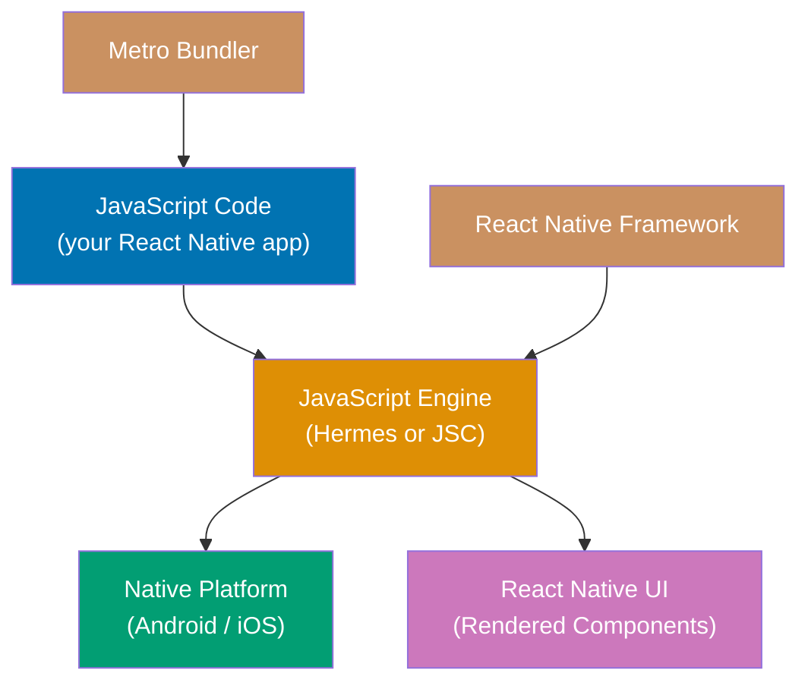
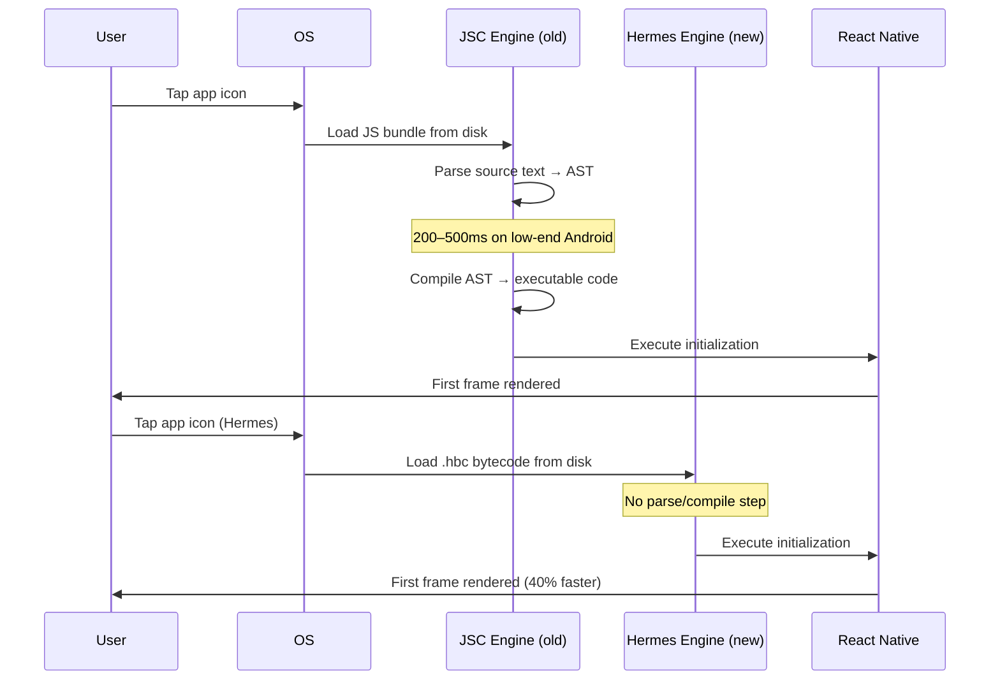
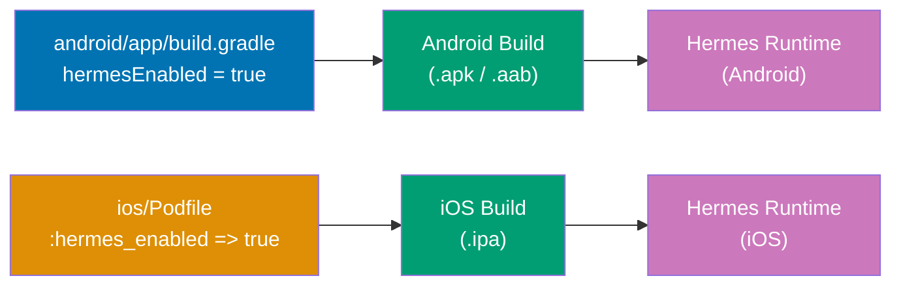
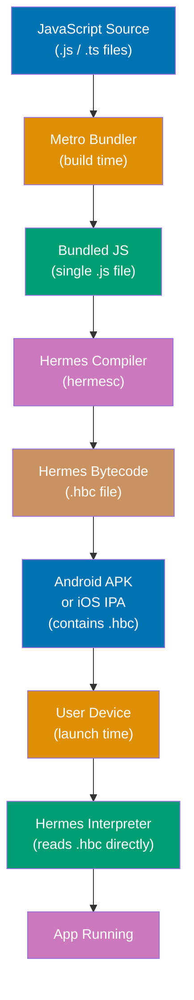
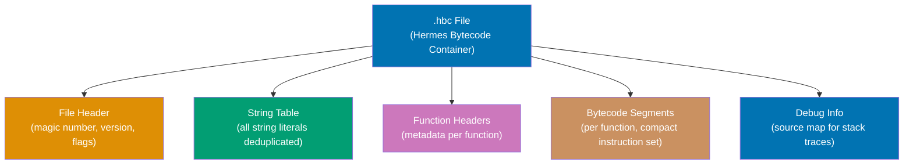
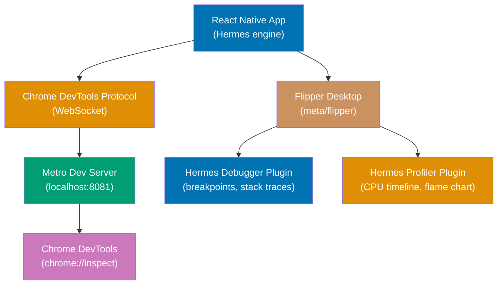
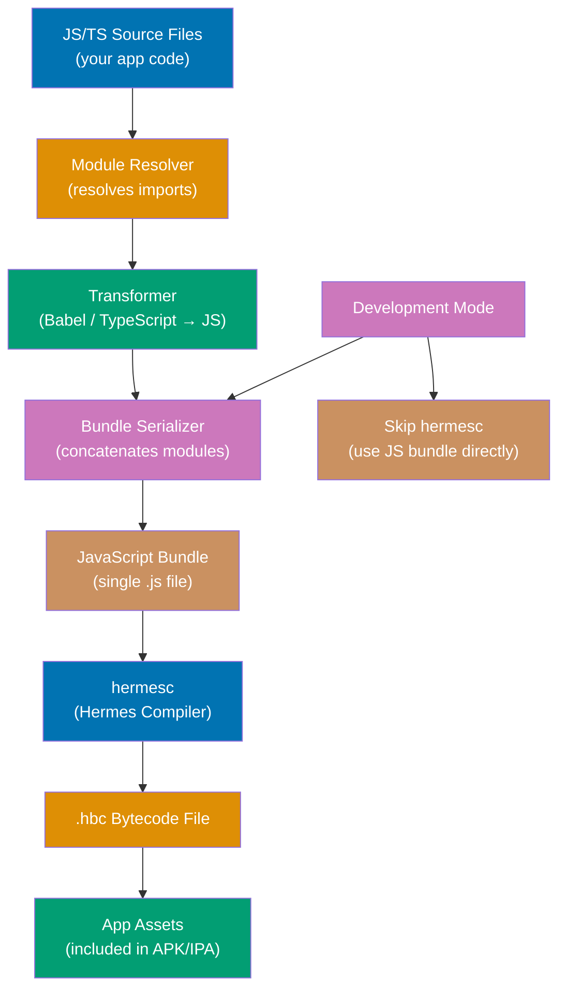

Hermes is Meta's open-source JavaScript engine built exclusively for React Native. These 16
sections build your understanding from first principles — what a JavaScript engine is, why
Hermes exists, how it compiles code before your app ships, and how to verify it is running
correctly in your project.

## Section 1: What is Hermes?

Hermes is a JavaScript engine — the software component that reads, compiles, and executes
JavaScript code — built specifically for React Native mobile applications. It is not a
browser engine, not a Node.js runtime, and not a general-purpose JavaScript environment. Its
only job is to make React Native apps start faster and use less memory on Android and iOS
devices.



A JavaScript engine sits between your JavaScript source code and the device's native
processor. React Native ships with one engine active at a time. Before Hermes, React Native
used JavaScriptCore (JSC), the engine that powers Safari and WebKit. JSC was designed for
browsers, where pages reload frequently, caches are warm, and startup time matters less than
peak throughput for long-running pages.

Hermes was created by Meta (Facebook) and released in 2019. It is open-source under the MIT
license at [github.com/facebook/hermes](https://github.com/facebook/hermes). The project is
written primarily in C++ and targets the ARM processors found in Android and iOS devices.
Hermes V1 became the default engine in React Native 0.84 (February 2026), replacing JSC as
the out-of-the-box choice for both Android and iOS.

The critical difference between Hermes and JSC is _when_ JavaScript compilation happens.
JSC compiles JavaScript at runtime — when the app launches, JSC must parse and compile your
bundle before executing it. Hermes compiles JavaScript at build time, during your CI/CD
pipeline or local build. When the user taps the app icon, Hermes loads pre-compiled binary
bytecode with no parsing or compilation step required.

**Key Takeaway**: Hermes is a JavaScript engine purpose-built for React Native that compiles
JavaScript to bytecode before the app ships, eliminating startup compilation cost.

**Why It Matters**: The choice of JavaScript engine directly affects the first impression
users have of your app. Slow cold-starts cause users to abandon apps within seconds of
launching them. App store ratings frequently mention launch speed. Hermes's AOT compilation
strategy reduces cold-start time by approximately 40% compared to JSC, which translates to
measurably better user retention metrics.

---

## Section 2: The Cold-Start Problem

A cold start is the process of launching an app when no cached process state exists — after
a device reboot, after the OS kills the app to reclaim memory, or after a first-ever
install. Cold starts are the most expensive app launches and the ones users notice most.
Hermes exists specifically to reduce cold-start time in React Native apps.



When React Native uses JSC, a cold start follows this sequence: the operating system loads
the JavaScript bundle (a large `.js` or `.jsbundle` file) from disk, JSC parses the entire
source text into an Abstract Syntax Tree, JSC compiles the AST into executable code
(optionally with JIT optimizations), and only then does React Native initialization code
run. On a production app, the JavaScript bundle can exceed 5 MB. Parsing 5 MB of source
text takes hundreds of milliseconds on low-end Android hardware.

JIT (Just-In-Time) compilation makes this worse, not better, on cold starts. JIT
compilers observe code running, identify "hot" paths, and recompile those paths into
optimized native code. This optimization is valuable for long-running workloads — browsers
running interactive applications for minutes or hours. For a mobile app cold start that runs
initialization code once and then transitions to event-driven updates, JIT's observation
phase is pure overhead. The optimization pays off only if the same code path runs hundreds
of times, which rarely happens in app initialization.

Hermes solves this by moving compilation out of the runtime path entirely. The Metro
bundler, which processes your JavaScript before it goes into the APK or IPA, also compiles
it to Hermes Bytecode (`.hbc` format). The resulting bytecode is a compact binary
representation that the Hermes interpreter reads directly without any parsing or AST
construction. The CPU cycles that JSC spends on parsing and compilation are simply not
spent.

The cold-start improvement is not uniform across all devices. On high-end flagship phones
with fast CPUs and NVMe storage, the difference is smaller — perhaps 20–30%. On the
low-end Android devices that represent the majority of the global mobile market (slower
CPUs, slower storage, less RAM), the improvement is larger and more consequential.

**Key Takeaway**: Cold-start slowness in React Native comes from runtime JavaScript parsing
and JIT compilation overhead, which Hermes eliminates by compiling to bytecode at build
time.

**Why It Matters**: Google's research shows that 53% of mobile users abandon apps that take
longer than 3 seconds to load. For React Native apps targeting global markets where low-end
Android devices dominate, eliminating 200–500ms of startup compilation time can be the
difference between a user who stays and one who uninstalls.

---

## Section 3: Hermes vs. JavaScriptCore

JavaScriptCore (JSC) is the JavaScript engine in WebKit, the browser engine underlying
Safari. React Native originally used JSC because it was already available on iOS devices as
a system framework and could be bundled for Android. JSC is a mature, high-throughput engine
optimized for browser workloads. Hermes is a younger engine optimized specifically for
React Native mobile apps. The two engines make fundamentally different trade-offs.

| Property                     | Hermes             | JavaScriptCore      |
| ---------------------------- | ------------------ | ------------------- |
| **Compilation strategy**     | AOT (build time)   | JIT (runtime)       |
| **Cold-start time**          | ~40% faster        | Baseline            |
| **Memory footprint**         | Lower              | Higher              |
| **`eval()` support**         | No                 | Yes                 |
| **`new Function()` support** | No                 | Yes                 |
| **ES2022 native**            | Yes (V1+)          | Partial             |
| **Garbage collector**        | Hades (concurrent) | Conservative GC     |
| **New Architecture (JSI)**   | Full support       | Legacy Bridge only  |
| **Designed for mobile**      | Yes                | No (browser origin) |
| **Source map debugging**     | Yes (with Flipper) | Yes                 |

JSC's JIT compiler is genuinely faster for long-running, computationally intensive
workloads. If you were running a JavaScript-powered game loop or a complex data
transformation that executes the same code path thousands of times, JSC's JIT-optimized
native code would outperform Hermes's interpreted bytecode. This trade-off is deliberate:
Hermes optimizes for the actual workload profile of React Native apps, which is
initialization-heavy and event-driven, not compute-intensive loop-heavy.

The lack of `eval()` and `new Function()` in Hermes is a deliberate security and
architecture decision, not a missing feature. Dynamic code generation — creating executable
JavaScript from strings at runtime — makes static analysis of the app impossible, opens
security vulnerabilities in mobile contexts, and prevents the AOT compilation model from
working (you cannot compile code that does not exist at build time). Libraries that use
`eval()` for dynamic template evaluation or `new Function()` for computed property access
will not work in Hermes. This is a real migration concern for projects using libraries that
rely on dynamic code generation.

The Hades garbage collector (covered in depth at the intermediate level) gives Hermes
another advantage over JSC's conservative GC. JSC's garbage collector can pause the
JavaScript thread for tens of milliseconds while it traverses the heap — visible as UI
"jank" in animations. Hades runs concurrently with the JavaScript thread, avoiding
stop-the-world pauses.

**Key Takeaway**: Hermes and JSC make opposite trade-offs: Hermes wins on cold-start time,
memory, and concurrent GC; JSC wins on peak throughput for compute-intensive long-running
workloads — a profile that almost never describes React Native app behavior.

**Why It Matters**: Understanding the trade-off prevents misapplied benchmarks. Developers
sometimes benchmark Hermes vs. JSC on compute-intensive microbenchmarks and conclude JSC is
faster, which is true for that specific workload. For the real workload — mobile app
initialization, event-driven UI updates, and frequent component re-renders — Hermes's
characteristics dominate.

---

## Section 4: Enabling Hermes in React Native

Hermes is the default engine in React Native 0.70+ on Android and the default on both
platforms in React Native 0.84+. Enabling or verifying Hermes requires changes to two build
configuration files: `android/app/build.gradle` and `ios/Podfile`. Understanding these
configuration points tells you exactly how the engine is selected.



**Android configuration** (`android/app/build.gradle`):

```groovy
// android/app/build.gradle
android {
    defaultConfig {
        // ...
    }
}

// Hermes is enabled by setting this flag in the project-level properties
// For React Native 0.70+, this is the canonical location:
project.ext.react = [
    hermesEnabled: true,   // => Tells the React Native Gradle plugin to:
                           // => 1. Include the Hermes shared library (.so) in the APK
                           // => 2. Configure Metro to compile JS → .hbc bytecode
                           // => Setting false reverts to JSC (not recommended)
]
```

**iOS configuration** (`ios/Podfile`):

```ruby
# ios/Podfile
use_react_native!(
  :path => config[:reactNativePath],
  :hermes_enabled => true,   # => Selects the hermes-engine CocoaPod
                              # => In RN 0.84+, ships as precompiled xcframework
                              # => Setting false uses JavaScriptCore instead
  :fabric_enabled => flags[:fabric_enabled],
)
```

**Verifying after configuration changes** (run in terminal):

```bash
# Android: rebuild after changing build.gradle
cd android && ./gradlew clean && cd ..  # => Clears cached build artifacts
npx react-native run-android             # => Rebuilds with Hermes enabled

# iOS: re-install pods after changing Podfile
cd ios && pod install && cd ..           # => Re-resolves hermes-engine CocoaPod
npx react-native run-ios                 # => Rebuilds with Hermes enabled
```

For React Native 0.70 and later, Hermes is already enabled by default on Android. For React
Native 0.84 and later, Hermes is the default on both platforms. If your project was created
before 0.70 or explicitly disabled Hermes, you need to set the flags above. After making
changes, a full clean build is required — incremental builds will not pick up the engine
change.

A common mistake is changing the flag and then running a hot-reload or development server
restart, expecting the engine to switch. The engine is embedded in the native binary (APK
or IPA). Changing the engine requires a full native rebuild.

**Key Takeaway**: Hermes is enabled via build configuration flags (`hermesEnabled` on
Android, `:hermes_enabled` in Podfile on iOS), and a clean rebuild of the native binary is
required after any change.

**Why It Matters**: Knowing the exact configuration location prevents hours of debugging
when migrating a project to Hermes or diagnosing why the engine verification check (covered
in Section 16) reports the wrong engine. Incorrect configuration silently falls back to JSC,
losing all performance benefits without any error message.

---

## Section 5: AOT Compilation Basics

AOT stands for Ahead-of-Time. In the context of Hermes, AOT compilation means that
JavaScript source code is compiled to bytecode during the app build process — before the app
ever ships to a user's device. This is the central architectural decision that separates
Hermes from JSC and browser-oriented engines. Understanding AOT compilation explains why
Hermes achieves faster cold-starts and why it cannot support `eval()`.



In a traditional JIT-compiled engine, the pipeline has two distinct phases: a build phase
where JavaScript source is bundled, and a runtime phase where the bundled JavaScript is
parsed and compiled. Hermes extends the build phase to include compilation, shifting work
from the user's device to your build machine or CI runner.

The Hermes compiler is a program called `hermesc`. In a React Native project, you do not
invoke `hermesc` directly — Metro does it for you during the release build process. Metro
first bundles all your JavaScript modules into a single file, then passes that bundle to
`hermesc`, which produces a `.hbc` file (Hermes Bytecode Container). The `.hbc` file is
what gets packaged into the APK or IPA instead of the JavaScript source text.

AOT compilation enables several optimizations that are impossible at runtime. The compiler
can perform whole-program analysis — it sees every function and every string in the entire
bundle simultaneously. It can deduplicate identical functions, pack all string literals into
a shared string table (eliminating duplicate string storage), and perform dead-code
elimination on code paths that are never reached. These whole-program optimizations reduce
the bytecode size below the original JavaScript bundle size in many cases.

The trade-off is that AOT compilation locks in the code at build time. Dynamic code
generation — creating new JavaScript code from strings and executing it — is architecturally
incompatible with AOT compilation. If `eval()` were allowed, Hermes would need a JIT
compiler or interpreter for the dynamically generated code anyway, negating the AOT
benefits. Hermes's designers made a clean choice: pure AOT, no dynamic code generation.

**Key Takeaway**: AOT compilation moves JavaScript parsing and compilation from launch time
to build time, enabling Hermes to load pre-compiled binary bytecode without any parse
overhead when the user launches the app.

**Why It Matters**: AOT compilation's build-time cost is paid once on your CI server, while
the runtime benefit is paid on every user's cold start. For an app with one million daily
active users, eliminating 300ms of startup compilation translates to 300,000 CPU-seconds
saved per day on users' devices — energy efficiency, battery life, and perceived
responsiveness all improve.

---

## Section 6: The Bytecode Format

Hermes Bytecode (`.hbc`) is the binary format that Hermes produces at build time and
consumes at runtime. It is not JavaScript source code, not WASM, and not native machine
code — it is a compact, structured binary format that the Hermes interpreter executes
directly. Understanding what `.hbc` files contain helps you reason about binary size,
debugging, and the role of source maps.



A `.hbc` file contains several sections. The file header identifies the file as Hermes
bytecode and records the Hermes version that created it. The string table stores every
string literal in the entire bundle exactly once — if your code uses the string `"error"`
in 200 different places, the string table stores it once and each reference holds an index
into the table. This deduplication is a significant space saving in large bundles where
error messages, property names, and event names repeat extensively.

The function headers section contains metadata for every function in the bundle: the
function's name (for stack traces), parameter count, register count, and a pointer to its
bytecode in the bytecode segment. The bytecode segment contains the actual instructions for
each function in Hermes's compact instruction set. Hermes uses a register-based bytecode
format (as opposed to stack-based), which typically results in fewer instructions per
operation.

Debug information is stored separately in the `.hbc` file and can be stripped from
production builds. For release builds, source maps are the mechanism for mapping bytecode
positions back to JavaScript source lines — essential for reading stack traces from
production crash reports. The source map is generated during `hermesc` compilation and must
be uploaded to your crash reporting service alongside the release build.

In practice, `.hbc` files are larger than the equivalent gzip-compressed JavaScript bundle
but smaller than uncompressed JavaScript. The size relationship depends on the bundle
contents — projects with many repeated strings and small functions benefit most from string
table deduplication and function-level bytecode compaction.

```javascript
// Build output comparison (approximate, varies by project)
// JavaScript bundle (uncompressed):   5.2 MB
// JavaScript bundle (gzip):           1.8 MB
// Hermes bytecode (.hbc):             4.1 MB   // => Larger than gzip JS, but no parse cost
// Hermes bytecode (gzip in APK):      1.6 MB   // => Slightly smaller than gzip JS

// The .hbc file is what goes into the APK/IPA assets folder:
// android/app/src/main/assets/index.android.bundle → index.android.bundle.hbc
//                                                   // => Metro renames automatically
//                                                   // => Hermes runtime loads this file
```

**Key Takeaway**: Hermes Bytecode is a compact binary format with deduplicated string
tables and compact function bytecodes that the interpreter reads directly, trading slightly
larger uncompressed size for the elimination of all parse and compile time at launch.

**Why It Matters**: Understanding the `.hbc` format helps when debugging build pipeline
issues — if you see a crash referencing "invalid bytecode magic", the `.hbc` file in the
APK was built by a different Hermes version than the runtime. This is the version coupling
issue covered in the next section.

---

## Section 7: React Native Version Coupling

Hermes does not have an independent version numbering scheme that you choose separately from
React Native. Each React Native release bundles a specific, tested Hermes version. This
coupling is by design: the bytecode format, runtime APIs, and JSI integration all evolve
together. Using a mismatched Hermes version — bytecode compiled by one version, runtime from
another — causes immediate app crashes with "invalid bytecode" or "hermes abi version
mismatch" errors.

The coupling works in both directions. The `hermesc` compiler that Metro uses to compile
your JavaScript must match the Hermes runtime embedded in your app. React Native's
`package.json` specifies an exact Hermes version as a dependency, and the build system uses
that specific compiler. When you upgrade React Native, you automatically get the matching
Hermes version. You cannot independently upgrade Hermes to get a feature that has not been
released with a React Native version yet.

```javascript
// package.json (generated by React Native project template)
{
  "dependencies": {
    "react-native": "0.84.0"  // => Pinned React Native version
                               // => This indirectly pins Hermes version
  }
}

// To check which Hermes version your project uses:
// node_modules/react-native/package.json → look for "hermes-engine" version
// => Example: "hermes-engine": "~0.12.0" means Hermes 0.12.x

// Runtime verification (run in your app, see Section 16 for full details):
const hermesVersion = global.HermesInternal?.getRuntimeProperties?.();
// => Returns: { 'Hermes Build Target': 'HBC', 'Build': 'Release', ... }
// => The version here must match what hermesc used to compile your bundle
```

When upgrading React Native, the upgrade process handles Hermes coupling automatically
through the React Native upgrade helper. The critical mistake to avoid is manually changing
the Hermes version in `package.json` without upgrading React Native, or vice versa. If your
CI pipeline uses a cached Hermes binary from a previous build, clear the cache when
upgrading React Native to ensure the correct `hermesc` version is used for compilation.

For iOS specifically, Hermes ships as a precompiled binary (`.xcframework`) from React
Native 0.84+. This means the iOS build does not compile Hermes from source — it downloads
a pre-built binary. The binary's version must match the `hermes-engine` CocoaPod version
specified in your `Podfile.lock`. After a React Native upgrade, run `pod install` in the
`ios/` directory to download the matching Hermes binary.

**Key Takeaway**: Hermes version is determined by your React Native version — never set
independently. Mismatches between the compiler and runtime cause immediate app crashes, and
the fix is always a clean rebuild after ensuring React Native and Hermes versions are
synchronized.

**Why It Matters**: Version coupling errors are among the most common causes of post-upgrade
app crashes in React Native projects. Understanding the coupling prevents hours of debugging
crash reports that trace to a mismatch between bytecode format versions.

---

## Section 8: JavaScript Compatibility

Hermes V1 (React Native 0.84+) supports ES2022, which covers the vast majority of modern
JavaScript features. Most React Native application code works with Hermes without
modification. However, two categories of JavaScript APIs are permanently unavailable in
Hermes: dynamic code evaluation and a small set of legacy global utilities.

```javascript
// ✅ SUPPORTED: ES2022 features in Hermes V1
const arr = [1, 2, 3];
const doubled = arr.map((x) => x * 2); // => [2, 4, 6] — arrow functions
// => Array methods (map, filter, reduce, flatMap) — fully supported

async function fetchData(url) {
  // => async/await — native in Hermes V1
  const response = await fetch(url); // => No polyfill required (V1+)
  return response.json(); // => Returns Promise<any>
}

class Animal {
  // => ES classes — native in Hermes V1
  #name; // => Private class fields — supported
  constructor(name) {
    this.#name = name; // => Proper private field assignment
  }
  speak() {
    return `${this.#name} makes a sound`; // => Template literals — supported
  }
}

const map = new Map([["key", "value"]]); // => Map — native in Hermes V1
const set = new Set([1, 2, 3]); // => Set — native in Hermes V1
// => WeakMap, WeakSet also native

// ❌ NOT SUPPORTED: Dynamic code evaluation
eval("console.log('hello')"); // => ReferenceError: Property 'eval' doesn't exist
new Function("x", "return x * 2"); // => TypeError: Function is not a constructor
// => Both permanently disabled — architectural constraint, not a bug

// ❌ NOT SUPPORTED: Some legacy globals
// arguments.callee                         // => Throws in strict mode (standard ES5 behavior)
// __caller__                               // => Not available

// ✅ WORKAROUND: Dynamic behavior without eval
// Instead of: eval(`return ${expression}`)
// Use a lookup table or computed property:
const operations = {
  // => Static dispatch table — Hermes compatible
  double: (x) => x * 2, // => Functions defined at parse time
  triple: (x) => x * 3, // => All code known at build time
};
const op = "double";
operations[op](5); // => 10 — dynamic dispatch without eval
```

Libraries that depend on `eval()` or `new Function()` will cause runtime errors when used
with Hermes. Common culprits include some older template engines (Handlebars with
precompilation disabled), some CSS-in-JS libraries that generate style functions dynamically,
and some internationalization libraries that eval locale format strings. Before migrating a
project to Hermes, audit your dependencies for `eval` usage with a bundler scan or by
searching `node_modules`.

For React Native projects that relied on Babel transforms to support modern JavaScript
before Hermes V1, many of those transforms can now be removed. Features like `async/await`,
arrow functions, template literals, destructuring, spread operators, optional chaining
(`?.`), and nullish coalescing (`??`) all work natively in Hermes V1. Reducing Babel
transforms shrinks the bundled output and speeds up Metro compilation.

**Key Takeaway**: Hermes V1 supports ES2022 fully for static code, but permanently forbids
`eval()` and `new Function()` by design — libraries using dynamic code generation must be
replaced or their eval-using paths must be disabled.

**Why It Matters**: The `eval()` restriction is the single most common source of library
incompatibility when migrating to Hermes. Discovering this dependency after deployment
causes production crashes. Auditing for `eval` usage before enabling Hermes prevents this
class of incident entirely.

---

## Section 9: Hermes DevTools Integration

Debugging a React Native app running on Hermes uses the Chrome DevTools protocol over a
WebSocket connection. The tooling works through two paths: the React Native DevTools (direct
connection via Metro) and Flipper (a desktop debugging platform from Meta). Both paths
provide JavaScript debugging, but they offer different levels of access to Hermes internals.



To connect Chrome DevTools to a Hermes-powered React Native app in development mode, open
`chrome://inspect` in a Chrome browser while Metro is running and the app is open on a
device or simulator. Chrome will list the React Native app as an inspectable target. Click
"Inspect" to open a DevTools panel with JavaScript console, source viewer, breakpoints, and
the call stack.

Source maps are critical for meaningful debugging. In development mode, Metro serves source
maps automatically and Chrome DevTools resolves bytecode positions back to your original
TypeScript or JavaScript source. In release builds, source maps must be uploaded manually to
your crash reporting service. Without source maps, stack traces show bytecode instruction
offsets rather than file names and line numbers.

Flipper provides Hermes-specific tooling beyond what Chrome DevTools offers. The Hermes
Debugger plugin in Flipper supports breakpoints, variable inspection, and call stack
visualization in a more integrated way than the generic Chrome DevTools panel. The Hermes
Profiler plugin (covered in depth in Section 11) records CPU timelines and produces flame
charts for identifying performance bottlenecks.

```javascript
// Checking if DevTools are connected (development debugging utility)
if (__DEV__) {
  // => __DEV__ is true only in development builds
  const hermesProps = global.HermesInternal?.getRuntimeProperties?.(); // => Access Hermes runtime properties // => Optional chaining — safe if not Hermes

  console.log("Hermes version:", hermesProps);
  // => Output (example):
  // => { 'Hermes Build Target': 'HBC', 'Build': 'Release', 'OSS Release Version': '0.12.0' }

  // Trigger a breakpoint programmatically (DevTools must be connected)
  debugger; // => Pauses execution when DevTools attached
  // => No-op when DevTools not connected
}
```

**Key Takeaway**: Hermes supports the Chrome DevTools protocol for JavaScript debugging, and
source maps must be configured correctly to map bytecode positions back to readable source
locations — this is essential for both development debugging and production crash analysis.

**Why It Matters**: Production crashes in Hermes apps produce stack traces with bytecode
positions if source maps are missing. A correctly configured source map upload in your CI
pipeline is the difference between "crash at instruction 0x1a3b" and "crash at
`src/screens/HomeScreen.tsx:47`" — the latter can be fixed in minutes, the former may take
hours to diagnose.

---

## Section 10: Metro Bundler and Hermes

Metro is React Native's JavaScript bundler — the build tool that transforms, bundles, and
(when Hermes is enabled) compiles your JavaScript code. Metro is to React Native what
webpack is to web applications. Understanding Metro's role in the Hermes build pipeline
explains build times, caching behavior, and why certain Metro configuration options affect
app startup performance.



In development mode (`npx react-native start`), Metro serves JavaScript bundles directly
over HTTP without Hermes compilation. The app loads JavaScript source (or a fast-refresh
delta) and JSC or a non-optimized Hermes interpreter processes it. This is intentional —
development mode prioritizes fast iteration (hot module replacement, instant reloads) over
startup performance. The Hermes bytecode compilation step only runs during release builds.

In release mode (triggered by `react-native build-android --mode release` or Xcode's
Archive action), Metro generates a full JavaScript bundle and then invokes `hermesc` on it.
The `hermesc` compilation step adds to your total build time but is cached by Metro between
builds — if the JavaScript source has not changed, Metro reuses the previously compiled
`.hbc` file.

```javascript
// metro.config.js — Metro configuration for Hermes optimization
const { getDefaultConfig, mergeConfig } = require("@react-native/metro-config");

const config = {
  transformer: {
    getTransformOptions: async () => ({
      transform: {
        experimentalImportSupport: false, // => Keep false for Hermes compatibility
        inlineRequires: true, // => Defer module evaluation until first use
        // => Reduces startup cost for rarely-used modules
        // => Hermes-compatible optimization
      },
    }),
  },
};

module.exports = mergeConfig(getDefaultConfig(__dirname), config);
// => mergeConfig: safe merge that preserves React Native defaults
// => Modifying transformer options affects how Metro prepares code for hermesc
```

The `inlineRequires` transformer option is particularly valuable with Hermes. Normally,
Metro evaluates all `require()` calls at startup — even for modules only used when a user
navigates to a specific screen. With `inlineRequires: true`, Metro rewrites `require()`
calls to be lazy — the module is loaded only when its export is first accessed. This reduces
the amount of code Hermes executes during initialization, further improving cold-start time
beyond what AOT compilation alone provides.

**Key Takeaway**: Metro handles the full pipeline from TypeScript source to Hermes bytecode
during release builds, and the `inlineRequires` optimization defers module evaluation to
first use — compounding the cold-start improvement beyond AOT compilation alone.

**Why It Matters**: Metro configuration errors silently fall back to serving plain
JavaScript bundles or disable Hermes compilation, producing an app that appears to work but
runs on JSC or unoptimized bytecode. Understanding the pipeline lets you verify that release
builds are actually producing `.hbc` output and not silently degrading.

---

## Section 11: Performance Profiling Basics

Measuring Hermes's impact requires profiling tools that capture cold-start timing,
JavaScript execution duration, and frame rendering metrics. Without measurement, you cannot
confirm that Hermes is improving startup or identify which JavaScript code dominates
initialization time. React Native provides `PerformanceObserver` for in-app timing, and
Hermes exports a sampling profiler for more detailed analysis.

```javascript
// Basic cold-start timing with PerformanceObserver (works in React Native 0.71+)
import { PerformanceObserver, performance } from "react-native";

// Mark the start of JS initialization (call as early as possible in index.js)
performance.mark("js_init_start"); // => Records timestamp at this point
// => Use in index.js before any imports

// Mark when the root component renders (call in App component useEffect)
performance.mark("first_render_complete"); // => Records timestamp after first render

// Measure the duration between marks
performance.measure(
  "cold_start_js_duration", // => Name for this measurement
  "js_init_start", // => Start mark name
  "first_render_complete", // => End mark name
);
// => Creates a PerformanceMeasure entry

// Read the measurement
const observer = new PerformanceObserver((list) => {
  const entries = list.getEntries(); // => Array of PerformanceMeasure objects
  entries.forEach((entry) => {
    console.log(`${entry.name}: ${entry.duration}ms`);
    // => Output example: "cold_start_js_duration: 312ms" (with JSC)
    // => Output example: "cold_start_js_duration: 187ms" (with Hermes)
    // => ~40% reduction visible in this measurement
  });
});
observer.observe({ entryTypes: ["measure"] }); // => Listen for measure entries
```

For production monitoring, record this timing to your analytics service (Firebase
Performance, Datadog, custom backend). Aggregate the `cold_start_js_duration` metric across
device segments — the improvement Hermes provides is larger on low-end Android devices than
on flagship phones, so segmenting by device tier reveals the full impact.

The `global.HermesInternal` object provides a sampling profiler interface for identifying
which JavaScript code consumes the most CPU during startup. The profiler records a sample of
the JavaScript call stack at regular intervals (typically every 1ms) and produces a timeline
of which functions are executing. This is more useful than total duration — it tells you
which specific modules or component constructors are slow to initialize.

```javascript
// Hermes sampling profiler (development only — never ship in production)
if (__DEV__ && global.HermesInternal) {
  // Start recording
  global.HermesInternal.enableSamplingProfiler(); // => Begins stack sampling at ~1ms interval

  // ... run the code you want to profile ...

  // Stop and save
  global.HermesInternal.disableSamplingProfiler(); // => Stops sampling
  global.HermesInternal.dumpSampledTraceToFile(
    // => Writes JSON profile to device filesystem
    "/sdcard/profile.json", // => Android path; iOS uses app sandbox
  );
  // => Open profile.json in chrome://tracing or Speedscope (speedscope.app)
  // => Flame chart shows which functions ran and for how long
}
```

**Key Takeaway**: Use `performance.mark()` and `performance.measure()` for production
cold-start timing, and `HermesInternal.enableSamplingProfiler()` in development to identify
which specific initialization code to optimize.

**Why It Matters**: Without measuring cold-start time before and after enabling Hermes, you
cannot confirm the improvement or justify the migration to stakeholders. Concrete measurements
also identify whether the bottleneck after enabling Hermes has shifted from engine compilation
to slow component initialization — the next optimization target.

---

## Section 12: Binary Size Impact

Switching from JSC to Hermes changes the size of the native binary (APK on Android, IPA on
iOS) and the JavaScript bundle inside it. The size impact is not uniformly positive or
negative — it depends on which component you measure and how you measure it. Understanding
the size dynamics prevents surprises when comparing APK sizes before and after enabling
Hermes.

On Android, the APK size changes in two ways. First, the Hermes shared library
(`libhermes.so`) replaces the JSC shared library (`libjsc.so`). Hermes's library is smaller
than JSC's because JSC bundles a JIT compiler and more general-purpose runtime
infrastructure. Second, the JavaScript bundle inside the APK changes from a `.js` file to a
`.hbc` file. The `.hbc` file is larger than the gzip-compressed `.js` file but smaller than
the uncompressed `.js` file. The APK stores assets compressed, so the relevant comparison
is `.hbc` compressed vs. `.js` compressed — the bytecode typically comes out slightly
smaller or equal when compressed.

```javascript
// Checking bundle format in a release build (Android)
// adb shell — enter device shell
// find /data/app -name "*.bundle" -o -name "*.hbc" 2>/dev/null
// => With JSC:    index.android.bundle     (JavaScript text)
// => With Hermes: index.android.bundle     (actually .hbc binary, same filename)

// Verify it's bytecode, not source text:
// xxd /data/app/.../assets/index.android.bundle | head -1
// => With JSC:    0000000: 2f2a  2a0a  2a20  ...  (/* — JavaScript comment start)
// => With Hermes: 0000000: c61c  bc54  ...        (Hermes magic bytes — binary format)
// => The magic bytes 0xc61cbc54 identify Hermes bytecode format

// Size comparison utilities (run from project root)
// npx react-native bundle --platform android --dev false --entry-file index.js \
//   --bundle-output /tmp/bundle.js --assets-dest /tmp/assets
// => Produces JavaScript bundle without Hermes compilation (for comparison)

// ls -lh /tmp/bundle.js
// => -rw-r--r-- 1 user staff 5.2M  bundle.js   (uncompressed JS source)

// With Hermes enabled in release build:
// ls -lh android/app/build/intermediates/assets/release/assets/index.android.bundle
// => -rw-r--r-- 1 user staff 4.1M  index.android.bundle  (Hermes bytecode)
// => Bytecode is ~20% smaller than uncompressed JS; about equal to gzip JS
```

On iOS, React Native 0.84+ ships Hermes as a precompiled XCFramework binary. This binary
is a universal binary for device and simulator architectures. The iOS framework size is
determined by the precompiled Hermes binary, which is typically comparable to or smaller
than JSC because it does not include a JIT compiler.

The practical advice on binary size: measure your specific app's APK/IPA size before and
after enabling Hermes. Do not rely on general estimates. Use `bundletool` for Android
(measures download size, not install size) and Xcode's App Size Report for iOS. In most
production apps, Hermes produces a comparable or smaller binary than JSC, with the startup
performance improvement as a free addition.

**Key Takeaway**: Hermes bytecode is slightly larger than the equivalent gzip-compressed
JavaScript bundle but the smaller Hermes runtime library partially compensates; measure your
specific app's binary size rather than relying on general rules.

**Why It Matters**: App stores enforce size limits that affect download conversion rates —
Google Play's threshold for cellular downloads and Apple's OTA limit both gate user
acquisition. Understanding Hermes's size impact lets you confidently commit to the migration
without risking a size regression that triggers app store warnings.

---

## Section 13: Memory Usage on Mobile

Memory is a first-class constraint on mobile devices in a way that desktop development
rarely experiences. Android kills background apps aggressively when memory is low, and
low-end Android devices — the primary market for many global apps — have 2 GB or less of
RAM shared between the OS, multiple running apps, and your foreground application. Hermes's
memory footprint is meaningfully lower than JSC's, and understanding why helps you reason
about Hermes on memory-constrained devices.

Hermes uses less memory for several reasons. First, bytecode is more compact than the
in-memory representation JSC creates from JavaScript source — JSC must build an AST, create
parsed representations, and then create compiled machine code objects. Hermes starts from
compact bytecode and creates only the register-based execution frames it needs. Second,
Hermes's string table deduplication (all string literals stored once) reduces heap
allocation for strings compared to JSC, which may create duplicate string objects from
source parsing. Third, the Hades garbage collector (covered in the intermediate section)
manages heap memory more efficiently than JSC's conservative GC by running concurrently and
collecting garbage without growing the heap to absorb GC pauses.

```javascript
// Monitoring memory usage in React Native (works with both Hermes and JSC)
import { NativeModules } from "react-native";

// React Native's native memory reporting (Android only, via debug bridge)
// Not available in production — for development diagnosis only
if (__DEV__ && global.HermesInternal) {
  const memoryInfo = global.HermesInternal.getInstrumentedStats?.();
  // => Returns object with heap statistics:
  // => {
  // =>   allocatedBytes: 12582912,     // => JS heap: 12 MB allocated
  // =>   heapSize: 25165824,           // => JS heap capacity: 24 MB
  // =>   mallocSizeEstimate: 3145728,  // => Additional native allocations: 3 MB
  // =>   numCollections: 4,            // => GC has run 4 times
  // =>   gcCPUTime: 12,                // => Total GC CPU time: 12ms
  // => }
  // => Compare to JSC equivalent: typically 20-40% higher allocatedBytes

  console.log("Hermes heap stats:", memoryInfo);
}

// Production memory monitoring via Android ProfileMemory API or iOS instruments
// These are platform-specific and outside JavaScript scope
// => Use Firebase Performance or Datadog for cross-platform memory metrics
```

The memory reduction is most visible on low-end Android devices with 2 GB RAM. On these
devices, high memory usage triggers the Android low-memory killer (LMK), which terminates
background processes including your app. When users switch back to your app and it has been
killed, they experience another cold start. Hermes's lower memory footprint means the LMK
is less likely to kill your app during brief background periods, reducing the frequency of
cold starts — a compounding benefit on top of the faster cold-start time.

**Key Takeaway**: Hermes's compact bytecode representation, string table deduplication, and
concurrent Hades GC combine to produce a meaningfully lower memory footprint than JSC,
which reduces Android low-memory-killer frequency on 2 GB RAM devices.

**Why It Matters**: On devices with 2 GB RAM, the Android low-memory killer can terminate
background apps within seconds. Each LMK-triggered kill forces another cold start when the
user returns. Hermes's memory efficiency reduces this cycle, improving the experience for
the majority of users in price-sensitive markets.

---

## Section 14: iOS Precompiled Binaries

React Native 0.84 changed how Hermes is distributed for iOS builds. Previously, iOS
projects would either download Hermes source and compile it during `pod install`, or use a
precompiled `.framework` that required manual version management. Starting with React Native
0.84, Hermes ships as a precompiled XCFramework binary — a format that bundles device and
simulator slices in a single artifact — downloaded automatically by CocoaPods.

The practical effect is that `pod install` for a React Native 0.84+ project downloads a
precompiled Hermes binary instead of triggering a Hermes compilation. Hermes is a large C++
codebase — compiling it from source can take 10–20 minutes on a developer machine or CI
runner. The precompiled binary download replaces that compilation time with a network
download, which is typically much faster and more reliable.

```ruby
# ios/Podfile (React Native 0.84+ template)
require_relative '../node_modules/react-native/scripts/react_native_pods'
require_relative '../node_modules/@react-native-community/cli-platform-ios/native_modules'

platform :ios, min_ios_version_supported
prepare_react_native_project!

use_react_native!(
  :path => config[:reactNativePath],
  :hermes_enabled => true,          # => Selects hermes-engine CocoaPod
                                     # => Downloads precompiled .xcframework
                                     # => No source compilation required (RN 0.84+)
  :fabric_enabled => flags[:fabric_enabled],
  :flipper_configuration => FlipperConfiguration.disabled,
)

# After changing hermes_enabled, run:
# cd ios && pod install
# => Resolves hermes-engine version from Podfile.lock
# => Downloads precompiled xcframework from GitHub releases
# => Validates checksum against known-good binary
```

The precompiled binary model also standardizes the Hermes binary across the team — all
developers and CI runners use the identical binary artifact rather than each compiling
Hermes from source with potentially different compiler versions or flags. This eliminates a
class of "works on my machine" issues where different Hermes builds behaved differently.

After upgrading React Native in an iOS project, always run `pod install` from the `ios/`
directory to download the new Hermes binary. If `pod install` fails due to a checksum
mismatch or network error, delete `ios/Pods/` and `ios/Podfile.lock` and retry. A stale
`Podfile.lock` that pins an old Hermes version after a React Native upgrade is a common
cause of "hermes version mismatch" crashes.

```bash
# iOS Hermes version verification workflow
cd ios

# Check which Hermes version is pinned
grep hermes-engine Podfile.lock
# => hermes-engine (0.12.0):             (pinned version)
# => hermes-engine/Core (0.12.0):        (sub-spec)

# Verify downloaded binary checksum (CocoaPods validates this automatically)
pod install --repo-update
# => Updating spec repositories (fetches latest pod specs)
# => Downloading dependencies (downloads hermes-engine xcframework)
# => Verifying checksums (validates binary integrity)
# => Pod installation complete! There are N dependencies from Podfile ...
```

**Key Takeaway**: React Native 0.84+ ships Hermes as precompiled iOS binaries, replacing
minutes of local compilation with a fast binary download, and `pod install` handles version
management and checksum verification automatically.

**Why It Matters**: Eliminating Hermes source compilation from iOS builds reduces CI runner
costs and speeds up developer onboarding. Teams that ran into 20-minute `pod install` times
when compiling Hermes from source see this reduced to a 1–2 minute download, directly
improving developer experience and CI throughput.

---

## Section 15: Android vs. iOS Hermes Differences

Hermes runs on both Android and iOS, but the integration details differ between platforms
due to the fundamentally different operating system architectures, build systems, and
JavaScript-to-native communication models. Understanding platform-specific behavior helps
diagnose issues that appear only on one platform and explains why certain configurations
apply to Android but not iOS.

On Android, Hermes runs as a shared library (`libhermes.so`) linked into the React Native
application. JavaScript execution happens on a dedicated thread managed by Android's
threading model. The Hermes engine interacts with the Android Runtime (ART) for memory
pressure callbacks — when Android signals low memory, Hermes can respond by triggering a GC
cycle or releasing cached bytecode. This ART integration gives Hermes tighter coordination
with Android's memory management than JSC has.

On iOS, Hermes runs as a static framework (`Hermes.xcframework`) embedded in the iOS app
bundle. iOS's stricter sandboxing model means Hermes cannot write bytecode caches to
arbitrary filesystem locations — it must use the app's sandbox directories. The iOS thread
model (Grand Central Dispatch) interacts with Hermes's internal thread management for
concurrent GC operations.

```javascript
// Platform-specific Hermes behavior (React Native app code)
import { Platform } from "react-native";

// Checking Hermes status is identical across platforms
const isHermes = () => !!global.HermesInternal; // => true on both Android and iOS
// => Same check works everywhere

// Platform differences appear in build configuration, not JS code
if (Platform.OS === "android") {
  // Android: Hermes configured via hermesEnabled in build.gradle
  // => libhermes.so linked at compile time
  // => ART memory pressure integration active
  // => Bytecode at: assets/index.android.bundle (inside APK)
} else if (Platform.OS === "ios") {
  // iOS: Hermes configured via :hermes_enabled in Podfile
  // => Hermes.xcframework embedded in .ipa
  // => App sandbox restricts bytecode cache write paths
  // => Bytecode at: [AppBundle]/main.jsbundle (inside IPA)
}

// Feature parity: both platforms support all ES2022 features in Hermes V1
// Feature parity: both platforms support JSI and New Architecture
// Feature parity: both platforms support the Chrome DevTools protocol for debugging
```

A key platform difference is build time. Android builds Hermes into the APK during the
Gradle build, which is incremental and cached. iOS downloads a precompiled binary during
`pod install`, which is fast but requires network access. Android's Gradle build can reuse
cached Hermes compilation; iOS's binary download requires the exact binary for the pinned
version to be available on Meta's GitHub releases.

From an application JavaScript perspective, Hermes behaves identically on Android and iOS.
The same JavaScript features work, the same APIs are unavailable (`eval`, `new Function`),
and the same Chrome DevTools protocol is supported. Platform differences are entirely in the
build and integration layer, invisible to application code.

**Key Takeaway**: Hermes is functionally identical on Android and iOS from a JavaScript
perspective — the platform differences are in build system integration (Gradle vs. CocoaPods)
and native runtime interaction (ART vs. iOS sandbox), not in JavaScript feature support.

**Why It Matters**: Knowing that JavaScript behavior is identical across platforms simplifies
debugging — a Hermes-related JavaScript error on Android will reproduce on iOS. Platform
differences in build configuration explain platform-specific build failures, which are the
more common source of Hermes-related issues in CI pipelines.

---

## Section 16: Verifying Hermes Is Active

Confirming that Hermes is actually running — not JSC — is a critical step after enabling
Hermes in your project or after any React Native upgrade. Hermes exposes a runtime global
object (`global.HermesInternal`) that does not exist in JSC. A simple truthiness check on
this object is the canonical way to verify the active engine. If the check returns false in
a build where you expect Hermes, the build configuration or build cache has a problem.

```javascript
// Canonical Hermes detection check
const isHermes = () => !!global.HermesInternal;
// => global.HermesInternal is an object when Hermes is active
// => !! converts it to boolean: true when Hermes, false when JSC
// => This is the check recommended in React Native official documentation

console.log("Running on Hermes:", isHermes());
// => Output (Hermes active): Running on Hermes: true
// => Output (JSC active):    Running on Hermes: false

// Detailed Hermes version information
const hermesInfo = global.HermesInternal?.getRuntimeProperties?.();
// => Optional chaining (?.) prevents errors when running on JSC
// => Returns undefined on JSC, object on Hermes
console.log("Hermes info:", hermesInfo);
// => Output: {
// =>   'Hermes Build Target': 'HBC',     // => HBC = Hermes Bytecode (AOT compiled)
// =>   'Build': 'Release',               // => Release build (not debug)
// =>   'OSS Release Version': '0.12.0',  // => Hermes version number
// => }

// Adding Hermes verification to your app's startup logging
import { useEffect } from "react";

function AppStartupLogger() {
  useEffect(() => {
    const engine = isHermes() ? "Hermes" : "JSC"; // => Determine active engine
    const hermesVersion = global.HermesInternal?.getRuntimeProperties?.()?.["OSS Release Version"] ?? "N/A"; // => Get version if Hermes // => Fallback for JSC

    // Log to your analytics/logging service
    console.log(`JS Engine: ${engine} ${hermesVersion}`);
    // => "JS Engine: Hermes 0.12.0"  — correct Hermes configuration
    // => "JS Engine: JSC N/A"        — Hermes not enabled or build config error
  }, []);

  return null; // => Non-rendering logging component
}
```

If `isHermes()` returns false in a build where Hermes should be active, follow this
diagnostic sequence: first verify the `hermesEnabled: true` flag in `android/app/build.gradle`
(Android) or `:hermes_enabled => true` in `ios/Podfile` (iOS). Second, run a clean build —
delete `android/app/build/` or the DerivedData folder for iOS, then rebuild. Third, verify
the `.hbc` magic bytes in the bundled asset (Section 6 describes the hex check). If all
three steps confirm correct configuration but `isHermes()` still returns false, check
whether a third-party library is replacing the engine — some older React Native wrapper SDKs
substitute their own JSC build.

Adding the `isHermes()` check to your app's analytics startup event is a low-cost practice
that provides ongoing confirmation that Hermes is active in production builds. If a future
React Native upgrade accidentally disables Hermes through a configuration change, your
analytics dashboard will show the engine metric shift from Hermes to JSC before users report
performance regressions.

**Key Takeaway**: `!!global.HermesInternal` is the canonical runtime check for Hermes
activity; add it to startup logging so configuration regressions are caught in analytics
before users report performance issues.

**Why It Matters**: Hermes configuration can silently regress through build system changes,
dependency upgrades, or CI cache corruption. Without active monitoring, a project that was
running on Hermes can silently fall back to JSC for weeks — losing all the cold-start
improvements — with no immediate error. Instrumenting the engine check in production logging
turns a silent regression into a dashboard alert.
