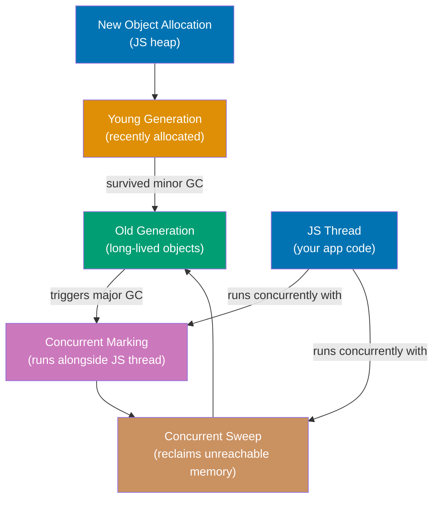
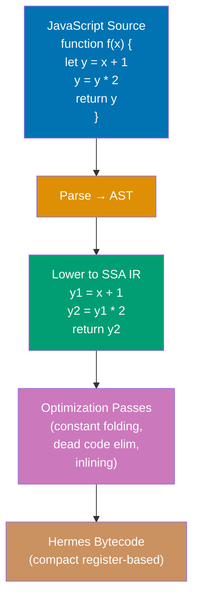
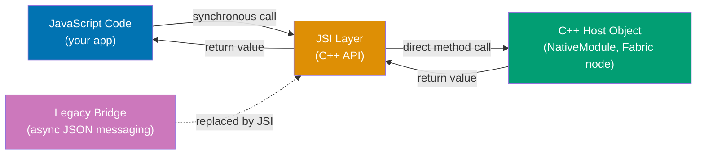
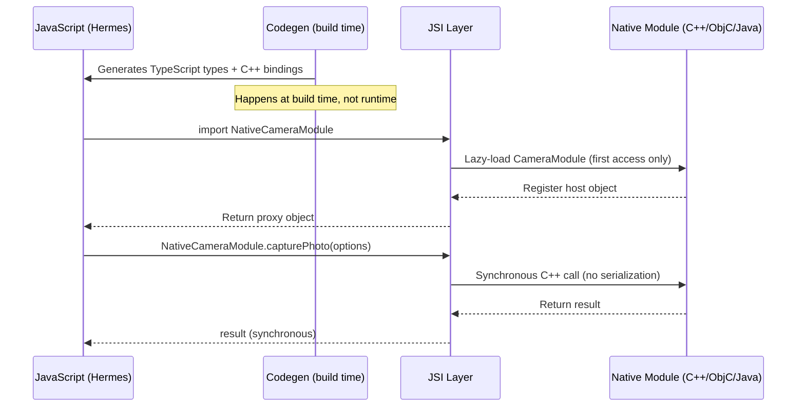
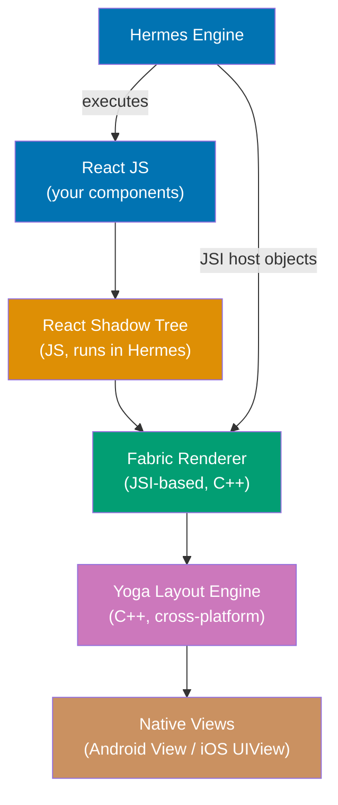
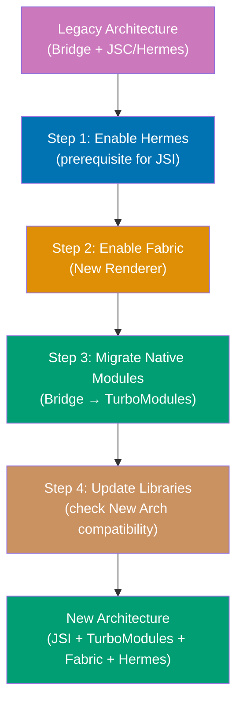
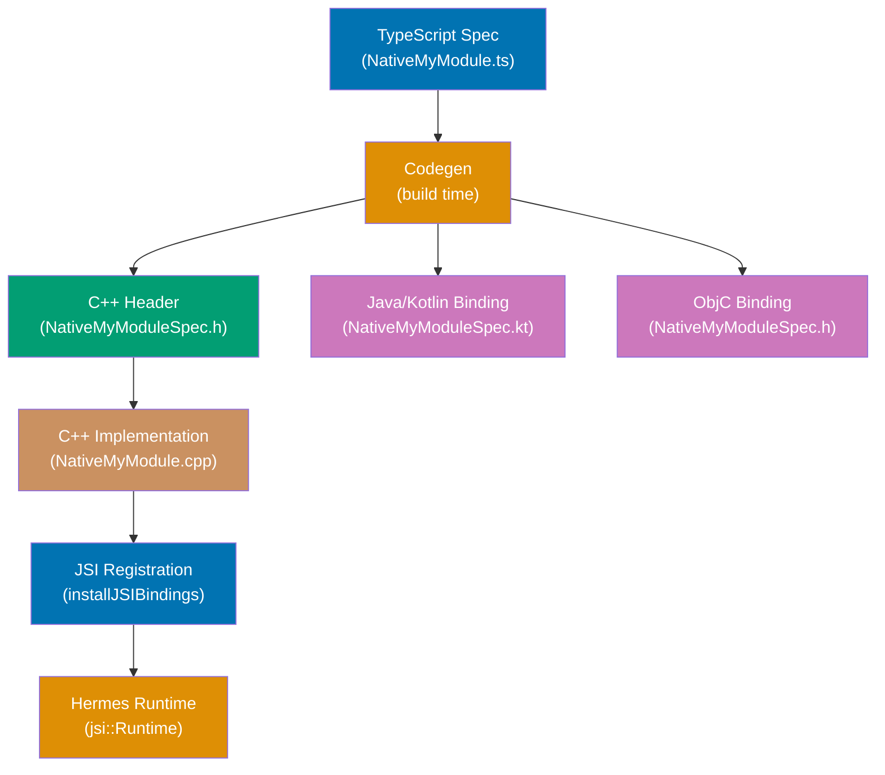
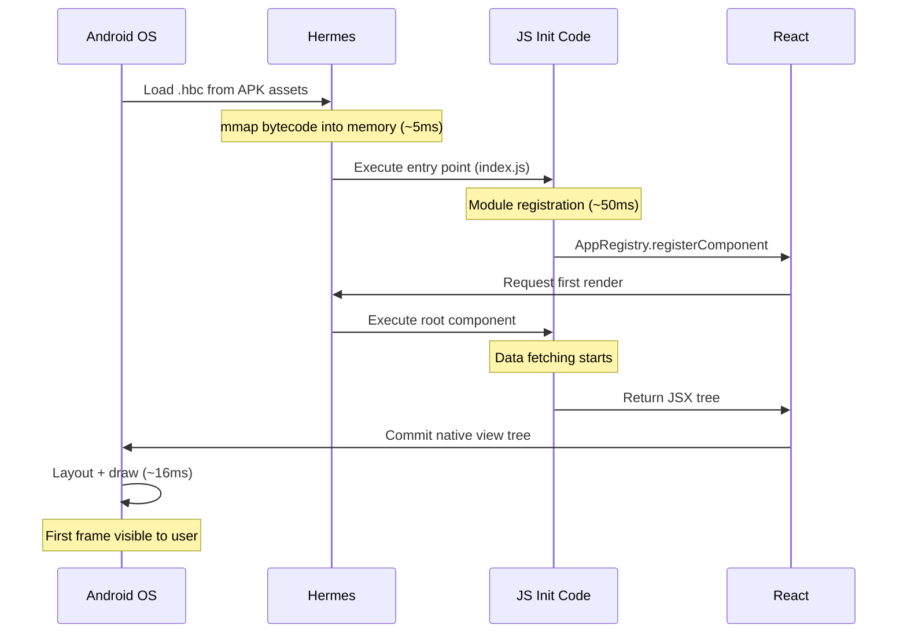
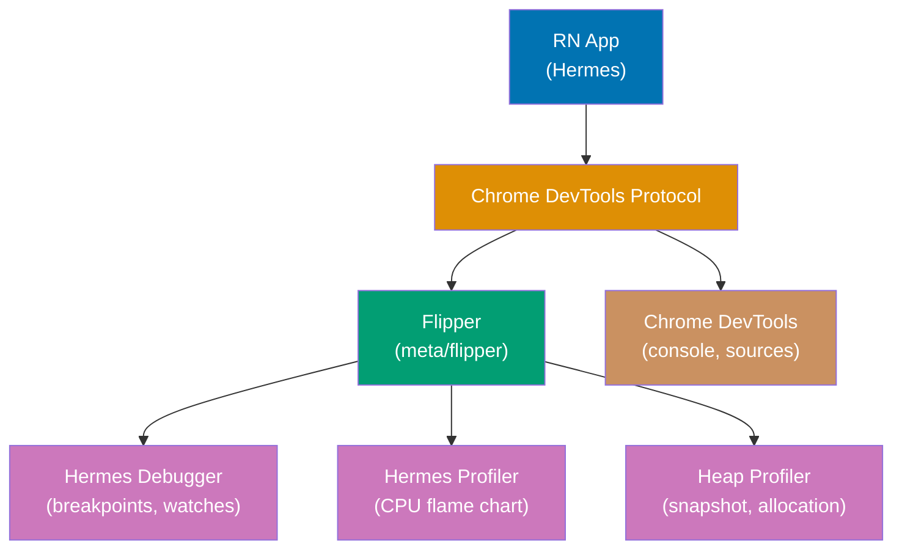

These 13 sections cover the internal mechanisms behind Hermes's performance characteristics
and its role in the React Native New Architecture. The beginner sections established what
Hermes does; these sections explain how it works under the hood and how those internals
connect to decisions you make as an application or library developer.

## Section 1: Hades GC Deep Dive

Hades is Hermes's garbage collector — the component responsible for reclaiming memory
occupied by JavaScript objects that are no longer reachable. Hades is a concurrent,
generational garbage collector specifically designed for the memory profile of mobile
applications: frequent small allocations (React state updates, event objects), infrequent
large allocations (large arrays, image data), and strict latency requirements (no dropped
animation frames).



Traditional garbage collectors use a "stop-the-world" approach: when the GC needs to trace
the heap, it pauses all application threads so the heap remains stable during traversal.
For web pages this is acceptable because the page is not rendering or animating during the
GC pause. For mobile apps running 60 or 120 FPS animations, a 50ms GC pause causes one or
more dropped frames — visible as a stutter.

Hades avoids stop-the-world pauses by running the marking phase concurrently with the
JavaScript thread. The GC maintains a write barrier: when JavaScript code writes a reference
to a heap object, the barrier records the write so the concurrent marker can account for
it. This allows the marker to traverse the heap while JavaScript continues executing. The
only pause Hades requires is a brief "initial mark" (to identify GC roots: stack variables,
global references) and a brief "remark" (to handle objects modified during concurrent
marking). Both pauses are typically under 1ms.

Hades uses a generational structure. Most objects are short-lived — event handler closures
created and discarded on each keypress, temporary arrays created by map/filter chains,
intermediate state objects. These go into the young generation, where a fast minor GC
collects them frequently with minimal overhead. Objects that survive multiple minor GCs
(component state, global caches, the React tree itself) are promoted to the old generation,
where the concurrent major GC collects them less frequently but more thoroughly.

On mobile, heap memory is on-demand: Hades requests virtual memory from the OS only when
needed rather than pre-allocating a large heap. This reduces the memory footprint during
low-activity periods and avoids holding memory that other apps need. When the OS signals
memory pressure (via Android's `onTrimMemory` or iOS's memory warning), Hades can
aggressively collect and release pages back to the OS.

```javascript
// Observing GC behavior via HermesInternal stats (development only)
if (__DEV__ && global.HermesInternal) {
  const before = global.HermesInternal.getInstrumentedStats?.();
  // => { allocatedBytes: 8388608, heapSize: 16777216, numCollections: 2, gcCPUTime: 8 }

  // Simulate allocation pressure
  const arr = Array.from({ length: 100000 }, (_, i) => ({ id: i, value: Math.random() }));
  // => Creates 100,000 objects — triggers young-gen GC if heap fills

  const after = global.HermesInternal.getInstrumentedStats?.();
  console.log("Collections delta:", after.numCollections - before.numCollections);
  // => Output: "Collections delta: 1"  — one minor GC ran during allocation

  console.log("GC CPU time delta:", after.gcCPUTime - before.gcCPUTime, "ms");
  // => Output: "GC CPU time delta: 3 ms"  — Hades ran concurrently, no JS pause
  // => Compare to JSC conservative GC: would have paused JS thread for same duration
}
```

**Key Takeaway**: Hades runs GC marking and sweeping concurrently with the JavaScript
thread, eliminating stop-the-world pauses that cause dropped animation frames, while
on-demand virtual memory allocation keeps the memory footprint low between GC cycles.

**Why It Matters**: GC-induced frame drops are one of the hardest animation jank issues to
diagnose because they appear intermittently and are not reproducible by profiling individual
component renders. Hades's concurrent design eliminates this entire class of jank, making
smooth 60/120 FPS animations achievable in JavaScript-driven React Native UIs without GC
tuning.

---

## Section 2: SSA IR and Optimization Passes

SSA stands for Static Single Assignment — a property of an intermediate representation (IR)
where every variable is assigned exactly once. Hermes uses SSA IR as the internal
representation on which it applies optimization passes before emitting bytecode. Understanding
SSA explains why Hermes can optimize code that appears redundant or complex in source form
and produce more efficient bytecode than a naive source-to-bytecode translation.

In SSA form, each assignment to a variable creates a new version of that variable. When
control flow merges (at the end of an if/else, for example), a special "phi node" selects
the appropriate version based on which branch was taken. This structure makes
data-flow relationships explicit: every use of a variable directly traces to its definition,
and the compiler can reason about variable values without tracking assignment histories.



Hermes applies several optimization passes on the SSA IR before emitting bytecode. Constant
folding evaluates constant expressions at compile time — `const x = 2 + 3` becomes `const
x = 5` in the bytecode with no addition instruction at runtime. Dead code elimination
removes code that is unreachable or whose result is never used. Function inlining replaces
a call to a small function with the function's body, eliminating call overhead. These passes
compound: constant folding may enable dead code elimination on branches that are always
taken or never taken.

The string table optimization is SSA-adjacent: during compilation, Hermes collects all
string literals encountered in the entire bundle and deduplicates them into a single string
table. Functions that reference the string `"error"` store an index into the string table
rather than allocating a new string object. At runtime, string table entries are
reference-counted and immutable — multiple code paths sharing the same string literal share
a single memory allocation.

From an application developer's perspective, the SSA IR and optimization passes are
invisible. You write JavaScript, Hermes optimizes it. However, understanding that these
passes exist explains why Hermes may produce different bytecode for semantically equivalent
source code — if you write `const x = 2 + 3`, the generated bytecode stores `5` directly.
This also explains why bundle analysis tools (that show bytecode) differ from source-level
analysis tools (that show JavaScript).

**Key Takeaway**: Hermes compiles JavaScript through SSA IR, applying constant folding,
dead code elimination, and string deduplication before emitting compact register-based
bytecode — these optimizations are free benefits of AOT compilation invisible to application
code.

**Why It Matters**: SSA-based optimizations mean that idiomatic JavaScript code — written
for readability and maintainability — is automatically optimized during compilation. You do
not need to write low-level micro-optimizations to get good bytecode output from Hermes, in
contrast to some JIT-compiled environments where code structure significantly affects JIT
optimization effectiveness.

---

## Section 3: JSI — JavaScript Interface

JSI (JavaScript Interface) is the C++ API that React Native uses to enable synchronous,
direct communication between JavaScript and native code. JSI is not specific to Hermes —
it is a React Native New Architecture component — but Hermes is the engine that makes JSI
practical because JSI is designed for engines that expose their runtime as a C++ object,
which Hermes does cleanly through its C++ API.



Before JSI, React Native used the "Bridge" — an asynchronous message queue that serialized
JavaScript values to JSON, sent the JSON across a thread boundary to the native side, and
deserialized it back into native types. The Bridge was asynchronous by design because
JavaScript and native code ran on separate threads with no shared memory. Every JavaScript-
to-native call was a round-trip with serialization overhead. Calling a native camera API
from JavaScript required: serialize arguments to JSON, post to Bridge queue, switch threads,
deserialize JSON, call native function, serialize result to JSON, post reply to Bridge,
switch threads, deserialize JSON. This round-trip added latency to every native call.

JSI eliminates the Bridge for modules that support it. Instead of serializing to JSON, JSI
exposes native C++ objects directly as JavaScript objects. The JavaScript engine (Hermes)
holds a reference to a C++ "host object" — an object that implements the `jsi::HostObject`
interface. When JavaScript code calls a method on this object, JSI dispatches the call
synchronously to the C++ implementation without serialization, thread switching, or queue
posting. The result is returned synchronously — from JavaScript's perspective, calling a JSI
native module is indistinguishable from calling a JavaScript function.

```javascript
// Using a JSI-backed TurboModule from JavaScript (application code)
import { NativeModules } from "react-native";

// Legacy Bridge module (asynchronous)
NativeModules.MyLegacyModule.getValue(callback);
// => Posts message to Bridge queue (asynchronous)
// => Switches to native thread, processes, posts reply
// => Switches back to JS thread, calls callback
// => Total latency: ~1-5ms per call (thread switching + serialization)

// JSI-backed TurboModule (synchronous when not returning Promises)
import NativeMyModule from "./NativeMyModule"; // => Generated by Codegen
const result = NativeMyModule.getValue(); // => Synchronous C++ call via JSI
// => No thread switching, no serialization
// => Returns immediately
console.log(result); // => Value available synchronously

// JSI host object example (for library authors)
// In C++ (simplified):
// class MyHostObject : public jsi::HostObject {
//   jsi::Value get(jsi::Runtime &rt, const jsi::PropNameID &name) override {
//     if (name.utf8(rt) == "getValue") {
//       return jsi::Function::createFromHostFunction(rt, name, 0,
//         [](jsi::Runtime &rt, const jsi::Value &, const jsi::Value *, size_t) {
//           return jsi::Value(42); // => Returns JS number 42 synchronously
//         });
//     }
//     return jsi::Value::undefined();
//   }
// };
```

JSI requires the JavaScript engine to support the `jsi::Runtime` interface — a C++ API
that engines implement to expose their runtime to native code. Hermes implements this
interface cleanly. JSC also implements it, but JSC's internal architecture makes some JSI
features slower or less direct than Hermes's implementation.

**Key Takeaway**: JSI replaces the asynchronous JSON Bridge with synchronous C++ host
objects, enabling JavaScript-to-native calls with no serialization or thread-switch overhead
— and Hermes's clean C++ architecture makes it the preferred engine for JSI-based modules.

**Why It Matters**: Synchronous native calls via JSI enable APIs that were architecturally
impossible with the Bridge — synchronous storage access, synchronous crypto operations,
synchronous sensor readings. These capabilities matter for apps where asynchronous APIs
create timing problems (e.g., reading from a synchronous in-memory cache before rendering).

---

## Section 4: TurboModules and Hermes

TurboModules are the New Architecture's replacement for React Native's legacy native modules.
Where legacy native modules used the Bridge (async JSON messaging), TurboModules use JSI
(synchronous C++ calls). Where legacy modules were loaded eagerly at startup regardless of
whether they were used, TurboModules load lazily — only when JavaScript first accesses them.
Hermes's AOT compilation and JSI integration make TurboModules significantly more efficient
than the legacy Bridge-based module system.



TurboModules use Codegen — a code generation tool that runs at build time — to create type-
safe bindings between JavaScript and native code. You define the module's interface in a
TypeScript or Flow spec file. Codegen generates C++ headers, Java bindings (for Android),
and Objective-C bindings (for iOS) from this spec. The generated bindings enforce type
safety at the JSI layer: if a native function expects an integer and receives a string,
the binding rejects it at the call site rather than crashing deep inside native code.

The lazy loading behavior of TurboModules reduces startup time compared to legacy native
modules. Legacy modules registered themselves at startup — even `NativeModules.Camera` was
initialized on launch regardless of whether any code used the camera. TurboModules load
only on first access from JavaScript. Since Hermes compiles the module access code as part
of the bundle, JSI can use Hermes's runtime to create the lazy proxy object efficiently.

```javascript
// TurboModule spec file (NativeMyModule.ts)
import type { TurboModule } from 'react-native';
import { TurboModuleRegistry } from 'react-native';

export interface Spec extends TurboModule {
  getValue: (key: string) => string;          // => Synchronous return type
  setValue: (key: string, value: string) => void;  // => Void return
  getAsync: (key: string) => Promise<string>; // => Async (still JSI under hood)
}

export default TurboModuleRegistry.getEnforcing<Spec>('MyModule');
// => getEnforcing throws if native module not found
// => Lazy-loaded: native code initializes on first call, not at startup
// => Codegen reads this Spec at build time to generate C++ bindings

// Usage in application code
import NativeMyModule from './NativeMyModule';

const result = NativeMyModule.getValue('userPreference');
// => Synchronous call via JSI — no Promise, no callback
// => result: "darkMode"  (returned synchronously from native)

await NativeMyModule.getAsync('largeData');
// => Promise-returning methods still go through JSI (no Bridge)
// => But Promise resolution is async — native runs on background thread
// => JSI marshals the resolved value back to JS when done
```

**Key Takeaway**: TurboModules combine JSI (synchronous calls), Codegen (type-safe
bindings), and lazy loading (on-demand initialization) to replace the legacy Bridge with a
faster, safer, and more startup-efficient native module system that Hermes powers via JSI.

**Why It Matters**: In production apps with many native modules, TurboModules' lazy loading
reduces the number of native modules initialized during cold start. Fewer native module
initializations means less native code running before the first JavaScript render — directly
contributing to cold-start time reduction on top of Hermes's AOT compilation benefit.

---

## Section 5: Fabric Renderer Integration

Fabric is React Native's new rendering system, part of the New Architecture alongside
TurboModules. Where the legacy renderer communicated with the native UI layer through
the Bridge (async JSON), Fabric uses JSI to communicate synchronously with native view
components. Hermes powers the JavaScript side of this integration, and its JSI implementation
enables Fabric's concurrent rendering capabilities.



The legacy React Native renderer ran layout calculation on the native thread and communicated
results back to JavaScript through the Bridge. Fabric moves the shadow tree (the layout
representation) into C++ and exposes it to JavaScript via JSI. This means React running
inside Hermes can commit layout updates synchronously without a round-trip across the Bridge.

Fabric supports concurrent rendering — React 18's ability to interrupt, pause, and resume
rendering work. With the legacy renderer, all rendering was synchronous on the JavaScript
thread: once a render started, it ran to completion blocking any other JavaScript work.
Concurrent rendering with Fabric allows React to yield the JavaScript thread during long
renders, process high-priority updates (like user input), and resume the interrupted render.
Hermes's clean threading model and JSI integration are prerequisites for this behavior.

```javascript
// Concurrent rendering features that require Fabric + Hermes
import React, { useTransition, Suspense } from "react";

function SearchResults({ query }) {
  // useTransition marks rendering as low priority — can be interrupted
  const [isPending, startTransition] = useTransition();

  const handleSearch = (newQuery) => {
    startTransition(() => {
      // => Marks this update as interruptible
      setQuery(newQuery); // => Fabric can pause this render
      // => if a higher-priority update arrives
    });
  };

  return (
    <Suspense fallback={<LoadingSpinner />}>
      {" "}
      {/* => Suspense requires Fabric + Hermes */}
      <ResultsList query={query} /> {/* => Can suspend during data loading */}
    </Suspense>
  );
}

// Feature detection for New Architecture / Fabric
const isFabric = () => global.nativeFabricUIManager != null;
// => nativeFabricUIManager: JSI host object registered by Fabric
// => null on legacy renderer, object on Fabric
// => Same JSI mechanism as HermesInternal for engine detection

console.log("Fabric active:", isFabric()); // => true with New Architecture enabled
```

The combination of Hermes + JSI + Fabric + TurboModules is what React Native calls the
"New Architecture." These four components are tightly coupled: Fabric requires JSI for its
shadow tree host objects, TurboModules require JSI for native module calls, and JSI requires
an engine with a C++ runtime API — which Hermes provides. The legacy Bridge-based renderer
still works with Hermes, but the concurrent rendering benefits of Fabric only materialize
when all four components are active together.

**Key Takeaway**: Fabric uses JSI to expose the shadow tree to JavaScript, enabling
concurrent rendering (React 18's `useTransition`, `Suspense`) that was architecturally
impossible with the async Bridge renderer — and Hermes's JSI implementation is what makes
this synchronous shadow tree access efficient.

**Why It Matters**: Concurrent rendering directly improves perceived responsiveness for
complex list scrolling and data-heavy screens. When React can interrupt a large re-render
to handle a user tap, the app feels responsive even under heavy computational load — a
qualitative improvement in user experience that pure AOT compilation cannot provide.

---

## Section 6: New Architecture Migration

Migrating a React Native project from the legacy architecture (Bridge + Legacy Renderer) to
the New Architecture (JSI + TurboModules + Fabric + Hermes) is the most significant
architectural change in React Native's history. Hermes is a prerequisite for the New
Architecture — all New Architecture features depend on JSI, and JSI requires Hermes (or a
JSI-compatible engine). Most projects already use Hermes by this point; the migration work
focuses on TurboModules and Fabric.



The migration path starts with enabling Hermes (Section 4 in the beginner level). Once
Hermes is active, enable Fabric by setting the appropriate flag in your Android and iOS
build configuration. React Native 0.76+ enables the New Architecture by default for new
projects — for existing projects, opt-in flags exist at the Gradle and Podfile level.

The most time-consuming part of migration is native module compatibility. Every native
module used in your app — both your own and from third-party libraries — must either support
the New Architecture (providing a TurboModule spec) or be run in "interop mode" (which
wraps legacy Bridge modules to work with the New Architecture at a small performance cost).
The React Native Directory ([reactnative.directory](https://reactnative.directory/)) tracks
which libraries have added New Architecture support.

```javascript
// Checking New Architecture status at runtime
const isNewArch = () => {
  return (
    global.nativeFabricUIManager != null && // => Fabric renderer active
    global.__turboModuleProxy != null // => TurboModule system active
  );
};

// android/gradle.properties (enable New Architecture on Android)
// newArchEnabled=true
// => Enables TurboModules and Fabric for Android builds
// => Requires all native modules to be New Arch compatible

// ios/Podfile (enable New Architecture on iOS)
// use_react_native!(
//   :hermes_enabled => true,                  // => Required prerequisite
//   :fabric_enabled => true,                  // => Enables Fabric renderer
// )

// Interop layer for non-migrated Bridge modules (React Native 0.74+)
// Legacy Bridge modules automatically wrapped when New Arch enabled
// => No code change required for apps using legacy modules temporarily
// => Performance: ~10% overhead vs native TurboModule, but no Bridge round-trip
// => Interop mode is a temporary bridge, not a permanent solution

// Verifying specific modules are TurboModules vs legacy
import { TurboModuleRegistry } from "react-native";
const nativeStorage = TurboModuleRegistry.get("AsyncStorage");
// => Returns TurboModule instance if library provides TurboModule spec
// => Returns null if library uses legacy Bridge module only
console.log("Storage is TurboModule:", nativeStorage !== null);
```

Library compatibility is the primary blocker for most migrations. Before starting a
migration, audit all native module dependencies using `react-native info` and the React
Native Directory. Libraries that have not added TurboModule specs can be used in interop
mode, but interop mode consumes more CPU than native TurboModules and may not support all
New Architecture features.

**Key Takeaway**: New Architecture migration is sequential — Hermes first, then Fabric, then
TurboModule migration — with the primary effort in ensuring native library compatibility,
not in changing application JavaScript code.

**Why It Matters**: The New Architecture is the default for new React Native projects as of
0.76. Existing apps that have not migrated lose access to concurrent rendering, synchronous
native calls, and future performance improvements that will be built exclusively on the New
Architecture foundation.

---

## Section 7: Hermes V1 New Features

Hermes V1, which shipped with React Native 0.84 in February 2026, is a major milestone
that removes the most common reasons developers needed polyfills or Babel transforms for
React Native apps. Understanding exactly what changed in V1 lets you remove unnecessary
build-time dependencies and reduce bundle size.

Before Hermes V1, Hermes had incomplete support for several ES2015–ES2022 features. The
most impactful gaps were: `let`/`const` required transpilation for some edge cases, native
`class` syntax had limitations with inheritance and private fields, `async`/`await` required
a `regenerator-runtime` polyfill, and `Map`/`Set`/`WeakMap`/`WeakSet` were implemented as
polyfills rather than native C++ data structures. V1 addresses all of these.

```javascript
// Hermes V1: Native async/await (no regenerator-runtime needed)
// Before V1: Required @babel/plugin-transform-runtime + regenerator-runtime (~30KB)
// After V1:  Native async/await, zero runtime polyfill cost

async function loadUserData(userId) {
  // => Native async function in V1
  const user = await fetchUser(userId); // => Native await — no generator transform
  const prefs = await fetchPreferences(user.id); // => Sequential async calls
  return { user, prefs }; // => Returns Promise<{user, prefs}>
}
// => Babel no longer transforms this — runs as native Hermes async bytecode

// Hermes V1: Native ES classes with private fields
class UserSession {
  #token; // => Private field — native in V1
  #userId; // => No transpilation to WeakMap needed

  constructor(userId, token) {
    this.#userId = userId; // => Direct private field assignment
    this.#token = token; // => No _classPrivateFieldSet() wrapper
  }

  isValid() {
    return (
      this.#token !== null && // => Native private field access
      this.#userId > 0
    ); // => No _classPrivateFieldGet() wrapper
  }

  static fromStorage(data) {
    // => Static class methods — native in V1
    return new UserSession(data.userId, data.token);
  }
}

// Hermes V1: Native Map and Set (C++ implementation, not polyfill)
const cache = new Map(); // => Native C++ Map in V1
cache.set("user:123", { name: "Alice" }); // => O(1) average lookup
cache.get("user:123"); // => { name: 'Alice' }
// => Before V1: Map was a polyfill with ~10KB overhead and slower iteration

const uniqueIds = new Set([1, 2, 2, 3, 3]); // => Native C++ Set in V1
console.log([...uniqueIds]); // => [1, 2, 3] — duplicates removed natively
// => Spread operator on Set: supported natively in V1

// Hermes V1: Removed per-object property count limit
// Before V1: Objects were limited in property count (implementation detail, ~250 props)
// After V1:  No limit — large config objects and state trees work without workarounds
const largeConfig = {};
for (let i = 0; i < 1000; i++) {
  largeConfig[`key${i}`] = i; // => Works in V1 — no limit
  // => Before V1: might hit hidden limits
}
```

The removal of the `regenerator-runtime` polyfill is particularly significant. This runtime
library, required by Babel's async/await transform in pre-V1 Hermes, added approximately
28–35 KB to every React Native bundle and had execution overhead on every `async` function
call. V1 eliminates this entirely — native async/await compiles to Hermes bytecode directly
with no runtime library dependency.

To take advantage of V1's native features, update your Babel configuration to remove
transforms that V1 now handles natively. Check your `babel.config.js` for
`@babel/plugin-transform-async-to-generator`, `@babel/plugin-transform-class-properties`,
and `regenerator-runtime` imports. These can be removed for React Native 0.84+ projects.

**Key Takeaway**: Hermes V1 adds native `async`/`await`, ES classes with private fields,
and native `Map`/`Set` — eliminating the `regenerator-runtime` polyfill and enabling Babel
transform removal that shrinks bundles and reduces startup overhead.

**Why It Matters**: Removing `regenerator-runtime` alone shrinks the JavaScript bundle by
28–35 KB and eliminates async function call overhead that existed in every pre-V1 async
operation. For apps with heavy async data fetching during initialization, this is a
measurable cold-start improvement on top of Hermes's AOT compilation benefit.

---

## Section 8: Bytecode Cache and Incremental Builds

Hermes bytecode compilation happens during React Native's release build process. For large
applications, the `hermesc` compilation step can take tens of seconds. Metro and the React
Native build system implement caching strategies to avoid recompiling bytecode when the
JavaScript source has not changed. Understanding how this cache works prevents cache
invalidation surprises and helps you optimize CI build times.

Metro's build cache stores the output of each transformation step — JavaScript parsing,
Babel transforms, and Hermes bytecode compilation — keyed by a hash of the input (the
source file content + transform configuration). If a file's hash matches a cached entry,
Metro reuses the cached output without reprocessing. The cache persists between builds in
a local directory (typically `$TMPDIR/metro-cache`) and can optionally use a remote cache
for CI/CD (via Metro's remote cache configuration or tools like `nx` cache).

```bash
# Metro cache location and inspection (local development)
ls ~/.cache/metro/  # macOS/Linux local Metro cache directory
# => cache-HASH1/   cache-HASH2/   ...   (one entry per unique file transform)
# => Each entry contains the transformed/compiled output for one module

# Clear Metro cache when you suspect stale bytecode
npx react-native start --reset-cache
# => Deletes local Metro cache and restarts bundler
# => Forces full recompilation on next build
# => Use after: changing hermesEnabled flag, upgrading Hermes/RN version

# Android Gradle build cache (separate from Metro cache)
cd android && ./gradlew clean
# => Clears Gradle build outputs (not Metro cache)
# => Required when changing native configuration
# => Both caches must be cleared for a fully clean rebuild
```

```javascript
// metro.config.js — configuring Metro cache for CI optimization
const { getDefaultConfig } = require("@react-native/metro-config");

const config = getDefaultConfig(__dirname);

// Remote cache configuration (speeds up CI builds)
config.cacheStores = [
  // Local disk cache (always active)
  new (require("metro-cache").FileStore)({
    root: require("path").join(__dirname, ".metro-cache"), // => Project-local cache dir
    // => Can be committed to .gitignore
    // => Persists across local dev sessions
  }),
];

// Cache invalidation key — increment when Hermes version changes
// This prevents stale bytecode from persisting across React Native upgrades
config.cacheVersion = "rn-0.84-hermes-v1"; // => Change this string when:
// => - Upgrading React Native version
// => - Changing hermesEnabled flag
// => - Changing Babel config significantly

module.exports = config;
```

The bytecode cache is invalidated automatically when the source file content changes or when
the transform configuration changes. However, it is NOT automatically invalidated when the
Hermes version changes — if you upgrade React Native (and thus Hermes) but the cache version
string remains the same, Metro may reuse bytecode compiled by the old `hermesc` version.
This is the cause of "invalid bytecode" crashes after React Native upgrades. Setting
`config.cacheVersion` to a string that includes the React Native version provides an
explicit cache invalidation point.

**Key Takeaway**: Metro caches Hermes bytecode between builds keyed by source content hash,
but the cache must be manually invalidated when upgrading Hermes — use `cacheVersion` in
`metro.config.js` to tie cache validity to the React Native version.

**Why It Matters**: Stale bytecode cache after a React Native upgrade is one of the most
common causes of unexplained post-upgrade crashes. A `cacheVersion` string that encodes
the React Native version makes this class of error impossible — any upgrade invalidates the
cache and forces clean recompilation.

---

## Section 9: Custom JSI Native Modules

Writing a custom JSI native module means implementing the `jsi::HostObject` C++ interface
and registering it with the Hermes runtime. This gives your native code the ability to
expose synchronous JavaScript APIs without the Bridge overhead. Custom JSI modules are
appropriate for performance-critical operations where Bridge latency is unacceptable:
cryptographic operations, synchronous database access, hardware sensor readings, or binary
data manipulation.



```cpp
// C++ JSI Host Object implementation (simplified)
// NativeCrypto.cpp

#include <jsi/jsi.h>
#include <ReactCommon/TurboModule.h>

using namespace facebook::jsi;

class NativeCryptoModule : public jsi::HostObject {
public:
  // Called when JS reads a property: nativeCrypto.sha256
  Value get(Runtime &rt, const PropNameID &name) override {
    auto methodName = name.utf8(rt);           // => Convert PropNameID to string

    if (methodName == "sha256") {
      // Return a JavaScript function backed by C++ logic
      return Function::createFromHostFunction(
        rt,
        PropNameID::forAscii(rt, "sha256"),    // => Function name (for stack traces)
        1,                                      // => Expected argument count
        [](Runtime &rt, const Value &thisVal,  // => Lambda called when JS invokes the function
           const Value *args, size_t count) -> Value {
          if (count < 1 || !args[0].isString()) {
            throw JSError(rt, "sha256 requires a string argument");
                                               // => Throws JS exception — catchable in JS
          }
          auto input = args[0].getString(rt).utf8(rt);
                                               // => Extract string from JS value
          auto hash = computeSHA256(input);    // => Native crypto computation
          return String::createFromUtf8(rt, hash);
                                               // => Return JS string value synchronously
        }
      );
    }
    return Value::undefined();
  }

  void set(Runtime &rt, const PropNameID &name, const Value &value) override {
    // This module is read-only — reject all property assignments
    throw JSError(rt, "NativeCryptoModule is read-only");
  }
};

// Registration (called once during app startup, before JS runs)
void installCryptoBindings(jsi::Runtime &rt) {
  auto cryptoModule = std::make_shared<NativeCryptoModule>();
                                               // => shared_ptr: JS runtime holds reference
  rt.global().setProperty(                    // => Register as global property
    rt,
    "nativeCrypto",                            // => Name accessible from JavaScript
    Object::createFromHostObject(rt, cryptoModule)
                                               // => Wraps C++ object as JS object
  );
}
```

```javascript
// JavaScript usage of the custom JSI module
// (after installCryptoBindings runs during app init)

const hash = global.nativeCrypto.sha256("hello world");
// => Synchronous C++ SHA-256 computation
// => No callback, no Promise, no Bridge
// => Returns: "b94d27b9934d3e08a52e52d7da7dabfac484efe..."

// Type-safe wrapper with TypeScript (best practice)
const CryptoModule = {
  sha256: (input: string): string => {
    if (typeof global.nativeCrypto === 'undefined') {
      throw new Error('NativeCryptoModule not installed');
                                              // => Safety check — module must be registered
    }
    return (global.nativeCrypto as any).sha256(input);
                                              // => Cast through any — JSI objects are untyped at TS level
  },
};

export default CryptoModule;
// => Usage: import CryptoModule from './CryptoModule'
//           CryptoModule.sha256("data")  // => Synchronous, typed, safe
```

**Key Takeaway**: Custom JSI modules implement `jsi::HostObject` in C++ and register with
the Hermes runtime via `rt.global().setProperty()`, enabling synchronous JavaScript-to-native
calls for performance-critical operations where Bridge latency is unacceptable.

**Why It Matters**: Synchronous native APIs are essential for operations where asynchronous
callbacks create race conditions or timing problems — reading from a synchronous in-memory
key-value store before the first render, computing cryptographic tokens before navigation,
or accessing sensor data that must be current at the moment of a gesture handler callback.

---

## Section 10: Profiling Cold-Start Times

Detailed cold-start profiling goes beyond the `performance.mark()` approach covered in the
beginner section. Systrace provides OS-level visibility into every thread active during
startup, revealing where time is spent in native code, Hermes bytecode execution, and
layout. Custom performance markers let you annotate the Systrace timeline with your app's
initialization milestones, correlating native events with JavaScript module loading order.



```javascript
// Annotating Systrace timeline from JavaScript (Android development builds)
import { Systrace } from "react-native";

// Wrap expensive initialization code with Systrace markers
Systrace.beginEvent("LoadUserPreferences"); // => Creates named marker in Systrace
const prefs = loadUserPreferences(); // => Visible as colored block in timeline
Systrace.endEvent(); // => Closes the marker block

// Custom async tracking with Systrace (for async operations)
const asyncId = Systrace.beginAsyncEvent("FetchInitialData");
// => Returns unique ID for async tracking
fetchInitialData().then((data) => {
  Systrace.endAsyncEvent("FetchInitialData", asyncId);
  // => Closes async block at completion
  setInitialData(data);
});

// Reading Systrace output (Android command-line tool)
// python $ANDROID_HOME/platform-tools/systrace/systrace.py \
//   --time=10 -o trace.html app dalvik sched gfx view
// => Captures 10 seconds of Systrace
// => Opens in Chrome: chrome://tracing
// => Look for: "Hermes" thread shows bytecode execution
// =>           "UI Thread" shows layout/draw time
// =>           Custom markers appear in "App" section

// Identifying which modules are slow to initialize
// Add timing marks around require() calls in development
if (__DEV__) {
  const originalRequire = require;
  // Monitor require timing without patching (use Metro's --verbose flag instead)
  // npx react-native bundle --verbose 2>&1 | grep "require"
  // => Shows which modules take longest to bundle (correlates with init time)
}
```

The Hermes sampling profiler provides function-level resolution within the JavaScript thread.
Unlike Systrace (which shows thread-level activity), the sampling profiler shows which
JavaScript functions consume CPU time. The combination — Systrace for the overall picture,
sampling profiler for JavaScript internals — gives a complete view of startup behavior.

Interpreting cold-start profiles requires distinguishing between three phases: bytecode
load time (Hermes reading `.hbc` from APK assets), JavaScript initialization time (module
registration, global variable setup, AppRegistry.registerComponent call), and first render
time (executing the root component, its children, committing native views). Hermes eliminates
the compilation phase that exists in JSC profiles between bytecode load and initialization.

**Key Takeaway**: Combine Systrace (OS-level thread timeline) with the Hermes sampling
profiler (function-level JavaScript timeline) to distinguish bytecode load time from module
initialization time from first render time — each phase has different optimization strategies.

**Why It Matters**: Without distinguishing the three cold-start phases, optimization efforts
can be misdirected. If bytecode load time is the bottleneck (large bundle), the fix is
bundle splitting. If module initialization time dominates, `inlineRequires` helps. If first
render time is the bottleneck, component initialization code needs optimization. The wrong
fix for the wrong phase yields no improvement.

---

## Section 11: Error Handling in Hermes

Error handling in Hermes-powered React Native apps involves three layers: JavaScript error
objects (standard), Hermes-specific stack trace format (differs from JSC), and source map
resolution (maps bytecode positions to source lines). Production error handling requires
correct source map configuration because Hermes bytecode positions are meaningless without
the corresponding source map.

```javascript
// Hermes stack trace format (differs from JSC in how frames are formatted)
function riskyOperation() {
  throw new Error("Something went wrong"); // => Creates Error with stack trace
}

try {
  riskyOperation();
} catch (error) {
  console.log(error.message); // => "Something went wrong"
  console.log(error.stack);
  // => Hermes stack trace format:
  // => Error: Something went wrong
  // =>     at riskyOperation (address at index.android.bundle:1:12345)
  // =>     at anonymous (address at index.android.bundle:1:67890)
  // => Without source maps: bytecode offsets, not source lines
  // => With source maps:    riskyOperation (src/utils/risky.ts:15:5)
}

// Global error handler for uncaught JavaScript errors
ErrorUtils.setGlobalHandler((error, isFatal) => {
  // => Called for unhandled promise rejections and uncaught exceptions
  // => isFatal: true for errors that will crash the app, false for warnings

  const errorInfo = {
    message: error.message, // => Human-readable error message
    stack: error.stack, // => Stack trace (bytecode positions without source map)
    isFatal, // => Whether app will crash
    hermesVersion: global.HermesInternal?.getRuntimeProperties?.()?.["OSS Release Version"], // => Include engine version in error report
  };

  // Send to crash reporting service
  MyCrashReporter.recordError(errorInfo); // => Firebase Crashlytics, Sentry, Datadog, etc.
});

// Source map upload for production (integrate into CI/CD pipeline)
// During release build, Metro generates a source map alongside the .hbc bundle:
// dist/index.android.bundle.map   (source map file)
// dist/index.android.bundle       (Hermes bytecode)

// Upload to Sentry (example):
// npx sentry-cli react-native appcenter
//   --platform android
//   --bundle path/to/index.android.bundle
//   --source-map path/to/index.android.bundle.map
// => Associates source map with release version
// => Stack traces in Sentry automatically resolve to source lines
```

Hermes-specific error formats differ from JSC in how function names appear in stack traces.
Hermes includes bytecode address information (`address at`) in stack frames when source maps
are not resolved. JSC includes function names and line numbers differently. If you observe
changed stack trace formats after migrating from JSC to Hermes, update your crash reporting
service's stack trace parser configuration to handle the Hermes format.

Promise rejection handling is particularly important in Hermes. Unhandled promise rejections
in Hermes produce a warning in development and can crash the app in production depending on
React Native's `unhandledRejection` configuration. Hermes tracks pending promises and their
rejection state — a promise rejected without a `.catch()` handler triggers the global
unhandled rejection handler.

**Key Takeaway**: Hermes error handling requires correctly uploaded source maps to produce
readable production stack traces — bytecode positions are meaningless without them — and
Hermes's stack trace format differs slightly from JSC's, requiring crash reporter
configuration updates when migrating.

**Why It Matters**: Production crash reports without source maps are nearly impossible to
diagnose. A source map upload step missing from the CI pipeline means every crash appears
as an unreadable sequence of bytecode offsets. This is a high-urgency operational concern
that must be confirmed correct before shipping a Hermes-enabled release.

---

## Section 12: Jest Integration for Hermes

Running Jest tests in a React Native project does not use Hermes as the test runtime by
default — Jest runs in Node.js using V8. However, tests can use Hermes-specific test
utilities to validate that code works correctly in the Hermes environment, and the test
environment configuration affects how Hermes-incompatible patterns (like `eval`) are caught
before deployment.

```javascript
// jest.config.js — React Native Jest configuration
module.exports = {
  preset: "react-native", // => Loads React Native Jest preset
  testEnvironment: "node", // => Tests run in Node.js (V8), not Hermes
  // => Hermes-specific behavior requires
  // => device/simulator testing for verification

  // jest-circus is the default test runner in React Native (not jasmine)
  testRunner: "jest-circus/runner", // => jest-circus: more predictable async handling
  // => Matches Hermes async/await behavior more closely

  transform: {
    "^.+\\.(js|jsx|ts|tsx)$": [
      "babel-jest",
      {
        presets: ["module:@react-native/babel-preset"],
        // => Uses React Native's Babel preset
        // => Same preset as Metro — consistent transforms
      },
    ],
  },

  // Environment setup — configure globals that Hermes provides
  setupFilesAfterFramework: ["./jest.setup.js"],
};

// jest.setup.js — Hermes runtime simulation for unit tests
// Simulate HermesInternal for tests that check isHermes()
global.HermesInternal = {
  // => Mock the Hermes global
  getRuntimeProperties: () => ({
    // => Simulate runtime properties API
    "Hermes Build Target": "HBC",
    Build: "Release",
    "OSS Release Version": "0.12.0", // => Match your actual Hermes version
  }),
};

// Test that Hermes detection works correctly
test("isHermes returns true when HermesInternal is defined", () => {
  const isHermes = () => !!global.HermesInternal;
  expect(isHermes()).toBe(true); // => Validates detection logic
  // => Passes in Jest (mocked) and Hermes (real)
});

// Testing async code that targets Hermes V1 (no polyfill)
test("async initialization works without regenerator-runtime", async () => {
  const result = await Promise.resolve(42); // => Native async in Jest (V8)
  // => Same code runs natively in Hermes V1
  expect(result).toBe(42);
});

// Testing that eval is not used (important for Hermes compatibility)
test("no eval in dynamic dispatch", () => {
  const dispatch = (name, args) => {
    const handlers = { greet: (n) => `Hello, ${n}` };
    return handlers[name]?.(...args); // => Lookup table — Hermes compatible
  };
  expect(dispatch("greet", ["Alice"])).toBe("Hello, Alice");
  // => Passes in Jest (V8) and Hermes
  // => eval-based dispatch would fail in Hermes
});
```

For testing Hermes-specific behavior that cannot be simulated in Node.js (profiler APIs,
actual GC behavior, real JSI native module calls), use device testing via React Native's
integration test infrastructure or Detox/Maestro E2E tests running on a real device or
simulator with Hermes active.

The `jest-circus` test runner is the default in React Native and provides more predictable
async behavior than the legacy `jasmine` runner. Its async handling model more closely
matches Hermes V1's native async/await semantics, which reduces the frequency of "test
passes in Jest but fails on device" issues caused by async timing differences between V8
and Hermes.

**Key Takeaway**: Jest tests run on V8 (not Hermes), so mock `global.HermesInternal` for
unit tests checking engine detection; use device E2E tests (Detox, Maestro) for Hermes-
specific behavior that requires the real engine.

**Why It Matters**: Tests that pass in Jest but fail on Hermes-enabled devices waste
developer time debugging environment mismatches rather than real application bugs. Mocking
`HermesInternal` and auditing for `eval` usage in the test suite catches the most common
Hermes incompatibilities before code reaches CI or production.

---

## Section 13: Hermes-Specific Debugging Patterns

Debugging React Native apps with Hermes involves patterns that differ from JSC debugging
in tool configuration, memory analysis, and performance investigation. Flipper is the
primary tool for Hermes-specific debugging capabilities — heap snapshots, CPU profiling,
and the Hermes Debugger — that go beyond what Chrome DevTools alone provides.



```javascript
// Pattern 1: Memory leak detection with heap snapshots
// In Flipper → Hermes Profiler → "Take Heap Snapshot"
// Or programmatically:

if (__DEV__ && global.HermesInternal) {
  // Capture heap snapshot before and after a suspected leak
  const beforeSnapshot = global.HermesInternal.createSnapshotToFile?.(
    "/sdcard/heap-before.heapsnapshot", // => Android path in app sandbox
  );
  // => File format: V8 heap snapshot JSON (compatible with Chrome DevTools)

  // ... perform suspected leaking operation ...

  global.HermesInternal.createSnapshotToFile?.("/sdcard/heap-after.heapsnapshot");
  // => Compare before/after in Chrome DevTools → Memory → Load snapshots
  // => Objects appearing in 'after' but not in 'before' are candidates
  // => Look for: event listener closures, unmounted component state, timer callbacks
}

// Pattern 2: CPU profiling a specific interaction
// Wrap the suspected slow operation:
const startProfile = () => {
  global.HermesInternal?.enableSamplingProfiler?.(); // => Start sampling at ~1ms
};

const stopAndSaveProfile = () => {
  global.HermesInternal?.disableSamplingProfiler?.(); // => Stop sampling
  global.HermesInternal?.dumpSampledTraceToFile?.(
    // => Save to device
    "/sdcard/profile-interaction.json",
  );
  // => Pull from device: adb pull /sdcard/profile-interaction.json
  // => Open in Speedscope: speedscope.app (supports Hermes format)
  // => Flame chart shows: time per function, call depth, hot paths
};

// Pattern 3: Diagnosing "Expected 'string', got 'number'" JSI errors
// JSI type mismatches produce different error messages than pure JS type errors
// These errors originate in C++ JSI binding code:
// "JSI HostObject::get threw an exception: ..."
// => Check: the native module spec type matches what JavaScript passes
// => Check: TurboModule Codegen ran after spec file was modified
// => Fix: run `node node_modules/react-native/scripts/generate-specs.js`

// Pattern 4: Identifying Bridge vs. JSI module calls in Flipper
// Flipper → React DevTools → Components → inspect native calls
// Bridge calls appear in Flipper's "React Native" plugin as "NativeModules"
// TurboModule calls (JSI) do not appear in the Bridge plugin — they're synchronous
// => If you see your module in Bridge logs, it's using legacy Bridge, not JSI
// => This indicates TurboModule migration is incomplete
```

The Hermes heap snapshot format is compatible with the V8 heap snapshot format used by
Chrome DevTools, which means you can use Chrome's Memory panel to analyze Hermes heap
snapshots without additional tooling. Pull the snapshot file from the device using `adb
pull` (Android) or the Xcode Devices window (iOS), then load it in Chrome DevTools under
the Memory tab.

A common Hermes-specific debugging scenario is diagnosing "bytecode version mismatch"
crashes on startup. These crashes produce a native crash (not a JavaScript error) with a
message like "Unable to load bundle" or "Invalid bytecode header." The cause is always a
version mismatch between the `hermesc` that compiled the bundle and the Hermes runtime
embedded in the app. The fix is always a full clean build after ensuring React Native
version consistency.

**Key Takeaway**: Flipper's Hermes Profiler and Heap Profiler provide CPU flame charts and
heap snapshots for JavaScript memory leak detection; heap snapshots use V8-compatible
format, so Chrome DevTools Memory panel can analyze them directly.

**Why It Matters**: Memory leaks in React Native apps cause the app's memory footprint to
grow over long sessions, eventually triggering the Android low-memory killer or iOS memory
warning termination. Finding leaks requires heap snapshot comparison between a clean state
and a state after suspected leaking operations — Hermes's snapshot format makes this
workflow available with standard Chrome DevTools.
