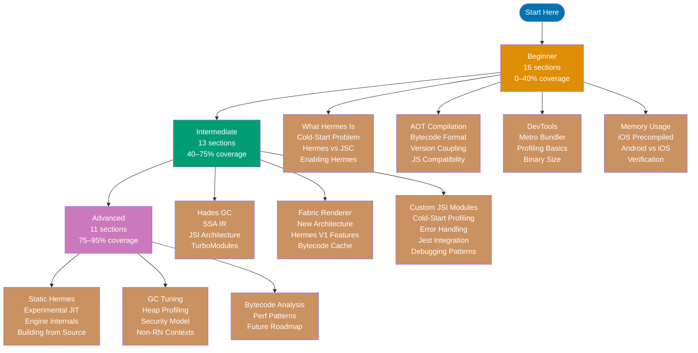

This section covers Hermes across 40 narrative-driven sections organized into three
progressive levels. Each level builds on the previous. The sections below map exactly what
each level covers and in what order.

## Learning Path

## Beginner — 16 Sections (0–40% coverage)

The beginner level establishes the conceptual foundation. No prior knowledge of JavaScript
engines is required — only basic JavaScript familiarity and a React Native project to
experiment with.

1. **What is Hermes?** — JS engine vs. React framework, Meta's mobile-specific engine, what
   it replaces (JSC)
2. **The Cold-Start Problem** — why mobile apps are slow to launch, JIT compilation cost,
   how bytecode solves it
3. **Hermes vs. JavaScriptCore** — comparison table: startup time, memory, features,
   compatibility
4. **Enabling Hermes in React Native** — `hermesEnabled = true` in Android build config,
   iOS Podfile, React Native 0.70+ default
5. **AOT Compilation Basics** — build-time vs. runtime compilation, what `.hbc` files are,
   Metro bundler role
6. **The Bytecode Format** — compact bytecode structure, string table, what `.hbc` contains
   vs. a `.js` bundle
7. **React Native Version Coupling** — why you must match Hermes to React Native version,
   how to check versions, upgrade path
8. **JavaScript Compatibility** — ES2022 features that work, what does not (`eval`,
   `new Function`), polyfill guidance
9. **Hermes DevTools Integration** — Chrome DevTools protocol, Flipper plugin, debugging
   workflow
10. **Metro Bundler and Hermes** — how Metro transforms JS to bytecode, build pipeline
    visualization
11. **Performance Profiling Basics** — `PerformanceObserver`, measuring cold-start,
    interpreting results
12. **Binary Size Impact** — how bytecode affects APK/IPA size, trade-offs vs. JSC
13. **Memory Usage on Mobile** — Hermes vs. JSC memory footprint, why this matters on
    low-end Android
14. **iOS Precompiled Binaries** — React Native 0.84+ feature, what changes in Podfile,
    build time improvement
15. **Android vs. iOS Hermes Differences** — architecture differences, ART interaction on
    Android, platform-specific quirks
16. **Verifying Hermes Is Active** — `global.HermesInternal` check, runtime verification,
    debugging the wrong engine

## Intermediate — 13 Sections (40–75% coverage)

The intermediate level covers the internal mechanisms that explain Hermes's performance
characteristics and its role in the React Native New Architecture. Prior completion of the
beginner level or equivalent experience is assumed.

1. **Hades GC Deep Dive** — concurrent GC algorithm, mark-and-sweep without stop-the-world,
   mobile memory model
2. **SSA IR and Optimization Passes** — what SSA means, optimization passes Hermes applies,
   bytecode output
3. **JSI: JavaScript Interface** — what JSI replaces (the Bridge), synchronous calls, C++
   host objects
4. **TurboModules and Hermes** — New Architecture native modules, JSI-based synchronous
   JS-to-native calls
5. **Fabric Renderer Integration** — concurrent rendering, JSI and Fabric interaction with
   Hermes
6. **New Architecture Migration** — moving from Bridge to New Architecture, Hermes
   requirement, migration guide
7. **Hermes V1 New Features** — native ES classes, Maps/Sets, async/await without
   polyfills, removed limits
8. **Bytecode Cache and Incremental Builds** — caching strategies, when bytecode is
   invalidated, build speed
9. **Custom JSI Native Modules** — writing C++ JSI-compatible native modules, host object
   pattern
10. **Profiling Cold-Start Times** — Systrace, custom performance markers, interpreting
    timeline
11. **Error Handling in Hermes** — stack traces, source maps, Hermes-specific error formats
12. **Jest Integration for Hermes** — jest-circus, Hermes helpers, testing code that targets
    Hermes
13. **Hermes-Specific Debugging Patterns** — memory inspection, heap snapshots, timeline
    profiling in Flipper

## Advanced — 11 Sections (75–95% coverage)

The advanced level covers engine internals, build customization, security boundaries, and
the future direction of Hermes. These sections assume comfort with the intermediate material
and some familiarity with C++ or native mobile development.

1. **Static Hermes** — the upcoming evolution: static typing for JS, ahead-of-static
   compilation, status as of 2026
2. **Experimental JIT in Hermes V1** — what the JIT does, when it helps (hot functions),
   when it does not, enabling it
3. **Hermes Engine Internals** — C++ core architecture, bytecode interpreter design,
   compiler pipeline
4. **Building Hermes from Source** — when you need custom builds, CMake setup, build
   targets
5. **GC Tuning for Specific Workloads** — Hades configuration parameters, memory budget
   tuning
6. **Memory Heap Profiling** — Hermes heap snapshot format, finding memory leaks, analyzing
   object retention
7. **Security Model** — no `eval`/dynamic code rationale, sandboxing implications, security
   surface analysis
8. **Hermes in Non-React-Native Contexts** — embedding Hermes as a C++ library, custom
   runtime hosts
9. **Bytecode Analysis and Manipulation** — hermes-tools, disassembler, bytecode inspection
   for debugging
10. **Performance Optimization Patterns** — bundle splitting with Hermes, lazy loading,
    AOT-aware code patterns
11. **Future Roadmap** — Static Hermes timeline, JIT maturity path, long-term JavaScript
    compatibility goals
