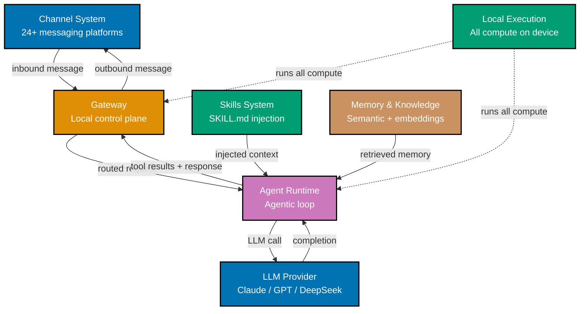

OpenClaw is an open-source autonomous AI agent framework that runs entirely on your own device
and uses messaging platforms as its primary user interface. Rather than interacting through a
dedicated app, you talk to your agent through WhatsApp, Telegram, Slack, Discord, or any of
24+ supported messaging platforms, and the agent takes action on your behalf using whatever
LLM you configure.

## What OpenClaw Is and Is Not

OpenClaw is an **agent framework** — a runtime that orchestrates the loop between user input,
LLM reasoning, tool execution, and response delivery. It is not:

- A chat application (it uses existing messaging platforms as its UI)
- A cloud AI service (it runs locally; your data stays on your device)
- A coding-only agent (like Claude Code or GitHub Copilot; OpenClaw targets general automation,
  productivity, CRM, DevOps, and personal assistant use cases)
- The **OpenClaw** game engine by pjasicek — that is a separate, unrelated open-source project
  for recreating the Commander Keen series; if you searched for "OpenClaw" and arrived here
  via that context, see [github.com/pjasicek/OpenClaw](https://github.com/pjasicek/OpenClaw)
  for the game engine

OpenClaw (the agent framework) was created in November 2025 by Austrian developer Peter
Steinberger and went through two renames: released as "Clawdbot", renamed "Moltbot" in
January 2026, then stabilized as "OpenClaw" on January 29, 2026. By March 2026 it had
247,000+ GitHub stars and 47,700+ forks. It is written in TypeScript and Swift.

## Key Differentiators

| Feature          | OpenClaw                            | Claude Code          | GitHub Copilot           |
| ---------------- | ----------------------------------- | -------------------- | ------------------------ |
| Primary UI       | Messaging platforms (24+)           | Terminal / IDE       | IDE                      |
| Execution        | Local-first (your device)           | Local                | Cloud                    |
| LLM              | Any (Claude, GPT, DeepSeek, Ollama) | Claude               | Copilot models           |
| Capability model | SKILL.md markdown files             | Built-in tools       | Built-in suggestions     |
| Use case scope   | General automation + productivity   | Software engineering | Code completion + review |
| Memory           | Semantic + knowledge base           | Session context      | Session context          |
| Multi-channel    | Yes — one agent, many platforms     | No                   | No                       |

Claude Code and GitHub Copilot are optimized for software engineering workflows inside a
development environment. OpenClaw is designed for broader automation: scheduling, CRM
integration, lead research, personal productivity, and any domain where you can describe
the capability in natural language and connect it to a tool.

## Seven Core Components

OpenClaw is built from seven distinct subsystems that work together to receive a message,
reason over it, take action, and deliver a response.

**1. Channel System** — integrates with 24+ messaging platforms (WhatsApp, Telegram, Slack,
Discord, Signal, iMessage, Microsoft Teams, and more). Each platform is a first-class channel
that the agent reads from and writes to. The Channel abstraction means your agent code never
knows or cares which platform a message came from — all channels look identical to the runtime.

**2. Gateway** — the local control plane that sits between channels and the agent runtime.
It handles routing, session management, authentication, and rate limiting. The Gateway is
what makes OpenClaw local-first: all traffic flows through your machine, never through a
third-party server.

**3. Skills System** — the mechanism by which you extend the agent's capabilities using
SKILL.md markdown files. A skill is a folder containing a SKILL.md file with natural-language
instructions, examples, and tool definitions. The runtime selectively injects only relevant
skills per turn based on message content, keeping the context window efficient.

**4. Agent Runtime** — the agentic loop engine that executes the LLM → tool call → tool result
→ LLM cycle. When the LLM decides to call a tool, the runtime executes it and feeds the
result back. This loop continues until the LLM produces a final response or a termination
condition is reached.

**5. Memory and Knowledge System** — provides semantic memory over conversation history,
a configurable knowledge base for domain documents (PDFs, markdown files), and embedding
storage for retrieval. This lets the agent recall past interactions and answer questions
from your documents.

**6. LLM Provider** — the pluggable interface that connects the runtime to any language model.
Supported providers include Claude (Anthropic), GPT-4o (OpenAI), DeepSeek, Gemini, and
locally-running models via Ollama. You configure which provider and model to use; the rest
of the system is provider-agnostic.

**7. Local Execution** — the foundational commitment that all computation happens on your
device. No conversation data is sent to OpenClaw servers. Your messages go from your device
to your chosen LLM provider's API (with the same privacy expectations as using that API
directly), and nowhere else.

## Learning Path

The OpenClaw documentation is organized into three levels:

| Level                                                                                                | What You Will Learn                                                                       |
| ---------------------------------------------------------------------------------------------------- | ----------------------------------------------------------------------------------------- |
| **[Beginner](/en/learn/artificial-intelligence/coding-agents/openclaw/by-concept/beginner)**         | Core concepts, installation, first channel, Skills basics, the agent runtime loop         |
| **[Intermediate](/en/learn/artificial-intelligence/coding-agents/openclaw/by-concept/intermediate)** | Writing custom skills, multi-channel routing, memory deep-dive, multi-agent orchestration |
| **[Advanced](/en/learn/artificial-intelligence/coding-agents/openclaw/by-concept/advanced)**         | Custom LLM providers, Gateway customization, security hardening, production deployment    |

**Where to start:**

- If you have never used an autonomous agent framework before, start at Beginner.
- If you have used Claude Code, LangChain, or a similar tool and understand agentic loops,
  you can skim the first four Beginner sections and start at "Your First Channel: Telegram".
- If you are evaluating OpenClaw for a production deployment or custom LLM integration,
  the Advanced sections on Security Hardening and Production Deployment are your priority.

## Prerequisites

Before starting, you need:

- **Basic TypeScript or JavaScript** — you can read and modify a TypeScript configuration
  file and understand `async/await`. You do not need to be a TypeScript expert.
- **A messaging account** — a Telegram, Slack, or Discord account where you can create a bot.
  The Beginner section walks through Telegram first because it has the simplest bot setup.
- **An LLM API key** — a Claude API key (Anthropic Console), an OpenAI API key, or a
  DeepSeek API key. Alternatively, Ollama can run a local model with no external API key.
- **Node.js 20+** — required to run the OpenClaw TypeScript runtime.
- **macOS or Linux** — the companion apps are macOS/iOS only, but the core runtime runs on
  any platform with Node.js. Windows is supported with WSL2.
