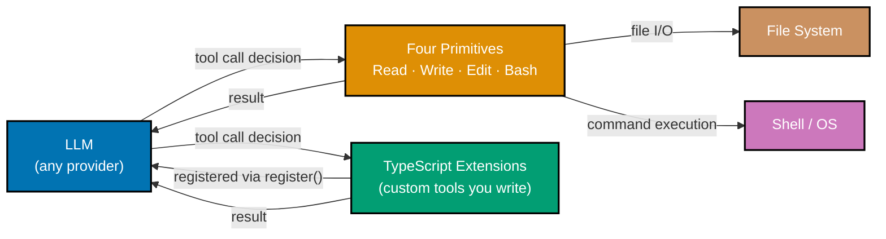

Pi is a minimal, open-source, terminal-based AI coding agent harness. It provides exactly four
primitive tools — Read, Write, Edit, and Bash — and deliberately stops there. Everything else
you need is added through TypeScript extensions you write yourself, which means you control
every capability the agent has and you can inspect every line of code running in your session.

## What Pi Is and Is Not

Pi is an **agent harness** — a transparent runtime that exposes a small, auditable surface area
and then gets out of your way. It is not:

- A programming language (despite the name)
- Raspberry Pi hardware or the Raspberry Pi Foundation's software ecosystem
- Pi calculus — the formal model of computation for concurrent processes
- A full-featured all-in-one product like Claude Code or Cursor — those are built for breadth;
  Pi is built for developers who want to understand and control exactly what runs in their terminal

Pi was created by Mario Zechner, the Austrian developer best known for creating the libGDX
game framework, and is now maintained by Earendil Inc. The current version is v0.75.4
(released May 20, 2026). The codebase is 93.4% TypeScript, hosted at
[github.com/earendil-works/pi](https://github.com/earendil-works/pi), with documentation at
[pi.dev](https://pi.dev/).

## The Four Primitive Tools Philosophy

Pi's defining characteristic is its intentionally minimal tool surface. Where other coding
agents ship with dozens of built-in capabilities, Pi ships with exactly four:

| Tool    | What It Does                             |
| ------- | ---------------------------------------- |
| `Read`  | Read file contents from disk             |
| `Write` | Create or overwrite a file               |
| `Edit`  | Edit part of a file (diff-based changes) |
| `Bash`  | Execute shell commands                   |

This is not a limitation — it is the design. Four primitives compose into any capability:
a web search becomes a `Bash` tool calling `curl`; a code formatter becomes `Bash` running
`prettier`; a database query becomes `Bash` calling `psql`. The primitives expose the full
power of the operating system without abstracting it behind proprietary tool APIs that you
cannot inspect or modify.

Minimal surface area also means minimal attack surface. When you run Pi in an unfamiliar
repository, you can audit exactly what tools are registered and what each one does. No
hidden built-ins, no undocumented capabilities.

## Pi vs. Other Coding Agents

Pi occupies a distinct position in the coding agent landscape. The comparison below focuses on
design philosophy differences that affect day-to-day use:

| Feature              | Pi                                 | Claude Code         | GitHub Copilot         | Cursor              |
| -------------------- | ---------------------------------- | ------------------- | ---------------------- | ------------------- |
| System prompt        | 25 lines, fully user-modifiable    | 207 lines, hidden   | Cloud-managed          | IDE-managed         |
| Primitive tools      | 4 (explicit, all auditable)        | Many built-in       | IDE-integrated         | IDE-integrated      |
| Extensibility        | TypeScript modules, hot-reload     | CLAUDE.md + skills  | Extensions marketplace | Rules + plugins     |
| UI                   | Terminal TUI                       | Terminal            | IDE sidebar            | IDE (full)          |
| LLM providers        | 15+ (Anthropic, OpenAI, Ollama, …) | Anthropic only      | Copilot models         | Multiple via API    |
| System prompt access | Full read + write access           | Read-only reference | None                   | Partial             |
| Session structure    | Tree (branch from any point)       | Linear              | Linear                 | Linear              |
| Self-extension       | Yes — agent writes its own tools   | No                  | No                     | No                  |
| Target audience      | Developers who want full control   | Engineers, wide use | All skill levels       | Engineers, wide use |

The most significant difference is transparency. Pi's 25-line system prompt is fully visible
and replaceable via a `SYSTEM.md` file in any project directory. Claude Code's 207-line system
prompt is not user-accessible. This matters when you want to understand exactly why the agent
made a particular decision, or when you need to inject domain-specific behavior that cannot be
expressed in a context file.

## Key Packages

Pi is organized as a monorepo with four core packages. Each package is independently
installable if you only need part of the stack:

**`@earendil-works/pi-ai`** — Unified multi-provider LLM API. Provides a single interface for
OpenAI, Anthropic, Google, AWS Bedrock, Ollama, and 15+ other providers. Used by the agent
runtime and usable standalone if you want provider-agnostic LLM calls in your own code.

**`@earendil-works/pi-agent-core`** — Agent runtime with tool calling and state management.
This is the core loop: receive user input, call the LLM, execute tool calls, feed results
back, repeat until done. Use this package to embed a Pi-style agent inside your own application.

**`@earendil-works/pi-coding-agent`** — Full coding agent CLI with session persistence and
extensibility. This is what you install when you want to use Pi as a terminal coding assistant.
It wraps `pi-agent-core` with file-system session storage, extension loading, TUI rendering,
and all four primitive tools.

**`@earendil-works/pi-tui`** — Terminal UI library with differential rendering. Handles the
visual layer: input area, tool output pane, keybindings, and layout. Use this package
standalone if you want to build other terminal applications with Pi's rendering engine.

## Learning Path

The by-concept learning track is organized into three levels:

| Level                                                                                          | What You Will Learn                                                                    |
| ---------------------------------------------------------------------------------------------- | -------------------------------------------------------------------------------------- |
| **[Beginner](/en/learn/artificial-intelligence/coding-agents/pi/by-concept/beginner)**         | What Pi is, four primitive tools, installation, TUI, sessions, context, multi-provider |
| **[Intermediate](/en/learn/artificial-intelligence/coding-agents/pi/by-concept/intermediate)** | Custom extensions, skills, context management, RPC, SDK embedding, pi-ai, pi-tui       |
| **[Advanced](/en/learn/artificial-intelligence/coding-agents/pi/by-concept/advanced)**         | Self-extensibility, domain agents, air-gapped deployment, CI/CD, production hardening  |

**Where to start:**

- If you have never used a terminal coding agent before, start at Beginner and work through
  each section in order.
- If you have used Claude Code, Aider, or a similar tool and understand the agentic loop,
  you can skim the first five Beginner sections (What is Pi through Your First Session) and
  start at "AGENTS.md: Context Configuration".
- If you are evaluating Pi for a production or security-sensitive deployment, the Advanced
  sections on Production Hardening and CI/CD Integration are your priority.
- If you want to embed Pi's runtime in your own application, go directly to the Intermediate
  section "SDK Embedding: pi-agent-core".

## Prerequisites

Before starting, you need:

- **Node.js 18 or later** — required to install and run the Pi CLI. Node.js 20 LTS is
  recommended. You can check your version with `node --version`.
- **npm 9 or later** — used to install `@earendil-works/pi-coding-agent`. Bundled with Node.js.
- **A terminal** — Pi runs in any POSIX-compatible terminal on macOS, Linux, or Windows (WSL2
  or Windows Terminal). The TUI uses standard terminal escape codes.
- **An LLM API key** — a key for at least one supported provider: Anthropic (Claude),
  OpenAI (GPT-4o), Google (Gemini), or DeepSeek. If you prefer local models, Ollama runs
  without an external key. Key configuration is covered in the Beginner section.
- **TypeScript familiarity (helpful, not required for Beginner)** — the Beginner level uses
  Pi as a CLI tool only. The Intermediate and Advanced levels involve writing TypeScript
  extension modules.
