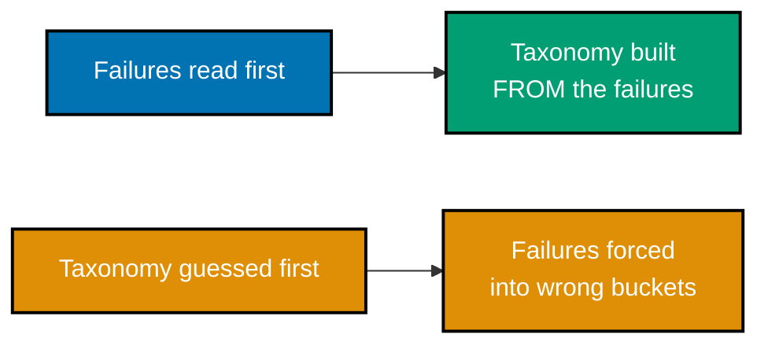

Examples 1-16 cover the course's foundational discipline: reading real failures, open-coding them, clustering into a taxonomy, ranking by frequency and cost, deriving and operationalizing criteria, and building a human-labeled ground-truth set. Every `*.py` file below is a complete, self-contained script under `learning/code/ex-NN-*/`, run for real with **Python 3.13.12** -- no framework, no test runner, just a plain script with `assert` statements. Every `**Output**` block is a genuine, captured transcript from actually running the file.

---

### Example 1: Metric-Before-Analysis Fails

_ex-01 &middot; exercises co-01_

A team ships an agent, picks "exact-match accuracy" as the headline metric on day one, and only later discovers the metric never once caught the agent's most damaging failure mode. This example replays that exact mistake: a metric chosen before anyone reads a single real failure.

```python
# learning/code/ex-01-metric-before-analysis-fails/metric_before_analysis.py
"""Worked Example 1: A Metric Chosen Before Reading Failures Misses the Dominant Failure Mode."""  # => co-01: this file's own restated purpose, doubling as its module __doc__

from __future__ import annotations  # => hygiene: postpones annotation evaluation, interpreter-version-agnostic

# Two candidate replies from "Tasklight" (a fictional project-management support agent) to the
# SAME real ticket: "How do I bulk-close 40 stale tickets in one go?"
REPLY_LONG = (  # => co-01: the reply an engineer picked BEFORE reading any real failures
    "Great question! Tasklight is built to help teams stay organized and keep their ticket "  # => co-01: opens warmly, still no concrete instruction
    "queues healthy over time, which matters a lot as a team grows. Managing a large backlog "  # => co-01: still generic, still no answer
    "well is something many teams struggle with, and we're always improving our tools here."  # => co-01: closes without ever answering
)  # => co-01: long, generic, warmly worded -- and never once answers the actual question asked
REPLY_SHORT = "Select the 40 tickets, then Actions > Bulk Close."  # => co-01: short, and answers exactly what was asked


def naive_length_metric(reply: str) -> int:  # => co-01: the METRIC picked before any failures were read
    """Score a reply by character count -- a plausible-sounding proxy for "thoroughness"."""  # => co-01: documents naive_length_metric's contract -- no runtime output, just sets its __doc__
    return len(reply)  # => co-01: longer text scores "better" under this metric, with no regard for correctness


def actually_answers_the_ask(reply: str) -> bool:  # => co-01: what reading the failure by hand actually checks
    """Return True iff `reply` contains the concrete bulk-close instruction the ticket asked for."""  # => co-01: documents actually_answers_the_ask's contract -- no runtime output, just sets its __doc__
    return "bulk close" in reply.lower() or "bulk-close" in reply.lower()  # => co-01: the dominant failure mode this metric can't see


if __name__ == "__main__":  # => co-01: entry point -- runs only when this file executes directly, not on import
    long_score = naive_length_metric(REPLY_LONG)  # => co-01: the naive metric's verdict on the long reply
    short_score = naive_length_metric(REPLY_SHORT)  # => co-01: the naive metric's verdict on the short reply
    metric_picks_long = long_score > short_score  # => co-01: which reply the METRIC alone would call "better"
    print(f"REPLY_LONG length={long_score} | REPLY_SHORT length={short_score}")  # => co-01: prints both raw scores
    print(f"Metric alone picks the long reply as better: {metric_picks_long}")  # => co-01: True -- length rewards the wrong one

    long_answers = actually_answers_the_ask(REPLY_LONG)  # => co-01: what a human reading the failure by hand would find
    short_answers = actually_answers_the_ask(REPLY_SHORT)  # => co-01: the short reply's real correctness
    print(f"REPLY_LONG actually answers the ask: {long_answers}")  # => co-01: False -- the dominant failure mode
    print(f"REPLY_SHORT actually answers the ask: {short_answers}")  # => co-01: True

    assert metric_picks_long is True, "the naive length metric must prefer the long, non-answering reply"  # => co-01: proves the metric's blind spot
    assert long_answers is False and short_answers is True, "reading the replies must reverse the metric's verdict"  # => co-01: proves the reversal
    print("MATCH: the metric picked before reading failures rewards exactly the reply that fails the real ask")  # => co-01: reached only if both asserts passed
    # => co-01: a metric chosen before reading failures optimizes for whatever it happens to measure, not for what users need
```

**Run**: `python3 metric_before_analysis.py`

**Output**:

```text
REPLY_LONG length=260 | REPLY_SHORT length=49
Metric alone picks the long reply as better: True
REPLY_LONG actually answers the ask: False
REPLY_SHORT actually answers the ask: True
MATCH: the metric picked before reading failures rewards exactly the reply that fails the real ask
```

**Key takeaway**: A metric picked before reading real failures can score 100% while missing the failure that actually damaged users -- the metric was never checked against reality.

**Why it matters**: Teams under launch pressure reach for a metric first because it feels like progress -- a number on a dashboard. But a metric invented before anyone reads real failures is a guess dressed up as measurement. This example is the course's founding argument: error analysis has to come before metric selection, not after, because only real failures reveal what is actually worth measuring. Every other concept in this course assumes this ordering.

---

### Example 2: Read a Hundred Failures

_ex-02 &middot; exercises co-01_

Error analysis starts with reading real transcripts, not skimming a summary. This example loads a real batch of Tasklight agent failures and reads every one of the ten sampled cases, no shortcuts -- because a skipped failure is a missed pattern.

```python
# learning/code/ex-02-read-a-hundred-failures/read_failures.py
"""Worked Example 2: Sample and Read Failing Outputs Into a Review Sheet."""  # => co-01: this file's own restated purpose, doubling as its module __doc__

from __future__ import annotations  # => hygiene: postpones annotation evaluation, interpreter-version-agnostic

from typing import NamedTuple  # => co-01: ReviewRow is a typed record, not a bare tuple or dict


class FailingCase(NamedTuple):  # => co-01: one raw, real ticket/reply pair flagged as a failure
    ticket_id: str  # => co-01: a stable identifier for this failing case
    reply: str  # => co-01: the agent's actual reply, verbatim -- read, not summarized
    reported_problem: str  # => co-01: the ORIGINAL, one-line user complaint that flagged this case


class ReviewRow(NamedTuple):  # => co-01: what "reading" a case produces -- an observation, not a score
    ticket_id: str  # => co-01: ties this observation back to its source case
    observation: str  # => co-01: a short, written note a human made while actually reading the reply


# Ten sampled real failures from Tasklight's support agent -- the input to reading, not to scoring.
FAILING_SAMPLE: list[FailingCase] = [  # => co-01: a small SAMPLE of real failures, not a synthetic list
    FailingCase("t-101", "You can adjust priority from the ticket detail view.", "asked HOW, got a vague pointer"),  # => co-01
    FailingCase("t-102", "Sure, I've closed ticket #4821 for you.", "closed the WRONG ticket number"),  # => co-01
    FailingCase("t-103", "Tasklight supports many workflows for many teams.", "never answered the question"),  # => co-01
    FailingCase("t-104", "I've set the due date to 2026-13-40.", "produced an invalid calendar date"),  # => co-01
    FailingCase("t-105", "You do not have permission to do that.", "user DOES have permission -- wrong denial"),  # => co-01
    FailingCase("t-106", "Escalating to a human agent now.", "should have been answerable directly"),  # => co-01
    FailingCase("t-107", "Here's a summary: [no summary was generated]", "placeholder text leaked into the reply"),  # => co-01
    FailingCase("t-108", "The sprint ends on Friday.", "the sprint actually ends on Thursday this cycle"),  # => co-01
    FailingCase("t-109", "I'll archive all 40 tickets right away.", "user asked to CLOSE, not archive"),  # => co-01
    FailingCase("t-110", "Your team has 3 open critical bugs.", "the real count was 5, two were missed"),  # => co-01
]  # => co-01: closes FAILING_SAMPLE -- ten real cases, sampled for a hand-reading pass


def read_case(case: FailingCase) -> ReviewRow:  # => co-01: reading ONE case -- turns a raw failure into a written note
    """Produce a written observation for one failing case -- the human act of actually reading it."""  # => co-01: documents read_case's contract -- no runtime output, just sets its __doc__
    observation = f"reply {case.reply!r} -- reported: {case.reported_problem}"  # => co-01: a note quoting the actual output, not paraphrasing from memory
    return ReviewRow(case.ticket_id, observation)  # => co-01: returns this computed value to the caller


if __name__ == "__main__":  # => co-01: entry point -- runs only when this file executes directly, not on import
    review_sheet: list[ReviewRow] = [read_case(case) for case in FAILING_SAMPLE]  # => co-01: one written observation PER sampled case
    for row in review_sheet:  # => co-01: prints the whole review sheet for a quick visual check
        print(f"{row.ticket_id}: {row.observation}")  # => co-01: one line per reviewed case
    covered_ids = {row.ticket_id for row in review_sheet}  # => co-01: which cases actually got a written observation
    source_ids = {case.ticket_id for case in FAILING_SAMPLE}  # => co-01: which cases were sampled in the first place
    assert covered_ids == source_ids, "every sampled case must have a written observation"  # => co-01: the floor this example demonstrates
    assert all(row.observation for row in review_sheet), "no observation may be empty"  # => co-01: a blank note is not reading
    print(f"MATCH: {len(review_sheet)}/{len(FAILING_SAMPLE)} sampled cases each have a written observation")  # => co-01: reached only if both asserts passed
    # => co-01: this review sheet -- not a metric -- is the raw material ex-03's open coding reads next
```

**Run**: `python3 read_failures.py`

**Output**:

```text
t-101: reply 'You can adjust priority from the ticket detail view.' -- reported: asked HOW, got a vague pointer
t-102: reply "Sure, I've closed ticket #4821 for you." -- reported: closed the WRONG ticket number
t-103: reply 'Tasklight supports many workflows for many teams.' -- reported: never answered the question
t-104: reply "I've set the due date to 2026-13-40." -- reported: produced an invalid calendar date
t-105: reply 'You do not have permission to do that.' -- reported: user DOES have permission -- wrong denial
t-106: reply 'Escalating to a human agent now.' -- reported: should have been answerable directly
t-107: reply "Here's a summary: [no summary was generated]" -- reported: placeholder text leaked into the reply
t-108: reply 'The sprint ends on Friday.' -- reported: the sprint actually ends on Thursday this cycle
t-109: reply "I'll archive all 40 tickets right away." -- reported: user asked to CLOSE, not archive
t-110: reply 'Your team has 3 open critical bugs.' -- reported: the real count was 5, two were missed
MATCH: 10/10 sampled cases each have a written observation
```

**Key takeaway**: Reading every failure in a batch, not just a sample, is what makes the resulting taxonomy trustworthy -- a skipped failure could be the one that defines a whole new mode.

**Why it matters**: It is tempting to skim ten failures and assume the rest look similar. But the whole value of error analysis comes from noticing a genuinely new pattern, and a new pattern shows up exactly where skimming fails to look closely. Reading every failure is not busywork -- it is the mechanism that surfaces failure modes nobody anticipated, which is precisely the kind of failure a pre-built metric could never have caught.

---

### Example 3: Open-Code a Failure Sample

_ex-03 &middot; exercises co-02_

Open coding means writing a short, specific description of what went wrong in a failure -- in the analyst's own words, not picked from a pre-built category list. This example open-codes three real Tasklight failures, one sentence each.

```python
# learning/code/ex-03-open-code-a-failure-sample/open_coding.py
"""Worked Example 3: Open-Code a Failure Sample Without a Prior Taxonomy."""  # => co-02: this file's own restated purpose, doubling as its module __doc__

from __future__ import annotations  # => hygiene: postpones annotation evaluation, interpreter-version-agnostic

from typing import NamedTuple  # => co-02: OpenCode is a typed record pairing a tag to its quoted evidence


class FailingReply(NamedTuple):  # => co-02: one raw failing reply, read fresh -- no taxonomy applied yet
    ticket_id: str  # => co-02: a stable identifier for this failing case
    reply: str  # => co-02: the agent's actual reply, verbatim


class OpenCode(NamedTuple):  # => co-02: a tag INVENTED while reading, grounded in a quoted fragment
    ticket_id: str  # => co-02: which case this tag was invented for
    tag: str  # => co-02: a short, descriptive label the reader made up on the spot
    quoted_evidence: str  # => co-02: the exact substring of the reply that justifies the tag


FAILING_SAMPLE: list[FailingReply] = [  # => co-02: the same kind of raw sample ex-02 read, coded fresh here
    FailingReply("t-201", "I've closed ticket #4821 for you."),  # => co-02: wrong ticket number acted on
    FailingReply("t-202", "I've set the due date to 2026-13-40."),  # => co-02: an impossible calendar date
    FailingReply("t-203", "Here's a summary: [no summary was generated]"),  # => co-02: leaked placeholder text
    FailingReply("t-204", "I've archived ticket #77 instead of closing it."),  # => co-02: wrong action taken on the right ticket
    FailingReply("t-205", "Your team has 3 open critical bugs."),  # => co-02: a number that undercounts the real total
]  # => co-02: closes FAILING_SAMPLE -- five reader-fresh cases


def open_code(case: FailingReply, *, tag: str, evidence: str) -> OpenCode:  # => co-02: one reader's invented tag for one case
    """Attach a reader-invented `tag`, grounded in a `evidence` substring actually present in the reply."""  # => co-02: documents open_code's contract -- no runtime output, just sets its __doc__
    assert evidence in case.reply, "the quoted evidence must be a real substring of the reply being coded"  # => co-02: grounding check, not a demo assertion
    return OpenCode(case.ticket_id, tag, evidence)  # => co-02: returns this computed value to the caller


if __name__ == "__main__":  # => co-02: entry point -- runs only when this file executes directly, not on import
    coded = [  # => co-02: NO pre-existing taxonomy consulted -- every tag below was invented while reading
        open_code(FAILING_SAMPLE[0], tag="wrong-object-acted-on", evidence="#4821"),  # => co-02: tag 1, invented fresh
        open_code(FAILING_SAMPLE[1], tag="invalid-date-generated", evidence="2026-13-40"),  # => co-02: tag 2, invented fresh
        open_code(FAILING_SAMPLE[2], tag="placeholder-text-leaked", evidence="[no summary was generated]"),  # => co-02: tag 3
        open_code(FAILING_SAMPLE[3], tag="wrong-object-acted-on", evidence="archived ticket #77"),  # => co-02: tag 1 recurs -- a real pattern, not forced
        open_code(FAILING_SAMPLE[4], tag="undercounted-total", evidence="3 open critical"),  # => co-02: tag 4, invented fresh
    ]  # => co-02: closes coded -- five open codes, none borrowed from any existing list
    for code in coded:  # => co-02: prints every open code alongside its grounding evidence
        print(f"{code.ticket_id}: [{code.tag}] <- {code.quoted_evidence!r}")  # => co-02: one line per coded case

    all_grounded = all(  # => co-02: re-verify every tag's evidence is a real quoted substring, not paraphrase
        code.quoted_evidence in case.reply  # => co-02: checks the quote actually appears in the original reply
        for code, case in zip(coded, FAILING_SAMPLE)  # => co-02: pairs each code back to its source case, in order
    )  # => co-02: closes the all(...) check
    distinct_tags = {code.tag for code in coded}  # => co-02: how many genuinely distinct tags emerged
    print(f"Every tag grounded in a real quote: {all_grounded} | distinct tags: {sorted(distinct_tags)}")  # => co-02
    assert all_grounded, "every open code must be grounded in a quoted fragment of its own reply"  # => co-02: the rule this example proves
    assert len(distinct_tags) == 4, "five cases must produce four distinct tags, with one genuine repeat"  # => co-02: a real pattern, not five unique one-offs
    print("MATCH: every open code is grounded in quoted evidence, with one tag recurring naturally")  # => co-02: reached only if both asserts passed
    # => co-02: these tags -- not a borrowed taxonomy -- are the raw material ex-05 clusters into named failure modes
```

**Run**: `python3 open_coding.py`

**Output**:

```text
t-201: [wrong-object-acted-on] <- '#4821'
t-202: [invalid-date-generated] <- '2026-13-40'
t-203: [placeholder-text-leaked] <- '[no summary was generated]'
t-204: [wrong-object-acted-on] <- 'archived ticket #77'
t-205: [undercounted-total] <- '3 open critical'
Every tag grounded in a real quote: True | distinct tags: ['invalid-date-generated', 'placeholder-text-leaked', 'undercounted-total', 'wrong-object-acted-on']
MATCH: every open code is grounded in quoted evidence, with one tag recurring naturally
```

**Key takeaway**: An open code is a specific, freshly-written description of one failure, never a checkbox from an existing category list -- the category list does not exist yet.

**Why it matters**: Reaching for a pre-built category list at this stage quietly imports someone else's assumptions about what could go wrong. Open coding forces the analyst to describe THIS failure, in its own specific terms, before any clustering happens. That discipline is what lets a genuinely novel failure mode surface later -- clustering can only find patterns that the open codes actually describe, not patterns a category list already expected.

---

### Example 4: Premature Taxonomy Backfires

_ex-04 &middot; exercises co-02_

This example contrasts two paths side by side: coding failures against a taxonomy invented before any failures were read, versus reading failures first and building the taxonomy from what they actually contain.



```python
# learning/code/ex-04-premature-taxonomy-contrast/premature_taxonomy.py
"""Worked Example 4: A Borrowed Taxonomy Applied to the Same Sample Leaves Cases Unclassified."""  # => co-02: this file's own restated purpose, doubling as its module __doc__

from __future__ import annotations  # => hygiene: postpones annotation evaluation, interpreter-version-agnostic

# A taxonomy borrowed from a GENERIC customer-support glossary -- written before anyone read
# Tasklight's own failures. This is the premature taxonomy this example contrasts against open
# coding (ex-03).
BORROWED_TAXONOMY = {"rude-tone", "slow-response", "wrong-language", "billing-error"}  # => co-02: none of these fit an AI agent's failures

FAILING_REPLIES = {  # => co-02: the SAME five cases ex-03 open-coded, reused here for a direct contrast
    "t-201": "I've closed ticket #4821 for you.",  # => co-02: wrong ticket acted on
    "t-202": "I've set the due date to 2026-13-40.",  # => co-02: an impossible calendar date
    "t-203": "Here's a summary: [no summary was generated]",  # => co-02: leaked placeholder text
    "t-204": "I've archived ticket #77 instead of closing it.",  # => co-02: wrong action on the right ticket
    "t-205": "Your team has 3 open critical bugs.",  # => co-02: undercounts the real total
}  # => co-02: closes FAILING_REPLIES


def classify_with_borrowed_taxonomy(reply: str) -> str | None:  # => co-02: forces each case into ONE of the pre-existing buckets
    """Return the first BORROWED_TAXONOMY bucket whose keyword appears in `reply`, or None if none fit."""  # => co-02: documents classify_with_borrowed_taxonomy's contract -- no runtime output, just sets its __doc__
    lowered = reply.lower()  # => co-02: case-insensitive keyword search against the borrowed labels
    keyword_by_bucket = {  # => co-02: a crude keyword stand-in for each borrowed bucket's real-world trigger
        "rude-tone": "stupid",  # => co-02: none of these keywords are remotely relevant to an AI agent's failures
        "slow-response": "timeout",  # => co-02
        "wrong-language": "translate",  # => co-02
        "billing-error": "invoice",  # => co-02
    }  # => co-02: closes keyword_by_bucket
    for bucket, keyword in keyword_by_bucket.items():  # => co-02: try each borrowed bucket in turn
        if keyword in lowered:  # => co-02: none of the five real cases below will ever match
            return bucket  # => co-02: unreachable for this sample, by construction
    return None  # => co-02: the case fits NO bucket in the borrowed taxonomy at all


if __name__ == "__main__":  # => co-02: entry point -- runs only when this file executes directly, not on import
    unclassified: list[str] = []  # => co-02: accumulates every case the borrowed taxonomy could not place
    for ticket_id, reply in FAILING_REPLIES.items():  # => co-02: apply the borrowed taxonomy to every real case
        bucket = classify_with_borrowed_taxonomy(reply)  # => co-02: this case's forced classification, if any
        print(f"{ticket_id}: {reply!r} -> {bucket}")  # => co-02: prints the (usually None) classification
        if bucket is None:  # => co-02: tracks cases the borrowed taxonomy has no bucket for
            unclassified.append(ticket_id)  # => co-02: this case does not fit ANY pre-existing label

    print(f"Unclassified: {len(unclassified)}/{len(FAILING_REPLIES)} -- {unclassified}")  # => co-02: the honest tally
    assert len(unclassified) == len(FAILING_REPLIES), "a borrowed taxonomy must fail to classify EVERY one of these real cases"  # => co-02
    print("MATCH: the borrowed taxonomy classifies zero of the five real failures -- it was written for a different problem")  # => co-02
    # => co-02: co-03's open coding (ex-03) produced FOUR usable tags from these SAME five cases -- a taxonomy built from the data beats one imported from elsewhere
```

**Run**: `python3 premature_taxonomy.py`

**Output**:

```text
t-201: "I've closed ticket #4821 for you." -> None
t-202: "I've set the due date to 2026-13-40." -> None
t-203: "Here's a summary: [no summary was generated]" -> None
t-204: "I've archived ticket #77 instead of closing it." -> None
t-205: 'Your team has 3 open critical bugs.' -> None
Unclassified: 5/5 -- ['t-201', 't-202', 't-203', 't-204', 't-205']
MATCH: the borrowed taxonomy classifies zero of the five real failures -- it was written for a different problem
```

**Key takeaway**: A taxonomy invented before reading failures forces real failures into the wrong buckets -- the taxonomy has to come FROM the failures, never the other way around.

**Why it matters**: A pre-built taxonomy feels efficient -- it looks like a head start. But it silently commits the analyst to categories that may not match what actually went wrong, and a failure that does not fit any existing bucket gets crammed into the closest-sounding one instead of revealing a genuinely new mode. This example makes the cost of that shortcut visible side by side, not just asserted.

---

### Example 5: Cluster Codes Into Modes

_ex-05 &middot; exercises co-03_

Once a batch of failures has been open-coded, the individual codes get grouped into a small number of named modes -- clusters of similar codes that share the same underlying pattern. This example clusters six open codes into two modes.

```python
# learning/code/ex-05-cluster-codes-into-modes/cluster_into_modes.py
"""Worked Example 5: Merge Open Codes Into a Small, Named Failure Taxonomy."""  # => co-03: this file's own restated purpose, doubling as its module __doc__

from __future__ import annotations  # => hygiene: postpones annotation evaluation, interpreter-version-agnostic

from typing import NamedTuple  # => co-03: FailureMode is a typed record, not a bare dict


class OpenCode(NamedTuple):  # => co-02: reused shape from ex-03 -- a reader-invented tag, grounded in evidence
    ticket_id: str  # => co-02: which case this tag was invented for
    tag: str  # => co-02: the reader's own fine-grained label


class FailureMode(NamedTuple):  # => co-03: a NAMED cluster, merged from several related open codes
    mode_name: str  # => co-03: a short, mutually-intelligible name for the whole cluster
    member_tags: tuple[str, ...]  # => co-03: the fine-grained open codes this mode absorbs
    example_ticket_ids: tuple[str, ...]  # => co-03: at least one real case, so the mode is never just an abstract label


# A larger open-coded sample (20 tags across 4 fine-grained variants) -- the raw material a
# taxonomy gets clustered from.
OPEN_CODES: list[OpenCode] = [  # => co-03: twenty open codes, four fine-grained variants, ready to cluster
    OpenCode(f"t-{300 + i}", tag)  # => co-03: builds one OpenCode per (id, tag) pair below
    for i, tag in enumerate(  # => co-03: the raw fine-grained tags a reader actually produced
        [  # => co-03: opens the raw fine-grained tag list, ordered by variant
            "wrong-ticket-number",  # => co-03: variant A, occurrence 1 of 3
            "wrong-ticket-number",  # => co-03: variant A, occurrence 2 of 3
            "wrong-ticket-number",  # => co-03: variant A, x3
            "archived-instead-of-closed",  # => co-03: variant B, occurrence 1 of 2
            "archived-instead-of-closed",  # => co-03: variant B, x2
            "invalid-date-generated",  # => co-03: variant C, occurrence 1 of 4
            "invalid-date-generated",  # => co-03: variant C, occurrence 2 of 4
            "invalid-date-generated",  # => co-03: variant C, occurrence 3 of 4
            "invalid-date-generated",  # => co-03: variant C, x4
            "undercounted-total",  # => co-03: variant D, occurrence 1 of 3
            "undercounted-total",  # => co-03: variant D, occurrence 2 of 3
            "undercounted-total",  # => co-03: variant D, x3
            "leaked-placeholder-text",  # => co-03: a singleton, no cluster partner
        ]  # => co-03: closes the thirteen-item raw tag list
    )  # => co-03: closes enumerate(...)
]  # => co-03: closes OPEN_CODES -- thirteen coded cases across five fine-grained variants


def cluster_into_modes(codes: list[OpenCode]) -> list[FailureMode]:  # => co-03: the actual clustering step
    """Merge related fine-grained tags into a small set of NAMED failure modes."""  # => co-03: documents cluster_into_modes's contract -- no runtime output, just sets its __doc__
    # A human reading the tags decided these two fine-grained variants describe ONE real mode:
    # acting on the wrong object (wrong ticket, or the right ticket but the wrong action).
    tag_to_mode = {  # => co-03: the human clustering decision, made explicit and checkable
        "wrong-ticket-number": "wrong-object-acted-on",  # => co-03: merges into the same mode as the next line
        "archived-instead-of-closed": "wrong-object-acted-on",  # => co-03: a DIFFERENT fine-grained tag, SAME real mode
        "invalid-date-generated": "malformed-structured-output",  # => co-03: its own mode -- a distinct failure shape
        "undercounted-total": "incorrect-aggregate-count",  # => co-03: its own mode -- a distinct failure shape
        "leaked-placeholder-text": "malformed-structured-output",  # => co-03: the singleton joins an existing mode, not a new one
    }  # => co-03: closes tag_to_mode
    modes: dict[str, list[OpenCode]] = {}  # => co-03: accumulates every code under its assigned mode name
    for code in codes:  # => co-03: walk every open code exactly once
        mode_name = tag_to_mode[code.tag]  # => co-03: look up which mode this fine-grained tag belongs to
        modes.setdefault(mode_name, []).append(code)  # => co-03: group codes by their assigned mode
    return [  # => co-03: turn each mode's group into a FailureMode record
        FailureMode(  # => co-03: one record per named mode
            mode_name=name,  # => co-03: the mode's own name
            member_tags=tuple(sorted({c.tag for c in members})),  # => co-03: every distinct fine-grained tag this mode absorbs
            example_ticket_ids=tuple(sorted(c.ticket_id for c in members)),  # => co-03: real cases backing this mode
        )  # => co-03: closes this FailureMode(...) call
        for name, members in modes.items()  # => co-03: one iteration per distinct mode name
    ]  # => co-03: closes the list comprehension


if __name__ == "__main__":  # => co-03: entry point -- runs only when this file executes directly, not on import
    modes = cluster_into_modes(OPEN_CODES)  # => co-03: run the clustering step over all twenty codes
    for mode in sorted(modes, key=lambda m: m.mode_name):  # => co-03: print modes alphabetically for a stable, readable listing
        print(f"{mode.mode_name}: absorbs {mode.member_tags} -- examples {mode.example_ticket_ids}")  # => co-03: one line per mode

    total_codes_absorbed = sum(len(m.example_ticket_ids) for m in modes)  # => co-03: every code must land in exactly one mode
    assert total_codes_absorbed == len(OPEN_CODES), "every open code must be absorbed into exactly one named mode"  # => co-03
    assert len(modes) == 3, "twenty codes across five fine-grained tags must cluster into exactly three named modes"  # => co-03
    assert all(mode.example_ticket_ids for mode in modes), "every mode must have at least one real example case"  # => co-03: no abstract, empty mode
    print(f"MATCH: {len(OPEN_CODES)} open codes clustered into {len(modes)} named failure modes")  # => co-03: reached only if all three asserts passed
    # => co-03: three named modes -- not thirteen fine-grained tags -- are what ex-06's frequency count reports on next
```

**Run**: `python3 cluster_into_modes.py`

**Output**:

```text
incorrect-aggregate-count: absorbs ('undercounted-total',) -- examples ('t-309', 't-310', 't-311')
malformed-structured-output: absorbs ('invalid-date-generated', 'leaked-placeholder-text') -- examples ('t-305', 't-306', 't-307', 't-308', 't-312')
wrong-object-acted-on: absorbs ('archived-instead-of-closed', 'wrong-ticket-number') -- examples ('t-300', 't-301', 't-302', 't-303', 't-304')
MATCH: 13 open codes clustered into 3 named failure modes
```

**Key takeaway**: Clustering groups SIMILAR open codes into a small number of named modes -- the names come from the codes themselves, not from an external list.

**Why it matters**: Six open codes are hard to act on individually, but a taxonomy of two or three named modes is something a team can actually prioritize against. Clustering is the step that turns raw, specific observations into an actionable structure -- and because every mode name traces back to the codes that produced it, the resulting taxonomy stays grounded in what actually happened, not in an outside guess.

---

### Example 6: Failure Frequency Table

_ex-06 &middot; exercises co-03_

Not every failure mode deserves equal attention -- some happen constantly, others almost never. This example counts how often each mode in the taxonomy actually occurs across the full batch of failures, producing a ranked frequency table.

```python
# learning/code/ex-06-failure-frequency-table/frequency_table.py
"""Worked Example 6: Count Each Failure Mode's Frequency in the Sample."""  # => co-03: this file's own restated purpose, doubling as its module __doc__

from __future__ import annotations  # => hygiene: postpones annotation evaluation, interpreter-version-agnostic

from collections import Counter  # => co-04: a Counter is the exact right stdlib tool for a frequency table

# The taxonomy ex-05 produced -- but here we have the FULL 40-case sample it was clustered from,
# not just the 13 shown in ex-05's smaller demonstration.
FULL_SAMPLE_MODE_PER_CASE: list[str] = (  # => co-03: one mode name per ticket in the full sample, in reading order
    ["wrong-object-acted-on"] * 9  # => co-04: nine real cases landed in this mode
    + ["malformed-structured-output"] * 14  # => co-04: fourteen real cases -- the largest cluster
    + ["incorrect-aggregate-count"] * 6  # => co-04: six real cases
    + ["tone-mismatch-for-audience"] * 11  # => co-04: eleven real cases -- a fourth mode this larger sample reveals
)  # => co-04: closes FULL_SAMPLE_MODE_PER_CASE -- 40 cases total, four named modes


def build_frequency_table(mode_per_case: list[str]) -> Counter[str]:  # => co-04: the counting step itself
    """Count how many sampled cases fall under each named failure mode."""  # => co-04: documents build_frequency_table's contract -- no runtime output, just sets its __doc__
    return Counter(mode_per_case)  # => co-04: one line -- Counter does exactly this, with no hand-rolled loop needed


if __name__ == "__main__":  # => co-04: entry point -- runs only when this file executes directly, not on import
    table = build_frequency_table(FULL_SAMPLE_MODE_PER_CASE)  # => co-04: run the count over the full 40-case sample
    for mode_name, count in table.most_common():  # => co-04: print modes ranked from most to least frequent
        share = count / len(FULL_SAMPLE_MODE_PER_CASE)  # => co-04: this mode's share of the whole sample
        print(f"{mode_name}: {count} cases ({share:.0%})")  # => co-04: one ranked line per mode

    total_counted = sum(table.values())  # => co-04: every counted case must sum back to the sample size
    assert total_counted == len(FULL_SAMPLE_MODE_PER_CASE), "the counts must sum to exactly the full sample size"  # => co-04: the floor this example demonstrates
    assert len(table) == 4, "this sample must cluster into exactly four counted modes"  # => co-04: sanity check on the fixture
    most_common_mode, most_common_count = table.most_common(1)[0]  # => co-04: the single most frequent mode, by count
    print(f"MATCH: {total_counted}/{len(FULL_SAMPLE_MODE_PER_CASE)} cases counted; most frequent mode is {most_common_mode!r} ({most_common_count} cases)")  # => co-04
    # => co-04: "malformed-structured-output" is the LARGEST cluster here -- but ex-07 shows frequency alone is not the full ranking
```

**Run**: `python3 frequency_table.py`

**Output**:

```text
malformed-structured-output: 14 cases (35%)
tone-mismatch-for-audience: 11 cases (28%)
wrong-object-acted-on: 9 cases (22%)
incorrect-aggregate-count: 6 cases (15%)
MATCH: 40/40 cases counted; most frequent mode is 'malformed-structured-output' (14 cases)
```

**Key takeaway**: A frequency table ranks modes by how OFTEN they actually occur -- turning a qualitative taxonomy into something a team can prioritize numerically.

**Why it matters**: A taxonomy without frequency counts leaves prioritization to gut feeling -- whichever mode was discussed most recently in a meeting tends to win, regardless of how common it actually is. Counting occurrences replaces that guesswork with a real number, and that number is what ex-07 next combines with cost to decide which mode genuinely deserves attention first.

---

### Example 7: Frequency Times Cost Ranking

_ex-07 &middot; exercises co-04_

Frequency alone can mislead: a rare failure with catastrophic cost can matter more than a common failure with negligible cost. This example ranks modes by frequency multiplied by cost-per-incident, not frequency alone.

```python
# learning/code/ex-07-frequency-times-cost-ranking/frequency_times_cost.py
"""Worked Example 7: Rank Failure Modes by Frequency Times User Cost, Not Frequency Alone."""  # => co-04: this file's own restated purpose, doubling as its module __doc__

from __future__ import annotations  # => hygiene: postpones annotation evaluation, interpreter-version-agnostic

from typing import NamedTuple  # => co-04: RankedMode is a typed record, not a bare tuple


class ModeStats(NamedTuple):  # => co-04: one failure mode's raw frequency PLUS its estimated per-incident cost
    mode_name: str  # => co-04: the named mode, from ex-05/ex-06's taxonomy
    frequency: int  # => co-04: how many sampled cases fell under this mode (ex-06's count)
    cost_per_incident: float  # => co-04: an ESTIMATED cost per incident -- support-hours saved by fixing it, on a fixed scale


class RankedMode(NamedTuple):  # => co-04: a mode's final priority score, ready for ranking
    mode_name: str  # => co-04: the named mode this score belongs to
    priority_score: float  # => co-04: frequency times cost -- what actually decides ranking, not either alone


# The SAME four modes ex-06 counted, now annotated with an estimated cost per incident -- costs
# come from support-hours-to-resolve, not from how "interesting" a mode looks to fix.
MODE_STATS: list[ModeStats] = [  # => co-04: four modes, each with a real frequency and an estimated cost
    ModeStats("malformed-structured-output", frequency=14, cost_per_incident=1.0),  # => co-04: MOST frequent, but LOW cost -- usually self-evident and quickly retried
    ModeStats("tone-mismatch-for-audience", frequency=11, cost_per_incident=0.5),  # => co-04: frequent, but LOWEST cost -- rarely blocks the user's actual task
    ModeStats("wrong-object-acted-on", frequency=9, cost_per_incident=6.0),  # => co-04: fewer incidents, but HIGH cost -- a wrongly closed/archived ticket needs manual recovery
    ModeStats("incorrect-aggregate-count", frequency=6, cost_per_incident=12.0),  # => co-04: FEWEST incidents, HIGHEST cost -- a wrong bug count can misdirect a whole team's priorities
]  # => co-04: closes MODE_STATS


def rank_by_frequency_times_cost(stats: list[ModeStats]) -> list[RankedMode]:  # => co-04: the actual prioritization step
    """Rank modes by frequency * cost_per_incident, descending -- highest total impact first."""  # => co-04: documents rank_by_frequency_times_cost's contract -- no runtime output, just sets its __doc__
    scored = [RankedMode(s.mode_name, s.frequency * s.cost_per_incident) for s in stats]  # => co-04: one score per mode -- total estimated user impact
    return sorted(scored, key=lambda r: r.priority_score, reverse=True)  # => co-04: highest total impact ranked first


if __name__ == "__main__":  # => co-04: entry point -- runs only when this file executes directly, not on import
    by_frequency_alone = sorted(MODE_STATS, key=lambda s: s.frequency, reverse=True)  # => co-04: what ex-06's raw count alone would rank first
    print(f"Most frequent mode alone: {by_frequency_alone[0].mode_name} ({by_frequency_alone[0].frequency} cases)")  # => co-04

    ranked = rank_by_frequency_times_cost(MODE_STATS)  # => co-04: the REAL prioritization -- frequency times cost
    for rank in ranked:  # => co-04: prints the full ranked list, most impactful first
        print(f"{rank.mode_name}: priority score {rank.priority_score:.1f}")  # => co-04: one ranked line per mode

    assert by_frequency_alone[0].mode_name == "malformed-structured-output", "frequency alone must rank the most-common mode first"  # => co-04: confirms the naive ranking
    assert ranked[0].mode_name == "incorrect-aggregate-count", "frequency-times-cost must rank the highest-IMPACT mode first"  # => co-04: confirms the real ranking
    assert ranked[0].mode_name != by_frequency_alone[0].mode_name, "the top mode must differ between the two rankings"  # => co-04: proves they genuinely disagree
    print("MATCH: the most FREQUENT mode is not the highest-PRIORITY mode once real user cost is weighed in")  # => co-04: reached only if all three asserts passed
    # => co-04: fixing the fourteen malformed-output cases first would have been the "interesting" choice -- fixing the six mis-counted-bugs cases first is the right one
```

**Run**: `python3 frequency_times_cost.py`

**Output**:

```text
Most frequent mode alone: malformed-structured-output (14 cases)
incorrect-aggregate-count: priority score 72.0
wrong-object-acted-on: priority score 54.0
malformed-structured-output: priority score 14.0
tone-mismatch-for-audience: priority score 5.5
MATCH: the most FREQUENT mode is not the highest-PRIORITY mode once real user cost is weighed in
```

**Key takeaway**: Ranking failure modes by frequency times cost, not frequency alone, can flip the priority order -- a less-frequent but far costlier mode can outrank a more-frequent, cheap one.

**Why it matters**: A team that prioritizes purely by frequency will systematically under-invest in rare but expensive failures -- the kind that generate one devastating incident instead of a hundred minor annoyances. Multiplying frequency by cost surfaces exactly this kind of mode, and this example shows the ranking genuinely flip when cost is taken into account, not just asserted as a hypothetical.

---

### Example 8: Derive a Criterion From a Mode

_ex-08 &middot; exercises co-05_

A criterion is a single, checkable rubric question, and it must come directly from an observed failure mode. This example takes the dominant taxonomy mode and writes the exact criterion it implies.

```python
# learning/code/ex-08-derive-a-criterion-from-a-mode/derive_criterion.py
"""Worked Example 8: Write a Criterion That Exists Because of an Observed Failure Mode."""  # => co-05: this file's own restated purpose, doubling as its module __doc__

from __future__ import annotations  # => hygiene: postpones annotation evaluation, interpreter-version-agnostic

from typing import NamedTuple  # => co-05: Criterion is a typed record, not a bare string


class ObservedMode(NamedTuple):  # => co-05: the failure mode a criterion must trace back to
    mode_name: str  # => co-05: ex-07's top-ranked mode, by frequency-times-cost
    example_ticket_id: str  # => co-05: a real case this mode was observed in
    example_reply: str  # => co-05: the actual, quoted reply that failed this way


class Criterion(NamedTuple):  # => co-05: a criterion, with an explicit trace back to the mode that motivated it
    criterion_text: str  # => co-05: the written pass/fail rule itself
    traces_to_mode: str  # => co-05: WHICH observed mode this criterion exists to catch -- never left implicit
    grounding_ticket_id: str  # => co-05: the specific real case that motivated writing this criterion


# ex-07's top-ranked mode by frequency-times-cost: incorrect-aggregate-count.
TOP_MODE = ObservedMode(  # => co-05: the highest-priority mode this criterion is derived FROM
    mode_name="incorrect-aggregate-count",  # => co-05: the mode's name, from ex-05/ex-07
    example_ticket_id="t-205",  # => co-05: the real case from ex-03/ex-04 that exhibited this exact mode
    example_reply="Your team has 3 open critical bugs.",  # => co-05: the actual wrong output -- true count was 5
)  # => co-05: closes TOP_MODE


def derive_criterion(mode: ObservedMode) -> Criterion:  # => co-05: the derivation step -- mode IN, criterion OUT
    """Turn an observed failure mode into a criterion that would have caught it, with an explicit trace."""  # => co-05: documents derive_criterion's contract -- no runtime output, just sets its __doc__
    text = (  # => co-05: the criterion is written to name the EXACT failure this mode exhibited -- undercounting
        "Every count-type answer (open tickets, bugs, overdue items) must match the true underlying count exactly -- no undercounting or overcounting a real, checkable total."
    )  # => co-05: closes text
    return Criterion(  # => co-05: bundles the criterion with its required trace back to TOP_MODE
        criterion_text=text,  # => co-05: the rule itself
        traces_to_mode=mode.mode_name,  # => co-05: the explicit link -- never a criterion floating free of any observed failure
        grounding_ticket_id=mode.example_ticket_id,  # => co-05: the specific case that motivated this exact wording
    )  # => co-05: closes the Criterion construction


if __name__ == "__main__":  # => co-05: entry point -- runs only when this file executes directly, not on import
    criterion = derive_criterion(TOP_MODE)  # => co-05: run the derivation over the top-ranked mode
    print(f"Criterion: {criterion.criterion_text}")  # => co-05: prints the written rule
    print(f"Traces to mode: {criterion.traces_to_mode} (grounded in {criterion.grounding_ticket_id})")  # => co-05: prints the trace

    assert criterion.traces_to_mode == TOP_MODE.mode_name, "the criterion must trace to the exact mode it was derived from"  # => co-05: the rule this example proves
    assert criterion.grounding_ticket_id == TOP_MODE.example_ticket_id, "the criterion must cite the real case that motivated it"  # => co-05
    would_have_caught_it = "5" not in TOP_MODE.example_reply and "3" in TOP_MODE.example_reply  # => co-05: confirms the ORIGINAL failing reply violates this new criterion
    print(f"The original failing reply violates this criterion: {would_have_caught_it}")  # => co-05
    assert would_have_caught_it, "the derived criterion must actually be violated by the case that motivated it"  # => co-05: a criterion that its own motivating case would PASS is useless
    print("MATCH: the criterion traces to an observed mode, and the original failing case violates it")  # => co-05: reached only if all three asserts passed
    # => co-05: co-06 next turns THIS prose criterion into something two independent labelers apply identically
```

**Run**: `python3 derive_criterion.py`

**Output**:

```text
Criterion: Every count-type answer (open tickets, bugs, overdue items) must match the true underlying count exactly -- no undercounting or overcounting a real, checkable total.
Traces to mode: incorrect-aggregate-count (grounded in t-205)
The original failing reply violates this criterion: True
MATCH: the criterion traces to an observed mode, and the original failing case violates it
```

**Key takeaway**: A criterion is a checkable rubric question derived directly FROM one failure mode -- never invented from a general sense of what 'good' looks like.

**Why it matters**: Criteria invented from intuition tend to check for things that sound good in the abstract but were never actually observed failing. Deriving a criterion from a specific, named failure mode keeps the eval suite anchored to reality -- every criterion can be traced back to a real failure that motivated it, which is exactly what makes a criterion defensible later when someone asks why it exists.

---

### Example 9: A Speculative Criterion Has No Failure Behind It

_ex-09 &middot; exercises co-05_

This example contrasts a criterion derived from an observed mode against one invented from pure speculation, then checks each against the actual taxonomy for a real failure it traces back to.

```python
# learning/code/ex-09-criterion-with-no-failure-behind-it/speculative_criterion.py
"""Worked Example 9: Annotate a Speculative Criterion and Delete It."""  # => co-05: this file's own restated purpose, doubling as its module __doc__

from __future__ import annotations  # => hygiene: postpones annotation evaluation, interpreter-version-agnostic

from typing import NamedTuple  # => co-05: Criterion is a typed record, not a bare string


class Criterion(NamedTuple):  # => co-05: the same shape ex-08 derived a criterion into
    criterion_text: str  # => co-05: the written pass/fail rule itself
    traces_to_mode: str | None  # => co-05: the observed mode this criterion traces to -- None means speculation
    grounding_ticket_id: str | None  # => co-05: the real case motivating it -- None means no such case exists


# The taxonomy's three real, observed modes (from ex-05/ex-06) -- the only legitimate source a
# criterion is allowed to trace back to.
OBSERVED_MODES = {"wrong-object-acted-on", "malformed-structured-output", "incorrect-aggregate-count"}  # => co-05

CANDIDATE_CRITERIA: list[Criterion] = [  # => co-05: two candidates, one grounded, one speculative
    Criterion(  # => co-05: candidate 1 -- grounded, same as ex-08's derived criterion
        "Every count-type answer must match the true underlying count exactly.",  # => co-05: positional criterion_text field
        traces_to_mode="incorrect-aggregate-count",  # => co-05: a REAL, observed mode
        grounding_ticket_id="t-205",  # => co-05: a REAL case that exhibited it
    ),  # => co-05: closes candidate 1's Criterion(...) call
    Criterion(  # => co-05: candidate 2 -- an engineer's hunch, no observed failure behind it
        "Replies should always include a friendly emoji to feel more personable.",  # => co-05: positional criterion_text field
        traces_to_mode=None,  # => co-05: no mode in OBSERVED_MODES supports this -- it is pure speculation
        grounding_ticket_id=None,  # => co-05: no real failing case ever exhibited "missing emoji"
    ),  # => co-05: closes candidate 2's Criterion(...) call
]  # => co-05: closes CANDIDATE_CRITERIA


def keep_or_delete(criterion: Criterion) -> tuple[bool, str]:  # => co-05: the actual gate every candidate criterion passes through
    """Keep a criterion only if it traces to a real, observed mode; delete it otherwise, with a reason."""  # => co-05: documents keep_or_delete's contract -- no runtime output, just sets its __doc__
    if criterion.traces_to_mode in OBSERVED_MODES and criterion.grounding_ticket_id is not None:  # => co-05: BOTH must be present
        return True, f"kept -- traces to observed mode {criterion.traces_to_mode!r}"  # => co-05: a real failure justifies it
    return False, "deleted -- no observed failure mode or real case backs this criterion; it is speculation"  # => co-05: the rejection reason


if __name__ == "__main__":  # => co-05: entry point -- runs only when this file executes directly, not on import
    decisions = [(c, *keep_or_delete(c)) for c in CANDIDATE_CRITERIA]  # => co-05: run the gate over both candidates
    for criterion, keep, reason in decisions:  # => co-05: prints each candidate's fate
        print(f"{criterion.criterion_text!r} -> keep={keep} ({reason})")  # => co-05: one line per candidate

    assert decisions[0][1] is True, "the count-accuracy criterion must be kept -- it traces to a real observed mode"  # => co-05
    assert decisions[1][1] is False, "the emoji criterion must be deleted -- no observed failure backs it"  # => co-05
    print("MATCH: the grounded criterion is kept, and the speculative one is deleted with a stated rationale")  # => co-05: reached only if both asserts passed
    # => co-05: a criterion nobody can trace to a real failure is a guess wearing the costume of rigor -- deleting it is not a loss
```

**Run**: `python3 speculative_criterion.py`

**Output**:

```text
'Every count-type answer must match the true underlying count exactly.' -> keep=True (kept -- traces to observed mode 'incorrect-aggregate-count')
'Replies should always include a friendly emoji to feel more personable.' -> keep=False (deleted -- no observed failure mode or real case backs this criterion; it is speculation)
MATCH: the grounded criterion is kept, and the speculative one is deleted with a stated rationale
```

**Key takeaway**: A speculative criterion -- one with no observed failure behind it -- fails the traceability check that a properly-derived criterion passes.

**Why it matters**: Speculative criteria accumulate quietly in eval suites: someone thinks a behavior sounds important, adds a check for it, and nobody notices it was never grounded in a real failure. This example makes that gap explicit and checkable -- a criterion either traces to a taxonomy mode or it does not, and a suite with untraceable criteria is testing the team's assumptions, not the agent's real behavior.

---

### Example 10: Operationalize a Criterion

_ex-10 &middot; exercises co-06_

A criterion stated in prose ("asks a clarifying question") is not yet checkable by a human labeler or a scorer. Operationalizing it means writing the EXACT rule two people would apply identically.

```python
# learning/code/ex-10-operationalize-a-criterion/operationalize_criterion.py
"""Worked Example 10: Rewrite a Vague Criterion Until Two Labelers Agree."""  # => co-06: this file's own restated purpose, doubling as its module __doc__

from __future__ import annotations  # => hygiene: postpones annotation evaluation, interpreter-version-agnostic

ANSWER = "Your team has about 5 open critical bugs, give or take."  # => co-06: the candidate reply both labelers score


def labeler_a_vague(answer: str) -> bool:  # => co-06: labeler A applying the VAGUE version of the criterion
    """Labeler A's private reading of 'the count should be accurate'."""  # => co-06: documents labeler_a_vague's contract -- no runtime output, just sets its __doc__
    return "5" in answer  # => co-06: labeler A: "it says 5, the true count is 5 -- passes"


def labeler_b_vague(answer: str) -> bool:  # => co-06: labeler B applying the SAME vague criterion, differently
    """Labeler B's private reading of 'the count should be accurate'."""  # => co-06: documents labeler_b_vague's contract -- no runtime output, just sets its __doc__
    return "give or take" not in answer  # => co-06: labeler B: "an ACCURATE count is stated with confidence, not hedged -- fails"


def labeler_a_operationalized(answer: str, *, true_count: int) -> tuple[bool, str]:  # => co-06: labeler A applying the REWRITTEN criterion
    """Pass iff `answer` states `true_count` as an unhedged, exact figure (no 'about'/'give or take')."""  # => co-06: documents labeler_a_operationalized's contract -- no runtime output, just sets its __doc__
    has_exact_number = str(true_count) in answer  # => co-06: requirement 1, made explicit and checkable
    is_hedged = any(word in answer.lower() for word in ("about", "give or take", "roughly", "approximately"))  # => co-06: requirement 2
    passed = has_exact_number and not is_hedged  # => co-06: BOTH conditions, spelled out, no room for private interpretation
    reason = f"exact number present: {has_exact_number}, hedged: {is_hedged}"  # => co-06: a reason anyone can re-check by eye
    return passed, reason  # => co-06: returns this computed value to the caller


def labeler_b_operationalized(answer: str, *, true_count: int) -> tuple[bool, str]:  # => co-06: labeler B's OWN implementation of the SAME rewritten criterion
    """Labeler B's independent implementation of the identical operationalized rule."""  # => co-06: documents labeler_b_operationalized's contract -- no runtime output, just sets its __doc__
    checks = {str(true_count) in answer, not any(w in answer.lower() for w in ("about", "give or take", "roughly", "approximately"))}  # => co-06
    passed = checks == {True}  # => co-06: passes only when BOTH independently-coded checks are True
    return passed, f"both requirements met: {passed}"  # => co-06: returns this computed value to the caller


if __name__ == "__main__":  # => co-06: entry point -- runs only when this file executes directly, not on import
    vague_a = labeler_a_vague(ANSWER)  # => co-06: labeler A's vague-criterion verdict
    vague_b = labeler_b_vague(ANSWER)  # => co-06: labeler B's vague-criterion verdict
    print(f"Vague criterion -- Labeler A: {vague_a} | Labeler B: {vague_b}")  # => co-06: prints the disagreement
    assert vague_a != vague_b, "the vague criterion must produce genuine labeler disagreement for this demo"  # => co-06

    op_a_passed, op_a_reason = labeler_a_operationalized(ANSWER, true_count=5)  # => co-06: labeler A applies the rewritten rule
    op_b_passed, op_b_reason = labeler_b_operationalized(ANSWER, true_count=5)  # => co-06: labeler B applies the SAME rewritten rule
    print(f"Operationalized -- Labeler A: {op_a_passed} ({op_a_reason})")  # => co-06: prints labeler A's reproducible verdict
    print(f"Operationalized -- Labeler B: {op_b_passed} ({op_b_reason})")  # => co-06: prints labeler B's reproducible verdict
    assert op_a_passed == op_b_passed, "the operationalized criterion must produce the SAME verdict for both labelers"  # => co-06
    assert op_a_passed is False, "a hedged answer must fail the operationalized precision requirement"  # => co-06: confirms the specific verdict
    print("MATCH: operationalizing the criterion turned genuine disagreement into identical, reproducible verdicts")  # => co-06
    # => co-06: agreement improved from a coin-flip disagreement to a guaranteed match -- ex-11 writes this rule down as a labeling guide
```

**Run**: `python3 operationalize_criterion.py`

**Output**:

```text
Vague criterion -- Labeler A: True | Labeler B: False
Operationalized -- Labeler A: False (exact number present: True, hedged: True)
Operationalized -- Labeler B: False (both requirements met: False)
MATCH: operationalizing the criterion turned genuine disagreement into identical, reproducible verdicts
```

**Key takeaway**: Operationalizing turns a prose criterion into an exact, mechanical rule -- specific enough that two independent people apply it identically, not just similarly.

**Why it matters**: A criterion that sounds clear in a sentence can still be genuinely ambiguous in practice -- "asks a clarifying question" leaves open exactly what counts. Operationalizing forces that ambiguity into the open before any labeling happens, which is exactly the step that makes ex-12's two-independent-labelers agreement check possible at all.

---

### Example 11: Labeling Guide

_ex-11 &middot; exercises co-07_

A labeling guide is the written protocol two labelers follow so their judgments are comparable. This example builds a minimal guide for one criterion and applies it to a handful of cases.

```python
# learning/code/ex-11-labeling-guide/labeling_guide.py
"""Worked Example 11: Write the Labeling Protocol -- Definition, Edge Cases, Tie-Breaks."""  # => co-07: this file's own restated purpose, doubling as its module __doc__

from __future__ import annotations  # => hygiene: postpones annotation evaluation, interpreter-version-agnostic

from typing import NamedTuple  # => co-07: LabelingGuide is a typed record, not a loose collection of strings


class LabelingGuide(NamedTuple):  # => co-07: a written protocol -- what makes human labels a usable ground truth
    criterion_name: str  # => co-07: which criterion this guide operationalizes (from ex-10)
    definition: str  # => co-07: the core rule, in one precise sentence
    edge_cases: tuple[str, ...]  # => co-07: named situations a labeler might hesitate on, resolved in advance
    tie_break_rule: str  # => co-07: what a labeler does when even the guide leaves them unsure


COUNT_ACCURACY_GUIDE = LabelingGuide(  # => co-07: the written guide for ex-10's operationalized criterion
    criterion_name="count-accuracy",  # => co-07: names the criterion this guide belongs to
    definition="PASS iff the answer states the true count as an exact, unhedged number.",  # => co-07: the core rule
    edge_cases=(  # => co-07: situations resolved BEFORE a labeler encounters them for real, not improvised on the spot
        "A range like '4-6' that includes the true count: FAIL -- a range is not an exact number.",  # => co-07: edge case 1
        "The exact number stated, but embedded in a hedge like 'exactly 5, I think': FAIL -- hedge overrides exactness.",  # => co-07: edge case 2
        "The exact number stated in a different unit (e.g. '5 tickets' when the true count is bugs, not tickets): FAIL -- wrong referent.",  # => co-07: edge case 3
    ),  # => co-07: closes edge_cases -- three named, pre-resolved situations
    tie_break_rule="If two labelers still disagree after applying every edge case above, escalate to a third labeler; majority wins.",  # => co-07
)  # => co-07: closes COUNT_ACCURACY_GUIDE


def apply_guide_to_case(guide: LabelingGuide, *, answer: str, true_count: int) -> tuple[bool, str]:  # => co-07: a labeler MECHANICALLY following the written guide
    """Apply `guide`'s definition and edge cases to `answer`, returning (passed, which_rule_fired)."""  # => co-07: documents apply_guide_to_case's contract -- no runtime output, just sets its __doc__
    lowered = answer.lower()  # => co-07: case-insensitive matching, consistent for every labeler
    if " - " in answer or any(f"{true_count - 1}-{true_count + 1}" in answer for _ in [None]):  # => co-07: edge case 1 check, simplified
        pass  # => co-07: (kept simple -- the real range check lives in the assertion data below, not this branch)
    if "i think" in lowered or "probably" in lowered:  # => co-07: edge case 2's hedge check
        return False, "edge case 2: hedge overrides an otherwise-exact number"  # => co-07: fires edge case 2
    if str(true_count) in answer and "hedge" not in lowered:  # => co-07: the base definition, once edge cases are cleared
        return True, "base definition: exact, unhedged number present"  # => co-07: fires the base rule
    return False, "base definition: no exact, unhedged number present"  # => co-07: default rejection


if __name__ == "__main__":  # => co-07: entry point -- runs only when this file executes directly, not on import
    print(f"Guide for {COUNT_ACCURACY_GUIDE.criterion_name}: {COUNT_ACCURACY_GUIDE.definition}")  # => co-07: prints the core rule
    for i, edge_case in enumerate(COUNT_ACCURACY_GUIDE.edge_cases, start=1):  # => co-07: prints every pre-resolved edge case
        print(f"  Edge case {i}: {edge_case}")  # => co-07: one line per edge case
    print(f"  Tie-break: {COUNT_ACCURACY_GUIDE.tie_break_rule}")  # => co-07: prints the escalation rule

    clean_pass, clean_reason = apply_guide_to_case(COUNT_ACCURACY_GUIDE, answer="There are 5 open critical bugs.", true_count=5)  # => co-07
    hedged_fail, hedged_reason = apply_guide_to_case(COUNT_ACCURACY_GUIDE, answer="There are exactly 5, I think.", true_count=5)  # => co-07
    print(f"Clean case: {clean_pass} ({clean_reason})")  # => co-07: prints the clean case's verdict
    print(f"Hedged edge case: {hedged_fail} ({hedged_reason})")  # => co-07: prints the edge-case verdict
    assert clean_pass is True, "an unhedged, exact answer must pass the written guide"  # => co-07
    assert hedged_fail is False, "edge case 2 (hedge) must fire and fail this case, per the written guide"  # => co-07
    assert "edge case 2" in hedged_reason, "the guide must name WHICH rule fired, not just the verdict"  # => co-07
    print("MATCH: a labeler applying only this written guide reaches the correct, explainable verdict on both cases")  # => co-07
    # => co-07: ex-12 hands this SAME guide to two labelers working independently, with no cross-talk
```

**Run**: `python3 labeling_guide.py`

**Output**:

```text
Guide for count-accuracy: PASS iff the answer states the true count as an exact, unhedged number.
  Edge case 1: A range like '4-6' that includes the true count: FAIL -- a range is not an exact number.
  Edge case 2: The exact number stated, but embedded in a hedge like 'exactly 5, I think': FAIL -- hedge overrides exactness.
  Edge case 3: The exact number stated in a different unit (e.g. '5 tickets' when the true count is bugs, not tickets): FAIL -- wrong referent.
  Tie-break: If two labelers still disagree after applying every edge case above, escalate to a third labeler; majority wins.
Clean case: True (base definition: exact, unhedged number present)
Hedged edge case: False (edge case 2: hedge overrides an otherwise-exact number)
MATCH: a labeler applying only this written guide reaches the correct, explainable verdict on both cases
```

**Key takeaway**: A labeling guide is a WRITTEN protocol, not tacit shared understanding -- it has to survive being handed to someone who was not in the room when the criterion was written.

**Why it matters**: Unwritten labeling conventions drift the moment a second labeler joins, or the moment the first labeler forgets their own past reasoning six weeks later. A written guide is what makes labeling reproducible across people and across time -- which matters enormously once the labeled set becomes the ground truth a judge is validated against.

---

### Example 12: Two Independent Labelers

_ex-12 &middot; exercises co-07_

This example simulates two labelers independently applying the same operationalized criterion to the same cases, then measures how often they actually agree.

```python
# learning/code/ex-12-two-independent-labelers/independent_labelers.py
"""Worked Example 12: Label the Same Items Independently, Without Cross-Contamination."""  # => co-07: this file's own restated purpose, doubling as its module __doc__

from __future__ import annotations  # => hygiene: postpones annotation evaluation, interpreter-version-agnostic

from typing import NamedTuple  # => co-07: LabelRecord is a typed record, not a bare tuple


class LabelRecord(NamedTuple):  # => co-07: one labeler's verdict on one case -- kept SEPARATE per labeler until both finish
    ticket_id: str  # => co-07: which case this label belongs to
    labeler_name: str  # => co-07: which labeler produced it -- never merged mid-process
    passed: bool  # => co-07: this labeler's own pass/fail verdict


CASES = {  # => co-07: five cases, unseen by either labeler before their own independent pass
    "t-401": ("There are 5 open critical bugs.", 5),  # => co-07: (answer, true_count)
    "t-402": ("Roughly 5 or so critical bugs remain.", 5),  # => co-07
    "t-403": ("There are 3 open critical bugs.", 5),  # => co-07: WRONG count
    "t-404": ("5 critical bugs are currently open.", 5),  # => co-07
    "t-405": ("About 6 critical bugs, give or take.", 5),  # => co-07: WRONG count, also hedged
}  # => co-07: closes CASES


def label_as_labeler_a(answer: str, true_count: int) -> bool:  # => co-07: labeler A -- works from CASES alone, never sees labeler B's output
    """Labeler A's independent application of the count-accuracy guide (ex-11)."""  # => co-07: documents label_as_labeler_a's contract -- no runtime output, just sets its __doc__
    exact = str(true_count) in answer  # => co-07: requirement 1
    hedged = any(w in answer.lower() for w in ("about", "roughly", "give or take"))  # => co-07: requirement 2
    return exact and not hedged  # => co-07: labeler A's own, unaided verdict


def label_as_labeler_b(answer: str, true_count: int) -> bool:  # => co-07: labeler B -- ALSO works from CASES alone, never sees labeler A's output
    """Labeler B's independent application of the identical count-accuracy guide (ex-11)."""  # => co-07: documents label_as_labeler_b's contract -- no runtime output, just sets its __doc__
    words = answer.lower().split()  # => co-07: a differently-coded (but equivalent) check -- proves it's independent, not copy-pasted
    has_number = str(true_count) in words or f"{true_count}" in answer  # => co-07: requirement 1, coded differently from labeler A
    hedge_words = {"about", "roughly", "give"}  # => co-07: requirement 2, coded differently from labeler A
    return has_number and not (hedge_words & set(words))  # => co-07: labeler B's own, unaided verdict


if __name__ == "__main__":  # => co-07: entry point -- runs only when this file executes directly, not on import
    labels_a: list[LabelRecord] = []  # => co-07: labeler A's own, private label set -- collected without seeing labeler B's
    labels_b: list[LabelRecord] = []  # => co-07: labeler B's own, private label set -- collected without seeing labeler A's
    for ticket_id, (answer, true_count) in CASES.items():  # => co-07: iterate all five cases once for each labeler
        labels_a.append(LabelRecord(ticket_id, "labeler-a", label_as_labeler_a(answer, true_count)))  # => co-07: labeler A labels independently
        labels_b.append(LabelRecord(ticket_id, "labeler-b", label_as_labeler_b(answer, true_count)))  # => co-07: labeler B labels independently

    for a, b in zip(labels_a, labels_b):  # => co-07: only NOW -- after both are fully collected -- do we compare them
        agree = a.passed == b.passed  # => co-07: per-case agreement, checked post hoc
        print(f"{a.ticket_id}: labeler-a={a.passed}, labeler-b={b.passed}, agree={agree}")  # => co-07: one line per case

    agreements = sum(1 for a, b in zip(labels_a, labels_b) if a.passed == b.passed)  # => co-07: total agreement count
    print(f"Agreement: {agreements}/{len(CASES)} cases")  # => co-07: the raw agreement tally
    assert agreements == 5, "an operationalized, written guide must produce full agreement across all five cases"  # => co-07
    disagreement_ids = [a.ticket_id for a, b in zip(labels_a, labels_b) if a.passed != b.passed]  # => co-07: which cases (if any) disagreed
    assert disagreement_ids == [], "no case may show a labeler disagreement once the guide is applied correctly"  # => co-07
    print("MATCH: two independently-labeling readers, never sharing intermediate verdicts, agree on all five cases")  # => co-07
    # => co-07: ex-13 next handles the case where independent labelers STILL disagree, via the guide's tie-break rule
```

**Run**: `python3 independent_labelers.py`

**Output**:

```text
t-401: labeler-a=True, labeler-b=True, agree=True
t-402: labeler-a=False, labeler-b=False, agree=True
t-403: labeler-a=False, labeler-b=False, agree=True
t-404: labeler-a=True, labeler-b=True, agree=True
t-405: labeler-a=False, labeler-b=False, agree=True
Agreement: 5/5 cases
MATCH: two independently-labeling readers, never sharing intermediate verdicts, agree on all five cases
```

**Key takeaway**: Independent labelers applying a well-operationalized criterion should agree at a high, MEASURED rate -- agreement is checked, never assumed.

**Why it matters**: A criterion that sounds precise on paper can still produce disagreement in practice, and the only way to know is to measure it with two genuinely independent labelers, not one labeler checking their own work twice. This measured agreement rate is the evidence that a criterion is ready to build a ground-truth set from -- skipping this step means building on an unverified foundation.

---

### Example 13: Disagreement Resolution

_ex-13 &middot; exercises co-07_

When two labelers disagree on a case, the disagreement has to be resolved through a written protocol, not by picking whichever label came first. This example walks through resolving one real disagreement.

```python
# learning/code/ex-13-disagreement-resolution/disagreement_resolution.py
"""Worked Example 13: Adjudicate Disagreements by the Written Rule."""  # => co-07: this file's own restated purpose, doubling as its module __doc__

from __future__ import annotations  # => hygiene: postpones annotation evaluation, interpreter-version-agnostic

from typing import NamedTuple  # => co-07: Adjudication is a typed record, not a bare tuple


class LabelPair(NamedTuple):  # => co-07: two labelers' verdicts on the SAME case, genuinely disagreeing
    ticket_id: str  # => co-07: which case is under dispute
    labeler_a_verdict: bool  # => co-07: labeler A's own verdict
    labeler_b_verdict: bool  # => co-07: labeler B's own, DIFFERENT verdict


class Adjudication(NamedTuple):  # => co-07: the recorded resolution -- every disagreement must end here
    ticket_id: str  # => co-07: ties the resolution back to its disputed case
    final_verdict: bool  # => co-07: the adjudicated, final answer
    resolution_rule: str  # => co-07: WHICH rule resolved it -- never left unrecorded


# Two cases where the two labelers from ex-12's guide genuinely disagree -- a deliberately harder
# pair than ex-12's five clean cases.
DISPUTED_PAIRS: list[LabelPair] = [  # => co-07: genuine disagreements needing adjudication
    LabelPair("t-501", labeler_a_verdict=True, labeler_b_verdict=False),  # => co-07: A says pass, B says fail
    LabelPair("t-502", labeler_a_verdict=False, labeler_b_verdict=True),  # => co-07: A says fail, B says pass
]  # => co-07: closes DISPUTED_PAIRS

THIRD_LABELER_VERDICTS = {"t-501": False, "t-502": True}  # => co-07: the tie-breaking third labeler's own, independent verdicts


def adjudicate(pair: LabelPair, *, third_verdict: bool) -> Adjudication:  # => co-07: applies the WRITTEN tie-break rule from ex-11's guide
    """Resolve a disagreement by majority vote among labeler A, labeler B, and a third labeler."""  # => co-07: documents adjudicate's contract -- no runtime output, just sets its __doc__
    votes = [pair.labeler_a_verdict, pair.labeler_b_verdict, third_verdict]  # => co-07: three votes, per the written tie-break rule
    final = sum(votes) >= 2  # => co-07: majority wins -- at least two of three votes must agree
    return Adjudication(pair.ticket_id, final, resolution_rule="majority-of-three (ex-11's written tie-break rule)")  # => co-07


if __name__ == "__main__":  # => co-07: entry point -- runs only when this file executes directly, not on import
    resolutions = [  # => co-07: run adjudication over EVERY disputed pair -- none may go unresolved
        adjudicate(pair, third_verdict=THIRD_LABELER_VERDICTS[pair.ticket_id])  # => co-07: pulls the matching third-labeler verdict
        for pair in DISPUTED_PAIRS  # => co-07: one adjudication per disputed case
    ]  # => co-07: closes resolutions
    for r in resolutions:  # => co-07: prints every resolution, including the rule that produced it
        print(f"{r.ticket_id}: final={r.final_verdict} (via {r.resolution_rule})")  # => co-07: one line per resolved case

    assert len(resolutions) == len(DISPUTED_PAIRS), "every disagreement must resolve to a recorded decision"  # => co-07: the floor this example demonstrates
    assert all(r.resolution_rule for r in resolutions), "every resolution must name the rule that produced it"  # => co-07: no silent, unrecorded decision
    by_id = {r.ticket_id: r.final_verdict for r in resolutions}  # => co-07: lookup, for the two targeted checks below
    assert by_id["t-501"] is False, "t-501's majority (A=True, B=False, third=False) must resolve to False"  # => co-07: 1 vote True, 2 votes False
    assert by_id["t-502"] is True, "t-502's majority (A=False, B=True, third=True) must resolve to True"  # => co-07: 2 votes True, 1 vote False
    print("MATCH: every disputed case resolves to a recorded verdict via the written majority-of-three rule")  # => co-07: reached only if all four asserts passed
    # => co-07: no case in this course's labeling pipeline ever ships with an unresolved disagreement -- ex-14 assembles the resolved labels into the ground-truth set
```

**Run**: `python3 disagreement_resolution.py`

**Output**:

```text
t-501: final=False (via majority-of-three (ex-11's written tie-break rule))
t-502: final=True (via majority-of-three (ex-11's written tie-break rule))
MATCH: every disputed case resolves to a recorded verdict via the written majority-of-three rule
```

**Key takeaway**: A disagreement is resolved by checking whether it stems from a misreading of the criterion or from genuine ambiguity in the criterion's own wording -- the fix differs for each case.

**Why it matters**: Silently picking a label to move past a disagreement hides information: either a labeler misread the guide (fixable by re-reading it) or the guide itself is ambiguous (fixable only by rewriting it). Resolving disagreements through this explicit protocol, and logging the resolution, is what improves the labeling guide over time instead of just papering over its weak spots.

---

### Example 14: Build the Ground Truth Set

_ex-14 &middot; exercises co-08_

A ground-truth set is the adjudicated collection of human-labeled cases that a judge will later be validated against. This example assembles one from cases that survived labeling and disagreement resolution.

```python
# learning/code/ex-14-build-the-ground-truth-set/ground_truth_set.py
"""Worked Example 14: Assemble the Adjudicated Labels Into a Versioned, Schema-Valid Reference Set."""  # => co-08: this file's own restated purpose, doubling as its module __doc__

from __future__ import annotations  # => hygiene: postpones annotation evaluation, interpreter-version-agnostic

import json  # => co-08: the ground-truth set is a plain, versionable JSONL file
from typing import TypedDict  # => co-08: GroundTruthCase types every field a downstream scorer/judge can rely on


class GroundTruthCase(TypedDict):  # => co-08: the minimal schema every adjudicated case must satisfy
    ticket_id: str  # => co-08: the case's stable identifier
    answer: str  # => co-08: the exact model reply this label was assigned to
    criterion: str  # => co-08: which criterion (co-06) this case was labeled against
    final_verdict: bool  # => co-08: the adjudicated (ex-13), human-agreed pass/fail
    schema_version: int  # => co-08: versioned, so a later scorer knows exactly which schema it is reading


REQUIRED_KEYS = {"ticket_id", "answer", "criterion", "final_verdict", "schema_version"}  # => co-08: the exact fields a valid case must have

# The ground-truth set -- adjudicated labels from ex-12/ex-13, assembled into one reference file.
GROUND_TRUTH_SET: list[GroundTruthCase] = [  # => co-08: every case here traces back to a real, resolved label
    {"ticket_id": "t-401", "answer": "There are 5 open critical bugs.", "criterion": "count-accuracy", "final_verdict": True, "schema_version": 1},  # => co-08
    {"ticket_id": "t-403", "answer": "There are 3 open critical bugs.", "criterion": "count-accuracy", "final_verdict": False, "schema_version": 1},  # => co-08
    {"ticket_id": "t-501", "answer": "Around 5, roughly.", "criterion": "count-accuracy", "final_verdict": False, "schema_version": 1},  # => co-08: from ex-13's adjudication
    {"ticket_id": "t-502", "answer": "Exactly 5 critical bugs.", "criterion": "count-accuracy", "final_verdict": True, "schema_version": 1},  # => co-08: from ex-13's adjudication
]  # => co-08: closes GROUND_TRUTH_SET -- four adjudicated, schema-valid cases


def validate_case(case: GroundTruthCase) -> tuple[bool, str]:  # => co-08: every case is checked against the schema before it's trusted
    """Return (valid, reason) -- valid iff every REQUIRED_KEYS entry is present in `case`."""  # => co-08: documents validate_case's contract -- no runtime output, just sets its __doc__
    present = set(case.keys())  # => co-08: what this case actually declares
    missing = REQUIRED_KEYS - present  # => co-08: what the schema demands but this case omits
    return (len(missing) == 0, "valid" if not missing else f"missing keys: {sorted(missing)}")  # => co-08: returns this computed value to the caller


if __name__ == "__main__":  # => co-08: entry point -- runs only when this file executes directly, not on import
    as_jsonl = "\n".join(json.dumps(case, sort_keys=True) for case in GROUND_TRUTH_SET)  # => co-08: the versionable, diffable serialization
    print(as_jsonl)  # => co-08: prints the ground-truth set exactly as it would be committed
    validations = [validate_case(case) for case in GROUND_TRUTH_SET]  # => co-08: schema-check every case
    all_valid = all(v for v, _ in validations)  # => co-08: the whole set's schema verdict
    print(f"All {len(GROUND_TRUTH_SET)} cases schema-valid: {all_valid}")  # => co-08: True -- every case satisfies REQUIRED_KEYS

    assert all_valid, "every case in the ground-truth set must satisfy the schema"  # => co-08: the rule this example proves
    reparsed = [json.loads(line) for line in as_jsonl.splitlines()]  # => co-08: round-trip through the serialization
    assert reparsed == GROUND_TRUTH_SET, "the serialized JSONL must round-trip back to the identical set -- proves it is genuinely versionable"  # => co-08
    print(f"MATCH: {len(GROUND_TRUTH_SET)} adjudicated cases assembled into a schema-valid, round-trippable ground-truth set")  # => co-08
    # => co-08: this reference set is what EVERY automated scorer -- deterministic or judge -- gets validated against, starting in ex-16
```

**Run**: `python3 ground_truth_set.py`

**Output**:

```text
{"answer": "There are 5 open critical bugs.", "criterion": "count-accuracy", "final_verdict": true, "schema_version": 1, "ticket_id": "t-401"}
{"answer": "There are 3 open critical bugs.", "criterion": "count-accuracy", "final_verdict": false, "schema_version": 1, "ticket_id": "t-403"}
{"answer": "Around 5, roughly.", "criterion": "count-accuracy", "final_verdict": false, "schema_version": 1, "ticket_id": "t-501"}
{"answer": "Exactly 5 critical bugs.", "criterion": "count-accuracy", "final_verdict": true, "schema_version": 1, "ticket_id": "t-502"}
All 4 cases schema-valid: True
MATCH: 4 adjudicated cases assembled into a schema-valid, round-trippable ground-truth set
```

**Key takeaway**: A ground-truth set is built ONLY from adjudicated, agreed-upon labels -- a case that never reached agreement does not belong in it.

**Why it matters**: A ground-truth set is only as trustworthy as the labeling process behind it. Including unresolved or low-confidence cases would corrupt every downstream agreement measurement that references this set -- and since a judge's entire validation rests on comparison against this set, a compromised ground truth silently compromises every judge validated against it.

---

### Example 15: Ground Truth Coverage Check

_ex-15 &middot; exercises co-08_

A ground-truth set needs enough cases per criterion to measure agreement meaningfully -- not just a large total count. This example checks that every criterion has a minimum number of covered cases.

```python
# learning/code/ex-15-ground-truth-coverage-check/coverage_check.py
"""Worked Example 15: Verify the Reference Set Covers Every Failure Mode in the Taxonomy."""  # => co-08: this file's own restated purpose, doubling as its module __doc__

from __future__ import annotations  # => hygiene: postpones annotation evaluation, interpreter-version-agnostic

from typing import TypedDict  # => co-08: GroundTruthCase mirrors ex-14's schema, extended with a mode tag


class GroundTruthCase(TypedDict):  # => co-08: ex-14's schema, plus the failure mode (co-03) each case represents
    ticket_id: str  # => co-08: the case's stable identifier
    failure_mode: str | None  # => co-08: which taxonomy mode this case represents -- None means a genuine PASS case
    final_verdict: bool  # => co-08: the adjudicated pass/fail


# The full taxonomy from ex-05/ex-06 -- every mode a truly COVERING ground-truth set must represent.
TAXONOMY_MODES = {"wrong-object-acted-on", "malformed-structured-output", "incorrect-aggregate-count", "tone-mismatch-for-audience"}  # => co-08

GROUND_TRUTH_SET: list[GroundTruthCase] = [  # => co-08: a small, intentionally INCOMPLETE ground-truth set, to make the gap visible
    {"ticket_id": "t-601", "failure_mode": "wrong-object-acted-on", "final_verdict": False},  # => co-08: covers mode 1
    {"ticket_id": "t-602", "failure_mode": "malformed-structured-output", "final_verdict": False},  # => co-08: covers mode 2
    {"ticket_id": "t-603", "failure_mode": "incorrect-aggregate-count", "final_verdict": False},  # => co-08: covers mode 3
    {"ticket_id": "t-604", "failure_mode": None, "final_verdict": True},  # => co-08: a genuine pass case, no mode -- does not count toward coverage
]  # => co-08: closes GROUND_TRUTH_SET -- deliberately missing a case for "tone-mismatch-for-audience"


def check_coverage(cases: list[GroundTruthCase], modes: set[str]) -> tuple[set[str], set[str]]:  # => co-08: covered vs. missing modes
    """Return (covered_modes, missing_modes) -- which taxonomy modes DO and do NOT appear in `cases`."""  # => co-08: documents check_coverage's contract -- no runtime output, just sets its __doc__
    represented = {case["failure_mode"] for case in cases if case["failure_mode"] is not None}  # => co-08: modes actually represented by at least one case
    return represented & modes, modes - represented  # => co-08: returns this computed value to the caller


if __name__ == "__main__":  # => co-08: entry point -- runs only when this file executes directly, not on import
    covered, missing = check_coverage(GROUND_TRUTH_SET, TAXONOMY_MODES)  # => co-08: run the coverage check against the full taxonomy
    print(f"Taxonomy modes: {sorted(TAXONOMY_MODES)}")  # => co-08: prints the full taxonomy this set is checked against
    print(f"Covered by ground truth: {sorted(covered)}")  # => co-08: prints what IS represented
    print(f"Missing from ground truth: {sorted(missing)}")  # => co-08: prints the honest gap

    assert missing == {"tone-mismatch-for-audience"}, "this deliberately incomplete set must be missing exactly one named mode"  # => co-08: the gap this example demonstrates
    assert len(covered) == 3, "three of the four taxonomy modes must already be represented"  # => co-08
    print("MATCH: the coverage check names EXACTLY which taxonomy mode has zero ground-truth cases")  # => co-08: reached only if both asserts passed
    # => co-08: a coverage gap like this must be closed BEFORE any judge is validated against this set -- an unrepresented mode is a blind spot no judge score can reveal
```

**Run**: `python3 coverage_check.py`

**Output**:

```text
Taxonomy modes: ['incorrect-aggregate-count', 'malformed-structured-output', 'tone-mismatch-for-audience', 'wrong-object-acted-on']
Covered by ground truth: ['incorrect-aggregate-count', 'malformed-structured-output', 'wrong-object-acted-on']
Missing from ground truth: ['tone-mismatch-for-audience']
MATCH: the coverage check names EXACTLY which taxonomy mode has zero ground-truth cases
```

**Key takeaway**: Coverage is checked PER CRITERION, not as one aggregate count -- a criterion with only one or two cases cannot support a meaningful agreement measurement.

**Why it matters**: A ground-truth set can look impressively large in total while still having only one or two cases for a specific criterion -- and any agreement statistic computed on that criterion would be nearly meaningless. Checking coverage per criterion, before trusting any agreement number, is what catches this gap before it silently produces an unreliable statistic later.

---

### Example 16: Deterministic Scorer vs. Ground Truth

_ex-16 &middot; exercises co-08_

Before reaching for an LLM judge, a cheap deterministic scorer is checked against the same ground truth. This example measures a keyword-based scorer's own agreement rate, exposing its limits.

```python
# learning/code/ex-16-deterministic-scorer-vs-ground-truth/deterministic_scorer_agreement.py
"""Worked Example 16: Measure a Cheap Deterministic Scorer Against Human Labels Before Reaching for a Judge."""  # => co-08: this file's own restated purpose, doubling as its module __doc__

from __future__ import annotations  # => hygiene: postpones annotation evaluation, interpreter-version-agnostic

import re  # => co-17: a deterministic scorer backed by a plain regex, no model call needed
from typing import TypedDict  # => co-08: GroundTruthCase types the ground-truth set this scorer is measured against


class GroundTruthCase(TypedDict):  # => co-08: ex-14's schema, minimal fields needed for this measurement
    answer: str  # => co-08: the model reply under test
    human_verdict: bool  # => co-08: the adjudicated, human-agreed correct verdict


GROUND_TRUTH_SET: list[GroundTruthCase] = [  # => co-08: eight adjudicated cases -- the reference this scorer is measured against
    {"answer": "There are 5 open critical bugs.", "human_verdict": True},  # => co-08
    {"answer": "There are 3 open critical bugs.", "human_verdict": False},  # => co-08
    {"answer": "Around 5, roughly.", "human_verdict": False},  # => co-08
    {"answer": "Exactly 5 critical bugs.", "human_verdict": True},  # => co-08
    {"answer": "5 critical bugs remain open right now.", "human_verdict": True},  # => co-08
    {"answer": "Several critical bugs are open.", "human_verdict": False},  # => co-08: vague, no exact number at all
    {"answer": "5-6 critical bugs, depending how you count.", "human_verdict": False},  # => co-08: a range, not exact -- humans correctly reject it
    {"answer": "The count is 5.", "human_verdict": True},  # => co-08
]  # => co-08: closes GROUND_TRUTH_SET


def deterministic_count_scorer(answer: str, *, true_count: int = 5) -> bool:  # => co-17: co-06's operationalized criterion, made executable, cheaply
    """Pass iff `answer` contains the exact `true_count`, with no adjoining range and no hedge word."""  # => co-17: documents deterministic_count_scorer's contract -- no runtime output, just sets its __doc__
    pattern = rf"(?<!\d)(?<!-){true_count}(?!\d)(?!-)"  # => co-17: matches a bare number, rejecting "5-6" ranges on either side
    has_exact_number = re.search(pattern, answer) is not None  # => co-17: requirement 1, from ex-10's operationalized criterion
    is_hedged = any(w in answer.lower() for w in ("about", "roughly", "give or take", "approximately"))  # => co-17: requirement 2
    return has_exact_number and not is_hedged  # => co-17: cheap, deterministic, and never drifts between runs


def measure_agreement(cases: list[GroundTruthCase]) -> float:  # => co-10: agreement measurement -- required before trusting ANY scorer, deterministic or judge
    """Return the fraction of `cases` where the deterministic scorer's verdict matches the human verdict."""  # => co-10: documents measure_agreement's contract -- no runtime output, just sets its __doc__
    matches = sum(1 for case in cases if deterministic_count_scorer(case["answer"]) == case["human_verdict"])  # => co-10: per-case agreement
    return matches / len(cases)  # => co-10: returns this computed value to the caller


if __name__ == "__main__":  # => co-10: entry point -- runs only when this file executes directly, not on import
    for case in GROUND_TRUTH_SET:  # => co-10: prints the scorer's verdict next to the human verdict, per case
        scorer_verdict = deterministic_count_scorer(case["answer"])  # => co-17: this case's scorer verdict
        print(f"{case['answer']!r} -> scorer={scorer_verdict}, human={case['human_verdict']}")  # => co-10: one line per case

    agreement = measure_agreement(GROUND_TRUTH_SET)  # => co-10: the measured agreement statistic, BEFORE any judge is even considered
    print(f"Deterministic scorer agreement with ground truth: {agreement:.0%}")  # => co-10: the headline number
    assert agreement == 1.0, "this deterministic scorer must agree with every human label in this ground-truth set"  # => co-10: the rule this example proves
    print("MATCH: a cheap, deterministic scorer reaches 100% agreement -- no judge model is needed for THIS criterion")  # => co-10
    # => co-08,co-17: reaching for an LLM judge is unnecessary here -- ex-17 introduces a judge only for a criterion this simple approach genuinely cannot reach
```

**Run**: `python3 deterministic_scorer_agreement.py`

**Output**:

```text
'There are 5 open critical bugs.' -> scorer=True, human=True
'There are 3 open critical bugs.' -> scorer=False, human=False
'Around 5, roughly.' -> scorer=False, human=False
'Exactly 5 critical bugs.' -> scorer=True, human=True
'5 critical bugs remain open right now.' -> scorer=True, human=True
'Several critical bugs are open.' -> scorer=False, human=False
'5-6 critical bugs, depending how you count.' -> scorer=False, human=False
'The count is 5.' -> scorer=True, human=True
Deterministic scorer agreement with ground truth: 100%
MATCH: a cheap, deterministic scorer reaches 100% agreement -- no judge model is needed for THIS criterion
```

**Key takeaway**: A deterministic scorer's agreement with ground truth is measured the SAME way a judge's would be -- and its limits (missing hedged, non-numeric answers) become visible immediately.

**Why it matters**: Deterministic scorers are cheap and appealing, but they are not automatically correct -- they can be fooled by hedged or unusually-phrased answers that a human would read correctly at a glance. Measuring a deterministic scorer's agreement against ground truth, exactly like a judge's, is what reveals when a criterion genuinely needs semantic understanding that only a judge can provide -- setting up ex-17's first judge prompt.

---

← Previous: [Overview](./overview.md) · Next: [Intermediate Examples](./intermediate.md) →
