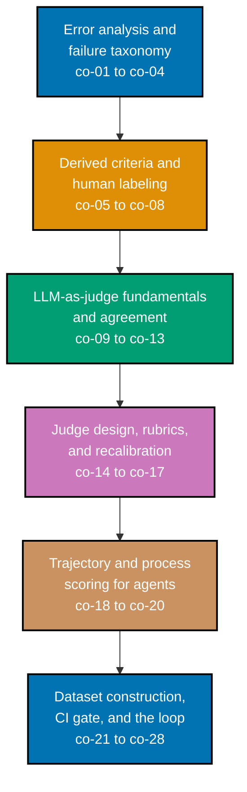

## Prerequisites

- **Prior topics**: [Evaluating AI Output -- Essentials](../../evaluating-ai-output-essentials/overview.md)
  -- every worked example in this topic assumes the light gate's dataset/scorer/pass-rate loop is
  already familiar, since this topic never re-teaches it; [Statistics for Evaluation](../../statistics-for-evaluation/overview.md)
  -- agreement statistics, confidence intervals, and sampling are used starting with the very
  first judge example (Example 18) and throughout the Intermediate and Advanced tiers;
  `agentic-ai` and `agent-orchestration-subagents-and-observability` -- `[Unverified]` not yet
  present in the AyoKoding course library on disk, so no link is given here -- their absence does
  not block this topic, since every trajectory used in Examples 35-40 and 63-80 is a small,
  self-contained, invented trajectory rather than one produced by a real orchestrated agent
  system; `cicd-and-release-engineering` -- `[Unverified]` not yet present in the AyoKoding course
  library on disk, so no link is given here -- the CI-gate examples (Examples 46-49, 73-80) invent
  their own minimal pipeline stand-in rather than assuming a real CI product;
  [Software Testing](../../software-testing/overview.md) -- every example's
  `if __name__ == "__main__":` block reuses the arrange-act-assert mindset that topic teaches.
- **Tools & environment**: a macOS/Linux terminal; **Python 3.13** with **pyright 1.1.411** (strict
  mode) and **ruff 0.15.9** installed; no paid API key, hosted eval product, or network access is
  required anywhere in this topic -- every example runs fully offline against a local/mockable
  generator model and a second, different mockable judge model, both invented for this topic.
- **Assumed knowledge**: the light gate's dataset/scorer/pass-rate loop; reading an agent's own
  tool-call trace; agreement statistics and confidence intervals at the level
  [Statistics for Evaluation](../../statistics-for-evaluation/overview.md) teaches.

## Why this exists -- the big idea

Read a hundred failures before you write a metric, and never trust a judge you have not measured
against a human on the exact question you are asking it. Every one of this topic's 80 worked
examples is a small, complete illustration of one step in that discipline -- from the first read
of a real failure sample, through deriving and operationalizing a criterion, building and
validating an LLM-as-judge, scoring an agent's trajectory rather than only its final answer, to
gating a CI merge on a regression bar measured above the suite's own noise floor.

**Cross-cutting big ideas, taught here and carried through every tier**:
`determinism-vs-emergence` -- measurement is how a stochastic system gets governed, not how its
stochasticity gets eliminated; `correctness-vs-pragmatism` -- every example builds toward a
defensible decision procedure, never a proof of correctness; `abstraction-and-its-cost` -- a score,
however carefully validated, is still a lossy projection, and several Advanced-tier examples
(especially Example 78) name exactly what that projection drops.

## Install and run your first example

Confirm the toolchain every example in this topic was authored and verified against:

```text
$ python3 --version
Python 3.13.12
$ pyright --version
pyright 1.1.411
$ ruff --version
ruff 0.15.9
```

Install everything this topic needs with one `pip` command:

```text
pip install pyright==1.1.411 ruff==0.15.9
```

**A note on versions**: this topic's 80 examples were authored and verified against these exact
tool versions, in this sandbox, on 2026-07-26. Every example is pure-standard-library Python 3.13
plus a small, invented, in-file mock generator/judge model -- there is no third-party model SDK,
eval framework, or hosted product dependency anywhere in the Learning tier, so no other version pin
matters.

Every example in this topic is a complete, self-contained, strict-`pyright`-clean, `ruff`-clean
`.py` file colocated under `learning/code/`. The command you will run for every example is exactly
this:

```text
python3 <example-file>.py
```

Each file's `if __name__ == "__main__":` block prints its own worked-through output and ends with
`assert` statements plus a final `MATCH:` line -- the printed transcript in every example on this
topic's pages is a genuine, captured run, never a fabricated one.

## How this topic's examples are organized

- **Beginner** (Examples 1-16) -- the discipline's first half, worked by hand: reading a metric
  chosen before failures were read and watching it miss the dominant failure mode, reading a real
  failure sample end to end, open-coding it into named tags, clustering those tags into a
  frequency-counted taxonomy, ranking failure modes by frequency times cost, deriving a criterion
  from the dominant mode, operationalizing it into a rule two labelers could apply identically,
  writing a labeling guide, running two independent labelers and resolving a real disagreement,
  and assembling the resulting human-labeled ground-truth set.
- **Intermediate** (Examples 17-34, 51-62) -- building and stress-testing an LLM-as-judge: the
  smallest possible judge, measuring judge-human agreement with a confidence interval, showing
  what an unvalidated judge silently corrupts, per-criterion judge-scope reliability, judge model
  separation and the self-preference effect, every bias mode (position, verbosity, score
  compression) probed and then mitigated, pairwise vs. pointwise judging (and a look at each
  one's real failure mode -- flipped preferences vs. adversarial manipulation), rubric design and
  iteration to a measured plateau, reference-based vs. reference-free scoring, and a recalibration
  schedule that catches agreement decaying gradually over time.
- **Advanced** (Examples 35-50, 63-80) -- trajectory and process scoring for agents (capturing a
  full trajectory, scoring outcome and process separately, attributing a failure to a specific
  step or subagent), building an eval dataset from production traffic and red-team probes with
  contamination checks, measuring a suite's own noise floor and deriving a regression bar above
  it, wiring a tiered, cost-budgeted CI gate that blocks a real regression and passes a
  within-noise change, closing the loop by routing a novel failure back into error analysis, and
  naming what a mature suite structurally cannot catch.
- **[Capstone](./capstone/overview.md)** -- one small, complete evaluation system built end to end
  across five ordered steps: error analysis and a taxonomy, derived criteria and a labeling guide,
  an adjudicated ground-truth set and a validated judge, trajectory and outcome scoring, and a
  noise-aware, tiered, cost-budgeted CI gate.

Every example cites the concept (`co-NN`) it exercises, and this topic's accuracy notes (in the
[topic overview](../overview.md#accuracy-notes)) trace every version pin and external claim to its
source, dated 2026-07-26.



## Concepts

Every worked example in this topic's follow-up pages cites the `co-NN` concept it exercises --
this section is the 1:1 reference those citations point back to. Read it in order: error analysis
comes first because every later concept -- a criterion, a judge, a trajectory score, a CI gate --
is a way of automating something this topic insists gets read by a human first.

### co-01 · Error Analysis First

Before choosing any metric, read a large sample of real failures; the metric is an output of that reading, not an input to it.

**Why it matters**: A metric picked before reading failures optimizes for whatever it happens to measure, not for what actually broke -- ex-01 shows this gap directly, and it is the ordering every other concept in this course assumes.

**Verify it**: Example 1 replays a metric chosen before reading failures and shows it miss the dominant failure mode; Example 2 reads a full batch of real failures without sampling; Example 50 closes the course's own loop back through this exact step.

### co-02 · Open-Coding Failures

Label failures with descriptive tags invented while reading, not with a pre-existing taxonomy.

**Why it matters**: Reaching for a pre-built category list at this stage quietly imports assumptions about what could go wrong, before the real failures have even been read.

**Verify it**: Example 3 open-codes a real failure sample in the analyst's own words; Example 4 contrasts that against forcing failures into a borrowed, premature taxonomy.

### co-03 · Failure Taxonomy

Cluster the open codes into a small set of named, mutually intelligible failure modes with observed frequencies.

**Why it matters**: A taxonomy that traces back to real open codes stays grounded in what actually happened, rather than in an outside guess about what failure modes should exist.

**Verify it**: Example 5 clusters open codes into named modes; Example 6 counts each mode's real frequency across the sample.

### co-04 · Frequency-Weighted Prioritization

Fix and measure the failure modes that are common and costly, not the ones that are interesting.

**Why it matters**: Prioritizing by frequency alone under-invests in rare-but-expensive failures; multiplying frequency by cost is what surfaces them correctly.

**Verify it**: Example 7 ranks modes by frequency times cost and shows the priority order genuinely flip once cost is accounted for.

### co-05 · Derived Task-Specific Criteria

Each criterion traces to a failure mode you actually observed; a criterion with no failure behind it is speculation.

**Why it matters**: Criteria invented from a general sense of 'good' rather than a real failure quietly test a team's assumptions instead of the agent's real behavior.

**Verify it**: Example 8 derives a criterion directly from the dominant taxonomy mode; Example 9 contrasts it against a speculative criterion with no failure behind it.

### co-06 · Criterion Operationalization

Turning a named criterion into an instruction precise enough that two independent human labelers agree.

**Why it matters**: A criterion that sounds clear in one sentence can still be genuinely ambiguous in practice -- operationalizing forces that ambiguity into the open before any labeling happens.

**Verify it**: Example 10 rewrites a vague criterion into an exact, mechanical rule two labelers could apply identically.

### co-07 · Human Labeling Protocol

A written labeling guide, independent labelers, and a disagreement-resolution rule are what make human labels a usable ground truth.

**Why it matters**: Unwritten labeling conventions drift the moment a second labeler joins or the first labeler forgets their own past reasoning weeks later.

**Verify it**: Example 11 writes a minimal labeling guide; Example 12 applies it via two independent labelers; Example 13 resolves a real disagreement through the written rule.

### co-08 · Ground-Truth Set

A human-labeled subset is the reference every automated scorer is validated against; without it nothing downstream is checkable.

**Why it matters**: A ground-truth set is only as trustworthy as the labeling process behind it -- every judge and scorer this course validates rests on this exact reference.

**Verify it**: Example 14 assembles the adjudicated ground-truth set; Example 15 checks its coverage per criterion; Example 16 measures a deterministic scorer against it before reaching for a judge.

### co-09 · LLM-as-Judge

A model prompted to score another model's output against an operationalized criterion.

**Why it matters**: A judge's output has to be structured and parseable from the very first prompt -- that structure is what makes measuring agreement, and later gating CI, possible at all.

**Verify it**: Example 17 builds the smallest possible judge, returning a parseable verdict on one criterion; Example 50 wires a judge into the course's own miniature end-to-end system.

### co-10 · Judge-Human Agreement Is Mandatory

A judge's value is exactly its measured agreement with human labels on the same items; unmeasured, it is decoration.

**Why it matters**: An unvalidated judge can still produce confident-sounding verdicts, complete with reasons -- which makes it easy to mistake for a real safeguard rather than decoration.

**Verify it**: Example 18 measures judge-human agreement directly; Example 19 reports it with a confidence interval; Example 20 shows what an unvalidated judge silently corrupts; Example 55 checks whether a judge's stated confidence tracks its actual correctness.

### co-11 · Judge Scope Reliability

Agreement is per-question, not global: a judge trustworthy on one criterion may be worthless on another.

**Why it matters**: Blending agreement across every criterion into one number can hide a criterion where the judge is barely better than chance.

**Verify it**: Example 21 measures agreement separately on two different criteria; Example 22 retires a judge from a criterion it falls below threshold on; Example 62 maps every criterion's judge status explicitly.

### co-12 · Judge Model Separation

The judge should not be the model that generated the output, and the reason is correlated blind spots, not fairness.

**Why it matters**: A judge sharing a family resemblance with the model it grades can develop a subtle preference for that model's own phrasing, independent of actual correctness.

**Verify it**: Example 23 shows a self-preference effect when a model judges its own output; Example 24 swaps in a genuinely different judge model and confirms the blind spot disappears; Example 59 combines two independent judges into an ensemble for added reliability.

### co-13 · Judge Bias Modes

Position bias, verbosity bias, self-preference, and score compression are systematic and must be tested for, not assumed absent.

**Why it matters**: Each bias mode is systematic, not random noise -- which means each one needs its own dedicated probe, not a single generic bias check.

**Verify it**: Example 25 probes for position bias by swapping slot order; Example 26 probes for verbosity bias with a padded reply; Example 27 measures real score compression; Example 51 and Example 61 apply concrete mitigations; Example 79 wires both probes into CI as a real regression check.

### co-14 · Pairwise vs. Pointwise Judging

Asking 'which is better' is usually more reliable than asking 'score this 1-5'; the trade is that pairwise needs a baseline.

**Why it matters**: The research is genuinely contested -- pairwise tends to track human preference more closely, while pointwise absolute scores are more robust to adversarial manipulation.

**Verify it**: Example 28 compares pairwise and pointwise agreement on the same items; Example 53 extends pairwise judging into a full round-robin tournament ranking; Example 54 probes a judge's resistance to adversarial manipulation directly.

### co-15 · Rubric Design for Judges

Short, binary, single-question rubrics agree with humans far better than long multi-dimensional scoring sheets.

**Why it matters**: Every additional clause in a rubric is another place for a judge or labeler to diverge from another reader's interpretation.

**Verify it**: Example 29 contrasts a binary rubric against a long one; Example 30 iterates a rubric while agreement climbs; Example 52 anchors each score level with a concrete example; Example 56 sweeps rubric length to find where added detail stops helping; Example 60 shows the iteration loop reach a genuine plateau.

### co-16 · Judge Recalibration

Agreement decays when the model, prompt, or data distribution changes, so it is re-measured on a schedule, not once.

**Why it matters**: A judge validated once and never re-checked can quietly become unreliable over months, through gradual distributional drift rather than any single dramatic event.

**Verify it**: Example 33 re-measures agreement after a simulated model change; Example 34 builds a recalibration schedule triggered by time or volume, not only by a known change; Example 57 tracks agreement decaying gradually over time.

### co-17 · Reference-Free vs. Reference-Based

Scoring against a gold answer versus scoring the output on its own terms; each fails differently.

**Why it matters**: Forcing a reference-based check onto a criterion with multiple valid phrasings produces false negatives that a reference-free check, scored against required facts, avoids.

**Verify it**: Example 31 scores against a gold reference and shows where it breaks on valid alternative phrasing; Example 32 scores groundedness against required facts instead; Example 58 measures a reference-based scorer's own false-negative rate directly.

### co-18 · Trajectory Evaluation

For agents, the sequence of tool calls is an object of evaluation distinct from the final answer.

**Why it matters**: Reducing an agent's run to only its final answer throws away exactly the information needed to tell a lucky guess apart from a genuinely correct process.

**Verify it**: Example 35 captures a full trajectory as one evaluable object; Example 36 scores it against a reference sequence; Example 64 produces a positional diff between two trajectories; Example 80 runs trajectory scoring as part of the tier's own closing end-to-end example.

### co-19 · Outcome vs. Process Scoring

A right answer reached by a wrong path is a latent failure; scoring both catches what either alone misses.

**Why it matters**: Trusting outcome scoring alone rates a lucky guess identically to a properly-verified answer, hiding a failure that has not yet surfaced on a different input.

**Verify it**: Example 37 shows outcome and process scoring genuinely disagree; Example 38 proves the same skipped step causes a real failure on a neighbouring case; Example 65 grades a correct-but-inefficient path with partial credit instead of a strict binary verdict.

### co-20 · Multi-Step Failure Attribution

Locating which step in a trajectory caused the failure is what makes an agent eval actionable.

**Why it matters**: Knowing only that a trajectory failed gives an engineer nothing to act on -- knowing which step, and which agent, is what turns a failure into a fixable bug report.

**Verify it**: Example 39 locates the causing step in a failed trajectory; Example 40 attributes a failure to a specific subagent rather than the orchestrator; Example 66 localizes a failure to a handoff boundary between two agents.

### co-21 · Eval Dataset Construction

Sourcing cases from production traffic, red-team probes, and regression reports, with deliberate coverage of the failure taxonomy.

**Why it matters**: A hand-invented dataset risks testing scenarios an engineer imagined rather than scenarios that actually occur -- sourcing from real, flagged traffic keeps it grounded.

**Verify it**: Example 41 builds a dataset from real production traffic and checks its taxonomy coverage; Example 42 folds red-team probes into the same uniform suite; Example 68 engineers a red-team probe explicitly from a known taxonomy mode; Example 69 versions the dataset for reproducibility.

### co-22 · Dataset Contamination and Leakage

Cases that leaked into a prompt, a cache, or a fine-tune produce scores that do not transfer.

**Why it matters**: A leaked case's inflated pass produces a falsely reassuring number, whether the leakage happened through a runtime cache or through the model's own training data.

**Verify it**: Example 43 detects a leaked case by its implausibly fast response latency; Example 67 detects a different contamination mode -- verbatim overlap with a training corpus.

### co-23 · Eval in CI

The eval suite runs in the pipeline and its result is a merge decision, not a report.

**Why it matters**: A bare exit code tells an engineer that a merge was blocked but not why -- a reasoned, logged verdict turns a CI failure into something immediately actionable.

**Verify it**: Example 46 wires the regression bar into an actual merge-blocking CI gate; Example 73 turns a blocked run into a fully annotated failure report naming the dominant failure mode.

### co-24 · Regression Bar and Noise Floor

The merge-blocking threshold must sit above the suite's own run-to-run noise, or the gate blocks at random.

**Why it matters**: A bar set without reference to measured noise produces false positives on ordinary wobble or false negatives on real regressions -- deriving it from measured noise is what makes it defensible.

**Verify it**: Example 44 measures a suite's own noise floor across repeated unchanged runs; Example 45 derives the regression bar from that measurement; Example 70 confirms the noise floor is stable across two independent batches; Example 71 quantifies the false-positive cost of skipping this step; Example 75 tells a flaky case apart from a real regression.

### co-25 · Cost of Evaluation

Judge calls and repeat runs cost real money and wall time; the suite is budgeted and tiered like any other test suite.

**Why it matters**: Judge-call cost can creep upward unnoticed through retry storms or expanding scope, showing up only as a surprising bill weeks later.

**Verify it**: Example 48 reports and budgets a judged tier's cost per run; Example 63 chooses between a cheap scorer and a judge as an explicit cost-benefit decision; Example 74 bounds judge-call retries within a fixed budget.

### co-26 · Tiered Eval Suites

A fast deterministic tier on every commit, a full judged tier on merge or nightly, mirroring the unit/integration/e2e split.

**Why it matters**: Running a judge-using tier on every commit would be prohibitively slow and expensive, while running only a deterministic tier would miss criteria that genuinely need judge-based checking.

**Verify it**: Example 47 wires both a fast and a judged tier, routed by CI trigger; Example 72 budgets each tier's own runtime independently; Example 76 runs a cheap dry-run smoke check before paying for the full suite.

### co-27 · Evals Drive Improvement

The loop closes only when failing cases route back into error analysis and produce the next change.

**Why it matters**: An eval suite that never grows past its original taxonomy will eventually miss the failure modes that emerge after it was built.

**Verify it**: Example 49 routes a novel CI failure back through error analysis, growing the taxonomy; Example 77 takes this further, deriving a fully operationalized new criterion with explicit provenance.

### co-28 · What Evals Cannot Catch

Novel harms, distribution shift, and anything absent from the dataset remain invisible; an eval suite bounds risk, it does not eliminate it.

**Why it matters**: Every criterion in a well-built suite traces back to an observed failure, which means, by construction, the suite cannot catch a pattern nobody has seen yet.

**Verify it**: Example 50 closes the course's own worked-example arc while naming this limit; Example 78 names the suite's structural blind spots explicitly, each with its own reason and what a different check would require.

## Examples by Level

### Beginner (Examples 1–16)

- [Example 1: Metric-Before-Analysis Fails](/en/learn/courses/evaluating-ai-systems-in-depth/learning/beginner#example-1-metric-before-analysis-fails)
- [Example 2: Read a Hundred Failures](/en/learn/courses/evaluating-ai-systems-in-depth/learning/beginner#example-2-read-a-hundred-failures)
- [Example 3: Open-Code a Failure Sample](/en/learn/courses/evaluating-ai-systems-in-depth/learning/beginner#example-3-open-code-a-failure-sample)
- [Example 4: Premature Taxonomy Backfires](/en/learn/courses/evaluating-ai-systems-in-depth/learning/beginner#example-4-premature-taxonomy-backfires)
- [Example 5: Cluster Codes Into Modes](/en/learn/courses/evaluating-ai-systems-in-depth/learning/beginner#example-5-cluster-codes-into-modes)
- [Example 6: Failure Frequency Table](/en/learn/courses/evaluating-ai-systems-in-depth/learning/beginner#example-6-failure-frequency-table)
- [Example 7: Frequency Times Cost Ranking](/en/learn/courses/evaluating-ai-systems-in-depth/learning/beginner#example-7-frequency-times-cost-ranking)
- [Example 8: Derive a Criterion From a Mode](/en/learn/courses/evaluating-ai-systems-in-depth/learning/beginner#example-8-derive-a-criterion-from-a-mode)
- [Example 9: A Speculative Criterion Has No Failure Behind It](/en/learn/courses/evaluating-ai-systems-in-depth/learning/beginner#example-9-a-speculative-criterion-has-no-failure-behind-it)
- [Example 10: Operationalize a Criterion](/en/learn/courses/evaluating-ai-systems-in-depth/learning/beginner#example-10-operationalize-a-criterion)
- [Example 11: Labeling Guide](/en/learn/courses/evaluating-ai-systems-in-depth/learning/beginner#example-11-labeling-guide)
- [Example 12: Two Independent Labelers](/en/learn/courses/evaluating-ai-systems-in-depth/learning/beginner#example-12-two-independent-labelers)
- [Example 13: Disagreement Resolution](/en/learn/courses/evaluating-ai-systems-in-depth/learning/beginner#example-13-disagreement-resolution)
- [Example 14: Build the Ground Truth Set](/en/learn/courses/evaluating-ai-systems-in-depth/learning/beginner#example-14-build-the-ground-truth-set)
- [Example 15: Ground Truth Coverage Check](/en/learn/courses/evaluating-ai-systems-in-depth/learning/beginner#example-15-ground-truth-coverage-check)
- [Example 16: Deterministic Scorer vs. Ground Truth](/en/learn/courses/evaluating-ai-systems-in-depth/learning/beginner#example-16-deterministic-scorer-vs-ground-truth)

### Intermediate (Examples 17–34, 51–62)

- [Example 17: First Judge Prompt](/en/learn/courses/evaluating-ai-systems-in-depth/learning/intermediate#example-17-first-judge-prompt)
- [Example 18: Measure Judge-Human Agreement](/en/learn/courses/evaluating-ai-systems-in-depth/learning/intermediate#example-18-measure-judge-human-agreement)
- [Example 19: Agreement With a Confidence Interval](/en/learn/courses/evaluating-ai-systems-in-depth/learning/intermediate#example-19-agreement-with-a-confidence-interval)
- [Example 20: An Unvalidated Judge Is Decoration](/en/learn/courses/evaluating-ai-systems-in-depth/learning/intermediate#example-20-an-unvalidated-judge-is-decoration)
- [Example 21: Judge Scope Per Question](/en/learn/courses/evaluating-ai-systems-in-depth/learning/intermediate#example-21-judge-scope-per-question)
- [Example 22: Retire a Judge Out of Scope](/en/learn/courses/evaluating-ai-systems-in-depth/learning/intermediate#example-22-retire-a-judge-out-of-scope)
- [Example 23: Self-Preference Bias](/en/learn/courses/evaluating-ai-systems-in-depth/learning/intermediate#example-23-self-preference-bias)
- [Example 24: Judge Model Separation](/en/learn/courses/evaluating-ai-systems-in-depth/learning/intermediate#example-24-judge-model-separation)
- [Example 25: Position Bias Probe](/en/learn/courses/evaluating-ai-systems-in-depth/learning/intermediate#example-25-position-bias-probe)
- [Example 26: Verbosity Bias Probe](/en/learn/courses/evaluating-ai-systems-in-depth/learning/intermediate#example-26-verbosity-bias-probe)
- [Example 27: Score Compression](/en/learn/courses/evaluating-ai-systems-in-depth/learning/intermediate#example-27-score-compression)
- [Example 28: Pairwise Beats Pointwise (Sometimes)](/en/learn/courses/evaluating-ai-systems-in-depth/learning/intermediate#example-28-pairwise-beats-pointwise-sometimes)
- [Example 29: Binary Rubric Beats Long Rubric](/en/learn/courses/evaluating-ai-systems-in-depth/learning/intermediate#example-29-binary-rubric-beats-long-rubric)
- [Example 30: Rubric Iteration Loop](/en/learn/courses/evaluating-ai-systems-in-depth/learning/intermediate#example-30-rubric-iteration-loop)
- [Example 31: Reference-Based Scoring](/en/learn/courses/evaluating-ai-systems-in-depth/learning/intermediate#example-31-reference-based-scoring)
- [Example 32: Reference-Free Scoring](/en/learn/courses/evaluating-ai-systems-in-depth/learning/intermediate#example-32-reference-free-scoring)
- [Example 33: Recalibrate After a Model Change](/en/learn/courses/evaluating-ai-systems-in-depth/learning/intermediate#example-33-recalibrate-after-a-model-change)
- [Example 34: Recalibration Schedule](/en/learn/courses/evaluating-ai-systems-in-depth/learning/intermediate#example-34-recalibration-schedule)
- [Example 51: Verbosity Bias Mitigation](/en/learn/courses/evaluating-ai-systems-in-depth/learning/intermediate#example-51-verbosity-bias-mitigation)
- [Example 52: Judge With Explicit Rubric Anchors](/en/learn/courses/evaluating-ai-systems-in-depth/learning/intermediate#example-52-judge-with-explicit-rubric-anchors)
- [Example 53: Pairwise Tournament Scoring](/en/learn/courses/evaluating-ai-systems-in-depth/learning/intermediate#example-53-pairwise-tournament-scoring)
- [Example 54: Adversarial Manipulation of a Judge](/en/learn/courses/evaluating-ai-systems-in-depth/learning/intermediate#example-54-adversarial-manipulation-of-a-judge)
- [Example 55: Judge Confidence vs. Correctness](/en/learn/courses/evaluating-ai-systems-in-depth/learning/intermediate#example-55-judge-confidence-vs-correctness)
- [Example 56: Rubric Length vs. Agreement Tradeoff](/en/learn/courses/evaluating-ai-systems-in-depth/learning/intermediate#example-56-rubric-length-vs-agreement-tradeoff)
- [Example 57: Judge Agreement Decay Over Time](/en/learn/courses/evaluating-ai-systems-in-depth/learning/intermediate#example-57-judge-agreement-decay-over-time)
- [Example 58: Reference-Based Scorer False-Negative Rate](/en/learn/courses/evaluating-ai-systems-in-depth/learning/intermediate#example-58-reference-based-scorer-false-negative-rate)
- [Example 59: Judge Ensemble for Reliability](/en/learn/courses/evaluating-ai-systems-in-depth/learning/intermediate#example-59-judge-ensemble-for-reliability)
- [Example 60: Rubric Iteration Plateau](/en/learn/courses/evaluating-ai-systems-in-depth/learning/intermediate#example-60-rubric-iteration-plateau)
- [Example 61: Position Bias Mitigation by Swap-and-Average](/en/learn/courses/evaluating-ai-systems-in-depth/learning/intermediate#example-61-position-bias-mitigation-by-swap-and-average)
- [Example 62: Judge Scope Boundary Map](/en/learn/courses/evaluating-ai-systems-in-depth/learning/intermediate#example-62-judge-scope-boundary-map)

### Advanced (Examples 35–50, 63–80)

- [Example 35: Trajectory Capture](/en/learn/courses/evaluating-ai-systems-in-depth/learning/advanced#example-35-trajectory-capture)
- [Example 36: Trajectory Match Scoring](/en/learn/courses/evaluating-ai-systems-in-depth/learning/advanced#example-36-trajectory-match-scoring)
- [Example 37: Right Answer, Wrong Path](/en/learn/courses/evaluating-ai-systems-in-depth/learning/advanced#example-37-right-answer-wrong-path)
- [Example 38: Process Scoring Catches a Latent Failure](/en/learn/courses/evaluating-ai-systems-in-depth/learning/advanced#example-38-process-scoring-catches-a-latent-failure)
- [Example 39: Attribute Failure to a Step](/en/learn/courses/evaluating-ai-systems-in-depth/learning/advanced#example-39-attribute-failure-to-a-step)
- [Example 40: Subagent Failure Attribution](/en/learn/courses/evaluating-ai-systems-in-depth/learning/advanced#example-40-subagent-failure-attribution)
- [Example 41: Dataset From Production Traffic](/en/learn/courses/evaluating-ai-systems-in-depth/learning/advanced#example-41-dataset-from-production-traffic)
- [Example 42: Red-Team Cases in the Suite](/en/learn/courses/evaluating-ai-systems-in-depth/learning/advanced#example-42-red-team-cases-in-the-suite)
- [Example 43: Detect Dataset Leakage](/en/learn/courses/evaluating-ai-systems-in-depth/learning/advanced#example-43-detect-dataset-leakage)
- [Example 44: Measure the Noise Floor](/en/learn/courses/evaluating-ai-systems-in-depth/learning/advanced#example-44-measure-the-noise-floor)
- [Example 45: Set the Regression Bar Above Noise](/en/learn/courses/evaluating-ai-systems-in-depth/learning/advanced#example-45-set-the-regression-bar-above-noise)
- [Example 46: Eval Gate Blocks a Merge](/en/learn/courses/evaluating-ai-systems-in-depth/learning/advanced#example-46-eval-gate-blocks-a-merge)
- [Example 47: Tiered Suites](/en/learn/courses/evaluating-ai-systems-in-depth/learning/advanced#example-47-tiered-suites)
- [Example 48: Eval Cost Budget](/en/learn/courses/evaluating-ai-systems-in-depth/learning/advanced#example-48-eval-cost-budget)
- [Example 49: Failures Route Back to Error Analysis](/en/learn/courses/evaluating-ai-systems-in-depth/learning/advanced#example-49-failures-route-back-to-error-analysis)
- [Example 50: A Miniature Validated Eval System](/en/learn/courses/evaluating-ai-systems-in-depth/learning/advanced#example-50-a-miniature-validated-eval-system)
- [Example 63: Cost-Benefit: Cheap Scorer vs. Judge](/en/learn/courses/evaluating-ai-systems-in-depth/learning/advanced#example-63-cost-benefit-cheap-scorer-vs-judge)
- [Example 64: Trajectory Diff: Baseline vs. Candidate](/en/learn/courses/evaluating-ai-systems-in-depth/learning/advanced#example-64-trajectory-diff-baseline-vs-candidate)
- [Example 65: Partial Credit for an Inefficient but Correct Path](/en/learn/courses/evaluating-ai-systems-in-depth/learning/advanced#example-65-partial-credit-for-an-inefficient-but-correct-path)
- [Example 66: Subagent Handoff Schema Mismatch](/en/learn/courses/evaluating-ai-systems-in-depth/learning/advanced#example-66-subagent-handoff-schema-mismatch)
- [Example 67: Detect Contamination via Corpus Overlap](/en/learn/courses/evaluating-ai-systems-in-depth/learning/advanced#example-67-detect-contamination-via-corpus-overlap)
- [Example 68: Red-Team Case Designed From Taxonomy](/en/learn/courses/evaluating-ai-systems-in-depth/learning/advanced#example-68-red-team-case-designed-from-taxonomy)
- [Example 69: Dataset Versioning and Eval Reproducibility](/en/learn/courses/evaluating-ai-systems-in-depth/learning/advanced#example-69-dataset-versioning-and-eval-reproducibility)
- [Example 70: Noise Floor Across Multiple Runs](/en/learn/courses/evaluating-ai-systems-in-depth/learning/advanced#example-70-noise-floor-across-multiple-runs)
- [Example 71: Regression Bar False-Positive Rate](/en/learn/courses/evaluating-ai-systems-in-depth/learning/advanced#example-71-regression-bar-false-positive-rate)
- [Example 72: Tiered Suite Runtime Budget](/en/learn/courses/evaluating-ai-systems-in-depth/learning/advanced#example-72-tiered-suite-runtime-budget)
- [Example 73: CI Gate Annotated Failure Report](/en/learn/courses/evaluating-ai-systems-in-depth/learning/advanced#example-73-ci-gate-annotated-failure-report)
- [Example 74: Judge-Call Retry and Timeout Budget](/en/learn/courses/evaluating-ai-systems-in-depth/learning/advanced#example-74-judge-call-retry-and-timeout-budget)
- [Example 75: Eval Suite Flake vs. Real Regression](/en/learn/courses/evaluating-ai-systems-in-depth/learning/advanced#example-75-eval-suite-flake-vs-real-regression)
- [Example 76: Capstone Dry Run Before Full Suite](/en/learn/courses/evaluating-ai-systems-in-depth/learning/advanced#example-76-capstone-dry-run-before-full-suite)
- [Example 77: Failure Routes Back With a New Criterion](/en/learn/courses/evaluating-ai-systems-in-depth/learning/advanced#example-77-failure-routes-back-with-a-new-criterion)
- [Example 78: What This Suite Cannot Catch](/en/learn/courses/evaluating-ai-systems-in-depth/learning/advanced#example-78-what-this-suite-cannot-catch)
- [Example 79: Judge-Bias Regression Test in CI](/en/learn/courses/evaluating-ai-systems-in-depth/learning/advanced#example-79-judge-bias-regression-test-in-ci)
- [Example 80: End-to-End Mini Dry Run of the Whole Pipeline](/en/learn/courses/evaluating-ai-systems-in-depth/learning/advanced#example-80-end-to-end-mini-dry-run-of-the-whole-pipeline)

---

← Previous: [Overview](../overview.md) · Next: [Beginner Examples](./beginner.md) →
