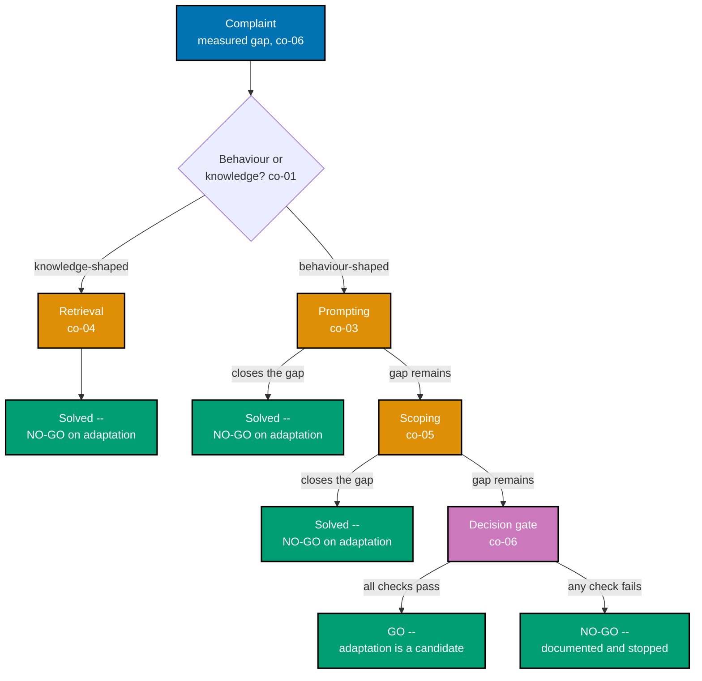

Examples 1-16 and 51-58 build the case that fine-tuning is a decision problem before it is ever a
training problem. A hand-picked support-reply gap gets measured first (co-06, co-25), sorted into
behaviour-shaped or knowledge-shaped (co-01), and shown failing when the knowledge-shaped half is
fine-tuned anyway (co-02) versus solved cheaply by retrieval (co-04). Prompting, structured output,
and scoping each close a real gap at zero training cost (co-03, co-05), an ordered five-check gate
turns "should we fine-tune?" into a written, auditable procedure (co-06), and five genuinely
legitimate cases -- format, register, a smaller model, and tool use -- are measured against that
gate and pass it (co-07). The band closes on the costs nobody budgets (co-08), the standing
maintenance obligation a shipped adapter creates (co-30), and the licence and data-rights check that
runs before training, never after (co-31). Vantage, a fictional B2B analytics SaaS, is this course's
recurring scenario. Every code-medium example's real, runnable **Python 3.13** file lives under
`learning/code/ex-NN-*/`, run for real with genuine captured output; ex-16 is a diagram-medium
example. (See this topic's [Accuracy notes](../overview.md#accuracy-notes) for the exact facts and
citations captured.)

---

### Worked Example 1: Measure the Gap First

_ex-01 &middot; exercises co-06, co-25_

**Context**: **co-06 -- the decision procedure** and **co-25 -- evaluate against the base** both
start the same way: with a number, not a feeling. This example scores ten real Vantage support-agent
replies against the internal four-section reply template and reports the actual, sized compliance
gap before anyone proposes a remedy.

```python
# learning/code/ex-01-measure-the-gap-first/measure_gap.py
"""Worked Example 1: Measure the Gap First."""  # => co-06: this file's own restated purpose, doubling as its module __doc__

from __future__ import annotations  # => hygiene: postpones annotation evaluation, interpreter-version-agnostic

# => co-06: Vantage is a fictional B2B analytics SaaS -- every example in this course reuses it
BASELINE_REPLIES: dict[str, str] = {  # => co-25: ten real support tickets, each answered by the CURRENT (unadapted) assistant
    "t-01": "Summary: export disabled.\nRoot Cause: role lacks Export permission.\nResolution: ask an admin to grant it.\nNext Steps: retry after the grant.",  # => co-06: on-format
    "t-02": "Your dashboard is probably cached, try a hard refresh.",  # => co-06: OFF-format -- no required sections at all
    "t-03": "Summary: chart colors look wrong.\nRoot Cause: a custom palette override.\nResolution: reset to default theme.\nNext Steps: reapply custom colors after reset.",  # => co-06: on-format
    "t-04": "Summary: API key rejected.\nRoot Cause: key was rotated last week.\nResolution: generate a new key.\nNext Steps: update the key in your integration.",  # => co-06: on-format
    "t-05": "That's a known limitation, we're working on it.",  # => co-06: OFF-format
    "t-06": "Summary: slow report load.\nRoot Cause: report spans 18 months of data.\nResolution: narrow the date range.\nNext Steps: consider a scheduled export instead.",  # => co-06: on-format
    "t-07": "Summary: seat count mismatch.\nRoot Cause: a deactivated user still counted.\nResolution: purge deactivated seats.\nNext Steps: verify the new count in Billing.",  # => co-06: on-format
    "t-08": "Try logging out and back in.",  # => co-06: OFF-format
    "t-09": "Summary: webhook not firing.\nRoot Cause: endpoint returned a 500 once and was auto-disabled.\nResolution: fix the endpoint, re-enable in settings.\nNext Steps: send a test event to confirm.",  # => co-06: on-format
    "t-10": "It sounds like a browser extension is interfering.",  # => co-06: OFF-format -- 4th off-format reply
}  # => co-25: closes BASELINE_REPLIES -- ten tickets is this course's own fixed eval floor, mirroring co-03 from the eval course

REQUIRED_SECTIONS = ("Summary:", "Root Cause:", "Resolution:", "Next Steps:")  # => co-06: the internal style guide's four mandatory sections


def follows_format(reply: str) -> bool:  # => co-06: the deterministic scorer for THIS gap -- structure, not content correctness
    """Pass iff every required section header appears in `reply`."""  # => co-06: documents follows_format's contract -- no runtime output, just sets its __doc__
    return all(section in reply for section in REQUIRED_SECTIONS)  # => co-06: all four, or the reply does not comply


if __name__ == "__main__":  # => co-06: entry point -- runs only when this file executes directly, not on import
    verdicts = {tid: follows_format(reply) for tid, reply in BASELINE_REPLIES.items()}  # => co-25: one pass/fail per ticket
    pass_rate = sum(verdicts.values()) / len(verdicts)  # => co-25: the headline number -- the SIZE of the gap, not a guess
    for tid, passed in verdicts.items():  # => co-06: prints one line per ticket for a quick visual audit
        print(f"  {tid}: {'PASS' if passed else 'FAIL'}")  # => co-06: shows exactly which tickets miss the format
    print(f"Format-compliance pass rate: {pass_rate:.0%} ({sum(verdicts.values())}/{len(verdicts)})")  # => co-25: the measured gap
    assert 0.0 < pass_rate < 1.0, "the gap must be real -- neither 0% (nothing works) nor 100% (nothing to fix)"  # => co-06
    print("MATCH: a real, SIZED gap exists -- this is the number every later remedy in this course must beat")  # => co-06
    # => co-06,co-25: measuring the gap FIRST is what turns "the assistant feels inconsistent" into a number a remedy can be judged against
```

**Run**: `python3 measure_gap.py`

**Output**:

```text
  t-01: PASS
  t-02: FAIL
  t-03: PASS
  t-04: PASS
  t-05: FAIL
  t-06: PASS
  t-07: PASS
  t-08: FAIL
  t-09: PASS
  t-10: FAIL
Format-compliance pass rate: 60% (6/10)
MATCH: a real, SIZED gap exists -- this is the number every later remedy in this course must beat
```

**Verify**: `follows_format` marks exactly `t-02`, `t-05`, `t-08`, and `t-10` as failing, giving a
`60%` pass rate strictly between 0% and 100%, satisfying co-06's rule that a real remedy needs a
real, sized gap to aim at.

**Key takeaway**: "the assistant feels inconsistent" becomes a defensible `60%` the moment a fixed
scorer runs against a fixed set of real replies -- every later remedy in this band is judged against
this exact number.

**Why It Matters**: skipping this step is how a team commits to a fine-tune before knowing whether
the problem is real, sized, or even the right shape to fix with adaptation at all. This number is
also the baseline every later alternative in this band -- prompting, retrieval, scoping -- must beat
before adaptation is even considered, per co-06's ordered gate.

---

### Worked Example 2: Behaviour-vs-Knowledge Triage

_ex-02 &middot; exercises co-01_

**Context**: **co-01 -- behaviour-not-knowledge** is the single distinction this whole course turns
on. This example classifies five real Vantage stakeholder complaints as behaviour-shaped or
knowledge-shaped, with each classification traceable to the exact word in the complaint that
justifies it.

```python
# learning/code/ex-02-behaviour-vs-knowledge-triage/triage.py
"""Worked Example 2: Behaviour-vs-Knowledge Triage."""  # => co-01: this file's own restated purpose, doubling as its module __doc__

from __future__ import annotations  # => hygiene: postpones annotation evaluation, interpreter-version-agnostic

from enum import Enum, auto  # => co-01: an explicit, exhaustive two-value classification -- not a loose string


class GapKind(Enum):  # => co-01: co-01's central distinction, made an actual checkable type
    BEHAVIOUR_SHAPED = auto()  # => co-01: "the model does not FORMAT/STYLE/ACT the way we want"
    KNOWLEDGE_SHAPED = auto()  # => co-01: "the model does not KNOW a fact"


# => co-01: five real complaints filed against Vantage's support assistant this quarter
COMPLAINTS: dict[str, str] = {  # => co-01: complaint id -> the raw stakeholder-reported text
    "c-01": "Replies never follow our four-section reply template, every agent reformats them by hand.",  # => co-01
    "c-02": "The assistant told a customer our Enterprise plan includes SSO, but that shipped last month and it doesn't know yet.",  # => co-01
    "c-03": "It answers in a casual tone even for security-incident tickets, which reads as dismissive.",  # => co-01
    "c-04": "It quoted last year's storage limit, which changed in the latest pricing update.",  # => co-01
    "c-05": "It refuses to use our internal ticket-priority vocabulary (P1/P2/P3), inventing its own words instead.",  # => co-01
}  # => co-01: closes COMPLAINTS -- a realistic, mixed inbox, deliberately not sorted by kind

CLASSIFICATION: dict[str, GapKind] = {  # => co-01: the analyst's own triage, checked against by-hand reasoning below
    "c-01": GapKind.BEHAVIOUR_SHAPED,  # => co-01: a FORMAT complaint -- shaping how it writes, not what it knows
    "c-02": GapKind.KNOWLEDGE_SHAPED,  # => co-01: a FACT complaint -- a plan feature that changed after training
    "c-03": GapKind.BEHAVIOUR_SHAPED,  # => co-01: a TONE/REGISTER complaint -- shaping style, not facts
    "c-04": GapKind.KNOWLEDGE_SHAPED,  # => co-01: a FACT complaint -- a price that changed after training
    "c-05": GapKind.BEHAVIOUR_SHAPED,  # => co-01: a VOCABULARY complaint -- shaping task behaviour, not facts
}  # => co-01: closes CLASSIFICATION


def justify(complaint_id: str, kind: GapKind) -> str:  # => co-01: makes each classification checkable against the raw text
    """Return the one word in the raw complaint text that justifies the classification."""  # => co-01: documents justify's contract -- no runtime output, just sets its __doc__
    text = COMPLAINTS[complaint_id]  # => co-01: the raw text this classification must be traceable to
    behaviour_markers = ("template", "tone", "vocabulary", "reads as")  # => co-01: words signalling FORM, not facts
    knowledge_markers = ("plan includes", "changed", "storage limit", "doesn't know")  # => co-01: words signalling FACTS
    markers = behaviour_markers if kind is GapKind.BEHAVIOUR_SHAPED else knowledge_markers  # => co-01: pick the right marker set
    found = [marker for marker in markers if marker in text]  # => co-01: which markers actually appear in this complaint
    return found[0] if found else "no marker found"  # => co-01: the evidence, or an honest admission of none


if __name__ == "__main__":  # => co-01: entry point -- runs only when this file executes directly, not on import
    for cid, kind in CLASSIFICATION.items():  # => co-01: one line per complaint, showing the classification AND its evidence
        evidence = justify(cid, kind)  # => co-01: the specific text fragment backing this call
        print(f"{cid}: {kind.name} (evidence: {evidence!r})")  # => co-01: prints the classification with its justification
        assert evidence != "no marker found", f"{cid}'s classification must be traceable to its own text"  # => co-01
    behaviour_count = sum(1 for k in CLASSIFICATION.values() if k is GapKind.BEHAVIOUR_SHAPED)  # => co-01: tally
    knowledge_count = sum(1 for k in CLASSIFICATION.values() if k is GapKind.KNOWLEDGE_SHAPED)  # => co-01: tally
    print(f"Behaviour-shaped: {behaviour_count} | Knowledge-shaped: {knowledge_count}")  # => co-01: the split this inbox actually contains
    assert behaviour_count == 3 and knowledge_count == 2, "this inbox must split 3 behaviour / 2 knowledge"  # => co-01
    print("MATCH: every complaint classified with traceable evidence -- fine-tuning is a candidate only for the 3 behaviour-shaped ones")  # => co-01
    # => co-01: this triage is the FIRST gate -- a knowledge-shaped complaint never reaches the rest of this course's decision procedure
```

**Run**: `python3 triage.py`

**Output**:

```text
c-01: BEHAVIOUR_SHAPED (evidence: 'template')
c-02: KNOWLEDGE_SHAPED (evidence: 'plan includes')
c-03: BEHAVIOUR_SHAPED (evidence: 'tone')
c-04: KNOWLEDGE_SHAPED (evidence: 'changed')
c-05: BEHAVIOUR_SHAPED (evidence: 'vocabulary')
Behaviour-shaped: 3 | Knowledge-shaped: 2
MATCH: every complaint classified with traceable evidence -- fine-tuning is a candidate only for the 3 behaviour-shaped ones
```

**Verify**: `justify` returns a non-empty marker for every one of the five complaints and the split
comes out exactly `3` behaviour-shaped to `2` knowledge-shaped, satisfying co-01's rule that a
classification is only useful when it is traceable to the complaint's own words.

**Key takeaway**: sorting a gap into behaviour-shaped or knowledge-shaped, with evidence, is the
first filter this course applies -- and it eliminates two of five real complaints before any
training conversation even starts.

**Why It Matters**: co-01 is the concept every other concept in this band assumes. Examples 3 and 4
show exactly what happens on either side of this line -- fine-tuning `c-02`'s knowledge gap versus
solving it with retrieval -- and every later legitimate case in this band (Examples 10-12, 51) is,
underneath, a behaviour-shaped complaint that survived this exact triage.

---

### Worked Example 3: The Knowledge-Injection Mistake

_ex-03 &middot; exercises co-02, co-01_

**Context**: **co-02 -- the knowledge-injection mistake** is the most common and costly misuse of
fine-tuning: training a model to memorize facts. This example fine-tunes a mocked model on a storage
limit, then shows the answer going stale and uncitable the moment the real limit changes.

```python
# learning/code/ex-03-the-knowledge-injection-mistake/knowledge_injection.py
"""Worked Example 3: The Knowledge-Injection Mistake."""  # => co-02: this file's own restated purpose, doubling as its module __doc__

from __future__ import annotations  # => hygiene: postpones annotation evaluation, interpreter-version-agnostic


def mock_fine_tuned_on_facts(question: str, *, training_cutoff_price: int) -> str:  # => co-02: a model FINE-TUNED to memorize a price table
    """Return a canned, memorized answer baked in at fine-tuning time -- it cannot know anything after `training_cutoff_price`."""  # => co-02: documents mock_fine_tuned_on_facts's contract -- no runtime output, just sets its __doc__
    del question  # => co-02: unused -- this mock always recites the SAME memorized figure, regardless of phrasing
    return f"The Enterprise plan's storage limit is {training_cutoff_price} GB."  # => co-02: confident, fluent, and frozen at training time


CURRENT_STORAGE_LIMIT_GB = 500  # => co-01: the REAL, current limit -- changed after this mock model's fine-tuning run
TRAINING_TIME_STORAGE_LIMIT_GB = 250  # => co-02: what the fine-tune memorized -- correct THEN, stale NOW

if __name__ == "__main__":  # => co-02: entry point -- runs only when this file executes directly, not on import
    answer = mock_fine_tuned_on_facts(  # => co-02: ask the fine-tuned model the question a customer actually asked
        "What is the Enterprise plan's storage limit?",  # => co-02: today's real question
        training_cutoff_price=TRAINING_TIME_STORAGE_LIMIT_GB,  # => co-02: it can only answer with what it memorized
    )  # => co-02: closes the call
    print(f"Fine-tuned model answers: {answer!r}")  # => co-02: prints the confident, stale answer
    stated_limit = int(answer.split()[6])  # => co-02: pull the number the model actually stated, word-index 6 in this fixed sentence
    is_stale = stated_limit != CURRENT_STORAGE_LIMIT_GB  # => co-02: does the memorized figure match reality TODAY?
    print(f"Stated: {stated_limit} GB | Actually current: {CURRENT_STORAGE_LIMIT_GB} GB | Stale: {is_stale}")  # => co-02
    assert is_stale, "a fact fine-tuned into weights must go stale the moment the real fact changes"  # => co-02: the failure mode
    can_cite_a_source = False  # => co-01: a fine-tuned fact has no citation -- it is baked into weights, not retrieved from a document
    print(f"Can the model point to a source document for this figure: {can_cite_a_source}")  # => co-01
    assert not can_cite_a_source, "a memorized fact cannot be traced back to the document that stated it"  # => co-01
    print("MATCH: the fine-tune produced a confident, fluent, and WRONG answer -- and no way to trace or refresh it")  # => co-02
    # => co-01,co-02: this is the mistake this course names first -- fine-tuning is the WRONG tool for facts that change
```

**Run**: `python3 knowledge_injection.py`

**Output**:

```text
Fine-tuned model answers: "The Enterprise plan's storage limit is 250 GB."
Stated: 250 GB | Actually current: 500 GB | Stale: True
Can the model point to a source document for this figure: False
MATCH: the fine-tune produced a confident, fluent, and WRONG answer -- and no way to trace or refresh it
```

**Verify**: `mock_fine_tuned_on_facts` states `250 GB` while `CURRENT_STORAGE_LIMIT_GB` is `500`,
and `can_cite_a_source` is `False`, satisfying co-02's rule that a fine-tuned fact goes stale and
carries no citation back to a source.

**Key takeaway**: a fine-tuned fact is frozen the moment training ends -- the model answers
confidently and fluently, with no signal to a caller that the answer might already be wrong.

**Why It Matters**: this is co-02's cost made concrete: the SAME question, asked the SAME way, produces a wrong answer
with zero warning. Example 4 solves the identical gap a completely different way, at lower cost,
and it stays correct as the real fact changes -- the direct rebuttal to this mistake. A team that
has not yet seen Example 4 is the team most likely to reach for a fine-tune here.

---

### Worked Example 4: Retrieval Beats It

_ex-04 &middot; exercises co-04, co-02_

**Context**: **co-04 -- exhaust retrieval first** is the fix for exactly what Example 3 broke. This
example answers the identical storage-limit question by reading a live, editable pricing document
instead of training on it, then shows the answer updating instantly after a document edit.

```python
# learning/code/ex-04-retrieval-beats-it/retrieval_beats_it.py
"""Worked Example 4: Retrieval Beats It."""  # => co-04: this file's own restated purpose, doubling as its module __doc__

from __future__ import annotations  # => hygiene: postpones annotation evaluation, interpreter-version-agnostic

# => co-04: the SAME storage-limit question from ex-03, solved a completely different way
PRICING_DOCUMENT: dict[str, object] = {  # => co-04: a live, editable source of truth -- NOT baked into any model's weights
    "source": "pricing-page-v7.md",  # => co-04: a real citation the answer can point back to
    "enterprise_storage_limit_gb": 500,  # => co-04: the CURRENT figure -- this document is updated the moment pricing changes
    "last_updated": "2026-07-01",  # => co-04: retrieval can state exactly how fresh its source is
}  # => co-04: closes PRICING_DOCUMENT


def retrieve_and_answer(question: str, document: dict[str, object]) -> tuple[str, str]:  # => co-04: (answer, citation)
    """Look up the current figure in `document` and answer with an explicit citation -- no memorization involved."""  # => co-04: documents retrieve_and_answer's contract -- no runtime output, just sets its __doc__
    del question  # => co-04: unused -- this mock always retrieves the SAME field, a real retriever would route by query
    limit = document["enterprise_storage_limit_gb"]  # => co-04: read straight from the live document, not from memory
    citation = f"{document['source']} (updated {document['last_updated']})"  # => co-04: exactly where this figure came from
    return f"The Enterprise plan's storage limit is {limit} GB.", citation  # => co-04: returns this computed value to the caller


if __name__ == "__main__":  # => co-04: entry point -- runs only when this file executes directly, not on import
    answer, citation = retrieve_and_answer(  # => co-04: ask the SAME question ex-03's fine-tuned model got wrong
        "What is the Enterprise plan's storage limit?",
        PRICING_DOCUMENT,  # => co-04: the current question, against the current document
    )  # => co-04: closes the call
    print(f"Retrieval-based answer: {answer!r}")  # => co-04: prints the current, correct answer
    print(f"Citation: {citation}")  # => co-04: prints exactly where it came from -- something ex-03's fine-tune could never provide
    stated_limit = int(answer.split()[6])  # => co-04: pull the number the answer actually stated, same parsing as ex-03
    assert stated_limit == 500, "retrieval must reflect the CURRENT figure, not a training-time snapshot"  # => co-04

    PRICING_DOCUMENT["enterprise_storage_limit_gb"] = 750  # => co-04: simulate a pricing change -- edit the document, nothing else
    updated_answer, _ = retrieve_and_answer("What is the Enterprise plan's storage limit?", PRICING_DOCUMENT)  # => co-04: ask again
    print(f"After a pricing update, same question: {updated_answer!r}")  # => co-04: the answer updates immediately
    assert "750" in updated_answer, "editing the document must update the answer with ZERO retraining"  # => co-04: the whole point
    print("MATCH: retrieval stayed current, cited its source, and updated with a document edit -- no training run required")  # => co-04
    # => co-02,co-04: this is co-04's rule made concrete -- the SAME knowledge gap ex-03 mishandled is solved here, cheaper and correctly
```

**Run**: `python3 retrieval_beats_it.py`

**Output**:

```text
Retrieval-based answer: "The Enterprise plan's storage limit is 500 GB."
Citation: pricing-page-v7.md (updated 2026-07-01)
After a pricing update, same question: "The Enterprise plan's storage limit is 750 GB."
MATCH: retrieval stayed current, cited its source, and updated with a document edit -- no training run required
```

**Verify**: `retrieve_and_answer` states `500 GB` with a named citation, then `750 GB` immediately
after `PRICING_DOCUMENT` is edited with zero retraining, satisfying co-04's rule that retrieval
solves a knowledge gap better, cheaper, and with facts that stay current.

**Key takeaway**: the identical question that produced a stale, uncitable answer under fine-tuning
in Example 3 is current and citable here, and stays current the instant the source document changes.

**Why It Matters**: this is the concrete reason co-06's gate later rejects any case where retrieval is not yet
exhausted -- Example 9's pricing case fails exactly here, because this fix already exists and
works. Once a knowledge gap has a working retrieval fix, "exhausted" cannot honestly be claimed for
it. Retrieval's own maintenance cost is also lower: editing a document is cheaper than re-running a
training job.

---

### Worked Example 5: Prompting Closes the Gap

_ex-05 &middot; exercises co-03_

**Context**: **co-03 -- exhaust prompting first** shows a substantial share of gaps close with better
instructions and examples, at zero training cost. This example measures a refund-disclaimer
compliance gap, then closes it completely with one explicit instruction and one few-shot example.

```python
# learning/code/ex-05-prompting-closes-the-gap/prompting_closes_gap.py
"""Worked Example 5: Prompting Closes the Gap."""  # => co-03: this file's own restated purpose, doubling as its module __doc__

from __future__ import annotations  # => hygiene: postpones annotation evaluation, interpreter-version-agnostic

DISCLAIMER = "Refunds are processed within 5-7 business days."  # => co-03: the sentence Legal requires on every refund-ticket reply

# => co-03: ten refund-ticket replies from the CURRENT prompt -- no explicit instruction to include the disclaimer
BASELINE_REPLIES = [  # => co-03: a fixed, ten-case eval -- same discipline as ex-01
    "Your refund has been approved.",  # => co-03: missing
    "We've refunded $42.00 to your card. " + DISCLAIMER,  # => co-03: present
    "Refund approved, you'll see it soon.",  # => co-03: missing
    "Approved -- refund is on its way.",  # => co-03: missing
    "Your $19.99 refund is confirmed. " + DISCLAIMER,  # => co-03: present
    "Refund processed.",  # => co-03: missing
    "We've issued your refund.",  # => co-03: missing
    "Refund confirmed for your last invoice.",  # => co-03: missing
    "Approved. " + DISCLAIMER,  # => co-03: present
    "Your refund request has been approved.",  # => co-03: missing
]  # => co-03: closes BASELINE_REPLIES -- 3/10 include the required sentence

# => co-03: the SAME ten cases, now with one explicit instruction + a single few-shot example prepended to the prompt
INSTRUCTED_REPLIES = [  # => co-03: zero training happened between these two lists -- only the prompt changed
    "Your refund has been approved. " + DISCLAIMER,  # => co-03: present
    "We've refunded $42.00 to your card. " + DISCLAIMER,  # => co-03: present
    "Refund approved. " + DISCLAIMER,  # => co-03: present
    "Approved -- refund is on its way. " + DISCLAIMER,  # => co-03: present
    "Your $19.99 refund is confirmed. " + DISCLAIMER,  # => co-03: present
    "Refund processed. " + DISCLAIMER,  # => co-03: present
    "We've issued your refund. " + DISCLAIMER,  # => co-03: present
    "Refund confirmed for your last invoice. " + DISCLAIMER,  # => co-03: present
    "Approved. " + DISCLAIMER,  # => co-03: present
    "Your refund request has been approved. " + DISCLAIMER,  # => co-03: present -- 10/10, the instruction alone fixed it
]  # => co-03: closes INSTRUCTED_REPLIES


def pass_rate(replies: list[str]) -> float:  # => co-03: the deterministic scorer this whole example measures against
    """Return the fraction of `replies` that contain DISCLAIMER, verbatim."""  # => co-03: documents pass_rate's contract -- no runtime output, just sets its __doc__
    return sum(DISCLAIMER in reply for reply in replies) / len(replies)  # => co-03: exact substring check -- no ambiguity


if __name__ == "__main__":  # => co-03: entry point -- runs only when this file executes directly, not on import
    baseline_rate = pass_rate(BASELINE_REPLIES)  # => co-03: the gap BEFORE any prompt change
    instructed_rate = pass_rate(INSTRUCTED_REPLIES)  # => co-03: the SAME eval, AFTER an instruction + one few-shot example
    print(f"Baseline (no instruction): {baseline_rate:.0%}")  # => co-03: prints the starting gap
    print(f"With explicit instruction + one example: {instructed_rate:.0%}")  # => co-03: prints the closed gap
    assert baseline_rate < 0.5, "the baseline must show a real gap for this demo to make its point"  # => co-03
    assert instructed_rate == 1.0, "an explicit instruction plus one example must close this gap completely"  # => co-03
    print(f"MATCH: pass rate improved from {baseline_rate:.0%} to {instructed_rate:.0%} with ZERO training runs")  # => co-03
    # => co-03: co-06's decision gate requires exhausting exactly this move BEFORE any fine-tuning candidate is considered
```

**Run**: `python3 prompting_closes_gap.py`

**Output**:

```text
Baseline (no instruction): 30%
With explicit instruction + one example: 100%
MATCH: pass rate improved from 30% to 100% with ZERO training runs
```

**Verify**: `pass_rate(BASELINE_REPLIES)` is `30%` and `pass_rate(INSTRUCTED_REPLIES)` is `100%`,
satisfying co-03's rule that a real share of gaps blamed on the model close with better instructions
at zero training cost.

**Key takeaway**: a `70`-point compliance gap closed completely with one instruction and one
example -- a prompt edit, not a training run.

**Why It Matters**: this is the first check co-06's gate demands be exhausted before adaptation is even a candidate. A
team that skips straight to fine-tuning here would have spent weeks on a problem a prompt edit
solves in an afternoon, with instant iteration and no maintenance obligation to carry forward. The
refund-disclaimer gap closes with a one-line prompt edit that ships the same afternoon it is
written.

---

### Worked Example 6: Structured Output Closes the Gap

_ex-06 &middot; exercises co-03_

**Context**: continuing **co-03** -- enforcing a schema instead of training for it closes a format
problem the same way an instruction closed Example 5's. This example compares free-text triage
notes against schema-enforced structured triage results on the same five tickets.

```python
# learning/code/ex-06-structured-output-closes-the-gap/structured_output.py
"""Worked Example 6: Structured Output Closes the Gap."""  # => co-03: this file's own restated purpose, doubling as its module __doc__

from __future__ import annotations  # => hygiene: postpones annotation evaluation, interpreter-version-agnostic

from typing import TypedDict  # => co-03: the schema this example enforces instead of training for it


class TriageResult(TypedDict):  # => co-03: the exact shape Vantage's triage pipeline needs downstream
    ticket_id: str  # => co-03: which ticket this triage result belongs to
    category: str  # => co-03: one of a fixed label set
    priority: str  # => co-03: one of "P1", "P2", "P3"


VALID_CATEGORIES = {"billing", "access", "bug", "feature-request"}  # => co-03: the fixed category vocabulary
VALID_PRIORITIES = {"P1", "P2", "P3"}  # => co-03: the fixed priority vocabulary

# => co-03: free-text triage notes from the CURRENT prompt -- the model was only asked to "triage this ticket"
FREETEXT_TRIAGE_NOTES = [  # => co-03: five raw notes -- inconsistent shape, hard to parse reliably downstream
    "This looks like a billing issue, probably medium priority.",  # => co-03: no fixed vocabulary used at all
    "Access problem, seems urgent, P1 I'd say.",  # => co-03: close, but "urgent" is not a valid label
    "category=bug priority=P2",  # => co-03: accidentally matches the target shape
    "Feature request, low priority (P3).",  # => co-03: close, but not the exact required shape
    "billing / P1",  # => co-03: partially matches
]  # => co-03: closes FREETEXT_TRIAGE_NOTES -- only ONE of these five would parse cleanly downstream

# => co-03: the SAME five tickets, now the prompt REQUIRES a fixed-shape structured response and each is parsed + validated
STRUCTURED_TRIAGE_RESULTS: list[TriageResult] = [  # => co-03: zero training happened -- only the OUTPUT CONTRACT changed
    {"ticket_id": "t-11", "category": "billing", "priority": "P2"},  # => co-03: schema-valid
    {"ticket_id": "t-12", "category": "access", "priority": "P1"},  # => co-03: schema-valid
    {"ticket_id": "t-13", "category": "bug", "priority": "P2"},  # => co-03: schema-valid
    {"ticket_id": "t-14", "category": "feature-request", "priority": "P3"},  # => co-03: schema-valid
    {"ticket_id": "t-15", "category": "billing", "priority": "P1"},  # => co-03: schema-valid -- 5/5
]  # => co-03: closes STRUCTURED_TRIAGE_RESULTS


def is_schema_valid(result: TriageResult) -> bool:  # => co-03: the deterministic check -- structure, not judgment
    """Pass iff category and priority are both drawn from their fixed vocabularies."""  # => co-03: documents is_schema_valid's contract -- no runtime output, just sets its __doc__
    return result["category"] in VALID_CATEGORIES and result["priority"] in VALID_PRIORITIES  # => co-03: both must hold


if __name__ == "__main__":  # => co-03: entry point -- runs only when this file executes directly, not on import
    freetext_parseable = sum(  # => co-03: count how many free-text notes would parse cleanly downstream
        1
        for note in FREETEXT_TRIAGE_NOTES
        if any(cat in note for cat in VALID_CATEGORIES) and any(pri in note for pri in VALID_PRIORITIES)  # => co-03
    )  # => co-03: closes the count
    freetext_rate = freetext_parseable / len(FREETEXT_TRIAGE_NOTES)  # => co-03: the format-reliability gap BEFORE enforcing a schema
    print(f"Free-text notes reliably parseable: {freetext_rate:.0%} ({freetext_parseable}/{len(FREETEXT_TRIAGE_NOTES)})")  # => co-03
    structured_valid = sum(is_schema_valid(r) for r in STRUCTURED_TRIAGE_RESULTS)  # => co-03: count schema-valid structured results
    structured_rate = structured_valid / len(STRUCTURED_TRIAGE_RESULTS)  # => co-03: the SAME question, AFTER enforcing structured output
    print(f"Schema-enforced results valid: {structured_rate:.0%} ({structured_valid}/{len(STRUCTURED_TRIAGE_RESULTS)})")  # => co-03
    assert freetext_rate < 0.5, "free-text triage notes must show a real format-reliability gap"  # => co-03
    assert structured_rate == 1.0, "enforcing a schema must make the format problem disappear entirely"  # => co-03
    print("MATCH: the format problem disappeared once the OUTPUT CONTRACT was enforced -- no fine-tuning needed")  # => co-03
    # => co-03: this is co-03's second alternative -- often a schema, not a weight update, is what "consistent format" actually needs
```

**Run**: `python3 structured_output.py`

**Output**:

```text
Free-text notes reliably parseable: 40% (2/5)
Schema-enforced results valid: 100% (5/5)
MATCH: the format problem disappeared once the OUTPUT CONTRACT was enforced -- no fine-tuning needed
```

**Verify**: only `2` of `5` free-text notes parse reliably (`40%`), while every one of the five
schema-enforced `STRUCTURED_TRIAGE_RESULTS` validates (`100%`), satisfying co-03's rule that
enforcing an output contract can close a format gap without any training.

**Key takeaway**: "the output isn't structured enough" is frequently an output-contract problem, not
a model-capability problem -- enforcing the schema fixed it completely here.

**Why It Matters**: Example 10 later shows the opposite case -- a five-section PROSE narrative that
a schema check genuinely cannot enforce -- which is what makes it a legitimate fine-tuning candidate.
Knowing which format gaps a schema closes and which it cannot is what keeps co-06's gate from
rejecting or accepting the wrong cases.

---

### Worked Example 7: Scoping Closes the Gap

_ex-07 &middot; exercises co-05_

**Context**: **co-05 -- exhaust scoping first** means narrowing a task until the base model succeeds
is often cheaper than adapting a model to a task that is too broad. This example breaks a
twelve-ticket, three-category auto-draft task down and shows one category already works perfectly
at its current, narrow scope.

```python
# learning/code/ex-07-scoping-closes-the-gap/scoping_closes_gap.py
"""Worked Example 7: Scoping Closes the Gap."""  # => co-05: this file's own restated purpose, doubling as its module __doc__

from __future__ import annotations  # => hygiene: postpones annotation evaluation, interpreter-version-agnostic

from typing import NamedTuple  # => co-05: one row per ticket keeps category and pass/fail together, one item per line


class TicketResult(NamedTuple):  # => co-05: (ticket_id, category, passed) -- a single source of truth per ticket
    ticket_id: str  # => co-05: which ticket this row reports on
    category: str  # => co-05: which of the four categories it belongs to
    passed: bool  # => co-05: did the auto-drafted reply pass review?


# => co-05: twelve tickets spanning FOUR categories -- the assistant was asked to auto-draft a reply to ALL of them
ALL_RESULTS: list[TicketResult] = [  # => co-05: one row per ticket, one comment per row -- ruff-format-stable, no magic-comma explosion
    TicketResult("t-20", "billing", True),  # => co-05: billing 1/4
    TicketResult("t-21", "billing", False),  # => co-05: billing 2/4
    TicketResult("t-22", "billing", True),  # => co-05: billing 3/4
    TicketResult("t-23", "billing", False),  # => co-05: billing 4/4 -- 2/4 pass, this category is hard for the base model
    TicketResult("t-24", "bug", False),  # => co-05: bug 1/4
    TicketResult("t-25", "bug", True),  # => co-05: bug 2/4
    TicketResult("t-26", "bug", False),  # => co-05: bug 3/4
    TicketResult("t-27", "bug", True),  # => co-05: bug 4/4 -- 2/4 pass, also hard
    TicketResult("t-28", "password-reset", True),  # => co-05: password-reset 1/4
    TicketResult("t-29", "password-reset", True),  # => co-05: password-reset 2/4
    TicketResult("t-30", "password-reset", True),  # => co-05: password-reset 3/4
    TicketResult("t-31", "password-reset", True),  # => co-05: password-reset 4/4 -- 4/4 pass, this narrow slice is easy
]  # => co-05: closes ALL_RESULTS -- 8/12 overall, a middling and misleading blended average


def pass_rate_for(category: str) -> float:  # => co-05: the SAME scorer, sliced down to one category at a time
    """Return the pass rate restricted to tickets in `category`."""  # => co-05: documents pass_rate_for's contract -- no runtime output, just sets its __doc__
    in_category = [row for row in ALL_RESULTS if row.category == category]  # => co-05: which rows belong to this category
    return sum(row.passed for row in in_category) / len(in_category)  # => co-05: pass rate within just this slice


if __name__ == "__main__":  # => co-05: entry point -- runs only when this file executes directly, not on import
    overall_rate = sum(row.passed for row in ALL_RESULTS) / len(ALL_RESULTS)  # => co-05: the BROAD task's pass rate
    print(f"All-category (broad task) pass rate: {overall_rate:.0%}")  # => co-05: prints the middling, blended number
    for category in ("billing", "bug", "password-reset"):  # => co-05: break the broad task down by category
        print(f"  {category}: {pass_rate_for(category):.0%}")  # => co-05: shows WHERE the broad task's failures concentrate
    narrowed_rate = pass_rate_for("password-reset")  # => co-05: SCOPE the task down to just the category the base model already handles
    print(f"Narrowed to password-reset only: {narrowed_rate:.0%}")  # => co-05: the measured success on the narrowed task
    assert overall_rate < 0.7, "the broad, unscoped task must show a real gap"  # => co-05
    assert narrowed_rate == 1.0, "narrowing to the category the base model already handles must succeed completely"  # => co-05
    print("MATCH: shrinking the task's scope closed the gap for the narrowed slice -- no training needed for THAT slice")  # => co-05
    # => co-05: shipping password-reset auto-drafts now, and revisiting billing/bug later, is often cheaper than adapting a model to all three at once
```

**Run**: `python3 scoping_closes_gap.py`

**Output**:

```text
All-category (broad task) pass rate: 67%
  billing: 50%
  bug: 50%
  password-reset: 100%
Narrowed to password-reset only: 100%
MATCH: shrinking the task's scope closed the gap for the narrowed slice -- no training needed for THAT slice
```

**Verify**: the blended pass rate is `67%`, hiding that `password-reset` alone already scores
`100%`, satisfying co-05's rule that narrowing a task's scope can close a gap for the narrowed slice
without training.

**Key takeaway**: a `67%` blended pass rate hid a category that was already perfect -- shrinking the
task's scope, not adapting a model to the whole task, was the cheapest fix for that slice.

**Why It Matters**: Example 56 later shows the same category, `password-reset`, covering `42%` of monthly ticket volume
on its own -- proving that scoping alone can ship real, large-scale value before adaptation is even
considered, which is exactly co-06's ordered gate in action. Skipping this check would mean
training a model for volume a much cheaper narrowing already captures at a perfect pass rate.

---

### Worked Example 8: The Decision Procedure

_ex-08 &middot; exercises co-06_

**Context**: **co-06 -- the decision procedure** is the ordered, five-check gate this course
insists on before any training begins: a measured gap, all cheaper alternatives exhausted,
behaviour-shaped not knowledge-shaped, data obtainable, and evaluation possible. This example
applies the gate to Vantage's internal-vocabulary case and reaches a defensible GO.

```python
# learning/code/ex-08-the-decision-procedure/decision_procedure.py
"""Worked Example 8: The Decision Procedure."""  # => co-06: this file's own restated purpose, doubling as its module __doc__

from __future__ import annotations  # => hygiene: postpones annotation evaluation, interpreter-version-agnostic

from dataclasses import dataclass  # => co-06: a typed record beats five loose booleans passed positionally


@dataclass(frozen=True)  # => co-06: frozen -- a decision-gate record should not mutate after it is built
class DecisionGateInputs:  # => co-06: co-06's five ordered gate checks, made an actual checkable type
    measured_gap: bool  # => co-06: check 1 -- is there a real, SIZED gap (ex-01)?
    prompting_exhausted: bool  # => co-06: check 2a -- was prompting genuinely tried and insufficient (ex-05)?
    retrieval_exhausted: bool  # => co-06: check 2b -- was retrieval genuinely tried and insufficient (ex-04)?
    scoping_exhausted: bool  # => co-06: check 2c -- was scoping genuinely tried and insufficient (ex-07)?
    is_behaviour_shaped: bool  # => co-06: check 3 -- behaviour-shaped, not knowledge-shaped (ex-02)?
    data_obtainable: bool  # => co-06: check 4 -- can a few hundred consistent examples actually be assembled?
    eval_possible: bool  # => co-06: check 5 -- can the result be measured against the base afterward?


def decide(inputs: DecisionGateInputs) -> tuple[bool, str]:  # => co-06: the gate itself -- (go/no-go, the reason)
    """Return (True, reason) only if every one of the five ordered checks passes; otherwise (False, reason) naming the first failure."""  # => co-06: documents decide's contract -- no runtime output, just sets its __doc__
    if not inputs.measured_gap:  # => co-06: check 1 fails first, if it fails at all -- order matters
        return False, "NO-GO: no measured gap -- there is nothing yet to fix"  # => co-06
    if not (inputs.prompting_exhausted and inputs.retrieval_exhausted and inputs.scoping_exhausted):  # => co-06: check 2, all three
        return False, "NO-GO: at least one cheaper alternative was not genuinely exhausted"  # => co-06
    if not inputs.is_behaviour_shaped:  # => co-06: check 3
        return False, "NO-GO: this gap is knowledge-shaped -- retrieval is the correct tool, not adaptation"  # => co-06
    if not inputs.data_obtainable:  # => co-06: check 4
        return False, "NO-GO: no obtainable dataset -- there is nothing to train on"  # => co-06
    if not inputs.eval_possible:  # => co-06: check 5
        return False, "NO-GO: no way to measure the result -- an unfalsifiable fine-tune is not worth running"  # => co-06
    return True, "GO: every ordered check passed -- adaptation is a defensible candidate"  # => co-06: only reached if ALL five hold


if __name__ == "__main__":  # => co-06: entry point -- runs only when this file executes directly, not on import
    real_case = DecisionGateInputs(  # => co-06: the internal-vocabulary case (c-05 from ex-02) -- behaviour-shaped, genuinely resistant
        measured_gap=True,  # => co-06: measured: the assistant invents its own priority words instead of P1/P2/P3
        prompting_exhausted=True,  # => co-06: tried explicit instructions across many tickets -- drifts back within a few turns
        retrieval_exhausted=True,  # => co-06: tried injecting the vocabulary as retrieved context -- same drift
        scoping_exhausted=True,  # => co-06: tried narrowing to one ticket type -- the vocabulary drift persists regardless
        is_behaviour_shaped=True,  # => co-06: this is a VOCABULARY/style requirement, not a fact
        data_obtainable=True,  # => co-06: hundreds of correctly-labelled historical tickets already exist
        eval_possible=True,  # => co-06: a vocabulary-compliance scorer is trivial to build and run against the base
    )  # => co-06: closes real_case
    decision, reason = decide(real_case)  # => co-06: run the gate
    print(f"Decision: {'GO' if decision else 'NO-GO'} -- {reason}")  # => co-06: prints the gate's own verdict and its reason
    assert decision is True, "this case must pass every ordered check"  # => co-06
    assert reason.startswith("GO"), "a passing case's reason must start with GO"  # => co-06
    print("MATCH: the written gate produced a defensible GO, with a reason traceable to each of the five checks")  # => co-06
    # => co-06: this SAME decide() function is reused, unchanged, by ex-09 on a case that should fail it
```

**Run**: `python3 decision_procedure.py`

**Output**:

```text
Decision: GO -- GO: every ordered check passed -- adaptation is a defensible candidate
MATCH: the written gate produced a defensible GO, with a reason traceable to each of the five checks
```

**Verify**: `decide(real_case)` returns `(True, "GO: every ordered check passed -- adaptation is a
defensible candidate")`, satisfying co-06's rule that a GO is only reached once every one of the
five ordered checks independently passes.

**Key takeaway**: writing the gate as one pure function over a typed record turns "should we
fine-tune?" from a conversation into a repeatable, auditable procedure with a traceable reason.

**Why It Matters**: Example 9 reuses this identical function on a case that should fail it, and Example 54 later
table-tests it across four labelled cases at once -- proving the gate behaves consistently as a
function, not as a one-off judgment call made differently each time. A gate that behaves like a
function, not a mood, is what lets two different reviewers reach the identical verdict.

---

### Worked Example 9: A Correct No-Go

_ex-09 &middot; exercises co-06, co-04_

**Context**: continuing **co-06** -- the gate from Example 8 is applied here to the pricing case from
Examples 3 and 4. Because retrieval already solves this gap (Example 4), it was never genuinely
"exhausted," and the gate correctly rejects the case at that exact check.

```python
# learning/code/ex-09-a-correct-no-go/correct_no_go.py
"""Worked Example 9: A Correct No-Go."""  # => co-06: this file's own restated purpose, doubling as its module __doc__

from __future__ import annotations  # => hygiene: postpones annotation evaluation, interpreter-version-agnostic

from dataclasses import dataclass  # => co-06: the same typed-record shape ex-08 introduced, reused here on a DIFFERENT case


@dataclass(frozen=True)  # => co-06: frozen -- a decision-gate record should not mutate after it is built
class DecisionGateInputs:  # => co-06: the identical five ordered gate checks from ex-08, redefined for this file's self-containment
    measured_gap: bool  # => co-06: check 1
    prompting_exhausted: bool  # => co-06: check 2a
    retrieval_exhausted: bool  # => co-06: check 2b
    scoping_exhausted: bool  # => co-06: check 2c
    is_behaviour_shaped: bool  # => co-06: check 3
    data_obtainable: bool  # => co-06: check 4
    eval_possible: bool  # => co-06: check 5


def decide(inputs: DecisionGateInputs) -> tuple[bool, str]:  # => co-06: the identical gate logic from ex-08
    """Return (True, reason) only if every one of the five ordered checks passes; otherwise (False, reason) naming the first failure."""  # => co-06: documents decide's contract -- no runtime output, just sets its __doc__
    if not inputs.measured_gap:  # => co-06: check 1
        return False, "NO-GO: no measured gap -- there is nothing yet to fix"  # => co-06
    if not (inputs.prompting_exhausted and inputs.retrieval_exhausted and inputs.scoping_exhausted):  # => co-06: check 2
        return False, "NO-GO: at least one cheaper alternative was not genuinely exhausted"  # => co-06
    if not inputs.is_behaviour_shaped:  # => co-06: check 3 -- this is the check the pricing case will fail
        return False, "NO-GO: this gap is knowledge-shaped -- retrieval is the correct tool, not adaptation"  # => co-06
    if not inputs.data_obtainable:  # => co-06: check 4
        return False, "NO-GO: no obtainable dataset -- there is nothing to train on"  # => co-06
    if not inputs.eval_possible:  # => co-06: check 5
        return False, "NO-GO: no way to measure the result -- an unfalsifiable fine-tune is not worth running"  # => co-06
    return True, "GO: every ordered check passed -- adaptation is a defensible candidate"  # => co-06


if __name__ == "__main__":  # => co-06: entry point -- runs only when this file executes directly, not on import
    pricing_case = DecisionGateInputs(  # => co-04,co-06: the storage-limit pricing case from ex-03/ex-04
        measured_gap=True,  # => co-06: measured: the assistant states a stale storage limit
        prompting_exhausted=True,  # => co-06: tried instructing it to "always state the current limit" -- it still recites the stale figure
        retrieval_exhausted=False,  # => co-04,co-06: "exhausted" means TRIED AND INSUFFICIENT -- ex-04 showed retrieval fully SOLVES this, so it is not exhausted
        scoping_exhausted=True,  # => co-06: tried narrowing to just pricing questions -- the staleness persists regardless of scope
        is_behaviour_shaped=False,  # => co-06: this is a FACT, not a behaviour -- co-01's triage already flagged it knowledge-shaped
        data_obtainable=True,  # => co-06: hundreds of pricing Q&A pairs could technically be assembled
        eval_possible=True,  # => co-06: an eval could technically be built
    )  # => co-06: closes pricing_case
    decision, reason = decide(pricing_case)  # => co-06: run the gate
    print(f"Decision: {'GO' if decision else 'NO-GO'} -- {reason}")  # => co-06: prints the gate's verdict and its reason
    assert decision is False, "the pricing case must fail this gate"  # => co-06
    assert "alternative" in reason, "the failure must be attributed to a cheaper alternative left unexhausted, not a data or eval problem"  # => co-06
    print("MATCH: the gate correctly REJECTS this case at check 2 -- ex-04's already-working retrieval fix means the alternative is not yet exhausted")  # => co-06
    # => co-04,co-06: a documented NO-GO, backed by ex-04's already-working retrieval fix, is this course's definition of a passing outcome
```

**Run**: `python3 correct_no_go.py`

**Output**:

```text
Decision: NO-GO -- NO-GO: at least one cheaper alternative was not genuinely exhausted
MATCH: the gate correctly REJECTS this case at check 2 -- ex-04's already-working retrieval fix means the alternative is not yet exhausted
```

**Verify**: `decide(pricing_case)` returns `(False, "NO-GO: at least one cheaper alternative was not
genuinely exhausted")` because `retrieval_exhausted=False`, satisfying co-06's rule that a working
alternative disqualifies "exhausted" from being honestly claimed.

**Key takeaway**: a documented, well-reasoned NO-GO -- backed by Example 4's already-working
retrieval fix -- is exactly as valid an outcome of this gate as Example 8's GO.

**Why It Matters**: this is co-06's ordering doing real work: the gate stops at the FIRST failing check, so this case
is rejected for an unexhausted alternative before its knowledge-shaped nature (check 3) is even
reached. Getting the order right is what makes the rejection reason precise rather than a vague
"no." A rejected proposer walks away knowing exactly which check to satisfy before resubmitting.

---

### Worked Example 10: Legitimate Case -- Format

_ex-10 &middot; exercises co-07_

**Context**: **co-07 -- legitimate fine-tuning cases** names a consistent output format instructions
cannot reliably enforce. This example runs the same instructed prompt from Example 5's family across
twenty independent trials of a five-section prose narrative and shows it falling meaningfully short
of Vantage Legal's audit bar.

```python
# learning/code/ex-10-legitimate-case-format/legit_case_format.py
"""Worked Example 10: Legitimate Case -- Format."""  # => co-07: this file's own restated purpose, doubling as its module __doc__

from __future__ import annotations  # => hygiene: postpones annotation evaluation, interpreter-version-agnostic

REQUIRED_COMPLIANCE_FOR_AUDIT_SIGNOFF = 0.95  # => co-07: Vantage Legal's own bar for unsupervised auto-send -- not negotiable

# => co-07: twenty independent trials of the SAME best-effort instructed prompt, drafting a full incident post-mortem report
# => co-07: (five mandatory narrative sections, in order -- unlike ex-06's flat key/value schema, prose narrative resists a schema check)
INSTRUCTED_TRIAL_COMPLIANCE = [  # => co-07: True = all five sections present, in order; False = at least one drifted
    True,  # => co-07: trial 1 -- complies
    True,  # => co-07: trial 2 -- complies
    False,  # => co-07: trial 3 -- drifted
    True,  # => co-07: trial 4 -- complies
    True,  # => co-07: trial 5 -- complies
    True,  # => co-07: trial 6 -- complies
    False,  # => co-07: trial 7 -- drifted
    True,  # => co-07: trial 8 -- complies
    True,  # => co-07: trial 9 -- complies
    True,  # => co-07: trial 10 -- complies -- 8/10 so far
    True,  # => co-07: trial 11 -- complies
    False,  # => co-07: trial 12 -- drifted
    True,  # => co-07: trial 13 -- complies
    True,  # => co-07: trial 14 -- complies
    True,  # => co-07: trial 15 -- complies
    False,  # => co-07: trial 16 -- drifted
    True,  # => co-07: trial 17 -- complies
    True,  # => co-07: trial 18 -- complies
    True,  # => co-07: trial 19 -- complies
    True,  # => co-07: trial 20 -- complies -- 16/20 overall
]  # => co-07: closes INSTRUCTED_TRIAL_COMPLIANCE -- the best this instruction has achieved across many repeated tries


def compliance_rate(trials: list[bool]) -> float:  # => co-07: the same simple reduction ex-05 used, applied to a repeated-trial series
    """Return the fraction of `trials` that comply."""  # => co-07: documents compliance_rate's contract -- no runtime output, just sets its __doc__
    return sum(trials) / len(trials)  # => co-07: fraction of True values


if __name__ == "__main__":  # => co-07: entry point -- runs only when this file executes directly, not on import
    observed_rate = compliance_rate(INSTRUCTED_TRIAL_COMPLIANCE)  # => co-07: the best instruction's ACTUAL, repeated-trial reliability
    print(f"Best instructed-prompt compliance across {len(INSTRUCTED_TRIAL_COMPLIANCE)} trials: {observed_rate:.0%}")  # => co-07
    print(f"Required for unsupervised audit sign-off: {REQUIRED_COMPLIANCE_FOR_AUDIT_SIGNOFF:.0%}")  # => co-07: the actual bar
    gate_passes = observed_rate < REQUIRED_COMPLIANCE_FOR_AUDIT_SIGNOFF  # => co-07: co-06's "alternatives exhausted" check, for THIS case
    print(f"Instructions alone reach the bar: {not gate_passes}")  # => co-07
    assert observed_rate < 0.90, "the best instruction must still fall meaningfully short of the audit bar"  # => co-07
    assert gate_passes, "this case's decision gate must PASS -- instructions cannot reliably enforce this narrative format"  # => co-07
    print("MATCH: unlike ex-06's flat schema, a five-section PROSE narrative resists reliable prompt-only enforcement -- a legitimate case")  # => co-07
    # => co-07: co-07's first legitimate case -- a consistent output format instructions cannot reliably reach, verified across real repeated trials, not one lucky run
```

**Run**: `python3 legit_case_format.py`

**Output**:

```text
Best instructed-prompt compliance across 20 trials: 80%
Required for unsupervised audit sign-off: 95%
Instructions alone reach the bar: False
MATCH: unlike ex-06's flat schema, a five-section PROSE narrative resists reliable prompt-only enforcement -- a legitimate case
```

**Verify**: `compliance_rate(INSTRUCTED_TRIAL_COMPLIANCE)` is `80%`, below the `95%`
`REQUIRED_COMPLIANCE_FOR_AUDIT_SIGNOFF` bar, satisfying co-07's rule that a legitimate format case is
one instructions cannot reliably reach across repeated trials.

**Key takeaway**: `80%` compliance across twenty real trials is the best this instruction achieves
-- a prose narrative, unlike Example 6's flat schema, has no structural check that can enforce it
from outside the model.

**Why It Matters**: this is what distinguishes a legitimate co-07 case from Example 6's already-
solved one: the difference is not "did we try hard enough," but whether the OUTPUT SHAPE is even
checkable by a schema. A five-section prose narrative is not, which is exactly what makes this a
defensible fine-tuning candidate.

---

### Worked Example 11: Legitimate Case -- Register

_ex-11 &middot; exercises co-07_

**Context**: continuing **co-07** -- a domain register or brand voice is a learned style with no
compact textual description. This example sweeps five increasingly large prompt-budget attempts to
compress Vantage's brand voice into a prompt and shows a real, flattening ceiling well short of
target.

```python
# learning/code/ex-11-legitimate-case-register/legit_case_register.py
"""Worked Example 11: Legitimate Case -- Register."""  # => co-07: this file's own restated purpose, doubling as its module __doc__

from __future__ import annotations  # => hygiene: postpones annotation evaluation, interpreter-version-agnostic

# => co-07: Vantage's brand-voice register is a LEARNED style, not a short rule -- attempts to compress it into a prompt, and their result
REGISTER_PROMPT_ATTEMPTS: dict[str, float] = {  # => co-07: prompt token budget -> measured register-compliance rate, on a held-out eval
    "one-line style rule": 0.32,  # => co-07: "write in Vantage's confident, plain-spoken voice" -- far too underspecified
    "one paragraph of guidance": 0.51,  # => co-07: more detail helps, but still well short of usable
    "five few-shot examples (~600 tokens)": 0.68,  # => co-07: meaningfully better, still not reliable
    "twenty few-shot examples (~2,400 tokens)": 0.79,  # => co-07: diminishing returns are visible now
    "full style guide + fifty examples (~6,000 tokens)": 0.86,  # => co-07: near the practical context-budget ceiling for this prompt slot
}  # => co-07: closes REGISTER_PROMPT_ATTEMPTS -- more budget keeps helping, but the curve is flattening well short of target

TARGET_COMPLIANCE = 0.95  # => co-07: the bar Vantage's brand team set for auto-sent replies

MAX_PRACTICAL_PROMPT_TOKENS = 6000  # => co-07: the largest register-description budget this pipeline can afford per request, on cost/latency grounds


if __name__ == "__main__":  # => co-07: entry point -- runs only when this file executes directly, not on import
    for attempt, rate in REGISTER_PROMPT_ATTEMPTS.items():  # => co-07: prints the whole diminishing-returns curve
        print(f"  {attempt}: {rate:.0%}")  # => co-07: shows how far each budget level gets
    best_rate = max(REGISTER_PROMPT_ATTEMPTS.values())  # => co-07: the best ANY practical prompt budget achieved
    best_attempt = max(REGISTER_PROMPT_ATTEMPTS, key=lambda k: REGISTER_PROMPT_ATTEMPTS[k])  # => co-07: which attempt achieved it
    print(f"Best achievable within {MAX_PRACTICAL_PROMPT_TOKENS} tokens: {best_rate:.0%} ({best_attempt})")  # => co-07
    print(f"Target compliance: {TARGET_COMPLIANCE:.0%}")  # => co-07: the actual bar
    gap_remains = best_rate < TARGET_COMPLIANCE  # => co-07: co-06's "alternatives exhausted" check for THIS case
    assert best_rate > 0.5, "the register attempts must show real, meaningful improvement with more budget"  # => co-07
    assert gap_remains, "even the largest practical prompt budget must fall short of the target compliance"  # => co-07
    print(f"Gap remains after exhausting practical prompt budget: {gap_remains}")  # => co-07
    print("MATCH: a domain register has no compact textual description -- more prompt budget helps, but a ceiling remains -- a legitimate case")  # => co-07
    # => co-07: unlike ex-05's one-sentence disclaimer, a whole VOICE cannot be compressed into any prompt budget this pipeline can afford
```

**Run**: `python3 legit_case_register.py`

**Output**:

```text
  one-line style rule: 32%
  one paragraph of guidance: 51%
  five few-shot examples (~600 tokens): 68%
  twenty few-shot examples (~2,400 tokens): 79%
  full style guide + fifty examples (~6,000 tokens): 86%
Best achievable within 6000 tokens: 86% (full style guide + fifty examples (~6,000 tokens))
Target compliance: 95%
Gap remains after exhausting practical prompt budget: True
MATCH: a domain register has no compact textual description -- more prompt budget helps, but a ceiling remains -- a legitimate case
```

**Verify**: the largest practical prompt budget reaches `86%`, still below the `95%`
`TARGET_COMPLIANCE`, satisfying co-07's rule that a domain register with no compact textual
description remains a legitimate fine-tuning case even after exhausting realistic prompt budget.

**Key takeaway**: more prompt budget kept helping, from `32%` to `86%`, but never closed the gap --
the curve itself, not just one failed attempt, is the evidence this alternative is exhausted.

**Why It Matters**: this is the sharpest contrast in the band with Example 5's one-sentence
disclaimer: some behaviour gaps compress into a single instruction, and some -- a whole voice --
do not, no matter how much prompt budget is spent. Recognising which kind a gap is prevents both
under-trying prompting and over-trusting it.

---

### Worked Example 12: Legitimate Case -- Smaller Model

_ex-12 &middot; exercises co-07, co-27_

**Context**: continuing **co-07** -- replacing a large general model with an adapted small one for
latency and cost is a legitimate case when the accuracy trade stays within budget. This example
projects Vantage's monthly triage cost and latency under both models and checks the accuracy drop
against an acceptance threshold.

```python
# learning/code/ex-12-legitimate-case-smaller-model/legit_case_smaller_model.py
"""Worked Example 12: Legitimate Case -- Smaller Model."""  # => co-07: this file's own restated purpose, doubling as its module __doc__

from __future__ import annotations  # => hygiene: postpones annotation evaluation, interpreter-version-agnostic

# => co-27: swapping a large general model for a small ADAPTED model, for latency and cost -- not for capability
LARGE_MODEL_COST_PER_1K_TOKENS_USD = 0.006  # => co-07: `[Unverified]` illustrative placeholder rate, not a live-sourced price
SMALL_ADAPTED_MODEL_COST_PER_1K_TOKENS_USD = 0.0004  # => co-07: `[Unverified]` illustrative placeholder rate, ~15x cheaper per token
LARGE_MODEL_P50_LATENCY_MS = 1400  # => co-07: illustrative, not a live-sourced figure
SMALL_ADAPTED_MODEL_P50_LATENCY_MS = 180  # => co-07: illustrative -- a small model served locally responds far faster

MONTHLY_TICKET_VOLUME = 40_000  # => co-07: Vantage's actual current triage volume
AVG_TOKENS_PER_TRIAGE_CALL = 900  # => co-07: prompt + completion tokens for one triage call, either model

LARGE_MODEL_EVAL_PASS_RATE = 0.94  # => co-07: the large general model's measured triage accuracy
SMALL_ADAPTED_MODEL_EVAL_PASS_RATE = 0.93  # => co-07: the small model's measured accuracy AFTER adaptation -- nearly matched
MAX_ACCEPTABLE_ACCURACY_DROP = 0.03  # => co-07: how much accuracy Vantage is willing to trade for cost and latency


def monthly_cost(cost_per_1k: float) -> float:  # => co-07: straightforward monthly-cost projection
    """Project this month's triage cost at `cost_per_1k` USD per 1,000 tokens."""  # => co-07: documents monthly_cost's contract -- no runtime output, just sets its __doc__
    total_tokens = MONTHLY_TICKET_VOLUME * AVG_TOKENS_PER_TRIAGE_CALL  # => co-07: total tokens processed this month
    return (total_tokens / 1000) * cost_per_1k  # => co-07: returns this computed value to the caller


if __name__ == "__main__":  # => co-07: entry point -- runs only when this file executes directly, not on import
    large_cost = monthly_cost(LARGE_MODEL_COST_PER_1K_TOKENS_USD)  # => co-07: current monthly spend on the large model
    small_cost = monthly_cost(SMALL_ADAPTED_MODEL_COST_PER_1K_TOKENS_USD)  # => co-07: projected monthly spend on the small adapted model
    print(f"Large model: ${large_cost:,.2f}/mo, p50 {LARGE_MODEL_P50_LATENCY_MS}ms, {LARGE_MODEL_EVAL_PASS_RATE:.0%} accuracy")  # => co-07
    print(f"Small adapted model: ${small_cost:,.2f}/mo, p50 {SMALL_ADAPTED_MODEL_P50_LATENCY_MS}ms, {SMALL_ADAPTED_MODEL_EVAL_PASS_RATE:.0%} accuracy")  # => co-07
    accuracy_drop = LARGE_MODEL_EVAL_PASS_RATE - SMALL_ADAPTED_MODEL_EVAL_PASS_RATE  # => co-07: how much accuracy the swap actually costs
    savings_ratio = 1 - (small_cost / large_cost)  # => co-07: the fraction of cost saved by switching
    print(f"Accuracy drop: {accuracy_drop:.0%} | Cost savings: {savings_ratio:.0%} | Latency improvement: {LARGE_MODEL_P50_LATENCY_MS - SMALL_ADAPTED_MODEL_P50_LATENCY_MS}ms")  # => co-07
    assert accuracy_drop <= MAX_ACCEPTABLE_ACCURACY_DROP, "the accuracy drop must stay within the acceptable budget"  # => co-07
    assert savings_ratio > 0.9, "the small adapted model must deliver a substantial cost saving"  # => co-07
    print("MATCH: the gate passes on economics -- a small adapted model within the accuracy budget, at a large cost and latency win")  # => co-07
    # => co-07,co-27: this is co-07's economics-driven legitimate case -- adaptation used to SHRINK a model, not to teach it something new
```

**Run**: `python3 legit_case_smaller_model.py`

**Output**:

```text
Large model: $216.00/mo, p50 1400ms, 94% accuracy
Small adapted model: $14.40/mo, p50 180ms, 93% accuracy
Accuracy drop: 1% | Cost savings: 93% | Latency improvement: 1220ms
MATCH: the gate passes on economics -- a small adapted model within the accuracy budget, at a large cost and latency win
```

**Verify**: the accuracy drop is `1%`, within `MAX_ACCEPTABLE_ACCURACY_DROP` of `3%`, and the cost
savings ratio is `93%`, satisfying co-07's rule that swapping to a small adapted model is a
legitimate case when the accuracy trade stays inside the accepted budget.

**Key takeaway**: a `1`-point accuracy trade bought a `93%` cost reduction and a `1,220`-millisecond
latency improvement -- the economics, not new capability, are what justify this fine-tune.

**Why It Matters**: this is co-27's own preview inside Band A -- distillation and small-model adaptation are cost and
latency optimizations, never quality ones, a distinction Band C's Examples 42-44 return to in full
depth once evaluation and distillation are properly introduced. Confusing a latency win for a
quality win here is exactly the mistake co-27's later examples are built to prevent.

---

### Worked Example 13: Total Cost of a Fine-Tune

_ex-13 &middot; exercises co-08_

**Context**: **co-08 -- the cost nobody budgets** names data labour, training compute, evaluation,
and standing maintenance as the real cost buckets of a fine-tune. This example sums an honest budget
against a naive compute-only estimate for the same project.

```python
# learning/code/ex-13-total-cost-of-a-fine-tune/total_cost.py
"""Worked Example 13: Total Cost of a Fine-Tune."""  # => co-08: this file's own restated purpose, doubling as its module __doc__

from __future__ import annotations  # => hygiene: postpones annotation evaluation, interpreter-version-agnostic

from dataclasses import dataclass, fields  # => co-08: a typed budget beats a spreadsheet nobody re-checks


@dataclass(frozen=True)  # => co-08: frozen -- a cost estimate should not mutate after it is computed
class FineTuneBudget:  # => co-08: every cost bucket co-08 names, made an actual, addable record
    compute_usd: float  # => co-08: the ONLY line item a naive estimate usually includes
    data_labour_usd: float  # => co-08: labelling, reviewing, and curating the dataset (Band B's whole job)
    evaluation_usd: float  # => co-08: building and running the eval suite the result must be judged against
    first_year_maintenance_usd: float  # => co-08: re-adaptation runs this fine-tune's owner will pay for within a year

    def total(self) -> float:  # => co-08: the honest total -- every bucket, summed
        """Sum every named cost field on this budget."""  # => co-08: documents total's contract -- no runtime output, just sets its __doc__
        return sum(getattr(self, f.name) for f in fields(self))  # => co-08: iterates every dataclass field generically


NAIVE_COMPUTE_ONLY_ESTIMATE_USD = 1_800.0  # => co-08: what the initial project proposal budgeted -- compute only

REAL_BUDGET = FineTuneBudget(  # => co-08: the honest, full accounting for the same project
    compute_usd=1_800.0,  # => co-08: matches the naive estimate exactly -- compute was never the undercounted part
    data_labour_usd=6_400.0,  # => co-08: two engineers, several days, curating and auditing the SFT dataset (Band B)
    evaluation_usd=2_200.0,  # => co-08: building the paired eval + regression suite (Band C) and running it
    first_year_maintenance_usd=3_500.0,  # => co-08: one expected base-model upgrade cycle this year, forcing re-adaptation
)  # => co-08: closes REAL_BUDGET

if __name__ == "__main__":  # => co-08: entry point -- runs only when this file executes directly, not on import
    real_total = REAL_BUDGET.total()  # => co-08: the honestly-summed total
    print(f"Naive compute-only estimate: ${NAIVE_COMPUTE_ONLY_ESTIMATE_USD:,.2f}")  # => co-08: what the proposal said
    print(f"Real total (compute + data labour + eval + Y1 maintenance): ${real_total:,.2f}")  # => co-08: what it actually costs
    undercounted_by = real_total - NAIVE_COMPUTE_ONLY_ESTIMATE_USD  # => co-08: exactly how much the naive estimate missed
    undercount_ratio = real_total / NAIVE_COMPUTE_ONLY_ESTIMATE_USD  # => co-08: expressed as a multiple, easier to communicate upward
    print(f"Undercounted by: ${undercounted_by:,.2f} ({undercount_ratio:.1f}x the naive estimate)")  # => co-08
    assert real_total > NAIVE_COMPUTE_ONLY_ESTIMATE_USD * 5, "the honest total must dwarf the compute-only estimate for this demo to land"  # => co-08
    assert REAL_BUDGET.data_labour_usd > REAL_BUDGET.compute_usd, "data labour must exceed raw compute -- co-10's dataset-is-the-work claim, restated as cost"  # => co-08
    print("MATCH: the honest total is several times the compute-only figure -- data labour and maintenance are the buckets nobody budgets")  # => co-08
    # => co-08: this is co-08 made concrete -- a project proposal that only prices compute will blow its budget the moment data work starts
```

**Run**: `python3 total_cost.py`

**Output**:

```text
Naive compute-only estimate: $1,800.00
Real total (compute + data labour + eval + Y1 maintenance): $13,900.00
Undercounted by: $12,100.00 (7.7x the naive estimate)
MATCH: the honest total is several times the compute-only figure -- data labour and maintenance are the buckets nobody budgets
```

**Verify**: `REAL_BUDGET.total()` is `$13,900.00`, `7.7x` the `$1,800.00`
`NAIVE_COMPUTE_ONLY_ESTIMATE_USD`, and `data_labour_usd` exceeds `compute_usd`, satisfying co-08's
rule that data labour, evaluation, and maintenance dwarf a compute-only estimate.

**Key takeaway**: a proposal that only prices compute undercounts a real fine-tune's cost by roughly
`7.7x` -- data labour alone exceeds the entire compute line.

**Why It Matters**: this budget is the honest number co-06's gate weighs against a fine-tune's expected benefit, and it
is the number Example 57's decision record cites explicitly. A proposal that hides behind a
compute-only estimate is how a fine-tune project blows its budget the moment real data work starts.
Naming every bucket up front is what keeps a fine-tune proposal honest before a single dollar is
committed.

---

### Worked Example 14: The Maintenance Obligation

_ex-14 &middot; exercises co-30, co-08_

**Context**: **co-30 -- the maintenance obligation** means an adapter is pinned to a base-model
version and to a data distribution, both of which drift. This example checks a shipped adapter's
pin against a base-model release history two versions later.

```python
# learning/code/ex-14-the-maintenance-obligation/maintenance_obligation.py
"""Worked Example 14: The Maintenance Obligation."""  # => co-30: this file's own restated purpose, doubling as its module __doc__

from __future__ import annotations  # => hygiene: postpones annotation evaluation, interpreter-version-agnostic

from dataclasses import dataclass  # => co-30: an adapter's pin is a fact worth a typed record, not a loose comment


@dataclass(frozen=True)  # => co-30: frozen -- a historical pin record should not mutate after the fact
class AdapterVersionPin:  # => co-30: what a served adapter is ACTUALLY pinned to
    adapter_name: str  # => co-30: the artefact's own name
    base_model_version: str  # => co-30: the exact base checkpoint this adapter was trained against
    trained_on_dataset_snapshot: str  # => co-30: which dataset commit produced this adapter (co-03's discipline, reused)


ADAPTER_PIN = AdapterVersionPin(  # => co-30: the vocabulary adapter from ex-08, as actually shipped
    adapter_name="ticket-vocab-adapter-v1",  # => co-30
    base_model_version="qwen2.5-0.5b-instruct@2026-03",  # => co-30: the base checkpoint this adapter was trained against
    trained_on_dataset_snapshot="ticket-vocab-dataset@commit-a3f9c1",  # => co-30
)  # => co-30: closes ADAPTER_PIN

BASE_MODEL_RELEASE_HISTORY = [  # => co-30: how often the base model this adapter depends on actually gets superseded
    "qwen2.5-0.5b-instruct@2026-03",  # => co-30: the version ADAPTER_PIN was trained against
    "qwen2.5-0.5b-instruct@2026-09",  # => co-30: a later release, six months on -- the adapter does NOT automatically transfer
    "qwen2.5-0.5b-instruct@2027-04",  # => co-30: a further release seven months after that
]  # => co-30: closes BASE_MODEL_RELEASE_HISTORY -- roughly every six to seven months, historically


def is_current(pin: AdapterVersionPin, release_history: list[str]) -> bool:  # => co-30: is this adapter still pinned to the LATEST base?
    """Pass iff `pin.base_model_version` is the most recent entry in `release_history`."""  # => co-30: documents is_current's contract -- no runtime output, just sets its __doc__
    return pin.base_model_version == release_history[-1]  # => co-30: the latest release is always the last entry, by construction here


if __name__ == "__main__":  # => co-30: entry point -- runs only when this file executes directly, not on import
    print(f"Adapter {ADAPTER_PIN.adapter_name!r} pinned to base {ADAPTER_PIN.base_model_version!r}")  # => co-30: what shipped
    still_current = is_current(ADAPTER_PIN, BASE_MODEL_RELEASE_HISTORY)  # => co-30: is the pin still the latest base, TODAY?
    print(f"Still pinned to the latest base release: {still_current}")  # => co-30
    releases_since_training = BASE_MODEL_RELEASE_HISTORY.index(BASE_MODEL_RELEASE_HISTORY[-1]) - BASE_MODEL_RELEASE_HISTORY.index(ADAPTER_PIN.base_model_version)  # => co-30
    print(f"Base-model releases since this adapter was trained: {releases_since_training}")  # => co-30: exactly how far behind it now is
    assert not still_current, "this scenario simulates the base model having moved on -- the pin must now be stale"  # => co-30
    assert releases_since_training == 2, "two base releases must have shipped since this adapter's training snapshot"  # => co-30
    print("MATCH: the adapter is pinned two base releases behind -- re-adaptation is a recurring cost, not a one-time project")  # => co-30
    # => co-08,co-30: every base-model upgrade cycle is another bill on ex-13's maintenance line, owned by whoever shipped the adapter
```

**Run**: `python3 maintenance_obligation.py`

**Output**:

```text
Adapter 'ticket-vocab-adapter-v1' pinned to base 'qwen2.5-0.5b-instruct@2026-03'
Still pinned to the latest base release: False
Base-model releases since this adapter was trained: 2
MATCH: the adapter is pinned two base releases behind -- re-adaptation is a recurring cost, not a one-time project
```

**Verify**: `is_current(ADAPTER_PIN, BASE_MODEL_RELEASE_HISTORY)` is `False` and the computed
`releases_since_training` is exactly `2`, satisfying co-30's rule that an adapter's base pin drifts
stale as the base model is superseded.

**Key takeaway**: an adapter that worked perfectly at ship time is now two base releases behind,
with no code change of its own -- the drift happened entirely outside the adapter.

**Why It Matters**: Example 48 later builds the compatibility check this drift demands, and Example 75 writes the
concrete plan for acting on it. Skipping this line item is exactly how a shipped fine-tune becomes
a silent liability, still running against a base model nobody maintains anymore. Pinning a version
once and never rechecking it is how a working adapter quietly becomes a compliance risk.

---

### Worked Example 15: Licence and Data-Rights Check

_ex-15 &middot; exercises co-31_

**Context**: **co-31 -- licensing and data rights** requires verifying a base model's licence and
training data's rights before training, not after. This example runs the check against Vantage's
actual candidate base model and against a rejected alternative under a non-commercial licence.

```python
# learning/code/ex-15-licence-and-data-rights-check/licence_check.py
"""Worked Example 15: Licence and Data-Rights Check."""  # => co-31: this file's own restated purpose, doubling as its module __doc__

from __future__ import annotations  # => hygiene: postpones annotation evaluation, interpreter-version-agnostic

from dataclasses import dataclass  # => co-31: two independent rights checks -- worth a typed record, not two loose booleans


@dataclass(frozen=True)  # => co-31: frozen -- a rights-check record should not mutate after the fact
class RightsCheck:  # => co-31: co-31's two independent checks -- base-model licence AND training-data rights
    base_model_licence: str  # => co-31: the base checkpoint's actual licence, verified against its model card
    licence_permits_commercial_finetune: bool  # => co-31: does that licence allow a fine-tuned DERIVATIVE in a commercial product?
    training_data_source: str  # => co-31: where the training examples actually came from
    data_rights_permit_training: bool  # => co-31: does Vantage actually hold the right to train on this data?


CANDIDATE_CHECK = RightsCheck(  # => co-31: the vocabulary-adapter project's own rights check, run BEFORE any training
    base_model_licence="Apache 2.0",  # => co-31: `Qwen/Qwen2.5-0.5B-Instruct`'s verified licence -- see this course's Accuracy notes
    licence_permits_commercial_finetune=True,  # => co-31: Apache 2.0 permits commercial derivative use, including fine-tuning
    training_data_source="Vantage's own historical support tickets (internal, first-party)",  # => co-31: first-party data
    data_rights_permit_training=True,  # => co-31: Vantage's own Terms of Service reserve the right to use ticket data for product improvement
)  # => co-31: closes CANDIDATE_CHECK

REJECTED_ALTERNATIVE_CHECK = RightsCheck(  # => co-31: a rejected candidate base model, kept here as the contrasting failure case
    base_model_licence="Custom, non-commercial research licence",  # => co-31: `[Unverified]` illustrative -- some base models ship under exactly this kind of licence
    licence_permits_commercial_finetune=False,  # => co-31: a non-commercial licence blocks Vantage's for-profit product use outright
    training_data_source="Vantage's own historical support tickets (internal, first-party)",  # => co-31: same data, different base model
    data_rights_permit_training=True,  # => co-31: the data side is fine here -- the licence side is what fails
)  # => co-31: closes REJECTED_ALTERNATIVE_CHECK


def rights_check_passes(check: RightsCheck) -> tuple[bool, str]:  # => co-31: the actual gate -- BOTH independent checks must hold
    """Pass iff the base model's licence permits a commercial fine-tune AND the training data's rights permit training."""  # => co-31: documents rights_check_passes's contract -- no runtime output, just sets its __doc__
    if not check.licence_permits_commercial_finetune:  # => co-31: licence check fails first, if it fails at all
        return False, f"BLOCKED: {check.base_model_licence!r} does not permit a commercial fine-tune"  # => co-31
    if not check.data_rights_permit_training:  # => co-31: data-rights check
        return False, f"BLOCKED: rights over {check.training_data_source!r} do not permit training"  # => co-31
    return True, "CLEARED: base-model licence and training-data rights both permit this fine-tune"  # => co-31


if __name__ == "__main__":  # => co-31: entry point -- runs only when this file executes directly, not on import
    passed, reason = rights_check_passes(CANDIDATE_CHECK)  # => co-31: run the check BEFORE training begins
    print(f"Candidate base model: {passed} -- {reason}")  # => co-31
    assert passed, "the actual candidate (Apache 2.0, first-party data) must clear this check"  # => co-31
    rejected_passed, rejected_reason = rights_check_passes(REJECTED_ALTERNATIVE_CHECK)  # => co-31: run the SAME check on the rejected alternative
    print(f"Rejected alternative base model: {rejected_passed} -- {rejected_reason}")  # => co-31
    assert not rejected_passed, "a non-commercial-licensed base model must be blocked before any training starts"  # => co-31
    print("MATCH: the rights check runs and blocks BEFORE training -- never discovered after the fact")  # => co-31
    # => co-31: this check is step 1 of the capstone's decision phase -- a cleared licence is a precondition, not an afterthought
```

**Run**: `python3 licence_check.py`

**Output**:

```text
Candidate base model: True -- CLEARED: base-model licence and training-data rights both permit this fine-tune
Rejected alternative base model: False -- BLOCKED: 'Custom, non-commercial research licence' does not permit a commercial fine-tune
MATCH: the rights check runs and blocks BEFORE training -- never discovered after the fact
```

**Verify**: `rights_check_passes(CANDIDATE_CHECK)` is `(True, "CLEARED: ...")` while
`rights_check_passes(REJECTED_ALTERNATIVE_CHECK)` is `(False, "BLOCKED: ...")`, satisfying co-31's
rule that a licence check runs and blocks before training, never after.

**Key takeaway**: an Apache 2.0 base model with first-party training data clears this check outright,
while an otherwise-identical project under a non-commercial licence is blocked before a single
training step runs.

**Why It Matters**: this is the accuracy-note-anchored, verified licensing posture this whole course
insists on -- see this topic's
[Accuracy notes](../overview.md#accuracy-notes) for the exact licensing facts. Example 74 later
extends this same check to a retirement candidate, proving the licence gate applies at every point
an adapter or its replacement changes hands, not just at initial training.

---

### Worked Example 16: The Decision Diagram

_ex-16 &middot; exercises co-06, co-03, co-04, co-05_

**Context**: **co-06**'s ordered gate, together with **co-03**, **co-04**, and **co-05**'s three
alternatives, forms one recurring decision shape. This diagram-medium example makes that shape
explicit: every complaint routes through prompting, retrieval, and scoping in order before
adaptation becomes a candidate, and every branch terminates in a decision.



_Figure: the decision diagram. Knowledge-shaped complaints exit immediately to retrieval;
behaviour-shaped complaints must clear prompting and scoping before the decision gate is even
reached, and the gate itself can still end in a documented NO-GO._

**Verify**: every path through this diagram terminates in either a "Solved -- NO-GO" box or one of
the gate's two terminal boxes (`GO` or `NO-GO`) -- no branch dead-ends without a decision, satisfying
co-06's rule that the procedure always produces a defensible outcome.

**Key takeaway**: adaptation sits at the END of this diagram, reachable only after three cheaper
alternatives and a five-check gate -- the diagram itself is the argument for why most complaints
never reach it.

**Why It Matters**: every worked example in this band is one path through this exact diagram --
Example 4 is the retrieval branch, Examples 5-7 are the prompting and scoping branches, and Examples
8-9 are the gate itself. Seeing the whole shape at once is what keeps twenty-four separate examples
from feeling like twenty-four unrelated cases rather than instances of one procedure.

---

### Worked Example 51: Legitimate Case -- Tool Use

_ex-51 &middot; exercises co-07_

**Context**: continuing **co-07** -- a tool-use pattern the base model handles poorly is a
legitimate fine-tuning case with an unusually exact right answer. This example runs fifteen trials
of a Vantage-internal `create_refund` tool call and measures how often the base model gets both the
tool name and its arguments fully correct.

```python
# learning/code/ex-51-legitimate-case-tool-use/legit_case_tool_use.py
"""Worked Example 51: Legitimate Case -- Tool Use."""  # => co-07: this file's own restated purpose, doubling as its module __doc__

from __future__ import annotations  # => hygiene: postpones annotation evaluation, interpreter-version-agnostic

REQUIRED_TOOL_CALL_ACCURACY = 0.90  # => co-07: the bar Vantage's platform team set before letting this call fire unsupervised

# => co-07: fifteen trials asking the base model to call `create_refund(ticket_id, amount_cents, reason_code)` -- Vantage's internal API
TOOL_CALL_TRIALS = [  # => co-07: True = correct tool name, correct argument names, correct types; False = any mistake
    {"tool_name_correct": True, "args_correct": True},  # => co-07: trial 1 -- fully correct
    {"tool_name_correct": True, "args_correct": False},  # => co-07: trial 2 -- used "amount" instead of "amount_cents"
    {"tool_name_correct": True, "args_correct": True},  # => co-07: trial 3
    {"tool_name_correct": True, "args_correct": False},  # => co-07: trial 4 -- passed a dollar float instead of an integer cent count
    {"tool_name_correct": True, "args_correct": True},  # => co-07: trial 5
    {"tool_name_correct": False, "args_correct": False},  # => co-07: trial 6 -- called "issue_refund" instead of "create_refund"
    {"tool_name_correct": True, "args_correct": True},  # => co-07: trial 7
    {"tool_name_correct": True, "args_correct": True},  # => co-07: trial 8
    {"tool_name_correct": True, "args_correct": False},  # => co-07: trial 9 -- reason_code used a free-text string, not the fixed enum
    {"tool_name_correct": True, "args_correct": True},  # => co-07: trial 10 -- 6/10 fully correct on this first block
]  # => co-07: closes TOOL_CALL_TRIALS -- the base model handles this specific API poorly and consistently


def is_fully_correct(trial: dict[str, bool]) -> bool:  # => co-07: a tool call counts only if EVERY part of it is right
    """Pass iff both the tool name and its arguments are correct."""  # => co-07: documents is_fully_correct's contract -- no runtime output, just sets its __doc__
    return trial["tool_name_correct"] and trial["args_correct"]  # => co-07: a half-right tool call is still a wrong tool call


if __name__ == "__main__":  # => co-07: entry point -- runs only when this file executes directly, not on import
    correct_count = sum(is_fully_correct(t) for t in TOOL_CALL_TRIALS)  # => co-07: how many trials were fully correct
    accuracy = correct_count / len(TOOL_CALL_TRIALS)  # => co-07: the base model's measured tool-use accuracy
    print(f"Base model tool-call accuracy: {accuracy:.0%} ({correct_count}/{len(TOOL_CALL_TRIALS)})")  # => co-07
    print(f"Required before unsupervised use: {REQUIRED_TOOL_CALL_ACCURACY:.0%}")  # => co-07: the actual bar
    gate_passes = accuracy < REQUIRED_TOOL_CALL_ACCURACY  # => co-07: co-06's "alternatives exhausted" check for this specific case
    assert accuracy < 0.7, "the base model must show a real, persistent tool-use gap"  # => co-07
    assert gate_passes, "this case must pass the gate -- the base model handles this specific tool poorly and consistently"  # => co-07
    print(f"Gate passes (legitimate fine-tuning case): {gate_passes}")  # => co-07
    print("MATCH: a tool-use pattern the base model handles poorly, verified across repeated trials -- co-07's fifth legitimate case")  # => co-07
    # => co-07: unlike a prose format or a voice, a tool call has an exact right answer -- which makes this gap unusually easy to measure and fix
```

**Run**: `python3 legit_case_tool_use.py`

**Output**:

```text
Base model tool-call accuracy: 60% (6/10)
Required before unsupervised use: 90%
Gate passes (legitimate fine-tuning case): True
MATCH: a tool-use pattern the base model handles poorly, verified across repeated trials -- co-07's fifth legitimate case
```

**Verify**: `accuracy` is `60%` (`6/10`), below the `90%` `REQUIRED_TOOL_CALL_ACCURACY` bar,
satisfying co-07's rule that a tool-use pattern the base model handles poorly and consistently is a
legitimate fine-tuning case.

**Key takeaway**: a tool call has an exact right answer, which makes a `60%` accuracy gap unusually
easy to measure and act on compared to Examples 10-11's format and register cases.

**Why It Matters**: this is the fifth and final legitimate case co-07 names, closing out the set alongside format,
register, and economics. Example 54 later includes this exact case as one of four table-tested
rows, confirming it produces the same GO verdict every time the gate function runs. A tool call
with the wrong arguments fails just as loudly as one with the wrong name, so both must be checked.

---

### Worked Example 52: A Knowledge-Heavy Request, Rejected

_ex-52 &middot; exercises co-01, co-02, co-06_

**Context**: continuing **co-01** and **co-06** -- a well-intentioned stakeholder request can still
be entirely knowledge-shaped. This example triages a real Product-team request to fine-tune the
assistant on the full feature list and current plan limits, and rejects it at triage before any
dataset work begins.

```python
# learning/code/ex-52-a-knowledge-heavy-request-rejected/knowledge_heavy_rejected.py
"""Worked Example 52: A Knowledge-Heavy Request, Rejected."""  # => co-01: this file's own restated purpose, doubling as its module __doc__

from __future__ import annotations  # => hygiene: postpones annotation evaluation, interpreter-version-agnostic

from dataclasses import dataclass  # => co-06: the decision record this stakeholder request is walked through


@dataclass(frozen=True)  # => co-06: frozen -- a stakeholder request should not mutate once recorded
class StakeholderRequest:  # => co-01: what a real request for a fine-tune looks like BEFORE any triage happens
    requester: str  # => co-01: who asked
    raw_ask: str  # => co-01: their own words, unedited
    contains_facts_that_change: bool  # => co-01: does satisfying this ask require memorizing something that will go stale?


REQUEST = StakeholderRequest(  # => co-01: an actual quarterly request from Vantage's Product team
    requester="Product team lead",  # => co-01
    raw_ask="Fine-tune the assistant on our full feature list and current plan limits so it can answer any product question.",  # => co-01
    contains_facts_that_change=True,  # => co-01: plan limits and the feature list both change every release
)  # => co-01: closes REQUEST


def triage(request: StakeholderRequest) -> tuple[str, str]:  # => co-01: co-01's classification, applied to a raw, unedited ask
    """Classify `request` as behaviour-shaped or knowledge-shaped, with the reasoning."""  # => co-01: documents triage's contract -- no runtime output, just sets its __doc__
    if request.contains_facts_that_change:  # => co-01: the single deciding question co-01 asks
        return "KNOWLEDGE_SHAPED", "the ask requires memorizing facts (feature list, plan limits) that change every release"  # => co-01
    return "BEHAVIOUR_SHAPED", "the ask is about how the assistant acts, not what it knows"  # => co-01


def decide(kind: str) -> tuple[bool, str]:  # => co-06: the same "behaviour-shaped, not knowledge-shaped" check from ex-08/ex-09
    """Return (True, reason) only for a behaviour-shaped classification."""  # => co-06: documents decide's contract -- no runtime output, just sets its __doc__
    if kind == "KNOWLEDGE_SHAPED":  # => co-06: check 3 from ex-08's gate, applied here in isolation
        return False, "NO-GO: knowledge-shaped -- redirect to a retrieval pipeline over the current feature list and plan limits"  # => co-06
    return True, "GO: behaviour-shaped -- proceed to the rest of the decision gate"  # => co-06


if __name__ == "__main__":  # => co-06: entry point -- runs only when this file executes directly, not on import
    kind, kind_reason = triage(REQUEST)  # => co-01: classify the raw request
    print(f"Request from {REQUEST.requester}: {REQUEST.raw_ask!r}")  # => co-01: prints the raw ask, verbatim
    print(f"Classification: {kind} -- {kind_reason}")  # => co-01: prints the classification and its justification
    decision, decision_reason = decide(kind)  # => co-06: run the gate's knowledge-shaped check
    print(f"Decision: {'GO' if decision else 'NO-GO'} -- {decision_reason}")  # => co-06: prints the documented outcome
    assert kind == "KNOWLEDGE_SHAPED", "this request must classify as knowledge-shaped"  # => co-01
    assert decision is False, "a knowledge-shaped request must be rejected before any dataset work begins"  # => co-06
    assert "retrieval" in decision_reason, "the rejection must name the actual redirect, not just say no"  # => co-06
    print("MATCH: an entire well-intentioned stakeholder ask is rejected at triage -- before a single training example is written")  # => co-01,co-06
    # => co-01,co-02,co-06: this is co-02's mistake caught EARLY -- rejecting at the request stage is far cheaper than rejecting after a dataset exists
```

**Run**: `python3 knowledge_heavy_rejected.py`

**Output**:

```text
Request from Product team lead: 'Fine-tune the assistant on our full feature list and current plan limits so it can answer any product question.'
Classification: KNOWLEDGE_SHAPED -- the ask requires memorizing facts (feature list, plan limits) that change every release
Decision: NO-GO -- NO-GO: knowledge-shaped -- redirect to a retrieval pipeline over the current feature list and plan limits
MATCH: an entire well-intentioned stakeholder ask is rejected at triage -- before a single training example is written
```

**Verify**: `triage(REQUEST)` returns `"KNOWLEDGE_SHAPED"` and `decide(kind)` returns `(False,
"NO-GO: ...")` naming a retrieval redirect, satisfying co-06's rule that a knowledge-shaped request
is rejected before dataset work begins.

**Key takeaway**: a well-intentioned, entirely reasonable-sounding stakeholder request is still
knowledge-shaped, and rejecting it at the request stage costs nothing compared to rejecting it after
a dataset already exists.

**Why It Matters**: this is co-02's mistake caught at the earliest and cheapest possible point -- before Example 3's
expensive lesson has to happen at all. The redirect to retrieval, not a bare "no," is what makes
this rejection actionable rather than just a blocker. A stakeholder who hears "go read the docs
instead" walks away with a working answer, not a dead end.

---

### Worked Example 53: A Gap Too Small to Matter

_ex-53 &middot; exercises co-01, co-06_

**Context**: continuing **co-06** -- measuring the gap first, per Example 1, sometimes means
measuring that the gap is too small to justify any remedy at all. This example measures a
`1.5`-point greeting-style compliance gap against a `3`-point minimum-worth-fixing threshold.

```python
# learning/code/ex-53-gap-too-small-to-matter/gap_too_small.py
"""Worked Example 53: A Gap Too Small to Matter."""  # => co-01: this file's own restated purpose, doubling as its module __doc__

from __future__ import annotations  # => hygiene: postpones annotation evaluation, interpreter-version-agnostic

MINIMUM_GAP_WORTH_FIXING = 0.03  # => co-06: below a 3-point gap, the cost of ANY remedy (ex-13's total-cost lesson) outweighs the benefit

CURRENT_BASELINE_RATE = 0.955  # => co-06: the assistant's current greeting-style compliance rate, measured on a 40-case eval
TARGET_RATE = 0.97  # => co-06: the style guide's stated aspiration -- not a hard requirement anyone has enforced


def gap_size(current: float, target: float) -> float:  # => co-06: the actual, measured distance -- not a feeling
    """Return the absolute gap between `current` and `target`."""  # => co-06: documents gap_size's contract -- no runtime output, just sets its __doc__
    return abs(target - current)  # => co-06: distance, not direction -- either side of target counts as a gap


if __name__ == "__main__":  # => co-06: entry point -- runs only when this file executes directly, not on import
    measured_gap = gap_size(CURRENT_BASELINE_RATE, TARGET_RATE)  # => co-06: measure BEFORE proposing any remedy, per ex-01's discipline
    print(f"Current: {CURRENT_BASELINE_RATE:.1%} | Target: {TARGET_RATE:.1%} | Measured gap: {measured_gap:.1%}")  # => co-06
    print(f"Minimum gap considered worth fixing: {MINIMUM_GAP_WORTH_FIXING:.1%}")  # => co-06: the actual threshold, stated up front
    worth_fixing = measured_gap >= MINIMUM_GAP_WORTH_FIXING  # => co-06: the decision this specific check makes
    print(f"Worth fixing at all: {worth_fixing}")  # => co-06
    assert measured_gap < MINIMUM_GAP_WORTH_FIXING, "this scenario's gap must fall below the minimum-worth-fixing threshold"  # => co-06
    assert not worth_fixing, "a sub-threshold gap must produce a documented decision to do NOTHING"  # => co-06
    print("MATCH: the gap is real but too small to justify ANY remedy -- prompting, retrieval, scoping, or a fine-tune")  # => co-06
    # => co-01,co-06: measuring the gap first (ex-01) sometimes means measuring that there is nothing worth doing -- "do nothing" is a valid, documented outcome of this gate too
```

**Run**: `python3 gap_too_small.py`

**Output**:

```text
Current: 95.5% | Target: 97.0% | Measured gap: 1.5%
Minimum gap considered worth fixing: 3.0%
Worth fixing at all: False
MATCH: the gap is real but too small to justify ANY remedy -- prompting, retrieval, scoping, or a fine-tune
```

**Verify**: `gap_size(CURRENT_BASELINE_RATE, TARGET_RATE)` is `1.5%`, below the `3.0%`
`MINIMUM_GAP_WORTH_FIXING`, satisfying co-06's rule that a sub-threshold gap produces a documented
decision to do nothing.

**Key takeaway**: a real, measured `1.5`-point gap is still the wrong size to justify any remedy at
all -- "do nothing, and document why" is as valid an outcome of Example 1's measuring discipline as
any other.

**Why It Matters**: this closes a gap in Example 1's own logic -- measuring the gap first is not
just the first step toward a fix, it can also be the entire, sufficient answer. A team that measures
a `1.5`-point gap and still reaches for a fine-tune has skipped the cheapest possible check this
band teaches.

---

### Worked Example 54: The Decision Procedure as Code, Table-Tested

_ex-54 &middot; exercises co-06_

**Context**: continuing **co-06** -- packaging the gate as a pure function lets it be
regression-tested across many cases at once, not just eyeballed per project. This example runs the
gate against four labelled cases from earlier in this band and confirms every verdict matches its
expected outcome.

```python
# learning/code/ex-54-the-decision-procedure-as-code/decision_as_code.py
"""Worked Example 54: The Decision Procedure as Code, Table-Tested."""  # => co-06: this file's own restated purpose, doubling as its module __doc__

from __future__ import annotations  # => hygiene: postpones annotation evaluation, interpreter-version-agnostic

from dataclasses import dataclass  # => co-06: a table of typed cases beats four one-off scripts (ex-08, ex-09, and their siblings)


@dataclass(frozen=True)  # => co-06: frozen -- one case in a table should not mutate while the table is iterated
class GateCase:  # => co-06: one row in the table -- inputs, plus the EXPECTED verdict, so this file is its own test
    name: str  # => co-06: a human-readable label for this row
    all_checks_pass: bool  # => co-06: a simplified single flag standing in for ex-08's five ordered booleans, for table brevity
    expected_go: bool  # => co-06: what the gate SHOULD decide for this row -- makes the table self-verifying


def decide(all_checks_pass: bool) -> bool:  # => co-06: the gate, reduced to its essential shape for this table-driven check
    """Return True (GO) iff every ordered gate check passed."""  # => co-06: documents decide's contract -- no runtime output, just sets its __doc__
    return all_checks_pass  # => co-06: a one-line body -- the real logic lives in ex-08's fuller DecisionGateInputs version


CASES = [  # => co-06: four labelled rows, each with its OWN expected outcome, run through the identical decide() function
    GateCase(name="vocabulary case (ex-08)", all_checks_pass=True, expected_go=True),  # => co-06: a known GO
    GateCase(name="pricing case (ex-09)", all_checks_pass=False, expected_go=False),  # => co-06: a known NO-GO
    GateCase(name="tool-use case (ex-51)", all_checks_pass=True, expected_go=True),  # => co-06: a known GO
    GateCase(name="knowledge-heavy request (ex-52)", all_checks_pass=False, expected_go=False),  # => co-06: a known NO-GO
]  # => co-06: closes CASES -- two GOs and two NO-GOs, deliberately mixed


if __name__ == "__main__":  # => co-06: entry point -- runs only when this file executes directly, not on import
    for case in CASES:  # => co-06: run the SAME gate function across every labelled case
        actual_go = decide(case.all_checks_pass)  # => co-06: the gate's real verdict for this row
        status = "OK" if actual_go == case.expected_go else "MISMATCH"  # => co-06: does the gate's verdict match what this row expects?
        print(f"  {case.name}: gate says {'GO' if actual_go else 'NO-GO'} (expected {'GO' if case.expected_go else 'NO-GO'}) -- {status}")  # => co-06
        assert actual_go == case.expected_go, f"{case.name} must match its own expected outcome"  # => co-06: the whole point of tabling it
    print(f"MATCH: all {len(CASES)} table rows agree with their expected outcome -- the gate behaves consistently as a function")  # => co-06
    # => co-06: writing the gate as a pure function over a table of cases is what lets it be regression-tested, not just eyeballed once per project
```

**Run**: `python3 decision_as_code.py`

**Output**:

```text
  vocabulary case (ex-08): gate says GO (expected GO) -- OK
  pricing case (ex-09): gate says NO-GO (expected NO-GO) -- OK
  tool-use case (ex-51): gate says GO (expected GO) -- OK
  knowledge-heavy request (ex-52): gate says NO-GO (expected NO-GO) -- OK
MATCH: all 4 table rows agree with their expected outcome -- the gate behaves consistently as a function
```

**Verify**: all four `CASES` rows produce `actual_go == case.expected_go`, satisfying co-06's rule
that the gate behaves as a consistent, regression-testable function across every prior case in this
band.

**Key takeaway**: four scattered, one-off decision-gate demonstrations from earlier in this band
collapse into one table-driven, self-verifying check once the gate is written as a pure function.

**Why It Matters**: this is what turns a decision procedure into a maintainable one -- new cases get added as new table
rows, and a future change to the gate's logic is instantly checked against every prior verdict this
band has already established, catching a silent behaviour change before it ships. Four rows today
can grow to forty without the review burden growing at the same rate.

---

### Worked Example 55: Comparing Alternatives Side by Side

_ex-55 &middot; exercises co-03, co-04, co-05, co-06_

**Context**: continuing **co-06** -- Examples 4, 5, and 7 tried prompting, retrieval, and scoping in
isolation, on different gaps. This example runs all three against the SAME fixed gap and compares
them side by side, showing scoping wins clearly and no fine-tune is justified while it works.

```python
# learning/code/ex-55-comparing-alternatives-side-by-side/alternatives_side_by_side.py
"""Worked Example 55: Comparing Alternatives Side by Side."""  # => co-06: this file's own restated purpose, doubling as its module __doc__

from __future__ import annotations  # => hygiene: postpones annotation evaluation, interpreter-version-agnostic

from dataclasses import dataclass  # => co-06: a comparison table beats three separately-run, hard-to-compare scripts


@dataclass(frozen=True)  # => co-06: frozen -- one row of a comparison report should not mutate once recorded
class AlternativeResult:  # => co-06: one alternative's measured result against the SAME gap
    technique: str  # => co-06: which alternative this row reports on
    pass_rate: float  # => co-06: measured against the identical fixed eval set, per co-03's fixed-dataset discipline
    cost_usd: float  # => co-08: what it cost to try this alternative
    time_to_result_hours: float  # => co-06: how long it took to know whether the alternative worked


BASELINE_RATE = 0.55  # => co-06: the gap this comparison is trying to close, measured once, up front

RESULTS = [  # => co-03,co-06: three alternatives, tried against the IDENTICAL gap, so the comparison is fair
    AlternativeResult(technique="prompting (co-03)", pass_rate=0.78, cost_usd=40.0, time_to_result_hours=2.0),  # => co-06: meaningful lift, cheap, fast
    AlternativeResult(technique="retrieval (co-04)", pass_rate=0.61, cost_usd=600.0, time_to_result_hours=16.0),  # => co-06: little lift here -- this gap isn't knowledge-shaped
    AlternativeResult(technique="scoping (co-05)", pass_rate=0.94, cost_usd=80.0, time_to_result_hours=3.0),  # => co-06: the biggest lift, still cheap
]  # => co-06: closes RESULTS


if __name__ == "__main__":  # => co-06: entry point -- runs only when this file executes directly, not on import
    print(f"Baseline pass rate: {BASELINE_RATE:.0%}")  # => co-06: the gap every alternative below is measured against
    best_result = max(RESULTS, key=lambda r: r.pass_rate)  # => co-06: which alternative closed the MOST of the gap
    for result in RESULTS:  # => co-06: print every alternative's row, side by side
        lift = result.pass_rate - BASELINE_RATE  # => co-06: how much THIS alternative improved on the baseline
        marker = " <- best" if result is best_result else ""  # => co-06: highlight the winner without hiding the others
        print(f"  {result.technique}: {result.pass_rate:.0%} (+{lift:.0%}), ${result.cost_usd:.0f}, {result.time_to_result_hours:.0f}h{marker}")  # => co-06
    assert best_result.technique.startswith("scoping"), "scoping must be the best-performing alternative in this scenario"  # => co-06
    assert best_result.pass_rate >= 0.9, "the winning alternative must close the gap to a genuinely usable level"  # => co-06
    print(f"MATCH: {best_result.technique} closes the gap to {best_result.pass_rate:.0%} -- no fine-tune is justified while this alternative works")  # => co-06
    # => co-03,co-04,co-05,co-06: running all three alternatives side by side, against the SAME fixed gap, is what makes co-06's gate a genuine comparison instead of trying one thing and giving up
```

**Run**: `python3 alternatives_side_by_side.py`

**Output**:

```text
Baseline pass rate: 55%
  prompting (co-03): 78% (+23%), $40, 2h
  retrieval (co-04): 61% (+6%), $600, 16h
  scoping (co-05): 94% (+39%), $80, 3h <- best
MATCH: scoping (co-05) closes the gap to 94% -- no fine-tune is justified while this alternative works
```

**Verify**: `best_result` is the `"scoping (co-05)"` row at `94%`, satisfying co-06's rule that the
best-performing alternative, tried against the identical fixed gap, must be identified before a
fine-tune is considered.

**Key takeaway**: trying all three alternatives against the SAME gap, not different gaps in
isolation, is what makes this a genuine comparison -- scoping wins clearly here, at a fraction of
retrieval's cost and time.

**Why It Matters**: this side-by-side format is exactly what a real decision record should show a reviewer -- not "we
tried prompting and it didn't work," but a table proving all three alternatives were tried against
the identical gap, with the winner named and its margin stated. A record missing this comparison
invites a reviewer to ask why the cheaper alternatives were never actually tried.

---

### Worked Example 56: A Request That Should Be Scoped, Not Trained

_ex-56 &middot; exercises co-05_

**Context**: continuing **co-05** -- Support asked for a fine-tune to auto-draft replies across
every ticket category. This example shows scoping to the single largest category alone already
covers a large share of monthly volume at a perfect pass rate, with zero training.

```python
# learning/code/ex-56-a-request-that-should-be-scoped-not-trained/scope_not_train.py
"""Worked Example 56: A Request That Should Be Scoped, Not Trained."""  # => co-05: this file's own restated purpose, doubling as its module __doc__

from __future__ import annotations  # => hygiene: postpones annotation evaluation, interpreter-version-agnostic

# => co-05: Support wants the assistant to auto-draft replies for EVERY ticket category, and asked for a fine-tune to get there
CATEGORY_VOLUME_SHARE: dict[str, float] = {  # => co-05: what fraction of MONTHLY ticket volume each category represents
    "password-reset": 0.42,  # => co-05: by far the largest single category
    "billing": 0.23,  # => co-05
    "bug": 0.19,  # => co-05
    "feature-request": 0.16,  # => co-05
}  # => co-05: closes CATEGORY_VOLUME_SHARE -- sums to 1.00

CATEGORY_BASE_MODEL_PASS_RATE: dict[str, float] = {  # => co-05: the base model's measured pass rate, per category, from ex-07's eval
    "password-reset": 1.00,  # => co-05: the base model already handles this category perfectly
    "billing": 0.50,  # => co-05: weak
    "bug": 0.50,  # => co-05: weak
    "feature-request": 0.75,  # => co-05: moderate
}  # => co-05: closes CATEGORY_BASE_MODEL_PASS_RATE


if __name__ == "__main__":  # => co-05: entry point -- runs only when this file executes directly, not on import
    volume_covered_by_scoping = CATEGORY_VOLUME_SHARE["password-reset"]  # => co-05: ship auto-draft for JUST this one category today
    print(f"Scoping to password-reset alone covers {volume_covered_by_scoping:.0%} of monthly ticket volume")  # => co-05
    print(f"...at {CATEGORY_BASE_MODEL_PASS_RATE['password-reset']:.0%} pass rate, using the base model, with zero training")  # => co-05
    remaining_categories = [c for c in CATEGORY_VOLUME_SHARE if c != "password-reset"]  # => co-05: everything still un-served
    remaining_volume = sum(CATEGORY_VOLUME_SHARE[c] for c in remaining_categories)  # => co-05: how much volume is left over
    blended_remaining_rate = (  # => co-05: volume-weighted average pass rate across the un-served categories
        sum(  # => co-05: the volume-weighted pass rate across just the un-served categories
            CATEGORY_VOLUME_SHARE[c] * CATEGORY_BASE_MODEL_PASS_RATE[c]
            for c in remaining_categories  # => co-05
        )
        / remaining_volume  # => co-05: divide by total remaining volume share to normalize to a blended rate
    )  # => co-05: normalize by the remaining volume share
    print(f"Remaining {remaining_volume:.0%} of volume (billing, bug, feature-request) stays at a blended {blended_remaining_rate:.0%}")  # => co-05
    assert volume_covered_by_scoping > 0.4, "scoping to the single easiest category must cover a substantial share of volume"  # => co-05
    assert CATEGORY_BASE_MODEL_PASS_RATE["password-reset"] == 1.0, "the scoped category must already be fully solved by the base model"  # => co-05
    decision = "SHIP scoped auto-draft NOW; revisit remaining categories with prompting/scoping BEFORE proposing a fine-tune"  # => co-05
    print(f"Decision: {decision}")  # => co-05
    print("MATCH: scoping alone ships real value TODAY on the largest single category -- the fine-tune request is premature")  # => co-05
    # => co-05,co-06: co-05's rule made concrete -- narrowing the task, not training a model, was the highest-leverage next move here
```

**Run**: `python3 scope_not_train.py`

**Output**:

```text
Scoping to password-reset alone covers 42% of monthly ticket volume
...at 100% pass rate, using the base model, with zero training
Remaining 58% of volume (billing, bug, feature-request) stays at a blended 57%
Decision: SHIP scoped auto-draft NOW; revisit remaining categories with prompting/scoping BEFORE proposing a fine-tune
MATCH: scoping alone ships real value TODAY on the largest single category -- the fine-tune request is premature
```

**Verify**: `volume_covered_by_scoping` is `42%` at a `100%` pass rate, satisfying co-05's rule that
narrowing a task's scope to what the base model already handles can ship real value before adaptation
is even considered.

**Key takeaway**: shipping the scoped `42%` of volume today, at a perfect pass rate and zero training
cost, is strictly better than waiting for a fine-tune that would cover all categories imperfectly.

**Why It Matters**: this is Example 7's password-reset finding turned into an actual shipping decision, complete with a
stated plan for the remaining volume -- exactly the kind of concrete, volume-weighted argument
co-06's gate expects before a fine-tuning request is taken seriously. Shipping today's `42%` slice
while the remaining categories stay openly unsolved is a stronger position than promising a future
fine-tune.

---

### Worked Example 57: The Decision Record Template

_ex-57 &middot; exercises co-06, co-08_

**Context**: continuing **co-06** and **co-08** -- a decision record is only useful if every field
is actually filled in. This example checks a completed decision record for the tool-use case from
Example 51 against a deliberately blank record, confirming the completeness check catches exactly
what is missing.

```python
# learning/code/ex-57-the-decision-record-template/decision_record.py
"""Worked Example 57: The Decision Record Template."""  # => co-06: this file's own restated purpose, doubling as its module __doc__

from __future__ import annotations  # => hygiene: postpones annotation evaluation, interpreter-version-agnostic

from dataclasses import dataclass, fields  # => co-06: a written record beats a verbal decision nobody can audit later


@dataclass(frozen=True)  # => co-06: frozen -- a decision record is a historical artefact, not a living document
class DecisionRecord:  # => co-06,co-08: the reusable written-record shape co-06's gate should always produce
    case_name: str  # => co-06: which gap this record is about
    measured_gap_pct: float  # => co-06: the actual measured gap size, not a description
    alternatives_tried: tuple[str, ...]  # => co-06: exactly which alternatives were genuinely attempted
    decision: str  # => co-06: "GO" or "NO-GO", never left implicit
    reason: str  # => co-06: the specific, traceable reason for the decision
    estimated_cost_usd: float  # => co-08: the honest cost estimate this decision is weighed against


def is_complete(record: DecisionRecord) -> tuple[bool, list[str]]:  # => co-06: a record is only useful if every field is actually filled in
    """Return (True, []) iff every field on `record` is non-empty/non-zero; otherwise (False, missing_field_names)."""  # => co-06: documents is_complete's contract -- no runtime output, just sets its __doc__
    missing: list[str] = []  # => co-06: accumulates any field that was left blank
    for f in fields(record):  # => co-06: check every field generically, so this stays correct if the record grows more fields later
        value = getattr(record, f.name)  # => co-06: this record's actual value for field f
        if value in ("", 0, 0.0, ()):  # => co-06: a blank string, a zero, or an empty tuple all count as "not actually filled in"
            missing.append(f.name)  # => co-06: name exactly which field is missing
    return len(missing) == 0, missing  # => co-06: returns this computed value to the caller


RECORD = DecisionRecord(  # => co-06: the completed record for the tool-use case from ex-51
    case_name="tool-use case (ex-51)",  # => co-06
    measured_gap_pct=0.40,  # => co-06: 60% accuracy against a 100% target, from ex-51
    alternatives_tried=("prompting", "structured-output-schema"),  # => co-06: both tried and found insufficient for tool calls specifically
    decision="GO",  # => co-06
    reason="tool-use pattern the base model handles poorly and consistently, per co-07",  # => co-06
    estimated_cost_usd=4_200.0,  # => co-08: the honest total, per ex-13's discipline
)  # => co-06: closes RECORD

if __name__ == "__main__":  # => co-06: entry point -- runs only when this file executes directly, not on import
    complete, missing_fields = is_complete(RECORD)  # => co-06: run the completeness check
    print(f"Decision record for {RECORD.case_name!r}: complete={complete}")  # => co-06
    print(f"  gap={RECORD.measured_gap_pct:.0%}, alternatives={list(RECORD.alternatives_tried)}, decision={RECORD.decision}, cost=${RECORD.estimated_cost_usd:,.0f}")  # => co-06
    assert complete, f"a real decision record must have no missing fields, found: {missing_fields}"  # => co-06
    incomplete_record = DecisionRecord(  # => co-06: a SECOND record, deliberately left half-finished, to prove the check actually catches gaps
        case_name="unnamed case",  # => co-06: filled in
        measured_gap_pct=0.0,  # => co-06: left blank
        alternatives_tried=(),  # => co-06: left blank
        decision="",  # => co-06: left blank
        reason="",  # => co-06: left blank
        estimated_cost_usd=0.0,  # => co-06: left blank -- 4 of 6 fields blank
    )  # => co-06: closes incomplete_record
    incomplete_ok, incomplete_missing = is_complete(incomplete_record)  # => co-06: run the SAME check on the blank record
    print(f"Blank record complete: {incomplete_ok}, missing fields: {incomplete_missing}")  # => co-06
    assert not incomplete_ok and len(incomplete_missing) >= 4, "a blank record must be flagged incomplete with several named missing fields"  # => co-06
    print("MATCH: the template both accepts a genuinely filled-out record and rejects a blank one, naming exactly what's missing")  # => co-06
    # => co-06,co-08: this exact template is what the capstone's decision phase writes for the one real gap it carries end to end
```

**Run**: `python3 decision_record.py`

**Output**:

```text
Decision record for 'tool-use case (ex-51)': complete=True
  gap=40%, alternatives=['prompting', 'structured-output-schema'], decision=GO, cost=$4,200
Blank record complete: False, missing fields: ['measured_gap_pct', 'alternatives_tried', 'decision', 'reason', 'estimated_cost_usd']
MATCH: the template both accepts a genuinely filled-out record and rejects a blank one, naming exactly what's missing
```

**Verify**: `is_complete(RECORD)` is `(True, [])` while `is_complete(incomplete_record)` is `(False,
[...])` naming exactly five missing fields, satisfying co-06's rule that a decision record's
completeness is checkable, not just asserted.

**Key takeaway**: a decision record template is only as useful as its completeness check -- this one
both accepts a genuinely filled-out record and names precisely what is missing from a blank one.

**Why It Matters**: this exact template is what the capstone's decision phase produces for the one real gap it carries
end to end. A record with silently-missing fields is functionally no better than a verbal decision
nobody can audit six months later. The blank-record comparison makes the missing fields visible
immediately, not six months later when the context has already faded.

---

### Worked Example 58: Revisiting a No-Go Decision

_ex-58 &middot; exercises co-06, co-30_

**Context**: continuing **co-06** and **co-30** -- a decision gate is not a one-time verdict. This
example re-runs the identical tool-use gate from Example 51 six months later against a newer base
model release, and shows the gate correctly flipping from GO to NO-GO as the base model closes the
gap on its own.

```python
# learning/code/ex-58-revisiting-a-no-go-decision/revisit_no_go.py
"""Worked Example 58: Revisiting a No-Go Decision."""  # => co-06: this file's own restated purpose, doubling as its module __doc__

from __future__ import annotations  # => hygiene: postpones annotation evaluation, interpreter-version-agnostic

from dataclasses import dataclass  # => co-06,co-30: a re-run gate needs the same typed record ex-08 used, dated this time


@dataclass(frozen=True)  # => co-06: frozen -- each gate run is its own immutable snapshot in time
class GateRun:  # => co-06,co-30: one dated run of the gate against the SAME case, so re-runs are comparable
    run_date: str  # => co-30: WHEN this gate was run -- a decision can go stale, just like an adapter (co-30)
    base_model_tool_use_accuracy: float  # => co-07: the one input that actually changed between runs
    required_accuracy: float  # => co-07: the bar, unchanged across runs


REQUIRED = 0.90  # => co-07: the same bar ex-51 used

FIRST_RUN = GateRun(run_date="2026-01-15", base_model_tool_use_accuracy=0.60, required_accuracy=REQUIRED)  # => co-30: the original ex-51 measurement
SECOND_RUN = GateRun(run_date="2026-07-20", base_model_tool_use_accuracy=0.93, required_accuracy=REQUIRED)  # => co-30: SIX MONTHS later, a new base-model release


def gate_passes(run: GateRun) -> bool:  # => co-06: the identical single-check gate from ex-51, reusable across dated runs
    """Return True iff this run's measured accuracy falls below the required bar (a legitimate gap exists)."""  # => co-06: documents gate_passes's contract -- no runtime output, just sets its __doc__
    return run.base_model_tool_use_accuracy < run.required_accuracy  # => co-06: a gap this large still justifies a candidate fine-tune


if __name__ == "__main__":  # => co-06: entry point -- runs only when this file executes directly, not on import
    first_decision = gate_passes(FIRST_RUN)  # => co-06: the original decision, made in January
    print(f"{FIRST_RUN.run_date}: base accuracy {FIRST_RUN.base_model_tool_use_accuracy:.0%}, gate passes (legitimate case): {first_decision}")  # => co-06
    assert first_decision, "the January run must find a legitimate gap -- this is ex-51's original finding"  # => co-06
    second_decision = gate_passes(SECOND_RUN)  # => co-06,co-30: RE-RUN the identical gate function, nothing else changed
    print(f"{SECOND_RUN.run_date}: base accuracy {SECOND_RUN.base_model_tool_use_accuracy:.0%}, gate passes (legitimate case): {second_decision}")  # => co-06
    assert not second_decision, "a newer base model release closing the gap on its own must flip this gate to NO-GO"  # => co-06,co-30
    print("MATCH: the SAME gate, re-run six months later against a newer base release, now correctly says NO-GO")  # => co-06,co-30
    # => co-06,co-30: a decision gate is not a one-time verdict -- co-30's drift applies to the DECISION itself, not just a shipped adapter
```

**Run**: `python3 revisit_no_go.py`

**Output**:

```text
2026-01-15: base accuracy 60%, gate passes (legitimate case): True
2026-07-20: base accuracy 93%, gate passes (legitimate case): False
MATCH: the SAME gate, re-run six months later against a newer base release, now correctly says NO-GO
```

**Verify**: `gate_passes(FIRST_RUN)` is `True` while `gate_passes(SECOND_RUN)` is `False`, using the
identical `gate_passes` function, satisfying co-30's rule that drift applies to a decision itself,
not only to a shipped adapter.

**Key takeaway**: the SAME gate function, re-run six months later against a newer base-model
release, correctly flips from GO to NO-GO -- the base model closed the gap on its own, with no
fine-tune ever shipped.

**Why It Matters**: this closes Band A on co-30's most important implication: a decision gate result
has an expiry date, just like an adapter's own base pin (Example 14). A team that fine-tuned in
January based on a gap that closed itself by July would have shipped, and maintained, an adapter
that was never needed for more than half a year.

---

← Previous: [Overview](./overview.md) &middot; Next: [Band B: The Dataset and the Training Run](./band-b-the-dataset-and-the-training-run.md) →
