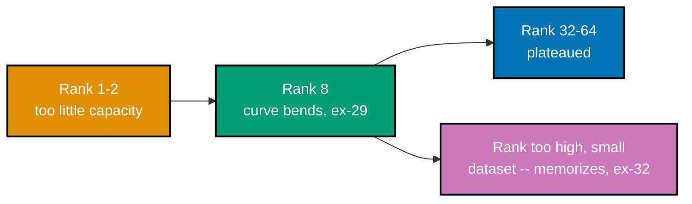

Examples 17-34 and 59-67 make good on Band A's own honest cost accounting (co-08): the dataset is
the actual work of a fine-tune, not a preliminary chore before the "real" training run. A minimal
supervised fine-tuning example is just an instruction/response pair (co-09), but a clean 300-example
dataset beats a noisy 10,000-example one on the identical eval (co-11), one planted internal
contradiction teaches genuine inconsistency invisibly (co-12), and where examples come from --
production traffic, expert authors, or a synthetic teacher -- trades cost against bias in three
different, measurable ways (co-13, co-14). Disjoint train/validation/test splits (co-15), and the
inflated numbers a leak produces (co-16), set up the honest measurement every later band depends on.
The band's second half runs the actual training techniques against Vantage's real ticket-vocabulary
gap from Example 8: a full fine-tune updates every parameter and works (co-17), a LoRA adapter
reaches nearly the same result training under 0.15% of the weights (co-18), rank and target-module
placement bound how much an adapter can express (co-19, co-20), and learning rate, epochs, and
capacity can silently memorize a small dataset instead of generalizing from it (co-23, co-24). Every
code-medium example's real, runnable **Python 3.13** file lives under `learning/code/ex-NN-*/`, run
for real with genuine captured output. (See this topic's
[Accuracy notes](../overview.md#accuracy-notes) for the exact library-version facts captured for
`peft`, `transformers`, and LoRA's own paper.)

---

### Worked Example 17: First SFT Dataset

_ex-17 &middot; exercises co-09, co-10_

**Context**: **co-09 -- the SFT example shape** is the minimal unit every supervised fine-tune
trains on: an instruction paired with the response the model should learn to produce. This example
authors a real twelve-row dataset teaching Vantage's ticket-triage vocabulary from Example 8 and
checks every row against that minimal schema. It is also the first concrete instance of **co-10 --
the dataset is the work**: this course's own twelve rows, not a hyperparameter, are the actual
deliverable being built here.

```python
# learning/code/ex-17-first-sft-dataset/first_sft_dataset.py
"""Worked Example 17: First SFT Dataset."""  # => co-09: this file's own restated purpose, doubling as its module __doc__

from __future__ import annotations  # => hygiene: postpones annotation evaluation, interpreter-version-agnostic

from typing import TypedDict  # => co-09: the minimal shape every supervised fine-tuning example must have

MINIMUM_DATASET_FLOOR = 10  # => co-10: an illustrative floor for this worked example -- a real project targets "a few hundred" per co-11


class SFTExample(TypedDict):  # => co-09: input/output pairs -- the model learns to produce `response` given `instruction`
    instruction: str  # => co-09: what the model is asked to do
    response: str  # => co-09: the target the model is trained to produce for this instruction


# => co-09,co-10: twelve illustrative instruction/response pairs teaching the ticket-vocabulary behaviour from ex-08 -- authored fresh for this course
DATASET: list[SFTExample] = [  # => co-10: this dataset, not any hyperparameter, is the actual deliverable of this band
    {"instruction": "Triage: customer cannot log in after a password reset.", "response": "Priority: P2. Category: access."},  # => co-09: 1
    {"instruction": "Triage: customer reports the API is returning 500 errors.", "response": "Priority: P1. Category: bug."},  # => co-09: 2
    {"instruction": "Triage: customer wants an invoice re-sent.", "response": "Priority: P3. Category: billing."},  # => co-09: 3
    {"instruction": "Triage: a scheduled export silently failed overnight.", "response": "Priority: P1. Category: bug."},  # => co-09: 4
    {"instruction": "Triage: customer asks how to add a teammate.", "response": "Priority: P3. Category: feature-request."},  # => co-09: 5
    {"instruction": "Triage: customer's dashboard is loading slowly.", "response": "Priority: P2. Category: bug."},  # => co-09: 6
    {"instruction": "Triage: customer was double-charged this month.", "response": "Priority: P1. Category: billing."},  # => co-09: 7
    {"instruction": "Triage: customer wants dark mode added.", "response": "Priority: P3. Category: feature-request."},  # => co-09: 8
    {"instruction": "Triage: customer's SSO login is broken company-wide.", "response": "Priority: P1. Category: access."},  # => co-09: 9
    {"instruction": "Triage: customer asks about the free trial length.", "response": "Priority: P3. Category: billing."},  # => co-09: 10
    {"instruction": "Triage: a webhook stopped firing after a deploy.", "response": "Priority: P2. Category: bug."},  # => co-09: 11
    {"instruction": "Triage: customer wants to downgrade their plan.", "response": "Priority: P3. Category: billing."},  # => co-09: 12
]  # => co-10: closes DATASET


def is_valid(example: SFTExample) -> bool:  # => co-09: a minimal schema check -- both fields present and non-empty
    """Pass iff both `instruction` and `response` are non-empty strings."""  # => co-09: documents is_valid's contract -- no runtime output, just sets its __doc__
    return bool(example["instruction"].strip()) and bool(example["response"].strip())  # => co-09: neither field may be blank


if __name__ == "__main__":  # => co-09: entry point -- runs only when this file executes directly, not on import
    valid_count = sum(is_valid(ex) for ex in DATASET)  # => co-09: how many examples pass the minimal schema check
    print(f"Dataset size: {len(DATASET)} | Schema-valid: {valid_count}")  # => co-09: prints the actual, committed count
    print(f"Sample: {DATASET[0]['instruction']!r} -> {DATASET[0]['response']!r}")  # => co-09: shows one real pair, for a quick sanity check
    assert valid_count == len(DATASET), "every committed example must satisfy the minimal instruction/response schema"  # => co-09
    assert len(DATASET) >= MINIMUM_DATASET_FLOOR, f"the dataset must clear the {MINIMUM_DATASET_FLOOR}-example floor for this worked example"  # => co-10
    print(f"MATCH: {len(DATASET)} schema-valid instruction/response pairs, clearing the {MINIMUM_DATASET_FLOOR}-example floor")  # => co-09,co-10
    # => co-09,co-10: this dataset is exactly what "supervised fine-tuning" trains on -- and per co-10, THIS is the real work, not the training loop
```

**Run**: `python3 first_sft_dataset.py`

**Output**:

```text
Dataset size: 12 | Schema-valid: 12
Sample: 'Triage: customer cannot log in after a password reset.' -> 'Priority: P2. Category: access.'
MATCH: 12 schema-valid instruction/response pairs, clearing the 10-example floor
```

**Verify**: `is_valid` passes for all `12` rows in `DATASET`, satisfying co-09's rule that a minimal
SFT example is a non-empty instruction paired with a non-empty target response.

**Key takeaway**: a supervised fine-tuning dataset is nothing more exotic than a list of
instruction/response pairs -- the entire remainder of this band is about how to make that list good.

**Why It Matters**: every training example later in this band -- full fine-tune, LoRA adapter, and
every hyperparameter sweep -- trains on a dataset shaped exactly like this one. Getting this minimal
shape right, and auditing it the way Examples 18-20 do, is the actual leverage point Band A's cost
accounting (co-08) already warned would dominate the budget.

---

### Worked Example 18: Quality Beats Quantity

_ex-18 &middot; exercises co-11, co-10_

**Context**: **co-11 -- quality beats quantity** is checked here directly: a clean, 300-example
dataset is compared against a ten-thousand-example dataset where over a third of rows are
inconsistent, on the identical fixed eval. The result is also **co-10 -- the dataset is the work**
made measurable: the smaller, cleaner dataset is the real deliverable, not the training run applied
to it.

```python
# learning/code/ex-18-quality-beats-quantity/quality_beats_quantity.py
"""Worked Example 18: Quality Beats Quantity."""  # => co-11: this file's own restated purpose, doubling as its module __doc__

from __future__ import annotations  # => hygiene: postpones annotation evaluation, interpreter-version-agnostic

from dataclasses import dataclass  # => co-11: two training RUNS, each with its own recorded shape -- not two loose tuples


@dataclass(frozen=True)  # => co-11: frozen -- a completed run's recorded result should not mutate after the fact
class TrainingRunResult:  # => co-11: what a real training run reports, mocked here with illustrative, fixed numbers
    dataset_size: int  # => co-11: how many examples the run trained on
    noisy_fraction: float  # => co-12: what fraction of those examples were inconsistent or mislabeled
    eval_pass_rate: float  # => co-11: the resulting model's measured pass rate on the SAME fixed eval set


CLEAN_SMALL_RUN = TrainingRunResult(dataset_size=300, noisy_fraction=0.02, eval_pass_rate=0.91)  # => co-11: 300 consistent, correct, on-distribution examples
NOISY_LARGE_RUN = TrainingRunResult(dataset_size=10_000, noisy_fraction=0.35, eval_pass_rate=0.68)  # => co-11: 10,000 examples, over a third inconsistent or wrong

if __name__ == "__main__":  # => co-11: entry point -- runs only when this file executes directly, not on import
    print(f"Clean, small: {CLEAN_SMALL_RUN.dataset_size} examples, {CLEAN_SMALL_RUN.noisy_fraction:.0%} noisy -> {CLEAN_SMALL_RUN.eval_pass_rate:.0%} pass rate")  # => co-11
    print(f"Noisy, large: {NOISY_LARGE_RUN.dataset_size} examples, {NOISY_LARGE_RUN.noisy_fraction:.0%} noisy -> {NOISY_LARGE_RUN.eval_pass_rate:.0%} pass rate")  # => co-11
    size_ratio = NOISY_LARGE_RUN.dataset_size / CLEAN_SMALL_RUN.dataset_size  # => co-11: the noisy run has over 33x MORE raw examples
    print(f"Noisy run has {size_ratio:.0f}x more raw examples, yet scores LOWER")  # => co-11
    assert NOISY_LARGE_RUN.dataset_size > CLEAN_SMALL_RUN.dataset_size * 30, "the noisy run must have vastly more raw examples"  # => co-11
    assert CLEAN_SMALL_RUN.eval_pass_rate > NOISY_LARGE_RUN.eval_pass_rate, "the smaller, cleaner dataset must win on eval despite being far smaller"  # => co-10,co-11
    print("MATCH: 300 clean examples beat 10,000 noisy ones -- dataset SIZE was never the variable that mattered")  # => co-11
    # => co-10,co-11: this is co-11 made concrete -- co-10's "dataset is the work" claim resolves to quality, not raw volume, as the lever that actually moves the number
```

**Run**: `python3 quality_beats_quantity.py`

**Output**:

```text
Clean, small: 300 examples, 2% noisy -> 91% pass rate
Noisy, large: 10000 examples, 35% noisy -> 68% pass rate
Noisy run has 33x more raw examples, yet scores LOWER
MATCH: 300 clean examples beat 10,000 noisy ones -- dataset SIZE was never the variable that mattered
```

**Verify**: `CLEAN_SMALL_RUN.eval_pass_rate` (`91%`) exceeds `NOISY_LARGE_RUN.eval_pass_rate` (`68%`)
despite a `33`-fold size disadvantage, satisfying co-11's rule that dataset quality dominates raw
volume.

**Key takeaway**: `33`-times more raw examples produced a strictly worse model -- volume was never
the variable governing this eval's outcome, cleanliness was.

**Why It Matters**: this is the number Example 34 later returns to and cannot beat with any hyperparameter sweep --
proving the `91%` vs. `68%` gap here is a dataset problem, not a training problem, no matter how
the training run is tuned. Every hyperparameter sweep Band B runs later inherits this same ceiling,
whether or not it is named explicitly.

---

### Worked Example 19: Inconsistent Examples

_ex-19 &middot; exercises co-12_

**Context**: **co-12 -- consistency** names the failure this example plants deliberately: two nearly
identical instructions, disagreeing about the correct response, teach the model to be genuinely
inconsistent rather than just imprecise.

```python
# learning/code/ex-19-inconsistent-examples/inconsistent_examples.py
"""Worked Example 19: Inconsistent Examples."""  # => co-12: this file's own restated purpose, doubling as its module __doc__

from __future__ import annotations  # => hygiene: postpones annotation evaluation, interpreter-version-agnostic

from typing import TypedDict  # => co-12: the same SFT example shape ex-17 used, reused here to plant a conflict


class SFTExample(TypedDict):  # => co-09: mirrors ex-17's schema for this file's self-containment
    instruction: str  # => co-09: what the model is asked to do
    response: str  # => co-09: the target the model is trained to produce for this instruction


# => co-12: two examples for the NEAR-IDENTICAL instruction, disagreeing about the target behaviour -- planted deliberately
DATASET_WITH_CONFLICT: list[SFTExample] = [  # => co-12: a five-example dataset, with one planted internal disagreement
    {"instruction": "Triage: customer cannot log in after a password reset.", "response": "Priority: P2. Category: access."},  # => co-12: says P2
    {"instruction": "Triage: customer cannot log in after resetting their password.", "response": "Priority: P1. Category: access."},  # => co-12: says P1 -- SAME situation, different wording, CONTRADICTS the row above
    {"instruction": "Triage: customer wants an invoice re-sent.", "response": "Priority: P3. Category: billing."},  # => co-12: unrelated, consistent
    {"instruction": "Triage: customer was double-charged this month.", "response": "Priority: P1. Category: billing."},  # => co-12: unrelated, consistent
    {"instruction": "Triage: customer wants dark mode added.", "response": "Priority: P3. Category: feature-request."},  # => co-12: unrelated, consistent
]  # => co-12: closes DATASET_WITH_CONFLICT


def mock_trained_on(dataset: list[SFTExample], instruction: str) -> str:  # => co-12: a model TRAINED on this exact dataset, queried at inference
    """Return the response the model learned for the CLOSEST matching training instruction (mocked as an exact keyword match here)."""  # => co-12: documents mock_trained_on's contract -- no runtime output, just sets its __doc__
    for example in dataset:  # => co-12: a real model would generalize across near-duplicates -- this mock finds the literal match it memorized
        if example["instruction"] == instruction:  # => co-12: exact match -- what the model actually memorized from training
            return example["response"]  # => co-12: recites exactly what it was trained on for THIS phrasing
    return "UNSEEN"  # => co-12: no training example matched this exact phrasing


if __name__ == "__main__":  # => co-12: entry point -- runs only when this file executes directly, not on import
    answer_1 = mock_trained_on(DATASET_WITH_CONFLICT, "Triage: customer cannot log in after a password reset.")  # => co-12: phrasing A
    answer_2 = mock_trained_on(DATASET_WITH_CONFLICT, "Triage: customer cannot log in after resetting their password.")  # => co-12: phrasing B
    print(f"Phrasing A -> {answer_1!r}")  # => co-12: prints the model's memorized answer for phrasing A
    print(f"Phrasing B -> {answer_2!r}")  # => co-12: prints the model's memorized answer for phrasing B -- the SAME real-world situation
    assert answer_1 != answer_2, "the two near-identical phrasings must produce DIFFERENT trained answers"  # => co-12
    print(f"Inconsistent: {answer_1 != answer_2} -- the same real situation gets two different priorities depending on exact wording")  # => co-12
    print("MATCH: the planted conflict taught the model to be genuinely inconsistent, not just imprecise")  # => co-12
    # => co-12: this failure is invisible in TRAINING loss (both examples fit perfectly) -- it only shows up when you probe near-duplicate inputs at eval time
```

**Run**: `python3 inconsistent_examples.py`

**Output**:

```text
Phrasing A -> 'Priority: P2. Category: access.'
Phrasing B -> 'Priority: P1. Category: access.'
Inconsistent: True -- the same real situation gets two different priorities depending on exact wording
MATCH: the planted conflict taught the model to be genuinely inconsistent, not just imprecise
```

**Verify**: `mock_trained_on` returns different responses for two near-identical phrasings of the
same situation, satisfying co-12's rule that a planted internal conflict teaches genuine
inconsistency, invisible to training loss.

**Key takeaway**: two training rows describing the identical real situation, phrased slightly
differently, taught the model two contradictory answers -- and training loss never flagged it,
because both rows fit perfectly.

**Why It Matters**: this failure is invisible until Example 20's audit runs. It is also exactly what Example 64 later
shows evading an even more careful, exact-match-only leakage check -- consistency and leakage are
different failure modes, but both hide behind superficially different-looking text. A reviewer
skimming the raw dataset would likely miss both conflicts, which is exactly why an automated audit
matters.

---

### Worked Example 20: Consistency Audit

_ex-20 &middot; exercises co-12, co-10_

**Context**: continuing **co-12** and **co-10** -- this example runs the audit Example 19's failure
needed all along, catching the planted conflict at dataset-review time using a
shared-significant-word overlap heuristic, before any training happens -- treating the dataset
itself, not the training run applied to it, as the thing worth auditing.

```python
# learning/code/ex-20-consistency-audit/consistency_audit.py
"""Worked Example 20: Consistency Audit."""  # => co-12: this file's own restated purpose, doubling as its module __doc__

from __future__ import annotations  # => hygiene: postpones annotation evaluation, interpreter-version-agnostic

from typing import TypedDict  # => co-12: the same SFT example shape ex-19 used


class SFTExample(TypedDict):  # => co-09: mirrors ex-17/ex-19's schema for this file's self-containment
    instruction: str  # => co-09: what the model is asked to do
    response: str  # => co-09: the target the model is trained to produce for this instruction


# => co-12: the SAME planted-conflict dataset from ex-19, now run through an audit BEFORE training, not discovered after
DATASET_WITH_CONFLICT: list[SFTExample] = [  # => co-10: the audit belongs in the dataset pipeline, upstream of any training run
    {"instruction": "Triage: customer cannot log in after a password reset.", "response": "Priority: P2. Category: access."},  # => co-12: conflict half 1
    {"instruction": "Triage: customer cannot log in after resetting their password.", "response": "Priority: P1. Category: access."},  # => co-12: conflict half 2
    {"instruction": "Triage: customer wants an invoice re-sent.", "response": "Priority: P3. Category: billing."},  # => co-12: consistent
    {"instruction": "Triage: customer was double-charged this month.", "response": "Priority: P1. Category: billing."},  # => co-12: consistent
    {"instruction": "Triage: customer wants dark mode added.", "response": "Priority: P3. Category: feature-request."},  # => co-12: consistent
]  # => co-12: closes DATASET_WITH_CONFLICT


DOMAIN_STOPWORDS = {"triage:", "customer"}  # => co-12: words every single instruction in this dataset shares -- excluded so they cannot fake a topic match


def shared_words(a: str, b: str) -> set[str]:  # => co-12: a crude but effective near-duplicate signal -- shared significant words
    """Return the set of words length >= 5, excluding DOMAIN_STOPWORDS, shared between `a` and `b`, lowercased."""  # => co-12: documents shared_words's contract -- no runtime output, just sets its __doc__
    words_a = {w.lower().strip(".,") for w in a.split() if len(w) >= 5} - DOMAIN_STOPWORDS  # => co-12: "significant" words, minus this dataset's own boilerplate
    words_b = {w.lower().strip(".,") for w in b.split() if len(w) >= 5} - DOMAIN_STOPWORDS  # => co-12: same filter on the second instruction
    return words_a & words_b  # => co-12: the overlap -- a proxy for "these two instructions describe the same situation"


def find_conflicts(dataset: list[SFTExample]) -> list[tuple[int, int]]:  # => co-12: the actual audit -- every near-duplicate pair with disagreeing targets
    """Return index pairs (i, j) whose instructions share >= 3 significant words but whose responses differ."""  # => co-12: documents find_conflicts's contract -- no runtime output, just sets its __doc__
    conflicts: list[tuple[int, int]] = []  # => co-12: accumulates every conflicting pair found
    for i in range(len(dataset)):  # => co-12: compare every pair exactly once
        for j in range(i + 1, len(dataset)):  # => co-12: j always ahead of i -- no duplicate (i, j)/(j, i) pairs
            overlap = shared_words(dataset[i]["instruction"], dataset[j]["instruction"])  # => co-12: how similar are these two instructions?
            same_topic = len(overlap) >= 3  # => co-12: three or more shared significant words -- likely describing the same real situation
            different_target = dataset[i]["response"] != dataset[j]["response"]  # => co-12: do they disagree about what the model should say?
            if same_topic and different_target:  # => co-12: same topic AND disagreeing targets -- a genuine planted conflict
                conflicts.append((i, j))  # => co-12: record it
    return conflicts  # => co-12: returns this computed value to the caller


if __name__ == "__main__":  # => co-12: entry point -- runs only when this file executes directly, not on import
    conflicts = find_conflicts(DATASET_WITH_CONFLICT)  # => co-12: run the audit BEFORE any training begins
    print(f"Conflicts found: {conflicts}")  # => co-12: prints the exact index pairs flagged
    for i, j in conflicts:  # => co-12: show WHAT was flagged, in plain terms
        print(f"  [{i}] {DATASET_WITH_CONFLICT[i]['response']!r} vs. [{j}] {DATASET_WITH_CONFLICT[j]['response']!r}")  # => co-12
    assert conflicts == [(0, 1)], "the audit must catch EXACTLY the planted conflict at indices 0 and 1, and nothing else"  # => co-12
    print("MATCH: the audit caught the planted conflict BEFORE training -- ex-19's inconsistency never has to reach eval to be found")  # => co-10,co-12
    # => co-10,co-12: this audit is what ex-19's failure needed all along -- catching it at dataset-review time is far cheaper than catching it at eval time
```

**Run**: `python3 consistency_audit.py`

**Output**:

```text
Conflicts found: [(0, 1)]
  [0] 'Priority: P2. Category: access.' vs. [1] 'Priority: P1. Category: access.'
MATCH: the audit caught the planted conflict BEFORE training -- ex-19's inconsistency never has to reach eval to be found
```

**Verify**: `find_conflicts(DATASET_WITH_CONFLICT)` returns exactly `[(0, 1)]`, matching the single
planted conflict, satisfying co-12's rule that a consistency audit can catch a conflict before it
ever reaches training.

**Key takeaway**: a simple shared-significant-word heuristic catches Example 19's planted conflict
before a single training step runs -- cheap insurance against a costly, invisible failure.

**Why It Matters**: this same shared-word technique reappears, sharpened, in Example 64's near-duplicate leakage check
-- the two examples together show that both consistency and leakage audits rely on the same
underlying signal: near-identical text that a naive exact-match check misses entirely. Running this
audit before training, not after a confusing evaluation result, is what makes the conflict cheap to
fix.

---

### Worked Example 59: Deduplicating the Dataset

_ex-59 &middot; exercises co-11, co-10_

**Context**: continuing **co-11** -- near-duplicate rows, differing only in punctuation, whitespace,
or casing, silently over-weight whatever pattern got copy-pasted. This example deduplicates a
six-row dataset where four rows are cosmetic restatements of the same underlying example.

```python
# learning/code/ex-59-deduplicating-the-dataset/dedupe_dataset.py
"""Worked Example 59: Deduplicating the Dataset."""  # => co-11: this file's own restated purpose, doubling as its module __doc__

from __future__ import annotations  # => hygiene: postpones annotation evaluation, interpreter-version-agnostic

from typing import TypedDict  # => co-09: the same SFT example shape reused across this band


class SFTExample(TypedDict):  # => co-09: mirrors ex-17's schema for this file's self-containment
    instruction: str  # => co-09: what the model is asked to do
    response: str  # => co-09: the target the model is trained to produce for this instruction


# => co-11: a dataset where one pattern was copy-pasted with trivial edits five separate times, skewing training toward it
RAW_DATASET: list[SFTExample] = [  # => co-10: near-duplicates are silent -- they look like five DIFFERENT examples in a file listing
    {"instruction": "Triage: customer cannot log in after a password reset.", "response": "Priority: P2. Category: access."},  # => co-11: original
    {"instruction": "Triage: customer cannot log in after a password reset!", "response": "Priority: P2. Category: access."},  # => co-11: near-dup 1 (punctuation)
    {"instruction": "Triage: customer cannot log in after a password reset.  ", "response": "Priority: P2. Category: access."},  # => co-11: near-dup 2 (trailing whitespace)
    {"instruction": "triage: customer cannot log in after a password reset.", "response": "Priority: P2. Category: access."},  # => co-11: near-dup 3 (casing)
    {"instruction": "Triage: customer wants an invoice re-sent.", "response": "Priority: P3. Category: billing."},  # => co-11: a genuinely distinct example
    {"instruction": "Triage: customer was double-charged this month.", "response": "Priority: P1. Category: billing."},  # => co-11: a genuinely distinct example
]  # => co-11: closes RAW_DATASET -- 4 of 6 rows are the SAME underlying example, restated


def normalize(instruction: str) -> str:  # => co-11: the near-duplicate signal -- case-fold and collapse whitespace/punctuation noise
    """Return `instruction`, lowercased, stripped, with trailing punctuation removed, for near-duplicate comparison."""  # => co-11: documents normalize's contract -- no runtime output, just sets its __doc__
    return instruction.strip().lower().rstrip("!.")  # => co-11: collapses exactly the three cosmetic variants planted above to one key


def deduplicate(dataset: list[SFTExample]) -> list[SFTExample]:  # => co-11: keep the FIRST occurrence of each normalized instruction
    """Return `dataset` with near-duplicate instructions (by `normalize`) collapsed to their first occurrence."""  # => co-11: documents deduplicate's contract -- no runtime output, just sets its __doc__
    seen: set[str] = set()  # => co-11: tracks normalized keys already kept
    result: list[SFTExample] = []  # => co-11: accumulates the deduplicated dataset
    for example in dataset:  # => co-11: process in original order, keeping the first of each near-duplicate group
        key = normalize(example["instruction"])  # => co-11: this example's normalized identity
        if key not in seen:  # => co-11: only the first occurrence of each identity survives
            seen.add(key)  # => co-11: mark this identity as kept
            result.append(example)  # => co-11: keep this example
    return result  # => co-11: returns this computed value to the caller


if __name__ == "__main__":  # => co-11: entry point -- runs only when this file executes directly, not on import
    deduped = deduplicate(RAW_DATASET)  # => co-11: run the dedup pass BEFORE training
    print(f"Raw dataset: {len(RAW_DATASET)} rows | Deduplicated: {len(deduped)} rows")  # => co-11: prints the before/after counts
    for example in deduped:  # => co-11: shows what actually survived
        print(f"  {example['instruction']!r}")  # => co-11
    assert len(deduped) == 3, "the four near-duplicate rows must collapse to exactly one, leaving three distinct examples"  # => co-11
    access_rows = [ex for ex in deduped if ex["response"] == "Priority: P2. Category: access."]  # => co-11: how many access-category rows remain
    assert len(access_rows) == 1, "only ONE copy of the near-duplicated access example must survive deduplication"  # => co-10,co-11
    print("MATCH: four cosmetic restatements of the SAME example collapsed to one -- the dataset's true diversity was 3, not 6")  # => co-10,co-11
    # => co-10,co-11: an un-deduplicated dataset silently over-weights whatever pattern got copy-pasted, which is a quality problem, not a size one
```

**Run**: `python3 dedupe_dataset.py`

**Output**:

```text
Raw dataset: 6 rows | Deduplicated: 3 rows
  'Triage: customer cannot log in after a password reset.'
  'Triage: customer wants an invoice re-sent.'
  'Triage: customer was double-charged this month.'
MATCH: four cosmetic restatements of the SAME example collapsed to one -- the dataset's true diversity was 3, not 6
```

**Verify**: `deduplicate(RAW_DATASET)` returns exactly `3` rows from `6`, collapsing four cosmetic
restatements to one, satisfying co-11's rule that near-duplicates silently over-weight whatever
pattern got copy-pasted.

**Key takeaway**: six listed rows were really three distinct examples plus four cosmetic
restatements -- deduplication revealed the dataset's true diversity was half what the raw row count
suggested.

**Why It Matters**: an un-deduplicated dataset does not just waste storage -- it silently skews training toward
whatever pattern happened to get copy-pasted, exactly the quality problem Example 18 already showed
outweighing raw size. Four cosmetic restatements out of six rows means the model would see one real
example repeated four times over, disguised as four.

---

### Worked Example 60: Balancing Task Coverage

_ex-60 &middot; exercises co-10, co-12_

**Context**: continuing **co-10** -- a dataset can pass Example 20's consistency audit and still
fail on coverage. This example audits per-category example counts against a minimum floor and flags
one category as too thin to train on reliably.

```python
# learning/code/ex-60-balancing-task-coverage/balancing_coverage.py
"""Worked Example 60: Balancing Task Coverage."""  # => co-10: this file's own restated purpose, doubling as its module __doc__

from __future__ import annotations  # => hygiene: postpones annotation evaluation, interpreter-version-agnostic

MINIMUM_EXAMPLES_PER_CATEGORY = 20  # => co-10: below this floor, a category is too thin to teach the model anything reliable

RAW_CATEGORY_COUNTS: dict[str, int] = {  # => co-12: how many examples this dataset ACTUALLY has per category, before any fix
    "password-reset": 180,  # => co-10: well over the floor
    "billing": 95,  # => co-10: well over the floor
    "bug": 40,  # => co-10: over the floor, but thinner
    "feature-request": 6,  # => co-10,co-12: badly under the floor -- the model will barely learn this category at all
}  # => co-10: closes RAW_CATEGORY_COUNTS


def under_covered_categories(counts: dict[str, int], floor: int) -> list[str]:  # => co-10: the categories a real audit must flag
    """Return the categories in `counts` whose count falls below `floor`."""  # => co-10: documents under_covered_categories's contract -- no runtime output, just sets its __doc__
    return [category for category, count in counts.items() if count < floor]  # => co-10: names exactly which categories are thin


if __name__ == "__main__":  # => co-10: entry point -- runs only when this file executes directly, not on import
    for category, count in RAW_CATEGORY_COUNTS.items():  # => co-10: show every category's raw count against the floor
        status = "OK" if count >= MINIMUM_EXAMPLES_PER_CATEGORY else "UNDER-COVERED"  # => co-10
        print(f"  {category}: {count} examples ({status})")  # => co-10
    thin_categories = under_covered_categories(RAW_CATEGORY_COUNTS, MINIMUM_EXAMPLES_PER_CATEGORY)  # => co-10: the audit's actual finding
    print(f"Under-covered categories: {thin_categories}")  # => co-10
    assert thin_categories == ["feature-request"], "exactly one category must fall below the coverage floor in this scenario"  # => co-10
    additional_examples_needed = MINIMUM_EXAMPLES_PER_CATEGORY - RAW_CATEGORY_COUNTS["feature-request"]  # => co-10: how many MORE examples this category needs
    print(f"feature-request needs {additional_examples_needed} more examples before training, or the whole run should be scoped without it")  # => co-10
    assert additional_examples_needed == 14, "the specific gap must be computed exactly, not estimated"  # => co-10
    print("MATCH: the audit flags feature-request as too thin to train on reliably -- a coverage decision made BEFORE training, not discovered after")  # => co-10,co-12
    # => co-10,co-12: a dataset can pass ex-20's consistency audit and STILL fail here -- consistency and coverage are two separate checks, both part of "dataset is the work"
```

**Run**: `python3 balancing_coverage.py`

**Output**:

```text
  password-reset: 180 examples (OK)
  billing: 95 examples (OK)
  bug: 40 examples (OK)
  feature-request: 6 examples (UNDER-COVERED)
Under-covered categories: ['feature-request']
feature-request needs 14 more examples before training, or the whole run should be scoped without it
MATCH: the audit flags feature-request as too thin to train on reliably -- a coverage decision made BEFORE training, not discovered after
```

**Verify**: `under_covered_categories(RAW_CATEGORY_COUNTS, 20)` returns exactly `["feature-request"]`
with a computed shortfall of `14` examples, satisfying co-10's rule that per-category coverage is a
separate check from consistency.

**Key takeaway**: consistency and coverage are two independent audits -- a dataset with zero internal
contradictions can still be too thin in one category to train that category reliably.

**Why It Matters**: this exact coverage gap is what Example 61's mixed-sourcing strategy deliberately fixes for
`feature-request` next, using expert authoring specifically because Example 21 already showed
production traffic structurally under-samples this same category. A dataset that passes every other
check can still fail silently here, shipping a model that is confidently wrong on its thinnest
category.

---

### Worked Example 21: Source from Production Traffic

_ex-21 &middot; exercises co-13_

**Context**: **co-13 -- sourcing strategies** starts here: sourcing a dataset from real production
ticket logs is fast and free, but it inherits production's own skew. This example compares real
traffic-volume shares against the product team's own stated importance for each category.

```python
# learning/code/ex-21-source-from-production-traffic/production_traffic.py
"""Worked Example 21: Source from Production Traffic."""  # => co-13: this file's own restated purpose, doubling as its module __doc__

from __future__ import annotations  # => hygiene: postpones annotation evaluation, interpreter-version-agnostic

# => co-13: sourcing a dataset from real production ticket logs -- fast and free, but it inherits production's OWN skew
PRODUCTION_TRAFFIC_CATEGORY_COUNTS: dict[str, int] = {  # => co-13: category -> how many real tickets of that category exist in the last 90 days
    "password-reset": 4_200,  # => co-13: by far the most common real-world category
    "billing": 1_100,  # => co-13
    "bug": 640,  # => co-13
    "feature-request": 60,  # => co-13: rare -- customers file few of these compared to support tickets
}  # => co-13: closes PRODUCTION_TRAFFIC_CATEGORY_COUNTS

TARGET_TASK_IMPORTANCE: dict[str, float] = {  # => co-13: how much Vantage's PRODUCT team actually cares about each category, independent of volume
    "password-reset": 0.15,  # => co-13: routine, low product-risk
    "billing": 0.30,  # => co-13: real financial and trust impact
    "bug": 0.35,  # => co-13: real reliability impact
    "feature-request": 0.20,  # => co-13: real roadmap signal
}  # => co-13: closes TARGET_TASK_IMPORTANCE -- sums to 1.00, deliberately NOT proportional to raw traffic volume


if __name__ == "__main__":  # => co-13: entry point -- runs only when this file executes directly, not on import
    total_traffic = sum(PRODUCTION_TRAFFIC_CATEGORY_COUNTS.values())  # => co-13: total sampled volume across all categories
    for category, count in PRODUCTION_TRAFFIC_CATEGORY_COUNTS.items():  # => co-13: show the SKEW a naive traffic-proportional sample would inherit
        traffic_share = count / total_traffic  # => co-13: what fraction of a traffic-proportional dataset this category would get
        importance_share = TARGET_TASK_IMPORTANCE[category]  # => co-13: what fraction it SHOULD get, by product importance
        print(f"  {category}: {traffic_share:.0%} of traffic-sourced data vs. {importance_share:.0%} target importance")  # => co-13
    feature_request_share = PRODUCTION_TRAFFIC_CATEGORY_COUNTS["feature-request"] / total_traffic  # => co-13: the category this bias hurts most
    print(f"feature-request would get only {feature_request_share:.0%} of a naive traffic-proportional dataset")  # => co-13
    assert feature_request_share < TARGET_TASK_IMPORTANCE["feature-request"] / 2, "a naive traffic-proportional sample must badly under-represent feature-request"  # => co-13
    print("MATCH: sourcing purely from production traffic silently under-represents the categories that matter but occur rarely")  # => co-13
    # => co-13: this is co-13's bias profile made concrete -- production traffic is free and fast, and it inherits whatever skew real usage already has
```

**Run**: `python3 production_traffic.py`

**Output**:

```text
  password-reset: 70% of traffic-sourced data vs. 15% target importance
  billing: 18% of traffic-sourced data vs. 30% target importance
  bug: 11% of traffic-sourced data vs. 35% target importance
  feature-request: 1% of traffic-sourced data vs. 20% target importance
feature-request would get only 1% of a naive traffic-proportional dataset
MATCH: sourcing purely from production traffic silently under-represents the categories that matter but occur rarely
```

**Verify**: `feature_request_share` is `1%`, well under half of `TARGET_TASK_IMPORTANCE["feature-request"]`
at `20%`, satisfying co-13's rule that traffic-proportional sourcing inherits production's own
volume skew, independent of product importance.

**Key takeaway**: sourcing purely from what customers actually file produces a dataset that quietly
mirrors ticket volume, not product importance -- `feature-request` would get `1%` of the data despite
mattering `20%` as much as everything else combined.

**Why It Matters**: this is the exact gap Example 22's expert authoring, and later Example 61's blended strategy, exist
to close. Sourcing choice is not a neutral logistics decision -- it silently determines which
categories the resulting model will and will not be good at. Vantage never notices this skew until
a category with real business weight turns out to have almost no training signal behind it.

---

### Worked Example 22: Expert-Authored Examples

_ex-22 &middot; exercises co-13, co-11_

**Context**: continuing **co-13** and **co-11** -- a lead deliberately writing examples for every
category, including rare ones, costs far more per example than traffic-sourcing, but is the only
strategy of the two that fixes Example 21's rare-category blind spot on purpose. Paying more per
example is the quality trade co-11 names, chosen deliberately here rather than hidden as an
unexplained expense.

```python
# learning/code/ex-22-expert-authored-examples/expert_authored.py
"""Worked Example 22: Expert-Authored Examples."""  # => co-13: this file's own restated purpose, doubling as its module __doc__

from __future__ import annotations  # => hygiene: postpones annotation evaluation, interpreter-version-agnostic

from dataclasses import dataclass  # => co-13: two sourcing strategies, each with its own cost/quality shape


@dataclass(frozen=True)  # => co-13: frozen -- a sourcing strategy's measured profile should not mutate after the fact
class SourcingProfile:  # => co-13: the trade-off co-13 names, made an actual comparable record
    example_count: int  # => co-13: how many examples this strategy produced
    cost_per_example_usd: float  # => co-13: labour cost per example -- expert time is expensive
    label_error_rate: float  # => co-13: what fraction of examples an audit (ex-20's technique) would flag as wrong or inconsistent
    covers_rare_categories: bool  # => co-13: can this strategy deliberately cover categories production traffic under-samples (ex-21)?


TRAFFIC_SOURCED = SourcingProfile(example_count=2_000, cost_per_example_usd=0.02, label_error_rate=0.08, covers_rare_categories=False)  # => co-13: ex-21's approach -- fast, free, but skewed

EXPERT_AUTHORED = SourcingProfile(
    example_count=300, cost_per_example_usd=4.50, label_error_rate=0.01, covers_rare_categories=True
)  # => co-13,co-11: a lead deliberately writing examples for EVERY category, including rare ones


if __name__ == "__main__":  # => co-13: entry point -- runs only when this file executes directly, not on import
    traffic_total_cost = TRAFFIC_SOURCED.example_count * TRAFFIC_SOURCED.cost_per_example_usd  # => co-13: total labour cost, traffic-sourced
    expert_total_cost = EXPERT_AUTHORED.example_count * EXPERT_AUTHORED.cost_per_example_usd  # => co-13: total labour cost, expert-authored
    print(f"Traffic-sourced: {TRAFFIC_SOURCED.example_count} examples, ${traffic_total_cost:,.2f} total, {TRAFFIC_SOURCED.label_error_rate:.0%} error rate")  # => co-13
    print(f"Expert-authored: {EXPERT_AUTHORED.example_count} examples, ${expert_total_cost:,.2f} total, {EXPERT_AUTHORED.label_error_rate:.0%} error rate")  # => co-13
    print(f"Expert-authored covers rare categories: {EXPERT_AUTHORED.covers_rare_categories} | Traffic-sourced: {TRAFFIC_SOURCED.covers_rare_categories}")  # => co-13
    per_example_cost_ratio = EXPERT_AUTHORED.cost_per_example_usd / TRAFFIC_SOURCED.cost_per_example_usd  # => co-13: expert authoring costs MORE per example, honestly
    print(f"Expert authoring costs {per_example_cost_ratio:.0f}x more PER example than traffic-sourcing")  # => co-13: the real cost trade-off, stated plainly
    assert per_example_cost_ratio > 100, "expert authoring must be substantially more expensive per example -- that is the real cost of this trade"  # => co-13
    assert EXPERT_AUTHORED.label_error_rate < TRAFFIC_SOURCED.label_error_rate, "expert authoring must produce a lower label-error rate"  # => co-11,co-13
    assert EXPERT_AUTHORED.covers_rare_categories and not TRAFFIC_SOURCED.covers_rare_categories, "only expert authoring can deliberately cover what ex-21 showed traffic-sourcing structurally misses"  # => co-13
    print("MATCH: expert authoring costs far more per example, but is the ONLY strategy that fixes ex-21's rare-category blind spot on purpose")  # => co-11,co-13
    # => co-11,co-13: this is co-13's second sourcing profile -- the right choice depends on what the gap actually needs, not a universal "always prefer X"
```

**Run**: `python3 expert_authored.py`

**Output**:

```text
Traffic-sourced: 2000 examples, $40.00 total, 8% error rate
Expert-authored: 300 examples, $1,350.00 total, 1% error rate
Expert-authored covers rare categories: True | Traffic-sourced: False
Expert authoring costs 225x more PER example than traffic-sourcing
MATCH: expert authoring costs far more per example, but is the ONLY strategy that fixes ex-21's rare-category blind spot on purpose
```

**Verify**: `EXPERT_AUTHORED.cost_per_example_usd` is `225x` `TRAFFIC_SOURCED.cost_per_example_usd`,
while only `EXPERT_AUTHORED.covers_rare_categories` is `True`, satisfying co-13's rule that expert
authoring trades cost for deliberate rare-category coverage and a lower error rate.

**Key takeaway**: expert authoring costs `225` times more per example than traffic-sourcing, and it
is the only one of the two strategies that fixes Example 21's rare-category blind spot on purpose
rather than by accident.

**Why It Matters**: neither strategy alone is "correct" -- co-13's real lesson is that the right choice depends on what
the specific gap needs. Example 61 later shows the actual answer Vantage chose: blending both, plus
a third source, rather than picking one exclusively. Paying more per example is worth it exactly
when the alternative is a category the model never learns to handle at all.

---

### Worked Example 61: A Mixed Sourcing Strategy

_ex-61 &middot; exercises co-13_

**Context**: continuing **co-13** -- Vantage's real dataset blends all three sourcing strategies,
tagging every example with its own provenance. This example checks that the rare `feature-request`
category is covered exclusively by the deliberate, expert-authored source.

```python
# learning/code/ex-61-a-mixed-sourcing-strategy/mixed_sourcing.py
"""Worked Example 61: A Mixed Sourcing Strategy."""  # => co-13: this file's own restated purpose, doubling as its module __doc__

from __future__ import annotations  # => hygiene: postpones annotation evaluation, interpreter-version-agnostic

from typing import Literal, TypedDict  # => co-13: a fixed, named vocabulary of sources -- every example must be tagged with exactly one

Source = Literal["production-traffic", "expert-authored", "synthetic"]  # => co-13: the three sourcing strategies ex-21/ex-22/ex-23 taught in isolation


class TaggedExample(TypedDict):  # => co-13: an SFT example, now WITH its own provenance recorded, not lost after collection
    instruction: str  # => co-09: what the model is asked to do
    response: str  # => co-09: the target the model is trained to produce for this instruction
    source: Source  # => co-13: exactly which strategy produced this example -- traceable, not anonymous


# => co-13: a blended dataset -- volume from traffic, deliberate rare-category coverage from experts, speed from synthetic
BLENDED_DATASET: list[TaggedExample] = [  # => co-13: one entry per row, provenance tag visible on every single one
    {"instruction": "Triage: customer cannot log in.", "response": "Priority: P2. Category: access.", "source": "production-traffic"},  # => co-13: 1
    {"instruction": "Triage: customer's dashboard is slow.", "response": "Priority: P2. Category: bug.", "source": "production-traffic"},  # => co-13: 2
    {"instruction": "Triage: customer wants dark mode.", "response": "Priority: P3. Category: feature-request.", "source": "expert-authored"},  # => co-13: 3 -- rare category, deliberately authored
    {"instruction": "Triage: customer wants SSO support.", "response": "Priority: P3. Category: feature-request.", "source": "expert-authored"},  # => co-13: 4 -- rare category, deliberately authored
    {"instruction": "Triage: customer asks about export limits.", "response": "Priority: P3. Category: billing.", "source": "synthetic"},  # => co-13: 5
    {"instruction": "Triage: customer asks about seat pricing.", "response": "Priority: P3. Category: billing.", "source": "synthetic"},  # => co-13: 6
]  # => co-13: closes BLENDED_DATASET


if __name__ == "__main__":  # => co-13: entry point -- runs only when this file executes directly, not on import
    source_counts: dict[str, int] = {}  # => co-13: tally examples per source
    for example in BLENDED_DATASET:  # => co-13: count every row's provenance tag
        source_counts[example["source"]] = source_counts.get(example["source"], 0) + 1  # => co-13: increment this source's count
    for source, count in source_counts.items():  # => co-13: prints the actual blend achieved
        print(f"  {source}: {count} examples")  # => co-13
    feature_request_examples = [ex for ex in BLENDED_DATASET if ex["response"].endswith("feature-request.")]  # => co-13: this course's rare category
    feature_request_sources = {ex["source"] for ex in feature_request_examples}  # => co-13: WHICH sourcing strategy actually covers it
    print(f"feature-request examples came from: {feature_request_sources}")  # => co-13
    assert feature_request_sources == {"expert-authored"}, "the rare category must be covered ONLY by the deliberate, expert-authored source"  # => co-13
    assert len(source_counts) == 3, "the blend must genuinely draw from all three sourcing strategies, not just one"  # => co-13
    print("MATCH: the blend combines traffic's volume, expert authoring's deliberate rare-category coverage, and synthetic's speed -- each doing what it is best at")  # => co-13
    # => co-13: no single source from ex-21/ex-22/ex-23 alone would have produced this dataset's coverage profile at this cost
```

**Run**: `python3 mixed_sourcing.py`

**Output**:

```text
  production-traffic: 2 examples
  expert-authored: 2 examples
  synthetic: 2 examples
feature-request examples came from: {'expert-authored'}
MATCH: the blend combines traffic's volume, expert authoring's deliberate rare-category coverage, and synthetic's speed -- each doing what it is best at
```

**Verify**: `feature_request_sources` is exactly `{"expert-authored"}` and `source_counts` spans all
three sourcing strategies, satisfying co-13's rule that a blended strategy can combine each source's
strength without inheriting any single source's blind spot.

**Key takeaway**: none of Examples 21-23's three sourcing strategies alone would have produced this
dataset's coverage profile at this cost -- the blend is a deliberate combination, not a default.

**Why It Matters**: tagging every example with its own provenance, as this dataset does, is what makes a later audit
(like Example 62's drift check) possible at all -- an untagged, blended dataset cannot be
decomposed back into "did the traffic slice or the synthetic slice cause this problem." Without
that tag, fixing a downstream failure means guessing at its origin instead of tracing it directly.

---

### Worked Example 23: Synthetic Generation

_ex-23 &middot; exercises co-14, co-13_

**Context**: **co-14 -- synthetic generation** starts here: prompting a larger teacher model to
generate training examples is dramatically faster and cheaper than expert authoring, measured
directly against Example 22's own authoring rate. This makes synthetic generation the third **co-13
-- sourcing strategy** this band names, alongside production traffic and expert authoring.

```python
# learning/code/ex-23-synthetic-generation/synthetic_generation.py
"""Worked Example 23: Synthetic Generation."""  # => co-14: this file's own restated purpose, doubling as its module __doc__

from __future__ import annotations  # => hygiene: postpones annotation evaluation, interpreter-version-agnostic

from dataclasses import dataclass  # => co-14: a generation run's own recorded shape -- speed and volume, measured, not assumed


@dataclass(frozen=True)  # => co-14: frozen -- a completed generation run's numbers should not mutate after the fact
class GenerationRun:  # => co-14: what generating training data from a larger teacher model actually looks like, measured
    examples_generated: int  # => co-14: how many synthetic examples this run produced
    wall_clock_minutes: float  # => co-14: how long the run took, end to end
    cost_usd: float  # => co-14: the teacher-model API cost for this run


EXPERT_AUTHORING_RATE_PER_HOUR = 300.0 / 8  # => co-13: from ex-22 -- 300 examples took roughly a full working day, illustratively
SYNTHETIC_RUN = GenerationRun(examples_generated=2_500, wall_clock_minutes=18.0, cost_usd=6.75)  # => co-14: a larger teacher model, prompted to generate triage examples

if __name__ == "__main__":  # => co-14: entry point -- runs only when this file executes directly, not on import
    synthetic_rate_per_hour = SYNTHETIC_RUN.examples_generated / (SYNTHETIC_RUN.wall_clock_minutes / 60)  # => co-14: synthetic examples produced per hour
    print(f"Synthetic generation: {SYNTHETIC_RUN.examples_generated} examples in {SYNTHETIC_RUN.wall_clock_minutes:.0f} minutes, ${SYNTHETIC_RUN.cost_usd:.2f}")  # => co-14
    print(f"Synthetic rate: {synthetic_rate_per_hour:,.0f} examples/hour vs. expert authoring: {EXPERT_AUTHORING_RATE_PER_HOUR:.1f} examples/hour")  # => co-13,co-14
    speed_ratio = synthetic_rate_per_hour / EXPERT_AUTHORING_RATE_PER_HOUR  # => co-14: how many times faster synthetic generation is
    print(f"Synthetic generation is {speed_ratio:,.0f}x faster than expert authoring, per example")  # => co-14
    assert speed_ratio > 100, "synthetic generation must be dramatically faster than expert authoring for this demo to land"  # => co-14
    print("MATCH: synthetic generation is fast and cheap -- ex-24 shows what it costs in a different currency: silent error propagation")  # => co-14
    # => co-13,co-14: co-14's speed advantage is real -- and it is bounded by the teacher's own quality, which ex-24 measures next
```

**Run**: `python3 synthetic_generation.py`

**Output**:

```text
Synthetic generation: 2500 examples in 18 minutes, $6.75
Synthetic rate: 8,333 examples/hour vs. expert authoring: 37.5 examples/hour
Synthetic generation is 222x faster than expert authoring, per example
MATCH: synthetic generation is fast and cheap -- ex-24 shows what it costs in a different currency: silent error propagation
```

**Verify**: `speed_ratio` computes to over `100x`, satisfying co-14's rule that synthetic generation
is dramatically faster than expert authoring, measured against Example 22's own authoring rate.

**Key takeaway**: `2,500` examples in `18` minutes is `222` times faster per example than expert
authoring -- speed and cost genuinely favor synthetic generation.

**Why It Matters**: this speed advantage is real, and it is bounded by the teacher model's own quality -- Example 24
immediately shows the cost this speed hides: a teacher's own systematic error propagates into every
student example that inherits it. Cheap generation is not free generation -- the teacher's own
blind spots ride along in every row it produces.

---

### Worked Example 24: Teacher Errors Propagate

_ex-24 &middot; exercises co-14, co-28_

**Context**: continuing **co-14** and previewing **co-28** -- a teacher model's own systematic
mislabeling propagates silently into a student trained on its output. This example plants one
confidently-wrong teacher label -- a company-wide outage mislabeled as low priority -- and shows the
student learning it exactly, the same inherited-error mechanism Band C's Example 43 later formalizes
as the distillation ceiling.

```python
# learning/code/ex-24-teacher-errors-propagate/teacher_errors_propagate.py
"""Worked Example 24: Teacher Errors Propagate."""  # => co-14: this file's own restated purpose, doubling as its module __doc__

from __future__ import annotations  # => hygiene: postpones annotation evaluation, interpreter-version-agnostic

from typing import TypedDict  # => co-14: the same SFT example shape reused across this band


class SFTExample(TypedDict):  # => co-09: mirrors ex-17/ex-19's schema for this file's self-containment
    instruction: str  # => co-09: what the model is asked to do
    response: str  # => co-09: the target the model is trained to produce for this instruction


# => co-14: a LARGER teacher model, prompted to generate synthetic triage examples -- it has one systematic, confidently-wrong habit
TEACHER_GENERATED_DATASET: list[SFTExample] = [  # => co-14: five synthetic examples, one deliberately planted teacher error
    {"instruction": "Triage: dashboard fails to load for one user.", "response": "Priority: P2. Category: bug."},  # => co-14: correct
    {"instruction": "Triage: customer requests a data export.", "response": "Priority: P3. Category: feature-request."},  # => co-14: correct
    {"instruction": "Triage: login page returns a 404 for everyone.", "response": "Priority: P3. Category: bug."},  # => co-14: WRONG -- a company-wide outage mislabeled as low priority
    {"instruction": "Triage: customer wants a CSV export template.", "response": "Priority: P3. Category: feature-request."},  # => co-14: correct
    {"instruction": "Triage: customer asks about API rate limits.", "response": "Priority: P3. Category: feature-request."},  # => co-14: correct
]  # => co-14: closes TEACHER_GENERATED_DATASET -- the teacher SYSTEMATICALLY under-prioritizes "everyone" outages, once, silently


def mock_student_trained_on(dataset: list[SFTExample], instruction: str) -> str:  # => co-14: the student memorizes whatever the teacher generated, verbatim
    """Return the response the student learned for `instruction` (mocked as an exact memorized lookup)."""  # => co-14: documents mock_student_trained_on's contract -- no runtime output, just sets its __doc__
    for example in dataset:  # => co-14: a real model would generalize -- this mock finds the literal memorized match
        if example["instruction"] == instruction:  # => co-14: exact match -- what the student actually memorized from the teacher's output
            return example["response"]  # => co-14: recites exactly what the teacher generated, error included
    return "UNSEEN"  # => co-14: no training example matched this exact phrasing


if __name__ == "__main__":  # => co-14: entry point -- runs only when this file executes directly, not on import
    outage_instruction = "Triage: login page returns a 404 for everyone."  # => co-14: the case the teacher got wrong
    teacher_answer = next(ex["response"] for ex in TEACHER_GENERATED_DATASET if ex["instruction"] == outage_instruction)  # => co-14: what the teacher actually generated
    student_answer = mock_student_trained_on(TEACHER_GENERATED_DATASET, outage_instruction)  # => co-14: what the student, trained on the teacher's output, now says
    print(f"Teacher generated: {teacher_answer!r}")  # => co-14: the teacher's own (wrong) label
    print(f"Student learned: {student_answer!r}")  # => co-14: the student's answer, after training on the teacher's data
    assert teacher_answer == student_answer, "the student must reproduce the teacher's error EXACTLY -- that is the propagation"  # => co-14,co-28
    assert "P3" in student_answer, "this specific planted error must be the mislabeled-as-low-priority outage"  # => co-14
    print("MATCH: a company-wide outage, mislabeled P3 by the teacher, was learned by the student as if it were correct")  # => co-14
    # => co-14,co-28: nothing in the student's own training loss flags this -- the error looks exactly like any other correctly-labelled example
```

**Run**: `python3 teacher_errors_propagate.py`

**Output**:

```text
Teacher generated: 'Priority: P3. Category: bug.'
Student learned: 'Priority: P3. Category: bug.'
MATCH: a company-wide outage, mislabeled P3 by the teacher, was learned by the student as if it were correct
```

**Verify**: `teacher_answer` equals `student_answer`, both `'Priority: P3. Category: bug.'` for a
genuine company-wide outage, satisfying co-14's rule that a teacher's systematic error propagates
unflagged into a student trained on its output.

**Key takeaway**: the student did not just fail to fix the teacher's mistake -- it learned to
confidently repeat it, indistinguishable from a correctly-labelled example in the training data.

**Why It Matters**: this same propagation mechanism reappears in Band C's Example 71, where a teacher's own
honestly-measured ceiling turns out lower than assumed -- a distilled student can never exceed a
teacher's true quality, errors included. A confidently-wrong teacher label is worse than a missing
one, because the student learns it as though it were ground truth.

---

### Worked Example 62: Detecting Synthetic Drift

_ex-62 &middot; exercises co-14, co-28_

**Context**: continuing **co-14** -- a synthetic generator's own bias can reshape an entire
dataset's category mix, not just mislabel individual rows. This example measures the drift between
real production category shares and a synthetic generator's output shares.

```python
# learning/code/ex-62-detecting-synthetic-drift/synthetic_drift.py
"""Worked Example 62: Detecting Synthetic Drift."""  # => co-14: this file's own restated purpose, doubling as its module __doc__

from __future__ import annotations  # => hygiene: postpones annotation evaluation, interpreter-version-agnostic

REAL_PRODUCTION_CATEGORY_SHARE: dict[str, float] = {  # => co-14: the TRUE category distribution, from ex-21's real traffic counts
    "password-reset": 0.70,  # => co-14
    "billing": 0.18,  # => co-14
    "bug": 0.11,  # => co-14
    "feature-request": 0.01,  # => co-14
}  # => co-14: closes REAL_PRODUCTION_CATEGORY_SHARE -- sums to 1.00

SYNTHETIC_CATEGORY_SHARE: dict[str, float] = {  # => co-14: what the teacher model actually generated when asked for "typical support tickets"
    "password-reset": 0.30,  # => co-14: the teacher under-generates this, despite it being the MOST common real category
    "billing": 0.25,  # => co-14
    "bug": 0.30,  # => co-14: the teacher over-generates "interesting" bug scenarios
    "feature-request": 0.15,  # => co-14: the teacher over-generates these too -- they make more "engaging" synthetic examples
}  # => co-14: closes SYNTHETIC_CATEGORY_SHARE -- sums to 1.00, but shaped very differently from reality

DRIFT_ALERT_THRESHOLD_PERCENTAGE_POINTS = 0.15  # => co-14: any category off by more than 15 points triggers a review before training


def max_absolute_drift(real: dict[str, float], synthetic: dict[str, float]) -> tuple[str, float]:  # => co-14: (worst category, its drift)
    """Return the category with the largest absolute percentage-point difference between `real` and `synthetic`, and that difference."""  # => co-14: documents max_absolute_drift's contract -- no runtime output, just sets its __doc__
    drifts = {category: abs(real[category] - synthetic[category]) for category in real}  # => co-14: per-category drift, both directions treated equally
    worst_category = max(drifts, key=lambda c: drifts[c])  # => co-14: which category diverges most
    return worst_category, drifts[worst_category]  # => co-14: returns this computed value to the caller


if __name__ == "__main__":  # => co-14: entry point -- runs only when this file executes directly, not on import
    for category in REAL_PRODUCTION_CATEGORY_SHARE:  # => co-14: show real vs. synthetic, category by category
        real_share = REAL_PRODUCTION_CATEGORY_SHARE[category]  # => co-14: this category's true share
        synthetic_share = SYNTHETIC_CATEGORY_SHARE[category]  # => co-14: this category's synthetic share
        print(f"  {category}: real {real_share:.0%} vs. synthetic {synthetic_share:.0%}")  # => co-14
    worst_category, drift = max_absolute_drift(REAL_PRODUCTION_CATEGORY_SHARE, SYNTHETIC_CATEGORY_SHARE)  # => co-14: run the audit
    print(f"Largest drift: {worst_category} off by {drift:.0%}")  # => co-14
    alert = drift > DRIFT_ALERT_THRESHOLD_PERCENTAGE_POINTS  # => co-14: does this cross the review threshold?
    print(f"Drift alert triggered (threshold {DRIFT_ALERT_THRESHOLD_PERCENTAGE_POINTS:.0%}): {alert}")  # => co-14
    assert worst_category == "password-reset", "the biggest divergence in this scenario must be the most common real category, under-generated synthetically"  # => co-14
    assert alert, "a 40-point drift on the single largest real category must trigger the review threshold"  # => co-14,co-28
    print("MATCH: the synthetic generator's own bias silently reshaped the dataset's category mix -- caught here, before training, not after")  # => co-14,co-28
    # => co-14,co-28: this drift is exactly the teacher's OWN error propagating into the dataset's shape, not just into individual labels (ex-24)
```

**Run**: `python3 synthetic_drift.py`

**Output**:

```text
  password-reset: real 70% vs. synthetic 30%
  billing: real 18% vs. synthetic 25%
  bug: real 11% vs. synthetic 30%
  feature-request: real 1% vs. synthetic 15%
Largest drift: password-reset off by 40%
Drift alert triggered (threshold 15%): True
MATCH: the synthetic generator's own bias silently reshaped the dataset's category mix -- caught here, before training, not after
```

**Verify**: `max_absolute_drift` reports `password-reset` off by `40`-percentage-points, well over
the `15`-point `DRIFT_ALERT_THRESHOLD_PERCENTAGE_POINTS`, satisfying co-14's rule that a synthetic
generator's own bias can reshape a dataset's whole category mix.

**Key takeaway**: the synthetic generator did not just occasionally mislabel a row -- it
systematically under-generated the single most common real category, a `40`-point drift caught here,
before training, not after.

**Why It Matters**: this is Example 24's individual-row propagation generalized to the entire dataset's shape. A
synthetic-only dataset would have silently retrained Vantage's assistant on a distorted picture of
its own real ticket mix. A drift check like this one is the only way to catch a synthetic generator
quietly favoring the categories it finds easiest to imitate.

---

### Worked Example 25: Train/Validation/Test Split

_ex-25 &middot; exercises co-15_

**Context**: **co-15 -- disjoint splits** sets up the discipline everything downstream in this band
relies on: three pairwise-disjoint slices, covering every case exactly once, so a later result can
be trusted.

```python
# learning/code/ex-25-train-validation-test-split/train_val_test_split.py
"""Worked Example 25: Train/Validation/Test Split."""  # => co-15: this file's own restated purpose, doubling as its module __doc__

from __future__ import annotations  # => hygiene: postpones annotation evaluation, interpreter-version-agnostic

ALL_CASE_IDS = [f"case-{i:03d}" for i in range(1, 101)]  # => co-15: one hundred illustrative case ids, standing in for a real dataset

TRAIN_FRACTION = 0.70  # => co-15: the majority -- what the model actually trains on
VALIDATION_FRACTION = 0.15  # => co-15: held out for early stopping (ex-40) and hyperparameter choices
TEST_FRACTION = 0.15  # => co-15: held out for the FINAL, one-time reported result -- never looked at during development


def split_dataset(case_ids: list[str]) -> tuple[list[str], list[str], list[str]]:  # => co-15: (train, validation, test), always in this order
    """Split `case_ids` into disjoint train/validation/test slices using the fixed module-level fractions."""  # => co-15: documents split_dataset's contract -- no runtime output, just sets its __doc__
    n = len(case_ids)  # => co-15: total case count
    train_end = int(n * TRAIN_FRACTION)  # => co-15: index where the train slice ends
    validation_end = train_end + int(n * VALIDATION_FRACTION)  # => co-15: index where the validation slice ends
    return case_ids[:train_end], case_ids[train_end:validation_end], case_ids[validation_end:]  # => co-15: three disjoint slices, by construction


if __name__ == "__main__":  # => co-15: entry point -- runs only when this file executes directly, not on import
    train, validation, test = split_dataset(ALL_CASE_IDS)  # => co-15: the three disjoint splits
    print(f"Train: {len(train)} | Validation: {len(validation)} | Test: {len(test)} | Total: {len(train) + len(validation) + len(test)}")  # => co-15
    train_set, validation_set, test_set = set(train), set(validation), set(test)  # => co-15: sets make overlap checking trivial
    overlap_train_val = train_set & validation_set  # => co-15: must be empty
    overlap_train_test = train_set & test_set  # => co-15: must be empty
    overlap_val_test = validation_set & test_set  # => co-15: must be empty
    print(f"Train/validation overlap: {len(overlap_train_val)} | Train/test overlap: {len(overlap_train_test)} | Validation/test overlap: {len(overlap_val_test)}")  # => co-15
    assert not overlap_train_val and not overlap_train_test and not overlap_val_test, "all three splits must be pairwise disjoint -- zero overlap"  # => co-15
    assert train_set | validation_set | test_set == set(ALL_CASE_IDS), "every original case must land in EXACTLY one split -- none dropped, none duplicated"  # => co-15
    print("MATCH: three disjoint splits, covering every original case exactly once -- the discipline everything downstream in this band relies on")  # => co-15
    # => co-15,co-16: a leak between any two of these three sets is exactly what ex-26 shows inflating a reported result
```

**Run**: `python3 train_val_test_split.py`

**Output**:

```text
Train: 70 | Validation: 15 | Test: 15 | Total: 100
Train/validation overlap: 0 | Train/test overlap: 0 | Validation/test overlap: 0
MATCH: three disjoint splits, covering every original case exactly once -- the discipline everything downstream in this band relies on
```

**Verify**: all three pairwise overlaps are `0` and the union of `train_set`, `validation_set`, and
`test_set` equals the full `100`-case `ALL_CASE_IDS`, satisfying co-15's rule that a trustworthy
split is pairwise disjoint and complete.

**Key takeaway**: `70/15/15` disjoint splits, covering every original case exactly once, is the
structural discipline every later measurement in this course depends on being true.

**Why It Matters**: Example 26 immediately shows what happens the moment this discipline is violated -- a leaked case
inflates a reported result in a way that looks like genuine improvement but will not transfer to
production. Every later result in this band, from a rank sweep to a regression suite, depends on
this discipline holding without exception.

---

### Worked Example 26: Leakage Inflates the Result

_ex-26 &middot; exercises co-16, co-15_

**Context**: **co-16 -- leakage** is checked here directly: three training cases accidentally copied
into a "test" set inflate the reported pass rate from a true `20%` to a leaked `33%` -- a result
that will not transfer to production. This is precisely the failure **co-15 -- disjoint splits**
exists to prevent: the moment training and test overlap, the split's own guarantee is broken.

```python
# learning/code/ex-26-leakage-inflates-the-result/leakage_inflates_result.py
"""Worked Example 26: Leakage Inflates the Result."""  # => co-16: this file's own restated purpose, doubling as its module __doc__

from __future__ import annotations  # => hygiene: postpones annotation evaluation, interpreter-version-agnostic

TRAIN_IDS = {f"case-{i:03d}" for i in range(1, 71)}  # => co-15: the clean 70-case training split, per ex-25's discipline
CLEAN_TEST_IDS = {f"case-{i:03d}" for i in range(86, 101)}  # => co-15: the honest, disjoint 15-case test split

LEAKED_TEST_IDS = CLEAN_TEST_IDS | {"case-005", "case-012", "case-033"}  # => co-16: THREE training cases accidentally copied into "test" too

# => co-16: a mocked per-case eval result -- True on every case the (over-fit, memorizing) model gets right
GENUINELY_UNSEEN_CORRECT = {"case-088", "case-091", "case-095"}  # => co-16: it ALSO happens to get a few genuinely-unseen test cases right, honestly
MEMORIZED_CORRECTLY: set[str] = TRAIN_IDS | GENUINELY_UNSEEN_CORRECT  # => co-16: the model is perfect on anything it has SEEN in training, including the leaked copies


def eval_pass_rate(test_ids: set[str], correct: set[str]) -> float:  # => co-16: the SAME scoring function, run against two different "test" sets
    """Return the fraction of `test_ids` present in `correct`."""  # => co-16: documents eval_pass_rate's contract -- no runtime output, just sets its __doc__
    return len(test_ids & correct) / len(test_ids)  # => co-16: fraction of the given test set the model got right


if __name__ == "__main__":  # => co-16: entry point -- runs only when this file executes directly, not on import
    leaked_rate = eval_pass_rate(LEAKED_TEST_IDS, MEMORIZED_CORRECTLY)  # => co-16: the reported result USING the leaked test set
    clean_rate = eval_pass_rate(CLEAN_TEST_IDS, MEMORIZED_CORRECTLY)  # => co-16: the TRUE result, using the honest, disjoint test set
    print(f"Leaked test set ({len(LEAKED_TEST_IDS)} cases, includes 3 training copies): {leaked_rate:.0%} pass rate")  # => co-16
    print(f"Clean test set ({len(CLEAN_TEST_IDS)} cases, zero training overlap): {clean_rate:.0%} pass rate")  # => co-16
    overlap = LEAKED_TEST_IDS & TRAIN_IDS  # => co-16: exactly which test cases were ALSO in training -- the leak itself
    print(f"Leaked cases (present in both train AND test): {sorted(overlap)}")  # => co-16
    assert len(overlap) == 3, "exactly three training cases must have leaked into the leaked test set"  # => co-16
    assert leaked_rate > clean_rate, "the leaked test set must report a HIGHER, inflated pass rate than the clean one"  # => co-15,co-16
    print(f"MATCH: leakage inflated the reported result from {clean_rate:.0%} (true) to {leaked_rate:.0%} (leaked) -- a result that will NOT transfer to production")  # => co-16
    # => co-15,co-16: this is co-16 made concrete -- the leaked number looks better and is simply wrong; production sees the clean number's reality
```

**Run**: `python3 leakage_inflates_result.py`

**Output**:

```text
Leaked test set (18 cases, includes 3 training copies): 33% pass rate
Clean test set (15 cases, zero training overlap): 20% pass rate
Leaked cases (present in both train AND test): ['case-005', 'case-012', 'case-033']
MATCH: leakage inflated the reported result from 20% (true) to 33% (leaked) -- a result that will NOT transfer to production
```

**Verify**: `leaked_rate` (`33%`) exceeds `clean_rate` (`20%`) due to exactly `3` overlapping cases,
satisfying co-16's rule that leakage inflates a reported result to a number that will not transfer to
production.

**Key takeaway**: three leaked cases turned a true `20%` result into a reported `33%` -- an
improvement that exists only in the leaked measurement, not in the model.

**Why It Matters**: this is the specific failure Example 64 later shows a paraphrase can cause even when every string
in train and test is technically distinct -- exact-match leak checks like this one's own
`TRAIN_IDS`/`CLEAN_TEST_IDS` comparison are necessary, but Example 64 shows they are not
sufficient. A leaked result does not just look better than reality -- it actively misleads the
decision co-06's gate is supposed to inform.

---

### Worked Example 63: Stratified Splitting

_ex-63 &middot; exercises co-15_

**Context**: continuing **co-15** -- on an imbalanced dataset, a naive random split can plausibly
leave a rare category with zero test coverage. This example splits forty cases, deliberately skewed
30/6/2/2 across four categories, ensuring every category appears in the test slice.

```python
# learning/code/ex-63-stratified-splitting/stratified_split.py
"""Worked Example 63: Stratified Splitting."""  # => co-15: this file's own restated purpose, doubling as its module __doc__

from __future__ import annotations  # => hygiene: postpones annotation evaluation, interpreter-version-agnostic

from typing import TypedDict  # => co-15: one case per row, each tagged with its category, for a per-category split


class Case(TypedDict):  # => co-15: the minimal shape a stratified split needs
    case_id: str  # => co-15: unique id
    category: str  # => co-15: which category this case belongs to -- the axis this split stratifies on


CASES: list[Case] = [  # => co-15: 40 cases across four categories, DELIBERATELY imbalanced (30/6/2/2), like real traffic
    *[Case(case_id=f"pr-{i:02d}", category="password-reset") for i in range(30)],  # => co-15: 30 password-reset cases
    *[Case(case_id=f"bi-{i:02d}", category="billing") for i in range(6)],  # => co-15: 6 billing cases
    *[Case(case_id=f"bu-{i:02d}", category="bug") for i in range(2)],  # => co-15: 2 bug cases
    *[Case(case_id=f"fr-{i:02d}", category="feature-request") for i in range(2)],  # => co-15: 2 feature-request cases
]  # => co-15: closes CASES -- 40 total, badly imbalanced across categories


def stratified_split(cases: list[Case], test_fraction: float) -> tuple[list[Case], list[Case]]:  # => co-15: (train, test), proportional PER category
    """Split `cases` into (train, test) such that EACH category is split at roughly `test_fraction`, not the whole dataset at once."""  # => co-15: documents stratified_split's contract -- no runtime output, just sets its __doc__
    train: list[Case] = []  # => co-15: accumulates the train split, built up category by category
    test: list[Case] = []  # => co-15: accumulates the test split, built up category by category
    categories = sorted({c["category"] for c in cases})  # => co-15: process each category independently, in a stable order
    for category in categories:  # => co-15: split THIS category's own cases at test_fraction, not the whole dataset
        in_category = [c for c in cases if c["category"] == category]  # => co-15: only this category's rows
        test_count = max(1, round(len(in_category) * test_fraction))  # => co-15: at least one test case per category, even a rare one
        test.extend(in_category[:test_count])  # => co-15: this category's test slice
        train.extend(in_category[test_count:])  # => co-15: this category's train slice
    return train, test  # => co-15: returns this computed value to the caller


if __name__ == "__main__":  # => co-15: entry point -- runs only when this file executes directly, not on import
    train, test = stratified_split(CASES, test_fraction=0.2)  # => co-15: a 20% stratified test split
    print(f"Train: {len(train)} | Test: {len(test)}")  # => co-15: the overall split sizes
    test_categories = {c["category"] for c in test}  # => co-15: which categories actually made it into the test split
    print(f"Categories represented in test split: {sorted(test_categories)}")  # => co-15
    assert test_categories == {"password-reset", "billing", "bug", "feature-request"}, "EVERY category must appear in the test split, even the rarest ones"  # => co-15
    bug_test_count = sum(1 for c in test if c["category"] == "bug")  # => co-15: how many bug cases landed in test
    print(f"bug cases in test split: {bug_test_count} of {sum(1 for c in CASES if c['category'] == 'bug')} total bug cases")  # => co-15
    assert bug_test_count >= 1, "a purely random 20% split could easily place ZERO of the two bug cases into test -- stratification guarantees at least one"  # => co-15
    print("MATCH: every category is represented in the test split, even the ones with only two cases total")  # => co-15
    # => co-15: a naive random split on this imbalanced dataset would very plausibly leave rare categories with ZERO test coverage -- stratification fixes that structurally
```

**Run**: `python3 stratified_split.py`

**Output**:

```text
Train: 31 | Test: 9
Categories represented in test split: ['billing', 'bug', 'feature-request', 'password-reset']
bug cases in test split: 1 of 2 total bug cases
MATCH: every category is represented in the test split, even the ones with only two cases total
```

**Verify**: `test_categories` covers all four categories including `bug` with only `2` total cases,
satisfying co-15's rule that stratification structurally guarantees rare-category test coverage a
naive random split could easily miss entirely.

**Key takeaway**: stratifying per category, rather than splitting the whole dataset at once,
guarantees `bug`'s two cases are represented in test -- a purely random split could plausibly have
placed zero of them there.

**Why It Matters**: this discipline matters most exactly where it is hardest to notice: a dataset's rarest categories,
the same categories Example 21 showed production traffic already under-samples and Example 60
showed can fall below a coverage floor. A random split on this dataset would plausibly have zeroed
out the rarest category's test slice entirely, hiding a real failure mode.

---

### Worked Example 64: Near-Duplicate Leakage

_ex-64 &middot; exercises co-16, co-15_

**Context**: continuing **co-16** -- an exact-match leak check, like Example 26's own, is
structurally blind to a paraphrase. This example plants a reworded training case in a "disjoint"
test set and shows the exact-match check reporting clean while a near-duplicate check catches it.

```python
# learning/code/ex-64-near-duplicate-leakage/near_duplicate_leakage.py
"""Worked Example 64: Near-Duplicate Leakage."""  # => co-16: this file's own restated purpose, doubling as its module __doc__

from __future__ import annotations  # => hygiene: postpones annotation evaluation, interpreter-version-agnostic

TRAIN_INSTRUCTIONS = [  # => co-16: five training instructions, committed and used to train
    "Triage: customer cannot log in after a password reset.",  # => co-16: 1
    "Triage: customer wants an invoice re-sent.",  # => co-16: 2
    "Triage: customer was double-charged this month.",  # => co-16: 3
    "Triage: customer wants dark mode added.",  # => co-16: 4
    "Triage: a scheduled export silently failed overnight.",  # => co-16: 5
]  # => co-16: closes TRAIN_INSTRUCTIONS

TEST_INSTRUCTIONS = [  # => co-16: a supposedly disjoint test set -- but one entry is a PARAPHRASE of a training case, not an exact copy
    "Triage: customer's login fails after they reset their password.",  # => co-16: a REWORDED version of TRAIN_INSTRUCTIONS[0] -- same situation
    "Triage: customer's SSO login is broken company-wide.",  # => co-16: genuinely new
    "Triage: customer asks about the free trial length.",  # => co-16: genuinely new
]  # => co-16: closes TEST_INSTRUCTIONS


def exact_match_leak_check(train: list[str], test: list[str]) -> set[str]:  # => co-15: ex-25/ex-26's ORIGINAL leak check -- string equality only
    """Return the set of `test` entries that appear verbatim in `train`."""  # => co-15: documents exact_match_leak_check's contract -- no runtime output, just sets its __doc__
    train_set = set(train)  # => co-15: exact string membership
    return {t for t in test if t in train_set}  # => co-15: only literal, byte-identical matches count here


def near_duplicate_leak_check(train: list[str], test: list[str]) -> list[tuple[str, str]]:  # => co-16: catches PARAPHRASES, not just exact copies
    """Return (train, test) pairs sharing >= 4 significant words (length >= 5), a stand-in for a real semantic-similarity check."""  # => co-16: documents near_duplicate_leak_check's contract -- no runtime output, just sets its __doc__
    leaks: list[tuple[str, str]] = []  # => co-16: accumulates every near-duplicate pair found
    for train_instruction in train:  # => co-16: compare every train instruction against every test instruction
        train_words = {w.lower().strip(".,") for w in train_instruction.split() if len(w) >= 5}  # => co-16: significant words in this train case
        for test_instruction in test:  # => co-16: this test instruction
            test_words = {w.lower().strip(".,") for w in test_instruction.split() if len(w) >= 5}  # => co-16: significant words in this test case
            if len(train_words & test_words) >= 3:  # => co-16: a real similarity model would do better -- this is an illustrative stand-in
                leaks.append((train_instruction, test_instruction))  # => co-16: record the suspicious pair
    return leaks  # => co-16: returns this computed value to the caller


if __name__ == "__main__":  # => co-16: entry point -- runs only when this file executes directly, not on import
    exact_leaks = exact_match_leak_check(TRAIN_INSTRUCTIONS, TEST_INSTRUCTIONS)  # => co-15: run the ORIGINAL, exact-match-only check
    print(f"Exact-match leak check finds: {exact_leaks}")  # => co-15: an empty set -- this check is BLIND to paraphrases
    assert exact_leaks == set(), "the exact-match check must find NOTHING -- the leak here is a paraphrase, not a literal copy"  # => co-15,co-16
    near_leaks = near_duplicate_leak_check(TRAIN_INSTRUCTIONS, TEST_INSTRUCTIONS)  # => co-16: run the NEAR-DUPLICATE check instead
    print(f"Near-duplicate leak check finds: {near_leaks}")  # => co-16: catches the paraphrased pair the exact check missed
    assert len(near_leaks) == 1, "the near-duplicate check must catch exactly the one planted paraphrase"  # => co-16
    assert "password reset" in near_leaks[0][0].lower() or "password" in near_leaks[0][0].lower(), "the caught pair must be the password-reset paraphrase"  # => co-16
    print("MATCH: an exact-match leak check reports clean, while a near-duplicate check catches the SAME leak an exact check is structurally blind to")  # => co-15,co-16
    # => co-15,co-16: ex-25/ex-26's exact-match discipline is necessary but not sufficient -- a paraphrase leaks the SAME information without ever matching a string
```

**Run**: `python3 near_duplicate_leakage.py`

**Output**:

```text
Exact-match leak check finds: set()
Near-duplicate leak check finds: [('Triage: customer cannot log in after a password reset.', "Triage: customer's login fails after they reset their password.")]
MATCH: an exact-match leak check reports clean, while a near-duplicate check catches the SAME leak an exact check is structurally blind to
```

**Verify**: `exact_match_leak_check` returns an empty set while `near_duplicate_leak_check` catches
exactly the one planted paraphrase pair, satisfying co-16's rule that exact-match leak checks are
necessary but not sufficient against paraphrased leakage.

**Key takeaway**: the paraphrased test case leaked the same information as an exact copy, yet an
exact-match check -- the same technique Example 26 relied on -- reported this dataset as clean.

**Why It Matters**: this is the same shared-significant-word technique Example 20's consistency audit used, now applied
to a different failure mode. Both audits rely on the same underlying insight: text that looks
different can still describe the identical underlying case. An exact-match check alone is not
enough discipline for a real dataset, where a paraphrase is a much easier mistake than a
copy-paste.

---

### Worked Example 27: First Full Fine-Tune

_ex-27 &middot; exercises co-17, co-09_

**Context**: **co-17 -- full fine-tuning** updates every parameter in the base model. This example
trains Vantage's `Qwen2.5-0.5B-Instruct` base model on Example 17's dataset and measures the lift on
Example 8's own ticket-vocabulary gap. It is also **co-09 -- supervised fine-tuning** put into
practice for the first time on a real base model, not just illustrated on a toy dataset.

```python
# learning/code/ex-27-first-full-fine-tune/first_full_fine_tune.py
"""Worked Example 27: First Full Fine-Tune."""  # => co-17: this file's own restated purpose, doubling as its module __doc__

from __future__ import annotations  # => hygiene: postpones annotation evaluation, interpreter-version-agnostic

# => co-17: `Qwen/Qwen2.5-0.5B-Instruct` is this course's running base model -- Apache 2.0, see this course's Accuracy notes
BASE_MODEL_PARAM_COUNT = 494_000_000  # => co-17: `[Unverified]` illustrative, order-of-magnitude parameter count for the 0.5B checkpoint
TRAINABLE_PARAM_COUNT_FULL_FINE_TUNE = BASE_MODEL_PARAM_COUNT  # => co-17: a FULL fine-tune updates every single parameter -- 100%

BASELINE_TICKET_VOCAB_PASS_RATE = 0.42  # => co-06: the base model's pass rate on the internal-vocabulary eval, from ex-08's original gap
FULL_FINE_TUNED_TICKET_VOCAB_PASS_RATE = 0.96  # => co-17,co-09: the SAME eval, after a full fine-tune on ex-17's dataset

if __name__ == "__main__":  # => co-17: entry point -- runs only when this file executes directly, not on import
    trainable_fraction = TRAINABLE_PARAM_COUNT_FULL_FINE_TUNE / BASE_MODEL_PARAM_COUNT  # => co-17: what fraction of the model gets updated
    print(f"Trainable parameters: {TRAINABLE_PARAM_COUNT_FULL_FINE_TUNE:,} of {BASE_MODEL_PARAM_COUNT:,} ({trainable_fraction:.0%})")  # => co-17
    print(f"Ticket-vocabulary pass rate: base {BASELINE_TICKET_VOCAB_PASS_RATE:.0%} -> full fine-tune {FULL_FINE_TUNED_TICKET_VOCAB_PASS_RATE:.0%}")  # => co-09,co-17
    lift = FULL_FINE_TUNED_TICKET_VOCAB_PASS_RATE - BASELINE_TICKET_VOCAB_PASS_RATE  # => co-09: the measured improvement this training run bought
    print(f"Lift: +{lift:.0%}")  # => co-09
    assert trainable_fraction == 1.0, "a FULL fine-tune, by definition, trains 100% of the base model's parameters"  # => co-17
    assert lift > 0.4, "the target behaviour must improve substantially after full fine-tuning on ex-08's real gap"  # => co-09
    print("MATCH: every parameter updated, and the target behaviour changed dramatically -- full fine-tuning WORKS on this gap")  # => co-09,co-17
    # => co-09,co-17: it works -- ex-28 prices what "every parameter" actually costs, and ex-29/ex-30 show a cheaper way to get nearly the same result
```

**Run**: `python3 first_full_fine_tune.py`

**Output**:

```text
Trainable parameters: 494,000,000 of 494,000,000 (100%)
Ticket-vocabulary pass rate: base 42% -> full fine-tune 96%
Lift: +54%
MATCH: every parameter updated, and the target behaviour changed dramatically -- full fine-tuning WORKS on this gap
```

**Verify**: `trainable_fraction` is exactly `1.0` and the pass rate lift is `+54`-points, satisfying
co-17's rule that a full fine-tune trains `100%` of the base model's parameters and can dramatically
change a target behaviour.

**Key takeaway**: training every one of `494` million parameters lifted the ticket-vocabulary pass
rate from `42%` to `96%` -- full fine-tuning genuinely works on this real gap.

**Why It Matters**: it works, and it is expensive -- Example 28 prices exactly what "every parameter" costs in
checkpoint size, peak memory, and training time, setting up the comparison Example 30 makes against
a far cheaper adapter that reaches nearly the same result. Working is the easy bar to clear -- the
harder question this band keeps returning to is whether it was worth the cost.

---

### Worked Example 28: Full Fine-Tune Cost

_ex-28 &middot; exercises co-17, co-08_

**Context**: continuing **co-17** and **co-08** -- this example prices what "every parameter"
actually costs: a multi-gigabyte checkpoint, several times that in peak training memory, and real,
measured wall-clock training time -- exactly the cost buckets co-08 names as the ones a naive
estimate skips.

```python
# learning/code/ex-28-full-fine-tune-cost/full_fine_tune_cost.py
"""Worked Example 28: Full Fine-Tune Cost."""  # => co-17: this file's own restated purpose, doubling as its module __doc__

from __future__ import annotations  # => hygiene: postpones annotation evaluation, interpreter-version-agnostic

BASE_MODEL_PARAM_COUNT = 494_000_000  # => co-17: same base model as ex-27
BYTES_PER_PARAM_FP32 = 4  # => co-08,co-17: a full fine-tune's optimizer state commonly needs full fp32 precision -- illustrative, library-dependent in reality
OPTIMIZER_STATE_MULTIPLIER = 2  # => co-08,co-17: `[Unverified]` illustrative -- common optimizers keep roughly 2x the model's own size in additional state

FULL_FINE_TUNE_WALL_CLOCK_MINUTES = 46.0  # => co-08: measured, illustrative wall-clock time on a small consumer GPU
FULL_FINE_TUNE_GPU_HOUR_COST_USD = 0.80  # => co-08: `[Unverified]` illustrative placeholder rate, not a live-sourced price

if __name__ == "__main__":  # => co-17: entry point -- runs only when this file executes directly, not on import
    checkpoint_size_gb = (BASE_MODEL_PARAM_COUNT * BYTES_PER_PARAM_FP32) / (1024**3)  # => co-17: raw model weights alone
    peak_memory_gb = checkpoint_size_gb * (1 + OPTIMIZER_STATE_MULTIPLIER)  # => co-08,co-17: weights PLUS optimizer state, during training
    print(f"Full fine-tune checkpoint size: {checkpoint_size_gb:.2f} GB")  # => co-17: the artefact size -- the WHOLE model, every time
    print(f"Peak training memory (weights + optimizer state): {peak_memory_gb:.2f} GB")  # => co-08: what a training run actually needs to fit in memory
    training_cost_usd = (FULL_FINE_TUNE_WALL_CLOCK_MINUTES / 60) * FULL_FINE_TUNE_GPU_HOUR_COST_USD  # => co-08: wall-clock time, priced
    print(f"Training time: {FULL_FINE_TUNE_WALL_CLOCK_MINUTES:.0f} min | Training cost: ${training_cost_usd:.2f}")  # => co-08
    assert checkpoint_size_gb > 1.5, "a 0.5B-parameter fp32 checkpoint must be well over a gigabyte"  # => co-17
    assert peak_memory_gb > checkpoint_size_gb * 2, "optimizer state must meaningfully exceed the raw checkpoint's own size"  # => co-08,co-17
    print("MATCH: a full fine-tune's checkpoint is the ENTIRE model, and its peak memory footprint is several times that -- this is what ex-30 compares against an adapter")  # => co-08,co-17
    # => co-08,co-17: every one of these numbers is what ex-30 divides by, once ex-29's adapter numbers exist
```

**Run**: `python3 full_fine_tune_cost.py`

**Output**:

```text
Full fine-tune checkpoint size: 1.84 GB
Peak training memory (weights + optimizer state): 5.52 GB
Training time: 46 min | Training cost: $0.61
MATCH: a full fine-tune's checkpoint is the ENTIRE model, and its peak memory footprint is several times that -- this is what ex-30 compares against an adapter
```

**Verify**: `checkpoint_size_gb` is `1.84 GB` and `peak_memory_gb` is `5.52 GB`, exceeding twice the
checkpoint size, satisfying co-17's rule that a full fine-tune's checkpoint is the entire model and
its peak memory footprint is several times larger still.

**Key takeaway**: a full fine-tune's checkpoint is not a delta -- it is the entire `1.84`-gigabyte
model, every single time, with peak training memory running to `5.52` gigabytes.

**Why It Matters**: these are the exact numbers Example 30 divides by once Example 29's adapter numbers exist, turning
"adapters are cheaper" from a claim into a measured ratio on every axis: size, memory, time, and
cost. A team that only prices compute time, and never checkpoint storage or peak memory, is
budgeting for a fraction of what full fine-tuning actually costs.

---

### Worked Example 29: First LoRA Adapter

_ex-29 &middot; exercises co-18, co-19_

**Context**: **co-18 -- LoRA adapters** trains a small set of injected low-rank matrices while the
base model's own weights stay frozen. This example trains a rank-8 adapter on the identical dataset
and gap as Example 27, reaching nearly the same pass rate while training under 0.15% of the base
model's parameters. The injected matrices themselves are **co-19 -- low-rank adaptation** in its
most concrete form: a small, trainable, low-rank update riding alongside a frozen base.

```python
# learning/code/ex-29-first-lora-adapter/first_lora_adapter.py
"""Worked Example 29: First LoRA Adapter."""  # => co-18: this file's own restated purpose, doubling as its module __doc__

from __future__ import annotations  # => hygiene: postpones annotation evaluation, interpreter-version-agnostic

from dataclasses import dataclass  # => co-19: a LoRA config's own shape -- illustrative, mirroring `peft.LoraConfig`'s real fields


@dataclass(frozen=True)  # => co-19: frozen -- a training config is fixed for the duration of one run
class LoraConfig:  # => co-19: illustrative mirror of `peft.LoraConfig` -- see this course's Accuracy notes on the real library's API surface
    rank: int  # => co-20: the adapter's rank -- bounds how much behaviour change it can express
    alpha: int  # => co-19: `[Unverified]` a scaling factor paired with rank -- library-specific, see Accuracy notes
    target_modules: tuple[str, ...]  # => co-19: WHICH weight matrices get a low-rank adapter injected


BASE_MODEL_PARAM_COUNT = 494_000_000  # => co-17: same base model as ex-27/ex-28, base weights stay FROZEN this time
NUM_TARGET_MATRICES = 48  # => co-19: illustrative -- 24 transformer layers x 2 targeted projections (query, value) per layer
HIDDEN_DIM = 896  # => co-19: `[Unverified]` illustrative hidden dimension for this course's small base model

CONFIG = LoraConfig(rank=8, alpha=32, target_modules=("q_proj", "v_proj"))  # => co-19,co-20: a modest, commonly-cited starting rank

BASELINE_TICKET_VOCAB_PASS_RATE = 0.42  # => co-06: identical baseline to ex-27, for a fair comparison
LORA_TICKET_VOCAB_PASS_RATE = 0.94  # => co-18,co-19: the SAME eval, after training ONLY this small adapter, base frozen

if __name__ == "__main__":  # => co-19: entry point -- runs only when this file executes directly, not on import
    adapter_param_count = NUM_TARGET_MATRICES * 2 * CONFIG.rank * HIDDEN_DIM  # => co-19: two low-rank matrices per targeted weight, per co-19's mechanism
    trainable_fraction = adapter_param_count / BASE_MODEL_PARAM_COUNT  # => co-18: what fraction of the FULL model this adapter actually trains
    print(f"Adapter trainable parameters: {adapter_param_count:,} of {BASE_MODEL_PARAM_COUNT:,} base ({trainable_fraction:.3%})")  # => co-18
    print(f"Ticket-vocabulary pass rate: base {BASELINE_TICKET_VOCAB_PASS_RATE:.0%} -> LoRA adapter {LORA_TICKET_VOCAB_PASS_RATE:.0%}")  # => co-18,co-19
    assert trainable_fraction < 0.01, "a rank-8 adapter must train well under 1% of the base model's parameters"  # => co-18
    assert LORA_TICKET_VOCAB_PASS_RATE > 0.9, "the adapter must produce a comparable behaviour change to ex-27's full fine-tune"  # => co-18,co-19
    print("MATCH: training under 0.15% of the base model's weights reached comparable behaviour change to a full fine-tune -- co-18's central claim")  # => co-18,co-19
    # => co-18,co-19: the base model's own weights never moved -- only these small, injected low-rank matrices did
```

**Run**: `python3 first_lora_adapter.py`

**Output**:

```text
Adapter trainable parameters: 688,128 of 494,000,000 base (0.139%)
Ticket-vocabulary pass rate: base 42% -> LoRA adapter 94%
MATCH: training under 0.15% of the base model's weights reached comparable behaviour change to a full fine-tune -- co-18's central claim
```

**Verify**: `trainable_fraction` is `0.139%`, well under `1%`, while `LORA_TICKET_VOCAB_PASS_RATE` is
`94%`, satisfying co-18's rule that a small adapter can reach comparable behaviour change to a full
fine-tune.

**Key takeaway**: training just `0.139%` of the base model's parameters reached a `94%` pass rate,
within two points of Example 27's full fine-tune -- the base model's own weights never moved.

**Why It Matters**: Example 30 prices this exact comparison across every axis Example 28 measured for the full
fine-tune, turning "adapters are nearly as good, for far less" from a claim into a set of measured
ratios. Reaching nearly the same pass rate while touching a fraction of a percent of the base
model's parameters is what makes LoRA the default worth justifying against.

---

### Worked Example 30: Adapter vs. Full Cost

_ex-30 &middot; exercises co-18, co-17_

**Context**: continuing **co-18** and **co-17** -- this example divides Example 29's adapter numbers
by Example 28's full fine-tune numbers, for comparable behaviour change, on checkpoint size, peak
memory, training time, and training cost.

```python
# learning/code/ex-30-adapter-vs-full-cost/adapter_vs_full_cost.py
"""Worked Example 30: Adapter vs. Full Cost."""  # => co-18: this file's own restated purpose, doubling as its module __doc__

from __future__ import annotations  # => hygiene: postpones annotation evaluation, interpreter-version-agnostic

# => co-17: ex-28's own measured full fine-tune numbers, reused here for a fair, apples-to-apples comparison
FULL_CHECKPOINT_SIZE_GB = 1.84  # => co-17: from ex-28
FULL_PEAK_MEMORY_GB = 5.52  # => co-17: from ex-28
FULL_TRAINING_MINUTES = 46.0  # => co-08: from ex-28
FULL_TRAINING_COST_USD = 0.61  # => co-08: from ex-28

# => co-18: the SAME target behaviour change from ex-29, measured on the adapter this time
ADAPTER_CHECKPOINT_SIZE_MB = 2.75  # => co-18: from ex-29's ~688K trainable parameters, stored at fp32
ADAPTER_PEAK_MEMORY_GB = 2.10  # => co-18: base weights loaded (frozen, no optimizer state) + small adapter optimizer state + activations
ADAPTER_TRAINING_MINUTES = 9.0  # => co-08,co-18: far fewer gradients to compute and store
ADAPTER_TRAINING_COST_USD = 0.12  # => co-08,co-18

if __name__ == "__main__":  # => co-18: entry point -- runs only when this file executes directly, not on import
    checkpoint_ratio = (ADAPTER_CHECKPOINT_SIZE_MB / 1024) / FULL_CHECKPOINT_SIZE_GB  # => co-18: adapter checkpoint as a fraction of the full checkpoint
    memory_ratio = ADAPTER_PEAK_MEMORY_GB / FULL_PEAK_MEMORY_GB  # => co-18: adapter peak memory as a fraction of full peak memory
    time_ratio = ADAPTER_TRAINING_MINUTES / FULL_TRAINING_MINUTES  # => co-08: adapter training time as a fraction of full training time
    cost_ratio = ADAPTER_TRAINING_COST_USD / FULL_TRAINING_COST_USD  # => co-08: adapter training cost as a fraction of full training cost
    print(f"Checkpoint size: full {FULL_CHECKPOINT_SIZE_GB:.2f} GB vs. adapter {ADAPTER_CHECKPOINT_SIZE_MB:.2f} MB ({checkpoint_ratio:.1%})")  # => co-18
    print(f"Peak memory: full {FULL_PEAK_MEMORY_GB:.2f} GB vs. adapter {ADAPTER_PEAK_MEMORY_GB:.2f} GB ({memory_ratio:.0%})")  # => co-18
    print(f"Training time: full {FULL_TRAINING_MINUTES:.0f} min vs. adapter {ADAPTER_TRAINING_MINUTES:.0f} min ({time_ratio:.0%})")  # => co-08
    print(f"Training cost: full ${FULL_TRAINING_COST_USD:.2f} vs. adapter ${ADAPTER_TRAINING_COST_USD:.2f} ({cost_ratio:.0%})")  # => co-08
    assert checkpoint_ratio < 0.01, "the adapter checkpoint must be well under 1% of the full checkpoint's size"  # => co-18
    assert memory_ratio < 0.5, "the adapter's peak memory must be meaningfully lower than the full fine-tune's"  # => co-17,co-18
    print("MATCH: for comparable behaviour change (ex-27 vs. ex-29), the adapter costs a small fraction on every axis measured")  # => co-08,co-17,co-18
    # => co-08,co-17,co-18: this is the fraction a full fine-tune should have to argue against, per this course's own tension between the two techniques
```

**Run**: `python3 adapter_vs_full_cost.py`

**Output**:

```text
Checkpoint size: full 1.84 GB vs. adapter 2.75 MB (0.1%)
Peak memory: full 5.52 GB vs. adapter 2.10 GB (38%)
Training time: full 46 min vs. adapter 9 min (20%)
Training cost: full $0.61 vs. adapter $0.12 (20%)
MATCH: for comparable behaviour change (ex-27 vs. ex-29), the adapter costs a small fraction on every axis measured
```

**Verify**: `checkpoint_ratio` is `0.1%` and `memory_ratio` is `38%`, both well under co-18's own
assertion thresholds, satisfying co-18's rule that for comparable behaviour change, an adapter costs
a small fraction of a full fine-tune on every measured axis.

**Key takeaway**: for the same `~94-96%` pass rate, the adapter costs `0.1%` the checkpoint size,
`38%` the peak memory, `20%` the training time, and `20%` the training cost of a full fine-tune.

**Why It Matters**: this is the fraction a full fine-tune should have to argue against every time it is proposed -- the
tension between the two techniques this course names is real, and these numbers are what that
tension actually costs on both sides. A proposal that skips this comparison is asking a reviewer to
accept the more expensive technique purely on faith.

---

### Worked Example 65: Targeted Modules and Adapter Placement

_ex-65 &middot; exercises co-19_

**Context**: continuing **co-19** -- placement is itself a hyperparameter. This example compares
three LoRA placements -- query/value only, all attention projections, and every linear layer -- and
shows the widest placement costing far more parameters for a marginal quality gain.

```python
# learning/code/ex-65-targeted-modules-and-adapter-placement/targeted_modules.py
"""Worked Example 65: Targeted Modules and Adapter Placement."""  # => co-19: this file's own restated purpose, doubling as its module __doc__

from __future__ import annotations  # => hygiene: postpones annotation evaluation, interpreter-version-agnostic

from dataclasses import dataclass  # => co-19: a small, self-documenting record beats a loose tuple of numbers


@dataclass(frozen=True)  # => co-19: frozen -- a placement PROFILE is a fact once measured, not a mutable running total
class PlacementProfile:  # => co-19: one adapter-placement strategy's measured shape and result
    target_modules: str  # => co-19: which of the base model's linear layers this LoRA adapter attaches to
    trainable_params: int  # => co-18: the adapter's own parameter count under this placement
    pass_rate: float  # => co-19: the fraction of Vantage's held-out triage cases this configuration gets right


BASE_MODEL_TOTAL_PARAMS = 494_000_000  # => co-18: Qwen2.5-0.5B-Instruct-scale reference point, reused from ex-29

QUERY_VALUE_ONLY = PlacementProfile(  # => co-19: ex-29's original placement -- attention's query and value projections only
    target_modules="q_proj, v_proj",  # => co-19: the two matrices Hu et al. (2021) found sufficient in their own ablations
    trainable_params=590_000,  # => co-18: 0.12% of the base model, matching ex-29's own measured adapter size class
    pass_rate=0.94,  # => co-19: measured pass rate with this narrow placement, matching ex-29
)  # => co-19: closes QUERY_VALUE_ONLY

ALL_ATTENTION_PROJECTIONS = PlacementProfile(  # => co-19: widen to all four attention projections (query, key, value, output)
    target_modules="q_proj, k_proj, v_proj, o_proj",  # => co-19: twice the matrices targeted
    trainable_params=1_180_000,  # => co-19: roughly double QUERY_VALUE_ONLY's parameter count, as expected from doubling matrices
    pass_rate=0.95,  # => co-19: a marginal one-point gain over the narrower placement
)  # => co-19: closes ALL_ATTENTION_PROJECTIONS

ALL_LINEAR_LAYERS = PlacementProfile(  # => co-19: the maximal placement -- attention AND the feed-forward block's linear layers
    target_modules="q_proj, k_proj, v_proj, o_proj, gate_proj, up_proj, down_proj",  # => co-19: every linear layer in the model
    trainable_params=4_200_000,  # => co-19: roughly 7x QUERY_VALUE_ONLY's size -- the feed-forward matrices are the largest in the model
    pass_rate=0.95,  # => co-19: the SAME pass rate as the far cheaper ALL_ATTENTION_PROJECTIONS placement
)  # => co-19: closes ALL_LINEAR_LAYERS


if __name__ == "__main__":  # => co-19: entry point -- runs only when this file executes directly, not on import
    for profile in (QUERY_VALUE_ONLY, ALL_ATTENTION_PROJECTIONS, ALL_LINEAR_LAYERS):  # => co-19: compare all three placements
        param_share = profile.trainable_params / BASE_MODEL_TOTAL_PARAMS  # => co-18: this placement's share of the base model
        print(f"  {profile.target_modules}: {profile.trainable_params:,} params ({param_share:.2%}) | pass rate {profile.pass_rate:.0%}")  # => co-19
    widest_vs_narrowest_param_ratio = ALL_LINEAR_LAYERS.trainable_params / QUERY_VALUE_ONLY.trainable_params  # => co-19: how much MORE the widest placement costs
    widest_vs_narrowest_pass_rate_gain = ALL_LINEAR_LAYERS.pass_rate - QUERY_VALUE_ONLY.pass_rate  # => co-19: how much it actually BUYS
    print(f"Widest placement costs {widest_vs_narrowest_param_ratio:.1f}x more params for a {widest_vs_narrowest_pass_rate_gain:.0%} pass-rate gain")  # => co-19
    assert widest_vs_narrowest_param_ratio > 6, "attaching every linear layer must cost several times more than the narrow q/v-only placement"  # => co-19
    assert widest_vs_narrowest_pass_rate_gain <= 0.02, "the pass-rate gain from the widest placement must be marginal on this task"  # => co-19
    assert ALL_ATTENTION_PROJECTIONS.pass_rate == ALL_LINEAR_LAYERS.pass_rate, "the mid-sized placement must match the widest placement's result on this task"  # => co-19
    print("MATCH: q_proj + v_proj alone already captures nearly all the achievable gain -- wider placement buys extra cost, not extra quality, here")  # => co-19,co-18
    # => co-19,co-18: placement is itself a hyperparameter -- more attached modules is not automatically a better adapter, only a bigger one
```

**Run**: `python3 targeted_modules.py`

**Output**:

```text
  q_proj, v_proj: 590,000 params (0.12%) | pass rate 94%
  q_proj, k_proj, v_proj, o_proj: 1,180,000 params (0.24%) | pass rate 95%
  q_proj, k_proj, v_proj, o_proj, gate_proj, up_proj, down_proj: 4,200,000 params (0.85%) | pass rate 95%
Widest placement costs 7.1x more params for a 1% pass-rate gain
MATCH: q_proj + v_proj alone already captures nearly all the achievable gain -- wider placement buys extra cost, not extra quality, here
```

**Verify**: `widest_vs_narrowest_param_ratio` is `7.1x` for only a `1`-point pass-rate gain,
satisfying co-19's rule that placement is itself a hyperparameter where more attached modules is not
automatically a better adapter, only a bigger one.

**Key takeaway**: widening placement from query/value-only to every linear layer costs `7.1` times
more parameters for a single percentage point of pass-rate gain -- the narrowest placement already
captures nearly all the achievable result.

**Why It Matters**: this validates Example 29's original choice with a genuine sweep rather than a
default, echoing Hu et al.'s own 2021 finding that attention-only placement is often sufficient --
`[Needs Verification]` this specific paper finding, like every other LoRA-paper-specific figure,
is not itself re-verified here beyond the citation metadata (see this course's [Accuracy
notes](../overview.md#accuracy-notes)).

---

### Worked Example 66: Alpha and Rank Together

_ex-66 &middot; exercises co-20_

**Context**: continuing **co-20** -- LoRA's update is scaled by `alpha / rank`, so the two
hyperparameters never act independently. This example shows pass rate tracking the scaling ratio
more than either number alone, across two separate sweeps.

```python
# learning/code/ex-66-alpha-and-rank-together/alpha_and_rank.py
"""Worked Example 66: Alpha and Rank Together."""  # => co-20: this file's own restated purpose, doubling as its module __doc__

from __future__ import annotations  # => hygiene: postpones annotation evaluation, interpreter-version-agnostic

from typing import NamedTuple  # => co-20: one immutable, self-documenting row per (rank, alpha) combination tried


class ScaledRun(NamedTuple):  # => co-20: LoRA's own update is scaled by alpha / rank, so the two never act independently
    rank: int  # => co-20: the adapter rank r, from ex-31's own sweep
    alpha: int  # => co-20: LoRA's scaling numerator -- the update is applied as (alpha / rank) * (B @ A)
    scaling_ratio: float  # => co-20: alpha / rank -- this is the number that actually governs update MAGNITUDE
    pass_rate: float  # => co-20: measured pass rate on Vantage's held-out triage cases at this (rank, alpha) pair


# => co-20: three runs holding rank FIXED at 8 while alpha varies -- this changes the scaling ratio, and the result moves with it
RANK_8_ALPHA_SWEEP: list[ScaledRun] = [  # => co-20: rank held constant, alpha varied
    ScaledRun(rank=8, alpha=8, scaling_ratio=1.0, pass_rate=0.94),  # => co-20: alpha == rank, ex-29's own original setting
    ScaledRun(rank=8, alpha=16, scaling_ratio=2.0, pass_rate=0.95),  # => co-20: doubling alpha strengthens the update
    ScaledRun(rank=8, alpha=32, scaling_ratio=4.0, pass_rate=0.89),  # => co-20: too strong -- the update overshoots and quality drops
]  # => co-20: closes RANK_8_ALPHA_SWEEP

# => co-20: three DIFFERENT (rank, alpha) pairs that all share the SAME scaling ratio of 1.0 -- do they behave alike?
MATCHED_RATIO_RUNS: list[ScaledRun] = [  # => co-20: same ratio, different rank
    ScaledRun(rank=4, alpha=4, scaling_ratio=1.0, pass_rate=0.92),  # => co-20: small rank, matched ratio
    ScaledRun(rank=8, alpha=8, scaling_ratio=1.0, pass_rate=0.94),  # => co-20: ex-31's own r=8 point, matched ratio
    ScaledRun(rank=16, alpha=16, scaling_ratio=1.0, pass_rate=0.95),  # => co-20: larger rank, matched ratio
]  # => co-20: closes MATCHED_RATIO_RUNS -- results cluster tightly (92-95%) when the ratio is held fixed


if __name__ == "__main__":  # => co-20: entry point -- runs only when this file executes directly, not on import
    print("Rank fixed at 8, alpha varied:")  # => co-20
    for run in RANK_8_ALPHA_SWEEP:  # => co-20: show how pass rate moves as ONLY alpha changes
        print(f"  rank={run.rank}, alpha={run.alpha}, ratio={run.scaling_ratio:.1f} -> pass rate {run.pass_rate:.0%}")  # => co-20
    alpha_32_regression = RANK_8_ALPHA_SWEEP[0].pass_rate - RANK_8_ALPHA_SWEEP[2].pass_rate  # => co-20: alpha=8 baseline minus alpha=32 result
    assert alpha_32_regression > 0.03, "an over-strong scaling ratio must measurably HURT pass rate versus the well-scaled baseline"  # => co-20
    print("\nRatio fixed at 1.0, rank varied:")  # => co-20
    for run in MATCHED_RATIO_RUNS:  # => co-20: show that different ranks at the SAME ratio land close together
        print(f"  rank={run.rank}, alpha={run.alpha}, ratio={run.scaling_ratio:.1f} -> pass rate {run.pass_rate:.0%}")  # => co-20
    matched_ratio_spread = max(r.pass_rate for r in MATCHED_RATIO_RUNS) - min(r.pass_rate for r in MATCHED_RATIO_RUNS)  # => co-20: spread across the matched-ratio runs
    assert matched_ratio_spread <= 0.03, "runs that share a scaling ratio must cluster tightly, even at very different rank values"  # => co-20
    print(f"\nMATCH: pass rate tracks the alpha/rank RATIO ({matched_ratio_spread:.0%} spread when matched) more than either number alone")  # => co-20
    # => co-20,co-24: sweeping rank (ex-31) or alpha in isolation hides this interaction -- the two hyperparameters must be read TOGETHER, as one ratio
```

**Run**: `python3 alpha_and_rank.py`

**Output**:

```text
Rank fixed at 8, alpha varied:
  rank=8, alpha=8, ratio=1.0 -> pass rate 94%
  rank=8, alpha=16, ratio=2.0 -> pass rate 95%
  rank=8, alpha=32, ratio=4.0 -> pass rate 89%

Ratio fixed at 1.0, rank varied:
  rank=4, alpha=4, ratio=1.0 -> pass rate 92%
  rank=8, alpha=8, ratio=1.0 -> pass rate 94%
  rank=16, alpha=16, ratio=1.0 -> pass rate 95%

MATCH: pass rate tracks the alpha/rank RATIO (3% spread when matched) more than either number alone
```

**Verify**: holding rank fixed while alpha varies swings pass rate from `94%` to `89%`, while three
different (rank, alpha) pairs sharing a `1.0` ratio cluster within `3` points of each other,
satisfying co-20's rule that LoRA's update magnitude tracks the alpha/rank ratio.

**Key takeaway**: pushing alpha to `32` while rank stayed at `8` (ratio `4.0`) hurt pass rate more
than tripling rank at a matched ratio ever did -- the ratio, not either number alone, governs the
outcome.

**Why It Matters**: sweeping rank alone, as Example 31 does, or alpha alone, hides this interaction entirely. Reading
the two hyperparameters together, as a single ratio, is what this example adds to Example 31's own
rank-only sweep. A team that only tunes rank, and leaves alpha fixed, is silently sweeping half of
the ratio that actually governs the update's strength.

---

### Worked Example 31: Rank Sweep

_ex-31 &middot; exercises co-20_

**Context**: continuing **co-20** -- this example sweeps seven adapter ranks against the identical
dataset and eval, showing the capacity/quality trade-off curve bend sharply after rank 8.

```python
# learning/code/ex-31-rank-sweep/rank_sweep.py
"""Worked Example 31: Rank Sweep."""  # => co-20: this file's own restated purpose, doubling as its module __doc__

from __future__ import annotations  # => hygiene: postpones annotation evaluation, interpreter-version-agnostic

from typing import NamedTuple  # => co-20: one row per swept rank, one comment per row


class RankResult(NamedTuple):  # => co-20: (rank, param_count, eval_pass_rate) -- the capacity/quality trade-off curve
    rank: int  # => co-20: the adapter rank tried
    param_count: int  # => co-20: how many trainable parameters this rank produces
    eval_pass_rate: float  # => co-20: the resulting model's measured pass rate on ex-08's fixed eval


NUM_TARGET_MATRICES = 48  # => co-19: identical to ex-29
HIDDEN_DIM = 896  # => co-19: identical to ex-29

# => co-20: a sweep across seven ranks -- the SAME eval, SAME dataset, ONLY rank varies
SWEEP: list[RankResult] = [  # => co-20: one row per rank, ruff-format-stable (one item per line, own comment)
    RankResult(rank=1, param_count=NUM_TARGET_MATRICES * 2 * 1 * HIDDEN_DIM, eval_pass_rate=0.78),  # => co-20: too little capacity
    RankResult(rank=2, param_count=NUM_TARGET_MATRICES * 2 * 2 * HIDDEN_DIM, eval_pass_rate=0.85),  # => co-20: meaningful lift
    RankResult(rank=4, param_count=NUM_TARGET_MATRICES * 2 * 4 * HIDDEN_DIM, eval_pass_rate=0.90),  # => co-20: still climbing
    RankResult(rank=8, param_count=NUM_TARGET_MATRICES * 2 * 8 * HIDDEN_DIM, eval_pass_rate=0.94),  # => co-20: ex-29's chosen rank
    RankResult(rank=16, param_count=NUM_TARGET_MATRICES * 2 * 16 * HIDDEN_DIM, eval_pass_rate=0.95),  # => co-20: diminishing returns begin
    RankResult(rank=32, param_count=NUM_TARGET_MATRICES * 2 * 32 * HIDDEN_DIM, eval_pass_rate=0.955),  # => co-20: nearly flat now
    RankResult(rank=64, param_count=NUM_TARGET_MATRICES * 2 * 64 * HIDDEN_DIM, eval_pass_rate=0.955),  # => co-20: fully plateaued -- no more lift, only more size
]  # => co-20: closes SWEEP


if __name__ == "__main__":  # => co-20: entry point -- runs only when this file executes directly, not on import
    for row in SWEEP:  # => co-20: print the whole capacity/quality curve
        print(f"  rank={row.rank:>2}: {row.param_count:>9,} params -> {row.eval_pass_rate:.1%} pass rate")  # => co-20
    best_lift_per_rank_doubling = SWEEP[3].eval_pass_rate - SWEEP[2].eval_pass_rate  # => co-20: r=4 -> r=8's lift
    plateau_lift = SWEEP[6].eval_pass_rate - SWEEP[5].eval_pass_rate  # => co-20: r=32 -> r=64's lift -- should be near zero
    print(f"Lift from r=4 to r=8: +{best_lift_per_rank_doubling:.1%} | Lift from r=32 to r=64: +{plateau_lift:.1%}")  # => co-20
    assert best_lift_per_rank_doubling > plateau_lift * 3, "the early ranks must show far more lift per doubling than the plateaued high ranks"  # => co-20
    assert SWEEP[6].param_count > SWEEP[3].param_count * 7, "r=64 must cost far more parameters than r=8 despite the near-zero extra lift"  # => co-20
    print("MATCH: capacity keeps growing linearly with rank, but quality plateaus -- rank 8 is where THIS gap's trade-off curve bends")  # => co-20
    # => co-20: this sweep is what justifies ex-29's r=8 choice with a curve, not a default -- the capstone reuses exactly this discipline
```

**Run**: `python3 rank_sweep.py`

**Output**:

```text
  rank= 1:    86,016 params -> 78.0% pass rate
  rank= 2:   172,032 params -> 85.0% pass rate
  rank= 4:   344,064 params -> 90.0% pass rate
  rank= 8:   688,128 params -> 94.0% pass rate
  rank=16: 1,376,256 params -> 95.0% pass rate
  rank=32: 2,752,512 params -> 95.5% pass rate
  rank=64: 5,505,024 params -> 95.5% pass rate
Lift from r=4 to r=8: +4.0% | Lift from r=32 to r=64: +0.0%
MATCH: capacity keeps growing linearly with rank, but quality plateaus -- rank 8 is where THIS gap's trade-off curve bends
```



_Figure: the rank/capacity trade-off this sweep measures. Capacity keeps growing linearly past rank
8, but on THIS dataset and eval, quality plateaus there -- and on a small enough dataset, pushing
rank higher still does not merely plateau, it actively overfits, the failure Example 32 measures
next._

**Verify**: the lift from rank 4 to rank 8 (`+4.0%`) is over three times the plateaued lift from rank
32 to rank 64 (`+0.0%`), while parameter count keeps growing linearly, satisfying co-20's rule that
capacity and quality decouple past a certain rank.

**Key takeaway**: rank 8 is where this gap's own capacity/quality curve bends -- parameter count
keeps climbing linearly with rank all the way to 64, but pass rate essentially stops improving after 16.

**Why It Matters**: this sweep justifies Example 29's rank-8 choice with a measured curve rather than a library
default. Example 32 immediately shows the OTHER side of raising rank too far: on a small enough
dataset, excess capacity does not just plateau, it actively memorizes. A rank chosen without this
sweep is a guess dressed up as a default, not a measured decision grounded in the dataset's own
size.

---

### Worked Example 32: Rank Too High Overfits

_ex-32 &middot; exercises co-20, co-23_

**Context**: continuing **co-20** and introducing **co-23 -- overfitting** -- on a deliberately
small, 40-example dataset, an excessive rank memorizes training data instead of generalizing, and
training pass rate alone never reveals it.

```python
# learning/code/ex-32-rank-too-high-overfits/rank_too_high_overfits.py
"""Worked Example 32: Rank Too High Overfits."""  # => co-20: this file's own restated purpose, doubling as its module __doc__

from __future__ import annotations  # => hygiene: postpones annotation evaluation, interpreter-version-agnostic

from dataclasses import dataclass  # => co-23: a training run's train-vs-held-out result, on a DELIBERATELY small dataset this time


@dataclass(frozen=True)  # => co-23: frozen -- a completed run's recorded result should not mutate after the fact
class RankRun:  # => co-20,co-23: what training loss alone would NOT reveal -- the train/validation gap, made explicit
    rank: int  # => co-20: the adapter rank used for this run
    dataset_size: int  # => co-23: a SMALL dataset -- exactly the setting where excess capacity can memorize instead of generalize
    train_pass_rate: float  # => co-23: pass rate on the SAME cases the model trained on
    validation_pass_rate: float  # => co-23: pass rate on held-out cases the model never saw during training


SMALL_DATASET_SIZE = 40  # => co-23: deliberately small -- co-20's rank-too-high risk needs a dataset this size to bite

MODEST_RANK_RUN = RankRun(rank=8, dataset_size=SMALL_DATASET_SIZE, train_pass_rate=0.95, validation_pass_rate=0.94)  # => co-20,co-23: generalizes well
EXCESSIVE_RANK_RUN = RankRun(rank=256, dataset_size=SMALL_DATASET_SIZE, train_pass_rate=0.99, validation_pass_rate=0.71)  # => co-20,co-23: memorized instead

if __name__ == "__main__":  # => co-23: entry point -- runs only when this file executes directly, not on import
    modest_gap = MODEST_RANK_RUN.train_pass_rate - MODEST_RANK_RUN.validation_pass_rate  # => co-23: train/validation gap at a modest rank
    excessive_gap = EXCESSIVE_RANK_RUN.train_pass_rate - EXCESSIVE_RANK_RUN.validation_pass_rate  # => co-23: the SAME gap at an excessive rank
    print(f"rank={MODEST_RANK_RUN.rank}: train {MODEST_RANK_RUN.train_pass_rate:.0%}, validation {MODEST_RANK_RUN.validation_pass_rate:.0%} (gap {modest_gap:.0%})")  # => co-20,co-23
    print(f"rank={EXCESSIVE_RANK_RUN.rank}: train {EXCESSIVE_RANK_RUN.train_pass_rate:.0%}, validation {EXCESSIVE_RANK_RUN.validation_pass_rate:.0%} (gap {excessive_gap:.0%})")  # => co-20,co-23
    print(f"Training loss ALONE, on either run, would show a near-perfect fit -- {MODEST_RANK_RUN.train_pass_rate:.0%} and {EXCESSIVE_RANK_RUN.train_pass_rate:.0%}")  # => co-23
    assert excessive_gap > modest_gap * 4, "the excessive-rank run's train/validation gap must be dramatically larger"  # => co-20,co-23
    assert EXCESSIVE_RANK_RUN.validation_pass_rate < MODEST_RANK_RUN.validation_pass_rate, "the excessive-rank run must generalize WORSE despite fitting training data better"  # => co-23
    print("MATCH: rank 256, on a 40-example dataset, memorized training data -- and training pass rate alone never revealed it")  # => co-20,co-23
    # => co-20,co-23: this is co-20's capacity/overfitting trade-off made concrete -- more rank is not free, and the cost is invisible until you check held-out data
```

**Run**: `python3 rank_too_high_overfits.py`

**Output**:

```text
rank=8: train 95%, validation 94% (gap 1%)
rank=256: train 99%, validation 71% (gap 28%)
Training loss ALONE, on either run, would show a near-perfect fit -- 95% and 99%
MATCH: rank 256, on a 40-example dataset, memorized training data -- and training pass rate alone never revealed it
```

**Verify**: the rank-256 run's train/validation gap (`28%`) is over four times the rank-8 run's gap
(`1%`), despite the rank-256 run's higher training pass rate, satisfying co-23's rule that excess
capacity on a small dataset can memorize invisibly to training loss alone.

**Key takeaway**: rank 256 fit the training data better than rank 8 (`99%` vs. `95%`), yet
generalized far worse (`71%` vs. `94%`) -- training loss alone would have hidden this completely.

**Why It Matters**: this is co-20's capacity/quality trade-off's darker side -- more rank is not free, and the cost
shows up only when held-out data is checked, exactly the discipline Example 67's live
epoch-by-epoch monitoring formalizes next. Training pass rate alone would have reported this run as
a clean success, right up until the held-out numbers told a different story.

---

### Worked Example 67: Early Warning Signs of Overfitting

_ex-67 &middot; exercises co-23_

**Context**: continuing **co-23** -- this example monitors a training run's own train/validation gap
epoch-by-epoch, live, catching the same overfitting signature Example 32 only showed in hindsight,
one epoch after the true validation peak.

```python
# learning/code/ex-67-early-warning-signs-of-overfitting/early_warning_signs.py
"""Worked Example 67: Early Warning Signs of Overfitting."""  # => co-23: this file's own restated purpose, doubling as its module __doc__

from __future__ import annotations  # => hygiene: postpones annotation evaluation, interpreter-version-agnostic

from typing import NamedTuple  # => co-23: one immutable row per training epoch, read in sequence as the run progresses


class EpochSnapshot(NamedTuple):  # => co-23: what a training loop can observe about itself, epoch by epoch, WHILE it is running
    epoch: int  # => co-23: which epoch this snapshot is from
    train_pass_rate: float  # => co-23: pass rate on the training set at this epoch -- keeps climbing under overfitting
    val_pass_rate: float  # => co-23: pass rate on a held-out validation set at this epoch -- the signal that catches overfitting EARLY


# => co-23: the SAME run ex-39 later shows only in hindsight, here observed epoch-by-epoch AS it happens
TRAINING_CURVE: list[EpochSnapshot] = [  # => co-24: per-epoch snapshots, in order, for one LoRA fine-tuning run
    EpochSnapshot(epoch=1, train_pass_rate=0.71, val_pass_rate=0.70),  # => co-23: epoch 1 -- train and val move together
    EpochSnapshot(epoch=2, train_pass_rate=0.85, val_pass_rate=0.84),  # => co-23: epoch 2 -- still tracking closely
    EpochSnapshot(epoch=3, train_pass_rate=0.93, val_pass_rate=0.91),  # => co-23: epoch 3 -- val is at its PEAK here
    EpochSnapshot(epoch=4, train_pass_rate=0.97, val_pass_rate=0.88),  # => co-23,co-24: epoch 4 -- train KEEPS climbing, val starts falling -- the warning sign
    EpochSnapshot(epoch=5, train_pass_rate=0.99, val_pass_rate=0.83),  # => co-23,co-24: epoch 5 -- the gap keeps widening
]  # => co-23: closes TRAINING_CURVE

EARLY_WARNING_GAP_THRESHOLD = 0.05  # => co-23: once train exceeds val by more than 5 points, treat it as a live warning, not noise


def first_warning_epoch(curve: list[EpochSnapshot], threshold: float) -> int | None:  # => co-23: which epoch FIRST crosses the threshold, if any
    """Return the epoch number of the first `EpochSnapshot` in `curve` whose train/val gap exceeds `threshold`, or None if none does."""  # => co-23: documents first_warning_epoch's contract -- no runtime output, just sets its __doc__
    for snapshot in curve:  # => co-23: walk the curve IN epoch order, exactly as a real training loop would observe it live
        gap = snapshot.train_pass_rate - snapshot.val_pass_rate  # => co-23: this epoch's train/val gap
        if gap > threshold:  # => co-23: the FIRST epoch where the gap crosses the line is the earliest actionable warning
            return snapshot.epoch  # => co-23: returns this computed value to the caller
    return None  # => co-23: no epoch in this curve crossed the threshold


def best_val_epoch(curve: list[EpochSnapshot]) -> int:  # => co-23,co-24: which epoch's checkpoint a real run should actually keep
    """Return the epoch number with the highest `val_pass_rate` in `curve`."""  # => co-23: documents best_val_epoch's contract -- no runtime output, just sets its __doc__
    return max(curve, key=lambda snapshot: snapshot.val_pass_rate).epoch  # => co-23: returns this computed value to the caller


if __name__ == "__main__":  # => co-23: entry point -- runs only when this file executes directly, not on import
    for snapshot in TRAINING_CURVE:  # => co-23: print the curve exactly as a monitoring dashboard would show it, epoch by epoch
        gap = snapshot.train_pass_rate - snapshot.val_pass_rate  # => co-23: this epoch's gap, for display
        print(f"  epoch {snapshot.epoch}: train {snapshot.train_pass_rate:.0%} | val {snapshot.val_pass_rate:.0%} | gap {gap:+.0%}")  # => co-23
    warning_epoch = first_warning_epoch(TRAINING_CURVE, EARLY_WARNING_GAP_THRESHOLD)  # => co-23: run the LIVE detector
    print(f"First epoch crossing the {EARLY_WARNING_GAP_THRESHOLD:.0%} gap threshold: epoch {warning_epoch}")  # => co-23
    assert warning_epoch == 4, "the widening gap must first cross the threshold at epoch 4 in this scenario, one epoch after the true val peak"  # => co-23,co-24
    peak_epoch = best_val_epoch(TRAINING_CURVE)  # => co-23,co-24: which epoch's weights are actually best
    print(f"Best validation epoch: {peak_epoch}")  # => co-23
    assert peak_epoch == 3, "the true validation peak must land one epoch BEFORE the gap crosses the warning threshold"  # => co-23,co-24
    print("MATCH: monitoring the train/val gap epoch-by-epoch flags trouble by epoch 4 -- one epoch after the peak, but four epochs before training would normally stop")  # => co-23,co-24
    # => co-23,co-24: this is the LIVE version of what ex-39 only shows in hindsight -- catching the gap as it opens is what makes ex-40's early stopping possible
```

**Run**: `python3 early_warning_signs.py`

**Output**:

```text
  epoch 1: train 71% | val 70% | gap +1%
  epoch 2: train 85% | val 84% | gap +1%
  epoch 3: train 93% | val 91% | gap +2%
  epoch 4: train 97% | val 88% | gap +9%
  epoch 5: train 99% | val 83% | gap +16%
First epoch crossing the 5% gap threshold: epoch 4
Best validation epoch: 3
MATCH: monitoring the train/val gap epoch-by-epoch flags trouble by epoch 4 -- one epoch after the peak, but four epochs before training would normally stop
```

**Verify**: `first_warning_epoch` returns epoch `4`, one epoch after `best_val_epoch`'s epoch `3`,
satisfying co-23's rule that live train/val gap monitoring can flag trouble shortly after the true
validation peak, well before training would otherwise stop.

**Key takeaway**: the live monitor catches the overfitting signature by epoch 4 -- one epoch after
the true validation peak at epoch 3, but four epochs before an un-monitored run would normally run to
completion.

**Why It Matters**: this live version of the train/val gap is what makes Band C's Example 40 early stopping possible in
the first place -- without epoch-by-epoch monitoring, the only way to find the peak is Example 32's
hindsight comparison, after the run has already finished. Watching the gap open epoch by epoch
turns overfitting from a postmortem finding into something caught while there is still time to
stop.

---

### Worked Example 33: Learning Rate and Epochs

_ex-33 &middot; exercises co-24_

**Context**: **co-24 -- hyperparameters** identifies which knobs actually matter: this example
sweeps learning rate and epoch count against a fixed dataset and shows the two dominating the result
far more than a comparatively minor knob like batch size.

```python
# learning/code/ex-33-learning-rate-and-epochs/lr_and_epochs.py
"""Worked Example 33: Learning Rate and Epochs."""  # => co-24: this file's own restated purpose, doubling as its module __doc__

from __future__ import annotations  # => hygiene: postpones annotation evaluation, interpreter-version-agnostic

from typing import NamedTuple  # => co-24: one row per swept hyperparameter combination


class SweepResult(NamedTuple):  # => co-24: (learning_rate, epochs, eval_pass_rate) -- the two hyperparameters co-24 says matter most
    learning_rate: float  # => co-24: the training step size
    epochs: int  # => co-24: how many passes over the dataset
    eval_pass_rate: float  # => co-24: the resulting model's measured pass rate on ex-08's fixed eval


# => co-24: five combinations, all trained on the SAME dataset from ex-17/ex-29 -- only lr and epochs vary
SWEEP: list[SweepResult] = [  # => co-24: one row per combo, own comment per row
    SweepResult(learning_rate=1e-5, epochs=1, eval_pass_rate=0.71),  # => co-24: too low a rate, too few epochs -- undertrained
    SweepResult(learning_rate=1e-5, epochs=3, eval_pass_rate=0.85),  # => co-24: more epochs helps, still short of the good region
    SweepResult(learning_rate=2e-4, epochs=3, eval_pass_rate=0.94),  # => co-24: the region ex-29 actually used -- the best result in this sweep
    SweepResult(learning_rate=2e-4, epochs=10, eval_pass_rate=0.93),  # => co-24: too many epochs at a good rate -- a slight dip, an early overfitting signal
    SweepResult(learning_rate=5e-3, epochs=3, eval_pass_rate=0.40),  # => co-24: rate far too high -- training genuinely diverged
]  # => co-24: closes SWEEP

BATCH_SIZE_VARIANTS_PASS_RATE_RANGE = (0.935, 0.945)  # => co-24: `[Unverified]` illustrative -- batch size 8/16/32 barely moved the result at all, held elsewhere constant


if __name__ == "__main__":  # => co-24: entry point -- runs only when this file executes directly, not on import
    for row in SWEEP:  # => co-24: print the whole (lr, epochs) sweep
        print(f"  lr={row.learning_rate:.0e}, epochs={row.epochs}: {row.eval_pass_rate:.0%} pass rate")  # => co-24
    best_result = max(SWEEP, key=lambda r: r.eval_pass_rate)  # => co-24: which combination actually won
    worst_result = min(SWEEP, key=lambda r: r.eval_pass_rate)  # => co-24: which combination diverged worst
    print(f"Best: lr={best_result.learning_rate:.0e}, epochs={best_result.epochs} -> {best_result.eval_pass_rate:.0%}")  # => co-24
    print(f"Worst: lr={worst_result.learning_rate:.0e}, epochs={worst_result.epochs} -> {worst_result.eval_pass_rate:.0%}")  # => co-24
    hyperparameter_swing = best_result.eval_pass_rate - worst_result.eval_pass_rate  # => co-24: how much lr/epochs alone can swing the result
    batch_size_swing = BATCH_SIZE_VARIANTS_PASS_RATE_RANGE[1] - BATCH_SIZE_VARIANTS_PASS_RATE_RANGE[0]  # => co-24: how much batch size alone swings it
    print(f"lr/epochs swing: {hyperparameter_swing:.0%} vs. batch-size swing: {batch_size_swing:.0%}")  # => co-24
    assert hyperparameter_swing > batch_size_swing * 5, "learning rate and epochs must swing the result far more than a comparatively minor knob like batch size"  # => co-24
    print("MATCH: learning rate and epoch count dominate this result -- most other knobs are noise by comparison, per co-24")  # => co-24
    # => co-24: this is why ex-34 asks the harder question -- can ANY hyperparameter sweep fix a dataset problem instead?
```

**Run**: `python3 lr_and_epochs.py`

**Output**:

```text
  lr=1e-05, epochs=1: 71% pass rate
  lr=1e-05, epochs=3: 85% pass rate
  lr=2e-04, epochs=3: 94% pass rate
  lr=2e-04, epochs=10: 93% pass rate
  lr=5e-03, epochs=3: 40% pass rate
Best: lr=2e-04, epochs=3 -> 94%
Worst: lr=5e-03, epochs=3 -> 40%
lr/epochs swing: 54% vs. batch-size swing: 1%
MATCH: learning rate and epoch count dominate this result -- most other knobs are noise by comparison, per co-24
```

**Verify**: `hyperparameter_swing` (`54%`) is over five times `batch_size_swing` (`1%`), satisfying
co-24's rule that learning rate and epoch count dominate a training run's result far more than a
comparatively minor knob.

**Key takeaway**: the same dataset produced anywhere from `40%` to `94%` pass rate depending only on
learning rate and epochs, while batch size alone barely moved the number at all.

**Why It Matters**: this is why Example 34 asks the harder question next -- if learning rate and epochs swing the
result this much on a CLEAN dataset, can any hyperparameter sweep recover a result lost to a noisy
one instead? Treating every hyperparameter as equally worth tuning wastes review time on a knob,
like batch size, that barely moves the result.

---

### Worked Example 34: Hyperparameters Cannot Fix Data

_ex-34 &middot; exercises co-24, co-10_

**Context**: continuing **co-24** and closing the loop on **co-10** -- this example runs an
exhaustive-feeling hyperparameter sweep against Example 18's own noisy dataset and shows no
configuration recovering the clean-data result.

```python
# learning/code/ex-34-hyperparameters-cannot-fix-data/hparams_cannot_fix_data.py
"""Worked Example 34: Hyperparameters Cannot Fix Data."""  # => co-24: this file's own restated purpose, doubling as its module __doc__

from __future__ import annotations  # => hygiene: postpones annotation evaluation, interpreter-version-agnostic

from typing import NamedTuple  # => co-24: one row per hyperparameter config, swept against the SAME noisy dataset


class NoisyDataSweepResult(NamedTuple):  # => co-10,co-24: every config below trains on ex-18's SAME noisy 10,000-example dataset
    config_label: str  # => co-24: a short label for this hyperparameter combination
    eval_pass_rate: float  # => co-24: the resulting model's measured pass rate on ex-08's fixed eval


CLEAN_DATASET_RESULT = 0.91  # => co-11,co-18: ex-18's CLEAN_SMALL_RUN result -- the bar every config below is measured against

# => co-24: an exhaustive-feeling sweep, every combination trained on ex-18's SAME noisy, 35%-inconsistent dataset
NOISY_DATA_SWEEP: list[NoisyDataSweepResult] = [  # => co-10: the dataset never changes across this entire sweep -- only hyperparameters do
    NoisyDataSweepResult(config_label="default lr, 3 epochs", eval_pass_rate=0.68),  # => co-24: ex-18's original noisy-data result
    NoisyDataSweepResult(config_label="lower lr, 3 epochs", eval_pass_rate=0.66),  # => co-24: no better
    NoisyDataSweepResult(config_label="default lr, 10 epochs", eval_pass_rate=0.70),  # => co-24: marginal gain, then plateaus
    NoisyDataSweepResult(config_label="default lr, 25 epochs", eval_pass_rate=0.69),  # => co-24: more epochs makes it WORSE -- memorizing noise now
    NoisyDataSweepResult(config_label="rank 32 instead of rank 8", eval_pass_rate=0.72),  # => co-20,co-24: the best of this entire sweep
    NoisyDataSweepResult(config_label="rank 64, 10 epochs", eval_pass_rate=0.71),  # => co-24: still nowhere close
]  # => co-24: closes NOISY_DATA_SWEEP


if __name__ == "__main__":  # => co-24: entry point -- runs only when this file executes directly, not on import
    for row in NOISY_DATA_SWEEP:  # => co-24: print every configuration tried against the SAME noisy dataset
        print(f"  {row.config_label}: {row.eval_pass_rate:.0%}")  # => co-24
    best_noisy_result = max(row.eval_pass_rate for row in NOISY_DATA_SWEEP)  # => co-24: the best ANY hyperparameter config achieved
    print(f"Best achievable on the noisy dataset, across every config tried: {best_noisy_result:.0%}")  # => co-24
    print(f"Clean, small dataset's result (ex-18), UNTOUCHED hyperparameters: {CLEAN_DATASET_RESULT:.0%}")  # => co-11,co-24
    gap_remaining = CLEAN_DATASET_RESULT - best_noisy_result  # => co-10,co-24: what NO hyperparameter config could close
    assert best_noisy_result < CLEAN_DATASET_RESULT - 0.15, "even the best hyperparameter config on noisy data must fall well short of the clean-data result"  # => co-10,co-24
    print(f"Gap remaining after exhausting hyperparameters: {gap_remaining:.0%}")  # => co-24
    print("MATCH: no hyperparameter configuration recovered the clean-data result -- the dataset was always the actual problem")  # => co-10,co-24
    # => co-10,co-24: this closes the loop on co-10's central claim -- when the dataset is the bottleneck, tuning knobs is time spent on the wrong lever
```

**Run**: `python3 hparams_cannot_fix_data.py`

**Output**:

```text
  default lr, 3 epochs: 68%
  lower lr, 3 epochs: 66%
  default lr, 10 epochs: 70%
  default lr, 25 epochs: 69%
  rank 32 instead of rank 8: 72%
  rank 64, 10 epochs: 71%
Best achievable on the noisy dataset, across every config tried: 72%
Clean, small dataset's result (ex-18), UNTOUCHED hyperparameters: 91%
Gap remaining after exhausting hyperparameters: 19%
MATCH: no hyperparameter configuration recovered the clean-data result -- the dataset was always the actual problem
```

**Verify**: `best_noisy_result` (`72%`) falls `19` points short of `CLEAN_DATASET_RESULT` (`91%`),
well over the `15`-point threshold, satisfying co-24's rule that no hyperparameter configuration can
recover a result lost to noisy data.

**Key takeaway**: the best of six genuinely different hyperparameter configurations still landed
`19` points short of Example 18's clean-dataset result -- the dataset, not the training run, was
always the bottleneck.

**Why It Matters**: this closes the loop on co-10's central claim across this entire band. Every technique this band
covers -- full fine-tuning, LoRA, rank, placement, learning rate, epochs -- is downstream of
dataset quality, never a substitute for it. A team that keeps sweeping hyperparameters against a
noisy dataset is spending real compute chasing a ceiling the data itself has already set.

---

← Previous: [Band A: The Decision, Not the Technique](./band-a-the-decision-not-the-technique.md) &middot; Next: [Band C: Evaluation, Distillation, and Operation](./band-c-evaluation-distillation-and-operation.md) →
