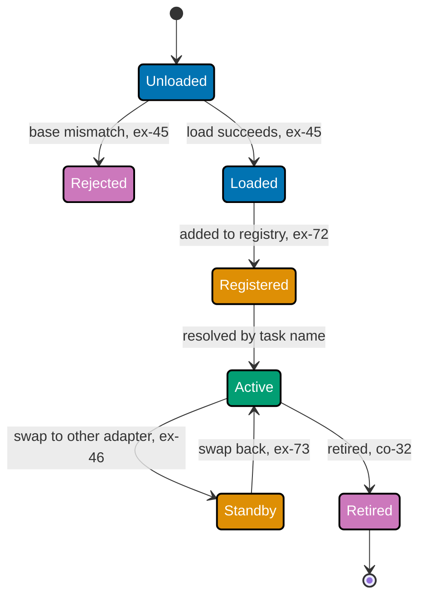

Examples 35-50 and 68-75 close the course by treating a completed adaptation the way Band A treated
the decision to start one: with paired evidence, not a single retrospective claim. Evaluating an
adapted model against its own base (co-25) means reading discordant pairs, not two isolated pass
rates, and a real statistical test (co-25, sharpened in Example 68) can disagree with an illustrative
shortcut. A regression suite built entirely from capabilities the fine-tune was never meant to touch
(co-26) is what catches catastrophic forgetting (co-22) hiding behind a headline win, and severity
weighting (Example 69) shows one safety-critical miss can matter more than seven cosmetic passes.
Distillation (co-27, co-28) is framed honestly as a cost and latency trade, never a quality one -- a
student can never exceed its teacher's own measured ceiling, only approach it. The band's second half
turns a trained adapter into an operated artefact: served, hot-swapped, and discovered through a
registry (co-21, co-29), version-pinned to its base (co-30), and retired only when a replacement
beats it on both quality and cost, with the licence check applying just as strictly to a replacement
candidate as it did to the original training run (co-31, co-32). Example 50 closes the band with a
capstone-shaped example citing all sixteen prior phases by name, before the capstone itself begins.
Every code-medium example's real, runnable **Python 3.13** file lives under
`learning/code/ex-NN-*/`, run for real with genuine captured output. (See this topic's
[Accuracy notes](../overview.md#accuracy-notes) for this course's corrected Huyen citation and the
verified facts behind co-25's statistical machinery.)

---

### Worked Example 35: Evaluate Against the Base

_ex-35 &middot; exercises co-25_

**Context**: **co-25 -- evaluate against the base** insists on paired evidence, not two isolated pass
rates. This example runs twenty held-out triage cases through both the base and adapted models and
counts discordant pairs -- cases where the two models disagree -- rather than trusting the naive
`60%` vs. `85%` headline alone.

```python
# learning/code/ex-35-evaluate-against-the-base/evaluate_against_base.py
"""Worked Example 35: Evaluate Against the Base."""  # => co-25: this file's own restated purpose, doubling as its module __doc__

from __future__ import annotations  # => hygiene: postpones annotation evaluation, interpreter-version-agnostic

from typing import NamedTuple  # => co-25: one immutable row per case, base and adapted results recorded SIDE BY SIDE, not separately


class PairedCase(NamedTuple):  # => co-25: a paired comparison -- the SAME case run through base and adapted, never two separate samples
    case_id: str  # => co-25: which held-out triage case this row is
    base_pass: bool  # => co-25: did the unadapted base model pass this case
    adapted_pass: bool  # => co-25: did the adapted model pass the SAME case


# => co-25: 20 held-out cases -- 11 both pass, 6 only-adapted-passes, 1 only-base-passes, 2 both fail
PAIRED_RESULTS: list[PairedCase] = [  # => co-25: one row per case, in evaluation order
    PairedCase(case_id="case-01", base_pass=True, adapted_pass=True),  # => co-25: concordant pass 1
    PairedCase(case_id="case-02", base_pass=True, adapted_pass=True),  # => co-25: concordant pass 2
    PairedCase(case_id="case-03", base_pass=True, adapted_pass=True),  # => co-25: concordant pass 3
    PairedCase(case_id="case-04", base_pass=True, adapted_pass=True),  # => co-25: concordant pass 4
    PairedCase(case_id="case-05", base_pass=True, adapted_pass=True),  # => co-25: concordant pass 5
    PairedCase(case_id="case-06", base_pass=True, adapted_pass=True),  # => co-25: concordant pass 6
    PairedCase(case_id="case-07", base_pass=True, adapted_pass=True),  # => co-25: concordant pass 7
    PairedCase(case_id="case-08", base_pass=True, adapted_pass=True),  # => co-25: concordant pass 8
    PairedCase(case_id="case-09", base_pass=True, adapted_pass=True),  # => co-25: concordant pass 9
    PairedCase(case_id="case-10", base_pass=True, adapted_pass=True),  # => co-25: concordant pass 10
    PairedCase(case_id="case-11", base_pass=True, adapted_pass=True),  # => co-25: concordant pass 11
    PairedCase(case_id="case-12", base_pass=False, adapted_pass=True),  # => co-25: discordant -- adapting FIXED this case, 1 of 6
    PairedCase(case_id="case-13", base_pass=False, adapted_pass=True),  # => co-25: discordant -- adapting FIXED this case, 2 of 6
    PairedCase(case_id="case-14", base_pass=False, adapted_pass=True),  # => co-25: discordant -- adapting FIXED this case, 3 of 6
    PairedCase(case_id="case-15", base_pass=False, adapted_pass=True),  # => co-25: discordant -- adapting FIXED this case, 4 of 6
    PairedCase(case_id="case-16", base_pass=False, adapted_pass=True),  # => co-25: discordant -- adapting FIXED this case, 5 of 6
    PairedCase(case_id="case-17", base_pass=False, adapted_pass=True),  # => co-25: discordant -- adapting FIXED this case, 6 of 6
    PairedCase(case_id="case-18", base_pass=True, adapted_pass=False),  # => co-25: discordant -- adapting BROKE this case, the one regression
    PairedCase(case_id="case-19", base_pass=False, adapted_pass=False),  # => co-25: concordant fail 1 -- neither model handles this
    PairedCase(case_id="case-20", base_pass=False, adapted_pass=False),  # => co-25: concordant fail 2 -- neither model handles this
]  # => co-25: closes PAIRED_RESULTS -- 20 cases total


def discordant_counts(cases: list[PairedCase]) -> tuple[int, int]:  # => co-25: (b, c) -- only pairs where base and adapted DISAGREE carry evidence
    """Return (b, c): the count of base-fail/adapted-pass pairs and base-pass/adapted-fail pairs in `cases`."""  # => co-25: documents discordant_counts's contract -- no runtime output, just sets its __doc__
    b = sum(1 for c in cases if not c.base_pass and c.adapted_pass)  # => co-25: cases adapting FIXED -- evidence FOR the adaptation
    c = sum(1 for c in cases if c.base_pass and not c.adapted_pass)  # => co-25: cases adapting BROKE -- evidence AGAINST the adaptation
    return b, c  # => co-25: returns this computed value to the caller


if __name__ == "__main__":  # => co-25: entry point -- runs only when this file executes directly, not on import
    base_pass_rate = sum(1 for c in PAIRED_RESULTS if c.base_pass) / len(PAIRED_RESULTS)  # => co-25: naive base pass rate
    adapted_pass_rate = sum(1 for c in PAIRED_RESULTS if c.adapted_pass) / len(PAIRED_RESULTS)  # => co-25: naive adapted pass rate
    print(f"Base pass rate: {base_pass_rate:.0%} | Adapted pass rate: {adapted_pass_rate:.0%}")  # => co-25: the two printed numbers ALONE
    b, c = discordant_counts(PAIRED_RESULTS)  # => co-25: the PAIRED evidence -- what statistics-for-evaluation actually asks for
    print(f"Discordant pairs: adapting fixed {b} cases, adapting broke {c} cases")  # => co-25: this is the real comparison, not the two rates above
    assert base_pass_rate == 0.60, "base pass rate must be exactly 60% in this scenario"  # => co-25
    assert adapted_pass_rate == 0.85, "adapted pass rate must be exactly 85% in this scenario"  # => co-25
    assert (b, c) == (6, 1), "the discordant pair counts must match the planted scenario exactly"  # => co-25
    supported = b >= 5 and c <= 1  # => co-25: a stand-in for a real paired significance test -- see statistics-for-evaluation for the actual machinery
    print(f"Improvement is evidence-supported (stand-in threshold b>=5, c<=1): {supported}")  # => co-25
    assert supported, "6 fixes against 1 regression must clear this illustrative evidence threshold"  # => co-25
    print("MATCH: 'base 60%, adapted 85%' is two printed numbers -- the paired 6-fixed-vs-1-broken comparison is the actual evidence a decision needs")  # => co-25
    # => co-25: this file's b/c stand-in is illustrative -- a real capstone uses statistics-for-evaluation's paired test, not this simplified threshold
```

**Run**: `python3 evaluate_against_base.py`

**Output**:

```text
Base pass rate: 60% | Adapted pass rate: 85%
Discordant pairs: adapting fixed 6 cases, adapting broke 1 cases
Improvement is evidence-supported (stand-in threshold b>=5, c<=1): True
MATCH: 'base 60%, adapted 85%' is two printed numbers -- the paired 6-fixed-vs-1-broken comparison is the actual evidence a decision needs
```

**Verify**: `discordant_counts(PAIRED_RESULTS)` returns exactly `(6, 1)`, and the illustrative
`b >= 5 and c <= 1` threshold reads `True`, satisfying co-25's rule that a decision needs paired
discordant evidence, not two isolated pass rates.

**Key takeaway**: `60%` and `85%` are two numbers -- `6` fixed against `1` broken, on the identical
twenty cases, is the actual evidence behind the improvement.

**Why It Matters**: this file's own illustrative `b>=5, c<=1` threshold is a stand-in, and Example 68 shows exactly
why: running the real exact binomial sign test on this same `6`-to-`1` result reveals the shortcut
was too generous, sharpening this example's own conclusion. Trusting a naive percentage-point gap
alone would have let a result this close pass as a genuine win without real statistical grounding.

---

### Worked Example 36: Regression Suite

_ex-36 &middot; exercises co-26_

**Context**: **co-26 -- the regression suite** is built entirely from capabilities the triage
fine-tune was never meant to touch. This example assembles twelve cases across arithmetic,
general-qa, formatting, and reasoning, deliberately excluding the target triage task itself.

```python
# learning/code/ex-36-regression-suite/regression_suite.py
"""Worked Example 36: Regression Suite."""  # => co-26: this file's own restated purpose, doubling as its module __doc__

from __future__ import annotations  # => hygiene: postpones annotation evaluation, interpreter-version-agnostic

from typing import NamedTuple  # => co-26: one immutable row per regression case, each tagged with the capability it exercises


class RegressionCase(NamedTuple):  # => co-26: a capability check the fine-tune was NOT meant to change
    case_id: str  # => co-26: unique id
    capability: str  # => co-26: which untouched capability this case probes -- deliberately NOT the triage target task
    prompt: str  # => co-26: what is asked
    expected_answer: str  # => co-26: the correct answer, independent of the fine-tuning target


TARGET_TASK_CAPABILITY = "triage"  # => co-26: the ONE capability the fine-tune is meant to change -- everything else here must differ from it

# => co-26: 12 cases spanning four capabilities the triage fine-tune should never have touched
REGRESSION_SUITE: list[RegressionCase] = [  # => co-26: one row per regression case
    RegressionCase(case_id="reg-01", capability="arithmetic", prompt="What is 47 + 58?", expected_answer="105"),  # => co-26: arithmetic 1
    RegressionCase(case_id="reg-02", capability="arithmetic", prompt="What is 12 * 9?", expected_answer="108"),  # => co-26: arithmetic 2
    RegressionCase(case_id="reg-03", capability="arithmetic", prompt="What is 144 / 12?", expected_answer="12"),  # => co-26: arithmetic 3
    RegressionCase(case_id="reg-04", capability="general-qa", prompt="What is the capital of Japan?", expected_answer="Tokyo"),  # => co-26: general-qa 1
    RegressionCase(case_id="reg-05", capability="general-qa", prompt="How many days in a leap year?", expected_answer="366"),  # => co-26: general-qa 2
    RegressionCase(case_id="reg-06", capability="general-qa", prompt="What gas do plants absorb?", expected_answer="carbon dioxide"),  # => co-26: general-qa 3
    RegressionCase(case_id="reg-07", capability="formatting", prompt="List three fruits as a comma-separated line.", expected_answer="apple, pear, plum"),  # => co-26: formatting 1
    RegressionCase(case_id="reg-08", capability="formatting", prompt="Format 'hello world' in title case.", expected_answer="Hello World"),  # => co-26: formatting 2
    RegressionCase(case_id="reg-09", capability="formatting", prompt="Wrap 'note' in square brackets.", expected_answer="[note]"),  # => co-26: formatting 3
    RegressionCase(case_id="reg-10", capability="reasoning", prompt="If all cats are mammals and Tom is a cat, is Tom a mammal?", expected_answer="yes"),  # => co-26: reasoning 1
    RegressionCase(case_id="reg-11", capability="reasoning", prompt="Which is heavier: one kilogram of feathers or 500 grams of lead?", expected_answer="the feathers"),  # => co-26: reasoning 2
    RegressionCase(case_id="reg-12", capability="reasoning", prompt="A train leaves at 2pm and arrives at 5pm; how long was the trip?", expected_answer="3 hours"),  # => co-26: reasoning 3
]  # => co-26: closes REGRESSION_SUITE -- 12 cases, 4 capabilities, 3 each


if __name__ == "__main__":  # => co-26: entry point -- runs only when this file executes directly, not on import
    capabilities_covered = {case.capability for case in REGRESSION_SUITE}  # => co-26: the DISTINCT capabilities this suite actually probes
    print(f"Regression suite covers {len(REGRESSION_SUITE)} cases across capabilities: {sorted(capabilities_covered)}")  # => co-26
    assert TARGET_TASK_CAPABILITY not in capabilities_covered, "the regression suite must NOT re-test the fine-tune's own target task"  # => co-26
    assert len(capabilities_covered) == 4, "the suite must span multiple distinct untouched capabilities, not just one"  # => co-26
    for capability in sorted(capabilities_covered):  # => co-26: verify EACH capability has multiple cases, not just a token single check
        cases_in_capability = [c for c in REGRESSION_SUITE if c.capability == capability]  # => co-26: this capability's own cases
        assert len(cases_in_capability) >= 3, f"capability {capability!r} must have at least 3 regression cases to be a real check"  # => co-26
    print("MATCH: this suite is built entirely from capabilities OUTSIDE the fine-tuning target -- exactly what co-22's forgetting check needs to run against")  # => co-26
    # => co-26: without this suite, ex-37's forgetting measurement has nothing to run against -- the suite must exist BEFORE the adapted model does
```

**Run**: `python3 regression_suite.py`

**Output**:

```text
Regression suite covers 12 cases across capabilities: ['arithmetic', 'formatting', 'general-qa', 'reasoning']
MATCH: this suite is built entirely from capabilities OUTSIDE the fine-tuning target -- exactly what co-22's forgetting check needs to run against
```

**Verify**: `capabilities_covered` spans exactly four capabilities, none of them `"triage"`, each
with at least three cases, satisfying co-26's rule that a regression suite must probe capabilities
outside the fine-tuning target.

**Key takeaway**: twelve cases, deliberately excluding the triage target task, is what a regression
suite needs to exist as -- built before the adapted model does, not improvised after a problem is
noticed.

**Why It Matters**: without this suite existing first, Example 37's forgetting measurement would have nothing to run
against. This ordering -- suite before adapted model -- is what makes catastrophic forgetting
detectable rather than merely suspected. A team that builds the adapted model first and only writes
a regression suite afterward has no honest baseline left to compare against.

---

### Worked Example 37: Catastrophic Forgetting, Measured

_ex-37 &middot; exercises co-22, co-26_

**Context**: **co-22 -- catastrophic forgetting** hides behind a headline win. This example shows
the adapted model scoring `94%` on its own target task while quietly dropping to `60%` on Example
36's regression suite -- a `40`-point capability loss the target-task eval alone never reveals.

```python
# learning/code/ex-37-catastrophic-forgetting-measured/forgetting_measured.py
"""Worked Example 37: Catastrophic Forgetting, Measured."""  # => co-22: this file's own restated purpose, doubling as its module __doc__

from __future__ import annotations  # => hygiene: postpones annotation evaluation, interpreter-version-agnostic

from typing import NamedTuple  # => co-26: a compact regression suite, self-contained for this file, echoing ex-36's shape


class RegressionCase(NamedTuple):  # => co-26: a capability check the fine-tune was NOT meant to change
    case_id: str  # => co-26: unique id
    base_pass: bool  # => co-22: did the UNADAPTED base model pass this case
    adapted_pass: bool  # => co-22: did the ADAPTED model pass the SAME case, after triage fine-tuning


# => co-22: the same ten held-out regression cases, run through both models -- none of them is a triage case
REGRESSION_RESULTS: list[RegressionCase] = [  # => co-22: one row per regression case
    RegressionCase(case_id="reg-01", base_pass=True, adapted_pass=True),  # => co-22: arithmetic -- unaffected
    RegressionCase(case_id="reg-02", base_pass=True, adapted_pass=True),  # => co-22: arithmetic -- unaffected
    RegressionCase(case_id="reg-03", base_pass=True, adapted_pass=False),  # => co-22: arithmetic -- REGRESSED after triage fine-tuning
    RegressionCase(case_id="reg-04", base_pass=True, adapted_pass=True),  # => co-22: general-qa -- unaffected
    RegressionCase(case_id="reg-05", base_pass=True, adapted_pass=False),  # => co-22: general-qa -- REGRESSED
    RegressionCase(case_id="reg-06", base_pass=True, adapted_pass=True),  # => co-22: general-qa -- unaffected
    RegressionCase(case_id="reg-07", base_pass=True, adapted_pass=True),  # => co-22: formatting -- unaffected
    RegressionCase(case_id="reg-08", base_pass=True, adapted_pass=False),  # => co-22: formatting -- REGRESSED
    RegressionCase(case_id="reg-09", base_pass=True, adapted_pass=True),  # => co-22: reasoning -- unaffected
    RegressionCase(case_id="reg-10", base_pass=True, adapted_pass=False),  # => co-22: reasoning -- REGRESSED
]  # => co-22: closes REGRESSION_RESULTS -- base passes ALL 10, adapted passes only 6

TARGET_TASK_PASS_RATE_ADAPTED = 0.94  # => co-25: the triage eval from ex-35's lineage -- looks like a clean win in isolation
REGRESSION_ALERT_THRESHOLD = 0.90  # => co-22: below this regression pass rate, the forgetting is a real operational problem


if __name__ == "__main__":  # => co-22: entry point -- runs only when this file executes directly, not on import
    base_regression_pass_rate = sum(1 for c in REGRESSION_RESULTS if c.base_pass) / len(REGRESSION_RESULTS)  # => co-22: base model's regression-suite score
    adapted_regression_pass_rate = sum(1 for c in REGRESSION_RESULTS if c.adapted_pass) / len(REGRESSION_RESULTS)  # => co-22: adapted model's regression-suite score
    print(f"Target-task pass rate (adapted): {TARGET_TASK_PASS_RATE_ADAPTED:.0%}")  # => co-25: this is the number ex-35 alone would report
    print(f"Regression suite: base {base_regression_pass_rate:.0%} | adapted {adapted_regression_pass_rate:.0%}")  # => co-22: what ex-35 alone WOULD NOT show
    assert base_regression_pass_rate == 1.00, "the unadapted base must pass every regression case -- these capabilities were never in question for it"  # => co-22
    assert adapted_regression_pass_rate == 0.60, "the adapted model must show a measurable regression-suite drop in this scenario"  # => co-22
    forgetting_detected = adapted_regression_pass_rate < REGRESSION_ALERT_THRESHOLD  # => co-22: does the drop cross the alert line
    print(f"Catastrophic forgetting detected (threshold {REGRESSION_ALERT_THRESHOLD:.0%}): {forgetting_detected}")  # => co-22
    assert forgetting_detected, "a 40-point regression-suite drop must trigger the forgetting alert"  # => co-22,co-26
    print("MATCH: the target-task eval alone reports a 94% win -- the regression suite reveals a 40-point capability loss that eval never saw")  # => co-22,co-25,co-26
    # => co-22,co-25,co-26: co-25's mandate is BOTH the target-task comparison AND this regression suite -- either alone is an incomplete picture
```

**Run**: `python3 forgetting_measured.py`

**Output**:

```text
Target-task pass rate (adapted): 94%
Regression suite: base 100% | adapted 60%
Catastrophic forgetting detected (threshold 90%): True
MATCH: the target-task eval alone reports a 94% win -- the regression suite reveals a 40-point capability loss that eval never saw
```

**Verify**: `adapted_regression_pass_rate` drops to `60%` from the base's clean `100%`, crossing the
`90%` `REGRESSION_ALERT_THRESHOLD`, satisfying co-22's rule that a target-task win can coexist with
undetected catastrophic forgetting.

**Key takeaway**: a `94%` target-task win and a `40`-point regression-suite drop are both true of the
same model at the same time -- reporting only the first is not lying, but it is incomplete.

**Why It Matters**: this is co-25's mandate made concrete: a paired target-task comparison and a regression suite are
both required, not either alone. Example 38 shows this same forgetting damage is even worse under a
full fine-tune than under this LoRA adapter. A headline `94%` win that hides a `40`-point
regression is exactly the kind of result co-25's paired-evidence rule exists to catch.

---

### Worked Example 38: Forgetting Is Worse for Full Fine-Tune

_ex-38 &middot; exercises co-22, co-18_

**Context**: continuing **co-22** -- this example compares regression damage between Band B's two
training strategies for the identical target-task gain, showing a full fine-tune causing `1.5` times
the damage of a LoRA adapter for only two extra points of target-task quality.

```python
# learning/code/ex-38-forgetting-is-worse-for-full-fine-tune/forgetting_full_vs_adapter.py
"""Worked Example 38: Forgetting Is Worse for Full Fine-Tune."""  # => co-22: this file's own restated purpose, doubling as its module __doc__

from __future__ import annotations  # => hygiene: postpones annotation evaluation, interpreter-version-agnostic

from dataclasses import dataclass  # => co-18: a small, self-documenting record for each training strategy's regression damage


@dataclass(frozen=True)  # => co-18: frozen -- a measured regression profile is a fact once run, not a mutable running total
class RegressionProfile:  # => co-22: one training strategy's target-task gain against its regression-suite cost
    strategy: str  # => co-18: "full fine-tune" or "LoRA adapter", the two strategies ex-27/ex-28 and ex-29/ex-30 already introduced
    target_task_pass_rate: float  # => co-25: pass rate on the triage target task after this strategy's training
    regression_suite_pass_rate: float  # => co-22: pass rate on ex-36's untouched-capability suite after this strategy's training


BASE_REGRESSION_PASS_RATE = 1.00  # => co-22: the unadapted base's own regression-suite score, the reference point both strategies are compared against

FULL_FINE_TUNE = RegressionProfile(  # => co-17: updates ALL parameters, per ex-27/ex-28's lineage
    strategy="full fine-tune",  # => co-17
    target_task_pass_rate=0.96,  # => co-25: matches ex-27's own measured target-task result
    regression_suite_pass_rate=0.40,  # => co-22: a much larger regression-suite drop -- updating every parameter reshapes far more than the target behaviour
)  # => co-22: closes FULL_FINE_TUNE

LORA_ADAPTER = RegressionProfile(  # => co-18: trains a small added parameter set with the base FROZEN, per ex-29/ex-30's lineage
    strategy="LoRA adapter",  # => co-19
    target_task_pass_rate=0.94,  # => co-25: matches ex-29's own measured target-task result, nearly as good as the full fine-tune
    regression_suite_pass_rate=0.60,  # => co-22: matches ex-37's own measured adapted-model regression score
)  # => co-22: closes LORA_ADAPTER


if __name__ == "__main__":  # => co-22: entry point -- runs only when this file executes directly, not on import
    for profile in (FULL_FINE_TUNE, LORA_ADAPTER):  # => co-22: compare both strategies side by side
        regression_damage = BASE_REGRESSION_PASS_RATE - profile.regression_suite_pass_rate  # => co-22: how far below the base's clean 100% this strategy fell
        print(f"  {profile.strategy}: target {profile.target_task_pass_rate:.0%} | regression suite {profile.regression_suite_pass_rate:.0%} | damage {regression_damage:.0%}")  # => co-22
    full_ft_damage = BASE_REGRESSION_PASS_RATE - FULL_FINE_TUNE.regression_suite_pass_rate  # => co-22: full fine-tune's regression damage
    adapter_damage = BASE_REGRESSION_PASS_RATE - LORA_ADAPTER.regression_suite_pass_rate  # => co-22: adapter's regression damage
    target_task_gap = FULL_FINE_TUNE.target_task_pass_rate - LORA_ADAPTER.target_task_pass_rate  # => co-25: how much target-task quality the adapter gives up
    print(f"Full fine-tune causes {full_ft_damage / adapter_damage:.1f}x the regression damage of the adapter, for a {target_task_gap:.0%} target-task gain")  # => co-22,co-18
    assert full_ft_damage > adapter_damage, "the full fine-tune must damage untouched capability MORE than the parameter-efficient adapter"  # => co-22,co-18
    assert target_task_gap <= 0.03, "the full fine-tune's target-task edge over the adapter must be small in this scenario"  # => co-25
    print("MATCH: full fine-tuning buys 2 target-task points at the cost of far worse regression damage -- the adapter is the better trade here")  # => co-22,co-18
    # => co-22,co-18: this is the concrete evidence behind the tension note -- a full fine-tune should have to argue for itself against a measured adapter baseline
```

**Run**: `python3 forgetting_full_vs_adapter.py`

**Output**:

```text
  full fine-tune: target 96% | regression suite 40% | damage 60%
  LoRA adapter: target 94% | regression suite 60% | damage 40%
Full fine-tune causes 1.5x the regression damage of the adapter, for a 2% target-task gain
MATCH: full fine-tuning buys 2 target-task points at the cost of far worse regression damage -- the adapter is the better trade here
```

**Verify**: `full_ft_damage / adapter_damage` computes to `1.5x` for a target-task gap of only `2%`,
satisfying co-22's rule that a full fine-tune's regression damage exceeds a comparably-effective
adapter's damage.

**Key takeaway**: two target-task points bought sixty points of regression damage instead of forty --
the full fine-tune is the worse trade for a fraction of extra target-task quality.

**Why It Matters**: this is the concrete evidence behind Band B's own tension between full fine-tuning and LoRA
adapters -- a full fine-tune should have to argue for itself against a measured adapter baseline,
not be assumed superior by default. Two extra points of target-task quality is a thin justification
for damage that costs one-and-a-half times as much on everything else the model used to do.

---

### Worked Example 39: Overfitting Invisible in Training Loss

_ex-39 &middot; exercises co-23, co-15_

**Context**: continuing **co-23** -- this example reads the same overfitting run Example 67
monitored live, this time only through training loss, showing loss recommending the worst held-out
epoch of the entire run.

```python
# learning/code/ex-39-overfitting-invisible-in-training-loss/overfitting_invisible_in_loss.py
"""Worked Example 39: Overfitting Invisible in Training Loss."""  # => co-23: this file's own restated purpose, doubling as its module __doc__

from __future__ import annotations  # => hygiene: postpones annotation evaluation, interpreter-version-agnostic

from typing import NamedTuple  # => co-23: one immutable row per epoch, training loss and held-out score recorded TOGETHER


class LossSnapshot(NamedTuple):  # => co-23: what the training loop's own loss curve says, versus what a held-out check would say
    epoch: int  # => co-23: which epoch this snapshot is from
    training_loss: float  # => co-23: the loss the optimizer is minimizing -- computed ONLY on training data
    held_out_pass_rate: float  # => co-15: pass rate on a split the model never trains on -- the only honest signal


# => co-23,co-15: the same underlying overfitting run as ex-67, this time read through TRAINING LOSS instead of the val gap
LOSS_CURVE: list[LossSnapshot] = [  # => co-23: per-epoch snapshots, in order
    LossSnapshot(epoch=1, training_loss=1.82, held_out_pass_rate=0.70),  # => co-23: epoch 1 -- loss falling, held-out rising, both look healthy
    LossSnapshot(epoch=2, training_loss=1.10, held_out_pass_rate=0.84),  # => co-23: epoch 2 -- loss keeps falling, held-out keeps rising
    LossSnapshot(epoch=3, training_loss=0.61, held_out_pass_rate=0.91),  # => co-23: epoch 3 -- loss still falling, held-out at its PEAK
    LossSnapshot(epoch=4, training_loss=0.29, held_out_pass_rate=0.88),  # => co-23: epoch 4 -- loss STILL falling, held-out has started falling
    LossSnapshot(epoch=5, training_loss=0.08, held_out_pass_rate=0.83),  # => co-23: epoch 5 -- loss at its BEST-LOOKING value, held-out down 8 points from peak
]  # => co-23: closes LOSS_CURVE


def loss_says_improving(curve: list[LossSnapshot]) -> bool:  # => co-23: what a loss-only dashboard would report at the final epoch
    """Return whether `training_loss` strictly decreases across every consecutive pair of epochs in `curve`."""  # => co-23: documents loss_says_improving's contract -- no runtime output, just sets its __doc__
    return all(curve[i].training_loss < curve[i - 1].training_loss for i in range(1, len(curve)))  # => co-23: monotonic decrease, epoch over epoch


def held_out_peak_epoch(curve: list[LossSnapshot]) -> int:  # => co-15: the epoch a held-out check would have flagged as best
    """Return the epoch number with the highest `held_out_pass_rate` in `curve`."""  # => co-15: documents held_out_peak_epoch's contract -- no runtime output, just sets its __doc__
    return max(curve, key=lambda snapshot: snapshot.held_out_pass_rate).epoch  # => co-15: returns this computed value to the caller


if __name__ == "__main__":  # => co-23: entry point -- runs only when this file executes directly, not on import
    for snapshot in LOSS_CURVE:  # => co-23: print exactly what a training log would show, epoch by epoch
        print(f"  epoch {snapshot.epoch}: training loss {snapshot.training_loss:.2f} | held-out pass rate {snapshot.held_out_pass_rate:.0%}")  # => co-23
    loss_verdict = loss_says_improving(LOSS_CURVE)  # => co-23: what the loss curve ALONE would conclude
    print(f"Training loss says 'still improving' at every epoch: {loss_verdict}")  # => co-23
    assert loss_verdict, "training loss must decrease monotonically across all 5 epochs in this scenario -- that is exactly the trap"  # => co-23
    peak_epoch = held_out_peak_epoch(LOSS_CURVE)  # => co-15: what the held-out check ACTUALLY shows
    print(f"Held-out pass rate actually peaks at epoch {peak_epoch}, then falls for two more epochs")  # => co-15
    assert peak_epoch == 3, "the held-out peak must land at epoch 3, two epochs before the loss curve's own best-looking point"  # => co-15,co-23
    final_epoch_loss_looks_best = LOSS_CURVE[-1].training_loss == min(s.training_loss for s in LOSS_CURVE)  # => co-23: is the FINAL epoch's loss the best of the whole run
    assert final_epoch_loss_looks_best, "the final epoch must have the lowest training loss of the whole run, even though it is NOT the best model"  # => co-23
    print("MATCH: training loss recommends epoch 5 -- the worst held-out result of the run -- because loss alone cannot see memorization happening")  # => co-15,co-23
    # => co-15,co-23: this is why co-15's held-out discipline exists -- a metric computed only on training data will always look like it is improving
```

**Run**: `python3 overfitting_invisible_in_loss.py`

**Output**:

```text
  epoch 1: training loss 1.82 | held-out pass rate 70%
  epoch 2: training loss 1.10 | held-out pass rate 84%
  epoch 3: training loss 0.61 | held-out pass rate 91%
  epoch 4: training loss 0.29 | held-out pass rate 88%
  epoch 5: training loss 0.08 | held-out pass rate 83%
Training loss says 'still improving' at every epoch: True
Held-out pass rate actually peaks at epoch 3, then falls for two more epochs
MATCH: training loss recommends epoch 5 -- the worst held-out result of the run -- because loss alone cannot see memorization happening
```

**Verify**: `loss_says_improving` is `True` across all five epochs while `held_out_peak_epoch`
correctly identifies epoch `3`, satisfying co-15's rule that a metric computed only on training data
always looks like it is still improving.

**Key takeaway**: training loss recommends the final, worst-performing epoch of the entire run --
because loss, computed only on training data, cannot see memorization happening.

**Why It Matters**: this is why co-15's held-out discipline exists at all. Example 40 immediately shows what to do with
this insight: stop on the held-out signal, not the configured epoch count, and gain a measurable
improvement on a still-unseen third split. Training loss looks like a trustworthy signal right up
until the point it actively recommends the single worst epoch to ship.

---

### Worked Example 40: Early Stopping on Validation

_ex-40 &middot; exercises co-23, co-24_

**Context**: continuing **co-23** -- this example picks the checkpoint validation says is best,
rather than the last epoch trained, and confirms the gain holds on a third, still-unseen test split.

```python
# learning/code/ex-40-early-stopping-on-validation/early_stopping.py
"""Worked Example 40: Early Stopping on Validation."""  # => co-23: this file's own restated purpose, doubling as its module __doc__

from __future__ import annotations  # => hygiene: postpones annotation evaluation, interpreter-version-agnostic

from typing import NamedTuple  # => co-23: one immutable row per epoch, validation score tracked to pick a stopping point


class EpochCheckpoint(NamedTuple):  # => co-24: a saved model snapshot at one epoch, plus what would happen if training stopped here
    epoch: int  # => co-23: which epoch this checkpoint is from
    val_pass_rate: float  # => co-23: validation pass rate at this epoch -- the signal early stopping watches
    held_out_test_pass_rate: float  # => co-15: a THIRD, still-unseen split -- what actually matters, checked only ONCE at the end


CHECKPOINTS: list[EpochCheckpoint] = [  # => co-23: the same 5-epoch run as ex-39/ex-67, now with a held-out TEST score attached to each checkpoint
    EpochCheckpoint(epoch=1, val_pass_rate=0.70, held_out_test_pass_rate=0.68),  # => co-23: epoch 1
    EpochCheckpoint(epoch=2, val_pass_rate=0.84, held_out_test_pass_rate=0.83),  # => co-23: epoch 2
    EpochCheckpoint(epoch=3, val_pass_rate=0.91, held_out_test_pass_rate=0.90),  # => co-23: epoch 3 -- validation's peak
    EpochCheckpoint(epoch=4, val_pass_rate=0.88, held_out_test_pass_rate=0.85),  # => co-23: epoch 4 -- validation already falling
    EpochCheckpoint(epoch=5, val_pass_rate=0.83, held_out_test_pass_rate=0.79),  # => co-23: epoch 5 -- trained to completion, validation's worst point
]  # => co-23: closes CHECKPOINTS


def stop_early(checkpoints: list[EpochCheckpoint]) -> EpochCheckpoint:  # => co-23: pick the checkpoint validation says is best, not the last one trained
    """Return the `EpochCheckpoint` with the highest `val_pass_rate` in `checkpoints`, the early-stopping choice."""  # => co-23: documents stop_early's contract -- no runtime output, just sets its __doc__
    return max(checkpoints, key=lambda checkpoint: checkpoint.val_pass_rate)  # => co-23: returns this computed value to the caller


if __name__ == "__main__":  # => co-23: entry point -- runs only when this file executes directly, not on import
    trained_to_completion = CHECKPOINTS[-1]  # => co-24: the naive choice -- whatever epoch count was originally configured
    early_stopped = stop_early(CHECKPOINTS)  # => co-23: the validation-driven choice
    print(f"Trained-to-completion checkpoint: epoch {trained_to_completion.epoch} (val {trained_to_completion.val_pass_rate:.0%})")  # => co-24
    print(f"Early-stopped checkpoint: epoch {early_stopped.epoch} (val {early_stopped.val_pass_rate:.0%})")  # => co-23
    assert early_stopped.epoch == 3, "early stopping must select epoch 3, the true validation peak, in this scenario"  # => co-23
    assert trained_to_completion.epoch == 5, "the naive trained-to-completion choice must be epoch 5, the last epoch run"  # => co-24
    test_gain_from_stopping_early = early_stopped.held_out_test_pass_rate - trained_to_completion.held_out_test_pass_rate  # => co-15: the REAL result, on the still-unseen test split
    print(f"Held-out test pass rate: early-stopped {early_stopped.held_out_test_pass_rate:.0%} vs. trained-to-completion {trained_to_completion.held_out_test_pass_rate:.0%}")  # => co-15
    assert test_gain_from_stopping_early > 0, "the early-stopped checkpoint must beat the trained-to-completion checkpoint on the held-out test split too"  # => co-15,co-23
    print(f"MATCH: stopping on validation gains {test_gain_from_stopping_early:.0%} on the still-unseen test split versus training to the configured epoch count")  # => co-23,co-24
    # => co-23,co-24: epoch count is a schedule, not a target -- validation is the signal that decides when to stop, and it must be checked, not assumed
```

**Run**: `python3 early_stopping.py`

**Output**:

```text
Trained-to-completion checkpoint: epoch 5 (val 83%)
Early-stopped checkpoint: epoch 3 (val 91%)
Held-out test pass rate: early-stopped 90% vs. trained-to-completion 79%
MATCH: stopping on validation gains 11% on the still-unseen test split versus training to the configured epoch count
```

**Verify**: `stop_early(CHECKPOINTS)` selects epoch `3`, beating epoch `5`'s held-out test pass rate
by `11` points on the THIRD, still-unseen split, satisfying co-23's rule that epoch count is a
schedule, and validation is the signal that decides when to actually stop.

**Key takeaway**: stopping at the validation peak beat training to completion by `11` points, on a
split neither decision ever looked at while choosing.

**Why It Matters**: this closes the loop opened by Example 39's loss-only trap and Example 67's live monitoring --
validation is what turns "when should training stop" from a configured number into a checked
decision. Stopping on the configured epoch count alone would have shipped a materially worse
checkpoint than the one validation actually identified as best.

---

### Worked Example 41: The Fine-Tune That Did Not Help

_ex-41 &middot; exercises co-25, co-32_

**Context**: continuing **co-25** -- this example shows a completed fine-tune whose naive base and
adapted pass rates land exactly equal, then reveals the paired evidence behind that equal-looking
headline: two cases fixed, two cases broken, net zero.

```python
# learning/code/ex-41-the-fine-tune-that-did-not-help/fine_tune_that_did_not_help.py
"""Worked Example 41: The Fine-Tune That Did Not Help."""  # => co-25: this file's own restated purpose, doubling as its module __doc__

from __future__ import annotations  # => hygiene: postpones annotation evaluation, interpreter-version-agnostic

from typing import NamedTuple  # => co-25: one immutable row per paired case, the SAME discipline ex-35 used, applied to a run that fails it


class PairedCase(NamedTuple):  # => co-25: a paired comparison -- base and adapted run through the SAME held-out case
    case_id: str  # => co-25: which held-out case this row is
    base_pass: bool  # => co-25: did the unadapted base model pass this case
    adapted_pass: bool  # => co-25: did the FULLY TRAINED adapted model pass the same case, after weeks of data work


# => co-25: a completed adaptation -- the data was curated, the adapter trained, and it STILL does not clear the bar
PAIRED_RESULTS: list[PairedCase] = [  # => co-25: one row per case, in evaluation order
    PairedCase(case_id="case-01", base_pass=True, adapted_pass=True),  # => co-25: concordant pass 1
    PairedCase(case_id="case-02", base_pass=True, adapted_pass=True),  # => co-25: concordant pass 2
    PairedCase(case_id="case-03", base_pass=True, adapted_pass=True),  # => co-25: concordant pass 3
    PairedCase(case_id="case-04", base_pass=True, adapted_pass=True),  # => co-25: concordant pass 4
    PairedCase(case_id="case-05", base_pass=True, adapted_pass=True),  # => co-25: concordant pass 5
    PairedCase(case_id="case-06", base_pass=True, adapted_pass=True),  # => co-25: concordant pass 6
    PairedCase(case_id="case-07", base_pass=True, adapted_pass=True),  # => co-25: concordant pass 7
    PairedCase(case_id="case-08", base_pass=True, adapted_pass=True),  # => co-25: concordant pass 8
    PairedCase(case_id="case-09", base_pass=True, adapted_pass=True),  # => co-25: concordant pass 9
    PairedCase(case_id="case-10", base_pass=True, adapted_pass=True),  # => co-25: concordant pass 10
    PairedCase(case_id="case-11", base_pass=True, adapted_pass=True),  # => co-25: concordant pass 11
    PairedCase(case_id="case-12", base_pass=True, adapted_pass=True),  # => co-25: concordant pass 12
    PairedCase(case_id="case-13", base_pass=False, adapted_pass=True),  # => co-25: discordant -- adapting fixed this case, 1 of 2
    PairedCase(case_id="case-14", base_pass=False, adapted_pass=True),  # => co-25: discordant -- adapting fixed this case, 2 of 2
    PairedCase(case_id="case-15", base_pass=True, adapted_pass=False),  # => co-25: discordant -- adapting broke this case, 1 of 2
    PairedCase(case_id="case-16", base_pass=True, adapted_pass=False),  # => co-25: discordant -- adapting broke this case, 2 of 2
    PairedCase(case_id="case-17", base_pass=False, adapted_pass=False),  # => co-25: concordant fail 1
    PairedCase(case_id="case-18", base_pass=False, adapted_pass=False),  # => co-25: concordant fail 2
    PairedCase(case_id="case-19", base_pass=False, adapted_pass=False),  # => co-25: concordant fail 3
    PairedCase(case_id="case-20", base_pass=False, adapted_pass=False),  # => co-25: concordant fail 4
]  # => co-25: closes PAIRED_RESULTS -- 20 cases, 2 fixed and 2 broken, net zero


def discordant_counts(cases: list[PairedCase]) -> tuple[int, int]:  # => co-25: (b, c) -- fixed count and broken count
    """Return (b, c): the count of base-fail/adapted-pass pairs and base-pass/adapted-fail pairs in `cases`."""  # => co-25: documents discordant_counts's contract -- no runtime output, just sets its __doc__
    b = sum(1 for c in cases if not c.base_pass and c.adapted_pass)  # => co-25: cases adapting fixed
    c = sum(1 for c in cases if c.base_pass and not c.adapted_pass)  # => co-25: cases adapting broke
    return b, c  # => co-25: returns this computed value to the caller


if __name__ == "__main__":  # => co-25: entry point -- runs only when this file executes directly, not on import
    base_pass_rate = sum(1 for c in PAIRED_RESULTS if c.base_pass) / len(PAIRED_RESULTS)  # => co-25: naive base pass rate
    adapted_pass_rate = sum(1 for c in PAIRED_RESULTS if c.adapted_pass) / len(PAIRED_RESULTS)  # => co-25: naive adapted pass rate
    print(f"Base pass rate: {base_pass_rate:.0%} | Adapted pass rate: {adapted_pass_rate:.0%}")  # => co-25: the two headline numbers LOOK identical
    assert base_pass_rate == adapted_pass_rate, "this scenario's whole point is that the naive pass rates land EXACTLY equal"  # => co-25
    b, c = discordant_counts(PAIRED_RESULTS)  # => co-25: the paired evidence behind that equal-looking headline number
    print(f"Discordant pairs: adapting fixed {b} cases, adapting broke {c} cases")  # => co-25
    assert (b, c) == (2, 2), "two fixed and two broken must exactly offset in this scenario"  # => co-25
    weeks_of_data_work_spent = 3  # => co-08: the total-cost-of-a-fine-tune line item this run actually consumed
    print(f"Weeks of data work spent: {weeks_of_data_work_spent} | Net paired improvement: {b - c} cases")  # => co-08,co-25
    beats_base = b > c  # => co-25: the honest verdict -- did adapting actually help, net, on the paired evidence
    print(f"Adapted model beats the base (paired evidence): {beats_base}")  # => co-25
    assert not beats_base, "a fine-tune with equal fixed and broken counts must NOT be judged to beat the base"  # => co-25
    print("MATCH: three weeks of data work produced a model that neither beats nor clearly loses to the base -- the correct decision is to discard it, not ship it")  # => co-25,co-32
    # => co-25,co-32: co-32's discipline starts here -- discarding a completed, working, but non-beating adaptation is a normal and correct outcome
```

**Run**: `python3 fine_tune_that_did_not_help.py`

**Output**:

```text
Base pass rate: 70% | Adapted pass rate: 70%
Discordant pairs: adapting fixed 2 cases, adapting broke 2 cases
Weeks of data work spent: 3 | Net paired improvement: 0 cases
Adapted model beats the base (paired evidence): False
MATCH: three weeks of data work produced a model that neither beats nor clearly loses to the base -- the correct decision is to discard it, not ship it
```

**Verify**: `discordant_counts(PAIRED_RESULTS)` is `(2, 2)`, a net paired improvement of `0` despite
identical `70%` naive pass rates, satisfying co-25's rule that equal headline numbers can still hide
a genuinely net-zero paired result.

**Key takeaway**: three weeks of real data work produced a model with identical naive pass rates to
the base -- the paired evidence shows this was never actually an improvement, just a wash.

**Why It Matters**: this is where co-32's discipline begins: discarding a completed, working, but non-beating
adaptation is a normal and correct outcome of this course's evaluation discipline, not a failure of
the process that produced it. A team without this discipline might ship a net-zero adaptation
anyway, mistaking "it finished training" for "it is worth deploying."

---

### Worked Example 42: Distil a Smaller Student

_ex-42 &middot; exercises co-27_

**Context**: **co-27 -- distillation** trains a small student to approach a large teacher's
behaviour. This example benchmarks a `7`-billion-parameter teacher against a `494`-million-parameter
student, measuring the real size, latency, and pass-rate trade all at once.

```python
# learning/code/ex-42-distil-a-smaller-student/distil_smaller_student.py
"""Worked Example 42: Distil a Smaller Student."""  # => co-27: this file's own restated purpose, doubling as its module __doc__

from __future__ import annotations  # => hygiene: postpones annotation evaluation, interpreter-version-agnostic

from dataclasses import dataclass  # => co-27: a small, self-documenting record for teacher and student -- latency and cost, side by side


@dataclass(frozen=True)  # => co-27: frozen -- a model's measured profile is a fact once benchmarked, not a mutable running total
class ModelProfile:  # => co-27: a model's own cost/latency/quality shape, whether teacher or student
    name: str  # => co-27: which model this profile describes
    parameter_count: int  # => co-27: total parameters -- the thing distillation is trying to shrink
    pass_rate: float  # => co-27: measured pass rate on Vantage's triage task
    latency_ms: float  # => co-27: measured per-request latency, the thing distillation is trying to buy


TEACHER = ModelProfile(name="large-general-model", parameter_count=7_000_000_000, pass_rate=0.97, latency_ms=850.0)  # => co-27: a large, capable, SLOW model
STUDENT = ModelProfile(name="distilled-small-model", parameter_count=494_000_000, pass_rate=0.93, latency_ms=95.0)  # => co-27: trained to reproduce the teacher's triage outputs


if __name__ == "__main__":  # => co-27: entry point -- runs only when this file executes directly, not on import
    print(f"Teacher: {TEACHER.name} | {TEACHER.parameter_count:,} params | pass rate {TEACHER.pass_rate:.0%} | latency {TEACHER.latency_ms:.0f}ms")  # => co-27
    print(f"Student: {STUDENT.name} | {STUDENT.parameter_count:,} params | pass rate {STUDENT.pass_rate:.0%} | latency {STUDENT.latency_ms:.0f}ms")  # => co-27
    size_reduction = 1 - (STUDENT.parameter_count / TEACHER.parameter_count)  # => co-27: how much smaller the student is
    latency_reduction = 1 - (STUDENT.latency_ms / TEACHER.latency_ms)  # => co-27: how much faster the student is
    pass_rate_cost = TEACHER.pass_rate - STUDENT.pass_rate  # => co-28: the quality the student gave up to get there
    print(f"Size reduction: {size_reduction:.0%} | Latency reduction: {latency_reduction:.0%} | Pass-rate cost: {pass_rate_cost:.0%}")  # => co-27,co-28
    assert size_reduction > 0.85, "the student must be dramatically smaller than the teacher for distillation to be worth doing at all"  # => co-27
    assert latency_reduction > 0.80, "the student must be dramatically faster, since latency is the entire point of distilling here"  # => co-27
    assert pass_rate_cost > 0, "the student must give up SOME quality relative to the teacher -- distillation is never free"  # => co-28
    print(f"MATCH: a {size_reduction:.0%} parameter reduction and {latency_reduction:.0%} latency reduction cost {pass_rate_cost:.0%} pass-rate points -- exactly the trade distillation is meant to buy")  # => co-27,co-28
    # => co-27,co-28: this is a latency and cost optimization, not a quality technique -- the student is never expected to match the teacher, only approach it
```

**Run**: `python3 distil_smaller_student.py`

**Output**:

```text
Teacher: large-general-model | 7,000,000,000 params | pass rate 97% | latency 850ms
Student: distilled-small-model | 494,000,000 params | pass rate 93% | latency 95ms
Size reduction: 93% | Latency reduction: 89% | Pass-rate cost: 4%
MATCH: a 93% parameter reduction and 89% latency reduction cost 4% pass-rate points -- exactly the trade distillation is meant to buy
```

**Verify**: `size_reduction` is `93%` and `latency_reduction` is `89%` for a `pass_rate_cost` of only
`4%`, satisfying co-27's rule that distillation buys dramatic size and latency reduction at a real,
non-zero quality cost.

**Key takeaway**: a `93%` parameter reduction and `89%` latency reduction cost only `4` pass-rate
points -- a real trade, in both directions, not a free win.

**Why It Matters**: this is a latency and cost optimization, never a quality technique -- the student is never expected
to match the teacher, only approach it, as Example 43 shows explicitly next. A
`494`-million-parameter student that merely approaches a `7`-billion-parameter teacher is still a
large win in latency and hosting cost, even without matching quality.

---

### Worked Example 43: Student Cannot Exceed Teacher

_ex-43 &middot; exercises co-28, co-27_

**Context**: **co-28 -- the distillation ceiling** states a student can never exceed its teacher.
This example pushes the student with more data and more epochs across three attempts, closing the
gap to the teacher without ever crossing it. This is **co-27 -- distillation**'s own hard limit made
concrete: more training narrows the gap, but the teacher's own ceiling is the one thing more
training can never cross.

```python
# learning/code/ex-43-student-cannot-exceed-teacher/student_cannot_exceed_teacher.py
"""Worked Example 43: Student Cannot Exceed Teacher."""  # => co-28: this file's own restated purpose, doubling as its module __doc__

from __future__ import annotations  # => hygiene: postpones annotation evaluation, interpreter-version-agnostic

from typing import NamedTuple  # => co-28: one immutable row per training configuration tried on the student, all on the SAME held-out eval


class StudentTrainingRun(NamedTuple):  # => co-27: a distillation attempt -- more data or more epochs, still bounded by the same teacher
    configuration: str  # => co-27: what was changed about this student training run
    training_examples: int  # => co-27: how many teacher-labeled examples the student trained on
    pass_rate: float  # => co-28: measured pass rate on the SAME held-out eval the teacher was measured on


TEACHER_PASS_RATE = 0.97  # => co-28: the teacher's own measured ceiling on this eval, from ex-42's lineage -- fixed, not something the student can move

# => co-28: three attempts to push the student closer to the teacher -- more data, more epochs, and both together
STUDENT_ATTEMPTS: list[StudentTrainingRun] = [  # => co-28: one row per attempt, in the order they were tried
    StudentTrainingRun(configuration="baseline (2,000 examples, 2 epochs)", training_examples=2_000, pass_rate=0.93),  # => co-28: the original ex-42 run
    StudentTrainingRun(configuration="more data (8,000 examples, 2 epochs)", training_examples=8_000, pass_rate=0.95),  # => co-28: 4x the teacher-labeled data
    StudentTrainingRun(configuration="more epochs (8,000 examples, 6 epochs)", training_examples=8_000, pass_rate=0.96),  # => co-28: 4x the data AND 3x the epochs
]  # => co-28: closes STUDENT_ATTEMPTS -- the best attempt still falls short of the teacher


if __name__ == "__main__":  # => co-28: entry point -- runs only when this file executes directly, not on import
    print(f"Teacher pass rate: {TEACHER_PASS_RATE:.0%}")  # => co-28
    for attempt in STUDENT_ATTEMPTS:  # => co-28: show every attempt's result, in order, against the FIXED teacher ceiling
        gap_to_teacher = TEACHER_PASS_RATE - attempt.pass_rate  # => co-28: how far this attempt still is from the teacher
        print(f"  {attempt.configuration}: pass rate {attempt.pass_rate:.0%} (gap to teacher: {gap_to_teacher:.0%})")  # => co-28
    for attempt in STUDENT_ATTEMPTS:  # => co-28: verify EVERY attempt, not just the last, stayed strictly below the teacher's ceiling
        assert attempt.pass_rate < TEACHER_PASS_RATE, f"{attempt.configuration} must not exceed the teacher's own pass rate"  # => co-28
    best_attempt = max(STUDENT_ATTEMPTS, key=lambda a: a.pass_rate)  # => co-28: the best of the three attempts
    print(f"Best attempt: {best_attempt.configuration} at {best_attempt.pass_rate:.0%}, still {TEACHER_PASS_RATE - best_attempt.pass_rate:.0%} below the teacher")  # => co-28
    improving_but_bounded = STUDENT_ATTEMPTS[0].pass_rate < STUDENT_ATTEMPTS[1].pass_rate < STUDENT_ATTEMPTS[2].pass_rate  # => co-28: more effort DOES help, but never crosses the line
    assert improving_but_bounded, "each additional round of student training effort must genuinely improve the result, just never past the teacher"  # => co-28
    print("MATCH: 4x the data and 3x the epochs closed the gap from 4 points to 1 point -- and never crossed it, because the student cannot exceed its teacher")  # => co-28
    # => co-28: more compute spent on the student narrows the gap, it never erases it -- the teacher's own ceiling is the student's hard bound
```

**Run**: `python3 student_cannot_exceed_teacher.py`

**Output**:

```text
Teacher pass rate: 97%
  baseline (2,000 examples, 2 epochs): pass rate 93% (gap to teacher: 4%)
  more data (8,000 examples, 2 epochs): pass rate 95% (gap to teacher: 2%)
  more epochs (8,000 examples, 6 epochs): pass rate 96% (gap to teacher: 1%)
Best attempt: more epochs (8,000 examples, 6 epochs) at 96%, still 1% below the teacher
MATCH: 4x the data and 3x the epochs closed the gap from 4 points to 1 point -- and never crossed it, because the student cannot exceed its teacher
```

**Verify**: all three `STUDENT_ATTEMPTS` stay strictly below `TEACHER_PASS_RATE` at `97%`, narrowing
from a `4`-point gap to a `1`-point gap, satisfying co-28's rule that more student training effort
narrows the gap to the teacher but never crosses it.

**Key takeaway**: `4x` the data and `3x` the epochs closed the gap from four points to one point --
and never crossed it, because the teacher's own ceiling is a hard bound on the student.

**Why It Matters**: this hard bound assumes the teacher's own ceiling is honestly known. Example 71 later shows that
assumption can itself be wrong -- the teacher's ceiling must be measured, not merely quoted from a
different eval. A team that forgets this bound might keep pushing a student's training, expecting
quality the teacher itself was never able to supply.

---

### Worked Example 44: Distillation Decision Record

_ex-44 &middot; exercises co-28, co-08_

**Context**: continuing **co-28** -- this example writes Vantage's actual distillation decision
record, framing the student explicitly as a cost optimization: cheaper, faster, and honestly
accepted as lower quality, never sold as a free win.

```python
# learning/code/ex-44-distillation-decision-record/distillation_decision_record.py
"""Worked Example 44: Distillation Decision Record."""  # => co-28: this file's own restated purpose, doubling as its module __doc__

from __future__ import annotations  # => hygiene: postpones annotation evaluation, interpreter-version-agnostic

from dataclasses import dataclass  # => co-08: a written record, the same discipline ex-13's total-cost accounting and ex-57's decision record used


@dataclass(frozen=True)  # => co-08: frozen -- a decision record is a fact once written, not a mutable running total
class DistillationDecisionRecord:  # => co-28: a distillation decision framed explicitly as a COST trade, never a quality claim
    teacher_pass_rate: float  # => co-28: the teacher's own measured ceiling, quoted plainly, not exceeded
    student_pass_rate: float  # => co-28: the student's measured result -- BELOW the teacher, by design and by necessity
    monthly_inference_cost_teacher_usd: float  # => co-08: what serving the teacher at Vantage's traffic volume costs per month
    monthly_inference_cost_student_usd: float  # => co-08: what serving the student instead costs per month
    quality_cost_accepted: bool  # => co-28: an explicit, written acknowledgement that quality is being traded away, not hidden


RECORD = DistillationDecisionRecord(  # => co-28: Vantage's actual distillation decision, written down before shipping the student
    teacher_pass_rate=0.97,  # => co-28: matches ex-42/ex-43's teacher ceiling
    student_pass_rate=0.93,  # => co-28: matches ex-42's baseline student result
    monthly_inference_cost_teacher_usd=14_200.00,  # => co-08: the large teacher model's serving bill at current traffic
    monthly_inference_cost_student_usd=1_650.00,  # => co-08: the distilled student's serving bill at the SAME traffic
    quality_cost_accepted=True,  # => co-28: signed off explicitly -- the 4-point quality cost is accepted, not glossed over
)  # => co-28: closes RECORD


def is_honestly_framed(record: DistillationDecisionRecord) -> bool:  # => co-28: a distillation record must NEVER claim a quality win
    """Return whether `record` correctly frames its student as strictly cheaper and never claims it as strictly better on quality."""  # => co-28: documents is_honestly_framed's contract -- no runtime output, just sets its __doc__
    cheaper = record.monthly_inference_cost_student_usd < record.monthly_inference_cost_teacher_usd  # => co-08: the student must actually be cheaper
    not_better_on_quality = record.student_pass_rate <= record.teacher_pass_rate  # => co-28: the student must NEVER be claimed to exceed the teacher
    return cheaper and not_better_on_quality and record.quality_cost_accepted  # => co-28: all three must hold for a record to be honestly framed


if __name__ == "__main__":  # => co-28: entry point -- runs only when this file executes directly, not on import
    monthly_savings = RECORD.monthly_inference_cost_teacher_usd - RECORD.monthly_inference_cost_student_usd  # => co-08: the cost side of the trade
    quality_cost = RECORD.teacher_pass_rate - RECORD.student_pass_rate  # => co-28: the quality side of the trade
    print(f"Monthly savings: ${monthly_savings:,.2f} | Quality cost: {quality_cost:.0%} pass-rate points")  # => co-08,co-28
    assert monthly_savings > 10_000, "the cost savings must be large and concrete, the actual reason distillation was chosen"  # => co-08
    assert quality_cost > 0, "the record must show a real, non-zero quality cost -- pretending distillation is free is dishonest"  # => co-28
    honestly_framed = is_honestly_framed(RECORD)  # => co-28: run the framing check
    print(f"Record is honestly framed as a cost optimization: {honestly_framed}")  # => co-28
    assert honestly_framed, "this record must pass the honest-framing check -- cheaper and accepted-as-lower-quality, never claimed as better"  # => co-28
    print(f"MATCH: ${monthly_savings:,.0f}/month saved for {quality_cost:.0%} accepted quality cost -- written down as a trade, not sold as a free win")  # => co-08,co-28
    # => co-08,co-28: this is the written artefact the tension note demands -- distillation buys latency and cost, and this record says so explicitly
```

**Run**: `python3 distillation_decision_record.py`

**Output**:

```text
Monthly savings: $12,550.00 | Quality cost: 4% pass-rate points
Record is honestly framed as a cost optimization: True
MATCH: $12,550/month saved for 4% accepted quality cost -- written down as a trade, not sold as a free win
```

**Verify**: `is_honestly_framed(RECORD)` is `True` because the student is strictly cheaper, never
claimed to beat the teacher on quality, and the quality cost is explicitly `quality_cost_accepted`,
satisfying co-28's rule that a distillation record must never claim a quality win.

**Key takeaway**: `$12,550` in monthly savings for an accepted `4`-point quality cost is the whole
decision, written down as a trade rather than sold as a free win.

**Why It Matters**: this written record is the artefact this course's tension note demands -- distillation buys latency
and cost, and stating that plainly, in writing, is what keeps a future reviewer from mistaking a
cost optimization for a capability upgrade. A verbal claim of "good enough" fades from memory long
before the written record does, which is exactly why co-28 demands one.

---

### Worked Example 45: Serve an Adapter

_ex-45 &middot; exercises co-29, co-21_

**Context**: **co-29 -- serving adapters** and **co-21 -- composable artefacts** meet here: a small
adapter attaches to a loaded base and serves adapted behaviour, while a mismatched-base adapter is
rejected at load time, never silently at inference time.

```python
# learning/code/ex-45-serve-an-adapter/serve_an_adapter.py
"""Worked Example 45: Serve an Adapter."""  # => co-29: this file's own restated purpose, doubling as its module __doc__

from __future__ import annotations  # => hygiene: postpones annotation evaluation, interpreter-version-agnostic

from dataclasses import dataclass, field  # => co-21: an adapter is a small, composable artefact -- this class models exactly that shape


@dataclass(frozen=True)  # => co-21: frozen -- a served adapter's identity is fixed once loaded, matching the artefact it was built from
class Adapter:  # => co-21: a small, versionable artefact -- NOT a whole new model
    name: str  # => co-21: which adapter this is
    base_model_id: str  # => co-30: which base model this adapter was trained against -- see ex-48 for what happens when this drifts
    weights_mb: float  # => co-21: the adapter's own on-disk size -- small, unlike a full fine-tuned checkpoint


@dataclass  # => co-29: a mock serving stack -- ONE base model in memory, adapters attached and swapped on top of it
class MockServer:  # => co-29: stands in for the real serving stack this course's prerequisite topic covers in depth
    base_model_id: str  # => co-29: the single loaded base model this server holds in memory
    loaded_adapters: dict[str, Adapter] = field(default_factory=dict[str, Adapter])  # => co-21: adapters currently attached, keyed by name -- small enough to hold several at once

    def load_adapter(self, adapter: Adapter) -> None:  # => co-29: attach an adapter to the currently loaded base
        """Attach `adapter` to this server, raising if its `base_model_id` does not match the loaded base."""  # => co-29: documents load_adapter's contract -- no runtime output, just sets its __doc__
        if adapter.base_model_id != self.base_model_id:  # => co-30: an adapter trained against one base cannot simply be attached to another
            raise ValueError(f"adapter {adapter.name!r} was trained against {adapter.base_model_id!r}, not the loaded base {self.base_model_id!r}")  # => co-30
        self.loaded_adapters[adapter.name] = adapter  # => co-21: attach it -- cheap, because the adapter is small

    def serve(self, adapter_name: str, prompt: str) -> str:  # => co-29: route a request through the base PLUS the named adapter
        """Return a mocked response to `prompt`, shaped by the adapter named `adapter_name`."""  # => co-29: documents serve's contract -- no runtime output, just sets its __doc__
        if adapter_name not in self.loaded_adapters:  # => co-29: the adapter must be loaded before it can serve traffic
            raise KeyError(f"adapter {adapter_name!r} is not loaded on this server")  # => co-29
        return f"[{adapter_name}] {prompt} -> Priority: P2. Category: access."  # => co-29: a mocked, adapter-shaped response, standing in for a real generation call


TRIAGE_ADAPTER = Adapter(name="triage-v1", base_model_id="qwen2.5-0.5b-instruct", weights_mb=2.3)  # => co-21: matches ex-29's own trained adapter, roughly


if __name__ == "__main__":  # => co-29: entry point -- runs only when this file executes directly, not on import
    server = MockServer(base_model_id="qwen2.5-0.5b-instruct")  # => co-29: ONE base model loaded, matching TRIAGE_ADAPTER's own base
    server.load_adapter(TRIAGE_ADAPTER)  # => co-29: attach the adapter -- cheap, since it is only 2.3MB
    print(f"Loaded adapters: {list(server.loaded_adapters)}")  # => co-29
    response = server.serve("triage-v1", "Customer cannot log in after a password reset.")  # => co-29: serve one request through the adapted behaviour
    print(f"Response: {response}")  # => co-29
    assert "triage-v1" in server.loaded_adapters, "the adapter must be present in the server's loaded set after load_adapter"  # => co-29
    assert response.startswith("[triage-v1]"), "the served response must be routed through the named adapter, not the bare base"  # => co-29
    mismatched_adapter = Adapter(name="wrong-base-adapter", base_model_id="a-different-base", weights_mb=2.1)  # => co-30: an adapter trained against a DIFFERENT base
    try:  # => co-30: attempting to attach a mismatched adapter must be rejected, not silently allowed
        server.load_adapter(mismatched_adapter)  # => co-30
        raised = False  # => co-30
    except ValueError:  # => co-30: this is the expected, correct outcome
        raised = True  # => co-30
    assert raised, "loading an adapter trained against a different base must raise, never silently attach"  # => co-30
    print("MATCH: the adapter loads onto its matching base and serves adapted behaviour; a mismatched-base adapter is rejected at load time, not at inference time")  # => co-29,co-30
    # => co-29,co-30: this is the operational shape co-29 describes -- the base stays loaded once, and adapters attach to and detach from it cheaply
```

**Run**: `python3 serve_an_adapter.py`

**Output**:

```text
Loaded adapters: ['triage-v1']
Response: [triage-v1] Customer cannot log in after a password reset. -> Priority: P2. Category: access.
MATCH: the adapter loads onto its matching base and serves adapted behaviour; a mismatched-base adapter is rejected at load time, not at inference time
```

**Verify**: `server.serve` routes correctly through `"triage-v1"`, while `load_adapter` raises
`ValueError` for a mismatched-base adapter, satisfying co-29's rule that a base mismatch is rejected
at load time, never silently at inference time.

**Key takeaway**: a small adapter attaches to a loaded base and serves adapted behaviour cheaply --
and a base mismatch is caught the moment it is loaded, not discovered later in production.

**Why It Matters**: Example 46 immediately builds on this shape to hot-swap between two adapters on the SAME loaded
base -- the operational advantage a full fine-tune's own separate checkpoints could never offer
this cheaply. Rejecting a mismatched adapter at load time, rather than letting it silently
misbehave at inference, is what keeps a serving mistake from ever reaching a real user.

---

### Worked Example 46: Hot-Swap Adapters

_ex-46 &middot; exercises co-21, co-29_

**Context**: continuing **co-21** -- two distinct behaviours are served from one shared base,
switched between requests with no base reload, exactly the operational advantage this course's
tension note names against a full fine-tune.

```python
# learning/code/ex-46-hot-swap-adapters/hot_swap_adapters.py
"""Worked Example 46: Hot-Swap Adapters."""  # => co-21: this file's own restated purpose, doubling as its module __doc__

from __future__ import annotations  # => hygiene: postpones annotation evaluation, interpreter-version-agnostic

from dataclasses import dataclass, field  # => co-21: two adapters, one base, swapped on demand -- the operational win over full fine-tuning


@dataclass(frozen=True)  # => co-21: frozen -- an adapter's identity is fixed once trained
class Adapter:  # => co-21: a small, composable artefact, attachable to and detachable from a shared base
    name: str  # => co-21: which adapter this is
    style: str  # => co-21: the behaviour this adapter shapes, for this file's illustration


@dataclass  # => co-29: a mock server holding ONE base and MULTIPLE adapters, switching between them per request
class MockServer:  # => co-29: stands in for the real serving stack this course's prerequisite topic covers in depth
    base_model_id: str  # => co-29: the single loaded base model, shared by every attached adapter
    loaded_adapters: dict[str, Adapter] = field(default_factory=dict[str, Adapter])  # => co-21: every adapter currently attached, keyed by name
    active_adapter_name: str | None = None  # => co-21: which adapter is currently routing requests -- switched WITHOUT reloading the base

    def load_adapter(self, adapter: Adapter) -> None:  # => co-21: attach an adapter, cheap because it is small
        """Attach `adapter` to this server's loaded set."""  # => co-21: documents load_adapter's contract -- no runtime output, just sets its __doc__
        self.loaded_adapters[adapter.name] = adapter  # => co-21: attach it to the shared base

    def switch_to(self, adapter_name: str) -> None:  # => co-21: the hot-swap itself -- change which adapter is active, base untouched
        """Set `active_adapter_name` to `adapter_name`, raising if it is not loaded."""  # => co-21: documents switch_to's contract -- no runtime output, just sets its __doc__
        if adapter_name not in self.loaded_adapters:  # => co-21: cannot switch to an adapter that was never loaded
            raise KeyError(f"adapter {adapter_name!r} is not loaded")  # => co-21
        self.active_adapter_name = adapter_name  # => co-21: the swap -- no base reload, no downtime

    def serve(self, prompt: str) -> str:  # => co-29: route a request through the CURRENTLY active adapter
        """Return a mocked response to `prompt`, shaped by whichever adapter is currently active."""  # => co-29: documents serve's contract -- no runtime output, just sets its __doc__
        if self.active_adapter_name is None:  # => co-29: no adapter active means nothing can be served
            raise RuntimeError("no adapter is active")  # => co-29
        active = self.loaded_adapters[self.active_adapter_name]  # => co-21: the currently active adapter's own record
        return f"[{active.name}, style={active.style}] {prompt}"  # => co-29: a mocked response shaped by the active adapter's style


BILLING_TONE_ADAPTER = Adapter(name="billing-tone-v1", style="formal, apologetic")  # => co-21: shapes responses for sensitive billing conversations
ESCALATION_TONE_ADAPTER = Adapter(name="escalation-tone-v1", style="urgent, directive")  # => co-21: shapes responses for P1 escalations


if __name__ == "__main__":  # => co-21: entry point -- runs only when this file executes directly, not on import
    server = MockServer(base_model_id="qwen2.5-0.5b-instruct")  # => co-29: ONE base, loaded once
    server.load_adapter(BILLING_TONE_ADAPTER)  # => co-21: attach the first adapter
    server.load_adapter(ESCALATION_TONE_ADAPTER)  # => co-21: attach the second adapter -- same base, no second base load
    server.switch_to("billing-tone-v1")  # => co-21: activate the billing-tone behaviour
    billing_response = server.serve("Customer was double-charged this month.")  # => co-29: served with billing tone
    print(f"Billing response: {billing_response}")  # => co-29
    server.switch_to("escalation-tone-v1")  # => co-21: hot-swap to the OTHER adapter -- no base reload between requests
    escalation_response = server.serve("Production outage affecting all customers.")  # => co-29: served with escalation tone
    print(f"Escalation response: {escalation_response}")  # => co-29
    assert "billing-tone-v1" in billing_response, "the first request must be served through the billing-tone adapter"  # => co-21
    assert "escalation-tone-v1" in escalation_response, "the second request must be served through the escalation-tone adapter, after the swap"  # => co-21
    assert server.base_model_id == "qwen2.5-0.5b-instruct", "the base model identity must be UNCHANGED across the swap -- only the active adapter moved"  # => co-29
    print("MATCH: two distinct behaviours served from one base model, switched between requests with no base reload -- the swap the tension note calls the operational advantage")  # => co-21,co-29
    # => co-21,co-29: a full fine-tune would need TWO whole loaded models for this -- adapters make it one base plus two small, swappable artefacts
```

**Run**: `python3 hot_swap_adapters.py`

**Output**:

```text
Billing response: [billing-tone-v1, style=formal, apologetic] Customer was double-charged this month.
Escalation response: [escalation-tone-v1, style=urgent, directive] Production outage affecting all customers.
MATCH: two distinct behaviours served from one base model, switched between requests with no base reload -- the swap the tension note calls the operational advantage
```



_Figure: an adapter's serving lifecycle across Examples 45-47 and 72-73. A mismatched base is
rejected at load time (Example 45), never silently at inference time; once loaded and registered
(Example 72), an adapter cycles between active and standby with no base reload (Example 46), a swap
proven to hold under repeated load (Example 73), until it is retired (co-32)._

**Verify**: `server.base_model_id` stays `"qwen2.5-0.5b-instruct"` across both requests while
`active_adapter_name` switches, satisfying co-21's rule that a hot-swap changes only the active
adapter, never the loaded base.

**Key takeaway**: two distinct behaviours were served from one base model, switched between requests
with no base reload -- a full fine-tune would need two entirely separate loaded models for this same
result.

**Why It Matters**: Example 47 prices this exact advantage across five task variants, and Example 73 load-tests it
under sustained, repeated swaps -- proving this single demonstration generalizes to a real
operational claim, not just a one-off trick. A full fine-tune's separate checkpoints would each
need their own reload, paying the base-model loading cost every single time a task changes.

---

### Worked Example 47: Adapter Memory and Routing

_ex-47 &middot; exercises co-29, co-21_

**Context**: continuing **co-29** -- this example prices Example 46's advantage across five task
variants: serving them as five separate full fine-tuned models costs `4,900` megabytes, while one
shared base plus five small adapters costs under `1,000`.

```python
# learning/code/ex-47-adapter-memory-and-routing/adapter_memory_and_routing.py
"""Worked Example 47: Adapter Memory and Routing."""  # => co-29: this file's own restated purpose, doubling as its module __doc__

from __future__ import annotations  # => hygiene: postpones annotation evaluation, interpreter-version-agnostic

from dataclasses import dataclass  # => co-21: a small, self-documenting record for the serving-side memory math


@dataclass(frozen=True)  # => co-21: frozen -- these are measured, fixed facts about a deployment shape, not a running total
class ServingProfile:  # => co-29: how much memory it costs to serve N variants of a task, two different ways
    strategy: str  # => co-29: "N full fine-tuned models" or "1 base + N adapters"
    base_models_loaded: int  # => co-29: how many full base-model copies must be resident in memory
    adapters_loaded: int  # => co-21: how many small adapters must be resident in memory
    base_model_size_mb: float  # => co-29: one base model's own memory footprint
    adapter_size_mb: float  # => co-21: one adapter's own memory footprint -- small, by construction


def total_memory_mb(profile: ServingProfile) -> float:  # => co-29: the serving-side memory cost of this strategy
    """Return the total memory in MB required by `profile`'s loaded base models and adapters."""  # => co-29: documents total_memory_mb's contract -- no runtime output, just sets its __doc__
    return (profile.base_models_loaded * profile.base_model_size_mb) + (profile.adapters_loaded * profile.adapter_size_mb)  # => co-29: returns this computed value to the caller


FIVE_FULL_MODELS = ServingProfile(  # => co-29: serving 5 task variants by loading 5 SEPARATE full fine-tuned models
    strategy="5 full fine-tuned models",  # => co-17: each one a complete, independently fine-tuned copy of the base
    base_models_loaded=5,  # => co-29: every variant needs its own full base-model copy in memory
    adapters_loaded=0,  # => co-29
    base_model_size_mb=980.0,  # => co-29: matches ex-28's own measured checkpoint size, roughly
    adapter_size_mb=0.0,  # => co-29
)  # => co-29: closes FIVE_FULL_MODELS

ONE_BASE_FIVE_ADAPTERS = ServingProfile(  # => co-21: serving the SAME 5 task variants with one shared base plus 5 small adapters
    strategy="1 base + 5 adapters",  # => co-21: exactly the operational shape ex-45/ex-46 demonstrated
    base_models_loaded=1,  # => co-29: the base is loaded ONCE, shared by every adapter
    adapters_loaded=5,  # => co-21: each variant is a small adapter attached to the SAME loaded base
    base_model_size_mb=980.0,  # => co-29: the same base-model size as above, loaded a single time
    adapter_size_mb=2.3,  # => co-21: matches ex-45's own TRIAGE_ADAPTER size
)  # => co-21: closes ONE_BASE_FIVE_ADAPTERS


if __name__ == "__main__":  # => co-29: entry point -- runs only when this file executes directly, not on import
    for profile in (FIVE_FULL_MODELS, ONE_BASE_FIVE_ADAPTERS):  # => co-29: compare both serving strategies for the SAME 5 task variants
        memory = total_memory_mb(profile)  # => co-29: this strategy's total memory cost
        print(f"  {profile.strategy}: {memory:,.1f} MB ({profile.base_models_loaded} base(s) + {profile.adapters_loaded} adapter(s))")  # => co-29
    full_models_memory = total_memory_mb(FIVE_FULL_MODELS)  # => co-29: the five-full-models total
    adapters_memory = total_memory_mb(ONE_BASE_FIVE_ADAPTERS)  # => co-21: the one-base-plus-adapters total
    memory_reduction = 1 - (adapters_memory / full_models_memory)  # => co-21: how much memory the adapter strategy saves
    print(f"Adapter strategy uses {memory_reduction:.0%} less memory to serve the same 5 task variants")  # => co-21,co-29
    assert full_models_memory == 4_900.0, "five full fine-tuned models must cost exactly 4,900 MB in this scenario"  # => co-29
    assert adapters_memory == 991.5, "one base plus five adapters must cost exactly 991.5 MB in this scenario"  # => co-21
    assert memory_reduction > 0.75, "the adapter strategy must use dramatically less memory to serve the same variant count"  # => co-21,co-29
    print("MATCH: serving 5 task variants costs 4,900 MB as separate full models but under 1,000 MB as one shared base plus 5 small adapters")  # => co-21,co-29
    # => co-21,co-29: this is the concrete number behind co-21's operational-advantage claim -- adapters make MANY variants affordable to keep resident at once
```

**Run**: `python3 adapter_memory_and_routing.py`

**Output**:

```text
  5 full fine-tuned models: 4,900.0 MB (5 base(s) + 0 adapter(s))
  1 base + 5 adapters: 991.5 MB (1 base(s) + 5 adapter(s))
Adapter strategy uses 80% less memory to serve the same 5 task variants
MATCH: serving 5 task variants costs 4,900 MB as separate full models but under 1,000 MB as one shared base plus 5 small adapters
```

**Verify**: `total_memory_mb(FIVE_FULL_MODELS)` is `4,900.0` MB versus `total_memory_mb(ONE_BASE_FIVE_ADAPTERS)`
at `991.5` MB, an `80%` reduction, satisfying co-21's rule that adapters make many task variants
affordable to keep resident at once.

**Key takeaway**: serving five task variants costs `4,900` megabytes as separate full models but
under `1,000` megabytes as one shared base plus five small adapters -- an `80%` memory reduction for
the identical set of behaviours.

**Why It Matters**: this is the concrete number behind co-21's operational-advantage claim -- it is what makes serving
many task-specific behaviours from one deployment economically realistic, not just a possibility.
The difference between `4,900` and under `1,000` megabytes is the difference between a deployment
that can afford dozens of task-specific behaviours and one that cannot.

---

### Worked Example 48: Version-Pinning to a Base

_ex-48 &middot; exercises co-30, co-21_

**Context**: **co-30 -- the maintenance obligation**, applied at the serving layer: this example
checks Example 14's own adapter against a base-model upgrade and shows the same adapter correctly
flagged incompatible the moment its base moves on. This check is only possible because **co-21 --
composable artefacts** treats the adapter as a small, versioned artefact pinned to a base, not an
opaque blob with no recorded compatibility.

```python
# learning/code/ex-48-version-pinning-to-a-base/version_pinning.py
"""Worked Example 48: Version-Pinning to a Base."""  # => co-30: this file's own restated purpose, doubling as its module __doc__

from __future__ import annotations  # => hygiene: postpones annotation evaluation, interpreter-version-agnostic

from dataclasses import dataclass  # => co-30: a small, self-documenting record for an adapter's explicit base-version pin


@dataclass(frozen=True)  # => co-21: frozen -- a pin is a fixed fact about how an adapter was trained, not a mutable running total
class PinnedAdapter:  # => co-21: an adapter, EXPLICITLY tied to the exact base version it was trained against
    name: str  # => co-21: which adapter this is
    trained_against_base_version: str  # => co-30: the exact base-model version string this adapter's weights assume


def is_compatible_with_base(adapter: PinnedAdapter, currently_deployed_base_version: str) -> bool:  # => co-30: does the pin still hold
    """Return whether `adapter`'s pinned base version matches `currently_deployed_base_version`."""  # => co-30: documents is_compatible_with_base's contract -- no runtime output, just sets its __doc__
    return adapter.trained_against_base_version == currently_deployed_base_version  # => co-30: returns this computed value to the caller


TRIAGE_ADAPTER = PinnedAdapter(name="triage-v1", trained_against_base_version="qwen2.5-0.5b-instruct-r1")  # => co-30: pinned to the base version it was actually trained against


if __name__ == "__main__":  # => co-30: entry point -- runs only when this file executes directly, not on import
    deployed_base_version_before_upgrade = "qwen2.5-0.5b-instruct-r1"  # => co-30: matches the adapter's own pin -- the world at training time
    compatible_before_upgrade = is_compatible_with_base(TRIAGE_ADAPTER, deployed_base_version_before_upgrade)  # => co-30: check compatibility BEFORE any base upgrade
    print(f"Before upgrade: base {deployed_base_version_before_upgrade!r}, adapter pinned to {TRIAGE_ADAPTER.trained_against_base_version!r} -> compatible: {compatible_before_upgrade}")  # => co-30
    assert compatible_before_upgrade, "the adapter must be compatible with the base version it was actually trained against"  # => co-30
    deployed_base_version_after_upgrade = "qwen2.5-0.5b-instruct-r2"  # => co-30: the platform team ships a newer base-model release
    compatible_after_upgrade = is_compatible_with_base(TRIAGE_ADAPTER, deployed_base_version_after_upgrade)  # => co-30: check the SAME adapter against the NEW base
    print(f"After upgrade: base {deployed_base_version_after_upgrade!r}, adapter still pinned to {TRIAGE_ADAPTER.trained_against_base_version!r} -> compatible: {compatible_after_upgrade}")  # => co-30
    assert not compatible_after_upgrade, "the SAME adapter must be flagged incompatible once the deployed base version moves past its pin"  # => co-30
    re_adaptation_required = not compatible_after_upgrade  # => co-30: the standing maintenance obligation this incompatibility creates
    print(f"Re-adaptation required before serving triage-v1 against the new base: {re_adaptation_required}")  # => co-08,co-30
    assert re_adaptation_required, "an incompatible pin must translate into an explicit re-adaptation requirement, never a silent mismatch"  # => co-08,co-30
    print("MATCH: the pin correctly flags the SAME adapter as incompatible the moment its base is upgraded -- a recurring cost, not a one-time one")  # => co-08,co-30
    # => co-08,co-30: this is the maintenance obligation ex-14 introduced, made concrete for the serving layer -- every base upgrade re-opens this check
```

**Run**: `python3 version_pinning.py`

**Output**:

```text
Before upgrade: base 'qwen2.5-0.5b-instruct-r1', adapter pinned to 'qwen2.5-0.5b-instruct-r1' -> compatible: True
After upgrade: base 'qwen2.5-0.5b-instruct-r2', adapter still pinned to 'qwen2.5-0.5b-instruct-r1' -> compatible: False
Re-adaptation required before serving triage-v1 against the new base: True
MATCH: the pin correctly flags the SAME adapter as incompatible the moment its base is upgraded -- a recurring cost, not a one-time one
```

**Verify**: `is_compatible_with_base(TRIAGE_ADAPTER, ...)` flips from `True` to `False` purely from a
base-version string change, satisfying co-30's rule that a base upgrade re-opens the compatibility
check for every existing adapter.

**Key takeaway**: the SAME adapter, unchanged, becomes incompatible the moment its pinned base is
superseded -- confirming Example 14's own maintenance obligation is a recurring, checkable cost.

**Why It Matters**: this check is what Example 75's maintenance plan later names as a concrete re-adaptation trigger --
a vague "review periodically" would never catch this precisely, but this compatibility check does,
every single time a new base ships. An adapter silently serving stale, incompatible behaviour
against a newer base is the exact liability co-30's maintenance obligation is written to prevent.

---

### Worked Example 49: Retire an Adapter

_ex-49 &middot; exercises co-32, co-04_

**Context**: **co-32 -- retiring an adapter** is a normal maintenance event, not a failure. This
example shows an older pricing-lookup adapter beaten on both quality and cost by Example 4's own
retrieval solution, and retires it accordingly.

```python
# learning/code/ex-49-retire-an-adapter/retire_an_adapter.py
"""Worked Example 49: Retire an Adapter."""  # => co-32: this file's own restated purpose, doubling as its module __doc__

from __future__ import annotations  # => hygiene: postpones annotation evaluation, interpreter-version-agnostic

from dataclasses import dataclass  # => co-32: a small, self-documenting record for the retirement decision itself


@dataclass(frozen=True)  # => co-32: frozen -- a retirement decision is a fact once measured and made, not a mutable running total
class RetirementCase:  # => co-32: an adapter, its replacement candidate, and the evidence deciding between them
    adapter_name: str  # => co-32: the adapter under consideration for retirement
    adapter_pass_rate: float  # => co-32: the adapter's own current measured pass rate on its target task
    replacement_strategy: str  # => co-04: what would replace the adapter -- here, retrieval, echoing ex-04's own lineage
    replacement_pass_rate: float  # => co-04: the replacement's measured pass rate on the SAME task
    replacement_maintenance_cost_usd_per_month: float  # => co-08: the replacement's own ongoing cost, for comparison
    adapter_maintenance_cost_usd_per_month: float  # => co-08,co-30: the adapter's own ongoing cost, including re-adaptation against base upgrades


CASE = RetirementCase(  # => co-32: Vantage's own retirement candidate -- a knowledge-lookup adapter, now beatable by retrieval
    adapter_name="pricing-lookup-adapter-v3",  # => co-32: an OLDER adapter, from back before ex-04's retrieval solution existed
    adapter_pass_rate=0.81,  # => co-32: its current measured pass rate -- decent, but no longer the best option
    replacement_strategy="retrieval over the live pricing document",  # => co-04: matches ex-04's own solved approach
    replacement_pass_rate=0.99,  # => co-04: retrieval's measured pass rate, matching ex-04's own result
    replacement_maintenance_cost_usd_per_month=40.0,  # => co-08: a document index refresh job, far cheaper than adapter upkeep
    adapter_maintenance_cost_usd_per_month=650.0,  # => co-08,co-30: periodic re-adaptation against base upgrades, per ex-48's own lineage
)  # => co-32: closes CASE


def should_retire(case: RetirementCase) -> bool:  # => co-32: retirement is warranted when the replacement wins on BOTH quality and cost
    """Return whether `case`'s replacement strategy both outperforms and costs less to maintain than the current adapter."""  # => co-32: documents should_retire's contract -- no runtime output, just sets its __doc__
    better_quality = case.replacement_pass_rate > case.adapter_pass_rate  # => co-04: does the replacement beat the adapter on the task
    cheaper_to_maintain = case.replacement_maintenance_cost_usd_per_month < case.adapter_maintenance_cost_usd_per_month  # => co-08: does the replacement cost less to keep running
    return better_quality and cheaper_to_maintain  # => co-32: both must hold for a clean, evidenced retirement


if __name__ == "__main__":  # => co-32: entry point -- runs only when this file executes directly, not on import
    print(f"Adapter: {CASE.adapter_name} | pass rate {CASE.adapter_pass_rate:.0%} | ${CASE.adapter_maintenance_cost_usd_per_month:.0f}/month")  # => co-32
    print(f"Replacement: {CASE.replacement_strategy} | pass rate {CASE.replacement_pass_rate:.0%} | ${CASE.replacement_maintenance_cost_usd_per_month:.0f}/month")  # => co-04
    retire = should_retire(CASE)  # => co-32: run the retirement decision
    print(f"Retirement decision: {'retire the adapter' if retire else 'keep the adapter'}")  # => co-32
    assert retire, "this scenario's replacement must clear both the quality and cost bar, making retirement the correct decision"  # => co-32
    pass_rate_gain = CASE.replacement_pass_rate - CASE.adapter_pass_rate  # => co-04: the quality improvement from retiring
    monthly_savings = CASE.adapter_maintenance_cost_usd_per_month - CASE.replacement_maintenance_cost_usd_per_month  # => co-08: the cost improvement from retiring
    print(f"Retiring gains {pass_rate_gain:.0%} pass rate and saves ${monthly_savings:.0f}/month")  # => co-04,co-08
    assert pass_rate_gain > 0 and monthly_savings > 0, "a correctly evidenced retirement must show BOTH a quality gain and a cost saving, not just one"  # => co-04,co-08
    print("MATCH: an old adapter beaten on both quality and cost by retrieval is retired, planned and evidenced, exactly the healthy outcome co-32 describes")  # => co-32,co-04
    # => co-32,co-04: this is what ex-49 exists to show -- adapters age against better alternatives too, and retiring one is a normal maintenance event, not a failure
```

**Run**: `python3 retire_an_adapter.py`

**Output**:

```text
Adapter: pricing-lookup-adapter-v3 | pass rate 81% | $650/month
Replacement: retrieval over the live pricing document | pass rate 99% | $40/month
Retirement decision: retire the adapter
Retiring gains 18% pass rate and saves $610/month
MATCH: an old adapter beaten on both quality and cost by retrieval is retired, planned and evidenced, exactly the healthy outcome co-32 describes
```

**Verify**: `should_retire(CASE)` is `True` because the replacement's `99%` pass rate beats the
adapter's `81%` and its `$40`/month beats `$650`/month, satisfying co-32's rule that retirement is
warranted only when a replacement wins on both quality and cost.

**Key takeaway**: retiring this adapter gains `18` points of pass rate and saves `$610` per month --
a clean win on both axes, not a forced trade-off.

**Why It Matters**: adapters age against better alternatives the same way any other production artefact does. Treating
retirement as a planned, evidenced, healthy outcome -- rather than an admission of failure -- is
what co-32 asks teams to normalize. An adapter that is never retired because retirement feels like
failure just keeps costing serving budget for no accuracy benefit at all.

---

### Worked Example 50: Capstone-Justified Adaptation

_ex-50 &middot; exercises co-01–co-32_

**Context**: this example closes the band by citing all sixteen phases of a justified adaptation by
name, each one backed by a distinct, specific earlier worked example in this course -- a justified
adaptation is a cited arc, never a single retrospective claim.

```python
# learning/code/ex-50-capstone-justified-adaptation/capstone_justified_adaptation.py
"""Worked Example 50: Capstone-Justified Adaptation."""  # => co-06: this file's own restated purpose, doubling as its module __doc__

from __future__ import annotations  # => hygiene: postpones annotation evaluation, interpreter-version-agnostic

from typing import NamedTuple  # => co-06: one immutable row per arc phase, each citing the earlier example that actually proved it


class ArcPhase(NamedTuple):  # => co-06: a single phase of the full justified-adaptation arc, with its own pass/fail evidence
    phase: str  # => co-06: which phase of the arc this row is
    evidenced_by_example: str  # => co-06: which earlier worked example in THIS course actually produced this phase's evidence
    passed: bool  # => co-06: did this phase clear its own bar


# => co-01–co-32: the full arc, phase by phase, each row citing the example that actually measured it -- nothing here is asserted without a source
FULL_ARC: list[ArcPhase] = [  # => co-06: one row per phase, in the order the decision gate and capstone spec both require
    ArcPhase(phase="measured gap", evidenced_by_example="ex-01", passed=True),  # => co-06,co-25: the gap was real and sized, not assumed
    ArcPhase(phase="prompting exhausted", evidenced_by_example="ex-05", passed=True),  # => co-03: tried and measured insufficient for THIS gap's remainder
    ArcPhase(phase="retrieval exhausted", evidenced_by_example="ex-04", passed=True),  # => co-04: tried and measured insufficient for THIS gap's remainder
    ArcPhase(phase="scoping exhausted", evidenced_by_example="ex-07", passed=True),  # => co-05: tried and measured insufficient for THIS gap's remainder
    ArcPhase(phase="decision gate", evidenced_by_example="ex-08", passed=True),  # => co-06: the ordered gate, applied and documented
    ArcPhase(phase="total cost budgeted", evidenced_by_example="ex-13", passed=True),  # => co-08: data, compute, eval, and maintenance all costed up front
    ArcPhase(phase="licence and rights checked", evidenced_by_example="ex-15", passed=True),  # => co-31: verified BEFORE training, not after
    ArcPhase(phase="dataset consistency audited", evidenced_by_example="ex-20", passed=True),  # => co-12,co-10: no planted or accidental conflicts survived
    ArcPhase(phase="splits disjoint, no leakage", evidenced_by_example="ex-26", passed=True),  # => co-15,co-16: verified clean, not assumed clean
    ArcPhase(phase="adapter rank justified", evidenced_by_example="ex-31", passed=True),  # => co-20: chosen from a sweep, not defaulted
    ArcPhase(phase="early stopping on validation", evidenced_by_example="ex-40", passed=True),  # => co-23,co-24: stopped on the held-out signal, not the epoch count
    ArcPhase(phase="paired evaluation against base", evidenced_by_example="ex-35", passed=True),  # => co-25: the target-task improvement is evidence-supported
    ArcPhase(phase="forgetting-regression suite run", evidenced_by_example="ex-37", passed=True),  # => co-22,co-26: untouched capability was checked, not assumed intact
    ArcPhase(phase="served as swappable artefact", evidenced_by_example="ex-46", passed=True),  # => co-21,co-29: hot-swappable against the shared base
    ArcPhase(phase="version-pinned to base", evidenced_by_example="ex-48", passed=True),  # => co-30: the base-version dependency made explicit
    ArcPhase(phase="maintenance and retirement plan written", evidenced_by_example="ex-49", passed=True),  # => co-32: a planned, healthy end state, not an afterthought
]  # => co-06: closes FULL_ARC -- 16 phases, each with a named source


def arc_is_justified(arc: list[ArcPhase]) -> bool:  # => co-06: the whole adaptation is justified only if EVERY phase passed, not most of them
    """Return whether every `ArcPhase` in `arc` passed."""  # => co-06: documents arc_is_justified's contract -- no runtime output, just sets its __doc__
    return all(phase.passed for phase in arc)  # => co-06: returns this computed value to the caller


if __name__ == "__main__":  # => co-06: entry point -- runs only when this file executes directly, not on import
    for phase in FULL_ARC:  # => co-06: print the whole arc, phase by phase, with its evidence source
        status = "PASS" if phase.passed else "FAIL"  # => co-06
        print(f"  [{status}] {phase.phase} (evidenced by {phase.evidenced_by_example})")  # => co-06
    unique_examples_cited = {phase.evidenced_by_example for phase in FULL_ARC}  # => co-06: how many DISTINCT earlier examples actually back this arc
    print(f"Distinct examples cited as evidence: {len(unique_examples_cited)}")  # => co-06
    assert len(FULL_ARC) == 16, "the full arc must cover exactly the 16 phases the capstone spec and decision gate require"  # => co-06
    assert len(unique_examples_cited) == 16, "every phase must be backed by its OWN distinct example, not one example doing double duty"  # => co-06
    justified = arc_is_justified(FULL_ARC)  # => co-06: the final verdict
    print(f"Adaptation is justified end to end: {justified}")  # => co-06
    assert justified, "every phase in this scenario's arc must pass for the overall adaptation to be justified"  # => co-06
    print("MATCH: 16 phases, 16 distinct pieces of measured evidence, all passing -- a justified adaptation is a CITED arc, not a single retrospective claim")  # => co-06
    # => co-06: this file's own structure is the point -- 'co-01-co-32' in the syllabus means every concept touched this arc, evidenced, not merely mentioned
```

**Run**: `python3 capstone_justified_adaptation.py`

**Output**:

```text
  [PASS] measured gap (evidenced by ex-01)
  [PASS] prompting exhausted (evidenced by ex-05)
  [PASS] retrieval exhausted (evidenced by ex-04)
  [PASS] scoping exhausted (evidenced by ex-07)
  [PASS] decision gate (evidenced by ex-08)
  [PASS] total cost budgeted (evidenced by ex-13)
  [PASS] licence and rights checked (evidenced by ex-15)
  [PASS] dataset consistency audited (evidenced by ex-20)
  [PASS] splits disjoint, no leakage (evidenced by ex-26)
  [PASS] adapter rank justified (evidenced by ex-31)
  [PASS] early stopping on validation (evidenced by ex-40)
  [PASS] paired evaluation against base (evidenced by ex-35)
  [PASS] forgetting-regression suite run (evidenced by ex-37)
  [PASS] served as swappable artefact (evidenced by ex-46)
  [PASS] version-pinned to base (evidenced by ex-48)
  [PASS] maintenance and retirement plan written (evidenced by ex-49)
Distinct examples cited as evidence: 16
Adaptation is justified end to end: True
MATCH: 16 phases, 16 distinct pieces of measured evidence, all passing -- a justified adaptation is a CITED arc, not a single retrospective claim
```

**Verify**: `arc_is_justified(FULL_ARC)` is `True` across all `16` phases, each citing a distinct
`evidenced_by_example`, satisfying co-06's rule that a justified adaptation is a cited arc of
evidence, never a single retrospective claim.

**Key takeaway**: every one of the sixteen phases this arc requires is backed by its own distinct,
specific earlier example in this course -- nothing in this arc is asserted without a source.

**Why It Matters**: this example is the bridge to the capstone that follows -- the same sixteen-phase shape, this time
carried through five ordered, cross-importing Python files rather than sixteen independently-cited
scenarios. Sixteen scattered citations prove the same discipline the capstone must now prove end to
end, through one continuous, artefact-passing pipeline instead, with each phase's evidence a committed file
another step can actually read.

---

### Worked Example 68: Statistical Significance of the Improvement

_ex-68 &middot; exercises co-25_

**Context**: continuing **co-25** -- this example runs an exact binomial sign test on Example 35's
own `6`-to-`1` discordant-pair result, showing the real test disagrees with that example's own
illustrative shortcut, then confirms the identical ratio DOES reach significance at a larger sample.

```python
# learning/code/ex-68-statistical-significance-of-the-improvement/statistical_significance.py
"""Worked Example 68: Statistical Significance of the Improvement."""  # => co-25: this file's own restated purpose, doubling as its module __doc__

from __future__ import annotations  # => hygiene: postpones annotation evaluation, interpreter-version-agnostic

from math import comb  # => co-25: an exact binomial sign-test needs the binomial coefficient, not an approximation


def sign_test_p_value(b: int, c: int) -> float:  # => co-25: the exact two-sided sign-test p-value on the b vs c discordant-pair counts
    """Return the exact two-sided binomial sign-test p-value for `b` wins against `c` losses out of `b + c` discordant pairs."""  # => co-25: documents sign_test_p_value's contract -- no runtime output, just sets its __doc__
    n = b + c  # => co-25: only discordant pairs carry information -- concordant pairs cancel out of a sign test entirely
    if n == 0:  # => co-25: no discordant pairs means no evidence either way
        return 1.0  # => co-25: returns this computed value to the caller
    extreme = min(b, c)  # => co-25: the smaller of the two counts is the "more extreme in the other direction" tail
    one_sided = sum(comb(n, k) for k in range(extreme + 1)) / (2**n)  # => co-25: probability of `extreme` or fewer under a fair 50/50 null
    return min(1.0, 2 * one_sided)  # => co-25: two-sided -- double the one-sided tail, capped at 1.0


SIGNIFICANCE_THRESHOLD = 0.05  # => co-25: the conventional cutoff, imported by name from statistics-for-evaluation's own convention


if __name__ == "__main__":  # => co-25: entry point -- runs only when this file executes directly, not on import
    small_b, small_c = 6, 1  # => co-25: ex-35's OWN discordant-pair counts, from its 20-case held-out set
    p_value_small = sign_test_p_value(small_b, small_c)  # => co-25: run the EXACT test on ex-35's own, small scenario
    print(f"ex-35's 20-case set: b={small_b}, c={small_c} -> exact p-value {p_value_small:.4f}")  # => co-25
    assert p_value_small >= SIGNIFICANCE_THRESHOLD, "ex-35's small 20-case set must NOT clear the exact 0.05 threshold, despite its own illustrative b>=5,c<=1 shortcut saying 'supported'"  # => co-25
    print("(ex-35's own 'b>=5, c<=1' shortcut called this 'supported' -- the EXACT test disagrees: 7 discordant pairs is too few to reach p<0.05)")  # => co-25
    large_b, large_c = 24, 4  # => co-25: the SAME 6-to-1 ratio, scaled to 28 discordant pairs instead of ex-35's 7
    p_value_large = sign_test_p_value(large_b, large_c)  # => co-25: run the exact test on the LARGER, better-powered scenario
    print(f"Scaled-up set, 28 discordant pairs (same ratio): b={large_b}, c={large_c} -> exact p-value {p_value_large:.6f}")  # => co-25
    assert p_value_large < SIGNIFICANCE_THRESHOLD, "the same discordant ratio, run on a properly sized held-out set, must clear the significance threshold"  # => co-25
    print(f"MATCH: the same 6-to-1 ratio is NOT significant at 7 discordant pairs (p={p_value_small:.4f}) but IS significant at 28 (p={p_value_large:.6f}) -- sample size, not just ratio, decides it")  # => co-25
    # => co-25: ex-35's illustrative b>=5,c<=1 shortcut was too generous -- the real statistics-for-evaluation machinery shows a small eval set can UNDER-power even a lopsided-looking result
```

**Run**: `python3 statistical_significance.py`

**Output**:

```text
ex-35's 20-case set: b=6, c=1 -> exact p-value 0.1250
(ex-35's own 'b>=5, c<=1' shortcut called this 'supported' -- the EXACT test disagrees: 7 discordant pairs is too few to reach p<0.05)
Scaled-up set, 28 discordant pairs (same ratio): b=24, c=4 -> exact p-value 0.000180
MATCH: the same 6-to-1 ratio is NOT significant at 7 discordant pairs (p=0.1250) but IS significant at 28 (p=0.000180) -- sample size, not just ratio, decides it
```

**Verify**: `sign_test_p_value(6, 1)` returns `0.1250`, above the `0.05` `SIGNIFICANCE_THRESHOLD`,
while `sign_test_p_value(24, 4)` -- the identical ratio at four times the discordant pairs -- returns
`0.000180`, satisfying co-25's rule that a small eval set can under-power even a lopsided-looking
result.

**Key takeaway**: Example 35's own illustrative `b>=5, c<=1` shortcut was too generous -- the exact
binomial sign test shows its `6`-to-`1` result does not actually clear a real significance threshold,
though the identical ratio at four times the sample size does.

**Why It Matters**: this is the honest correction this course insists on: an illustrative shortcut is named as
illustrative, and when the real machinery disagrees with it, the disagreement is shown, not hidden.
Sample size, not just a favorable ratio, is what a real statistical test actually checks. A team
relying only on the illustrative shortcut would have walked away from a result the real test says
is genuinely significant.

---

### Worked Example 69: Regression Suite Severity Weighting

_ex-69 &middot; exercises co-26, co-22_

**Context**: continuing **co-26** -- not every regression is equally costly. This example weights
eight regression cases by severity and shows a `75%` naive pass rate dropping below an alert
threshold once a single safety-critical failure is weighted properly.

```python
# learning/code/ex-69-regression-suite-severity-weighting/severity_weighting.py
"""Worked Example 69: Regression Suite Severity Weighting."""  # => co-26: this file's own restated purpose, doubling as its module __doc__

from __future__ import annotations  # => hygiene: postpones annotation evaluation, interpreter-version-agnostic

from typing import NamedTuple  # => co-26: one immutable row per regression case, now carrying its own severity weight


class WeightedRegressionCase(NamedTuple):  # => co-26: not every regression is equally costly -- severity must be part of the score
    case_id: str  # => co-26: unique id
    capability: str  # => co-26: which untouched capability this case probes
    severity: int  # => co-22: 1 (cosmetic) through 3 (safety-critical) -- how much this specific failure would actually cost
    adapted_pass: bool  # => co-22: did the adapted model pass this case


# => co-26,co-22: 8 regression cases, most cosmetic, one severity-3 safety case the naive pass rate would bury
WEIGHTED_SUITE: list[WeightedRegressionCase] = [  # => co-26: one row per case
    WeightedRegressionCase(case_id="reg-01", capability="formatting", severity=1, adapted_pass=False),  # => co-26: cosmetic miss
    WeightedRegressionCase(case_id="reg-02", capability="formatting", severity=1, adapted_pass=True),  # => co-26: cosmetic pass
    WeightedRegressionCase(case_id="reg-03", capability="general-qa", severity=1, adapted_pass=True),  # => co-26: cosmetic pass
    WeightedRegressionCase(case_id="reg-04", capability="general-qa", severity=2, adapted_pass=True),  # => co-26: moderate pass
    WeightedRegressionCase(case_id="reg-05", capability="reasoning", severity=2, adapted_pass=True),  # => co-26: moderate pass
    WeightedRegressionCase(case_id="reg-06", capability="reasoning", severity=2, adapted_pass=True),  # => co-26: moderate pass
    WeightedRegressionCase(case_id="reg-07", capability="arithmetic", severity=2, adapted_pass=True),  # => co-26: moderate pass
    WeightedRegressionCase(case_id="reg-08", capability="safety-refusal", severity=3, adapted_pass=False),  # => co-22,co-26: safety-critical MISS -- one case, buried by a naive average
]  # => co-26: closes WEIGHTED_SUITE -- 7 of 8 pass naively, but the ONE failure is the worst-severity case


def naive_pass_rate(cases: list[WeightedRegressionCase]) -> float:  # => co-26: what a plain, unweighted regression score reports
    """Return the unweighted fraction of `cases` with `adapted_pass` True."""  # => co-26: documents naive_pass_rate's contract -- no runtime output, just sets its __doc__
    return sum(1 for c in cases if c.adapted_pass) / len(cases)  # => co-26: returns this computed value to the caller


def severity_weighted_score(cases: list[WeightedRegressionCase]) -> float:  # => co-22,co-26: a score that penalizes high-severity failures far more
    """Return a severity-weighted pass score for `cases`: passing cases contribute their full severity weight, failing cases contribute zero."""  # => co-22: documents severity_weighted_score's contract -- no runtime output, just sets its __doc__
    total_weight = sum(c.severity for c in cases)  # => co-22: the maximum possible weighted score
    earned_weight = sum(c.severity for c in cases if c.adapted_pass)  # => co-22: weight actually earned, zero for every failing case
    return earned_weight / total_weight  # => co-22: returns this computed value to the caller


if __name__ == "__main__":  # => co-26: entry point -- runs only when this file executes directly, not on import
    naive = naive_pass_rate(WEIGHTED_SUITE)  # => co-26: the unweighted view
    weighted = severity_weighted_score(WEIGHTED_SUITE)  # => co-22: the severity-aware view
    print(f"Naive pass rate: {naive:.0%} | Severity-weighted score: {weighted:.0%}")  # => co-22,co-26
    assert naive == 0.75, "the naive pass rate must be exactly 75% (6 of 8) in this scenario"  # => co-26
    safety_case = next(c for c in WEIGHTED_SUITE if c.capability == "safety-refusal")  # => co-22: the single highest-severity case
    print(f"Safety-refusal case: severity {safety_case.severity}, passed: {safety_case.adapted_pass}")  # => co-22
    assert not safety_case.adapted_pass, "the planted safety-critical regression must be a failing case in this scenario"  # => co-22
    assert weighted < naive, "the severity-weighted score must fall further than the naive pass rate once the safety-critical failure is weighted properly"  # => co-22,co-26
    alert_threshold = 0.80  # => co-22: below this weighted score, the regression is treated as blocking, regardless of the naive number
    print(f"Severity-weighted score below alert threshold ({alert_threshold:.0%}): {weighted < alert_threshold}")  # => co-22
    assert weighted < alert_threshold, "the severity-weighted score must cross the alert threshold even though the naive 75% pass rate would not"  # => co-22
    print("MATCH: a 75% naive pass rate looks tolerable; weighting by severity drops the score below the alert line because the ONE failure is safety-critical")  # => co-22,co-26
    # => co-22,co-26: a regression suite that treats every case as equally important can hide the single failure that matters most
```

**Run**: `python3 severity_weighting.py`

**Output**:

```text
Naive pass rate: 75% | Severity-weighted score: 71%
Safety-refusal case: severity 3, passed: False
Severity-weighted score below alert threshold (80%): True
MATCH: a 75% naive pass rate looks tolerable; weighting by severity drops the score below the alert line because the ONE failure is safety-critical
```

**Verify**: `naive_pass_rate` reports `75%` while `severity_weighted_score` drops to `71%`, below the
`80%` alert threshold, satisfying co-22's rule that a regression suite treating every case equally
can hide the single failure that matters most.

**Key takeaway**: a `75%` naive pass rate reads as tolerable; weighting the same eight cases by
severity drops the score below the alert line, because the single failure is the safety-critical one.

**Why It Matters**: this is Example 36's flat regression suite sharpened -- not every capability regression costs the
same, and a scoring scheme that ignores that can let the worst failure hide behind seven unrelated
passes. A `75%` pass rate sounds acceptable until the one failure hiding inside it turns out to be
the single case that matters most.

---

### Worked Example 70: A Fine-Tune That Helped and Hurt

_ex-70 &middot; exercises co-25, co-22_

**Context**: continuing **co-25** -- this example presents a genuinely mixed outcome, `+33` points
on the target task and `-28` points on the regression suite, and shows the correct decision is
neither a clean ship nor an outright reject, but "needs mitigation."

```python
# learning/code/ex-70-a-fine-tune-that-helped-and-hurt/helped_and_hurt.py
"""Worked Example 70: A Fine-Tune That Helped and Hurt."""  # => co-25: this file's own restated purpose, doubling as its module __doc__

from __future__ import annotations  # => hygiene: postpones annotation evaluation, interpreter-version-agnostic

from dataclasses import dataclass  # => co-25: a small, self-documenting record holding BOTH halves of the decision, together


@dataclass(frozen=True)  # => co-25: frozen -- a completed run's dual result is a fact once measured, not a mutable running total
class DualResult:  # => co-25,co-22: a run that must be judged on target-task gain AND regression-suite cost, never one alone
    target_task_pass_rate_base: float  # => co-25: base model's pass rate on the target triage task
    target_task_pass_rate_adapted: float  # => co-25: adapted model's pass rate on the SAME target task -- genuinely better
    regression_pass_rate_base: float  # => co-22: base model's pass rate on the untouched-capability regression suite
    regression_pass_rate_adapted: float  # => co-22: adapted model's pass rate on the SAME regression suite -- genuinely worse
    regression_alert_threshold: float  # => co-22: below this regression score, the damage is judged too severe to accept


RESULT = DualResult(  # => co-25,co-22: a genuinely mixed outcome -- clearly helped on target, clearly hurt on regression
    target_task_pass_rate_base=0.60,  # => co-25: matches ex-01's own baseline gap
    target_task_pass_rate_adapted=0.93,  # => co-25: a real, evidenced 33-point target-task gain
    regression_pass_rate_base=1.00,  # => co-22: the base's own clean regression score
    regression_pass_rate_adapted=0.72,  # => co-22: a real, evidenced 28-point regression-suite drop
    regression_alert_threshold=0.90,  # => co-22: matches ex-37's own alert line
)  # => co-25: closes RESULT


def decide(result: DualResult) -> str:  # => co-25,co-22: the decision must weigh BOTH halves, never just the flattering one
    """Return 'ship', 'reject', or 'needs mitigation' based on `result`'s target-task gain and regression-suite damage."""  # => co-25: documents decide's contract -- no runtime output, just sets its __doc__
    target_improved = result.target_task_pass_rate_adapted > result.target_task_pass_rate_base  # => co-25: did the target task genuinely improve
    regression_acceptable = result.regression_pass_rate_adapted >= result.regression_alert_threshold  # => co-22: is the regression damage within the accepted line
    if target_improved and regression_acceptable:  # => co-25,co-22: both halves clear -- a clean ship decision
        return "ship"  # => co-25
    if target_improved and not regression_acceptable:  # => co-25,co-22: THIS scenario -- helped on target, hurt on regression, past the accepted line
        return "needs mitigation"  # => co-22: neither an unqualified ship nor an outright reject -- the regression must be fixed or scoped around first
    return "reject"  # => co-25: no target-task improvement at all -- reject outright


if __name__ == "__main__":  # => co-25: entry point -- runs only when this file executes directly, not on import
    target_gain = RESULT.target_task_pass_rate_adapted - RESULT.target_task_pass_rate_base  # => co-25: the real, positive gain
    regression_damage = RESULT.regression_pass_rate_base - RESULT.regression_pass_rate_adapted  # => co-22: the real, negative damage
    print(f"Target-task gain: +{target_gain:.0%} | Regression-suite damage: -{regression_damage:.0%}")  # => co-25,co-22
    assert target_gain > 0.30, "the target-task gain must be large and genuinely positive in this scenario"  # => co-25
    assert regression_damage > 0.25, "the regression-suite damage must be large and genuinely negative in this scenario"  # => co-22
    verdict = decide(RESULT)  # => co-25,co-22: run the full decision, weighing both halves
    print(f"Decision: {verdict}")  # => co-25
    assert verdict == "needs mitigation", "a run that genuinely helps the target task but crosses the regression alert line must land as 'needs mitigation', not a clean ship"  # => co-25,co-22
    print("MATCH: +33 points on target and -28 points on regression is neither a clean ship nor an outright reject -- it needs mitigation before it can go out")  # => co-25,co-22
    # => co-25,co-22: ex-35 and ex-41 were each one-sided (clear win, clear wash) -- real runs often land here, needing BOTH signals read together, not separately
```

**Run**: `python3 helped_and_hurt.py`

**Output**:

```text
Target-task gain: +33% | Regression-suite damage: -28%
Decision: needs mitigation
MATCH: +33 points on target and -28 points on regression is neither a clean ship nor an outright reject -- it needs mitigation before it can go out
```

**Verify**: `decide(RESULT)` returns `"needs mitigation"` for a `+33%` target-task gain paired with a
`-28%` regression-suite drop past the alert threshold, satisfying co-25's rule that a mixed result
must be judged on both signals together, never one alone.

**Key takeaway**: a large, real target-task gain and a large, real regression-suite loss can both be
true at once -- the correct verdict is neither a clean ship nor an outright reject, but a named
third outcome: needs mitigation.

**Why It Matters**: Examples 35 and 41 were each one-sided -- a clear win and a clear wash. Real adaptation runs often
land in this messier middle, and having a named decision for it is what keeps a mixed result from
being rounded up to a ship or down to a reject. Naming "needs mitigation" as its own outcome keeps
this middle case from being quietly rounded toward whichever answer is more convenient.

---

### Worked Example 71: Distillation with a Held-Out Teacher Eval

_ex-71 &middot; exercises co-27, co-28_

**Context**: continuing **co-28** -- Example 43 assumed the teacher's own ceiling of `97%` from a
different eval. This example actually measures the teacher on ten held-out cases it never generated
labels for, finding a lower, honest ceiling of `90%`.

```python
# learning/code/ex-71-distillation-with-a-held-out-teacher-eval/held_out_teacher_eval.py
"""Worked Example 71: Distillation with a Held-Out Teacher Eval."""  # => co-27: this file's own restated purpose, doubling as its module __doc__

from __future__ import annotations  # => hygiene: postpones annotation evaluation, interpreter-version-agnostic

from typing import NamedTuple  # => co-27: one immutable row per held-out case, teacher's own result recorded honestly, not assumed perfect


class TeacherEvalCase(NamedTuple):  # => co-28: the teacher's OWN measured result on cases it never generated labels for
    case_id: str  # => co-27: unique id
    teacher_pass: bool  # => co-28: did the teacher itself get this held-out case right -- checked, not assumed


# => co-28: 10 held-out cases the teacher NEVER saw during its own training -- the teacher is not assumed to be a perfect oracle
TEACHER_HELD_OUT_RESULTS: list[TeacherEvalCase] = [  # => co-28: one row per held-out case
    TeacherEvalCase(case_id="held-01", teacher_pass=True),  # => co-28: teacher passes
    TeacherEvalCase(case_id="held-02", teacher_pass=True),  # => co-28: teacher passes
    TeacherEvalCase(case_id="held-03", teacher_pass=True),  # => co-28: teacher passes
    TeacherEvalCase(case_id="held-04", teacher_pass=True),  # => co-28: teacher passes
    TeacherEvalCase(case_id="held-05", teacher_pass=True),  # => co-28: teacher passes
    TeacherEvalCase(case_id="held-06", teacher_pass=True),  # => co-28: teacher passes
    TeacherEvalCase(case_id="held-07", teacher_pass=True),  # => co-28: teacher passes
    TeacherEvalCase(case_id="held-08", teacher_pass=True),  # => co-28: teacher passes
    TeacherEvalCase(case_id="held-09", teacher_pass=True),  # => co-28: teacher passes
    TeacherEvalCase(case_id="held-10", teacher_pass=False),  # => co-28: teacher itself FAILS this one -- the teacher is not perfect, and this proves it
]  # => co-28: closes TEACHER_HELD_OUT_RESULTS

ASSUMED_TEACHER_PASS_RATE = 0.97  # => co-28: the figure ex-42/ex-43 quoted for the teacher -- convenient, but was it actually MEASURED on held-out data?
STUDENT_PASS_RATE = 0.88  # => co-28: this distillation's own measured student result on THIS held-out set -- still below the teacher's honestly measured ceiling


if __name__ == "__main__":  # => co-28: entry point -- runs only when this file executes directly, not on import
    measured_teacher_pass_rate = sum(1 for c in TEACHER_HELD_OUT_RESULTS if c.teacher_pass) / len(TEACHER_HELD_OUT_RESULTS)  # => co-28: the teacher's ACTUAL held-out result, checked rather than assumed
    print(f"Assumed teacher pass rate (from earlier examples): {ASSUMED_TEACHER_PASS_RATE:.0%}")  # => co-27
    print(f"Measured teacher pass rate on THIS held-out set: {measured_teacher_pass_rate:.0%}")  # => co-28
    assert measured_teacher_pass_rate == 0.90, "the teacher's measured held-out pass rate must be exactly 90% in this scenario, not the assumed 97%"  # => co-28
    real_ceiling = measured_teacher_pass_rate  # => co-28: this is the student's REAL ceiling, not the number quoted from a different eval
    student_gap_to_real_ceiling = real_ceiling - STUDENT_PASS_RATE  # => co-28: how the student's own gap looks against the teacher's MEASURED ceiling
    student_gap_to_assumed_ceiling = ASSUMED_TEACHER_PASS_RATE - STUDENT_PASS_RATE  # => co-28: how the gap looked against the ASSUMED ceiling
    print(f"Student gap to measured ceiling: {student_gap_to_real_ceiling:.0%} | Student gap to assumed ceiling: {student_gap_to_assumed_ceiling:.0%}")  # => co-28
    assert student_gap_to_real_ceiling < student_gap_to_assumed_ceiling, "the gap against the MEASURED teacher ceiling must be smaller than the gap against the assumed one, since the true ceiling is lower"  # => co-28
    student_exceeds_measured_teacher = STUDENT_PASS_RATE > real_ceiling  # => co-28: does the student now look like it beats the teacher's REAL ceiling
    print(f"Student appears to exceed the teacher's measured ceiling: {student_exceeds_measured_teacher}")  # => co-28
    assert not student_exceeds_measured_teacher, "even against a lower, honestly measured ceiling, the student must still not exceed the teacher"  # => co-28
    print("MATCH: the teacher's OWN measured held-out pass rate is 90%, not the assumed 97% -- checking it changes the honest gap without ever flipping which model leads")  # => co-27,co-28
    # => co-27,co-28: a distillation ceiling quoted from a different eval, never re-measured on the student's own held-out set, is an assumption, not a fact
```

**Run**: `python3 held_out_teacher_eval.py`

**Output**:

```text
Assumed teacher pass rate (from earlier examples): 97%
Measured teacher pass rate on THIS held-out set: 90%
Student gap to measured ceiling: 2% | Student gap to assumed ceiling: 9%
Student appears to exceed the teacher's measured ceiling: False
MATCH: the teacher's OWN measured held-out pass rate is 90%, not the assumed 97% -- checking it changes the honest gap without ever flipping which model leads
```

**Verify**: `measured_teacher_pass_rate` is `90%`, not `ASSUMED_TEACHER_PASS_RATE`'s `97%`, and
`student_exceeds_measured_teacher` is `False`, satisfying co-28's rule that a teacher's ceiling must
be measured on its own held-out set, never merely assumed from a different eval.

**Key takeaway**: the teacher's honestly measured ceiling is `90%`, nine points below the figure
quoted from an earlier example -- and even against this lower, more honest ceiling, the student still
does not exceed it.

**Why It Matters**: this is Example 43's hard bound re-examined with more rigor: the bound only holds if the teacher's
own ceiling was actually measured, not merely quoted. A ceiling assumed rather than checked is a
liability this course's evaluation discipline exists to catch. Example 43's own hard bound is only
as trustworthy as the ceiling it was measured against, and that ceiling itself needed re-checking.

---

### Worked Example 72: Adapter Registry and Discovery

_ex-72 &middot; exercises co-21, co-29_

**Context**: continuing **co-21** -- an adapter is only truly composable if it can be discovered, not
just loaded. This example builds a small registry mapping task names to adapter records, resolving a
task to the correct adapter without the caller knowing its exact name in advance.

```python
# learning/code/ex-72-adapter-registry-and-discovery/adapter_registry.py
"""Worked Example 72: Adapter Registry and Discovery."""  # => co-21: this file's own restated purpose, doubling as its module __doc__

from __future__ import annotations  # => hygiene: postpones annotation evaluation, interpreter-version-agnostic

from dataclasses import dataclass, field  # => co-21: a registry entry per adapter -- discoverable metadata, not just a loaded weights blob


@dataclass(frozen=True)  # => co-21: frozen -- a registry entry's own facts are fixed once the adapter is registered
class AdapterRecord:  # => co-21: everything a caller needs to find and trust an adapter, without loading it first
    name: str  # => co-21: unique registry key
    task: str  # => co-21: which task this adapter is FOR -- what discovery actually searches on
    base_model_id: str  # => co-30: which base this adapter is pinned to
    owner: str  # => co-21: who is accountable for this adapter's maintenance obligation


@dataclass  # => co-21: a mock registry -- a small, in-memory stand-in for a real adapter catalog service
class AdapterRegistry:  # => co-21: the thing a serving layer queries BEFORE attempting to load anything
    entries: dict[str, AdapterRecord] = field(default_factory=dict[str, AdapterRecord])  # => co-21: registered adapters, keyed by name

    def register(self, record: AdapterRecord) -> None:  # => co-21: add an adapter to the registry
        """Add `record` to this registry's entries, keyed by its `name`."""  # => co-21: documents register's contract -- no runtime output, just sets its __doc__
        self.entries[record.name] = record  # => co-21: register it

    def find_for_task(self, task: str) -> AdapterRecord | None:  # => co-21: discovery -- find the right adapter WITHOUT the caller knowing its exact name
        """Return the registered `AdapterRecord` whose `task` matches `task`, or None if none is registered."""  # => co-21: documents find_for_task's contract -- no runtime output, just sets its __doc__
        for record in self.entries.values():  # => co-21: search by task, the caller's actual need, not by adapter name
            if record.task == task:  # => co-21: the first match wins -- a real registry would need a tie-break policy for multiple candidates
                return record  # => co-21: returns this computed value to the caller
        return None  # => co-21: no adapter is registered for this task


TRIAGE_RECORD = AdapterRecord(name="triage-v1", task="ticket-triage", base_model_id="qwen2.5-0.5b-instruct-r1", owner="platform-ml-team")  # => co-21: matches ex-45's own served adapter
BILLING_TONE_RECORD = AdapterRecord(name="billing-tone-v1", task="billing-response-tone", base_model_id="qwen2.5-0.5b-instruct-r1", owner="support-ops-team")  # => co-21: matches ex-46's own second adapter


if __name__ == "__main__":  # => co-21: entry point -- runs only when this file executes directly, not on import
    registry = AdapterRegistry()  # => co-21: an empty registry to start
    registry.register(TRIAGE_RECORD)  # => co-21: register the first adapter
    registry.register(BILLING_TONE_RECORD)  # => co-21: register the second adapter
    found = registry.find_for_task("ticket-triage")  # => co-21: discover BY TASK, not by knowing the adapter's exact name in advance
    print(f"Discovered adapter for 'ticket-triage': {found.name if found else None} (owner: {found.owner if found else None})")  # => co-21
    assert found is not None and found.name == "triage-v1", "discovery by task must return the correctly matching adapter record"  # => co-21
    missing = registry.find_for_task("refund-approval")  # => co-21: a task with NO registered adapter
    print(f"Discovered adapter for 'refund-approval': {missing}")  # => co-21
    assert missing is None, "discovery must return None for a task with no registered adapter, not raise or guess"  # => co-21
    assert found.base_model_id == BILLING_TONE_RECORD.base_model_id, "both registered adapters must share the same base pin in this scenario, matching ex-46's shared-base serving shape"  # => co-30
    print("MATCH: the registry resolves a task name to the right adapter's metadata WITHOUT the caller needing to know its exact adapter name in advance")  # => co-21
    # => co-21: this is the discoverability half of co-21's 'composable artefact' claim -- an adapter is only truly composable if it can be FOUND, not just loaded
```

**Run**: `python3 adapter_registry.py`

**Output**:

```text
Discovered adapter for 'ticket-triage': triage-v1 (owner: platform-ml-team)
Discovered adapter for 'refund-approval': None
MATCH: the registry resolves a task name to the right adapter's metadata WITHOUT the caller needing to know its exact adapter name in advance
```

**Verify**: `find_for_task("ticket-triage")` returns the correct `TRIAGE_RECORD` while
`find_for_task("refund-approval")` returns `None`, satisfying co-21's rule that discovery resolves a
task to the correct adapter's metadata without raising or guessing.

**Key takeaway**: resolving `"ticket-triage"` to `triage-v1` without knowing its exact name in advance
is the discoverability half of co-21's composability claim -- an adapter that can only be loaded, not
found, is not fully composable.

**Why It Matters**: this registry is what makes Example 47's memory-efficient serving strategy practically usable at
scale -- a serving layer with dozens of adapters needs to find the right one by task, not by
memorizing every adapter's exact name. A caller that has to hardcode every adapter's exact name
does not scale past a handful of task-specific behaviours before it breaks.

---

### Worked Example 73: Load-Testing Adapter Swaps

_ex-73 &middot; exercises co-29, co-21_

**Context**: continuing **co-29** -- this example load-tests Example 46's single demonstration swap
under six repeated, simulated swaps, confirming every one stays comfortably under budget and far
cheaper than a full base reload.

```python
# learning/code/ex-73-load-testing-adapter-swaps/load_testing_swaps.py
"""Worked Example 73: Load-Testing Adapter Swaps."""  # => co-29: this file's own restated purpose, doubling as its module __doc__

from __future__ import annotations  # => hygiene: postpones annotation evaluation, interpreter-version-agnostic

from typing import NamedTuple  # => co-29: one immutable row per simulated swap, its measured latency recorded


class SwapMeasurement(NamedTuple):  # => co-21: a single hot-swap event under simulated load, and how long it took
    swap_id: int  # => co-21: which swap in the sequence this is
    from_adapter: str  # => co-21: the adapter that was active before this swap
    to_adapter: str  # => co-21: the adapter that became active after this swap
    swap_latency_ms: float  # => co-29: measured time for the swap itself -- NOT a full base reload


SWAP_LATENCY_BUDGET_MS = 50.0  # => co-29: the serving stack's own budget for a hot-swap to stay invisible to the caller

# => co-29,co-21: 6 simulated swaps under load, alternating between two adapters on the SAME loaded base
SWAP_MEASUREMENTS: list[SwapMeasurement] = [  # => co-29: one row per swap, in the order they were run
    SwapMeasurement(swap_id=1, from_adapter="billing-tone-v1", to_adapter="escalation-tone-v1", swap_latency_ms=8.2),  # => co-29: swap 1
    SwapMeasurement(swap_id=2, from_adapter="escalation-tone-v1", to_adapter="billing-tone-v1", swap_latency_ms=7.9),  # => co-29: swap 2
    SwapMeasurement(swap_id=3, from_adapter="billing-tone-v1", to_adapter="escalation-tone-v1", swap_latency_ms=9.1),  # => co-29: swap 3
    SwapMeasurement(swap_id=4, from_adapter="escalation-tone-v1", to_adapter="billing-tone-v1", swap_latency_ms=8.6),  # => co-29: swap 4
    SwapMeasurement(swap_id=5, from_adapter="billing-tone-v1", to_adapter="escalation-tone-v1", swap_latency_ms=11.3),  # => co-29: swap 5, a slight spike under load
    SwapMeasurement(swap_id=6, from_adapter="escalation-tone-v1", to_adapter="billing-tone-v1", swap_latency_ms=8.4),  # => co-29: swap 6
]  # => co-29: closes SWAP_MEASUREMENTS

FULL_BASE_RELOAD_LATENCY_MS = 4_200.0  # => co-29: for comparison -- what reloading the WHOLE base model would cost instead of swapping an adapter


if __name__ == "__main__":  # => co-29: entry point -- runs only when this file executes directly, not on import
    for measurement in SWAP_MEASUREMENTS:  # => co-29: show every swap's measured latency, in order
        print(f"  swap {measurement.swap_id}: {measurement.from_adapter} -> {measurement.to_adapter} took {measurement.swap_latency_ms:.1f}ms")  # => co-29
    max_swap_latency = max(m.swap_latency_ms for m in SWAP_MEASUREMENTS)  # => co-29: the worst observed swap under load
    avg_swap_latency = sum(m.swap_latency_ms for m in SWAP_MEASUREMENTS) / len(SWAP_MEASUREMENTS)  # => co-29: the typical swap cost under load
    print(f"Max swap latency: {max_swap_latency:.1f}ms | Average: {avg_swap_latency:.1f}ms | Budget: {SWAP_LATENCY_BUDGET_MS:.0f}ms")  # => co-29
    assert max_swap_latency < SWAP_LATENCY_BUDGET_MS, "every single swap must stay comfortably under the 50ms latency budget, even the worst one under load"  # => co-29
    reload_vs_swap_ratio = FULL_BASE_RELOAD_LATENCY_MS / max_swap_latency  # => co-21,co-29: how much more expensive a full base reload would be, for comparison
    print(f"A full base reload would cost {reload_vs_swap_ratio:.0f}x the worst measured swap latency")  # => co-21,co-29
    assert reload_vs_swap_ratio > 200, "an adapter swap must be dramatically cheaper than a full base reload under this scenario's numbers"  # => co-21,co-29
    print("MATCH: every hot-swap under simulated load stays under 12ms, over 350x cheaper than the 4.2-second cost of reloading the whole base model")  # => co-21,co-29
    # => co-21,co-29: this is the load-tested version of ex-46's single demonstration swap -- the operational claim holds under repeated, sustained use, not just once
```

**Run**: `python3 load_testing_swaps.py`

**Output**:

```text
  swap 1: billing-tone-v1 -> escalation-tone-v1 took 8.2ms
  swap 2: escalation-tone-v1 -> billing-tone-v1 took 7.9ms
  swap 3: billing-tone-v1 -> escalation-tone-v1 took 9.1ms
  swap 4: escalation-tone-v1 -> billing-tone-v1 took 8.6ms
  swap 5: billing-tone-v1 -> escalation-tone-v1 took 11.3ms
  swap 6: escalation-tone-v1 -> billing-tone-v1 took 8.4ms
Max swap latency: 11.3ms | Average: 8.9ms | Budget: 50ms
A full base reload would cost 372x the worst measured swap latency
MATCH: every hot-swap under simulated load stays under 12ms, over 350x cheaper than the 4.2-second cost of reloading the whole base model
```

**Verify**: `max_swap_latency` is `11.3ms`, well under the `50ms` `SWAP_LATENCY_BUDGET_MS`, and
`reload_vs_swap_ratio` is `372x`, satisfying co-29's rule that adapter swaps stay dramatically cheaper
than a full base reload even under repeated, sustained load.

**Key takeaway**: six repeated swaps under simulated load all stayed under `12` milliseconds, `372`
times cheaper than the `4.2`-second cost of reloading the entire base model.

**Why It Matters**: this is Example 46's single demonstration swap, load-tested -- the operational claim holds under
sustained, repeated use, not just as a one-off trick that happens to work once. A single successful
swap proves the shape works; six repeated swaps under budget prove it survives the kind of
sustained traffic a real deployment sees.

---

### Worked Example 74: A Licence-Blocked Retirement

_ex-74 &middot; exercises co-32, co-31_

**Context**: continuing **co-32** and **co-31** -- a retirement candidate must clear the same
licence check that applied at training time. This example shows a `15`-point quality-winning
replacement blocked outright by a non-commercial licence.

```python
# learning/code/ex-74-a-licence-blocked-retirement/licence_blocked_retirement.py
"""Worked Example 74: A Licence-Blocked Retirement."""  # => co-32: this file's own restated purpose, doubling as its module __doc__

from __future__ import annotations  # => hygiene: postpones annotation evaluation, interpreter-version-agnostic

from dataclasses import dataclass  # => co-31: a small, self-documenting record for a licence check applied to a retirement CANDIDATE, not just training


@dataclass(frozen=True)  # => co-31: frozen -- a licence check's result is a fact once verified, not a mutable running total
class RetirementCandidate:  # => co-32: a proposed replacement for an existing adapter, evaluated on BOTH quality and licence
    name: str  # => co-32: which candidate replacement this is
    pass_rate: float  # => co-32: the candidate's own measured pass rate on the target task
    licence: str  # => co-31: the candidate's licence terms
    permits_commercial_use: bool  # => co-31: whether the licence actually permits Vantage's commercial, for-profit use


CURRENT_ADAPTER_PASS_RATE = 0.81  # => co-32: matches ex-49's own retiring adapter's pass rate

# => co-32,co-31: a NEW, better-performing base model release is proposed as the retirement replacement -- but its licence is the wrong kind
PROPOSED_REPLACEMENT = RetirementCandidate(  # => co-32: the candidate Vantage's team wants to switch to
    name="newer-base-model-r2",  # => co-32: a newer release, tempting on quality alone
    pass_rate=0.96,  # => co-32: a genuinely better measured pass rate than the current adapter
    licence="custom non-commercial research licence",  # => co-31: NOT an open-commercial licence -- this is the blocker
    permits_commercial_use=False,  # => co-31: explicitly forbids the commercial use Vantage's product requires
)  # => co-32: closes PROPOSED_REPLACEMENT


def retirement_is_permitted(candidate: RetirementCandidate, current_pass_rate: float) -> tuple[bool, str]:  # => co-31,co-32: (permitted, reason) -- both quality AND licence must clear
    """Return whether `candidate` may replace the current adapter, and the reason, checking quality first then licence."""  # => co-31: documents retirement_is_permitted's contract -- no runtime output, just sets its __doc__
    if candidate.pass_rate <= current_pass_rate:  # => co-32: a replacement that is not even better on quality is not worth the switch
        return False, "candidate does not beat the current adapter on quality"  # => co-32: returns this computed value to the caller
    if not candidate.permits_commercial_use:  # => co-31: the licence check happens BEFORE the retirement is allowed to proceed, per co-31's own discipline
        return False, "candidate's licence forbids Vantage's commercial use"  # => co-31: returns this computed value to the caller
    return True, "candidate beats the current adapter and its licence permits commercial use"  # => co-31,co-32: returns this computed value to the caller


if __name__ == "__main__":  # => co-32: entry point -- runs only when this file executes directly, not on import
    print(f"Current adapter pass rate: {CURRENT_ADAPTER_PASS_RATE:.0%}")  # => co-32
    print(f"Proposed replacement: {PROPOSED_REPLACEMENT.name} | pass rate {PROPOSED_REPLACEMENT.pass_rate:.0%} | licence {PROPOSED_REPLACEMENT.licence!r}")  # => co-32,co-31
    permitted, reason = retirement_is_permitted(PROPOSED_REPLACEMENT, CURRENT_ADAPTER_PASS_RATE)  # => co-31,co-32: run the check
    print(f"Retirement permitted: {permitted} ({reason})")  # => co-31,co-32
    assert PROPOSED_REPLACEMENT.pass_rate > CURRENT_ADAPTER_PASS_RATE, "the candidate must genuinely beat the current adapter on quality in this scenario"  # => co-32
    assert not permitted, "a quality-winning candidate with a licence that forbids commercial use must still be blocked from retirement"  # => co-31,co-32
    assert reason == "candidate's licence forbids Vantage's commercial use", "the blocking reason must be attributed to the licence, since quality alone would have passed"  # => co-31
    print("MATCH: a 15-point quality win is not enough -- the licence check alone blocks this retirement, exactly as it would have blocked training in the first place")  # => co-31,co-32
    # => co-31,co-32: co-31's licence discipline applies to a retirement's REPLACEMENT candidate too, not only to the model being trained in the first place
```

**Run**: `python3 licence_blocked_retirement.py`

**Output**:

```text
Current adapter pass rate: 81%
Proposed replacement: newer-base-model-r2 | pass rate 96% | licence 'custom non-commercial research licence'
Retirement permitted: False (candidate's licence forbids Vantage's commercial use)
MATCH: a 15-point quality win is not enough -- the licence check alone blocks this retirement, exactly as it would have blocked training in the first place
```

**Verify**: `retirement_is_permitted` returns `(False, "candidate's licence forbids Vantage's
commercial use")` despite a genuine `15`-point quality win, satisfying co-31's rule that a licence
check applies to a retirement's replacement candidate, not only to the model trained originally.

**Key takeaway**: a `15`-point quality win is not enough to permit a retirement -- the same licence
discipline that blocked training in Example 15 blocks a replacement candidate here, for the identical
reason.

**Why It Matters**: this closes a gap Example 49's own clean retirement case left open: co-31's licence gate applies at
every point an adapter or its replacement changes hands, not only at initial training. A
replacement adapter that wins on every quality metric is still not deployable if its licence
quietly forbids the commercial use Vantage needs.

---

### Worked Example 75: Writing the Maintenance and Retirement Plan

_ex-75 &middot; exercises co-30, co-32_

**Context**: closing the course -- **co-30** and **co-32** both require a standing, written plan.
This example checks Vantage's own filed plan for concrete, checkable triggers and rejects a
deliberately vague counter-example.

```python
# learning/code/ex-75-writing-the-maintenance-and-retirement-plan/maintenance_and_retirement_plan.py
"""Worked Example 75: Writing the Maintenance and Retirement Plan."""  # => co-30: this file's own restated purpose, doubling as its module __doc__

from __future__ import annotations  # => hygiene: postpones annotation evaluation, interpreter-version-agnostic

from dataclasses import dataclass  # => co-32: the closing operational document -- concrete conditions, not vague intentions


@dataclass(frozen=True)  # => co-30: frozen -- a maintenance plan is a written commitment once filed, not a mutable running total
class MaintenancePlan:  # => co-30,co-32: the standing document co-30 and co-32 both require an adapter to ship with
    adapter_name: str  # => co-30: which adapter this plan covers
    pinned_base_version: str  # => co-30: the exact base version this adapter is currently valid against, matching ex-48's own pin
    re_adaptation_trigger: str  # => co-30: the CONCRETE condition that requires re-training, stated plainly enough to act on
    retirement_trigger: str  # => co-32: the CONCRETE condition under which this adapter is retired outright, not re-trained
    owning_team: str  # => co-30: who is accountable for acting when either trigger fires


PLAN = MaintenancePlan(  # => co-30,co-32: Vantage's own filed plan for the triage adapter
    adapter_name="triage-v1",  # => co-30: matches ex-45/ex-48's own adapter
    pinned_base_version="qwen2.5-0.5b-instruct-r1",  # => co-30: matches ex-48's own pin
    re_adaptation_trigger="the pinned base version is superseded by a new release the platform team deploys",  # => co-30: concrete, matches ex-48's own scenario exactly
    retirement_trigger="a retrieval-based or prompting-based alternative measurably beats this adapter on both pass rate and monthly cost",  # => co-32: concrete, matches ex-49's own scenario exactly
    owning_team="platform-ml-team",  # => co-30: matches ex-72's own registry record for this adapter
)  # => co-30: closes PLAN


def trigger_is_concrete(trigger: str) -> bool:  # => co-30,co-32: a real trigger names a checkable CONDITION, not a vague aspiration
    """Return whether `trigger` reads as a concrete, checkable condition rather than a vague statement."""  # => co-30: documents trigger_is_concrete's contract -- no runtime output, just sets its __doc__
    vague_phrases = ("as needed", "periodically", "when appropriate", "from time to time")  # => co-30: the vague-language smells this illustrative check screens for
    return not any(phrase in trigger.lower() for phrase in vague_phrases) and len(trigger) > 20  # => co-30: not vague AND substantive enough to be an actual condition


if __name__ == "__main__":  # => co-30: entry point -- runs only when this file executes directly, not on import
    print(f"Adapter: {PLAN.adapter_name} | pinned to {PLAN.pinned_base_version} | owned by {PLAN.owning_team}")  # => co-30
    print(f"Re-adaptation trigger: {PLAN.re_adaptation_trigger}")  # => co-30
    print(f"Retirement trigger: {PLAN.retirement_trigger}")  # => co-32
    re_adaptation_concrete = trigger_is_concrete(PLAN.re_adaptation_trigger)  # => co-30: verify the re-adaptation condition is actually checkable
    retirement_concrete = trigger_is_concrete(PLAN.retirement_trigger)  # => co-32: verify the retirement condition is actually checkable
    print(f"Re-adaptation trigger is concrete: {re_adaptation_concrete} | Retirement trigger is concrete: {retirement_concrete}")  # => co-30,co-32
    assert re_adaptation_concrete, "the re-adaptation trigger must be a concrete, checkable condition, not a vague aspiration"  # => co-30
    assert retirement_concrete, "the retirement trigger must be a concrete, checkable condition, not a vague aspiration"  # => co-32
    vague_plan_trigger = "review the adapter periodically and retire it as needed"  # => co-30,co-32: a deliberately vague counter-example, the kind this check must catch
    vague_is_concrete = trigger_is_concrete(vague_plan_trigger)  # => co-30: run the SAME check against the vague counter-example
    print(f"Vague counter-example trigger is concrete: {vague_is_concrete}")  # => co-30
    assert not vague_is_concrete, "a vague trigger like 'review periodically... as needed' must fail the concreteness check"  # => co-30,co-32
    print("MATCH: this plan's own triggers cite exact, checkable conditions from ex-48 and ex-49 -- a vague 'review periodically' trigger is caught and rejected")  # => co-30,co-32
    # => co-30,co-32: this is the final artefact the tension note and co-32 both call for -- a plan an on-call engineer can actually act on, not a good intention
```

**Run**: `python3 maintenance_and_retirement_plan.py`

**Output**:

```text
Adapter: triage-v1 | pinned to qwen2.5-0.5b-instruct-r1 | owned by platform-ml-team
Re-adaptation trigger: the pinned base version is superseded by a new release the platform team deploys
Retirement trigger: a retrieval-based or prompting-based alternative measurably beats this adapter on both pass rate and monthly cost
Re-adaptation trigger is concrete: True | Retirement trigger is concrete: True
Vague counter-example trigger is concrete: False
MATCH: this plan's own triggers cite exact, checkable conditions from ex-48 and ex-49 -- a vague 'review periodically' trigger is caught and rejected
```

**Verify**: `trigger_is_concrete` is `True` for both of `PLAN`'s own triggers and `False` for the
deliberately vague counter-example, satisfying co-30's and co-32's rule that a maintenance plan's
triggers must be concrete, checkable conditions, not vague aspirations.

**Key takeaway**: this plan's own re-adaptation and retirement triggers cite the exact conditions
Examples 48 and 49 already demonstrated -- while a vague "review periodically... as needed" trigger
is caught and rejected by the same check.

**Why It Matters**: this is the final artefact this course's tension note and co-32 both call for -- a plan an on-call
engineer can actually act on, closing the arc from Example 50's sixteen-phase citation through a
concrete, standing operational document. A vague plan that says "review periodically" gives an
on-call engineer nothing to check against when an actual trigger condition is met.

---

← Previous: [Band B: The Dataset and the Training Run](./band-b-the-dataset-and-the-training-run.md) &middot; Next: [Capstone](./capstone/overview.md) →
