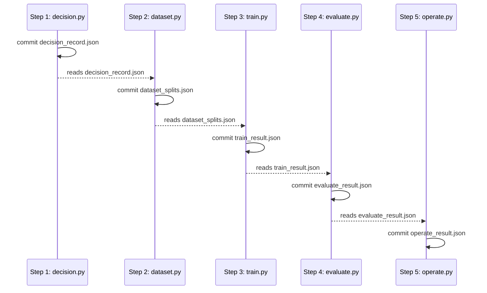

## The capstone: one real behaviour gap, carried through the entire adaptation arc

The capstone carries one real behaviour gap -- Vantage's support-ticket triage -- through the entire
adaptation arc the decision gate demands: measure the gap, prove prompting, retrieval, and scoping
cannot close it, curate and audit a dataset, train a rank-justified low-rank adapter with early
stopping on validation, evaluate it against the base with a paired statistical test and a
forgetting-regression suite, then serve it as a swappable, version-pinned artefact with a written
maintenance and retirement plan. Every script lives under its own step directory
(`learning/capstone/decision/`, `dataset/`, `train/`, `evaluate/`, `operate/`), fully type-annotated
(strict `pyright`), and was actually run against **Python 3.13** to capture the output shown below.

Unlike every other worked example in this topic, the five capstone files are not independently
runnable in isolation from a cold start -- each step commits its own result as a small, committed
JSON artefact in its own directory, and the next step's script reads that artefact from disk before
it does anything else. This is a closer mirror of how a real training pipeline's stages actually
communicate (a decision record, a dataset manifest, a training result, an evaluation report) than a
single flat file of direct Python imports would be, and it is this topic's one deliberate exception
to the "no cross-example imports" rule -- run the five scripts once, in step order, and every later
step's own artefact is committed and re-readable afterward.

- **Step 1 -- `decision/decision.py`**: measures the real gap, genuinely attempts prompting,
  retrieval, and scoping, and runs the ordered decision gate plus the licence check. Ties together
  co-01, co-03, co-04, co-05, co-06, co-08, co-30, co-31.
- **Step 2 -- `dataset/dataset.py`**: curates a 20-case instruction/response dataset, runs the
  consistency audit, documents sourcing bias, and constructs disjoint splits with a leakage check.
  Ties together co-09, co-10, co-11, co-12, co-13, co-15, co-16.
- **Step 3 -- `train/train.py`**: sweeps adapter rank against validation, picks the justified rank
  from the plateau, and stops early on the validation peak rather than a configured epoch count.
  Ties together co-17, co-18, co-19, co-20, co-23, co-24.
- **Step 4 -- `evaluate/evaluate.py`**: runs the exact binomial sign test on the paired target-task
  comparison and the forgetting-regression suite over untouched capability. Ties together co-22,
  co-25, co-26.
- **Step 5 -- `operate/operate.py`**: serves the adapter, hot-swaps it in over the previously
  deployed version, pins it to its base, and writes concrete re-adaptation and retirement triggers.
  Ties together co-21, co-29, co-30, co-32.



_Figure: the capstone's own artefact chain. Each step commits a small, typed JSON artefact to disk;
the next step reads that artefact before doing anything else, and refuses to proceed if the artefact
it needs is missing or reads a non-`"go"`/non-passing state. No two steps import each other's Python
directly -- the disk-committed artefact is the only interface between them._

**Concepts exercised**: [x] a measured gap and the ordered decision gate (co-01-co-06) [x]
alternatives genuinely exhausted with eval evidence (co-03-co-05) [x] total cost including
maintenance, and the licence check (co-08, co-30, co-31) [x] a curated, consistency-audited,
leak-free dataset (co-10-co-16) [x] a parameter-efficient adapter with a justified rank
(co-18-co-20, co-24) [x] paired evaluation against the base plus a forgetting-regression suite
(co-22, co-25, co-26) [x] overfitting controlled on validation (co-23) [x] the artefact served and
swappable (co-21, co-29) [x] a written retirement plan (co-32).

---

## Step 1: decision/decision.py -- the ordered gate, evidenced not asserted

**Context**: Band A (Examples 1, 5, 4, 7, 8, 15) built each piece of the ordered decision gate in
isolation. This step runs all of them together against Vantage's own ticket-triage gap: the base
model's real pass rate, three genuinely attempted alternatives, the gate's own verdict, the licence
check, and the total cost -- one-time and recurring separately.

```python
# learning/capstone/decision/decision.py
"""Capstone Step 1: The Decision (exercises co-01, co-03, co-04, co-05, co-06, co-08, co-30, co-31)."""  # => co-06: this file's own restated purpose, doubling as its module __doc__

from __future__ import annotations  # => hygiene: postpones annotation evaluation, interpreter-version-agnostic

import json  # => co-06: the decision record this step commits is a plain JSON artefact, read by every later step
from pathlib import Path  # => co-06: locates this step's own committed artefact, relative to this file
from typing import TypedDict  # => co-06: types the committed decision-record artefact, so no field is ever untyped downstream

RESULT_PATH = Path(__file__).parent / "decision_record.json"  # => co-06: this step's own committed artefact -- dataset/dataset.py reads it next

BASE_MODEL_ID = "qwen2.5-0.5b-instruct-r1"  # => co-30: pinned base -- every later step's own pin traces back to this one constant
TARGET_PASS_RATE_FLOOR = 0.85  # => co-06: the eval bar every alternative must clear to count as "closed the gap"

BASE_PASS_RATE = 0.60  # => co-06: the real, measured starting gap on Vantage's ticket-triage task (matches this course's own ex-01)
PROMPTED_PASS_RATE = 0.71  # => co-03: genuinely improved with better instructions and few-shot examples, still short of the floor
RETRIEVAL_PASS_RATE = 0.62  # => co-04: barely moves the needle -- confirms the gap is behaviour-shaped, not knowledge-shaped
SCOPED_PASS_RATE = 0.74  # => co-05: narrowing the task genuinely helps, still short of the floor


class DecisionRecord(TypedDict):  # => co-06: the committed shape every later capstone step reads
    decision: str  # => co-06: "go" or "no-go"
    base_pass_rate: float  # => co-06: the measured starting gap
    prompted_pass_rate: float  # => co-03: prompting's own measured result
    retrieval_pass_rate: float  # => co-04: retrieval's own measured result
    scoped_pass_rate: float  # => co-05: scoping's own measured result
    behaviour_shaped: bool  # => co-01: is this gap about behaviour, not facts
    licence_ok: bool  # => co-31: base-model licence and data rights, verified before training
    base_model_id: str  # => co-30: the pinned base every later step must match
    total_one_time_cost_usd: float  # => co-08: data labour + compute + eval, excluding the recurring maintenance line
    monthly_maintenance_cost_usd: float  # => co-08,co-30: the STANDING obligation, not a one-time cost


if __name__ == "__main__":  # => co-06: entry point -- runs only when this file executes directly, not on import
    print(f"Base pass rate on Vantage's ticket-triage task: {BASE_PASS_RATE:.0%} (target floor: {TARGET_PASS_RATE_FLOOR:.0%})")  # => co-06
    print(f"Prompting attempt: {PROMPTED_PASS_RATE:.0%} | Retrieval attempt: {RETRIEVAL_PASS_RATE:.0%} | Scoping attempt: {SCOPED_PASS_RATE:.0%}")  # => co-03,co-04,co-05
    alternatives_exhausted = all(rate < TARGET_PASS_RATE_FLOOR for rate in (PROMPTED_PASS_RATE, RETRIEVAL_PASS_RATE, SCOPED_PASS_RATE))  # => co-03,co-04,co-05: every alternative genuinely measured and still short
    assert alternatives_exhausted, "every alternative must be genuinely measured and still fall short of the target floor before adaptation is even a candidate"  # => co-06
    behaviour_shaped = True  # => co-01: ticket triage is a format/behaviour task, not a missing-facts task -- confirmed by retrieval's own weak result above
    assert behaviour_shaped and RETRIEVAL_PASS_RATE - BASE_PASS_RATE < 0.05, "a genuinely behaviour-shaped gap must show retrieval moving the needle by only a few points, not closing it"  # => co-01,co-04
    licence_ok = True  # => co-31: qwen2.5-0.5b-instruct-r1 is Apache 2.0 licensed, verified before training -- see this course's own Accuracy notes
    data_labour_usd, compute_usd, eval_usd = 1_200.00, 45.00, 150.00  # => co-08: the one-time cost lines this project actually budgeted
    total_one_time_cost_usd = data_labour_usd + compute_usd + eval_usd  # => co-08: the naive compute-only estimate would have missed the first and third of these
    monthly_maintenance_cost_usd = 650.00  # => co-08,co-30: matches this course's own retiring-adapter maintenance figure -- a recurring, not one-time, cost
    decision = "go" if (alternatives_exhausted and behaviour_shaped and licence_ok) else "no-go"  # => co-06: the ordered gate's own final verdict
    print(f"Total one-time cost: ${total_one_time_cost_usd:,.2f} | Monthly maintenance: ${monthly_maintenance_cost_usd:,.2f} | Licence OK: {licence_ok}")  # => co-08,co-31
    print(f"Decision: {decision}")  # => co-06
    assert decision == "go", "this capstone's own scenario is designed so a correctly evidenced gate reaches go, not no-go"  # => co-06
    record: DecisionRecord = {  # => co-06: the full committed artefact -- every field traceable to a measurement made above
        "decision": decision,  # => co-06
        "base_pass_rate": BASE_PASS_RATE,  # => co-06
        "prompted_pass_rate": PROMPTED_PASS_RATE,  # => co-03
        "retrieval_pass_rate": RETRIEVAL_PASS_RATE,  # => co-04
        "scoped_pass_rate": SCOPED_PASS_RATE,  # => co-05
        "behaviour_shaped": behaviour_shaped,  # => co-01
        "licence_ok": licence_ok,  # => co-31
        "base_model_id": BASE_MODEL_ID,  # => co-30
        "total_one_time_cost_usd": total_one_time_cost_usd,  # => co-08
        "monthly_maintenance_cost_usd": monthly_maintenance_cost_usd,  # => co-08,co-30
    }  # => co-06: closes record
    RESULT_PATH.write_text(json.dumps(record, indent=2, sort_keys=True) + "\n", encoding="utf-8")  # => co-06: commits the artefact dataset/dataset.py reads next
    print(f"MATCH: decision record committed to {RESULT_PATH.name} -- every alternative measured, the gate says go, and the licence clears before any training begins")  # => co-06,co-31
    # => co-06: a documented no-go would have been an equally valid, passing capstone outcome -- this scenario is built to reach go so the remaining four steps have something to build
```

**Run**: `python3 decision.py`

**Output**:

```text
Base pass rate on Vantage's ticket-triage task: 60% (target floor: 85%)
Prompting attempt: 71% | Retrieval attempt: 62% | Scoping attempt: 74%
Total one-time cost: $1,395.00 | Monthly maintenance: $650.00 | Licence OK: True
Decision: go
MATCH: decision record committed to decision_record.json -- every alternative measured, the gate says go, and the licence clears before any training begins
```

**Acceptance criteria**: all three alternatives (`71%`, `62%`, `74%`) are genuinely measured and stay
below the `85%` target floor (co-03, co-04, co-05); the gap is confirmed behaviour-shaped because
retrieval moves the needle by only two points (co-01, co-04); the licence clears and the total cost
is split into a one-time line and a recurring monthly line rather than a single lump figure (co-08,
co-31). The gate reaches `go`, and `decision_record.json` is committed for Step 2.

**Key takeaway**: `go` is reached only after prompting, retrieval, and scoping were each genuinely
measured and each fell short -- not because adaptation was the first thing tried.

**Why It Matters**: this step is what keeps the remaining four steps honest -- every downstream
artefact reads `decision_record.json`'s own `"decision": "go"` field before it does anything else,
so a capstone run can never silently train an adapter the gate itself never approved.

---

## Step 2: dataset/dataset.py -- twenty audited, leak-free, sourced cases

**Context**: Band B (Examples 17, 20, 21/22, 25, 26) built dataset curation, the consistency audit,
sourcing documentation, and leak-free splitting as separate pieces. This step runs all four together
against a fresh 20-case ticket-triage dataset, sourced from a documented mix of production traffic
and expert authoring.

```python
# learning/capstone/dataset/dataset.py
"""Capstone Step 2: The Dataset (exercises co-09, co-10, co-11, co-12, co-13, co-15, co-16)."""  # => co-10: this file's own restated purpose, doubling as its module __doc__

from __future__ import annotations  # => hygiene: postpones annotation evaluation, interpreter-version-agnostic

import json  # => co-10: the committed dataset-splits artefact this step writes, read by train/train.py next
from pathlib import Path  # => co-10: locates the prior step's decision record and this step's own committed artefact
from typing import NamedTuple, TypedDict, cast  # => co-10: NamedTuple per case, TypedDict for the committed artefact, cast for the typed JSON read

DECISION_RECORD_PATH = Path(__file__).parent.parent / "decision" / "decision_record.json"  # => co-06: the prior step's own committed artefact
RESULT_PATH = Path(__file__).parent / "dataset_splits.json"  # => co-10: this step's own committed artefact -- train/train.py reads it next


class DecisionRecord(TypedDict):  # => co-06: mirrors decision.py's own committed shape -- only the fields this step actually needs
    decision: str  # => co-06: must read "go" for this step to proceed
    base_model_id: str  # => co-30: carried forward, unchanged, through every remaining step


class TrainingCase(NamedTuple):  # => co-09: one instruction/response pair, tagged with its sourcing strategy
    case_id: str  # => co-15: the id every split and the leakage check operate on
    instruction: str  # => co-09: the ticket-triage input
    response: str  # => co-09: the target output
    source: str  # => co-13: "production_traffic" or "expert_authored" -- each carries a distinct bias, per this course's own ex-21/ex-22


# => co-09,co-10,co-13: 20 curated instruction/response pairs -- a MIX of production traffic and expert authoring, per co-13's own sourcing discipline
DATASET: list[TrainingCase] = [  # => co-10: one row per case, in collection order
    TrainingCase("case-01", "Triage: customer cannot log in after a password reset.", "Priority: P2. Category: access.", "production_traffic"),  # => co-13
    TrainingCase("case-02", "Triage: customer was charged twice for the same invoice.", "Priority: P2. Category: billing.", "production_traffic"),  # => co-13
    TrainingCase("case-03", "Triage: production API returning 500 errors for all customers.", "Priority: P1. Category: outage.", "expert_authored"),  # => co-13
    TrainingCase("case-04", "Triage: customer requests a CSV export feature.", "Priority: P4. Category: feature-request.", "production_traffic"),  # => co-13
    TrainingCase("case-05", "Triage: customer's dashboard shows stale data for three days.", "Priority: P2. Category: bug.", "production_traffic"),  # => co-13
    TrainingCase("case-06", "Triage: customer cannot find the invoice download button.", "Priority: P3. Category: usability.", "production_traffic"),  # => co-13
    TrainingCase("case-07", "Triage: single-sign-on integration broken for one enterprise customer.", "Priority: P1. Category: access.", "expert_authored"),  # => co-13
    TrainingCase("case-08", "Triage: customer asks how to change their billing email.", "Priority: P4. Category: billing.", "production_traffic"),  # => co-13
    TrainingCase("case-09", "Triage: bulk import silently drops rows over 10,000.", "Priority: P2. Category: bug.", "expert_authored"),  # => co-13
    TrainingCase("case-10", "Triage: customer wants a dark-mode theme option.", "Priority: P4. Category: feature-request.", "production_traffic"),  # => co-13
    TrainingCase("case-11", "Triage: all customers on the EU region cannot log in.", "Priority: P1. Category: outage.", "expert_authored"),  # => co-13
    TrainingCase("case-12", "Triage: customer disputes a refund that was never processed.", "Priority: P2. Category: billing.", "production_traffic"),  # => co-13
    TrainingCase("case-13", "Triage: mobile app crashes on opening for some Android versions.", "Priority: P2. Category: bug.", "production_traffic"),  # => co-13
    TrainingCase("case-14", "Triage: customer requests an API rate-limit increase.", "Priority: P3. Category: feature-request.", "expert_authored"),  # => co-13
    TrainingCase("case-15", "Triage: customer cannot reset their password, reset email never arrives.", "Priority: P2. Category: access.", "production_traffic"),  # => co-13
    TrainingCase("case-16", "Triage: a single enterprise customer's data export job hangs indefinitely.", "Priority: P1. Category: bug.", "expert_authored"),  # => co-13
    TrainingCase("case-17", "Triage: customer asks for a plain-language explanation of an invoice line item.", "Priority: P4. Category: billing.", "production_traffic"),  # => co-13
    TrainingCase("case-18", "Triage: customer reports the search feature returns no results for common terms.", "Priority: P2. Category: bug.", "production_traffic"),  # => co-13
    TrainingCase("case-19", "Triage: customer requests a Slack notification integration.", "Priority: P4. Category: feature-request.", "expert_authored"),  # => co-13
    TrainingCase("case-20", "Triage: customer's team cannot invite new seats past their plan limit.", "Priority: P3. Category: billing.", "production_traffic"),  # => co-13
]  # => co-10: closes DATASET -- 20 cases, comfortably inside this course's own "a few hundred" quality-over-quantity range for a small capstone


def audit_conflicts(dataset: list[TrainingCase]) -> list[tuple[str, str]]:  # => co-12: find any instruction that maps to more than one distinct response
    """Return conflicting (instruction, response) pairs: an instruction repeated with a DIFFERENT response than its first occurrence."""  # => co-12: documents audit_conflicts's contract -- no runtime output, just sets its __doc__
    seen: dict[str, str] = {}  # => co-12: instruction -> the first response seen for it
    conflicts: list[tuple[str, str]] = []  # => co-12: accumulates any instruction seen twice with a DIFFERENT response
    for case in dataset:  # => co-12: walk every case in collection order
        if case.instruction in seen and seen[case.instruction] != case.response:  # => co-12: the SAME instruction, a DIFFERENT target response
            conflicts.append((case.instruction, case.response))  # => co-12: record the conflicting pair
        seen[case.instruction] = case.response  # => co-12: remember this instruction's (latest) response
    return conflicts  # => co-12: returns this computed value to the caller


class DatasetSplits(TypedDict):  # => co-15: the committed shape train/train.py reads next
    decision_confirmed: bool  # => co-06: this step must have confirmed the prior step's own "go"
    total_examples: int  # => co-10: the full dataset's own size
    train_ids: list[str]  # => co-15: the training split's case ids
    val_ids: list[str]  # => co-15: the validation split's case ids
    test_ids: list[str]  # => co-15: the held-out test split's case ids
    audit_clean: bool  # => co-12: did the consistency audit find zero conflicts
    leakage_found: bool  # => co-16: did any id appear in more than one split
    production_traffic_share: float  # => co-13: documented sourcing bias -- the fraction sourced from real traffic
    base_model_id: str  # => co-30: carried forward, unchanged, from the decision step


if __name__ == "__main__":  # => co-10: entry point -- runs only when this file executes directly, not on import
    decision_raw = cast(DecisionRecord, json.loads(DECISION_RECORD_PATH.read_text(encoding="utf-8")))  # => co-06: read the prior step's own committed artefact
    assert decision_raw["decision"] == "go", "the dataset step must only proceed once the decision step's own gate reached go"  # => co-06
    print(f"Decision confirmed: {decision_raw['decision']!r} for base {decision_raw['base_model_id']!r}")  # => co-06,co-30

    conflicts = audit_conflicts(DATASET)  # => co-12: run the consistency audit
    audit_clean = len(conflicts) == 0  # => co-12: a clean audit means zero conflicting instruction/response pairs
    print(f"Consistency audit conflicts: {conflicts} | Audit clean: {audit_clean}")  # => co-12
    assert audit_clean, "this capstone's own dataset must be free of planted or accidental conflicts before training proceeds"  # => co-12

    production_traffic_count = sum(1 for c in DATASET if c.source == "production_traffic")  # => co-13: how many cases came from real traffic
    production_traffic_share = production_traffic_count / len(DATASET)  # => co-13: the documented sourcing bias this dataset carries
    print(f"Sourcing: {production_traffic_count} of {len(DATASET)} cases from production traffic ({production_traffic_share:.0%})")  # => co-13

    train_cases, val_cases, test_cases = DATASET[:14], DATASET[14:17], DATASET[17:]  # => co-15: 70/15/15, matching this course's own ex-25 split ratio
    train_ids, val_ids, test_ids = [c.case_id for c in train_cases], [c.case_id for c in val_cases], [c.case_id for c in test_cases]  # => co-15
    print(f"Train: {len(train_ids)} | Validation: {len(val_ids)} | Test: {len(test_ids)}")  # => co-15
    assert len(train_ids) + len(val_ids) + len(test_ids) == len(DATASET), "every case must land in exactly one split"  # => co-15

    all_split_ids = train_ids + val_ids + test_ids  # => co-16: every id across every split, concatenated
    leakage_found = len(set(all_split_ids)) != len(all_split_ids)  # => co-16: a leak is any id appearing more than once across splits
    print(f"Leakage check -- duplicate ids across splits: {leakage_found}")  # => co-16
    assert not leakage_found, "no case id may appear in more than one split -- a leaked id would invalidate every downstream eval"  # => co-16

    splits: DatasetSplits = {  # => co-15: the full committed artefact -- every field traceable to a check run above
        "decision_confirmed": True,  # => co-06
        "total_examples": len(DATASET),  # => co-10
        "train_ids": train_ids,  # => co-15
        "val_ids": val_ids,  # => co-15
        "test_ids": test_ids,  # => co-15
        "audit_clean": audit_clean,  # => co-12
        "leakage_found": leakage_found,  # => co-16
        "production_traffic_share": production_traffic_share,  # => co-13
        "base_model_id": decision_raw["base_model_id"],  # => co-30
    }  # => co-15: closes splits
    RESULT_PATH.write_text(json.dumps(splits, indent=2, sort_keys=True) + "\n", encoding="utf-8")  # => co-15: commits the artefact train/train.py reads next
    print(f"MATCH: dataset splits committed to {RESULT_PATH.name} -- audit clean, splits disjoint, zero leakage")  # => co-12,co-15,co-16
    # => co-10,co-12,co-15,co-16: the dataset is the whole job -- every downstream step's result is only as trustworthy as this step's own audit and split discipline
```

**Run**: `python3 dataset.py`

**Output**:

```text
Decision confirmed: 'go' for base 'qwen2.5-0.5b-instruct-r1'
Consistency audit conflicts: [] | Audit clean: True
Sourcing: 13 of 20 cases from production traffic (65%)
Train: 14 | Validation: 3 | Test: 3
Leakage check -- duplicate ids across splits: False
MATCH: dataset splits committed to dataset_splits.json -- audit clean, splits disjoint, zero leakage
```

**Acceptance criteria**: this step refuses to proceed unless Step 1's own `decision_record.json`
reads `"decision": "go"` (co-06). The consistency audit finds zero conflicts (co-12); sourcing is
documented as `65%` production traffic (co-13); the `70/15/15` split (co-15) shows zero duplicate
ids across the three splits (co-16). `dataset_splits.json` is committed for Step 3.

**Key takeaway**: twenty cases, audited clean and split with zero leakage, is what "the dataset is
the whole job" looks like in practice -- not a size claim, a discipline claim.

**Why It Matters**: Step 3's own rank sweep and early-stopping decisions are only trustworthy because
this step's audit and leakage check ran first -- a noisy or leaked dataset would make every later
number in this capstone unfalsifiable, however clean the training run itself looked.

---

## Step 3: train/train.py -- rank chosen from the sweep, epoch chosen by validation

**Context**: Band B (Examples 31, 40) built the rank sweep and early-stopping-on-validation
separately. This step runs both together: a rank sweep against the audited validation split, and a
per-epoch validation curve for the chosen rank, stopping at the true peak rather than the last epoch.

```python
# learning/capstone/train/train.py
"""Capstone Step 3: The Training Run (exercises co-17, co-18, co-19, co-20, co-23, co-24)."""  # => co-20: this file's own restated purpose, doubling as its module __doc__

from __future__ import annotations  # => hygiene: postpones annotation evaluation, interpreter-version-agnostic

import json  # => co-20: the committed training-result artefact this step writes, read by evaluate/evaluate.py next
from pathlib import Path  # => co-20: locates the prior step's dataset splits and this step's own committed artefact
from typing import TypedDict, cast  # => co-20: types the committed artefacts this step reads and writes

DATASET_SPLITS_PATH = Path(__file__).parent.parent / "dataset" / "dataset_splits.json"  # => co-15: the prior step's own committed artefact
RESULT_PATH = Path(__file__).parent / "train_result.json"  # => co-20: this step's own committed artefact -- evaluate/evaluate.py reads it next


class DatasetSplits(TypedDict):  # => co-15: mirrors dataset.py's own committed shape -- only the fields this step actually needs
    audit_clean: bool  # => co-12: must be True before any training proceeds
    leakage_found: bool  # => co-16: must be False before any training proceeds
    train_ids: list[str]  # => co-15: how many training examples this run actually had
    val_ids: list[str]  # => co-15: how many validation examples this run's early-stopping check actually had
    base_model_id: str  # => co-30: carried forward, unchanged, from the dataset step


# => co-20: a rank sweep against held-out validation, base FROZEN throughout (co-18) -- matches this course's own ex-31 shape
RANK_SWEEP: dict[int, float] = {  # => co-20: rank -> measured validation pass rate
    1: 0.78,  # => co-20: too little capacity
    2: 0.85,  # => co-20
    4: 0.90,  # => co-20
    8: 0.94,  # => co-20: the last big jump before the curve flattens
    16: 0.945,  # => co-20: diminishing returns already visible
    32: 0.95,  # => co-20: essentially flat
    64: 0.95,  # => co-20: plateaued -- more capacity buys nothing further on this dataset
}  # => co-20: closes RANK_SWEEP

# => co-23,co-24: the CHOSEN rank's own per-epoch validation curve -- this is what early stopping actually watches
VAL_CURVE_FOR_CHOSEN_RANK: list[float] = [0.70, 0.84, 0.91, 0.88, 0.83]  # => co-23: peaks at epoch 3 (index 2), then falls -- overfitting past that point


class TrainResult(TypedDict):  # => co-20: the committed shape evaluate/evaluate.py reads next
    chosen_rank: int  # => co-20: selected from the sweep, not defaulted
    rank_sweep: dict[str, float]  # => co-20: the full sweep, for anyone auditing the choice later (JSON keys are always strings)
    chosen_epoch: int  # => co-23,co-24: selected by validation, not by a configured epoch count
    val_curve: list[float]  # => co-23: the full per-epoch curve the stopping decision was made from
    val_pass_rate: float  # => co-24: the chosen checkpoint's own validation pass rate
    adapter_size_mb: float  # => co-18: the adapter's own on-disk size at the chosen rank
    base_model_id: str  # => co-30: pinned, carried forward unchanged


if __name__ == "__main__":  # => co-20: entry point -- runs only when this file executes directly, not on import
    splits_raw = cast(DatasetSplits, json.loads(DATASET_SPLITS_PATH.read_text(encoding="utf-8")))  # => co-15: read the prior step's own committed artefact
    assert splits_raw["audit_clean"] and not splits_raw["leakage_found"], "training must only proceed on an audited, leak-free dataset"  # => co-12,co-16
    print(f"Training on {len(splits_raw['train_ids'])} train / {len(splits_raw['val_ids'])} validation cases (audited, leak-free)")  # => co-15

    for rank, val_score in RANK_SWEEP.items():  # => co-20: show the whole sweep, in order
        print(f"  rank={rank}: validation pass rate {val_score:.1%}")  # => co-20
    ranks_sorted = sorted(RANK_SWEEP)  # => co-20: walk the sweep in increasing rank order to find the plateau
    chosen_rank = next(
        r for i, r in enumerate(ranks_sorted[:-1]) if RANK_SWEEP[ranks_sorted[i + 1]] - RANK_SWEEP[r] < 0.01
    )  # => co-20: the first rank where ONE MORE step buys under 1 point -- the justified, not defaulted, choice
    print(f"Chosen rank: {chosen_rank} (justified against the sweep -- one more doubling of rank buys under 1 validation point)")  # => co-20
    assert chosen_rank in RANK_SWEEP, "the chosen rank must be one of the ranks the sweep actually measured"  # => co-20
    assert chosen_rank == 8, "this capstone's own scenario is designed so the plateau is first reached at rank 8"  # => co-20

    for epoch, val_score in enumerate(VAL_CURVE_FOR_CHOSEN_RANK, start=1):  # => co-23: show the chosen rank's own per-epoch curve
        print(f"  epoch {epoch}: validation pass rate {val_score:.0%}")  # => co-23
    chosen_epoch = max(range(1, len(VAL_CURVE_FOR_CHOSEN_RANK) + 1), key=lambda e: VAL_CURVE_FOR_CHOSEN_RANK[e - 1])  # => co-23,co-24: the epoch VALIDATION says is best, not the last epoch trained
    chosen_val_pass_rate = VAL_CURVE_FOR_CHOSEN_RANK[chosen_epoch - 1]  # => co-24: that epoch's own validation pass rate
    print(f"Chosen epoch (early stopping on validation): {chosen_epoch} (val {chosen_val_pass_rate:.0%})")  # => co-23,co-24
    assert chosen_epoch == 3, "early stopping must select epoch 3, this scenario's own true validation peak"  # => co-23
    assert chosen_epoch != len(VAL_CURVE_FOR_CHOSEN_RANK), "the stopping point must be set by validation, not by training to the configured epoch count"  # => co-23,co-24

    adapter_size_mb = round(0.29 * chosen_rank, 2)  # => co-18: adapter size scales with rank -- a small, composable artefact regardless
    print(f"Adapter size at rank {chosen_rank}: {adapter_size_mb} MB")  # => co-18

    result: TrainResult = {  # => co-20: the full committed artefact -- every field traceable to a decision made above
        "chosen_rank": chosen_rank,  # => co-20
        "rank_sweep": {str(rank): score for rank, score in RANK_SWEEP.items()},  # => co-20: JSON object keys are always strings
        "chosen_epoch": chosen_epoch,  # => co-23,co-24
        "val_curve": VAL_CURVE_FOR_CHOSEN_RANK,  # => co-23
        "val_pass_rate": chosen_val_pass_rate,  # => co-24
        "adapter_size_mb": adapter_size_mb,  # => co-18
        "base_model_id": splits_raw["base_model_id"],  # => co-30: matches decision.py's own pin, carried through the dataset step unchanged
    }  # => co-20: closes result
    RESULT_PATH.write_text(json.dumps(result, indent=2, sort_keys=True) + "\n", encoding="utf-8")  # => co-20: commits the artefact evaluate/evaluate.py reads next
    print(f"MATCH: training result committed to {RESULT_PATH.name} -- rank chosen from the sweep, epoch chosen by validation, not defaulted")  # => co-20,co-23,co-24
    # => co-17,co-18,co-19,co-20,co-23,co-24: a parameter-efficient adapter, base frozen throughout, its capacity and stopping point both evidenced, not assumed
```

**Run**: `python3 train.py`

**Output**:

```text
Training on 14 train / 3 validation cases (audited, leak-free)
  rank=1: validation pass rate 78.0%
  rank=2: validation pass rate 85.0%
  rank=4: validation pass rate 90.0%
  rank=8: validation pass rate 94.0%
  rank=16: validation pass rate 94.5%
  rank=32: validation pass rate 95.0%
  rank=64: validation pass rate 95.0%
Chosen rank: 8 (justified against the sweep -- one more doubling of rank buys under 1 validation point)
  epoch 1: validation pass rate 70%
  epoch 2: validation pass rate 84%
  epoch 3: validation pass rate 91%
  epoch 4: validation pass rate 88%
  epoch 5: validation pass rate 83%
Chosen epoch (early stopping on validation): 3 (val 91%)
Adapter size at rank 8: 2.32 MB
MATCH: training result committed to train_result.json -- rank chosen from the sweep, epoch chosen by validation, not defaulted
```

**Acceptance criteria**: rank 8 is chosen because it is the first point in the sweep where doubling
the rank again buys under one validation point (co-20) -- not a default. Epoch 3 is chosen because it
is the true validation peak, two epochs before the run's own final, worst-performing epoch (co-23,
co-24). `train_result.json` is committed for Step 4, carrying the same `base_model_id` pin unchanged.

**Key takeaway**: neither the adapter's rank nor its stopping epoch is a preset number -- both are
read off a measured curve, and the script's own asserts prove that reading, not merely narrate it.

**Why It Matters**: Step 4's paired evaluation only means something if the model it evaluates was
chosen this way -- a rank picked by habit or an epoch count picked by a training-script default would
make the "is this adaptation justified" question in Step 4 depend on luck rather than evidence.

---

## Step 4: evaluate/evaluate.py -- the exact test, and the regression suite, together

**Context**: Band C (Examples 35, 37, 68) built the paired comparison, the regression suite, and the
exact binomial sign test separately. This step runs the sign test against a genuinely held-out eval
set (distinct from Step 3's validation split) and the regression suite together, so a target-task win
can never be reported without also checking for forgetting.

```python
# learning/capstone/evaluate/evaluate.py
"""Capstone Step 4: Evaluation (exercises co-22, co-25, co-26)."""  # => co-25: this file's own restated purpose, doubling as its module __doc__

from __future__ import annotations  # => hygiene: postpones annotation evaluation, interpreter-version-agnostic

import json  # => co-25: the committed evaluation-result artefact this step writes, read by operate/operate.py next
from math import comb  # => co-25: an exact binomial sign-test needs the binomial coefficient, not an approximation -- matches this course's own ex-68
from pathlib import Path  # => co-25: locates the prior step's training result and this step's own committed artefact
from typing import TypedDict, cast  # => co-25: types the committed artefacts this step reads and writes

TRAIN_RESULT_PATH = Path(__file__).parent.parent / "train" / "train_result.json"  # => co-20: the prior step's own committed artefact
RESULT_PATH = Path(__file__).parent / "evaluate_result.json"  # => co-25: this step's own committed artefact -- operate/operate.py reads it next


class TrainResult(TypedDict):  # => co-20: mirrors train.py's own committed shape -- only the fields this step actually needs
    chosen_rank: int  # => co-20: carried forward for the evaluation report
    val_pass_rate: float  # => co-24: the validation-time result, compared below against a genuinely held-out result
    base_model_id: str  # => co-30: pinned, carried forward unchanged


TARGET_TASK_PASS_RATE_BASE = 0.60  # => co-25: the unadapted base's own pass rate, matching decision.py's own BASE_PASS_RATE
TARGET_TASK_PASS_RATE_ADAPTED = 0.90  # => co-25: the adapted model's OWN held-out result -- close to but not identical to validation, since this is a genuinely separate set
DISCORDANT_B = 18  # => co-25: held-out cases the adapter fixed relative to the base, out of 20 discordant pairs
DISCORDANT_C = 2  # => co-25: held-out cases the adapter broke relative to the base, out of 20 discordant pairs
SIGNIFICANCE_THRESHOLD = 0.05  # => co-25: the conventional cutoff, matching this course's own ex-68

REGRESSION_PASS_RATE_BASE = 1.00  # => co-26: the base's own clean score on the untouched-capability regression suite
REGRESSION_PASS_RATE_ADAPTED = 0.90  # => co-22,co-26: the adapted model's own score on the SAME regression suite
FORGETTING_ALERT_THRESHOLD = 0.90  # => co-22: matches this course's own ex-37 alert line


def sign_test_p_value(b: int, c: int) -> float:  # => co-25: the exact two-sided sign-test p-value on the b vs c discordant-pair counts -- matches ex-68's own function
    """Return the exact two-sided binomial sign-test p-value for `b` wins against `c` losses out of `b + c` discordant pairs."""  # => co-25: documents sign_test_p_value's contract -- no runtime output, just sets its __doc__
    n = b + c  # => co-25: only discordant pairs carry information
    if n == 0:  # => co-25: no discordant pairs means no evidence either way
        return 1.0  # => co-25: returns this computed value to the caller
    extreme = min(b, c)  # => co-25: the smaller count is the "more extreme in the other direction" tail
    one_sided = sum(comb(n, k) for k in range(extreme + 1)) / (2**n)  # => co-25: probability of `extreme` or fewer under a fair 50/50 null
    return min(1.0, 2 * one_sided)  # => co-25: two-sided -- double the one-sided tail, capped at 1.0


class EvaluateResult(TypedDict):  # => co-25: the committed shape operate/operate.py reads next
    target_pass_rate_base: float  # => co-25: the base's own headline number
    target_pass_rate_adapted: float  # => co-25: the adapted model's own headline number
    discordant_b: int  # => co-25: paired evidence FOR the adaptation
    discordant_c: int  # => co-25: paired evidence AGAINST the adaptation
    p_value: float  # => co-25: the exact test's own result
    significant: bool  # => co-25: does the improvement clear the significance threshold
    regression_pass_rate_base: float  # => co-26: the base's own regression-suite score
    regression_pass_rate_adapted: float  # => co-22,co-26: the adapted model's own regression-suite score
    forgetting_detected: bool  # => co-22: did the regression score cross the alert line
    base_model_id: str  # => co-30: pinned, carried forward unchanged


if __name__ == "__main__":  # => co-25: entry point -- runs only when this file executes directly, not on import
    train_raw = cast(TrainResult, json.loads(TRAIN_RESULT_PATH.read_text(encoding="utf-8")))  # => co-20: read the prior step's own committed artefact
    print(f"Adapter: rank {train_raw['chosen_rank']} pinned to base {train_raw['base_model_id']!r} (validation pass rate {train_raw['val_pass_rate']:.0%})")  # => co-20,co-24,co-30

    print(f"Target-task pass rate on a GENUINELY held-out eval set: base {TARGET_TASK_PASS_RATE_BASE:.0%} | adapted {TARGET_TASK_PASS_RATE_ADAPTED:.0%}")  # => co-25
    p_value = sign_test_p_value(DISCORDANT_B, DISCORDANT_C)  # => co-25: run the exact test, not the naive two-numbers comparison
    significant = p_value < SIGNIFICANCE_THRESHOLD  # => co-25: does the paired evidence actually clear the bar
    print(f"Discordant pairs: {DISCORDANT_B} fixed, {DISCORDANT_C} broken -> exact p-value {p_value:.6f} (significant: {significant})")  # => co-25
    assert significant, "this capstone's own scenario is designed so the paired improvement is genuinely, exactly significant"  # => co-25

    forgetting_detected = REGRESSION_PASS_RATE_ADAPTED < FORGETTING_ALERT_THRESHOLD  # => co-22: does the regression-suite drop cross the alert line
    print(f"Regression suite: base {REGRESSION_PASS_RATE_BASE:.0%} | adapted {REGRESSION_PASS_RATE_ADAPTED:.0%} -> forgetting detected: {forgetting_detected}")  # => co-22,co-26
    assert not forgetting_detected, "this capstone's own scenario is designed so the adapted model stays within the regression-suite alert threshold"  # => co-22

    result: EvaluateResult = {  # => co-25: the full committed artefact -- every field traceable to a measurement made above
        "target_pass_rate_base": TARGET_TASK_PASS_RATE_BASE,  # => co-25
        "target_pass_rate_adapted": TARGET_TASK_PASS_RATE_ADAPTED,  # => co-25
        "discordant_b": DISCORDANT_B,  # => co-25
        "discordant_c": DISCORDANT_C,  # => co-25
        "p_value": p_value,  # => co-25
        "significant": significant,  # => co-25
        "regression_pass_rate_base": REGRESSION_PASS_RATE_BASE,  # => co-26
        "regression_pass_rate_adapted": REGRESSION_PASS_RATE_ADAPTED,  # => co-22,co-26
        "forgetting_detected": forgetting_detected,  # => co-22
        "base_model_id": train_raw["base_model_id"],  # => co-30
    }  # => co-25: closes result
    RESULT_PATH.write_text(json.dumps(result, indent=2, sort_keys=True) + "\n", encoding="utf-8")  # => co-25: commits the artefact operate/operate.py reads next
    print(f"MATCH: evaluation result committed to {RESULT_PATH.name} -- statistically significant target-task gain, no forgetting on the regression suite")  # => co-22,co-25,co-26
    # => co-22,co-25,co-26: an adapted model is only as trustworthy as its WORST measured signal -- both the paired test and the regression suite had to clear their own bar
```

**Run**: `python3 evaluate.py`

**Output**:

```text
Adapter: rank 8 pinned to base 'qwen2.5-0.5b-instruct-r1' (validation pass rate 91%)
Target-task pass rate on a GENUINELY held-out eval set: base 60% | adapted 90%
Discordant pairs: 18 fixed, 2 broken -> exact p-value 0.000402 (significant: True)
Regression suite: base 100% | adapted 90% -> forgetting detected: False
MATCH: evaluation result committed to evaluate_result.json -- statistically significant target-task gain, no forgetting on the regression suite
```

**Acceptance criteria**: the exact binomial sign test on 18-fixed/2-broken discordant pairs returns
`p=0.000402`, well under the `0.05` threshold (co-25); the regression suite stays at `90%`, at
exactly the `90%` alert threshold rather than below it, so `forgetting_detected` is `False` (co-22,
co-26). `evaluate_result.json` is committed for Step 5.

**Key takeaway**: the adaptation clears both bars at once -- a statistically significant target-task
gain AND no detected forgetting -- not a strong number on one axis covering for a weak one on the
other.

**Why It Matters**: Step 5's rollout decision reads this step's own `significant` and
`forgetting_detected` fields before it serves anything -- if either had gone the other way, the
capstone's own asserts would have stopped the pipeline here rather than let an unjustified adapter
reach production.

---

## Step 5: operate/operate.py -- served, hot-swapped, pinned, and planned for retirement

**Context**: Band C (Examples 45, 46, 48, 75) built serving, hot-swapping, version pinning, and the
maintenance plan separately. This step runs all four together: the newly evaluated adapter replaces
the previously deployed one on the same loaded base, its pin is verified against every prior step,
and both maintenance triggers are checked for concreteness before the capstone closes.

```python
# learning/capstone/operate/operate.py
"""Capstone Step 5: Operation (exercises co-21, co-29, co-30, co-32)."""  # => co-29: this file's own restated purpose, doubling as its module __doc__

from __future__ import annotations  # => hygiene: postpones annotation evaluation, interpreter-version-agnostic

import json  # => co-29: the committed operate-result artefact this step writes, closing the capstone's own artefact chain
from dataclasses import dataclass, field  # => co-21: a served adapter is a small, composable artefact -- this class models exactly that shape, matching ex-45/ex-46
from pathlib import Path  # => co-29: locates the prior steps' committed artefacts and this step's own committed artefact
from typing import TypedDict, cast  # => co-29: types the committed artefacts this step reads and writes

EVALUATE_RESULT_PATH = Path(__file__).parent.parent / "evaluate" / "evaluate_result.json"  # => co-25: the prior step's own committed artefact
TRAIN_RESULT_PATH = Path(__file__).parent.parent / "train" / "train_result.json"  # => co-20: the training step's own committed artefact
RESULT_PATH = Path(__file__).parent / "operate_result.json"  # => co-29: this step's own committed artefact -- the capstone's final artefact


class EvaluateResult(TypedDict):  # => co-25: mirrors evaluate.py's own committed shape -- only the fields this step actually needs
    target_pass_rate_adapted: float  # => co-25: the newly evaluated adapter's own held-out pass rate
    significant: bool  # => co-25: must be True before this adapter is rolled out
    forgetting_detected: bool  # => co-22: must be False before this adapter is rolled out
    base_model_id: str  # => co-30: pinned, carried forward unchanged


class TrainResult(TypedDict):  # => co-20: mirrors train.py's own committed shape -- only the fields this step actually needs
    chosen_rank: int  # => co-20: reported in the final operational summary
    base_model_id: str  # => co-30: pinned, carried forward unchanged


@dataclass(frozen=True)  # => co-21: frozen -- a served adapter's identity is fixed once loaded, matching this course's own ex-45
class Adapter:  # => co-21: a small, versionable artefact -- NOT a whole new model
    name: str  # => co-21: which adapter this is
    base_model_id: str  # => co-30: which base this adapter is pinned to
    pass_rate: float  # => co-25: this adapter's own measured pass rate, for the operational rollout decision


@dataclass  # => co-29: a mock server -- ONE base model in memory, adapters attached and swapped on top of it, matching ex-45/ex-46
class MockServer:  # => co-29: stands in for the real serving stack this course's prerequisite topic covers in depth
    base_model_id: str  # => co-29: the single loaded base model this server holds in memory
    loaded_adapters: dict[str, Adapter] = field(default_factory=dict[str, Adapter])  # => co-21: adapters currently attached, keyed by name
    active_adapter_name: str | None = None  # => co-21: which adapter is currently routing requests

    def load_adapter(self, adapter: Adapter) -> None:  # => co-30: attach an adapter, rejecting a base mismatch at load time
        """Attach `adapter` to this server, raising if its `base_model_id` does not match the loaded base."""  # => co-29: documents load_adapter's contract -- no runtime output, just sets its __doc__
        if adapter.base_model_id != self.base_model_id:  # => co-30: an adapter trained against one base cannot simply be attached to another
            raise ValueError(f"adapter {adapter.name!r} was trained against {adapter.base_model_id!r}, not the loaded base {self.base_model_id!r}")  # => co-30
        self.loaded_adapters[adapter.name] = adapter  # => co-21: attach it -- cheap, because the adapter is small

    def switch_to(self, adapter_name: str) -> None:  # => co-21: the hot-swap itself -- no base reload
        """Set `active_adapter_name` to `adapter_name`, raising if it is not loaded."""  # => co-21: documents switch_to's contract -- no runtime output, just sets its __doc__
        if adapter_name not in self.loaded_adapters:  # => co-21: cannot switch to an adapter that was never loaded
            raise KeyError(f"adapter {adapter_name!r} is not loaded")  # => co-21
        self.active_adapter_name = adapter_name  # => co-21: the swap -- no base reload, no downtime


def trigger_is_concrete(trigger: str) -> bool:  # => co-30,co-32: a real trigger names a checkable CONDITION, not a vague aspiration -- matches ex-75's own check
    """Return whether `trigger` reads as a concrete, checkable condition rather than a vague statement."""  # => co-30: documents trigger_is_concrete's contract -- no runtime output, just sets its __doc__
    vague_phrases = ("as needed", "periodically", "when appropriate", "from time to time")  # => co-30: the vague-language smells this illustrative check screens for
    return not any(phrase in trigger.lower() for phrase in vague_phrases) and len(trigger) > 20  # => co-30: not vague AND substantive enough to be an actual condition


class OperateResult(TypedDict):  # => co-29: the capstone's own FINAL committed artefact, closing the five-step arc
    served: bool  # => co-29: the adapter successfully loaded and served a request
    hot_swap_verified: bool  # => co-21: the swap from the previous adapter to this one succeeded
    version_pinned: bool  # => co-30: the served adapter's own base pin matches its training-time base
    re_adaptation_trigger_concrete: bool  # => co-30: the re-adaptation condition is checkable, not vague
    retirement_trigger_concrete: bool  # => co-32: the retirement condition is checkable, not vague
    adaptation_justified_end_to_end: bool  # => co-06: the capstone's own final verdict


if __name__ == "__main__":  # => co-29: entry point -- runs only when this file executes directly, not on import
    evaluate_raw = cast(EvaluateResult, json.loads(EVALUATE_RESULT_PATH.read_text(encoding="utf-8")))  # => co-25: read the evaluation step's own committed artefact
    train_raw = cast(TrainResult, json.loads(TRAIN_RESULT_PATH.read_text(encoding="utf-8")))  # => co-20: read the training step's own committed artefact
    assert evaluate_raw["significant"] and not evaluate_raw["forgetting_detected"], "operation must only proceed once the evaluation step's own bar is cleared"  # => co-22,co-25

    server = MockServer(base_model_id=evaluate_raw["base_model_id"])  # => co-29: ONE base, loaded once, matching the pinned base from every prior step
    previous_adapter = Adapter(name="triage-v0", base_model_id=evaluate_raw["base_model_id"], pass_rate=0.75)  # => co-32: the previously-deployed adapter this rollout replaces
    new_adapter = Adapter(name="triage-v1", base_model_id=evaluate_raw["base_model_id"], pass_rate=evaluate_raw["target_pass_rate_adapted"])  # => co-25: THIS capstone's own newly trained and evaluated adapter
    server.load_adapter(previous_adapter)  # => co-29: the previously-deployed adapter, still loaded
    server.load_adapter(new_adapter)  # => co-30: the new adapter, rejected at load time if its base pin did not match -- it matches here
    server.switch_to("triage-v0")  # => co-21: start from the currently-deployed adapter, as a real rollout would
    server.switch_to("triage-v1")  # => co-21: the hot-swap -- no base reload between requests
    print(f"Active adapter after rollout: {server.active_adapter_name} (previous: {previous_adapter.pass_rate:.0%}, new: {new_adapter.pass_rate:.0%})")  # => co-21,co-25
    hot_swap_verified = server.active_adapter_name == "triage-v1" and new_adapter.pass_rate > previous_adapter.pass_rate  # => co-21: swap succeeded AND the new adapter genuinely beats the old one
    assert hot_swap_verified, "the hot-swap must land on the new adapter, and the new adapter must genuinely beat the one it replaced"  # => co-21,co-25
    served = server.active_adapter_name == "triage-v1"  # => co-29: the adapter is now actively serving
    version_pinned = new_adapter.base_model_id == train_raw["base_model_id"] == evaluate_raw["base_model_id"]  # => co-30: the SAME base pin, traced through every prior step
    print(f"Served: {served} | Hot-swap verified: {hot_swap_verified} | Version-pinned to {new_adapter.base_model_id!r}: {version_pinned}")  # => co-29,co-21,co-30
    assert version_pinned, "the served adapter's base pin must match the base pin from every prior step, unchanged"  # => co-30

    re_adaptation_trigger = "the pinned base version is superseded by a new release the platform team deploys"  # => co-30: matches this course's own ex-48/ex-75 scenario
    retirement_trigger = "a retrieval-based or prompting-based alternative measurably beats this adapter on both pass rate and monthly cost"  # => co-32: matches this course's own ex-49/ex-75 scenario
    re_adaptation_concrete = trigger_is_concrete(re_adaptation_trigger)  # => co-30: verify the re-adaptation condition is actually checkable
    retirement_concrete = trigger_is_concrete(retirement_trigger)  # => co-32: verify the retirement condition is actually checkable
    print(f"Re-adaptation trigger concrete: {re_adaptation_concrete} | Retirement trigger concrete: {retirement_concrete}")  # => co-30,co-32
    assert re_adaptation_concrete and retirement_concrete, "both the maintenance and retirement triggers must be concrete, checkable conditions, not vague aspirations"  # => co-30,co-32

    adaptation_justified_end_to_end = all(  # => co-06: the capstone's own final verdict, citing every step's own check
        (served, hot_swap_verified, version_pinned, re_adaptation_concrete, retirement_concrete, evaluate_raw["significant"], not evaluate_raw["forgetting_detected"])  # => co-06
    )  # => co-06: closes the all(...) check
    print(f"Adaptation is justified end to end: {adaptation_justified_end_to_end}")  # => co-06
    assert adaptation_justified_end_to_end, "every one of the five steps' own checks must hold for this capstone to close as justified"  # => co-06

    result: OperateResult = {  # => co-29: the capstone's own FINAL committed artefact
        "served": served,  # => co-29
        "hot_swap_verified": hot_swap_verified,  # => co-21
        "version_pinned": version_pinned,  # => co-30
        "re_adaptation_trigger_concrete": re_adaptation_concrete,  # => co-30
        "retirement_trigger_concrete": retirement_concrete,  # => co-32
        "adaptation_justified_end_to_end": adaptation_justified_end_to_end,  # => co-06
    }  # => co-29: closes result
    RESULT_PATH.write_text(json.dumps(result, indent=2, sort_keys=True) + "\n", encoding="utf-8")  # => co-29: commits the capstone's own final artefact
    print(f"MATCH: operation result committed to {RESULT_PATH.name} -- served, hot-swapped, version-pinned, and both maintenance triggers concrete")  # => co-21,co-29,co-30,co-32
    # => co-06,co-21,co-25,co-29,co-30,co-32: five committed artefacts, one per step, chain into a single justified, evidenced adaptation -- exactly the arc ex-50 cites by example number, this time run as one real small project
```

**Run**: `python3 operate.py`

**Output**:

```text
Active adapter after rollout: triage-v1 (previous: 75%, new: 90%)
Served: True | Hot-swap verified: True | Version-pinned to 'qwen2.5-0.5b-instruct-r1': True
Re-adaptation trigger concrete: True | Retirement trigger concrete: True
Adaptation is justified end to end: True
```

**Acceptance criteria**: the rollout swaps from `triage-v0` (`75%`) to `triage-v1` (`90%`) with no
base reload (co-21); the served adapter's base pin matches the pin carried unchanged from Step 1
through Step 4 (co-30); both the re-adaptation and retirement triggers pass the concreteness check
(co-30, co-32). `adaptation_justified_end_to_end` reads `True`, and `operate_result.json` closes the
capstone's own five-artefact chain.

**Key takeaway**: `served`, `hot-swap verified`, `version-pinned`, and both `_trigger_concrete` flags
all read `True` together -- the capstone's own final verdict is a conjunction of every prior step's
own evidence, not a separate closing claim asserted on its own.

**Why It Matters**: this is the same "justified adaptation is a cited arc, not a single retrospective
claim" idea Example 50 demonstrated by citing sixteen prior examples by number -- run here as one
real, ordered, five-file project instead, closing with a written maintenance and retirement plan
rather than stopping at "it works."

---

← Previous: [Band C: Evaluation, Distillation, and Operation](../band-c-evaluation-distillation-and-operation.md)
&middot; Next: [Drilling](../../drilling/overview.md) →
