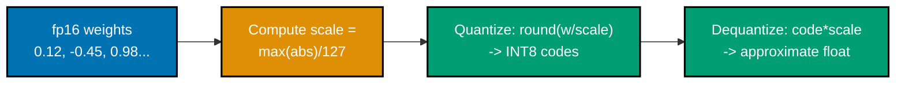
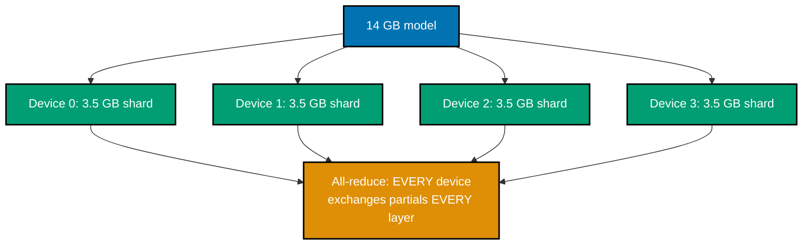
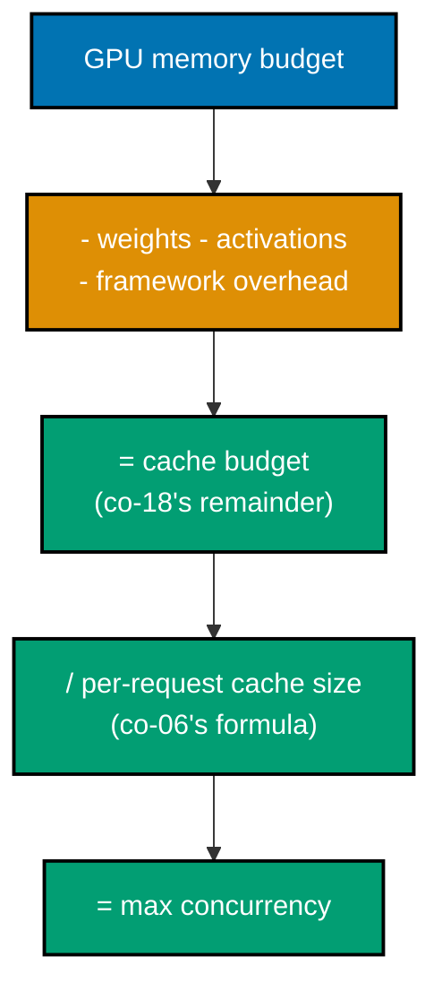
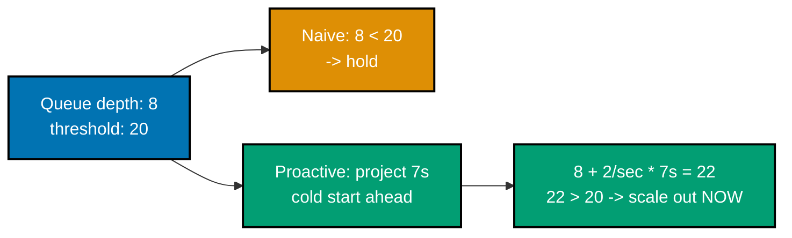
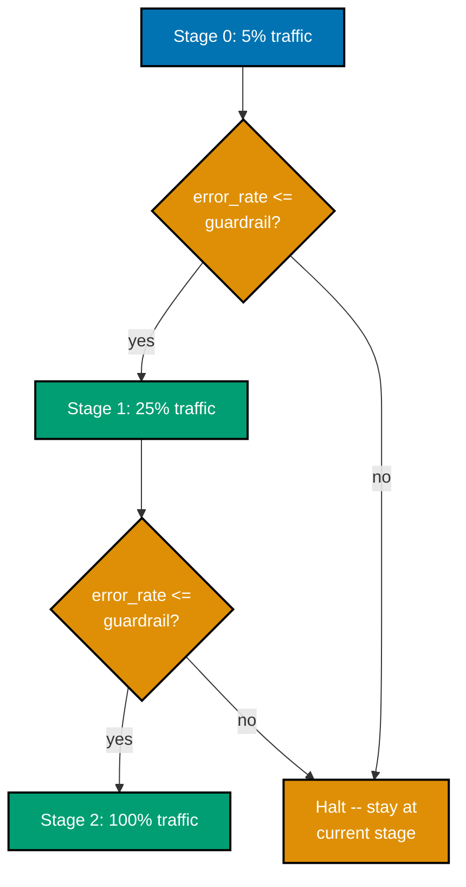
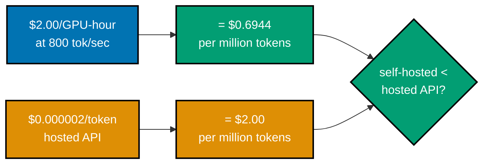
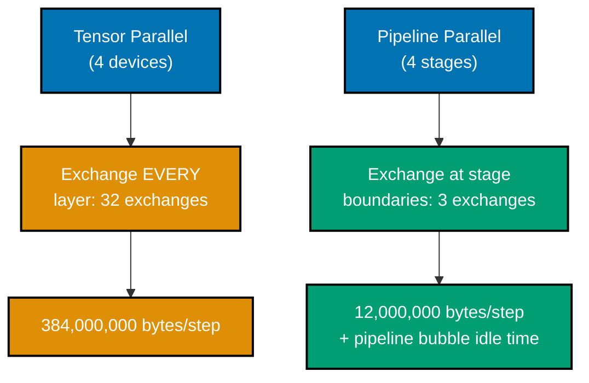
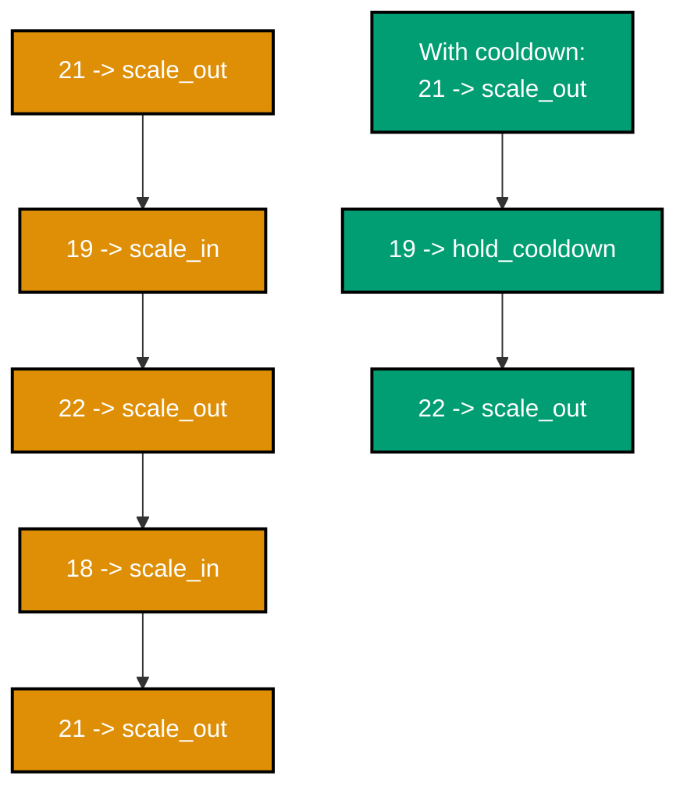
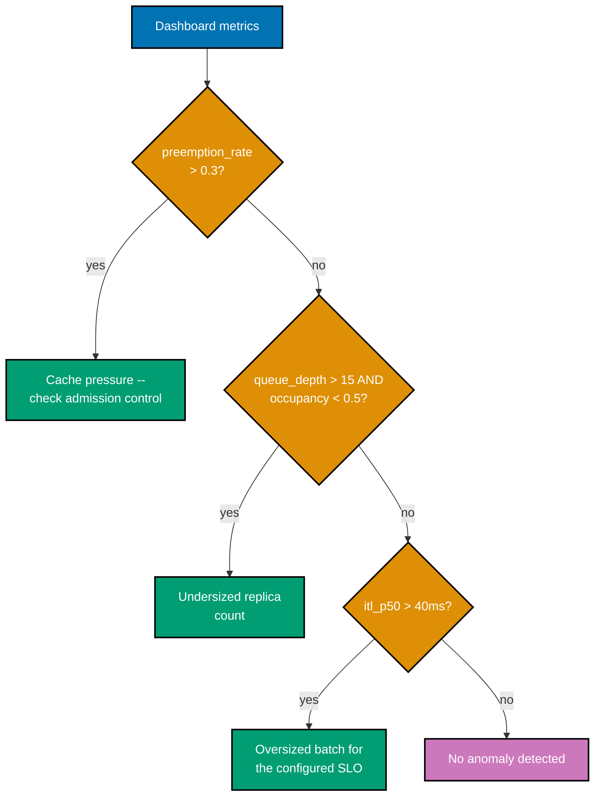
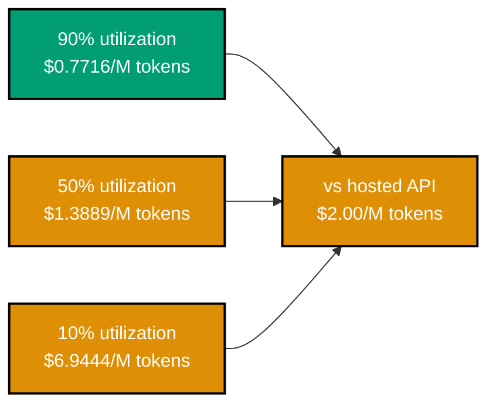

Examples 51-75 move from "make a service work" to "make it worth trusting in production": quantization
evaluated rather than assumed, model parallelism and its failure mode, capacity planning against a real
length distribution, GPU-aware autoscaling, deployment packaging, staged rollout with guardrails,
serving observability, and the self-hosting-versus-hosted-API decision. Every framework name, GPU
price, and quantization figure that shows up here is deliberately illustrative -- see this course's
[Accuracy notes](../overview.md#accuracy-notes) for exactly which facts are volatile and why none of
them are stated as a current market fact.

---

### Example 51: Quantize a Model

_ex-51 &middot; exercises co-19_

Quantization maps a range of floating-point weights onto a much smaller set of integer codes, trading
precision for memory -- this example quantizes a tiny weight vector to INT8 and measures the
reconstruction error directly.



**`learning/code/ex-51-quantize-a-model/example.py`**

```python
"""Example 51: Quantize a Model."""


def quantize_int8(weights: list[float], scale: float) -> list[int]:  # => co-19: linear symmetric quantization
    return [round(w / scale) for w in weights]  # => each float mapped to its nearest INT8 code


def dequantize_int8(quantized: list[int], scale: float) -> list[float]:  # => co-19: reconstruct an APPROXIMATE float
    return [q * scale for q in quantized]  # => the inverse mapping -- approximate, never exact


weights = [0.12, -0.45, 0.98, -1.2, 0.03]  # => a tiny stand-in for one row of a real weight matrix
scale = max(abs(w) for w in weights) / 127  # => co-19: INT8 spans [-127, 127] -- scale maps the float range onto it
quantized = quantize_int8(weights, scale)  # => the compressed, integer-only representation
dequantized = dequantize_int8(quantized, scale)  # => reconstructed floats -- close, but NOT identical to the originals
print(quantized)  # => Output: [13, -48, 104, -127, 3]
print([round(d, 4) for d in dequantized])  # => Output: [0.1228, -0.4535, 0.9827, -1.2, 0.0283]

max_error = max(abs(w - d) for w, d in zip(weights, dequantized))  # => the worst single reconstruction error
print(round(max_error, 4))  # => Output: 0.0035

assert max_error < scale  # => co-19: quantization error is bounded by roughly half a scale step, always
# => real quantizers (GPTQ, AWQ) use calibration data instead of this toy min/max scale -- same idea, tighter fit
print("ex-51 OK")  # => a self-check marker confirming reconstruction error stayed within the expected bound

```

**Run**: `python3 example.py`

**Output**:

```text
[13, -48, 104, -127, 3]
[0.1228, -0.4535, 0.9827, -1.2, 0.0283]
0.0035
ex-51 OK
```

**Key takeaway**: Quantization is exactly this mechanical, bounded-error operation -- pick a scale, round
every value to the nearest integer code, and the reconstruction error is provably bounded by roughly
half a scale step; nothing about it is exotic or unpredictable.

**Why it matters**: This tiny five-value example is the same operation applied to a billion-parameter
weight matrix -- the reconstruction error here directly explains why lower-precision formats measurably
change a model's output, which is exactly what Example 52 goes on to quantify.

---

### Example 52: Quantization Quality Cost

_ex-52 &middot; exercises co-19_

Quantization is a real trade, not a free win: lower precision shrinks memory, but it also degrades
output quality, and the two move together as precision drops. This example prices both sides of the
trade at fp16, INT8, and INT4 using an illustrative, synthetic quality curve.

**`learning/code/ex-52-quantization-quality-cost/example.py`**

```python
"""Example 52: Quantization Quality Cost."""


def synthetic_quality_score(precision_bits: int) -> float:
    # => co-19: illustrative synthetic degradation curve, NOT a published benchmark number -- see Accuracy notes
    baseline = 100.0  # => an arbitrary quality ceiling -- fp16 loses nothing relative to this baseline
    degradation = {16: 0.0, 8: 1.5, 4: 6.0}[precision_bits]  # => illustrative points, not measured data
    return baseline - degradation  # => lower precision, more degradation -- monotonic by construction


def memory_bytes_per_param(precision_bits: int) -> float:  # => co-19: bytes needed to store ONE parameter
    return precision_bits / 8  # => bits divided by 8 -- the direct bits-to-bytes conversion


param_count = 7_000_000_000  # => 7B params, a common "small" open-weights model size, illustrative
results: dict[int, tuple[float, float]] = {}  # => precision (bits) -> (quality score, memory in GiB)
for bits in (16, 8, 4):  # => the three precisions this example compares
    quality = synthetic_quality_score(bits)  # => co-19: quality cost, paid for lower precision
    memory_gb = param_count * memory_bytes_per_param(bits) / (1024**3)  # => co-19: memory bought back
    results[bits] = (quality, round(memory_gb, 2))  # => one row of the tradeoff table per precision
print(results)  # => Output: {16: (100.0, 13.04), 8: (98.5, 6.52), 4: (94.0, 3.26)}

assert results[4][1] < results[8][1] < results[16][1]  # => co-19: memory shrinks monotonically with precision
assert results[4][0] < results[8][0] < results[16][0]  # => co-19: quality degrades monotonically -- the trade is real
# => this synthetic curve motivates the tradeoff shape -- production choices need real eval-suite numbers
print("ex-52 OK")  # => a self-check marker confirming both monotonic trends held across all three precisions

```

**Run**: `python3 example.py`

**Output**:

```text
{16: (100.0, 13.04), 8: (98.5, 6.52), 4: (94.0, 3.26)}
ex-52 OK
```

**Key takeaway**: Every step down in precision buys real memory (13.04 GB to 6.52 GB to 3.26 GB) at a
real, monotonically-worsening quality cost -- neither side of the trade is free, and this course's own
Accuracy notes flag exactly why the specific numbers here are illustrative rather than a benchmark
claim.

**Why it matters**: The syllabus's Tensions & trade-offs is explicit that a published degradation
figure does not transfer to your workload -- this example's job is to show the _shape_ of the trade
(monotonic, both directions), which is durable, while treating any specific quality number as something
you must measure on your own task, never trust from a table.

---

### Example 53: Quantization Decision Record

_ex-53 &middot; exercises co-19_

Turning a quality floor into an automatic decision -- accept only candidates that clear the floor, then
pick the smallest among those -- makes the quantization choice repeatable and auditable rather than a
one-off judgment call.

**`learning/code/ex-53-quantization-decision-record/example.py`**

```python
"""Example 53: Quantization Decision Record."""

from dataclasses import dataclass  # => stdlib only -- a decision record needs no framework


@dataclass
class QuantizationCandidate:  # => co-19: one candidate precision level, already measured (Example 52's shape)
    name: str  # => a label, useful only for reading print output
    precision_bits: int  # => kept for reference -- not directly used in the decision itself
    quality_score: float  # => co-19: the gate this candidate must clear to even be considered
    memory_gb: float  # => co-19: the tiebreaker among candidates that DO clear the gate


def decide(candidates: list[QuantizationCandidate], quality_floor: float) -> dict[str, str]:
    # => co-19: accept ONLY candidates clearing the quality floor; among those, prefer the smallest memory
    accepted = [c for c in candidates if c.quality_score >= quality_floor]  # => co-19: the SAFETY gate, applied first
    if not accepted:  # => every candidate failed the quality gate -- there is no safe choice
        return {"decision": "reject_all", "reason": f"no candidate clears quality floor {quality_floor}"}
    winner = min(accepted, key=lambda c: c.memory_gb)  # => co-19: among SAFE candidates, smallest wins
    # => "smallest memory that is still safe" is the whole decision rule, in one sentence
    return {"decision": winner.name, "reason": f"smallest memory ({winner.memory_gb} GB) among candidates >= {quality_floor}"}


candidates = [  # => the SAME three measured candidates from Example 52
    QuantizationCandidate("fp16", 16, 100.0, 13.04),  # => highest quality, largest memory
    QuantizationCandidate("int8", 8, 98.5, 6.52),  # => the usual middle-ground choice
    QuantizationCandidate("int4", 4, 94.0, 3.26),  # => smallest memory, lowest quality
]
record_strict = decide(candidates, quality_floor=97.0)  # => a strict floor rules out int4
record_loose = decide(candidates, quality_floor=90.0)  # => a loose floor admits everything -- smallest wins
# => the SAME three candidates, the SAME decision function -- only the quality floor input changes
print(record_strict)  # => Output: {'decision': 'int8', 'reason': 'smallest memory (6.52 GB) among candidates >= 97.0'}
print(record_loose)  # => Output: {'decision': 'int4', 'reason': 'smallest memory (3.26 GB) among candidates >= 90.0'}
# => this IS a decision record -- the "reason" field is what a real quantization ADR would document

assert record_strict["decision"] == "int8"  # => co-19: the floor EXCLUDED int4 despite its smaller memory
# => memory alone never wins -- it only breaks ties AMONG candidates that already passed the gate
assert record_loose["decision"] == "int4"  # => co-19: with a looser floor, the smallest safe option wins
# => same code path, same gate logic -- the OUTCOME changed only because the threshold moved
print("ex-53 OK")  # => a self-check marker confirming the decision flips correctly with the quality floor

```

**Run**: `python3 example.py`

**Output**:

```text
{'decision': 'int8', 'reason': 'smallest memory (6.52 GB) among candidates >= 97.0'}
{'decision': 'int4', 'reason': 'smallest memory (3.26 GB) among candidates >= 90.0'}
ex-53 OK
```

**Key takeaway**: The exact same three candidates produce two different, equally-correct decisions
depending only on the quality floor -- a decision record makes that dependency explicit instead of
hiding it behind "we chose INT8" with no stated reason.

**Why it matters**: This is the artefact an operator should keep alongside a deployment manifest
(Example 62) -- when someone asks "why INT8 and not INT4," the decision record answers with the
threshold that was used, not a memory of a conversation.

---

### Example 54: Model-Parallel Split

_ex-54 &middot; exercises co-20_

A model too large to fit on one device is split across several -- tensor parallelism divides each
weight matrix evenly, but every device must then exchange partial results with every other device on
every layer, and that exchange traffic grows with device count.



**`learning/code/ex-54-model-parallel-split/example.py`**

```python
"""Example 54: Model-Parallel Split. [GPU] illustrative reference numbers; simulator runs offline, deterministic."""


def shard_weights_bytes(total_weight_bytes: int, num_devices: int) -> int:
    # => co-20: tensor parallelism splits EACH weight matrix evenly across every device
    return total_weight_bytes // num_devices  # => exact split assumed for this illustration


def all_reduce_bytes_per_step(activation_bytes: int, num_devices: int) -> int:
    # => co-20: every device must exchange its partial activations with every OTHER device, once per layer
    return activation_bytes * (num_devices - 1) * 2  # => a simplified ring-all-reduce traffic estimate


total_weight_bytes = 14_000_000_000  # => a 7B-parameter model stored in fp16 (2 bytes/param)
shards = {n: shard_weights_bytes(total_weight_bytes, n) for n in (1, 2, 4, 8)}  # => co-20: one entry per device count
print(shards)  # => Output: {1: 14000000000, 2: 7000000000, 4: 3500000000, 8: 1750000000}

activation_bytes = 4_000_000  # => per-step activation volume that must be exchanged between devices
traffic = {n: all_reduce_bytes_per_step(activation_bytes, n) for n in (1, 2, 4, 8)}  # => co-20: traffic per device count
print(traffic)  # => Output: {1: 0, 2: 8000000, 4: 24000000, 8: 56000000}

assert shards[8] == total_weight_bytes // 8  # => co-20: each of 8 devices holds exactly one eighth of the weights
assert traffic[8] > traffic[2]  # => co-20: more devices means MORE interconnect traffic per step, not less
# => Example 69 measures what happens when this traffic outgrows the interconnect's real bandwidth
print("ex-54 OK")  # => a self-check marker confirming the shard-shrinks/traffic-grows tradeoff held

```

**Run**: `python3 example.py`

**Output**:

```text
{1: 14000000000, 2: 7000000000, 4: 3500000000, 8: 1750000000}
{1: 0, 2: 8000000, 4: 24000000, 8: 56000000}
ex-54 OK
```

**Key takeaway**: Splitting a model across more devices shrinks each device's weight shard linearly, but
grows the per-step exchange traffic linearly too -- adding devices is not a free way to buy more
capacity, it trades weight-memory pressure for interconnect-bandwidth pressure.

**Why it matters**: This is why model parallelism is a "when you have no other choice" tool, reached
for only once a model no longer fits on a single device even after quantization (Example 51) -- the
interconnect cost this example measures is exactly what Example 69 prices against a real decode-step
budget.

---

### Example 55: Parallelism Failure Mode

_ex-55 &middot; exercises co-20_

Tensor parallelism has no redundancy built in -- if a single device fails partway through a forward
pass, every other device's partial result becomes unusable, and the whole request must restart from
scratch rather than degrade gracefully.

**`learning/code/ex-55-parallelism-failure-mode/example.py`**

```python
"""Example 55: Parallelism Failure Mode."""


def forward_pass_with_device_failure(num_devices: int, failed_device: int | None) -> str:
    # => co-20: tensor parallelism has NO redundancy -- every device must complete for the result to be valid
    if failed_device is not None and 0 <= failed_device < num_devices:  # => a valid device index actually failed
        return "request_failed: partial result on other devices is unrecoverable, must restart from scratch"
    return "request_succeeded: all devices completed their shard"  # => no failure -- every shard finished normally


healthy = forward_pass_with_device_failure(4, None)  # => the baseline: no failure anywhere
one_failed = forward_pass_with_device_failure(4, failed_device=2)  # => a SINGLE device out of 4 fails
# => contrast a single-instance deployment: a device failure there costs ONE request, not the fleet
print(healthy)  # => Output: request_succeeded: all devices completed their shard
print(one_failed)  # => Output: request_failed: partial result on other devices is unrecoverable, must restart from scratch

assert healthy.startswith("request_succeeded")  # => the no-failure baseline succeeds, as expected
# => co-20: this all-or-nothing coupling is the direct cost of splitting ONE request across devices
assert one_failed.startswith("request_failed")  # => co-20: a SINGLE device failure fails the WHOLE request
print("ex-55 OK")  # => a self-check marker confirming tensor parallelism's all-or-nothing failure mode held

```

**Run**: `python3 example.py`

**Output**:

```text
request_succeeded: all devices completed their shard
request_failed: partial result on other devices is unrecoverable, must restart from scratch
ex-55 OK
```

**Key takeaway**: One failed device out of four is enough to fail the entire request -- tensor
parallelism trades away the fault-tolerance an operator might expect from a distributed system, in
exchange for the ability to serve a model too large for a single device at all.

**Why it matters**: This is a real operational fact that must inform capacity planning and SLOs for a
model-parallel deployment: the effective failure rate of a request is roughly the SUM of each
participating device's failure rate, not the rate of any single device -- more devices in the split
means a measurably higher chance any one request fails.

---

### Example 56: Workload Length Distribution

_ex-56 &middot; exercises co-21_

Real traffic is a distribution of prompt and output lengths, dominated by short requests with a long
tail of rare, very expensive ones -- capacity planning must reason about that whole distribution, not a
single "average request" number.

**`learning/code/ex-56-workload-length-distribution/example.py`**

```python
"""Example 56: Workload Length Distribution."""

# => co-21: a realistic workload is a DISTRIBUTION of lengths, never one fixed number
LENGTH_BUCKETS = [  # => (output_tokens, relative weight) -- weight is a count, not a random draw
    (50, 40),  # => short replies dominate
    (200, 35),  # => the second-most-common bucket
    (500, 15),  # => a mid-length minority
    (1500, 8),  # => a genuinely long minority
    (4000, 2),  # => rare, very long generations -- the tail that matters most for capacity
]


def expand_to_workload(buckets: list[tuple[int, int]]) -> list[int]:
    # => co-21: materializes the distribution as an explicit, deterministic list -- no random sampling anywhere
    workload: list[int] = []  # => accumulates one entry per simulated request
    for length, weight in buckets:  # => processes every bucket in the fixed table above
        workload.extend([length] * weight)  # => `weight` copies of this length, deterministically
    return workload  # => a flat list -- 100 request lengths, drawn from a fixed, known distribution


workload = expand_to_workload(LENGTH_BUCKETS)  # => co-21: the whole distribution, expanded into one list
print(len(workload))  # => Output: 100 -- 100 requests total across all buckets

mean_length = sum(workload) / len(workload)  # => the single-number summary this example will show is misleading
print(round(mean_length, 1))  # => Output: 365.0

sorted_workload = sorted(workload)  # => sorting is required to read off percentiles by index
p50 = sorted_workload[49]  # => the median request length
p99 = sorted_workload[98]  # => co-21: the tail -- almost the WORST request in this sample
print(p50, p99)  # => Output: 200 4000

assert p99 > mean_length  # => co-21: the tail sits FAR above the mean -- a single "average length" hides this
# => capacity planning off the mean alone under-provisions for exactly the requests that hurt most
print("ex-56 OK")  # => a self-check marker confirming the tail-above-mean relationship held

```

**Run**: `python3 example.py`

**Output**:

```text
100
365.0
200 4000
ex-56 OK
```

**Key takeaway**: The median request length (200) sits well below the mean (365.0), and the p99 length
(4000) is 20x the mean -- a single "average request" summary erases exactly the tail behavior that
determines worst-case capacity.

**Why it matters**: This distribution -- not a single number -- is the input every capacity model
(Example 59), load test (Example 57), and autoscaling policy (Example 61) in this section is actually
built against; skipping straight to "the average request needs N" is precisely the mistake Example 58
demonstrates.

---

### Example 57: Realistic Load Test

_ex-57 &middot; exercises co-22_

A load test built from a real length distribution, driven through the same continuous-batching engine
as production, measures how many wall-clock steps that traffic actually costs -- not how many steps a
uniform-length assumption would predict.

**`learning/code/ex-57-realistic-load-test/example.py`**

```python
"""Example 57: Realistic Load Test."""

from dataclasses import dataclass  # => stdlib only -- driving the engine with a real mix needs no framework


@dataclass
class SimRequest:  # => one simulated in-flight generation
    id: str  # => a label, useful only for reading print output
    output_tokens: int  # => how many decode steps THIS request needs before it is done
    tokens_emitted: int = 0  # => mutated in place as the simulated batch runs

    @property
    def finished(self) -> bool:  # => co-12: the per-request check continuous batching relies on
        return self.tokens_emitted >= self.output_tokens  # => True once this request hits its own target


def run_continuous_batch(requests: list[SimRequest], max_batch_slots: int) -> int:
    # => co-12/co-22: the SAME continuous-batching engine from Example 31, now driven by a real length mix
    pending = list(requests)  # => the admission queue
    active: list[SimRequest] = []  # => the currently-running slots -- capped by max_batch_slots
    steps = 0  # => the simulated wall-clock -- one tick per decode step, for the WHOLE batch
    while pending or active:  # => keep going until EVERYTHING has both arrived and finished
        while len(active) < max_batch_slots and pending:  # => co-12: fill any FREE slot immediately
            active.append(pending.pop(0))  # => moves ONE request from pending to active, per free slot
        for r in active:  # => every active request takes exactly one step this tick
            r.tokens_emitted += 1  # => the ONLY mutation each active request undergoes per tick
        steps += 1  # => one wall-clock tick has elapsed, regardless of how many slots were full
        active = [r for r in active if not r.finished]  # => co-12: retire finished requests IMMEDIATELY
    return steps  # => total wall-clock steps this realistic-mix workload actually took


LENGTH_BUCKETS = [(50, 4), (200, 3), (500, 2)]  # => co-21: a small, deterministic stand-in for a real length mix


def expand_to_workload(buckets: list[tuple[int, int]]) -> list[int]:
    # => co-21: the SAME expansion logic as Example 56, applied to a different bucket table
    out: list[int] = []  # => accumulates one entry per simulated request
    for length, weight in buckets:  # => processes every bucket in the fixed table above
        out.extend([length] * weight)  # => `weight` copies of this length, deterministically
    return out  # => a flat list -- one length per simulated request


lengths = expand_to_workload(LENGTH_BUCKETS)  # => co-21: 9 requests, mixed lengths -- not one uniform number
requests = [SimRequest(f"r{i}", length) for i, length in enumerate(lengths)]  # => wraps each length as a SimRequest
total_tokens = sum(lengths)  # => the total real work this load test represents
steps = run_continuous_batch(requests, max_batch_slots=4)  # => the SAME engine, now under a realistic length mix
print(total_tokens, steps)  # => Output: 1800 750
# => 1800 total tokens took 750 wall-clock steps -- co-22: NOT one step per token, batching overlaps work

throughput = total_tokens / steps  # => co-22: real work delivered per wall-clock step, under this mix
print(round(throughput, 2))  # => Output: 2.4

assert steps < total_tokens  # => co-22: WALL-CLOCK steps are far fewer than total tokens -- batching is working
# => this IS the payoff of Example 31's continuous batching, now measured on a realistic length mix
# => Example 58 shows why testing with a SINGLE averaged length instead of this mix hides real behavior
print("ex-57 OK")  # => a self-check marker confirming the engine handled a realistic length mix correctly

```

**Run**: `python3 example.py`

**Output**:

```text
1800 750
2.4
ex-57 OK
```

**Key takeaway**: Driving the exact same continuous-batching engine that serves production traffic with
a realistic, mixed-length workload is what makes a load test's throughput number ("2.4 tokens/step
here") mean something -- the number is only as trustworthy as the length mix that produced it.

**Why it matters**: This is the difference between "load testing" and "load testing that lies" (Example
58): the engine under test must be identical to production, and the workload driving it must be
identical to production's real length distribution, or the resulting capacity number describes a
service that does not exist.

---

### Example 58: Load Test That Lies

_ex-58 &middot; exercises co-22_

Substituting the workload's average length for every request -- a common shortcut -- measures a
different, easier workload than production actually sends, producing a load-test number that looks
clean but is simply wrong.

**`learning/code/ex-58-load-test-that-lies/example.py`**

```python
"""Example 58: Load Test That Lies."""


def simulate_steps(lengths: list[int], max_batch_slots: int) -> int:
    # => co-22: the same continuous-batching mechanics as Example 57, generalized to a plain list of lengths
    pending = list(lengths)  # => the admission queue
    active: list[int] = []  # => remaining tokens for each currently-active request
    steps = 0  # => the simulated wall-clock -- one tick per decode step, for the WHOLE batch
    while pending or active:  # => keep going until EVERYTHING has both arrived and finished
        while len(active) < max_batch_slots and pending:  # => co-12: fill any FREE slot immediately
            active.append(pending.pop(0))  # => moves ONE request from pending to active, per free slot
        active = [r - 1 for r in active]  # => every active request takes one step
        steps += 1  # => one wall-clock tick has elapsed, regardless of how many slots were full
        active = [r for r in active if r > 0]  # => co-12: retire finished requests IMMEDIATELY
    return steps  # => total wall-clock steps this particular length list actually took


real_lengths = [50, 50, 50, 50, 200, 200, 200, 500, 500]  # => co-21's realistic mixed workload, 9 requests
mean_length = round(sum(real_lengths) / len(real_lengths))  # => co-22: the WRONG shortcut -- "just use the average"
uniform_lengths = [mean_length] * len(real_lengths)  # => a load test that assumes every request costs the SAME
print(mean_length)  # => Output: 200

real_steps = simulate_steps(real_lengths, max_batch_slots=4)  # => the TRUE mixed-length workload's cost
uniform_steps = simulate_steps(uniform_lengths, max_batch_slots=4)  # => the "averaged" workload's cost
print(real_steps, uniform_steps)  # => Output: 750 600

assert real_steps != uniform_steps  # => co-22: the uniform-length load test measures a DIFFERENT workload than production
# => a load test built on the mean alone can pass in staging and still mislead about production capacity
print("ex-58 OK")  # => a self-check marker confirming the averaged load test disagreed with the real one

```

**Run**: `python3 example.py`

**Output**:

```text
200
750 600
ex-58 OK
```

**Key takeaway**: The uniform-average load test needs 600 steps to finish the "same" 9 requests, while
the real, mixed-length workload needs 750 -- a 25% understatement of the wall-clock cost, purely from
replacing a distribution with its mean.

**Why it matters**: This is precisely the failure mode co-22 warns about: a load test that reports a
clean, reassuring number is worse than no load test at all if that number describes traffic that will
never actually arrive -- always drive a load test from the real distribution (Example 56), never its
summary statistic.

---

### Example 59: Capacity Model

_ex-59 &middot; exercises co-21, co-07_

Chaining the cache-size formula (Example 11) with the GPU memory budget's remainder (Example 14) turns
capacity planning into one division: how many requests' worth of cache fit in the memory actually left
over.



**`learning/code/ex-59-capacity-model/example.py`**

```python
"""Example 59: Capacity Model."""


def kv_cache_bytes_per_request(num_layers: int, num_heads: int, head_dim: int, seq_len: int, bytes_per_value: int) -> int:
    # => co-06: the SAME cache-size formula from Example 11, reused here as ONE input to capacity planning
    return 2 * num_layers * num_heads * head_dim * seq_len * bytes_per_value  # => *2 accounts for BOTH K and V


def max_concurrency(cache_budget_bytes: int, bytes_per_request: int) -> int:
    # => co-07/co-21: cache budget, not raw compute, is what SETS the concurrency ceiling
    return cache_budget_bytes // bytes_per_request  # => floor division -- a partial extra request never counts


cache_budget_bytes = 20 * 1024**3  # => 20 GiB left over after weights and activations -- co-18's remainder
per_request_bytes = kv_cache_bytes_per_request(num_layers=32, num_heads=32, head_dim=128, seq_len=2048, bytes_per_value=2)
# => same formula, same shape as Example 11, applied to a larger 32-layer configuration
print(per_request_bytes)  # => Output: 1073741824 -- exactly 1 GiB per request, at this configuration

capacity = max_concurrency(cache_budget_bytes, per_request_bytes)  # => co-21: budget divided by per-request cost
print(capacity)  # => Output: 20 -- 20 GiB of budget divided by 1 GiB per request

assert capacity > 0  # => co-18: this GPU can serve SOME concurrent requests at this configuration
assert capacity == cache_budget_bytes // per_request_bytes  # => co-21: capacity planning IS this one division, end to end
# => Example 71 shows what happens when autoscaling reacts to this ceiling too aggressively
print("ex-59 OK")  # => a self-check marker confirming the capacity model reduced to one clean division

```

**Run**: `python3 example.py`

**Output**:

```text
1073741824
20
ex-59 OK
```

**Key takeaway**: Everything upstream in this course -- the cache formula, the GPU memory budget, the
remainder after weights -- converges into one number here: 20 concurrent requests, at this specific
model and sequence-length configuration.

**Why it matters**: This is the number an operator actually needs before writing an autoscaling policy
(Example 61) or answering "how many replicas do we need" -- and it is derivable entirely from
architecture facts (co-06, co-18), with zero dependency on a specific serving framework's reported
metrics.

---

### Example 60: GPU Cold Start

_ex-60 &middot; exercises co-23_

Starting a new GPU replica means loading many gigabytes of weights from storage before it can serve a
single request -- a cold start measured in seconds, not the milliseconds typical of a stateless CPU
service.

**`learning/code/ex-60-gpu-cold-start/example.py`**

```python
"""Example 60: GPU Cold Start."""


def weights_load_time_seconds(model_size_bytes: int, storage_bandwidth_bytes_per_sec: float) -> float:
    # => co-23: loading multi-GB weights from storage into GPU memory dominates a GPU service's cold start
    return model_size_bytes / storage_bandwidth_bytes_per_sec  # => bytes divided by bandwidth -- pure I/O time


model_size_bytes = 14_000_000_000  # => a 7B-parameter model stored in fp16
storage_bandwidth = 2_000_000_000  # => 2 GB/s, an illustrative, reasonably fast network-attached storage read
cold_start_seconds = weights_load_time_seconds(model_size_bytes, storage_bandwidth)  # => co-23: the I/O floor alone
print(round(cold_start_seconds, 1))  # => Output: 7.0

typical_cpu_service_cold_start_seconds = 2.0  # => co-23: a stateless CPU service is usually READY within seconds
ratio = cold_start_seconds / typical_cpu_service_cold_start_seconds  # => how many times slower the GPU service is
print(round(ratio, 2))  # => Output: 3.5

assert cold_start_seconds > typical_cpu_service_cold_start_seconds * 2  # => co-23: GPU cold start is FAR slower, not comparable
# => autoscaling policies (Example 71) that assume CPU-service cold-start speed will misbehave on GPU fleets
print("ex-60 OK")  # => a self-check marker confirming GPU cold start dwarfed the CPU-service baseline

```

**Run**: `python3 example.py`

**Output**:

```text
7.0
3.5
ex-60 OK
```

**Key takeaway**: A 7-second cold start is more than triple a typical CPU service's cold start, and that
gap only widens for larger models or slower storage -- GPU autoscaling cannot borrow a CPU service's
"scale out and it's ready in a moment" assumption.

**Why it matters**: This single number is why co-23's proactive-scaling requirement exists at all --
Example 61 shows exactly how a naive, reactive autoscaling policy fails once this cold-start delay is
accounted for.

---

### Example 61: Autoscaling Policy

_ex-61 &middot; exercises co-23_

A naive autoscaling policy waits until the queue is already deep before scaling out -- but by the time
a new GPU replica finishes its multi-second cold start, the queue has grown further still. A
GPU-aware policy must project that growth and scale out earlier.



**`learning/code/ex-61-autoscaling-policy/example.py`**

```python
"""Example 61: Autoscaling Policy."""


def naive_scale_out_decision(queue_depth: int, threshold: int) -> bool:
    # => co-23: naive CPU-style policy -- scale out only AFTER the queue is already deep
    return queue_depth > threshold  # => a purely reactive check -- no notion of how long relief will take


def proactive_scale_out_decision(queue_depth: int, threshold: int, cold_start_seconds: float, arrival_rate_per_sec: float) -> bool:
    # => co-23: GPU-aware policy -- scale out EARLY enough the new replica is ready before the queue overflows
    projected_queue_depth_after_cold_start = queue_depth + arrival_rate_per_sec * cold_start_seconds
    # => co-23: projects forward by exactly the cold-start delay -- the reactive check's blind spot
    return projected_queue_depth_after_cold_start > threshold  # => decides on the PROJECTED depth, not today's


queue_depth = 8  # => today's queue depth -- looks fine on its own
threshold = 20  # => the same threshold both policies are checked against
naive = naive_scale_out_decision(queue_depth, threshold)  # => only looks at right-now
proactive = proactive_scale_out_decision(queue_depth, threshold, cold_start_seconds=7.0, arrival_rate_per_sec=2.0)
# => co-23: same queue_depth, same threshold -- only the PROJECTION differs between the two calls
print(naive, proactive)  # => Output: False True
# => a naive autoscaler here would start scaling only AFTER the queue has already overflowed

assert naive is False  # => co-23: naive policy says "not yet" -- queue is under threshold RIGHT NOW
assert proactive is True  # => co-23: proactive policy already sees the cold start will let the queue overflow
print("ex-61 OK")  # => a self-check marker confirming the reactive-vs-proactive disagreement held

```

**Run**: `python3 example.py`

**Output**:

```text
False True
ex-61 OK
```

**Key takeaway**: Both policies look at the identical queue depth of 8, but only the proactive policy
accounts for what happens during the 7-second cold start -- the naive policy scales out too late,
exactly when the queue has already overflowed.

**Why it matters**: This is the concrete mechanism behind co-23's claim that "GPU autoscaling behaves
unlike stateless CPU autoscaling" -- a policy copied directly from a CPU service's playbook will
reliably under-provision a GPU service under real load growth.

---

### Example 62: Package the Deployment

_ex-62 &middot; exercises co-24_

A deployment manifest bundles weights, runtime, and configuration into one versioned unit -- this
example builds one directly, deliberately flagging every field whose real value is volatile rather than
guessing at a current framework version or GPU type.

**`learning/code/ex-62-package-the-deployment/example.py`**

```python
"""Example 62: Package the Deployment."""

from dataclasses import asdict, dataclass  # => stdlib only -- packaging a manifest needs no framework


@dataclass
class DeploymentManifest:  # => co-24: the served artefact is weights + runtime + config, versioned as ONE unit
    model_id: str  # => which model -- half of "what's actually running in production"
    model_revision: str  # => co-24: pins the EXACT weight snapshot, not just a model family name
    framework_version_pin: str  # => `[Unverified]` placeholder -- see this course's Accuracy notes
    gpu_type: str  # => `[Unverified]` placeholder -- see this course's Accuracy notes
    replica_count: int  # => co-24: how many copies of this EXACT artefact are currently serving traffic
    max_batch_slots: int  # => co-24: a serving-time knob, versioned alongside the weights it runs against


manifest = DeploymentManifest(
    model_id="example-org/example-7b",  # => illustrative model ID -- co-24: every field is versioned together
    model_revision="a1b2c3d",  # => a specific, reproducible weight snapshot -- not "latest"
    framework_version_pin="[Unverified]-pin-at-deploy-time",  # => co-24: pin the REAL version at actual deploy time
    gpu_type="[Unverified]-pin-at-deploy-time",  # => co-24: pin the REAL hardware at actual deploy time
    replica_count=3,  # => an illustrative fleet size for this worked example
    max_batch_slots=64,  # => an illustrative batching cap for this worked example
)
print(asdict(manifest))
# => Output: {'model_id': 'example-org/example-7b', 'model_revision': 'a1b2c3d',
# => Output: 'framework_version_pin': '[Unverified]-pin-at-deploy-time', 'gpu_type': '[Unverified]-pin-at-deploy-time',
# => Output: 'replica_count': 3, 'max_batch_slots': 64}
# => co-24: every field a rollback needs to reconstruct EXACTLY what was running, in one dict

assert manifest.replica_count == 3  # => the manifest round-trips through asdict() without losing any field
# => co-24: this ONE dict is what an incident responder needs first when a served model misbehaves
assert "Unverified" in manifest.framework_version_pin  # => co-24: volatile fields are FLAGGED, never hard-guessed
print("ex-62 OK")  # => a self-check marker confirming the manifest holds every field a real deploy needs

```

**Run**: `python3 example.py`

**Output**:

```text
{'model_id': 'example-org/example-7b', 'model_revision': 'a1b2c3d', 'framework_version_pin': '[Unverified]-pin-at-deploy-time', 'gpu_type': '[Unverified]-pin-at-deploy-time', 'replica_count': 3, 'max_batch_slots': 64}
ex-62 OK
```

**Key takeaway**: A deployment manifest's whole job is to make the served unit reproducible and
auditable -- every field that would otherwise be guessed or assumed (framework version, GPU type) is
instead explicitly marked as something the deployer must pin at deploy time, not authoring time.

**Why it matters**: This shape -- a single versioned record covering model, runtime, and hardware -- is
what makes the staged rollout in Example 63 meaningful: you can only roll a _version_ forward or back if
every deploy produces one identifiable, complete manifest like this one.

---

### Example 63: Staged Model Rollout

_ex-63 &middot; exercises co-25_

Changing the served model is a production change with quality consequences -- rolling it out in
stages, gated on an error-rate guardrail at each stage, is the same discipline as any staged software
release, applied to a model swap.



**`learning/code/ex-63-staged-model-rollout/example.py`**

```python
"""Example 63: Staged Model Rollout."""

ROLLOUT_STAGES = [5, 25, 100]  # => co-25: percentage of traffic sent to the NEW model version, staged


def next_stage(current_stage_index: int, error_rate: float, error_rate_guardrail: float) -> int | None:
    # => co-25: advance ONLY if the current stage is healthy; `None` means "halt right here"
    if error_rate > error_rate_guardrail:  # => co-25: the guardrail is checked BEFORE any advance decision
        return None  # => `None` is the explicit "stop, do not proceed" signal
    if current_stage_index + 1 < len(ROLLOUT_STAGES):  # => is there a wider stage still ahead?
        return current_stage_index + 1  # => co-25: advance to the NEXT wider stage
    return current_stage_index  # => already at 100% -- rollout complete, nothing further to advance to


healthy_progression: list[int | None] = []  # => records the stage index reached after each check
stage = 0  # => rollout always starts at the narrowest stage
for error_rate in [0.001, 0.002, 0.001]:  # => healthy at every one of the three stages
    stage_result = next_stage(stage, error_rate, error_rate_guardrail=0.01)  # => co-25: one gated check per stage
    healthy_progression.append(stage_result)  # => records whatever this stage's check produced
    stage = stage_result if stage_result is not None else stage  # => only advances the LIVE stage on success
print(healthy_progression)  # => Output: [1, 2, 2]

halted_stage = next_stage(0, error_rate=0.05, error_rate_guardrail=0.01)  # => a 5% error rate at 5% traffic
print(halted_stage)  # => Output: None

assert healthy_progression[-1] == 2  # => co-25: reached the final stage (index 2 => 100% traffic)
assert halted_stage is None  # => co-25: rollout HALTS at 5% traffic rather than propagating a bad model further
# => Example 73 pairs this same guardrail idea with an automatic rollback trigger
print("ex-63 OK")  # => a self-check marker confirming both the healthy progression and the halt held

```

**Run**: `python3 example.py`

**Output**:

```text
[1, 2, 2]
None
ex-63 OK
```

**Key takeaway**: A healthy new version progresses through every stage automatically, while an unhealthy
one is caught and stopped at the very first, cheapest stage (5% traffic) -- the whole point of staging
is bounding the blast radius of a bad model to a small fraction of traffic.

**Why it matters**: The guardrail here checks only error rate; Example 72 extends this exact pattern to
also guard on tail latency, because a model swap can regress quality metrics silently while error rate
stays perfectly clean.

---

### Example 64: Serving Observability Dashboard

_ex-64 &middot; exercises co-26, co-16_

Aggregating queue depth, batch occupancy, latency percentiles, and preemption rate from a set of
completed requests turns raw traces into the handful of signals that actually explain a serving
problem.

**`learning/code/ex-64-serving-observability-dashboard/example.py`**

```python
"""Example 64: Serving Observability Dashboard."""

from dataclasses import dataclass  # => stdlib only -- aggregating traces needs no framework


@dataclass
class RequestTrace:  # => co-26/co-16: one completed request's observed metrics
    ttft_ms: float  # => co-16: this request's time-to-first-token
    itl_ms: float  # => co-16: this request's steady-state inter-token latency
    preempted: bool  # => co-14: whether this request was ever evicted mid-generation


def build_dashboard(traces: list[RequestTrace], queue_depth: int, batch_occupancy: float) -> dict[str, float | int]:
    # => co-26: aggregates the signals that EXPLAIN a serving problem -- queue, occupancy, latency, preemption
    ttfts = sorted(t.ttft_ms for t in traces)  # => sorted so a percentile can be read off by index
    itls = sorted(t.itl_ms for t in traces)  # => sorted so a percentile can be read off by index
    preemption_rate = sum(1 for t in traces if t.preempted) / len(traces)  # => co-14: fraction of traces evicted
    return {  # => co-26: one dashboard snapshot -- every field a real on-call engineer would want
        "queue_depth": queue_depth,  # => co-13: how many requests are waiting, right now
        "batch_occupancy": batch_occupancy,  # => co-12: how full the active batch is, right now
        "ttft_p50_ms": ttfts[len(ttfts) // 2],  # => co-16: the median time-to-first-token
        "itl_p50_ms": itls[len(itls) // 2],  # => co-16: the median inter-token latency
        "preemption_rate": round(preemption_rate, 2),  # => co-14: how often eviction is happening
    }


traces = [  # => co-26: five completed requests, two of which were preempted mid-generation -- a small fleet snapshot
    RequestTrace(120, 18, False),  # => a normal, uninterrupted request
    RequestTrace(140, 20, False),  # => a normal, uninterrupted request
    RequestTrace(500, 45, True),  # => co-14: this request was PREEMPTED -- its latency reflects that cost
    RequestTrace(130, 19, False),  # => a normal, uninterrupted request
    RequestTrace(600, 50, True),  # => co-14: preempted again -- two of five, a signal worth noticing
]
dashboard = build_dashboard(traces, queue_depth=12, batch_occupancy=0.92)  # => co-26: one call, five signals
print(dashboard)
# => Output: {'queue_depth': 12, 'batch_occupancy': 0.92, 'ttft_p50_ms': 140, 'itl_p50_ms': 20, 'preemption_rate': 0.4}
# => co-26: Example 74 feeds this EXACT shape into a rule chain to diagnose what's actually wrong

assert dashboard["preemption_rate"] == 0.4  # => co-26: 2 of 5 traces were preempted -- a real, actionable number
# => a single p50 latency number alone would NEVER have surfaced this preemption signal
# => co-26: dashboards built from raw traces beat dashboards built from pre-averaged summaries
print("ex-64 OK")  # => a self-check marker confirming the dashboard's preemption-rate arithmetic held
# => this is the last co-26 example -- capacity, batching, and preemption all converge into one view

```

**Run**: `python3 example.py`

**Output**:

```text
{'queue_depth': 12, 'batch_occupancy': 0.92, 'ttft_p50_ms': 140, 'itl_p50_ms': 20, 'preemption_rate': 0.4}
ex-64 OK
```

**Key takeaway**: Five completed requests reduce to five numbers -- but the 0.4 preemption rate is the
one that immediately points at a specific, actionable cause (cache pressure), which is exactly what a
raw list of individual traces does not surface on its own.

**Why it matters**: This dashboard shape is the input Example 74's incident-diagnosis logic consumes
directly -- co-26's whole premise is that these five aggregated signals, read together, are usually
enough to explain a serving problem without needing to inspect individual request traces.

---

### Example 65: Build-vs-Buy Calculation

_ex-65 &middot; exercises co-27_

Comparing self-hosted GPU cost per token against a hosted API's per-token price makes the
build-versus-buy decision an explicit calculation rather than a gut feeling -- this example prices both
sides using deliberately illustrative, round numbers.



**`learning/code/ex-65-build-vs-buy-calculation/example.py`**

```python
"""Example 65: Build-vs-Buy Calculation."""


def self_hosted_cost_per_million_tokens(gpu_hourly_rate: float, tokens_per_second: float) -> float:
    # => co-27: `[Unverified]` gpu_hourly_rate is an illustrative placeholder -- see this course's Accuracy notes
    tokens_per_hour = tokens_per_second * 3600  # => converts a per-second rate into an hourly one
    return (gpu_hourly_rate / tokens_per_hour) * 1_000_000  # => cost per million tokens, at FULL utilization


def hosted_api_cost_per_million_tokens(price_per_token: float) -> float:
    # => co-27: `[Unverified]` price_per_token is an illustrative placeholder -- see this course's Accuracy notes
    return price_per_token * 1_000_000  # => a simple linear scale -- no utilization assumption needed


gpu_hourly_rate = 2.00  # => `[Unverified]` illustrative placeholder, NOT a current market price
tokens_per_second = 800.0  # => sustained aggregate throughput at a chosen batch size
self_hosted = self_hosted_cost_per_million_tokens(gpu_hourly_rate, tokens_per_second)  # => co-27: the "build" side
hosted_api = hosted_api_cost_per_million_tokens(price_per_token=0.000002)  # => `[Unverified]` illustrative placeholder
print(round(self_hosted, 4), round(hosted_api, 4))  # => Output: 0.6944 2.0

assert self_hosted < hosted_api  # => co-27: at THIS illustrative, FULL utilization, self-hosting is cheaper per token
# => Example 75 revisits this exact comparison under LESS than full utilization -- the answer can flip
print("ex-65 OK")  # => a self-check marker confirming the build-vs-buy comparison held under these assumptions

```

**Run**: `python3 example.py`

**Output**:

```text
0.6944 2.0
ex-65 OK
```

**Key takeaway**: At full, sustained throughput, self-hosting comes out roughly 3x cheaper per million
tokens than the illustrative hosted-API price here -- but that comparison assumes the GPU is running at
full utilization every hour it is billed for, which Example 75 shows is rarely true.

**Why it matters**: This calculation is the one the syllabus's Tensions & trade-offs explicitly warns
is "almost always wrong" when done at full-utilization assumptions -- the calculation itself is durable
and correct, but every input number here is `[Unverified]` and must be re-sourced against current
pricing and REAL observed utilization before it informs a real decision.

---

### Example 66: Quantization INT8 vs INT4 Memory

_ex-66 &middot; exercises co-19_

Comparing INT8 and INT4 memory footprints directly, at the same parameter count, quantifies exactly how
much additional memory INT4 buys over INT8 -- the second half-precision step is not the same size as
the first.

**`learning/code/ex-66-quantization-int8-vs-int4-memory/example.py`**

```python
"""Example 66: Quantization INT8 vs INT4 Memory."""


def model_memory_gb(param_count: int, bits_per_param: int) -> float:  # => co-19: total storage for ALL parameters
    return param_count * bits_per_param / 8 / (1024**3)  # => params times bits, converted bits->bytes->GiB


param_count = 7_000_000_000  # => the SAME 7B parameter count used throughout the quantization examples
memory_by_precision = {bits: round(model_memory_gb(param_count, bits), 2) for bits in (16, 8, 4)}  # => co-19: three points
print(memory_by_precision)  # => Output: {16: 13.04, 8: 6.52, 4: 3.26}

savings_int8_vs_fp16 = memory_by_precision[16] - memory_by_precision[8]  # => co-19: the middle-ground precision's savings
savings_int4_vs_fp16 = memory_by_precision[16] - memory_by_precision[4]  # => co-19: the aggressive precision's savings
print(round(savings_int8_vs_fp16, 2), round(savings_int4_vs_fp16, 2))  # => Output: 6.52 9.78

assert savings_int4_vs_fp16 > savings_int8_vs_fp16  # => co-19: INT4 saves MORE than INT8, at a steeper quality cost
# => Example 67 shows a middle path -- blending precisions instead of picking one for the whole model
print("ex-66 OK")  # => a self-check marker confirming INT4's larger memory saving held over INT8

```

**Run**: `python3 example.py`

**Output**:

```text
{16: 13.04, 8: 6.52, 4: 3.26}
6.52 9.78
ex-66 OK
```

**Key takeaway**: Dropping from fp16 to INT8 saves 6.52 GB; dropping further to INT4 saves 9.78 GB
total -- each halving of bit width saves a diminishing absolute amount even though it is the same
proportional halving, because the baseline it's halving keeps shrinking.

**Why it matters**: This is the concrete memory side of Example 52's quality/memory trade -- an
operator choosing between INT8 and INT4 is choosing between a 6.52 GB saving with modest quality cost
and a 9.78 GB saving with a steeper one, and the decision record pattern from Example 53 is exactly how
to make that choice auditable.

---

### Example 67: Mixed-Precision Serving

_ex-67 &middot; exercises co-19_

Keeping a small fraction of parameters -- typically the layers most sensitive to quality -- at full
precision while quantizing the rest lands memory usage strictly between the two pure extremes, buying
back some quality at a small memory cost.

**`learning/code/ex-67-mixed-precision-serving/example.py`**

```python
"""Example 67: Mixed-Precision Serving."""


def blended_memory_gb(param_count: int, fp16_fraction: float, quantized_bits: int) -> float:
    # => co-19: keep a FRACTION of params at fp16 (typically attention/output layers) and quantize the rest
    fp16_params = param_count * fp16_fraction  # => the portion kept at full precision, for quality
    quantized_params = param_count * (1 - fp16_fraction)  # => the remainder, quantized down for memory
    fp16_bytes = fp16_params * 16 / 8  # => full-precision portion's byte cost
    quantized_bytes = quantized_params * quantized_bits / 8  # => quantized portion's byte cost
    return (fp16_bytes + quantized_bytes) / (1024**3)  # => the two portions summed, converted to GiB


param_count = 7_000_000_000  # => the SAME 7B parameter count used throughout the quantization examples
pure_int8 = blended_memory_gb(param_count, fp16_fraction=0.0, quantized_bits=8)  # => nothing kept at fp16
mixed_10pct_fp16 = blended_memory_gb(param_count, fp16_fraction=0.10, quantized_bits=8)  # => 10% kept for quality
pure_fp16 = blended_memory_gb(param_count, fp16_fraction=1.0, quantized_bits=8)  # => everything at full precision
print(round(pure_int8, 2), round(mixed_10pct_fp16, 2), round(pure_fp16, 2))  # => Output: 6.52 7.17 13.04

assert pure_int8 < mixed_10pct_fp16 < pure_fp16  # => co-19: mixed precision sits STRICTLY between the two pure extremes
# => production quantizers pick this fraction per-layer, not as one global knob, for the same reason
print("ex-67 OK")  # => a self-check marker confirming mixed precision lands strictly between the two extremes

```

**Run**: `python3 example.py`

**Output**:

```text
6.52 7.17 13.04
ex-67 OK
```

**Key takeaway**: Protecting just 10% of parameters at full precision costs only 0.65 GB over pure
INT8 (6.52 GB to 7.17 GB) -- a small memory premium for whatever quality the protected layers recover,
which is why mixed precision is a common middle ground rather than an all-or-nothing choice.

**Why it matters**: This is the practical shape a real quantization decision usually takes: not "INT8 or
not," but "which small set of layers, if any, are worth protecting" -- the calculation here is exactly
what feeds that narrower, more defensible decision.

---

### Example 68: Tensor-Parallel vs Pipeline-Parallel

_ex-68 &middot; exercises co-20_

Tensor parallelism exchanges activation data on every layer boundary; pipeline parallelism exchanges
only at stage boundaries -- the two strategies trade interconnect traffic against pipeline idle time
("bubbles") in opposite directions.



**`learning/code/ex-68-tensor-parallel-vs-pipeline-parallel/example.py`**

```python
"""Example 68: Tensor-Parallel vs Pipeline-Parallel."""


def tensor_parallel_traffic_per_step(activation_bytes: int, num_devices: int) -> int:
    # => co-20: TP exchanges activations on EVERY layer -- frequent, and it adds up fast
    num_layers = 32  # => a stand-in transformer depth, used only to size the traffic estimate
    return activation_bytes * (num_devices - 1) * num_layers  # => co-20: traffic scales with BOTH devices AND layers


def pipeline_parallel_traffic_per_step(activation_bytes: int, num_stages: int) -> int:
    # => co-20: PP exchanges activations only at STAGE BOUNDARIES -- rarer, but adds pipeline "bubble" idle time
    return activation_bytes * (num_stages - 1)  # => co-20: traffic scales with stages, NOT with layer count


activation_bytes = 4_000_000  # => per-layer-boundary activation volume that must be exchanged
tp_traffic = tensor_parallel_traffic_per_step(activation_bytes, num_devices=4)  # => co-20: the layer-by-layer cost
pp_traffic = pipeline_parallel_traffic_per_step(activation_bytes, num_stages=4)  # => co-20: the boundary-only cost
print(tp_traffic, pp_traffic)  # => Output: 384000000 12000000

assert tp_traffic > pp_traffic  # => co-20: TP moves FAR more data per step -- it needs a fast interconnect to pay off
# => Example 69 converts this traffic gap into actual wall-clock milliseconds on real links
print("ex-68 OK")  # => a self-check marker confirming TP's far higher per-step traffic held

```

**Run**: `python3 example.py`

**Output**:

```text
384000000 12000000
ex-68 OK
```

**Key takeaway**: Tensor parallelism moves 32x more data per step than pipeline parallelism in this
configuration -- TP only pays off with a fast, low-latency interconnect, while PP tolerates a slower
one but pays in idle "bubble" time waiting for each stage to hand off.

**Why it matters**: This is why production model-parallel deployments frequently combine both
strategies -- tensor parallelism within a tightly-interconnected node, pipeline parallelism across
nodes -- rather than picking one exclusively; Example 69 prices exactly how much TP's traffic volume
matters once a real interconnect bandwidth is applied.

---

### Example 69: Interconnect Bottleneck Measurement

_ex-69 &middot; exercises co-20_

Applying a real interconnect bandwidth to Example 68's tensor-parallel traffic volume shows the
all-reduce time can be negligible on a fast link or can single-handedly exceed the entire decode-step
latency budget on a slow one.

**`learning/code/ex-69-interconnect-bottleneck-measurement/example.py`**

```python
"""Example 69: Interconnect Bottleneck Measurement. [GPU] illustrative reference numbers."""


def all_reduce_time_ms(traffic_bytes: int, interconnect_bandwidth_bytes_per_sec: float) -> float:
    # => co-20: converts Example 68's byte count into WALL-CLOCK time, given a link's real bandwidth
    return traffic_bytes / interconnect_bandwidth_bytes_per_sec * 1000  # => seconds converted to milliseconds


traffic_bytes = 384_000_000  # => co-20: tensor-parallel traffic per step, from Example 68
fast_interconnect = 300_000_000_000  # => 300 GB/s, illustrative -- e.g. a high-end multi-GPU link
slow_interconnect = 10_000_000_000  # => 10 GB/s, illustrative -- e.g. commodity networking between hosts

fast_time = all_reduce_time_ms(traffic_bytes, fast_interconnect)  # => co-20: the SAME traffic, fast link
slow_time = all_reduce_time_ms(traffic_bytes, slow_interconnect)  # => co-20: the SAME traffic, slow link
print(round(fast_time, 3), round(slow_time, 2))  # => Output: 1.28 38.4

decode_step_budget_ms = 20.0  # => co-15/co-16: this topic's own decode-step cost model, from Example 33
assert fast_time < decode_step_budget_ms  # => co-20: a fast interconnect adds a NEGLIGIBLE fraction of the step budget
assert slow_time > decode_step_budget_ms  # => co-20: a slow interconnect ALONE exceeds the entire step budget
# => choosing TP over PP without checking link bandwidth first can turn a compute win into a network loss
print("ex-69 OK")  # => a self-check marker confirming the interconnect-speed-vs-step-budget comparison held

```

**Run**: `python3 example.py`

**Output**:

```text
1.28 38.4
ex-69 OK
```

**Key takeaway**: The identical 384 MB of traffic costs 1.28ms on a fast interconnect but 38.4ms on a
slow one -- against a roughly 20ms decode-step budget, that is the difference between an unnoticeable
overhead and a bottleneck that alone doubles every decode step's latency.

**Why it matters**: This is precisely why interconnect bandwidth -- not just GPU count -- is a first-order
consideration when deciding to split a model across devices; a model-parallel deployment on the wrong
hardware topology can be slower than a smaller, non-parallel deployment despite having more total
compute available.

---

### Example 70: P50/P99 Latency Under Load

_ex-70 &middot; exercises co-22, co-16_

Applying the batch-size-to-latency cost model (Example 33) to a realistic, fluctuating batch-size trace
shows the median latency stays low while a single occupancy spike drags the p99 far above it -- exactly
the tail behavior a mean-only latency report would hide.

**`learning/code/ex-70-p50-p99-latency-under-load/example.py`**

```python
"""Example 70: P50/P99 Latency Under Load."""


def itl_at_batch(batch_size: int) -> float:  # => co-15/co-16: the SAME cost model as Example 33
    return 15.0 + 1.0 * batch_size  # => the SAME fixed-floor-plus-per-slot formula, reused here


def simulate_latencies_under_load(batch_sizes_over_time: list[int]) -> list[float]:
    # => co-22: latency observed by requests DEPENDS on how full the batch was WHEN they were served
    return [itl_at_batch(b) for b in batch_sizes_over_time]  # => one latency sample per observed batch size


# => co-22: a realistic trace -- batch size fluctuates with arrivals, occasionally spiking
batch_trace = [4, 4, 5, 4, 32, 4, 4, 5, 4, 4]  # => one spike to batch=32 among mostly-light load
latencies = simulate_latencies_under_load(batch_trace)  # => co-22: the resulting per-request latency samples
sorted_latencies = sorted(latencies)  # => sorting is required to read off percentiles by index
p50 = sorted_latencies[len(sorted_latencies) // 2]  # => the median observed latency
p99_index = min(len(sorted_latencies) - 1, int(len(sorted_latencies) * 0.99))  # => clamped so it never overflows
p99 = sorted_latencies[p99_index]  # => co-22: the tail -- almost the WORST observed latency
print(sorted_latencies)  # => Output: [19.0, 19.0, 19.0, 19.0, 19.0, 19.0, 19.0, 20.0, 20.0, 47.0]
print(p50, p99)  # => Output: 19.0 47.0

assert p99 > p50 * 1.5  # => co-22: the tail is dominated by the rare spike -- far above the typical case
print("ex-70 OK")  # => a self-check marker confirming the tail-dominated-by-spike relationship held

```

**Run**: `python3 example.py`

**Output**:

```text
[19.0, 19.0, 19.0, 19.0, 19.0, 19.0, 19.0, 20.0, 20.0, 47.0]
19.0 47.0
ex-70 OK
```

**Key takeaway**: One request out of ten -- the one served during the batch=32 spike -- sets a p99
latency of 47ms, nearly 2.5x the p50 of 19ms; a report that quotes only the mean or median would call
this trace healthy.

**Why it matters**: This is why co-16's latency vocabulary insists on percentiles rather than averages,
and why the observability dashboard (Example 64) tracks p50 alongside occupancy -- a p99 spike traces
directly back to a specific, identifiable batch-occupancy event, not a mysterious, unexplainable
slowdown.

---

### Example 71: Autoscaling Thrashing

_ex-71 &middot; exercises co-23_

A single scaling threshold with no gap flips direction the instant queue depth crosses it in either
direction, producing constant scale-out/scale-in reversals -- a cooldown window after any scaling
action is the standard fix.



**`learning/code/ex-71-autoscaling-thrashing/example.py`**

```python
"""Example 71: Autoscaling Thrashing."""


def naive_threshold_decision(queue_depth: int, threshold: int) -> str:
    # => co-23: a SINGLE threshold with no gap flips direction the instant queue depth crosses it, either way
    if queue_depth > threshold:  # => any tick above threshold triggers an immediate scale-out
        return "scale_out"
    if queue_depth < threshold:  # => any tick below threshold triggers an immediate scale-in
        return "scale_in"
    return "hold"  # => exactly at threshold -- the only tick that does nothing


def hysteresis_decision(queue_depth: int, threshold: int, cooldown_active: bool) -> str:
    # => co-23: fix -- ANY scaling action arms a cooldown that suppresses the very next decision
    if cooldown_active:  # => co-23: a cooldown from the PREVIOUS tick overrides whatever this tick would decide
        return "hold_cooldown"
    return naive_threshold_decision(queue_depth, threshold)  # => no active cooldown -- decide normally


queue_trace = [21, 19, 22, 18, 21]  # => co-23: queue depth oscillating right around threshold=20
# => this is a deliberately adversarial trace -- real traffic rarely bounces this tightly, but it CAN
naive_decisions = [naive_threshold_decision(q, threshold=20) for q in queue_trace]  # => co-23: no memory between ticks
print(naive_decisions)  # => Output: ['scale_out', 'scale_in', 'scale_out', 'scale_in', 'scale_out']

naive_scaling_events = sum(1 for d in naive_decisions if d != "hold")  # => co-23: count of REAL scaling actions
print(naive_scaling_events)  # => Output: 5 -- every single tick triggers a REVERSAL, this is thrashing

hysteresis_decisions: list[str] = []  # => records the decision made at each tick, cooldown-aware
cooldown = False  # => starts clear -- the first tick is never suppressed
for q in queue_trace:  # => processes the SAME queue trace as the naive policy, for a fair comparison
    decision = hysteresis_decision(q, threshold=20, cooldown_active=cooldown)  # => co-23: cooldown-aware decision
    hysteresis_decisions.append(decision)  # => records this tick's outcome before the cooldown updates
    cooldown = decision in ("scale_out", "scale_in")  # => co-23: any REAL action arms the cooldown for next tick
print(hysteresis_decisions)  # => Output: ['scale_out', 'hold_cooldown', 'scale_out', 'hold_cooldown', 'scale_out']

hysteresis_scaling_events = sum(1 for d in hysteresis_decisions if d in ("scale_out", "scale_in"))  # => co-23: real actions only
print(hysteresis_scaling_events)  # => Output: 3

assert naive_scaling_events > hysteresis_scaling_events  # => co-23: hysteresis cuts thrashing roughly in half here
# => co-23: the SAME idea that fixes preemption thrashing (Example 46) also fixes scaling thrashing
# => a cooldown window is a general pattern: any policy re-evaluated too fast can start oscillating
# => this trace also stresses cold-start cost (Example 60) -- every reversal pays that penalty again
print("ex-71 OK")  # => a self-check marker confirming hysteresis measurably reduced the thrashing

```

**Run**: `python3 example.py`

**Output**:

```text
['scale_out', 'scale_in', 'scale_out', 'scale_in', 'scale_out']
5
['scale_out', 'hold_cooldown', 'scale_out', 'hold_cooldown', 'scale_out']
3
ex-71 OK
```

**Key takeaway**: The naive policy reverses direction on every single tick of this five-step trace,
while a one-tick cooldown after any action cuts real scaling actions from 5 to 3 -- with zero change to
the underlying threshold logic itself.

**Why it matters**: Thrashing autoscalers are expensive twice over on GPU infrastructure: every
spurious scale-out pays Example 60's multi-second cold start for a replica that may be torn down again
moments later, and thrashing spuriously churns the very cache state (Example 45) that preemption is
already under pressure to protect.

---

### Example 72: Canary Rollout With Metrics Guardrail

_ex-72 &middot; exercises co-25_

Extending the staged rollout from Example 63 with a second guardrail -- p99 latency alongside error
rate -- catches a quality regression that would otherwise slip through a model swap with a perfectly
clean error rate.

**`learning/code/ex-72-canary-rollout-with-metrics-guardrail/example.py`**

```python
"""Example 72: Canary Rollout With Metrics Guardrail."""


def evaluate_canary_stage(error_rate: float, p99_latency_ms: float, error_guardrail: float, latency_guardrail_ms: float) -> str:
    # => co-25: a stage is healthy ONLY if BOTH guardrails hold -- either one alone is not enough
    if error_rate > error_guardrail:  # => the FIRST gate -- checked before latency is even looked at
        return "halt: error_rate_guardrail_breached"
    if p99_latency_ms > latency_guardrail_ms:  # => co-25: a SECOND, independent gate -- errors alone are not enough
        return "halt: latency_guardrail_breached"
    return "advance"  # => both gates cleared -- the stage is genuinely healthy


stage_results = [  # => co-25: the SAME guardrails, three different simulated health states
    evaluate_canary_stage(0.002, 180.0, error_guardrail=0.01, latency_guardrail_ms=250.0),  # => healthy on both axes
    evaluate_canary_stage(0.002, 400.0, error_guardrail=0.01, latency_guardrail_ms=250.0),  # => latency regression only
    evaluate_canary_stage(0.05, 180.0, error_guardrail=0.01, latency_guardrail_ms=250.0),  # => error spike only
]
print(stage_results)
# => Output: ['advance', 'halt: latency_guardrail_breached', 'halt: error_rate_guardrail_breached']
# => co-25: this contrasts with Example 63, which only checked ONE signal (error rate alone)

assert stage_results[0] == "advance"  # => co-25: healthy on BOTH axes -- correctly allowed to proceed
# => "advance" here means the NEXT wider traffic stage becomes eligible, same idea as Example 63
assert stage_results[1] == "halt: latency_guardrail_breached"  # => co-25: a latency-ONLY regression is caught too
# => an error-rate-only rollout gate would have MISSED this regression entirely
assert stage_results[2] == "halt: error_rate_guardrail_breached"  # => co-25: an error-ONLY spike is caught too
print("ex-72 OK")  # => a self-check marker confirming both independent guardrails caught their own failure mode
# => co-25: a real canary would also gate on custom business metrics, not just error rate and latency

```

**Run**: `python3 example.py`

**Output**:

```text
['advance', 'halt: latency_guardrail_breached', 'halt: error_rate_guardrail_breached']
ex-72 OK
```

**Key takeaway**: A stage with a perfectly healthy error rate is still halted by this policy the moment
its p99 latency crosses the guardrail -- error rate alone is not a sufficient signal that a model swap
is safe to keep rolling forward.

**Why it matters**: Latency-only regressions are common and easy to miss: a new model version might
answer correctly every time yet take noticeably longer per token, degrading the user experience while
every error-rate dashboard stays green -- this two-guardrail pattern is the minimum bar for catching
that class of regression automatically.

---

### Example 73: Rollback on Latency Regression

_ex-73 &middot; exercises co-25, co-26_

Comparing the new version's p99 latency against the old version's, with an explicit tolerance, turns
"did this deploy make things worse" into a deterministic rollback decision rather than a judgment call
made under incident pressure.

**`learning/code/ex-73-rollback-on-latency-regression/example.py`**

```python
"""Example 73: Rollback on Latency Regression."""


def should_rollback(old_version_p99_ms: float, new_version_p99_ms: float, regression_tolerance: float) -> bool:
    # => co-25/co-26: rollback if the NEW version's tail latency regresses beyond a tolerated multiple of the OLD one
    return new_version_p99_ms > old_version_p99_ms * (1 + regression_tolerance)  # => a simple relative-threshold check


old_p99 = 200.0  # => the previous version's known-good tail latency
new_p99_ok = 220.0  # => 10% worse -- within a 15% tolerance
new_p99_bad = 300.0  # => 50% worse -- breaches a 15% tolerance

decision_ok = should_rollback(old_p99, new_p99_ok, regression_tolerance=0.15)  # => co-25: the SAME tolerance, modest regression
decision_bad = should_rollback(old_p99, new_p99_bad, regression_tolerance=0.15)  # => co-25: the SAME tolerance, large regression
print(decision_ok, decision_bad)  # => Output: False True

assert decision_ok is False  # => co-25: a modest regression stays within tolerance -- roll forward
assert decision_bad is True  # => co-26: a large regression is caught by the SAME observability signal and rolled back
# => pairing this check with the staged rollout in Example 63 halts a bad model before it reaches 100%
print("ex-73 OK")  # => a self-check marker confirming the tolerance correctly separated OK from bad regressions

```

**Run**: `python3 example.py`

**Output**:

```text
False True
ex-73 OK
```

**Key takeaway**: A 10% latency regression is treated as acceptable noise, while a 50% regression
triggers an automatic rollback -- the explicit tolerance is what separates "normal variance" from "this
deploy broke something," instead of leaving that call to whoever is paged during the incident.

**Why it matters**: This decision function is the natural next step after Example 72's guardrail halts
a rollout mid-stage -- once a bad model is caught, this is the mechanical rule that decides whether to
simply hold at the current stage or actively roll back to the previous, known-good version.

---

### Example 74: Full Observability Explains an Incident

_ex-74 &middot; exercises co-26_

Running a simple rule chain over the dashboard shape from Example 64 turns raw metrics into an
actionable diagnosis -- demonstrating that co-26's five signals, read together, are usually enough to
explain a serving problem without inspecting individual request traces.



**`learning/code/ex-74-full-observability-explains-an-incident/example.py`**

```python
"""Example 74: Full Observability Explains an Incident."""


def diagnose(dashboard: dict[str, float | int]) -> str:
    # => co-26: a simple, deterministic rule chain -- real observability tooling automates exactly this reasoning
    if dashboard["preemption_rate"] > 0.3:  # => co-14: the FIRST, highest-priority signal this rule chain checks
        return "likely cause: cache pressure causing frequent preemption -- check admission control / batch size"
    if dashboard["queue_depth"] > 15 and dashboard["batch_occupancy"] < 0.5:  # => co-13/co-12: queueing WHILE underused
        return "likely cause: undersized replica count -- requests queueing while GPU sits underused"
    if dashboard["itl_p50_ms"] > 40:  # => co-15: the LAST signal checked -- a pure latency/throughput tradeoff symptom
        return "likely cause: oversized batch -- trading latency for throughput beyond the configured SLO"
    return "no anomaly detected"  # => none of the three rules fired -- the dashboard looks healthy


incident_dashboard = {"queue_depth": 12, "batch_occupancy": 0.92, "itl_p50_ms": 20, "preemption_rate": 0.4}
# => co-26: the SAME shape Example 64's build_dashboard() produced -- preemption_rate is the giveaway here
healthy_dashboard = {"queue_depth": 3, "batch_occupancy": 0.6, "itl_p50_ms": 18, "preemption_rate": 0.05}
# => low queue, low occupancy, low preemption -- none of the three rules above have a reason to fire

print(diagnose(incident_dashboard))
# => Output: likely cause: cache pressure causing frequent preemption -- check admission control / batch size
print(diagnose(healthy_dashboard))  # => Output: no anomaly detected
# => the SAME function, the SAME rule chain -- only the input dashboard's numbers changed

assert diagnose(incident_dashboard).startswith("likely cause: cache pressure")  # => co-26: correctly diagnosed the incident
# => this is the payoff of everything from co-06 through co-26: one dashboard number resolves to one root cause
assert diagnose(healthy_dashboard) == "no anomaly detected"  # => co-26: observability also confirms when NOTHING is wrong
print("ex-74 OK")  # => a self-check marker confirming the rule chain diagnosed both dashboards correctly
# => capacity, batching, memory, deployment, and observability all converge into this one function
# => a real on-call runbook is this same if-chain, just with links to the matching dashboard panels

```

**Run**: `python3 example.py`

**Output**:

```text
likely cause: cache pressure causing frequent preemption -- check admission control / batch size
no anomaly detected
ex-74 OK
```

**Key takeaway**: The exact same dashboard shape from Example 64 -- queue depth, occupancy, ITL, and
preemption rate -- is enough for a deterministic rule chain to correctly separate a genuine incident
from a healthy service, with no need to reach for individual request-level traces.

**Why it matters**: This is the concrete argument for why co-26 lists exactly these five signals rather
than "log everything": a small, well-chosen set of aggregated metrics is both cheaper to collect and
faster to reason about during an incident than an unbounded pile of raw traces.

---

### Example 75: TCO Sensitivity to Utilization

_ex-75 &middot; exercises co-28, co-27_

The same self-hosted GPU cost per token varies enormously with utilization -- at 90% utilization
self-hosting beats the illustrative hosted-API price from Example 65, but at 10% utilization it costs
nearly 3.5x more, because idle GPU-hours still bill in full.



**`learning/code/ex-75-tco-sensitivity-to-utilization/example.py`**

```python
"""Example 75: TCO Sensitivity to Utilization."""


def tco_per_million_tokens(gpu_hourly_rate: float, tokens_per_second_at_full_load: float, utilization: float) -> float:
    # => co-28: the GPU bills for EVERY hour it's on, but only serves tokens during utilized hours
    effective_tokens_per_hour = tokens_per_second_at_full_load * 3600 * utilization  # => co-28: idle hours produce ZERO tokens
    return (gpu_hourly_rate / effective_tokens_per_hour) * 1_000_000  # => the SAME formula as Example 65, utilization-scaled


gpu_hourly_rate = 2.00  # => `[Unverified]` illustrative placeholder -- see this course's Accuracy notes
tokens_per_second_at_full_load = 800.0  # => the SAME peak throughput used in Example 65
hosted_api_cost = 2.00  # => co-27's hosted-API comparison point from Example 65, per million tokens

tco_by_utilization = {u: round(tco_per_million_tokens(gpu_hourly_rate, tokens_per_second_at_full_load, u), 4) for u in (0.9, 0.5, 0.1)}
# => co-28: the SAME hardware, the SAME peak throughput -- only the UTILIZATION assumption changes here
print(tco_by_utilization)  # => Output: {0.9: 0.7716, 0.5: 1.3889, 0.1: 6.9444}

assert tco_by_utilization[0.1] > hosted_api_cost  # => co-28: at LOW utilization, self-hosting is WORSE than the API
assert tco_by_utilization[0.9] < hosted_api_cost  # => co-28: at HIGH utilization, self-hosting is BETTER
# => the whole course closes on this point: infrastructure decisions are workload-shape decisions, not fixed answers
print("ex-75 OK")  # => a self-check marker confirming utilization alone flips the build-vs-buy verdict

```

**Run**: `python3 example.py`

**Output**:

```text
{0.9: 0.7716, 0.5: 1.3889, 0.1: 6.9444}
ex-75 OK
```

**Key takeaway**: The exact same GPU, at the exact same hourly rate, swings from cheaper-than-the-API
(0.9 utilization) to nearly 3.5x more expensive (0.1 utilization) purely as a function of how much of
its billed time is actually spent serving tokens -- utilization is not a footnote to the build-versus-buy
calculation, it is the calculation.

**Why it matters**: This is the honest total-cost-of-ownership comparison the syllabus's Tensions &
trade-offs insists on: not hourly GPU price against per-token API price at full load, but the same
comparison made at the utilization you will realistically achieve -- which, for spiky or unpredictable
traffic, is frequently much closer to 10% than 90%.

---

← Previous: [Intermediate Examples](./intermediate.md) · Next: [Capstone](./capstone/overview.md) →
