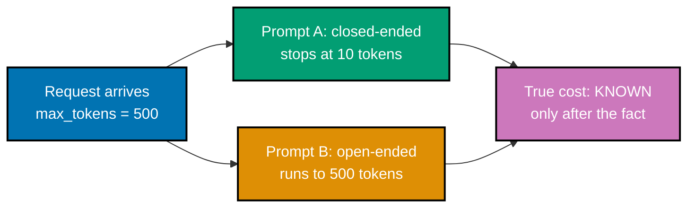
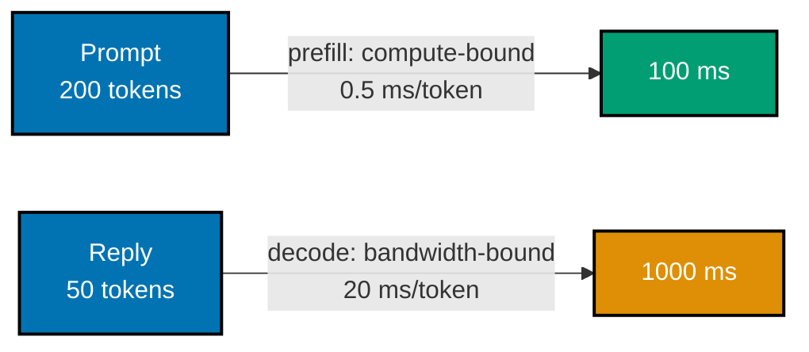
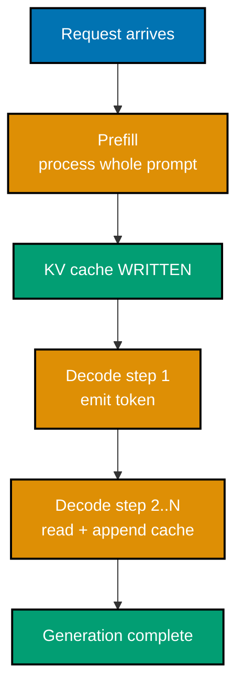
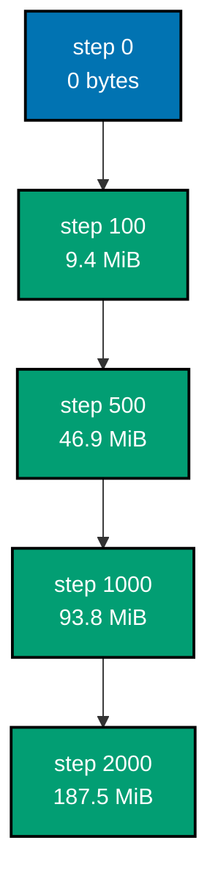
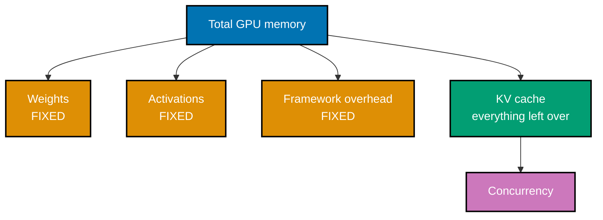
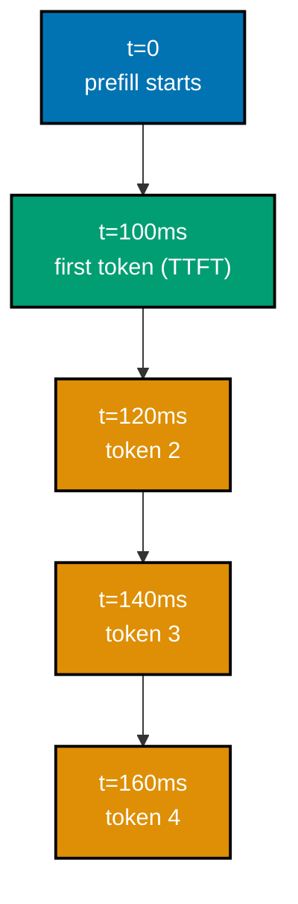
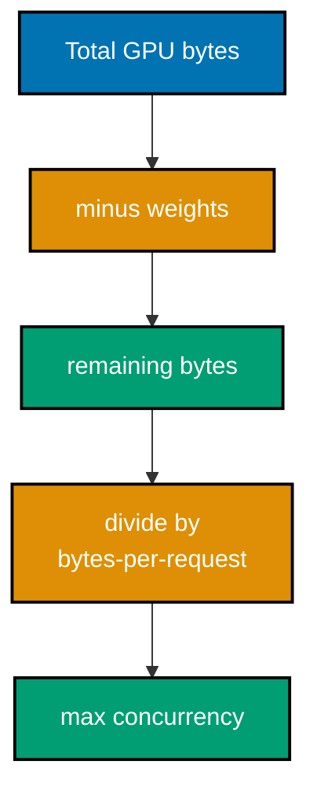
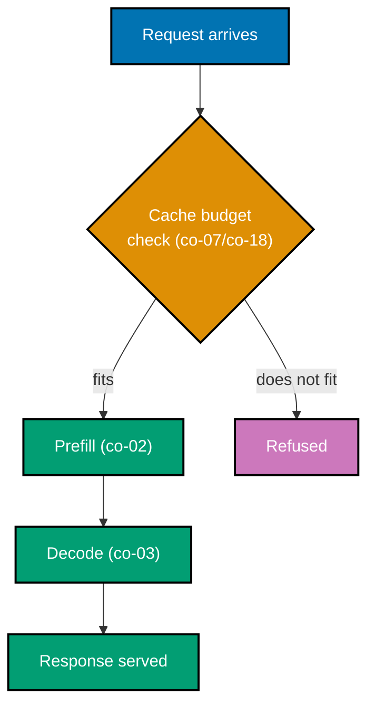

Examples 1-28 build the mental model an engineer who has only called a hosted model API is missing:
the prefill/decode split, why decode is memory-bandwidth-bound, why the KV cache exists and how big it
gets, why cache -- not compute -- usually gates how many requests a GPU can serve at once, and the
four-metric vocabulary this topic uses to talk about latency. Every example is a complete,
self-contained `.py` file colocated under `learning/code/`; run each one with `python3 example.py`
from inside its own directory. No example in this topic requires a GPU.

---

### Example 1: Serve a Model Locally

_ex-01 &middot; exercises co-01, co-24_

Standing up a model behind a completion endpoint is the concrete starting point for everything else in
this topic: a handler function accepts a prompt and a token budget, and returns generated text plus
the token accounting a real server would report. This example stands one up in-process -- deterministic,
no GPU, no download -- so the request/response shape is visible before anything about scheduling or
memory enters the picture.

**`learning/code/ex-01-serve-a-model-locally/example.py`**

```python
"""Example 1: Serve a Model Locally."""


class TinyModel:  # => a stand-in for a real served model -- deterministic, no GPU or download needed
    def __init__(self) -> None:  # => sets up fixed, deterministic model state -- no randomness anywhere
        self.vocab: list[str] = ["the", "cat", "sat", "on", "a", "mat"]  # => fixed 6-token vocabulary
        self.weights_bytes: int = 2_000_000_000  # => co-24: weights are part of the deployed artefact

    def generate(self, prompt: str, max_tokens: int) -> list[str]:  # => the served model's ONE job
        prompt_words = prompt.split()  # => co-01: split on whitespace -- a stand-in for real tokenization
        # => a trivial DETERMINISTIC "generation": echo the prompt, then pad from a fixed vocabulary
        padding = (self.vocab * 2)[: max(0, max_tokens - len(prompt_words))]  # => repeats vocab so slicing never runs dry
        return (prompt_words + padding)[:max_tokens]  # => same input -> same output, every single time


def handle_completion_request(model: TinyModel, prompt: str, max_tokens: int) -> dict[str, object]:
    # => co-01/co-24: this function IS the served HTTP endpoint's handler, minus the socket
    prompt_tokens = len(prompt.split())  # => co-01: tokens counted, not characters and not requests
    completion = model.generate(prompt, max_tokens)  # => the actual served computation happens here
    return {  # => building the response payload the client actually receives
        "text": " ".join(completion),  # => what a client sees in the HTTP response body
        "prompt_tokens": prompt_tokens,  # => co-01: billed/measured in tokens, never bytes or requests
        "completion_tokens": len(completion),  # => co-01: the OTHER billed dimension -- output tokens
    }  # => end of the response dict


model = TinyModel()  # => "loading" the model -- a real server reads weights_bytes off disk right here
response = handle_completion_request(model, prompt="a cat", max_tokens=5)  # => collapses a client request to a call
print(response["text"])  # => Output: a cat the cat sat
print(response["prompt_tokens"], response["completion_tokens"])  # => Output: 2 5

assert response["text"] == "a cat the cat sat"  # => confirms deterministic generation
assert response["prompt_tokens"] == 2  # => "a cat" is two whitespace-split tokens
assert response["completion_tokens"] == 5  # => exactly max_tokens, as requested
print("ex-01 OK")  # => a self-check marker, confirming all three assertions above held

```

**Run**: `python3 example.py`

**Output**:

```text
a cat the cat sat
2 5
ex-01 OK
```

**Key takeaway**: A served model is a function from `(prompt, max_tokens)` to generated text plus token
counts -- everything this topic adds from here is about what makes that function slow, expensive, or
impossible to run concurrently at scale.

**Why it matters**: Every serving framework, from a five-line Flask wrapper to vLLM, implements exactly
this contract underneath its HTTP layer. Understanding the handler itself -- before any scheduler,
cache, or batching logic exists -- is what makes every later addition legible as "one more thing this
handler now has to account for," rather than opaque framework magic.

---

### Example 2: Token Is the Unit of Work

_ex-02 &middot; exercises co-01_

Request count is a meaningless load unit for a model server: two workloads with identical request
counts can differ by 50x in real cost, because the unit of work is the **token**, not the request.
This example prices two five-request workloads that only differ in reply length.

**`learning/code/ex-02-token-is-the-unit-of-work/example.py`**

```python
"""Example 2: Token Is the Unit of Work."""

DECODE_COST_PER_TOKEN_MS = 20.0  # => co-01: a fixed per-token cost, independent of "which" request
# => this constant models real decode latency: bigger models cost more per token, but the SHAPE
# => of the cost curve (linear in tokens) holds regardless of the specific per-token constant


def estimate_cost_ms(tokens_per_request: list[int]) -> float:  # => co-01: cost as a function of tokens
    total_tokens = sum(tokens_per_request)  # => the TRUE unit of work -- not the request count
    return total_tokens * DECODE_COST_PER_TOKEN_MS  # => cost scales with TOKENS, never request count


# => Two workloads with the IDENTICAL request count (5 each) but wildly different token counts
short_workload = [10, 10, 10, 10, 10]  # => 5 requests, 50 tokens total
long_workload = [500, 500, 500, 500, 500]  # => 5 requests, 2500 tokens total

short_cost = estimate_cost_ms(short_workload)  # => same function, same formula, different input size
long_cost = estimate_cost_ms(long_workload)  # => the ONLY difference between these two calls is tokens
print(len(short_workload), len(long_workload))  # => Output: 5 5 -- SAME request count
print(short_cost, long_cost)  # => Output: 1000.0 50000.0 -- WILDLY different real cost

assert len(short_workload) == len(long_workload)  # => request count alone says "identical load"
assert long_cost == short_cost * 50  # => but token-measured cost says otherwise, by 50x
print("ex-02 OK")  # => a self-check marker, confirming the assertions above held

```

**Run**: `python3 example.py`

**Output**:

```text
5 5
1000.0 50000.0
ex-02 OK
```

**Key takeaway**: Always price and capacity-plan a serving workload in tokens, never in requests --
two workloads that look identical by request count can be 50x apart in real GPU cost.

**Why it matters**: Capacity planning tools that alert on "requests per second" alone are measuring the
wrong axis for a token-based service, the same way a shipping company that only counts packages and
never weighs them cannot predict fuel cost. This mistake recurs throughout the topic -- co-21's
capacity planning and co-22's load testing both fail the moment they silently substitute request count
for token count.

---

### Example 3: Unknown Cost on Arrival

_ex-03 &middot; exercises co-01, co-21_

Two requests with an identical `max_tokens` ceiling can produce wildly different actual output lengths
-- the server cannot know a request's true cost until generation finishes. This example simulates two
prompts that look equally sized on arrival but diverge by 50x in actual tokens emitted.



**`learning/code/ex-03-unknown-cost-on-arrival/example.py`**

```python
"""Example 3: Unknown Cost on Arrival."""

from dataclasses import dataclass  # => stdlib only -- no external dependency needed for this shape

# => a request is a piece of DATA the server receives, distinct from the WORK it will cause


@dataclass
class Request:  # => what the server sees the MOMENT a request arrives
    prompt: str  # => the input text -- fully known at arrival time
    max_tokens: int  # => an UPPER bound the client sets -- not the actual length the model will emit


def simulate_actual_output_length(prompt: str, max_tokens: int) -> int:
    # => co-21: the TRUE output length depends on when the model emits an end-of-sequence token,
    # => modeled here as prompt-dependent -- NOT knowable from the request alone at admission time
    if "explain" in prompt.lower():  # => an open-ended prompt tends to run long
        return min(max_tokens, 500)  # => still capped by the client's own upper bound
    return min(max_tokens, 10)  # => a closed-ended prompt tends to stop early


request_a = Request(prompt="Summarize: cats are mammals.", max_tokens=500)  # => looks unremarkable
request_b = Request(prompt="Explain photosynthesis in depth.", max_tokens=500)  # => looks the same too

actual_a = simulate_actual_output_length(request_a.prompt, request_a.max_tokens)  # => resolved AFTER the fact
actual_b = simulate_actual_output_length(request_b.prompt, request_b.max_tokens)  # => same function, same shape
print(request_a.max_tokens, request_b.max_tokens)  # => Output: 500 500 -- identical UPPER bound
print(actual_a, actual_b)  # => Output: 10 500 -- wildly different ACTUAL cost

assert request_a.max_tokens == request_b.max_tokens  # => the request alone gives no hint
assert actual_a != actual_b  # => co-21: true cost is only known AFTER generation finishes
print("ex-03 OK")  # => a self-check marker confirming both assertions held

```

**Run**: `python3 example.py`

**Output**:

```text
500 500
10 500
ex-03 OK
```

**Key takeaway**: `max_tokens` is a ceiling a client sets, not a cost estimate the server can trust --
admission decisions and capacity plans that treat it as the expected cost will be wrong on exactly the
requests that matter most.

**Why it matters**: This single fact is why co-21's capacity planning must model a length
**distribution**, not a point estimate, and why co-13's admission control cannot simply "know" whether
a request will fit before running it. A queueing system for a service whose per-item cost is a random
variable is a fundamentally different design problem than one where every item costs the same, and
almost every serving decision in this topic traces back to that difference.

---

### Example 4: Measure Prefill

_ex-04 &middot; exercises co-02_

Prefill processes the entire prompt in one parallel, compute-bound pass, so its cost scales with prompt
length. This example uses a deterministic cost model (not a wall-clock timer, so results are
reproducible) to confirm that a 40x longer prompt costs exactly 40x more to prefill.

**`learning/code/ex-04-measure-prefill/example.py`**

```python
"""Example 4: Measure Prefill."""

PREFILL_MS_PER_TOKEN = 0.5  # => co-02: prefill is compute-bound and processes the WHOLE prompt at once
# => this one constant is why long prompts front-load latency BEFORE the first token ever appears


def simulate_prefill_ms(prompt_tokens: int) -> float:  # => a deterministic stand-in for a real timer
    return prompt_tokens * PREFILL_MS_PER_TOKEN  # => co-02: cost scales with prompt length


short_prompt_ms = simulate_prefill_ms(50)  # => a 50-token prompt
long_prompt_ms = simulate_prefill_ms(2000)  # => a 2000-token prompt, 40x longer
print(short_prompt_ms, long_prompt_ms)  # => Output: 25.0 1000.0 -- same formula, 40x the input

assert long_prompt_ms == short_prompt_ms * 40  # => co-02: cost scales LINEARLY with prompt length
assert long_prompt_ms > short_prompt_ms  # => longer prompt, more prefill work, no exceptions
print("ex-04 OK")  # => a self-check marker confirming both assertions held

```

**Run**: `python3 example.py`

**Output**:

```text
25.0 1000.0
ex-04 OK
```

**Key takeaway**: Prefill cost is a direct, linear function of prompt length -- a 40x longer prompt
costs 40x more to prefill, with no other variable involved.

**Why it matters**: This is exactly why long system prompts and long retrieved context are not free,
even before a single output token is generated -- co-10's prefix sharing exists specifically to avoid
re-paying this cost for a prompt prefix multiple requests already share, and co-27's chunked prefill
exists because a single very long prefill can stall every other request's decode step in its way.

---

### Example 5: Measure Decode

_ex-05 &middot; exercises co-03_

Decode emits one token per step, and each step's cost stays roughly constant regardless of how long the
generation has already run -- the total cost scales with output length, but the **per-token** cost does
not. This example confirms both halves of that claim on the same simulator.

**`learning/code/ex-05-measure-decode/example.py`**

```python
"""Example 5: Measure Decode."""

DECODE_MS_PER_TOKEN = 20.0  # => co-03: decode emits ONE token per step -- a fixed per-step cost
# => unlike prefill (Example 4), decode cost is NOT front-loaded -- it accrues one step at a time


def simulate_decode_ms(output_tokens: int) -> float:  # => total decode time for a full generation
    return output_tokens * DECODE_MS_PER_TOKEN  # => co-03: total cost scales with output length


def simulate_per_token_ms(output_tokens: int) -> float:  # => the PER-TOKEN cost, not the total
    return simulate_decode_ms(output_tokens) / output_tokens  # => normalizing out length reveals the constant


ten_tokens_total = simulate_decode_ms(10)  # => a short generation
thousand_tokens_total = simulate_decode_ms(1000)  # => a generation 100x longer
print(ten_tokens_total, thousand_tokens_total)  # => Output: 200.0 20000.0 -- scales with length

per_token_short = simulate_per_token_ms(10)  # => same formula, normalized
per_token_long = simulate_per_token_ms(1000)  # => same formula, normalized, different length
print(per_token_short, per_token_long)  # => Output: 20.0 20.0 -- NEAR-CONSTANT per-token cost

assert per_token_short == per_token_long  # => co-03: per-token cost stays flat regardless of length
assert thousand_tokens_total == ten_tokens_total * 100  # => but TOTAL cost scales with token count
print("ex-05 OK")  # => a self-check marker confirming both assertions held

```

**Run**: `python3 example.py`

**Output**:

```text
200.0 20000.0
20.0 20.0
ex-05 OK
```

**Key takeaway**: Decode's per-token cost is roughly constant, so a generation's total latency is
almost entirely a function of how many tokens it emits -- there is no shortcut that makes token 900
cheaper than token 9.

**Why it matters**: This constant per-step cost is the direct evidence for co-04's bandwidth-bound
claim: if decode were compute-bound like prefill, a longer generation would get relatively cheaper per
token as the GPU's pipelines filled up, the way prefill's parallel pass does. It does not -- every step
pays the same toll, which is the fingerprint of a memory-bandwidth ceiling rather than a compute one.

---

### Example 6: Prefill vs Decode Profile

_ex-06 &middot; exercises co-02, co-03_

Combining Examples 4 and 5 on one request shows the two phases behave differently within a single
generation: prefill's cost tracks input length, decode's tracks output length, and neither formula
depends on the other.



**`learning/code/ex-06-prefill-vs-decode-profile/example.py`**

```python
"""Example 6: Prefill vs Decode Profile."""

PREFILL_MS_PER_TOKEN = 0.5  # => co-02: one compute-bound pass over the whole prompt
DECODE_MS_PER_TOKEN = 20.0  # => co-03: one memory-bandwidth-bound step per output token
# => same request, two DIFFERENT cost regimes -- neither number alone tells the whole story


def profile_request(prompt_tokens: int, output_tokens: int) -> dict[str, float]:
    prefill_ms = prompt_tokens * PREFILL_MS_PER_TOKEN  # => co-02: scales with INPUT length
    decode_ms = output_tokens * DECODE_MS_PER_TOKEN  # => co-03: scales with OUTPUT length
    return {"prefill_ms": prefill_ms, "decode_ms": decode_ms, "total_ms": prefill_ms + decode_ms}
    # => total is a simple sum, but the two summands have very different sensitivities


profile = profile_request(prompt_tokens=200, output_tokens=50)  # => a 200-token prompt, 50-token reply
print(profile["prefill_ms"], profile["decode_ms"])  # => Output: 100.0 1000.0 -- decode dominates here

assert profile["prefill_ms"] == 100.0  # => 200 tokens * 0.5 ms/token -- a SINGLE parallel pass
assert profile["decode_ms"] == 1000.0  # => 50 tokens * 20 ms/token -- 50 SEQUENTIAL steps
assert profile["decode_ms"] > profile["prefill_ms"]  # => co-02/co-03: the two phases behave differently
# => this same split -- one parallel pass, then many sequential steps -- recurs throughout this topic
print("ex-06 OK")  # => a self-check marker confirming all three assertions held

```

**Run**: `python3 example.py`

**Output**:

```text
100.0 1000.0
ex-06 OK
```

**Key takeaway**: Even with a prompt 4x longer than the reply (200 vs 50 tokens), decode still costs
10x more wall-clock time than prefill -- length alone does not predict which phase dominates a
request's latency.

**Why it matters**: This asymmetry is why hardware and configuration tuned purely around prefill
throughput (large batches, big matrix multiplies) is the wrong shape for decode, and vice versa --
every production serving stack has to reconcile a compute-bound phase and a bandwidth-bound phase
sharing the same device, which is the root cause of most of this topic's scheduling complexity.

---

### Example 7: Bandwidth-Bound Demonstration

_ex-07 &middot; exercises co-04, co-03_

Increasing batch size raises decode's aggregate throughput only up to a point, then flattens --
the signature of a memory-bandwidth ceiling rather than a compute one. This example sweeps batch size
and shows throughput saturating at a fixed ceiling.

**`learning/code/ex-07-bandwidth-bound-demonstration/example.py`**

```python
"""Example 7: Bandwidth-Bound Demonstration."""

BASE_TOKENS_PER_SEC_PER_SLOT = 50.0  # => co-04: each concurrent sequence adds this many tokens/sec...
BANDWIDTH_CEILING_TOKENS_PER_SEC = 400.0  # => ...until the GPU's memory bandwidth is fully saturated
# => two constants, one min() -- this IS the entire bandwidth-bound-decode model in miniature


def aggregate_throughput(batch_size: int) -> float:  # => co-04: models the bandwidth-bound ceiling
    naive = batch_size * BASE_TOKENS_PER_SEC_PER_SLOT  # => what throughput WOULD be with no ceiling
    return min(naive, BANDWIDTH_CEILING_TOKENS_PER_SEC)  # => co-04: bandwidth caps it, compute does not


throughputs = [aggregate_throughput(b) for b in (1, 2, 4, 8, 16)]  # => co-03: batch sizes tried
print(throughputs)  # => Output: [50.0, 100.0, 200.0, 400.0, 400.0] -- flattens out, does not keep climbing

assert throughputs[3] == BANDWIDTH_CEILING_TOKENS_PER_SEC  # => batch=8 already hits the ceiling
assert throughputs[4] == throughputs[3]  # => co-04: doubling batch size AGAIN buys nothing more
print("ex-07 OK")  # => a self-check marker confirming the ceiling behavior held

```

**Run**: `python3 example.py`

**Output**:

```text
[50.0, 100.0, 200.0, 400.0, 400.0]
ex-07 OK
```

**Key takeaway**: Batching more sequences together raises aggregate decode throughput by letting each
weight read serve multiple sequences at once -- but only until memory bandwidth saturates, after which
more batching buys nothing.

**Why it matters**: This ceiling is exactly why continuous batching (co-12) is valuable up to a batch
size and not infinitely valuable beyond it, and why co-15's throughput-versus-latency tension has a
real physical floor: past the bandwidth ceiling, the only way to serve more load is more GPUs, not a
cleverer batch size.

---

### Example 8: Request Lifecycle -- the Phase Diagram

_ex-08 &middot; exercises co-02, co-03, co-05_

A request's lifecycle is prefill exactly once, followed by one decode step per output token, with the
KV cache written during prefill and extended on every decode step. This example traces one request's
phases explicitly and confirms the cache is populated before decode ever begins.



**`learning/code/ex-08-phase-diagram/example.py`**

```python
"""Example 8: Request Lifecycle -- Phase Diagram in Code."""

from dataclasses import dataclass, field  # => stdlib only -- tracing phases needs no framework

# => a trace object exists SOLELY to make an otherwise-invisible lifecycle observable in a test
# => real servers emit this same information as structured logs or tracing spans, not print()


@dataclass
class RequestTrace:  # => records which phases a single request actually passed through
    phases: list[str] = field(default_factory=list[str])  # => explicit generic keeps type-checking strict
    cache_written: bool = False  # => flips true the instant prefill writes the KV cache


def run_request(trace: RequestTrace, output_tokens: int) -> None:  # => simulates one request's full lifecycle
    trace.phases.append("prefill")  # => co-02: phase 1 -- process the whole prompt at once
    trace.cache_written = True  # => co-05: prefill WRITES the KV cache -- this is where it's populated
    for _ in range(output_tokens):  # => co-03: phase 2 -- one decode step per output token
        trace.phases.append("decode")  # => each step both READS and APPENDS to the cache (co-05)


trace = RequestTrace()  # => starts empty: no phases recorded, cache not yet written
run_request(trace, output_tokens=3)  # => exactly one prefill call, then three decode steps
print(trace.phases)  # => Output: ['prefill', 'decode', 'decode', 'decode']
print(trace.cache_written)  # => Output: True

assert trace.phases[0] == "prefill"  # => co-02: prefill always happens first, exactly once
# => this ordering is not incidental -- a decode step needs SOMETHING in the cache to read
assert trace.phases.count("decode") == 3  # => co-03: one decode step per requested output token
assert trace.cache_written is True  # => co-05: the cache exists because prefill wrote into it
print("ex-08 OK")  # => a self-check marker confirming every phase-ordering assertion held

```

**Run**: `python3 example.py`

**Output**:

```text
['prefill', 'decode', 'decode', 'decode']
True
ex-08 OK
```

**Key takeaway**: Every request's lifecycle is exactly one prefill followed by N decode steps, and the
KV cache exists because prefill populated it -- decode has nothing to read from without that first
step.

**Why it matters**: Seeing the lifecycle explicitly is what makes the rest of this topic's vocabulary
click into place: "time to first token" (co-16) is the instant prefill finishes and the first decode
step returns, and every subsequent example's scheduling and cache-management logic is really just
policy layered on top of this exact two-phase shape.

---

### Example 9: No-Cache Recomputation

_ex-09 &middot; exercises co-05_

Without a cache, computing attention at each new step requires re-scanning every previous token, giving
a total cost that grows quadratically with sequence length. This example measures that growth directly.

**`learning/code/ex-09-no-cache-recomputation/example.py`**

```python
"""Example 9: No-Cache Recomputation."""


def attention_cost_without_cache(seq_len: int) -> int:  # => co-05: cost of recomputing attention from scratch
    # => at step t, attention scans ALL t previous tokens; summed over t=1..seq_len, that's O(n^2)
    return sum(range(1, seq_len + 1))  # => 1 + 2 + ... + seq_len -- the quadratic sum


cost_10 = attention_cost_without_cache(10)  # => 55
cost_20 = attention_cost_without_cache(20)  # => 210 (double the length)
print(cost_10, cost_20)  # => Output: 55 210

ratio = cost_20 / cost_10  # => the RATIO is the tell -- a linear cost would give exactly 2.0 here
print(round(ratio, 2))  # => Output: 3.82 -- doubling length nearly QUADRUPLES cost, not doubles it

assert cost_20 > cost_10 * 2  # => co-05: growth outpaces linear -- this is the quadratic blowup
assert ratio > 3.5  # => close to 4x, the signature of O(n^2) under a doubled input
print("ex-09 OK")  # => a self-check marker confirming the quadratic-growth assertions held

```

**Run**: `python3 example.py`

**Output**:

```text
55 210
3.82
ex-09 OK
```

**Key takeaway**: Without a cache, doubling sequence length nearly quadruples attention's total cost --
recomputation is quadratic, not linear, in how far a generation has already run.

**Why it matters**: This is the exact cost the KV cache exists to eliminate (Example 10) -- without it,
every serving framework's per-token cost would grow the longer a generation ran, making long outputs
disproportionately, and eventually prohibitively, expensive.

---

### Example 10: Add the KV Cache

_ex-10 &middot; exercises co-05_

Caching each token's key and value tensors turns per-step attention cost from an O(t) rescan into O(1)
work against already-computed history, making the total cost linear instead of quadratic. This example
contrasts the cached and uncached costs directly, on the same sequence length.

**`learning/code/ex-10-add-the-kv-cache/example.py`**

```python
"""Example 10: Add the KV Cache."""


def attention_cost_with_cache(seq_len: int) -> int:  # => co-05: each NEW token does O(1) work with a cache
    # => the cache already holds every PREVIOUS token's key/value -- only the new token is processed
    return seq_len  # => O(n) total: one constant-cost step per token, not one O(t) scan per token


def attention_cost_without_cache(seq_len: int) -> int:  # => same formula as Example 9, for comparison
    return sum(range(1, seq_len + 1))  # => O(n^2) total -- every step rescans everything from scratch


seq_len = 20  # => same sequence length fed to both cost functions, for an apples-to-apples comparison
cached_cost = attention_cost_with_cache(seq_len)  # => the cache-backed path
uncached_cost = attention_cost_without_cache(seq_len)  # => the no-cache path, same input
print(cached_cost, uncached_cost)  # => Output: 20 210

assert cached_cost == seq_len  # => co-05: linear in sequence length, not quadratic
assert cached_cost < uncached_cost  # => the SAME final attention result, far cheaper to reach
print("ex-10 OK")  # => a self-check marker confirming the cache/no-cache comparison held

```

**Run**: `python3 example.py`

**Output**:

```text
20 210
ex-10 OK
```

**Key takeaway**: The KV cache converts attention's per-token cost from O(t) to O(1), collapsing total
generation cost from quadratic to linear in sequence length -- at the price of memory to hold the
cache, which is the entire subject of the next several examples.

**Why it matters**: This is the trade every serving framework makes without exception: pay memory,
save recomputation. It is also why the cache -- not the model's raw compute throughput -- becomes the
resource that actually limits how many requests a GPU can serve, which co-06 through co-14 unpack in
full.

---

### Example 11: Compute Cache Size

_ex-11 &middot; exercises co-06_

The KV cache's size is a direct formula: two tensors (key and value) per layer, per attention head, per
dimension, per token, at a given numeric precision. This example computes it for one worked model
configuration and cross-checks the arithmetic by hand.

**`learning/code/ex-11-compute-cache-size/example.py`**

```python
"""Example 11: Compute Cache Size."""


def kv_cache_bytes(
    num_layers: int,  # => depth of the transformer stack -- more layers, more K/V pairs to store
    num_heads: int,  # => attention heads within each layer -- one K/V pair PER head
    head_dim: int,  # => the size of ONE head's key or value vector
    seq_len: int,  # => tokens processed so far -- this is the dimension that GROWS during decode
    bytes_per_value: int,  # => precision width: 2 for fp16/bf16, 1 for int8, 4 for fp32
    batch_size: int = 1,  # => defaults to a single sequence -- scale up for concurrent requests
) -> int:  # => co-06: the formula every capacity decision in this topic reduces to
    # => 2x for K AND V, one value per (layer, head, dim, token), times batch and precision width
    return 2 * num_layers * num_heads * head_dim * seq_len * bytes_per_value * batch_size
    # => six multiplied factors -- change ANY one and the byte count moves proportionally


small_model_cache = kv_cache_bytes(  # => one worked configuration, used throughout this topic
    num_layers=24,  # => transformer depth -- one K/V pair stored PER layer
    num_heads=16,  # => attention heads -- one K/V pair stored PER head
    head_dim=64,  # => per-head dimensionality -- part of the "one value" unit above
    seq_len=2048,  # => co-06: cache size grows with EVERY token processed so far
    bytes_per_value=2,  # => fp16 == 2 bytes/value
)  # => closes the call -- five dimensions multiplied together produce one byte count
print(small_model_cache)  # => Output: 201326592
# => 192 MiB is the cost of ONE 2048-token sequence, before a single OTHER request is admitted
print(small_model_cache / (1024**2))  # => Output: 192.0 -- expressed in mebibytes

assert small_model_cache == 2 * 24 * 16 * 64 * 2048 * 2  # => the formula, spelled out, matches exactly
assert small_model_cache / (1024**2) == 192.0  # => 192 MiB of cache for ONE 2048-token sequence
print("ex-11 OK")  # => a self-check marker confirming the formula and its unit conversion held

```

**Run**: `python3 example.py`

**Output**:

```text
201326592
192.0
ex-11 OK
```

**Key takeaway**: `2 * layers * heads * head_dim * seq_len * bytes_per_value` is the formula behind
every KV cache size claim in this topic -- one 2048-token sequence on this worked configuration costs
192 MiB, before a single other request is admitted.

**Why it matters**: This is the arithmetic every later capacity decision reduces to: co-07's "cache is
the scarce resource," co-13's admission ceiling, and co-18's memory budget are all downstream
consequences of this one formula. An engineer who cannot reproduce this calculation cannot reason about
serving capacity at all -- everything else in this topic is policy built on top of this number.

---

### Example 12: Cache Growth Over a Generation

_ex-12 &middot; exercises co-06, co-07_

A request's cache grows by a fixed amount on every decode step, so occupancy over the course of one
generation is a straight line, not a curve. This example samples occupancy at several points in a
generation and confirms the growth rate is constant.



**`learning/code/ex-12-cache-growth-over-a-generation/example.py`**

```python
"""Example 12: Cache Growth Over a Generation."""

BYTES_PER_TOKEN = 98304  # => co-06: a fixed per-token cache cost for one worked model configuration
# => this is Example 11's kv_cache_bytes() formula collapsed to "bytes per ONE additional token"
# => holding num_layers, num_heads, head_dim, and precision fixed while step count varies


def cache_bytes_at_step(step: int) -> int:  # => co-07: cache is the scarce, GROWING resource
    return step * BYTES_PER_TOKEN  # => co-06: grows LINEARLY, one token's worth per decode step


occupancy = [cache_bytes_at_step(s) for s in (0, 100, 500, 1000, 2000)]  # => sampled generation steps
print(occupancy)  # => Output: [0, 9830400, 49152000, 98304000, 196608000]

deltas = [occupancy[i + 1] - occupancy[i] for i in range(len(occupancy) - 1)]  # => growth per interval
print(deltas[0] == 100 * BYTES_PER_TOKEN)  # => Output: True -- linear: same rate at every interval

assert occupancy[0] == 0  # => an empty generation has written nothing to the cache yet
assert occupancy[-1] == 2000 * BYTES_PER_TOKEN  # => co-06: cache size IS step count times per-token cost
print("ex-12 OK")  # => a self-check marker confirming the linear growth rate held at every interval

```

**Run**: `python3 example.py`

**Output**:

```text
[0, 9830400, 49152000, 98304000, 196608000]
True
ex-12 OK
```

**Key takeaway**: A single request's cache footprint grows linearly and predictably with its own
generation length -- the unpredictability in capacity planning comes entirely from **not knowing the
final length in advance** (Example 3), not from any irregularity in the growth itself.

**Why it matters**: This predictable-growth-but-unknown-endpoint combination is exactly what makes
admission control (co-13) and preemption (co-14) necessary: a scheduler can track exactly how much
cache a running request is consuming at any instant, but cannot know how much more it will need before
it finishes.

---

### Example 13: Concurrency Limited by Cache

_ex-13 &middot; exercises co-07, co-18_

Cache -- not compute -- usually sets the ceiling on how many requests a GPU can serve simultaneously.
This example simulates an admission gate that refuses new requests purely on cache-budget grounds and
confirms it stops admitting at exactly the arithmetic predicts.

**`learning/code/ex-13-concurrency-limited-by-cache/example.py`**

```python
"""Example 13: Concurrency Limited by Cache."""

CACHE_BUDGET_BYTES = 2_000_000_000  # => co-18: what's LEFT after weights, for cache -- the whole budget here
BYTES_PER_REQUEST = 400_000_000  # => co-06: one request's steady-state cache footprint
# => same shape as Example 11's formula, collapsed to a single per-request constant


class AdmissionSimulator:  # => co-07: the cache is what actually gates admission, not compute
    def __init__(self, budget_bytes: int, bytes_per_request: int) -> None:  # => wires the two constants in
        self.budget_bytes = budget_bytes  # => the hard ceiling -- never grows during a run
        self.bytes_per_request = bytes_per_request  # => assumed uniform across requests, for simplicity
        self.admitted: int = 0  # => how many requests are CURRENTLY holding cache

    def try_admit(self) -> bool:  # => co-07: admission succeeds only while cache budget allows it
        if (self.admitted + 1) * self.bytes_per_request > self.budget_bytes:  # => would this exceed budget?
            return False  # => refused -- not enough cache left, regardless of spare compute
        self.admitted += 1  # => only increments on the SUCCESS path -- refusals leave state untouched
        return True  # => accepted -- the budget check above already proved this fits


sim = AdmissionSimulator(CACHE_BUDGET_BYTES, BYTES_PER_REQUEST)  # => one simulator, one fixed budget
results = [sim.try_admit() for _ in range(7)]  # => try to admit 7 requests in a row
print(results)  # => Output: [True, True, True, True, True, False, False]
print(sim.admitted)  # => Output: 5

assert sim.admitted == 5  # => co-18: 2_000_000_000 // 400_000_000 == 5 -- the arithmetic sets the ceiling
assert results[5] is False  # => co-07: the 6th request is refused -- cache, not compute, is the gate
print("ex-13 OK")  # => a self-check marker confirming the admission ceiling held exactly at 5

```

**Run**: `python3 example.py`

**Output**:

```text
[True, True, True, True, True, False, False]
5
ex-13 OK
```

**Key takeaway**: A GPU with plenty of spare compute still refuses new work once its cache budget is
exhausted -- concurrency is a memory-scheduling problem, not a compute-scheduling one.

**Why it matters**: This is the concrete mechanism behind the syllabus-level claim that "cache is the
scarce resource": an engineer who only monitors GPU compute utilization while ignoring cache occupancy
is watching the wrong dashboard, and will be surprised the moment admissions start failing while
compute utilization looks nowhere near 100%.

---

### Example 14: Memory Budget Breakdown

_ex-14 &middot; exercises co-18_

A GPU's total memory divides into weights, activations, framework overhead, and whatever remains for
the KV cache -- and only that remainder buys concurrency. This example accounts all four consumers
against a stated total and derives the maximum concurrent requests from what is left over.

**`learning/code/ex-14-memory-budget-breakdown/example.py`**

```python
"""Example 14: Memory Budget Breakdown."""

GPU_TOTAL_BYTES = 80 * 1024**3  # => a stated total budget -- co-18: everything must fit inside this
WEIGHTS_BYTES = 14 * 1024**3  # => the served model's fixed weight footprint
ACTIVATIONS_BYTES = 4 * 1024**3  # => scratch space used DURING a forward pass
FRAMEWORK_OVERHEAD_BYTES = 2 * 1024**3  # => the serving framework's own fixed memory cost
BYTES_PER_REQUEST_CACHE = 2 * 1024**3  # => co-06: one request's KV cache footprint
# => four FIXED consumers plus one PER-REQUEST consumer -- this split is the whole capacity story


def remaining_for_cache(total: int, weights: int, activations: int, overhead: int) -> int:  # => co-18
    return total - weights - activations - overhead  # => whatever is left is the ONLY budget for cache


cache_budget = remaining_for_cache(  # => subtract every fixed consumer from the total, in order
    GPU_TOTAL_BYTES,  # => the starting budget, before anything is subtracted
    WEIGHTS_BYTES,  # => first fixed consumer -- the served model itself
    ACTIVATIONS_BYTES,  # => second fixed consumer -- forward-pass scratch space
    FRAMEWORK_OVERHEAD_BYTES,  # => third fixed consumer -- the serving framework's own cost
)  # => closes the call -- one subtraction chain, four fixed consumers
# => whatever survives all four subtractions is the ONLY pool cache can ever draw from
max_concurrency = cache_budget // BYTES_PER_REQUEST_CACHE  # => co-18: the remainder buys concurrency
print(cache_budget // 1024**3)  # => Output: 60 -- GiB left over for cache after the fixed consumers
print(max_concurrency)  # => Output: 30 -- floor division: partial capacity for one more request is wasted

assert cache_budget == 60 * 1024**3  # => 80 - 14 - 4 - 2 == 60 GiB left for cache
assert max_concurrency == 30  # => co-18: 60 GiB / 2 GiB-per-request == 30 concurrent requests, at most
print("ex-14 OK")  # => a self-check marker confirming the full budget breakdown held

```

**Run**: `python3 example.py`

**Output**:

```text
60
30
ex-14 OK
```

**Key takeaway**: Weights, activations, and framework overhead are fixed costs paid before a single
request is served -- only the remainder is available for cache, and only cache buys concurrency.

**Why it matters**: This is the exact calculation a capacity plan or a hardware purchase decision has
to run before anything else: a bigger model (more weight bytes) does not just cost more to load, it
directly shrinks the remainder available for concurrent requests, on the same fixed-size GPU.

---

### Example 15: The Memory Budget Diagram

_ex-15 &middot; exercises co-18, co-06_

Weights, activations, and framework overhead stay fixed as total GPU memory grows -- every additional
GiB of memory goes entirely to the cache consumer. This example scales the total budget and confirms
the cache share grows disproportionately.



**`learning/code/ex-15-budget-diagram/example.py`**

```python
"""Example 15: Memory Budget -- Scaling the Cache Portion."""

WEIGHTS_BYTES = 14 * 1024**3  # => co-18: FIXED regardless of how many requests are served
ACTIVATIONS_BYTES = 4 * 1024**3  # => FIXED -- scratch space sized by the framework, not by traffic
OVERHEAD_BYTES = 2 * 1024**3  # => FIXED -- the serving framework's own baseline cost
# => three fixed consumers subtracted from a VARYING total -- the cache share is what's left


def cache_share(total_bytes: int) -> int:  # => co-18/co-06: only the CACHE consumer scales with total
    return total_bytes - WEIGHTS_BYTES - ACTIVATIONS_BYTES - OVERHEAD_BYTES
    # => same three constants subtracted every time -- only the input total changes between calls


small_gpu = cache_share(40 * 1024**3)  # => a smaller GPU
large_gpu = cache_share(80 * 1024**3)  # => a GPU with double the total memory
# => the fixed 20 GiB overhead matters PROPORTIONALLY more on the smaller GPU
print(small_gpu // 1024**3, large_gpu // 1024**3)  # => Output: 20 60

assert large_gpu - small_gpu == (80 - 40) * 1024**3  # => co-06: every extra GiB of GPU goes STRAIGHT to cache
assert large_gpu > small_gpu * 2  # => cache share grows FASTER than total, since fixed costs don't scale
print("ex-15 OK")  # => a self-check marker confirming cache share scales super-linearly with GPU size

```

**Run**: `python3 example.py`

**Output**:

```text
20 60
ex-15 OK
```

**Key takeaway**: Doubling total GPU memory more than triples the cache budget on this configuration
(20 GiB to 60 GiB), because the fixed consumers do not grow with it -- a bigger GPU is disproportionately
more concurrency headroom, not just proportionally more.

**Why it matters**: This is the concrete reason serving teams reach for the largest GPU their budget
allows rather than scaling out with many small ones: fixed per-instance costs (loading the same weights
on every replica) are paid again on every additional small GPU, while a single larger GPU pays them
once and gives the remainder entirely to cache.

---

### Example 16: Latency Vocabulary

_ex-16 &middot; exercises co-16_

Time-to-first-token, inter-token latency, and per-user tokens-per-second are three distinct metrics
describing the same generation, and none of them can be derived from either of the others without the
full trace. This example computes all three on one worked generation.

**`learning/code/ex-16-latency-vocabulary/example.py`**

```python
"""Example 16: Latency Vocabulary."""

from dataclasses import dataclass  # => stdlib only -- no external metrics library needed for this shape

# => four names, one formula each -- confusing them is the single most common serving-latency mistake


@dataclass
class GenerationTrace:  # => co-16: the four metrics this topic uses to describe serving latency
    prefill_ms: float  # => one number -- prefill has no per-token breakdown, it is one parallel pass
    decode_step_ms: list[float]  # => one entry per emitted token


def compute_metrics(trace: GenerationTrace) -> dict[str, float]:  # => derives all four metrics from one trace
    ttft_ms = trace.prefill_ms + trace.decode_step_ms[0]  # => co-16: time to FIRST token, prefill + step 1
    inter_token_ms = sum(trace.decode_step_ms[1:]) / (len(trace.decode_step_ms) - 1)  # => avg gap AFTER token 1
    total_s = (trace.prefill_ms + sum(trace.decode_step_ms)) / 1000  # => wall-clock for this ONE request
    tokens_per_sec_per_user = len(trace.decode_step_ms) / total_s  # => co-16: THIS user's own rate
    return {  # => bundling all four so callers read one dict instead of four loose variables
        "ttft_ms": ttft_ms,  # => the metric users FEEL first -- how long until anything shows up
        "inter_token_ms": inter_token_ms,  # => the metric users feel AFTER that -- how smoothly it streams
        "tokens_per_sec_per_user": tokens_per_sec_per_user,  # => this ONE user's rate, not the fleet's
    }  # => end of the four-metric dict


trace = GenerationTrace(prefill_ms=100.0, decode_step_ms=[20.0, 20.0, 20.0, 20.0, 20.0])  # => 5 equal steps
# => equal steps here isolate the vocabulary -- real traces have UNEQUAL per-step latencies
metrics = compute_metrics(trace)  # => one call, four derived metrics
print(metrics["ttft_ms"])  # => Output: 120.0
print(metrics["inter_token_ms"])  # => Output: 20.0
print(round(metrics["tokens_per_sec_per_user"], 2))  # => Output: 25.0

assert metrics["ttft_ms"] == 120.0  # => co-16: TTFT bundles prefill AND the first decode step
assert metrics["inter_token_ms"] == 20.0  # => co-16: ITL is the steady-state per-token gap thereafter
assert metrics["ttft_ms"] != metrics["inter_token_ms"]  # => co-16: these are genuinely DIFFERENT metrics
print("ex-16 OK")  # => a self-check marker confirming all four derived metrics matched expectations

```

**Run**: `python3 example.py`

**Output**:

```text
120.0
20.0
25.0
ex-16 OK
```

**Key takeaway**: Time-to-first-token, inter-token latency, and tokens-per-second-per-user each answer
a different question about the same generation -- optimizing one does not automatically improve, and
can actively worsen, the other two.

**Why it matters**: This vocabulary is the shared language the rest of this topic uses to state tradeoffs
precisely: co-17's prefill-priority-versus-ITL tension, co-15's throughput-versus-latency frontier, and
every SLO this topic's capstone holds itself to are all expressed in these exact four terms -- an
engineer who conflates them cannot state a serving SLO precisely enough to enforce it.

---

### Example 17: Tokens vs Characters

_ex-17 &middot; exercises co-01_

Character count and token count can disagree about which of two strings is "bigger" -- a long URL has
more characters than a short sentence but tokenizes to far fewer units of work. This example measures
both on a matched pair of strings.

**`learning/code/ex-17-tokens-vs-characters/example.py`**

```python
"""Example 17: Tokens vs Characters."""


def naive_word_tokenize(text: str) -> list[str]:  # => co-01: a stand-in for a real subword tokenizer
    return text.split()  # => whitespace-split -- real tokenizers split sub-word, but the LESSON transfers


english = "The quick brown fox jumps."  # => short in tokens, short in characters too
url = "https://example.com/a/very/long/path/segment/that/keeps/going"  # => ONE "word", many characters
# => this pair is deliberately adversarial: character count and token count DISAGREE on which is bigger

english_tokens = naive_word_tokenize(english)  # => 5 whitespace-separated words
url_tokens = naive_word_tokenize(url)  # => 1 whitespace-separated "word" -- the url has no spaces
print(len(english), len(url))  # => Output: 26 61 -- url has over TWICE the characters
print(len(english_tokens), len(url_tokens))  # => Output: 5 1 -- but FEWER tokens, not more

assert len(url) > len(english)  # => character count says the url is "bigger"
assert len(url_tokens) < len(english_tokens)  # => co-01: token count -- the real cost driver -- disagrees
print("ex-17 OK")  # => a self-check marker confirming characters and tokens disagreed as predicted

```

**Run**: `python3 example.py`

**Output**:

```text
26 61
5 1
ex-17 OK
```

**Key takeaway**: Neither character count nor a naive word split reliably predicts real tokenizer
output, but the general lesson holds regardless of exactly how tokenization works: tokens, not bytes
or characters, are the unit a server actually bills and schedules against.

**Why it matters**: Client-side estimates of "how much this request will cost" that count characters
instead of calling the real tokenizer routinely mis-price requests -- this is a common, avoidable
source of surprise cost overruns in production LLM applications.

---

### Example 18: Precision Formats and Bytes

_ex-18 &middot; exercises co-18, co-19_

A weight's numeric precision directly sets its byte width in memory: fp16 and bf16 both cost 2 bytes
per value, fp32 costs 4, and int8 costs 1 -- halving byte width exactly halves memory. This example
computes both on a 7-billion-parameter model.

**`learning/code/ex-18-precision-formats-and-bytes/example.py`**

```python
"""Example 18: Precision Formats and Bytes."""

BYTES_PER_VALUE = {"fp32": 4, "fp16": 2, "bf16": 2, "int8": 1}  # => co-18/co-19: precision sets byte width
# => the SAME parameter count means very different byte counts depending on which format is chosen


def weights_bytes(num_params: int, precision: str) -> int:  # => co-18: total weight bytes at a precision
    return num_params * BYTES_PER_VALUE[precision]  # => a lookup, then a multiply -- the whole formula


num_params = 7_000_000_000  # => a 7-billion-parameter model
fp16_bytes = weights_bytes(num_params, "fp16")  # => the common serving default
int8_bytes = weights_bytes(num_params, "int8")  # => same model, quarter-width integers
print(round(fp16_bytes / 1024**3, 2), round(int8_bytes / 1024**3, 2))  # => Output: 13.04 6.52

assert fp16_bytes == num_params * 2  # => co-18: 2 bytes per parameter at fp16
assert int8_bytes == fp16_bytes // 2  # => co-19 preview: halving byte width halves memory, exactly
print("ex-18 OK")  # => a self-check marker confirming both precision-to-byte conversions held

```

**Run**: `python3 example.py`

**Output**:

```text
13.04 6.52
ex-18 OK
```

**Key takeaway**: Precision is a direct, mechanical multiplier on memory: `bytes = num_params *
bytes_per_value`, applying equally to weights (this example) and to the KV cache (Example 11).

**Why it matters**: This is the arithmetic co-19's quantization decision runs on -- every claim about
"quantization saves memory" reduces to this multiplication, which is why the memory savings are
completely predictable even when the resulting **quality** cost (Example 36) is not, and must be
measured separately.

---

### Example 19: Weights Memory Arithmetic

_ex-19 &middot; exercises co-18_

Weights are the first, non-negotiable line item in a GPU memory budget -- before any cache or
activation memory is even considered, the weights alone must fit. This example checks whether a 7B and
a 13B model, both at fp16, fit on a 24 GiB GPU.

**`learning/code/ex-19-weights-memory-arithmetic/example.py`**

```python
"""Example 19: Weights Memory Arithmetic."""


def weights_gib(num_params: int, bytes_per_param: int) -> float:  # => co-18: weights are the FIRST budget line
    return (num_params * bytes_per_param) / 1024**3  # => bytes converted straight to GiB for readability


seven_b_fp16 = weights_gib(7_000_000_000, 2)  # => a mid-size model at the common serving precision
thirteen_b_fp16 = weights_gib(13_000_000_000, 2)  # => nearly double the parameters, same precision
print(round(seven_b_fp16, 1), round(thirteen_b_fp16, 1))  # => Output: 13.0 24.2

gpu_total_gib = 24.0  # => a common consumer/workstation GPU size
remaining_after_7b = gpu_total_gib - seven_b_fp16  # => co-18: weights are ALWAYS subtracted FIRST
remaining_after_13b = gpu_total_gib - thirteen_b_fp16  # => same subtraction, bigger model
print(round(remaining_after_7b, 1), round(remaining_after_13b, 1))  # => Output: 11.0 -0.2

assert remaining_after_7b > 0  # => co-18: the 7B model leaves headroom for cache and activations
assert remaining_after_13b < 0  # => co-18: the 13B model does NOT fit at all at fp16 on this GPU
# => quantizing to int8 (Example 18) would roughly halve this weight footprint
print("ex-19 OK")  # => a self-check marker confirming one model fits and the other does not

```

**Run**: `python3 example.py`

**Output**:

```text
13.0 24.2
11.0 -0.2
ex-19 OK
```

**Key takeaway**: "Does the model fit" is a strictly earlier and simpler question than "how much
concurrency does it buy" -- the 13B model fails the first question outright, at fp16, on a 24 GiB GPU,
before cache arithmetic even enters the picture.

**Why it matters**: This is the very first check any serving decision has to pass, and it is purely
mechanical: parameter count times bytes-per-parameter against the GPU's advertised memory. Skipping it
is how teams discover a model "doesn't fit" only after attempting to load it in production.

---

### Example 20: Context Window and the Cache Ceiling

_ex-20 &middot; exercises co-06_

A fixed cache budget sets a hard ceiling on the longest single sequence a server can hold -- and that
ceiling scales linearly with the budget, exactly like Example 11's per-token cost predicts. This
example inverts the cache-size formula to compute the ceiling directly.

**`learning/code/ex-20-context-window-and-cache-ceiling/example.py`**

```python
"""Example 20: Context Window and the Cache Ceiling."""

BYTES_PER_TOKEN = 98304  # => co-06: same per-token cache cost used in Example 12
# => this example runs the SAME formula in reverse: bytes available -> tokens affordable


def max_context_length(cache_budget_bytes: int) -> int:  # => co-06: inverts the cache formula
    return cache_budget_bytes // BYTES_PER_TOKEN  # => the LONGEST single sequence the budget can hold


small_budget = 20_000 * BYTES_PER_TOKEN  # => sized to yield an exact 20,000-token ceiling (~1.83 GiB)
large_budget = 80_000 * BYTES_PER_TOKEN  # => 4x the budget (~7.32 GiB)

small_ceiling = max_context_length(small_budget)  # => same inversion, smaller budget
large_ceiling = max_context_length(large_budget)  # => same inversion, larger budget
print(small_ceiling, large_ceiling)  # => Output: 20000 80000

assert large_ceiling == small_ceiling * 4  # => co-06: 4x the cache budget buys 4x the context ceiling
assert small_ceiling < 32_000  # => co-06: even this budget does not stretch to a 32K-token context
print("ex-20 OK")  # => a self-check marker confirming the budget-to-context-length inversion held

```

**Run**: `python3 example.py`

**Output**:

```text
20000 80000
ex-20 OK
```

**Key takeaway**: A model's advertised context window is only usable if the cache budget can hold it --
a 128K-token context window is a marketing number until this exact calculation confirms the deployed
hardware has the cache memory to actually reach it.

**Why it matters**: Teams that pick a model for its advertised context length without running this
check discover the gap only when a long-context request either gets truncated or evicted mid-generation
by co-14's preemption -- this arithmetic is the check that should happen first.

---

### Example 21: A Single Request's Timeline

_ex-21 &middot; exercises co-02, co-03, co-16_

Laying out one request's events on a timeline -- prefill start, first token, each subsequent decode
step -- makes co-16's latency vocabulary concrete: TTFT is a specific instant on this timeline, not an
abstract average.



**`learning/code/ex-21-single-request-timeline-diagram/example.py`**

```python
"""Example 21: Single-Request Timeline."""

PREFILL_MS = 100.0  # => co-02: one compute-bound pass, modeled here as a fixed-cost block
DECODE_STEP_MS = 20.0  # => co-03: one memory-bandwidth-bound step per emitted token
# => the timeline below is what these two phases look like laid end-to-end, in wall-clock order


def build_timeline(output_tokens: int) -> list[tuple[str, float]]:  # => co-02/co-03/co-16: one request's timeline
    events: list[tuple[str, float]] = [("prefill_start", 0.0)]  # => the clock starts here, at t=0
    clock = PREFILL_MS  # => prefill happens as ONE block, so the clock jumps straight past it
    events.append(("first_token", clock))  # => co-16: this IS the time-to-first-token instant
    for i in range(1, output_tokens):  # => the remaining decode steps, one at a time
        clock += DECODE_STEP_MS  # => each step advances the clock by exactly one fixed increment
        events.append((f"token_{i + 1}", clock))  # => co-16: the gap between consecutive events IS the ITL
    return events  # => a full ordered event log, not just a single summary number


timeline = build_timeline(output_tokens=4)  # => 4 output tokens: 1 prefill event, 4 token events
print(timeline)
# => Output: [('prefill_start', 0.0), ('first_token', 100.0), ('token_2', 120.0), ('token_3', 140.0), ('token_4', 160.0)]

ttft = timeline[1][1]  # => co-16: reading TTFT straight off the timeline -- the SECOND event's timestamp
total_ms = timeline[-1][1]  # => the LAST event's timestamp is the request's total wall-clock time
print(ttft, total_ms)  # => Output: 100.0 160.0

assert ttft == PREFILL_MS  # => co-16: TTFT lands exactly at the end of the prefill phase
assert total_ms == PREFILL_MS + 3 * DECODE_STEP_MS  # => co-03: 3 MORE steps after the first token
print("ex-21 OK")  # => a self-check marker confirming both timeline-derived assertions held

```

**Run**: `python3 example.py`

**Output**:

```text
[('prefill_start', 0.0), ('first_token', 100.0), ('token_2', 120.0), ('token_3', 140.0), ('token_4', 160.0)]
100.0 160.0
ex-21 OK
```

**Key takeaway**: TTFT is the timestamp of the first decode step, not a separate measurement -- it is
prefill time plus exactly one decode step, which is why prioritizing prefill (Example 26) directly
improves it and nothing else on this timeline changes as a side effect of that choice alone.

**Why it matters**: Seeing the timeline as concrete timestamps, rather than as an abstract "latency
number," is what makes co-17's TTFT-versus-ITL tradeoff intuitive: the two metrics are literally
measuring different segments of the same line.

---

### Example 22: Output Length Is a Random Variable

_ex-22 &middot; exercises co-01, co-21_

A small sample of real output lengths shows a spread far wider than the mean suggests -- capacity plans
built on an average length routinely underestimate the cost of the tail. This example summarizes eight
sampled lengths and confirms the mean understates the worst case.

**`learning/code/ex-22-output-length-is-a-random-variable/example.py`**

```python
"""Example 22: Output Length Is a Random Variable."""

OUTPUT_LENGTHS = [12, 340, 8, 490, 15, 22, 501, 9]  # => co-21: a small SAMPLE of real observed output lengths
# => same request TYPE (a chat completion), wildly different actual lengths -- that's the randomness


def summarize(lengths: list[int]) -> dict[str, float]:  # => co-01/co-21: a fixed request count hides this spread
    return {"mean": sum(lengths) / len(lengths), "min": float(min(lengths)), "max": float(max(lengths))}
    # => three summary statistics, all derived from the SAME underlying sample


stats = summarize(OUTPUT_LENGTHS)  # => one call, three numbers back
print(len(OUTPUT_LENGTHS))  # => Output: 8 -- eight "identical" requests, by request count
print(stats["min"], stats["max"], round(stats["mean"], 1))  # => Output: 8.0 501.0 174.6

assert stats["max"] / stats["min"] > 50  # => co-21: over 50x spread between the cheapest and priciest request
assert stats["mean"] < stats["max"] / 2  # => the mean UNDERSTATES how expensive the worst requests are
print("ex-22 OK")  # => a self-check marker confirming the spread and mean-understatement both held

```

**Run**: `python3 example.py`

**Output**:

```text
8
8.0 501.0 174.6
ex-22 OK
```

**Key takeaway**: Output length is not a fixed property of a workload -- it is a random variable with a
wide, often heavy-tailed distribution, and any capacity or cost estimate that collapses it to a single
"average" number is discarding exactly the information capacity planning needs most.

**Why it matters**: This is the direct motivation for co-21's workload-length-distribution and co-22's
realistic load testing later in this topic -- a load test or capacity model built on the mean alone
will look correct in aggregate and still fail every SLO the moment the real tail shows up in
production.

---

### Example 23: Why Request Count Is a Bad Metric

_ex-23 &middot; exercises co-01_

A naive capacity check based on requests-per-second cannot distinguish a light workload from a heavy
one at the same request rate -- only a token-aware check can. This example runs both checks against two
workloads that share a request rate but differ in reply length.

**`learning/code/ex-23-why-request-count-is-a-bad-metric/example.py`**

```python
"""Example 23: Why Request Count Is a Bad Metric."""

DECODE_TOKENS_PER_SEC_BUDGET = 1000.0  # => co-01: the GPU's real, physical throughput ceiling
# => two capacity models are compared below -- ONE ignores tokens, the OTHER doesn't


def naive_capacity_by_requests(requests_per_sec: float) -> bool:  # => WRONG model: ignores token cost
    return requests_per_sec <= 50  # => an arbitrary "50 requests/sec feels fine" guess


def true_capacity_by_tokens(requests_per_sec: float, avg_tokens_per_request: float) -> bool:  # => co-01: RIGHT model
    return requests_per_sec * avg_tokens_per_request <= DECODE_TOKENS_PER_SEC_BUDGET
    # => this IS Example 2's lesson applied to a capacity DECISION, not just a cost estimate


workload_a = (40.0, 10.0)  # => 40 requests/sec, short 10-token replies -- 400 tokens/sec
workload_b = (40.0, 100.0)  # => the SAME 40 requests/sec, but long 100-token replies -- 4000 tokens/sec

naive_a = naive_capacity_by_requests(workload_a[0])  # => only looks at the request rate
naive_b = naive_capacity_by_requests(workload_b[0])  # => same request rate as workload_a -- same verdict
true_a = true_capacity_by_tokens(*workload_a)  # => accounts for the actual reply length too
true_b = true_capacity_by_tokens(*workload_b)  # => the SAME rate, but a very different token load
print(naive_a, naive_b)  # => Output: True True -- the naive model says BOTH workloads are fine
print(true_a, true_b)  # => Output: True False -- the token-aware model correctly flags workload_b

assert naive_a == naive_b  # => co-01: request-count alone cannot tell these workloads apart
assert true_a and not true_b  # => but the token-aware model correctly distinguishes them
print("ex-23 OK")  # => a self-check marker confirming the naive/true-model disagreement held

```

**Run**: `python3 example.py`

**Output**:

```text
True True
True False
ex-23 OK
```

**Key takeaway**: Two workloads at the identical request rate can be safely within capacity or ten times
over it -- a monitoring dashboard that only tracks requests-per-second cannot tell the difference, and
will alert too late or not at all.

**Why it matters**: This is the concrete failure mode behind co-02's "token is the unit of work" and
directly explains why load-testing tools built for stateless HTTP services (co-22) need real changes,
not just a higher request rate, to test a token-based service correctly.

---

### Example 24: Estimate Max Concurrency (Simple)

_ex-24 &middot; exercises co-07, co-18_

Combining a GPU's total memory, the served model's weight footprint, and one request's cache cost gives
a first, simple estimate of maximum concurrency -- and that estimate scales directly with total GPU
memory. This example compares the estimate on two GPU sizes.



**`learning/code/ex-24-estimate-max-concurrency-simple/example.py`**

```python
"""Example 24: Estimate Max Concurrency (Simple)."""


def max_concurrency(total_gpu_bytes: int, weights_bytes: int, bytes_per_request: int) -> int:  # => co-07/co-18
    remaining = total_gpu_bytes - weights_bytes  # => co-18: whatever is left after weights, for cache
    if remaining <= 0:  # => weights alone don't even fit -- zero concurrency is possible
        return 0  # => a defensive floor -- a negative remainder would otherwise give a nonsense answer
    return remaining // bytes_per_request  # => co-07: how many requests' worth of cache fit


gpu_total = 24 * 1024**3  # => a common consumer/workstation GPU size
weights = 13 * 1024**3  # => a served model's fixed weight footprint
per_request = 500 * 1024**2  # => 500 MiB per request

concurrency = max_concurrency(gpu_total, weights, per_request)  # => the smaller GPU's ceiling
bigger_gpu_concurrency = max_concurrency(80 * 1024**3, weights, per_request)  # => same model, bigger GPU
print(concurrency, bigger_gpu_concurrency)  # => Output: 22 137

assert concurrency > 0  # => co-18: this GPU can serve SOME concurrent requests
assert bigger_gpu_concurrency > concurrency  # => co-18: more total memory, more concurrency headroom
# => this "simple" estimate ignores fragmentation and activations -- later examples refine it
print("ex-24 OK")  # => a self-check marker confirming both concurrency estimates held

```

**Run**: `python3 example.py`

**Output**:

```text
22 137
ex-24 OK
```

**Key takeaway**: This simple estimate -- ignoring activations, overhead, and variable sequence lengths
-- is a reasonable **first-pass** capacity number, useful for a back-of-envelope check before the fuller
accounting of Example 14 and, later, co-18's complete memory budget.

**Why it matters**: Being able to produce this number in seconds, from three inputs everyone already
knows (GPU size, model size, a rough per-request cache cost), is what separates "we think this GPU can
handle it" from an actual, defensible capacity claim -- even before the more precise later examples
refine it.

---

### Example 25: Sequential Decode Cannot Parallelize Within a Request

_ex-25 &middot; exercises co-03_

Every decode step within a single request depends on the actual token the previous step produced --
there is no way to compute step N+1 before step N's real output is known. This example demonstrates the
dependency by changing what a step "actually produced" and showing the next step uses that new value,
not a precomputed guess.

**`learning/code/ex-25-sequential-decode-cannot-parallelize-within-request/example.py`**

```python
"""Example 25: Sequential Decode Cannot Parallelize Within a Request."""


def decode_sequentially(seed_token: str, steps: int) -> list[str]:  # => co-03: EACH step needs the prior token
    tokens = [seed_token]  # => the chain starts from exactly one known token
    for _ in range(steps):  # => co-03: steps run ONE AFTER ANOTHER -- nothing here could run concurrently
        next_token = tokens[-1] + "'"  # => a deterministic stand-in: each new token depends on the LAST one
        tokens.append(next_token)  # => the chain only ever grows by reading its OWN most recent entry
    return tokens  # => the full ordered chain, proof that every step depended on its predecessor


correct = decode_sequentially("a", 3)  # => three sequential steps, each depending on the one before
print(correct)  # => Output: ["a", "a'", "a''", "a'''"]

# => now show the dependency is REAL: change what "the last token" resolves to partway through
tokens = ["a"]
tokens.append(tokens[-1] + "'")  # => step 1 depends on tokens[-1] AT THAT MOMENT ("a")
tokens[1] = "b"  # => simulate the model choosing a DIFFERENT actual token than expected at step 1
tokens.append(tokens[-1] + "'")  # => step 2 uses the NEW tokens[-1] == "b", not the original "a'"
print(tokens)  # => Output: ['a', 'b', "b'"]

assert correct == ["a", "a'", "a''", "a'''"]  # => the undisturbed sequential chain
assert tokens[-1] == "b'"  # => co-03: step 2 truly depends on step 1's ACTUAL result, not a precomputed guess
# => this is precisely why decode cannot be sped up by simply throwing more compute at one request
print("ex-25 OK")  # => a self-check marker confirming decode's step-to-step dependency is real, not cosmetic

```

**Run**: `python3 example.py`

**Output**:

```text
['a', "a'", "a''", "a'''"]
['a', 'b', "b'"]
ex-25 OK
```

**Key takeaway**: A single request's decode steps are strictly serial by construction -- the model must
sample step N's actual token before step N+1 can even begin, which is exactly why decode cannot be sped
up by throwing more compute at one request the way prefill can.

**Why it matters**: This is the reason every throughput win in this topic -- batching (co-11, co-12),
bandwidth reuse (co-04) -- comes from serving multiple **independent** requests concurrently, never from
parallelizing a single request's own decode steps, which is architecturally impossible.

---

### Example 26: Multiple Requests Share the GPU

_ex-26 &middot; exercises co-07, co-18_

Every concurrent request draws from the same total cache budget -- as concurrency rises, each request's
share of that fixed pool shrinks proportionally. This example computes the per-request share at four
concurrency levels.

**`learning/code/ex-26-multiple-requests-share-the-gpu/example.py`**

```python
"""Example 26: Multiple Requests Share the GPU."""

TOTAL_CACHE_BUDGET_BYTES = 10 * 1024**3  # => co-18: the SAME pool every concurrent request draws from
# => this budget is fixed -- more concurrent requests means a SMALLER share for each, not a bigger pool


def bytes_per_request_if_shared(total_budget: int, num_requests: int) -> int:  # => co-07/co-18
    return total_budget // num_requests  # => equal shares -- a simplified fair-share model


shares = {  # => a lookup table: request count -> per-request share, in MiB
    n: bytes_per_request_if_shared(TOTAL_CACHE_BUDGET_BYTES, n) // 1024**2  # => the SAME formula, four counts
    for n in (1, 2, 5, 10)  # => from serving one request alone up to ten sharing the pool
}  # => closes the dict comprehension
print(shares)  # => Output: {1: 10240, 2: 5120, 5: 2048, 10: 1024} -- share shrinks as concurrency grows

assert bytes_per_request_if_shared(TOTAL_CACHE_BUDGET_BYTES, 1) == TOTAL_CACHE_BUDGET_BYTES  # => alone: gets it all
assert bytes_per_request_if_shared(TOTAL_CACHE_BUDGET_BYTES, 10) == TOTAL_CACHE_BUDGET_BYTES // 10  # => co-18: shared
print("ex-26 OK")  # => a self-check marker confirming the fair-share arithmetic held at both extremes

```

**Run**: `python3 example.py`

**Output**:

```text
{1: 10240, 2: 5120, 5: 2048, 10: 1024}
ex-26 OK
```

**Key takeaway**: The GPU's cache budget is a fixed pool, not a per-request allocation -- every
additional concurrent request narrows the cache headroom (and therefore the maximum sequence length)
available to every other request sharing the same pool.

**Why it matters**: This shared-pool nature is precisely why cache fragmentation (co-08) and preemption
(co-14) matter: a naive per-request allocation strategy that reserves a fixed slice up front wastes
exactly the flexibility this shared pool could otherwise offer to whichever request actually needs it.

---

### Example 27: Cache Budget vs Sequence Length

_ex-27 &middot; exercises co-06, co-07_

Doubling a workload's typical sequence length exactly halves the number of concurrent requests a fixed
cache budget can hold -- the two quantities are strictly inversely proportional. This example builds
the table across four sequence lengths and confirms the halving relationship.

**`learning/code/ex-27-cache-per-request-vs-total-budget-table/example.py`**

```python
"""Example 27: Cache Budget vs Sequence Length Table."""

BYTES_PER_TOKEN = 98304  # => co-06: the same per-token cost used in Examples 12 and 20
CACHE_BUDGET_BYTES = 12 * 1024**3  # => a fixed cache budget -- the denominator every concurrency count divides


def concurrent_requests_at_length(cache_budget: int, seq_len: int) -> int:  # => co-06/co-07
    bytes_per_request = seq_len * BYTES_PER_TOKEN  # => co-06: cost of ONE request at this sequence length
    return cache_budget // bytes_per_request  # => co-07: how many such requests the budget admits


table = {  # => a lookup table: sequence length -> max concurrent requests at that length
    length: concurrent_requests_at_length(CACHE_BUDGET_BYTES, length)  # => the SAME formula, four lengths
    for length in (256, 512, 1024, 2048)  # => a doubling sequence, chosen so the pattern is easy to see
}  # => closes the dict comprehension
print(table)  # => Output: {256: 512, 512: 256, 1024: 128, 2048: 64} -- concurrency halves as length doubles

assert table[512] == table[256] // 2  # => co-06: DOUBLING sequence length HALVES achievable concurrency
assert table[2048] == table[1024] // 2  # => the same halving relationship holds at every length
# => this is Example 20's context-window ceiling, viewed from the opposite direction
print("ex-27 OK")  # => a self-check marker confirming the halving relationship held at both scales

```

**Run**: `python3 example.py`

**Output**:

```text
{256: 512, 512: 256, 1024: 128, 2048: 64}
ex-27 OK
```

**Key takeaway**: Sequence length and achievable concurrency trade off exactly one-to-one on a fixed
cache budget -- there is no configuration change that raises both at once, which foreshadows co-15's
broader throughput-versus-latency frontier.

**Why it matters**: This table is the concrete answer to "what happens to my concurrency if I let users
send longer prompts or ask for longer replies" -- a product decision to raise a length limit is,
whether anyone frames it this way or not, also a decision to cut achievable concurrency.

---

### Example 28: Beginner Recap -- the End-to-End Admission Pipeline

_ex-28 &middot; exercises co-01, co-02, co-03, co-06, co-07, co-18_

Combining the prefill/decode cost model with the cache-budget admission gate into one small pipeline
recaps everything this beginner tier taught: a request is only served if its cache fits, and its total
latency is the prefill/decode split from Example 6.



**`learning/code/ex-28-beginner-recap-pipeline-diagram/example.py`**

```python
"""Example 28: Beginner Recap -- End-to-End Admission Pipeline."""

from dataclasses import dataclass  # => stdlib only -- the recap needs no new dependency

BYTES_PER_TOKEN = 98304  # => co-06
PREFILL_MS_PER_TOKEN = 0.5  # => co-02
DECODE_MS_PER_TOKEN = 20.0  # => co-03
# => three constants, one function -- everything Examples 1-27 built up, compressed into one pipeline


@dataclass
class ServeResult:  # => co-01..co-18 recap: everything this beginner tier taught, in one small pipeline
    admitted: bool  # => co-07/co-18: the cache-gate verdict, decided BEFORE any latency is computed
    total_ms: float  # => co-02/co-03: only meaningful when admitted is True


def serve_request(cache_budget_bytes: int, prompt_tokens: int, output_tokens: int) -> ServeResult:
    required_bytes = output_tokens * BYTES_PER_TOKEN  # => co-06: this request's steady-state cache need
    if required_bytes > cache_budget_bytes:  # => co-07/co-18: cache is the gate, not compute
        return ServeResult(admitted=False, total_ms=0.0)  # => refused BEFORE any prefill/decode work starts
    prefill_ms = prompt_tokens * PREFILL_MS_PER_TOKEN  # => co-02
    decode_ms = output_tokens * DECODE_MS_PER_TOKEN  # => co-03
    return ServeResult(admitted=True, total_ms=prefill_ms + decode_ms)  # => co-02+co-03: the two phases summed


fits = serve_request(cache_budget_bytes=1 * 1024**3, prompt_tokens=200, output_tokens=100)  # => a modest request
too_big = serve_request(cache_budget_bytes=1 * 1024**3, prompt_tokens=200, output_tokens=50_000)  # => same budget
# => same function, same budget -- ONLY the output length differs between these two calls
print(fits.admitted, fits.total_ms)  # => Output: True 2100.0
print(too_big.admitted)  # => Output: False -- refused BEFORE latency was ever computed

assert fits.admitted is True  # => co-18: fits comfortably within a 1 GiB cache budget
assert too_big.admitted is False  # => co-07: 50,000 tokens of cache blows straight through the budget
# => this small pipeline is the seed the intermediate tier grows into: batching, scheduling, paging
print("ex-28 OK")  # => a self-check marker confirming the full pipeline -- gate, then latency -- held

```

**Run**: `python3 example.py`

**Output**:

```text
True 2100.0
False
ex-28 OK
```

**Key takeaway**: "Can this request be served, and how long will it take" reduces to exactly two
checks -- does its cache fit the budget, and what does the prefill/decode split cost -- and every
example from here forward adds policy on top of this same two-check pipeline.

**Why it matters**: This recap is the beginner tier's own capstone-in-miniature: a static, single-request
version of the far more elaborate scheduler the Intermediate tier builds next, where MULTIPLE requests
compete for the same cache budget at the same time, and the interesting engineering problem -- how to
share it well -- actually begins.

---

← Previous: [Learning Overview](./overview.md) · Next:
[Intermediate Examples](./intermediate.md) →
