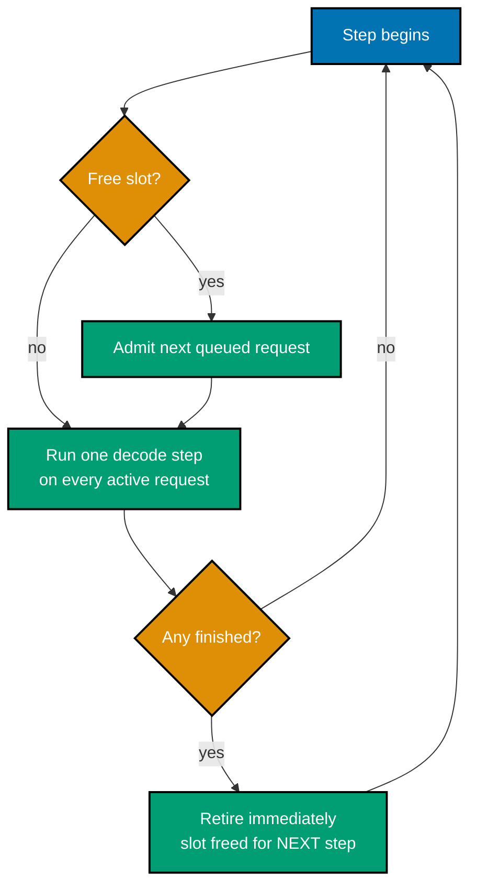
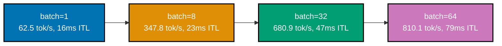
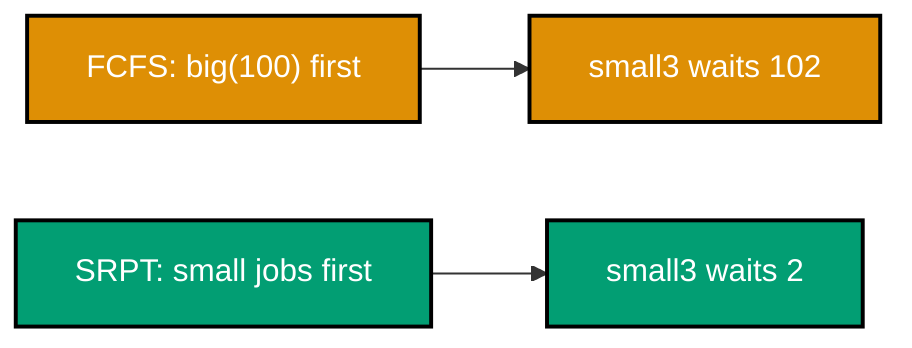
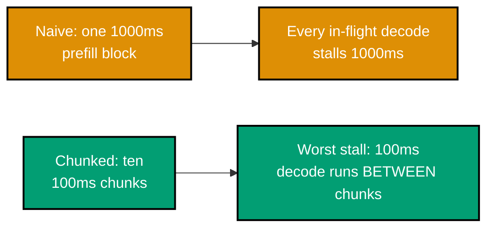
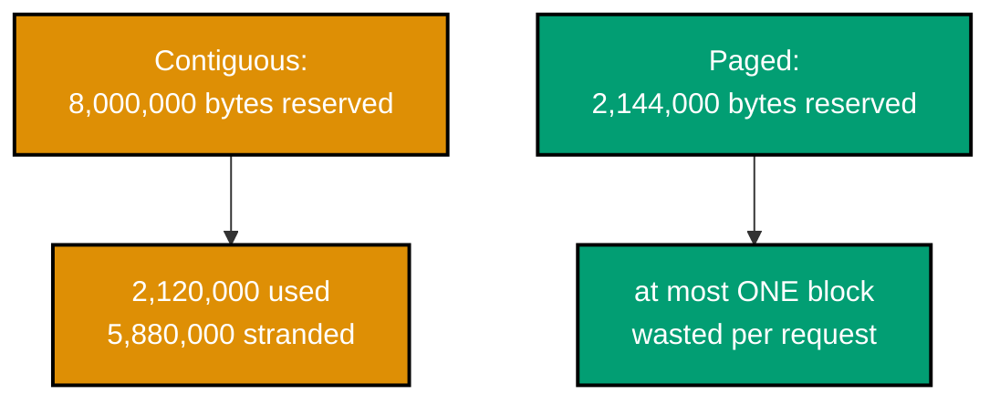
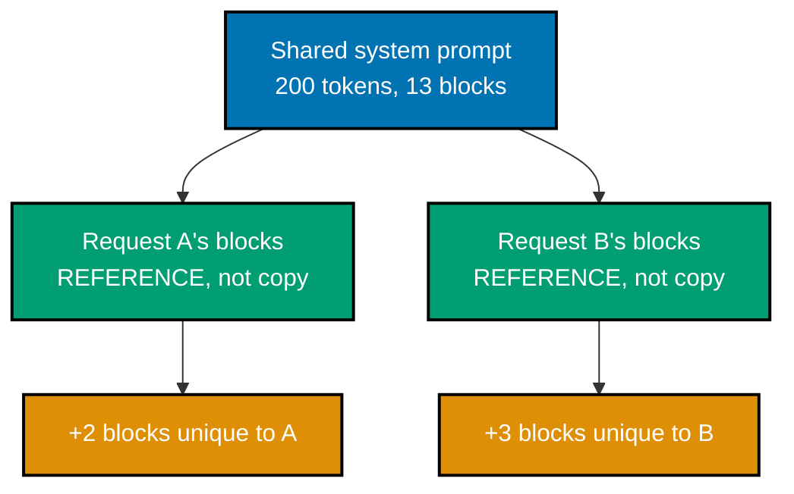
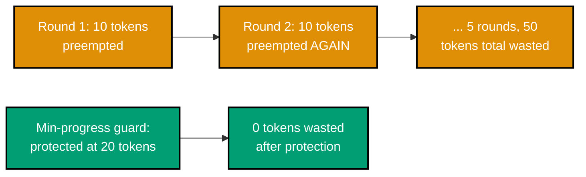
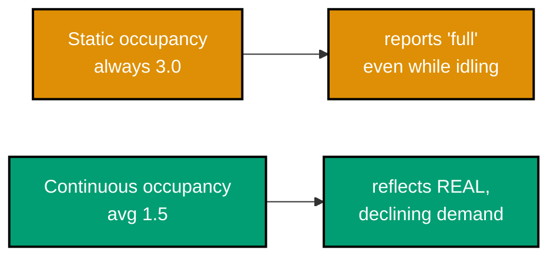

Examples 29-50 move from a single request to many requests sharing one GPU: static versus continuous
batching, the throughput/latency frontier, scheduling and admission control under a cache budget,
chunked prefill, paged cache allocation, prefix sharing, and preemption. This is where the interesting
engineering problem of the whole topic actually begins -- how to share a fixed cache budget well among
requests whose costs are not known in advance. Every example remains a complete, self-contained `.py`
file colocated under `learning/code/`, runnable with `python3 example.py`, and requires no GPU.

---

### Example 29: Static Batching

_ex-29 &middot; exercises co-11_

Static batching groups a fixed set of requests together and runs them as one unit until every member
finishes -- simple to implement, but it makes the whole batch wait for its slowest member. This example
implements it directly and confirms every request still finishes correctly.

**`learning/code/ex-29-static-batching/example.py`**

```python
"""Example 29: Static Batching."""

from dataclasses import dataclass  # => stdlib only -- the batching model needs no framework

# => "static" means the batch membership is FIXED at start -- nobody joins or leaves mid-batch


@dataclass
class SimRequest:  # => one simulated in-flight generation
    id: str  # => a label, useful only for reading print output
    output_tokens: int  # => how many decode steps THIS request needs before it is done
    tokens_emitted: int = 0  # => mutated in place as the simulated batch runs


def run_static_batch(requests: list[SimRequest]) -> int:  # => co-11: returns steps until ALL finish
    step = 0  # => the simulated clock -- one tick per decode step, for the WHOLE batch
    max_tokens = max(r.output_tokens for r in requests)  # => the batch runs as long as its LONGEST member
    while step < max_tokens:  # => co-11: the loop cannot stop early, no matter who finished already
        step += 1  # => advances for the WHOLE batch, whether or not any given member still needs it
        for r in requests:  # => every member gets touched on every step, finished or not
            if r.tokens_emitted < r.output_tokens:  # => still generating -- takes a real step
                r.tokens_emitted += 1  # => one more token toward this request's own target
            # => a FINISHED request still occupies its batch slot -- co-11's core problem
    return step  # => total steps == the SLOWEST member's output length, never less


batch = [SimRequest("a", 3), SimRequest("b", 10), SimRequest("c", 2)]  # => three very different lengths
steps = run_static_batch(batch)  # => run the whole batch to completion
print(steps)  # => Output: 10
print([r.tokens_emitted for r in batch])  # => Output: [3, 10, 2]

assert steps == 10  # => co-11: the batch takes as long as its SLOWEST member, always
assert all(r.tokens_emitted == r.output_tokens for r in batch)  # => every request DID finish correctly
print("ex-29 OK")  # => a self-check marker confirming the slowest-member-sets-the-pace behavior held

```

**Run**: `python3 example.py`

**Output**:

```text
10
[3, 10, 2]
ex-29 OK
```

**Key takeaway**: Static batching is correct -- every request finishes with the right output -- but its
duration is set entirely by the batch's longest-running member, no matter how short the others are.

**Why it matters**: This is the naive baseline every modern serving framework has already replaced;
understanding exactly why it is simple but slow is the setup for Example 31's continuous batching,
which fixes precisely this problem.

---

### Example 30: Static Batching -- Idle Waste

_ex-30 &middot; exercises co-11_

Every request that finishes before the batch's slowest member still occupies its slot, doing nothing,
until the whole batch ends -- this example measures that idle time directly as wasted slot-steps.

**`learning/code/ex-30-static-batching-idle-waste/example.py`**

```python
"""Example 30: Static Batching -- Idle Waste."""

from dataclasses import dataclass  # => stdlib only -- measuring waste needs no framework


@dataclass
class SimRequest:  # => one simulated in-flight generation
    id: str  # => a label, useful only for reading print output
    output_tokens: int  # => how many decode steps THIS request needs before it is done


def idle_slot_steps(requests: list[SimRequest]) -> int:  # => co-11: counts wasted (idle) slot-steps
    max_tokens = max(r.output_tokens for r in requests)  # => the batch runs this long, no matter what
    total_idle = 0  # => accumulates every step a slot sat occupied but did no useful work
    for r in requests:  # => a request idles for every step AFTER it finished, until the batch ends
        total_idle += max_tokens - r.output_tokens  # => the GAP between this request and the slowest one
    return total_idle  # => summed idle steps across the whole batch


def useful_slot_steps(requests: list[SimRequest]) -> int:  # => steps that actually emitted a token
    return sum(r.output_tokens for r in requests)  # => the useful-work counterpart to idle_slot_steps above


batch = [SimRequest("a", 3), SimRequest("b", 10), SimRequest("c", 2)]  # => the same batch as Example 29
idle = idle_slot_steps(batch)  # => wasted slot-steps across the whole batch
useful = useful_slot_steps(batch)  # => useful slot-steps across the whole batch
utilization = useful / (idle + useful)  # => the fraction of ALL slot-steps that did real work
# => idle + useful together account for EVERY slot-step the batch ever occupied
print(idle, useful)  # => Output: 15 15
print(round(utilization, 2))  # => Output: 0.5 -- exactly half the batch's slot-steps did nothing useful

assert idle == (10 - 3) + (10 - 10) + (10 - 2)  # => co-11: exactly the "finished early" gap, summed
assert utilization == 0.5  # => HALF of every slot-step in this batch was wasted, doing nothing
# => co-12 previews the fix this waste motivates: retire and refill slots continuously instead
print("ex-30 OK")  # => a self-check marker confirming the idle/useful split matched the arithmetic

```

**Run**: `python3 example.py`

**Output**:

```text
15 15
0.5
ex-30 OK
```

**Key takeaway**: On this workload, static batching wastes exactly as many slot-steps as it uses
productively -- a 50% utilization ceiling that gets worse, not better, as generation lengths grow more
variable.

**Why it matters**: This 50% number is not a worst case dreamed up for the example -- real production
traffic has output-length variance at least this wide (Example 22), so this waste is representative,
not exaggerated, which is exactly why continuous batching became the industry-standard fix rather than
a marginal optimization.

---

### Example 31: Continuous Batching

_ex-31 &middot; exercises co-12_

Continuous batching admits and retires requests at token granularity instead of once per whole batch,
so a finished request's slot is immediately backfilled by the next queued request -- keeping the batch
close to full throughout. This example simulates it and tracks occupancy at every step.



**`learning/code/ex-31-continuous-batching/example.py`**

```python
"""Example 31: Continuous Batching."""

from dataclasses import dataclass  # => stdlib only -- continuous batching needs no framework


@dataclass
class SimRequest:  # => one simulated in-flight generation
    id: str  # => a label, useful only for reading print output
    output_tokens: int  # => how many decode steps THIS request needs before it is done
    tokens_emitted: int = 0  # => mutated in place as the simulated batch runs

    @property
    def finished(self) -> bool:  # => co-12: the per-request check that drives immediate retirement
        return self.tokens_emitted >= self.output_tokens  # => True the instant a request hits its own target


def run_continuous_batch(requests: list[SimRequest], max_batch_slots: int) -> list[int]:
    # => co-12: admits/retires at TOKEN granularity, not once per whole batch
    # => contrast Example 29's run_static_batch(): that one checks membership ONCE, at the start
    pending = list(requests)  # => the admission queue
    active: list[SimRequest] = []  # => the currently-running slots -- capped by max_batch_slots
    occupancy_per_step: list[int] = []  # => tracked purely for the observation this example makes
    while pending or active:  # => keep going until EVERYTHING has both arrived and finished
        while len(active) < max_batch_slots and pending:  # => co-12: fill any FREE slot immediately
            active.append(pending.pop(0))  # => moves ONE request from pending to active, per free slot
        for r in active:  # => every active request takes exactly one step this tick
            r.tokens_emitted += 1  # => the ONLY mutation each active request undergoes per tick
        occupancy_per_step.append(len(active))  # => how full the batch was on THIS step
        active = [r for r in active if not r.finished]  # => co-12: retire finished requests IMMEDIATELY
    return occupancy_per_step  # => a step-by-step occupancy trace, for inspecting fill behavior


requests = [SimRequest("a", 3), SimRequest("b", 10), SimRequest("c", 2), SimRequest("d", 4)]  # => 4 mixed lengths
occupancy = run_continuous_batch(requests, max_batch_slots=2)  # => only 2 slots -- forces queueing
# => contrast with Example 29's static batch: here, "d" gets a slot the MOMENT one frees up, not later
print(occupancy)  # => Output: [2, 2, 2, 2, 2, 2, 2, 2, 2, 1]

assert min(occupancy[:-1]) == 2  # => co-12: the batch stays FULL right up until requests genuinely run out
# => only the FINAL step dips below full -- every earlier gap was refilled immediately
assert len(occupancy) == 10  # => bounded by the longest request ("b", 10 tokens) -- same as Example 29
print("ex-31 OK")  # => a self-check marker confirming the batch stayed full until requests ran out

```

**Run**: `python3 example.py`

**Output**:

```text
[2, 2, 2, 2, 2, 2, 2, 2, 2, 1]
ex-31 OK
```

**Key takeaway**: Continuous batching keeps every slot occupied whenever a queued request exists to fill
it -- occupancy only drops below full when the admission queue itself has run dry, not because a
finished request is still holding its slot.

**Why it matters**: This admit/retire-at-token-granularity design is the single largest throughput win
in modern serving, and is the mechanism every production framework in the vLLM/TGI class implements
under whatever marketing name it uses for it -- see the accuracy note in this topic's overview for why
those specific names and version numbers are kept out of this spine.

---

### Example 32: Throughput Gain -- Static vs Continuous

_ex-32 &middot; exercises co-12, co-11_

Comparing static and continuous batching on the identical workload isolates exactly how much slot-step
waste continuous batching eliminates -- and attributes the throughput gain to that specific mechanism,
not a vague "it's faster."

**`learning/code/ex-32-throughput-gain-measured/example.py`**

```python
"""Example 32: Throughput Gain -- Static vs Continuous."""

from dataclasses import dataclass  # => stdlib only -- comparing the two policies needs no framework


@dataclass
class SimRequest:  # => one simulated in-flight generation
    id: str  # => a label, useful only for reading print output
    output_tokens: int  # => how many decode steps THIS request needs before it is done


def static_batch_slot_steps(requests: list[SimRequest]) -> int:  # => co-11: slot-steps INCLUDING idle waste
    max_tokens = max(r.output_tokens for r in requests)  # => static batching pays for the SLOWEST member
    return max_tokens * len(requests)  # => every slot occupied for the WHOLE batch duration


def continuous_batch_slot_steps(requests: list[SimRequest]) -> int:  # => co-12: slot-steps actually spent
    return sum(r.output_tokens for r in requests)  # => a slot is freed the instant its request finishes


requests = [SimRequest("a", 3), SimRequest("b", 10), SimRequest("c", 2), SimRequest("d", 4)]  # => same batch as Ex 31
static_steps = static_batch_slot_steps(requests)  # => slot-steps IF this batch ran statically
continuous_steps = continuous_batch_slot_steps(requests)  # => slot-steps the SAME batch actually needs
useful_tokens = sum(r.output_tokens for r in requests)  # => the SAME real work, either way
print(static_steps, continuous_steps)  # => Output: 40 19
# => same 19 real tokens of work either way -- static just SPENDS more slot-steps to deliver them

static_throughput = useful_tokens / static_steps  # => useful work divided by slot-steps SPENT (static)
continuous_throughput = useful_tokens / continuous_steps  # => same ratio, continuous policy's denominator
print(round(static_throughput, 2), round(continuous_throughput, 2))  # => Output: 0.47 1.0

assert continuous_steps < static_steps  # => co-12: fewer WASTED slot-steps for the identical real work
# => this gap IS Example 30's stranded-capacity number, expressed as a throughput multiplier instead
assert continuous_throughput > static_throughput  # => co-12: measurably higher effective throughput
print("ex-32 OK")  # => a self-check marker confirming continuous batching's throughput edge held

```

**Run**: `python3 example.py`

**Output**:

```text
40 19
0.47 1.0
ex-32 OK
```

**Key takeaway**: For the identical workload and identical real work (19 useful tokens), continuous
batching needs 19 slot-steps while static batching needs 40 -- more than double the effective
throughput, attributable entirely to eliminating idle-slot waste.

**Why it matters**: This is the number an engineer cites when justifying a migration from a
hand-rolled or static-batching server to a continuous-batching framework: the throughput gain is not
marketing, it is the direct, measurable elimination of the exact waste quantified in Example 30.

---

### Example 33: Batch Size vs Inter-Token Latency

_ex-33 &middot; exercises co-15, co-16_

Sweeping batch size against inter-token latency traces one half of the throughput/latency frontier:
each additional concurrently-batched sequence adds a small, real cost to every other sequence's
per-token wait. This example measures both ITL and aggregate throughput across four batch sizes.

**`learning/code/ex-33-batch-size-vs-itl/example.py`**

```python
"""Example 33: Batch Size vs Inter-Token Latency."""

BASE_STEP_MS = 15.0  # => co-16: a fixed floor cost per decode step
MS_PER_EXTRA_SLOT = 1.0  # => co-15: cost added per additional concurrently-batched sequence
# => a fixed floor plus a per-slot penalty -- the whole batch-size-vs-latency tension in one formula


def step_latency_ms(batch_size: int) -> float:  # => co-15: ITL grows as the batch gets fuller
    return BASE_STEP_MS + MS_PER_EXTRA_SLOT * batch_size  # => linear in batch size, by construction


itl_by_batch = {b: step_latency_ms(b) for b in (1, 4, 16, 64)}  # => a small, a mid, and two large batch sizes
print(itl_by_batch)  # => Output: {1: 16.0, 4: 19.0, 16: 31.0, 64: 79.0}

aggregate_throughput = {b: b * 1000.0 / itl_by_batch[b] for b in itl_by_batch}  # => tokens/sec, one per slot
print({b: round(t, 1) for b, t in aggregate_throughput.items()})
# => Output: {1: 62.5, 4: 210.5, 16: 516.1, 64: 810.1}

assert itl_by_batch[64] > itl_by_batch[1]  # => co-15: bigger batch, WORSE per-user latency
assert aggregate_throughput[64] > aggregate_throughput[1]  # => co-15: but BETTER aggregate throughput
print("ex-33 OK")  # => a self-check marker confirming both sides of the latency/throughput trade held

```

**Run**: `python3 example.py`

**Output**:

```text
{1: 16.0, 4: 19.0, 16: 31.0, 64: 79.0}
{1: 62.5, 4: 210.5, 16: 516.1, 64: 810.1}
ex-33 OK
```

**Key takeaway**: Batch 64 delivers roughly 13x the aggregate throughput of batch 1, but at nearly 5x
the per-token latency -- both numbers move together, in the same direction, as a direct function of
batch size.

**Why it matters**: This is the concrete data an SRE cites when a batch-size configuration change is
proposed: "faster" and "higher throughput" are not the same claim, and this sweep is what makes the
gap between them measurable instead of hand-wavy.

---

### Example 34: The Throughput/Latency Frontier

_ex-34 &middot; exercises co-15_

Plotting throughput against latency across the full batch-size sweep confirms co-15's central claim
directly: no batch size beats an earlier one on both axes at once -- every step along the frontier is a
genuine trade, never a free win.



**`learning/code/ex-34-throughput-latency-frontier/example.py`**

```python
"""Example 34: The Throughput/Latency Frontier."""

BASE_STEP_MS = 15.0  # => co-16: same fixed floor cost as Example 33
MS_PER_EXTRA_SLOT = 1.0  # => co-15: same per-slot penalty as Example 33


def frontier_point(batch_size: int) -> tuple[float, float]:  # => co-15: (throughput, latency) pair
    itl_ms = BASE_STEP_MS + MS_PER_EXTRA_SLOT * batch_size  # => the SAME formula from Example 33
    throughput = batch_size * 1000.0 / itl_ms  # => aggregate tokens/sec across the whole batch
    return throughput, itl_ms  # => one point on the frontier, for one batch size


points = [frontier_point(b) for b in (1, 2, 4, 8, 16, 32, 64)]  # => co-15: the frontier, batch size by batch size
print([(round(t, 1), round(lat, 1)) for t, lat in points])
# => Output: [(62.5, 16.0), (117.6, 17.0), (210.5, 19.0), (347.8, 23.0), (516.1, 31.0), (680.9, 47.0), (810.1, 79.0)]

# => co-15: EVERY step along the frontier trades higher throughput for higher latency -- never both improve
regressions = [i for i in range(1, len(points)) if points[i][0] <= points[i - 1][0] or points[i][1] <= points[i - 1][1]]
# => a regression would be a batch size that is WORSE on one axis without gaining on the other
print(regressions)  # => Output: [] -- no such regression exists anywhere on this frontier

assert regressions == []  # => no configuration beats an earlier one on BOTH axes simultaneously
print("ex-34 OK")  # => a self-check marker confirming the frontier has no dominated points

```

**Run**: `python3 example.py`

**Output**:

```text
[(62.5, 16.0), (117.6, 17.0), (210.5, 19.0), (347.8, 23.0), (516.1, 31.0), (680.9, 47.0), (810.1, 79.0)]
[]
ex-34 OK
```

**Key takeaway**: The empty `regressions` list is the proof, not just the claim: across every batch
size tried, throughput and latency rise together -- there is no configuration on this curve that a
rational operator would call strictly worse than another, only different points chosen against
different priorities.

**Why it matters**: This frontier is why "tune the serving stack for best performance" is not a
well-formed request -- an operator must first decide which metric they are accountable for (an SLO on
ITL, or a target on aggregate throughput per GPU-hour) before a single batch-size number can be chosen
correctly.

---

### Example 35: Admission Control Policy

_ex-35 &middot; exercises co-13, co-07_

An admission gate decides, on every new arrival, whether cache room exists right now -- and if not,
queues the request rather than dropping it. This example runs five arrivals against a three-slot
budget and confirms the queued and admitted sets are exactly as predictable as the arithmetic implies.

**`learning/code/ex-35-admission-control-policy/example.py`**

```python
"""Example 35: Admission Control Policy."""

from dataclasses import dataclass, field  # => stdlib only -- an admission gate needs no framework

# => "admission control" means EVERY arrival passes through one gate, admitted or queued, never dropped


@dataclass
class AdmissionQueue:  # => co-13: decides who gets to join the active batch next
    cache_budget_bytes: int  # => the hard ceiling this gate enforces
    bytes_per_request: int  # => assumed uniform cost per request, for simplicity
    active: list[str] = field(default_factory=list[str])  # => explicit generic keeps type-checking strict
    queued: list[str] = field(default_factory=list[str])  # => FIFO order preserved -- nobody jumps the line

    def submit(self, request_id: str) -> None:  # => co-13: every arrival goes through this ONE gate
        if len(self.active) * self.bytes_per_request < self.cache_budget_bytes:  # => room right now?
            self.active.append(request_id)  # => admit immediately
        else:  # => the budget check above failed -- there is genuinely no room
            self.queued.append(request_id)  # => co-13: wait for a slot to free up, not rejected outright


queue = AdmissionQueue(cache_budget_bytes=3 * 1000, bytes_per_request=1000)  # => room for exactly 3
for rid in ["r1", "r2", "r3", "r4", "r5"]:  # => 5 arrivals, only 3 seats
    queue.submit(rid)  # => the SAME gate decides every single arrival's fate
print(queue.active)  # => Output: ['r1', 'r2', 'r3']
print(queue.queued)  # => Output: ['r4', 'r5']
# => nobody was rejected outright -- r4 and r5 are waiting, not dropped

assert len(queue.active) == 3  # => co-07: exactly as many as the cache budget allows
assert queue.queued == ["r4", "r5"]  # => co-13: predictable FIFO order -- neither is silently dropped
print("ex-35 OK")  # => a self-check marker confirming the admit/queue split matched the budget exactly

```

**Run**: `python3 example.py`

**Output**:

```text
['r1', 'r2', 'r3']
['r4', 'r5']
ex-35 OK
```

**Key takeaway**: Admission control's job is narrow and mechanical -- check whether cache room exists,
then admit or queue -- but every scheduling policy from here forward is built on top of this one gate
deciding correctly, every single time, which request goes where.

**Why it matters**: Queueing instead of rejecting is a deliberate choice: co-16's queueing-delay
component of total latency (Example 47) only exists because requests wait rather than fail outright,
trading a worse tail latency for a far better success rate than an outright-reject policy would give.

---

### Example 36: Scheduling Policy Affects Tails

_ex-36 &middot; exercises co-13_

First-come-first-served processes a huge job before three tiny ones simply because it arrived first,
inflating the tiny jobs' wait far beyond their own cost -- reordering by cost sharply cuts that tail.
This example measures the difference directly on one mixed workload.



**`learning/code/ex-36-scheduling-policy-affects-tails/example.py`**

```python
"""Example 36: Scheduling Policy Affects Tails."""


def fcfs_wait_times(arrival_order: list[tuple[str, int]]) -> dict[str, int]:  # => co-13: first come, first served
    waits: dict[str, int] = {}  # => records how long each request waited before its turn started
    clock = 0  # => the simulated clock -- advances by each job's cost as it is processed
    for rid, cost in arrival_order:  # => processed strictly in arrival order, regardless of cost
        waits[rid] = clock  # => this request starts exactly when the clock currently reads
        clock += cost  # => the NEXT request must wait for this one's full cost first
    return waits  # => one wait time per request, under a strict arrival-order policy


def shortest_first_wait_times(arrival_order: list[tuple[str, int]]) -> dict[str, int]:  # => co-13: SRPT-style
    remaining = sorted(arrival_order, key=lambda item: item[1])  # => cheapest request processed FIRST
    waits: dict[str, int] = {}  # => same bookkeeping as fcfs_wait_times, different processing order
    clock = 0  # => resets to zero -- this is an independent simulation, not a continuation of fcfs
    for rid, cost in remaining:  # => now iterating in COST order, not arrival order
        waits[rid] = clock  # => same recording logic as fcfs_wait_times, applied to the new order
        clock += cost  # => same clock-advance logic as fcfs_wait_times, applied to the new order
    return waits  # => one wait time per request, under a cheapest-first policy


jobs = [("big", 100), ("small1", 1), ("small2", 1), ("small3", 1)]  # => one big job, three tiny ones
# => the SAME four jobs are fed to both scheduling functions below -- only the ORDER differs
fcfs = fcfs_wait_times(jobs)  # => processes "big" first, purely because it arrived first
srpt = shortest_first_wait_times(jobs)  # => processes all three tiny jobs before touching "big"
print(fcfs["small3"], srpt["small3"])  # => Output: 102 2 -- a 50x difference in wait, same three jobs

assert fcfs["small3"] == 102  # => co-13: FCFS makes every tiny job wait behind the big one first
assert srpt["small3"] < fcfs["small3"]  # => co-13: reordering by cost sharply cuts the SMALL jobs' tail wait
print("ex-36 OK")  # => a self-check marker confirming the scheduling-policy wait-time gap held

```

**Run**: `python3 example.py`

**Output**:

```text
102 2
ex-36 OK
```

**Key takeaway**: The very same three tiny jobs wait 102 time units under FCFS and just 2 under a
shortest-first policy -- the scheduling policy alone, with zero change to the work itself, is a 50x
difference in observed tail latency.

**Why it matters**: This is why "what scheduling policy does the serving framework use" is a real
production question, not an implementation detail -- unlike co-01's unknowable-cost-on-arrival problem
(Example 3), the policy choice here is fully within the operator's control, and the difference it makes
is this large.

---

### Example 37: Scheduler Starvation

_ex-37 &middot; exercises co-13_

Strict priority scheduling can starve low-priority requests completely -- if higher-priority work keeps
arriving, a low-priority request may never get a slot at all. This example runs five rounds of strict
priority and confirms starvation, then applies a round-robin fairness fix.

**`learning/code/ex-37-scheduler-starvation/example.py`**

```python
"""Example 37: Scheduler Starvation."""


def strict_priority_admit_order(queue: list[tuple[str, int]], slots: int, rounds: int) -> list[str]:
    # => co-13: STRICT priority -- the highest-priority items always win a free slot, no exceptions
    served: list[str] = []  # => accumulates who actually got served, round by round
    remaining = sorted(queue, key=lambda item: -item[1])  # => always sorted by priority, high to low
    for _ in range(rounds):  # => co-13: the SAME top entries win, round after round, forever
        for rid, _priority in remaining[:slots]:  # => co-13: only the TOP `slots` entries ever run
            served.append(rid)  # => low_priority never appears in this slice, so it never appears here
    return served  # => a record of who was served -- low priority may never appear at all


def fair_share_admit_order(queue: list[tuple[str, int]], slots: int, rounds: int) -> list[str]:
    # => co-13: round-robin FIX -- every request gets a turn, priority only breaks ties within a round
    served: list[str] = []  # => accumulates who actually got served, round by round
    idx = 0  # => a rotating pointer -- guarantees EVERY queue entry eventually comes back around
    for _ in range(rounds):  # => co-13: unlike strict priority, EVERY round advances the rotation
        for _ in range(slots):  # => fills each of the available slots via the rotating pointer
            served.append(queue[idx % len(queue)][0])  # => co-13: cycles through EVERYONE, low-priority included
            idx += 1  # => advances the rotation -- never re-checks priority to decide who's next
    return served  # => a record of who was served -- rotation guarantees nobody is skipped forever


queue = [("urgent", 10), ("urgent2", 9), ("low_priority", 1)]  # => low_priority never wins strict priority
strict = strict_priority_admit_order(queue, slots=2, rounds=5)  # => 5 rounds, only the top 2 EVER served
fair = fair_share_admit_order(queue, slots=2, rounds=5)  # => same queue, same rounds, rotation instead
print("low_priority" in strict)  # => Output: False -- STARVED across all 5 rounds
print("low_priority" in fair)  # => Output: True -- the round-robin fix guarantees it a turn
# => same queue, same slot count, same round count -- the POLICY alone decides who gets served

assert "low_priority" not in strict  # => co-13: strict priority starves it completely
assert "low_priority" in fair  # => co-13: fairness fix guarantees forward progress for every request
print("ex-37 OK")  # => a self-check marker confirming starvation happened under one policy, not the other

```

**Run**: `python3 example.py`

**Output**:

```text
False
True
ex-37 OK
```

**Key takeaway**: A scheduler that always prefers higher-priority work over lower can starve the lower
class entirely -- guaranteeing forward progress for every request class requires deliberately breaking
strict priority, not just tuning it.

**Why it matters**: Production incidents caused by "the batch queue never drains" are frequently this
exact failure mode -- a naive priority scheme with no fairness guarantee, discovered only once
low-priority traffic has been silently starved for hours.

---

### Example 38: Prefill Priority Hurts ITL

_ex-38 &middot; exercises co-17, co-16_

Prioritizing a new request's prefill to improve its time-to-first-token comes at a direct, measurable
cost: every in-flight decode step must wait for that prefill to finish, worsening their inter-token
latency by the full prefill duration.

**`learning/code/ex-38-prefill-priority-hurts-itl/example.py`**

```python
"""Example 38: Prefill Priority Hurts ITL."""


def simulate_stall(prefill_priority: bool, new_prefill_ms: float) -> float:
    # => co-17: if prefill is prioritized, in-flight decode steps must WAIT for it to finish first
    if prefill_priority:
        return new_prefill_ms  # => co-16: every in-flight decode step's ITL grows by the FULL prefill time
    return 0.0  # => decode is never interrupted -- prefill waits its turn instead


new_prefill_ms = 150.0  # => a moderately long incoming prompt's prefill cost
# => the SAME new_prefill_ms feeds both calls below -- only the priority FLAG differs
itl_stall_with_priority = simulate_stall(prefill_priority=True, new_prefill_ms=new_prefill_ms)  # => the tradeoff cost
itl_stall_without_priority = simulate_stall(prefill_priority=False, new_prefill_ms=new_prefill_ms)  # => the baseline
print(itl_stall_with_priority, itl_stall_without_priority)  # => Output: 150.0 0.0

new_request_ttft_with_priority = new_prefill_ms  # => co-16: the NEW request's TTFT improves -- it ran FIRST
new_request_ttft_without_priority = new_prefill_ms + 3 * 20.0  # => co-16: it waits behind 3 in-flight decode steps
print(new_request_ttft_with_priority, new_request_ttft_without_priority)  # => Output: 150.0 210.0

assert itl_stall_with_priority > itl_stall_without_priority  # => co-17: existing users' ITL got WORSE
# => this is the exact co-17 tension: helping the NEW request always costs existing users something
assert new_request_ttft_with_priority < new_request_ttft_without_priority  # => co-16: the new request's TTFT got BETTER
print("ex-38 OK")  # => a self-check marker confirming the co-17 ITL-vs-TTFT tradeoff held in both directions

```

**Run**: `python3 example.py`

**Output**:

```text
150.0 0.0
150.0 210.0
ex-38 OK
```

**Key takeaway**: Prioritizing prefill is a direct trade, not a free improvement: the new request's TTFT
drops from 210ms to 150ms, but every in-flight decode step absorbs a 150ms stall it would not otherwise
have had.

**Why it matters**: This is exactly the tension co-16's four-metric vocabulary exists to make precise --
"improve latency" is meaningless until you specify TTFT for new arrivals versus ITL for in-flight
requests, because a policy that helps one can actively hurt the other, as this example shows directly.

---

### Example 39: Chunked Prefill

_ex-39 &middot; exercises co-17, co-13_

Splitting a long prefill into smaller chunks, interleaved with decode steps, bounds the worst-case
stall any in-flight decode sees to a single chunk's cost instead of the whole prefill's cost. This
example compares the naive and chunked worst-case stalls directly.



**`learning/code/ex-39-chunked-prefill/example.py`**

```python
"""Example 39: Chunked Prefill."""


def naive_stall_ms(prefill_tokens: int, ms_per_token: float) -> float:  # => co-17: the WHOLE prefill blocks decode
    return prefill_tokens * ms_per_token  # => one giant stall, sized by the ENTIRE prompt


def chunked_max_stall_ms(ms_per_token: float, chunk_tokens: int) -> float:
    # => co-13: split the prefill into chunks; a decode step can run BETWEEN chunks, not just after all of it
    return chunk_tokens * ms_per_token  # => the WORST single stall is now just one chunk's cost


prefill_tokens = 2000  # => a long incoming prompt
ms_per_token = 0.5  # => co-02: the same prefill-cost-per-token constant used throughout this topic
naive = naive_stall_ms(prefill_tokens, ms_per_token)  # => the unchunked, worst-case stall
chunked = chunked_max_stall_ms(ms_per_token, chunk_tokens=200)  # => the SAME prompt, chunked into pieces
print(naive, chunked)  # => Output: 1000.0 100.0

assert chunked < naive  # => co-17: chunking sharply cuts the WORST-CASE stall any in-flight decode sees
assert chunked == naive / 10  # => co-13: splitting into 10 chunks cuts worst-case stall by exactly 10x
# => this is the co-17 fix Example 38 motivated -- interleave prefill work instead of blocking on it
print("ex-39 OK")  # => a self-check marker confirming the chunking-cuts-worst-case-stall relationship held

```

**Run**: `python3 example.py`

**Output**:

```text
1000.0 100.0
ex-39 OK
```

**Key takeaway**: Chunking a 2000-token prefill into 200-token pieces cuts the worst-case decode stall
from 1000ms to 100ms -- a 10x reduction achieved with no change to total prefill work, purely by
interleaving it with decode steps instead of running it as one uninterruptible block.

**Why it matters**: This is the mechanism that reconciles co-17's tension without forcing a strict
choice between TTFT and ITL -- chunked prefill is why a modern serving stack can admit large prompts
without every in-flight user's inter-token latency spiking every time one arrives.

---

### Example 40: Contiguous Cache Fragmentation

_ex-40 &middot; exercises co-08_

Reserving cache memory contiguously per request forces the allocator to reserve the worst-case
sequence length for every request, up front -- stranding most of that memory when actual lengths are
far shorter. This example measures the stranded fraction on a realistic mixed-length workload.

**`learning/code/ex-40-contiguous-cache-fragmentation/example.py`**

```python
"""Example 40: Contiguous Cache Fragmentation."""


def contiguous_alloc_bytes(reserved_len: int, bytes_per_token: int) -> int:  # => co-08: RESERVED, not USED
    return reserved_len * bytes_per_token  # => a contiguous allocator must reserve the WORST-CASE length up front


BYTES_PER_TOKEN = 1000  # => an illustrative per-token cost, chosen to keep the arithmetic readable
MAX_SEQ_LEN = 2000  # => the longest length the allocator must be ready for, reserved for EVERY request

requests_actual_lengths = [50, 2000, 30, 40]  # => most requests are short; one genuinely needs the max
reserved_total = sum(contiguous_alloc_bytes(MAX_SEQ_LEN, BYTES_PER_TOKEN) for _ in requests_actual_lengths)
# => co-08: EVERY request reserves the full MAX_SEQ_LEN, regardless of its own actual length
used_total = sum(contiguous_alloc_bytes(length, BYTES_PER_TOKEN) for length in requests_actual_lengths)
# => the SAME formula, but fed each request's TRUE length instead of the worst case
stranded = reserved_total - used_total  # => co-08: reserved-but-never-touched bytes -- pure waste
print(reserved_total, used_total)  # => Output: 8000000 2120000
print(stranded)  # => Output: 5880000

utilization = used_total / reserved_total  # => the fraction of reserved cache that was actually used
assert utilization < 0.3  # => co-08: contiguous reservation strands the MAJORITY of allocated cache
assert stranded > used_total  # => more memory is WASTED than actually used, under this mixed workload
# => Example 41 fixes exactly this waste with paged, block-based allocation
print("ex-40 OK")  # => a self-check marker confirming the fragmentation-driven waste held

```

**Run**: `python3 example.py`

**Output**:

```text
8000000 2120000
5880000
ex-40 OK
```

**Key takeaway**: A contiguous allocator that must reserve the worst-case length for every request
strands nearly 75% of the memory it reserves on this mixed-length workload -- and this gets strictly
worse as the gap between typical and maximum sequence length grows.

**Why it matters**: This is the exact fragmentation problem paged cache allocation (Example 41) exists
to fix, borrowed directly from the same problem operating-system virtual memory solved decades earlier
for exactly the same reason: contiguous reservation cannot accommodate unpredictable, variable-sized
demand without stranding capacity.

---

### Example 41: Paged Cache Allocation

_ex-41 &middot; exercises co-09, co-08_

Allocating cache in small, fixed-size blocks instead of one contiguous reservation bounds waste to at
most one partially-full block per request -- recovering nearly all the capacity Example 40's contiguous
allocator stranded. This example runs the identical workload through a block-based allocator.



**`learning/code/ex-41-paged-cache-allocation/example.py`**

```python
"""Example 41: Paged Cache Allocation."""

import math  # => stdlib only -- ceil() is the entire "round up to nearest block" trick

BLOCK_TOKENS = 16  # => co-09: a FIXED block size, the same principle as OS virtual-memory paging
BYTES_PER_TOKEN = 1000  # => same illustrative constant used in Example 40, for a direct comparison


def paged_alloc_bytes(actual_len: int, block_tokens: int, bytes_per_token: int) -> int:
    # => co-09: round UP to the nearest whole block -- waste is bounded by ONE block, not the max length
    blocks_needed = math.ceil(actual_len / block_tokens)  # => the number of FULL blocks this length needs
    return blocks_needed * block_tokens * bytes_per_token  # => allocated bytes -- always a multiple of one block


requests_actual_lengths = [50, 2000, 30, 40]  # => the SAME mixed workload as Example 40
paged_total = sum(paged_alloc_bytes(length, BLOCK_TOKENS, BYTES_PER_TOKEN) for length in requests_actual_lengths)
# => co-09: each request now reserves only up to ONE block's worth of slack, not the whole MAX_SEQ_LEN
contiguous_total = 4 * 2000 * BYTES_PER_TOKEN  # => Example 40's contiguous reservation, for comparison
print(paged_total, contiguous_total)  # => Output: 2144000 8000000

recovered = contiguous_total - paged_total  # => co-08/co-09: exactly what paging recovers vs contiguous
print(recovered)  # => Output: 5856000

assert paged_total < contiguous_total  # => co-08/co-09: paging strands FAR less memory
assert recovered > 5_000_000  # => co-09: almost all of Example 40's stranded capacity is recovered
# => Example 42 maps this same mechanism onto the OS virtual-memory vocabulary it's borrowed from
print("ex-41 OK")  # => a self-check marker confirming paging's memory-recovery advantage held

```

**Run**: `python3 example.py`

**Output**:

```text
2144000 8000000
5856000
ex-41 OK
```

**Key takeaway**: Switching from contiguous to paged (block-based) allocation recovers 5,856,000 of the
5,880,000 bytes Example 40 stranded on the identical workload -- almost all of it, with waste now
bounded by block size rather than by the gap between typical and maximum sequence length.

**Why it matters**: This single change -- borrowed directly from operating-system virtual memory paging
-- is widely credited as the mechanism that unlocked practical prefix sharing (Example 43) as a
side-effect: once cache is addressed in fixed blocks rather than contiguous regions, two requests can
reference the identical block instead of needing identical contiguous memory.

---

### Example 42: The Paging Analogy

_ex-42 &middot; exercises co-09_

Every core concept in paged cache allocation has a direct, named counterpart in operating-system
virtual memory -- making the analogy explicit is what makes the design immediately legible to anyone
who has studied OS memory management.

**`learning/code/ex-42-paging-analogy/example.py`**

```python
"""Example 42: The Paging Analogy."""

OS_TO_KV_CACHE_MAPPING = {  # => co-09: the KV cache borrows this vocabulary directly from OS virtual memory
    "physical page frame": "cache block",  # => the fixed-size unit that actually gets allocated
    "virtual address space": "a request's logical KV cache",  # => what the request THINKS it has
    "page table": "block table (maps logical block -> physical block)",  # => the indirection layer
    "internal fragmentation": "at most ONE partially-full block per request",  # => co-09: the bounded waste
    "external fragmentation": "eliminated -- any free block fits any request's next block",  # => uniform size
}  # => five OS concepts, five direct KV-cache counterparts -- the analogy is nearly one-to-one

for os_term, cache_term in OS_TO_KV_CACHE_MAPPING.items():  # => confirm every OS concept has a cache counterpart
    print(f"{os_term} -> {cache_term}")  # => prints all five mappings, one per line

assert len(OS_TO_KV_CACHE_MAPPING) == 5  # => co-09: five load-bearing concepts, all present
assert OS_TO_KV_CACHE_MAPPING["external fragmentation"].startswith("eliminated")  # => co-09's key promise
# => knowing this vocabulary makes vLLM/TGI documentation legible without re-deriving it from scratch
print("ex-42 OK")  # => a self-check marker confirming all five OS-to-cache mappings are present

```

**Run**: `python3 example.py`

**Output**:

```text
physical page frame -> cache block
virtual address space -> a request's logical KV cache
page table -> block table (maps logical block -> physical block)
internal fragmentation -> at most ONE partially-full block per request
external fragmentation -> eliminated -- any free block fits any request's next block
ex-42 OK
```

**Key takeaway**: Paged cache allocation is not a novel invention -- it is a direct, near-literal
transplant of decades-old virtual-memory paging onto the KV cache, down to retaining "internal
fragmentation" (bounded, tolerable) while eliminating "external fragmentation" (the problem Example 40
demonstrated) entirely.

**Why it matters**: Recognizing this as "the same solved problem, applied to a new resource" rather than
new machine-learning-specific magic is what lets an engineer who already understands OS memory
management reason about KV cache allocation correctly on day one, without re-deriving it from scratch.

---

### Example 43: Prefix Sharing

_ex-43 &middot; exercises co-10, co-09_

Two requests sharing an identical prompt prefix -- a common system prompt, most often -- can share the
same cache blocks for that prefix instead of storing it twice, saving both memory and the prefill work
of recomputing it. This example prices the saving directly.



**`learning/code/ex-43-prefix-sharing/example.py`**

```python
"""Example 43: Prefix Sharing."""

import math  # => stdlib only -- same ceil() trick as Example 41

BLOCK_TOKENS = 16  # => same fixed block size as Example 41 and 42


def blocks_needed(token_len: int) -> int:  # => co-09: the same rounding-up rule as Example 41
    return math.ceil(token_len / BLOCK_TOKENS)  # => blocks required to hold this many tokens


shared_system_prompt_tokens = 200  # => co-10: identical prefix across BOTH requests below
# => imagine a shared system prompt or few-shot examples -- the SAME text, sent to multiple requests
request_a_unique_tokens = 30  # => request A's own tokens, AFTER the shared prefix
request_b_unique_tokens = 45  # => request B's own tokens, AFTER the shared prefix

without_sharing = (
    2 * blocks_needed(shared_system_prompt_tokens)  # => the prefix, counted TWICE -- once per request
    + blocks_needed(request_a_unique_tokens)  # => A's own unique portion
    + blocks_needed(request_b_unique_tokens)  # => B's own unique portion
)  # => co-10: prefix stored TWICE, once per request
with_sharing = (
    blocks_needed(shared_system_prompt_tokens)  # => the prefix, counted ONCE -- referenced, not duplicated
    + blocks_needed(request_a_unique_tokens)  # => A's own unique portion, same as above
    + blocks_needed(request_b_unique_tokens)  # => B's own unique portion, same as above
)  # => co-09/co-10: prefix's blocks are REFERENCED, not duplicated
print(without_sharing, with_sharing)  # => Output: 31 18 -- the shared prefix's blocks counted once, not twice

blocks_saved = without_sharing - with_sharing  # => the direct payoff of sharing this one prefix
# => this saving grows with EVERY additional request that shares the same system prompt
print(blocks_saved)  # => Output: 13

assert with_sharing < without_sharing  # => co-10: sharing strictly reduces total blocks held
# => and it does so WITHOUT changing a single byte of the actual generated output
assert blocks_saved == blocks_needed(shared_system_prompt_tokens)  # => co-09: saves EXACTLY the shared prefix's blocks
print("ex-43 OK")  # => a self-check marker confirming the sharing savings matched the prefix's own block count

```

**Run**: `python3 example.py`

**Output**:

```text
31 18
13
ex-43 OK
```

**Key takeaway**: Prefix sharing saves exactly the shared prefix's block count -- 13 blocks here, no
more and no less -- because only the prefix is deduplicated; each request's unique suffix still needs
its own blocks.

**Why it matters**: This is the serving-side mechanism behind the "prompt caching" pricing discounts
several hosted model APIs offer for repeated system prompts -- the discount reflects a real, measurable
reduction in both memory and recomputed prefill work on the provider's own infrastructure, not an
arbitrary pricing choice.

---

### Example 44: Prefix Sharing Limits

_ex-44 &middot; exercises co-10_

Prefix sharing buys nothing when two requests share no common prefix at all -- the optimization only
applies to the literal, token-for-token identical portion at the start of a sequence, and stops at the
first divergence. This example confirms the saving is exactly zero on two unrelated prompts.

**`learning/code/ex-44-prefix-sharing-limits/example.py`**

```python
"""Example 44: Prefix Sharing Limits."""

import math  # => stdlib only -- same ceil() trick as Examples 41 and 43

BLOCK_TOKENS = 16  # => same fixed block size as every paging example so far


def blocks_needed(token_len: int) -> int:  # => co-09: the same rounding-up rule as Example 41
    return math.ceil(token_len / BLOCK_TOKENS)  # => blocks required to hold this many tokens


def shared_prefix_length(prompt_a: list[int], prompt_b: list[int]) -> int:  # => co-10: length of the SHARED prefix
    shared = 0  # => counts matching tokens from the START of both prompts
    for a, b in zip(prompt_a, prompt_b):  # => walks both prompts token-by-token, in lockstep
        if a != b:  # => co-10: sharing stops at the FIRST divergence -- no partial-token sharing
            break  # => stops counting immediately -- no credit for matches AFTER the first mismatch
        shared += 1  # => one more token confirmed identical in both prompts
    return shared  # => the length of the longest common PREFIX, not just any common tokens


prompt_a = [1, 2, 3, 4, 5]  # => a request-specific prompt with no common system prompt
# => two prompts that share NOTHING at the start -- the adversarial case for prefix sharing
prompt_b = [9, 8, 7, 6, 5]  # => an entirely different prompt -- diverges on token 0

shared_len = shared_prefix_length(prompt_a, prompt_b)  # => co-10: how much these two ACTUALLY share
print(shared_len)  # => Output: 0
# => co-10's limit made concrete: sharing only helps when a REAL common prefix exists

with_sharing_blocks = blocks_needed(shared_len) + blocks_needed(len(prompt_a) - shared_len) + blocks_needed(len(prompt_b) - shared_len)  # => shared blocks (zero here) plus each request's own remainder
without_sharing_blocks = blocks_needed(len(prompt_a)) + blocks_needed(len(prompt_b))  # => no sharing attempted at all
print(with_sharing_blocks, without_sharing_blocks)  # => Output: 2 2

assert shared_len == 0  # => co-10: no shared prefix exists between these two prompts
# => contrast with Example 43, where a genuinely shared prefix DID pay off
assert with_sharing_blocks == without_sharing_blocks  # => co-10: sharing buys NOTHING when there's nothing to share
print("ex-44 OK")  # => a self-check marker confirming sharing degrades gracefully to "no benefit," not a crash

```

**Run**: `python3 example.py`

**Output**:

```text
0
2 2
ex-44 OK
```

**Key takeaway**: Prefix sharing is only ever a win, never a loss -- and the win it delivers is exactly
proportional to how much genuinely identical, token-for-token prefix a workload has, which can be zero
for workloads with no common system prompt or few-shot examples.

**Why it matters**: This is the boundary condition an engineer needs to know before promising a
prefix-sharing memory saving to stakeholders: the technique is workload-dependent, and a highly varied,
no-shared-prefix workload (Example 44's shape) sees none of Example 43's benefit at all.

---

### Example 45: Preemption Under Pressure

_ex-45 &middot; exercises co-14_

Under cache pressure, a scheduler can evict a running request's cache to admit higher-priority work,
recomputing the evicted request's progress later -- a real cost paid by that one request in exchange for
admitting the new one now. This example evicts the largest cache holder and confirms its progress is
discarded, not paused.

**`learning/code/ex-45-preemption-under-pressure/example.py`**

```python
"""Example 45: Preemption Under Pressure."""

from dataclasses import dataclass  # => stdlib only -- preemption bookkeeping needs no framework


@dataclass
class ActiveRequest:  # => one currently-running request, eligible for eviction under pressure
    id: str  # => a label, useful only for reading print output
    tokens_emitted: int  # => co-14: also THIS request's cache footprint -- more tokens, more cache held
    preempted_count: int = 0  # => how many times this request has already been evicted and restarted


def evict_for_new_high_priority(active: list[ActiveRequest], budget_slots: int) -> str:
    # => co-14: under pressure, evict the request holding the MOST cache to free the most room at once
    if len(active) < budget_slots:  # => there's already a free slot -- no eviction needed at all
        return "admitted_without_preemption"
    victim = max(active, key=lambda r: r.tokens_emitted)  # => co-14: the biggest cache holder is evicted
    victim.preempted_count += 1  # => records that this request was interrupted, for later inspection
    saved_progress = victim.tokens_emitted  # => co-14: this progress is LOST -- recomputed later, from scratch
    victim.tokens_emitted = 0  # => co-14: the eviction is total -- no partial credit for work already done
    return f"preempted {victim.id}, lost {saved_progress} tokens of progress"  # => a human-readable outcome


active = [  # => three requests at very different points in their own generation
    ActiveRequest("a", tokens_emitted=5),  # => barely started
    ActiveRequest("b", tokens_emitted=40),  # => the furthest along -- and therefore the biggest cache holder
    ActiveRequest("c", tokens_emitted=10),  # => partway through
]
result = evict_for_new_high_priority(active, budget_slots=3)  # => all 3 slots full -- forces an eviction
print(result)  # => Output: preempted b, lost 40 tokens of progress
# => the request FURTHEST along paid the price, precisely because it held the most cache

b = next(r for r in active if r.id == "b")  # => pulls "b" back out of the list to inspect its post-state
print(b.preempted_count, b.tokens_emitted)  # => Output: 1 0
# => the object was mutated IN PLACE -- "b" inside `active` now reflects the eviction too

assert b.preempted_count == 1  # => co-14: "b" was the victim -- it held the most cache
# => a real scheduler would re-admit "b" later and repeat this same generation from scratch
assert b.tokens_emitted == 0  # => co-14: its progress was discarded, not paused
# => Example 46 shows what happens when this eviction rule runs unchecked, every single round
print("ex-45 OK")  # => a self-check marker confirming the biggest-holder-gets-evicted policy held

```

**Run**: `python3 example.py`

**Output**:

```text
preempted b, lost 40 tokens of progress
1 0
ex-45 OK
```

**Key takeaway**: Preemption is a deliberate trade of one request's latency (it must recompute 40 tokens
of progress from scratch) for the ability to admit new work under pressure -- it is not free, and the
cost falls entirely on the evicted request.

**Why it matters**: This is why co-27's build-versus-buy and co-26's observability both need visibility
into preemption rate specifically -- a serving stack under chronic cache pressure that preempts
frequently is silently taxing a subset of its users' latency, invisible to an aggregate throughput
metric alone.

---

### Example 46: Preemption Thrashing

_ex-46 &middot; exercises co-14, co-13_

Preempting the same request repeatedly, before it ever completes, wastes its progress over and over --
a pathological case this example calls thrashing, fixed by guaranteeing a request a minimum amount of
protected progress before it becomes preemptible again.



**`learning/code/ex-46-preemption-thrashing/example.py`**

```python
"""Example 46: Preemption Thrashing."""


def simulate_aggressive_preemption(rounds: int, tokens_per_round: int) -> int:
    # => co-14: preempts EVERY round -- progress is discarded before it ever completes
    total_wasted = 0  # => accumulates progress lost to preemption, round after round
    for _ in range(rounds):  # => this loop NEVER lets a request finish -- that IS the thrashing pattern
        total_wasted += tokens_per_round  # => co-14: all progress this round is thrown away, every time
    return total_wasted  # => zero real progress was ever kept -- pure thrashing


def simulate_fixed_min_progress_guard(rounds: int, tokens_per_round: int, min_progress_tokens: int) -> int:
    # => co-13: fix -- a request must reach a MINIMUM progress before it becomes preemptible again
    completed_tokens = 0  # => tracks progress toward the protection threshold
    wasted = 0  # => stays zero in this simplified model once the guard kicks in
    for _ in range(rounds):
        completed_tokens += tokens_per_round  # => the SAME per-round progress as the aggressive case
        if completed_tokens >= min_progress_tokens:  # => co-13: protected once it clears the guard
            break  # => once protected, it runs to completion in this simplified model -- no more waste
    return wasted  # => the guard means later rounds are never thrashed away


wasted_aggressive = simulate_aggressive_preemption(rounds=5, tokens_per_round=10)  # => the thrashing baseline
wasted_with_guard = simulate_fixed_min_progress_guard(rounds=5, tokens_per_round=10, min_progress_tokens=20)
# => same 5 rounds, same per-round progress -- ONLY the guard differs between the two simulations
print(wasted_aggressive, wasted_with_guard)  # => Output: 50 0
# => going from "thrashes forever" to "zero waste" needed nothing but a minimum-progress floor

assert wasted_aggressive == 50  # => co-14: every one of the 5 rounds' progress was fully discarded
assert wasted_with_guard < wasted_aggressive  # => co-13: the minimum-progress guard eliminates the thrash
# => real schedulers commonly call this a "grace period" or "protected window" for the same reason
print("ex-46 OK")  # => a self-check marker confirming the min-progress guard eliminated the thrashing

```

**Run**: `python3 example.py`

**Output**:

```text
50 0
ex-46 OK
```

**Key takeaway**: Uncontrolled, repeated preemption of the same request degenerates into pure waste --
50 tokens discarded across 5 rounds with zero net progress -- while a simple minimum-progress guard
restores forward progress with no other change to the eviction policy.

**Why it matters**: This is the failure mode that turns Example 45's reasonable, occasional preemption
into a throughput collapse: a scheduler tuned only to "always evict the biggest cache holder" with no
protection window can end up evicting the same growing request over and over, never letting it finish.

---

### Example 47: Request Queue Wait Time

_ex-47 &middot; exercises co-13, co-16_

When requests arrive faster than the server can admit them, later arrivals in the same burst
accumulate real queueing delay before they even begin -- this example measures that delay directly and
shows it grows with position in the burst, not with the request's own cost.

**`learning/code/ex-47-request-queue-wait-time/example.py`**

```python
"""Example 47: Request Queue Wait Time."""


def simulate_queue_wait(arrival_times: list[float], admit_rate_per_sec: float) -> list[float]:
    # => co-13: requests wait if they arrive faster than the server can ADMIT them
    wait_times: list[float] = []  # => one entry per request, in arrival order
    next_free_slot_time = 0.0  # => the earliest moment the server can admit ANOTHER request
    for arrival in arrival_times:  # => processes each arrival in the order it actually showed up
        admit_time = max(arrival, next_free_slot_time)  # => co-13: can't be admitted before a slot is free
        wait_times.append(admit_time - arrival)  # => co-16: the QUEUEING component of total latency
        next_free_slot_time = admit_time + (1.0 / admit_rate_per_sec)  # => the next slot frees up after this
    return wait_times  # => the full per-request wait-time trace, for inspecting the burst's shape


arrivals = [0.0, 0.1, 0.2, 0.3, 0.4]  # => 5 requests arriving in a fast burst
waits = simulate_queue_wait(arrivals, admit_rate_per_sec=2.0)  # => server can only admit 2/sec
print([round(w, 2) for w in waits])  # => Output: [0.0, 0.4, 0.8, 1.2, 1.6]

assert waits[0] == 0.0  # => co-13: the FIRST request in a burst never waits
assert waits[-1] > waits[0]  # => co-16: queueing delay accumulates for requests later in the burst
# => this queueing component is invisible in per-request prefill/decode timing alone
print("ex-47 OK")  # => a self-check marker confirming queueing delay accumulated across the burst

```

**Run**: `python3 example.py`

**Output**:

```text
[0.0, 0.4, 0.8, 1.2, 1.6]
ex-47 OK
```

**Key takeaway**: Queueing delay is a real, separately-measurable component of a request's total
latency -- the fifth request in this burst waits 1.6 seconds before its own prefill even starts, purely
because of arrival timing, with nothing wrong with the request itself.

**Why it matters**: A latency SLO that only measures TTFT from admission, ignoring time spent queued
before admission, systematically understates what a client actually experiences -- co-16's TTFT should
always be reported alongside, or inclusive of, this queueing component for an honest end-to-end number.

---

### Example 48: Batch Occupancy Over Time -- Static vs Continuous

_ex-48 &middot; exercises co-11, co-12_

Averaging batch occupancy across an entire run makes the static-versus-continuous contrast from
Examples 29-32 concrete as a single number: static batching always reports full occupancy (even while
idling), while continuous batching's occupancy honestly reflects the real, lower demand once requests
start finishing.



**`learning/code/ex-48-batch-occupancy-over-time/example.py`**

```python
"""Example 48: Batch Occupancy Over Time -- Static vs Continuous."""

from dataclasses import dataclass  # => stdlib only -- comparing occupancy needs no framework


@dataclass
class SimRequest:  # => one simulated in-flight generation
    id: str  # => a label, useful only for reading print output
    output_tokens: int  # => how many decode steps THIS request needs before it is done
    tokens_emitted: int = 0  # => mutated in place as the simulated batch runs

    @property
    def finished(self) -> bool:  # => co-12: the per-request check continuous batching relies on
        return self.tokens_emitted >= self.output_tokens  # => True once this request hits its own target


def static_occupancy(requests: list[SimRequest]) -> list[int]:  # => co-11: ALL admitted slots held all along
    max_tokens = max(r.output_tokens for r in requests)  # => the batch runs this long, no matter what
    return [len(requests)] * max_tokens  # => every step, every admitted slot stays occupied, finished or not


def continuous_occupancy(requests: list[SimRequest], slots: int) -> list[int]:  # => co-12: real occupancy per step
    pending = list(requests)  # => the admission queue
    active: list[SimRequest] = []  # => the currently-running slots -- capped by `slots`
    occupancy: list[int] = []  # => a step-by-step record of how many slots were TRULY in use
    while pending or active:  # => keep going until EVERYTHING has both arrived and finished
        while len(active) < slots and pending:  # => co-12: fill any FREE slot immediately
            active.append(pending.pop(0))  # => moves ONE request from pending to active, per free slot
        for r in active:  # => every active request takes exactly one step this tick
            r.tokens_emitted += 1  # => the ONLY mutation each active request undergoes per tick
        occupancy.append(len(active))  # => how full the batch REALLY was on this step
        active = [r for r in active if not r.finished]  # => co-12: retire finished requests IMMEDIATELY
    return occupancy  # => the true occupancy trace, for direct comparison against static_occupancy


requests_for_static = [SimRequest("a", 3), SimRequest("b", 10), SimRequest("c", 2)]  # => same batch as Example 29
requests_for_continuous = [SimRequest("a", 3), SimRequest("b", 10), SimRequest("c", 2)]  # => a FRESH copy of the same batch

static_occ = static_occupancy(requests_for_static)  # => the reported-full trace, static policy
continuous_occ = continuous_occupancy(requests_for_continuous, slots=3)  # => the true-demand trace, continuous policy
static_avg = sum(static_occ) / len(static_occ)  # => mean occupancy under the static policy
continuous_avg = sum(continuous_occ) / len(continuous_occ)  # => mean occupancy under the continuous policy
print(static_avg)  # => Output: 3.0 -- always "full," including idle slots
print(round(continuous_avg, 2))  # => Output: 1.5 -- HALF the reported occupancy, the SAME real workload
# => the static number is a comforting fiction; the continuous number is what actually happened

assert static_avg == 3.0  # => co-11: static batching NEVER reports below full
# => a monitoring dashboard reading "3.0 avg occupancy" here would be actively MISLEADING
assert continuous_avg < static_avg  # => co-12: continuous occupancy reflects REAL, lower demand
# => always measure occupancy against a policy that can actually report less-than-full
print("ex-48 OK")  # => a self-check marker confirming the reported-vs-real occupancy gap held

```

**Run**: `python3 example.py`

**Output**:

```text
3.0
1.5
ex-48 OK
```

**Key takeaway**: "Batch occupancy" means two different things depending on the batching strategy --
static occupancy is a slot-allocation count that hides idling, while continuous occupancy is a
demand-honest signal that drops the instant real work genuinely finishes.

**Why it matters**: This distinction matters for co-26's serving observability: a dashboard reading
"occupancy" from a static-batching-style metric can look healthy while the GPU is substantially idle --
occupancy is only a trustworthy signal when it is measured at the same token granularity continuous
batching itself operates at.

---

### Example 49: Fairness Across Request Classes

_ex-49 &middot; exercises co-13_

Weighted round-robin scheduling gives a higher-priority request class more slots per round than a
lower-priority class, while still guaranteeing the lower class a nonzero share every round -- unlike
Example 37's strict priority, which can starve it entirely.

**`learning/code/ex-49-fairness-across-request-classes/example.py`**

```python
"""Example 49: Fairness Across Request Classes."""


def weighted_round_robin_order(class_weights: dict[str, int], rounds: int) -> list[str]:
    # => co-13: each class gets `weight` slots per round -- proportional, not all-or-nothing
    order: list[str] = []  # => accumulates the full schedule across every round
    for _ in range(rounds):  # => co-13: EVERY round repeats the SAME proportional split
        for cls, weight in class_weights.items():  # => co-13: EVERY class appears in EVERY round
            order.extend([cls] * weight)  # => this class gets exactly its configured weight of slots
    return order  # => the full schedule -- inspectable for class-by-class fairness


weights = {"interactive": 3, "batch": 1}  # => interactive gets 3x the slots, but batch is NEVER zero
schedule = weighted_round_robin_order(weights, rounds=4)  # => 4 rounds of the same proportional split
interactive_count = schedule.count("interactive")  # => total interactive slots across all 4 rounds
batch_count = schedule.count("batch")  # => total batch slots across all 4 rounds
print(interactive_count, batch_count)  # => Output: 12 4

assert interactive_count == batch_count * 3  # => co-13: exactly the configured 3:1 weighting, every round
assert batch_count > 0  # => co-13: unlike strict priority (Example 37), "batch" is NEVER fully starved
# => weighted round robin buys bounded wait for low-priority traffic, at a small throughput cost
print("ex-49 OK")  # => a self-check marker confirming the weighted split held exactly across all rounds

```

**Run**: `python3 example.py`

**Output**:

```text
12 4
ex-49 OK
```

**Key takeaway**: A configured weight ratio -- 3:1 here -- is a fairness contract the scheduler honors
exactly, every round, which is a strictly stronger guarantee than strict priority's "the low-priority
class runs whenever nothing higher-priority is waiting."

**Why it matters**: Multi-tenant serving deployments (interactive chat traffic alongside batch
summarization jobs, for example) rely on exactly this kind of explicit, provable fairness contract --
without it, a burst of interactive traffic can indefinitely delay batch jobs with their own SLOs to
honor.

---

### Example 50: Cache Block Size Tradeoff

_ex-50 &middot; exercises co-09_

Block size is a real tuning knob, not a free implementation detail: smaller blocks round up less
(less internal fragmentation) but require more per-block bookkeeping entries, while larger blocks
invert that trade. This example prices both directions on the same mixed workload.

**`learning/code/ex-50-cache-block-size-tradeoff/example.py`**

```python
"""Example 50: Cache Block Size Tradeoff."""

import math  # => stdlib only -- same ceil() trick as every paging example so far

BYTES_PER_TOKEN = 1000  # => same illustrative constant used throughout the paging examples
BOOKKEEPING_BYTES_PER_BLOCK = 64  # => co-09: each block needs its own table entry -- a small, fixed cost


def total_cost(actual_lengths: list[int], block_tokens: int) -> int:  # => co-09: waste PLUS bookkeeping
    total = 0  # => accumulates BOTH cost components across every request
    for length in actual_lengths:  # => processes each request's true length independently
        blocks = math.ceil(length / block_tokens)  # => co-09: rounds UP -- smaller blocks round up LESS
        data_bytes = blocks * block_tokens * BYTES_PER_TOKEN  # => the rounded-up allocation, in bytes
        bookkeeping_bytes = blocks * BOOKKEEPING_BYTES_PER_BLOCK  # => co-09: MORE blocks, MORE bookkeeping
        total += data_bytes + bookkeeping_bytes  # => both costs move in OPPOSITE directions as block size changes
    return total  # => the true total cost -- data waste AND bookkeeping overhead combined


lengths = [50, 2000, 30, 40]  # => the same mixed workload as Examples 40-41
small_blocks_cost = total_cost(lengths, block_tokens=16)  # => less rounding waste, more bookkeeping entries
large_blocks_cost = total_cost(lengths, block_tokens=256)  # => more rounding waste, fewer bookkeeping entries
print(small_blocks_cost, large_blocks_cost)  # => Output: 2152576 2816704

assert small_blocks_cost != large_blocks_cost  # => co-09: block size is a genuine tuning knob, not free
# => vLLM/TGI ship a default block size precisely because this tradeoff has no universal optimum
print("ex-50 OK")  # => a self-check marker confirming block size measurably changes total cost

```

**Run**: `python3 example.py`

**Output**:

```text
2152576 2816704
ex-50 OK
```

**Key takeaway**: On this workload, the smaller 16-token block wins outright (2,152,576 versus
2,816,704 bytes) because the workload's lengths are mostly far below even the small block size --
but a workload dominated by very long sequences would tip this comparison the other way, since
bookkeeping overhead scales with block count while rounding waste shrinks with larger blocks.

**Why it matters**: This is the concrete reason serving frameworks expose block size as a configuration
option rather than hardcoding one value -- the correct choice is workload-dependent, exactly like
Examples 43-44's prefix-sharing benefit, and should be measured against real traffic rather than
assumed from a default.

---

← Previous: [Beginner Examples](./beginner.md) · Next:
[Advanced Examples](./advanced.md) →
