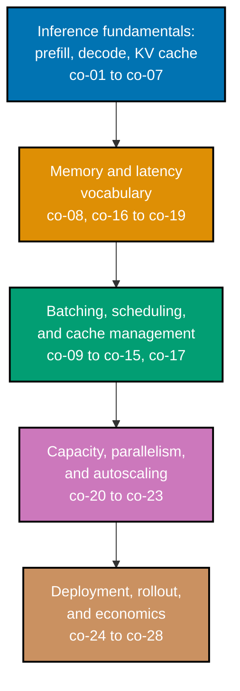

## Prerequisites

See this course's own [top-level Prerequisites](../overview.md#prerequisites) for the full list --
they are unchanged for this Learning track.

## Install and run your first example

Confirm Python 3 is installed:

```text
$ python3 --version
Python 3.13.x
```

**A note on versions**: this topic's worked-example transcripts were captured against Python 3.13 --
see this course's [Accuracy notes](../overview.md#accuracy-notes) for the exact re-verification
guidance if you are reading this against a materially later release. No third-party packages are
required for any of the 75 learning examples; every one of them uses only the Python standard library.

Every example in this topic is a complete, self-contained `.py` file colocated under
`learning/code/`. The command you will run for every one of them is exactly this:

```text
python3 example.py
```

Each example prints its own result and then finishes with a bare `assert` confirming the result is
correct -- a silent, zero-output exit (return code `0`) means every assertion passed. `python3
example.py; echo $?` is a quick way to confirm both the printed output and the exit code in one line.
No GPU, no downloaded model weights, and no paid API key are required anywhere in this topic --
every example runs against a small, deterministic, in-process simulator described in the top-level
Overview's Prerequisites.

## How this topic's examples are organized

- **Beginner** (Examples 1-28) -- the prefill/decode split and why decode is memory-bandwidth-bound,
  the KV cache and its size arithmetic, the GPU memory budget (weights, cache, activations,
  overhead), and the four-metric serving-latency vocabulary (TTFT, ITL, per-user tokens/sec,
  aggregate throughput).
- **Intermediate** (Examples 29-50) -- static versus continuous batching, the throughput/latency
  frontier, scheduling and admission control, chunked prefill, cache fragmentation and paged
  allocation (the OS-paging analogy), prefix sharing, and preemption.
- **Advanced** (Examples 51-75) -- quantization evaluated rather than assumed, model parallelism and
  its failure mode, capacity planning against a real length distribution, GPU-aware autoscaling,
  deployment packaging, staged rollout with guardrails, serving observability, and the
  self-hosting-versus-hosted-API decision including its total-cost-of-ownership sensitivity.

Every example cites the concept (`co-NN`) it exercises. Framework names, GPU prices, and quantization
figures are deliberately illustrative throughout -- see this course's
[Accuracy notes](../overview.md#accuracy-notes) for exactly which facts are volatile.



## Concepts

Every worked example in this topic's follow-up pages cites the `co-NN` concept it exercises -- this
section is the 1:1 reference those citations point back to. Read it in order: the prefill/decode
split comes first because almost every later concept is described in its terms.

### co-01 · Inference Is Not Ordinary Request/Response

The unit of work is a token, a request's total cost is unknown when it arrives, and the dominant
resource is memory held for the duration of the generation -- not CPU consumed at the request's
start. This single reframing is why serving infrastructure needs its own vocabulary rather than
reusing an ordinary web-service mental model.

**Why it matters**: every later concept in this section -- the KV cache, batching, scheduling,
capacity planning -- exists specifically because this framing is true; none of it would be necessary
if a request behaved like an ordinary, fixed-cost HTTP call.

**Verify it**: Example 1 simulates a served completion request end to end; Example 3 shows the exact
same prompt shape producing wildly different real costs, unknowable on arrival; Example 28's recap
pipeline threads this framing through admission, cache sizing, and the memory budget in one script.

### co-02 · Prefill Phase

Processing the input prompt is a parallel, compute-bound pass whose cost scales with prompt length --
every prompt token can be processed simultaneously because the model already has the entire prompt in
hand.

**Why it matters**: prefill's parallel, compute-bound character is the direct opposite of decode's
sequential, bandwidth-bound one (co-03) -- the asymmetry between these two phases explains almost
every counterintuitive serving behavior in this topic.

**Verify it**: Example 4 measures prefill cost as a function of prompt length directly; Example 6
profiles prefill against decode side by side on the same request.

### co-03 · Decode Phase

Emitting output tokens is sequential: each new token depends on every token generated before it, so
tokens cannot be produced in parallel within one request. This sequential dependency is also why
decode is memory-bandwidth-bound rather than compute-bound (co-04).

**Why it matters**: decode's sequential nature sets a hard latency floor per request that no amount of
extra compute can shorten -- Example 25 demonstrates this floor directly, and it is the reason
batching (co-11, co-12) targets aggregate throughput rather than any single request's speed.

**Verify it**: Example 5 measures decode cost per token; Example 25 shows decode cannot be
parallelized within a single request no matter how much compute is thrown at it.

### co-04 · Why Decode Is Bandwidth-Bound

Each decoded token requires reading the full weight set (and the growing cache) from GPU memory, so
decode throughput tracks memory bandwidth rather than raw arithmetic throughput -- adding more compute
does not speed up a bandwidth-bound operation.

**Why it matters**: this is the architectural reason a GPU with more raw FLOPs is not automatically a
faster decoder -- memory bandwidth, not compute, is the number that predicts decode speed.

**Verify it**: Example 7 demonstrates the bandwidth-bound character directly by holding compute
constant and varying the memory-access pattern.

### co-05 · KV-Cache Purpose

Caching each token's key and value tensors avoids recomputing attention over the entire sequence on
every single decode step -- without a cache, generating the Nth token would require reprocessing all
N-1 tokens that came before it, every single time.

**Why it matters**: this is the mechanism that makes autoregressive decoding practical at all; the
alternative (recomputing from scratch every step) scales quadratically with sequence length instead of
linearly.

**Verify it**: Example 9 measures the cost of the no-cache, full-recomputation approach directly;
Example 10 adds the cache and shows the cost drop.

### co-06 · KV-Cache Size Arithmetic

Cache size scales with sequence length, batch size, number of layers, and number of attention heads --
computing it precisely is the prerequisite to every capacity decision later in this topic.

**Why it matters**: without this formula, "how many concurrent requests can this GPU serve" has no
answer -- co-07's claim that cache is the scarce resource is only actionable once you can compute what
a request's cache actually costs.

**Verify it**: Example 11 derives and applies the cache-size formula directly; Example 20 uses it to
compute a context-window cache ceiling; Example 59 reuses the identical formula as one input to an
end-to-end capacity model.

### co-07 · KV-Cache Is the Scarce Resource

Available cache memory, not compute, usually sets the maximum number of concurrent requests a GPU can
serve -- a GPU can be compute-idle while completely full on cache.

**Why it matters**: this reframes "how do we serve more users" from a compute question into a memory
question -- quantization (co-19), paged allocation (co-09), and prefix sharing (co-10) all matter
specifically because they buy back cache capacity, not compute.

**Verify it**: Example 13 shows concurrency directly limited by cache budget, not by any compute
ceiling; Example 24 estimates max concurrency from cache alone; Example 59's capacity model makes this
the literal final division.

### co-08 · Cache Fragmentation

Variable and unpredictable generation lengths fragment naively (contiguously) allocated cache memory,
stranding capacity that is reserved but never used.

**Why it matters**: this is the concrete problem that makes co-09's paged allocation necessary rather
than optional -- without it, a serving stack must reserve worst-case cache for every request, wasting
most of what it reserves.

**Verify it**: Example 40 measures fragmentation waste directly on a realistic mixed-length workload,
quantifying exactly how much capacity a contiguous allocator strands.

### co-09 · Paged Cache Allocation

Allocating cache in fixed-size blocks rather than contiguous per-request regions recovers the stranded
capacity from co-08, on the same principle as operating-system virtual-memory paging.

**Why it matters**: this is widely credited as the single mechanism that made continuous batching
(co-12) and prefix sharing (co-10) practical at scale -- once cache is addressed in fixed blocks,
requests can reference shared blocks instead of needing identical contiguous memory.

**Verify it**: Example 41 recovers almost all of Example 40's stranded capacity via block-based
allocation; Example 42 makes the OS-paging analogy explicit, term by term; Example 50 prices the
block-size tuning knob this allocation scheme introduces.

### co-10 · Prefix Sharing

Requests that share an identical prompt prefix -- a common system prompt, most often -- can share the
cached keys and values for that prefix instead of storing and computing it twice.

**Why it matters**: this is the serving-side mechanism behind "prompt caching" discounts several
hosted model APIs offer -- the saving is real and measurable on the provider's own infrastructure, not
an arbitrary pricing choice.

**Verify it**: Example 43 prices the exact block saving from a shared system prompt; Example 44 shows
the saving is zero when no prefix is genuinely shared -- the technique is workload-dependent, not
guaranteed.

### co-11 · Static Batching Wastes

Batching a fixed group of requests together and waiting for every one of them to finish idles the GPU
on every request that finishes early -- its slot stays reserved and unused until the entire batch
completes.

**Why it matters**: this is the naive baseline that continuous batching (co-12) directly replaces --
understanding exactly how much it wastes is what makes continuous batching's throughput gain
measurable rather than assumed.

**Verify it**: Example 29 runs static batching directly; Example 30 measures its idle-slot waste as a
concrete number; Example 48 compares static and continuous occupancy over time on the identical
workload.

### co-12 · Continuous Batching

Admitting and retiring requests at token granularity -- rather than once per whole batch -- keeps the
batch close to full throughout, and is widely regarded as the single largest throughput win in modern
serving.

**Why it matters**: this one mechanism change is what separates a naive, static-batching server from a
production-grade serving stack; Example 32 attributes the entire throughput gain to it directly.

**Verify it**: Example 31 implements continuous batching and tracks occupancy step by step; Example 32
measures the throughput gain over static batching on the identical workload.

### co-13 · Scheduling and Admission Control

The scheduler decides which waiting requests join the active batch, and its policy determines
fairness, latency distribution, and tail behavior -- the same set of requests can see wildly different
wait times depending purely on scheduling policy.

**Why it matters**: this is a policy choice fully within an operator's control, unlike a request's
raw, unknowable cost (co-01) -- Example 36 shows a 50x difference in tail latency from policy alone,
with zero change to the underlying work.

**Verify it**: Example 35 implements the admission gate directly; Example 36 measures the tail-latency
difference between FCFS and shortest-first scheduling; Example 37 demonstrates strict-priority
starvation and Example 49 its round-robin fairness fix.

### co-14 · Preemption and Recompute

Under cache pressure, a running request can be evicted and its progress recomputed later -- trading
that one request's latency for the scheduler's ability to admit new, possibly higher-priority work
right now.

**Why it matters**: preemption is a deliberate, real cost, not a free safety valve -- left unchecked
(Example 46), it can degenerate into repeatedly evicting the same request before it ever completes.

**Verify it**: Example 45 evicts a request under pressure and shows its progress is discarded, not
paused; Example 46 shows the pathological repeated-eviction case and its minimum-progress-guard fix.

### co-15 · Throughput vs Latency

Batching more requests together raises aggregate tokens-per-second and simultaneously raises each
individual user's inter-token latency -- this trade is the central serving decision, and no
configuration optimizes both directions at once.

**Why it matters**: "tune the serving stack for best performance" is not a well-formed request until
you decide which metric (an ITL-based SLO, or a throughput target) you are accountable for -- this
concept is why that decision has to come first.

**Verify it**: Example 33 sweeps batch size against ITL directly; Example 34 traces the full
throughput/latency frontier and confirms no configuration beats an earlier one on both axes at once.

### co-16 · Serving-Latency Vocabulary

Time-to-first-token (TTFT), inter-token latency (ITL), per-user tokens/sec, and aggregate throughput
are four distinct metrics, each optimized by opposing serving choices -- "improve latency" means
nothing concrete until you specify which of these four you mean.

**Why it matters**: co-17's TTFT-versus-ITL tension, co-26's observability dashboard, and co-70's
percentile analysis are all built directly on this four-metric vocabulary; conflating any two of them
produces an incoherent SLO.

**Verify it**: Example 16 defines and computes all four metrics from one generation trace; Example 70
extends the vocabulary with p50/p99 percentile analysis under load.

### co-17 · TTFT vs ITL Tradeoff

Prioritizing an incoming request's prefill improves its own time-to-first-token but stalls every
in-flight request's decode steps; prioritizing decode does the reverse -- this is co-15's throughput/
latency trade, restated specifically for prefill scheduling.

**Why it matters**: chunked prefill (Example 39) is the mechanism that reconciles this tension without
forcing an operator to choose a strict, all-or-nothing side.

**Verify it**: Example 38 measures the direct trade -- a new request's TTFT improves while every
in-flight request's ITL absorbs a real stall; Example 39 bounds that stall via chunking.

### co-18 · GPU Memory Budget

Weights, KV cache, activations, and framework overhead must all fit in one GPU's memory -- the
remainder after weights is what actually buys concurrency, via co-06's cache-size arithmetic.

**Why it matters**: this budget is the single input that turns co-06's per-request cache formula into
a real concurrency number (Example 59) -- without it, cache-size arithmetic has nothing to divide
into.

**Verify it**: Example 14 breaks down a GPU memory budget into its components; Example 19 computes the
weights portion directly from parameter count and precision.

### co-19 · Quantization Tradeoff

Reducing numeric precision (fp16 to INT8 to INT4) shrinks both weights and cache, buying capacity and
speed at a measurable quality cost that must be evaluated on your own workload, never assumed from a
published number.

**Why it matters**: this is the syllabus's clearest case for measuring rather than trusting -- a
published degradation figure for one task does not transfer to a different one, which is exactly why
this topic's own quality numbers are synthetic and illustrative rather than cited benchmark claims.

**Verify it**: Example 51 quantizes a tiny weight vector and measures reconstruction error directly;
Example 52 prices the quality/memory trade across three precision levels; Example 53 turns a quality
floor into an automatic decision.

### co-20 · Model-Parallelism Basics

A model too large for one device is split across several -- tensor parallelism divides weight
matrices evenly but adds per-layer interconnect traffic and removes fault tolerance: a single device
failure fails the entire request.

**Why it matters**: this is a "when you have no other choice" tool, reached for only once quantization
(co-19) alone cannot fit a model on the available hardware; the interconnect cost it adds can dominate
decode-step latency on a slow link.

**Verify it**: Example 54 shards weights and estimates interconnect traffic; Example 55 demonstrates
the single-point-of-failure behavior directly; Example 69 prices interconnect bandwidth against a real
decode-step budget.

### co-21 · Capacity Planning for Token Workloads

Capacity is planned against a distribution of prompt and output lengths, not a single request rate,
because request cost is not uniform -- a handful of very long generations can dominate resource
consumption far more than their share of request count suggests.

**Why it matters**: skipping straight to "the average request needs N resources" hides exactly the
tail behavior (Example 56's p99 length is 20x its mean) that determines worst-case capacity.

**Verify it**: Example 56 materializes a realistic length distribution and computes its mean versus
tail; Example 59 chains that distribution's implications into a concrete concurrency number.

### co-22 · Load-Testing a Token Service

A load test must reproduce the real prompt-length and output-length distribution or it measures a
workload that does not exist -- substituting a uniform "average length" assumption produces a clean
but wrong number.

**Why it matters**: Example 58 shows a 25% understatement of real wall-clock cost purely from this
substitution -- a load test's number is only as trustworthy as the length distribution that produced
it.

**Verify it**: Example 57 drives the production batching engine with a realistic length mix; Example
58 contrasts that result against the uniform-average shortcut on the identical requests.

### co-23 · Autoscaling a GPU Service

Long cold starts from loading weights, and coarse, expensive scaling units, make GPU autoscaling
behave unlike stateless CPU autoscaling -- a policy that waits until the queue is already deep scales
out too late.

**Why it matters**: Example 60's multi-second cold start directly explains why Example 61's naive,
reactive policy under-provisions -- a GPU-aware policy must project queue growth across the cold-start
window, not react to the queue as it stands right now.

**Verify it**: Example 60 measures a realistic cold start directly; Example 61 contrasts a naive
reactive policy against a proactive one; Example 71 demonstrates threshold-oscillation thrashing and
its cooldown fix.

### co-24 · Deployment Packaging

The served artifact is weights plus runtime plus configuration, versioned and rolled out as one unit
-- not three independently-changing pieces.

**Why it matters**: this single-unit framing is what makes staged rollout (co-25) and rollback
coherent -- you can only roll a _version_ forward or back if every deploy produces one identifiable,
complete manifest.

**Verify it**: Example 1 first names an inference server as a real deployed service; Example 62
builds a complete deployment manifest directly, flagging every volatile field explicitly.

### co-25 · Rollout and Rollback of a Model

Changing the served model is a production change with quality consequences, requiring the same staged
rollout and rollback discipline as any other software release -- not a one-shot swap.

**Why it matters**: staging bounds the blast radius of a bad model to a small fraction of traffic;
Example 63 shows a bad model caught and halted at the cheapest possible stage (5% traffic).

**Verify it**: Example 63 stages a rollout against an error-rate guardrail; Example 72 extends the
guardrail to also cover tail latency; Example 73 turns a latency regression into an automatic rollback
decision.

### co-26 · Observability for Serving

Queue depth, batch occupancy, cache utilization, preemption rate, and co-16's latency metrics are the
signals that explain a serving problem -- read together, a small set of aggregated metrics is usually
enough to diagnose an incident without inspecting individual request traces.

**Why it matters**: Example 74 shows this concretely -- the same five-signal dashboard shape correctly
separates a genuine incident from a healthy service using a simple, deterministic rule chain.

**Verify it**: Example 64 builds the dashboard from raw request traces; Example 74 runs the diagnosis
rule chain against both an incident and a healthy baseline.

### co-27 · Self-Hosting Decision

Self-hosting wins on sustained high utilization, data residency, latency floors, and model control,
and loses on operational burden, idle cost, and elasticity -- the decision depends entirely on which
side of that trade your traffic and organization sit on.

**Why it matters**: the syllabus is explicit that comparing hourly GPU cost against per-token API
price at full utilization is "almost always wrong" -- Example 65's calculation is correct, but every
input number in it must be re-sourced and the utilization assumption must be realistic (co-28).

**Verify it**: Example 65 prices self-hosted cost against a hosted API at full utilization directly.

### co-28 · Total Cost of Ownership

The honest self-hosting-versus-buy comparison includes idle hours, engineering time, on-call, and the
utilization you will actually achieve -- not the hourly GPU price against the API price at full load.

**Why it matters**: Example 75 shows the identical GPU, at the identical hourly rate, swinging from
cheaper-than-the-API to nearly 3.5x more expensive purely as a function of realistic utilization --
utilization is not a footnote to this calculation, it is the calculation.

**Verify it**: Example 75 sweeps the self-hosted cost across three utilization levels and compares
each against the hosted-API price point from Example 65.

## Examples by Level

### Beginner (Examples 1-28)

- [Example 1: Serve a Model Locally](/en/learn/courses/inference-serving-and-model-deployment/learning/beginner#example-1-serve-a-model-locally)
- [Example 2: Token Is the Unit of Work](/en/learn/courses/inference-serving-and-model-deployment/learning/beginner#example-2-token-is-the-unit-of-work)
- [Example 3: Unknown Cost on Arrival](/en/learn/courses/inference-serving-and-model-deployment/learning/beginner#example-3-unknown-cost-on-arrival)
- [Example 4: Measure Prefill](/en/learn/courses/inference-serving-and-model-deployment/learning/beginner#example-4-measure-prefill)
- [Example 5: Measure Decode](/en/learn/courses/inference-serving-and-model-deployment/learning/beginner#example-5-measure-decode)
- [Example 6: Prefill vs Decode Profile](/en/learn/courses/inference-serving-and-model-deployment/learning/beginner#example-6-prefill-vs-decode-profile)
- [Example 7: Bandwidth-Bound Demonstration](/en/learn/courses/inference-serving-and-model-deployment/learning/beginner#example-7-bandwidth-bound-demonstration)
- [Example 8: Request Lifecycle -- the Phase Diagram](/en/learn/courses/inference-serving-and-model-deployment/learning/beginner#example-8-request-lifecycle----the-phase-diagram)
- [Example 9: No-Cache Recomputation](/en/learn/courses/inference-serving-and-model-deployment/learning/beginner#example-9-no-cache-recomputation)
- [Example 10: Add the KV Cache](/en/learn/courses/inference-serving-and-model-deployment/learning/beginner#example-10-add-the-kv-cache)
- [Example 11: Compute Cache Size](/en/learn/courses/inference-serving-and-model-deployment/learning/beginner#example-11-compute-cache-size)
- [Example 12: Cache Growth Over a Generation](/en/learn/courses/inference-serving-and-model-deployment/learning/beginner#example-12-cache-growth-over-a-generation)
- [Example 13: Concurrency Limited by Cache](/en/learn/courses/inference-serving-and-model-deployment/learning/beginner#example-13-concurrency-limited-by-cache)
- [Example 14: Memory Budget Breakdown](/en/learn/courses/inference-serving-and-model-deployment/learning/beginner#example-14-memory-budget-breakdown)
- [Example 15: The Memory Budget Diagram](/en/learn/courses/inference-serving-and-model-deployment/learning/beginner#example-15-the-memory-budget-diagram)
- [Example 16: Latency Vocabulary](/en/learn/courses/inference-serving-and-model-deployment/learning/beginner#example-16-latency-vocabulary)
- [Example 17: Tokens vs Characters](/en/learn/courses/inference-serving-and-model-deployment/learning/beginner#example-17-tokens-vs-characters)
- [Example 18: Precision Formats and Bytes](/en/learn/courses/inference-serving-and-model-deployment/learning/beginner#example-18-precision-formats-and-bytes)
- [Example 19: Weights Memory Arithmetic](/en/learn/courses/inference-serving-and-model-deployment/learning/beginner#example-19-weights-memory-arithmetic)
- [Example 20: Context Window and the Cache Ceiling](/en/learn/courses/inference-serving-and-model-deployment/learning/beginner#example-20-context-window-and-the-cache-ceiling)
- [Example 21: A Single Request's Timeline](/en/learn/courses/inference-serving-and-model-deployment/learning/beginner#example-21-a-single-requests-timeline)
- [Example 22: Output Length Is a Random Variable](/en/learn/courses/inference-serving-and-model-deployment/learning/beginner#example-22-output-length-is-a-random-variable)
- [Example 23: Why Request Count Is a Bad Metric](/en/learn/courses/inference-serving-and-model-deployment/learning/beginner#example-23-why-request-count-is-a-bad-metric)
- [Example 24: Estimate Max Concurrency (Simple)](/en/learn/courses/inference-serving-and-model-deployment/learning/beginner#example-24-estimate-max-concurrency-simple)
- [Example 25: Sequential Decode Cannot Parallelize Within a Request](/en/learn/courses/inference-serving-and-model-deployment/learning/beginner#example-25-sequential-decode-cannot-parallelize-within-a-request)
- [Example 26: Multiple Requests Share the GPU](/en/learn/courses/inference-serving-and-model-deployment/learning/beginner#example-26-multiple-requests-share-the-gpu)
- [Example 27: Cache Budget vs Sequence Length](/en/learn/courses/inference-serving-and-model-deployment/learning/beginner#example-27-cache-budget-vs-sequence-length)
- [Example 28: Beginner Recap -- the End-to-End Admission Pipeline](/en/learn/courses/inference-serving-and-model-deployment/learning/beginner#example-28-beginner-recap----the-end-to-end-admission-pipeline)

### Intermediate (Examples 29-50)

- [Example 29: Static Batching](/en/learn/courses/inference-serving-and-model-deployment/learning/intermediate#example-29-static-batching)
- [Example 30: Static Batching -- Idle Waste](/en/learn/courses/inference-serving-and-model-deployment/learning/intermediate#example-30-static-batching----idle-waste)
- [Example 31: Continuous Batching](/en/learn/courses/inference-serving-and-model-deployment/learning/intermediate#example-31-continuous-batching)
- [Example 32: Throughput Gain -- Static vs Continuous](/en/learn/courses/inference-serving-and-model-deployment/learning/intermediate#example-32-throughput-gain----static-vs-continuous)
- [Example 33: Batch Size vs Inter-Token Latency](/en/learn/courses/inference-serving-and-model-deployment/learning/intermediate#example-33-batch-size-vs-inter-token-latency)
- [Example 34: The Throughput/Latency Frontier](/en/learn/courses/inference-serving-and-model-deployment/learning/intermediate#example-34-the-throughputlatency-frontier)
- [Example 35: Admission Control Policy](/en/learn/courses/inference-serving-and-model-deployment/learning/intermediate#example-35-admission-control-policy)
- [Example 36: Scheduling Policy Affects Tails](/en/learn/courses/inference-serving-and-model-deployment/learning/intermediate#example-36-scheduling-policy-affects-tails)
- [Example 37: Scheduler Starvation](/en/learn/courses/inference-serving-and-model-deployment/learning/intermediate#example-37-scheduler-starvation)
- [Example 38: Prefill Priority Hurts ITL](/en/learn/courses/inference-serving-and-model-deployment/learning/intermediate#example-38-prefill-priority-hurts-itl)
- [Example 39: Chunked Prefill](/en/learn/courses/inference-serving-and-model-deployment/learning/intermediate#example-39-chunked-prefill)
- [Example 40: Contiguous Cache Fragmentation](/en/learn/courses/inference-serving-and-model-deployment/learning/intermediate#example-40-contiguous-cache-fragmentation)
- [Example 41: Paged Cache Allocation](/en/learn/courses/inference-serving-and-model-deployment/learning/intermediate#example-41-paged-cache-allocation)
- [Example 42: The Paging Analogy](/en/learn/courses/inference-serving-and-model-deployment/learning/intermediate#example-42-the-paging-analogy)
- [Example 43: Prefix Sharing](/en/learn/courses/inference-serving-and-model-deployment/learning/intermediate#example-43-prefix-sharing)
- [Example 44: Prefix Sharing Limits](/en/learn/courses/inference-serving-and-model-deployment/learning/intermediate#example-44-prefix-sharing-limits)
- [Example 45: Preemption Under Pressure](/en/learn/courses/inference-serving-and-model-deployment/learning/intermediate#example-45-preemption-under-pressure)
- [Example 46: Preemption Thrashing](/en/learn/courses/inference-serving-and-model-deployment/learning/intermediate#example-46-preemption-thrashing)
- [Example 47: Request Queue Wait Time](/en/learn/courses/inference-serving-and-model-deployment/learning/intermediate#example-47-request-queue-wait-time)
- [Example 48: Batch Occupancy Over Time -- Static vs Continuous](/en/learn/courses/inference-serving-and-model-deployment/learning/intermediate#example-48-batch-occupancy-over-time----static-vs-continuous)
- [Example 49: Fairness Across Request Classes](/en/learn/courses/inference-serving-and-model-deployment/learning/intermediate#example-49-fairness-across-request-classes)
- [Example 50: Cache Block Size Tradeoff](/en/learn/courses/inference-serving-and-model-deployment/learning/intermediate#example-50-cache-block-size-tradeoff)

### Advanced (Examples 51-75)

- [Example 51: Quantize a Model](/en/learn/courses/inference-serving-and-model-deployment/learning/advanced#example-51-quantize-a-model)
- [Example 52: Quantization Quality Cost](/en/learn/courses/inference-serving-and-model-deployment/learning/advanced#example-52-quantization-quality-cost)
- [Example 53: Quantization Decision Record](/en/learn/courses/inference-serving-and-model-deployment/learning/advanced#example-53-quantization-decision-record)
- [Example 54: Model-Parallel Split](/en/learn/courses/inference-serving-and-model-deployment/learning/advanced#example-54-model-parallel-split)
- [Example 55: Parallelism Failure Mode](/en/learn/courses/inference-serving-and-model-deployment/learning/advanced#example-55-parallelism-failure-mode)
- [Example 56: Workload Length Distribution](/en/learn/courses/inference-serving-and-model-deployment/learning/advanced#example-56-workload-length-distribution)
- [Example 57: Realistic Load Test](/en/learn/courses/inference-serving-and-model-deployment/learning/advanced#example-57-realistic-load-test)
- [Example 58: Load Test That Lies](/en/learn/courses/inference-serving-and-model-deployment/learning/advanced#example-58-load-test-that-lies)
- [Example 59: Capacity Model](/en/learn/courses/inference-serving-and-model-deployment/learning/advanced#example-59-capacity-model)
- [Example 60: GPU Cold Start](/en/learn/courses/inference-serving-and-model-deployment/learning/advanced#example-60-gpu-cold-start)
- [Example 61: Autoscaling Policy](/en/learn/courses/inference-serving-and-model-deployment/learning/advanced#example-61-autoscaling-policy)
- [Example 62: Package the Deployment](/en/learn/courses/inference-serving-and-model-deployment/learning/advanced#example-62-package-the-deployment)
- [Example 63: Staged Model Rollout](/en/learn/courses/inference-serving-and-model-deployment/learning/advanced#example-63-staged-model-rollout)
- [Example 64: Serving Observability Dashboard](/en/learn/courses/inference-serving-and-model-deployment/learning/advanced#example-64-serving-observability-dashboard)
- [Example 65: Build-vs-Buy Calculation](/en/learn/courses/inference-serving-and-model-deployment/learning/advanced#example-65-build-vs-buy-calculation)
- [Example 66: Quantization INT8 vs INT4 Memory](/en/learn/courses/inference-serving-and-model-deployment/learning/advanced#example-66-quantization-int8-vs-int4-memory)
- [Example 67: Mixed-Precision Serving](/en/learn/courses/inference-serving-and-model-deployment/learning/advanced#example-67-mixed-precision-serving)
- [Example 68: Tensor-Parallel vs Pipeline-Parallel](/en/learn/courses/inference-serving-and-model-deployment/learning/advanced#example-68-tensor-parallel-vs-pipeline-parallel)
- [Example 69: Interconnect Bottleneck Measurement](/en/learn/courses/inference-serving-and-model-deployment/learning/advanced#example-69-interconnect-bottleneck-measurement)
- [Example 70: P50/P99 Latency Under Load](/en/learn/courses/inference-serving-and-model-deployment/learning/advanced#example-70-p50p99-latency-under-load)
- [Example 71: Autoscaling Thrashing](/en/learn/courses/inference-serving-and-model-deployment/learning/advanced#example-71-autoscaling-thrashing)
- [Example 72: Canary Rollout With Metrics Guardrail](/en/learn/courses/inference-serving-and-model-deployment/learning/advanced#example-72-canary-rollout-with-metrics-guardrail)
- [Example 73: Rollback on Latency Regression](/en/learn/courses/inference-serving-and-model-deployment/learning/advanced#example-73-rollback-on-latency-regression)
- [Example 74: Full Observability Explains an Incident](/en/learn/courses/inference-serving-and-model-deployment/learning/advanced#example-74-full-observability-explains-an-incident)
- [Example 75: TCO Sensitivity to Utilization](/en/learn/courses/inference-serving-and-model-deployment/learning/advanced#example-75-tco-sensitivity-to-utilization)

---

← Previous: [Course Overview](../overview.md) · Next: [Beginner Examples](./beginner.md) →
