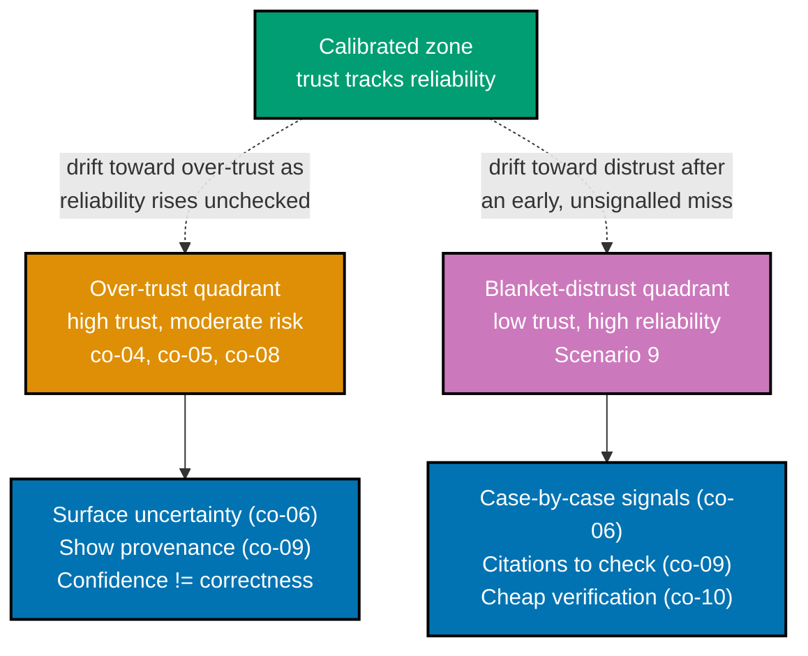

> Worked Scenario 6 -- trust-calibration diagram -- exercises co-04.

Trust calibration plots actual reliability on one axis against observed user trust on the other.
The diagonal is the calibrated zone: trust tracking reliability. The two off-diagonal quadrants are
both design failures, and each is corrected by a different set of interface moves.

_Figure: the calibrated zone sits between two named failure quadrants. A feature drifts toward
over-trust as its measured reliability rises without a matching uncertainty signal (Scenario 8), and
toward blanket distrust after an early miss with no case-by-case signal to fall back on (Scenario
9). Each quadrant's fix is a distinct set of interface moves, not a single universal remedy._

**Verify**: both off-diagonal quadrants are present, each is labelled with the specific scenario
that instantiates it (Scenario 8 for over-trust, Scenario 9 for distrust), and each has its own,
distinct fix list -- satisfying co-04's rule that trust calibration is a two-sided design problem.

**Key takeaway**: There is no single "add more trust signals" fix -- over-trust and blanket distrust
require opposite interventions, and a design that treats trust as one-dimensional will
under-correct one quadrant while over-correcting the other.

**Why It Matters**: This diagram is the map every later worked scenario about trust, uncertainty, or
provenance implicitly places itself on. Recognising which quadrant a given feature is drifting
toward -- before choosing a fix -- is what prevents a team from, for example, adding more caveats
(a distrust-quadrant fix) to a feature that is actually suffering from over-trust, which would make
the real problem worse rather than better.

---

← Back to [Theme A: The Wrong Answer Is Coming](../theme-a-the-wrong-answer-is-coming.md)
