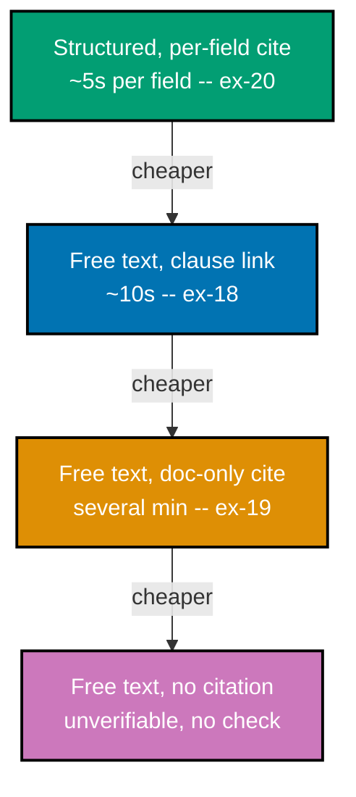

> Worked Scenario 21 -- verifiability diagram -- exercises co-10, co-09.

This diagram ranks the output structures seen across Theme B by verification cost -- how long it
takes a user to independently check a claim, from cheapest (top) to most expensive (bottom).

_Figure: four output structures, ordered by measured or estimated verification cost. The arrows
read "cheaper than" -- each rung down the ladder costs a user meaningfully more time and effort to
independently check, for no gain in the underlying answer's accuracy._

**Verify**: all four rungs appear in strictly increasing verification-cost order, and each rung
cites the specific worked scenario that produced or diagnosed it -- satisfying co-10 and co-09's
rule that verification cost is a rankable, not merely qualitative, property of an output's shape.

**Key takeaway**: Two answers with identical underlying accuracy can have wildly different real-world
usability, entirely as a function of how their output is structured -- verification cost is a design
variable, not a fixed cost of using a probabilistic feature.

**Why It Matters**: This ladder is the concrete argument for treating co-10 as the single
highest-leverage pattern in this theme: moving one rung up costs a product team a one-time
engineering investment in output structure and citation precision, and pays back on every single
answer the feature produces, forever. A team auditing its own feature can place its current output
format on this same ladder to see, concretely, how much investment separates it from the cheapest
achievable rung -- turning an abstract "make citations better" goal into a specific, measurable rung
to climb toward.

---

← Back to [Theme B: Uncertainty, Confidence, and Provenance](../theme-b-uncertainty-confidence-and-provenance.md)
