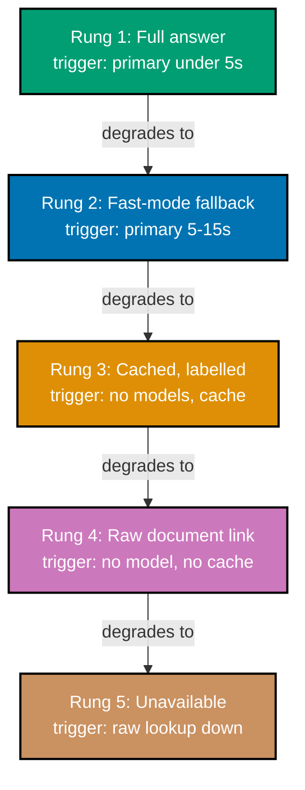

> Worked Scenario 36 -- degradation diagram -- exercises co-18, co-16.

This diagram renders Worked Scenario 35's five-rung fallback hierarchy as a flow, with each rung's
observable trigger condition made explicit.

_Figure: the system falls exactly one rung at a time, never skipping a level, and each arrow is
labelled with the specific, observable condition that triggers the fall. Every rung remains visibly
labelled to the user (Scenario 37), so a degraded state is never rendered identically to a healthy
one._

**Verify**: all five rungs appear in the same order as Worked Scenario 35's table, each edge names a
concrete trigger condition rather than a vague description, and the chain terminates at the
unavailable state (Scenario 34) -- satisfying co-18's rule that a fallback hierarchy's rungs must
each have an observable trigger.

**Key takeaway**: A fallback hierarchy is a chain of concrete, observable conditions, not a single
"handle errors gracefully" instruction -- each arrow in this diagram is independently testable
against real production behaviour.

**Why It Matters**: An on-call engineer facing a real incident can use this diagram to answer "which
rung are we on right now, and what condition needs to change for us to recover a rung?" -- a
question an undesigned degradation path cannot answer at all, because it has no named rungs to be
on.

---

← Back to [Theme D: Degradation, Latency, and the Launch Decision](../theme-d-degradation-latency-and-the-launch-decision.md)
