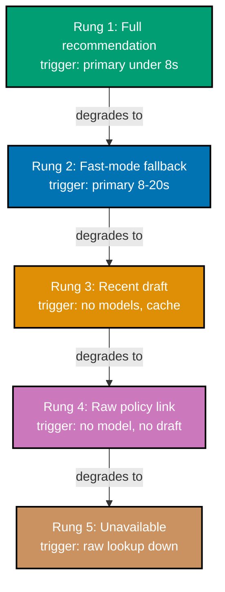

> Meridian Claims Assistant -- degradation design.

## Fallback hierarchy

| Rung | Condition                                                       | Behaviour                                                                                                                                                                                                  | Quality                               |
| ---- | --------------------------------------------------------------- | ---------------------------------------------------------------------------------------------------------------------------------------------------------------------------------------------------------- | ------------------------------------- |
| 1    | Primary model responds within 8s                                | Full structured recommendation with per-clause citations.                                                                                                                                                  | Best available.                       |
| 2    | Primary model slow (8-20s) or rate-limited                      | Falls to a smaller, faster model, same structured citation format, flagged "fast mode."                                                                                                                    | Slightly lower accuracy, still cited. |
| 3    | Both models unavailable, this exact claim was recently assessed | Serves the most recent draft for this claim, explicitly labelled "draft from [timestamp], not re-verified."                                                                                                | Stale but labelled, never silent.     |
| 4    | No model available, no recent draft                             | Deterministic fallback: surfaces the raw policy section matching the claim's declared damage type, no generated recommendation at all -- Dana assesses manually with the relevant policy text pre-located. | Lowest, but honest and never wrong.   |
| 5    | Even the raw policy-section lookup is unavailable               | Explicit "Assistant unavailable -- assess this claim manually; your queue is unaffected" banner, input disabled but visible.                                                                               | No recommendation offered.            |

_Diagram: five rungs, each with an observable trigger condition, falling one at a time from a full
recommendation to an explicit unavailable state -- never silently skipping a level._

## Visibility check

Every rung carries its own explicit label (a "fast mode" flag, a "draft from [timestamp]" note, the
raw-lookup's absence of any generated text, or the unavailable banner) so Dana can always tell which
rung the assistant is currently operating on -- no rung is rendered identically to rung 1's full
recommendation.

**Verify**: every rung states a concrete, observable trigger condition (co-18); the diagram matches
the table exactly and terminates at an explicit unavailable state (co-16); no rung is visually
indistinguishable from a fully healthy recommendation (co-19).

**Key takeaway**: The fallback hierarchy gives Dana five distinct, honestly labelled states instead
of one binary "working or broken" state -- and rung 4's raw-policy-section fallback means even a
total model outage leaves her with a genuine time-saving head start rather than nothing at all.
