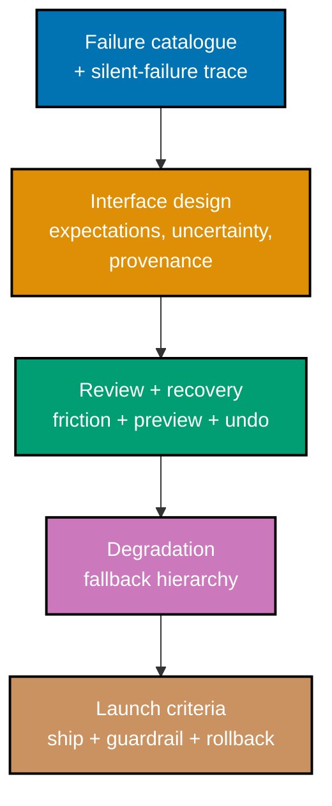

## Goal

Produce the complete product-design dossier for one real probabilistic feature -- the **Meridian
Claims Assistant**, a copilot that drafts an approve/deny/escalate recommendation for an insurance
claims adjuster to review -- that a team could take to a launch review. This is a leadership
design/decision capstone: no code, zero runnable files. Every mechanism assembled here was already
taught, individually, somewhere in this course's Theme A through Theme D worked scenarios, applied
to the recurring Nimbus example; this capstone is where the same mechanisms run together on an
independently chosen new feature, at launch-review scale.

_Diagram: the capstone's build order -- catalogue the failures, design the interface around them,
design the review-and-recovery layer, plan the degradation path, and write the launch criteria that
close the loop._

## Concepts exercised

- [x] a user-visible failure catalogue including the silent-failure path (co-02, co-19)
- [x] expectation setting and a trust-calibration plan (co-03, co-04, co-05)
- [x] a selective uncertainty and provenance policy, accessible without colour (co-06 through co-09)
- [x] verifiability designed into the output shape (co-10)
- [x] a human-review design costed against reviewer decay (co-11, co-12)
- [x] a consequence-scaled friction table with preview and complete undo (co-13 through co-15)
- [x] a fallback hierarchy with observable triggers (co-16 through co-18)
- [x] scoping decisions taken against the measured failure rate (co-20)
- [x] ship, guardrail, and rollback criteria against a distribution (co-21 through co-23)
- [x] a correction affordance feeding error analysis (co-24)

Each step below lives in its own file, listed in the [capstone index](./_index.md). Nothing on this
page repeats those files' content; this page narrates the build order and the concepts each step
exercises.

## Step 1: Failure catalogue

_exercises co-02, co-19_

[`learning/capstone/failure-catalogue.md`](./failure-catalogue.md) enumerates the Meridian Claims
Assistant's six user-visible failure modes with a concrete example of each, then traces one
confidently-wrong recommendation end to end, to the adjuster's actual decision -- the same discipline
Worked Scenarios 2 and 3 applied to Nimbus.

**Verify**: every failure mode is distinguishable by a user with no visibility into the model's
internals, and the silent-failure path is walked explicitly to a real decision point, not merely
asserted to exist.

## Step 2: Interface design

_exercises co-03, co-04, co-05, co-06 through co-10_

[`learning/capstone/interface-design.md`](./interface-design.md) sets first-contact expectations
honestly, applies a selective uncertainty and provenance policy meeting WCAG AA without relying on
colour, and restructures the recommendation's output shape so an adjuster can verify it cheaply --
the combined product of Theme A's trust-calibration work and Theme B's uncertainty-and-provenance
toolkit.

**Verify**: every design element in this file traces to a specific failure mode named in Step 1, and
no element is uncertainty theatre (a signal present on every output regardless of actual confidence).

## Step 3: Review and recovery

_exercises co-11 through co-15, co-24_

[`learning/capstone/review-and-recovery.md`](./review-and-recovery.md) designs the adjuster's review
flow with a measured or estimated review cost, a consequence-scaled friction table covering every
action the assistant can take, a preview-and-diff design, a complete-undo design, and the correction
affordance -- Theme C's full toolkit, applied fresh.

**Verify**: the review step is cheaper than the adjuster's unaided task, friction is not applied
uniformly across actions, and undo is complete rather than partial.

## Step 4: Degradation and launch criteria

_exercises co-16 through co-18, co-20 through co-23_

[`learning/capstone/degradation.md`](./degradation.md) designs the fallback hierarchy with its
Mermaid diagram and observable trigger conditions; [`learning/capstone/launch-criteria.md`](./launch-criteria.md)
writes ship, staged-rollout guardrail, and rollback criteria against a measured distribution, plus a
named acceptable worst case -- Theme D's complete toolkit, closing the dossier.

**Verify**: every fallback rung has an observable trigger; every launch criterion is checkable
against a real eval report; rollback criteria are unambiguous enough to act on during a real
incident without renegotiation.

## Acceptance criteria

- Every design decision in the dossier traces to a named user-visible failure mode from Step 1.
- The confidently-wrong path is explicitly addressed, not assumed away.
- Uncertainty signals are selective, accessible without colour, and never present confidence as
  probability-of-correct.
- The human-review design is costed and is cheaper than the adjuster's unaided task, with the
  vigilance decrement explicitly mitigated.
- Friction scales with reversibility and blast radius rather than being uniform; undo is complete.
- The fallback ladder's triggers are observable and the degraded state is visible to the adjuster,
  never silent.
- Ship, guardrail, and rollback criteria are each expressed as a threshold on a measured
  distribution with an interval, plus a named acceptable worst case, checkable against a real eval
  report, and written down before launch.

## Done bar

This capstone produces the stated artefact: a complete, reviewable, five-file written dossier for
the Meridian Claims Assistant that a real launch review could act on -- combining every mechanism
this course taught, from the deterministic-interface-assumption framing (co-01, implicit throughout
Step 1) through failure modes and expectation setting (co-02 through co-05), uncertainty and
provenance (co-06 through co-10), human review and recovery (co-11 through co-15), scoping and
degradation (co-16 through co-20), and launch, guardrail, and rollback criteria (co-21 through
co-23), closed by the correction affordance (co-24) -- exactly as Worked Scenario 44 already
demonstrated at the same scale for Nimbus, applied here to a new, independently chosen feature.

---

Next: [Drilling](../../drilling/overview.md) →
