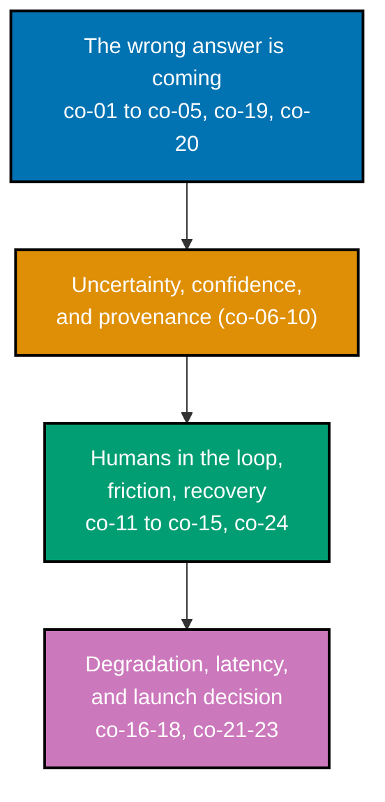

## Prerequisites

- **Prior topics**: `creating-ai-powered-apps` (what the model can and cannot be asked for --
  `[Unverified]` not yet present in the AyoKoding course library on disk);
  [Evaluating AI Output -- Essentials](../../evaluating-ai-output-essentials/learning/overview.md)
  for the pass-rate framing Theme D's ship criteria extend with a confidence interval (co-21);
  [32 · Software Product Engineering](../../software-product-engineering/learning/overview.md) for
  product framing, scoping, and release practice; [14 · Frontend Essentials](../../frontend-essentials/learning/overview.md)
  for interface vocabulary and the accessibility baseline every uncertainty signal in this course
  must clear.
- **Tools & environment**: a Markdown editor for the decision artifacts (tables, memos, criteria
  documents), a diagramming surface for the Mermaid flows, and access to one real probabilistic
  feature to critique across this course's scenarios. There is no runtime to install -- every
  deliverable in this course is a design document or a decision artifact, not a program.
- **Assumed knowledge**: what an LLM-backed feature does and roughly how it fails; the ability to
  read an eval report and interpret a pass rate; basic interface and accessibility
  vocabulary.

## Why this exists -- the big idea

**The problem before the solution**: standard product patterns assume the system either succeeds or
fails, and says so. A probabilistic feature succeeds partially, fails silently, fails confidently,
and fails differently for the same input twice -- and an interface built for the deterministic case
has no state for any of that. **The one idea worth keeping if you forget everything else**: design
for the wrong answer, because it is coming -- make it visible, make it cheap to catch, and make it
cheap to undo.

**Cross-cutting big ideas**: `determinism-vs-emergence` -- the interface is where a stochastic
component meets a human who expects determinism. `correctness-vs-pragmatism` -- the product goal is
a recoverable workflow, not a correct one.

## How verification works in this course

Earlier courses in the AI-engineering track verify a claim by running something and reading its
output. This course has no interpreter to run: an interface walkthrough, a failure catalogue, and a
launch-criteria sheet are not executable, so there is no command that confirms one is "correct" the
way `pytest` confirms a function's return value. Verification here instead means checking an
**observable property of the written artefact itself** against a stated rule -- something you can
point at on the page, not a vague description of what a "good" design should feel like. A few
concrete examples that recur throughout this course:

- A **failure catalogue** is verifiable: does it name all six user-visible failure modes, and does
  it explicitly trace the confidently-wrong path to the user's decision point? Read it and check.
- An **uncertainty signal** is verifiable: does it survive a colour-blind and a screen-reader
  reading, and does it sit at the decision point rather than in a footer? Either it does or it does
  not.
- A **launch-criteria sheet** is verifiable: does every criterion cite a threshold on a measured
  distribution, an interval, and a named acceptable worst case? Each of those is either present or
  it is not.

Every concept below and every worked scenario that follows states its own **Verify it** / **Verify**
rule in exactly this observable-property form.

_Diagram: the four theme clusters this course teaches, in reading order -- from naming why a
deterministic interface fails, through surfacing uncertainty honestly, designing the human review
and recovery layer, to the degradation and launch-decision layer that closes the loop._

## Concepts

Every worked scenario in this course's theme pages cites the `co-NN` concept it exercises -- this
section is the 1:1 reference those citations point back to.

### co-01 · The Deterministic-Interface Assumption

Standard product patterns -- a text box that returns an answer, a button that performs an action, an
error state for the rare failure -- encode a success-or-error model. A probabilistic feature
violates that model by succeeding partially, failing confidently, and failing differently on
identical inputs, and an interface built only for success-or-error has no state for any of those.

**Why it matters**: reusing a deterministic pattern unchanged is how the dominant failure of a
probabilistic system -- a plausible wrong answer rendered identically to a right one -- ships with
no state to land in.

**Verify it**: walk a probabilistic feature's confidently-wrong output through its current
interface; the walkthrough is well-formed if it names the exact screen or state the output lands in
and confirms nothing there distinguishes it from a correct answer.

### co-02 · Failure Modes Users Experience

Confidently wrong, subtly wrong, refused, truncated, slow, and inconsistent-across-identical-requests
are six distinct user experiences, each requiring a distinct design response -- treating them as one
undifferentiated "it might be wrong" collapses decisions that should be made separately.

**Why it matters**: a catalogue that lumps all six together cannot drive design decisions, because
the right response to "refused" (explain why, offer an alternative) is not the right response to
"confidently wrong" (surfacing uncertainty, verifiability).

**Verify it**: a failure catalogue is well-formed if each of the six modes has its own named,
user-observable description, distinguishable from the other five without reading the model's
internals.

### co-03 · Setting Expectations Before First Use

What a feature is told to be on first contact determines how its errors are interpreted for the
rest of the relationship -- a feature introduced as infallible trains users to be blindsided by its
first mistake; a feature introduced honestly trains users to read its output critically from the
start.

**Why it matters**: first-contact framing is a one-time, high-leverage moment -- it is far cheaper
to set an honest expectation before the first wrong answer than to repair trust after it.

**Verify it**: first-contact copy is well-formed if it survives being read again immediately after
the feature's first visible mistake, without the user feeling misled.

### co-04 · Trust Calibration

The design goal is user trust proportional to actual reliability. Both over-trust (accepting output
without scrutiny) and blanket distrust (abandoning a feature after one bad answer) are failures, and
both are caused by the interface, not by the user.

**Why it matters**: a feature can be measurably reliable and still fail in the market if its
interface produces either failure mode -- reliability alone does not produce calibrated trust.

**Verify it**: a trust-calibration diagram or plan is well-formed if it names concrete interface
moves that pull users out of both the over-trust quadrant and the blanket-distrust quadrant, not
just one.

### co-05 · Automation Bias and Complacency

Users under-scrutinize output from a system that is usually right, and the better the system gets,
the worse the scrutiny becomes -- a well-established finding from human-automation interaction
research, not a hypothetical.

**Why it matters**: this is the specific mechanism that makes co-04's over-trust quadrant dangerous
precisely when a feature is improving -- a rising pass rate is not, by itself, a safety improvement
if review quality is falling at the same rate.

**Verify it**: a review-flow critique is well-formed if it names the point in a review sequence
where scrutiny predictably collapses, not merely asserts that automation bias exists.

### co-06 · Surfacing Uncertainty

Communicating that an output may be wrong, placed at the moment and location the user could
actually act on it -- a caveat buried in a footer or a settings page does not count, because the
user has already acted by the time they would see it.

**Why it matters**: an uncertainty signal's value depends entirely on timing and placement; the same
words at the decision point versus in a footer produce entirely different user behavior.

**Verify it**: an uncertainty-signal placement is well-formed if the signal appears at the exact
point the user could still change their action based on it.

### co-07 · Confidence-Representation Trade-offs

Numeric scores, qualitative bands, hedged language, and visual treatments each trade precision
against being read correctly -- a numeric score is precise and routinely misread as a probability of
correctness; a qualitative band is read more accurately but discards information.

**Why it matters**: there is no representation that is simply "better" -- the right choice depends
on which failure (misreading a false precision, or losing real information) is more costly for a
given feature.

**Verify it**: a confidence-representation comparison is well-formed if it names, for each format
tested, both what it communicates and what a real user is likely to misread from it.

### co-08 · Confidence Is Not Correctness

A model's expressed or computed confidence is not a probability of being right, and presenting it as
one manufactures unearned trust -- a high-confidence output can still be wrong, and a design that
implies otherwise sets the user up to be blindsided.

**Why it matters**: this is the single most common confidence-display error -- conflating "the model
says it is sure" with "the model is likely correct" produces exactly the over-trust failure co-04
names.

**Verify it**: a confidence-display critique is well-formed if it identifies, concretely, where the
design implies confidence equals correctness and proposes language or treatment that does not.

### co-09 · Provenance and Citation

Showing where an answer came from lets a user verify it themselves -- which is often more useful
than any confidence signal, because it hands the user a concrete, independent check instead of a
number to trust or distrust.

**Why it matters**: a citation converts "trust the system" into "verify the claim," which is a
strictly stronger position for the user to be in whenever verification is practical.

**Verify it**: a provenance design is well-formed if a user can, in practice, follow the citation to
an independent source and confirm or refute the claim -- not merely if a citation is present.

### co-10 · Verifiability by Design

Structuring output so that checking it costs less than producing it is the single strongest lever on
a probabilistic feature's usability -- a feature whose output is expensive to verify has not
actually saved the user any work, only relocated it.

**Why it matters**: verifiability is a design property of the output's shape, not an afterthought --
a structured, checkable output format is often cheaper to build than a free-text one and pays for
itself immediately in review cost.

**Verify it**: an output-restructuring proposal is well-formed if it names, concretely, how the new
shape lowers verification cost relative to the original free-text shape.

### co-11 · Human-in-the-Loop as Product

A design where human review is the intended workflow, not an admission that the feature is not good
enough -- and where the review is engineered to be fast enough to survive contact with real volume,
not a ceremonial gate that nobody has time to do properly.

**Why it matters**: treating review as the product, rather than a stopgap, is what keeps the review
step from being quietly weakened the moment volume grows past what a ceremonial gate can absorb.

**Verify it**: a human-in-the-loop design is well-formed if the review step is measurably faster
than doing the underlying work unaided.

### co-12 · Review Cost and the Vigilance Decrement

A reviewer's accuracy decays with volume and with the system's own reliability -- the vigilance
decrement -- so a review step that ignores this decay is theatre: it looks like safety and is not.

**Why it matters**: a review design that is correct in principle can still fail in practice if it
does not account for exactly when, in a review session, a human reviewer's attention predictably
drops.

**Verify it**: a review-design critique is well-formed if it names a concrete mitigation for the
vigilance decrement (batch size, sampling, forced-attention checkpoints) and states that
mitigation's own cost.

### co-13 · Consequence-Scaled Friction

The amount of confirmation, preview, and delay a design imposes should scale with the action's
reversibility and blast radius, not be applied uniformly -- uniform friction trains users to click
through it, defeating its purpose for the one action that actually needed it.

**Why it matters**: friction is a scarce resource -- spending it uniformly means there is none left
over, functionally, for the action that genuinely needed it.

**Verify it**: a friction table is well-formed if every listed action's confirmation level is
justified by that specific action's reversibility and blast radius, not a single blanket policy.

### co-14 · Preview and Diff Before Apply

Showing exactly what will change before it changes converts an irreversible action into a reviewable
one -- the user is confirming a specific, visible change, not a vague description of what the system
intends to do.

**Why it matters**: a diff-before-apply design catches the specific class of error a plain
confirmation dialog cannot: the user agreeing to something they did not actually read carefully
because it was not concretely shown.

**Verify it**: a preview-and-diff design is well-formed if it shows the exact before/after state of
every field the action would change, not a summary description of the action.

### co-15 · Undo and Recovery

Cheap, obvious, complete reversal is worth more than a marginal accuracy improvement, and it is
usually cheaper to build -- investing in undo pays off across every future error, while investing in
accuracy pays off only probabilistically.

**Why it matters**: undo is the single highest-leverage investment available for a probabilistic
feature, because its value compounds across every error the model will ever make, forever, while an
accuracy improvement's value decays the moment the next model update ships.

**Verify it**: an undo design is well-formed if it fully reverses every effect of the original
action, leaving no partial, inconsistent state behind.

### co-16 · Graceful Degradation

Defining what the product does when the model is unavailable, rate-limited, too slow, or returns
something unusable -- including the discipline of doing nothing visibly rather than failing
invisibly, which is a deliberate design choice, not a default.

**Why it matters**: every product ships some version of this state whether or not it was designed --
an undesigned degradation state is usually a silent one, which is the worst failure mode this course
teaches (co-19).

**Verify it**: a degradation design is well-formed if it names a concrete, user-visible state for
every one of "unavailable," "rate-limited," "too slow," and "unusable output."

### co-17 · Latency as a Design Material

Streaming, progressive disclosure, optimistic states, and honest waiting all change what a slow
probabilistic response feels like -- latency is not merely a number to minimize, it is a material
the interface can shape.

**Why it matters**: two features with identical raw latency can feel completely different to a user
depending on whether that latency is filled with honest progress or with a spinner that reveals
nothing.

**Verify it**: a latency-treatment comparison is well-formed if it identifies which treatment
reduces perceived wait time without implying a result that has not actually arrived.

### co-18 · Fallback Hierarchies

A designed ladder from best-effort model output, to a cheaper model, to a deterministic heuristic,
to an honest unavailable state -- each rung named in advance, with its own quality and cost, rather
than a single binary "working / broken" state.

**Why it matters**: a fallback hierarchy is what turns co-16's abstract commitment to graceful
degradation into something concretely buildable, one rung at a time.

**Verify it**: a fallback hierarchy is well-formed if every rung has an observable trigger condition
that determines when the system falls to it.

### co-19 · Silent Failure Is the Worst Failure

A wrong answer presented identically to a right one is more damaging than a visible error, because
the user has no way to know they need to check it -- and most probabilistic features default to
exactly this failure mode unless a design decision prevents it.

**Why it matters**: this is the single organizing principle behind most of this course's other
patterns -- surfacing uncertainty, provenance, and visible degradation states all exist specifically
to prevent a wrong answer from looking indistinguishable from a right one.

**Verify it**: a silent-failure audit is well-formed if it traces at least one plausible wrong
answer through the interface to the user's final decision and confirms nothing along that path would
have caught it.

### co-20 · Scoping to What the Model Can Do

The highest-leverage product decision is usually narrowing the feature until its failure rate is
tolerable for the workflow it serves, not improving the model -- scoping is a design lever available
immediately, while model improvement is not guaranteed and not fully controllable.

**Why it matters**: teams that reach for model improvement before scoping are optimizing the harder,
less controllable lever first, when the easier and more reliable one was available the whole time.

**Verify it**: a scoping proposal is well-formed if it states the failure rate the narrowed feature
achieves and names the specific capability being deliberately excluded to get there.

### co-21 · Ship Criteria for a Distribution

A launch decision on a probabilistic feature is a threshold on a measured distribution with an
interval, plus a named worst case that is acceptable -- not a single pass-rate number and not a
qualitative "it seems good."

**Why it matters**: criteria written only against an average pass rate can permit a launch whose
tail behavior -- the worst 5% of cases -- is unacceptable, even while the headline number looks
fine.

**Verify it**: a ship-criteria sheet is well-formed if every criterion names a threshold, an
interval, and an explicitly acceptable worst case, each checkable against a real eval report.

### co-22 · Staged Rollout and Guardrail Metrics

Exposure is ramped gradually while pre-agreed guardrail metrics are watched, because an eval set --
however good -- does not contain the real traffic that will eventually break a feature in
production.

**Why it matters**: staged rollout is the acknowledgment that no eval set is complete; it converts an
unknown production risk into a bounded, observable, and reversible one.

**Verify it**: a staged-rollout plan is well-formed if every guardrail metric names the specific
threshold that would halt the ramp, checkable in real time, not after the fact.

### co-23 · Rollback Criteria Agreed in Advance

The conditions for turning a feature off are written down before launch, because they cannot be
negotiated honestly once an incident is already under way and stakeholders are under pressure to
keep the feature live.

**Why it matters**: rollback criteria decided during an incident are systematically biased toward
"just a little longer" -- writing them down in advance, when nobody has a stake in the outcome yet,
is what makes them enforceable.

**Verify it**: a rollback-criteria sheet is well-formed if its conditions are unambiguous enough to
act on during a real incident without requiring any new negotiation.

### co-24 · Feedback Capture as a Product Surface

The correction affordance -- the in-context way a user fixes a wrong output -- is simultaneously a
recovery path for that user and the pipeline that feeds the next error-analysis pass.

**Why it matters**: a correction affordance that only recovers the current user, without capturing
the correction for later analysis, throws away exactly the signal that would prevent the same
failure from recurring.

**Verify it**: a correction-affordance design is well-formed if the captured correction is routed
somewhere a later error-analysis pass can actually use it, not merely applied and discarded.

## How this course's scenarios are organized

- **[Theme A -- The Wrong Answer Is Coming](./theme-a-the-wrong-answer-is-coming.md)** (Scenarios
  1-11) -- a probabilistic feature walked through a success-or-error interface, the six user-visible
  failure modes catalogued, honest first-contact copy contrasted with an overpromise, a
  trust-calibration diagram, automation bias in a fifty-item review, and the decision to narrow a
  feature or not ship it at all.
- **[Theme B -- Uncertainty, Confidence, and Provenance](./theme-b-uncertainty-confidence-and-provenance.md)**
  (Scenarios 12-22) -- where an uncertainty signal belongs, four confidence representations compared
  side by side, a high-confidence wrong answer, caveat fatigue, a selective-uncertainty policy,
  citation as a stronger signal than a score, a verifiability diagram, and an accessible uncertainty
  treatment meeting WCAG AA without relying on colour.
- **[Theme C -- Humans in the Loop, Friction, and Recovery](./theme-c-humans-in-the-loop-friction-and-recovery.md)**
  (Scenarios 23-33) -- review designed as the product, review theatre, vigilance-decrement
  mitigations, a consequence-scaled friction table, preview-and-diff, undo versus a marginal
  accuracy gain, a partial-undo trap, and a correction affordance that closes the loop into error
  analysis.
- **[Theme D -- Degradation, Latency, and the Launch Decision](./theme-d-degradation-latency-and-the-launch-decision.md)**
  (Scenarios 34-44) -- the model-unavailable state, a fallback hierarchy with a degradation diagram,
  failing visibly instead of silently, latency treatments compared, an optimistic UI that lies, ship
  criteria written against a distribution, a launch whose criteria missed the tail, staged rollout
  with guardrails, rollback criteria agreed in advance, and the capstone-scale scenario that ties
  every concept together.
- **[Capstone](./capstone/overview.md)** -- the complete design dossier for one real probabilistic
  feature: a failure catalogue, an interface design, a review-and-recovery plan, a degradation plan,
  and launch criteria a real launch review could act on.

## Read more

- **Designing Machine Learning Systems** -- Chip Huyen (2022). Practitioner-oriented treatment of a
  probabilistic feature as a product with a measured failure rate, not a model with an accuracy.
- **Evaluating AI Output -- Essentials** -- the pass-rate framing Theme D's ship criteria (co-21)
  extend with a confidence interval for a launch decision.
  [Course overview](../../evaluating-ai-output-essentials/overview.md).

---

← Previous: [Overview](../overview.md) &middot; Next: [Theme A: The Wrong Answer Is Coming](./theme-a-the-wrong-answer-is-coming.md) →
