> A captioned diagram of the four-stage sampling pipeline this whole theme teaches -- population,
> frame, sample, estimate -- with the specific failure mode named at each arrow, exercises co-07 and
> co-08.

```mermaid
%% Color Palette: Blue #0173B2, Orange #DE8F05, Teal #029E73, Purple #CC78BC, Brown #CA9161
%% All colors are color-blind friendly and meet WCAG AA contrast standards
graph LR
    P["Population<br/>every real case, co-07"]:::blue --> F["Frame<br/>what you can sample, co-07"]:::orange
    F --> S["Sample<br/>random/stratified/<br/>convenience, co-07"]:::teal
    S --> E["Estimate<br/>rate + interval, co-24"]:::purple

    P -.->|"frame mismatch, ex-18:<br/>frame excludes real cases (e.g. timeouts)"| F
    F -.->|"strategy bias, ex-14:<br/>convenience sampling is not random sampling"| S
    S -.->|"sampling error + rare-mode miss, ex-03 / ex-17:<br/>reweight if stratified, ex-16"| E

    classDef blue fill:#0173B2,stroke:#000000,color:#FFFFFF,stroke-width:2px
    classDef orange fill:#DE8F05,stroke:#000000,color:#FFFFFF,stroke-width:2px
    classDef teal fill:#029E73,stroke:#000000,color:#FFFFFF,stroke-width:2px
    classDef purple fill:#CC78BC,stroke:#000000,color:#FFFFFF,stroke-width:2px
```

_Figure: the sampling pipeline every technique in this theme sits on. The dashed labels name the
specific failure mode this course demonstrates at that exact stage -- a frame mismatch (ex-18)
happens BEFORE any sampling strategy is even chosen, and a strategy bias (ex-14) happens BEFORE any
sampling error is even measured, which is why fixing the later stage can never repair damage done at
an earlier one._

**Verify**: all four stages appear, in this exact order, with a distinct named failure mode on each
of the three connecting arrows -- no arrow is unlabeled, and no failure mode is attributed to the
wrong stage.

**Key takeaway**: an estimate can be wrong for reasons that have nothing to do with sample size --
the frame can already exclude the cases that matter (ex-18), or the sampling strategy itself can be
non-random (ex-14), long before "how many cases" (ex-03, ex-08) becomes the relevant question.

**Why It Matters**: teams debugging a suspicious eval number instinctively reach for "collect more
cases" -- the co-06 fix for sampling error. This diagram places that fix at only the LAST of three
stages where an estimate can go wrong; a frame mismatch or a convenience-sampling bias cannot be
fixed by collecting more cases drawn from the same broken frame or the same biased strategy. Reading
an estimate backward through this pipeline -- which stage actually produced the distortion -- is
what separates "we need a bigger eval set" from "we need a different eval set."
