Examples 13-20 build the case that random, stratified, and convenience samples estimate **different
things** (co-07): an honest random sample is unbiased (Example 13), a convenience sample of "cases
someone noticed" is badly biased (Example 14), and unequal strata need deliberate oversampling plus
reweighting or rare failure modes are invisible at any feasible sample size (co-08, Examples
15-17). The theme closes on a sampling-frame mismatch that a perfectly random sample cannot fix
(Example 18), a diagram placing every failure mode on the pipeline it belongs to (Example 19), and a
written sampling plan that states its target effect, precision, strata, and n before a single case
is drawn (co-24, Example 20). Every code-medium example's real, runnable **Python 3.13** file lives
under `learning/code/ex-NN-*/`, run for real against the pinned statistical toolchain to capture
genuine output; Example 19 is a diagram-medium example and lives standalone under
`learning/artifacts/`.

---

### Worked Example 13: A Random Sample

_ex-13 &middot; exercises co-07, co-02_

**Context**: **co-07 -- sampling strategy** starts with the baseline every other strategy in this
theme is compared against: an honest random sample. This example builds a fixed 2000-case
population, draws random samples of 60 repeatedly, and shows the average estimate converges to the
population's own true rate.

```python
# learning/code/ex-13-random-sample/random_sample.py
"""Worked Example 13: A Random Sample."""  # => co-07: this file's own restated purpose, doubling as its module __doc__

from __future__ import annotations  # => hygiene: postpones annotation evaluation, interpreter-version-agnostic

import random  # => co-07: draws the random samples this example estimates from
import statistics  # => co-02: averages many independent random-sample estimates

POPULATION_SIZE = 2000  # => co-07: the full pool of real cases a random sample is drawn FROM
TRUE_PASS_RATE = 0.85  # => co-02: the population's real, unobservable pass rate
SAMPLE_SIZE = 60  # => co-07: cases drawn per sample
REPEATS = 300  # => co-02: independent samples, to check the estimator's own long-run behavior


def build_population(true_rate: float, size: int, *, seed: int) -> list[bool]:  # => co-07: a FIXED, finite population of pass/fail outcomes
    """Build a finite population of size `size` cases, each True (pass) with probability true_rate."""  # => co-07: documents build_population's contract -- no runtime output, just sets its __doc__
    rng = random.Random(seed)  # => co-07: one fixed generator -- the population itself does not change across samples
    return [rng.random() < true_rate for _ in range(size)]  # => co-07: one Bernoulli draw per case in the population


if __name__ == "__main__":  # => co-07: entry point -- runs only when this file executes directly, not on import
    population = build_population(TRUE_PASS_RATE, POPULATION_SIZE, seed=1)  # => co-07: the FIXED population every sample below draws from
    actual_population_rate = sum(population) / POPULATION_SIZE  # => co-07: the population's own realized rate (close to, not exactly, TRUE_PASS_RATE)
    print(f"Population size: {POPULATION_SIZE} | actual population pass rate: {actual_population_rate:.4f}")  # => co-07

    one_sample = random.Random(10).sample(population, SAMPLE_SIZE)  # => co-07: ONE random sample, drawn without replacement
    one_estimate = sum(one_sample) / SAMPLE_SIZE  # => co-02: this sample's own pass-rate estimate
    print(f"One random sample (n={SAMPLE_SIZE}) estimate: {one_estimate:.4f}")  # => co-02: what a single team would observe

    estimates = [sum(random.Random(100 + i).sample(population, SAMPLE_SIZE)) / SAMPLE_SIZE for i in range(REPEATS)]  # => co-02: many INDEPENDENT random samples
    average_estimate = statistics.mean(estimates)  # => co-02: the estimator's long-run average across repeats
    print(f"Average estimate across {REPEATS} independent random samples: {average_estimate:.4f}")  # => co-02
    gap = abs(average_estimate - actual_population_rate)  # => co-02: how close the long-run average lands to the population's own true rate
    print(f"Gap to the population's actual rate: {gap:.4f}")  # => co-02
    assert gap < 0.01, "the average of many independent random-sample estimates must land close to the population's actual rate"  # => co-07
    print("MATCH: random sampling is unbiased -- no systematic pull toward any particular subset of the population")  # => co-07
    # => co-07: this is the sampling strategy every other strategy in this theme is compared against -- unbiased, but ex-17 shows it can still MISS rare structure
```

**Run**: `python3 random_sample.py`

**Output**:

```text
Population size: 2000 | actual population pass rate: 0.8465
One random sample (n=60) estimate: 0.8167
Average estimate across 300 independent random samples: 0.8469
Gap to the population's actual rate: 0.0004
MATCH: random sampling is unbiased -- no systematic pull toward any particular subset of the population
```

**Verify**: the average of 300 independent random-sample estimates (`0.8469`) lands within `0.0004`
of the population's own actual rate (`0.8465`), even though one single sample's own estimate
(`0.8167`) was off by three points, satisfying co-07's rule that random sampling is unbiased on
average even though any one draw is noisy.

**Key takeaway**: a random sample is unbiased -- not noise-free -- which is exactly why a single
sample still needs the confidence interval Theme A built.

**Why It Matters**: this is the strategy every other strategy in this theme is compared against.
Convenience sampling (ex-14) fails this unbiasedness property outright; stratified sampling (ex-15)
preserves it but requires reweighting (ex-16) to do so honestly.

---

### Worked Example 14: Convenience Sample Bias

_ex-14 &middot; exercises co-07_

**Context**: continuing co-07 -- a convenience sample estimates something other than the population
rate. This example builds a "cases someone noticed" sample -- almost entirely reported failures,
plus a few passes noticed only by accident -- and compares its estimate against an honest random
sample of the same population.

```python
# learning/code/ex-14-convenience-sample-bias/convenience_sample_bias.py
"""Worked Example 14: Convenience Sample Bias."""  # => co-07: this file's own restated purpose, doubling as its module __doc__

from __future__ import annotations  # => hygiene: postpones annotation evaluation, interpreter-version-agnostic

import random  # => co-07: builds the population and draws both the random and the convenience sample

POPULATION_SIZE = 2000  # => co-07: the full pool of real cases
TRUE_PASS_RATE = 0.85  # => co-07: the population's real, unobservable pass rate
RANDOM_SAMPLE_SIZE = 60  # => co-07: an honest random sample's size, for direct comparison


if __name__ == "__main__":  # => co-07: entry point -- runs only when this file executes directly, not on import
    rng = random.Random(3)  # => co-07: builds the fixed population this whole example draws from
    population = [rng.random() < TRUE_PASS_RATE for _ in range(POPULATION_SIZE)]  # => co-07: one Bernoulli draw per case
    actual_rate = sum(population) / POPULATION_SIZE  # => co-07: the population's own realized pass rate
    print(f"Population's actual pass rate: {actual_rate:.4f}")  # => co-07: the ground truth this example compares both samples against

    random_sample = random.Random(50).sample(population, RANDOM_SAMPLE_SIZE)  # => co-07: an honest, unbiased random sample
    random_estimate = sum(random_sample) / RANDOM_SAMPLE_SIZE  # => co-07: its resulting estimate
    print(f"Random sample (n={RANDOM_SAMPLE_SIZE}) estimate: {random_estimate:.4f}")  # => co-07

    fail_indices = [i for i, passed in enumerate(population) if not passed]  # => co-07: "the failures someone happened to notice" pool -- ALL of them, over-represented
    pass_indices = [i for i, passed in enumerate(population) if passed]  # => co-07: passes get noticed only incidentally, almost never on purpose
    noticed_failures = random.Random(51).sample(fail_indices, min(40, len(fail_indices)))  # => co-07: a support team collects failures they happened to see
    noticed_passes = random.Random(51).sample(pass_indices, 5)  # => co-07: a handful of passes noticed only by accident
    convenience_indices = noticed_failures + noticed_passes  # => co-07: the whole "convenience sample" -- NOT drawn at random from the population
    convenience_estimate = sum(population[i] for i in convenience_indices) / len(convenience_indices)  # => co-07: this sample's resulting estimate
    print(f"Convenience sample (n={len(convenience_indices)}, 'cases someone noticed') estimate: {convenience_estimate:.4f}")  # => co-07

    random_error = abs(random_estimate - actual_rate)  # => co-07: how far the honest random sample's estimate is from the truth
    convenience_error = abs(convenience_estimate - actual_rate)  # => co-07: how far the convenience sample's estimate is from the truth
    print(f"Random sample error: {random_error:.4f} | Convenience sample error: {convenience_error:.4f}")  # => co-07
    assert convenience_error > 5 * random_error, "the convenience sample's error must be dramatically larger than the random sample's"  # => co-07: the bias claim itself
    print("MATCH: a convenience sample of failures someone happened to notice estimates almost nothing about the true rate")  # => co-07
    # => co-07: this is why 'we collected the bugs users reported' is not a sampling strategy -- it is a strategy for finding bugs, not for estimating a rate
```

**Run**: `python3 convenience_sample_bias.py`

**Output**:

```text
Population's actual pass rate: 0.8470
Random sample (n=60) estimate: 0.7833
Convenience sample (n=45, 'cases someone noticed') estimate: 0.1111
Random sample error: 0.0637 | Convenience sample error: 0.7359
MATCH: a convenience sample of failures someone happened to notice estimates almost nothing about the true rate
```

**Verify**: the random sample's error (`0.0637`) is ordinary sampling noise, while the convenience
sample's error (`0.7359`) is more than ten times larger, satisfying co-07's rule that a convenience
sample of noticed failures estimates almost nothing about the true population rate.

**Key takeaway**: "we collected the cases users reported as broken" is a strategy for finding bugs,
and a catastrophic strategy for estimating a pass rate -- the two goals need two different sampling
designs.

**Why It Matters**: this exact confusion is why "our eval set is full of real user complaints" often
reports a wildly pessimistic pass rate that does not match production reality -- the dataset is
doing valuable bug-collection work while being unable to answer the separate, honest question "what
fraction of real traffic actually passes."

---

### Worked Example 15: A Stratified Sample

_ex-15 &middot; exercises co-08, co-07_

**Context**: **co-08 -- stratified sampling for rare modes** guarantees every named stratum's
coverage, unlike random sampling, which leaves each stratum's representation to chance. This example
builds three failure-mode strata of very different sizes and compares how much of each a random
sample includes versus a stratified one.

```python
# learning/code/ex-15-stratified-sample/stratified_sample.py
"""Worked Example 15: A Stratified Sample."""  # => co-08: this file's own restated purpose, doubling as its module __doc__

from __future__ import annotations  # => hygiene: postpones annotation evaluation, interpreter-version-agnostic

import random  # => co-07: builds each stratum's population and draws both sampling strategies
from collections import Counter  # => co-07: tallies per-stratum representation in the random sample

STRATA_SIZES = {"formatting": 1400, "factual": 500, "tone": 100}  # => co-08: population counts per failure-mode stratum -- very unequal sizes
STRATA_PASS_RATE = {"formatting": 0.90, "factual": 0.75, "tone": 0.60}  # => co-08: each stratum has its own true pass rate
STRATIFIED_N_PER_STRATUM = 20  # => co-08: fixed count drawn from EACH stratum, regardless of the stratum's own population size


def build_stratum(pass_rate: float, size: int, *, seed: int) -> list[bool]:  # => co-08: one failure-mode stratum's own population
    """Build a stratum population of size `size`, each True (pass) with probability pass_rate."""  # => co-08: documents build_stratum's contract -- no runtime output, just sets its __doc__
    rng = random.Random(seed)  # => co-08: one fixed generator per stratum
    return [rng.random() < pass_rate for _ in range(size)]  # => co-08: one Bernoulli draw per case in this stratum


if __name__ == "__main__":  # => co-08: entry point -- runs only when this file executes directly, not on import
    population_by_stratum = {s: build_stratum(STRATA_PASS_RATE[s], n, seed=4) for s, n in STRATA_SIZES.items()}  # => co-08: three separate, fixed strata populations
    pooled = [(s, c) for s, cases in population_by_stratum.items() for c in cases]  # => co-07: the SAME population, viewed as one pooled list -- what plain random sampling would draw from
    for s, cases in population_by_stratum.items():  # => co-08: prints each stratum's own size and true rate up front
        print(f"{s:<12} population={len(cases):>5}  true_rate={sum(cases) / len(cases):.4f}")  # => co-08

    random_sample = random.Random(60).sample(pooled, 60)  # => co-07: an honest, proportional random sample of the SAME total size as the stratified one below
    random_counts = Counter(s for s, _ in random_sample)  # => co-07: how many of each stratum a plain random sample happened to include
    print(f"Random sample (n=60) per-stratum coverage: {dict(random_counts)}")  # => co-07: the tiny "tone" stratum barely appears
    assert random_counts["tone"] < STRATIFIED_N_PER_STRATUM, "a proportional random sample must under-represent the small 'tone' stratum relative to a stratified draw"  # => co-08

    stratified_counts = {}  # => co-08: one deliberate sample size per stratum
    for s, cases in population_by_stratum.items():  # => co-08: draws EXACTLY STRATIFIED_N_PER_STRATUM from every stratum, regardless of its own size
        sample = random.Random(70).sample(cases, STRATIFIED_N_PER_STRATUM)  # => co-08: the deliberate, guaranteed-coverage draw
        stratified_counts[s] = len(sample)  # => co-08: records this stratum's own guaranteed count
    print(f"Stratified sample per-stratum coverage: {stratified_counts}")  # => co-08: every stratum, equally represented
    assert all(count == STRATIFIED_N_PER_STRATUM for count in stratified_counts.values()), "every stratum must be equally represented under stratified sampling"  # => co-08
    print("MATCH: stratified sampling guarantees every stratum's coverage; random sampling leaves it to chance")  # => co-08
    # => co-07,co-08: random and stratified sampling literally estimate DIFFERENT things when strata are unequal -- ex-16 shows how to combine stratified counts back into one honest population estimate
```

**Run**: `python3 stratified_sample.py`

**Output**:

```text
formatting   population= 1400  true_rate=0.8993
factual      population=  500  true_rate=0.6960
tone         population=  100  true_rate=0.6200
Random sample (n=60) per-stratum coverage: {'formatting': 44, 'factual': 14, 'tone': 2}
Stratified sample per-stratum coverage: {'formatting': 20, 'factual': 20, 'tone': 20}
MATCH: stratified sampling guarantees every stratum's coverage; random sampling leaves it to chance
```

**Verify**: the random sample includes only 2 "tone" cases out of 60, while the stratified sample
guarantees exactly 20 from every stratum including "tone," satisfying co-08's rule that stratified
sampling guarantees coverage that random sampling leaves to chance.

**Key takeaway**: when strata are unequal in size, a proportional random sample almost mirrors the
majority stratum and starves the minority ones -- exactly the pattern that later makes a rare mode
invisible (ex-17).

**Why It Matters**: guaranteeing coverage is only half the story -- oversampling a small stratum on
purpose changes its weight in any naive pooled average, which is precisely the distortion ex-16's
reweighting step exists to correct.

---

### Worked Example 16: Reweight a Stratified Estimate

_ex-16 &middot; exercises co-08_

**Context**: continuing co-08 -- an oversampled rare stratum, pooled naively, silently distorts the
overall estimate; reweighting each stratum by its true population share recovers an honest number.
This example reuses ex-15's three strata and compares a naive unweighted pool against a
population-share-reweighted estimate.

```python
# learning/code/ex-16-reweight-a-stratified-estimate/reweight_stratified.py
"""Worked Example 16: Reweight a Stratified Estimate."""  # => co-08: this file's own restated purpose, doubling as its module __doc__

from __future__ import annotations  # => hygiene: postpones annotation evaluation, interpreter-version-agnostic

import random  # => co-08: builds each stratum's population and draws the stratified sample

STRATA_SIZES = {"formatting": 1400, "factual": 500, "tone": 100}  # => co-08: population counts per stratum -- the SAME fixture as ex-15
STRATA_PASS_RATE = {"formatting": 0.90, "factual": 0.75, "tone": 0.60}  # => co-08: each stratum's own true pass rate
POPULATION_TOTAL = sum(STRATA_SIZES.values())  # => co-08: the full population size across all strata
N_PER_STRATUM = 20  # => co-08: fixed draw per stratum -- OVERSAMPLES "tone", which is only 5% of the population but 33% of this sample


def build_stratum(pass_rate: float, size: int, *, seed: int) -> list[bool]:  # => co-08: one failure-mode stratum's own population
    """Build a stratum population of size `size`, each True (pass) with probability pass_rate."""  # => co-08: documents build_stratum's contract -- no runtime output, just sets its __doc__
    rng = random.Random(seed)  # => co-08: one fixed generator per stratum
    return [rng.random() < pass_rate for _ in range(size)]  # => co-08: one Bernoulli draw per case in this stratum


if __name__ == "__main__":  # => co-08: entry point -- runs only when this file executes directly, not on import
    population_by_stratum = {s: build_stratum(STRATA_PASS_RATE[s], n, seed=4) for s, n in STRATA_SIZES.items()}  # => co-08: the SAME three strata populations ex-15 built
    true_overall_rate = sum(sum(cases) for cases in population_by_stratum.values()) / POPULATION_TOTAL  # => co-08: the population's own TRUE overall pass rate, weighted by real stratum sizes
    print(f"True overall population pass rate: {true_overall_rate:.4f}")  # => co-08: the ground truth every estimate below is compared against

    stratum_samples = {s: random.Random(70 + i).sample(cases, N_PER_STRATUM) for i, (s, cases) in enumerate(population_by_stratum.items())}  # => co-08: one equal-sized sample per stratum
    stratum_means = {s: sum(sample) / len(sample) for s, sample in stratum_samples.items()}  # => co-08: each stratum's own sample-based pass-rate estimate
    print(f"Per-stratum sample means: { {s: round(m, 4) for s, m in stratum_means.items()} }")  # => co-08

    naive_pooled_estimate = sum(sum(sample) for sample in stratum_samples.values()) / sum(len(sample) for sample in stratum_samples.values())  # => co-08: WRONG -- treats every stratum as equally common
    print(f"Naive (unweighted) pooled estimate: {naive_pooled_estimate:.4f}")  # => co-08: biased toward the over-sampled "tone" stratum's lower rate

    reweighted_estimate = sum(stratum_means[s] * (STRATA_SIZES[s] / POPULATION_TOTAL) for s in STRATA_SIZES)  # => co-08: weight each stratum's mean by its REAL population share
    print(f"Reweighted (population-share-weighted) estimate: {reweighted_estimate:.4f}")  # => co-08: recovers the population structure the sample itself distorted

    naive_error = abs(naive_pooled_estimate - true_overall_rate)  # => co-08: how far the naive pooled estimate misses the truth
    reweighted_error = abs(reweighted_estimate - true_overall_rate)  # => co-08: how far the reweighted estimate misses the truth
    print(f"Naive error: {naive_error:.4f} | Reweighted error: {reweighted_error:.4f}")  # => co-08
    assert reweighted_error < naive_error, "reweighting by population share must reduce the error versus the naive unweighted pool"  # => co-08: the reweighting claim itself
    print("MATCH: reweighting by each stratum's TRUE population share recovers a far more honest overall estimate")  # => co-08
    # => co-08: oversampling a rare stratum for statistical power is fine -- but pooling it back WITHOUT reweighting silently distorts the overall number
```

**Run**: `python3 reweight_stratified.py`

**Output**:

```text
True overall population pass rate: 0.8345
Per-stratum sample means: {'formatting': 0.8, 'factual': 0.8, 'tone': 0.6}
Naive (unweighted) pooled estimate: 0.7333
Reweighted (population-share-weighted) estimate: 0.7900
Naive error: 0.1012 | Reweighted error: 0.0445
MATCH: reweighting by each stratum's TRUE population share recovers a far more honest overall estimate
```

**Verify**: the naive unweighted pool (`0.7333`) misses the true overall rate (`0.8345`) by `0.1012`,
while the reweighted estimate (`0.7900`) misses it by only `0.0445`, satisfying co-08's rule that
reweighting by true population share materially reduces the distortion an oversampled stratum
introduces.

**Key takeaway**: reweighting does not eliminate sampling error -- the reweighted estimate is still
an estimate, with its own remaining error -- but it removes the SYSTEMATIC distortion that naive
pooling introduces when strata are sampled unequally.

**Why It Matters**: this is the exact correction a real eval report needs whenever it deliberately
oversamples a rare failure mode for statistical power (as ex-20's sampling plan does) -- a per-mode
breakdown is honest; a single pooled number computed without reweighting is not.

---

### Worked Example 17: A Rare Mode Is Invisible at This Sample Size

_ex-17 &middot; exercises co-08_

**Context**: continuing co-08 -- a rare failure mode needs deliberate oversampling or it is
invisible at any feasible sample size. This example builds a population with a 1%-prevalence failure
mode and shows a random 50-case sample almost always misses it entirely, while a stratified sample
that deliberately draws from the rare stratum does not.

```python
# learning/code/ex-17-rare-mode-invisible/rare_mode_invisible.py
"""Worked Example 17: A Rare Mode Is Invisible at This Sample Size."""  # => co-08: this file's own restated purpose, doubling as its module __doc__

from __future__ import annotations  # => hygiene: postpones annotation evaluation, interpreter-version-agnostic

import random  # => co-08: builds the population and draws both the random and the stratified sample

POPULATION_SIZE = 5000  # => co-08: a realistic-sized pool of logged cases
RARE_PREVALENCE = 0.01  # => co-08: the rare failure mode's TRUE prevalence -- 1 in 100 cases
RANDOM_SAMPLE_SIZE = 50  # => co-08: a typical small eval-set size


if __name__ == "__main__":  # => co-08: entry point -- runs only when this file executes directly, not on import
    rng = random.Random(5)  # => co-08: builds the fixed population every sample below draws from
    population = [rng.random() < RARE_PREVALENCE for _ in range(POPULATION_SIZE)]  # => co-08: True = this case exhibits the rare failure mode
    actual_count = sum(population)  # => co-08: how many rare-mode cases genuinely exist in the population
    print(f"Population: {POPULATION_SIZE} cases, {actual_count} exhibit the rare mode ({actual_count / POPULATION_SIZE:.4f})")  # => co-08

    random_sample_idx = random.Random(80).sample(range(POPULATION_SIZE), RANDOM_SAMPLE_SIZE)  # => co-08: an honest random draw, the OBVIOUS strategy
    rare_found_random = sum(population[i] for i in random_sample_idx)  # => co-08: how many rare-mode cases this random sample happened to include
    print(f"Rare-mode cases found in a random {RANDOM_SAMPLE_SIZE}-case sample: {rare_found_random}")  # => co-08: almost always zero
    assert rare_found_random == 0, "a random sample at this size must miss the rare mode entirely, for this example's own fixed seed"  # => co-08

    theoretical_miss_probability = (1 - RARE_PREVALENCE) ** RANDOM_SAMPLE_SIZE  # => co-08: P(every one of 50 draws misses a 1%-prevalence case)
    print(f"Theoretical probability a random {RANDOM_SAMPLE_SIZE}-case sample misses it entirely: {theoretical_miss_probability:.4f}")  # => co-08
    assert theoretical_miss_probability > 0.5, "missing a 1%-prevalence mode in 50 random draws must be MORE likely than not"  # => co-08: names the structural risk, not just this one draw

    rare_indices = [i for i, is_rare in enumerate(population) if is_rare]  # => co-08: the rare-mode stratum, identified deliberately
    common_indices = [i for i, is_rare in enumerate(population) if not is_rare]  # => co-08: everything else
    stratified_sample_idx = random.Random(90).sample(rare_indices, 10) + random.Random(91).sample(common_indices, 40)  # => co-08: DELIBERATELY draw 10 from the rare stratum
    rare_found_stratified = sum(population[i] for i in stratified_sample_idx)  # => co-08: how many rare-mode cases the stratified draw includes
    print(f"Rare-mode cases found in a stratified {len(stratified_sample_idx)}-case sample (10 from the rare stratum on purpose): {rare_found_stratified}")  # => co-08
    assert rare_found_stratified == 10, "a stratified sample drawing 10 from the rare stratum on purpose must find all 10"  # => co-08
    print("MATCH: random sampling structurally cannot be trusted to find a rare mode; deliberate stratification can")  # => co-08
    # => co-08: 'we didn't see it in the eval set' is not evidence a rare failure mode is gone -- it may just mean the sampling strategy could not have found it
```

**Run**: `python3 rare_mode_invisible.py`

**Output**:

```text
Population: 5000 cases, 44 exhibit the rare mode (0.0088)
Rare-mode cases found in a random 50-case sample: 0
Theoretical probability a random 50-case sample misses it entirely: 0.6050
Rare-mode cases found in a stratified 50-case sample (10 from the rare stratum on purpose): 10
MATCH: random sampling structurally cannot be trusted to find a rare mode; deliberate stratification can
```

**Verify**: a random 50-case sample finds `0` rare-mode cases -- consistent with the `0.6050`
theoretical probability of a complete miss -- while a stratified sample deliberately drawing 10 from
the rare stratum finds all `10`, satisfying co-08's rule that a rare mode needs deliberate
oversampling or it is invisible at any feasible sample size.

**Key takeaway**: a random sample missing a rare failure mode is not bad luck at the 1% level -- at
50 cases, missing it entirely is the MORE LIKELY outcome, not an unlucky exception.

**Why It Matters**: "our eval set never showed this failure" is frequently read as "this failure is
rare enough to ignore," when the honest reading is often "this sampling strategy could not have
shown it either way." Any known rare failure mode a team cares about needs its own deliberate stratum
(ex-15, ex-16), not a hope that a bigger random sample will eventually catch it.

---

### Worked Example 18: A Sampling Frame Mismatch

_ex-18 &middot; exercises co-07_

**Context**: continuing co-07 -- an honest random sample of the WRONG frame still answers the wrong
question. This example simulates real traffic that includes timeouts, and a completion log that
never records a timeout at all, then shows a perfectly random sample of that log overstates the true
pass rate across all real traffic.

```python
# learning/code/ex-18-sampling-frame-mismatch/sampling_frame_mismatch.py
"""Worked Example 18: A Sampling Frame Mismatch."""  # => co-07: this file's own restated purpose, doubling as its module __doc__

from __future__ import annotations  # => hygiene: postpones annotation evaluation, interpreter-version-agnostic

import random  # => co-07: builds the simulated traffic log and draws the frame-based sample

N_TRAFFIC = 3000  # => co-07: total real requests a system actually received
TIMEOUT_RATE = 0.08  # => co-07: fraction of real requests that time out -- these NEVER complete, and never write a log line
PASS_RATE_AMONG_COMPLETED = 0.85  # => co-07: among requests that DO complete, the fraction judged a good answer
FRAME_SAMPLE_SIZE = 80  # => co-07: cases drawn from the (incomplete) sampling frame


if __name__ == "__main__":  # => co-07: entry point -- runs only when this file executes directly, not on import
    rng = random.Random(6)  # => co-07: builds the fixed simulated traffic this whole example draws from
    all_traffic: list[tuple[str, bool]] = []  # => co-07: every REAL request, whether or not it ever reaches the completion log
    for _ in range(N_TRAFFIC):  # => co-07: simulate the full real traffic stream, timeouts included
        if rng.random() < TIMEOUT_RATE:  # => co-07: this request times out -- the user got no answer at all
            all_traffic.append(("timeout", False))  # => co-07: counts as a failed interaction from the user's point of view, but writes NO log line
        else:  # => co-07: this request completes and gets scored normally
            passed = rng.random() < PASS_RATE_AMONG_COMPLETED  # => co-07: whether the completed answer was judged good
            all_traffic.append(("completed", passed))  # => co-07: this request DOES appear in the completion log

    true_rate_all_traffic = sum(1 for _, passed in all_traffic if passed) / len(all_traffic)  # => co-07: the honest question -- "does a real user get a good answer" -- timeouts count as failures
    print(f"True pass rate over ALL real traffic (timeouts count as failures): {true_rate_all_traffic:.4f}")  # => co-07

    log_frame = [passed for kind, passed in all_traffic if kind == "completed"]  # => co-07: the SAMPLING FRAME -- what the completion log actually contains
    print(f"Completion-log frame size: {len(log_frame)} of {N_TRAFFIC} total requests ({len(log_frame) / N_TRAFFIC:.1%})")  # => co-07: the frame is SMALLER than the real population, by construction

    frame_sample = random.Random(95).sample(log_frame, FRAME_SAMPLE_SIZE)  # => co-07: an HONEST random sample -- but drawn from the wrong frame
    frame_estimate = sum(frame_sample) / FRAME_SAMPLE_SIZE  # => co-07: this sample's resulting estimate
    print(f"Estimate from sampling the completion log: {frame_estimate:.4f}")  # => co-07: looks like a normal, well-sampled number

    gap = frame_estimate - true_rate_all_traffic  # => co-07: the systematic gap this mismatch introduces -- NOT sampling error, a different question entirely
    print(f"Gap between the frame estimate and the true all-traffic rate: {gap:.4f}")  # => co-07
    assert gap > 0.05, "sampling only the completion log must overstate the true all-traffic pass rate by a material margin"  # => co-07: the mismatch claim itself
    print("MATCH: a perfectly honest random sample of the WRONG frame still answers the WRONG question")  # => co-07
    # => co-07: 'we sampled at random' is necessary but not sufficient -- the sampling frame itself must match the population the decision is actually about
```

**Run**: `python3 sampling_frame_mismatch.py`

**Output**:

```text
True pass rate over ALL real traffic (timeouts count as failures): 0.7807
Completion-log frame size: 2734 of 3000 total requests (91.1%)
Estimate from sampling the completion log: 0.8500
Gap between the frame estimate and the true all-traffic rate: 0.0693
MATCH: a perfectly honest random sample of the WRONG frame still answers the WRONG question
```

**Verify**: the completion-log frame contains only `91.1%` of all real requests (timeouts excluded
by construction), and a fully random, unbiased sample of that frame estimates `0.8500` -- `0.0693`
above the true all-traffic rate of `0.7807` -- satisfying co-07's rule that a frame mismatch produces
a systematic gap no amount of correct random sampling within the frame can close.

**Key takeaway**: "we sampled at random" answers "is this sample representative of the frame,"
never "is the frame representative of the question we actually care about" -- those are two
separate claims, and only the second one is at fault here.

**Why It Matters**: this is the single most common way a completion-log-based eval quietly overstates
production quality: any request that never reaches a scoreable state (timeouts, crashes, rate
limits) is invisible to a log-based sampling frame by construction, no matter how carefully the
sample within that log is drawn.

---

### Worked Example 19: The Sampling Pipeline, End to End (diagram)

_ex-19 &middot; exercises co-07, co-08_

**Context**: **co-07** and **co-08** combine into one pipeline shape that this whole theme has been
filling in: population, frame, sample, estimate, each stage able to introduce its own distinct
failure mode. This diagram-medium example makes that pipeline's shape explicit, naming the exact
worked example that demonstrates the failure at each stage.

> A captioned diagram of the four-stage sampling pipeline this whole theme teaches -- population,
> frame, sample, estimate -- with the specific failure mode named at each arrow, exercises co-07 and
> co-08. The full diagram, with its own verify/key-takeaway/why-it-matters sections, lives at
> [Artifact: Population, Frame, Sample, Estimate](/en/learn/courses/statistics-for-evaluation/learning/artifacts/ex-19-sampling-diagram).

```mermaid
%% Color Palette: Blue #0173B2, Orange #DE8F05, Teal #029E73, Purple #CC78BC, Brown #CA9161
%% All colors are color-blind friendly and meet WCAG AA contrast standards
graph LR
    P["Population<br/>every real case, co-07"]:::blue --> F["Frame<br/>what you can sample, co-07"]:::orange
    F --> S["Sample<br/>random/stratified/<br/>convenience, co-07"]:::teal
    S --> E["Estimate<br/>rate + interval, co-24"]:::purple

    P -.->|"frame mismatch, ex-18:<br/>frame excludes real cases (e.g. timeouts)"| F
    F -.->|"strategy bias, ex-14:<br/>convenience sampling is not random sampling"| S
    S -.->|"sampling error + rare-mode miss, ex-03 / ex-17:<br/>reweight if stratified, ex-16"| E

    classDef blue fill:#0173B2,stroke:#000000,color:#FFFFFF,stroke-width:2px
    classDef orange fill:#DE8F05,stroke:#000000,color:#FFFFFF,stroke-width:2px
    classDef teal fill:#029E73,stroke:#000000,color:#FFFFFF,stroke-width:2px
    classDef purple fill:#CC78BC,stroke:#000000,color:#FFFFFF,stroke-width:2px
```



_Figure: the sampling pipeline every technique in this theme sits on. The dashed labels name the
specific failure mode this course demonstrates at that exact stage._

**Verify**: all four stages appear, in this exact order, with a distinct named failure mode on each
of the three connecting arrows.

**Key takeaway**: an estimate can be wrong for reasons that have nothing to do with sample size --
the frame or the strategy can already be broken before "how many cases" is even the relevant
question.

**Why It Matters**: this pipeline is the diagnostic checklist for any suspicious eval number --
work backward through it (estimate, then sample, then frame, then population) to find which stage
actually produced the distortion, rather than reflexively reaching for "collect more cases."

---

### Worked Example 20: A Sample-Size Plan for a Real Eval Set

_ex-20 &middot; exercises co-06, co-08, co-24_

**Context**: this theme closes where Theme A's ex-08 left off -- a written sampling plan states its
target effect, its target precision, the strata it deliberately oversamples, and the resulting n,
all **before** a single case is drawn. This example builds a typed `SamplingPlan` record and confirms
every required field is populated.

```python
# learning/code/ex-20-sample-size-plan-for-an-eval-set/sampling_plan.py
"""Worked Example 20: A Sample-Size Plan for a Real Eval Set."""  # => co-24: this file's own restated purpose, doubling as its module __doc__

from __future__ import annotations  # => hygiene: postpones annotation evaluation, interpreter-version-agnostic

import math  # => co-06: ceil -- a sample size must be a whole number of cases
from dataclasses import dataclass, field  # => co-24: a typed, structurally-required sampling-plan record

from statsmodels.stats.proportion import samplesize_confint_proportion  # => co-06: the pinned library's own sample-size solver


@dataclass(frozen=True)  # => co-24: frozen -- a written plan is a commitment made BEFORE collecting data, not something later code can quietly edit
class SamplingPlan:  # => co-24: the four fields a real sampling plan must state, per this theme's own discipline
    target_effect: str  # => co-06: what the plan is trying to be able to detect or estimate
    target_precision: float  # => co-06: the interval half-width the plan is designed to achieve
    strata: tuple[str, ...] = field(default_factory=tuple)  # => co-08: named strata this plan deliberately oversamples, if any
    required_n: int = 0  # => co-06: the resulting sample size -- computed, not guessed


def build_plan(*, anticipated_rate: float, target_precision: float, target_effect: str, strata: tuple[str, ...]) -> SamplingPlan:  # => co-24: the ONE function that produces a real plan
    """Solve for the required n and package it with the plan's stated effect, precision, and strata."""  # => co-24: documents build_plan's contract -- no runtime output, just sets its __doc__
    raw_n = samplesize_confint_proportion(proportion=anticipated_rate, half_length=target_precision, alpha=0.05, method="normal")  # => co-06: the SAME solver ex-08 used, now inside a reusable plan builder
    required_n = math.ceil(raw_n)  # => co-06: round UP -- a fractional case cannot be collected
    return SamplingPlan(target_effect=target_effect, target_precision=target_precision, strata=strata, required_n=required_n)  # => co-24: returns this computed value to the caller -- every field populated


if __name__ == "__main__":  # => co-24: entry point -- runs only when this file executes directly, not on import
    plan = build_plan(  # => co-24: a plan for a real, concrete eval-set decision
        anticipated_rate=0.82,  # => co-06: a pilot run's own observed rate, used to anticipate the target eval's rate
        target_precision=0.06,  # => co-06: "I need the interval within +/-6 points to make this ship decision"
        target_effect="baseline-vs-candidate pass-rate comparison for the eval-set decision",  # => co-06: states WHAT the plan is trying to support
        strata=("rare-failure-mode-A", "rare-failure-mode-B"),  # => co-08: two rare failure modes this plan will deliberately oversample, per ex-15/ex-17
    )  # => co-24: closes the build_plan call
    print(f"Target effect: {plan.target_effect}")  # => co-06: states the effect explicitly, first
    print(f"Target precision (half-width): {plan.target_precision}")  # => co-06: states the precision explicitly
    print(f"Deliberately oversampled strata: {plan.strata}")  # => co-08: states the strata explicitly
    print(f"Required n: {plan.required_n}")  # => co-06: the resulting number -- computed, not chosen by feel

    assert plan.target_effect != "", "a sampling plan must state its target effect"  # => co-24: the four required-fields check, one assertion per field
    assert plan.target_precision > 0, "a sampling plan must state a positive target precision"  # => co-24
    assert len(plan.strata) > 0, "this plan must name its deliberately oversampled strata"  # => co-24
    assert plan.required_n > 0, "a sampling plan must state a computed, justified n"  # => co-24
    print("MATCH: this plan states target effect, precision, strata, and n -- BEFORE a single case is drawn")  # => co-24
    # => co-06,co-08,co-24: this is the written artifact the capstone's own sampling-plan.md step produces for a real shipping decision
```

**Run**: `python3 sampling_plan.py`

**Output**:

```text
Target effect: baseline-vs-candidate pass-rate comparison for the eval-set decision
Target precision (half-width): 0.06
Deliberately oversampled strata: ('rare-failure-mode-A', 'rare-failure-mode-B')
Required n: 158
MATCH: this plan states target effect, precision, strata, and n -- BEFORE a single case is drawn
```

**Verify**: `build_plan(...)` returns a `SamplingPlan` whose `target_effect`, `target_precision`,
`strata`, and `required_n` (`158`) are all populated and non-empty, satisfying co-24's rule that a
sampling plan states all four fields before any data is collected.

**Key takeaway**: a sampling plan is not a paragraph of prose promising rigor -- it is four concrete,
checkable fields, one of which (`required_n`) is a number anyone can re-derive from the other three.

**Why It Matters**: this is the exact artifact the capstone's own `sampling-plan.md` step produces
for a real shipping decision -- closing this theme on the discipline that turns "we sampled some
cases" into "we can show why this sample answers this question, at this precision, before we
collected a single case."

---

← Previous: [Theme A: Uncertainty on a Rate](./theme-a-uncertainty-on-a-rate.md) &middot; Next:
[Theme C: Agreement and Judge Concordance](./theme-c-agreement-and-judge-concordance.md) →
