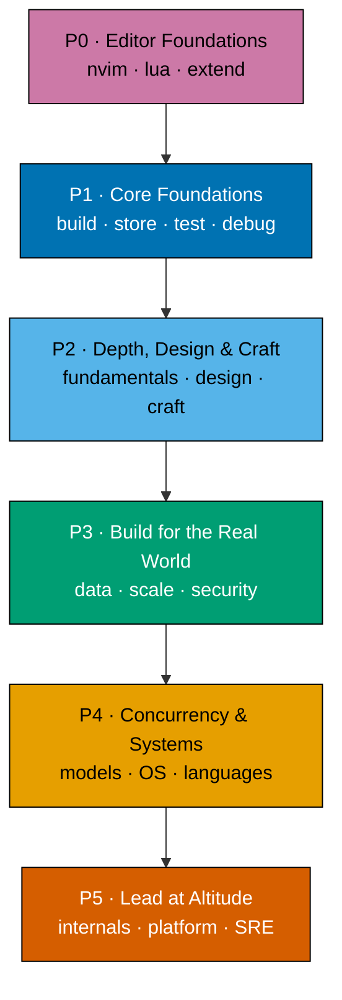

The Fundamentally Strong Software Engineer is a breadth-first, relearn-and-drill journey across the
whole of software engineering — from computer science foundations through IT security — built for
working engineers who need to re-ground themselves fast: before an interview, before joining a new
team, before a design review, or to close a nagging knowledge gap. In the age of AI and LLMs, an
engineer's durable edge is a solid grasp of the fundamentals needed to judge, review, and correct
generated code, and this journey exists to keep that grounding sharp. Every topic runs two parallel
tracks side by side: a **learning** track that teaches at by-example pace, and a **drilling** track
that tests whether the knowledge actually stuck through active-recall practice.

## How to Use This Journey

Work through this journey with a read-then-drill workflow. For each topic, read its learning subtree
first — work through the material until the concepts click — then move to that topic's drilling page
and complete its active-recall exercises before starting the next topic. Repeat this loop across every
topic, in order, to move through the whole spiral.

## The Five-Pass Journey

The 94 topics are sequenced as a Pass 0 setup prologue followed by a five-pass spiral: after setting up
the editor, the earliest topics get you building, storing, testing, and securing a small end-to-end
system fast, then each later pass revisits the same concern areas at greater depth and breadth.

## The Skill Tree

The pass diagram above shows the high-level arc. The skill tree below shows the full per-topic
dependency map across all 94 topics — the recommended learning order, plus the primer and deepens
links that show where a Just Enough primer feeds its first use, and where an Essentials topic is
revisited later at depth.

```mermaid
flowchart TD
    N1["1 · Just Enough Nvim"]
    N2["2 · Just Enough Lua"]
    N3["3 · Extending Neovim"]
    N4["4 · Just Enough Python"]
    N5["5 · Just Enough Bash"]
    N6["6 · Version Control & Git"]
    N7["7 · DS & Algo Essentials"]
    N8["8 · OOP Essentials"]
    N9["9 · Project Management ▲"]
    N10["10 · SQL Essentials"]
    N11["11 · Backend Essentials"]
    N12["12 · Networking Essentials"]
    N13["13 · Just Enough TypeScript"]
    N14["14 · Frontend Essentials"]
    N15["15 · Software Testing"]
    N16["16 · Debugging & Profiling"]
    N17["17 · Security Essentials"]
    N18["18 · Technical Communication"]
    N19["19 · CS Foundations"]
    N20["20 · Computer Architecture"]
    N21["21 · OO Design & Patterns"]
    N22["22 · Programming Paradigms"]
    N23["23 · Functional Programming"]
    N24["24 · Concurrency & Parallelism"]
    N25["25 · Advanced Algorithms"]
    N26["26 · Advanced SQL"]
    N27["27 · Data Access: ORMs"]
    N28["28 · BYO ORM"]
    N29["29 · Advanced Networking"]
    N30["30 · Eng Practices"]
    N31["31 · Agentic Coding"]
    N32["32 · Product Engineering ▲"]
    N33["33 · Engineering Mgmt"]
    N34["34 · NoSQL Databases"]
    N35["35 · Graph Databases"]
    N36["36 · DB Internals"]
    N37["37 · Data Engineering"]
    N38["38 · Search & IR"]
    N39["39 · Backend at Scale"]
    N40["40 · BYO Web Framework"]
    N41["41 · API Design"]
    N42["42 · Software Architecture"]
    N43["43 · Domain-Driven Design"]
    N44["44 · System Design"]
    N45["45 · Event-Driven Arch"]
    N46["46 · Distributed Systems"]
    N47["47 · Advanced Frontend"]
    N48["48 · BYO Reactive UI"]
    N49["49 · Info Arch & SEO"]
    N50["50 · Containers & Orch"]
    N51["51 · Cloud & IaC"]
    N52["52 · Bare-Metal Virtualization"]
    N53["53 · Self-Managed K8s & GitOps"]
    N54["54 · Build Automation"]
    N55["55 · CI/CD & Release Eng"]
    N56["56 · AI-Powered Apps"]
    N57["57 · Agentic AI"]
    N58["58 · IT / App Security"]
    N59["59 · Offensive Sec (Red)"]
    N60["60 · Defensive Sec (Blue)"]
    N61["61 · Vulnerability Mgmt"]
    N62["62 · IT Governance GRC"]
    N63["63 · Analytics & Experiments"]
    N64["64 · Just Enough Go"]
    N65["65 · CSP Concurrency"]
    N66["66 · Just Enough Elixir"]
    N67["67 · Actor Concurrency"]
    N68["68 · Just Enough Kotlin"]
    N69["69 · Android App Dev ◆"]
    N70["70 · Just Enough Swift"]
    N71["71 · iOS App Dev ◆"]
    N72["72 · Just Enough Dart"]
    N73["73 · Hybrid App Dev ◆"]
    N74["74 · Just Enough C#"]
    N75["75 · Windows App Dev ◆"]
    N76["76 · Linux App Dev ◆"]
    N77["77 · Building Production CLI"]
    N78["78 · Just Enough C"]
    N79["79 · Linux OS"]
    N80["80 · Windows OS"]
    N81["81 · System Programming"]
    N82["82 · Just Enough Rust"]
    N83["83 · Modern System Programming"]
    N84["84 · Just Enough Java"]
    N85["85 · Enterprise Java & JVM"]
    N86["86 · Lisp"]
    N87["87 · Just Enough F#"]
    N88["88 · Type Systems"]
    N89["89 · Compilers & Transpilers"]
    N90["90 · Build Your Own Git"]
    N91["91 · Build Your Own Database"]
    N92["92 · Build Your Own Raft"]
    N93["93 · Platform Engineering"]
    N94["94 · Site Reliability Eng"]

    N1 --> N2 --> N3 --> N4 --> N5 --> N6 --> N7 --> N8 --> N9 --> N10
    N10 --> N11 --> N12 --> N13 --> N14 --> N15 --> N16 --> N17 --> N18 --> N19
    N19 --> N20 --> N21 --> N22 --> N23 --> N24 --> N25 --> N26 --> N27 --> N28
    N28 --> N29 --> N30 --> N31 --> N32 --> N33 --> N34 --> N35 --> N36 --> N37
    N37 --> N38 --> N39 --> N40 --> N41 --> N42 --> N43 --> N44 --> N45 --> N46
    N46 --> N47 --> N48 --> N49 --> N50 --> N51 --> N52 --> N53 --> N54 --> N55
    N55 --> N56 --> N57 --> N58
    N58 --> N59
    N58 --> N60
    N59 --> N62
    N60 --> N61 --> N62
    N62 --> N63 --> N64
    N64 --> N65 --> N66 --> N67
    N67 --> N68 --> N69
    N67 --> N70 --> N71
    N67 --> N72 --> N73
    N67 --> N74 --> N75
    N75 --> N76
    N69 --> N77
    N71 --> N77
    N73 --> N77
    N75 --> N77
    N76 --> N77
    N77 --> N78 --> N79 --> N80 --> N81 --> N82 --> N83 --> N84 --> N85
    N85 --> N86 --> N87 --> N88 --> N89
    N89 --> N90 --> N91 --> N92 --> N93 --> N94

    N1 -.->|primer| N3
    N2 -.->|primer| N3
    N4 -.->|primer| N7
    N5 -.->|primer| N59
    N13 -.->|primer| N14
    N64 -.->|primer| N65
    N66 -.->|primer| N67
    N68 -.->|primer| N69
    N70 -.->|primer| N71
    N72 -.->|primer| N73
    N74 -.->|primer| N75
    N78 -.->|primer| N79
    N82 -.->|primer| N83
    N84 -.->|primer| N85
    N87 -.->|primer| N89
    N7 -.->|deepens| N25
    N8 -.->|deepens| N21
    N10 -.->|deepens| N26
    N12 -.->|deepens| N29
    N11 -.->|deepens| N39
    N14 -.->|deepens| N47
    N17 -.->|deepens| N58
    N21 -.->|deepens| N43
    N50 -.->|deepens| N53
    N51 -.->|deepens| N52
    N58 -.->|deepens| N61

    classDef p0 fill:#CC79A7,stroke:#000,color:#000
    classDef p1 fill:#0072B2,stroke:#000,color:#fff
    classDef p2 fill:#56B4E9,stroke:#000,color:#000
    classDef p3 fill:#009E73,stroke:#000,color:#fff
    classDef p4 fill:#E69F00,stroke:#000,color:#000
    classDef p5 fill:#D55E00,stroke:#000,color:#fff
    class N1,N2,N3 p0
    class N4,N5,N6,N7,N8,N9,N10,N11,N12,N13,N14,N15,N16,N17,N18 p1
    class N19,N20,N21,N22,N23,N24,N25,N26,N27,N28,N29,N30,N31,N32,N33 p2
    class N34,N35,N36,N37,N38,N39,N40,N41,N42,N43,N44,N45,N46,N47,N48,N49,N50,N51,N52,N53,N54,N55,N56,N57,N58,N59,N60,N61,N62,N63 p3
    class N64,N65,N66,N67,N68,N69,N70,N71,N72,N73,N74,N75,N76,N77,N78,N79,N80,N81,N82,N83,N84,N85,N86,N87,N88,N89 p4
    class N90,N91,N92,N93,N94 p5
```

## Coming Next

All 94 topics — along with their intra-topic and inter-topic capstones — will populate this journey
progressively. Content is being added phase by phase, so pages will appear here as each phase lands.
