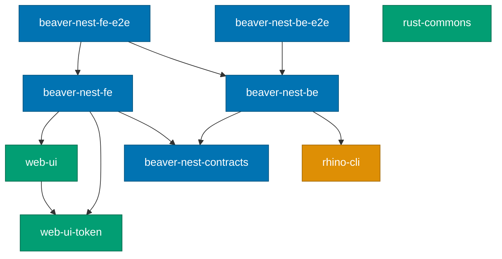

# Project Dependency Graph

Complete reference for how projects depend on each other in the Nx monorepo.
Run `nx graph` to visualize this interactively.

> **Note**: The polyglot demo apps (`a-demo-be-*`, `a-demo-fe-*`, `a-demo-fs-ts-nextjs`) and
> their contract/spec infrastructure were extracted to
> [ose-primer](https://github.com/wahidyankf/ose-primer) on 2026-04-18. That repository is the
> authoritative reference for polyglot showcase dependency patterns.
>
> **2026 BeaverNest repo reset**: every app except `rhino-cli` was deleted, then the
> [`baseerah-repo-reset` plan](../../plans/done/2026-07-31__baseerah-repo-reset/README.md) stood up
> `beaver-nest-be`, `beaver-nest-fe`, and their E2E suites (see
> [monorepo-structure.md](./monorepo-structure.md)). The diagrams and tables below reflect that
> current dependency graph.

## Dependency Mechanisms

Nx tracks project relationships through three mechanisms:

### 1. `implicitDependencies` (Project-Level)

Declared in `project.json`. When the dependency project changes, `nx affected`
flags the dependent project for re-testing.

```json
"implicitDependencies": ["rhino-cli"]
```

### 2. `dependsOn` (Task-Level)

Declared per target in `project.json`. Controls execution order — the dependency
task runs before the dependent task.

### 3. `inputs` with `{workspaceRoot}` (File-Level)

Declared per target. When matched files change, the target's cache is
invalidated and `nx affected` flags the project.

```json
"inputs": [
  "default",
  "{workspaceRoot}/specs/apps/rhino/**/*.feature"
]
```

## Visual Dependency Graph

**Current apps and libs:**



`rust-commons` currently has no dependency edges to other projects — its former consumers
(`ayokoding-cli`, `ose-cli`) were removed by the BeaverNest repo reset. `beaver-nest-fe` does not
declare `rhino-cli` as an Nx `implicitDependency` (it invokes `rhino-cli` via a raw `cargo run`
command in its `specs:*` targets instead); `beaver-nest-be` does declare it.

**Legend**:

- Green: Libraries
- Orange: CLI tools
- Blue: BeaverNest product apps and E2E suites

## Shared Infrastructure Projects

### rhino-cli

**Location**: `apps/rhino-cli/`

Repository management CLI used by most projects for spec coverage (`rhino-cli specs coverage`)
and other validation tasks.

- **Dependents**: `beaver-nest-be` (declares `rhino-cli` as an `implicitDependency` for spec
  validation). `beaver-nest-fe` invokes `rhino-cli` via a raw `cargo run` command in its `specs:*`
  targets instead of declaring it as an `implicitDependency`.
- **Mechanism**: `implicitDependencies`
- **Own dependency**: None (self-contained Rust application with only Rust crate dependencies)
- **Note**: rhino-cli was ported from Go to Rust (2026-05-23).

### rust-commons

**Location**: `libs/rust-commons/`

Shared Rust utilities (link-checking, HTTP utilities). Created 2026-05-25 to
consolidate logic shared by `ose-cli` and `ayokoding-cli` after their Go-to-Rust migration.
Both consumer CLIs were later deleted by the 2026 BeaverNest repo reset.

- **Dependents**: None currently.
- **Mechanism**: Cargo workspace `path` dependency

### web-ui / web-ui-token

**Location**: `libs/web-ui/`, `libs/web-ui-token/`

Shared React component library (`web-ui`) and its design-token package (`web-ui-token`).
`web-ui` depends on `web-ui-token` via an npm workspace `package.json` dependency.
`beaver-nest-fe` is the sole app consumer of both, via `implicitDependencies`.

## Project Dependency Table

| Project               | Dependencies                                | Notes                                         |
| --------------------- | ------------------------------------------- | --------------------------------------------- |
| rhino-cli             | (none — self-contained)                     | rhino-cli/\* (test:integration)               |
| rust-commons          | (none)                                      | rust-commons/\* (test:unit)                   |
| web-ui                | web-ui-token                                | web-ui/\* (test:unit)                         |
| web-ui-token          | (none)                                      | web-ui-token/\* (test:unit)                   |
| beaver-nest-contracts | (none)                                      | OpenAPI contract source consumed by fe and be |
| beaver-nest-be        | beaver-nest-contracts, rhino-cli            | F#/Giraffe, port 19320                        |
| beaver-nest-fe        | web-ui, web-ui-token, beaver-nest-contracts | Next.js 16 App Router, port 19310             |
| beaver-nest-be-e2e    | beaver-nest-be                              | Playwright                                    |
| beaver-nest-fe-e2e    | beaver-nest-fe, beaver-nest-be              | Playwright                                    |

See [tech-docs.md § Dependencies](../../plans/done/2026-07-31__baseerah-repo-reset/tech-docs.md) for
the source of this table. That document also records the resolved verdict (delete) on the
conditional `libs/fsharp-crane-core` dependency it once considered for `beaver-nest-be` — the lib
was `crane-cli`-specific and was deleted alongside `crane-cli`.

## Spec Directory Mapping

All Gherkin specs and API contracts live under `specs/` and are consumed via
`{workspaceRoot}` inputs.

| Spec Directory             | Consumed By                    | Targets          |
| -------------------------- | ------------------------------ | ---------------- |
| `specs/apps/rhino/`        | rhino-cli                      | test:integration |
| `specs/libs/web-ui/`       | web-ui                         | test:unit        |
| `specs/libs/web-ui-token/` | web-ui-token                   | test:unit        |
| `specs/apps/beaver-nest/`  | beaver-nest-fe, beaver-nest-be | test:specs       |

## Related Documentation

- [Monorepo Structure Reference](./monorepo-structure.md) - Folder organization and file formats
- [Nx Configuration Reference](./nx-configuration.md) - Workspace configuration options
- [Nx Target Standards](../../repo-governance/development/infra/nx-targets.md) - Canonical target names and caching rules
- [Three-Level Testing Standard](../../repo-governance/development/quality/three-level-testing-standard.md) - Unit, integration, and E2E testing requirements
- [Code Coverage Reference](./code-coverage.md) - Coverage measurement and tools
