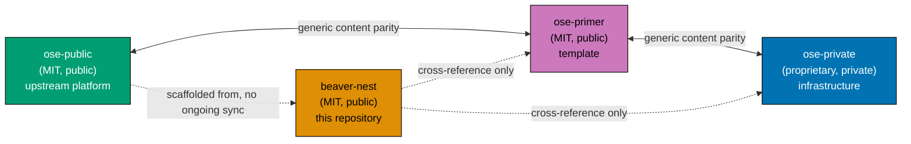

# Related Repositories

`beaver-nest` is one of four sibling repositories in the Open Sharia Enterprise (OSE) family. The four repositories cross-reference each other directly — there is no parent container repository, no submodule wiring, and no shared workspace. This reference catalogues each sibling, its visibility, its license, and its relationship to `beaver-nest`.

## Repository Catalogue

| Repository                                                 | Visibility | License     | Purpose                                                                                           | Relationship to `beaver-nest`                                                                           |
| ---------------------------------------------------------- | ---------- | ----------- | ------------------------------------------------------------------------------------------------- | ------------------------------------------------------------------------------------------------------- |
| [`ose-public`](https://github.com/wahidyankf/ose-public)   | Public     | MIT         | Main OSE platform monorepo; upstream source of truth for governance, conventions, and scaffolding | Original upstream of the scaffolding `beaver-nest` was built from. No ongoing sync.                     |
| [`ose-primer`](https://github.com/wahidyankf/ose-primer)   | Public     | MIT         | Downstream public template (governance, AI agents, skills, conventions, CI harness, demo apps)    | Authoritative home of the polyglot showcase extracted from this lineage on 2026-04-18. No ongoing sync. |
| [`ose-private`](https://github.com/wahidyankf/ose-private) | Private    | Proprietary | Unexposed surface of OSE — self-hosted CI runner stack and the `coralpolyp` app                   | Sibling for ecosystem awareness only. Not publicly accessible; no shared code.                          |
| [`beaver-nest`](https://github.com/wahidyankf/beaver-nest) | Public     | MIT         | BeaverNest — a personal operating layer; a product within the OSE ecosystem                       | This repository.                                                                                        |

## Terminology — "the OSE repos"

When a request says **"all of the OSE repositories"**, **"all of the OSE repos"**, **"all four
repos"**, or any equivalent collective phrase, it means exactly these four, and nothing else:

| #   | Repository    |
| --- | ------------- |
| 1   | `ose-public`  |
| 2   | `ose-primer`  |
| 3   | `ose-private` |
| 4   | `beaver-nest` |

Four consequences worth stating, because each has been a real source of ambiguity:

- **`beaver-nest` is always included.** The collective term is **not** a synonym for the three-repo
  parity loop. `beaver-nest` sits outside that loop but is a full family member.
- **Only these four.** Other repositories that happen to sit in the same parent directory on a
  developer machine are not part of the set.
- **A change is incomplete until it lands in all four.** "Applied to the OSE repos" means four
  repositories, not "the ones where it was convenient".
- **Landing in all four is not the same as landing identically in all four.** Each repository's
  footprint differs — a convention may reference a document one repo does not have, or govern a
  surface that is empty there. Adapt per repository and say what differed; do not skip the repo, and
  do not force an artefact that does not fit it.

If a change genuinely should not apply to one of the four, name which one and why. Silently narrowing
the set is the failure this definition exists to prevent.

## Where `beaver-nest` Sits

`beaver-nest` is a full member of the OSE family and a **fourth repository standing outside the three-repo parity loop**. That loop — `ose-public`, `ose-primer`, and `ose-private` — keeps generic content aligned through the multi-repo parity planning workflows. `beaver-nest` scaffolded from that ecosystem but **does not participate in parity syncs in either direction**.

Colours follow the repository's [color-blind friendly palette](../../repo-governance/conventions/formatting/diagrams.md). Solid bidirectional arrows are content parity flows. Dashed arrows are documentation cross-references only — no content sync crosses them.

### Consequences of standing outside the parity loop

- **No parity plans target `beaver-nest`.** The [plan-multi-repo-parity-planning](../../repo-governance/workflows/plan/plan-multi-repo-parity-planning.md) workflow surveys the three loop repositories. A change landing across the loop does not automatically reach `beaver-nest`; adopting it here is a deliberate, separately-planned decision.
- **`apps/rhino-cli` is a fork.** The shared CLI must be byte-identical across the three loop repositories per the [SDLC Gate Standard](./sdlc-gate-standard.md#rhino-cli-byte-identity-boundary). This repository's copy is explicitly **not** bound by that byte-identity rule and may diverge to serve BeaverNest's needs.
- **Product surface never propagates.** `apps/beaver-nest-fe` and `apps/beaver-nest-be` are product-specific and are never contributed back to any sibling.

## Cross-Repository Awareness

The four repositories maintain awareness of one another through documentation cross-references. Each repository's `README.md`, `AGENTS.md`, and its own `Related Repositories` catalogue name the other three siblings, link their GitHub URLs, and describe their roles. Each repository's `CLAUDE.md` is a platform-binding shim that imports `AGENTS.md`, so it inherits the same statement rather than duplicating it.

There is no automated sync agent. Keeping the family aligned is a **manual** discipline, and cross-repo orchestration sessions clone the four repositories directly — typically into a local folder such as `~/ose-projects/` for convenience — with no gitlink or submodule wiring between them.

## Licensing

`ose-public`, `ose-primer`, and `beaver-nest` are **MIT throughout**. See [LICENSING-NOTICE.md](../../LICENSING-NOTICE.md) for this repository's details.

`ose-private` is **proprietary**. It is listed here for ecosystem awareness; contributors to `beaver-nest` are not expected to have access.

## Non-Goals for this document

- This document does not describe parity mechanics or release cadence for the three-repo loop. Those details live in the multi-repo parity planning workflows under `repo-governance/workflows/plan/`.
- This document does not enumerate every file-by-file classification.
- This document does not describe how to clone, set up, or build any sibling; that belongs in each sibling's own README.

## Links

- [BeaverNest Vision](../../repo-governance/vision/beaver-nest.md) — why this repository exists.
- [Open Sharia Enterprise Vision](../../repo-governance/vision/open-sharia-enterprise.md) — the parent ecosystem vision.
- [plan-multi-repo-parity-planning](../../repo-governance/workflows/plan/plan-multi-repo-parity-planning.md) — the parity workflow `beaver-nest` stands outside of.
- External: <https://github.com/wahidyankf/ose-public>
- External: <https://github.com/wahidyankf/ose-primer>
- External: <https://github.com/wahidyankf/ose-private>
- External: <https://github.com/wahidyankf/beaver-nest>
