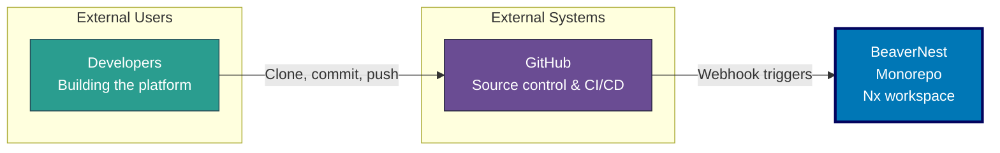
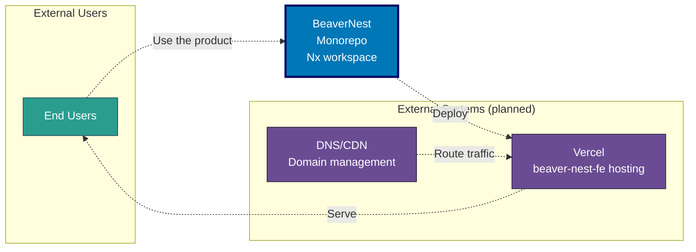

# System Architecture

> **Note:** This document is a work in progress (WIP/Draft). Content and diagrams are subject to change as the platform evolves.

Comprehensive reference for the BeaverNest platform architecture, including application inventory, interactions, deployment infrastructure, and CI/CD pipelines.

> **2026 BeaverNest repo reset**: every prior application except `rhino-cli` was deleted, then
> `beaver-nest-fe` and `beaver-nest-be` were scaffolded as the BeaverNest product's hello-world skeleton.
> The diagrams below describe that current system. See [applications.md](./applications.md) and the
> [baseerah-repo-reset plan](../../../plans/done/2026-07-31__baseerah-repo-reset/README.md).

## System Overview

BeaverNest is a monorepo-based platform built with Nx. The system follows an independent-applications
architecture where applications share common libraries and build infrastructure but do not import
from one another.

**Key Characteristics:**

- **Monorepo Architecture**: Nx workspace, currently one app (`rhino-cli`) plus shared libraries,
  with `beaver-nest-fe`/`beaver-nest-be` planned
- **Trunk-Based Development**: All development on `main` branch
- **Automated Quality Gates**: Git hooks + GitHub Actions + Nx caching
- **Deployment**: Vercel is the expected target for `beaver-nest-fe` once scaffolded; no web app is
  deployed today
- **Build Optimization**: Nx affected builds ensure only changed code is rebuilt

## C4 Model Architecture

The system architecture is documented using the C4 model (Context, Container, Component, Code) to provide multiple levels of abstraction suitable for different audiences.

### C4 Level 1: System Context

Shows how the Open Sharia Enterprise platform fits into the world, including users and external systems.

**Contribution flow:**

**Planned end-user flow** (once `beaver-nest-fe`/`beaver-nest-be` are scaffolded — not yet real):

**Key Relationships:**

- **Developers**: Interact with GitHub (source of truth) to build the platform
- **GitHub**: Central hub for CI/CD automation and quality gates
- **Vercel**: Expected deployment platform for `beaver-nest-fe` once scaffolded; no web app is
  deployed today

## Contents

- [Applications & Containers](./applications.md) - Application inventory, C4 Level 2 container diagram, interactions
- [Components & Code](./components.md) - C4 Level 3 component diagrams, Level 4 code architecture
- [Deployment](./deployment.md) - Deployment architecture, environment branches, Vercel configuration
- [CI/CD Pipeline](./ci-cd.md) - Git hooks, GitHub Actions workflows, Nx build system, development workflow
- [Technology Stack](./technology-stack.md) - Stack summary, quality tools, future considerations
