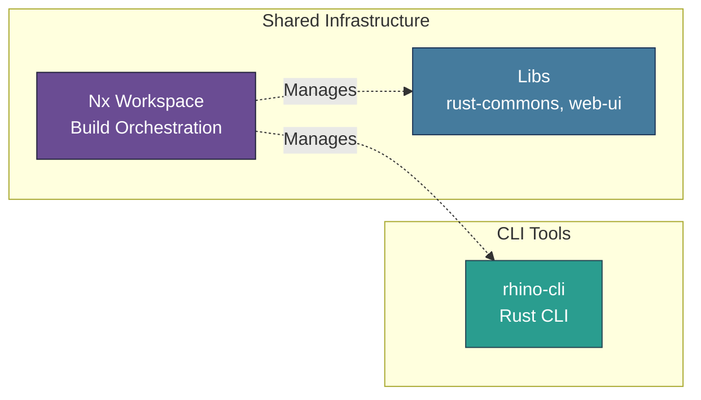
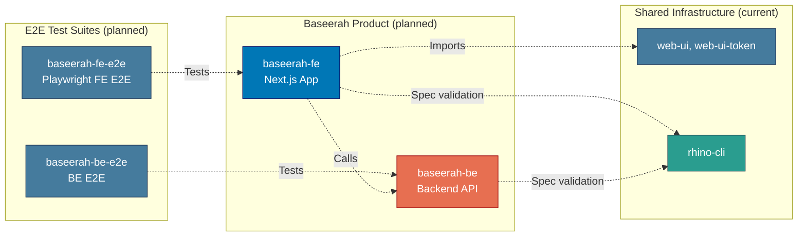

# Applications & Containers

Application inventory and C4 Level 2 container diagram for the Baseerah platform.

> **2026 Baseerah repo reset**: every prior app (`ose-www`, `ose-be`, `ayokoding-www`,
> `ayokoding-cli`, `ose-cli`, `crane-cli`, `organiclever-www`, `organiclever-app-web`,
> `organiclever-be`, `wahidyankf-www`, and their `-e2e` counterparts) was deleted. `rhino-cli` is
> the sole surviving app; `baseerah-fe` and `baseerah-be` are planned but not yet scaffolded. See
> [monorepo-structure.md](../monorepo-structure.md) and the
> [baseerah-repo-reset plan](../../../plans/in-progress/baseerah-repo-reset/README.md).

## Applications Inventory

### CLI Tools

#### rhino-cli

- **Purpose**: Repository management and automation
- **Language**: Rust
- **Build Command**: `nx build rhino-cli`
- **Location**: `apps/rhino-cli/`
- **Status**: Active development

### Planned Applications (not yet scaffolded)

#### baseerah-fe

- **Purpose**: Baseerah frontend
- **Technology**: Next.js 16 (App Router) + TypeScript
- **Planned Dev Port**: 19310
- **Location**: `apps/baseerah-fe/` (does not exist yet)
- **Expected Dependencies**: `web-ui`, `web-ui-token`, `baseerah-contracts`, `rhino-cli`

#### baseerah-be

- **Purpose**: Baseerah backend REST API
- **Technology**: Likely F# + Giraffe + ASP.NET 10 (framework TBD pending backend tech-stack decision)
- **Planned Port**: 19320
- **Location**: `apps/baseerah-be/` (does not exist yet)
- **Expected Dependencies**: `baseerah-contracts`, `rhino-cli`

#### baseerah-fe-e2e / baseerah-be-e2e

- **Purpose**: Playwright FE E2E and HTTP-driven BE E2E suites for `baseerah-fe` and
  `baseerah-be` respectively
- **Location**: `apps/baseerah-fe-e2e/`, `apps/baseerah-be-e2e/` (do not exist yet)

## C4 Level 2: Container Diagram

Shows the high-level technical building blocks (containers) of the system. In C4 terminology, a "container" is a deployable/executable unit (web app, database, file system, etc.), not a Docker container.

**Current state:**

**Planned Baseerah product stack** (not yet scaffolded):

## Application Interactions

**Current:**

- `rhino-cli`: Repository management automation, managed by the Nx workspace
- Shared libraries (`rust-commons`, `web-ui`, `web-ui-token`) may be imported at build time via
  `@open-sharia-enterprise/[lib-name]`; no app currently consumes them

**Planned (once `baseerah-fe` and `baseerah-be` are scaffolded):**

- `baseerah-fe` calls `baseerah-be` over HTTP per the `baseerah-contracts` OpenAPI spec
- `baseerah-fe` imports `web-ui` and `web-ui-token` for UI components and design tokens
- Both `baseerah-fe` and `baseerah-be` declare `rhino-cli` as an `implicitDependency` for spec
  validation
- All applications are managed by the Nx workspace
