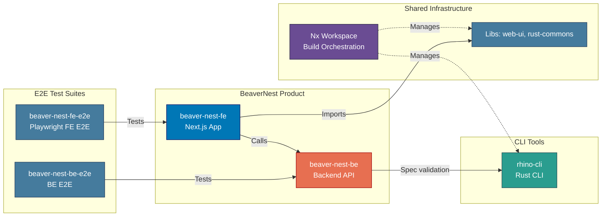

# Applications & Containers

Application inventory and C4 Level 2 container diagram for the BeaverNest platform.

> **2026 BeaverNest repo reset**: every prior app (`ose-www`, `ose-be`, `ayokoding-www`,
> `ayokoding-cli`, `ose-cli`, `crane-cli`, `organiclever-www`, `organiclever-app-web`,
> `organiclever-be`, `wahidyankf-www`, and their `-e2e` counterparts) was deleted, then `beaver-nest-fe`
> and `beaver-nest-be` were scaffolded as the BeaverNest product's hello-world skeleton. See
> [monorepo-structure.md](../monorepo-structure.md) and the
> [baseerah-repo-reset plan](../../../plans/done/2026-07-31__baseerah-repo-reset/README.md).

## Applications Inventory

### CLI Tools

#### rhino-cli

- **Purpose**: Repository management and automation
- **Language**: Rust
- **Build Command**: `nx build rhino-cli`
- **Location**: `apps/rhino-cli/`
- **Status**: Active development

### BeaverNest Product Apps

#### beaver-nest-fe

- **Purpose**: BeaverNest frontend
- **Technology**: Next.js 16 (App Router) + TypeScript
- **Dev Port**: 19310
- **Location**: `apps/beaver-nest-fe/`
- **Dependencies**: `web-ui`, `web-ui-token`, `beaver-nest-contracts`

#### beaver-nest-be

- **Purpose**: BeaverNest backend REST API
- **Technology**: F# + Giraffe + ASP.NET
- **Port**: 19320
- **Location**: `apps/beaver-nest-be/`
- **Dependencies**: `beaver-nest-contracts`, `rhino-cli`

#### beaver-nest-fe-e2e / beaver-nest-be-e2e

- **Purpose**: Playwright FE E2E and HTTP-driven BE E2E suites for `beaver-nest-fe` and
  `beaver-nest-be` respectively
- **Location**: `apps/beaver-nest-fe-e2e/`, `apps/beaver-nest-be-e2e/`

## C4 Level 2: Container Diagram

Shows the high-level technical building blocks (containers) of the system. In C4 terminology, a "container" is a deployable/executable unit (web app, database, file system, etc.), not a Docker container.

**Current state:**

## Application Interactions

- `rhino-cli`: Repository management automation, managed by the Nx workspace
- `beaver-nest-fe` calls `beaver-nest-be` over HTTP per the `beaver-nest-contracts` OpenAPI spec
- `beaver-nest-fe` imports `web-ui` and `web-ui-token` for UI components and design tokens
- `beaver-nest-be` declares `rhino-cli` as an `implicitDependency` for spec validation;
  `beaver-nest-fe` invokes `rhino-cli` via a raw `cargo run` command in its `specs:*` targets instead
- All applications are managed by the Nx workspace
