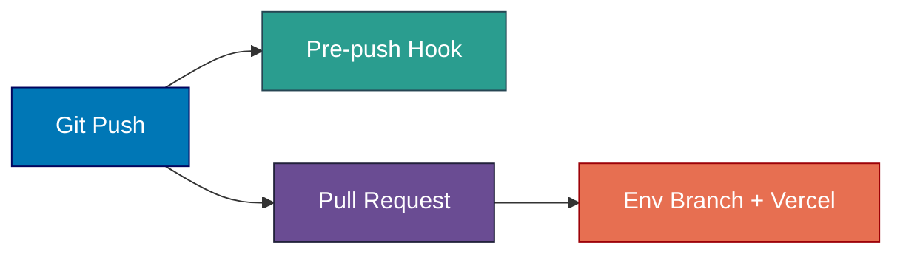
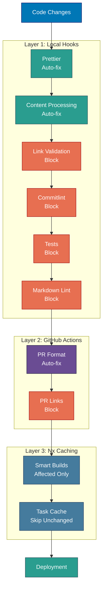

# CI/CD Pipeline

Git hooks, GitHub Actions workflows, Nx build system, and development workflow for the Baseerah platform.

> **2026 Baseerah repo reset**: the app-specific scheduled deploy workflows described in earlier
> revisions of this document (`ayokoding-www-test-local-deploy-prod.yml`,
> `ose-www-test-local-deploy-prod.yml`, `wahidyankf-www-test-local-deploy-prod.yml`,
> `organiclever-app-test-local-deploy-stag.yml`, `organiclever-app-test-stag.yml`,
> `web-ui-build-deploy-prod.yml`) were deleted along with their apps. `rhino-cli` is the sole
> surviving app; `baseerah-fe` and `baseerah-be` are planned but not yet scaffolded. See
> [applications.md](./applications.md) and the
> [baseerah-repo-reset plan](../../../plans/in-progress/baseerah-repo-reset/README.md).

## CI/CD Pipeline Overview

The platform uses a multi-layered quality assurance strategy combining local git hooks, GitHub Actions workflows (CI), and Nx caching. All continuous integration is handled through GitHub Actions.

**Local development hooks:**


**Pre-commit quality gates (sequential):**


**Pre-push and remote CI flow:**



## Git Hooks (Local Quality Gates)

### Pre-commit Hook

**Location**: `.husky/pre-commit`

**Execution Order:**

1. **Env staged-guard**: rejects any staged real `.env*` file (`rhino-cli env staged-guard validate`)
2. **repo-config.yml schema-parity gate** (only when `repo-config.yml` is staged): `rhino-cli repo-config validate`
3. **lint-staged** (per-file formatters, tool-linters, and validators, dispatched by file type) —
   formats staged files (Prettier, `rustfmt`, `fantomas`, etc.), lints `.github/workflows/*.yml`
   with `actionlint`, and for staged markdown runs `rhino-cli md mermaid validate`,
   `md heading-hierarchy validate`, `md naming validate`, and `md frontmatter validate`
4. **Harness bindings regenerate + auto-stage** (`rhino-cli harness bindings generate`)
5. **Lockfile sync**: regenerates and stages `package-lock.json` for any staged app `package.json`

**Impact**: Ensures all committed code is formatted, validated, and platform bindings stay in sync

### Commit-msg Hook

**Location**: `.husky/commit-msg`

**Validation**: Conventional Commits format via Commitlint

**Format**: `<type>(<scope>): <description>`

**Valid Types**: feat, fix, docs, style, refactor, perf, test, chore, ci, revert

**Impact**: Ensures consistent commit message format

### Pre-push Hook

**Location**: `.husky/pre-push`

**Execution Order:**

1. **Nx affected `test:quick`** and **`compat:min-version`** for all affected projects (parallelism: cores-1)
2. **`rhino-cli` repo-wide gates**: `env validate`, `md links validate` (excluding `plans/done`),
   `md readme-index validate`, `harness duplication validate`
3. **Scoped naming/governance validators** — run only when the diff touches the relevant tree
   (agent/skill naming, workflow naming, governance vendor/license conventions, harness binding
   parity, instruction-size budget)

**Impact**: Prevents pushing code that fails tests, breaks minimum-version compatibility, has
broken links, or violates naming/governance conventions

## GitHub Actions Workflows

### PR Quality Gate Workflow

**File**: `.github/workflows/pr-quality-gate.yml`

**Trigger**: Pull request opened, synchronized, or reopened, or push to `main`

**Steps:**

1. Checkout PR branch
2. Setup language runtimes (Node.js, .NET, Rust)
3. Install dependencies
4. Run typecheck, lint, test:quick, specs:coverage for affected projects
5. Validate agent naming and workflow naming conventions
6. Run repo-wide markdown link validation (`md-links` gate job)

**Purpose**: Full quality gate on every PR — typecheck, lint, unit tests, coverage, naming
validation, and repo-wide markdown link check

**Note**: The standalone `markdown-validate.yml` workflow has been deleted. Per-file markdown
validators (mermaid, heading-hierarchy, markdownlint) now run via lint-staged at commit time; the
repo-wide `md links validate` check runs as the `md-links` job in this workflow.

### Main CI Workflow

**File**: `.github/workflows/main-ci.yml`

**Trigger**: Scheduled (4x/day: 06:00/12:00/18:00/00:00 WIB) or manual `workflow_dispatch` — no push
trigger; `pr-quality-gate.yml` already covers push-to-`main`

**Steps:** Same quality gate as the PR workflow — typecheck, lint, `test:quick`,
`compat:min-version`, naming, instruction-size, specs, env/repo-config validation, md-links,
harness-duplication, governance validation — but across **all** projects
(`nx run-many --all`) rather than only affected ones

**Purpose**: Catches drift that affected-only PR checks can miss, by re-running the full gate
against the entire monorepo on a fixed cadence independent of any single PR

### App Deploy Workflows — Deleted, Reusable Templates Remain

Every app-specific scheduled deploy workflow (`ayokoding-www-test-local-deploy-prod.yml`,
`ose-www-test-local-deploy-prod.yml`, `wahidyankf-www-test-local-deploy-prod.yml`,
`organiclever-app-test-local-deploy-stag.yml`, `organiclever-app-test-stag.yml`,
`web-ui-build-deploy-prod.yml`) was deleted along with its app by the 2026 Baseerah repo reset.
`rhino-cli` (a CLI tool, not a deployed web app) has no deploy workflow of its own.

Three **generic, parameterized reusable workflows** survived the reset and remain wired for future
use once `baseerah-fe`/`baseerah-be` are scaffolded:

- **`.github/workflows/_reusable-app-test-local-deploy-stag.yml`** — reusable heavy-test pipeline
  for a web + backend + E2E app group; runs the full stack locally via docker-compose, then on
  success force-pushes the staging web branch (Vercel builds it) and the staging backend branch
  (triggers the backend build-deploy workflow → GHCR). Takes `web-project`, `be-project`,
  `contracts-project`, `compose-dir`, `stag-web-branch`, `stag-be-branch`, `be-port`, and
  `web-port` as inputs — no app names are hardcoded.
- **`.github/workflows/_reusable-app-test-stag.yml`** — reusable gated E2E health check against a
  deployed staging URL.
- **`.github/workflows/_reusable-be-build-deploy.yml`** — reusable backend image build + deploy.

No caller workflow currently invokes these templates (no app group exists yet to invoke them
with); a future phase of the `baseerah-repo-reset` plan is expected to add
`baseerah-app-test-local-deploy-stag.yml` (or similar) once `baseerah-fe` and `baseerah-be` exist.

### PR Quality Gate Workflow (duplicate entry)

**File**: `.github/workflows/pr-quality-gate.yml`

**Trigger**: Pull request opened, synchronized, or reopened, or push to `main`

**Purpose**: Runs affected tests and quality checks for pull requests (see primary entry above)

## Nx Build System

**Caching Strategy:**

- **Cacheable Operations**: `build`, `test`, `lint`
- **Cache Location**: Local + Nx Cloud (if configured)
- **Affected Detection**: Compares against `main` branch

**Build Optimization:**

- **Affected Builds**: `nx affected -t build` only builds changed projects
- **Dependency Graph**: Automatically builds dependencies first
- **Parallel Execution**: Runs independent tasks concurrently

**Target Defaults:**

```json
{
  "build": {
    "dependsOn": ["^build"],
    "outputs": ["{projectRoot}/dist"],
    "cache": true
  },
  "test": {
    "dependsOn": ["build"],
    "cache": true
  },
  "lint": {
    "cache": true
  }
}
```

## Development Workflow

### Standard Development Flow

1. **Start Development**:

   ```bash
   nx dev [project-name]
   ```

2. **Make Changes**:
   - Edit code/content
   - Test locally

3. **Commit Changes**:

   ```bash
   git add .
   git commit -m "type(scope): description"
   ```

   - Pre-commit hook runs:
     - Rejects staged real `.env*` files
     - Formats and validates staged files via lint-staged
     - Regenerates and auto-stages harness platform bindings
   - Commit-msg hook validates format
   - Commit created

4. **Push to Remote** — target follows the declared Delivery Mode:

   ```bash
   # Default (`worktree-to-pr`): push the short-lived plan branch
   git push origin <plan-branch>

   # Direct-push modes, when explicitly declared:
   git push origin main
   ```

   - Pre-push hook runs (on any push target):
     - Tests affected projects (`test:quick`, `compat:min-version`)
     - Runs `rhino-cli` repo-wide and scoped naming/governance gates

5. **Open a Pull Request** — the default path (`worktree-to-pr`); skip only under a declared direct-push mode:
   - GitHub Actions run the full quality gate on every PR event
   - PR-Review Maker→Fixer Cycle runs before the merge
   - Merge once the five hardened merge preconditions hold — `[AI]` by default

6. **Deploy** (once a deployable app exists): no app-specific deploy workflow exists today
   (see the App Deploy Workflows section above). Once `baseerah-fe`/`baseerah-be` are scaffolded
   and wired to the reusable templates, deployment follows the env-branch pattern:

   ```bash
   git checkout stag-[app-name]  # or prod-[app-name] once production CD is wired
   git merge main
   git push origin stag-[app-name]
   ```

   - Vercel (frontend) / the backend build-deploy workflow automatically build and deploy

### Quality Assurance Layers



### Quality Gate Categories

**Auto-fix Gates** (Non-blocking with automatic fixes):

- Prettier and per-language formatters (lint-staged)
- Harness platform-binding regeneration

**Blocking Gates** (Must pass to proceed):

- Markdown validators — mermaid, heading-hierarchy, naming, frontmatter (pre-commit); links,
  readme-index (pre-push)
- Commitlint format check
- Affected tests and `compat:min-version` (pre-push)
- Scoped naming/governance validators (pre-push)
