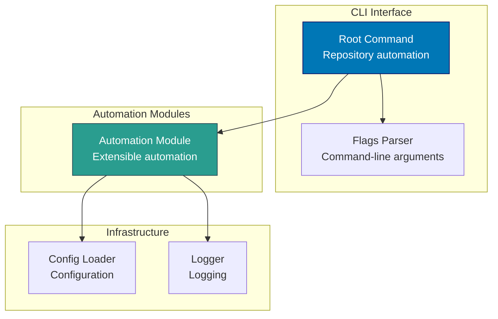

# Components & Code Architecture

C4 Level 3 component diagrams and Level 4 code architecture for the Baseerah platform.

> **2026 Baseerah repo reset**: the `ose-www`, `ayokoding-cli`, and `ayokoding-www` components
> previously documented here were deleted along with their apps. `rhino-cli` is the sole
> surviving app; `baseerah-fe` and `baseerah-be` are planned but not yet scaffolded, so no
> component diagram exists for them yet. See [applications.md](./applications.md).

## C4 Level 3: Component Diagrams

Shows the internal components within each container. Components are groupings of related functionality behind a well-defined interface.

### rhino-cli Components (Rust CLI Tool)

**Component Responsibilities:**

- **Root Command**: CLI entry point for repository automation tasks
- **Automation Module**: Extensible module system for automation workflows
- **Config Loader**: Load repository-hygiene configuration

## C4 Level 4: Code Architecture

Shows implementation details for critical components. No Level 4 breakdown is documented yet
beyond the `rhino-cli` Level 3 diagram above; this section will gain entries for `baseerah-fe`
and `baseerah-be` once those apps are scaffolded.
