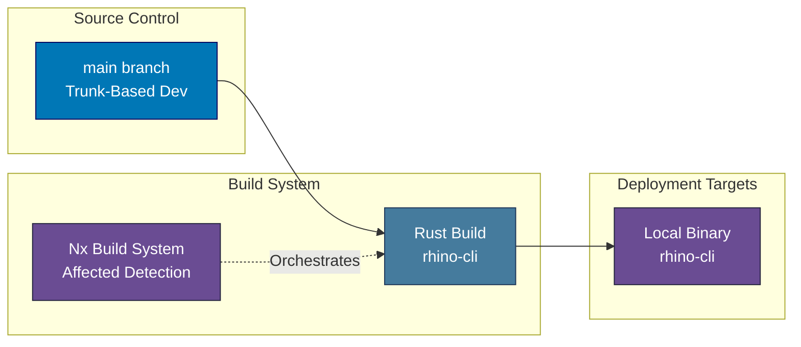
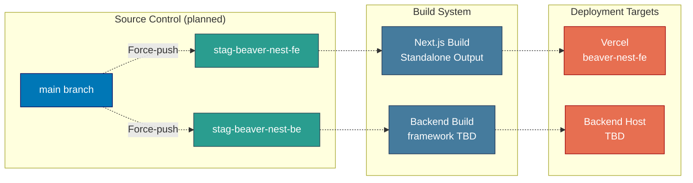

# Deployment Architecture

Deployment architecture, environment branches, and Vercel configuration for the BeaverNest platform.

> **2026 BeaverNest repo reset**: every deployed web app and its environment branches/workflows
> (`ose-www`, `ayokoding-www`, `organiclever-www`, `organiclever-app-web`, `organiclever-be`,
> `wahidyankf-www`, `ose-be`) were deleted. `rhino-cli` is a CLI tool distributed as a local binary,
> not deployed via Vercel. `beaver-nest-fe` and `beaver-nest-be` are now scaffolded, and their deployer
> agents and CI caller workflows exist, but no deploy target is provisioned yet (no `prod-beaver-nest-fe`
> Vercel project, no `stag-beaver-nest-be` consumer) — see
> [beaver-nest-first-deploy](../../../plans/ideas/q2-not-urgent-important/beaver-nest-first-deploy.md). See
> [applications.md](./applications.md) and the
> [baseerah-repo-reset plan](../../../plans/done/2026-07-31__baseerah-repo-reset/README.md).

## Deployment Diagram

**Current state** — no deployed web app exists; `rhino-cli` builds to a local binary:

**Planned BeaverNest deployment** (once `beaver-nest-fe`/`beaver-nest-be` are scaffolded — not yet real):

## Deployment Configuration

### Vercel Deployment

No Vercel-deployed site currently exists. Once scaffolded, `beaver-nest-fe` (Next.js 16, planned
port 19310) is expected to deploy via Vercel with the same conventions as the platform's prior
Next.js sites:

- **Build Framework**: Next.js (standalone output)
- **Build Command**: `next build`
- **Output Directory**: `.next/`

**Security Headers** (expected on all Vercel sites, per prior convention):

- `X-Content-Type-Options: nosniff`
- `X-Frame-Options: SAMEORIGIN`
- `X-XSS-Protection: 1; mode=block`
- `Referrer-Policy: strict-origin-when-cross-origin`

**Caching Strategy** (expected):

- Static assets (css/js/fonts/images): 1 year immutable cache
- HTML pages: Standard caching

### Environment Branches

- **Purpose**: Deployment triggers only
- **Current state**: No environment branches exist for `rhino-cli` — CLI tools are not deployed
  via env-branch force-push.
- **Deleted branches**: `prod-ose-www`, `prod-ayokoding-www`, `prod-wahidyankf-www`,
  `stag-organiclever-app-web`, `stag-organiclever-be`, and their deploy workflows
  (`ayokoding-www-test-local-deploy-prod.yml`, `ose-www-test-local-deploy-prod.yml`,
  `wahidyankf-www-test-local-deploy-prod.yml`, `organiclever-app-test-local-deploy-stag.yml`,
  `organiclever-app-test-stag.yml`) were removed by the 2026 BeaverNest repo reset. See
  [ci-cd.md § App Deploy Workflows](./ci-cd.md#app-deploy-workflows--deleted-reusable-templates-remain)
  for the generic reusable templates that survived and remain available for future reuse.
- **Planned**: `stag-beaver-nest-fe`, `stag-beaver-nest-be` (and corresponding `prod-*` branches once
  production CD is designed), following the same **NEVER commit directly outside CI automation**
  policy as every prior environment branch.
