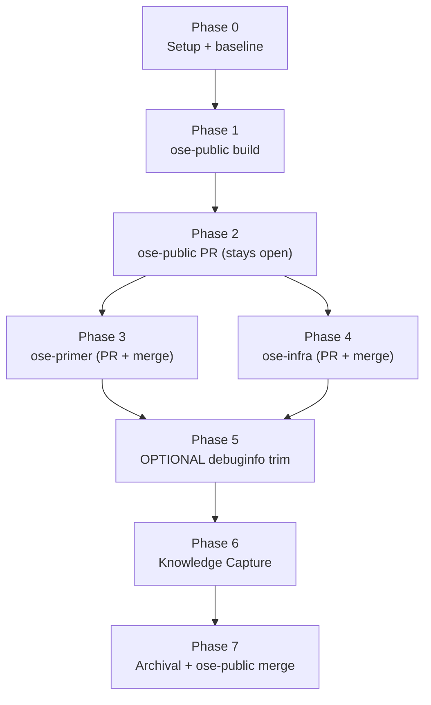

# Delivery — Rust `target/` Directory Sharing Across Worktrees

> **Legend** — `[AI]`: an agent performs the step (the default; unmarked steps are `[AI]`).
> `[HUMAN]`: only a human can do it (physical action, out-of-band approval, real-secret or
> privileged-credential handling). `[AI+HUMAN]`: agent prepares, human approves or finishes.
>
> **Phase Gate** — every phase ends with a `### Phase N Gate` (must-pass verification) plus a
> `> **Pause Safety**:` note (the safe-to-stop state and the single command to resume). A phase
> is not complete until its gate is green; do not start phase N+1 while any gate check fails.

## Worktree

Worktree path: `worktrees/rust-cargo-target-dir-sharing/`

Optional manual pre-provisioning (run from repo root):

```bash
claude --worktree rust-cargo-target-dir-sharing
```

The plan-execution Step 0 gate enters this worktree by default: it auto-provisions from the latest
`origin/main` when missing, syncs with `origin/main` before implementing, and prompts before deleting
the worktree after the plan is archived and pushed.

See [Worktree Path Convention](../../../repo-governance/conventions/structure/worktree-path.md) and
[Plans Organization Convention §Worktree Specification](../../../repo-governance/conventions/structure/plans.md#worktree-specification).

## Delivery Mode: worktree-to-pr

`worktree-to-pr` (the default) — **multi-repo**: one peer PR per repo (`ose-public`, `ose-primer`,
`ose-infra`), each worked in that repo's own `worktrees/rust-cargo-target-dir-sharing/` worktree and
opened as a draft PR against that repo's `main`. Each repo's phase runs the **PR-Review Maker→Fixer
Cycle** (`pr-review-maker` → `pr-review-fixer`, default 3 sequential CI-gated cycles) before its
`[HUMAN]` merge. "Done" here means three green, fully-reviewed PRs handed off; merging each is on the
maintainer's own schedule.

> The maintainer has a standing preference (see project memory) permitting AI to merge once CI is
> green and the review cycle is complete. Treat the `[HUMAN]` merge as `[AI]`-eligible only if the
> maintainer reaffirms it for this plan; otherwise it stays `[HUMAN]`.
>
> **Exception — ose-public merge timing**: because the plan folder is tracked in `ose-public` only,
> the [archival-in-PR requirement](../../../repo-governance/workflows/plan/plan-execution.md#8-finalization-and-archival-sequential)
> applies to the ose-public PR specifically: its merge is deferred to Phase 7, after the archival
> `git mv` commit lands on that PR branch. The ose-primer and ose-infra PRs carry no plan folder and
> merge normally in their own phases (3 and 4) with no such deferral.

## Phase flow



## Phase 0: Environment Setup and Baseline

> _Executor: repo-setup-manager_

- [ ] [AI] Install dependencies in the root worktree: `npm install`
      — acceptance: exits 0, `node_modules/` synchronized
- [ ] [AI] Converge the toolchain in the root worktree: `npm run doctor -- --fix`
      — acceptance: exits 0 with no unresolved drift
- [ ] [AI] Record the Rust crates present: `ls apps/*/Cargo.toml libs/*/Cargo.toml`
      — acceptance: `apps/rhino-cli`, `apps/ayokoding-cli`, `apps/ose-cli`, `libs/rust-commons`
      all listed
- [ ] [AI] Capture the disk baseline across existing worktrees:
      `du -sh worktrees/*/apps/*/target apps/*/target libs/*/target 2>/dev/null | sort -h`
      — acceptance: a per-target size table is recorded in `learnings.md` as the "before" figure
- [ ] [AI] Establish the test baseline:
      `npx nx run rhino-cli:test:quick` and `npx nx affected -t typecheck lint`
      — acceptance: baseline pass/fail recorded; all preexisting failures documented
- [ ] [AI] Resolve all preexisting failures before proceeding
      — acceptance: no unresolved preexisting failures remain

### Phase 0 Gate

> All checks below must pass before starting Phase 1.

- [ ] [AI] `npm install` exited 0 and `npm run doctor -- --fix` reports no unresolved drift
- [ ] [AI] `npx nx run rhino-cli:test:quick` baseline recorded and clean (or every preexisting
      failure documented + resolved)
- [ ] [AI] The disk "before" `du` table is written to `learnings.md`

> **Pause Safety**: only the toolchain was verified and baselines recorded — no feature work exists
> yet. Safe to stop indefinitely. To resume: re-run `npm run doctor -- --fix` and confirm it is clean.

## Phase 1: ose-public core mechanism

- [ ] [AI] **RED**: create `scripts/cargo-target-share.test.sh` (`_New file_`; sibling:
      `scripts/format-elixir.sh`) — a POSIX test that (a) with `CI=1` asserts NO symlink is created,
      (b) locally asserts a symlink IS created into `OSE_CARGO_TARGET_CACHE`, (c) asserts a second
      run leaves the link unchanged, all inside a `mktemp` `git init` repo. Run
      `sh scripts/cargo-target-share.test.sh`
      — acceptance: exits non-zero with a message that `scripts/cargo-target-share.sh` is missing
  - _Suggested executor: `swe-rust-dev` (owns the Rust/cargo toolchain domain)_
- [ ] [AI] **GREEN**: create `scripts/cargo-target-share.sh` (`_New file_`) with the reference body in
      [`tech-docs.md` §The helper script](./tech-docs.md#the-helper-script-reference-implementation) —
      CI guard, git-common-dir repo-name derivation, dynamic crate-agnostic discovery via
      `find apps libs -maxdepth 2 -name Cargo.toml` (no hardcoded crate list), idempotent symlink.
      Run `sh scripts/cargo-target-share.test.sh`
      — acceptance: exits 0, prints "all tests passed"
- [ ] [AI] **REFACTOR**: make both scripts shellcheck-clean at warning level:
      `shellcheck --severity=warning scripts/cargo-target-share.sh scripts/cargo-target-share.test.sh`
      — acceptance: exits 0 with no warnings; `sh scripts/cargo-target-share.test.sh` still passes
- [ ] [AI] Edit root `package.json`: change the `doctor` script to
      `sh scripts/cargo-target-share.sh && cargo run --release --quiet --manifest-path apps/rhino-cli/Cargo.toml -- doctor`
      — acceptance: `npm run doctor` runs the helper then the Rust doctor; `readlink apps/rhino-cli/target`
      resolves under `$HOME/.cache/ose-cargo-target/ose-public/rhino-cli`
- [ ] [AI] Edit `apps/ayokoding-cli/project.json`: set `targets.build.outputs` to
      `["{projectRoot}/dist"]` (remove `{projectRoot}/target`)
      — acceptance: `python3 -c "import json;print(json.load(open('apps/ayokoding-cli/project.json'))['targets']['build']['outputs'])"`
      prints `['{projectRoot}/dist']`
- [ ] [AI] Edit `apps/ose-cli/project.json`: set `targets.build.outputs` to `["{projectRoot}/dist"]`
      — acceptance: same check for `apps/ose-cli/project.json` prints `['{projectRoot}/dist']`
- [ ] [AI] Edit `libs/rust-commons/project.json`: set `targets.build.outputs` to `[]`
      — acceptance: same check for `libs/rust-commons/project.json` prints `[]`
- [ ] [AI] Update `repo-governance/development/workflow/worktree-setup.md`: add a subsection noting
      that `npm run doctor -- --fix` also creates the shared-`target` symlinks (local-dev only)
      — acceptance: the file contains "cargo-target-share" and links to `reproducible-environments.md`
  - _Suggested executor: `repo-workflow-maker`_
- [ ] [AI] Update `repo-governance/development/workflow/reproducible-environments.md`: add a
      "Shared cargo target directories" section documenting the mechanism, the CI guard, and the
      cleanup path (`cargo clean` / periodic `cargo sweep`); confirm the exact sweep flag first with
      `cargo sweep --help` (install locally only if desired) before writing it
      — acceptance: section present; any cited `cargo sweep` flag matches `--help` output
  - _Suggested executor: `repo-workflow-maker`_
- [ ] [AI] Run the helper for real in the root worktree: `sh scripts/cargo-target-share.sh`
      — acceptance: `readlink apps/rhino-cli/target`, `apps/ayokoding-cli/target`,
      `apps/ose-cli/target`, `libs/rust-commons/target` all resolve under
      `$HOME/.cache/ose-cargo-target/ose-public/`

### Local Quality Gates (Before Push) — Phase 1

- [ ] [AI] `npx nx affected -t typecheck` — exits 0
- [ ] [AI] `npx nx affected -t lint` — exits 0 (includes shell lint over `scripts/`)
- [ ] [AI] `npx nx affected -t test:quick` — exits 0 (its internal `test:specs` step already runs
      `specs:behavior:coverage`; no separate `specs:coverage` target exists — `specs:coverage` was
      renamed to `specs:behavior:coverage` and folded into `test:quick`, so no standalone command is
      needed here)
- [ ] [AI] Fix ALL failures — including preexisting issues not caused by these changes — and re-run
      to confirm resolution

> **Important**: Fix ALL failures found during quality gates, not just those caused by your changes
> (Root Cause Orientation). Commit preexisting fixes separately with their own conventional-commit
> messages.

### Commit Guidelines — Phase 1

- [ ] [AI] Commit thematically (Conventional Commits): e.g.
      `feat(scripts): add cargo target-dir sharing helper`,
      `chore(nx): drop target from rust build outputs`,
      `docs(governance): document shared cargo target dirs`
- [ ] [AI] Do NOT bundle unrelated changes into a single commit

### Phase 1 Gate

> All checks below must pass before starting Phase 2.

- [ ] [AI] `sh scripts/cargo-target-share.test.sh` — exits 0
- [ ] [AI] `shellcheck --severity=warning scripts/cargo-target-share.sh scripts/cargo-target-share.test.sh`
      — exits 0
- [ ] [AI] `git diff --stat main -- apps/rhino-cli/` — empty (no rhino-cli source touched)
- [ ] [AI] `npx nx affected -t typecheck lint test:quick` — all exit 0

> **Pause Safety**: the mechanism and its wiring exist and are green on the branch; no PR pushed yet.
> Safe to stop. To resume: re-run `sh scripts/cargo-target-share.test.sh` and the affected gates.

## Phase 2: ose-public verification and PR

- [ ] [AI] Verify build through the symlink: `npx nx run rhino-cli:build`
      — acceptance: exits 0 and `test -f apps/rhino-cli/dist/rhino-cli` succeeds
- [ ] [AI] Verify the two output-adjusted CLIs still build:
      `npx nx run ayokoding-cli:build && npx nx run ose-cli:build`
      — acceptance: both exit 0; `apps/ayokoding-cli/dist/ayokoding-cli` and
      `apps/ose-cli/dist/ose-cli` exist
- [ ] [AI] Verify tests pass through the symlink:
      `npx nx run rhino-cli:test:unit && npx nx run rhino-cli:test:quick`
      — acceptance: both exit 0
- [ ] [AI] Verify Nx build caching still hits for an output-adjusted crate: run
      `npx nx run ayokoding-cli:build` twice with no source change
      — acceptance: the second run reports "from cache" / "Nx read the output from the cache"
- [ ] [AI] Verify the CI guard end-to-end: `CI=1 sh scripts/cargo-target-share.sh` in a scratch
      `mktemp` git repo (do not run against the real worktree)
      — acceptance: prints "CI detected" and creates no symlink (covered by the committed test; this
      is a spot re-check). Paste the command + output inline here.
- [ ] [AI] Capture the disk "after" figure:
      `du -sh $HOME/.cache/ose-cargo-target/ose-public/* 2>/dev/null | sort -h` and compare to the
      Phase 0 "before" table
      — acceptance: the shared cache is counted once; the per-worktree duplication in the "before"
      table is gone. Record the comparison in `learnings.md`.
- [ ] [AI] Commit and push to origin `rust-cargo-target-dir-sharing` (the PR branch)
      — acceptance: branch pushed; draft PR open against `ose-public` `main`

### Post-Push CI Verification — ose-public

- [ ] [AI] Monitor ALL GitHub Actions workflows triggered by the push (poll every 2 min; one
      `gh run view --json status,conclusion` per wakeup; never `gh run watch`)
- [ ] [AI] Verify ALL CI checks pass — pay special attention that CI did NOT create a symlink (the
      guard held); if any check fails, fix root cause and push a follow-up commit
- [ ] [AI] Do NOT proceed until CI is fully green

### PR-Review Maker→Fixer Cycle — ose-public

- [ ] [AI] Run the PR-Review Maker→Fixer Cycle (default 3 sequential CI-gated cycles:
      `pr-review-maker` → `pr-review-fixer`) per the
      [PR Review Quality Gate workflow](../../../repo-governance/workflows/pr/pr-review-quality-gate.md)
      — acceptance: 3 cycles complete, CI green after the final fixer pass, no unresolved review threads
- [ ] [AI] Leave the ose-public PR **open, unmerged** at this point. Per the archival-in-PR
      requirement in [plan-execution §8](../../../repo-governance/workflows/plan/plan-execution.md#8-finalization-and-archival-sequential),
      the plan-folder `git mv` must be committed and pushed to this PR branch before it is merged —
      not landed as a separate commit on `main` after merge. The merge step is deferred to Phase 7,
      after that archival commit is pushed and CI is re-verified green
      — acceptance: PR remains unmerged; proceed to Phase 3/4

### Phase 2 Gate

> All checks below must pass before starting Phase 3/4.

- [ ] [AI] `apps/rhino-cli/dist/rhino-cli` builds and `rhino-cli:test:quick` passes through the symlink
- [ ] [AI] Disk "after" comparison recorded showing dedup vs. the Phase 0 baseline
- [ ] [AI] ose-public CI green; PR-review cycle complete

> **Pause Safety**: ose-public carries the full, verified mechanism on a green PR. Safe to stop. To
> resume: re-run `npx nx run rhino-cli:build` and confirm the symlink + dist are intact.

## Phase 3: Apply to ose-primer

> Work in `ose-primer`'s own `worktrees/rust-cargo-target-dir-sharing/` worktree
> (repo root: `/Users/wkf/ose-projects/ose-primer`). Two Rust crates exist there: `apps/rhino-cli`
> and `apps/crud-be-rust-axum` [Repo-grounded — `find apps libs -maxdepth 2 -name Cargo.toml`].

- [ ] [AI] Provision/enter the ose-primer worktree and initialize toolchain:
      `npm install && npm run doctor -- --fix` in the ose-primer root worktree
      — acceptance: both exit 0
- [ ] [AI] Recreate the helper + test byte-identically in ose-primer's `scripts/` directory from
      [`tech-docs.md` §The helper script](./tech-docs.md#the-helper-script-reference-implementation)
      — do NOT `cp` across repos/worktrees (per
      [Worktree Toolchain Initialization](../../../repo-governance/development/workflow/worktree-setup.md),
      which documents cross-repo relative-path resolution as a known failure mode). Author
      `scripts/cargo-target-share.sh` and `scripts/cargo-target-share.test.sh` with the exact byte
      content of the reference implementation, then run `sh scripts/cargo-target-share.test.sh`
      — acceptance: exits 0; `shellcheck --severity=warning` on both scripts exits 0
- [ ] [AI] Edit ose-primer root `package.json`: prepend `sh scripts/cargo-target-share.sh &&` to the
      `doctor` script (which is `cargo run --release --quiet --manifest-path apps/rhino-cli/Cargo.toml -- doctor`)
      — acceptance: `readlink apps/rhino-cli/target` resolves under
      `$HOME/.cache/ose-cargo-target/ose-primer/rhino-cli`
- [ ] [AI] Run the helper for real and verify BOTH crates symlink (dynamic discovery, not a hardcoded
      list): `sh scripts/cargo-target-share.sh`
      — acceptance: `readlink apps/rhino-cli/target` AND `readlink apps/crud-be-rust-axum/target`
      both resolve under `$HOME/.cache/ose-cargo-target/ose-primer/`
- [ ] [AI] Confirm the discovered crate inventory and whether any `project.json` output edits are
      needed: `find apps libs -maxdepth 2 -name Cargo.toml`
      — acceptance: lists `apps/rhino-cli/Cargo.toml` and `apps/crud-be-rust-axum/Cargo.toml`; check
      `crud-be-rust-axum`'s `build.outputs` in its `project.json` — it lists only
      `{projectRoot}/target/release/crud-be-rust-axum` (a specific binary path, not the whole
      `target` directory), so no output edit is needed there (same reasoning as DD-4 for rhino-cli)
- [ ] [AI] Local gates: `npx nx affected -t typecheck lint test:quick` — all exit 0;
      fix ALL failures (incl. preexisting)
- [ ] [AI] Verify `git diff --stat main -- apps/rhino-cli/` is empty (boundary preserved)
- [ ] [AI] Commit thematically and push to origin `rust-cargo-target-dir-sharing`; open draft PR
      against ose-primer `main`

### Post-Push CI Verification — ose-primer

- [ ] [AI] Monitor all GitHub Actions for the push; verify green; fix root cause + follow-up commit
      if any fail

### PR-Review Maker→Fixer Cycle — ose-primer

- [ ] [AI] Run the 3-cycle PR-Review Maker→Fixer Cycle; CI green after the final fixer pass
- [ ] [HUMAN] Merge the ose-primer PR to `main` when ready (or `[AI]` if maintainer reaffirms
      auto-merge) — signal to resume: PR shows "Merged"

### Phase 3 Gate

> All checks below must pass before Phase 5.

- [ ] [AI] `readlink apps/rhino-cli/target` resolves under `.../ose-primer/rhino-cli`
- [ ] [AI] `git diff --stat main -- apps/rhino-cli/` empty; ose-primer CI green; review cycle complete

> **Pause Safety**: ose-primer carries the mechanism on a green PR. Safe to stop. To resume: re-run
> `sh scripts/cargo-target-share.test.sh` in the ose-primer worktree.

## Phase 4: Apply to ose-infra

> Work in `ose-infra`'s own `worktrees/rust-cargo-target-dir-sharing/` worktree
> (repo root: `/Users/wkf/ose-projects/ose-infra`). Two Rust crates exist there: `apps/rhino-cli`
> and `apps/coralpolyp-be` [Repo-grounded — `find apps libs -maxdepth 2 -name Cargo.toml`]; the
> `doctor` script uses the `nx run rhino-cli:build && ./apps/rhino-cli/dist/rhino-cli doctor` variant.

- [ ] [AI] Provision/enter the ose-infra worktree and initialize toolchain:
      `npm install && npm run doctor -- --fix` — acceptance: both exit 0
- [ ] [AI] Recreate the helper + test byte-identically in ose-infra's `scripts/` directory from
      [`tech-docs.md` §The helper script](./tech-docs.md#the-helper-script-reference-implementation)
      — do NOT `cp` across repos/worktrees (per
      [Worktree Toolchain Initialization](../../../repo-governance/development/workflow/worktree-setup.md),
      which documents cross-repo relative-path resolution as a known failure mode). Author
      `scripts/cargo-target-share.sh` and `scripts/cargo-target-share.test.sh` with the exact byte
      content of the reference implementation, then run `sh scripts/cargo-target-share.test.sh`
      — acceptance: exits 0; shellcheck clean
- [ ] [AI] Edit ose-infra root `package.json`: prepend `sh scripts/cargo-target-share.sh &&` to the
      `doctor` script, yielding
      `sh scripts/cargo-target-share.sh && nx run rhino-cli:build && ./apps/rhino-cli/dist/rhino-cli doctor`
      — acceptance: the helper runs before the build; `readlink apps/rhino-cli/target` resolves under
      `$HOME/.cache/ose-cargo-target/ose-infra/rhino-cli`
- [ ] [AI] Run the helper for real and verify BOTH crates symlink (dynamic discovery, not a hardcoded
      list): `sh scripts/cargo-target-share.sh`
      — acceptance: `readlink apps/rhino-cli/target` AND `readlink apps/coralpolyp-be/target` both
      resolve under `$HOME/.cache/ose-cargo-target/ose-infra/`
- [ ] [AI] Confirm the discovered crate inventory and whether any `project.json` output edits are
      needed: `find apps libs -maxdepth 2 -name Cargo.toml`
      — acceptance: lists `apps/rhino-cli/Cargo.toml` and `apps/coralpolyp-be/Cargo.toml`; check
      `coralpolyp-be`'s `build.outputs` in its `project.json` — it lists only
      `{projectRoot}/target/release/coralpolyp-be` (a specific binary path, not the whole `target`
      directory), so no output edit is needed there (same reasoning as DD-4 for rhino-cli)
- [ ] [AI] Local gates: `npx nx affected -t typecheck lint test:quick` — all exit 0;
      fix ALL failures
- [ ] [AI] Verify `git diff --stat main -- apps/rhino-cli/` is empty (boundary preserved)
- [ ] [AI] Commit thematically and push to origin `rust-cargo-target-dir-sharing`; open draft PR
      against ose-infra `main`

### Post-Push CI Verification — ose-infra

- [ ] [AI] Monitor all GitHub Actions for the push; verify green; fix root cause + follow-up commit
      if any fail

### PR-Review Maker→Fixer Cycle — ose-infra

- [ ] [AI] Run the 3-cycle PR-Review Maker→Fixer Cycle; CI green after the final fixer pass
- [ ] [HUMAN] Merge the ose-infra PR to `main` when ready (or `[AI]` if maintainer reaffirms
      auto-merge) — signal to resume: PR shows "Merged"

### Phase 4 Gate

> All checks below must pass before Phase 5.

- [ ] [AI] `readlink apps/rhino-cli/target` resolves under `.../ose-infra/rhino-cli`
- [ ] [AI] `git diff --stat main -- apps/rhino-cli/` empty; ose-infra CI green; review cycle complete

> **Pause Safety**: all three repos carry the core mechanism on green PRs. Safe to stop indefinitely —
> the plan is functionally complete without Phase 5. To resume: proceed to Phase 5 (optional) or skip
> to Phase 6.

## Phase 5: OPTIONAL — dev-profile debuginfo trim (may be dropped wholesale)

> **This phase is optional and byte-identity-coupled.** It edits tracked `Cargo.toml` files. The
> `apps/rhino-cli/Cargo.toml` edit is INSIDE the byte-identity boundary and MUST be applied
> byte-identically across all three repos in the same cycle. The maintainer may skip this entire
> phase; doing so does not affect the core mechanism. Only run it after explicit maintainer opt-in.

- [ ] [HUMAN] Confirm whether to include Phase 5 — signal to resume: maintainer says "include Phase 5"
      or "skip Phase 5"
- [ ] [AI] Add `[profile.dev]\ndebug = "line-tables-only"` to `apps/rhino-cli/Cargo.toml` in ALL THREE
      repos identically (append a new `[profile.dev]` section; the existing `[profile.release]` stays)
      — acceptance: the three files' `[profile.dev]` blocks are byte-identical
      (`diff <(sed -n '/\[profile.dev\]/,/^$/p' <public>) <(… primer) …` shows no difference); deps
      unchanged so `Cargo.lock` is untouched
  - _Suggested executor: `swe-rust-dev`_
- [ ] [AI] Add the same `[profile.dev]` block to ose-public-only crates
      `apps/ayokoding-cli/Cargo.toml`, `apps/ose-cli/Cargo.toml`, `libs/rust-commons/Cargo.toml`
      — acceptance: each file has a `[profile.dev]` section with `debug = "line-tables-only"`
- [ ] [AI] Rebuild + test each affected crate in each repo to confirm no breakage:
      `npx nx run rhino-cli:test:quick` (and the two CLIs in ose-public)
      — acceptance: all exit 0
- [ ] [AI] Local gates in each repo: `npx nx affected -t typecheck lint test:quick`
      — all exit 0
- [ ] [AI] Commit `perf(cargo): trim dev-profile debuginfo to line-tables-only` in each repo; push to
      each PR branch; run each repo's PR-review cycle; verify CI green
- [ ] [HUMAN] Merge each PR when ready (or `[AI]` if maintainer reaffirms auto-merge)

### Phase 5 Gate

> All checks below must pass before Phase 6 (skip this gate entirely if Phase 5 was declined).

- [ ] [AI] `apps/rhino-cli/Cargo.toml` `[profile.dev]` block is byte-identical across all three repos
- [ ] [AI] `Cargo.lock` unchanged in each repo (`git diff --stat main -- apps/rhino-cli/Cargo.lock`
      empty)
- [ ] [AI] All three repos' affected gates green; review cycles complete

> **Pause Safety**: optional trim applied byte-identically or explicitly declined. Safe to stop. To
> resume: re-run `npx nx run rhino-cli:test:quick` in each repo.

## Manual behavioral verification — Not Applicable

This plan touches build tooling, `scripts/`, `package.json`, `project.json`, and docs only — no web
UI and no HTTP/GraphQL API. Playwright MCP and curl verification, the Rule-15 three-tester retest,
and the Rule-16 API exploratory retest are therefore **Not Applicable**. Behavioral verification is
covered by `scripts/cargo-target-share.test.sh`, the build/test-through-symlink checks, and the disk
`du` comparison in Phases 1–2.

## Phase 6: Knowledge Capture

> _Triage every surviving `learnings.md` entry before archival. See the
> [Knowledge Capture Convention](../../../repo-governance/development/quality/knowledge-capture.md)._

- [ ] [AI] Apply the litmus test to every `learnings.md` entry — keep only if a durable surface would
      catch this automatically next time; discard the rest with a one-line reason
      — acceptance: every entry has either a route or a discard reason
- [ ] [AI] Apply the **secret/sensitivity gate** — sanitize any secret, token, or private hostname to
      a `<placeholder>`, or discard if unsanitizable
      — acceptance: `learnings.md` contains no raw secret (real `$HOME` paths reduced to `$HOME`)
- [ ] [AI] Apply the **repo-relevance gate** — infra-private content (real hostnames/inventories)
      stays in `ose-infra` only and is never cross-routed into `ose-public`/`ose-primer`; public
      governance content may propagate via the parity loop
      — acceptance: no infra-private content appears in this repo's routed output
- [ ] [AI] Route each surviving learning to exactly one durable home per the open-ended routing
      matrix — a small non-code edit lands inline (e.g. an extra sentence in
      `reproducible-environments.md`); a larger non-code change is filed as a `plans/backlog/`
      follow-up; code homes (`apps/`, `libs/`, tests) are ALWAYS filed as a separate
      `plans/backlog/<slug>/` plan, NEVER inline
      — acceptance: every entry records its terminal routing state
- [ ] [AI] If no generalizable learning surfaced, record the explicit escape in `learnings.md`:
      `No generalizable learnings — <one-line reason>`
      — acceptance: `learnings.md` is never silently empty

### Phase 6 Gate

> All checks below must pass before Plan Archival.

- [ ] [AI] Every `learnings.md` entry is terminal (routed inline / filed as backlog / discarded with
      reason), or the explicit "none" escape is present
- [ ] [AI] No code-homed learning landed inline in this plan's own commits/PRs

> **Pause Safety**: `learnings.md` is fully triaged (or explicitly empty). Safe to stop. To resume:
> re-read `learnings.md` and confirm every entry is terminal.

## Phase 7: Plan Archival

> **Scope: ose-public only.** The plan folder is tracked in `ose-public` exclusively — `ose-primer`
> and `ose-infra` carry no plan folder and no archival obligation. Run every step below in the
> **ose-public** worktree, on the same branch as the still-open Phase 1/2 PR
> (`rust-cargo-target-dir-sharing`). Per the archival-in-PR HARD requirement in
> [plan-execution §8](../../../repo-governance/workflows/plan/plan-execution.md#8-finalization-and-archival-sequential),
> the `git mv` + README updates are committed and pushed to that PR branch **before** the PR is
> merged — never as a separate commit landed on `main` after merge.

- [ ] [AI] Verify ALL delivery checklist items are ticked (Phase 5 items excepted if declined)
- [ ] [AI] Verify the Knowledge Capture phase is complete — every `learnings.md` entry reached a
      terminal state or the explicit "none" escape is present; both safety gates applied
- [ ] [AI] Verify ALL quality gates pass (local + CI) across the three repos
- [ ] [AI] Verify the disk `du` before/after comparison is recorded and shows dedup
- [ ] [AI] Confirm Rule-15 / Rule-16 retests are Not Applicable (no UI/API surface) — recorded above
- [ ] [AI] In the ose-public worktree, on the Phase 1/2 PR branch: rename and move
      `git mv plans/in-progress/rust-cargo-target-dir-sharing/ plans/done/2026-MM-DD__rust-cargo-target-dir-sharing/`
      using the completion date (NOT the creation date)
- [ ] [AI] Update `plans/in-progress/README.md` — remove the plan entry
- [ ] [AI] Update `plans/done/README.md` — add the plan entry with completion date
- [ ] [AI] Update any other READMEs that reference this plan (e.g. `plans/README.md`, `plans/backlog/README.md`)
- [ ] [AI] Commit the archival on the ose-public PR branch: `chore(plans): move rust-cargo-target-dir-sharing to done`
- [ ] [AI] Push the archival commit to the still-open ose-public PR branch
      (`rust-cargo-target-dir-sharing`) — acceptance: the PR diff now includes the `git mv`; CI
      re-triggered on the new head commit
- [ ] [AI] Re-verify CI is green on the ose-public PR after the archival commit, per the
      [CI Monitoring Convention](../../../repo-governance/development/workflow/ci-monitoring.md)
      — acceptance: every required check passes on the PR's new head commit
- [ ] [HUMAN] Merge the ose-public PR to `main` when ready (or `[AI]` if the maintainer reaffirms the
      standing auto-merge preference for this plan) — signal to resume: PR shows "Merged". This is
      the deferred ose-public merge originally scheduled in Phase 2 (see the archival-in-PR
      exception noted under Delivery Mode above)
