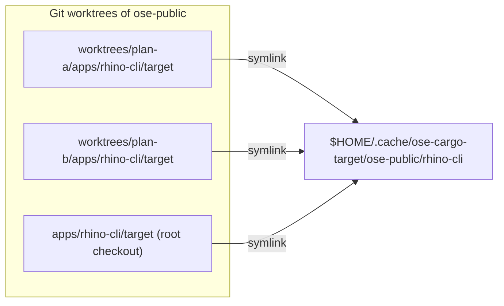
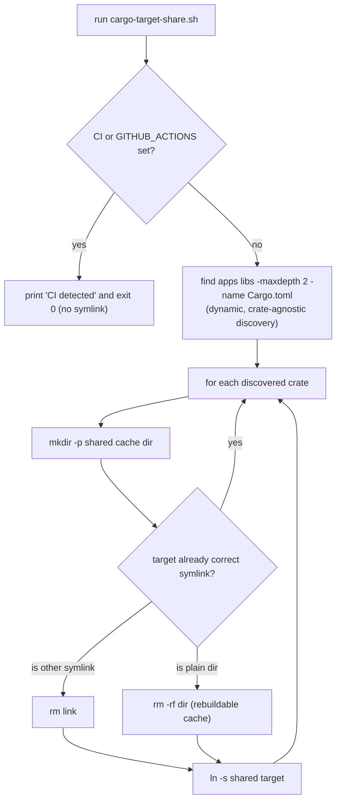
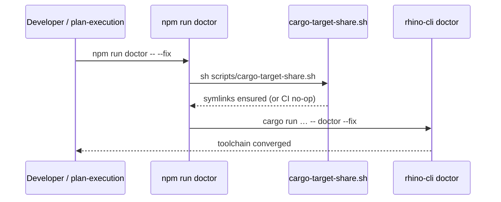

# Technical Documentation — Rust `target/` Directory Sharing

## Architecture

The mechanism is a filesystem redirection: each crate's `target/` becomes a symlink into a shared,
persistent cache keyed by repo name and crate leaf name. Nothing in the build commands changes —
`cargo` writes to `target/` (following the link) and the `cp … target/release/<bin> … dist/` step
reads back through the same link. [Repo-grounded — build commands quoted below from `project.json`.]



Repo name is derived once, robustly, so that worktrees resolve to their **main** repo (not the
worktree path):

```text
basename( dirname( git rev-parse --path-format=absolute --git-common-dir ) )
```

In a worktree, `--git-common-dir` points at the main repo's `.git`, so all worktrees of `ose-public`
resolve to the `ose-public` cache segment and share one directory. [Repo-grounded — verified in the
root checkout: returns `ose-public`; worktree resolution is standard git behavior.]

## Decision flow — the CI guard and idempotency branches



## Sequence — where the symlink is created at init time



Worktree provisioning already runs `npm install` + `npm run doctor -- --fix` in the root worktree
per [Worktree Toolchain Initialization](../../../repo-governance/development/workflow/worktree-setup.md)
[Repo-grounded], so chaining the helper into `doctor` covers both the repo-init and worktree paths
with one wiring point.

## Design decisions

### DD-1: Per-crate symlink of `target/` (CHOSEN)

Replace `apps/<crate>/target` with a symlink to `$HOME/.cache/ose-cargo-target/<repo>/<crate>`.
`target/` is gitignored [Repo-grounded — `.gitignore:114`], and the build's `cp` resolves through the
link, so **no tracked `Cargo.toml` or `project.json` build command changes**. This is what keeps the
change boundary-safe: `apps/rhino-cli/**` is never edited by the core mechanism, so the rhino-cli
byte-identity boundary is not triggered. [Repo-grounded — boundary defined in
`docs/reference/sdlc-gate-standard.md` §rhino-cli Byte-Identity Boundary.]

### DD-2: Wire via a `scripts/` helper chained in `package.json`, NOT in `rhino-cli doctor` (CHOSEN)

The repo's `doctor` is `rhino-cli doctor` — Rust code at `apps/rhino-cli/src/…/doctor.rs`
[Repo-grounded], which is **inside** the byte-identity boundary and covered by
`specs/apps/rhino/behavior/rhino-cli/gherkin/system/doctor.feature` [Repo-grounded]. Adding symlink
logic there would force a byte-identical change across three repos plus new Gherkin. Instead, a
POSIX helper `scripts/cargo-target-share.sh` is chained ahead of the doctor invocation in the **root**
`package.json` `doctor` script — explicit (no implicit npm `pre`-hook magic, matching the maintainer's
explicit-over-convention preference) and outside the boundary.

### DD-3: Dynamic crate discovery via `find`, crate-agnostic (CHOSEN)

The helper discovers every Rust crate itself — `find apps libs -maxdepth 2 -name Cargo.toml` — rather
than iterating a hardcoded candidate list. This makes one identical script correct for all three
repos without per-repo maintenance, because each repo's crate inventory genuinely differs and is
larger than "rhino-cli only":

| Repo         | Rust crates present (verified via `find apps libs -maxdepth 2 -name Cargo.toml`)     |
| ------------ | ------------------------------------------------------------------------------------ |
| `ose-public` | `apps/rhino-cli`, `apps/ayokoding-cli`, `apps/ose-cli`, `libs/rust-commons`          |
| `ose-primer` | `apps/rhino-cli`, `apps/crud-be-rust-axum` [Repo-grounded — sibling `apps/` listing] |
| `ose-infra`  | `apps/rhino-cli`, `apps/coralpolyp-be` [Repo-grounded — sibling `apps/` listing]     |

An earlier draft of this design hardcoded a hand-maintained candidate list. That list silently
excluded `crud-be-rust-axum` and `coralpolyp-be` from the dedup mechanism in the sibling repos —
undermining US-5 ("all my machines' worktrees benefit uniformly"). Dynamic discovery removes the
per-repo maintenance burden and closes that gap: every Rust crate in every repo gets the
shared-target symlink treatment automatically, with zero per-repo configuration and no risk of a
newly-added crate being silently skipped in the future.

### DD-4: Remove `{projectRoot}/target` from Nx outputs for the three affected crates (CHOSEN)

`rhino-cli:build` outputs are `["{projectRoot}/dist"]` — target is **not** cached. [Repo-grounded]
But `ayokoding-cli:build` and `ose-cli:build` list `["{projectRoot}/dist","{projectRoot}/target"]`,
and `rust-commons:build` lists `["{projectRoot}/target"]`. [Repo-grounded] With `target` as a symlink
to a shared dir, Nx would copy the whole symlinked tree into `.nx/cache` on every run — defeating the
purpose and bloating the Nx cache. Since the shared dir is itself cargo's persistent incremental
cache, Nx caching of `target` is redundant. Fix: drop `{projectRoot}/target` from those three crates'
`build.outputs` (`dist` stays for the two CLIs; `rust-commons` build outputs become `[]`). These three
crates are **ose-public only**, so no byte-identity or sibling-repo coupling.

### DD-5: Cleanup stays documented/manual (CHOSEN)

To keep the byte-identity boundary clean, `cargo-sweep` is **not** wired into `rhino-cli doctor`'s tool
list. Cleanup is documented: `cargo clean` per crate, or a periodic `cargo sweep --time 30` sweep of
`$HOME/.cache/ose-cargo-target`, run manually or via the developer's own cron. [Web-cited note:
`cargo sweep --time <days>` removes artifacts not accessed in N days — cargo-sweep README,
<https://github.com/holmgr/cargo-sweep>, accessed 2026-07-18.] [Unverified — flag: confirm the exact
`--time` flag spelling with `cargo sweep --help` at execution time before writing it into a doc.]

### Accepted trade-off: concurrent local builds of the same crate across worktrees

Two worktrees building the **same** crate at the same time (e.g., `apps/rhino-cli` is open in two
worktrees and a build is kicked off in both) now contend on the shared `target/` directory — a
scenario that did not exist before this mechanism, since each worktree previously had its own
physical `target/`. This is an accepted, low-likelihood trade-off, not a defect: `cargo` places
advisory Unix `flock`-based `.lock` files inside `CARGO_TARGET_DIR` specifically to serialize
concurrent access, so the second `cargo build` blocks waiting for the lock rather than corrupting
build state. [Web-cited: rust-lang/cargo `src/cargo/util/flock.rs`,
<https://github.com/rust-lang/cargo/blob/master/src/cargo/util/flock.rs>, accessed 2026-07-18 — "on
Unix-like systems, locks are advisory using flock"; corroborated by community guidance to avoid
running concurrent `cargo build`/`update`/`fetch` against the same target directory, per
<https://users.rust-lang.org/t/is-it-supported-to-run-two-cargo-build-in-parallel-in-same-workspace/103621>,
accessed 2026-07-18.]

Accepted because: (a) it only occurs when building the identical crate in two worktrees
simultaneously — a narrow window in normal solo-dev usage — and (b) cargo's lock blocks rather than
corrupts, so the worst case is one build waiting on the other, never data loss.

### DD-6 (OPTIONAL, Phase 5): `[profile.dev] debug = "line-tables-only"` (SEPARATE, MAY BE DROPPED)

Trimming dev-profile debuginfo shrinks debug + incremental bloat. This **does** edit tracked
`Cargo.toml`. For `apps/rhino-cli/Cargo.toml` the edit is **inside the byte-identity boundary**, so it
must be applied byte-identically across all three repos in the same cycle (deps unchanged →
`Cargo.lock` unaffected). Kept as a clearly-separated optional phase the maintainer can include or
drop without affecting the core mechanism.

### Rejected alternatives

- **RA-1: `CARGO_TARGET_DIR` env var pointing all crates at one dir.** Rejected — a single shared
  target across _different_ crates causes cross-crate rebuild churn and collisions, and it would need
  to be exported into every shell/Nx invocation (implicit, fragile). The per-crate symlink isolates
  each crate's cache while still deduping across worktrees.
- **RA-2: Wire symlink logic into `rhino-cli doctor` (Rust).** Rejected — touches the byte-identity
  boundary and requires new Gherkin across three repos (DD-2).
- **RA-3: Edit each `project.json`/`Cargo.toml` build command to build into a shared path.** Rejected
  — edits tracked config (rhino-cli boundary) for no benefit the symlink does not already give for
  free (DD-1).
- **RA-4: A dedicated Nx target / hook that runs the symlink.** Rejected — more moving parts than
  chaining one line into the existing `doctor` script; the `doctor` path already runs at init and
  worktree provisioning.

## The helper script (reference implementation)

`scripts/cargo-target-share.sh` (POSIX `sh`, shellcheck-clean at `--severity=warning`):

```sh
#!/bin/sh
# Share cargo target/ dirs across git worktrees via per-crate symlinks into
# $HOME/.cache/ose-cargo-target/<repo>/<crate>. Local-dev ONLY — no-op under CI.
set -eu

# CI guard: a shared target dir across concurrent CI jobs worsens the self-hosted
# runner's rustup/cargo ".partial" concurrency race — never symlink on CI.
if [ -n "${CI:-}" ] || [ -n "${GITHUB_ACTIONS:-}" ]; then
  echo "cargo-target-share: CI detected — skipping symlink (local-dev only)."
  exit 0
fi

CACHE_ROOT="${OSE_CARGO_TARGET_CACHE:-$HOME/.cache/ose-cargo-target}"
REPO_NAME="$(basename "$(dirname "$(git rev-parse --path-format=absolute --git-common-dir)")")"

# Dynamic, crate-agnostic discovery — every Rust crate under apps/ or libs/ (maxdepth 2), so one
# identical script is correct for all three repos' differing crate inventories (ose-public: 4
# crates; ose-primer: rhino-cli + crud-be-rust-axum; ose-infra: rhino-cli + coralpolyp-be) with no
# hardcoded list to maintain.
find apps libs -maxdepth 2 -name Cargo.toml 2>/dev/null | while IFS= read -r manifest; do
  crate="$(dirname "$manifest")"
  leaf="$(basename "$crate")"
  shared="$CACHE_ROOT/$REPO_NAME/$leaf"
  link="$crate/target"

  mkdir -p "$shared"

  if [ -L "$link" ] && [ "$(readlink "$link")" = "$shared" ]; then
    continue                        # already correct — idempotent no-op
  fi
  if [ -L "$link" ]; then
    rm -f "$link"                   # stale symlink → replace
  elif [ -d "$link" ]; then
    rm -rf "$link"                  # plain rebuildable cache dir → discard
  fi
  ln -s "$shared" "$link"
  echo "cargo-target-share: linked $link -> $shared"
done
```

## Per-repo wiring

| Repo         | Rust crates present (dynamically discovered)         | Current `doctor` script                                                           | New `doctor` script (prepend helper)                                                                                  |
| ------------ | ---------------------------------------------------- | --------------------------------------------------------------------------------- | --------------------------------------------------------------------------------------------------------------------- |
| `ose-public` | rhino-cli, ayokoding-cli, ose-cli, libs/rust-commons | `cargo run --release --quiet --manifest-path apps/rhino-cli/Cargo.toml -- doctor` | `sh scripts/cargo-target-share.sh && cargo run --release --quiet --manifest-path apps/rhino-cli/Cargo.toml -- doctor` |
| `ose-primer` | rhino-cli, crud-be-rust-axum                         | `cargo run --release --quiet --manifest-path apps/rhino-cli/Cargo.toml -- doctor` | `sh scripts/cargo-target-share.sh && cargo run --release --quiet --manifest-path apps/rhino-cli/Cargo.toml -- doctor` |
| `ose-infra`  | rhino-cli, coralpolyp-be                             | `nx run rhino-cli:build && ./apps/rhino-cli/dist/rhino-cli doctor`                | `sh scripts/cargo-target-share.sh && nx run rhino-cli:build && ./apps/rhino-cli/dist/rhino-cli doctor`                |

[Repo-grounded — all three `doctor` scripts read from the respective `package.json` files.] The helper
must run **before** any build so the symlink exists when `cargo` first writes `target/`.

## File impact (ose-public)

| Path                                                                | Change                                                    | Boundary                                            |
| ------------------------------------------------------------------- | --------------------------------------------------------- | --------------------------------------------------- |
| `scripts/cargo-target-share.sh`                                     | New — the helper (`_New file_`)                           | Outside rhino-cli boundary                          |
| `scripts/cargo-target-share.test.sh`                                | New — self-contained test (`_New file_`)                  | Outside rhino-cli boundary                          |
| `package.json`                                                      | Prepend `sh scripts/cargo-target-share.sh &&` to `doctor` | Root config — not boundary                          |
| `apps/ayokoding-cli/project.json`                                   | `build.outputs` → `["{projectRoot}/dist"]`                | ose-public only                                     |
| `apps/ose-cli/project.json`                                         | `build.outputs` → `["{projectRoot}/dist"]`                | ose-public only                                     |
| `libs/rust-commons/project.json`                                    | `build.outputs` → `[]`                                    | ose-public only                                     |
| `repo-governance/development/workflow/worktree-setup.md`            | Note the shared-target mechanism                          | Docs                                                |
| `repo-governance/development/workflow/reproducible-environments.md` | Add shared-target + cleanup section                       | Docs                                                |
| `apps/rhino-cli/Cargo.toml` (Phase 5 OPTIONAL only)                 | Add `[profile.dev] debug = "line-tables-only"`            | **Inside** boundary — byte-identical across 3 repos |

## Testing strategy

- **Shell helper**: `scripts/cargo-target-share.test.sh` runs in an isolated `mktemp` git repo with
  `OSE_CARGO_TARGET_CACHE` pointed at a temp dir. It asserts (a) CI guard — with `CI=1` no symlink is
  created; (b) local — a symlink is created into the cache; (c) idempotency — a second run leaves the
  link unchanged. Exit 0 = pass. This maps to the PRD scenarios "no-ops under CI", "symlinks a crate's
  target", and "the symlink step is idempotent".
- **Build/test through symlink**: `nx run rhino-cli:build`, `nx run rhino-cli:test:unit`,
  `nx run rhino-cli:test:quick` after the symlink is in place (maps to the build/test scenarios).
- **Disk dedup**: before/after `du -sh` across worktrees (maps to the shared-physical-target scenario).
- **Boundary**: `git diff --stat main -- apps/rhino-cli/` is empty for the core phases (maps to the
  byte-identity scenario).

## Specs / Gherkin exemption

This plan creates **no observable behavior in `apps/` or `libs/` source code** — it adds a
`scripts/` shell helper, edits root `package.json`, adjusts non-behavioral Nx `build.outputs` config,
and updates docs. `apps/rhino-cli/**` (the only Rust source with a Gherkin behavior tree) is untouched
by the core mechanism. Therefore the Specs & Gherkin two-path completeness rule does not apply to the
core phases; the shell helper is covered by its own `scripts/cargo-target-share.test.sh`. The optional
Phase 5 edits `Cargo.toml` profile config only (no behavior), so it is likewise Gherkin-exempt.
[Repo-grounded — feature-change-completeness applies to behavior under `apps/`/`libs/`.]

## Rollback

Every change is reversible: delete `scripts/cargo-target-share.sh`, revert the `package.json` and
`project.json` edits, and (if desired) `rm apps/<crate>/target && mkdir apps/<crate>/target` to return
to per-worktree directories. The shared cache under `$HOME/.cache/ose-cargo-target` is disposable and
can be `rm -rf`'d at any time — cargo rebuilds it.
