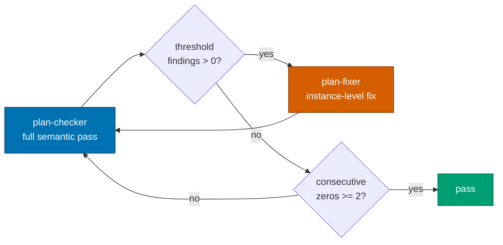
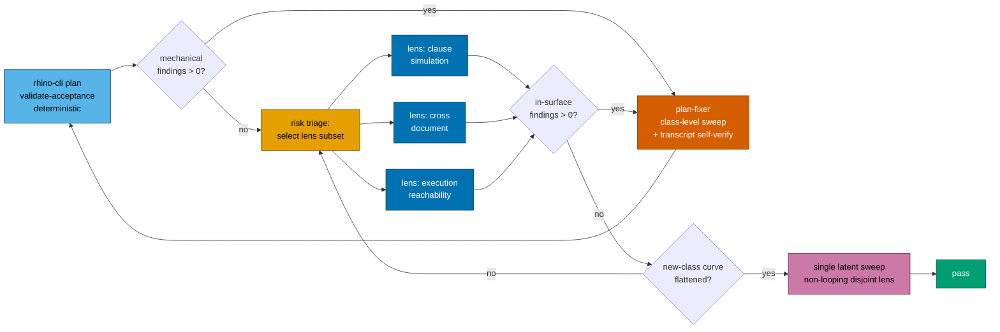
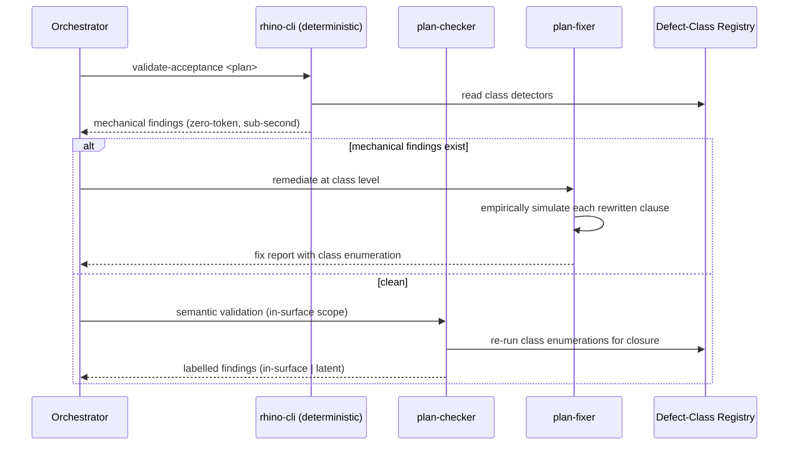
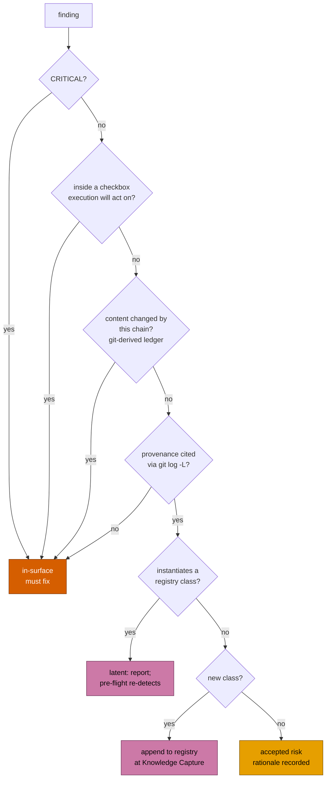
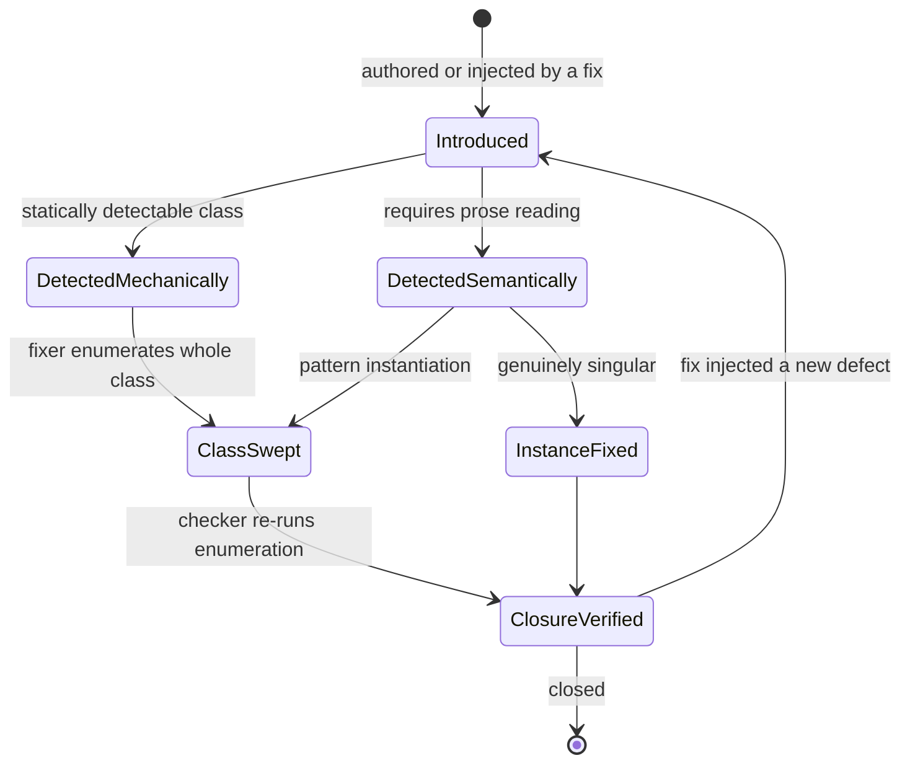
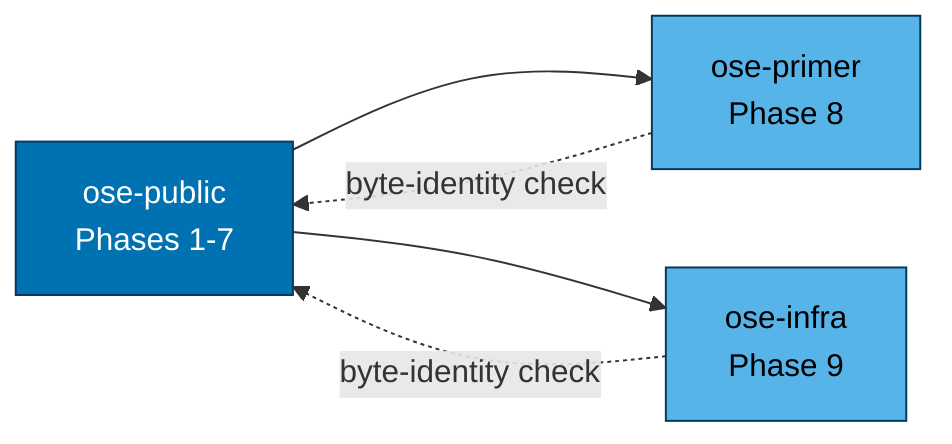
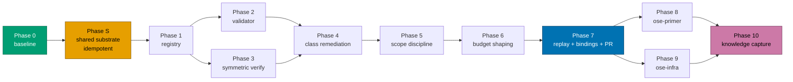

# Technical Documentation — Plan Quality Gate Convergence

## Architecture

### Current loop (as built)



Every defect — a mistyped backtick or a cross-document semantic contradiction — enters through the
same expensive door, and every fix leaves through an unverified one.

### Target loop (this plan)



Three changes from the previous draft's loop, each load-bearing:

- **The semantic lenses fan out in parallel** rather than one lens iterating (DD-8). This is the
  primary round-reducer, and it is why the loop no longer needs a large iteration budget.
- **Termination reads a flattening discovery curve**, not a consecutive-zero counter (XD-3). Two
  zeros from one lens shape is one observation repeated.
- **The "file latent backlog plan" node is gone.** Latent findings route into the registry and are
  re-detected by the unconditional deterministic pass on the next invocation (DD-5), which is a
  binding rather than a ticket.

### Lens sequencing across an iteration



### Finding classification decision branch



Note every ambiguous branch falls through to **in-surface**. Latent is the narrow, evidence-bearing
exception, never the default.

The three latent terminal states replace the previous draft's single "file a backlog plan" node, which
was a deferral dressed as ownership (DD-5). Each terminal state binds to something that runs without
anyone remembering: the unconditional pre-flight re-detects registry-class findings on the next
invocation, Knowledge Capture converts new classes into that same case permanently, and the residue is
an explicit, reversible, recorded acceptance rather than a ticket.

### Defect lifecycle



The `ClosureVerified --> Introduced` edge is the fix-site injection loop this plan is built to cut.

### Tri-repo propagation dependency



### Delivery phase flow



Phases 2 and 3 are independent of each other and may run in parallel (subject to the repo's
concurrency cap); Phases 8 and 9 likewise.

**Phase S is idempotent and shared with the sibling plan** (XD-2). Whichever plan reaches it first
lands the shared substrate; the other detects it present and records "already landed". That
idempotency is what lets both plans run concurrently without either waiting on the other and without
either doing the work twice.

## Defect-Class Registry — seed content

The registry lands at
`repo-governance/development/quality/plan-acceptance-defect-classes.md` [Repo-grounded — verified
absent via `test -f` during authoring]. Every entry below was **empirically verified**, on this host,
using the same `grep` resolution an executing agent gets — the seed classes during this plan's
authoring, and DC-8 during the 2026-07-20 goal-alignment audit.

The registry is **open for append** and its size is not a fixed property; delivery clauses assert a
count only as a point-in-time acceptance check against the file they just wrote, never as a claim
about the collection.

Two of the seed classes were discovered by the plan's own authoring process rather than by the
archived chain — **DC-2b** (the safe form masks file absence) and **DC-8** (the bracket-expression
backslash) — which is the registry's own evidence that mechanism 3 works: both were caught by
empirically simulating a clause before trusting it, and neither was on anybody's list beforehand.

### DC-1 — `grep -c` counts matching lines, not distinct terms

**Symptom**: a multi-term alternation threshold undercounts when the authored prose packs several
terms onto one line. An `≥ 3` threshold reads as failing even though all three terms are present.

**Proof** (observed: packed returns `1`, spread returns `3`):

```sh
printf 'alpha beta gamma\n' > packed.md
printf 'alpha\nbeta\ngamma\n' > spread.md
grep -Ec 'alpha|beta|gamma' packed.md   # 1
grep -Ec 'alpha|beta|gamma' spread.md   # 3
```

**Safe form** (observed: `3` for both fixtures):

```sh
grep -ohE 'alpha|beta|gamma' packed.md | sort -u | wc -l
```

**Detection**: statically detectable — a `grep -c`/`-Ec`/`-Eic` invocation whose pattern contains an
unescaped `|` alternation, compared against a threshold greater than 1.

### DC-2 — `grep` against an absent file prints nothing and exits 2

**Symptom**: "returns 0 pre-edit" is false for any file the plan itself creates. The executing agent
observes a stderr warning and exit 2, not `0`, and may reasonably read that as pre-existing breakage.

**Proof** (observed exactly as annotated):

```sh
grep -Ec 'alpha' absent.md   # stdout empty, exit 2
grep -Ec 'zzz'   packed.md   # stdout "0",  exit 1
```

**Safe form**: assert absence with `test -f <path>` and reserve the count clause for the post-edit
direction.

### DC-2b — the safe occurrence-unique form masks file absence

**Symptom**: this corollary was discovered by simulation while authoring this very plan. The DC-1
safe form returns `0` for a present-but-no-match file **and** for an absent file, because `wc -l`
counts empty stdin identically. The safe form is therefore not self-falsifying about existence.

**Proof** (observed: both print `0`; exit codes differ, 1 versus 2):

```sh
grep -ohE 'alpha|beta' present-no-match.md | sort -u | wc -l   # 0
grep -ohE 'alpha|beta' absent.md           | sort -u | wc -l   # 0
```

**Safe form**: every occurrence-unique clause targeting a file whose existence is not already
guaranteed must be paired with a `test -f` companion assertion.

### DC-3 — multi-file `grep -c` emits per-file `filename:count`

**Symptom**: `grep -c pattern file1 file2` does not print one comparable number; it prints one
`filename:count` line per file, so a single numeric threshold comparison is ill-defined. Output
ordering was additionally observed to be non-alphabetical and is not guaranteed stable.

**Proof** (observed output: `spread.md:1` then `packed.md:1` — note the ordering):

```sh
grep -Ec 'alpha' packed.md spread.md
```

**Safe form** (observed: a single comparable number):

```sh
grep -ohE 'alpha|beta' packed.md spread.md | sort -u | wc -l
```

### DC-4 — `grep -L` semantics are environment-dependent

**Symptom**: in this repo `grep` is a shell function whose resolution varies; under ripgrep `-L`
means _follow symlinks_, under GNU/POSIX grep it means _files without match_. A clause that means one
thing in the authoring environment silently means another in the executing one, and the
follow-symlinks reading returns empty output that reads as passing unconditionally.

**Proof**: the resolved behavior differs by host and by which binary the `grep` function routes to;
during this plan's authoring the sandbox resolved to files-without-match semantics, while the repo's
standing guidance records the follow-symlinks routing. The disagreement is the defect.

**Safe form**:

```sh
for f in a.md b.md; do grep -q 'pattern' "$f" || echo "$f"; done
```

**Detection**: statically detectable — literal `grep -L` (or `-L` inside a combined flag cluster) in
an acceptance clause. This class is a hard prohibition, not a caution.

### DC-5 — a fence indented past its list item content column becomes an indented code block

**Symptom**: a fenced block indented deeper than its list item's CommonMark content column parses as
an **indented** code block. The fence markers become literal text and every subsequent indented
paragraph is swallowed into the block, destroying all formatting.

**Proof** (verified through the repo's own `marked`): the six-space form parses with no
`language-sh` class and swallows the trailing prose; the two-space form parses as a proper fenced
block with `language-sh` and the trailing prose renders as a paragraph.

**Critically, no existing repo tool catches this** [Repo-grounded — both verified during authoring]:

- Prettier reports the broken form as already correctly formatted.
- `markdownlint-cli2` under this repo's `.markdownlint-cli2.jsonc` reports **0 errors**, because
  `MD046` is not configured and its default `consistent` style is vacuously satisfied.
- With `MD046: {style: fenced}` the same file reports **1 error**
  (`MD046/code-block-style Code block style [Expected: fenced; Actual: indented]`).

**Safe form**: indent the fence to the list item's content column — two spaces for a top-level
`- [ ]` item.

**Detection**: statically detectable, and additionally coverable by an `MD046` config change (see
README open question Q2).

### DC-6 — non-discriminating acceptance clause

**Symptom**: a clause ORs several search terms, and one of them is already made true by an **earlier
checkbox in the same phase** writing that term into the same target file. The clause then passes
regardless of whether this checkbox does any work.

**Proof**: iteration 16 of the archived chain, `delivery.md:734-738` — the clause ORed
`api-quality-gate` with `surface-conditional`, and an earlier §4b checkbox already wrote
`surface-conditional` into the same file.

**Safe form**: assert on the term unique to _this_ checkbox's mandated content, with no weaker
alternative ORed in.

**Detection**: partially static — a validator can flag OR-clauses whose terms appear in an earlier
checkbox's mandated content within the same phase; final judgment stays with the checker.

### DC-7 — pre-edit claim falsified by an earlier checkbox in the same phase

**Symptom**: a "returns 0 today" claim is false because an earlier checkbox in the same phase already
created or populated the target file.

**Proof**: iteration 8 of the archived chain.

**Safe form**: state the pre-edit claim relative to the checkbox's own natural checkpoint — the state
the executing agent actually observes when it reaches this box — not relative to the phase's start.

**Detection**: partially static; same treatment as DC-6.

### DC-8 — inside a bracket expression, a backslash is not an escape

**Symptom**: a clause using `[^\n]` to mean "any character except a newline" is parsed by POSIX
bracket-expression rules, where a backslash is **not** special inside `[...]`. The class therefore
means "not the literal character `\` and not the literal character `n`", and every match truncates at
the first lowercase `n` in the matched text. BSD grep enforces this strictly; GNU grep and ripgrep
both extend `\n` inside brackets as an escape and do **not** truncate — so the same clause silently
means different things in the authoring environment and the executing one.

**Provenance**: found during the 2026-07-20 goal-alignment audit, in the sibling plan's **own**
delivery checklist, inside the acceptance clauses authored to demonstrate that plan's new search-tool
discipline. It is this registry's second self-caught entry, after DC-2b.

**Proof** (observed exactly as annotated, on this host, against the real agent file):

```sh
# BSD grep — every heading truncates before its first lowercase "n"
command grep -ohE '^### Step [0-9.]+[^\n]*' .claude/agents/repo-rules-checker.md | sort -u
# → "### Step 0: I", "### Step 1: Core Repository Validatio", "### Step 7: Rules Gover", …

# Safe form — full, untruncated headings on every engine
command grep -ohE '^### Step [0-9.]+.*$' .claude/agents/repo-rules-checker.md | sort -u
# → "### Step 0: Initialize Report", "### Step 1: Core Repository Validation", …
```

**Why it survived**: `sort -u | wc -l` returned the **correct count** in the repo state where it was
written, because no two truncated prefixes happened to collide. That is luck, not correctness. A
future heading rename sharing a truncated prefix with a sibling heading would collapse two entries
into one through the `sort -u` dedup, silently **undercounting** — which would let a
"no check was removed" invariant pass even after a check really had been removed. A clause that is
right by coincidence is indistinguishable from a clause that is right by construction until the
coincidence ends.

**Safe form**: anchor to end of line with `$` and drop the character class entirely —
`'^### Step [0-9.]+.*$'`. Under `grep -o`, `.` does not match a newline by construction on any grep
implementation, so this sidesteps the bracket-escaping ambiguity rather than working around it.
A closed class with no backslash (`[^)]*`) is equally safe where a terminator character exists.

**Detection**: statically detectable — a backslash appearing inside a bracket expression in an
acceptance clause. Stated as the DD-9 invariant: every clause's regex means the same thing under the
BSD, GNU and ripgrep engines.

**Cross-reference**: this class is a worked instance of the sibling plan's **enumeration-fails-open
rule**. The clause enumerated what to exclude instead of asserting an invariant, and the enumeration
failed open — silently, exactly as the OWASP/NIST denylist asymmetry predicts.

## Design Decisions

### DD-1 — the registry is a governance convention, not agent-inlined prose

Inlining eight trap descriptions with proofs into `plan-maker.md`, `plan-checker.md` and
`plan-fixer.md` would triple the content and push against the instruction-file size budget
[Repo-grounded — `nx run rhino-cli:instruction-size:validation` exists]. A single governance file
that all three link to keeps one source of truth and one place to append entry nine.

### DD-2 — the deterministic pass is a `rhino-cli` validator

**The owner-selection reasoning is not re-derived here.** It is already codified in
[`repo-governance/conventions/structure/deterministic-vs-ai-validation-split.md`](../../../repo-governance/conventions/structure/deterministic-vs-ai-validation-split.md)
§Adding a new validation category, whose decision tree reads: "Can the rule be encoded as an exact
predicate (regex, file-existence check, field-equality test, exact-substring match, hash comparison)?
If yes, owner is **Deterministic**." Every statically-detectable class in the registry is exactly such
a predicate, so the convention selects the deterministic layer without further argument.

An earlier draft of this section re-derived that tree from scratch and omitted the convention from the
Surface Inventory entirely — a self-inflicted BS-2/BS-10 instance recorded in
[README XD-1](./README.md#xd-1--extend-the-existing-deterministic-vs-ai-split-convention-rather-than-re-derive-it).
What this plan adds is the **row**, not the reasoning.

**The convention's implementation contract is adopted verbatim as the Phase 2 Gate bar**, replacing
the weaker ad hoc "`nx run rhino-cli:test:unit` exits 0" criterion. A new deterministic category MUST
have ≥90% line coverage on its implementation files, a Gherkin feature with **both** happy-path and
failure-path scenarios, unit tests **and** integration tests against real temp-dir fixtures, and
byte-determinism given a fixed clock. That bar is what every other deterministic category in this repo
already meets; holding this one to less would have been a silent exemption.

Cost: `apps/rhino-cli` must stay byte-identical across all three repos per the
[SDLC Gate Standard](../../../docs/reference/sdlc-gate-standard.md), so this adds a Gherkin behavior
tree and propagation weight. Two things bound that cost:
[XD-2](./README.md#xd-2--one-shared-substrate-built-once-landed-idempotently) shares the subcommand
plumbing with the sibling plan so it is registered once rather than twice, and
[XD-6](./README.md#xd-6--every-proposed-validator-passes-the-tricorder-inclusion-criterion) admits a
detector only when the problem is obvious and the fix is clear.

This decision remains the plan's largest reversible commitment (README DECISION 1). Phase 2 is
authored to be separable — removing it degrades the plan to mechanisms 1 and 3-7 without restructuring
any other phase.

### DD-2b — what the validator must NOT try to detect

The Tricorder criterion ([XD-6](./README.md#xd-6--every-proposed-validator-passes-the-tricorder-inclusion-criterion))
cuts as well as admits, and the cut boundary is recorded here so a future contributor does not
re-propose across it. Google's Tricorder deployment explicitly **rejected** computable-but-unactionable
analyses — complexity warnings, fault-prediction scores — because a finding a developer cannot act on
erodes trust in every other finding the tool emits. It further notes that analyses flagging **missing**
content cannot be auto-fixed and consequently earn low trust.
[Web-cited — via the 2026-07-20 research brief]

The independent boundary from the prose-tooling domain: Vale, textlint and markdownlint reliably catch
**lexical and structural** violations and **cannot** determine that document A contradicts document B.
[Web-cited — via the 2026-07-20 research brief]

Applied to this registry: DC-1, DC-2, DC-2b, DC-3, DC-4, DC-5 and DC-8 are lexical/structural exact
predicates with obvious problems and clear fixes, and are built. DC-6 and DC-7 require reading two
checkboxes' prose against each other to decide whether one falsifies the other — a contradiction
judgement, on the far side of the boundary — so their **static half** (flagging OR-clauses and
pre-edit claims whose terms appear in an earlier same-phase checkbox) is built as a **candidate
surfacer**, and the verdict stays with the checker. That split follows the split convention's own rule
3: split the rule, never give the same rule to both layers.

### DD-3 — symmetric verification is an obligation with a **mechanically checkable** artifact

`plan-maker` and `plan-fixer` gain an explicit requirement to execute what they write. The _act_ of
simulating cannot be fully mechanized (the clause may target a file that does not exist yet), but the
**evidence that it happened** can be — and the previous draft's failure to mechanize it was the plan's
sharpest internal contradiction.

That draft left this mechanism as an unenforced prose obligation while DD-2 rejected exactly that
approach for the mechanizable classes, reasoning that "a skill cannot guarantee it actually runs, and
the archived chain shows self-checks are exactly what gets skipped under budget pressure". The same
reasoning applies with **more** force here, because this mechanism targets the single largest observed
cause of waste (fix-site defect injection, roughly 5 of the archived chain's 17 iterations). The plan
mechanized the smaller half of the problem and trusted the larger half to discipline that its own
evidence says fails.

**Correction (README DECISION 7)**: a fix report claiming `APPLIED (verified)` MUST carry the observed
output as a **literal fenced shell transcript**, not a claim that verification occurred. Presence of
that block is an exact predicate — a fenced block, in a named section, in a report claiming a verified
status — so under the split convention's decision tree it is a deterministic check, and under XD-6 it
qualifies cleanly: the problem is obvious (no transcript), the fix is clear (paste the transcript),
and a re-validating checker can diff the recorded transcript against a fresh re-execution.

This converts an unfalsifiable claim ("I verified it") into a falsifiable one ("here is what the
command printed, and re-running it prints the same"). An unsimulatable clause must still be rewritten
into a simulatable form or omitted — never written on faith.

### DD-4 — class-level remediation is a fixer obligation with a **mechanized** checker counterpart

Fixer must enumerate; checker must independently re-run the enumeration. One without the other
reproduces the iteration 9/10/11 failure: the fixer claimed a sweep, the checker verified only the
originally flagged site, and the residue surfaced an iteration later.

**The checker's half is mechanized, not re-derived** (README DECISION 8). The previous draft left
class-closure verification as an AI re-derivation of an enumeration that is, by construction, a
pattern-count operation — which is precisely the operation that failed three consecutive times when
left to an agent's instance-scoped attention. Every registry entry already stores a runnable detection
command, so the [XD-2](./README.md#xd-2--one-shared-substrate-built-once-landed-idempotently)
registry-replay harness re-runs that command against the whole plan and diffs before/after. Class
closure becomes a count-diff: non-zero after a claimed sweep is a class-closure failure, full stop.

The harness is built once and shared with the sibling plan, which needs the identical operation for
its own registry.

### DD-5 — the in-surface / latent split: a scope narrowing, **not** the terminator

**The previous draft called this "the plan's single biggest terminator". That was wrong, and the
correction matters more than any other change in this rework.**

A deferral is not a terminator. The draft's hard gate required, before `pass`, that a follow-up
backlog plan capturing every latent finding **exist on disk** — while the plan's own README conceded,
in the same breath, that such follow-ups "reliably evaporate". Filing a ticket is not fixing the
finding it names, nothing in this repo forces a filed backlog plan to execute, and so the passing
condition converted "the checker found a real defect" into "a defect ticket exists somewhere". Every
individual guard was well-reasoned; the gate they fed was not.

That gate is **removed** (README DECISION 3). It failed the disposition test in both directions: it
did not reduce rounds (it added artifact creation to every chain surfacing even one latent finding),
and it did not raise quality (by the plan's own admission the artifact does not cause the fix).

**What the split actually is**, under
[XD-3](./README.md#xd-3--one-termination-doctrine-saturation-not-round-counting): a **scope
narrowing**. Saturation-based termination holds that if round N+1 is structurally narrower than round
N, two clean rounds prove the **lens** is exhausted rather than the artifact. So the narrowing is
legal **only** because two conditions hold, and the plan states both rather than assuming them:

1. The narrowing is **recorded** — the in-surface ledger is derived mechanically and the narrowed-out
   region is named, so a reader can see what was excluded.
2. The narrowed-out latent region is covered by **its own operationally-disjoint lens** — the single
   non-looping latent sweep, which asks a different question over a different artifact set than the
   in-surface semantic lens does.

**What binds a latent finding now** — three paths, none of which depends on anyone remembering:

1. A latent finding **instantiating a registry class** needs no ticket at all. The deterministic
   pre-flight runs **unconditionally on every subsequent invocation** of the gate against that plan,
   so the finding is mechanically re-detected next time by a step that has no skip branch. This is the
   binding that cannot evaporate: it is not a promise, it is an unconditional node in the control flow.
2. A latent finding instantiating a **new** class is appended to the registry during Knowledge Capture
   (already a Phase 10 gate item), which permanently converts it into case 1.
3. A latent finding that is neither, and is neither CRITICAL nor execution-reachable, is closed as
   **explicitly accepted risk with a recorded rationale in the audit report** — an auditable
   acceptance a maintainer can read and reverse, rather than a phantom ticket that reads as ownership
   while being none.

**The four anti-loophole guards survive unchanged in substance**, restated as invariants rather than
as a list of exempted cases per
[XD-5](./README.md#xd-5--guards-are-invariants-not-enumerations) — an enumeration of what may be
deferred fails open on the case nobody listed, whereas an invariant over every finding fails closed:

1. **Mechanical surface derivation.** The in-surface ledger derives from `git diff` and the fix
   report's Changed Files list — not from the checker's judgment about what "feels" pre-existing.
2. **Provenance requirement.** A latent classification must cite evidence (`git log -L` on the
   offending line range) showing the content predates this chain. An uncitable classification is
   in-surface by default.
3. **CRITICAL is never latent-exempt.** Severity overrides provenance, unconditionally.
4. **Execution-reachability promotion.** A latent finding located inside a delivery checkbox that
   this plan's execution will act on is promoted to in-surface. Scope discipline may defer defects in
   _description_, never in _instruction_.

Note that every ambiguous branch still falls through to **in-surface**. Latent remains the narrow,
evidence-bearing exception, never the default — and it is now an exception that routes into a
mechanism rather than into a queue.

**Guard 2 carries a known residual risk, stated plainly.** The `git log -L` provenance requirement is
executed by the same checker agent whose search-completeness under budget pressure is the entire
subject of the sibling plan. Nothing gives the provenance-citation step its own deterministic
verifier, so a fatigued checker could in principle mis-cite provenance. Two things bound that
exposure: an uncitable classification defaults to in-surface (the failure direction is safe), and
paths 1 and 2 above mean a mis-classified latent finding is still re-detected mechanically on the next
invocation. The risk is real, is not fully closed, and is recorded here rather than argued away.

### DD-6 — budget shaping is ordered **and parallel** lenses, not a bigger iteration cap

Raising `max-iterations` treats the symptom. Ordering the lenses cheap-first, and bounding the
expensive lens to the in-surface partition, treats part of the cause. But the previous draft's model
was still fundamentally **sequential**, and per
[XD-4](./README.md#xd-4--parallel-operationally-disjoint-lenses-replace-sequential-rounds) a
sequential loop over one lens shape cannot converge regardless of how the budget is shaped.

The corrected model runs the semantic lenses **in parallel within a round**, subject to the repo's
concurrency cap of 2 background subagents and 3 total including the main thread. See DD-8 for the lens
roster and its disjointness proof.

`max-iterations` survives purely as a **runaway circuit-breaker** and is documented as such in the
workflow frontmatter (README DECISION 4). It is not a convergence expectation, and the plan no longer
implies it is one — the Chromium OS case-control study found round count does not predict missed
defects, while scope breadth and reviewer workload do.
[Web-cited — via the 2026-07-20 research brief]

### DD-7 — the convergence target text is corrected, not deleted

`plan-quality-gate.md:237` and `plan-checker.md` §Convergence Target both claim 3-5 iterations. The
archived chain falsifies this. The text is rewritten rather than silently dropped, so the next reader
understands why the number changed and is not tempted to restore it.

**What replaces it is not another number.** Under XD-3 the replacement is the saturation rule: the
gate terminates when the cumulative new-category discovery curve has flattened across
operationally-disjoint lenses. Rewriting one falsified constant into a differently-shaped constant
would be bookkeeping that neither reduces rounds nor raises quality; installing the doctrine that
makes constants unnecessary is what earns the edit its place in the plan.

### DD-8 — the lens roster, and its disjointness proof

[XD-4](./README.md#xd-4--parallel-operationally-disjoint-lenses-replace-sequential-rounds) is only
real if the lenses are genuinely disjoint. The PBR replication is explicit that reviewers given merely
differently-**labelled** perspectives converge on the same defects, so a lens roster without a
disjointness check silently degenerates into the sequential loop it replaced.

Each lens therefore **declares the artifact set it reads**, and a lens whose declared set is a
**subset** of another lens's is rejected as a relabel (README DECISION 10). The roster:

| Lens                       | Question it asks                                                            | Artifacts it reads                                              |
| -------------------------- | --------------------------------------------------------------------------- | --------------------------------------------------------------- |
| **Deterministic**          | Does any clause instantiate a statically-detectable registry class?         | The plan's own markdown, the registry's detection commands      |
| **Clause-simulation**      | Does each shell-bearing clause print what it claims, in both directions?    | Live command output, the real repo tree, fixture files          |
| **Cross-document**         | Does any document contradict a sibling document in the same plan?           | All five plan documents read against each other                 |
| **Execution-reachability** | Would an execution-grade agent following this literally do the wrong thing? | The delivery checklist read as instructions, not as prose       |
| **Latent (non-looping)**   | Does untouched pre-existing content contain defects?                        | The plan regions outside the mechanically-derived change ledger |

No two rows share an artifact set, and no row's set is a subset of another's — the deterministic lens
reads detection commands nothing else reads, clause-simulation reads live process output nothing else
reads, cross-document reads document **pairs** rather than single documents, execution-reachability
reads the checklist under a different interpretation than any other lens applies, and the latent lens
reads precisely the complement of the region every other semantic lens is bounded to. That complement
relationship is what makes the DD-5 scope narrowing legal under XD-3.

**Triage precedes the spend.** The full roster is not run against every plan; per the RADAR
risk-triage finding, multi-lens rigor is spent on the high-risk stratum, and a low-risk change runs the
deterministic lens plus whichever single semantic lens its change surface indicates.
[Web-cited — via the 2026-07-20 research brief]

### DD-9 — detectors are stated as invariants, never as forbidden-pattern lists

Per [XD-5](./README.md#xd-5--guards-are-invariants-not-enumerations), each detector asserts a property
over **every** clause in scope rather than matching a list of known-bad forms. The distinction is not
stylistic: a denylist fails **open and silently** on the form nobody listed, an invariant fails
**closed and loudly**, and a loud failure is catchable on the next round while a silent one is not.

Restated in invariant form, the seed classes become:

| Class        | Denylist form (rejected)                | Invariant form (adopted)                                                              |
| ------------ | --------------------------------------- | ------------------------------------------------------------------------------------- |
| DC-1         | forbid `grep -c` with `\|` alternation  | every count clause compared against a threshold > 1 counts **occurrences**, not lines |
| DC-2 / DC-2b | forbid pre-edit counts on created files | every count clause on a non-guaranteed file is paired with a `test -f` companion      |
| DC-3         | forbid multi-file `grep -c`             | every numeric threshold is compared against exactly **one** comparable number         |
| DC-4         | forbid `grep -L`                        | every clause's semantics are invariant across the `grep` implementations in this repo |
| DC-5         | forbid six-space fence indentation      | every fenced block is indented to its list item's CommonMark content column           |
| DC-8         | forbid `[^\n]` in a bracket expression  | every clause's regex means the same thing under BSD, GNU and ripgrep engines          |

DC-8 is the class that proves the point: it was **not** on anyone's denylist, and it appeared in a
sibling plan's own checklist precisely because a denylist cannot cover the form nobody imagined. The
invariant form ("means the same thing under every engine") catches it without having anticipated it.

**Honest limit on the fixture-based verification of these invariants** (per
[XD-7](./README.md#xd-7--control-probes-and-seeded-fixtures-are-standing-practice-mutation-is-the-escalation)):
fixtures authored by the detector's own author validate the author's **intent**, not the author's
unimagined blind spots — the same failure mode DC-8 demonstrates. The escalation path when hand
fixtures stop finding anything is μSE-style mutation of inputs along axes the detector does not name.
**That escalation has no citable precedent for prose or markdown linters**; it is a reasonable
extrapolation from code-domain work, is recorded in the registry as a future option, and is **not** a
phase this plan executes.

## UI-Design-Funnel Exemption

This plan is **not UI-bearing**. It changes governance markdown, agent definitions, one skill, and a
CLI validator that emits text to stdout. It adds and changes no user-facing screen or component under
`apps/` or `libs/` that renders to an end user. Per the
[UI Mockups in Plan Docs convention](../../../repo-governance/conventions/formatting/diagrams.md#ui-mockups-in-plan-docs),
the design funnel does not apply, and this paragraph is the explicit exemption record.

## Testing Strategy

| Mechanism                        | Test level                    | How the Gherkin binds                                                                        |
| -------------------------------- | ----------------------------- | -------------------------------------------------------------------------------------------- |
| Registry proofs (DC-1..DC-7)     | Executable proof commands     | AC-1, AC-2, AC-3 — each proof is run as a gate item and must reproduce the documented result |
| Deterministic validator          | Rust unit + Gherkin specs     | AC-4, AC-5, AC-6 — RED tests against fixture plans carrying each trap                        |
| Historical replay                | Integration                   | AC-6 and the Phase 7 replay — fixtures reproducing the archived chain's real defect sites    |
| Agent/workflow contract text     | Grep-based gate checks        | AC-8 through AC-15 — presence and shape verified mechanically, semantics by review           |
| No-check-removed invariant       | Inventory diff                | AC-16 — Phase 0 records the baseline inventory; Phase 7 compares                             |
| Bindings + byte identity         | Existing repo validators      | AC-17, AC-18 — `npm run generate:bindings`, harness sync validation, byte-identity diff      |
| DC-8 bracket-expression class    | Rust unit + Gherkin specs     | AC-19 — RED test over a fixture carrying `[^\n]`, with the corrected form yielding zero      |
| Transcript enforcement           | Deterministic predicate       | AC-20 — a report claiming verified status without a fenced transcript block is a finding     |
| Class closure via replay         | Registry-replay count-diff    | AC-21 — before/after counts from the entry's own recorded detection command                  |
| Lens disjointness                | Roster set comparison         | AC-22 — a lens whose declared artifact set is a subset of another's is rejected              |
| Shared substrate idempotency     | Both-direction fixtures       | AC-23 — applied when absent, detected and skipped when present                               |
| Split-convention extension       | Table-row presence + contract | AC-24 — the row exists and the category meets the convention's own implementation contract   |
| Invariant form + paired fixtures | FN and FP scoring             | AC-25 — violating fixture yields a finding, conforming look-alike yields zero                |

Per [Test-Driven Development](../../../repo-governance/development/workflow/test-driven-development.md),
the validator's tests are written before its implementation; each RED step in
[delivery.md](./delivery.md) carries exactly one bound scenario.

## Surface Inventory

| #   | Surface                                                                         | Change                                                                                                                           | Grounding                     |
| --- | ------------------------------------------------------------------------------- | -------------------------------------------------------------------------------------------------------------------------------- | ----------------------------- |
| 0   | `repo-governance/conventions/structure/deterministic-vs-ai-validation-split.md` | **Extend (shared, idempotent)** — one row in The Split table; its implementation contract adopted as the Phase 2 Gate bar (XD-1) | [Repo-grounded] exists        |
| 0b  | `repo-governance/development/pattern/maker-checker-fixer.md`                    | **Extend (shared, idempotent)** — the single saturation termination doctrine (XD-3); safeguard added by name, never by ordinal   | [Repo-grounded] exists        |
| 1   | `repo-governance/development/quality/plan-acceptance-defect-classes.md`         | **Create** — the DCR                                                                                                             | [Repo-grounded] absent today  |
| 2   | `repo-governance/workflows/plan/plan-quality-gate.md`                           | Step model, termination criteria, convergence target                                                                             | [Repo-grounded] exists        |
| 3   | `.claude/agents/plan-checker.md`                                                | Deterministic-first step, surface partition, class-closure check                                                                 | [Repo-grounded] exists        |
| 4   | `.claude/agents/plan-fixer.md`                                                  | Class-level contract, upgraded §7 self-verification, latent filing                                                               | [Repo-grounded] exists        |
| 5   | `.claude/agents/plan-maker.md`                                                  | Authoring-time simulation requirement, DCR link                                                                                  | [Repo-grounded] exists        |
| 6   | `.claude/agents/plan-execution-checker.md`                                      | DCR vocabulary reference                                                                                                         | [Repo-grounded] exists        |
| 7   | `.claude/skills/plan-creating-project-plans/SKILL.md`                           | Authoring-time simulation rule, DCR link                                                                                         | [Repo-grounded] exists        |
| 8   | `apps/rhino-cli/src/commands/` (new validator module)                           | **Create** — `plan validate-acceptance`                                                                                          | [Repo-grounded] dir exists    |
| 8b  | `apps/rhino-cli/src/commands/` (registry-replay harness)                        | **Create (shared, idempotent)** — `governance registry-replay`; re-runs a registry entry's detection command and diffs (XD-2)    | [Repo-grounded] dir exists    |
| 9   | `apps/rhino-cli/src/cli.rs`, `commands.rs`                                      | **Shared, idempotent** — both plans' subcommands registered in one edit (XD-2)                                                   | [Repo-grounded] exist         |
| 10  | `apps/rhino-cli/project.json`                                                   | New Nx target                                                                                                                    | [Repo-grounded] exists        |
| 11  | `specs/apps/rhino/behavior/rhino-cli/gherkin/` (new domain folder)              | **Create** — behavior tree for the validator                                                                                     | [Repo-grounded] parent exists |
| 12  | `.opencode/`, `.amazonq/`                                                       | **Regenerated only** — never hand-edited                                                                                         | Generated artifacts           |
| 13  | `ose-primer`, `ose-infra`                                                       | Propagation of surfaces 0 through 11                                                                                             | Sibling repos                 |

## Dependencies

- `npm run generate:bindings` — regenerates `.opencode/` and `.amazonq/` from `.claude/`
- `npx nx affected -t typecheck lint test:quick specs:coverage` — the standing quality gate
- `cargo` via the existing rhino-cli Nx targets — validator build and test
- `marked` (already in `node_modules`) — CommonMark rendering for fence verification
- `gh` CLI — PR creation and the review cycle

## Rollback

Every surface is additive or text-level. Rollback is `git revert` of the phase PR. The validator is
introduced advisory-first (reports findings; the workflow acts on them) so a defective validator
degrades to noise rather than to a blocked gate. The registry is inert data. No migration, no
persisted state, no schema.
