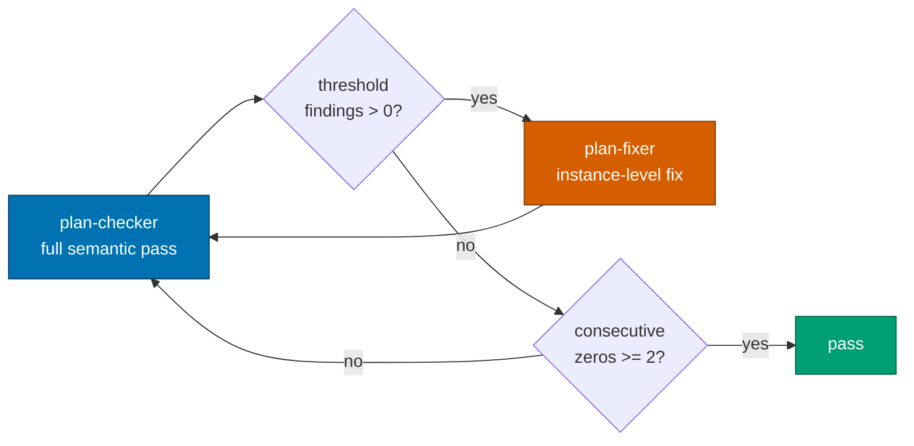
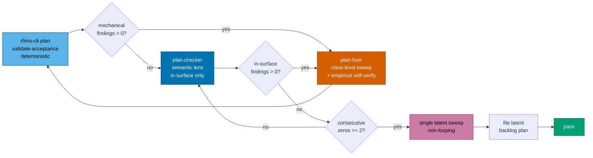
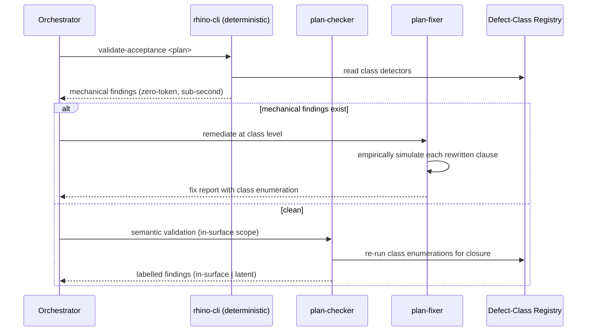
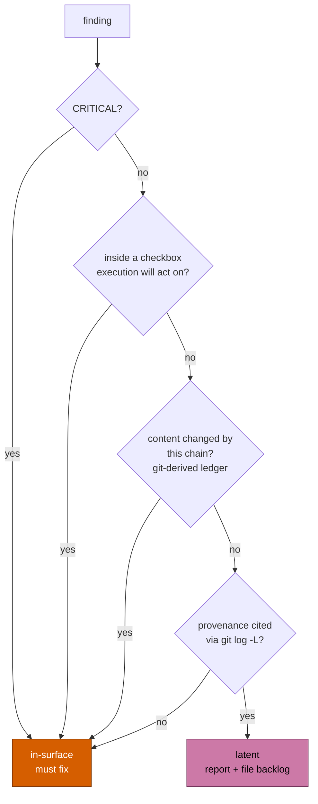
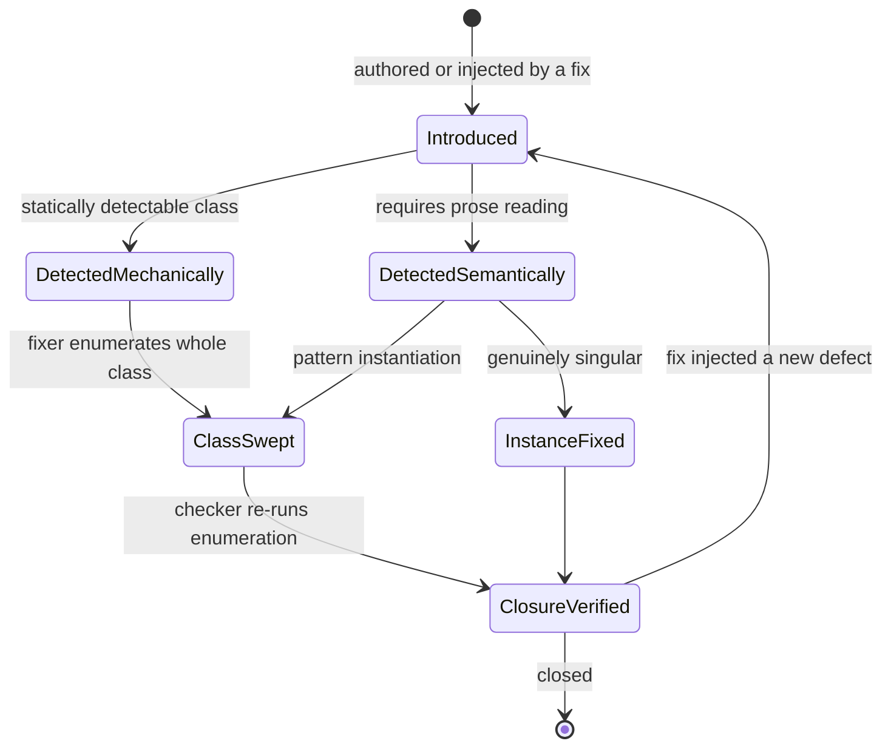
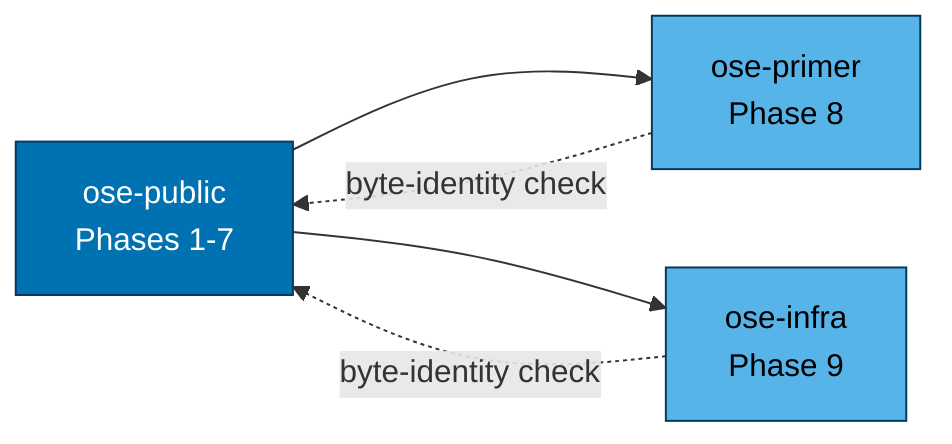
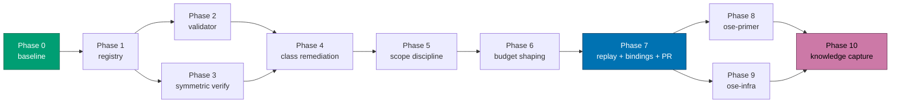

# Technical Documentation — Plan Quality Gate Convergence

## Architecture

### Current loop (as built)



Every defect — a mistyped backtick or a cross-document semantic contradiction — enters through the
same expensive door, and every fix leaves through an unverified one.

### Target loop (this plan)



### Lens sequencing across an iteration



### Finding classification decision branch



Note every ambiguous branch falls through to **in-surface**. Latent is the narrow, evidence-bearing
exception, never the default.

### Defect lifecycle



The `ClosureVerified --> Introduced` edge is the fix-site injection loop this plan is built to cut.

### Tri-repo propagation dependency



### Delivery phase flow



Phases 2 and 3 are independent of each other and may run in parallel (subject to the repo's
concurrency cap); Phases 8 and 9 likewise.

## Defect-Class Registry — seed content

The registry lands at
`repo-governance/development/quality/plan-acceptance-defect-classes.md` [Repo-grounded — verified
absent via `test -f` during authoring]. Every entry below was **empirically verified during this
plan's authoring**, on this host, using the same `grep` resolution an executing agent gets.

### DC-1 — `grep -c` counts matching lines, not distinct terms

**Symptom**: a multi-term alternation threshold undercounts when the authored prose packs several
terms onto one line. An `≥ 3` threshold reads as failing even though all three terms are present.

**Proof** (observed: packed returns `1`, spread returns `3`):

```sh
printf 'alpha beta gamma\n' > packed.md
printf 'alpha\nbeta\ngamma\n' > spread.md
grep -Ec 'alpha|beta|gamma' packed.md   # 1
grep -Ec 'alpha|beta|gamma' spread.md   # 3
```

**Safe form** (observed: `3` for both fixtures):

```sh
grep -ohE 'alpha|beta|gamma' packed.md | sort -u | wc -l
```

**Detection**: statically detectable — a `grep -c`/`-Ec`/`-Eic` invocation whose pattern contains an
unescaped `|` alternation, compared against a threshold greater than 1.

### DC-2 — `grep` against an absent file prints nothing and exits 2

**Symptom**: "returns 0 pre-edit" is false for any file the plan itself creates. The executing agent
observes a stderr warning and exit 2, not `0`, and may reasonably read that as pre-existing breakage.

**Proof** (observed exactly as annotated):

```sh
grep -Ec 'alpha' absent.md   # stdout empty, exit 2
grep -Ec 'zzz'   packed.md   # stdout "0",  exit 1
```

**Safe form**: assert absence with `test -f <path>` and reserve the count clause for the post-edit
direction.

### DC-2b — the safe occurrence-unique form masks file absence

**Symptom**: this corollary was discovered by simulation while authoring this very plan. The DC-1
safe form returns `0` for a present-but-no-match file **and** for an absent file, because `wc -l`
counts empty stdin identically. The safe form is therefore not self-falsifying about existence.

**Proof** (observed: both print `0`; exit codes differ, 1 versus 2):

```sh
grep -ohE 'alpha|beta' present-no-match.md | sort -u | wc -l   # 0
grep -ohE 'alpha|beta' absent.md           | sort -u | wc -l   # 0
```

**Safe form**: every occurrence-unique clause targeting a file whose existence is not already
guaranteed must be paired with a `test -f` companion assertion.

### DC-3 — multi-file `grep -c` emits per-file `filename:count`

**Symptom**: `grep -c pattern file1 file2` does not print one comparable number; it prints one
`filename:count` line per file, so a single numeric threshold comparison is ill-defined. Output
ordering was additionally observed to be non-alphabetical and is not guaranteed stable.

**Proof** (observed output: `spread.md:1` then `packed.md:1` — note the ordering):

```sh
grep -Ec 'alpha' packed.md spread.md
```

**Safe form** (observed: a single comparable number):

```sh
grep -ohE 'alpha|beta' packed.md spread.md | sort -u | wc -l
```

### DC-4 — `grep -L` semantics are environment-dependent

**Symptom**: in this repo `grep` is a shell function whose resolution varies; under ripgrep `-L`
means _follow symlinks_, under GNU/POSIX grep it means _files without match_. A clause that means one
thing in the authoring environment silently means another in the executing one, and the
follow-symlinks reading returns empty output that reads as passing unconditionally.

**Proof**: the resolved behavior differs by host and by which binary the `grep` function routes to;
during this plan's authoring the sandbox resolved to files-without-match semantics, while the repo's
standing guidance records the follow-symlinks routing. The disagreement is the defect.

**Safe form**:

```sh
for f in a.md b.md; do grep -q 'pattern' "$f" || echo "$f"; done
```

**Detection**: statically detectable — literal `grep -L` (or `-L` inside a combined flag cluster) in
an acceptance clause. This class is a hard prohibition, not a caution.

### DC-5 — a fence indented past its list item content column becomes an indented code block

**Symptom**: a fenced block indented deeper than its list item's CommonMark content column parses as
an **indented** code block. The fence markers become literal text and every subsequent indented
paragraph is swallowed into the block, destroying all formatting.

**Proof** (verified through the repo's own `marked`): the six-space form parses with no
`language-sh` class and swallows the trailing prose; the two-space form parses as a proper fenced
block with `language-sh` and the trailing prose renders as a paragraph.

**Critically, no existing repo tool catches this** [Repo-grounded — both verified during authoring]:

- Prettier reports the broken form as already correctly formatted.
- `markdownlint-cli2` under this repo's `.markdownlint-cli2.jsonc` reports **0 errors**, because
  `MD046` is not configured and its default `consistent` style is vacuously satisfied.
- With `MD046: {style: fenced}` the same file reports **1 error**
  (`MD046/code-block-style Code block style [Expected: fenced; Actual: indented]`).

**Safe form**: indent the fence to the list item's content column — two spaces for a top-level
`- [ ]` item.

**Detection**: statically detectable, and additionally coverable by an `MD046` config change (see
README open question Q2).

### DC-6 — non-discriminating acceptance clause

**Symptom**: a clause ORs several search terms, and one of them is already made true by an **earlier
checkbox in the same phase** writing that term into the same target file. The clause then passes
regardless of whether this checkbox does any work.

**Proof**: iteration 16 of the archived chain, `delivery.md:734-738` — the clause ORed
`api-quality-gate` with `surface-conditional`, and an earlier §4b checkbox already wrote
`surface-conditional` into the same file.

**Safe form**: assert on the term unique to _this_ checkbox's mandated content, with no weaker
alternative ORed in.

**Detection**: partially static — a validator can flag OR-clauses whose terms appear in an earlier
checkbox's mandated content within the same phase; final judgment stays with the checker.

### DC-7 — pre-edit claim falsified by an earlier checkbox in the same phase

**Symptom**: a "returns 0 today" claim is false because an earlier checkbox in the same phase already
created or populated the target file.

**Proof**: iteration 8 of the archived chain.

**Safe form**: state the pre-edit claim relative to the checkbox's own natural checkpoint — the state
the executing agent actually observes when it reaches this box — not relative to the phase's start.

**Detection**: partially static; same treatment as DC-6.

## Design Decisions

### DD-1 — the registry is a governance convention, not agent-inlined prose

Inlining eight trap descriptions with proofs into `plan-maker.md`, `plan-checker.md` and
`plan-fixer.md` would triple the content and push against the instruction-file size budget
[Repo-grounded — `nx run rhino-cli:instruction-size:validation` exists]. A single governance file
that all three link to keeps one source of truth and one place to append entry nine.

### DD-2 — the deterministic pass is a `rhino-cli` validator, provisionally

Rationale: deterministic, zero-token, sub-second, uniformly invocable by every agent and by
pre-commit; a skill cannot guarantee it actually runs, and the archived chain shows self-checks are
exactly what gets skipped under budget pressure. Cost: `apps/rhino-cli` must stay byte-identical
across all three repos per the
[SDLC Gate Standard](../../../docs/reference/sdlc-gate-standard.md), so this adds a Gherkin behavior
tree and propagation weight.

This decision is the plan's largest reversible commitment and is flagged as README open question Q1.
Phase 2 is authored to be separable — removing it degrades the plan to mechanisms 1 and 3-6 without
restructuring any other phase.

### DD-3 — symmetric verification is stated as an obligation, not a tool

`plan-maker` and `plan-fixer` gain an explicit requirement to execute what they write. This cannot be
fully mechanized (the clause may target a file that does not exist yet), so it is a contract with a
recorded artifact: the observed output goes into the fix report or the authoring notes. An
unsimulatable clause must be rewritten into a simulatable form or omitted — never written on faith.

### DD-4 — class-level remediation is a fixer obligation with a checker counterpart

Fixer must enumerate; checker must independently re-run the enumeration. One without the other
reproduces the iteration 9/10/11 failure: the fixer claimed a sweep, the checker verified only the
originally flagged site, and the residue surfaced an iteration later.

### DD-5 — the in-surface / latent split, and its four anti-loophole guards

This is the plan's single biggest terminator and its single biggest risk. The guards:

1. **Mechanical surface derivation.** The in-surface ledger derives from `git diff` and the fix
   report's Changed Files list — not from the checker's judgment about what "feels" pre-existing.
2. **Provenance requirement.** A latent classification must cite evidence (`git log -L` on the
   offending line range) showing the content predates this chain. An uncitable classification is
   in-surface by default.
3. **CRITICAL is never latent-exempt.** Severity overrides provenance, unconditionally.
4. **Execution-reachability promotion.** A latent finding located inside a delivery checkbox that
   this plan's execution will act on is promoted to in-surface. Scope discipline may defer defects in
   _description_, never in _instruction_.

Plus a hard termination gate: the workflow cannot report `pass` until the follow-up backlog plan
capturing every latent finding exists on disk. Deferral costs a filed plan, which makes deferring
strictly more expensive than fixing for small findings — the incentive points the right way.

### DD-6 — budget shaping is expressed as ordered lenses, not as a bigger iteration cap

Raising `max-iterations` treats the symptom. Ordering the lenses cheap-first, and bounding the
expensive lens to the in-surface partition, treats the cause.

### DD-7 — the convergence target text is corrected, not deleted

`plan-quality-gate.md:237` and `plan-checker.md` §Convergence Target both claim 3-5 iterations. The
archived chain falsifies this. The text is rewritten to describe the phased model and its separate
budgets rather than silently dropped, so the next reader understands why the number changed.

## UI-Design-Funnel Exemption

This plan is **not UI-bearing**. It changes governance markdown, agent definitions, one skill, and a
CLI validator that emits text to stdout. It adds and changes no user-facing screen or component under
`apps/` or `libs/` that renders to an end user. Per the
[UI Mockups in Plan Docs convention](../../../repo-governance/conventions/formatting/diagrams.md#ui-mockups-in-plan-docs),
the design funnel does not apply, and this paragraph is the explicit exemption record.

## Testing Strategy

| Mechanism                    | Test level                | How the Gherkin binds                                                                        |
| ---------------------------- | ------------------------- | -------------------------------------------------------------------------------------------- |
| Registry proofs (DC-1..DC-7) | Executable proof commands | AC-1, AC-2, AC-3 — each proof is run as a gate item and must reproduce the documented result |
| Deterministic validator      | Rust unit + Gherkin specs | AC-4, AC-5, AC-6 — RED tests against fixture plans carrying each trap                        |
| Historical replay            | Integration               | AC-6 and the Phase 7 replay — fixtures reproducing the archived chain's real defect sites    |
| Agent/workflow contract text | Grep-based gate checks    | AC-8 through AC-15 — presence and shape verified mechanically, semantics by review           |
| No-check-removed invariant   | Inventory diff            | AC-16 — Phase 0 records the baseline inventory; Phase 7 compares                             |
| Bindings + byte identity     | Existing repo validators  | AC-17, AC-18 — `npm run generate:bindings`, harness sync validation, byte-identity diff      |

Per [Test-Driven Development](../../../repo-governance/development/workflow/test-driven-development.md),
the validator's tests are written before its implementation; each RED step in
[delivery.md](./delivery.md) carries exactly one bound scenario.

## Surface Inventory

| #   | Surface                                                                 | Change                                                             | Grounding                     |
| --- | ----------------------------------------------------------------------- | ------------------------------------------------------------------ | ----------------------------- |
| 1   | `repo-governance/development/quality/plan-acceptance-defect-classes.md` | **Create** — the DCR                                               | [Repo-grounded] absent today  |
| 2   | `repo-governance/workflows/plan/plan-quality-gate.md`                   | Step model, termination criteria, convergence target               | [Repo-grounded] exists        |
| 3   | `.claude/agents/plan-checker.md`                                        | Deterministic-first step, surface partition, class-closure check   | [Repo-grounded] exists        |
| 4   | `.claude/agents/plan-fixer.md`                                          | Class-level contract, upgraded §7 self-verification, latent filing | [Repo-grounded] exists        |
| 5   | `.claude/agents/plan-maker.md`                                          | Authoring-time simulation requirement, DCR link                    | [Repo-grounded] exists        |
| 6   | `.claude/agents/plan-execution-checker.md`                              | DCR vocabulary reference                                           | [Repo-grounded] exists        |
| 7   | `.claude/skills/plan-creating-project-plans/SKILL.md`                   | Authoring-time simulation rule, DCR link                           | [Repo-grounded] exists        |
| 8   | `apps/rhino-cli/src/commands/` (new validator module)                   | **Create** — `plan validate-acceptance`                            | [Repo-grounded] dir exists    |
| 9   | `apps/rhino-cli/src/cli.rs`, `commands.rs`                              | Register the new subcommand                                        | [Repo-grounded] exist         |
| 10  | `apps/rhino-cli/project.json`                                           | New Nx target                                                      | [Repo-grounded] exists        |
| 11  | `specs/apps/rhino/behavior/rhino-cli/gherkin/` (new domain folder)      | **Create** — behavior tree for the validator                       | [Repo-grounded] parent exists |
| 12  | `.opencode/`, `.amazonq/`                                               | **Regenerated only** — never hand-edited                           | Generated artifacts           |
| 13  | `ose-primer`, `ose-infra`                                               | Propagation of surfaces 1-11                                       | Sibling repos                 |

## Dependencies

- `npm run generate:bindings` — regenerates `.opencode/` and `.amazonq/` from `.claude/`
- `npx nx affected -t typecheck lint test:quick specs:coverage` — the standing quality gate
- `cargo` via the existing rhino-cli Nx targets — validator build and test
- `marked` (already in `node_modules`) — CommonMark rendering for fence verification
- `gh` CLI — PR creation and the review cycle

## Rollback

Every surface is additive or text-level. Rollback is `git revert` of the phase PR. The validator is
introduced advisory-first (reports findings; the workflow acts on them) so a defective validator
degrades to noise rather than to a blocked gate. The registry is inert data. No migration, no
persisted state, no schema.
