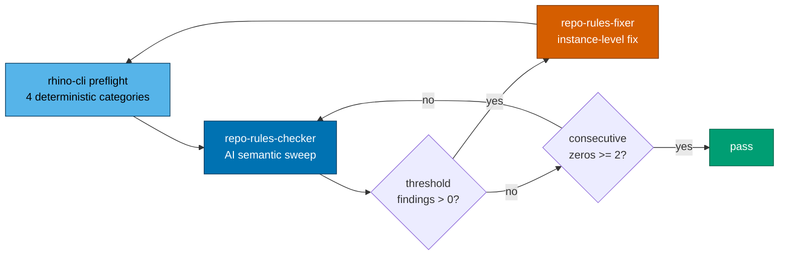
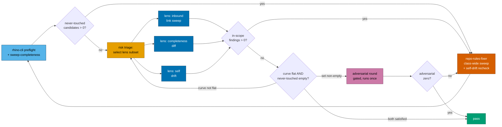
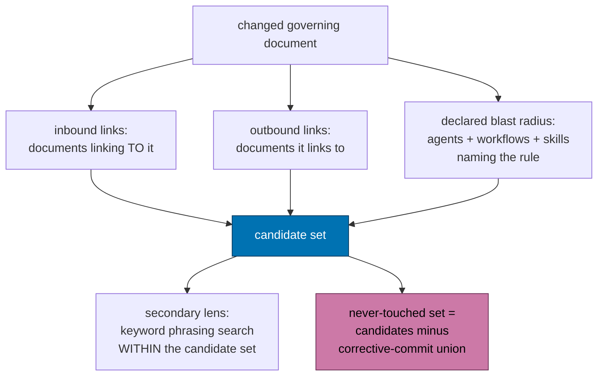
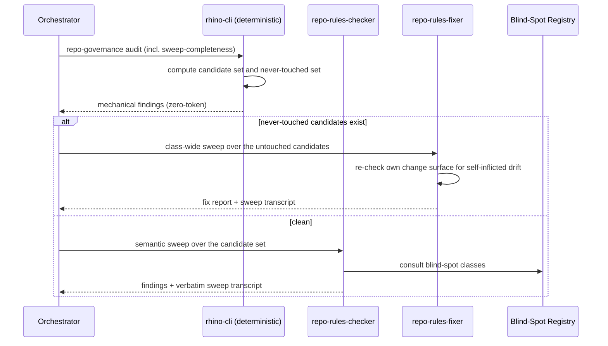
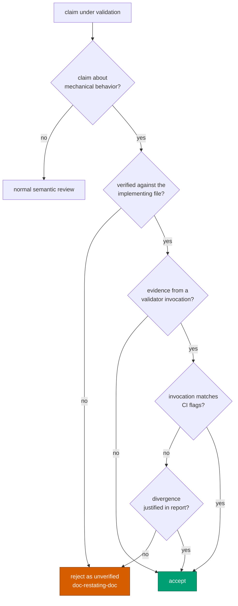
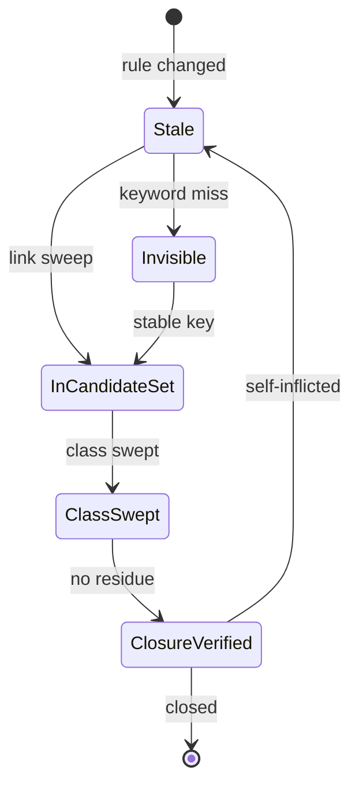
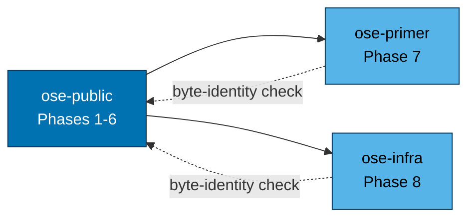
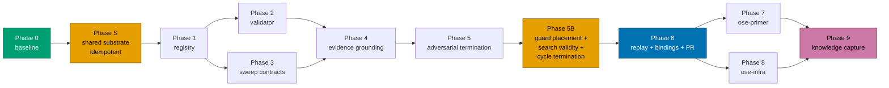

# Technical Documentation — Repo Rules Quality Gate Convergence

## Architecture

### Current loop (as built)



The preflight already covers four mechanical categories, but **none of them measures sweep
completeness**. The AI checker picks its own search shape each round, and nothing records or
constrains that shape — so a zero means "this round's search found nothing", not "the text is
consistent".

### Target loop (this plan)



Three changes from the previous draft's loop, each load-bearing:

- **The semantic lenses fan out in parallel** rather than one lens iterating (DD-14). This is the
  primary round-reducer.
- **The adversarial round is gated**, not unconditional (DD-6). When the mechanically-computed
  never-touched set is empty, arithmetic has already disproven the round's precondition, so the loop
  passes straight through and records the empty agenda with its derivation.
- **Termination reads a flattening discovery curve**, not a consecutive-zero counter (XD-3).

### Sweep-set derivation



The critical inversion: today keyword search **selects** the files, so any file whose wording differs
is invisible. In the target design, links and declared blast radius select the files, and keyword
search only ranks within that set.

### Lens sequencing across a round



### Finding-evidence decision branch



### Blind-spot lifecycle



Edge labels are kept short deliberately — `stateDiagram-v2` transition labels clip in GitHub's
renderer, and a clipped label is a silently wrong diagram. The full transitions read:

- **`[*] --> Stale`** — the governing rule changed somewhere else, stranding this passage.
- **`Stale --> InCandidateSet`** — selected by inbound-link sweep or blast-radius analysis.
- **`Stale --> Invisible`** — missed entirely by keyword-shaped search (BS-4, BS-13, BS-14).
- **`Invisible --> InCandidateSet`** — reached once a stable-key or completeness-diff sweep is adopted.
- **`InCandidateSet --> ClassSwept`** — the fixer sweeps the whole class, not the single instance.
- **`ClassSwept --> ClosureVerified`** — an adversarial round finds no residue.
- **`ClosureVerified --> Stale`** — the fixer's own commit falsified another claim.

The `ClosureVerified --> Stale` edge is blind-spot class 11 — the self-inflicted drift loop that
commit `362c23aab` had to close.

### Tri-repo propagation dependency



### Delivery phase flow



Phases 2 and 3 are independent of each other and may run in parallel (subject to the repo's
concurrency cap); Phases 7 and 8 likewise. Phase 5B carries the mechanisms added from the PR-review
session (DECISIONs 9, 10, 12 and 13) and depends on Phase 5's termination rewrite.

**Phase S is idempotent and shared with the sibling plan** (XD-2). Whichever plan reaches it first
lands the shared substrate; the other detects it present and records "already landed". That
idempotency is what lets both plans run concurrently without either waiting on the other and without
either paying the tri-repo byte-identity cost twice for the same subcommand registration.

## Blind-Spot Class Registry — seed content

The registry lands at `repo-governance/development/quality/governance-sweep-blind-spots.md`
[Repo-grounded — verified absent via `test -f` on `main` during authoring].

**Evidence durability (DECISION 8)**: each entry embeds its evidence inline — the commit subject and
the file list proving the miss — because the cited SHAs live on the unmerged branch
`parallel-orchestration-shared-machine-governance` and will not survive a squash-merge. The SHA is a
best-effort pointer, never the sole evidence.

**Classes compose, they do not partition.** BS-15 is simultaneously an instance of BS-11: it was
introduced by an instruction-file byte-budget trim that replaced an inline enumeration with a
pointer to an incomplete table. The registry states this explicitly, because a reader who treats
entries as mutually exclusive categories stops matching after the first hit.

### The fifteen seed classes

| ID    | Blind spot                            | Missing sweep form                                    | Catching sweep form                                             | Evidence (commit subject)                                        |
| ----- | ------------------------------------- | ----------------------------------------------------- | --------------------------------------------------------------- | ---------------------------------------------------------------- |
| BS-1  | Fixed term order                      | Ordered multi-term pattern                            | Order-independent alternation; inspect table cells separately   | `sweep stale direct-push-default boilerplate to all four copies` |
| BS-2  | Generative-source-only scope          | Edit the doc that generated the rule                  | Include convention + checker + fixer + maker siblings           | `sweep stale direct-push-default boilerplate to all four copies` |
| BS-3  | Bracketed-tag / plural assumption     | Search the tagged form `[HUMAN]` only                 | Search the untagged prose form too (`human merge`)              | `close the unbracketed "human merge" sweep gap`                  |
| BS-4  | Paraphrase                            | Any keyword-selected search                           | Inbound-link sweep — select by link, not by wording             | `sweep by inbound link, catching the paraphrase survivors`       |
| BS-5  | Teaching vs normative content         | Sweep only normative sections                         | Include explanatory/teaching prose in the candidate set         | `rewrite the teaching content that still taught main-by-default` |
| BS-6  | Untouched sections in touched files   | Treat a file as done once edited                      | Re-scan the whole file, not the edited region                   | `rewrite the untouched teaching sections in partly-fixed files`  |
| BS-7  | Worked examples contradicting prose   | Sweep prose only                                      | Diff each example against the paragraph governing it            | `align worked examples with the prose above them`                |
| BS-8  | Agent-emitted templates               | Sweep documentation only                              | Include templates agents emit into other artifacts              | `make post-push CI templates delivery-mode-aware`                |
| BS-9  | Obligation scoped to old condition    | Search the changed value                              | Search the **condition** the obligation is keyed on             | `scope CI post-push verification to the delivery target`         |
| BS-10 | Definition blocks                     | Sweep usage sites                                     | Include the definition/glossary blocks defining the term        | `correct the TBD definition block and the main-ci gate doc`      |
| BS-11 | Self-inflicted drift                  | Sweep only pre-existing content                       | Re-check the chain's own change surface for claims it falsified | `correct nx-targets CI-trigger claims for main-ci schedule`      |
| BS-12 | Directory-scoped sweep                | `grep -r … repo-governance/` while claiming repo-wide | Repo-wide, or enumerate + justify every exclusion               | `correct main-ci trigger docs outside repo-governance`           |
| BS-13 | Incomplete description, no swept term | Any phrase sweep; any inbound-link sweep              | Completeness-diff: enumerate what the reference should contain  | `correct the pr-quality-gate trigger description`                |
| BS-14 | Artifact on disk, in no catalogue     | Any text or link sweep — there is no text and no link | Completeness-diff: enumerate the filesystem, diff the catalogue | `catalogue the missing workflow and storybook deployer`          |
| BS-15 | Enumeration whose truth is a git ref  | Any sweep of on-disk artifacts                        | Completeness-diff against `git branch -r`                       | `cover the three uncovered environment branches`                 |

### BS-13, BS-14, BS-15 — the classes no text search reaches

These three share the property that makes them the registry's most important entries: **there is
nothing to search for.** BS-13's text omits the swept term rather than containing a stale one;
BS-14's artifact has neither text nor inbound link; BS-15's ground truth is not in the tree at all.
Every mechanism in this plan other than completeness-diff (DD-10) finds zero of the three.

**BS-13 — incomplete description that names no swept term.** `.github/workflows/README.md` stated
`pr-quality-gate.yml`'s trigger as "Pull request" while the workflow also carries
`push: branches: [main]`. **Inline evidence**: the corrective commit
`correct the pr-quality-gate trigger description`; the proving pair is the "PR and repo-wide gates"
table row in `.github/workflows/README.md` against the `on:` block of
`.github/workflows/pr-quality-gate.yml` [Repo-grounded — both re-verified during the amendment that
added this entry]. The same class hit `docs/reference/system-architecture/ci-cd.md` three times.
**Missing form**: phrase sweep (the row never says "push"); inbound-link sweep (the row links
nowhere). **Catching form**: enumerate what a CI reference should contain — every trigger of every
workflow — and diff against `.github/workflows/`. **Detection**: statically detectable, given a
parser for workflow `on:` blocks.

**BS-14 — the artifact that appears in no catalogue.** **Inline evidence**: the corrective commit
`catalogue the missing workflow and storybook deployer`. `web-ui-build-deploy-prod.yml` was the only
one of the 20 `.yml` files under `.github/workflows/` absent from **both**
`.github/workflows/README.md` and `docs/reference/system-architecture/ci-cd.md`;
`.claude/agents/apps-web-ui-storybook-deployer.md` exists while the `AGENTS.md` Operations roster
names only the six `*-www` / `*-app-web` deployers [Repo-grounded — both re-verified during this
amendment]. **Missing form**: every text- or link-shaped sweep; the artifact is absent from the
documentation by definition, so there is no occurrence to match and no link to follow.
**Catching form**: enumerate the filesystem with `find -print0` and diff against the catalogue.
**Detection**: statically detectable, and the cheapest of the three.

**BS-15 — the enumeration whose ground truth is a live git ref.** **Inline evidence**: the
corrective commit `cover the three uncovered environment branches`. `AGENTS.md` scoped its "never
commit directly" rule to "`prod-*` per app, plus `stag-*`; the full list is in the Web Sites table
below". `git branch -r` shows 11 environment branches against the table's 8; `origin/prod-web-ui`,
`origin/stag-organiclever-be` and `origin/stag-ose-be` were uncovered [Repo-grounded — re-verified
during this amendment]. `prod-web-ui` escaped the `prod-*`-per-app reasoning as well, because
`web-ui` is a **lib**, not an app — and an agent force-pushes to it. **Missing form**: any sweep of
on-disk artifacts; the ground truth is a set of remote refs. **Catching form**: completeness-diff
against `git branch -r`. **Detection**: statically detectable, but only by a check that knows to
consult refs rather than files — which is the entire point of DD-10's rider.

**Composition note**: BS-15 is also a BS-11 instance. It was self-inflicted by a byte-budget trim
replacing an inline enumeration with a pointer to an incomplete table — the chain's own change
falsifying the chain's own safety scope.

### BS-12 — worked entry (the highest-cost class of the first twelve)

**Symptom**: a sweep restricted to one subtree, reported as repo-wide. Eleven consecutive rounds
asserted repo-wide scope without demonstrating it.

**Inline evidence** (survives SHA loss): the final corrective commit
`correct main-ci trigger docs outside repo-governance` was the **first** in a twelve-commit chain to
touch any of:

```text
.github/workflows/README.md
specs/apps/ayokoding/containers/container.md
specs/apps/organiclever/containers/container.md
```

`docs/` was first reached only at the eighth commit (`scope CI post-push verification to the delivery
target` / `correct the TBD definition block…`). The union of all twelve commits touches 46 files
[Repo-grounded — `git diff --name-only 488148eca..c30ac344e | wc -l` returns 46].

**Missing form**: a recursive search rooted at `repo-governance/`.

**Catching form**: repo-wide search, or a search whose exclusions are enumerated as literal globs and
justified in the report.

**Detection**: statically detectable — a recorded sweep command whose root is a subdirectory, or
whose exclusion set is non-empty and unjustified.

### BS-4 — worked entry (the controlled comparison)

**Symptom**: stale text containing none of the search keywords. The observed instance read
"Explicit user approval required" — no occurrence of the changed tag, the changed default, or any
term a reasonable keyword sweep would have chosen.

**Inline evidence**: commit `sweep by inbound link, catching the paraphrase survivors` — the first
round to select files by inbound link rather than by phrasing, and it found survivors that four
prior keyword-shaped rounds had missed. This is the single controlled comparison in the chain and is
the basis of DECISION 2.

**Missing form**: any search that selects candidate files by matching their text.

**Catching form**: enumerate documents linking to the changed governing document; sweep all of them
regardless of wording.

**Detection**: partially static — the validator can verify the inbound-link set was enumerated;
whether a given passage is stale stays an AI judgement.

## Design Decisions

### DD-1 — the registry is a governance quality document, not agent-inlined prose

Inlining fifteen class descriptions with evidence into `repo-rules-checker.md`, `repo-rules-fixer.md`
and `repo-rules-maker.md` would triple their content and push against the instruction-file size
budget [Repo-grounded — `nx run rhino-cli:instruction-size:validation` exists and is wired into the
preflight as the `instruction-size` category]. One governance file that all three link to keeps a
single source of truth and one place to append class thirteen.

### DD-2 — the deterministic pass is a fifth `repo-governance audit` category

The orchestrator today runs exactly four categories — `layer-coherence`, `traceability-audit`,
`vendor-audit`, `instruction-size` [Repo-grounded — `repo-rules-quality-gate.md` Step 0.5]. Adding
`sweep-completeness` as a fifth means the checker consumes it through the Step 0.5 JSON envelope it
already parses, with no new plumbing and no new invocation for an agent to skip.

**The owner-selection reasoning is not re-derived here.** It is already codified in
[`deterministic-vs-ai-validation-split.md`](../../../repo-governance/conventions/structure/deterministic-vs-ai-validation-split.md)
§Adding a new validation category, whose decision tree puts an exact-predicate rule in the
deterministic layer. The never-touched-set computation is pure `git` and link arithmetic, so the
convention selects the deterministic layer without further argument. An earlier draft cited that
convention once, in passing, while omitting it from the Surface Inventory and leaving its Split table
unextended — a self-inflicted BS-2/BS-10 instance recorded in
[README XD-1](./README.md#xd-1--extend-the-existing-deterministic-vs-ai-split-convention-rather-than-re-derive-it).
What this plan adds is the **row**, not the reasoning.

**The convention's implementation contract is adopted verbatim as the Phase 2 Gate bar**, replacing
the weaker ad hoc "`nx run rhino-cli:test:unit` exits 0" criterion: ≥90% line coverage, a Gherkin
feature with **both** happy- and failure-path scenarios, unit **and** integration tests, and
byte-determinism given a fixed clock.

Cost: `apps/rhino-cli` must stay byte-identical across all three repos per the
[SDLC Gate Standard](../../../docs/reference/sdlc-gate-standard.md#rhino-cli-byte-identity-boundary),
so this adds a Gherkin behavior tree under `specs/apps/rhino/behavior/rhino-cli/gherkin/` and
tri-repo propagation weight. Two things bound that cost:
[XD-2](./README.md#xd-2--one-shared-substrate-built-once-landed-idempotently) shares the subcommand
plumbing with the sibling plan so it is registered once rather than twice, and
[XD-6](./README.md#xd-6--every-proposed-validator-passes-the-tricorder-inclusion-criterion) admits a
detector only when the problem is obvious and the fix is clear.

This is the plan's largest reversible commitment (DECISION 1); Phase 2 is authored to be separable —
dropping it degrades the plan to mechanisms 1 and 3-6 without restructuring any other phase.

### DD-2b — what the validator must NOT try to detect

The Tricorder criterion cuts as well as admits, and the cut boundary is recorded here so a future
contributor does not re-propose across it. Google's Tricorder deployment explicitly **rejected**
computable-but-unactionable analyses — complexity warnings, fault-prediction scores — because a
finding a developer cannot act on erodes trust in every other finding the tool emits. It further notes
that analyses flagging **missing** content cannot be auto-fixed and consequently earn low trust, which
is directly relevant here: BS-13 and BS-14 are both missing-content classes.
[Web-cited — via the 2026-07-20 research brief]

The independent boundary from the prose-tooling domain: Vale, textlint and markdownlint reliably catch
**lexical and structural** violations and **cannot** determine that document A contradicts document B.
[Web-cited — via the 2026-07-20 research brief]

Applied to this plan: the never-touched computation, directory-scope detection, inbound-link-set
construction and the completeness-diff **enumeration** are all set arithmetic with obvious problems
and clear fixes, and are built. Judging whether a passage in the resulting candidate set is **stale**
is a contradiction judgement on the far side of the boundary and stays with the AI checker. The
missing-content classes are handled by keeping the validator's output an **enumerated diff** the
checker acts on — the diff names exactly what to add, which is the actionability Tricorder requires,
rather than a bare "something is missing" signal.

### DD-3 — the candidate set is bounded by links and declared blast radius

A naive never-touched set would be "every file in the repo", which is useless. The candidate set is:

1. every document with an **inbound link** to the changed governing document;
2. every document the changed document **links out** to;
3. the **declared blast radius** — agents, workflows and skills naming the changed rule.

The never-touched set is the candidate set minus the union of the chain's corrective commits. This
keeps the adversarial round's agenda finite and relevant, which is what stops it degenerating into
free-form doubt (a named product risk).

### DD-4 — sweep transcript over sweep assertion

The workflow cannot verify a sweep it cannot see. Recording the verbatim command plus the exclusion
set converts an unfalsifiable claim into a checkable one, and costs one line in a report. This is the
cheapest mechanism in the plan and closes BS-12 even without the validator.

### DD-5 — evidence grounding has two rules, not one

Rule A: a claim about mechanical behavior is verified against the **implementing** file (workflow,
hook, script), never against another document restating it. Closes BS-11.

Rule B: a validator invocation cited as evidence must match **CI's exact flags**, or record a written
justification for diverging. Closes the observed false alarm, where a bare `md mermaid validate`
flagged the validator's own negative fixtures. CI invokes it with
`--exclude apps/rhino-cli/tests/fixtures --exclude plans/done`, while the `package.json` lint-staged
entry uses the bare form [Repo-grounded — both verified on `main` during authoring]. The two rules
ship together because both failures are "trusted the wrong artifact as evidence".

### DD-6 — termination is saturation-based; the adversarial round is a **gated** disjoint lens

Two consecutive zeros from the same search shape is one observation repeated, not two observations —
which is the correct diagnosis the previous draft made, and it now sits inside the single shared
doctrine rather than beside a competing one.

Under [XD-3](./README.md#xd-3--one-termination-doctrine-saturation-not-round-counting), termination
requires a **flattened cumulative new-class discovery curve across operationally-disjoint lenses**.
The adversarial round's role is to **supply a disjoint lens**: its agenda is the mechanically derived
never-touched set, so it interrogates exactly the region the semantic rounds structurally could not
see, which is what makes the curve's flattening trustworthy rather than an artefact of one shape
repeating.

**The round is gated, not unconditional** (README DECISION 14). As previously written it ran on every
invocation with no skip branch, which made it pure overhead on the modal case — a one-line convention
typo fix paid for a guaranteed extra checker invocation with an a-priori near-zero yield. When the
mechanically-computed never-touched set is **empty**, the deterministic layer has already disproven
the round's own precondition: there is no disjoint region for the disjoint lens to inspect, so running
it would add an observation of an already-covered shape — precisely the failure saturation-based
termination exists to avoid. The round therefore runs **exactly when arithmetic says there is
something to argue about**.

An empty agenda is still reported explicitly with its derivation (AC-13 survives in substance) so that
"nothing to challenge" stays distinguishable from "the computation never ran" — which was AC-13's
actual purpose. What changed is that the report replaces the round rather than accompanying it.

**A round counter is not a stopping rule**, and a round structurally **narrower** than its predecessor
contributes no flattening evidence unless its narrowed-out region is covered by a different lens. The
final report records the per-round new-class count so the flattening is readable evidence rather than
an assertion.

### DD-14 — parallel disjoint lenses, and the lens roster

[XD-4](./README.md#xd-4--parallel-operationally-disjoint-lenses-replace-sequential-rounds) is the
plan's primary speed lever, and the reason the fifteen classes cost roughly fifteen rounds: one lens
iterating discovers at most the one class its own shape permits. Each lens declares the question it
asks and the artifact set it reads; a lens whose declared set is a **subset** of another's is rejected
as a relabel, because the PBR replication found that differently-**labelled** perspectives converge on
the same defects rather than partitioning them. The roster:

| Lens                    | Question it asks                                                          | Artifacts it reads                                         |
| ----------------------- | ------------------------------------------------------------------------- | ---------------------------------------------------------- |
| **Deterministic**       | Which candidate files has no corrective commit touched?                   | The git commit range, the link graph                       |
| **Inbound-link**        | Does any document linking to the changed rule still state the old one?    | The computed candidate set's document bodies               |
| **Completeness-diff**   | Does the ground truth contain members the document omits?                 | Filesystem enumerations, workflow `on:` blocks, git refs   |
| **Self-drift**          | Did this chain's own commits falsify a claim elsewhere?                   | The chain's own diff, read against the documents it names  |
| **Adversarial (gated)** | What does the never-touched region contain that no lens has yet examined? | The never-touched set — the complement of everything above |

No two rows share an artifact set, and no row's set is a subset of another's. The completeness-diff
lens is the sharpest illustration of why disjointness matters: **it reads sources that are not in the
document tree at all** (`git branch -r` for BS-15), which is why it found three classes every
text-shaped lens missed by construction.

**Triage precedes the spend.** The full roster is not run against every governance change; per the
RADAR risk-triage finding, multi-lens rigor goes to the high-risk stratum while a low-risk change runs
the deterministic lens plus whichever single semantic lens its blast radius indicates.
[Web-cited — via the 2026-07-20 research brief]

### DD-15 — the enumeration-fails-open rule, with standards backing

DD-9's rule was derived from this repo's own evidence and is correct. It now also carries external
grounding, which matters because it makes the rule citable to a future reader who has not lived
through the five-axis sequence: the OWASP Developer Guide's security principles and NIST SP 800-207 /
SP 800-167 rest on the same asymmetry — **denylists fail open and silently; allowlists and default-deny
fail closed and loudly**. [Web-cited — via the 2026-07-20 research brief]

That asymmetry is exactly why the five-axis sequence went unnoticed for four consecutive fixes: each
enumeration failed **silently** on the axis nobody named, and a silent failure is not catchable on the
next round while a loud one is.

The **constructive** form is metamorphic testing (Chen et al. 1998; the MST-wi catalogue, arXiv
2208.09505, 22 system-agnostic metamorphic relations): assert relations that must hold across
transformed inputs rather than enumerating expected outputs one at a time. Applied here, a sweep's
correctness is asserted as a relation — "the candidate set computed from the link graph is invariant
under rewording of the target document" — instead of as a list of phrasings to search for. That
relation is what the inbound-link sweep already exploits; naming it makes the property explicit rather
than incidental. [Web-cited — via the 2026-07-20 research brief]

Every sweep form in the BSCR is therefore restated as an invariant over the whole sweep set, never as
a list of forbidden phrasings.

### DD-7 — the falsified convergence claim is corrected, not deleted

`maker-checker-fixer.md` §Preventing Iteration Loops claims convergence in 1-3 iterations with
escalation after 5 [Repo-grounded — both phrases verified present on `main`]. The archived chain ran 13. The text is rewritten to describe the phased budget and cite the falsifying chain, rather than
silently dropped, so the next reader understands why the number changed and does not restore it.

### DD-8 — evidence is embedded inline because the SHAs are perishable

See README DECISION 8. The evidence commits are branch-local and this repo squash-merges, so SHA
citations die on merge. Each registry entry carries its commit subject and proving file list inline.
Delivery steps that replay the chain resolve SHAs **defensively** — if `git cat-file -t <sha>` fails,
the step falls back to the inline evidence rather than failing the phase.

The BS-13/BS-14/BS-15 SHAs (`e46235226`, `b61e29754`, `3ee6323b7`, `f5f819642`, `72af8ab83`) are on
the same unmerged branch and are equally perishable. Their entries above carry inline evidence that
is re-derivable from the current tree at any time — a `find` over `.github/workflows/`, a `grep`
over the two catalogues, and `git branch -r` — which makes them the most durable entries in the
registry, not the least.

### DD-9 — a guard is placed at the point of rewrite, not enumerated by hazard axis

The evidence is the five-axis sequence in README DECISION 9: four consecutive fixes, each correct on
the axis it named, each opening the next. The decisive instance is structural rather than a matter
of wording. `.claude/agents/plan-fixer.md` carries an umbrella guard claiming to bind "no recipe in
this file, present or future" — a claim that is **true on its own terms**. But every _enforcement
pointer_ in that file is indexed by plan-checker **finding type**, and §Execution-Grade Clarity
Fixes has none. That recipe fires on "checkbox lacks file path / verbatim command / acceptance
criterion", auto-applies at HIGH confidence, and a step reading
`- [ ] [HUMAN] Merge PR once all preconditions hold` has none of the three. It derives a verbatim
command — `gh pr merge` — after which two other rules push the step toward `[AI]`. A fixer entering
on that finding type never reaches the guard.

Two rules follow:

- **Placement**: a guard protecting an invariant is co-located with every rewrite that could violate
  it. The umbrella clause may remain, but it is documentation, never the mechanism.
- **Verification by entry path**: coverage is established by enumerating how an agent **enters** the
  file — finding type, step number, invocation mode — and tracing each path to the guard. A
  section's self-description is not evidence; in the observed case it was accurate and irrelevant.

Why not simply extend the axis enumeration: the entry-path set is finite and enumerable; the hazard-
axis set is neither. This is the **enumeration-fails-open rule** — prefer a property expressed by
what it protects over one expressed by what it enumerates — of which BS-12 and BS-15 are two further
instances.

### DD-10 — completeness-diff is a first-class mechanism, and ground truth is not always a file

The never-touched computation (DD-3) derives its candidate set from links and commits. BS-14 defeats
that derivation by construction: an artifact absent from every catalogue has no inbound link and no
matchable text, so it is never a candidate. Completeness-diff inverts the direction — enumerate the
**ground truth**, then diff the document that claims to describe it.

Three ground-truth sources are in evidence:

| Ground truth             | Enumerated by                                | Class caught |
| ------------------------ | -------------------------------------------- | ------------ |
| Workflow triggers        | parsing `on:` blocks in `.github/workflows/` | BS-13        |
| Workflow and agent files | `find .github/workflows -type f -print0`     | BS-14        |
| Environment branches     | `git branch -r`                              | BS-15        |

The third is the rider that matters most: **ground truth is sometimes not a file on disk**. A
completeness-diff contract that silently assumes on-disk artifacts reproduces BS-15 rather than
catching it. Every instance of the contract therefore names its authoritative source explicitly, and
an unnamed source is itself a finding (AC-20).

Tooling note carried from DD-11: catalogue diffs use `find -print0`, never parsed `ls` output —
`ls` emits hyperlink escape sequences that eat leading characters and silently corrupt exactly the
diff this mechanism depends on.

### DD-11 — a sweep's zero is admissible only with a working-tool proof

In this environment `grep` resolves to **ugrep**, which rejects ripgrep's `--glob`. With
`2>/dev/null` appended, a hard failure and a clean sweep are the same observation. Measured
first-hand on one pattern in one tree during this amendment:

| Invocation                                                        | Result             |
| ----------------------------------------------------------------- | ------------------ |
| `grep -rn --glob '*.md' 'Trunk Based Development' . 2>/dev/null`  | 0 hits — **false** |
| `command grep -rn --include='*.md' 'Trunk Based Development' .`   | 543 hits           |
| `/opt/homebrew/bin/rg -c --glob '*.md' 'Trunk Based Development'` | 147 files          |

The contract has four parts, all cheap:

1. the **verbatim command** is recorded in the report;
2. **stderr is not suppressed** — no `2>/dev/null` on an evidence-producing sweep;
3. the invocation uses a form the tool accepts — POSIX `--include`, or
   `/opt/homebrew/bin/rg` **by absolute path**;
4. a **known-positive control probe** runs the same pattern against a file known to contain it and
   returns non-zero, before the zero is trusted.

Part 4 is load-bearing. Parts 1-3 address the observed failure; part 4 addresses the next one,
whatever shape it takes, by converting "the tool returned nothing" into "the tool works **and**
returned nothing". It is also what makes a zero falsifiable in both directions, which is the
acceptance-clause standard the sibling plan installs.

### DD-12 — review-cycle termination is evidence-based, mirroring DD-6

The PR-review cycle defaults to three sequential maker→fixer cycles. In the observed run **all three
found blocking defects, and two further verification passes after cycle 3 each found another** — the
loop was still productive when arithmetic declared it done. This is DD-7's falsified "1-3
iterations, escalate at 5" claim reappearing on a different loop, so it takes the same correction
rather than a larger constant:

- a cycle producing any **new** blocking finding extends the loop;
- termination requires a cycle producing **no new** finding (repeat findings do not extend it);
- the verification prompt for each cycle must **license a negative finding** — explicitly permitting
  the reviewer to refute the requester's hypothesis. In the observed run, one reviewer told to
  "assume the previous fix introduced a defect" investigated, reported the hypothesis **wrong**, and
  found a real defect elsewhere in the same pass. A prompt without that license manufactures
  agreement, and a loop terminating on manufactured agreement is worse than one terminating on a
  count.

### DD-13 — the three PR-cycle process gaps split by fix-shape

Full reasoning in README DECISION 13. Summary of the split and its rationale:

| Gap                                                  | Disposition        | Why                                                                                       |
| ---------------------------------------------------- | ------------------ | ----------------------------------------------------------------------------------------- |
| D1 — resolved threads ≠ committed fixes              | **In scope**       | A terminal verdict resting on a proxy signal; same shape as enumeration-fails-open (DD-9) |
| D3 — fixed cycle count insufficient                  | **In scope**       | The review-loop instance of DD-7 / DD-6; DD-12 above                                      |
| D2 — `pr-review-maker` cannot post `REQUEST_CHANGES` | **Follow-up plan** | Fix is a token/identity change; shares no surface, mechanism or test with this plan       |

D1's mechanism is worth stating precisely, because the failure was a **correct** action producing a
wrong aggregate signal. A fixer was instructed not to touch `AGENTS.md` (instruction-size budget),
so it correctly left the orchestrator's HIGH fix uncommitted in the working tree, replied to the
thread explaining why, and resolved it. GitHub then reported 0 unresolved threads while the blocking
defect was absent from the PR. The remedy is to gate merge on the property rather than the proxy:
**every finding's fix is committed and pushed**, verified against the diff, never inferred from
thread state.

D2 is left unfixed here deliberately, and until its follow-up lands the mitigation is that merge
preconditions gate on **finding text**, never on GitHub's review state — which is already what
AC-26 requires.

## UI-Design-Funnel Exemption

This plan is **not UI-bearing**. It changes governance markdown, agent definitions, and a CLI
validator that emits text to stdout. It adds and changes no user-facing screen or component under
`apps/` or `libs/` that renders to an end user. Per the
[UI Mockups in Plan Docs convention](../../../repo-governance/conventions/formatting/diagrams.md#ui-mockups-in-plan-docs),
the design funnel does not apply, and this paragraph is the explicit exemption record.

## Testing Strategy

| Mechanism                  | Test level                | How the Gherkin binds                                                                 |
| -------------------------- | ------------------------- | ------------------------------------------------------------------------------------- |
| Registry entries           | Inline-evidence review    | AC-1, AC-2 — each entry's proving file list is checked against the inline evidence    |
| Never-touched computation  | Rust unit + Gherkin specs | AC-3 — RED tests against fixture repo states with known candidate and touched sets    |
| Directory-scope detection  | Rust unit + Gherkin specs | AC-4 — RED tests against sweep-report fixtures with and without enumerated exclusions |
| Agent contract text        | Grep-based gate checks    | AC-5 through AC-11 — presence and shape verified mechanically, semantics by review    |
| Adversarial termination    | Workflow text + review    | AC-12, AC-13 — termination criteria read and verified                                 |
| Convergence-claim removal  | Grep both directions      | AC-14 — phrase present pre-edit (returns 1), absent post-edit (returns 0)             |
| No-check-removed invariant | Inventory diff            | AC-15 — Phase 0 records the baseline inventory; Phase 6 compares                      |
| Bindings + byte identity   | Existing repo validators  | AC-16, AC-17 — `npm run generate:bindings`, harness sync validation, byte-identity    |
| Registry BS-13/14/15       | Inline-evidence replay    | AC-18, AC-19 — each entry's evidence re-derived from the tree, never from a live SHA  |
| Completeness-diff contract | Rust unit + Gherkin specs | AC-20, AC-21 — RED tests over catalogue fixtures and a git-ref fixture                |
| Guard placement            | Entry-path enumeration    | AC-22, AC-23 — every entry path traced to the guard; one bypass falsifies coverage    |
| Search-tool validity       | Control-probe fixtures    | AC-24 — broken and working invocations both exercised; a zero without a probe fails   |
| Review-cycle termination   | Workflow text + review    | AC-25, AC-26 — termination criteria and merge preconditions read and verified         |

Per [Test-Driven Development](../../../repo-governance/development/workflow/test-driven-development.md),
the validator's tests are written before its implementation; each RED step in
[delivery.md](./delivery.md) carries exactly one bound scenario.

## Surface Inventory

| #   | Surface                                                                         | Change                                                                                                                           | Grounding                    |
| --- | ------------------------------------------------------------------------------- | -------------------------------------------------------------------------------------------------------------------------------- | ---------------------------- |
| 0   | `repo-governance/conventions/structure/deterministic-vs-ai-validation-split.md` | **Extend (shared, idempotent)** — one row in The Split table; its implementation contract adopted as the Phase 2 Gate bar (XD-1) | [Repo-grounded] exists       |
| 0b  | `apps/rhino-cli/src/commands/governance_registry_replay.rs`                     | **Create (shared, idempotent)** — the registry-replay harness serving class closure and completeness-diff for both plans (XD-2)  | [Repo-grounded] dir exists   |
| 1   | `repo-governance/development/quality/governance-sweep-blind-spots.md`           | **Create** — the BSCR                                                                                                            | [Repo-grounded] absent today |
| 2   | `repo-governance/workflows/repo/repo-rules-quality-gate.md`                     | Step model, termination criteria, adversarial round                                                                              | [Repo-grounded] exists       |
| 3   | `repo-governance/development/pattern/maker-checker-fixer.md`                    | Corrected convergence guidance; sweep methodology                                                                                | [Repo-grounded] exists       |
| 4   | `.claude/agents/repo-rules-checker.md`                                          | Inbound-link sweep, transcript, evidence grounding, adversarial                                                                  | [Repo-grounded] exists       |
| 5   | `.claude/agents/repo-rules-fixer.md`                                            | Class-wide sweep, self-drift recheck, transcript                                                                                 | [Repo-grounded] exists       |
| 6   | `.claude/agents/repo-rules-maker.md`                                            | BSCR link; start propagation from the inbound-link set                                                                           | [Repo-grounded] exists       |
| 7   | `apps/rhino-cli/src/commands/governance_sweep_completeness.rs`                  | **Create** — the validator                                                                                                       | [Repo-grounded] dir exists   |
| 8   | `apps/rhino-cli/src/cli.rs`, `commands.rs`, `governance_audit.rs`               | Register the fifth audit category                                                                                                | [Repo-grounded] all exist    |
| 9   | `specs/apps/rhino/behavior/rhino-cli/gherkin/repo-governance/`                  | **Create** — `repo-governance-sweep-completeness.feature`                                                                        | [Repo-grounded] dir exists   |
| 10  | `repo-governance/development/quality/README.md`, `development/README.md`        | Register the new convention in the index tables                                                                                  | [Repo-grounded] exist        |
| 11  | `.opencode/`, `.amazonq/`                                                       | **Regenerated only** — never hand-edited                                                                                         | Generated artifacts          |
| 12  | `repo-governance/workflows/pr/pr-review-quality-gate.md`                        | Evidence-based cycle termination; committed-fix precondition                                                                     | [Repo-grounded] exists       |
| 13  | `ose-primer`, `ose-infra`                                                       | Propagation of surfaces 1-10 and 12                                                                                              | Sibling repos                |

## Dependencies

- `npm run generate:bindings` — regenerates `.opencode/` and `.amazonq/` from `.claude/`
- `npx nx affected -t typecheck lint test:quick specs:coverage` — the standing quality gate
- `cargo` via the existing rhino-cli Nx targets — validator build and test
- `git` plumbing (`git log`, `git diff --name-only`, `git cat-file`) — never-touched computation
- `gh` CLI — PR creation and the review cycle

## Rollback

Every surface is additive or text-level. Rollback is `git revert` of the phase PR. The validator is
introduced advisory-first — it reports findings into the existing preflight envelope, which the
workflow's Step 2 already treats as visibility-only and never counts toward the mode threshold
[Repo-grounded — `repo-rules-quality-gate.md` Step 2]. A defective validator therefore degrades to
noise rather than to a blocked gate. The registry is inert data. No migration, no persisted state, no
schema change.
