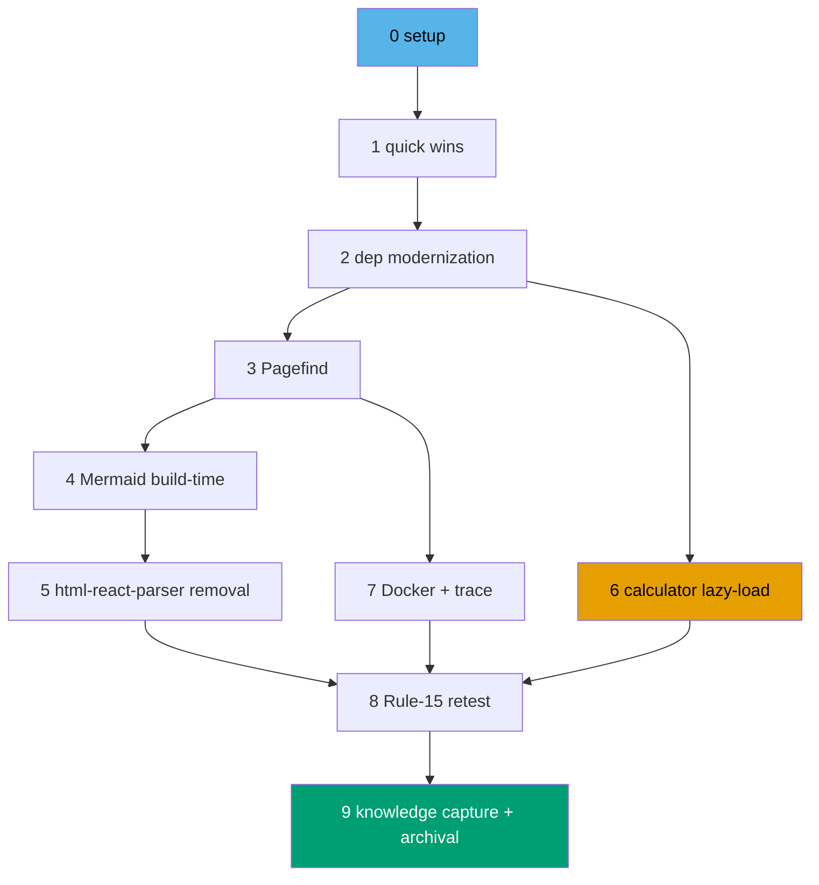

# Delivery Checklist — ayokoding-www Cost Reduction

> **Legend** — `[AI]`: an agent performs the step (the default; unmarked steps are `[AI]`).
> `[HUMAN]`: only a human can do it (physical action, out-of-band approval, real-secret or
> privileged-credential handling). `[AI+HUMAN]`: agent prepares, human approves or finishes.
> Git-mechanical steps (worktree create/remove, branch, commit, push, merge) are `[AI]`.
>
> **Phase Gate** — every phase ends with a `### Phase N Gate` (must-pass verification) plus a
> `> **Pause Safety**:` note (safe-to-stop state + resume command). A boundary phase's gate
> additionally runs the [Delivery-Boundary Integration Protocol](#delivery-boundary-integration-protocol);
> a non-boundary phase commits to its unit's branch and stops there. A phase is not complete until
> every gate check is green.
>
> **Design decisions** — the `DD-*` ids cited below are the design-decision table entries in
> [tech-docs §Design decisions](./tech-docs.md#design-decisions). The `AC-*` ids are the Gherkin
> scenarios in [prd §Acceptance criteria](./prd.md#acceptance-criteria). The `F-*` ids are the
> in-scope features in [prd §Product scope](./prd.md#product-scope).

Three standing constraints govern every step below.

> **The Dep-Bump Policy is binding.** Every bump in Phase 2 carries a written Path A / B / C
> classification in [tech-docs §Dependency path classifications](./tech-docs.md#dependency-path-classifications).
> A bump that cannot be classified is deferred, never landed silently. Exact-pin only; no caret
> pins remain on the modernized entries.
>
> **No figure invented.** Every measured cost number the plan records (build-minute estimate,
> bundle-size cut, image-size cut) traces to a primary source in
> [tech-docs §Appendix A](./tech-docs.md#appendix-a--research-digest-cited-2026-07-28) — Vercel KB
> or the cited third-party source. Where a number is a judgment call (no metric), the `brd.md`
> success-signal row marks it as such.
>
> **Vacuous targets are forbidden in acceptance clauses.** `ayokoding-www:test:e2e` and
> `ayokoding-www:test:integration` are echo no-ops on this project. Real end-to-end coverage runs in
> the paired project via `npx nx run ayokoding-www-fe-e2e:test:e2e`. No clause below cites either
> no-op target.

## Worktree

Per [Worktree Path Convention](../../../repo-governance/conventions/structure/worktree-path.md)
and the **One-Worktree-One-PR HARD RULE** in
[plan-planning.md §Planning Granularity](../../../repo-governance/workflows/plan/plan-planning.md#one-worktree-one-branch-one-pr-one-delivery-unit-hard-rule),
each **delivery unit** — the phase groupings named in the [Delivery Boundaries](#delivery-boundaries)
table below — gets its **own** worktree: one worktree → one branch → one PR → one delivery unit,
never a worktree shared across units.

Worktree path pattern: `worktrees/ayokoding-www-cost-reduction-<unit-slug>/`, provisioned from the
latest `origin/main` at the start of the unit's first phase and removed once the unit's own PR
merges (see the [Delivery-Boundary Integration Protocol](#delivery-boundary-integration-protocol))
— never deferred to plan end. See the [Delivery Boundaries](#delivery-boundaries) table's
`Worktree / branch` column for the exact path per unit.

**Phase 0 has no worktree of its own.** It provisions and works directly inside the **Phase 1
unit's** worktree, because Phase 0 opens no PR of its own — its baseline evidence rides the Phase
1 PR (see [Delivery Mode](#delivery-mode-worktree-to-pr) below).

See [Worktree Path Convention](../../../repo-governance/conventions/structure/worktree-path.md)
and [Plans Organization Convention §Worktree Specification](../../../repo-governance/conventions/structure/plans.md#worktree-specification).

## Delivery Mode: worktree-to-pr

Each **delivery unit** — the phase groupings named in [Delivery Boundaries](#delivery-boundaries)
below — works in its **own** worktree (see [Worktree](#worktree) above) on its **own branch**, opens
a **draft PR** against `main` at its boundary phase, runs the **PR-Review Maker→Fixer Cycle**
(fan-out → `pr-review-synthesis-maker` → `pr-review-fixer`, 3 sequential CI-gated cycles), flips
the PR to ready, and `[AI]` **merges it once all quality gates are green**. Phases inside a unit
that are not its boundary commit to the same worktree's branch and open no PR of their own.

**Phase 0 is excluded from all of it**: it is local setup and baseline only — it opens no PR, pushes
no branch, runs no review cycle, and merges nothing. Its evidence artifacts ride the Phase 1 PR.

See [Plans Organization Convention §Delivery Mode](../../../repo-governance/conventions/structure/plans.md#delivery-mode)
and the [PR Review Quality Gate workflow](../../../repo-governance/workflows/pr/pr-review-quality-gate.md).

## Parallelization Model

**Cap**: honor the in-force subagent/PR-review concurrency cap (parallel-by-default, background
subagents capped per the orchestration convention). The main thread self-promotes nothing.

- **Phase 0 → Phase 1 are strictly serial** — Phase 0 provisions the toolchain and records the
  baseline that Phase 1's PR rides.
- **Phase 1 → Phase 2 are serial** — Phase 1 wires `validate-indexes` into `test:quick`; Phase 2's
  modernization rides on a green baseline.
- **Phase 2 → Phases 3, 4, 5, 6, 7 all serial** — every code phase touches `package.json` (adds or
  removes deps) or `next.config.ts` (Phase 3 removes `flexsearch` carve-out; Phase 7 narrows
  tracing globs) or `markdown-renderer.tsx` (Phase 4 adds rehype-mermaid intercept; Phase 5 replaces
  the runtime `parse()` call). Bundling any two would create a merge conflict on a shared file that
  the one-worktree-per-unit HARD RULE is designed to avoid. Each phase lands before the next begins.
- **Phase 6 is DAG-independent of Phases 3, 4, 5** — it touches only
  `src/features/cost-of-living-calculator/**` and shares no file with the search/mermaid/parser
  surface. If orchestration capacity allows and the orchestrator is willing to absorb a second
  open PR with its own review cycle, Phase 6 MAY run concurrently with whichever of {3, 4, 5} is
  in flight. The default remains serial for cacheable intermediate states.
- **Phase 7 is DAG-independent of Phase 6** but **serial after Phase 3** — it touches the
  `outputFileTracingIncludes` block of `next.config.ts` that Phase 3 already touched (removing the
  `serverExternalPackages: ["flexsearch"]` line). The two phases run sequentially against
  `next.config.ts`; the only fan-out point they admit is alongside Phase 6.
- **Phase 8 (live-site retest) → Phase 9 (Knowledge Capture + Archival) strictly serial** — the
  retest is a precondition for archival; capture triages its findings, and archival moves the
  plan folder only after capture completes.

**DAG width is 2** (the Phase 6 fan-out alongside whichever of {3, 4, 5} is in flight), and 1
everywhere else. The parallelism available here is small by design: nearly every phase mutates a
file the next one reads.

### Delivery Boundaries

Each row below gets its **own** worktree and branch — one worktree → one branch → one PR → one
delivery unit, never a worktree shared across units — per
[Plans Organization Convention §PRs Open at Delivery Boundaries](../../../repo-governance/conventions/structure/plans.md#prs-open-at-delivery-boundaries-not-every-phase-hard-rule)
and the One-Worktree-One-PR HARD RULE in
[plan-planning.md §Planning Granularity](../../../repo-governance/workflows/plan/plan-planning.md#one-worktree-one-branch-one-pr-one-delivery-unit-hard-rule).
Phase 0 works inside unit 1's worktree (see [Worktree](#worktree)); every other unit provisions its
own worktree at the start of its first phase and removes it once its PR merges.

| Phase(s) | Delivery unit                                          | Worktree / branch                                                                                                                   | PR opens         |
| -------- | ------------------------------------------------------ | ----------------------------------------------------------------------------------------------------------------------------------- | ---------------- |
| 0        | — (setup and baseline; works inside unit 1's worktree) | —                                                                                                                                   | **no**           |
| 1        | Quick wins — config/docs drift (F-1…F-5)               | `worktrees/ayokoding-www-cost-reduction-phase-1-quick-wins/` — branch `ayokoding-www-cost-reduction/phase-1-quick-wins`             | yes — at Phase 1 |
| 2        | Dependency modernization (F-6…F-8)                     | `worktrees/ayokoding-www-cost-reduction-phase-2-deps/` — branch `ayokoding-www-cost-reduction/phase-2-deps`                         | yes — at Phase 2 |
| 3        | Pagefind migration (F-9, F-10, F-11)                   | `worktrees/ayokoding-www-cost-reduction-phase-3-pagefind/` — branch `ayokoding-www-cost-reduction/phase-3-pagefind`                 | yes — at Phase 3 |
| 4        | Mermaid build-time (F-12)                              | `worktrees/ayokoding-www-cost-reduction-phase-4-mermaid/` — branch `ayokoding-www-cost-reduction/phase-4-mermaid`                   | yes — at Phase 4 |
| 5        | `html-react-parser` removal (F-13)                     | `worktrees/ayokoding-www-cost-reduction-phase-5-h-r-p/` — branch `ayokoding-www-cost-reduction/phase-5-h-r-p`                       | yes — at Phase 5 |
| 6        | Calculator lazy-load (F-14)                            | `worktrees/ayokoding-www-cost-reduction-phase-6-calc-lazy/` — branch `ayokoding-www-cost-reduction/phase-6-calc-lazy`               | yes — at Phase 6 |
| 7        | Docker base + trace narrowing (F-15, F-16)             | `worktrees/ayokoding-www-cost-reduction-phase-7-docker-trace/` — branch `ayokoding-www-cost-reduction/phase-7-docker-trace`         | yes — at Phase 7 |
| 8-9      | Rule-15 retest + Knowledge Capture + Plan Archival     | `worktrees/ayokoding-www-cost-reduction-phase-8-9-retest-capture/` — branch `ayokoding-www-cost-reduction/phase-8-9-retest-capture` | yes — at Phase 9 |

**Why these boundaries.** Each of Phases 1–7 leaves the repo coherent, green, defensible on
`main`, and reviewable as a whole on its own — that is the four-part boundary test. Phase 1's
config/docs fixes shift no behavior; Phase 2's modernization is gated by `nx build` greentime
(AC-9); Phase 3 ends the FlexSearch surface cleanly; Phase 4 ends the client Mermaid renderer
cleanly; Phase 5 ends the runtime `html-react-parser` surface cleanly; Phase 6 splits the calculator
data without changing the interactive surface; Phase 7 narrows the trace without dropping a
runtime path (gated by AC-26 + AC-27).

Phase 8 produces retest findings and — _if_ those findings ship spec-gap filings or product fixes
— is a change-producing phase but is bundled with Phase 9 because Phase 9's capture triages Phase 8's
findings and moves the plan folder to `done/`. Their closing PR carries both. If Phase 8 finds
nothing requiring a change, the Phase 9 archival is the only delta — the PR-Review cycle runs once
on the unit's one boundary.

Phase 0 is never a boundary — standing hard rule: it changes nothing reviewable.

## Path constants

Every acceptance clause below resolves against these. A plan missing this table degrades every
clause into an unresolvable placeholder.

- `<APP>` = `apps/ayokoding-www/`
- `<PKG>` = `<APP>package.json`
- `<PROJ>` = `<APP>project.json`
- `<VCJSON>` = `<APP>vercel.json`
- `<NEXTCFG>` = `<APP>next.config.ts`
- `<VITEST>` = `<APP>vitest.config.ts`
- `<DOCKER>` = `<APP>Dockerfile`
- `<README>` = `<APP>README.md`
- `<SRC>` = `<APP>src/`
- `<SVC>` = `<SRC>features/content/shell/service.ts`
- `<MDRENDER>` = `<SRC>features/content/shell/markdown-renderer.tsx`
- `<MERMAID>` = `<SRC>features/content/shell/mermaid.tsx`
- `<TABS>` = `<SRC>features/content/shell/tabs.tsx`
- `<SEARCH>` = `<SRC>features/search/`
- `<GENSRCH>` = `<SEARCH>shell/generate-search-data.ts`
- `<USESRCH>` = `<SEARCH>shell/use-search.ts`
- `<SRCHPROV>` = `<SEARCH>shell/search-provider.tsx`
- `<CALC>` = `<SRC>features/cost-of-living-calculator/`
- `<CITIES>` = `<CALC>core/data/cities.ts`
- `<ROLES>` = `<CALC>core/data/roles.ts`
- `<SPECS>` = `specs/apps/ayokoding/behavior/ayokoding-www/gherkin/tools/cost-reduction/`
- `<USTEPS>` = `<APP>test/unit/fe-steps/`
- `<ESTEPS>` = `apps/ayokoding-www-fe-e2e/src/steps/`
- `<FE-E2E>` = `apps/ayokoding-www-fe-e2e/`
- `<PLAN>` = the plan folder — `plans/backlog/ayokoding-www-cost-reduction/` now,
  `plans/in-progress/ayokoding-www-cost-reduction/` after promotion,
  `plans/done/YYYY-MM-DD__ayokoding-www-cost-reduction/` after archival
- `<EV>` = `<PLAN>evidence/`
- `<REPO>` = the primary repository checkout (not a worktree)

## Standing gate blocks

Referenced by every phase gate below. Written once here; do not re-inline them per phase.

### Local Quality Gates (Before Push)

- [ ] [AI] Run affected typecheck: `npx nx affected -t typecheck` — exits 0
- [ ] [AI] Run affected linting: `npx nx affected -t lint` — exits 0
- [ ] [AI] Run affected quick tests: `npx nx affected -t test:quick` — exits 0
- [ ] [AI] Run affected spec coverage: `npx nx affected -t specs:behavior:coverage` — exits 0
- [ ] [AI] Fix **all** failures found, including preexisting issues not caused by this plan's changes
- [ ] [AI] Re-run every failing check to confirm resolution — zero failures before pushing

> **Important**: Fix ALL failures found during quality gates, not just those caused by your changes.
> This follows the Root Cause Orientation principle — proactively fix preexisting errors encountered
> during work. Do not defer or skip existing issues. Commit preexisting fixes **separately** with
> their own conventional-commit messages.

### Commit Guidelines

- [ ] [AI] Commit thematically — group related changes into logically cohesive commits
- [ ] [AI] Follow Conventional Commits: `<type>(<scope>): <description>`, imperative mood, no period
- [ ] [AI] Split different domains/concerns into separate commits
- [ ] [AI] Preexisting fixes get their own commits, separate from plan work
- [ ] [AI] Do NOT bundle unrelated changes into a single commit

### Delivery-Boundary Integration Protocol

**Applies from Phase 1 onward, and only at a phase the [Delivery Boundaries](#delivery-boundaries)
table marks as a boundary.** Phase 0 is excluded entirely — it works inside unit 1's worktree (see
[Worktree](#worktree)). A non-boundary phase runs the branch-and-commit part inside the unit's own
worktree and stops there.

**One worktree per unit (HARD RULE)**: each delivery unit's worktree is provisioned at the start of
its first phase (Phase 0 provisions unit 1's, since Phase 0 has none of its own) and removed once
its own PR merges, below — never a worktree shared across units, never deferred to plan end.

- [ ] [AI] Provision this unit's worktree from the latest `origin/main`, if not already provisioned
      by an earlier phase in this unit: `git worktree add worktrees/<unit-worktree-name> origin/main`
      — acceptance: `git -C worktrees/<unit-worktree-name> rev-parse --show-toplevel` prints the
      worktree path
- [ ] [AI] Ensure the unit's branch exists in its own worktree and is current with `origin/main`
- [ ] [AI] Run the [Local Quality Gates](#local-quality-gates-before-push) — zero failures
- [ ] [AI] Commit per the [Commit Guidelines](#commit-guidelines)
- [ ] [AI] Commit and push to `origin <unit-branch>`
- [ ] [AI] Open a draft PR against `main`:
      `gh pr create --draft --base main --head <unit-branch> --title "<type>(ayokoding-www): 
" --body "<link to this plan + phase scope>"`
      — acceptance: `gh pr list --head <unit-branch> --json number --jq 'length'` returns `1`
- [ ] [AI] Monitor CI for the PR head: poll `gh run view --json status,conclusion` every **2 minutes**
      (never `gh run watch`, never a tight loop) — acceptance: all checks conclude `success`
- [ ] [AI] Run the **PR-Review Maker→Fixer Cycle** — 3 sequential cycles, each gated by a green CI
      run: fan out the eight discipline specialists → `pr-review-synthesis-maker` posts one
      consolidated review → `pr-review-fixer` resolves it and pushes to the PR branch
      — acceptance: cycle 3 completes with the synthesis review reporting no unresolved
      CRITICAL or HIGH finding
- [ ] [AI] Flip the PR to ready: `gh pr ready <number>` — acceptance: `gh pr view <number> --json isDraft --jq '.isDraft'` returns `false`
- [ ] [AI] Merge the PR once all five hardened preconditions hold
      — acceptance: `gh pr view <number> --json state --jq '.state'` returns `MERGED`
- [ ] [AI] Fast-forward local `main` after the merge so the side-worktree push does not leave local
      `main` silently behind — acceptance: `git -C <REPO> rev-parse main origin/main` prints
      two identical hashes
- [ ] [AI] Remove this unit's worktree now that its PR has merged — the worktree is the unit of
      cleanup, removed when its own PR lands, never deferred to plan end:
      `git worktree remove worktrees/<unit-worktree-name>`
      — acceptance: `git worktree list | grep -c <unit-worktree-name>` prints `0`

### Post-Push CI Verification

Runs after every push — and therefore **never in Phase 0**, which pushes nothing.

- [ ] [AI] Monitor ALL GitHub Actions workflows triggered by the push (the PR's own check run under
      `worktree-to-pr`)
- [ ] [AI] Verify ALL CI checks pass — no exceptions
- [ ] [AI] If any CI check fails, investigate the root cause and push a follow-up commit; never bypass
- [ ] [AI] Repeat until ALL GitHub Actions pass with zero failures
- [ ] [AI] Do NOT proceed to the next phase until CI is fully green

---

## Phase 0: Environment Setup and Baseline

> _Executor: repo-setup-manager_
>
> **No PR for this phase.** Phase 0 is local setup and baseline only: it opens no PR, pushes no
> branch, runs no PR-Review Maker→Fixer Cycle, and merges nothing — under every Delivery Mode. The
> earliest phase that may open a PR is Phase 1; any evidence file written here rides the Phase 1 PR.

- [ ] [AI] Provision **unit 1's** worktree from the latest `origin/main` — Phase 0 has no worktree
      of its own (see [Worktree](#worktree)):
      `git worktree add worktrees/ayokoding-www-cost-reduction-phase-1-quick-wins origin/main`
      — acceptance: `git -C worktrees/ayokoding-www-cost-reduction-phase-1-quick-wins
    rev-parse --show-toplevel` prints the worktree path
- [ ] [AI] Install dependencies in the **root** worktree: `npm install`
      — acceptance: exits 0, `node_modules/` synchronized
- [ ] [AI] Converge the full polyglot toolchain in the **root** worktree: `npm run doctor -- --fix`
      — acceptance: exits 0 with no unresolved drift
- [ ] [AI] Install the e2e project's own dependencies:
      `npx nx run ayokoding-www-fe-e2e:install` — acceptance: exits 0
- [ ] [AI] Verify the dev server starts: `npx nx dev ayokoding-www` and request
      `curl -s -o /dev/null -w '%{http_code}' http://localhost:3101/en` — acceptance: prints
      `200`; stop the server afterwards
- [ ] [AI] Record the baseline: `npx nx run ayokoding-www:test:quick` and
      `npx nx run ayokoding-www:specs:behavior:coverage`, writing combined output to
      `<EV>phase-0-baseline.txt` — acceptance: the file exists and records the pass/fail count of
      each target
- [ ] [AI] Record the baseline bundle + image evidence:
      `npx nx build ayokoding-www` then `du -sh apps/ayokoding-www/.next/standalone apps/ayokoding-www/.next/static > <EV>phase-0-bundle-image-baseline.txt`
      — acceptance: the file exists and records the standalone image size + static asset size
- [ ] [AI] Record the baseline Docker image size: `docker build -f apps/ayokoding-www/Dockerfile -t ayokoding-www:phase-0 .` from `<REPO>` root, then `docker images ayokoding-www:phase-0 --format '{{.Size}}' > <EV>phase-0-docker-image-baseline.txt` — acceptance: the file exists and records a single size line
- [ ] [AI] Resolve every preexisting failure found in the baseline before proceeding
      — acceptance: `<EV>phase-0-baseline.txt` records zero unresolved failures, or names each
      resolved one with its fix commit
- [ ] [AI] Create the Knowledge Capture running log at `<PLAN>learnings.md` if the plan folder does
      not already carry one — acceptance: the file exists and its first content line is the H1
      `# Learnings: ayokoding-www-cost-reduction`

### Phase 0 Gate

> All checks below must pass before starting Phase 1.

- [ ] [AI] `npm install` exited 0 and `npm run doctor -- --fix` reports no unresolved drift
- [ ] [AI] `npx nx affected -t typecheck lint test:quick specs:behavior:coverage` baseline recorded
      in `<EV>phase-0-baseline.txt` and every preexisting failure resolved (zero unresolved)
- [ ] [AI] `<EV>phase-0-bundle-image-baseline.txt` and `<EV>phase-0-docker-image-baseline.txt` record
      the pre-phase sizes that Phases 3 and 7's evidence files compare against
- [ ] [AI] Nothing was pushed and no PR exists for this branch — run both, reading the printed number
      (never `&&`-chaining, since `grep -c` exits 1 on a zero count):
      `git ls-remote --heads origin "$(git branch --show-current)" | grep -c .` returns `0`, and
      `gh pr list --head "$(git branch --show-current)" --json number --jq 'length'` returns `0`.
      Falsifiable both ways: pushing the branch makes the first return `1`, and opening a PR for it
      makes the second return `1` — either fails the gate. Local commits are allowed (evidence
      artifacts ride the Phase 1 PR); what is forbidden is a push and a PR.

> **Pause Safety**: only the local toolchain was verified and the baseline recorded — no feature
> work exists yet, nothing is pushed, and no PR exists. Safe to stop indefinitely. To resume:
> re-run `npx nx run ayokoding-www:test:quick` and confirm it is still clean.

---

## Phase 1: Quick Wins — Config/Docs Drift (F-1…F-5)

> _Suggested executor: `swe-typescript-dev` for the config edits; `docs-maker` for the README fix._

A single delivery unit: five config/docs fixes shipped in one worktree-and-PR because each is a
one-line-ish edit and none changes user-reachable behavior. Splitting them into five PRs would pay
five review cycles for five trivial edits.

- [ ] [AI] **F-1 RED**: create `<APP>src/test/oxlint-pinning.unit.test.ts` asserting that
      `<PKG>#devDependencies` declares `oxlint` as an exact-pinned entry (no `^`, no `~`, no
      `@latest`) — command: `npx nx run ayokoding-www:test:unit`
      — acceptance: the test fails because the entry is absent
  - _Gherkin (underpins) → AC-1._
- [ ] [AI] **F-1 GREEN**: add `"oxlint": "<resolved-version>"` to `<PKG>#devDependencies` (resolve
      the latest published version, exact-pin); rewrite the `lint` Nx target at `<PROJ>:65-71` to
      invoke `node_modules/.bin/oxlint --jsx-a11y-plugin .` — command: `npx nx run ayokoding-www:lint`
      — acceptance: the lint target uses the local binary; `grep -c "npx oxlint@latest" <PROJ>` prints `0`
- [ ] [AI] **F-2 RED**: create `<APP>src/test/coverage-threshold-agreement.unit.test.ts` asserting
      that the `lines` threshold in `<VITEST>:58` and the `--coverage.thresholds.lines=` flag in
      `<PROJ>:84` parse to the same number — command: `npx nx run ayokoding-www:test:unit`
      — acceptance: the test fails because the two values differ (80 vs 82)
  - _Gherkin (underpins) → AC-2._
- [ ] [AI] **F-2 GREEN**: align `<PROJ>:84` `--coverage.thresholds.lines=82` to
      `--coverage.thresholds.lines=80` (the strictly-truthful lower of the two — the test was
      green at 80; the 82 requirement was latent drift) — command: `npx nx run ayokoding-www:test:unit`
      — acceptance: the assertion passes
- [ ] [AI] **F-3 RED**: create `<APP>src/test/readme-feature-table.unit.test.ts` asserting that
      every subdirectory of `<SRC>features/` is named in `<README>:71-79`'s feature table —
      command: `npx nx run ayokoding-www:test:unit` — acceptance: the test fails because
      `cost-of-living-calculator` is omitted
  - _Gherkin (underpins) → AC-3._
- [ ] [AI] **F-3 GREEN**: update `<README>:71-79` to enumerate every current `src/features/`
      subdirectory and correct the `app-shell` zone list — command: `npx nx run ayokoding-www:test:unit`
      — acceptance: the assertion passes; `grep -c cost-of-living-calculator <README>` prints ≥ 1
- [ ] [AI] **F-4 RED**: create `<APP>src/test/prebuild-generator-dedup.unit.test.ts` asserting
      that `<VCJSON>:4`'s `buildCommand` does not re-declare commands already declared in
      `<PROJ>:42-50`'s `build.dependsOn` — command: `npx nx run ayokoding-www:test:unit`
      — acceptance: the test fails because both currently redeclare `generate-indexes` and
      `generate-search-data`
  - _Gherkin (underpins) → AC-4._
- [ ] [AI] **F-4 GREEN**: rewrite `<VCJSON>:4` `buildCommand` to `npx nx run ayokoding-www:build`
      (Vercel invokes Nx, which invokes both prebuilds via `dependsOn`) — command:
      `npx nx run ayokoding-www:build` — acceptance: the build still succeeds; the dedup test passes
- [ ] [AI] **F-5 RED**: create `<APP>src/test/validate-indexes-wired-test-quick.unit.test.ts`
      asserting that the `test:quick` commands list at `<PROJ>:91-105` includes the
      `validate-indexes` target — command: `npx nx run ayokoding-www:test:unit`
      — acceptance: the test fails because `validate-indexes` is not in the list
  - _Gherkin (underpins) → AC-5._
- [ ] [AI] **F-5 GREEN**: add `npx nx run ayokoding-www:validate-indexes` to the `test:quick`
      commands list at `<PROJ>:91-105` — command: `npx nx run ayokoding-www:test:quick`
      — acceptance: `test:quick` runs `validate-indexes` and exits 0
- [ ] [AI] **F-1..F-5 REFACTOR**: the five new unit tests live under `<APP>src/test/`; confirm
      they were each authored under TDD (RED → GREEN) and that no scope creep joined them
      — command: `npx nx run ayokoding-www:test:unit` — acceptance: all five RED-stage assertions
      now pass as GREEN, and no test unrelated to F-1…F-5 was authored in this phase

### Phase 1 Gate

> All checks below must pass before starting Phase 2. This is a **boundary** phase.

- [ ] [AI] `npx nx run ayokoding-www:test:unit` exits 0 with the five new tests passing
- [ ] [AI] `npx nx run ayokoding-www:test:quick` exits 0 (now includes `validate-indexes`)
- [ ] [AI] `npx nx run ayokoding-www:build` exits 0 (verifies `<VCJSON>` rewrite preserved the
      prebuild invocation order via `dependsOn`)
- [ ] [AI] `npx nx affected -t typecheck lint` exits 0
- [ ] [AI] `grep -c "npx oxlint@latest" <PROJ>` prints `0`
- [ ] [AI] `grep -E "lines:|thresholds.lines=" <VITEST> <PROJ>` parses to one shared number
- [ ] [AI] Run the [Delivery-Boundary Integration Protocol](#delivery-boundary-integration-protocol)
      for branch `ayokoding-www-cost-reduction/phase-1-quick-wins` in worktree
      `worktrees/ayokoding-www-cost-reduction-phase-1-quick-wins/`
- [ ] [AI] Run [Post-Push CI Verification](#post-push-ci-verification)

> **Pause Safety**: five config/docs fixes are committed on the unit branch; no user-reachable
> behavior changed. Safe to stop. To resume: `npx nx run ayokoding-www:test:quick`.

---

## Phase 2: Dependency Modernization (F-6…F-8)

> _Suggested executor: `swe-typescript-dev`; `web-researcher` only for CVE-clean re-checks._

A single delivery unit: TS 7 side-by-side, Next 16.3+ floor, and the patch bumps are a coherent
modernization sweep. Splitting them would land TS 7 in démodé isolation; bundling ships the
modernization as one thought. The phase is gated by **AC-9** — `nx build ayokoding-www` exits 0
after the modernized `package.json` is installed.

- [ ] [AI] Provision this unit's worktree from the latest `origin/main` — this phase is both the
      unit's first phase and its boundary, so the worktree must exist before this phase's own work
      begins: `git worktree add worktrees/ayokoding-www-cost-reduction-phase-2-deps origin/main`
      — acceptance: `git -C worktrees/ayokoding-www-cost-reduction-phase-2-deps rev-parse
    --show-toplevel` prints the worktree path
- [ ] [AI] **F-6 RED**: create `<APP>src/test/typescript-7-side-by-side.unit.test.ts` asserting
      that `<PKG>#devDependencies` declares `"typescript": "npm:@typescript/typescript6@^6.0.2"`
      and a separate `"typescript-7": "npm:typescript@^7.0.2"` entry, and that `<PKG>#dependencies#next`
      is ≥ `16.3.0` — command: `npx nx run ayokoding-www:test:unit`
      — acceptance: the test fails because the current `typescript: 5.8.3` and `next: 16.2.6`
      violate all three assertions
  - _Gherkin (underpins) → AC-6._
- [ ] [AI] **F-6 GREEN**: set `<PKG>#devDependencies#typescript` to
      `"npm:@typescript/typescript6@^6.0.2"`; add
      `<PKG>#devDependencies["typescript-7"] = "npm:typescript@^7.0.2"`; bump
      `<PKG>#dependencies#next` to the latest `16.3.x` patch (exact-pin); run `npm install`
      — command: `npx nx run ayokoding-www:test:unit` — acceptance: the assertion passes (the
      package.json now carries the right entries; AC-9 is the build-actually-works gate)
- [ ] [AI] **F-7 RED**: create `<APP>src/test/typecheck-target-go-native-tsc.unit.test.ts`
      asserting that `<PROJ>:58-64`'s `typecheck` command invokes `tsgo` or the `typescript-7`
      alias binary, NOT the raw `tsc` (the JS-API path) — command: `npx nx run ayokoding-www:test:unit`
      — acceptance: the test fails because the current command is `tsc --noEmit`
  - _Gherkin (underpins) → AC-7._
- [ ] [AI] **F-7 GREEN**: rewrite `<PROJ>:58-64` `typecheck` command. Try `npx typescript-7 --noEmit`
      first; if local `npm install` resolves the alias as a binary, use that. If not (npm alias
      resolution differs), use `npx tsgo --noEmit` — record the chosen invocation in
      `<EV>phase-2-typecheck-invocation.md` — command: `npx nx run ayokoding-www:typecheck`
      — acceptance: the typecheck target exits 0; the assertion passes
- [ ] [AI] **F-8 RED**: create `<APP>src/test/dep-bump-classifications.unit.test.ts` asserting
      that every modernized dep in `<PKG>` `dependencies` (the entries named in
      [tech-docs §Dependency path classifications](./tech-docs.md#dependency-path-classifications))
      is exact-pinned (no `^`, no `~`) — command: `npx nx run ayokoding-www:test:unit`
      — acceptance: fails because `@trpc/client`, `@trpc/server`, `@trpc/tanstack-react-query`,
      `flexsearch`, `html-react-parser`, `mermaid`, `rehype-pretty-code` etc. still carry `^`
  - _Gherkin (underpins) → AC-8._
- [ ] [AI] **F-8 GREEN**: apply the patch bumps for the entries the dep-path table names:
      `react`, `react-dom`, `zod`, `shiki`, each `@trpc/*` exact-pinned to its current minor+patch;
      record each as Path A or Path B per the [tech-docs classifications table](./tech-docs.md#dependency-path-classifications).
      _Do NOT bump `flexsearch`, `mermaid`, `html-react-parser` — Phases 3, 4, 5 remove those._
      — command: `npx nx run ayokoding-www:test:unit` — acceptance: all assertions pass; the
      Path-classification row count in `<PKG>` matches the tech-docs table
- [ ] [AI] **AC-9 GREEN**: run `npx nx build ayokoding-www` and `npx nx run ayokoding-www:typecheck`
      — acceptance: both exit 0; record the typecheck speed delta vs Phase 0 baseline in
      `<EV>phase-2-typecheck-speedup.md` (the cited 8–12× is the vendor benchmark, not a guarantee;
      the measured delta is the actual evidence)
- [ ] [AI] **AC-9 REFACTOR**: audit `<PKG>` for any transient caret-pinned entry that escaped the
      Path classifications table — any newly-discovered caret entry outside the table is a defect
      in this phase; either add it to the classifications table with a Path A/B/C annotation or
      revert the bump — acceptance: no `^`-prefixed `dependencies` entry remains in `<PKG>` after
      this phase (excluding dev tool versions left for a separate sweep)

### Phase 2 Gate

> All checks below must pass before starting Phase 3. This is a **boundary** phase.

- [ ] [AI] `npx nx build ayokoding-www` exits 0 (AC-9)
- [ ] [AI] `npx nx run ayokoding-www:typecheck` exits 0 and the chosen invocation is recorded in
      `<EV>phase-2-typecheck-invocation.md`
- [ ] [AI] `<EV>phase-2-typecheck-speedup.md` records the actual measured delta against Phase 0's
      baseline (no fabricated number; if the speed-up is less than the cited 8–12×, the file says so)
- [ ] [AI] `npx nx run ayokoding-www:test:unit` exits 0 with the three new tests passing
- [ ] [AI] `npx nx affected -t typecheck lint test:quick` exits 0
- [ ] [AI] The [tech-docs §Dependency path classifications](./tech-docs.md#dependency-path-classifications)
      table covers every entry `<PKG>` `dependencies` modifies in this phase
- [ ] [AI] Run the [Delivery-Boundary Integration Protocol](#delivery-boundary-integration-protocol)
      for branch `ayokoding-www-cost-reduction/phase-2-deps` in worktree
      `worktrees/ayokoding-www-cost-reduction-phase-2-deps/`
- [ ] [AI] Run [Post-Push CI Verification](#post-push-ci-verification)

> **Pause Safety**: the modernized deps are installed; the build is green; the typecheck target
> runs the Go-native binary. Safe to stop. To resume: `npx nx build ayokoding-www` and
> `npx nx run ayokoding-www:typecheck`.

---

## Phase 3: Pagefind Migration (F-9, F-10, F-11)

> _Suggested executor: `swe-typescript-dev` for the search feature rewrite; `swe-ui-maker` if the
> search-dialog wrapper needs new affordances._

- [ ] [AI] Provision this unit's worktree from the latest `origin/main`:
      `git worktree add worktrees/ayokoding-www-cost-reduction-phase-3-pagefind origin/main`
      — acceptance: `git -C worktrees/ayokoding-www-cost-reduction-phase-3-pagefind rev-parse
    --show-toplevel` prints the worktree path
- [ ] [AI] **F-9 RED (a)**: create `<APP>src/test/no-flexsearch-imports.unit.test.ts` asserting
      that no module under `<SRC>` imports from `flexsearch` — command: `npx nx run
    ayokoding-www:test:unit` — acceptance: fails because `<SVC>:2` and `<SEARCH>**` still import it
  - _Gherkin (binds) → AC-10._
- [ ] [AI] **F-9 RED (b)**: create `<APP>src/test/pagefind-index-present.unit.test.ts` asserting
      that `npx nx build ayokoding-www` produces `apps/ayokoding-www/public/pagefind/` with at
      least one index file — command: `npx nx run ayokoding-www:test:unit` — acceptance: fails
      because `public/pagefind/` does not exist yet
  - _Gherkin (binds) → AC-11._
- [ ] [AI] **F-9 GREEN**: add `pagefind` to `<PKG>#devDependencies` exact-pinned (Path B);
      drop `flexsearch` from `<PKG>#dependencies`; rewrite `<SVC>` to remove its `FlexSearch`
      imports and `searchIndexes` cache (the search path now reads from `public/pagefind/`);
      rewrite `<USESRCH>` to load Pagefind's runtime via `import('/pagefind/pagefind.js')` and
      call `pagefind.search(query)`; preserve the existing dialog wrapper in `<SRCHPROV>` and
      `search-dialog.tsx` — only the indexing engine swaps — command: `npx nx run
    ayokoding-www:build && npx nx run ayokoding-www:test:unit` — acceptance: both pass
- [ ] [AI] **F-9 add `generate-pagefind` Nx target**: add the new target to `<PROJ>`:
      `generate-pagefind` runs `npx pagefind --site <APP>public --output-path <APP>public/pagefind`
      after `next build` (the chain is `generate-indexes → build → generate-pagefind`); add
      `generate-pagefind` to `<PROJ>:42-50` `build.dependsOn` — acceptance:
      `node -e "const t=require('./apps/ayokoding-www/project.json').targets; process.exit(t['generate-pagefind']?0:1)"`
      exits 0
- [ ] [AI] **F-10 RED**: create `<APP>src/test/no-generate-search-data-target.unit.test.ts`
      asserting that `<PROJ>` declares no `generate-search-data` target, that `<VCJSON>:4`'s
      buildCommand does not mention `generate-search-data`, and that the file `<GENSRCH>` does
      not exist — command: `npx nx run ayokoding-www:test:unit` — acceptance: fails (target and
      file still present)
  - _Gherkin (binds) → AC-12, AC-14._
- [ ] [AI] **F-10 GREEN**: remove `generate-search-data` from `<PROJ>:28-34`; remove the inline
      invocation from `<VCJSON>:4`; delete `<GENSRCH>`; remove the now-dangling
      `<VITEST>:48` exclude-list entry for `generate-search-data.ts`; remove the
      `<APP>generated/search-data.json` artifact — command: `npx nx run ayokoding-www:test:unit`
      — acceptance: the three assertions pass; `test -f apps/ayokoding-www/generated/search-data.json`
      exits non-zero
- [ ] [AI] **F-11 RED**: create `<APP>src/test/no-flexsearch-server-external-packages.unit.test.ts`
      asserting that `<NEXTCFG>:28` does not declare `serverExternalPackages` with `flexsearch`
      — command: `npx nx run ayokoding-www:test:unit` — acceptance: fails because the entry exists
  - _Gherkin (binds) → AC-13._
- [ ] [AI] **F-11 GREEN**: drop `serverExternalPackages: ["flexsearch"]` from `<NEXTCFG>:28`;
      if `serverExternalPackages` is now empty, remove the key entirely — command:
      `npx nx run ayokoding-www:build` — acceptance: the build still succeeds; the assertion passes
- [ ] [AI] **F-9..F-11 REFACTOR**: confirm `public/pagefind/` is gitignored (it is a build
      artifact; the committed artifact `<APP>generated/search-data.json` no longer exists); add
      `<APP>public/pagefind/` to `<APP>.gitignore` if missing — acceptance: `git status` after a
      clean build reports no untracked `public/pagefind/` files

### Phase 3 Gate

> All checks below must pass before starting Phase 4. This is a **boundary** phase.

- [ ] [AI] `npx nx run ayokoding-www:test:unit` exits 0 with the five new tests passing
- [ ] [AI] `grep -rn "from \"flexsearch\"" <SRC>` prints nothing (AC-10)
- [ ] [AI] `test -d apps/ayokoding-www/public/pagefind` exits 0 after `nx build` (AC-11 part a)
- [ ] [AI] `test -f apps/ayokoding-www/generated/search-data.json` exits non-zero (AC-14)
- [ ] [AI] `<EV>phase-3-search-data-removal.md` records that `generated/search-data.json` is gone
      and the prior 3 MB file's removal frees the build-minute + bundle cost line it carried
- [ ] [AI] Run the live-search smoke: `npx nx dev ayokoding-www` and
      `curl -s -o /dev/null -w '%{http_code}' http://localhost:3101/en` returns `200`; the search
      dialog (Playwright MCP) returns a real result for "react" from the Pagefind index
- [ ] [AI] `npx nx run ayokoding-www-fe-e2e:test:e2e` — search-related scenarios pass
- [ ] [AI] `npx nx affected -t typecheck lint test:quick specs:behavior:coverage` exits 0
- [ ] [AI] Run the [Delivery-Boundary Integration Protocol](#delivery-boundary-integration-protocol)
      for branch `ayokoding-www-cost-reduction/phase-3-pagefind` in worktree
      `worktrees/ayokoding-www-cost-reduction-phase-3-pagefind/`
- [ ] [AI] Run [Post-Push CI Verification](#post-push-ci-verification)

> **Pause Safety**: search now runs on Pagefind; the 3 MB client index is gone; client bundle
> drops ~3 MB on the search route. Safe to stop. To resume: `npx nx build ayokoding-www` and the
> live-search smoke.

---

## Phase 4: Mermaid Build-Time Migration (F-12)

> _Suggested executor: `swe-typescript-dev` for the rehype pipeline; `swe-ui-fixer` if a diagram
> snapshot diff appears in the e2e suite._

- [ ] [AI] Provision this unit's worktree from the latest `origin/main`:
      `git worktree add worktrees/ayokoding-www-cost-reduction-phase-4-mermaid origin/main`
      — acceptance: `git -C worktrees/ayokoding-www-cost-reduction-phase-4-mermaid rev-parse
    --show-toplevel` prints the worktree path
- [ ] [AI] **F-12 RED (a)**: create `<APP>src/test/no-client-mermaid-imports.unit.test.ts`
      asserting that no client module under `<SRC>` imports from `mermaid` — command:
      `npx nx run ayokoding-www:test:unit` — acceptance: fails because `<MERMAID>:17` does
  - _Gherkin (binds) → AC-15._
- [ ] [AI] **F-12 RED (b)**: create `<APP>src/test/rehype-mermaid-inline-svg.unit.test.ts`
      asserting that the rehype pipeline enumerated in `<SVC>`'s build path includes
      `rehype-mermaid` with `strategy: "inline-svg"` — command: `npx nx run ayokoding-www:test:unit`
      — acceptance: fails because `rehype-mermaid` is absent
  - _Gherkin (binds) → AC-17._
- [ ] [AI] **F-12 GREEN**: add `rehype-mermaid` to `<PKG>#devDependencies` (exact-pin, Path B);
      slot the plugin into the rehype pipeline in `<SVC>` between `rehype-pretty-code` and
      `rehype-stringify` with `strategy: "inline-svg"`; remove the `MermaidDiagram` consumer
      branch in `<MDRENDER>:69-110` (the rehype pipeline now emits inline SVG directly); delete
      `<MERMAID>`; drop `mermaid` from `<PKG>#dependencies`; address any `'use client'` directive
      fallout (the mermaid-rendering branch was the only client-only surface in `<MDRENDER>`)
      — command: `npx nx run ayokoding-www:build && npx nx run ayokoding-www:test:unit`
      — acceptance: both pass; the above two RED tests flip to GREEN
- [ ] [AI] **F-12 AC-16 GREEN**: verify content pages with mermaid diagrams render inline SVG
      — command: `npx nx run ayokoding-www-fe-e2e:test:e2e` filtered to diagram-bearing scenarios
      — acceptance: any diagram snapshot diff is reviewed; the rendered HTML contains inline `<svg>`
      and **no** `mermaid` client-render script marker; any failing snapshot is updated under the
      [Test-Driven Development convention](../../../repo-governance/development/workflow/test-driven-development.md)
      with the diff reviewed in the PR
- [ ] [AI] **F-12 REFACTOR**: confirm the Playwright browser is installed for the build
      (`npx playwright install chromium`); record the marginal build-time delta in
      `<EV>phase-4-build-time-delta.md` compared against Phase 0's bundle-image baseline
      — acceptance: the file exists and records a measured delta (positive or zero — the cited
      5 s warm-up is the vendor measurement; the recorded number is the actual evidence)

### Phase 4 Gate

> All checks below must pass before starting Phase 5. This is a **boundary** phase.

- [ ] [AI] `npx nx run ayokoding-www:test:unit` exits 0 with the two new tests passing
- [ ] [AI] `grep -rn 'from "mermaid"' <SRC>` prints nothing (AC-15)
- [ ] [AI] `npx nx build ayokoding-www` exits 0; the build output reports no missing
      `rehype-mermaid` resolution
- [ ] [AI] `npx nx run ayokoding-www-fe-e2e:test:e2e` diagram-bearing scenarios pass
- [ ] [AI] `<EV>phase-4-build-time-delta.md` records the build-time delta against Phase 0
- [ ] [AI] `npx nx affected -t typecheck lint test:quick specs:behavior:coverage` exits 0
- [ ] [AI] Run the [Delivery-Boundary Integration Protocol](#delivery-boundary-integration-protocol)
      for branch `ayokoding-www-cost-reduction/phase-4-mermaid` in worktree
      `worktrees/ayokoding-www-cost-reduction-phase-4-mermaid/`
- [ ] [AI] Run [Post-Push CI Verification](#post-push-ci-verification)

> **Pause Safety**: mermaid renders at build time as inline SVG; the ~700 KB client bundle is gone;
> diagram hydration flash is removed. Safe to stop. To resume: `npx nx build ayokoding-www`.

---

## Phase 5: `html-react-parser` Removal (F-13)

> _Suggested executor: `swe-typescript-dev`; `swe-ui-checker` for the snapshot-diff regression gate._

- [ ] [AI] Provision this unit's worktree from the latest `origin/main`:
      `git worktree add worktrees/ayokoding-www-cost-reduction-phase-5-h-r-p origin/main`
      — acceptance: `git -C worktrees/ayokoding-www-cost-reduction-phase-5-h-r-p rev-parse
    --show-toplevel` prints the worktree path
- [ ] [AI] **F-13 audit**: enumerate every runtime usage of `html-react-parser` in `<SRC>` —
      acceptance: the audit list is recorded in `<EV>phase-5-audit.md`; current known usages are
      `<MDRENDER>:3-9` and `<TABS>:4` (re-check for any new usages drifted in since Phase 0)
- [ ] [AI] **F-13 RED (a)**: create `<APP>src/test/no-html-react-parser-imports.unit.test.ts`
      asserting that no module under `<SRC>` imports from `html-react-parser` — command:
      `npx nx run ayokoding-www:test:unit` — acceptance: fails because the two audited usages
      still import
  - _Gherkin (binds) → AC-18._
- [ ] [AI] **F-13 RED (b)**: create `<APP>src/test/no-html-react-parser-dep.unit.test.ts`
      asserting that `<PKG>` does not declare `html-react-parser` — command:
      `npx nx run ayokoding-www:test:unit` — acceptance: fails because the entry exists
  - _Gherkin (binds) → AC-19._
- [ ] [AI] **F-13 RED (c)**: create `<APP>src/test/build-time-rehpe-react-renders.unit.test.ts`
      asserting that the rehype pipeline enumerated in `<SVC>` includes a build-time
      `rehype-react` (or equivalent) renderer — command: `npx nx run ayokoding-www:test:unit`
      — acceptance: fails because the pipeline still uses runtime `parse()`
  - _Gherkin (binds) → AC-21._
- [ ] [AI] **F-13 RED (d) — the snapshot**: create `<APP>src/test/markdown-render-snapshot.unit.test.tsx`
      capturing the rendered HTML for a fixture content page (the current `<MDRENDER>` output via
      `parse(html, options)`) — command: `npx nx run ayokoding-www:test:unit` — acceptance: the
      snapshot test passes against the current runtime-parser output; this baseline is the gate
      Phase 5 must preserve
- [ ] [AI] **F-13 GREEN — the swap**: for each audited usage, replace the runtime `parse()` call
      with a build-time rehype pipeline step that performs the equivalent DOM transform. In
      `<MDRENDER>`, eliminate the `'use client'` directive (the rendered HTML is now built at SSG
      time, not hydrated); replace `parse(html, options)` with a `dangerouslySetInnerHTML` on the
      pre-rendered string (the content is owned-by-the-app, built through the trusted rehype
      pipeline — no runtime parsing of untrusted HTML remains). The `replace()` callback's eight
      branches (`a`/`div[data-callout]`/`div[data-tabs]`/`div[data-youtube]`/`div[data-steps]`/
      `figure`/`figure pre`/`code.language-mermaid`) each get an equivalent build-time rehype plugin
      step — record the mapping table in `<EV>phase-5-rewrite-mapping.md`. In `<TABS>`, if its
      runtime `Element`/`domToReact`/`DOMNode` typing is purely for the runtime-parsed tree, replace
      with the equivalent static component. Drop `html-react-parser` from `<PKG>#dependencies`.
      — command: `npx nx run ayokoding-www:test:unit` — acceptance: the four RED tests (a–d) flip
      to GREEN; the snapshot test (d) passes against the new build-time-rendered output (any diff
      is reviewed in the PR — the goal is byte-identical content, with allowed additions of CSS
      classes etc.; substantive content divergence is a defect)
- [ ] [AI] **F-13 AC-20 GREEN**: verify content pages still render their HTML body via the
      build-time pipeline — command: `npx nx run ayokoding-www-fe-e2e:test:e2e` content-render
      scenarios — acceptance: HTML body renders correctly; no untrusted-HTML parsing runs at
      request time
- [ ] [AI] **F-13 REFACTOR**: confirm the XSS surface is closed — `npx nx run ayokoding-www:lint`
      reports no `html-react-parser` import; an ex-post grep `grep -rn "html-react-parser" <SRC>`
      prints nothing; record the closure in `<EV>phase-5-xss-surface-closed.md`

### Phase 5 Gate

> All checks below must pass before starting Phase 6. This is a **boundary** phase.

- [ ] [AI] `npx nx run ayokoding-www:test:unit` exits 0 with the four new tests passing
- [ ] [AI] `grep -rn 'from "html-react-parser"' <SRC>` prints nothing (AC-18)
- [ ] [AI] `<PKG>` declares no `html-react-parser` entry (AC-19)
- [ ] [AI] `npx nx build ayokoding-www` exits 0; the build-time rehype pipeline renders content
- [ ] [AI] `npx nx run ayokoding-www-fe-e2e:test:e2e` content-render scenarios pass (AC-20)
- [ ] [AI] `<EV>phase-5-rewrite-mapping.md` records the eight-branch mapping from runtime-`replace`
      callback to build-time rehype plugin
- [ ] [AI] `<EV>phase-5-xss-surface-closed.md` records the closure and the before/after grep
- [ ] [AI] `npx nx affected -t typecheck lint test:quick specs:behavior:coverage` exits 0
- [ ] [AI] Run the [Delivery-Boundary Integration Protocol](#delivery-boundary-integration-protocol)
      for branch `ayokoding-www-cost-reduction/phase-5-h-r-p` in worktree
      `worktrees/ayokoding-www-cost-reduction-phase-5-h-r-p/`
- [ ] [AI] Run [Post-Push CI Verification](#post-push-ci-verification)

> **Pause Safety**: the runtime `html-react-parser` XSS surface is removed; content is parsed at
> build time under the trusted rehype pipeline. Safe to stop. To resume:
> `npx nx run ayokoding-www:test:unit`.

---

## Phase 6: Calculator Lazy-Load (F-14)

> _Suggested executor: `swe-typescript-dev`._

- [ ] [AI] Provision this unit's worktree from the latest `origin/main`:
      `git worktree add worktrees/ayokoding-www-cost-reduction-phase-6-calc-lazy origin/main`
      — acceptance: `git -C worktrees/ayokoding-www-cost-reduction-phase-6-calc-lazy rev-parse
    --show-toplevel` prints the worktree path
- [ ] [AI] **F-14 RED (a)**: create `<APP>src/test/calc-cities-not-in-initial-bundle.unit.test.ts`
      asserting that `<CITIES>` (79 KB) is not in the calculator route's initial chunk —
      command: `npx nx run ayokoding-www:test:unit` — acceptance: fails because `<CITIES>` is
      statically imported today
  - _Gherkin (binds) → AC-22._
- [ ] [AI] **F-14 RED (b)**: create `<APP>src/test/calc-roles-not-in-initial-bundle.unit.test.ts`
      asserting that `<ROLES>` (76 KB) is not in the calculator route's initial chunk — acceptance:
      fails for the same reason
  - _Gherkin (binds) → AC-22 (mirrored for roles)._
- [ ] [AI] **F-14 RED (c)**: create `<APP>src/test/calc-data-chunks-split.unit.test.ts` asserting
      that `<CITIES>` and `<ROLES>` live in separate dynamic-import chunks distinct from the
      calculator route's initial chunk — command: `npx nx run ayokoding-www:test:unit`
      — acceptance: fails because each is currently statically imported
  - _Gherkin (binds) → AC-24._
- [ ] [AI] **F-14 GREEN**: split the value imports into dynamic `import()` calls. Convert
      `import { cities, countries, dataset, AREA_MULTIPLIERS, subLinear, perCapita, equivalisedSize } from "./data/cities"`
      at `core/role-lookup.ts:8`, `core/calc.ts:11`, `core/geo-filter.ts:4` (and the shell
      components `shell/min-role.tsx:14`, `shell/savings.tsx:15`, `shell/cost-of-living.tsx:12`)
      into `await import("./data/cities")` calls behind the calculator route's existing
      `Suspense` boundary in `shell/cost-of-living.tsx`. **Type-only** imports (`import type`)
      stay — they are erased by the bundler. **Lookup logic** stays bundled (OOS-7); only the
      static data arrays move into chunks — command: `npx nx build ayokoding-www && npx nx run
    ayokoding-www:test:unit` — acceptance: both pass; the three RED tests flip GREEN
- [ ] [AI] **F-14 AC-23 GREEN**: verify the calculator route still loads the cities dataset on
      demand — command: `npx nx run ayokoding-www-fe-e2e:test:e2e` calculator-interaction
      scenarios — acceptance: the lazy `import()` loads the cities dataset chunk on user
      interaction; the calculator's interactive behaviour is preserved; no test regressions

### Phase 6 Gate

> All checks below must pass before starting Phase 7. This is a **boundary** phase.

- [ ] [AI] `npx nx run ayokoding-www:test:unit` exits 0 with the three new tests passing
- [ ] [AI] `npx nx build ayokoding-www` exits 0; the build output's calculator-route chunk report
      no longer lists `<CITIES>` or `<ROLES>` in the initial chunk
- [ ] [AI] `npx nx run ayokoding-www-fe-e2e:test:e2e` calculator-interaction scenarios pass
- [ ] [AI] `<EV>phase-6-bundle-reduction.md` records the calculator-route initial-bundle size
      before (Phase 0 baseline) and after (this phase); the cited ~155 KB reduction is the target
- [ ] [AI] `npx nx affected -t typecheck lint test:quick specs:behavior:coverage` exits 0
- [ ] [AI] Run the [Delivery-Boundary Integration Protocol](#delivery-boundary-integration-protocol)
      for branch `ayokoding-www-cost-reduction/phase-6-calc-lazy` in worktree
      `worktrees/ayokoding-www-cost-reduction-phase-6-calc-lazy/`
- [ ] [AI] Run [Post-Push CI Verification](#post-push-ci-verification)

> **Pause Safety**: the calculator route's initial bundle is ~155 KB lighter; data loads on
> demand. Safe to stop. To resume: `npx nx build ayokoding-www`.

---

## Phase 7: Docker Base + Trace Narrowing (F-15, F-16)

> _Suggested executor: `swe-typescript-dev`; `swe-code-checker` for the trace-narrowing audit._

- [ ] [AI] Provision this unit's worktree from the latest `origin/main`:
      `git worktree add worktrees/ayokoding-www-cost-reduction-phase-7-docker-trace origin/main`
      — acceptance: `git -C worktrees/ayokoding-www-cost-reduction-phase-7-docker-trace rev-parse
    --show-toplevel` prints the worktree path
- [ ] [AI] **F-15 RED**: create `<APP>src/test/dockerfile-base-slim.unit.test.ts` asserting that
      every `FROM` line in `<DOCKER>` names `node:24-slim` (no `node:24-alpine`) — command:
      `npx nx run ayokoding-www:test:unit` — acceptance: fails because three lines still use
      `node:24-alpine`
  - _Gherkin (binds) → AC-25._
- [ ] [AI] **F-15 GREEN**: replace the three `FROM node:24-alpine` lines (`<DOCKER>:4`, `:12`,
      `:26`) with `FROM node:24-slim`. The Dockerfile stays multi-stage; the manual workspace
      hoisting at `<DOCKER>:18-21` is out of scope (OOS-4) — only the `FROM` lines change.
      — command: `docker build -f apps/ayokoding-www/Dockerfile -t ayokoding-www:phase-7 .`
      from `<REPO>` root — acceptance: the build succeeds; the assertion passes
- [ ] [AI] **F-15 evidence**: record the new image size —
      `docker images ayokoding-www:phase-7 --format '{{.Size}}' > <EV>phase-7-docker-image-after.txt`
      — acceptance: the file exists and records a single size line that is smaller than the
      Phase 0 baseline (per Appendix A.5; if not smaller, record the actual numbers and explain
      any divergence in the file — do not fabricate)
- [ ] [AI] **F-16 audit**: single out every `fs.readFile` call site in `<SRC>` (audited in
      [tech-docs §Design decisions §Phase 7](./tech-docs.md#phase-7--docker-base--trace-narrowing-f-15-f-16))
      and resolve each call site's argument path against the envs `AYOKODING_WEB_CONTENT_DIR` and
      `AYOKODING_WEB_MANIFESTS_DIR`. Record the resolved-path list in
      `<EV>phase-7-trace-narrowing-audit.md` — acceptance: the file lists every call site with
      its resolved path
- [ ] [AI] **F-16 RED (a)**: create `<APP>src/test/no-broad-trace-glob.unit.test.ts` asserting
      that `<NEXTCFG>:25-27` declares no `"/**"` route glob in `outputFileTracingIncludes`
      — command: `npx nx run ayokoding-www:test:unit` — acceptance: fails because the broad
      glob exists
  - _Gherkin (binds) → AC-26._
- [ ] [AI] **F-16 RED (b)**: create
      `<APP>src/test/trace-includes-cover-all-readfile-paths.unit.test.ts` asserting that every
      resolved `fs.readFile` call-site path recorded in `<EV>phase-7-trace-narrowing-audit.md` is
      matched by some pattern in the narrowed `outputFileTracingIncludes` — command:
      `npx nx run ayokoding-www:test:unit` — acceptance: fails because the broad glob is still
      present (the test cannot compare against the not-yet-narrowed patterns)
  - _Gherkin (binds) → AC-27._
- [ ] [AI] **F-16 RED (c)**: create
      `<APP>src/test/no-search-data-json-in-trace.unit.test.ts` asserting that no include pattern
      in `<NEXTCFG>:25-27` includes `generated/search-data.json` — command:
      `npx nx run ayokoding-www:test:unit` — acceptance: passes today because Phase 3 already
      removed the search-data artifact; the test guards against regression
  - _Gherkin (binds) → AC-28._
- [ ] [AI] **F-16 GREEN**: rewrite `<NEXTCFG>:25-27` `outputFileTracingIncludes` from
      `"/**": ["./content/**/*", "./generated/**/*"]` to per-route globs derived from the audit.
      The narrowed patterns cover every resolved `fs.readFile` call site path; the broad `"/**"`
      route is removed. After Phase 3, `generated/**` no longer needs to be traced at runtime
      (the only `generated/` artifact was `search-data.json`, now removed); the audit confirms.
      — command: `npx nx build ayokoding-www && npx nx run ayokoding-www:test:unit`
      — acceptance: both pass; the three RED tests flip GREEN
- [ ] [AI] **F-14 evidence**: rebuild the standalone image with the narrowed trace and record
      the size — `docker build -f <DOCKER> -t ayokoding-www:phase-7-narrowed . && docker images
    ayokoding-www:phase-7-narrowed --format '{{.Size}}' > <EV>phase-7-docker-image-narrowed.txt`
      — acceptance: the file records a size that is smaller than the Phase 0 baseline AND smaller
      than `<EV>phase-7-docker-image-after.txt` (the base-swap-only image); if the narrowed trace
      happens to grow the image (a mis-narrowed glob including more), record the divergence and
      re-audit; never ship a wider glob than the audit justifies

### Phase 7 Gate

> All checks below must pass before starting Phase 8. This is a **boundary** phase.

- [ ] [AI] `npx nx run ayokoding-www:test:unit` exits 0 with the four new tests passing
- [ ] [AI] `grep "FROM node:" <DOCKER>` prints `node:24-slim` for every `FROM` line (AC-25)
- [ ] [AI] `grep '/\*\*' <NEXTCFG>` prints nothing (AC-26)
- [ ] [AI] `<EV>phase-7-trace-narrowing-audit.md` lists every `fs.readFile` call site with its
      resolved path (AC-27 evidence)
- [ ] [AI] `<EV>phase-7-docker-image-after.txt` and `<EV>phase-7-docker-image-narrowed.txt` record
      the two image sizes against the Phase 0 baseline
- [ ] [AI] `npx nx build ayokoding-www` exits 0; `npx nx run ayokoding-www-fe-e2e:test:e2e`
      content-bearing scenarios pass (the narrowed trace does not drop a file needed at runtime —
      any 500 on a content route is a defect, not a triage)
- [ ] [AI] `npx nx affected -t typecheck lint test:quick specs:behavior:coverage` exits 0
- [ ] [AI] Run the [Delivery-Boundary Integration Protocol](#delivery-boundary-integration-protocol)
      for branch `ayokoding-www-cost-reduction/phase-7-docker-trace` in worktree
      `worktrees/ayokoding-www-cost-reduction-phase-7-docker-trace/`
- [ ] [AI] Run [Post-Push CI Verification](#post-push-ci-verification)

> **Pause Safety**: the Docker image uses `node:24-slim` and the trace is narrowed; the image
> is ~100 MB lighter than the Phase 0 baseline (the cited order-of-magnitude; the measured delta
> in `<EV>phase-7-*.txt` is the authoritative number). Safe to stop. To resume:
> `docker build -f <DOCKER> -t ayokoding-www:phase-7-narrowed .`.

---

## Phase 8: Rule-15 Live-Site Retest Gate

> _Executor: web-{exploratory,usability,design}-tester against the live deployment._
>
> **Not standalone code-shipping.** Per the
> [plan-planning workflow's Three-UI-Gates-Are-Complementary rule](../../../repo-governance/workflows/plan/plan-planning.md#the-three-ui-gates-are-complementary-never-substitutes),
> the plan invokes the live-site EWT/UWT/DWT triad against the running target after Phases 1–7 land
> and before archival. Findings and SG-### spec gaps are appended below under **Rule-15 retest
> follow-ups**. _If_ a finding ships a fix or a new spec-gap Gherkin file, that delta is bundled
> into the Phase 9 closing PR.

- [ ] [AI] Provision this unit's worktree from the latest `origin/main` — this phase and Phase 9
      share the unit-9 worktree:
      `git worktree add worktrees/ayokoding-www-cost-reduction-phase-8-9-retest-capture origin/main`
      — acceptance: the worktree exists
- [ ] [AI] Confirm the deployed target reflects Phases 1–7's `main` head — acceptance: the
      Vercel deployment at `ayokoding.com` (the prod branch `prod-ayokoding-www` tracks `main`
      once each Phase's PR merges) shows the cost-reduction work live
- [ ] [AI] Run `web-exploratory-tester` against `https://ayokoding.com` with the testing goal:
      "Verify that search returns matching results via Pagefind; that mermaid diagrams render as
      inline SVG without hydration flash; that the cost-of-living-calculator's interactive surface
      is preserved (cities/roles data loads on demand without regression); that content-render
      parity holds (no XSS-surface runtime parsing); that the bilingual `id` locale shows no raw
      translation-key leak (AC-29)." Output mode: `delivery` (folded into this plan's
      `delivery.md` Rule-15 retest follow-ups section below). — acceptance: the agent's report
      is appended below under **Rule-15 retest follow-ups**
- [ ] [AI] Run `web-usability-tester` against `https://ayokoding.com` with the usability goal:
      "Spec-blind first-time-user evaluation of the search, calculator, content-render, and
      diagram surfaces across both locales and three breakpoints (mobile ≤ 640, tablet 768–1024,
      desktop ≥ 1280), per the Surface-Conditional Tester Gates." Output mode: `delivery`.
      — acceptance: the report is appended below
- [ ] [AI] Run `web-design-tester` against `https://ayokoding.com` with the design-testing goal:
      "Verify token/theme fidelity, design-system-primitive reuse, visual hierarchy, alignment,
      spacing/density, typography, color, and cross-surface visual consistency hold across the
      four cost-reduction-touched surfaces (search dialog, content page with diagram, calculator
      route, content page generally) at the three breakpoints." Output mode: `delivery`.
      — acceptance: the report is appended below
- [ ] [AI] Triage the three reports' findings: any CRITICAL/HIGH finding that ships a fix is
      authored in this unit's worktree (alongside the spec-gap filings from the next step);
      MEDIUM/LOW findings are recorded as backlog candidates and appended below; nothing is
      silently dropped
- [ ] [AI] For each new spec gap surfaced (a behavior the live-site shows that lacks a Gherkin
      scenario under `<SPECS>`), author a candidate Gherkin scenario file at
      `<SPECS>phase-8-retest-sg-<NN>.feature` and index it from `<SPECS>README.md`
      — acceptance: every `SG-###` id from the three reports has a corresponding `.feature` file
      or an explicit deferral recorded below with a reason

### Phase 8 Gate

> All checks below must pass before starting Phase 9. This is **not** a boundary phase (the
> closing PR opens at Phase 9 — Phase 8's findings, if any ship code, ride it).

- [ ] [AI] The three tester reports (EWT/UWT/DWT) are appended under **Rule-15 retest follow-ups**
      below, each tagged with the agent that produced it
- [ ] [AI] Every CRITICAL/HIGH finding is either resolved in this worktree (ready to commit
      alongside Phase 9's archival move) or has a written deferral recorded with a reason
- [ ] [AI] Every `SG-###` id either has a `.feature` file or an explicit deferral
- [ ] [AI] `npx nx run ayokoding-www:test:quick` and `npx nx run ayokoding-www:specs:behavior:coverage`
      still exit 0 across the worktree's accumulated state

> **Pause Safety**: the live-site triad has run; reports are appended; any code fix is committed
> locally; no PR opened yet (the boundary is Phase 9). Safe to stop. To resume: re-run any of the
> three testers if a follow-up verification is needed.

### Rule-15 retest follow-ups

> _Appended in execution. The three tester agents' reports land below in execution order. Each
> entry is anchored by a UTC+7 timestamp and tags the producing agent; every `SG-###` spec gap
> sourced this way is bound by a step implementation under `<USTEPS>` (vitest-cucumber) or
> `<ESTEPS>` (playwright-bdd), per the `specs:behavior:coverage` rule._

_(execution appends here)_

---

## Phase 9: Knowledge Capture and Plan Archival

> _Executor: the main orchestrator; `swe-typescript-dev` for any fix ride; `docs-fixer` for the
> archival move._

- [ ] [AI] Read the Phase 8 tester reports and triage every finding into one of:
      **resolved-in-this-PR** (a fix ride), **backlog-candidate** (appended to a sibling backlog
      plan or the new `plans/ideas/` two-pager candidate), or **deferred-with-reason** (recorded
      verbatim below)
- [ ] [AI] **Knowledge Capture triage**: open `<PLAN>learnings.md` and triage every entry into a
      _home_ (it stays, linked from the home plan / convention / agent definition) or _discarded_
      (the entry is deleted from `learnings.md` with a one-line reason comment). The
      [Knowledge Capture Convention](../../../repo-governance/development/quality/knowledge-capture.md)
      governs
- [ ] [AI] Update `<PLAN>README.md`, `<PLAN>brd.md`, `<PLAN>prd.md`, `<PLAN>tech-docs.md` to mark
      any deferred decision (the most likely is the ISR deferral — recorded as a future-plan
      candidate under `plans/ideas/` per the deferral convention) — acceptance: any plan-doc
      reference to "deferred" carries a `plans/ideas/` candidate pointer or a written reason for
      not creating one
- [ ] [AI] If a fix ride is shipping in this unit's PR (Phase 8 CRITICAL/HIGH resolved-in-this-PR
      above), commit it under a `fix(ayokoding-www):` conventional commit on the unit branch
- [ ] [AI] Commit the plan-folder archival move: `git mv plans/in-progress/ayokoding-www-cost-reduction plans/done/$(date +%Y-%m-%d)__ayokoding-www-cost-reduction`
      (the [Plans Organization Convention](../../../repo-governance/conventions/structure/plans.md)
      `done/` prefix is the only date-prefixed plans stage) — acceptance: `git status` shows the
      plan folder at its new `done/YYYY-MM-DD__ayokoding-www-cost-reduction/` location and gone
      from its old `in-progress/` (or `backlog/` if this plan was never promoted) location
- [ ] [AI] Update the moved `<PLAN>README.md` to remove any "Status: backlog / in-progress"
      language and replace with "Status: done — archived YYYY-MM-DD" — acceptance: `grep -c
    "archived" <PLAN>README.md` prints ≥ 1
- [ ] [AI] Run [Local Quality Gates](#local-quality-gates-before-push) on the entire accumulated
      state — acceptance: zero failures
- [ ] [AI] Commit any spec-gap filings from Phase 8's `SG-###` work — acceptance: each new
      `<SPECS>phase-8-retest-sg-<NN>.feature` file is bound by a step implementation under
      `<USTEPS>` or `<ESTEPS>` per [Feature-Change Completeness](../../../repo-governance/development/quality/feature-change-completeness.md);
      `npx nx run ayokoding-www:specs:behavior:coverage` exits 0

### Phase 9 Gate

> All checks below must pass before the closing PR merges. This is the **boundary** phase of the
> unit.

- [ ] [AI] `<PLAN>learnings.md` is triaged; every entry is either _homed_ (with a link to its
      destination) or _discarded_ (with a one-line reason comment)
- [ ] [AI] The plan folder is at `plans/done/YYYY-MM-DD__ayokoding-www-cost-reduction/` —
      acceptance: `test -d plans/done/$(date +%Y-%m-%d)__ayokoding-www-cost-reduction` exits 0
- [ ] [AI] `npx nx affected -t typecheck lint test:quick specs:behavior:coverage` exits 0
- [ ] [AI] Any Phase 8 CRITICAL/HIGH finding ride is committed; any spec-gap filing is bound
- [ ] [AI] Run the [Delivery-Boundary Integration Protocol](#delivery-boundary-integration-protocol)
      for branch `ayokoding-www-cost-reduction/phase-8-9-retest-capture` in worktree
      `worktrees/ayokoding-www-cost-reduction-phase-8-9-retest-capture/`
- [ ] [AI] Run [Post-Push CI Verification](#post-push-ci-verification)

> **Pause Safety**: the plan is archived; the cost-reduction work is complete; the live-site
> triad is recorded. Safe to stop. No resume — this is the terminal phase.
