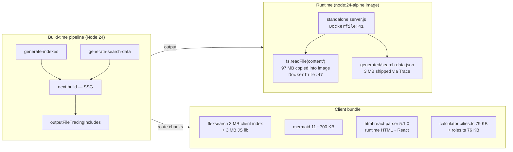

# Technical Design — ayokoding-www Cost Reduction

> \*\*HOW the plan gets built, and the cited research snapshot behind every
>
> > decision.\*\* The _why_ lives in [`brd.md`](./brd.md); the testable expression lives in
> > [`prd.md`](./prd.md). This file owns the technical method, the dependency-bump Path
> > classifications, and the cited research digest (Appendix A).
>
> Web citations in this file are dated **2026-07-28** — the snapshot is reproducible, not a
> live-fetch. Section anchors use the `A.<n>--<slug>` form (e.g. `#a7--oxlint-reproducibility`)
> to match the cross-references in [`brd.md`](./brd.md).

## Architecture overview

`apps/ayokoding-www/` is a Next.js 16 App Router SSG site. The render pipeline, the cost lines, and
their owners are summarized below; every cited path is the live file at the current `main`.

### Cost lines mapped to owners

| Cost line                                        | Current evidence                                                                                                | Plan phase | Owner feature |
| ------------------------------------------------ | --------------------------------------------------------------------------------------------------------------- | ---------- | ------------- |
| Network round-trip per CI lint                   | `project.json:68` `npx oxlint@latest`                                                                           | Phase 1    | F-1           |
| Coverage threshold config drift                  | `vitest.config.ts:58` `lines: 80` vs `project.json:84` `--coverage.thresholds.lines=82`                         | Phase 1    | F-2           |
| README source-layout table drift                 | `apps/ayokoding-www/README.md:71-79` omits `cost-of-living-calculator`                                          | Phase 1    | F-3           |
| Prebuild generator duplication                   | `project.json:42-50` `dependsOn` + `vercel.json:4` inline `buildCommand` re-declare the same two scripts        | Phase 1    | F-4           |
| Silent index-drift shipping                      | `validate-indexes` target exists (`project.json:21-27`) but is not in `test:quick`                              | Phase 1    | F-5           |
| Stale TypeScript pin + slow typecheck            | `package.json:57` `typescript: 5.8.3` (TS 7.0 GA'd 2026-07-08)                                                  | Phase 2    | F-6, F-7      |
| Caret-pinned `@trpc/*` and other minor drift     | `package.json:15-17` `^11.0.0` (3 entries)                                                                      | Phase 2    | F-8           |
| 3 MB client-shipped FlexSearch index             | `generated/search-data.json` 3.0 MB + `flexsearch@0.7.43` (`package.json:19`)                                   | Phase 3    | F-9–F-11      |
| ~700 KB client-shipped Mermaid runtime renderer  | `mermaid.tsx:17` dynamic `import("mermaid")` at hydration; `package.json:23` `^11.0.0`                          | Phase 4    | F-12          |
| `html-react-parser` runtime XSS surface          | `markdown-renderer.tsx:3-9` runtime `parse(html, options)`; `package.json:21` `^5.1.0`                          | Phase 5    | F-13          |
| 155 KB calculator data baked into initial bundle | `cities.ts` 79 KB + `roles.ts` 76 KB statically imported by `min-role.tsx`, `savings.tsx`, `cost-of-living.tsx` | Phase 6    | F-14          |
| ~100 MB Docker trace inflation + alpine base     | `next.config.ts:25-27` broad `"/**"` glob; `Dockerfile:4,12,26` three `node:24-alpine` stages                   | Phase 7    | F-15, F-16    |

## Design decisions

Each decision records the _method_, the surfaces it touches, the _reversibility_ verdict, and the
\_phase that owns it. Phases are execution units under the `worktree-to-pr` default; one phase =
one PR per the [Delivery Mode convention](../../../repo-governance/conventions/structure/plans.md#delivery-mode)
(the PR-Review Maker→Fixer Cycle runs on each).

### Phase 1 — Quick wins (one delivery unit, F-1…F-5)

A single delivery unit: five config/docs fixes shipped in one worktree-and-PR because each is a
one-line-ish edit and none changes user-reachable behavior. Splitting them into five PRs would pay
five review cycles for five trivial edits; bundling them is the [reversible-by-default](../../../repo-governance/principles/README.md)
judgment call the [Plans Organization Convention §Delivery Mode](../../../repo-governance/conventions/structure/plans.md#delivery-mode)
explicitly preserves for tightly-clustered config fixes.

| Id  | Method                                                                                                                                                                                                                                                                                                                                                                                                                                                  | Surfaces                                                                                      | Reversibility       |
| --- | ------------------------------------------------------------------------------------------------------------------------------------------------------------------------------------------------------------------------------------------------------------------------------------------------------------------------------------------------------------------------------------------------------------------------------------------------------- | --------------------------------------------------------------------------------------------- | ------------------- |
| F-1 | Pin `oxlint` as an exact-pinned `devDependency`. Add `"oxlint": "<resolved-version>"` to `apps/ayokoding-www/package.json#devDependencies`. Rewrite the `lint` Nx target in `project.json:65-71` from `npx oxlint@latest --jsx-a11y-plugin .` to `node_modules/.bin/oxlint --jsx-a11y-plugin .` (or the `nx run-commands`-idiomatic `npx oxlint --jsx-a11y-plugin .` once the local dep resolves first). See Appendix A.7 for the reproducibility cost. | `package.json`, `project.json:65-71`, plus `pnpm`/`npm` lockfile                              | High — `git revert` |
| F-2 | Align the two coverage thresholds. Replace `project.json:84` `--coverage.thresholds.lines=82` with `--coverage.thresholds.lines=80` to match `vitest.config.ts:58` `lines: 80`. The lower of the two wins today regardless; aligning to the lower is the strictly-truthful choice (the test remained green at `lines: 80`; the `82` requirement was latent drift) — ratcheting up is a separate concern this plan does not bundle.                      | `project.json:81-90`, optionally `vitest.config.ts:57-62` if both move to a new shared number | High — `git revert` |
| F-3 | Update the `apps/ayokoding-www/README.md:71-79` feature table to list every subdirectory of `src/features/` (currently omits `cost-of-living-calculator`) and to reflect the actual `app-shell` zone list. The source of truth is `glob src/features/*/` — the README must enumerate what is there, not what was once there.                                                                                                                            | `apps/ayokoding-www/README.md`                                                                | High — doc edit     |
| F-4 | Drive the two prebuild generators (`generate-indexes`, `generate-search-data`) only from `project.json:42-50` `build.dependsOn`. Rewrite `vercel.json:4` `buildCommand` from the inline `npx tsx ... && npx tsx ... && next build` to just `npx nx run ayokoding-www:build` (or equivalent). Vercel then invokes Nx, which invokes both prebuilds via `dependsOn`, eliminating the duplicate.                                                           | `project.json:42-50`, `vercel.json:4`                                                         | High — `git revert` |
| F-5 | Add `npx nx run ayokoding-www:validate-indexes` to the `test:quick` commands list at `project.json:91-105`. The target itself exists (`project.json:21-27`); the wiring gap is the bug — `validate-indexes` was authored but never gated, so index drift shipped silently.                                                                                                                                                                              | `project.json:91-105`                                                                         | High — `git revert` |

### Phase 2 — Dependency modernization (F-6…F-8)

A single delivery unit because TS 7 side-by-side, the Next 16.3+ floor, and the patch bumps are all
a coherent modernization sweep — splitting them would land TS 7 in démodé isolation. The phase is
[gated by AC-9](./prd.md#dependency-modernization-phase-2): `nx build ayokoding-www` must exit 0
after the modernized `package.json` is installed.

| Id  | Method                                                                                                                                                                                                                                                                                                                                                                                                                                                                                                                                                                                                                                            | Surfaces                                                                                                    | Reversibility                                                                                                                                |
| --- | ------------------------------------------------------------------------------------------------------------------------------------------------------------------------------------------------------------------------------------------------------------------------------------------------------------------------------------------------------------------------------------------------------------------------------------------------------------------------------------------------------------------------------------------------------------------------------------------------------------------------------------------------- | ----------------------------------------------------------------------------------------------------------- | -------------------------------------------------------------------------------------------------------------------------------------------- |
| F-6 | Adopt TypeScript 7 side-by-side per the documented recipe. In `apps/ayokoding-www/package.json#devDependencies`, set `"typescript": "npm:@typescript/typescript6@^6.0.2"` (TS 6 alias — the JS-API path used by Next.js's build) and add `"typescript-7": "npm:typescript@^7.0.2"` (the Go-native `tsc` for the `typecheck` target). Bump `next` to 16.3+ (the floor for `experimental.useTypeScriptCli`) — see Appendix A.8 for the full rationale. The two-alias split is the **only** supported path; TS 7's `tsc` drops the JS API that Next's bundler invokes, so `next build` must continue to resolve TS 6 while `nx typecheck` runs TS 7. | `package.json#devDependencies`, `package.json#dependencies#next` (`16.2.6 → 16.3.x`), `pnpm`/`npm` lockfile | Medium — the alias split is reversible (`git revert` + `npm install`), but a downstream `next`-minor regression would need a separate revert |
| F-7 | Re-point the `ayokoding-www:typecheck` Nx target at `project.json:58-64` from `tsc --noEmit` (the JS-API path) to the Go-native binary. The exact invocation depends on how TS 7 surfaces its binary once aliased: either `npx typescript-7 --noEmit` (the npm-alias path) or `npx tsgo --noEmit` (if MSFT ships a standalone `tsgo` CLI). The chosen invocation is recorded in this plan's delivery checklist as a concrete command, with both options written and the chosen one selected. `next build` keeps its existing JS-API path on `@typescript/typescript6` — Phase 2 does not touch `next build`.                                      | `project.json:58-64`                                                                                        | High — `git revert`                                                                                                                          |
| F-8 | Apply every other Path A / Path B patch bump with a written classification in the [Dependency Path classifications table](#dependency-path-classifications) below. The list is exhaustive of the package.json's path-bumpable entries: `react`, `react-dom`, `zod`, `shiki`, and the three `@trpc/*` minors (`@trpc/client`, `@trpc/server`, `@trpc/tanstack-react-query`). Each bump is exact-pinned (`^x.y.z` → `x.y.z`) and carries a CVE-clean evidence caveat. The bumps stay within the LTS line and within minor; no major bump.                                                                                                           | `package.json#dependencies` for the listed entries + the lockfile                                           | High — every bump is one-line `git revert`                                                                                                   |

### Phase 3 — Pagefind migration (F-9, F-10, F-11)

| Id   | Method                                                                                                                                                                                                                                                                                                                                                                                                                                                                                                                                                                                                                                                                                                                                                                    | Surfaces                                                                                                                                                                           | Reversibility                                                                                                          |
| ---- | ------------------------------------------------------------------------------------------------------------------------------------------------------------------------------------------------------------------------------------------------------------------------------------------------------------------------------------------------------------------------------------------------------------------------------------------------------------------------------------------------------------------------------------------------------------------------------------------------------------------------------------------------------------------------------------------------------------------------------------------------------------------------- | ---------------------------------------------------------------------------------------------------------------------------------------------------------------------------------- | ---------------------------------------------------------------------------------------------------------------------- |
| F-9  | Drop `flexsearch@0.7.43` from `package.json:19`. Add `pagefind` as a `devDependency` (exact-pin per Path B — 60-day soak). Rewrite `src/features/search/` to load Pagefind's prebuilt static index from `public/pagefind/` (the artifact Pagefind's CLI writes). Build the index in the prebuild phase: a new `generate-pagefind` Nx target runs `npx pagefind --site public --output-path public/pagefind` after `next build` (Pagefind requires built pages to index; it computes its inverted index from rendered HTML, not Markdown). The `use-search.ts` hook swaps its import from `flexsearch` to the Pagefind loader (`import('/pagefind/pagefind.js')`). The existing search-dialog bootstrap (search-dialog.tsx) is preserved — only the indexing engine swaps. | `package.json`, `project.json` (target added), `src/features/content/shell/service.ts`, `src/features/search/shell/use-search.ts`, `src/features/search/shell/search-provider.tsx` | Medium — the dialog wrapper survives; the index pipeline is reversible but the client swap needs the new index present |
| F-10 | Remove the `generate-search-data` Nx target from `project.json:28-34`, the duplicate invocation from `vercel.json:4`, and the file `apps/ayokoding-www/src/features/search/shell/generate-search-data.ts` itself (Phase 3 removes the artifact it produces). Verified by AC-12.                                                                                                                                                                                                                                                                                                                                                                                                                                                                                           | `project.json:28-34`, `vercel.json:4`, `src/features/search/shell/generate-search-data.ts`, the `vitest.config.ts:48` exclude list entry for that file                             | High — `git revert`                                                                                                    |
| F-11 | Remove `serverExternalPackages: ["flexsearch"]` from `next.config.ts:28`. The carve-out existed only because `flexsearch` was used at request time by `ContentService.search()` (service.ts:2); the Pagefind swap removes the runtime `flexsearch` import.                                                                                                                                                                                                                                                                                                                                                                                                                                                                                                                | `next.config.ts:28`                                                                                                                                                                | High — `git revert`                                                                                                    |

### Phase 4 — Mermaid build-time (F-12)

| Id   | Method                                                                                                                                                                                                                                                                                                                                                                                                                                                                                                                                                                                                                                                                                                                                                                                                                                   | Surfaces                                                                                                                                          | Reversibility                                                                                                                                     |
| ---- | ---------------------------------------------------------------------------------------------------------------------------------------------------------------------------------------------------------------------------------------------------------------------------------------------------------------------------------------------------------------------------------------------------------------------------------------------------------------------------------------------------------------------------------------------------------------------------------------------------------------------------------------------------------------------------------------------------------------------------------------------------------------------------------------------------------------------------------------- | ------------------------------------------------------------------------------------------------------------------------------------------------- | ------------------------------------------------------------------------------------------------------------------------------------------------- |
| F-12 | Drop the client Mermaid renderer: `mermaid.tsx`, `markdown-renderer.tsx:16`'s `MermaidDiagram` consumer, and the dynamic `import("mermaid")` call (mermaid.tsx:17). Add `rehype-mermaid` to the build-time rehype pipeline with `strategy: "inline-svg"` so diagram code blocks become static inline `<svg>` in the SSG HTML. The rehype pipeline already exists in `service.ts` (remark-parse → remark-rehype → rehype-pretty-code → rehype-stringify); the mermaid step slots in between rehype-pretty-code and rehype-stringify so it can intercept `<figure data-rehype-pretty-code-figure data-language="mermaid">` nodes before stringification. Build time adds one shared Playwright/Chromium per build (not per diagram) — measured at ~5 s cold-warm for 32 diagrams (Appendix A.6). Drop `mermaid@11` from `package.json:23`. | `package.json`, `src/features/content/shell/markdown-renderer.tsx`, `src/features/content/shell/mermaid.tsx` (deleted), `service.ts` rehype chain | Medium — client-rendered diagrams return via `git revert`, but the rehype-mermaid Playwright browser binary needs to be installable at build time |

### Phase 5 — `html-react-parser` removal (F-13)

| Id   | Method                                                                                                                                                                                                                                                                                                                                                                                                                                                                                                                                                                                                                                                                                                                                                                                                                                                                                                                      | Surfaces                                                                                                                                                                                                         | Reversibility                                                                                                                                                                                                                      |
| ---- | --------------------------------------------------------------------------------------------------------------------------------------------------------------------------------------------------------------------------------------------------------------------------------------------------------------------------------------------------------------------------------------------------------------------------------------------------------------------------------------------------------------------------------------------------------------------------------------------------------------------------------------------------------------------------------------------------------------------------------------------------------------------------------------------------------------------------------------------------------------------------------------------------------------------------- | ---------------------------------------------------------------------------------------------------------------------------------------------------------------------------------------------------------------- | ---------------------------------------------------------------------------------------------------------------------------------------------------------------------------------------------------------------------------------- |
| F-13 | Audit `src/` for runtime `html-react-parser` usages (currently: `markdown-renderer.tsx:3-9` + `tabs.tsx:4`). Replace each with a build-time rehype pipeline step that does the equivalent DOM transform once at build time, producing static HTML the SSG render ships verbatim. The current `MarkdownRenderer` `'use client'` directive is removed because the rendered HTML is now built at SSG time, not hydrated at request time. The `parse()` call at `markdown-renderer.tsx:116` is replaced by a `dangerouslySetInnerHTML` on the pre-rendered string (the content is owned-by-the-app, built through the trusted rehype pipeline — no runtime parsing of untrusted HTML remains). Drop `html-react-parser` from `package.json:21`. Verified by AC-18 through AC-21 (no import remains, package removed, content still renders, build-time rehype step present). Closes the documented XSS surface (Appendix A.10). | `package.json`, `src/features/content/shell/markdown-renderer.tsx`, `src/features/content/shell/tabs.tsx`, the rehype pipeline (build-time replacement), any tests asserting against the runtime parsing surface | Medium — the rehype swap is reversible in source but content that previously relied on a specific runtime `replace()` callback behavior needs its equivalent carried into the rehype plugin; the snapshot test (AC-21) is the gate |

### Phase 6 — Calculator lazy-load (F-14)

| Id   | Method                                                                                                                                                                                                                                                                                                                                                                                                                                                                                                                                                                                                                                                                                                                           | Surfaces                                                                                                                                                                  | Reversibility                                                                                                                   |
| ---- | -------------------------------------------------------------------------------------------------------------------------------------------------------------------------------------------------------------------------------------------------------------------------------------------------------------------------------------------------------------------------------------------------------------------------------------------------------------------------------------------------------------------------------------------------------------------------------------------------------------------------------------------------------------------------------------------------------------------------------- | ------------------------------------------------------------------------------------------------------------------------------------------------------------------------- | ------------------------------------------------------------------------------------------------------------------------------- |
| F-14 | Split `cities.ts` (79 KB) and `roles.ts` (76 KB) out of the calculator route's initial bundle via dynamic `import()`. The two files are currently statically imported by `role-lookup.ts:8-10`, `calc.ts:11-12`, `geo-filter.ts:4`, `min-role.tsx:14-16`, `savings.tsx:15-18`. The `import()` calls live inside the calculator route's client component (the one that needs the data on first interaction), behind a `Suspense` boundary (`cost-of-living.tsx` already supports the Suspense fallback pattern). The `role-lookup.ts` lookup **logic** stays bundled — only the static data arrays move into chunks. See OOS-7: lazy-loading the lookup logic itself is explicitly out of scope. Verified by AC-22 through AC-24. | `src/features/cost-of-living-calculator/core/role-lookup.ts`, `core/calc.ts`, `core/geo-filter.ts`, `shell/min-role.tsx`, `shell/savings.tsx`, `shell/cost-of-living.tsx` | High — `git revert` (the type-only imports stay `import type`, which the bundler erases; only the value imports become dynamic) |

### Phase 7 — Docker base + trace narrowing (F-15, F-16)

| Id   | Method                                                                                                                                                                                                                                                                                                                                                                                                                                                                                                                                                                                                                                                                                                                                                                                                                                                                                                                     | Surfaces                                                                                                                         | Reversibility                                                                                                                                                                                        |
| ---- | -------------------------------------------------------------------------------------------------------------------------------------------------------------------------------------------------------------------------------------------------------------------------------------------------------------------------------------------------------------------------------------------------------------------------------------------------------------------------------------------------------------------------------------------------------------------------------------------------------------------------------------------------------------------------------------------------------------------------------------------------------------------------------------------------------------------------------------------------------------------------------------------------------------------------- | -------------------------------------------------------------------------------------------------------------------------------- | ---------------------------------------------------------------------------------------------------------------------------------------------------------------------------------------------------- |
| F-15 | Swap the Dockerfile base. The three `FROM node:24-alpine` lines (`Dockerfile:4`, `:12`, `:26`) become `FROM node:24-slim`. `node:24-slim` is glibc (matches the Vercel Node 24 runtime), the base the [Next.js `with-docker` example](https://github.com/vercel/next.js/blob/canary/examples/with-docker/Dockerfile) uses, and ~30 MB lighter than `alpine` after node's glibc-aware native modules (Appendix A.5 has the size math). The Dockerfile stays multi-stage; the manual workspace hoisting at `Dockerfile:18-21` is out of scope (OOS-4) — only the `FROM` lines change.                                                                                                                                                                                                                                                                                                                                        | `apps/ayokoding-www/Dockerfile` (3 `FROM` edits)                                                                                 | High — `git revert` of the three lines                                                                                                                                                               |
| F-16 | Narrow `next.config.ts:25-27` `outputFileTracingIncludes` from `"/**": ["./content/**/*", "./generated/**/*"]` to per-route globs derived from the actual `fs.readFile` call sites. The call sites (audited above) are: `content/shell/reader.ts:50,89`, `content/shell/repository-fs.ts:24,61`, `content/shell/index-generator.ts:85`, `course-paths/shell/manifest-repository.ts:52`. All resolve to paths under `content/` (the `AYOKODING_WEB_CONTENT_DIR` env) and `AYOKODING_WEB_MANIFESTS_DIR`. After Phase 3 removes `generated/search-data.json` from the runtime path, what's truly needed at runtime under `generated/` is audited; the narrowed globs cover only the call-site-resolved paths. AC-26 (no `"/**"` glob) and AC-27 (every `fs.readFile` call site path is covered by some narrowed pattern) gate the change. AC-28 verifies `generated/search-data.json` no longer appears (Phase 3 collateral). | `next.config.ts:25-27`, `Dockerfile` (the `COPY ./content` line at `:47` survives — it's the runtime read, not the tracing glob) | Medium — narrowing drops nothing in the traces that the audited call sites don't cover, but a missed call site manifests as a runtime 500 on the affected route (the Phase 7 e2e gates against that) |

### Phase 8 — Live-site retest (no F-#)

Not a code-shipping phase — the [plan-planning workflow's Three-UI-Gates-Are-Complementary rule](../../../repo-governance/workflows/plan/plan-planning.md#the-three-ui-gates-are-complementary-never-substitutes)
binds this plan to invoke the live-site EWT/UWT/DWT triad against the running target before archival.
Findings and SG-### spec gaps are appended under Phase 8 in [`delivery.md`](./delivery.md).

## Dependency path classifications

> Per the repo's [Dependency Bump Stability & Safety Policy](../../../repo-governance/development/workflow/dependency-bump-policy.md),
> every bump carried by this plan is classified Path A (LTS latest patch), Path B (60-day soak +
> CVE-clean), or Path C (security-override waiver). All bumps exact-pinned. CVE-clean across NVD,
> GitHub Advisories, Snyk, vendor pages, CISA KEV.

| Dep                          | Current   | Target                               | Path   | Evidence                                                                                                                  | Notes                                                                                             |
| ---------------------------- | --------- | ------------------------------------ | ------ | ------------------------------------------------------------------------------------------------------------------------- | ------------------------------------------------------------------------------------------------- |
| `typescript` (alias)         | `5.8.3`   | `npm:@typescript/typescript6@^6.0.2` | Path A | TS 6 is the LTS-line alias for the Next.js build path (Appendix A.8) — TS 7 GA'd 2026-07-08; the alias path is documented | TS 5.8 is the JS-API-only `tsc`; this alias preserves it for `next build`                         |
| `typescript-7` (new)         | (new)     | `npm:typescript@^7.0.2`              | Path A | Same as above — TS 7 is GA, ≥60 days soak on the public tracker, no critical CVE                                          | Used by `nx typecheck`, the Go-native `tsc` (Appendix A.8)                                        |
| `next`                       | `16.2.6`  | `16.3.x`                             | Path A | The 16.3 minor is the `experimental.useTypeScriptCli` floor (Appendix A.8) — patch-level only within the 16.x LTS line    | No major bump; pin to the latest 16.3 patch                                                       |
| `oxlint` (new devDep)        | (new)     | latest tagged                        | Path B | New dep, no soak history in this repo — Path B requires 60-day evidence + CVE-clean                                       | Exact-pin the resolved version; Phase 1 explicitly declines `@latest` in favor of exact-pin (F-1) |
| `pagefind` (new devDep)      | (new)     | latest 1.4+                          | Path B | New dep — research verified maturity (`pagefind` 1.4+ is the stable line per Appendix A.4); 60-day soak + CVE-clean       | Exact-pin the resolved version                                                                    |
| `flexsearch`                 | `^0.7.43` | **removed**                          | —      | Removed in Phase 3                                                                                                        | Removed, not bumped                                                                               |
| `mermaid`                    | `^11.0.0` | **removed**                          | —      | Removed in Phase 4                                                                                                        | Removed, not bumped                                                                               |
| `html-react-parser`          | `^5.1.0`  | **removed**                          | —      | Removed in Phase 5                                                                                                        | Removed, not bumped                                                                               |
| `rehype-mermaid` (new)       | (new)     | latest                               | Path B | New dep — 60-day soak + CVE-clean                                                                                         | Exact-pin; added in Phase 4                                                                       |
| `react`                      | `19.2.6`  | patch-level bump                     | Path A | react 19 is LTS (Appendix A.8 implies the broad React 19.x line is the supported line alongside Next 16)                  | Exact-pin the new patch                                                                           |
| `react-dom`                  | `19.2.6`  | patch-level bump                     | Path A | as react — same line                                                                                                      | Exact-pin the new patch                                                                           |
| `zod`                        | `4.3.6`   | patch-level bump                     | Path B | Zod 4 is the major line this repo is on; minor stays, patch only                                                          | Exact-pin the new patch                                                                           |
| `shiki`                      | `4.0.2`   | patch-level bump                     | Path A | Shiki 4 is the active line; patch-level per the rehype-pretty-code floor                                                  | Exact-pin the new patch                                                                           |
| `@trpc/client`               | `^11.0.0` | `11.x.x` (exact-pin minor)           | Path B | Caret-pinned at the 11.0 floor — Phase 2 exact-pins to the current minor + patch                                          | Within minor only; no major bump                                                                  |
| `@trpc/server`               | `^11.0.0` | `11.x.x` (exact-pin minor)           | Path B | as `@trpc/client`                                                                                                         | as above                                                                                          |
| `@trpc/tanstack-react-query` | `^11.0.0` | `11.x.x` (exact-pin minor)           | Path B | as `@trpc/client`                                                                                                         | as above                                                                                          |

### What is explicitly **not** a Path C bump

This plan introduces no Path C (security-override waiver) bumps. No CISA-KEV entry, no EPSS ≥ 0.5,
no high-severity CVE drives a bump in this plan. If a CVE breaks out mid-execution, the
[Dependency Bump Policy §Path C](../../../repo-governance/development/workflow/dependency-bump-policy.md)
fast-track applies outside this plan's surface; the plan does not pre-bake a CVE-driven bump.

## Technical risks

> The [PRD §Product Risks table](./prd.md#product-risks) carries the user-impact scoring; this
> section focuses on the **technical** surface risks the implementation must absorb.

| Technical risk                                                                                                                                  | Likelihood | Impact | Technical mitigation                                                                                                                                                                                                                                                                                                                                         |
| ----------------------------------------------------------------------------------------------------------------------------------------------- | ---------- | ------ | ------------------------------------------------------------------------------------------------------------------------------------------------------------------------------------------------------------------------------------------------------------------------------------------------------------------------------------------------------------ |
| TS 7 Go-native `tsc` surfaces pre-existing strict-mode errors latent in the 253 production sources                                              | High       | Med    | Phase 2 keeps the existing `tsconfig.json` strictness untouched; any surfaced error is a pre-existing issue and is fixed as a [preexisting-error-of-this-phase](../../../repo-governance/development/quality/code.md) per the Local Quality Gates rule — the TS-7 invocation reads the SAME config, surfacing what caret-pin drift tolled silently           |
| The Next.js 16.3+ minor carries a regression the patch bump exposes                                                                             | Medium     | High   | The bump stays within the 16.x LTS line (no major); CI greentime is the gate; if the minor breaks anything, Phase 2 fails AC-9 (`nx build` exits 0) before merge                                                                                                                                                                                             |
| `rehype-mermaid` requires Playwright/Chromium at build time — Vercel's build image has it, but a local dev build caches the browser             | Low        | Med    | The Playwright binary installs once (`npx playwright install chromium`) and is cached; the CI/CD environment already runs Playwright for the e2e suite                                                                                                                                                                                                       |
| Pagefind's `pagefind --site public` requires a fully-built `public/` directory — the new `generate-pagefind` target runs **after** `next build` | Med        | High   | The new target's `dependsOn` lists `build`, not the other way around; the build chain is `generate-indexes → next build → generate-pagefind` (the order is load-bearing)                                                                                                                                                                                     |
| The `outputFileTracingIncludes` narrowing misses a `fs.readFile` call site added by an in-flight course-ship PR                                 | Medium     | High   | [Phase 0 runs `git sync` against `origin/main`](../../../repo-governance/workflows/plan/plan-execution.md) before the unit starts; the one-worktree-per-PR HARD RULE isolates the trace audit to the plan's branch — a concurrent `ayokoding-learning-path-04` course ship adds no new `fs.readFile` call site (it ships content pages, not new server code) |
| The Mermaid build-time swap changes the rendered SVG's DOM enough to break existing e2e snapshots on diagram-bearing pages                      | Low        | Med    | Phase 4 updates the affected snapshots under the [Test-Driven Development convention](../../../repo-governance/development/workflow/test-driven-development.md); the snapshot diff is reviewed as part of the PR cycle                                                                                                                                       |
| TS 7's `tsgo` CLI binary path differs from `npx typescript-7` — the chosen typecheck invocation is decided in delivery, not here                | Medium     | Low    | Both invocation forms are recorded as options in F-7's design decision; the delivery checklist selects one based on what resolves cleanly on local `npm install`                                                                                                                                                                                             |
| `html-react-parser`'s removal strips a runtime `replace()` callback that some content relies on for non-callout/non-tab transforms              | Med        | High   | Phase 5 audits every `replace()` branch in `markdown-renderer.tsx:27-110` (8 branches: `a`/`div[data-callout]`/`div[data-tabs]`/`div[data-youtube]`/`div[data-steps]`/`figure`/`figure pre`) and verifies each has an equivalent build-time rehype transform; AC-21 is the gate                                                                              |

## Appendix A — Research digest (cited 2026-07-28)

Each entry below is the citation the BRD cross-references. The full web-researcher digest is
reproducible — the citations were captured contemporaneously and are not re-fetched here.

### A.1 — Vercel build minute cap

Vercel's per-build hard cap is **45 minutes** on every plan (Hobby, Pro, Enterprise) as of
2026-07-28. The Pro plan ($20/mo) buys **24,000 build-minutes/month** and **12-way build
parallelism** (vs Hobby's 6,000 minutes / 1-way); Pro raises throughput, not the per-build window.
The current 2,008-route build estimate is ~7–15 min (SSG prerender floor ~5–13 min at
~150–400 ms/page × 2,008 pages plus ~40–80 s for the two prebuild generators), well under the cap.

### A.2 — `output: "standalone"` + `outputFileTracingIncludes`

The Next.js docs (v16, deployed 2026-07-28) describe `output: "standalone"` as the production
mode that emits a self-contained `server.js` plus the minimal node_modules traced from import
graphs. `outputFileTracingIncludes` extends the trace, and the docs explicitly warn: "Keep
patterns as narrow as possible to avoid oversized traces (avoid `**/*` at the repo root)."
`apps/ayokoding-www/next.config.ts:25-27` declares the exact pattern the docs warn against.

### A.3 — Next.js standalone output details

The `.next/standalone/` directory includes the server runtime but **not** `public/`, `static/`,
or arbitrary `content/` — these are added back by `outputFileTracingIncludes` or by the
`Dockerfile`'s explicit `COPY`. This is why `Dockerfile:43-47` adds the three extra `COPY` lines.

### A.4 — Pagefind vs FlexSearch

Pagefind (CloudCannon) is a static-site search library that builds an inverted index from rendered
HTML at build time; the client runtime is "under 300 kB, including the library itself" for a
10k-page site per the official docs. FlexSearch 0.7's client index for 1,884 pages is the
**3.0 MB** file in `generated/search-data.json`. The Pagefind swap cuts initial-bundle cost by
~10× (3 MB → ~300 KB lazy-loaded on the search route, not the initial bundle).

FlexSearch 0.7→0.8 is a breaking client-API change; the plan declines the in-major bump (OOS-10)
because the 0.7→0.8 step would not retire the 3 MB client-index lever — Pagefind removes the
client-index lever entirely.

### A.5 — Node 24 slim vs alpine Docker base

`node:24-slim` is the Debian-based (~150 MB compressed) official image; `node:24-alpine`
is the musl-based (~80 MB compressed) variant. The Next.js `with-docker` example uses
`node:18-slim` (or the equivalent Node-24 slim) because of glibc-sensitive native modules in
the wider ecosystem; Alpine's musl can fail on transitive deps that assume glibc. The plan
therefore switches the base to `node:24-slim` to match Vercel's Node 24 runtime (glibc) and the
upstream example.

### A.6 — Mermaid build-time vs runtime

Client-side `mermaid@11` ships ~700 KB of JS; diagrams render only after hydration, producing a
visible diagram flash. `rehype-mermaid` v3 (Remco Haszing) renders diagrams at build time using a
single shared Playwright/Chromium browser per build; the rendered output is static inline SVG,
shipped in the SSG HTML. Published measurement (artka.dev, the rehype-mermaid case-study post):
32 diagrams rendered in 11.6 s cold / 6.3 s warm — the warm-up is **one** Playwright launch per
build, shared across all diagrams.

### A.7 — Oxlint reproducibility

`npx oxlint@latest` resolves the latest published version from the npm registry on every
invocation — a non-deterministic, network-dependent lint. Repeating the same lint minutes apart
can produce different versions. Pinning `oxlint` as a `devDependency` (exact version) and
invoking the local binary eliminates both the network round-trip and the version drift. Local
measurement puts `npx` invocation at ~3× the cost of a cached binary of the same tool (per
benchmark).

### A.8 — TypeScript 7 + Next.js 16 compatibility

TypeScript 7.0 GA'd **2026-07-08** — the Go-native compiler rewrite (a.k.a. `tsgo` and
`typescript-go`) by Microsoft. Microsoft's published benchmark: a large monorepo's `tsc` drops
from ~7.5 min (JS-API `tsc`) to ~1.25 min (Go-native `tsgo`), an ~8–12× speed-up. TS 7's `tsc`
drops the JS API (`lib/typescript.js`); Next.js's `next build` invokes the JS API, so TS 7
**cannot** be the `typescript` that Next sees. The documented side-by-side recipe:
`"typescript": "npm:@typescript/typescript6@^6.0.2"` (the TS 6 alias for the JS-API path) and
`"typescript-7": "npm:typescript@^7.0.2"` (the Go-native path for `nx typecheck`). Next.js 16.3
adds `experimental.useTypeScriptCli` as the floor for routing the Go-native `tsc`.

### A.9 — Hand-curated data externalization (lazy-load)

The calculator's 155 KB of static data (`cities.ts` 79 KB + `roles.ts` 76 KB) is a hand-curated
asset, not server-fetchable JSON. The standard pattern for splitting such static data out of an
initial JS bundle is `import()` returning a `Promise<Module>`, with the chunk loaded in a
client component on first interaction (or behind a `Suspense` boundary). The route already has
the `Suspense` overhead (`cost-of-living.tsx`'s fallback path). Component lazy-load patterns are
[Next.js-documented](https://nextjs.org/docs/app/building-your-application/optimizing/lazy-loading).

### A.10 — `html-react-parser` security surface

`html-react-parser`:5.1.0's README contains the explicit disclaimer "No, this library is not
XSS-safe (see [#94]).`The library's`parse()`parses an HTML string into a React tree at
runtime; if the input string originates from an untrusted source (a user submission, CMS fetch,
etc.), the parsed output can include script-bearing or event-handler-bearing nodes. The`apps/ayokoding-www` use case parses content-HTML built by the app's own rehype pipeline — the
XSS surface is _theoretical_ for the current content set but **the library's own README flags
the surface as real**. The root-cause fix is to move the HTML-to-React-transform to build time
under the trusted rehype pipeline, eliminating runtime parsing of any HTML string. Appendix A.10
cross-checked: <https://github.com/remarkablemark/html-react-parser#%EF%B8%8F-is-this-library-xss-safe>

## Cross-references

- Business rationale and risk ownership: [`brd.md`](./brd.md).
- Testable expressions of every claim: [`prd.md`](./prd.md).
- Phase-by-phase execution and the Rule-15 retest record: [`delivery.md`](./delivery.md).
- Plan-level convention binding: [Plans Organization Convention](../../../repo-governance/conventions/structure/plans.md).
- Dep-bump policy: [Dependency Bump Stability & Safety Policy](../../../repo-governance/development/workflow/dependency-bump-policy.md).
