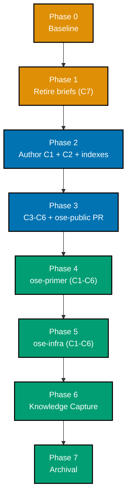

# Delivery Checklist — Bare-Repo Governance Hardening

This checklist delivers seven coordinated documentation changes (**C1-C7**, defined in
[README.md](./README.md#scope)) to `ose-public`, then propagates them verbatim to `ose-primer` and
`ose-infra`. The plan touches **only markdown**; no code, no specs, no UI, no API. The
surface-conditional tester-gate exemptions are stated and justified in
[tech-docs.md §Testing Strategy and Gate Exemptions](./tech-docs.md#testing-strategy-and-gate-exemptions).

> **Legend** — `[AI]`: an agent performs the step (the default; unmarked steps are `[AI]`).
> `[HUMAN]`: only a human can do it (physical action, out-of-band approval, real-secret or
> privileged-credential handling). `[AI+HUMAN]`: agent prepares, human approves or finishes.
> Git-mechanical steps (worktree create/remove, branch, commit, push, merge) are `[AI]`.
>
> **Phase Gate** — every phase ends with a `### Phase N Gate` (must-pass verification) plus a
> `> **Pause Safety**:` note (safe-to-stop state + resume command). A phase is not complete until
> its gate is green; do not start phase N+1 while any gate check fails.
>
> **Re-anchor by content, never by line number.** Every line number cited in
> [tech-docs.md §Verified In-Repo State](./tech-docs.md#verified-in-repo-state-re-anchor-by-content-not-by-line-number)
> was true at authoring time and **some have already drifted once**. Locate every edit site by its
> quoted content anchor. Do not `sed`-address any of them.
>
> **Tooling caveat — verified empirically 2026-07-21, do not assume.** In this repo `grep` is a
> shell function routing to **ugrep** (in `-G` basic-regex mode), _not_ ripgrep and not the system
> BSD grep. Three consequences bind every acceptance clause below:
>
> 1. **`-c` prints `0` and exits 1** on zero matches, so a zero-hit expectation is written as
>    "exits 1" rather than "prints 0". Confirmed: `grep -Fc "hit" b.txt` → prints `0`, exit 1.
> 2. **`-L` means _files-without-match_ here** (GNU-compatible), and therefore **exits 0** when it
>    finds such a file — so a `grep -L` clause reads as passing almost unconditionally. **No step
>    below uses `-L`.** Note this is the _opposite_ of ripgrep's `-L` (follow-symlinks); do not port
>    a `-L` clause between the two on the assumption they agree.
> 3. **Ripgrep-only flags are unavailable.** `--glob '!pattern'` errors with
>    `missing argument for --glob`. Use `--exclude-dir=<dir>` for exclusions instead.
>
> Use `grep -F` for any literal containing backticks or regex metacharacters. If the shell binding
> changes, **re-verify these three properties before trusting any clause below** — an acceptance
> criterion that silently inverts is worse than no criterion.

## Worktree

Worktree path: `worktrees/bare-repo-governance-hardening/`

Optional manual pre-provisioning (run from repo root):

```bash
claude --worktree bare-repo-governance-hardening
```

The plan-execution Step 0 gate enters this worktree by default: it auto-provisions from the latest
`origin/main` when missing, syncs with `origin/main` before implementing, and prompts before
deleting the worktree after the plan is archived and pushed.

See [Worktree Path Convention](../../../repo-governance/conventions/structure/worktree-path.md) and
[Plans Organization Convention §Worktree Specification](../../../repo-governance/conventions/structure/plans.md#worktree-specification).

## Delivery Mode: worktree-to-pr

Per **DD-4** ([tech-docs.md](./tech-docs.md#dd-4--delivery-mode-for-this-plans-own-execution-is-worktree-to-pr)).
The `ose-public` changeset is authored in the worktree above, lands as a **draft PR** against `main`,
runs the **PR-Review Maker→Fixer Cycle** (`pr-review-maker` / `pr-review-fixer`, 3 sequential
CI-gated cycles), then `[AI]` merges once the five hardened preconditions hold. Each sibling
propagation phase opens its **own** draft PR in its own repo, preserving the strict
1-PR ↔ 1-worktree relationship.

This plan does **not** opt into a `[HUMAN]` merge gate. See
[Plans Organization Convention §Delivery Mode](../../../repo-governance/conventions/structure/plans.md#delivery-mode),
[PR Merge Protocol](../../../repo-governance/development/workflow/pr-merge-protocol.md), and the
[PR Review Quality Gate workflow](../../../repo-governance/workflows/pr/pr-review-quality-gate.md).

## Parallelization Model

**Cap**: honor the in-force subagent concurrency cap (N+1 model, default N=3). The main thread
orchestrates and self-promotes nothing.

The DAG is **fully serial**:



| Node    | `blockedBy` | `blocks` | Rationale                                                                             |
| ------- | ----------- | -------- | ------------------------------------------------------------------------------------- |
| Phase 0 | —           | Phase 1  | Baseline before any edit                                                              |
| Phase 1 | Phase 0     | Phase 2  | Retirement is atomic with promotion; do it before authoring diverges the two          |
| Phase 2 | Phase 1     | Phase 3  | C3-C6 cross-link C1, so C1 must exist first                                           |
| Phase 3 | Phase 2     | Phase 4  | `ose-public` wording is the source of truth; siblings copy the **merged** text (DD-8) |
| Phase 4 | Phase 3     | Phase 5  | Serial by **DD-8** — see the independence note below                                  |
| Phase 5 | Phase 4     | Phase 6  | —                                                                                     |
| Phase 6 | Phase 5     | Phase 7  | Knowledge Capture before archival                                                     |
| Phase 7 | Phase 6     | —        | Terminal node                                                                         |

> **Independence note (recorded so it reads as a decision, not an oversight)**: `ose-primer` and
> `ose-infra` are disjoint repositories, so Phases 4 and 5 are structurally independent and could
> run in parallel. **DD-8 binds them serial anyway** — the second phase benefits from any correction
> the first surfaces, and the work is small enough that parallelism buys nothing worth the
> coordination cost. See
> [tech-docs.md DD-8](./tech-docs.md#dd-8--propagation-is-in-plan-ose-public-first-sequential).

## Path Constants

- `<WF>` = `repo-governance/development/workflow/`
- `<C1>` = `repo-governance/development/workflow/bare-repo-landing-method.md` _(New file)_
- `<PLANS>` = `repo-governance/conventions/structure/plans.md`
- `<PARITY>` = `repo-governance/workflows/plan/plan-multi-repo-parity-planning.md`
- `<PROMO>` = `repo-governance/workflows/plan/plan-idea-promotion-planning.md`
- `<MERGE>` = `repo-governance/development/workflow/pr-merge-protocol.md`
- `<GATE>` = `repo-governance/workflows/pr/pr-review-quality-gate.md` _(source note; unchanged)_
- `<SDLC>` = `docs/reference/sdlc-gate-standard.md`
- `<IDEAS>` = `plans/ideas/`
- `<repo-root>` = the root of whichever repo the step is operating on — `ose-public` unless the
  step names `<PRIMER>` or `<INFRA>`. In a bare sibling there is no work tree at `<repo-root>`, so
  only bare-safe commands may target it (see the bare-safe command note in Phase 4)
- `<PRIMER>` = `/Users/wkf/ose-projects/ose-primer` _(bare, `core.bare=true`)_
- `<INFRA>` = `/Users/wkf/ose-projects/ose-infra` _(bare, `core.bare=true`)_

---

## Phase 0: Environment Setup and Baseline

> _Executor: `repo-setup-manager`_

- [ ] [AI] Install dependencies in the root worktree: `npm install`
      — acceptance: exits 0, `node_modules/` synchronized
- [ ] [AI] Converge the full polyglot toolchain in the root worktree: `npm run doctor -- --fix`
      — acceptance: exits 0 with no unresolved drift
- [ ] [AI] Confirm the plan worktree exists and is on its own branch:
      `git worktree list | grep -F "bare-repo-governance-hardening"`
      — acceptance: prints one line naming `worktrees/bare-repo-governance-hardening`
- [ ] [AI] Sync the worktree with the latest `origin/main`:
      `git fetch origin && git -C worktrees/bare-repo-governance-hardening merge --ff-only origin/main`
      — acceptance: exits 0 (fast-forward or already up to date)
- [ ] [AI] Record the baseline: `npx nx affected -t typecheck lint test:quick specs:coverage`
      — acceptance: pass/fail counts written into this checklist as an implementation note; every
      preexisting failure named
- [ ] [AI] Resolve every preexisting failure before proceeding, per
      [Root Cause Orientation](../../../repo-governance/principles/general/root-cause-orientation.md)
      — acceptance: zero unresolved preexisting failures
- [ ] [AI] Verify both sibling repos are reachable and bare, using the method this plan documents
      (**never** `git rev-parse --is-bare-repository`):
      `git -C /Users/wkf/ose-projects/ose-primer worktree list` and
      `git -C /Users/wkf/ose-projects/ose-infra worktree list`
      — acceptance: each prints a line ending in `(bare)`
- [ ] [AI] Record each sibling's current divergence:
      `git -C /Users/wkf/ose-projects/ose-primer rev-list --left-right --count origin/main...main`
      and the same for `ose-infra`
      — acceptance: both print `0` and `0`; if not, record the actual counts here before continuing
- [ ] [AI] Create the Knowledge Capture running log at
      `plans/backlog/bare-repo-governance-hardening/learnings.md` if it does not already exist, with
      the H1 `# Learnings: bare-repo-governance-hardening` as its first content line (markdownlint
      MD041 fails a scaffold of bare HTML comments)
      — acceptance: `head -3 plans/backlog/bare-repo-governance-hardening/learnings.md` shows the H1

### Phase 0 Gate

> All checks below must pass before starting Phase 1.

- [ ] [AI] `npm install` exited 0 and `npm run doctor -- --fix` reports no unresolved drift
- [ ] [AI] `npx nx affected -t typecheck lint test:quick specs:coverage` — baseline recorded, zero
      unresolved preexisting failures
- [ ] [AI] `git worktree list` shows `worktrees/bare-repo-governance-hardening` present and synced
      with `origin/main`
- [ ] [AI] Both siblings verified `(bare)` via `git worktree list`, and their divergence counts are
      recorded in this checklist
- [ ] [AI] `learnings.md` exists with its mandatory H1

> **Pause Safety**: only the local toolchain was verified and the baseline recorded — no plan work
> exists yet. Safe to stop indefinitely. To resume: re-run
> `npx nx affected -t typecheck lint test:quick specs:coverage` and confirm it is still clean.

---

## Phase 1: Verify the Two Source Two-Pagers Are Retired (C7)

> **Already executed at promotion time — this phase VERIFIES, it does not perform.** The
> `plan-idea-promotion-planning` workflow requires promotion to be **atomic**: the plan appears and
> the briefs disappear in the same changeset. That changeset landed when this plan was created, so
> the deletions below are already in `main`'s history. The phase is retained as a verification gate
> because a later reader must be able to confirm the retirement actually happened rather than assume
> it.
>
> If any check here fails, the promotion was incomplete — repair it before Phase 2 rather than
> proceeding.

- [ ] [AI] Verify the plan folder exists at the backlog stage with **no date prefix**
      — acceptance: `test -d plans/backlog/bare-repo-governance-hardening` exits 0 and
      `test -f plans/backlog/bare-repo-governance-hardening/delivery.md` exits 0
- [ ] [AI] Verify the first brief is gone
      — acceptance: `test -f plans/ideas/bare-repo-worktree-landing-hygiene.md` exits **1**
- [ ] [AI] Verify the second brief is gone
      — acceptance: `test -f plans/ideas/bare-repo-delivery-mode-governance-hardening.md` exits **1**
- [ ] [AI] Verify both index lines are gone from `plans/ideas/README.md`
      — acceptance: `grep -Fc "bare-repo-worktree-landing-hygiene" plans/ideas/README.md` exits
      **1** and `grep -Fc "bare-repo-delivery-mode-governance-hardening" plans/ideas/README.md`
      exits **1**
- [ ] [AI] Verify no file outside this plan's own folder still links either brief:
      `grep -rF "bare-repo-worktree-landing-hygiene" --exclude-dir=bare-repo-governance-hardening --exclude-dir=worktrees --exclude-dir=generated-reports .`
      and the same for the second slug
      — acceptance: both exit 1 (the only surviving mentions are inside this plan's own documents).
      Note `--exclude-dir`, not ripgrep's `--glob '!…'`, per the tooling caveat above
- [ ] [AI] Verify the plan is registered in `plans/backlog/README.md`
      — acceptance: `grep -Fc "bare-repo-governance-hardening" plans/backlog/README.md` prints at
      least 1
- [ ] [AI] Verify the retirement is in history, not merely in the working tree
      — acceptance:
      `git log --oneline --diff-filter=D -- plans/ideas/bare-repo-worktree-landing-hygiene.md`
      prints at least one commit
- [ ] [AI] Verify **neither brief exists in the sibling repos** — established at promotion time by
      searching `plans/**` by filename and grepping both repos for both slugs, with zero hits, so
      there is nothing to delete there
      — acceptance: `test -f <PRIMER>/plans/ideas/bare-repo-worktree-landing-hygiene.md` exits 1 and
      the same for `<INFRA>` and for the second slug. Recorded so a later reader does not re-check

### Phase 1 Gate

> All checks below must pass before starting Phase 2.

- [ ] [AI] `test -f plans/ideas/bare-repo-worktree-landing-hygiene.md` exits 1
- [ ] [AI] `test -f plans/ideas/bare-repo-delivery-mode-governance-hardening.md` exits 1
- [ ] [AI] `grep -Fc "bare-repo-worktree-landing-hygiene" plans/ideas/README.md` exits 1
- [ ] [AI] `grep -Fc "bare-repo-delivery-mode-governance-hardening" plans/ideas/README.md` exits 1
- [ ] [AI] `grep -Fc "bare-repo-governance-hardening" plans/backlog/README.md` prints at least 1
- [ ] [AI] `npx rhino-cli md links validate` reports zero broken links (no surviving link points at
      a deleted brief)
- [ ] [AI] `git status --porcelain` lists nothing unexpected — every changed path is one this phase
      authored

> **Pause Safety**: the two briefs are retired (at promotion time) and the plan is registered in the
> backlog index; the repository is self-consistent (no dangling links to the deleted files) and no
> governance document has been touched yet. Safe to stop. To resume: run
> `npx rhino-cli md links validate` and confirm it is still clean.

---

## Phase 2: Author the Landing-Method Document (C1, C2) and Register It

- [ ] [AI] Create `repo-governance/development/workflow/bare-repo-landing-method.md` _(New file)_
      following the frontmatter + section shape of its siblings
      `repo-governance/development/workflow/no-destructive-git-operations.md` and
      `repo-governance/development/workflow/worktree-and-artifact-cleanup.md`
      (`title`, `description`, `category: explanation`, `subcategory: development`, `tags`,
      `created: <today>`; then a single H1; then Principles/Conventions Implemented-Respected; then
      the body; then Related Documentation). Section list in
      [tech-docs.md §C1 — the new document's shape](./tech-docs.md#c1--the-new-documents-shape)
      — acceptance: `test -f repo-governance/development/workflow/bare-repo-landing-method.md`
      exits 0 (it exits 1 before this step)
  - _Suggested executor: `repo-rules-maker`_
- [ ] [AI] In `<C1>`, write the **topology-verification** section per **DD-7**: `git worktree list`
      as the primary/human check (cite `git-worktree(1)` §LIST OUTPUT FORMAT as
      **upstream-prescribed**), and
      `git config --file "$(git rev-parse --git-common-dir)/config" core.bare` as the scriptable
      form, explicitly labelled **derived from documented mechanics, not upstream-prescribed**
      — acceptance: `grep -Fc "git worktree list" <C1>` prints at least 1, `grep -Fc "core.bare" <C1>`
      prints at least 1, and `grep -Fic "derived from documented mechanics" <C1>` prints at least 1;
      `grep -rFc "core.bare" repo-governance/ docs/` exits 1 before this step
- [ ] [AI] In the same section, forbid `git rev-parse --is-bare-repository` for answering "is this
      repository bare", framed per **F3** as **documented scoping semantics**, citing
      `git-worktree(1)` §CONFIGURATION FILE. Name
      <https://www.gitworktree.org/troubleshooting/must-be-run-in-work-tree> as a known-bad
      counter-source
      — acceptance: `grep -Fc "is-bare-repository" <C1>` prints at least 1, and
      `grep -Fic "bug" <C1>` exits 1 — the document must nowhere call the behaviour a bug
- [ ] [AI] In `<C1>`, write the **numbered method**: fetch → `git worktree add <path> origin/main` →
      re-apply the delta and commit → run local quality gates → `git push origin HEAD:main` →
      `git worktree remove <path>` → **reconcile local `main`**
      — acceptance: `grep -Fc "git worktree add" <C1>` prints at least 1 and
      `grep -Fc "HEAD:main" <C1>` prints at least 1
- [ ] [AI] In `<C1>`, write the **terminal reconcile** section per **DD-6**, as a topology-keyed
      table: bare → `git fetch origin main:main` (rationale: no work tree required, and
      `git-fetch(1)` refuses a non-fast-forward local-branch update without a leading `+`); work
      tree present → `git fetch && git merge --ff-only origin/main` (rationale: `git-merge(1)`
      refuses and exits non-zero when a fast-forward is impossible). Quote **F1**'s live transcript
      showing `merge --ff-only` failing with `fatal: this operation must be run in a work tree` in
      `ose-primer`
      — acceptance: `grep -Fc "git fetch origin main:main" <C1>` prints at least 1 and
      `grep -Fc "merge --ff-only origin/main" <C1>` prints at least 1;
      `grep -rFc "git fetch origin main:main" repo-governance/` exits 1 before this step
- [ ] [AI] In `<C1>`, write the **one landing path per unit of work** rule (Brief A rule 2): land
      through the worktree **or** through an already-reconciled local `main`, never both; name the
      duplicate stale-base commit as the failure it prevents, citing the 2026-07-21
      4-behind/1-ahead state of both siblings
      — acceptance: the section exists and names both the worktree path and the reconciled-local-main
      path as mutually exclusive; `grep -Fic "never both" <C1>` prints at least 1
- [ ] [AI] In `<C1>`, write the **long-lived WIP** section as **advisory prose** per **DD-2**:
      recommend an ordinary `refs/heads/wip/*` branch (**S7** — remote-durable, attributable,
      diffable, and free of the forbidden `stash drop` / `stash clear` operations); state that no
      tool can distinguish recently-staged from long-staged content (**S6**); state that `git add`-ed
      blobs survive a hard reset as dangling objects within `gc.pruneExpire`'s `2.weeks.ago` default
      and are recoverable via `git fsck --lost-found` (**S5**); warn that an automated stash of a
      foreign actor's WIP is itself destructive
      — acceptance: `grep -Fc "refs/heads/wip/" <C1>` prints at least 1 and
      `grep -Fc "gc.pruneExpire" <C1>` prints at least 1; the section prescribes **no** checker,
      hook, or `rhino-cli` subcommand — verify by `grep -Fic "rhino-cli" <C1>` exiting 1
- [ ] [AI] In `<C1>`, write the **why there is no guard** section: git ships **no `post-push` client
      hook** (**S1**, verified against `githooks(5)`'s enumerated list); `pre-push` fires before the
      transfer and cannot observe post-push drift; `git maintenance`'s background `prefetch` writes
      to `refs/prefetch/*` and does not update `refs/remotes/origin/*`. State the consequence: any
      future lag guard is a **wrapper script, never a hook**. Note (**S4**) that
      `git status --porcelain=v2 --branch` emits `# branch.ab` but does **not** run in a bare repo,
      so a portable detector would use `git rev-list --left-right --count`
      — acceptance: `grep -Fc "post-push" <C1>` prints at least 1 and
      `grep -Fic "wrapper script, never a hook" <C1>` prints at least 1
- [ ] [AI] In `<C1>`, include the phrase **`bare-repo git-ops method`** verbatim (per **DD-9**) so
      the incoming cross-link from `<PROMO>` resolves to named content
      — acceptance: `grep -Fc "bare-repo git-ops method" <C1>` prints at least 1
- [ ] [AI] In `<C1>`, add the **Related Documentation** section cross-linking
      `no-destructive-git-operations.md`, `worktree-and-artifact-cleanup.md`, `git-push-safety.md`,
      `worktree-setup.md`, and `docs/reference/sdlc-gate-standard.md`
      — acceptance: `npx rhino-cli md links validate` reports zero broken links in `<C1>`
- [ ] [AI] **C2** — in
      `repo-governance/development/workflow/no-destructive-git-operations.md`, add a cross-link to
      `<C1>` in **both** the §Conventions Implemented/Respected list and the §Related Documentation
      list, describing it as the procedure whose safety guarantees this convention supplies
      — acceptance: `grep -Fc "bare-repo-landing-method.md" repo-governance/development/workflow/no-destructive-git-operations.md`
      prints exactly `2` (exits 1 before this step)
- [ ] [AI] Register `<C1>` in `repo-governance/development/workflow/README.md` — add a bullet in the
      same list and descriptive style as the `No Destructive Git Operations Convention` entry
      — acceptance: `grep -Fc "bare-repo-landing-method.md" repo-governance/development/workflow/README.md`
      prints at least 1 (exits 1 before this step)
- [ ] [AI] Register `<C1>` in `repo-governance/development/README.md` — add a bullet adjacent to the
      `No Destructive Git Operations Convention` and `Worktree and Artifact Cleanup Convention`
      entries
      — acceptance: `grep -Fc "bare-repo-landing-method.md" repo-governance/development/README.md`
      prints at least 1 (exits 1 before this step)
- [ ] [AI] Confirm `worktree-and-artifact-cleanup.md` is **unchanged** — DD-5 places the WIP rule in
      `<C1>`, not there
      — acceptance: `git diff --name-only HEAD` does **not** list
      `repo-governance/development/workflow/worktree-and-artifact-cleanup.md`
- [ ] [AI] Commit: `git add` the explicit paths, then
      `git commit -m "docs(governance): add the bare-repo base-worktree landing method"`
      — acceptance: `git show --stat HEAD` lists `<C1>` plus the three link/index edits and nothing
      else

### Phase 2 Gate

> All checks below must pass before starting Phase 3.

- [ ] [AI] `test -f repo-governance/development/workflow/bare-repo-landing-method.md` exits 0
- [ ] [AI] `grep -Fc "git fetch origin main:main" <C1>` prints at least 1 **and**
      `grep -Fc "merge --ff-only origin/main" <C1>` prints at least 1
- [ ] [AI] `grep -Fc "core.bare" <C1>` prints at least 1 **and**
      `grep -Fic "derived from documented mechanics" <C1>` prints at least 1
- [ ] [AI] `grep -Fc "is-bare-repository" <C1>` prints at least 1 **and** `grep -Fic "bug" <C1>`
      exits 1 (F3's framing constraint holds)
- [ ] [AI] `grep -Fic "rhino-cli" <C1>` exits 1 (DD-2: no tooling is proposed)
- [ ] [AI] `grep -Fc "bare-repo-landing-method.md" repo-governance/development/workflow/no-destructive-git-operations.md`
      prints `2`
- [ ] [AI] `npx rhino-cli md links validate` and `npx rhino-cli md mermaid validate` both exit 0
- [ ] [AI] `npx nx affected -t typecheck lint test:quick specs:coverage` exits 0

> **Pause Safety**: the landing-method document exists, is linked from the safety convention, and is
> registered in both indexes; every cross-link resolves. No other governance document has been
> edited, so the corpus is internally consistent. Safe to stop. To resume: run
> `npx rhino-cli md links validate` and confirm it is still clean.

---

## Phase 3: Delivery-Mode and Bareness Doc Fixes (C3, C4, C5, C6) and the ose-public PR

- [ ] [AI] **C3** — in `repo-governance/conventions/structure/plans.md`, locate the four-row
      Delivery Mode table by content (the rows `worktree-to-pr`, `worktree-to-origin-main`,
      `main-to-origin-main`, `main-to-pr`; ~L683-688 at authoring time, **re-anchor by content** —
      Brief B's own ~L576-582 citation had already drifted). Immediately beneath the table, add a
      note: a **bare repository** has no primary checkout, so `main-to-origin-main` and `main-to-pr`
      are **unavailable** there and the three-tier resolver must not select them; every mutation in
      such a repo flows through a worktree. Cross-link `<C1>`
      — acceptance: `grep -Fc "bare repo" repo-governance/conventions/structure/plans.md` prints at
      least 1 (exits 1 before this step) and `grep -Fc "bare-repo-landing-method.md" repo-governance/conventions/structure/plans.md`
      prints at least 1
  - _Suggested executor: `repo-rules-maker`_
- [ ] [AI] **C4a** — in `<PARITY>`, locate meta-question #1 by content (the question text beginning
      `If ose-primer is in the parity set:`; ~L341 at authoring time). Rewrite its condition to bind
      to the **property** rather than the name: it fires for **any bare repo with no primary
      checkout** in the parity set, naming `ose-primer` and `ose-infra` as the current instances
      — acceptance: `grep -Fc "any bare repo" <PARITY>` prints at least 1 (exits 1 before this step)
      and the question text no longer scopes the bare condition to `ose-primer` alone
- [ ] [AI] **C4b** — in the same question's option list, strike `main-to-origin-main` (option A at
      authoring time) so the question stops contradicting the workflow's own bare-repo note (the
      `**Note on ose-primer**:` paragraph, ~L198-205, which correctly states `main-to-*` is
      unavailable). Leave only worktree-based modes as options for a bare target
      — acceptance: no delivery-mode option list in `<PARITY>` that applies to a bare target offers
      `main-to-origin-main` or `main-to-pr`; verify by reading each option list and recording a
      per-list verdict in this checklist
- [ ] [AI] **C4c** — sweep `<PARITY>` for **every** remaining site that states the bare-repo
      delivery-mode rule (the note paragraph, the `values:` frontmatter list, §Relationship to Each
      Repo's Own Delivery Mode, and the mode descriptions near the end) and confirm each one agrees.
      Fix the class, not only the two sites the briefs named
      — acceptance: a per-site verdict table is recorded in this checklist, one row per site, each
      marked consistent
- [ ] [AI] **C5** — in `<MERGE>`, locate the **two** precondition-(a) enumeration sites by content:
      the `- **(a)**` bullet in §The Rule (~L47) and the `1. **(a)**` numbered item in
      §Agent Workflow → Before Merging (~L169). Append the floor-not-ceiling qualifier to each,
      cross-linking `<GATE>`'s §Saturation, Not a Fixed Count (Loop Exit) section rather than
      restating the rule
      — acceptance: `grep -Fc "floor" <MERGE>` prints exactly `2` (exits 1 before this step), and
      each occurrence sits inside its own precondition-(a) sentence
- [ ] [AI] Confirm `<GATE>` is **unchanged** — it is the source note, not an edit site
      — acceptance: `git diff --name-only HEAD` does **not** list
      `repo-governance/workflows/pr/pr-review-quality-gate.md`
- [ ] [AI] **C6a** — in `docs/reference/sdlc-gate-standard.md` §Worktree-Agnostic Execution, locate
      the existing sentence prescribing `git rev-parse --git-common-dir` and "never treat `.git/` as
      a directory" (~L217). Extend that same paragraph with the **bareness question**: how to ask it
      (`git worktree list`, or the labelled `core.bare` read) and the explicit ban on
      `git rev-parse --is-bare-repository` for that purpose, framed per **F3**. Cross-link `<C1>`.
      This is a **refinement of an existing partial rule**, not a greenfield addition
      — acceptance: `grep -Fc "is-bare-repository" docs/reference/sdlc-gate-standard.md` prints at
      least 1 (exits 1 before this step) and `grep -Fc "bare-repo-landing-method.md" docs/reference/sdlc-gate-standard.md`
      prints at least 1
- [ ] [AI] **C6b** (per **DD-9**) — in `<PROMO>`, locate the link by content: the phrase
      `[bare-repo git-ops method]` and its target `no-destructive-git-operations.md` (~L107).
      Re-point the link at `<C1>`, which now defines that method verbatim
      — acceptance: `grep -Fc "bare-repo-landing-method.md" <PROMO>` prints at least 1 (exits 1
      before this step); `grep -Fc "bare-repo git-ops method" repo-governance/development/workflow/no-destructive-git-operations.md`
      exits 1 both before and after, confirming the phrase was never defined there
- [ ] [AI] **C6c** — make the partial `--is-bare-repository` prohibition consistent: `<PROMO>`
      already carried one in `ose-public` only. Confirm the prohibition now reads the same way in
      `<C1>`, `<SDLC>`, and `<PROMO>`
      — acceptance: a three-row verdict table is recorded in this checklist, one row per file, each
      marked consistent in wording and framing

### Local Quality Gates (Before Push)

- [ ] [AI] Run affected typecheck: `npx nx affected -t typecheck` — exits 0
- [ ] [AI] Run affected linting: `npx nx affected -t lint` — exits 0
- [ ] [AI] Run affected quick tests: `npx nx affected -t test:quick` — exits 0
- [ ] [AI] Run affected spec coverage: `npx nx affected -t specs:coverage` — exits 0
- [ ] [AI] Run markdown gates: `npm run lint:md:fix` then `npx rhino-cli md links validate` and
      `npx rhino-cli md mermaid validate` and `npx rhino-cli md heading-hierarchy validate`
      — all exit 0
- [ ] [AI] Fix **ALL** failures, including preexisting issues not caused by this changeset; commit
      preexisting fixes separately
- [ ] [AI] Re-run every failing check to confirm resolution — acceptance: zero failures before push

> **Important**: Fix ALL failures found during quality gates, not just those caused by your changes.
> This follows the root cause orientation principle — proactively fix preexisting errors encountered
> during work. Do not defer or skip existing issues. Commit preexisting fixes separately with
> appropriate conventional commit messages.

### Commit Guidelines

- [ ] [AI] Commit thematically — group related changes into logically cohesive commits (C3+C4 as the
      delivery-mode concern; C5 as the merge-protocol concern; C6 as the bareness concern)
- [ ] [AI] Follow Conventional Commits: `<type>(<scope>): <description>`
- [ ] [AI] Stage **explicit paths only** — never `git add -A` or `git add .`, per the
      [No Destructive Git Operations Convention](../../../repo-governance/development/workflow/no-destructive-git-operations.md)
- [ ] [AI] Preexisting fixes get their own commits, separate from plan work

### Open the PR and Run the Review Cycle

- [ ] [AI] Push the branch: `git push -u origin bare-repo-governance-hardening`
      — acceptance: exits 0; the remote branch exists
- [ ] [AI] Open a **draft PR** against `main`:
      `gh pr create --draft --base main --title "docs(governance): bare-repo governance hardening" --body-file <summary>`
      — acceptance: `gh pr view --json number,isDraft` shows a draft PR number
- [ ] [AI] Run the **PR-Review Maker→Fixer Cycle** — 3 strictly sequential
      `pr-review-maker` → `pr-review-fixer` cycles, each gated by a green CI run, per the
      [PR Review Quality Gate workflow](../../../repo-governance/workflows/pr/pr-review-quality-gate.md).
      `{cycles}` is a **floor**, not a ceiling — apply the saturation exit condition
      — acceptance: the loop exits `done` (not `escalated`); 0 CRITICAL and 0 HIGH outstanding
  - _Suggested executor: `pr-review-maker` then `pr-review-fixer`, alternating_

### Post-Push CI Verification

- [ ] [AI] Monitor **all** GitHub Actions workflows on the PR's check run — poll every **2 minutes**
      with one `gh run view --json status,conclusion` per wakeup; never tight-loop, never
      `gh run watch`
- [ ] [AI] Verify **all** CI checks pass — no exceptions
- [ ] [AI] If any check fails, investigate the root cause and push a follow-up commit; never bypass
- [ ] [AI] Repeat until all GitHub Actions pass with zero failures

- [ ] [AI] Flip the PR to ready and **merge it** — `[AI]` is the merge actor by default; this plan
      declares no `[HUMAN]` merge gate. Confirm all five hardened preconditions first: (a) review
      cycles complete and not `escalated`, (b) 0 CRITICAL + 0 HIGH outstanding, (c) branch
      non-destructively up to date with `origin/main`, (d) all quality gates green, (e) tester gates
      run **or exemption recorded** — here, **exemption recorded** in
      [tech-docs.md §Testing Strategy and Gate Exemptions](./tech-docs.md#testing-strategy-and-gate-exemptions)
      — acceptance: `gh pr view --json state` shows `MERGED`
- [ ] [AI] Fast-forward local `main` after the merge — the same class of drift this plan documents:
      `git fetch origin && git -C <repo-root> merge --ff-only origin/main`
      — acceptance: `git rev-list --left-right --count origin/main...main` prints `0` and `0`

### Phase 3 Gate

> All checks below must pass before starting Phase 4. Phase 4 copies **merged** `ose-public`
> wording, so this gate is a hard prerequisite (DD-8).

- [ ] [AI] `grep -Fc "bare repo" repo-governance/conventions/structure/plans.md` prints at least 1
- [ ] [AI] `grep -Fc "any bare repo" <PARITY>` prints at least 1, and the per-site verdict table
      from C4c shows every site consistent
- [ ] [AI] `grep -Fc "floor" <MERGE>` prints exactly `2`
- [ ] [AI] `grep -Fc "is-bare-repository" docs/reference/sdlc-gate-standard.md` prints at least 1
- [ ] [AI] `grep -Fc "bare-repo-landing-method.md" <PROMO>` prints at least 1
- [ ] [AI] `git diff --name-only origin/main~1 origin/main` does **not** list
      `repo-governance/workflows/pr/pr-review-quality-gate.md` or
      `repo-governance/development/workflow/worktree-and-artifact-cleanup.md`
- [ ] [AI] `gh pr view --json state` shows `MERGED`; CI green on `main`
- [ ] [AI] `git rev-list --left-right --count origin/main...main` prints `0` and `0` in `ose-public`

> **Pause Safety**: the full `ose-public` changeset (C1-C7) is merged to `main`, CI is green, and
> local `main` is reconciled with origin. The siblings are untouched and internally consistent —
> they simply do not yet carry the new rules, which is a coherent state, not a half-applied one.
> Safe to stop indefinitely. To resume: `git fetch origin && git rev-list --left-right --count
origin/main...main` in `ose-public` (expect `0 0`), then begin Phase 4.

---

## Phase 4: Propagate to ose-primer (Bare — Self-Applying the Method)

> `<PRIMER>` is a **bare** repository (`core.bare=true`, verified in Phase 0). Every mutation flows
> through a linked worktree. **This phase executes the very method `<C1>` documents** — treat any
> friction encountered here as a defect in `<C1>`'s wording and fix `<C1>` rather than working
> around it.

- [ ] [AI] Verify topology before anything else — `git -C <PRIMER> worktree list`
      — acceptance: prints a line ending in `(bare)`. **Do not** use
      `git rev-parse --is-bare-repository`
- [ ] [AI] Fetch and record the starting divergence:
      `git -C <PRIMER> fetch origin && git -C <PRIMER> rev-list --left-right --count origin/main...main`
      — acceptance: prints `0` and `0`; if not, reconcile per `<C1>` before proceeding and record
      the counts here
- [ ] [AI] Provision a worktree at `origin/main`:
      `git -C <PRIMER> worktree add /Users/wkf/ose-projects/ose-primer/worktrees/bare-repo-governance-hardening -b bare-repo-governance-hardening origin/main`
      — acceptance: `git -C <PRIMER> worktree list` lists the new path
- [ ] [AI] Initialize the toolchain in that worktree: `npm install` then `npm run doctor -- --fix`
      — acceptance: both exit 0 (see
      [Worktree Toolchain Initialization](../../../repo-governance/development/workflow/worktree-setup.md))
- [ ] [AI] Copy `<C1>` verbatim from merged `ose-public` into the sibling worktree at the identical
      path `repo-governance/development/workflow/bare-repo-landing-method.md`
      — acceptance: `diff <ose-public path> <primer worktree path>` reports no difference, **or**
      every difference is a repo-specific fact justified inline in this checklist
- [ ] [AI] Apply C2 (the two `no-destructive-git-operations.md` cross-links), C3
      (`plans.md` bare-repo note), C4a/C4b/C4c (`<PARITY>` question + option lists + class sweep),
      C5 (both `<MERGE>` sites), C6a (`<SDLC>`), and C6b (`<PROMO>` re-point) — locating each site
      **by content**, since sibling line numbers differ (e.g. `<SDLC>` sits at ~L214 there versus
      ~L217 in `ose-public`)
      — acceptance: every Phase 2 and Phase 3 acceptance grep reproduces the same result in the
      sibling worktree; record the per-check results here
- [ ] [AI] Register `<C1>` in the sibling's `repo-governance/development/README.md` and
      `repo-governance/development/workflow/README.md`
      — acceptance: `grep -Fc "bare-repo-landing-method.md"` prints at least 1 in each
- [ ] [AI] **No brief deletion here** — neither two-pager exists in `<PRIMER>`. Verified this
      session by filename search across `plans/**` and by grepping the repo for both slugs: **zero
      hits** (recorded in
      [tech-docs.md §Verified In-Repo State](./tech-docs.md#verified-in-repo-state-re-anchor-by-content-not-by-line-number)).
      Confirm once and move on
      — acceptance: `grep -rF "bare-repo-worktree-landing-hygiene" <primer worktree>` exits 1
- [ ] [AI] Run the local quality gates in the sibling worktree:
      `npx nx affected -t typecheck lint test:quick specs:coverage` plus the markdown validators
      — acceptance: all exit 0; fix every failure, including preexisting ones
- [ ] [AI] Stage **explicit paths only**, commit thematically, and push the branch:
      `git push -u origin bare-repo-governance-hardening`
      — acceptance: exits 0
- [ ] [AI] Open a **draft PR** in `ose-primer` against its `main`, run the 3-cycle
      PR-Review Maker→Fixer Cycle, verify CI green, then `[AI]`-merge once the five hardened
      preconditions hold (tester gates: **exemption recorded**, same justification as `ose-public`)
      — acceptance: `gh pr view --json state` shows `MERGED`
- [ ] [AI] Remove the worktree:
      `git -C <PRIMER> worktree remove /Users/wkf/ose-projects/ose-primer/worktrees/bare-repo-governance-hardening`
      — acceptance: `git -C <PRIMER> worktree list` no longer lists it. **Never** `--force`, never
      `rm -rf`
- [ ] [AI] **Terminal reconcile** — the step this whole plan exists to codify. `<PRIMER>` is bare,
      so use the bare form per **DD-6**: `git -C <PRIMER> fetch origin main:main`
      — acceptance: exits 0, and
      `git -C <PRIMER> rev-list --left-right --count origin/main...main` prints `0` and `0`
- [ ] [AI] Record in `learnings.md` any friction between `<C1>`'s written procedure and what this
      phase actually had to do — this phase is `<C1>`'s first live test

### Phase 4 Gate

> All checks below must pass before starting Phase 5.

- [ ] [AI] `git -C <PRIMER> show origin/main:repo-governance/development/workflow/bare-repo-landing-method.md`
      exits 0 (the document is on the sibling's `main`)
- [ ] [AI] Every Phase 2 and Phase 3 acceptance grep reproduces in `<PRIMER>`'s `origin/main` — the
      per-check verdict table is recorded above
- [ ] [AI] `gh pr view --json state` in `ose-primer` shows `MERGED`; CI green on its `main`
- [ ] [AI] `git -C <PRIMER> worktree list` shows only the bare main worktree — no leftover
      propagation worktree
- [ ] [AI] `git -C <PRIMER> rev-list --left-right --count origin/main...main` prints `0` and `0`

> **Pause Safety**: `ose-primer` carries the full changeset on its `main`, CI is green, its local
> `main` ref is reconciled, and the propagation worktree is removed. `ose-infra` is untouched and
> internally consistent. Safe to stop indefinitely. To resume:
> `git -C <PRIMER> fetch origin && git -C <PRIMER> rev-list --left-right --count origin/main...main`
> (expect `0 0`), then begin Phase 5.

---

## Phase 5: Propagate to ose-infra (Bare — Self-Applying the Method)

> `<INFRA>` is a **bare** repository (`core.bare=true`, verified in Phase 0), and it is **private**.
> It does **not** participate in the `ose-public` ↔ `ose-primer` content-parity loop, but these
> governance rules describe how work lands in it, so it receives them. Apply the **repo-relevance
> gate**: nothing infra-private (Terraform, k3s, Proxmox, real hostnames or inventories) may flow
> back out of this phase into `ose-public` or `ose-primer`.

- [ ] [AI] Verify topology — `git -C <INFRA> worktree list`
      — acceptance: prints a line ending in `(bare)`
- [ ] [AI] Fetch and record the starting divergence:
      `git -C <INFRA> fetch origin && git -C <INFRA> rev-list --left-right --count origin/main...main`
      — acceptance: prints `0` and `0`
- [ ] [AI] Provision a worktree at `origin/main`:
      `git -C <INFRA> worktree add /Users/wkf/ose-projects/ose-infra/worktrees/bare-repo-governance-hardening -b bare-repo-governance-hardening origin/main`
      — acceptance: `git -C <INFRA> worktree list` lists the new path
- [ ] [AI] Initialize the toolchain in that worktree: `npm install` then `npm run doctor -- --fix`
      — acceptance: both exit 0
- [ ] [AI] Copy `<C1>` verbatim from merged `ose-public` to the identical path
      — acceptance: `diff` reports no difference, or every difference is justified inline here
- [ ] [AI] Apply C2, C3, C4a/C4b/C4c, C5, C6a, C6b — locating every site **by content**, since
      `<INFRA>`'s line numbers differ from both other repos
      — acceptance: every Phase 2 and Phase 3 acceptance grep reproduces here; record the per-check
      results
- [ ] [AI] Register `<C1>` in the sibling's `repo-governance/development/README.md` and
      `repo-governance/development/workflow/README.md`
      — acceptance: `grep -Fc "bare-repo-landing-method.md"` prints at least 1 in each
- [ ] [AI] **No brief deletion here** — neither two-pager exists in `<INFRA>` (verified: zero hits)
      — acceptance: `grep -rF "bare-repo-delivery-mode-governance-hardening" <infra worktree>` exits 1
- [ ] [AI] Run the local quality gates plus the markdown validators in the worktree
      — acceptance: all exit 0; fix every failure, including preexisting ones
- [ ] [AI] Stage **explicit paths only**, commit thematically, push the branch
      — acceptance: exits 0
- [ ] [AI] Open a **draft PR** in `ose-infra`, run the 3-cycle PR-Review Maker→Fixer Cycle, verify
      CI green, then `[AI]`-merge once the five hardened preconditions hold (tester gates:
      **exemption recorded**)
      — acceptance: `gh pr view --json state` shows `MERGED`
- [ ] [AI] Remove the worktree: `git -C <INFRA> worktree remove <path>` — never `--force`, never
      `rm -rf`
      — acceptance: `git -C <INFRA> worktree list` no longer lists it
- [ ] [AI] **Terminal reconcile** — bare form per **DD-6**: `git -C <INFRA> fetch origin main:main`
      — acceptance: exits 0, and
      `git -C <INFRA> rev-list --left-right --count origin/main...main` prints `0` and `0`
- [ ] [AI] Verify the three repos agree: for each of `<C1>`, `<PLANS>`, `<PARITY>`, `<MERGE>`,
      `<SDLC>`, `<PROMO>`, diff the `ose-public` version against each sibling's
      — acceptance: a three-column verdict table is recorded here; every difference is either zero
      or a justified repo-specific fact

### Phase 5 Gate

> All checks below must pass before starting Phase 6.

- [ ] [AI] `git -C <INFRA> show origin/main:repo-governance/development/workflow/bare-repo-landing-method.md`
      exits 0
- [ ] [AI] Every Phase 2 and Phase 3 acceptance grep reproduces in `<INFRA>`'s `origin/main`
- [ ] [AI] `gh pr view --json state` in `ose-infra` shows `MERGED`; CI green on its `main`
- [ ] [AI] `git -C <INFRA> worktree list` shows only the bare main worktree
- [ ] [AI] `git -C <INFRA> rev-list --left-right --count origin/main...main` prints `0` and `0`
- [ ] [AI] The three-repo agreement table is complete, with every difference at zero or justified
- [ ] [AI] Repo-relevance gate: no infra-private content appears in any `ose-public` or `ose-primer`
      change made by this plan

> **Pause Safety**: all three repos carry the identical rule set on their respective `main`
> branches, all CI is green, every local `main` ref is reconciled, and every propagation worktree is
> removed. The plan's substantive work is complete. Safe to stop indefinitely. To resume: re-run the
> three-repo agreement diff and confirm it is still zero.

---

## Phase 6: Knowledge Capture

> Triage every surviving `learnings.md` entry before archival. See the
> [Knowledge Capture Convention](../../../repo-governance/development/quality/knowledge-capture.md).

- [ ] [AI] Apply the litmus test to every `learnings.md` entry — keep only if a durable surface would
      catch this automatically next time; discard the rest with a one-line reason
      — acceptance: every entry has either a route or a discard reason
- [ ] [AI] Apply the **secret/sensitivity gate** to every surviving entry — sanitize any secret,
      credential, token, or private hostname to a `<placeholder>` token, or discard if unsanitizable
      — acceptance: `learnings.md` contains no raw secret
- [ ] [AI] Apply the **repo-relevance gate** to every surviving entry — infra-private content
      (Terraform, k3s, Proxmox, real hostnames or inventories) stays in `ose-infra` only and is
      **never** cross-routed into `ose-public` or `ose-primer`; public-governance content may
      propagate via the existing parity loop
      — acceptance: no infra-private content appears in this repo's routed output
- [ ] [AI] Route each surviving learning to exactly one durable home per the open-ended routing
      matrix — non-code homes may land inline (small edit) or as a `plans/backlog/` follow-up
      (large); code homes (`apps/`, `libs/`, tests) are **ALWAYS** filed as a separate
      `plans/backlog/<slug>/` plan and **NEVER** landed inline in this plan's own commits or PRs
      — acceptance: every `learnings.md` entry records its terminal routing state
- [ ] [AI] Specifically triage any friction recorded in Phase 4 or Phase 5 between `<C1>`'s written
      procedure and what execution actually required — that friction routes back into `<C1>` itself
      and propagates to both siblings, since `<C1>` is the durable surface for exactly that class
      — acceptance: each such entry is either routed into `<C1>` (all three repos) or discarded with
      a reason
- [ ] [AI] If no generalizable learning surfaced, record the explicit escape in `learnings.md`:
      `No generalizable learnings — <one-line reason>`
      — acceptance: `learnings.md` is never silently empty

### Phase 6 Gate

> All checks below must pass before Plan Archival.

- [ ] [AI] Every `learnings.md` entry is in a terminal state (routed inline, filed as backlog, or
      discarded with reason), or the file records the explicit "none" escape
- [ ] [AI] No code-homed learning landed inline in this plan's own commits or PRs
- [ ] [AI] Any `<C1>` correction routed here has landed in **all three** repos, not just `ose-public`

> **Pause Safety**: `learnings.md` is fully triaged (or explicitly recorded as empty); no future
> process depends on querying it later. Safe to stop. To resume: re-read `learnings.md` and confirm
> every entry is terminal.

---

## Phase 7: Plan Archival

- [ ] [AI] Verify **ALL** delivery checklist items above are ticked
- [ ] [AI] Verify the Knowledge Capture phase is complete — every `learnings.md` entry reached a
      terminal state (routed inline, filed as a `plans/backlog/` plan, or discarded with reason) or
      the file records the explicit `No generalizable learnings — <reason>` escape; both the
      secret/sensitivity gate and the repo-relevance gate were applied to every surviving entry
- [ ] [AI] Verify **ALL** quality gates pass (local + CI) in all three repos
- [ ] [AI] Verify the tester-gate exemptions are **recorded, not assumed** — rule-15 (web triad),
      rule-16 (API exploratory), manual UI/API verification, evidence capture, specs/Gherkin
      delivery, and locale coverage are each exempt with written justification in
      [tech-docs.md §Testing Strategy and Gate Exemptions](./tech-docs.md#testing-strategy-and-gate-exemptions)
      — acceptance: that section names every exempt gate with its reason; no gate is silently absent
- [ ] [AI] Verify every local `main` is reconciled:
      `git rev-list --left-right --count origin/main...main` prints `0` and `0` in `ose-public`,
      `ose-primer`, and `ose-infra`
- [ ] [AI] Verify every propagation worktree is removed in all three repos
- [ ] [AI] Rename and move the plan folder using **today's** date as the completion date (NOT the
      creation date):
      `git mv plans/in-progress/bare-repo-governance-hardening/ plans/done/YYYY-MM-DD__bare-repo-governance-hardening/`
      (if the plan is still in `plans/backlog/`, move it from there instead)
      — acceptance: `test -d plans/done/YYYY-MM-DD__bare-repo-governance-hardening` exits 0
- [ ] [AI] Update `plans/backlog/README.md` (and `plans/in-progress/README.md` if the plan passed
      through it) — remove the plan entry
      — acceptance: `grep -Fc "bare-repo-governance-hardening" plans/backlog/README.md` exits 1
- [ ] [AI] Update `plans/done/README.md` — add the plan entry with its completion date
      — acceptance: `grep -Fc "bare-repo-governance-hardening" plans/done/README.md` prints at
      least 1
- [ ] [AI] Update any other README that references this plan
      — acceptance: `npx rhino-cli md links validate` exits 0
- [ ] [AI] Commit the archival:
      `git commit -m "chore(plans): move bare-repo-governance-hardening to done"`
- [ ] [AI] **Land the archival commit on `origin/main`.** By this point the Phase 3 PR has already
      merged (a Phase 3 Gate precondition), so this commit has no open PR to ride. It touches
      **only `plans/**`** — no `apps/`or`libs/`code — so it lands under the **plan-docs-only
 carve-out** in
 [plan-planning §The Plan-Docs-Only Carve-Out](../../../repo-governance/workflows/plan/plan-planning.md),
 which permits a direct push for exactly this shape of change. Push it:
`git push origin HEAD:main`    — acceptance:`git rev-list --left-right --count origin/main...HEAD`prints`0`and`0`, and
 `git show --stat origin/main` lists the archival move
  - _Note: this is the one step whose landing route deliberately differs from the plan's declared
    `worktree-to-pr` Delivery Mode. The carve-out is named here so the divergence is recorded, not
    silently assumed — an unexplained direct push would be indistinguishable from a mode violation._
- [ ] [AI] Verify CI is green on `main` after the archival push before removing anything —
      `gh run list --limit 5` shows the triggered runs at `completed/success`. Poll every **2
      minutes**; never `gh run watch`
- [ ] [AI] Remove the plan worktree after archival and push, prompting the user first per the
      plan-execution Step 0 contract:
      `git worktree remove worktrees/bare-repo-governance-hardening`
      — acceptance: `git worktree list` no longer lists it. Never `--force`, never `rm -rf`

### Phase 7 Gate

> Terminal gate — the plan is complete when every check below passes.

- [ ] [AI] `test -d plans/done/YYYY-MM-DD__bare-repo-governance-hardening` exits 0 and
      `test -d plans/backlog/bare-repo-governance-hardening` exits 1
- [ ] [AI] `npx rhino-cli md links validate` exits 0 across the repo
- [ ] [AI] CI green on `main` in all three repos
- [ ] [AI] `git worktree list` shows no leftover worktree for this plan in any of the three repos

> **Pause Safety**: the plan is archived, all three repos are consistent and green, and every
> worktree is cleaned up. This is the terminal state. To verify later:
> `test -d plans/done/*__bare-repo-governance-hardening`.
