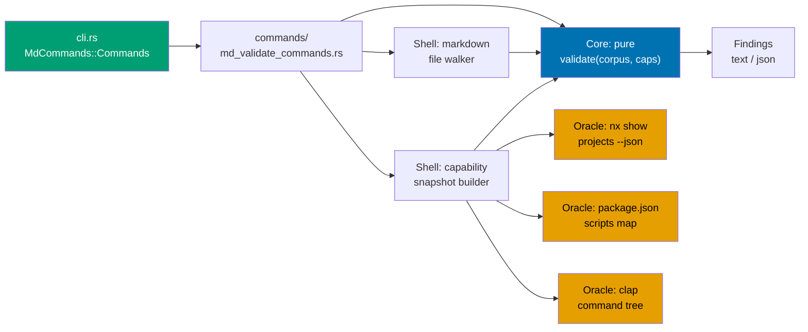
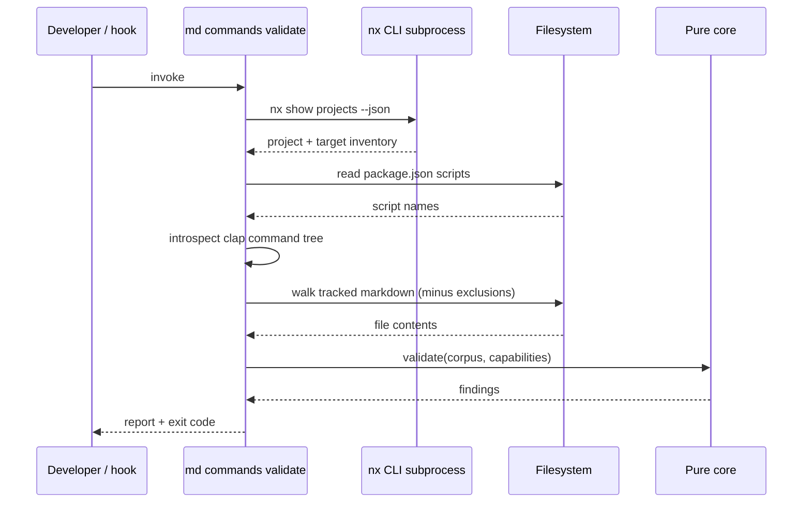
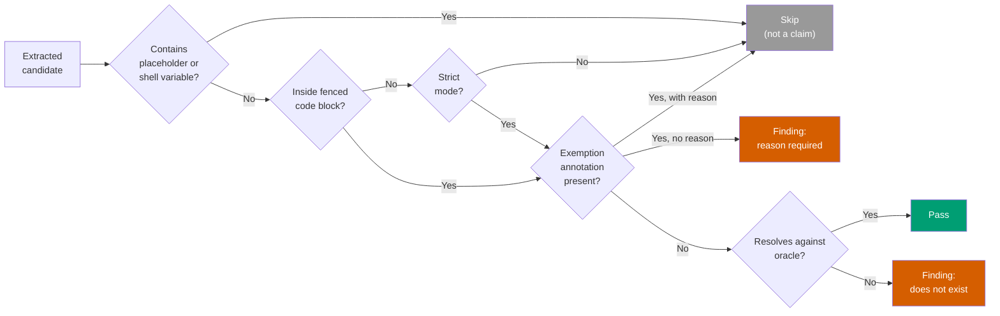
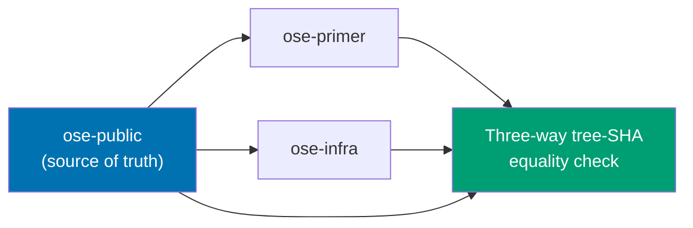
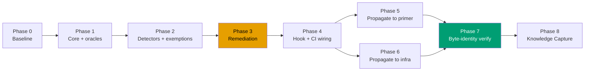

# Technical Documentation — Doc Command Existence Validation

## Architecture

The validator follows the repository's functional-core / imperative-shell pattern: a pure core
maps `(corpus, capability snapshot) -> findings`; the shell performs all I/O (filesystem walk,
Nx subprocess, `package.json` read, clap introspection).

### Component interactions



### Validation sequence



### Citation classification decision flow



### Three-repo propagation dependency



### Phase delivery flow



## Design decisions

### DD-1 — Command shape: `md commands validate`

The existing `MdCommands` enum at `apps/rhino-cli/src/cli.rs:237` is a `md <subject> <verb>`
family: `links validate`, `mermaid validate`, `heading-hierarchy validate`, `naming validate`,
`frontmatter validate`, `readme-index validate`, plus the aggregate `md audit`. [Repo-grounded]

Adding a `Commands(MdCommandsCommands)` variant slots in with zero new architectural concepts and
inherits `md audit` aggregation. The corresponding Nx target follows the `{domain}:{work}` rule
documented in `repo-governance/development/infra/nx-targets.md`: `commands:validation`.

_Rejected_: a new top-level `docs` family — it would overlap `md` in scope and split the
aggregation story for no benefit.

### DD-2 — Nx oracle: resolved graph, not `project.json`

The requirement to handle **inferred targets** rules out reading `project.json` files. Nx plugins
(`@nx/js`, `@nx/next`, Cargo/`nx-cargo` inference) synthesize targets that never appear literally
in any manifest. Reading manifests would produce false positives on exactly the targets most
likely to be cited.

The oracle is therefore a subprocess call to the Nx CLI, resolved **once per run** and held in
memory. `npx nx show projects --json` yields the project inventory; per-project target maps come
from the same resolved-graph source used by `npx nx show project <name> --json`, which is how the
21-target ground truth for `rhino-cli` was established this session. [Repo-grounded]

**Failure handling is a hard error, never a silent pass.** If the graph cannot be resolved, the
validator exits nonzero with a message naming the resolution failure. A validator that silently
passes when its oracle is unavailable is worse than no validator — it manufactures false
confidence.

**Cost justification for `pre-push`**: graph resolution is the expensive step. `pre-push` already
hosts repo-wide cross-file gates (`md links validate`, `md readme-index validate`,
`harness duplication validate`) and already invokes `npx nx affected` twice, so the Nx daemon is
warm by the time this validator runs. [Repo-grounded] `pre-commit` is the wrong home: it runs
dozens of times a day, and a subprocess-heavy Nx-graph-resolving check added to a hook that fires
that often is expected to compound existing flakiness under concurrent/parallel hook load in this
monorepo's toolchain. [Judgment call — no canonical repo doc makes a general "pre-commit is
flake-prone under parallel load" claim; this is inferred from the hook's invocation frequency, not
cited from a specific incident record]

### DD-3 — rhino-cli oracle: clap self-introspection

rhino-cli can enumerate its own command tree. Deriving the authoritative subcommand list from the
live clap `Command` structure — rather than a hardcoded list — means the oracle cannot drift from
the binary. This is the single strongest property in the design: **the one detector that is
structurally incapable of the exact defect class the validator exists to catch.**

Implementation walks `clap::Command::get_subcommands()` recursively from the root command built
by `cli.rs`, producing a set of valid subcommand chains. A dedicated Gherkin scenario asserts the
no-hardcoded-list property (adding a subcommand requires no validator edit).

### DD-4 — Precision over recall, with an opt-in escape

The default mode suppresses:

- Candidates containing `<placeholder>` angle brackets or `$VAR` / `${VAR}` shell variables.
- Candidates outside fenced code blocks (prose mentions).
- Paths in the configured exclusion list.

`--strict` removes the fenced-block restriction. It is an **audit tool, never a gate** — no hook
or CI job runs it.

The rationale is adoption economics, and it is the decision most likely to determine whether this
work has value at all: a validator that fires on a legitimate example is a validator that gets
`--no-verify`'d, then commented out, then deleted. Missing some true positives is recoverable;
losing the gate entirely is not. [Judgment call]

### DD-5 — Two-tier exemption, deliberately designed

> **Justification note**: this design originally leaned heavily on the `nx-targets.md`
> aspirational-table case. DD-6 now deletes that table's nonexistent rows outright, so that case is
> gone. The justification below stands on the remaining surfaces alone — it does not depend on
> `nx-targets.md` in any way.

**Tier 1 — inline, per-occurrence, reason mandatory:**

```markdown
<!-- doc-command-exempt: illustrative example, command intentionally fictional -->

`npx nx run <some-future-project>:some-future-target`
```

Scoped to the **next citation only**. A bare `<!-- doc-command-exempt -->` without a reason is
itself a finding — this is what keeps the escape hatch from degrading into a reflex.

Tier 1 remains necessary for surfaces the conservative-mode heuristics (DD-4) cannot classify:

- **Tutorial and how-to docs under `docs/`** that deliberately show a command the reader will
  create later in the same tutorial — the command genuinely does not exist yet, and rightly so.
- **Sibling-repo commands** cited in cross-repo governance docs (`ose-primer`, `ose-infra`), which
  cannot resolve against this repo's oracles even though the citation is correct.
- **Deliberately-wrong examples** in governance docs — this repository's conventions routinely
  show a non-conforming example next to a conforming one, and a validator cannot distinguish
  "wrong on purpose" from "wrong by accident" without an author signal.

**Tier 2 — configured path exclusions**, restricted to structurally out-of-scope trees:
`plans/done/` (historical record, deliberately frozen), `apps/rhino-cli/tests/fixtures/`
(deliberately malformed inputs), `archived/`, vendored content. Delivered via `--exclude <path>`,
matching the idiom already used by `md links validate --exclude plans/done` in `.husky/pre-push`.
[Repo-grounded]

The two tiers exist because they answer different questions. Tier 1 says _"this specific command is
intentionally unresolvable."_ Tier 2 says _"this tree is not a source of live claims."_ Collapsing
them into one mechanism would force either per-line annotation of thousands of frozen plan files,
or blanket path exclusion of live governance docs — the first is unworkable, the second is exactly
the bypass-by-default failure the design exists to prevent.

### DD-6 — `nx-targets.md` remediation: delete the nonexistent rows

> **Maintainer override (Q7)**: the recommendation was to split the table into "exists" and
> "planned". The maintainer chose outright deletion instead. This section records the decision as
> made, not as recommended.

The "Canonical governance and validation targets" table lists six targets absent from the resolved
graph. [Repo-grounded] The remediation **deletes those six rows outright**, leaving a single table
containing only targets verified to resolve. No "Planned targets" table replaces them.

Rows deleted: `specs:domain:coverage`, `links:validation`, `mermaid:validation`,
`headings:hierarchy-validation`, `cross-vendor:parity-validation`, `harness:bindings-validation`.

The principle: **a canonical reference doc asserts only what exists.** A table row is read as a
claim of present fact, not as intent — that is precisely how these six caused the motivating
incident, by being cited as runnable commands. Keeping them under any label preserves the risk that
a future reader (or agent) skims the table and treats a row as real. Roadmap intent belongs
somewhere that is not load-bearing for execution.

Rejected alternatives:

- **Split into exists/planned** (the original recommendation) — preserves intent in place, but
  leaves aspirational commands sitting in the document readers treat as authoritative.
- **Implement the six targets** — makes the doc true, but is the tail wagging the dog and a far
  larger scope than this plan.

**Intent preservation**: the six names, and the fact that none was ever implemented, are recorded
in the plan's [learnings.md](./learnings.md) so the information survives the deletion and enters
Knowledge Capture triage. If any of the six is later genuinely wanted, it enters through a plan
rather than through a doc row that quietly asserts it already exists.

### DD-7 — Shell and `make` citations deferred

Deferred to a follow-up, not because they lack value but because they are the highest-false-
positive surface: `./scripts/foo.sh` citations are frequently illustrative, cross-repo, or refer
to scripts created later in the same document. Introducing them in v1 would risk the adoption
outcome DD-4 exists to protect. Revisit once the three core detectors have production evidence.

## Implementation approach

**New files** (all `_New file_`):

- `apps/rhino-cli/src/commands/md_validate_commands.rs` — command entry point, args struct,
  shell orchestration. Sibling reference: `md_validate_links.rs` (4.0K) for the simplest shape,
  `md_validate_readme_index.rs` (6.7K) for a corpus-walking validator.
- `apps/rhino-cli/src/domain/doc_commands.rs` (or nearest existing domain module) — pure core:
  citation extraction, classification, resolution against the capability snapshot.
- `specs/apps/rhino/behavior/rhino-cli/gherkin/md/docs-validate-commands.feature` — companion
  Gherkin, matching the `docs-validate-*.feature` naming already used in that domain folder.
  [Repo-grounded]

**Modified files**:

- `apps/rhino-cli/src/cli.rs` — add `Commands(MdCommandsCommands)` variant to `MdCommands`
  (line ~237) and its dispatch arm in the router (line ~707).
- `apps/rhino-cli/src/commands.rs` — register the new module.
- `apps/rhino-cli/src/commands/md_audit.rs` — include the new validator in aggregation.
- `apps/rhino-cli/project.json` — add the `commands:validation` target.
- `.husky/pre-push` — add the invocation.
- `.github/workflows/main-ci.yml` — add a step to the `markdown-per-file` job (line ~103).
- `repo-governance/development/infra/nx-targets.md` — remediation (DD-6).
- `specs/apps/rhino/behavior/rhino-cli/gherkin/md/README.md` — index the new feature file.

## Dependencies

No new crates anticipated. Existing rhino-cli dependencies cover the need: `clap` (already
present, provides introspection), `serde_json` (already used for `-o json` across sibling
validators), and the existing markdown-walking utilities in `infrastructure/`. [Unverified — the
exact shared walker module name must be confirmed by reading `md_validate_links.rs` during
Phase 1; no new dependency is expected either way.]

## Testing strategy

| Level                                         | Coverage                                                                                                                                                                                                                                |
| --------------------------------------------- | --------------------------------------------------------------------------------------------------------------------------------------------------------------------------------------------------------------------------------------- |
| **Unit** (`test:unit`)                        | Pure-core extraction and classification: each placeholder form, fenced vs. prose, multi-line continuation, exemption parsing (with and without reason), scope of an exemption to the next citation only. Table-driven against fixtures. |
| **Integration** (`test:integration`)          | Oracle builders against the real repo: Nx graph snapshot shape, `package.json` script extraction, clap tree walk. Includes the no-hardcoded-list assertion.                                                                             |
| **Spec coverage** (`specs:behavior:coverage`) | Every Gherkin scenario in `docs-validate-commands.feature` bound to a step definition.                                                                                                                                                  |
| **End-to-end**                                | The validator run against the real repository corpus after remediation, asserted to exit 0 (the Phase 3 gate).                                                                                                                          |

Each Gherkin scenario in [prd.md](./prd.md) maps to one RED→GREEN→REFACTOR cycle in
[delivery.md](./delivery.md), per the Test-Driven Development Convention.

## Rollback

The validator is additive. Rollback is removing the `.husky/pre-push` line and the CI step; the
subcommand can remain in the binary harmlessly. The `nx-targets.md` remediation is independently
valuable and should not be rolled back even if the validator is.

## UI-design-funnel exemption

This plan is CLI/text-output only. It adds and changes no user-facing screens or components under
`apps/` (web applications) or `libs/web-ui`. The mandatory UI-design-funnel for UI-bearing plans
does not apply. Rule-15 (three-tester web retest) and Rule-16 (API exploratory retest) likewise do
not apply — there is no web UI and no REST/GraphQL surface in scope.
