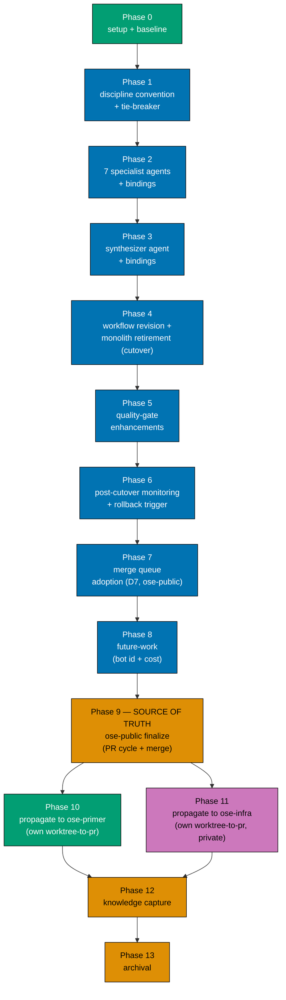

# Delivery Checklist — Worktree-to-PR Hardening

This checklist ships the decomposition of `pr-review-maker` into seven specialist reviewers plus a
mandatory `pr-review-synthesis-maker` coordinator, a reviewer-discipline convention with the boundary
tie-breaker, the workflow revision, the quality-gate enhancements, and the measurement/eval plan. It
ships **no application code** — every artifact is agent-definition markdown or governance/workflow
markdown plus register/binding updates.

> **Legend** — `[AI]`: an agent performs the step (the default; unmarked steps are `[AI]`).
> `[HUMAN]`: only a human can do it (physical action, out-of-band approval, real-secret or
> privileged-credential handling). `[AI+HUMAN]`: agent prepares, human approves or finishes.
> Git-mechanical steps (worktree create/remove, branch, commit, push, merge) are `[AI]`.
>
> **Phase Gate** — every phase ends with a `### Phase N Gate` (must-pass verification) plus a
> `> **Pause Safety**:` note (safe-to-stop state + resume command). A phase is not complete until
> every gate check is green; phase N+1 does not start while any phase N gate check is failing.

<!-- -->

> **Execution prerequisite** — the maintainer has decided **D1** (7 specialists), **D2** (retire the
> monolith at cutover), **D4** (adversarial verification on high-risk diffs only), and **D7** (adopt a
> merge queue now); this delivery.md reflects those. Still resolve the open decisions in
> [tech-docs.md §Grilling Deferred](./tech-docs.md#grilling-deferred--decisions-for-maintainer)
> before their phases: **D3** (coordinator name) + **D5** (model tiers) + **D8** (convention path)
> before Phases 2–3; **D6** (rollback bar) before Phase 6; **D10** (merge-queue mechanism —
> GitHub-native recommended) before Phase 7; **D11** (parallel-vs-sequential downstream propagation —
> parallel recommended) before Phases 10–11; **D9** (split the fixer) any time.
>
> **Three-repo parity scope** — Phases 0–9 deliver the change set in `ose-public` (the **source of
> truth**). Phases 10 (`ose-primer`) and 11 (`ose-infra`) then propagate the identical shared-scaffolding
> artifacts to the two downstream repos, **each as its own `worktree-to-pr` delivery in its own repo**,
> per the [multi-repo parity workflow](../../../repo-governance/workflows/plan/plan-multi-repo-parity-planning-and-execution.md).
> The two downstream phases are independent of each other (D11). The `## Worktree` and
> `## Delivery Mode` sections below describe the **`ose-public`** delivery; each downstream phase
> provisions its own worktree in its own repo.

## Worktree

Worktree path: `worktrees/worktree-to-pr-hardening/`

Optional manual pre-provisioning (run from repo root):

```bash
claude --worktree worktree-to-pr-hardening
```

The plan-execution Step 0 gate enters this worktree by default: it auto-provisions from the latest
`origin/main` when missing, syncs with `origin/main` before implementing, and prompts before deleting
the worktree after the plan is archived and pushed.

See [Worktree Path Convention](../../../repo-governance/conventions/structure/worktree-path.md) and
[Plans Organization Convention §Worktree Specification](../../../repo-governance/conventions/structure/plans.md#worktree-specification).

## Delivery Mode: worktree-to-pr

Work in `worktrees/worktree-to-pr-hardening/`; open a draft PR against `main`; run the
**PR-Review Maker→Fixer Cycle** (3 sequential CI-gated cycles) before an `[AI]` merge once the five
hardened merge preconditions hold. This plan dogfoods the workflow it hardens. Per the
[Git Push Default Convention](../../../repo-governance/development/workflow/git-push-default.md), the
finalization phase opens the draft PR; git-mechanical steps are `[AI]`.

## Dependency DAG



**ose-public (source of truth)**: Phases 0–8 are strictly sequential, delivered in one worktree and
one draft PR; Phase 9 runs the review cycle + merge once for that PR. Phase 7 (merge queue) carries
`[HUMAN]` steps for the GitHub settings changes an agent must not make.

**Propagation (downstream)**: Phases 10 (ose-primer) and 11 (ose-infra) both depend on Phase 9's
merge and are **independent of each other** — they may run in parallel (D11). Each is its own
`worktree-to-pr` delivery in its own repo, each with its own per-repo binding-emit and its own
`[HUMAN]` merge-queue settings toggle. Knowledge Capture (Phase 12) and Archival (Phase 13) run once,
after all three repos are done.

---

## Phase 0: Environment Setup and Baseline

> _Executor: repo-setup-manager_

- [ ] [AI] Provision the worktree from latest `origin/main`: `git worktree add worktrees/worktree-to-pr-hardening origin/main`
      — acceptance: `worktrees/worktree-to-pr-hardening/` exists and is on a fresh branch off `origin/main`
- [ ] [AI] Install dependencies in the root worktree: `npm install`
      — acceptance: exits 0, `node_modules/` synchronized
- [ ] [AI] Converge the toolchain in the root worktree: `npm run doctor -- --fix`
      — acceptance: exits 0 with no unresolved drift
- [ ] [AI] Record the markdown/binding baseline: `npx nx affected -t lint` and `npm run lint:md:fix` (dry read)
      — acceptance: baseline pass/fail recorded; any preexisting failures documented
- [ ] [AI] Confirm the binding sync baseline is clean: run `npm run generate:bindings` then `git status --porcelain`
      — acceptance: no diff (bindings already in sync before any change)
- [ ] [AI] Resolve all preexisting failures before proceeding
      — acceptance: no preexisting failures remain unresolved

### Phase 0 Gate

> All checks below must pass before starting Phase 1.

- [ ] [AI] `npm install` exited 0 and `npm run doctor -- --fix` reports no unresolved drift
- [ ] [AI] `npm run generate:bindings` produces zero diff against a clean tree (baseline sync confirmed)
- [ ] [AI] Markdown/lint baseline recorded and every preexisting failure resolved

> **Pause Safety**: only the local toolchain was verified and the baseline recorded — no plan work
> exists yet. Safe to stop indefinitely. To resume: re-run `npm run generate:bindings && git status --porcelain`
> and confirm it is still clean.

---

## Phase 1: Reviewer-Discipline Convention + Tie-Breaker

> _Suggested executor: `repo-rules-maker`_

- [ ] [AI] Create the reviewer-discipline convention (path per decision **D8**; default
      `repo-governance/development/quality/pr-review-disciplines.md`, sibling reference
      `repo-governance/development/quality/ci-blocker-resolution.md`) defining the five disciplines,
      each discipline's owned/not-owned scope, and the **boundary tie-breaker rule** (documented rule →
      governance; new tradeoff → architecture; domain-intent → correctness)
      — acceptance: file exists; `grep -c "tie-breaker" <path>` ≥ 1; the architecture↔correctness
      boundary is named as the coordinator's re-categorization responsibility
- [ ] [AI] Embed the six grey-zone rulings verbatim (four core: new cross-module dependency; naming
      format vs. should-this-boundary-exist; error-handling shape vs. domain error scenarios; spec-file
      presence vs. scenario completeness — plus the two D1-added: performance↔architecture and
      docs↔governance)
      — acceptance: all six rulings present; `grep -c "→" <path>` ≥ 6
- [ ] [AI] Document the **Cloudflare-folded cost/noise mechanics** in the convention, mirroring
      [tech-docs.md §Cost-Control & Noise-Control Mechanics](./tech-docs.md#cost-control--noise-control-mechanics-cloudflare-production-learnings--folded-2026-07-23):
      the **risk-tier fan-out** (D12: trivial/lite/full → 2/4/7 agents, security paths force full), the
      **diff-filter + generated-file exclusion list + shared-context + large-diff slicing** (D13), the
      per-specialist **`SUPPRESS` block** requirement, the **instruction-decay** governance charter
      (D14), the **human-dismissal-respect** re-review rule, and the **boundary-tag-strip**
      untrusted-input hardening
      — acceptance: `grep -cE "risk-tier|SUPPRESS|instruction-decay|generated-file" <path>` ≥ 4; the
      generated-exclusion list names `.opencode`/`.amazonq`/`generated`/lock files and states
      `.claude/agents` + `repo-governance` are never excluded
- [ ] [AI] Add the accessible Mermaid boundary-decision flowchart (color-blind palette) mirroring
      [tech-docs.md](./tech-docs.md#boundary-decision-the-tie-breaker-as-a-flowchart)
      — acceptance: `npx rhino-cli md mermaid validate <path>` (or repo md-mermaid gate) exits 0
- [ ] [AI] Cross-link the new convention from `repo-governance/development/README.md` index if the repo
      indexes conventions there (verify with `grep -rn "ci-blocker-resolution" repo-governance/development/README.md`)
      — acceptance: new convention linked, or its absence confirmed as not-indexed with a note
  - _Suggested executor: `repo-rules-maker`_

### Phase 1 Gate

> All checks below must pass before starting Phase 2.

- [ ] [AI] `npx nx affected -t lint` (or `npm run lint:md:fix` + markdownlint) passes on the new convention
- [ ] [AI] `rhino-cli md links validate` and `md mermaid validate` pass for the new file
- [ ] [AI] Commit created: `docs(governance): add PR reviewer-discipline convention + tie-breaker` and pushed to the plan branch

> **Pause Safety**: the convention is a standalone governance doc with no dangling references; the repo
> is coherent with it present. Safe to stop. To resume: re-run the md link/mermaid validators on the
> new file.

---

## Phase 2: Seven Specialist Reviewer Agents + Bindings

> _Suggested executor: `agent-maker`_ — one checkbox each for the seven agents (D1 = 7). Resolve **D5**
> (model tier) first.

- [ ] [AI] Author `.claude/agents/pr-review-architecture-maker.md` (sibling reference
      `.claude/agents/pr-review-maker.md`) with the architecture charter from
      [tech-docs.md §Agent Charters](./tech-docs.md#agent-charters-non-overlapping), inheriting the
      monolith's hard rules verbatim (confidence ≥ 80, evidence, anti-sycophancy, scope-guard,
      untrusted-input, Reviews-API `COMMENT`, cross-cycle re-review) and the model tier from D5
      — acceptance: file present; frontmatter `name: pr-review-architecture-maker`; suffix matches the
      naming regex `-(maker|checker|fixer|dev|deployer|manager|tester|researcher)$`
  - _Suggested executor: `agent-maker`_
- [ ] [AI] Author `.claude/agents/pr-review-logic-maker.md` (business-logic/correctness incl. Gherkin
      acceptance-criteria conformance), same inheritance + charter
      — acceptance: file present; charter names logic/correctness as its sole discipline; NOT-its-job
      routes to governance + architecture per the charter table
  - _Suggested executor: `agent-maker`_
- [ ] [AI] Author `.claude/agents/pr-review-governance-maker.md` (mechanical `repo-governance/`
      conformance, naming/structure, spec-file presence, **plus the instruction-decay charter (D14,
      recommended home)** — flags a framework/build-tool/CI/env change not reflected in
      `AGENTS.md`/`CLAUDE.md`/`.claude/`), same inheritance + charter
      — acceptance: file present; explicitly routes "should a new rule exist" to architecture and
      "scenario completeness" to logic; carries the instruction-decay responsibility (or D14 resolved to
      an eighth `pr-review-instruction-maker` file instead)
  - _Suggested executor: `agent-maker`_
- [ ] [AI] Author `.claude/agents/pr-review-security-maker.md` (secrets, injection, untrusted-input,
      git-fixture isolation, unsafe git/FS ops), same inheritance + charter
      — acceptance: file present; cites the git-fixture-isolation + no-secrets rules as in-charter
  - _Suggested executor: `agent-maker`_
- [ ] [AI] Author `.claude/agents/pr-review-integrity-maker.md` (CI-gaming/test-integrity +
      regression-test-mandate), same inheritance + charter
      — acceptance: file present; cites the regression-test-mandate + ci-blocker-resolution rules
  - _Suggested executor: `agent-maker`_
- [ ] [AI] Author `.claude/agents/pr-review-performance-maker.md` (concrete/likely perf regressions,
      hot paths, algorithmic complexity, resource use), same inheritance + charter
      — acceptance: file present; NOT-its-job routes a quality-attribute tradeoff to architecture per
      the charter table (performance↔architecture grey-zone)
  - _Suggested executor: `agent-maker`_
- [ ] [AI] Author `.claude/agents/pr-review-docs-maker.md` (substantive doc quality/completeness,
      README/docs/Diátaxis fit, doc drift, doc alt-text/a11y), same inheritance + charter
      — acceptance: file present; NOT-its-job routes mechanical doc-convention conformance to governance
      per the charter table (docs↔governance grey-zone)
  - _Suggested executor: `agent-maker`_
- [ ] [AI] Give every specialist file an explicit **`SUPPRESS` block** (what it must NOT raise at all —
      nitpicks, style already enforced by a mechanical gate, speculative "consider adding X" when X is
      present, defense-in-depth on adequately-defended paths), distinct from its NOT-its-job routing
      column, and inherit the two sharpened rules (re-review **does not re-raise a human-dismissed
      finding**; untrusted-input **strips user-supplied boundary tags** from PR body/comment/issue text)
      — acceptance: `grep -lc "SUPPRESS" .claude/agents/pr-review-*-maker.md` lists all seven specialist
      files; each also references the human-dismissal-respect and boundary-tag-strip rules
- [ ] [AI] Register all seven in `AGENTS.md` §AI Agents lists and `.claude/agents/README.md` catalog
      under the appropriate section
      — acceptance: `grep -c "pr-review-architecture-maker\|pr-review-logic-maker\|pr-review-governance-maker\|pr-review-security-maker\|pr-review-integrity-maker\|pr-review-performance-maker\|pr-review-docs-maker" AGENTS.md` = 7 (or all present)
- [ ] [AI] Regenerate bindings: `npm run generate:bindings`
      — acceptance: `.opencode/agents/pr-review-*-maker.md` and `.amazonq/` artifacts created; exits 0
- [ ] [AI] Verify binding sync: `git status --porcelain` shows only intended new/edited files and the
      sync-validation gate is green
      — acceptance: `npx nx run rhino-cli:instruction-size:validation` (if applicable) and the
      validate:sync check pass with zero drift

### Phase 2 Gate

> All checks below must pass before starting Phase 3.

- [ ] [AI] All seven specialist files pass the agent-naming regex and carry valid frontmatter
- [ ] [AI] `npm run generate:bindings` re-run produces zero _additional_ diff (bindings settled)
- [ ] [AI] `npx nx affected -t lint` passes; registers list all seven agents
- [ ] [AI] Commit created: `feat(agents): add seven specialist PR-review reviewer agents` and pushed

> **Pause Safety**: the seven specialists exist and are registered but are not yet wired into any
> workflow — they are inert until Phase 4 references them, and the monolith is still the live reviewer.
> The repo is coherent (agents can be invoked by name but nothing calls them). Safe to stop. To resume:
> re-run `npm run generate:bindings && git status --porcelain`.

---

## Phase 3: Coordinator / Synthesizer Agent + Bindings

> _Suggested executor: `agent-maker`_ — resolve **D3** (name; default `pr-review-synthesis-maker`),
> **D5** (coordinator inherits opus / top tier).

- [ ] [AI] Author `.claude/agents/pr-review-synthesis-maker.md` (name per D3) implementing the four
      coordination functions from [tech-docs.md §Coordinator Contract](./tech-docs.md#coordinator-contract-the-mandatory-synthesizer):
      dedup, re-categorize (owns architecture↔correctness), reasonableness-filter, tool-verify; emits
      exactly one consolidated review; top model tier justified in a Model Selection Justification block
      — acceptance: file present; frontmatter names the top tier (inherited opus); charter states it
      produces ONE consolidated review consumed by `pr-review-fixer`
  - _Suggested executor: `agent-maker`_
- [ ] [AI] Give the coordinator the folded pre/post-fan-out duties (D12/D13): **classify the PR risk-tier**
      (trivial/lite/full, security paths force full) and select the specialist set accordingly; **assemble
      the shared-context brief once** (PR metadata + linked-plan/issue + filtered diff with generated files
      excluded) rather than each specialist re-deriving it; **read prior-cycle thread resolution status**
      (including human "won't fix") before fanning out; record the tier + any diff-slicing in the
      consolidated review header
      — acceptance: charter names the risk-tier classification, the shared-context assembly, the
      generated-file exclusion, and the human-dismissal read; the review header format includes the tier
  - _Suggested executor: `agent-maker`_
- [ ] [AI] Register the coordinator in `AGENTS.md` and `.claude/agents/README.md`
      — acceptance: coordinator listed in both registers
- [ ] [AI] Regenerate + verify bindings: `npm run generate:bindings` then `git status --porcelain`
      — acceptance: OpenCode + Amazon-Q mirrors created; sync-validation green with zero drift

### Phase 3 Gate

> All checks below must pass before starting Phase 4.

- [ ] [AI] Coordinator file passes the naming regex and carries a Model Selection Justification block
- [ ] [AI] `npm run generate:bindings` re-run produces zero additional diff
- [ ] [AI] `npx nx affected -t lint` passes; registers list the coordinator
- [ ] [AI] Commit created: `feat(agents): add pr-review-synthesis-maker coordinator` and pushed

> **Pause Safety**: all eight new agents (seven specialists + coordinator) exist and are registered but
> still unwired — the live review gate remains the untouched monolith. Safe to stop. To resume: re-run
> the binding sync check.

---

## Phase 4: Workflow Revision + Monolith Retirement (Cutover)

> _Suggested executor: `repo-workflow-maker`_ — this is the **cutover** phase: the seven specialists +
> coordinator become the live reviewer and the monolith is **retired immediately** (D2), in one
> coherent phase.

- [ ] [AI] Revise `repo-governance/workflows/pr/pr-review-quality-gate.md`: replace the single-maker
      per-cycle pass with **fan-out to the seven specialists → `pr-review-synthesis-maker` → one
      consolidated review → `pr-review-fixer`**; keep the 3-cycle hard ceiling, no-early-exit, and the
      CI-green gate between cycles verbatim
      — acceptance: `grep -c "pr-review-synthesis-maker" pr-review-quality-gate.md` ≥ 1; the Loop
      Algorithm block shows fan-out→synthesize→fixer; the "3, hard ceiling" wording is unchanged
- [ ] [AI] Update the Participants + sequence diagram in that workflow to show the seven specialists +
      coordinator (accessible Mermaid palette)
      — acceptance: `rhino-cli md mermaid validate` passes; diagram lists all eight agents
- [ ] [AI] Update `repo-governance/development/workflow/pr-merge-protocol.md` **only** where it
      describes the reviewer count/shape; the five hardened preconditions (a)-(e) stay byte-identical
      (precondition (c)'s merge-queue rewording happens in Phase 7, not here)
      — acceptance: `grep -c "all five" pr-merge-protocol.md` unchanged; precondition lettering (a)-(e)
      intact (`grep -c "\*\*(a)\*\*\|\*\*(b)\*\*\|\*\*(c)\*\*\|\*\*(d)\*\*\|\*\*(e)\*\*" pr-merge-protocol.md` unchanged)
- [ ] [AI] **Retire the monolith (D2)**: `git rm .claude/agents/pr-review-maker.md` and delete its
      entries from `AGENTS.md` §AI Agents lists and `.claude/agents/README.md` catalog
      — acceptance: `test ! -f .claude/agents/pr-review-maker.md`; `grep -c "pr-review-maker\b" AGENTS.md`
      returns only the specialist/coordinator names, not the bare `pr-review-maker` monolith
- [ ] [AI] Regenerate bindings so the monolith's mirrors are also removed: `npm run generate:bindings`
      — acceptance: `test ! -f .opencode/agents/pr-review-maker.md`; `git status --porcelain` shows the
      deletion and zero unexpected drift
- [ ] [AI] Grep the repo for any dangling reference to the retired monolith and repoint it to the
      synthesizer or the specialist set: `grep -rn "pr-review-maker" repo-governance/ .claude/ AGENTS.md`
      — acceptance: no reference points to the monolith as a live reviewer (workflow/name references now
      read `pr-review-synthesis-maker` + the specialists)
- [ ] [AI] Cross-check every inbound reference to the workflow still resolves:
      `rhino-cli md links validate repo-governance/workflows/pr/pr-review-quality-gate.md`
      — acceptance: exits 0, no broken links

### Phase 4 Gate

> All checks below must pass before starting Phase 5.

- [ ] [AI] The workflow describes fan-out→synthesize→fixer and preserves the 3-cycle ceiling + CI gate
- [ ] [AI] `pr-merge-protocol.md` preconditions (a)-(e) are byte-identical to before this phase
- [ ] [AI] The monolith is gone: `test ! -f .claude/agents/pr-review-maker.md` and no register or
      binding lists it; `npm run generate:bindings` produces zero additional diff
- [ ] [AI] `rhino-cli md links validate` + `md mermaid validate` pass on all edited docs; no dangling
      `pr-review-maker` reference remains
- [ ] [AI] Commit created: `refactor(workflow): cut over PR review to specialists + synthesizer, retire monolith` and pushed

> **Pause Safety**: cutover is complete and self-consistent — the seven specialists + coordinator are
> the documented live reviewer, the monolith is deleted (recoverable from git history), and no dangling
> reference remains. Safe to stop. To resume: re-run `npm run generate:bindings && git status --porcelain`
> and the md link validators.

---

## Phase 5: Quality-Gate Enhancements

> _Suggested executor: `repo-rules-maker`_

- [ ] [AI] Add the **confidence-calibration spot-check** procedure to the reviewer-discipline
      convention (sample past findings, compare stated confidence vs. fixer triage outcome, recalibrate
      the ≥80 threshold)
      — acceptance: `grep -ci "calibration" <convention>` ≥ 1; procedure is a documented manual step
- [ ] [AI] Add the **selective adversarial verification** rule scoped to high-risk diffs per **D4**
      (auth/payments/migrations/security/public-API), including the cross-model-diversity note
      — acceptance: `grep -ci "adversarial\|high-risk" <convention>` ≥ 1; scope stated explicitly
- [ ] [AI] Add the **CRITICAL-requires-reproduction** rule (CRITICAL findings carry a reproduction, not
      agreement-counting)
      — acceptance: `grep -ci "reproduction" <convention>` ≥ 1
- [ ] [AI] Document the **3-cycle / no-early-exit rationale** explicitly as a predictability policy
      choice, NOT research-derived
      — acceptance: `grep -ci "predictability" <convention>` ≥ 1; the note disclaims research-backing

### Phase 5 Gate

> All checks below must pass before starting Phase 6.

- [ ] [AI] All four enhancements present in the convention and internally cross-linked
- [ ] [AI] `npx nx affected -t lint` + `rhino-cli md links validate` pass
- [ ] [AI] Commit created: `docs(governance): add PR-review quality-gate enhancements` and pushed

> **Pause Safety**: the enhancements are additive documentation; nothing depends on them being wired
> to code. Safe to stop. To resume: re-run the md link validator on the convention.

---

## Phase 6: Post-Cutover Monitoring Plan + Rollback Trigger

> _Suggested executor: `repo-rules-maker`_ — resolve **D6** (rollback bar). The monolith was already
> retired at cutover (Phase 4); this phase documents how the split is watched afterward and when to
> roll back.

- [ ] [AI] Author the post-cutover monitoring section in the convention: precision, per-discipline
      acceptance rate (watching the two added lenses `performance`/`docs` and the catch-all
      `governance`/`logic`), BitsAI-CR "Outdated Rate", cost/latency per review **tracked per risk-tier**
      (D12 — a flat cost across tiers means the tiering is not taking effect), and the **human-override
      rate** (Cloudflare's break-glass trust proxy, an early trust-erosion signal)
      — acceptance: `grep -ci "Outdated Rate\|acceptance rate\|precision\|override rate\|risk-tier" <convention>` ≥ 2; the section
      is framed as post-cutover monitoring, not a pre-cutover gate
- [ ] [AI] Document the **rollback trigger** (per D6): the rollback bar, the monitoring window, and the
      exact restore procedure (`git revert`/`git checkout` of the deleted `pr-review-maker.md` + register
      entries, then `npm run generate:bindings`)
      — acceptance: `grep -ci "rollback" <convention>` ≥ 1; the restore procedure is a non-destructive
      forward operation (no history rewrite); the bar (D6) is recorded in the convention and `learnings.md`

### Phase 6 Gate

> All checks below must pass before starting Phase 7.

- [ ] [AI] The monitoring plan defines the metric families and is framed as post-cutover (not a gate)
- [ ] [AI] The rollback trigger, bar, and non-destructive restore procedure are documented
- [ ] [AI] `npx nx affected -t lint` + `rhino-cli md links validate` pass
- [ ] [AI] Commit created: `docs(governance): add PR-review post-cutover monitoring + rollback trigger` and pushed

> **Pause Safety**: the monitoring plan and rollback path are documented; the split is the live reviewer
> and the monolith stays recoverable from git history. Safe to stop. To resume: re-run the md link
> validator on the convention.

---

## Phase 7: Merge-Queue Adoption (D7)

> _Suggested executor: `repo-rules-maker`_ (docs/YAML) — resolve **D10** (mechanism; GitHub-native
> recommended) first. This phase **carries `[HUMAN]` steps**: enabling a merge queue changes GitHub
> repository settings, which an agent must not do. See
> [tech-docs.md §Merge-Queue Design](./tech-docs.md#merge-queue-design-delivered--d7).

- [ ] [AI] Document the chosen mechanism (per D10; default GitHub-native) in the reviewer-discipline
      convention (or a dedicated `repo-governance/development/workflow/` doc), including how it satisfies
      precondition (c) under concurrent worktree-to-PR integration
      — acceptance: `grep -ci "merge queue\|merge_group" <doc>` ≥ 1; the doc names the mechanism and ties
      it to precondition (c)
- [ ] [AI] Reword `repo-governance/development/workflow/pr-merge-protocol.md` precondition **(c)** so
      "up-to-date with `origin/main`" is satisfied by the merge queue's speculative merge; keep the
      (a)-(e) lettering and the other four preconditions byte-identical
      — acceptance: precondition (c) text references the queue; `grep -c "\*\*(a)\*\*\|\*\*(b)\*\*\|\*\*(c)\*\*\|\*\*(d)\*\*\|\*\*(e)\*\*" pr-merge-protocol.md` unchanged
- [ ] [AI] Add/adjust the CI workflow config under `.github/workflows/` to handle the `merge_group`
      trigger event (verify the exact workflow file first: `grep -rln "on:" .github/workflows/`)
      — acceptance: a workflow lists `merge_group` under its `on:` triggers; `actionlint` passes
  - _Suggested executor: `ci-fixer`_
- [ ] [AI] Prepare the exact GitHub settings to toggle (queue enablement, required checks, FIFO/
      auto-eviction options) and write them into the doc as a `[HUMAN]` runbook
      — acceptance: the runbook lists each setting and its target value
- [ ] [HUMAN] Enable the merge queue in GitHub repository settings (branch-protection → merge queue) per
      the runbook — an agent must not change repo security/settings
      — handoff: the agent surfaces the runbook and stops; **resume signal**: the human confirms
      "merge queue enabled" and the queue appears active in repo settings, after which the agent continues
- [ ] [AI] Verify the queue is live by reading repo state: `gh api repos/{owner}/{repo}/rulesets` (or
      `gh api repos/{owner}/{repo}/branches/main/protection`) and confirm the merge-queue rule is present
      — acceptance: the API response shows the merge queue enabled on `main`

### Phase 7 Gate

> All checks below must pass before starting Phase 8.

- [ ] [AI] Precondition (c) reworded to the queue; (a)-(e) lettering intact
- [ ] [AI] A `.github/workflows/` workflow handles `merge_group`; `actionlint` passes
- [ ] [AI] Merge queue confirmed enabled on `main` — the agent verifies the `[HUMAN]` enablement landed
      by reading repo state via `gh api` (the step above); the toggle itself was the human's `[HUMAN]` step
- [ ] [AI] Commit created: `feat(ci): adopt merge queue to harden merge-precondition (c)` and pushed

> **Pause Safety**: the merge-queue docs + CI trigger are committed and the queue is enabled in
> settings; concurrent integration is now queue-serialized. If the `[HUMAN]` enable step has not yet
> happened, the repo is still coherent (the CI workflow accepts `merge_group` but no queue routes to it
> yet). Safe to stop. To resume: re-check `gh api .../branches/main/protection` for the queue rule.

---

## Phase 8: Future-Work Workstream

> _Suggested executor: `repo-rules-maker`_

- [ ] [AI] Cross-reference the existing bot-identity two-pager
      [`plans/ideas/pr-review-bot-identity.md`](../../ideas/pr-review-bot-identity.md) as the owner of
      the AI-attribution / `REQUEST_CHANGES` gap
      — acceptance: `test -f plans/ideas/pr-review-bot-identity.md` passes and the future-work section links it
- [ ] [AI] Add the **cost/latency budgeting** note (≈$1 × 7 specialists × 3 cycles; monitor per-PR
      review cost) referencing the Cloudflare median
      — acceptance: `grep -ci "cost\|budget" <future-work section>` ≥ 1

### Phase 8 Gate

> All checks below must pass before starting Phase 9.

- [ ] [AI] Future-work section covers the bot-identity cross-ref and cost budgeting (merge-queue is now
      delivered in Phase 7, not future work)
- [ ] [AI] `rhino-cli md links validate` passes (bot-identity link resolves); `npx nx affected -t lint` passes
- [ ] [AI] Commit created: `docs(governance): add worktree-to-PR future-work workstream` and pushed

> **Pause Safety**: all substantive content is authored and committed to the plan branch; the draft PR
> (if already open) reflects the full change set. Safe to stop. To resume: re-run the md link validator
> across the plan's edited docs.

---

## Phase 9: ose-public Finalization — Source of Truth (PR-Review Cycle + Merge)

> This is the **blocking source-of-truth node**: the two downstream propagation phases (10 & 11)
> cannot start until this PR merges to `ose-public` `main`. See
> [tech-docs.md §Repo Scope & Propagation](./tech-docs.md#repo-scope--propagation-three-repo-parity).

### Local Quality Gates (Before Push)

- [ ] [AI] Run affected typecheck: `npx nx affected -t typecheck` — exits 0
- [ ] [AI] Run affected linting: `npx nx affected -t lint` — exits 0
- [ ] [AI] Run affected quick tests: `npx nx affected -t test:quick` — exits 0
- [ ] [AI] Run affected spec coverage: `npx nx affected -t specs:coverage` — exits 0 (docs/agents plan;
      confirm no `specs/` regression)
- [ ] [AI] Run the full markdown gate: `npm run lint:md:fix` then markdownlint — zero violations
- [ ] [AI] Fix ALL failures — including preexisting issues not caused by this plan — then re-run to confirm

> **Important**: Fix ALL failures found during quality gates, not just those caused by your changes.
> This follows the root cause orientation principle — proactively fix preexisting errors encountered
> during work. Commit preexisting fixes separately with appropriate conventional commit messages.

### Commit Guidelines

- [ ] [AI] Commit changes thematically (convention doc, specialist agents, coordinator, workflow
      cutover + monolith retirement, enhancements, monitoring/rollback, merge queue, future-work as
      separate cohesive commits)
- [ ] [AI] Follow Conventional Commits `<type>(<scope>): <description>`
- [ ] [AI] Keep any preexisting fixes in their own commits, separate from plan work

### Open Draft PR + Post-Push CI Verification

- [ ] [AI] Open a draft PR against `main`: `gh pr create --draft --base main`
      — acceptance: draft PR exists; its diff carries all eight new agents, the monolith deletion, and
      the governance/workflow/CI edits
- [ ] [AI] Monitor ALL GitHub Actions workflows on the PR (poll every 2 min per `ci-monitoring`)
      — acceptance: all CI checks green; no exceptions
- [ ] [AI] If any CI check fails, fix at root cause and push a follow-up commit; repeat until green

### PR-Review Maker→Fixer Cycle (mandatory for `worktree-to-pr`)

> Runs the [PR Review Quality Gate workflow](../../../repo-governance/workflows/pr/pr-review-quality-gate.md)
> — 3 strictly sequential cycles, each CI-gated. **Because the monolith was retired at cutover (Phase 4),
> this plan's own PR is reviewed by the NEW pipeline** — the seven specialists fan out to
> `pr-review-synthesis-maker`, which posts the consolidated review that `pr-review-fixer` consumes. This
> is the plan dogfooding its own reviewer redesign; record the dogfooding observation in `learnings.md`.

- [ ] [AI] Cycle 1: run the reviewer (per the live workflow) → `pr-review-fixer` triages, fixes,
      pushes, resolves → wait for CI green — acceptance: cycle 1 complete, CI green
- [ ] [AI] Cycle 2: fresh reviewer pass (fed prior findings) → fixer → CI green — acceptance: cycle 2 complete
- [ ] [AI] Cycle 3: fresh reviewer pass → fixer → CI green — acceptance: cycle 3 complete, no early exit
- [ ] [AI] Flip the PR to ready: `gh pr ready` once the done-definition holds — acceptance: PR is ready-for-review

### Merge (once the five hardened preconditions hold)

- [ ] [AI] Verify the five hardened merge preconditions (a)-(e) per
      [pr-merge-protocol.md](../../../repo-governance/development/workflow/pr-merge-protocol.md): (a)
      3 cycles complete + not escalated; (b) 0 CRITICAL + 0 HIGH; (c) branch non-destructively up to
      date with `origin/main`; (d) all gates green; (e) tester gates run or no-reachable-behavior
      exemption recorded (this plan changes no reachable behavior — record the docs/agents exemption
      explicitly) — acceptance: all five hold and are surfaced in the merge summary
- [ ] [AI] Merge the PR through the merge queue adopted in Phase 7 (`[AI]` is the default actor once
      preconditions hold; precondition (c) is now satisfied by the queue's speculative merge)
      — acceptance: PR enters the queue, its speculative CI is green, and it merges to `main`; branch integrated

### Phase 9 Gate

> All checks below must pass before starting the propagation phases (10 & 11).

- [ ] [AI] Draft PR opened, CI green, 3 review cycles complete with no `escalated` exit
- [ ] [AI] Five merge preconditions (a)-(e) verified and surfaced; the (e) docs/agents exemption recorded
- [ ] [AI] PR merged to `ose-public` `main` via the merge queue (or a `[HUMAN]` merge gate reached only
      if the plan later opts in — this plan does not)

> **Pause Safety**: the source-of-truth change set is either fully merged to `ose-public` `main` or
> sitting green-and-ready on the draft PR. Safe to stop between cycles (the loop is CI-gated) and safe
> to stop indefinitely after merge — the two downstream propagation phases are independent follow-on
> deliveries. To resume: re-check `gh pr checks <PR>`, or (post-merge) start Phase 10 and/or Phase 11.

---

## Phase 10: Propagate to ose-primer (own worktree-to-pr)

> _Suggested executor: `repo-harness-compatibility-maker`_ (parity propagation). Depends on Phase 9
> merge; **independent of Phase 11** — may run in parallel (D11). This is a **separate `worktree-to-pr`
> delivery in the `ose-primer` repo** (its own worktree, PR, review cycle, and merge), following the
> [multi-repo parity planning-and-execution workflow](../../../repo-governance/workflows/plan/plan-multi-repo-parity-planning-and-execution.md).
> **Re-verify the bare-repo topology at execution time** — `ose-primer` is a BARE repo with worktrees;
> use the bare-repo git method (`-c core.bare=false --work-tree=…`, or `GIT_DIR`/`GIT_WORK_TREE` for
> rhino-cli/bindings). See [tech-docs.md §Bare-repo topology caveat](./tech-docs.md#bare-repo-topology-caveat-re-verify-at-execution-time).

- [ ] [AI] Re-verify `ose-primer`'s topology before any git op: confirm bare-vs-normal
      (`git -C <ose-primer> rev-parse --is-bare-repository`) and locate the worktrees root
      — acceptance: topology confirmed and the correct git-invocation method selected
- [ ] [AI] Provision a worktree from the latest `origin/main` of `ose-primer` and initialize the
      toolchain: `npm install` then `npm run doctor -- --fix`
      — acceptance: both exit 0; `node_modules/` synchronized
- [ ] [AI] Port the identical artifacts landed in `ose-public` Phase 9 (the reviewer-discipline
      convention, the seven specialist agents, `pr-review-synthesis-maker`, the `pr-review-quality-gate`
      workflow revision + monolith retirement, the `pr-merge-protocol.md` precondition-(c) edit, the
      quality-gate enhancements, the monitoring/rollback doc, and the merge-queue docs/CI) into
      `ose-primer` — acceptance: the diff matches `ose-public`'s agent/governance/workflow change set
      (no rhino-cli files touched — see the byte-identity note)
- [ ] [AI] Regenerate the platform bindings **in `ose-primer`**: `npm run generate:bindings`
      — acceptance: `.opencode/` and `.amazonq/` mirrors updated; sync-validation gate passes
- [ ] [AI] Configure the merge queue's CI trigger (`merge_group`) in `ose-primer`'s `.github/workflows/`
      and write the per-repo `[HUMAN]` settings runbook
      — acceptance: a workflow lists `merge_group`; `actionlint` passes; runbook present
- [ ] [HUMAN] Enable the merge queue in `ose-primer` GitHub repository settings per the runbook — an
      agent must not change repo settings
      — handoff: the agent surfaces the runbook and stops; **resume signal**: the human confirms
      "ose-primer merge queue enabled", after which the agent verifies via `gh api` and continues
- [ ] [AI] Run local quality gates in the `ose-primer` worktree (`npx nx affected -t typecheck lint
test:quick specs:coverage` + markdown gate), open a draft PR, run the PR-Review Maker→Fixer Cycle
      (3 cycles), and merge once the five preconditions hold
      — acceptance: `ose-primer` PR merged to its `main`; CI green

### Phase 10 Gate

> All checks below must pass before this propagation node is considered done.

- [ ] [AI] `ose-primer` carries the identical agent/governance/workflow change set as `ose-public`
      (no rhino-cli byte-identity boundary crossed)
- [ ] [AI] `ose-primer` bindings regenerated and sync-validation green; merge queue confirmed enabled
      via `gh api`
- [ ] [AI] `ose-primer` PR merged to its `main`; CI green

> **Pause Safety**: `ose-primer` is either fully propagated-and-merged or green-and-ready on its own
> draft PR; `ose-public` (source of truth) is already merged and unaffected. Safe to stop. To resume:
> re-check the `ose-primer` PR state or restart from topology re-verification.

---

## Phase 11: Propagate to ose-infra (own worktree-to-pr, private)

> _Suggested executor: `repo-harness-compatibility-maker`_ (parity propagation). Depends on Phase 9
> merge; **independent of Phase 10** — may run in parallel (D11). This is a **separate `worktree-to-pr`
> delivery in the private `ose-infra` repo** (its own worktree, PR, review cycle, and merge). `ose-infra`
> does **not** participate in the content-parity loop for infra-private material, but it **does** carry
> the same `.claude/agents/`, `repo-governance/`, and binding scaffolding this plan changes, so it
> receives the identical PR-review agent/governance/workflow artifacts. **Re-verify the bare-repo
> topology at execution time** — `ose-infra` is a BARE repo with worktrees; use the bare-repo git method.
> See [tech-docs.md §Bare-repo topology caveat](./tech-docs.md#bare-repo-topology-caveat-re-verify-at-execution-time).

- [ ] [AI] Re-verify `ose-infra`'s topology before any git op: confirm bare-vs-normal
      (`git -C <ose-infra> rev-parse --is-bare-repository`) and locate the worktrees root
      — acceptance: topology confirmed and the correct git-invocation method selected
- [ ] [AI] Provision a worktree from the latest `origin/main` of `ose-infra` and initialize the
      toolchain: `npm install` then `npm run doctor -- --fix`
      — acceptance: both exit 0; `node_modules/` synchronized
- [ ] [AI] Port the identical shared-scaffolding artifacts landed in `ose-public` Phase 9 into
      `ose-infra`; keep all infra-private content (Terraform, k3s, Proxmox, real hostnames) untouched and
      never cross-route it — acceptance: the diff matches `ose-public`'s agent/governance/workflow change
      set; no infra-private material altered; no rhino-cli files touched
- [ ] [AI] Regenerate the platform bindings **in `ose-infra`**: `npm run generate:bindings`
      — acceptance: `.opencode/` and `.amazonq/` mirrors updated; sync-validation gate passes
- [ ] [AI] Configure the merge queue's CI trigger (`merge_group`) in `ose-infra`'s `.github/workflows/`
      and write the per-repo `[HUMAN]` settings runbook (note: `ose-infra` is a **private** repo — merge
      queue availability follows its plan/settings) — acceptance: a workflow lists `merge_group`;
      `actionlint` passes; runbook present
- [ ] [HUMAN] Enable the merge queue in `ose-infra` GitHub repository settings per the runbook — an
      agent must not change repo settings
      — handoff: the agent surfaces the runbook and stops; **resume signal**: the human confirms
      "ose-infra merge queue enabled", after which the agent verifies via `gh api` and continues
- [ ] [AI] Run local quality gates in the `ose-infra` worktree, open a draft PR, run the PR-Review
      Maker→Fixer Cycle (3 cycles), and merge once the five preconditions hold
      — acceptance: `ose-infra` PR merged to its `main`; CI green

### Phase 11 Gate

> All checks below must pass before this propagation node is considered done.

- [ ] [AI] `ose-infra` carries the identical agent/governance/workflow change set as `ose-public`
      (no rhino-cli byte-identity boundary crossed; no infra-private content altered)
- [ ] [AI] `ose-infra` bindings regenerated and sync-validation green; merge queue confirmed enabled
      via `gh api`
- [ ] [AI] `ose-infra` PR merged to its `main`; CI green

> **Pause Safety**: `ose-infra` is either fully propagated-and-merged or green-and-ready on its own
> draft PR; `ose-public` and `ose-primer` are unaffected. Safe to stop. To resume: re-check the
> `ose-infra` PR state or restart from topology re-verification.

---

## Phase 12: Knowledge Capture

> _Triage every surviving `learnings.md` entry before archival. See the
> [Knowledge Capture Convention](../../../repo-governance/development/quality/knowledge-capture.md)._

- [ ] [AI] Apply the litmus test to every `learnings.md` entry — keep only if a durable surface would
      catch this automatically next time; discard the rest with a one-line reason
      — acceptance: every entry has either a route or a discard reason
- [ ] [AI] Apply the **secret/sensitivity gate** to every surviving entry — sanitize any secret/token/
      private hostname to a `<placeholder>`, or discard if unsanitizable
      — acceptance: `learnings.md` contains no raw secret
- [ ] [AI] Apply the **repo-relevance gate** — infra-private content stays in `ose-infra` only; public
      governance content may propagate via the parity loop; never cross-route private content here
      — acceptance: no infra-private content in routed output
- [ ] [AI] Route each surviving learning to exactly one durable home per the open-ended routing matrix —
      non-code homes may land inline (small) or as a `plans/backlog/` follow-up (large); code homes
      (`apps/`, `libs/`, tests) are ALWAYS a separate `plans/backlog/<slug>/` plan, NEVER inline
      — acceptance: every entry records its terminal routing state
- [ ] [AI] If no generalizable learning surfaced, record the explicit escape in `learnings.md`:
      `No generalizable learnings — <one-line reason>` — acceptance: `learnings.md` is never silently empty

### Phase 12 Gate

> All checks below must pass before Plan Archival.

- [ ] [AI] Every `learnings.md` entry is terminal (routed inline, filed as backlog, or discarded), or
      the explicit "none" escape is present
- [ ] [AI] No code-homed learning landed inline in this plan's own commits/PR

> **Pause Safety**: `learnings.md` is fully triaged (or explicitly recorded empty); no future process
> depends on querying it. Safe to stop. To resume: re-read `learnings.md` and confirm every entry is
> terminal.

---

## Phase 13: Plan Archival

- [ ] [AI] Verify ALL delivery checklist items are ticked
- [ ] [AI] Verify all three repos delivered: `ose-public` (Phase 9), `ose-primer` (Phase 10), and
      `ose-infra` (Phase 11) each merged the identical change set to their respective `main`
- [ ] [AI] Verify the Knowledge Capture phase is complete (every `learnings.md` entry terminal or the
      explicit "none" escape present; both safety gates applied)
- [ ] [AI] Verify ALL quality gates pass (local + CI) and the PR merged
- [ ] [AI] Move and date-stamp: `git mv plans/in-progress/worktree-to-pr-hardening plans/done/YYYY-MM-DD__worktree-to-pr-hardening`
      using today's date as the completion date
      — acceptance: folder relocated under `plans/done/` with a date prefix
- [ ] [AI] Update `plans/backlog/README.md` (remove the entry if it was listed there) and, if the plan
      passed through `in-progress`, `plans/in-progress/README.md`
- [ ] [AI] Update `plans/done/README.md` — add the plan entry with completion date
- [ ] [AI] Update any other READMEs referencing this plan
- [ ] [AI] Commit the archival: `chore(plans): move worktree-to-pr-hardening to done`

> **Note**: This plan starts in `plans/backlog/`. When work begins it moves to `plans/in-progress/`
> (pure move, no date prefix) per the [Plans Organization Convention](../../../repo-governance/conventions/structure/plans.md);
> the date prefix is added only at this archival step.
