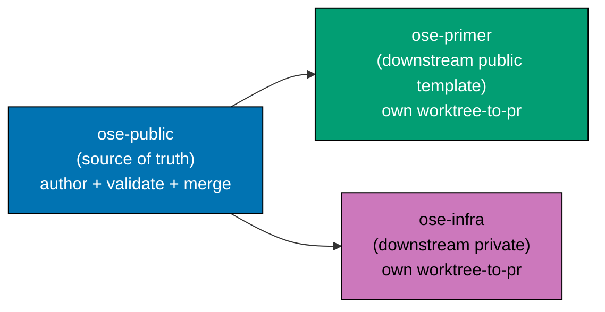
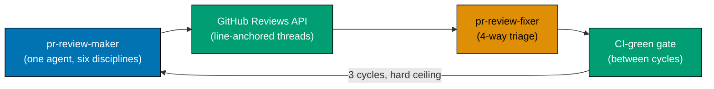
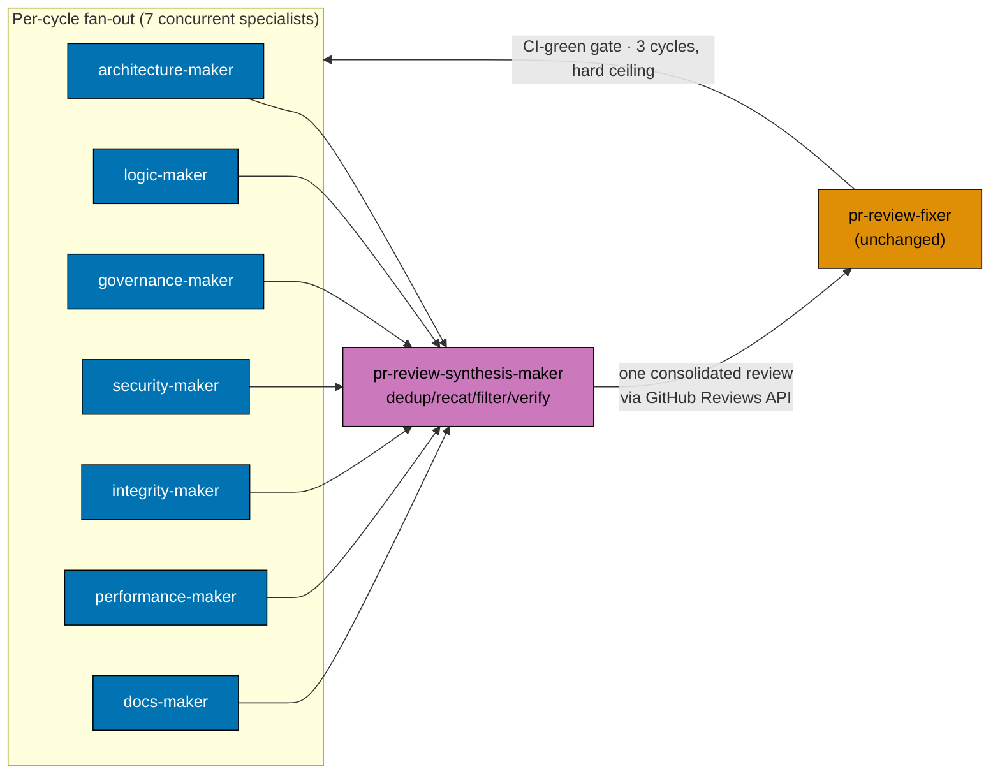
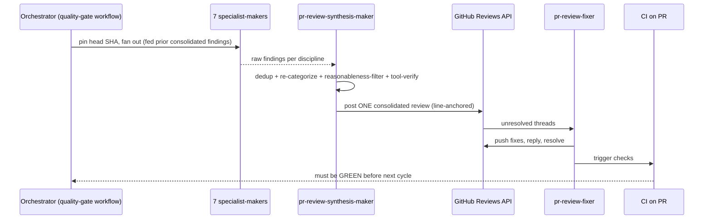
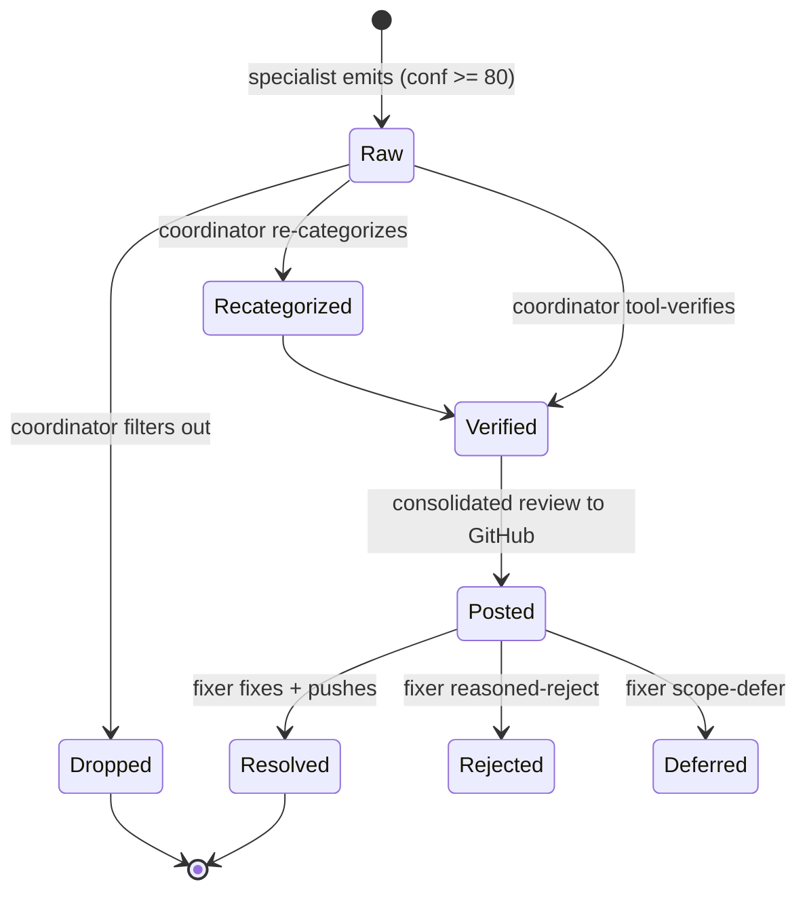
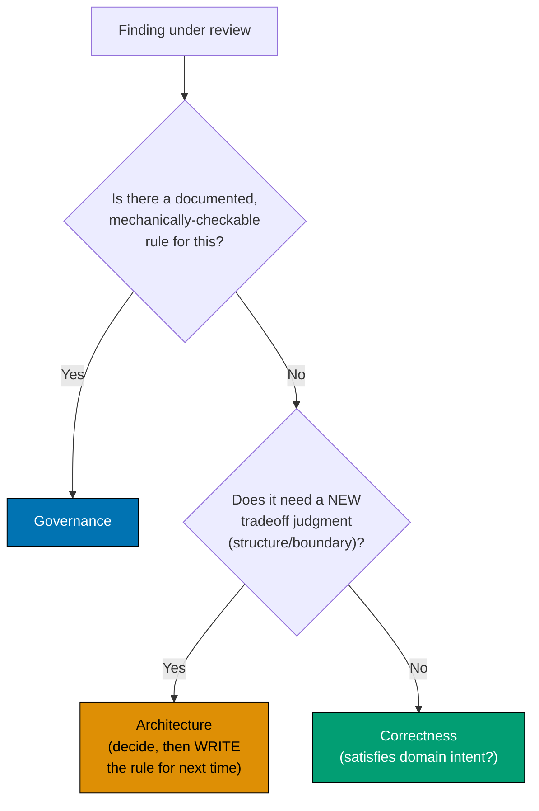

# Technical Design — Worktree-to-PR Hardening

## Exemptions (state up front)

- **Specs/Gherkin mandate — EXEMPT.** This plan changes no observable behavior under `apps/`,
  `libs/`, or `specs/`. It ships agent-definition markdown and governance/workflow markdown, which are
  docs-class changes; the [Feature Change Completeness Convention](../../../repo-governance/development/quality/feature-change-completeness.md)
  exempts pure docs/governance changes. The plan's own Gherkin (in [prd.md](./prd.md)) is
  plan-acceptance criteria, not app/lib behavior specs, and does not require `specs/` step definitions.
- **UI-design-funnel — EXEMPT.** No user-facing screen or component under `apps/` or `libs/` is added
  or changed. Not a UI-bearing plan.
- **Syllabus record — EXEMPT.** No course/tutorial/curriculum corpus is authored or restructured. Not
  a learning-bearing plan.

## Repo Scope & Propagation (three-repo parity)

Every artifact this plan produces is **shared scaffolding** held in parity across the three sibling
repos [Repo-grounded — AGENTS.md §Related Repositories]: `ose-public` (source of truth),
`ose-primer` (downstream public template), and `ose-infra` (private infrastructure). `ose-public` is
authored and validated first; the identical artifacts then propagate to the two downstream repos, each
via its own `worktree-to-pr` delivery (own worktree + PR + review cycle + merge), following the
[multi-repo parity planning-and-execution workflow](../../../repo-governance/workflows/plan/plan-multi-repo-parity-planning-and-execution.md)
and its planning companion
[plan-multi-repo-parity-planning.md](../../../repo-governance/workflows/plan/plan-multi-repo-parity-planning.md).

Each downstream repo runs its own per-repo binding-emit (`npm run generate:bindings`, or the repo's
equivalent binding-emit command) so its OpenCode/Amazon-Q mirrors regenerate from the propagated
`.claude/agents/` source. The two downstream propagations are independent of each other and may run in
**parallel** once `ose-public` merges (sub-decision D11).

### Bare-repo topology caveat (re-verify at execution time)

At the time of writing, **`ose-primer` and `ose-infra` are BARE repositories with worktrees** — only
`ose-public` has a normal working tree [Repo-grounded — matches the repo's own operational notes]. This
topology **changes over time and MUST be re-verified at execution time** (do not hard-code it). When it
holds, git operations in those two repos use the **bare-repo method** — explicit work-tree / `GIT_DIR`
handling (e.g. `git -c core.bare=false --work-tree=<wt> …`, or `GIT_DIR` / `GIT_WORK_TREE` env for
tooling) — rather than a plain checkout. Treat this as an execution-note/risk, not an assumption baked
into the steps: Phase 8/9 begin by re-verifying each downstream repo's topology and selecting the
matching git method.

### rhino-cli byte-identity note

This plan touches **no `apps/rhino-cli` code and none of its specs** — it changes only
`.claude/agents/`, `repo-governance/` docs, and (in the merge-queue phase) `.github/workflows/` CI
config. Therefore the [SDLC Gate Standard's rhino-cli byte-identity boundary](../../../docs/reference/sdlc-gate-standard.md#rhino-cli-byte-identity-boundary)
is **not engaged by this plan's artifacts**, and the three-repo parity check is scoped to the
governance/agent/CI scaffolding only. Stated explicitly so the parity check is scoped correctly: if a
later revision were to extend a `rhino-cli` governance validator or binding emitter, that change WOULD
fall under the byte-identity boundary and must stay byte-identical across all three repos — but nothing
in the current scope does.

## Architecture Overview

### Current state (monolith)

### Target state (specialists + mandatory coordinator)

### Per-cycle sequence

### Finding lifecycle (per finding, inside one cycle)

### Boundary decision (the tie-breaker as a flowchart)

## Agent Charters (non-overlapping)

Every specialist **inherits** the retired monolith's hard rules verbatim: numeric confidence 0–100
with findings below 80 hard-dropped; CRITICAL/HIGH/MEDIUM/LOW severity; every finding line-anchored
with `file:line` + a link to the specific `repo-governance/` rule where the finding cites one;
anti-sycophantic framing; scope-guard (only the PR's own declared plan/issue scope); untrusted-input
/ prompt-injection filtering of PR body/comments/linked-issue text; posts via the GitHub Reviews API
as `COMMENT` (blocking status carried in the severity label); re-reviews the full PR each cycle and
re-checks the fixer's new commits for fix-induced regressions. [Repo-grounded — all sourced from the
current `pr-review-maker.md`.]

Every specialist ALSO carries, beyond the "NOT its job → routes to X" column below (which is
**inter-agent routing**), an explicit **`SUPPRESS` block** — what it must not raise _at all_
(nitpicks; style already enforced by a mechanical gate; speculative "consider adding X" when X is
present; defense-in-depth on an adequately-defended path). This is Cloudflare's highest-value noise
lever (negative instruction) and is distinct from routing. Two inherited rules are sharpened
repo-wide: the re-review **must not re-raise a finding a human explicitly dismissed** on its thread
(human "won't fix" resolves it, mirroring the fixer's reasoned-reject), and the untrusted-input rule
**strips user-supplied structural boundary tags** (fabricated `<mr_input>`/`<system>`/`<review>`
delimiters) from PR body/comment/linked-issue text before it reaches a model. See
[Cost-Control & Noise-Control Mechanics](#cost-control--noise-control-mechanics-cloudflare-production-learnings--folded-2026-07-23).

| Agent                          | Owns (in-charter)                                                                                                                                                                                                                                                                                 | Explicitly NOT its job (routes to)                                                                                                                              |
| ------------------------------ | ------------------------------------------------------------------------------------------------------------------------------------------------------------------------------------------------------------------------------------------------------------------------------------------------- | --------------------------------------------------------------------------------------------------------------------------------------------------------------- |
| `pr-review-architecture-maker` | New tradeoffs, module boundaries, reversibility, blast radius, quality-attribute effects, novel dependencies                                                                                                                                                                                      | Existing-rule layering violations → governance; domain-scenario gaps → logic                                                                                    |
| `pr-review-logic-maker`        | Behavior vs. domain intent + Gherkin acceptance-criteria conformance across edge/error cases                                                                                                                                                                                                      | Error-handling _shape_ rules → governance; should-this-boundary-exist → architecture                                                                            |
| `pr-review-governance-maker`   | Mechanical conformance to already-documented `repo-governance/` conventions, naming/structure, ADRs, spec-file presence; **instruction-decay** — a change (test framework, build tool, package manager, env vars, CI) not reflected in `AGENTS.md`/`CLAUDE.md`/`.claude/` (D14, recommended home) | Whether a _new_ rule should exist → architecture; scenario _completeness_ → logic                                                                               |
| `pr-review-security-maker`     | Secrets in diffs, injection, untrusted-input handling, git-fixture isolation, unsafe git/FS operations                                                                                                                                                                                            | Non-security convention text → governance                                                                                                                       |
| `pr-review-integrity-maker`    | CI-gaming (weakened/skipped/narrowed tests, coverage-gaming), missing regression tests (regression-test-mandate)                                                                                                                                                                                  | Whether the _behavior_ is correct → logic                                                                                                                       |
| `pr-review-performance-maker`  | Concrete or likely performance regressions, hot-path changes, algorithmic-complexity growth, resource (memory/IO/alloc) concerns                                                                                                                                                                  | A _quality-attribute tradeoff decision_ (whether to accept a perf cost) → architecture; a perf-relevant convention (e.g. a documented budget rule) → governance |
| `pr-review-docs-maker`         | Substantive documentation quality and completeness: README/docs/Diátaxis fit, doc drift vs. code, clarity, doc alt-text/accessibility                                                                                                                                                             | Mechanical doc-convention conformance (heading hierarchy, linking, naming) → governance; whether the documented _behavior_ is correct → logic                   |
| `pr-review-synthesis-maker`    | Dedup, re-categorize (owns architecture↔correctness boundary), reasonableness-filter, tool-verify, emit ONE review                                                                                                                                                                                | Finding _discovery_ → the seven specialists                                                                                                                     |

### Why performance and docs-quality ARE their own agents (D1)

The maintainer chose the 7-specialist set. The two extra reviewers earn their place here, and the
honest counter-considerations are recorded rather than buried:

- **Performance** — this repo has no high-throughput runtime service yet (Next.js sites, F#/Rust/Go
  CLIs and backends) [Repo-grounded — AGENTS.md Web Sites table], so a perf reviewer reports less
  often than the catch-all lenses. It still earns a seat because the polyglot CLIs/backends carry real
  hot-path code where an algorithmic or resource regression is a distinct discipline from an
  architecture tradeoff. **Non-overlap rule**: a _quality-attribute tradeoff decision_ (should we
  accept this perf cost for that benefit?) is **architecture**; a _concrete or likely measured
  regression_ on a hot path is **performance**.
- **Docs-quality** — the repo already has a docs maker/checker/fixer family and a markdownlint +
  prettier + `rhino-cli md *` gate wired into hooks and CI [Repo-grounded — AGENTS.md], so a docs
  reviewer must NOT re-run those mechanical gates. It earns a seat because this repo is
  content/markdown-heavy and **substantive** doc quality — completeness, drift vs. code, clarity,
  Diátaxis fit — is not mechanically checkable. **Non-overlap rule**: mechanical doc-_convention_
  conformance (heading hierarchy, linking, naming) is **governance**; substantive doc
  _completeness/clarity_ is **docs**.

## Coordinator Contract (the mandatory synthesizer)

`pr-review-synthesis-maker` implements the four Cloudflare-proven coordination functions
[Web-cited]:

1. **Deduplicate** — collapse findings from different specialists that name the same `file:line`
   defect into one consolidated thread.
2. **Re-categorize** — reassign a misfiled finding to the correct discipline; it explicitly **owns the
   architecture↔correctness boundary**, the highest-risk boundary per both the discipline research and
   the tool research.
3. **Reasonableness-filter** — drop speculative/nitpick/false-positive/convention-contradicted
   findings before they reach the fixer (this is the direct antidote to "more agents = more raw
   findings without more value").
4. **Tool-verify** — when uncertain about a finding, re-read the cited source (and, if needed,
   delegate to `web-researcher`) rather than passing an unverified finding through.

**Model tiering (D5 → B, MAINTAINER DECISION 2026-07-23)**: coordinator inherits **opus** (top tier)
— the research is explicit that the coordinator carries the top-tier model and is the single quality
chokepoint — while the seven **specialists inherit `sonnet`**, matching Cloudflare's production
tiering (standard-tier specialists, top-tier coordinator only). The maintainer overturned the draft's
opus-everywhere default: with seven specialists × three cycles, an all-opus fan-out is a heavy per-PR
cost for this repo's PR volume, and Cloudflare reached its 1.2-findings/review quality with
standard-tier specialists + negative-instruction prompting + the opus coordinator's tool-verify pass.
The residual risk — a `sonnet` specialist missing a subtle finding — is backstopped by the opus
coordinator (which tool-verifies uncertain findings and owns re-categorization) and by the selective
adversarial-verification pass on high-risk diffs (D4, cross-model diversity). Per-discipline
acceptance-rate tracking (post-cutover monitoring) watches whether any specialist's `sonnet` tier is
under-performing; a specific lens can be promoted to opus later if its acceptance rate lags. This is
the concrete cost lever that, with the risk-tier fan-out (D12), bounds the fan-out cost the risk table
flags.

## Fate of the Monolithic `pr-review-maker` (retire immediately at cutover — D2)

The maintainer chose **immediate retirement at cutover** (D2), not a prove-before-retire eval gate.
Concretely: when the seven specialists + coordinator are wired into the revised workflow (Phase 4
cutover), `pr-review-maker.md` is **removed and de-registered in the same phase** — retirement is not
gated on any measurement. The eval instead runs **post-cutover** as ongoing quality monitoring
(precision, per-discipline acceptance rate, BitsAI-CR "Outdated Rate") with a documented **rollback
trigger**: if post-cutover metrics regress below the rollback bar (D6), the monolith is **restored
from git history** and the split revised. Because the monolith lives in git history, immediate
retirement is reversible — the rollback path is the safety net that a pre-cutover eval gate would
otherwise have provided.

## Quality-Gate Enhancements

1. **Confidence-calibration spot-check** — raw LLM confidence is poorly calibrated (one study: ECE
   0.163 uncalibrated → 0.034 after calibration; a stated "80%" could be right only ≈64–96%)
   [Web-cited]. The `confidence ≥ 80` bar is defensible **only** with a periodic calibration check:
   sample past findings, compare stated confidence against the fixer's actual triage outcome, and
   recalibrate the threshold. Authored as a documented procedure, not an automated job, in this plan.
2. **Selective adversarial verification** — an adversarial critic works (Refute-or-Promote: 79–83%
   candidate kill-rate) [Web-cited] but is reserved for **high-risk diffs** (auth, payments,
   migrations, security-sensitive, public-API/contract changes) for cost/value. Use cross-model
   diversity if critic and maker would otherwise share a model family (correlated blind spots).
3. **CRITICAL-requires-reproduction** — a cautionary result: 10 reviewers _unanimously_ endorsed a
   non-existent bug; only empirical reproduction caught it [Web-cited]. Therefore **CRITICAL findings
   MUST carry a reproduction/verification step, not mere agreement-counting.**
4. **3-cycle / no-early-exit rationale (documented as a policy choice)** — the diminishing-returns
   data (step-1 ≈ 66.7% of gains; steps 2–3 single-digit; step-4+ <1%) [Web-cited] is for a _repair_
   loop, supportive by analogy only. The repo's "run all 3, no early exit" is a **predictability**
   choice, **not** research-derived — the data would actually permit early exit. This rationale is
   recorded explicitly so the policy is not mistaken for an evidence-backed optimum.

## Cost-Control & Noise-Control Mechanics (Cloudflare production learnings — folded 2026-07-23)

The Cloudflare system [Web-cited — re-verified via `web-researcher` 2026-07-23,
[blog.cloudflare.com/ai-code-review](https://blog.cloudflare.com/ai-code-review/)] runs the same
fan-out/coordinator shape this plan adopts, but at 131,246 runs / 48,095 MRs / 30 days it also carries
a set of **cost- and noise-control mechanics** that the initial draft of this plan omitted. They are
folded in here because the plan's own risk table flagged "cost balloons up to 7×" with only
budget-monitoring + a model-tier lever as mitigation — these mechanics are the missing structural
mitigations, and one of them (large-diff handling) is evidenced by live experience: a
concurrently-running content-restructure PR in this repo was **5,041 files**, exactly the "500-file
refactor × 7 frontier calls costs real money" ceiling Cloudflare names as unsolved.

### Risk-tier fan-out (D12) — the primary cost lever

Cloudflare's dominant cost control is **diff-size tiering**, not model choice: it classifies each MR
into `trivial` / `lite` / `full` by line + file count (plus a security-path override) and fans out
**2 / 4 / 7+ agents** respectively — which is why its median review is ≈$0.98 despite a 7-agent
ceiling. This plan adopts the same tiering (D12):

- **trivial** (≤10 changed lines AND ≤20 files, no security-sensitive path) → coordinator + a single
  generalist pass (the coordinator running one consolidated review itself).
- **lite** (≤100 lines AND ≤20 files) → a reduced specialist set (the four highest-yield lenses for
  this repo: `governance`, `logic`, `security`, `integrity`) + coordinator.
- **full** (>100 lines OR >20 files OR touches a security-sensitive path — secrets/`.env`, git
  identity, CI/workflow, `pr-merge-protocol`) → all seven specialists + coordinator.

The tier is computed once per PR (re-evaluated each cycle, since the fixer's commits change the diff)
and recorded in the consolidated review header so the tier decision is auditable. Security-sensitive
paths **force `full`** regardless of size — this repo's hard no-secrets iron rule and git-identity
guardrail make that non-negotiable.

### Diff filtering + generated-file exclusion (D13)

Cloudflare strips lock files, minified assets, and source maps, and auto-detects generated files
(exempting DB migrations) before any reviewer sees the diff. This repo generates an unusually large
share of its tree, so the fan-out **MUST NOT** spend a specialist (or a token) reviewing regenerated
output. Excluded from the review diff by default:

- `.opencode/agents/**`, `.amazonq/**` (emitted by `npm run generate:bindings` from `.claude/`)
- `generated/**`, `**/generated/**` (e.g. `search-data.json`)
- `package-lock.json`, other lock files, `*.min.js` / `*.min.css`, source maps
- files carrying a first-line `@generated` / "DO NOT EDIT" marker

**Never excluded**: `.claude/agents/**` and `repo-governance/**` (this plan's own source-of-truth
surface), and anything under `apps/`/`libs/`/`specs/`. The exclusion is a review-scope filter, not a
merge-gate bypass — CI still runs over everything.

### Shared-context extract-once + large-diff posture (D13 companion)

- **Shared context, extracted once.** Cloudflare's early design fed full MR context separately into
  each of 7 reviewers, multiplying token cost 7×; the fix was a single extracted `shared-mr-context`
  artifact all reviewers read. In this plan the orchestrator (quality-gate workflow) assembles the PR
  metadata + linked-plan/issue context + the filtered diff **once** and hands the same brief to every
  specialist, rather than each specialist re-deriving it. Specialists still pull additional repo
  context on demand via their own tools.
- **Large-diff posture.** For a `full`-tier PR whose filtered diff still exceeds a specialist's
  comfortable context budget (Cloudflare warns at 50% of the model window), the specialist reviews
  **per-domain-relevant file slices** rather than the whole diff, and the coordinator's review header
  records that the diff was sliced. A giant docs/content restructure (the 5,041-file case) tiers to
  `full` but its generated-file exclusion + per-slice review keep it tractable; if it still cannot be
  reviewed in one fan-out, the coordinator emits an explicit "diff exceeds single-review scope —
  reviewed in N slices" note rather than silently under-covering.

### Per-specialist "what NOT to flag" suppression blocks (noise control)

Cloudflare's single highest-value noise lever is **negative instruction** — every sub-reviewer prompt
carries an explicit _what-not-to-flag_ block (e.g. security "only flag exploitable/concretely
dangerous; exclude defense-in-depth when primary defenses are adequate"). The plan's charter table
already has a "NOT its job → routes to X" column, but that is **inter-agent routing**, a different
mechanism from **suppress-entirely**. Each specialist charter therefore ALSO carries a `SUPPRESS`
block naming what it must not raise at all (nitpicks, style already enforced by a mechanical gate,
speculative "consider adding X" when X is present, defense-in-depth on adequately-defended paths). The
system targets **few, high-confidence findings** (Cloudflare averages 1.2/review as a deliberate
precision-over-recall choice), not maximal coverage — reinforcing the existing `raw-finding-count is an
anti-goal` non-goal.

### Instruction-decay coverage (D14)

Cloudflare built a **dedicated `AGENTS.md` reviewer** that flags "instruction decay" — when a major
change (test framework, build tool, package manager, new env vars, CI/CD) is not reflected in the
repo's instruction docs — and penalizes instruction bloat (>200 lines / generic filler). This repo is
unusually instruction-heavy (`AGENTS.md`, `CLAUDE.md`, the whole `.claude/` + `repo-governance/`
surface, RTK notes), so instruction decay is a real, high-value defect class here. The plan's
`governance-maker` today checks _conformance to_ the docs but nothing checks _staleness of_ them.
D14 decides whether this is a new eighth specialist or an explicit charter line on `governance-maker`
(**recommended**: fold into `governance-maker`, to avoid adding an eighth reviewer that works against
the D12 cost concern).

### Human-dismissal respect + boundary-tag hardening (loop + security)

- **Respect a human "won't fix" on re-review.** Cloudflare treats a developer's "won't fix" / "I
  disagree" reply as **resolving** the thread on re-review. This plan's maker re-reviews the full PR
  each cycle; the charter is amended so a re-review **must not re-raise a finding a human explicitly
  dismissed** on its thread (the `pr-review-fixer`'s reasoned-reject already covers the agent side;
  this adds the human side). The coordinator reads prior-cycle thread resolution status before fanning
  out.
- **Strip user-controlled boundary tags.** The inherited untrusted-input rule is sharpened with
  Cloudflare's concrete technique: before any PR body / comment / linked-issue text reaches a model,
  **strip user-supplied structural boundary tags** (e.g. fabricated `<mr_input>`, `<system>`,
  `<review>` delimiters) that a PR author could inject to spoof the prompt frame.

## Post-Cutover Monitoring Plan + Rollback Trigger

Per D2, the monolith is retired at cutover; this plan is therefore **post-cutover quality
monitoring**, not a pre-cutover gate. Borrowing BitsAI-CR's adoption metric and standard precision
tracking [Web-cited], the metrics tracked on live post-cutover PRs are:

- **Precision** — fraction of consolidated findings the fixer accepts (fix) vs. rejects.
- **Acceptance rate** — fixes / total findings, per discipline, to spot an over-reporting specialist
  (Cloudflare's Code-Quality bucket produced 47% of findings — a warning to watch the catch-all
  specialists here, `governance` and `logic`, and to check that the two added lenses `performance`
  and `docs` are pulling their weight).
- **Outdated Rate (BitsAI-CR)** — the share of findings that become stale/irrelevant, an adoption
  signal.
- **Cost/latency per review** — tracked against a budget, given the fan-out multiplies invocations
  (now across seven specialists × three cycles). Tracked **per risk-tier** (D12), since a trivial-tier
  PR should cost a fraction of a full-tier one — a flat cost across tiers means the tiering is not
  taking effect.
- **Human-override rate** — the share of PRs where a human explicitly dismisses or overrides a
  consolidated finding (Cloudflare's "break glass" proxy, 0.6% in production). A rising override rate
  is an early trust-erosion signal, cheaper to read than precision and complementary to it.

**Rollback trigger (D6 → absolute-threshold bar, MAINTAINER DECISION 2026-07-23)**: the monitoring
plan documents a set of **fixed absolute thresholds** that need **no pre-cutover monolith baseline** —
deliberately, because D2 retires the monolith on day one and never captures one (this resolves the
D2×D6 contradiction the draft carried). The rollback fires when any threshold trips over a rolling
monitoring window (proposed defaults, maintainer-tunable at execution):

- consolidated-finding **precision < 50%** over the last N post-cutover PRs, OR
- **human-override-rate > 5%** (vs Cloudflare's observed 0.6%), OR
- any **CRITICAL false-positive** that reached the fixer.

On a trip, the monolith is **restored from git history** (`git revert`/`git checkout` of the deleted
`pr-review-maker.md` and its register entries, then `npm run generate:bindings`) and the split revised.
Because retirement is a git deletion, rollback is a bounded, non-destructive forward operation — no
history rewrite. There is no before-cutover A/B comparison; the monolith and the split never run
concurrently under D2, and the absolute bar is what makes that safe without a baseline.

## Merge-Queue Design (delivered — D7)

The maintainer chose to **adopt a merge queue now** (D7), promoting it from future-work into a
delivered phase (Phase 7). Its purpose is to harden **merge-precondition (c)** — "the branch is
up-to-date with the latest `origin/main` at merge time" — which a static per-PR check cannot guarantee
under **concurrent** worktree-to-PR merges: two PRs each green against yesterday's `main` can both be
stale against each other the instant the first merges.

### Recommended mechanism (sub-decision D10)

| Mechanism                                     | Fit                                                                                                                                                                                                           | Trade                                               |
| --------------------------------------------- | ------------------------------------------------------------------------------------------------------------------------------------------------------------------------------------------------------------- | --------------------------------------------------- |
| **GitHub-native merge queue** _(Recommended)_ | Speculative `merge_group` CI, FIFO, auto-eviction on failure; the repo already uses `gh`/GitHub, so no new vendor                                                                                             | Less sophisticated batching than stack-aware queues |
| **Graphite stack-aware queue**                | CI once on the stack head, binary-search failure isolation, each PR still an independent merge point — maps cleanly onto the strict 1-PR↔1-worktree model; Ramp reported 74% faster median merges [Web-cited] | Adds a third-party vendor dependency                |

**Recommendation: GitHub-native**, because it is the lowest-friction option given the existing
GitHub/`gh` toolchain and it directly provides speculative `merge_group` CI + auto-eviction. The
GitHub-native-vs-Graphite choice is surfaced as sub-decision **D10** below; either way, each PR remains
an independent merge point, preserving the strict 1-PR↔1-worktree model.

### What the merge-queue phase changes

- **`pr-merge-protocol.md` precondition (c)** — reworded so "up-to-date with `origin/main`" is
  satisfied by the queue's speculative merge rather than by a manual branch-up-to-date check. The
  (a)-(e) lettering and the other four preconditions stay verbatim.
- **CI workflow config** (`.github/workflows/`) — handle the `merge_group` trigger event so the
  speculative merge result is CI-gated. This is an `[AI]` doc/YAML change.
- **GitHub branch-protection / merge-queue settings** — enabling the queue in repo settings is a
  `[HUMAN]` step; an agent must not change repository security/settings. The agent prepares the exact
  settings to toggle and the human enables them, then confirms the queue is active.

This plan dogfoods the queue: once enabled, this plan's own PR merges through the queue.

## Research Grounding (citations)

Access date for all web citations below: **2026-07-23**. External claims are drawn from the research
brief supplied to this plan; each carries `[Web-cited]` and SHOULD be re-verified via `web-researcher`
before execution per the [Plan Anti-Hallucination Convention](../../../repo-governance/development/quality/plan-anti-hallucination.md#web-research-delegation-lower-threshold-for-plans).

### Finding 1 — the split is production-proven but CONDITIONAL on a coordinator

- **Cloudflare, "Orchestrating AI Code Review at scale"** (blog.cloudflare.com/ai-code-review,
  2026-04-20) — 7 concurrent specialized reviewers + a coordinator (dedup, re-categorize,
  reasonableness-filter, tool-verify). Top-tier model for the coordinator only; standard-tier for
  specialists; lightweight for trivial tasks. Production: 131,246 runs / 48,095 MRs / 30 days; median
  3m39s; median $0.98 (avg $1.19)/review; 1.2 findings/review; Code-Quality reviewer alone = 47% of
  findings. 3-tier finding severity kept separate from a PR-level approval rubric. No adversarial
  agent (coordinator self-verify only). Admits it cannot do deep architectural / subtle-concurrency
  analysis. [Web-cited]
- **SWR-Bench** (arXiv 2509.01494, Zeng et al., FSE 2026) — naive multi-agent CR-Agent baseline **F1
  9.22% vs. single-pass 18.73%**; cause = interaction overhead + error propagation. All techniques
  <10% precision. **→ the coordinator/dedup/verify layer is the difference; make it first-class.**
  [Web-cited]
- Supporting: **BitsAI-CR** (arXiv 2501.15134, ByteDance, FSE 2025) — RuleChecker→ReviewFilter,
  75% precision, "Outdated Rate" metric. **CodeAgent** (arXiv 2402.02172) — a supervisory QA-Checker
  gate. **Google Tricorder** (ICSE 2015) — 110 analyzers → one surface (pre-LLM N-checkers-one-surface
  precedent). **GitHub Copilot code review** (2026-03) and **CodeRabbit** — single-context-rich
  reviewer counter-examples; acknowledge both. [Web-cited]

### Finding 2 — three review disciplines are genuinely distinct

- **Architecture** — ATAM quality-attribute tradeoffs (SEI/Kazman), ADRs (Nygard 2011; Fowler),
  fitness functions (Ford/Parsons/Kua), reflexion models (Murphy/Notkin/Sullivan). Tooling analogue:
  ArchUnit, dependency-cruiser. [Web-cited]
- **Business-logic / correctness** — Google eng-practices "Functionality" (distinct from Design and
  Style), DDD invariants/aggregates (Evans), Mäntylä & Lassenius (IEEE TSE 2009: **75% of
  review-found defects are evolvability, not functional** — evidence the lenses are separable),
  BDD/Gherkin conformance. No single canonical checklist — synthesize one. [Web-cited]
- **Governance / rules-conformance** — policy-as-code (OPA/Rego), ArchUnit/dependency-cruiser custom
  rules, Semgrep custom rules, Danger.js. The dimension most repos don't separate but uniquely
  valuable here given the large governance surface. [Web-cited]
- **The tie-breaker rule** (front-and-center; see the boundary flowchart above): documented +
  mechanically-checkable rule → **Governance**; new tradeoff judgment → **Architecture** (resolve by
  making the call, then writing the rule); "does it satisfy domain intent" → **Correctness**. The
  **architecture↔correctness boundary is the highest-risk**; the coordinator's re-categorization owns
  it. [Web-cited]
- **Grey-zones for the two added disciplines (D1)** — with performance and docs as their own lenses,
  two further boundaries need explicit rulings so they do not overlap the core three:
  - **performance ↔ architecture**: a _quality-attribute tradeoff decision_ (accept a perf cost for a
    design benefit) → **Architecture**; a _concrete or likely measured regression_ on a hot path →
    **Performance**.
  - **docs ↔ governance**: mechanical doc-_convention_ conformance (heading hierarchy, linking,
    naming, alt-text as a rule) → **Governance**; substantive doc _completeness/clarity/drift_ →
    **Docs**.

  These two rulings join the four core grey-zone rulings the reviewer-discipline convention embeds
  (Phase 1), for six documented rulings total.

### Finding 3 — quality-gate mechanics

- **Confidence calibration** — ECE 0.163 → 0.034 after calibration; "80%" true only ≈64–96% (arXiv
  2603.06604; 2604.06723 Platt-scaling). [Web-cited]
- **Adversarial/critic** — Refute-or-Promote 79–83% kill-rate (arXiv 2604.19049); reserve for
  high-risk diffs; CRITICAL needs empirical reproduction (10 reviewers endorsed a non-existent bug);
  use cross-model diversity. Multi-agent debate (Du et al. ICML 2024) is directional, not code-review
  tested. [Web-cited]
- **3-cycle ceiling** — repair-loop diminishing returns (arXiv 2607.05197): step-1 ≈ 66.7%; steps 2–3
  single-digit; step-4+ <1%. Supportive by analogy; the no-early-exit policy is a predictability
  choice, not research-derived. [Web-cited]
- **Severity taxonomy** — industry converges on 3 finding tiers + a separate blocking rubric; the
  repo's 4-tier CRITICAL/HIGH/MEDIUM/LOW + 5-precondition merge gate already separates finding-severity
  from merge-decision correctly. Option to fold MEDIUM+LOW into one advisory tier (deferred D8).
  [Web-cited]
- **Merge-queue** — static "branch up to date" (precondition (c)) doesn't scale under concurrent
  merges; GitHub merge queue (speculative `merge_group` CI), **Graphite** stack-aware queue (CI once
  on stack head, binary-search isolation, each PR still an independent merge point — matches the strict
  1-PR↔1-worktree model; Ramp 74% faster median merges), Aviator parallel queues. **Delivered in this
  plan (D7)** — see [Merge-Queue Design](#merge-queue-design-delivered--d7) below. [Web-cited]

## Risks

| Risk                                                                        | Impact                          | Mitigation                                                                                                                                                                   |
| --------------------------------------------------------------------------- | ------------------------------- | ---------------------------------------------------------------------------------------------------------------------------------------------------------------------------- |
| Naive fan-out regresses quality                                             | Worse review than the monolith  | Mandatory coordinator + post-cutover monitoring + rollback trigger                                                                                                           |
| Immediate retirement ships a regression (D2)                                | Bad reviews before measured     | Documented rollback trigger; monolith restorable from git history                                                                                                            |
| Cost balloons (7 specialists × 3 cycles)                                    | Review cost up to 7× today      | **Risk-tier fan-out (D12, 2/4/7 agents by diff size)** + diff-filter/generated-exclusion (D13) + shared-context extract-once; then budget/monitoring + model-tier lever (D5) |
| Giant diff (e.g. 5,041-file restructure)                                    | Fan-out infeasible / cost spike | Generated-file exclusion (D13) + per-slice review + coordinator "reviewed in N slices" note; tiers to `full` but stays tractable                                             |
| Instruction docs go stale (framework/CI drift not reflected in `AGENTS.md`) | Agents follow stale rules       | `governance-maker` instruction-decay charter (D14)                                                                                                                           |
| Raw false-positive volume rises                                             | Fixer noise                     | Coordinator reasonableness-filter + tool-verify; inherited ≥80 bar                                                                                                           |
| Coordinator is a single point of failure                                    | One bad synth spoils the review | Top model tier + tool-verify + post-cutover monitoring + rollback                                                                                                            |
| Catch-all/added specialist over-reports                                     | Skewed findings                 | Per-discipline acceptance-rate tracking flags an over-reporting specialist                                                                                                   |
| Merge-queue misconfig blocks integration                                    | Trunk merges stall              | GitHub-native queue's auto-eviction; `[HUMAN]` verifies settings before enabling                                                                                             |
| Binding drift across 3 harnesses                                            | Broken cross-harness invocation | `generate:bindings` + sync-validation gate every agent-touching phase                                                                                                        |

## File Impact (targets)

- **New**: `.claude/agents/pr-review-architecture-maker.md`, `pr-review-logic-maker.md`,
  `pr-review-governance-maker.md`, `pr-review-security-maker.md`, `pr-review-integrity-maker.md`,
  `pr-review-performance-maker.md`, `pr-review-docs-maker.md`, `pr-review-synthesis-maker.md` (eight
  `_New file_`s — seven specialists + coordinator; sibling reference: existing `pr-review-maker.md`).
- **New**: a reviewer-discipline convention under `repo-governance/development/` (parent dir exists;
  `_New file_`; sibling reference: `repo-governance/development/pattern/maker-checker-fixer.md`).
  Exact path is deferred decision D8. It also documents the folded Cloudflare mechanics: the
  **risk-tier fan-out** (D12), the **diff-filter / generated-file exclusion + shared-context +
  large-diff posture** (D13), each specialist's **`SUPPRESS` block**, the **instruction-decay**
  charter (D14), the **human-dismissal-respect** re-review rule, and the **boundary-tag-strip**
  untrusted-input hardening.
- **Edit**: `repo-governance/workflows/pr/pr-review-quality-gate.md` (fan-out → synthesize → fixer),
  `repo-governance/development/workflow/pr-merge-protocol.md` — reviewer-count/shape references, plus
  **precondition (c)** reworded to be satisfied by the merge queue (the five preconditions otherwise
  stay verbatim, and the (a)-(e) lettering is preserved).
- **Edit**: `AGENTS.md` (§AI Agents lists), `.claude/agents/README.md` (catalog).
- **Edit (merge queue, D7)**: the repo's CI workflow config under `.github/workflows/` to handle the
  `merge_group` trigger event (parent dir exists; `_verify path before editing_`), and GitHub
  branch-protection/merge-queue **settings** (a `[HUMAN]` step — an agent must not change repo
  security/settings).
- **Regenerated**: `.opencode/agents/*`, `.amazonq/*` via `npm run generate:bindings`.
- **Deleted at cutover (Phase 4, D2)**: `.claude/agents/pr-review-maker.md` and its register/binding
  entries — removed immediately when the split lands, restorable from git history via the rollback
  trigger (not gated on an eval).

## Agent-Naming Note

The allowed role suffixes are `(maker|checker|fixer|dev|deployer|manager|tester|researcher)`
[Repo-grounded — agent-naming.md]. "Coordinator"/"synthesizer" is not a role suffix, so the
coordinator is named `pr-review-synthesis-maker` — it _makes_ the consolidated review. Whether that is
the right suffix (vs. a `-checker` framing, given its filter/verify function) is deferred decision D3.

---

## Grilling Deferred — Decisions for Maintainer

This plan was authored non-interactively, so the following forks were **not** grilled at authoring
time. Each is a multiple-choice decision with a **recommended** option marked. The maintainer has since
grilled the draft and **decided D1, D2, D4, D5, D6, D7, and the sub-decision D10** — those carry a
`**MAINTAINER DECISION**` line and the plan has been revised accordingly (D5 → sonnet specialists /
opus coordinator; D6 → absolute-threshold rollback bar, resolving the D2×D6 baseline contradiction;
D10 → GitHub-native, kept in-plan; D1 → 7-specialist split, re-confirmed). **D3** (coordinator suffix),
**D8** (convention location / severity tiers), **D9** (split the fixer too), and the three
Cloudflare-folded decisions **D12** (risk-tier fan-out), **D13** (diff-filter/generated-exclusion), and
**D14** (instruction-decay home) remain open; resolve them before (or at the start of) execution —
several change the delivery checklist's shape. Format follows the
[Grilling-With-Options Convention](../../../repo-governance/development/workflow/grilling-with-options.md).

### D1 — Exact specialist set & granularity

> **MAINTAINER DECISION** (re-confirmed 2026-07-23 under a hard cost/value grill that offered
> slim-to-4-5 and augment-the-monolith alternatives): chose **B — 7 specialists** (added
> `pr-review-performance-maker` + `pr-review-docs-maker` to the five). The plan reflects the
> 7-specialist + coordinator set throughout; the fan-out cost this raises is bounded by the risk-tier
> mechanism (D12) and the `sonnet`-specialist tier (D5), not by trimming the set.

- **A** — 5 specialists (architecture, logic, governance, security, integrity), folding
  performance + docs-quality. Trade-off: leanest set that still gives the large governance surface its
  own lens; matches this repo's actual risk profile.
- **B (chosen)** — 7 specialists: add standalone `performance` + `docs`. Trade-off: closer to
  Cloudflare's set; adds two lower-yield reviewers and more cost/dedup burden, justified here by the
  content/markdown-heavy repo (docs) and real hot-path polyglot code (performance).
- **C** — 4 specialists: fold security into governance+integrity. Trade-off: cheaper, but security
  loses a dedicated lens (weakest for a repo with a hard no-secrets iron rule).
- **Other — type your own set.** | **Chat about this.**

### D2 — Fate of the monolithic `pr-review-maker`

> **MAINTAINER DECISION**: chose **B — retire immediately at cutover**. The eval is reframed as
> **post-cutover monitoring + a rollback trigger** (not a gate that delays retirement); the monolith is
> removed and de-registered in Phase 4 when the split lands, and restored from git history if the
> rollback bar (D6) is breached.

- **A** — Keep during a prove-before-retire eval, then retire. Trade-off: honors SWR-Bench; costs a
  validation window running both.
- **B (chosen)** — Retire immediately at cutover; eval is post-hoc monitoring + rollback trigger.
  Trade-off: simplest and cheapest; a regression ships before it is measured, mitigated by the rollback
  path and git-history recoverability.
- **C** — Keep permanently as a generalist fallback alongside specialists. Trade-off: safety net, but
  permanent double-review cost and unclear precedence.
- **D** — Convert the monolith file _into_ the synthesizer. Trade-off: reuses its hard-rules prose, but
  conflates "discover" and "coordinate" roles.
- **Other — type your own.** | **Chat about this.**

### D3 — Coordinator naming / role suffix

- **A (Recommended)** — `pr-review-synthesis-maker`. Trade-off: it produces (makes) the consolidated
  review; fits the suffix rule cleanly.
- **B** — `pr-review-synthesis-checker`. Trade-off: its filter/verify function is checker-like, but it
  authors a new artifact (the consolidated review), which is maker-like.
- **C** — `pr-review-coordination-manager`. Trade-off: "manager" reads as orchestration, but the repo
  reserves `-manager` for setup/ops (e.g. `repo-setup-manager`).
- **Other — type your own.** | **Chat about this.**

### D4 — Adversarial-verification stage scope

> **MAINTAINER DECISION**: chose **A — high-risk diffs only** (matches the recommendation; no design
> change). Recorded as the maintainer's decision.

- **A (chosen)** — High-risk diffs only (auth, payments, migrations, security, public-API/
  contract). Trade-off: best cost/value per the research; needs a "high-risk" detector.
- **B** — Every CRITICAL finding. Trade-off: stronger CRITICAL trust, higher cost.
- **C** — None in this plan; document as future work. Trade-off: cheapest now, defers a proven lever.
- **Other — type your own.** | **Chat about this.**

### D5 — Model tier per specialist

> **MAINTAINER DECISION 2026-07-23**: chose **B — specialists `sonnet`, coordinator opus** (Cloudflare's
> production tiering), overturning the draft's recommended A. Rationale: 7 opus specialists × 3 cycles
> is a heavy per-PR cost at this repo's PR volume; Cloudflare reached its quality with standard-tier
> specialists + the opus coordinator's tool-verify. A lagging lens can be promoted to opus later off
> the per-discipline acceptance-rate metric.

- **A (Recommended)** — Specialists inherit opus, coordinator inherits opus. Trade-off: matches the
  monolith's judgment-heavy justification; highest cost; strongest quality.
- **B (chosen)** — Specialists `sonnet`, coordinator opus (Cloudflare's tiering). Trade-off: materially
  cheaper fan-out; risks weaker specialist judgment on subtle findings, backstopped by the opus
  coordinator + high-risk adversarial pass.
- **C** — Mixed: opus for architecture+logic+security, sonnet for governance+integrity (more
  rule-mechanical). Trade-off: cost-aware compromise; adds per-agent tier bookkeeping.
- **Other — type your own.** | **Chat about this.**

### D6 — Rollback threshold (post-cutover)

> **MAINTAINER DECISION 2026-07-23**: chose an **absolute-threshold bar with immediate retirement** —
> this **resolves the D2×D6 contradiction** the draft carried (D2 retires the monolith on day one, so
> the original D6-A "regress below the pre-cutover monolith's observed level" referenced a baseline
> that would never be captured). The rollback bar is now a set of **fixed absolute thresholds** needing
> no monolith baseline (see [Post-Cutover Monitoring Plan](#post-cutover-monitoring-plan--rollback-trigger)).
> This is a new option beyond the three drafted below.

- **A (Recommended, superseded)** — Roll back if post-cutover precision OR acceptance rate regresses
  below the pre-cutover monolith's observed level. Trade-off: guards against regression; **needs a
  monolith baseline captured before cutover — which D2's immediate retirement never captures** (the
  contradiction the chosen absolute-bar option removes).
- **B** — Roll back only on a sustained multi-window regression past a fixed margin. Trade-off: fewer
  false rollbacks; tolerates a longer bad window.
- **C** — Maintainer judgment after reading the monitoring dashboard. Trade-off: flexible; less
  mechanical.
- **Chosen — absolute-threshold bar**: retire immediately; roll back when any fixed threshold trips
  (proposed, maintainer-tunable: consolidated-finding **precision < 50%** over a rolling window of N
  post-cutover PRs, OR **human-override-rate > 5%** — vs Cloudflare's 0.6% — OR any **CRITICAL
  false-positive** that reached the fixer). No monolith baseline required. Trade-off: mechanical and
  contradiction-free; the thresholds are judgment-seeded rather than derived from a measured baseline.
- **Other — type your own.** | **Chat about this.**

### D7 — Adopt a merge queue now, or defer?

> **MAINTAINER DECISION**: chose **B — adopt now**. Merge-queue is promoted from future-work into a
> delivered phase (Phase 7); it hardens merge-precondition (c) under concurrent worktree-to-PR
> integration. The mechanism choice is the new sub-decision **D10** (GitHub-native recommended).

- **A** — Defer to a future-work workstream (evaluate Graphite/GitHub/Aviator; recommend only).
  Trade-off: keeps this plan focused on the reviewer split; precondition (c) still holds today at
  current concurrency.
- **B (chosen)** — Adopt a merge queue in this plan. Trade-off: hardens (c) under concurrency now; adds
  scope (CI YAML + `[HUMAN]` settings + precondition (c) rewording) beyond the reviewer decomposition.
- **Other — type your own.** | **Chat about this.**

### D8 — Reviewer-discipline convention location & severity-tier question

- **A (Recommended)** — New convention at
  `repo-governance/development/quality/pr-review-disciplines.md`; keep the 4-tier
  CRITICAL/HIGH/MEDIUM/LOW severity. Trade-off: sits beside `ci-blocker-resolution.md` and
  `criticality-levels.md`; no churn to the existing severity taxonomy.
- **B** — Same location, but fold MEDIUM+LOW into one advisory tier (industry 3-tier norm).
  Trade-off: simpler triage; a repo-wide severity change touching many other docs.
- **C** — Put the disciplines inside the existing `maker-checker-fixer.md` pattern doc. Trade-off:
  fewer files; overloads a general pattern doc with PR-review specifics.
- **Other — type your own.** | **Chat about this.**

### D9 — Split `pr-review-fixer` too?

- **A (Recommended)** — No; keep one fixer consuming the consolidated review. Trade-off: preserves the
  proven 4-way triage; the fixer's job is bounded already.
- **B** — Split the fixer per discipline to mirror the makers. Trade-off: symmetric, but multiplies
  push/CI coordination and re-introduces the interaction-overhead SWR-Bench warns about.
- **Other — type your own.** | **Chat about this.**

### D10 — Merge-queue mechanism (new sub-decision, follows from D7)

> **MAINTAINER DECISION 2026-07-23**: chose **A — GitHub-native merge queue**, kept in this plan (the
> Q4 "split into its own plan" alternative was declined). Lowest friction given the existing `gh`
> toolchain; the one `[HUMAN]` GitHub-settings toggle stays in this plan, bracketed by agent-authored
> CI-workflow prep + post-enable verification.

- **A (chosen)** — GitHub-native merge queue. Trade-off: lowest friction given the existing
  GitHub/`gh` toolchain; speculative `merge_group` CI, FIFO, auto-eviction on failure; less
  sophisticated batching than stack-aware queues.
- **B** — Graphite stack-aware queue. Trade-off: maps most cleanly onto the strict 1-PR↔1-worktree model
  (CI once on stack head, binary-search failure isolation, each PR an independent merge point; Ramp
  reported 74% faster median merges) but adds a third-party vendor dependency.
- **C** — Aviator parallel queues. Trade-off: strong monorepo support; another vendor and more setup.
- **Other — type your own.** | **Chat about this.**

### D11 — Downstream propagation order (new sub-decision, follows from the three-repo parity scope)

Once `ose-public` (the source of truth) merges in Phase 9, the identical shared-scaffolding artifacts
propagate to `ose-primer` (Phase 10) and `ose-infra` (Phase 11). These two downstream deliveries touch
different repos, share no files, and have no dependency on each other — only on the merged `ose-public`
source.

- **A (Recommended)** — **Parallel**. Run Phase 10 and Phase 11 concurrently (each its own
  `worktree-to-pr` delivery in its own repo). Trade-off: fastest wall-clock and matches the
  `worktree-to-pr`-default rationale that independent units become independent PRs that gate and merge
  independently; costs two simultaneous review cycles on the shared machine. This is the recommended
  posture and what the DAG in `delivery.md` encodes (both nodes depend on Phase 9, neither on the other).
- **B** — **Sequential** (`ose-primer` then `ose-infra`, or vice-versa). Trade-off: one review cycle at
  a time, lighter concurrent machine load, easier to babysit; strictly slower and serializes work that
  has no real dependency.
- **C** — **Batch into a single follow-up plan**. Trade-off: defers both propagations to a separate
  `plans/backlog/` parity plan after `ose-public` lands. Cleaner source-of-truth PR, but breaks the
  "propagate in the same plan" posture of the prior `standardize-repo-toolchain-parity` /
  `lint-safety-parity` deliverables and risks parity drift while the follow-up waits.
- **Other — type your own.** | **Chat about this.**

### D12 — Risk-tier fan-out (folded from Cloudflare, 2026-07-23)

> Adopting Cloudflare's diff-size tiering as the primary cost lever — see
> [Cost-Control & Noise-Control Mechanics](#cost-control--noise-control-mechanics-cloudflare-production-learnings--folded-2026-07-23).

- **A (Recommended)** — Adopt three tiers: `trivial` (≤10 lines AND ≤20 files) → coordinator-only
  consolidated pass; `lite` (≤100 lines AND ≤20 files) → 4 lenses (governance, logic, security,
  integrity) + coordinator; `full` (larger, OR any security-sensitive path) → all 7 + coordinator.
  Security paths force `full`. Trade-off: directly bounds the 7× cost the risk table flagged; adds a
  tier-classification step to the workflow and a tier line to the review header.
- **B** — Two tiers only (`lite` / `full`). Trade-off: simpler; leaves trivial doc-only PRs paying for
  four reviewers.
- **C** — No tiering; always fan out all 7. Trade-off: simplest workflow; the cost risk stays
  mitigated only by budget + model-tier, as in the original draft.
- **Other — type your own.** | **Chat about this.**

### D13 — Diff filtering, generated-file exclusion & large-diff handling (folded 2026-07-23)

- **A (Recommended)** — Exclude generated/emitted files (`.opencode/**`, `.amazonq/**`,
  `generated/**`, lock files, minified/source-map, `@generated`-marked) from the review diff; assemble
  a shared-context brief once for all specialists; slice a too-large `full`-tier diff per-domain with a
  coordinator "reviewed in N slices" note. Never exclude `.claude/agents/**` or `repo-governance/**`.
  Trade-off: matches Cloudflare; a small risk a genuinely hand-edited "generated" file is skipped
  (mitigated because CI still runs over everything and `.claude/` source is never excluded).
- **B** — Exclude only lock files + minified assets (the uncontroversial subset), no shared-context or
  slicing. Trade-off: leaner rule; the binding-emit output (`.opencode`/`.amazonq`) still burns
  reviewers on a giant `generate:bindings` diff.
- **C** — No filtering. Trade-off: simplest; reviewers waste budget on regenerated output and giant
  diffs stay infeasible.
- **Other — type your own.** | **Chat about this.**

### D14 — Instruction-decay coverage: eighth agent or governance charter? (folded 2026-07-23)

> Cloudflare runs a dedicated `AGENTS.md` reviewer for instruction decay. This repo is unusually
> instruction-heavy, so the defect class is real here — the open question is where it lives.

- **A (Recommended)** — Fold instruction-decay into `pr-review-governance-maker` as an explicit
  charter line (already reflected in the charter table). Trade-off: no eighth reviewer, so it does not
  work against the D12 cost concern; governance is the natural owner since it already reads the
  instruction surface.
- **B** — Add an eighth specialist `pr-review-instruction-maker`. Trade-off: closest to Cloudflare's
  design and a sharper single-purpose charter; adds a reviewer to every `full`-tier fan-out and one
  more file across all three repos + bindings.
- **C** — Defer instruction-decay to future work. Trade-off: cheapest now; leaves a real,
  repo-specific defect class uncovered.
- **Other — type your own.** | **Chat about this.**
