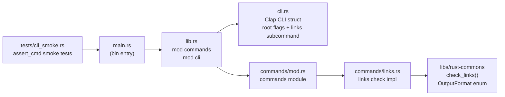

# Technical Documentation — ayokoding-cli Rust Migration

## Architecture

The Rust implementation mirrors `apps/rhino-cli/` structurally — a single Cargo workspace member
with a `[[bin]]` and a `[lib]` target. The binary entry point delegates immediately to the library,
keeping `main.rs` untestable-by-design and excluded from coverage.



## Design Decisions

### DD-01: Reuse `libs/rust-commons/` without modification

**Decision**: Call `rust_commons::links::check_links()` (or equivalent public API defined by
`ose-cli-rust-migration`) directly from `commands/links.rs`. Do not copy the logic.

**Rationale**: The ose-cli plan creates `libs/rust-commons/` for this purpose. Duplicating the logic
would defeat the shared-library pattern and create divergence risk.

**Consequence**: This plan has a hard prerequisite on `libs/rust-commons/` existing. Phase 0
enforces this as a blocking gate.

**Note**: The exact public API surface of `libs/rust-commons/` (function names, type names, module
paths) must be read from the actual crate at execution time. The delivery checklist annotates this
as a prerequisite read step. _[Unverified — lib does not yet exist; verify at Phase 0]_

### DD-02: Bin + lib split (same as rhino-cli)

**Decision**: `Cargo.toml` declares both `[[bin]]` (name = "ayokoding-cli") and `[lib]`
(name = "ayokoding_cli").

**Rationale**: `cargo llvm-cov --lib` excludes `main.rs` from coverage. Testing `main.rs` requires
process-level tests (assert_cmd in `tests/cli_smoke.rs`); unit coverage comes from the lib crate.
This is the established pattern in rhino-cli [Repo-grounded: `apps/rhino-cli/Cargo.toml`].

### DD-03: Clap `derive` feature for CLI struct

**Decision**: Define the CLI with `#[derive(Parser)]` structs in `src/cli.rs`.

**Rationale**: Consistent with rhino-cli. Derive macros reduce boilerplate and keep flag
definitions co-located with their documentation strings. [Repo-grounded: `apps/rhino-cli/Cargo.toml`
— `clap = { version = "4.6.1", features = ["derive", "env"] }`]

### DD-04: Rust edition 2024, MSRV 1.88, toolchain 1.95.0

**Decision**: Same toolchain spec as rhino-cli.

**Rationale**: Consistency across all Rust CLIs in the repo. Using a newer toolchain than the MSRV
ensures `cargo hack --rust-version` catches MSRV regressions in CI.

References:

- `apps/rhino-cli/Cargo.toml`: `edition = "2024"`, `rust-version = "1.88"` [Repo-grounded]
- `apps/rhino-cli/rust-toolchain.toml`: `channel = "1.95.0"` [Repo-grounded]

### DD-05: Strict lint settings (identical to rhino-cli)

**Decision**: Copy the `[lints]` table from `apps/rhino-cli/Cargo.toml` verbatim, with one
addition: document the `struct_excessive_bools` allow (CLI root flags use multiple bools).

**Rationale**: Uniform lint policy across all Rust CLIs. `unsafe_code = "forbid"` and
`missing_docs = "deny"` are repo standards for CLI tools. [Repo-grounded: `apps/rhino-cli/Cargo.toml`]

### DD-06: deny.toml identical to rhino-cli

**Decision**: Copy `apps/rhino-cli/deny.toml` verbatim, updating the comment header to reference
ayokoding-cli.

**Rationale**: Same license allowlist, same ban policy. No custom overrides needed.
[Repo-grounded: `apps/rhino-cli/deny.toml`]

### DD-07: Coverage via `cargo llvm-cov --lib --fail-under-lines 90`

**Decision**: Replicate the rhino-cli `test:quick` target pattern: `cargo llvm-cov --lib
--ignore-filename-regex '(cli\.rs|main\.rs)' --fail-under-lines 90`.

**Rationale**: `cli.rs` (arg-parsing glue) and `main.rs` (binary entry) are excluded because they
are covered at the integration level by `tests/cli_smoke.rs`, not by unit tests. The 90% threshold
matches the Go version's enforced threshold and the repo convention.
[Repo-grounded: `apps/rhino-cli/project.json` — `test:quick` target command]

### DD-08: spec-coverage target stubbed initially

**Decision**: The `spec-coverage` Nx target initially runs `echo 'stubbed'` (same as rhino-cli
Phase 0 pattern), to be wired up when the cucumber harness is available.

**Rationale**: The rhino-cli memory note confirms the cucumber harness is deferred work. Stubbing
avoids a CI blocker while the plan delivers the core migration.
[Repo-grounded: `apps/rhino-cli/project.json` — `spec-coverage` target]

## Implementation Approach

### File Layout After Migration

```
apps/ayokoding-cli/
├── Cargo.toml                   # bin + lib, edition 2024, rust-version 1.88
├── rust-toolchain.toml          # channel = "1.95.0"
├── deny.toml                    # identical to rhino-cli deny.toml
├── project.json                 # Rust Nx targets
├── src/
│   ├── main.rs                  # Binary entry point — calls lib::run()
│   ├── lib.rs                   # pub mod commands; pub mod cli;
│   ├── cli.rs                   # Clap structs: Cli, Commands, LinksArgs
│   └── commands/
│       ├── mod.rs               # pub mod links;
│       └── links.rs             # links check command implementation
└── tests/
    └── cli_smoke.rs             # assert_cmd smoke tests
```

Files to delete from `apps/ayokoding-cli/` (moved to archive or removed):

| File / Dir               | Action                        |
| ------------------------ | ----------------------------- |
| `go.mod`                 | Archive                       |
| `go.sum`                 | Archive                       |
| `main.go`                | Archive                       |
| `cmd/` (all `.go` files) | Archive                       |
| `dist/ayokoding-cli`     | Delete (built artifact)       |
| `cover.out`              | Delete (Go coverage artifact) |
| `cover_spec.out`         | Delete (Go coverage artifact) |
| `coverage.html`          | Delete (Go coverage artifact) |

### Cargo.toml Structure

```toml
[package]
name = "ayokoding-cli"
version = "0.1.0"
edition = "2024"
rust-version = "1.88"
description = "CLI tools for ayokoding-web link validation — Rust port"
license = "MIT"
publish = false

[[bin]]
name = "ayokoding-cli"
path = "src/main.rs"

[lib]
name = "ayokoding_cli"
path = "src/lib.rs"

[dependencies]
clap = { version = "4.6.1", features = ["derive", "env"] }
rust-commons = { path = "../../libs/rust-commons" }
anyhow = "1.0.102"
serde_json = "1.0.150"

[dev-dependencies]
assert_cmd = "2.2.2"
predicates = "3.1.4"
tempfile = "3.27.0"

[lints.rust]
unsafe_code = "forbid"
missing_docs = "deny"

[lints.rustdoc]
private_intra_doc_links = "deny"

[lints.clippy]
pedantic = { level = "warn", priority = -1 }
struct_excessive_bools = "allow"
cast_precision_loss = "allow"
cast_possible_wrap = "allow"
must_use_candidate = "allow"
unnecessary_wraps = "allow"
case_sensitive_file_extension_comparisons = "allow"
missing_errors_doc = "deny"
missing_panics_doc = "deny"
doc_markdown = "deny"
missing_docs_in_private_items = "deny"
unwrap_used = "deny"
panic = "deny"
undocumented_unsafe_blocks = "deny"
indexing_slicing = "allow"
arithmetic_side_effects = "allow"

[profile.release]
opt-level = 3
lto = "thin"
codegen-units = 1
panic = "abort"
strip = "symbols"
```

### project.json Nx Targets

The updated `project.json` replaces all Go targets with Rust equivalents, following the
`apps/rhino-cli/project.json` pattern [Repo-grounded]:

```json
{
  "name": "ayokoding-cli",
  "sourceRoot": "apps/ayokoding-cli",
  "projectType": "application",
  "tags": ["type:app", "platform:cli", "lang:rust", "domain:ayokoding"],
  "implicitDependencies": ["rust-commons"],
  "targets": {
    "build": { ... },
    "install": { ... },
    "fmt": { ... },
    "fmt:check": { ... },
    "lint": { ... },
    "deny:check": { ... },
    "check:msrv": { ... },
    "run": { ... },
    "typecheck": { ... },
    "test:unit": { ... },
    "test:quick": { ... },
    "test:integration": { ... },
    "spec-coverage": { ... }
  }
}
```

Full verbatim target commands are specified in the delivery checklist steps.

### CLI Structure (`src/cli.rs`)

```rust
use clap::{Parser, Subcommand, ValueEnum};

#[derive(Parser)]
#[command(name = "ayokoding-cli", version, about = "CLI tools for ayokoding-web link validation")]
pub struct Cli {
    #[arg(short = 'v', long, global = true)]
    pub verbose: bool,
    #[arg(short = 'q', long, global = true)]
    pub quiet: bool,
    #[arg(short = 'o', long, global = true, default_value = "text")]
    pub output: OutputFormat,
    #[arg(long = "no-color", global = true)]
    pub no_color: bool,
    #[command(subcommand)]
    pub command: Commands,
}

#[derive(Subcommand)]
pub enum Commands {
    Links(LinksArgs),
}

#[derive(clap::Args)]
pub struct LinksArgs {
    #[command(subcommand)]
    pub command: LinksCommands,
}

#[derive(Subcommand)]
pub enum LinksCommands {
    Check(LinksCheckArgs),
}

#[derive(clap::Args)]
pub struct LinksCheckArgs {
    #[arg(long, default_value = "apps/ayokoding-web/content")]
    pub content: String,
}

#[derive(ValueEnum, Clone)]
pub enum OutputFormat {
    Text,
    Json,
    Markdown,
}
```

## Dependencies

### Validated Dependency Versions

| Crate          | Version   | Source                                                |
| -------------- | --------- | ----------------------------------------------------- |
| `clap`         | `4.6.1`   | [Repo-grounded: `apps/rhino-cli/Cargo.toml`]          |
| `anyhow`       | `1.0.102` | [Repo-grounded: `apps/rhino-cli/Cargo.toml`]          |
| `serde_json`   | `1.0.150` | [Repo-grounded: `apps/rhino-cli/Cargo.toml`]          |
| `assert_cmd`   | `2.2.2`   | [Repo-grounded: `apps/rhino-cli/Cargo.toml`]          |
| `predicates`   | `3.1.4`   | [Repo-grounded: `apps/rhino-cli/Cargo.toml`]          |
| `tempfile`     | `3.27.0`  | [Repo-grounded: `apps/rhino-cli/Cargo.toml`]          |
| `rust-commons` | path dep  | [Unverified — lib not yet created; verify at Phase 0] |

Rust toolchain: `1.95.0` [Repo-grounded: `apps/rhino-cli/rust-toolchain.toml`]
Rust edition: `2024` [Repo-grounded: `apps/rhino-cli/Cargo.toml`]
MSRV: `1.88` [Repo-grounded: `apps/rhino-cli/Cargo.toml`]

## Testing Strategy

Following the [Test-Driven Development Convention](../../../repo-governance/development/workflow/test-driven-development.md),
tests are written before implementation.

| Level                            | Tool                                         | What it covers                                                       | Acceptance Criteria                           |
| -------------------------------- | -------------------------------------------- | -------------------------------------------------------------------- | --------------------------------------------- |
| Unit (`test:unit`)               | `cargo test --lib`                           | Command dispatch logic, output formatting, flag parsing in isolation | AC-01 through AC-04 (mocked `check_links`)    |
| Integration (`test:integration`) | `cargo test --tests`                         | `tests/cli_smoke.rs` via `assert_cmd` — binary invocation            | AC-05, AC-06 (help output), AC-09 (exit code) |
| Coverage (`test:quick`)          | `cargo llvm-cov --lib --fail-under-lines 90` | Line coverage gate on library code only                              | AC-09                                         |

The four existing Gherkin scenarios in
`specs/apps/ayokoding/behavior/cli/gherkin/links/links-check.feature` [Repo-grounded] map directly
to unit tests in `src/commands/links.rs` using mock injection (same pattern as the Go version's
`checkLinksFn` variable).

## Go Shared Library Cleanup

**Scope of deletion:**

- `libs/golang-link-commons/` — used only by `apps/ose-cli/` and `apps/ayokoding-cli/` [Repo-grounded:
  grep of `apps/` shows exactly these two consumers]
- `libs/golang-commons/` — used only by the same two CLIs as a transitive dependency via
  `libs/golang-link-commons/` [Repo-grounded: grep of `apps/` shows no other direct consumer]

**Gate before deletion**: Run

```bash
REPO_ROOT=$(git rev-parse --show-toplevel)
grep -r "golang-link-commons\|golang-commons" \
  "$REPO_ROOT/apps" \
  "$REPO_ROOT/libs" \
  --include="*.go" --include="project.json" -l
```

If any path is listed that is NOT under `apps/ayokoding-cli/` or `apps/ose-cli/`, STOP — do not
delete.

**Nx project cleanup**: After deleting the lib directories, remove entries from `nx.json` (if any)
and verify `nx graph` no longer references the deleted libs.

## Rollback Plan

Because this plan works on `main` (Trunk Based Development), rollback is via `git revert` of the
commits that deleted Go source. The archived Go source in `archived/ayokoding-cli/` can be moved
back to `apps/ayokoding-cli/` with `git mv`. The Go shared libs can be restored from git history
if the deletion commit is reverted before the next deployment.
