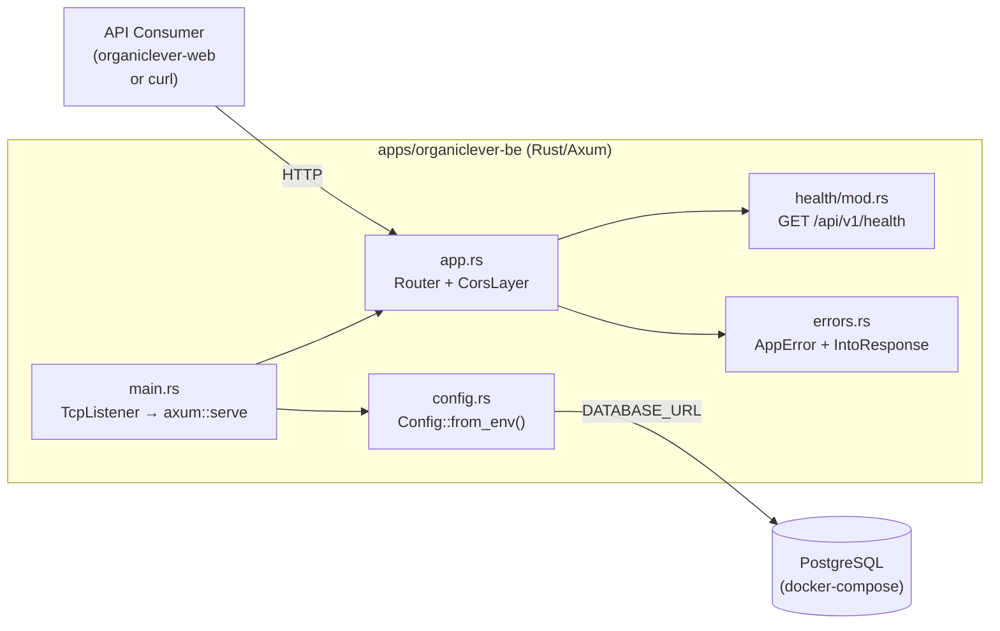

# Technical Documentation — organiclever-be Rust Migration

## Architecture

The Rust binary is a single `axum::Router` served by `tokio::net::TcpListener`. There is no
database-backed logic in the initial port — SQLx is included as a dependency for future-readiness
but no SQL queries are executed. The router applies `tower-http::cors::CorsLayer` as middleware
before dispatching to handlers.

## Design Decisions

### DD-1: SQLx 0.8 over SQLx 0.9

SQLx 0.9 was published 2026-05-21 and requires MSRV 1.94+.
[Web-cited: <https://github.com/launchbadge/sqlx/blob/main/CHANGELOG.md>, accessed 2026-05-25 —
"sqlx 0.9.0 requires Rust 1.94 or later"]

This plan uses SQLx 0.8, which is compatible with MSRV 1.88. The rationale:

- `apps/rhino-cli/` sets `rust-version = "1.88"` and `channel = "1.95.0"` [Repo-grounded].
  Matching this MSRV keeps both apps on the same minimum baseline.
- SQLx 0.8 has been in production use since October 2024 and is the version used by the
  ose-primer `crud-be-rust-axum` reference [Repo-grounded: ose-primer `Cargo.toml` line 23].
- Upgrading to 0.9 is a separate, future concern.

### DD-2: Axum over Actix-web

Axum is the framework used by ose-primer `crud-be-rust-axum` [Repo-grounded]. Axum integrates
natively with `tower` and `tower-http`, which provide CORS, tracing, and request-id middleware
already used in the reference. Actix-web uses a different actor model and middleware API;
switching would deviate from the established ose-primer pattern without benefit.

### DD-3: Scope-Lock to Existing Functionality

The Java backend exposes exactly:

- `GET /api/v1/health` → `{"status": "UP"}` (Spring Boot health endpoint)
- CORS allow-all via `WebMvcConfigurer`
- Global exception handler returning RFC 9457 ProblemDetail on unhandled exceptions

No database entities, authentication, or business logic exist. The Rust port replicates this
surface only. The health response value changes from `"UP"` (Spring Boot convention) to `"ok"`
(ose-primer convention); the Gherkin feature file is updated accordingly.

### DD-4: Runtime SQL Query Mode (sqlx::query vs sqlx::query!)

`sqlx::query!()` macro validates SQL at compile time but requires a live `DATABASE_URL` at
build time. Since no SQL queries exist in the initial port, `sqlx::query()` (runtime-checked)
is used where needed. This avoids forcing a PostgreSQL connection during `cargo build` in CI
and local dev.

### DD-5: OpenAPI Codegen — Java Generator to Rust Generator

The current `codegen` Nx target uses `openapi-generator-cli -g java`. After the Java source
is deleted, this target is broken. The plan updates it to use `-g rust` or a Rust-specific
generator. This requires research at execution time:

- If `openapi-generator-cli -g rust` produces usable output for the ose-primer contract shape,
  use it with appropriate `--additional-properties`.
- If no suitable generator is available, the `codegen` target is stubbed as a no-op with a
  TODO comment and filed as an Open Question for a future plan.

[Unverified — verify at execution time whether `openapi-generator-cli -g rust` produces
output compatible with the Axum/SQLx pattern]

### DD-6: Health Response Value Change

Java returns `{"status": "UP"}`. The Rust port returns `{"status": "ok"}`. This is intentional:

- `"UP"` is a Spring Boot Actuator convention, not an HTTP standard.
- `"ok"` aligns with the ose-primer `crud-be-rust-axum` reference.
- The existing Gherkin feature file asserts `"UP"`; it is updated to `"ok"` in Phase 2.

## File Impact Table

| Action             | Path                                                                      | Notes                                 |
| ------------------ | ------------------------------------------------------------------------- | ------------------------------------- |
| DELETE             | `apps/organiclever-be/pom.xml`                                            | Maven build descriptor                |
| DELETE             | `apps/organiclever-be/checkstyle.xml`                                     | Java lint config                      |
| DELETE             | `apps/organiclever-be/pmd-ruleset.xml`                                    | Java PMD rules                        |
| DELETE             | `apps/organiclever-be/.editorconfig`                                      | Java-specific EditorConfig            |
| DELETE             | `apps/organiclever-be/src/main/java/`                                     | Java source tree                      |
| DELETE             | `apps/organiclever-be/src/test/java/`                                     | Java test tree                        |
| DELETE             | `apps/organiclever-be/src/main/resources/`                                | Spring Boot YAML config               |
| DELETE             | `apps/organiclever-be/src/test/resources/`                                | Spring Boot test resources            |
| DELETE             | `apps/organiclever-be/src/OrganicLeverBe/`                                | Stale F# build artifacts              |
| DELETE             | `apps/organiclever-be/Dockerfile.integration`                             | Java Dockerfile (replaced)            |
| DELETE (gitignore) | `apps/organiclever-be/target/`                                            | Java build output                     |
| DELETE (gitignore) | `apps/organiclever-be/coverage/`                                          | Java coverage output                  |
| DELETE (gitignore) | `apps/organiclever-be/generated-contracts/`                               | Java-generated types                  |
| CREATE             | `apps/organiclever-be/Cargo.toml`                                         | Rust bin + lib crate                  |
| CREATE             | `apps/organiclever-be/rust-toolchain.toml`                                | Pin to channel 1.95.0                 |
| CREATE             | `apps/organiclever-be/deny.toml`                                          | cargo-deny config (rhino-cli pattern) |
| CREATE             | `apps/organiclever-be/src/main.rs`                                        | Axum server entry point               |
| CREATE             | `apps/organiclever-be/src/lib.rs`                                         | pub mod declarations                  |
| CREATE             | `apps/organiclever-be/src/app.rs`                                         | Router + CORS middleware              |
| CREATE             | `apps/organiclever-be/src/config.rs`                                      | Config::from_env()                    |
| CREATE             | `apps/organiclever-be/src/health/mod.rs`                                  | health handler                        |
| CREATE             | `apps/organiclever-be/src/errors.rs`                                      | AppError + IntoResponse               |
| CREATE             | `apps/organiclever-be/tests/unit/main.rs`                                 | Unit test harness                     |
| CREATE             | `apps/organiclever-be/tests/integration/main.rs`                          | Cucumber-rs BDD harness               |
| CREATE             | `apps/organiclever-be/.env.example`                                       | Env var documentation                 |
| CREATE             | `apps/organiclever-be/Dockerfile.integration`                             | Rust multi-stage Dockerfile           |
| MODIFY             | `apps/organiclever-be/project.json`                                       | Replace all mvn targets with cargo    |
| MODIFY             | `apps/organiclever-be/docker-compose.integration.yml`                     | Adapt for Rust app                    |
| MODIFY             | `apps/organiclever-be/.gitignore`                                         | Add `target/`, remove Java patterns   |
| MODIFY             | `specs/apps/organiclever/behavior/be/gherkin/health/health-check.feature` | Update `"UP"` → `"ok"`                |

## Validated Dependencies

| Dependency            | Version                | Source                                                                                                                 | Confidence |
| --------------------- | ---------------------- | ---------------------------------------------------------------------------------------------------------------------- | ---------- |
| Rust toolchain        | 1.95.0                 | `apps/rhino-cli/rust-toolchain.toml` [Repo-grounded]                                                                   | HIGH       |
| Rust edition          | 2024                   | `apps/rhino-cli/Cargo.toml` edition field [Repo-grounded]                                                              | HIGH       |
| MSRV (`rust-version`) | 1.88                   | `apps/rhino-cli/Cargo.toml` rust-version field [Repo-grounded]                                                         | HIGH       |
| axum                  | 0.8.9                  | [Web-cited: crates.io/crates/axum, accessed 2026-05-25 — "newest_version: 0.8.9" confirmed as latest stable]           | HIGH       |
| tokio                 | 1 (resolves to 1.52.3) | [Web-cited: crates.io/crates/tokio, accessed 2026-05-25 — "newest_version: 1.52.3" confirmed as latest stable]         | HIGH       |
| serde                 | 1.0.228                | `apps/rhino-cli/Cargo.toml` [Repo-grounded]                                                                            | HIGH       |
| serde_json            | 1.0.150                | `apps/rhino-cli/Cargo.toml` [Repo-grounded]                                                                            | HIGH       |
| sqlx                  | 0.8                    | ose-primer `crud-be-rust-axum/Cargo.toml` line 23 [Repo-grounded]                                                      | HIGH       |
| tower-http            | 0.6.11                 | [Web-cited: crates.io/crates/tower-http, accessed 2026-05-25 — "newest_version: 0.6.11" confirmed as latest stable]    | HIGH       |
| tracing               | 0.1                    | ose-primer `crud-be-rust-axum/Cargo.toml` [Repo-grounded]                                                              | HIGH       |
| tracing-subscriber    | 0.3                    | ose-primer `crud-be-rust-axum/Cargo.toml` [Repo-grounded]                                                              | HIGH       |
| anyhow                | 1.0.102                | `apps/rhino-cli/Cargo.toml` [Repo-grounded]                                                                            | HIGH       |
| thiserror             | 2                      | ose-primer `crud-be-rust-axum/Cargo.toml` [Repo-grounded]                                                              | HIGH       |
| cucumber (dev)        | 0.23.0                 | `apps/rhino-cli/Cargo.toml` dev-dependencies [Repo-grounded]                                                           | HIGH       |
| cargo-llvm-cov        | 0.8.7                  | [Web-cited: crates.io/crates/cargo-llvm-cov, accessed 2026-05-25 — "newest_version: 0.8.7" confirmed as latest stable] | HIGH       |

## Testing Strategy

Tests follow Red→Green→Refactor per the
[Test-Driven Development Convention](../../../repo-governance/development/workflow/test-driven-development.md).

### Unit Tests (`tests/unit/main.rs`, `harness = false`)

- Config parsing: verify `Config::from_env()` reads `PORT`, `DATABASE_URL`, `CORS_ORIGINS`
  with correct defaults
- Health handler: call the handler function directly, assert `StatusCode::OK` and body

### Integration Tests (`tests/integration/main.rs`, `harness = false`, cucumber-rs)

Step implementations cover the two scenarios from
`specs/apps/organiclever/behavior/be/gherkin/health/health-check.feature`:

- `Health endpoint reports the service as UP` (updated: asserts `"ok"`)
- `Anonymous health check does not expose component details` (updated: asserts `"ok"`)

Steps use `reqwest` to call the running server (spawned inside `#[tokio::main]` before cucumber
runs). The Docker integration (`docker-compose.integration.yml`) builds the Rust binary and
runs it against a PostgreSQL service.

### Coverage Gate

`cargo llvm-cov --fail-under-lines 90` — enforced in the `test:quick` Nx target.

## Rollback Plan

If the migration introduces regressions that cannot be fixed within the delivery window:

1. `git revert <migration-commit-sha>` — restores `pom.xml`, Java source, and Java Nx targets
2. The Java Spring Boot app is fully self-contained; reverting the commit restores a buildable
   Java service with no further changes required
3. The OpenAPI contract spec at `specs/apps/organiclever/containers/contracts/` is not modified
   by this migration; no rollback needed there

## Open Questions

1. **Rust OpenAPI codegen generator**: Does `openapi-generator-cli -g rust` produce output
   compatible with the `organiclever-be` Axum + SQLx pattern? Research needed at execution
   time. Fallback: stub the `codegen` target as a no-op with a TODO comment.
   [Unverified — verify before Phase 3 execution]

2. **reqwest version for integration tests**: The ose-primer `crud-be-rust-axum` uses
   `reqwest` internally but its version is not pinned in the reference dev-dependencies. Use
   `reqwest = { version = "0.12", features = ["json"] }` matching the axum 0.8 / hyper 1.x
   ecosystem. [Unverified — confirm reqwest 0.12 compiles with axum 0.8 at execution time]
