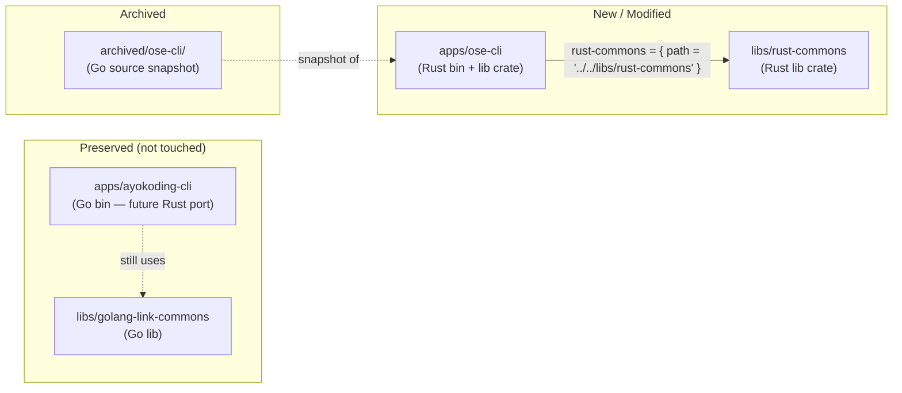

# Technical Documentation — ose-cli Rust Migration

## Architecture

### Component Diagram



### Module Layout

```
libs/rust-commons/
├── Cargo.toml            # lib crate, name = "rust-commons"
├── rust-toolchain.toml   # channel = "1.95.0"
├── project.json          # Nx targets: build, lint, fmt, fmt:check, test:unit, test:quick, typecheck
└── src/
    ├── lib.rs            # pub mod links
    └── links/
        └── mod.rs        # BrokenLink, CheckResult, check_links(), output_*() functions

apps/ose-cli/
├── Cargo.toml            # bin + lib crate, name = "ose-cli"
├── rust-toolchain.toml   # channel = "1.95.0"
├── deny.toml             # same pattern as rhino-cli
├── project.json          # Nx targets: build, install, fmt, fmt:check, lint, deny:check,
│                         #             check:msrv, run, typecheck, test:unit, test:quick,
│                         #             test:integration, spec-coverage
└── src/
    ├── main.rs           # entry point: calls ose_cli::cli::run(), std::process::exit()
    ├── lib.rs            # pub mod commands; pub mod cli
    ├── cli.rs            # Clap struct + run() function
    └── commands/
        ├── mod.rs        # pub mod links
        └── links.rs      # LinksCheckArgs, run_links_check()

tests/
└── cli_smoke.rs          # assert_cmd smoke tests (binary-level)

archived/ose-cli/         # Go source snapshot (new directory)
```

## Design Decisions

### DD-1: Lib + bin crate split for ose-cli

`apps/ose-cli/` uses both a `[[bin]]` and a `[lib]` section in `Cargo.toml`, identical to `rhino-cli` [Repo-grounded: `apps/rhino-cli/Cargo.toml`]. The binary entry point (`main.rs`) is a thin wrapper; all logic lives in `lib.rs` modules. This allows `cargo test --lib` to cover all business logic and `tests/cli_smoke.rs` to test the binary via `assert_cmd`.

### DD-2: rust-commons as a path dependency

`libs/rust-commons/` is referenced as `rust-commons = { path = "../../libs/rust-commons" }` in `apps/ose-cli/Cargo.toml`. This is the same pattern used for local crates in other Rust polyglot repos. It avoids publishing to crates.io (publish = false) and keeps the dependency graph local to the monorepo. [Judgment call: path deps are the conventional approach for unpublished monorepo crates.]

### DD-3: Identical lint configuration to rhino-cli

The `[lints]` section in both `libs/rust-commons/Cargo.toml` and `apps/ose-cli/Cargo.toml` is copied verbatim from `apps/rhino-cli/Cargo.toml` [Repo-grounded]. This ensures the same pedantic clippy group, the same `unsafe_code = "forbid"`, `missing_docs = "deny"`, and the same documented allows (`struct_excessive_bools`, `cast_precision_loss`, etc.). Consistency reduces the reviewer cognitive load.

### DD-4: No chrono dependency in rust-commons

The Go `output.go` uses `timeutil.JakartaTimestamp()` from `golang-commons`. The Rust port uses `std::time::SystemTime` and formats the timestamp with a simple UTC offset calculation rather than importing `chrono`. The timestamp in the JSON/text output is informational only — exact timezone display is not tested by acceptance criteria. This avoids adding `chrono` to `libs/rust-commons/` (keeping the dependency footprint minimal). If a Jakarta-timezone timestamp is required in the future, `chrono` can be added then. [Judgment call: simpler dependency surface outweighs timezone display fidelity for a developer tool.]

### DD-5: spec-coverage stubbed (same as rhino-cli pattern)

`apps/ose-cli/project.json` `spec-coverage` target echoes a stub message (same structural pattern as rhino-cli's Phase 0 stub [Judgment call: stub text differs slightly from rhino-cli's exact phrasing]). The Gherkin cucumber harness for `ose-cli` is deferred — the existing Go integration test suite is retired along with the Go source, and a Rust cucumber harness is future work outside this plan's scope.

### DD-6: golang-link-commons not deleted

`libs/golang-link-commons/` [Repo-grounded: exists at `libs/golang-link-commons/`] is preserved. `apps/ayokoding-cli/` still imports it. Deleting it would break `ayokoding-cli` CI. Removal is the responsibility of the `ayokoding-cli-rust-migration` plan.

### DD-7: Rust edition 2024, MSRV 1.88

Edition 2024 and `rust-version = "1.88"` match `apps/rhino-cli/Cargo.toml` [Repo-grounded]. Toolchain pin is `1.95.0` (stable) [Repo-grounded: `apps/rhino-cli/rust-toolchain.toml`], which satisfies the 1.88 MSRV.

## File Impact Table

| Path                                    | Action                               | Note                                              |
| --------------------------------------- | ------------------------------------ | ------------------------------------------------- |
| `libs/rust-commons/`                    | Create (_New directory_)             | New Rust lib crate                                |
| `libs/rust-commons/Cargo.toml`          | Create (_New file_)                  | lib crate manifest                                |
| `libs/rust-commons/rust-toolchain.toml` | Create (_New file_)                  | pin channel = "1.95.0"                            |
| `libs/rust-commons/project.json`        | Create (_New file_)                  | Nx targets for the lib                            |
| `libs/rust-commons/src/lib.rs`          | Create (_New file_)                  | pub mod links                                     |
| `libs/rust-commons/src/links/mod.rs`    | Create (_New file_)                  | BrokenLink, CheckResult, check*links(), output*\* |
| `apps/ose-cli/Cargo.toml`               | Create (_New file_, replaces go.mod) | Rust bin+lib manifest                             |
| `apps/ose-cli/rust-toolchain.toml`      | Create (_New file_)                  | pin channel = "1.95.0"                            |
| `apps/ose-cli/deny.toml`                | Create (_New file_)                  | cargo-deny config                                 |
| `apps/ose-cli/src/main.rs`              | Create (_New file_)                  | Rust entry point                                  |
| `apps/ose-cli/src/lib.rs`               | Create (_New file_)                  | pub mod commands; pub mod cli                     |
| `apps/ose-cli/src/cli.rs`               | Create (_New file_)                  | Clap struct + run()                               |
| `apps/ose-cli/src/commands/mod.rs`      | Create (_New file_)                  | pub mod links                                     |
| `apps/ose-cli/src/commands/links.rs`    | Create (_New file_)                  | links check impl                                  |
| `apps/ose-cli/tests/cli_smoke.rs`       | Create (_New file_)                  | binary smoke tests                                |
| `apps/ose-cli/project.json`             | Modify                               | Replace Go targets with Rust targets; update tags |
| `apps/ose-cli/go.mod`                   | Delete                               | Go module manifest — no longer needed             |
| `apps/ose-cli/go.sum`                   | Delete                               | Go lockfile — no longer needed                    |
| `apps/ose-cli/main.go`                  | Delete                               | Go entry point — replaced by src/main.rs          |
| `apps/ose-cli/cmd/`                     | Delete (whole dir)                   | Go command implementations                        |
| `apps/ose-cli/dist/ose-cli`             | Delete                               | Old Go binary                                     |
| `apps/ose-cli/dist/oseplatform-cli`     | Delete                               | Old Go binary                                     |
| `apps/ose-cli/cover.out`                | Delete                               | Go coverage artifact                              |
| `apps/ose-cli/cover_spec.out`           | Delete                               | Go coverage artifact                              |
| `archived/ose-cli/`                     | Create (_New directory_)             | Go source archive                                 |

## Validated Dependencies

All versions verified as of 2026-05-25.

| Crate                        | Version | Source                               | Label           |
| ---------------------------- | ------- | ------------------------------------ | --------------- |
| clap (features: derive, env) | 4.6.1   | `apps/rhino-cli/Cargo.toml` line 19  | [Repo-grounded] |
| serde (features: derive)     | 1.0.228 | `apps/rhino-cli/Cargo.toml` line 20  | [Repo-grounded] |
| serde_json                   | 1.0.150 | `apps/rhino-cli/Cargo.toml` line 21  | [Repo-grounded] |
| walkdir                      | 2.5.0   | `apps/rhino-cli/Cargo.toml` line 23  | [Repo-grounded] |
| regex                        | 1.12.3  | `apps/rhino-cli/Cargo.toml` line 25  | [Repo-grounded] |
| anyhow                       | 1.0.102 | `apps/rhino-cli/Cargo.toml` line 26  | [Repo-grounded] |
| assert_cmd (dev)             | 2.2.2   | `apps/rhino-cli/Cargo.toml` line 35  | [Repo-grounded] |
| predicates (dev)             | 3.1.4   | `apps/rhino-cli/Cargo.toml` line 36  | [Repo-grounded] |
| tempfile (dev)               | 3.27.0  | `apps/rhino-cli/Cargo.toml` line 37  | [Repo-grounded] |
| Rust toolchain               | 1.95.0  | `apps/rhino-cli/rust-toolchain.toml` | [Repo-grounded] |

Note: `rust-commons` does **not** depend on `clap` (that is a CLI concern) or `assert_cmd` (that is a test concern for binary tests). The lib crate's dev-dependencies are `tempfile` only (for unit test fixtures).

## Testing Strategy

Per the [Test-Driven Development Convention](../../../repo-governance/development/workflow/test-driven-development.md), tests are written BEFORE implementation. The Gherkin acceptance criteria in [`prd.md`](./prd.md) are the primary source for first failing tests.

### libs/rust-commons — test:unit (cargo test --lib)

Each acceptance criterion in the `links` module maps to a unit test:

| Acceptance Criterion                     | Test Level | Test Location                                       |
| ---------------------------------------- | ---------- | --------------------------------------------------- |
| AC-11: check_links returns CheckResult   | unit       | `libs/rust-commons/src/links/mod.rs` (#[cfg(test)]) |
| AC-10: code blocks skipped               | unit       | `libs/rust-commons/src/links/mod.rs` (#[cfg(test)]) |
| AC-5: broken links detected and reported | unit       | `libs/rust-commons/src/links/mod.rs` (#[cfg(test)]) |
| AC-6: JSON output shape                  | unit       | `libs/rust-commons/src/links/mod.rs` (#[cfg(test)]) |
| AC-7: Markdown output headings           | unit       | `libs/rust-commons/src/links/mod.rs` (#[cfg(test)]) |
| AC-9: nonexistent directory rejected     | unit       | `libs/rust-commons/src/links/mod.rs` (#[cfg(test)]) |

Coverage target: 90% line coverage via `cargo llvm-cov --fail-under-lines 90`.

### apps/ose-cli — test:unit (cargo test --lib)

| Acceptance Criterion                 | Test Level | Test Location                                       |
| ------------------------------------ | ---------- | --------------------------------------------------- |
| AC-3: invalid output format rejected | unit       | `apps/ose-cli/src/cli.rs` (#[cfg(test)])            |
| AC-8: quiet mode suppresses output   | unit       | `apps/ose-cli/src/commands/links.rs` (#[cfg(test)]) |

### apps/ose-cli — test:integration (cargo test --tests)

| Acceptance Criterion              | Test Level                                       | Test Location                                  |
| --------------------------------- | ------------------------------------------------ | ---------------------------------------------- |
| AC-1: help flag exits 0           | integration (binary)                             | `apps/ose-cli/tests/cli_smoke.rs` (_New test_) |
| AC-2: unknown subcommand fails    | integration (binary)                             | `apps/ose-cli/tests/cli_smoke.rs` (_New test_) |
| AC-3: invalid output format fails | integration (binary)                             | `apps/ose-cli/tests/cli_smoke.rs` (_New test_) |
| AC-4: clean content dir passes    | integration (binary)                             | `apps/ose-cli/tests/cli_smoke.rs` (_New test_) |
| AC-5: broken link reported        | integration (binary)                             | `apps/ose-cli/tests/cli_smoke.rs` (_New test_) |
| AC-6: JSON output parseable       | integration (binary)                             | `apps/ose-cli/tests/cli_smoke.rs` (_New test_) |
| AC-7: Markdown headings present   | integration (binary)                             | `apps/ose-cli/tests/cli_smoke.rs` (_New test_) |
| AC-12: default content dir        | integration (binary, skip if no ose-web/content) | `apps/ose-cli/tests/cli_smoke.rs` (_New test_) |

## Rollback Plan

If the Rust port introduces a regression discovered post-merge:

1. The Go source is preserved in `archived/ose-cli/`. Restore by copying it back to `apps/ose-cli/`, restoring `project.json` Go targets, and deleting the Rust source files.
2. `libs/rust-commons/` can be disabled by removing it from the Nx workspace without affecting any other project (no existing project depends on it at plan start).
3. The Go `libs/golang-link-commons/` is never touched, so `ayokoding-cli` is unaffected regardless.
