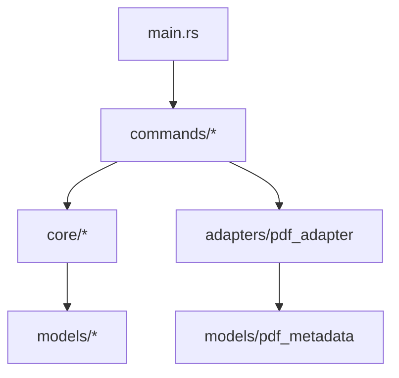

# Technical Approach — crane-cli Rust Migration

## Architecture

Mirrors the existing F# layering directly. No new abstractions are introduced.

```
src/
├── main.rs                    # clap CLI entry point — dispatch only, no logic
├── lib.rs                     # pub mod re-exports of all sub-modules
├── models/
│   ├── mod.rs
│   ├── finding.rs             # Finding, Criticality (CRITICAL/HIGH/MEDIUM/LOW)
│   ├── pdf_metadata.rs        # PdfMetadata (pages, title, author, file, size_bytes)
│   └── report.rs              # SkipListEntry
├── adapters/
│   ├── mod.rs
│   └── pdf_adapter.rs         # PdfAdapter trait + LopdfAdapter + FakePdfAdapter
├── core/
│   ├── mod.rs
│   ├── text_checker.rs        # normalize(), segment_is_present(), check_text()
│   ├── heading_checker.rs     # extract_md_headings(), check_headings()
│   ├── nesting_checker.rs     # extract_nesting_levels(), check_nesting()
│   ├── table_checker.rs       # detect_tables(), check_tables()
│   ├── figure_checker.rs      # detect_figures(), check_figures()
│   ├── mermaid_validator.rs   # extract_blocks(), validate_block(), validate_md()
│   ├── ocr_assessor.rs        # estimate_ocr_error_rate(), check_ocr_quality()
│   ├── report_manager.rs      # get_or_extend_chain(), init_report(), finalize_report()
│   ├── skiplist_manager.rs    # stable_key(), add(), check(), list()
│   └── pdf_extraction_cache.rs # wrap(inner, cache_dir) -> impl PdfAdapter
└── commands/
    ├── mod.rs
    ├── pdf_commands.rs        # run_info(), run_type(), run_extract()
    ├── text_commands.rs       # run_check(), run_search()
    ├── heading_commands.rs    # run_infer(), run_check()
    ├── nesting_commands.rs    # run_infer(), run_check()
    ├── table_commands.rs      # run_detect(), run_check()
    ├── figure_commands.rs     # run_detect(), run_check()
    ├── mermaid_commands.rs    # run_validate()
    ├── ocr_commands.rs        # run_quality(), run_extract()
    ├── report_commands.rs     # run_init(), run_finalize()
    ├── skiplist_commands.rs   # run_add(), run_check(), run_list()
    └── check_all_commands.rs  # run_check_all()

tests/
├── unit/
│   └── main.rs                # standard cargo test harness; modules inline
└── integration/
    └── main.rs                # cucumber-rs harness (harness = false)
```

## Design Decisions

### PDF Parsing: lopdf 0.40.0

**Rationale**: Pure Rust, no system library required, edition 2024 compatible, MSRV 1.85 (our
MSRV is 1.88). `pdf-extract` wraps lopdf but has known open issues with CID-subset fonts; using
lopdf directly avoids that indirection and gives more control.

**Key API**:

```rust
use lopdf::Document;
let doc = Document::load(path)?;                          // opens the PDF
let pages = doc.get_pages();                              // BTreeMap<u32, ObjectId>
let page_count = pages.len();
let text = doc.extract_text(&[1, 2, 3])?;                // flat text, newline-separated
// Metadata via info dict traversal (title, author):
let info = doc.trailer.get(b"Info")
    .and_then(|obj| doc.get_object(obj.as_reference().ok()?).ok())
    .and_then(|obj| obj.as_dict().ok().cloned());
let title = info.as_ref()
    .and_then(|d| d.get(b"Title").ok())
    .and_then(|obj| obj.as_str().ok())
    .map(|b| String::from_utf8_lossy(b).into_owned());
```

**Page extraction for `crane pdf extract`**: collect `pages.keys()`, filter by `start..=end`,
call `doc.extract_text(&page_nums)`.

### CLI Parsing: clap 4.6.1 derive API

`#[derive(Parser, Subcommand, Args)]` mirrors the F# Argu discriminated union approach.
Subcommands are nested: top-level `CraneCli` → `Commands` enum → per-subcommand `Args` structs.

### Fuzzy Text Matching: strsim 0.11.1

`strsim::normalized_levenshtein(a, b) -> f64` returns 1.0 for identical strings.
Threshold kept at `0.85` (identical to F#).

### OCR Pipeline: tesseract 0.15.2 + pdftoppm

`crane ocr extract <pdf>` performs real OCR on image-based PDFs:

1. Shell out to `pdftoppm -r 300 -png <pdf> <tmpdir>/page` → generates `page-001.png`, `page-002.png`, etc.
2. For each PNG, call `tesseract::ocr(path, "eng")` → `Result<String, _>`.
3. Concatenate all pages with `\n\n` separator and print to stdout.

`crane ocr quality <md>` remains pure Rust regex matching on `<!-- OCR: ... -->` sections —
no tesseract involved.

**System dependencies** (must be installed before building or running OCR):

| Platform      | Command                                                                              |
| ------------- | ------------------------------------------------------------------------------------ |
| macOS         | `brew install tesseract poppler`                                                     |
| Ubuntu/Debian | `sudo apt-get install tesseract-ocr libleptonica-dev libtesseract-dev poppler-utils` |

**TESSDATA_PREFIX**: tesseract locates language data via the environment variable
`TESSDATA_PREFIX`. On macOS Homebrew installs this is typically `/opt/homebrew/share/tessdata`.
The `crane ocr extract` command documents this requirement in `--help`.

### PDF Extraction Cache: sha2 0.11.0

SHA-256 of PDF bytes (first 16 hex chars) is used as cache key, matching the F# algorithm exactly.
Cache entries are JSON files under `<cache_dir>/extract/<kind>-<sha16>.json`.

### Skip List Key Algorithm

Must match F# byte-for-byte to preserve existing skip list files:

```rust
// F# equivalent: SHA256(UTF8("basename|category|description"))[..16 hex chars]
use sha2::{Sha256, Digest};
fn stable_key(md_basename: &str, category: &str, description: &str) -> String {
    let combined = format!("{md_basename}|{category}|{description}");
    let hash = Sha256::digest(combined.as_bytes());
    format!("{:x}", hash)[..16].to_string()
}
```

### Report Timestamps: chrono 0.4.44

UTC+7 offset (`FixedOffset::east_opt(7 * 3600)`) matches the F# `utc7Timestamp`.

### JSON Output: serde + serde_json

All JSON fields use `snake_case` via `#[serde(rename = "...")]` on struct fields to match
the F# `[<JsonPropertyName("...")>]` attributes exactly.

## Dependency Manifest (Cargo.toml excerpt)

```toml
[dependencies]
clap = { version = "4.6.1", features = ["derive"] }       # [Repo-grounded] rhino-cli Cargo.toml
serde = { version = "1.0.228", features = ["derive"] }    # [Repo-grounded] rhino-cli Cargo.toml
serde_json = "1.0.150"                                     # [Repo-grounded] rhino-cli Cargo.toml
lopdf = "0.40.0"                                           # [Web-cited] https://crates.io/crates/lopdf 2026-03-19 "v0.40.0 (2026-03-19)"
strsim = "0.11.1"                                          # [Web-cited] https://crates.io/crates/strsim 2026-05-26 "v0.11.1"
sha2 = "0.11.0"                                            # [Repo-grounded] rhino-cli Cargo.toml
chrono = { version = "0.4.44", default-features = false, features = ["serde", "clock"] }  # [Repo-grounded]
regex = "1.12.3"                                           # [Repo-grounded] rhino-cli Cargo.toml
anyhow = "1.0.102"                                         # [Repo-grounded] rhino-cli Cargo.toml
thiserror = "2"                                            # [Repo-grounded] organiclever-be Cargo.toml
tesseract = "0.15.2"                                       # [Web-cited] https://crates.io/crates/tesseract 2026-05-26 "v0.15.2 (2025-04-19, latest as of 2026-05-26)"

[dev-dependencies]
cucumber = "0.23.0"                                        # [Repo-grounded] organiclever-be Cargo.toml
tokio = { version = "1", features = ["full"] }            # [Repo-grounded] organiclever-be dev-deps
assert_cmd = "2.2.2"                                       # [Repo-grounded] rhino-cli Cargo.toml
predicates = "3.1.4"                                       # [Repo-grounded] rhino-cli Cargo.toml
tempfile = "3.27.0"                                        # [Repo-grounded] rhino-cli Cargo.toml
```

## File Impact

### New files (Rust port)

- `apps/crane-cli/Cargo.toml` _New file_
- `apps/crane-cli/Cargo.lock` _New file_
- `apps/crane-cli/rust-toolchain.toml` _New file_
- `apps/crane-cli/deny.toml` _New file_
- `apps/crane-cli/src/main.rs` _New file_
- `apps/crane-cli/src/lib.rs` _New file_
- `apps/crane-cli/src/models/{mod,finding,pdf_metadata,report}.rs` _New files_
- `apps/crane-cli/src/adapters/{mod,pdf_adapter}.rs` _New files_
- `apps/crane-cli/src/core/{mod,text_checker,heading_checker,nesting_checker,table_checker,figure_checker,mermaid_validator,ocr_assessor,report_manager,skiplist_manager,pdf_extraction_cache}.rs` _New files_
- `apps/crane-cli/src/commands/{mod,pdf_commands,text_commands,heading_commands,nesting_commands,table_commands,figure_commands,mermaid_commands,ocr_commands,report_commands,skiplist_commands,check_all_commands}.rs` _New files_
- `apps/crane-cli/tests/unit/main.rs` _New file_
- `apps/crane-cli/tests/integration/main.rs` _New file_

### Modified files

- `apps/crane-cli/project.json` — replace dotnet targets with cargo targets; update tags to `lang:rust`
- `AGENTS.md` — remove dotnet doctor step from crane-cli entry; update description
- `repo-governance/workflows/infra/development-environment-setup.md` — remove dotnet row from crane-cli; add tesseract/poppler system deps
- `docs/reference/monorepo-structure.md` — update crane-cli description (F# → Rust)
- `docs/reference/system-architecture/applications.md` — update crane-cli entry

### Archived files

- `archived/crane-cli/` — _New directory_. All current `apps/crane-cli/` F# source moved here
  (`.fs`, `.fsproj`, `tests/`, `.config/`, `tessdata/`). Pattern: `archived/rhino-cli/` from Go→Rust.

### Preserved files

- `apps/crane-cli/tests/integration/fixtures/` — PDF and MD fixtures reused by Rust integration tests
- `apps/crane-cli/README.md` — updated for Rust
- `specs/apps/crane/` — all Gherkin specs unchanged (behavior is preserved)

## Dependencies Between Modules



`core/*` modules are pure functions: `Finding list` in, `Finding list` out. No I/O.
`adapters/pdf_adapter` is the only module that calls lopdf and tesseract.
`commands/*` wire adapters to core and serialize output.

## Rollback

The F# source is archived, not deleted. If the Rust port fails in production, restoring the
binary is `git checkout archived/crane-cli/ apps/crane-cli/` and reverting `project.json`.
No database or persistent state changes.

## Test Strategy

| Layer       | Framework                                                     | Coverage gate                            |
| ----------- | ------------------------------------------------------------- | ---------------------------------------- |
| Unit        | `cargo test --test unit` (standard harness)                   | `cargo llvm-cov --fail-under-lines 95`   |
| Integration | cucumber 0.23.0 (`harness = false`) against real PDF fixtures | Gherkin scenarios in `specs/apps/crane/` |
| E2E         | none (crane is a CLI tool, not an HTTP service)               | —                                        |

Coverage exclusions (same pattern as organiclever-be):

- `main.rs` (entry point only)
- OCR rasterization path (requires real PDFs + system tesseract; integration-tested)
