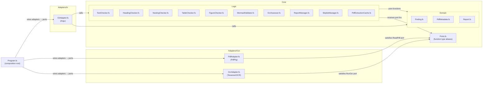

# Technical Documentation

## Architecture

crane-cli adopts the hexagonal (ports-and-adapters) architecture convention defined in
[repo-governance/development/pattern/hexagonal-architecture-cli.md](../../../repo-governance/development/pattern/hexagonal-architecture-cli.md)
[Repo-grounded], extended for F#.

### Layer Map



### Directory Layout (Target State)

```
apps/crane-cli/
├── crane-cli.fsproj          # _New file_ — main project
├── project.json              # Updated Nx targets (dotnet commands)
├── tessdata/
│   └── eng.traineddata       # Copied from archived/crane-cli/tessdata/
└── src/
    ├── Core/
    │   ├── Ports.fs           # _New file_ — port function type aliases
    │   ├── Domain/
    │   │   ├── Finding.fs     # _New file_
    │   │   ├── PdfMetadata.fs # _New file_
    │   │   └── Report.fs      # _New file_
    │   └── Logic/
    │       ├── TextChecker.fs       # _New file_
    │       ├── HeadingChecker.fs    # _New file_
    │       ├── NestingChecker.fs    # _New file_
    │       ├── TableChecker.fs      # _New file_
    │       ├── FigureChecker.fs     # _New file_
    │       ├── MermaidValidator.fs  # _New file_
    │       ├── OcrAssessor.fs       # _New file_
    │       ├── ReportManager.fs     # _New file_
    │       ├── SkiplistManager.fs   # _New file_
    │       └── PdfExtractionCache.fs # _New file_
    ├── Adapters/
    │   ├── In/
    │   │   └── CliAdapter.fs   # _New file_ — Argu-based CLI parsing
    │   └── Out/
    │       ├── PdfAdapter.fs   # _New file_ — PdfPig PDF reading
    │       └── OcrAdapter.fs   # _New file_ — TesseractOCR
    └── Program.fs              # _New file_ — composition root + entry point

tests/
├── unit/
│   ├── crane-cli-unit-tests.fsproj  # _New file_
│   ├── Steps/                       # _New directory_ — TickSpec step bindings
│   │   ├── BddState.fs
│   │   ├── PdfSteps.fs
│   │   ├── TextSteps.fs
│   │   ├── HeadingSteps.fs
│   │   ├── NestingSteps.fs
│   │   ├── TableSteps.fs
│   │   ├── FigureSteps.fs
│   │   ├── MermaidSteps.fs
│   │   ├── OcrSteps.fs
│   │   ├── ReportSteps.fs
│   │   ├── SkiplistSteps.fs
│   │   ├── CheckAllSteps.fs
│   │   └── VersionSteps.fs
│   ├── Tests/                       # _New directory_ — xUnit test modules
│   │   ├── TextCheckerTests.fs
│   │   ├── HeadingCheckerTests.fs
│   │   ├── NestingCheckerTests.fs
│   │   ├── TableCheckerTests.fs
│   │   ├── FigureCheckerTests.fs
│   │   ├── MermaidValidatorTests.fs
│   │   ├── OcrAssessorTests.fs
│   │   ├── ReportManagerTests.fs
│   │   ├── SkiplistManagerTests.fs
│   │   └── PdfExtractionCacheTests.fs
│   ├── Suite.fs                     # _New file_ — TickSpec xUnit suite
│   └── xunit.runner.json            # _New file_ — maxParallelThreads: 1
└── integration/
    ├── crane-cli-integration-tests.fsproj  # _New file_
    ├── Steps/                              # _New directory_
    │   ├── PdfSteps.fs
    │   └── OcrSteps.fs
    └── Suite.fs                           # _New file_
```

## Design Decisions

### DD-1: Function Type Aliases as Ports (not F# interfaces)

**Decision**: Ports are F# function type aliases (`type ReadPdf = string -> Result<PdfContent, PdfError>`),
not OOP interfaces.

**Rationale**: F# idiomatic pattern. No IoC container required. Adapters are plain module-level
functions that match the port type. Composition root in `Program.fs` closes over concrete
adapters and passes them as arguments (partial application). Test doubles are plain lambda
expressions — no mock framework required.

**Example**:

```fsharp
// Core/Ports.fs
module CraneCli.Core.Ports

type ReadPdf = string -> Result<PdfContent, PdfError>
type RunOcr  = string -> int -> Result<string, OcrError>
type ReadFile  = string -> Result<string, exn>
type WriteFile = string -> string -> Result<unit, exn>
type AppendReport = string -> Finding list -> Result<unit, exn>
```

```fsharp
// Core/Logic/TextChecker.fs — receives port as argument
module CraneCli.Core.Logic.TextChecker

let check (readPdf: ReadPdf) (textPath: string) (pdfPath: string) : Finding list =
    // pure orchestration — readPdf is injected
    ...
```

### DD-2: Impureim Sandwich Pattern

**Decision**: Apply the Impureim Sandwich at the composition root and CLI adapter boundary.
`Program.fs` is the only place where side effects are assembled and executed.

**Structure**:

1. Impure (In): CLI adapter parses args, reads config files via adapters
2. Pure: Core/Logic functions compute findings
3. Impure (Out): Results printed to stdout, reports written via adapters

**Rationale**: Keeps all Core/Logic modules testable as pure functions. The archived F# source
used a similar pattern implicitly; this plan makes it explicit via `Core/Ports.fs`.

### DD-3: Test Framework — TickSpec 2.0.5 + xUnit 2.9.2

**Decision**: Use TickSpec 2.0.5 [Web-cited, 2026-05-27,
https://www.nuget.org/packages/TickSpec/2.0.5 — "2.0.5 released 2026-05-21"] for BDD step
binding (both unit-level step definitions and integration tests) and xUnit 2.9.2
[Repo-grounded, `archived/crane-cli/tests/crane-cli-unit-tests.fsproj`] as the test runner
host.

**Rationale**: The archived F# source used TickSpec 2.0.4 + xUnit 2.9.2 [Repo-grounded,
`archived/crane-cli/tests/crane-cli-unit-tests.fsproj`]. Reqnroll was evaluated and rejected
because it requires a C# host project for F# codebases (per research [Judgment call — see
resolved design decisions in plan prompt]). TickSpec is F#-native and requires no C# host.

**Key difference from archived source**: TickSpec version bumped from 2.0.4 → 2.0.5
[Web-cited, 2026-05-27, https://www.nuget.org/packages/TickSpec/2.0.5 — "2.0.5 released
2026-05-21"]. xUnit remains at 2.9.2.

### DD-4: xunit.runner.json — maxParallelThreads: 1

**Decision**: Set `maxParallelThreads: 1` in `xunit.runner.json` for both unit and integration
test projects.

**Rationale**: TickSpec's reflection-based step binding uses a shared StepDefinitions assembly
scan. Parallel scenario execution can cause non-deterministic binding failures. The archived
source used this setting [Repo-grounded, `archived/crane-cli/tests/xunit.runner.json`].

### DD-5: F# Compile Order (explicit .fsproj listing)

**Decision**: Every `.fs` file must be listed explicitly in `crane-cli.fsproj` in dependency
order (types before consumers). This is an F# compiler requirement — not optional.

**Order** (main project):

1. `Core/Domain/Finding.fs`
2. `Core/Domain/PdfMetadata.fs`
3. `Core/Domain/Report.fs`
4. `Core/Ports.fs`
5. `Core/Logic/TextChecker.fs`
6. `Core/Logic/HeadingChecker.fs`
7. `Core/Logic/NestingChecker.fs`
8. `Core/Logic/TableChecker.fs`
9. `Core/Logic/FigureChecker.fs`
10. `Core/Logic/MermaidValidator.fs`
11. `Core/Logic/OcrAssessor.fs`
12. `Core/Logic/ReportManager.fs`
13. `Core/Logic/SkiplistManager.fs`
14. `Core/Logic/PdfExtractionCache.fs`
15. `Adapters/Out/PdfAdapter.fs`
16. `Adapters/Out/OcrAdapter.fs`
17. `Adapters/In/CliAdapter.fs`
18. `Program.fs`

### DD-6: Hexagonal Architecture Convention Update

**Decision**: Update `repo-governance/development/pattern/hexagonal-architecture-cli.md`
[Repo-grounded] to add the F# hexagonal layout to the layer map table alongside the existing
Rust layout. The F# layout departs from the Rust `src/commands/` + `src/domain/` flat structure
by using `src/Core/` and `src/Adapters/` subdirectories.

**Rationale**: The convention document currently only documents Rust and Go layouts
[Repo-grounded]. Adding the F# layout makes it the authoritative reference for this rewrite
and future F# CLI work.

### DD-7: Remove-Inactive Plan Amendment

**Decision**: Phase 1 (Dotnet cleanup) of `plans/in-progress/remove-inactive-tech-stack-remnants/`
must be replaced with a no-op note before any crane-cli F# code is written. The specific items
that must be excluded are:

- `open-sharia-enterprise.sln` — keep (or remove only if no active F# projects reference it;
  crane-cli will not use a `.sln` file, so this item is safe to remove independently)
- `.github/actions/setup-dotnet/` — **keep** (crane-cli-integration.yml uses it [Repo-grounded])
- `scripts/format-csharp.sh` — safe to remove (no active C# projects)
- C#/F# docs — **keep F# docs** (crane-cli is F#); C# docs can be removed
- `.claude/agents/swe-csharp-dev.md` + `.opencode/agents/swe-csharp-dev.md` — safe to remove
  (C# only, no active C# project)
- `.claude/agents/swe-fsharp-dev.md` + `.opencode/agents/swe-fsharp-dev.md` — **keep**
  (crane-cli is F#, swe-fsharp-dev is the primary executor for this plan)
- `.claude/skills/swe-programming-csharp/` — safe to remove
- `.claude/skills/swe-programming-fsharp/` — **keep** (active F# project)
- `.github/workflows/crane-cli-integration.yml` setup-dotnet reference — **keep** (this plan
  keeps it and extends it)
- `pr-quality-gate.yml` dotnet detection — review: if crane-cli uses `lang:dotnet` or
  `lang:fsharp` tag in project.json, the gate should remain active

The delivery.md for remove-inactive must be amended to reflect these exclusions. The simplest
safe approach is: replace Phase 1 with a note that reads "Phase 1 (Dotnet cleanup) is deferred
— F# is active in crane-cli; see plans/in-progress/rewrite-crane-cli-fsharp/."

## Validated Dependencies

All package versions below are verified against NuGet [Web-cited, 2026-05-27] or the archived
F# source [Repo-grounded].

| Package                     | Version | Source                                                                                                                            | Notes                                                                    |
| --------------------------- | ------- | --------------------------------------------------------------------------------------------------------------------------------- | ------------------------------------------------------------------------ |
| `Argu`                      | 6.2.5   | [Repo-grounded, `archived/crane-cli/crane-cli.fsproj`]                                                                            | F# CLI arg parser, .NET 10 compatible                                    |
| `PdfPig`                    | 0.1.14  | [Repo-grounded, `archived/crane-cli/crane-cli.fsproj`]                                                                            | Pre-1.0; no SemVer guarantee; pins to last tested version                |
| `TesseractOCR`              | 5.5.2   | [Repo-grounded, `archived/crane-cli/crane-cli.fsproj`]                                                                            | Distinct from `Tesseract` by charlesw; .NET 10 compatible                |
| `FSharp.SystemTextJson`     | 1.4.36  | [Repo-grounded, `archived/crane-cli/crane-cli.fsproj`]                                                                            | F# DU serialization                                                      |
| `F23.StringSimilarity`      | 7.0.1   | [Repo-grounded, `archived/crane-cli/crane-cli.fsproj`]                                                                            | String similarity for text completeness checks                           |
| `xunit`                     | 2.9.2   | [Repo-grounded, `archived/crane-cli/tests/crane-cli-unit-tests.fsproj`]                                                           | Test runner host                                                         |
| `xunit.runner.visualstudio` | 2.8.2   | [Repo-grounded, `archived/crane-cli/tests/crane-cli-unit-tests.fsproj`]                                                           | VS test adapter                                                          |
| `Microsoft.NET.Test.Sdk`    | 17.11.1 | [Repo-grounded, `archived/crane-cli/tests/crane-cli-unit-tests.fsproj`]                                                           | .NET test SDK                                                            |
| `TickSpec`                  | 2.0.5   | [Web-cited, 2026-05-27, https://www.nuget.org/packages/TickSpec/2.0.5 — "2.0.5 released 2026-05-21"]                              | Bumped from 2.0.4 (archived) to current stable                           |
| `coverlet.collector`        | TBD     | [Judgment call — executor must verify current stable version on https://www.nuget.org/packages/coverlet.collector before pinning] | Required by test:quick `/p:CollectCoverage=true`; not in archived source |

## Nx Target Mapping (Rust → F#)

| Nx Target          | Rust Command                                       | F# Replacement Command                                                                                                                                                |
| ------------------ | -------------------------------------------------- | --------------------------------------------------------------------------------------------------------------------------------------------------------------------- |
| `build`            | `cargo build --release`                            | `dotnet publish apps/crane-cli/crane-cli.fsproj -c Release -o apps/crane-cli/dist`                                                                                    |
| `typecheck`        | `cargo check --all-targets`                        | `dotnet build apps/crane-cli/crane-cli.fsproj --no-restore`                                                                                                           |
| `lint`             | `cargo fmt --check && cargo clippy`                | `fantomas --check apps/crane-cli/src && dotnet fsharplint lint apps/crane-cli/crane-cli.fsproj`                                                                       |
| `fmt`              | `cargo fmt`                                        | `fantomas apps/crane-cli/src`                                                                                                                                         |
| `fmt:check`        | `cargo fmt -- --check`                             | `fantomas --check apps/crane-cli/src`                                                                                                                                 |
| `test:unit`        | `cargo test --test unit`                           | `dotnet test apps/crane-cli/tests/unit/crane-cli-unit-tests.fsproj`                                                                                                   |
| `test:quick`       | `cargo llvm-cov --test unit --fail-under-lines 95` | `dotnet test apps/crane-cli/tests/unit/crane-cli-unit-tests.fsproj /p:CollectCoverage=true /p:Threshold=95 /p:ThresholdType=line`                                     |
| `test:integration` | `cargo test --test integration`                    | `dotnet test apps/crane-cli/tests/integration/crane-cli-integration-tests.fsproj`                                                                                     |
| `spec-coverage`    | `rhino-cli spec-coverage validate`                 | `cargo run --release --quiet --manifest-path apps/rhino-cli/Cargo.toml -- spec-coverage validate --shared-steps specs/apps/crane/behavior/cli/gherkin apps/crane-cli` |
| `dev`              | `cargo run -- --help`                              | `dotnet run --project apps/crane-cli/crane-cli.fsproj -- --help`                                                                                                      |
| `run`              | `cargo run --`                                     | `dotnet run --project apps/crane-cli/crane-cli.fsproj --`                                                                                                             |

## Testing Strategy

Tests are written **before** implementation (Red → Green → Refactor). The Gherkin feature files
in `specs/apps/crane/behavior/cli/gherkin/` [Repo-grounded] are the natural source of first
failing tests.

| Test Level          | Framework              | What it covers                                                     | Cacheable |
| ------------------- | ---------------------- | ------------------------------------------------------------------ | --------- |
| Unit (xUnit pure)   | xUnit 2.9.2            | Each Core/Logic module — pure function inputs → outputs            | Yes       |
| Unit (TickSpec BDD) | TickSpec 2.0.5 + xUnit | Full Gherkin scenarios (all 10 feature files) via step definitions | Yes       |
| Integration         | TickSpec 2.0.5 + xUnit | PDF and OCR scenarios requiring real files + tesseract             | No        |

**Coverage target**: ≥95% line coverage on unit test run (matching Rust target and original F#
target from `2026-05-15__crane-cli`). [Judgment call — matches prior plan targets.]

**Coverage tool**: `coverlet.collector` NuGet package (version TBD — executor must verify
current stable on https://www.nuget.org/packages/coverlet.collector before adding
`<PackageReference>` to the unit test `.fsproj`) with `/p:CollectCoverage=true` flag to
`dotnet test`. Threshold enforced via `/p:Threshold=95 /p:ThresholdType=line`. The archived
F# source did not include `coverlet.collector` — this is a new addition. [Judgment call —
version not pinned at authoring time; executor pins after NuGet verification.]

## CI Impact

**File to update**: `.github/workflows/crane-cli-integration.yml` [Repo-grounded]

Current content uses:

```yaml
- uses: ./.github/actions/setup-dotnet # already present
- run: npx nx run crane-cli:test:integration
```

The `setup-dotnet` step already exists [Repo-grounded]. The `run` step already calls the Nx
target, which will be updated to `dotnet test` in `project.json`. No structural change to the
workflow file is needed — only the Nx target implementation changes.

The `cargo test` invocation was inside `npx nx run crane-cli:test:integration`, not hardcoded
in the workflow. After updating `project.json`, the CI workflow passes through unchanged.

**Action kept**: `.github/actions/setup-dotnet/` [Repo-grounded] — must NOT be deleted.
The remove-inactive plan amendment ensures this.

## Rollback

If this rewrite is abandoned mid-execution:

1. `git mv archived/crane-cli-rust/ apps/crane-cli/` restores the Rust source
2. Revert `apps/crane-cli/project.json` to the Rust targets (available in git history)
3. Revert the remove-inactive plan amendment (restore Phase 1 dotnet cleanup)
4. The F# partial implementation remains in `archived/crane-cli-rust/` — not in `apps/`

Rollback is safe at any phase boundary because each phase ends with a committed quality gate.
